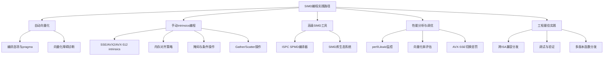
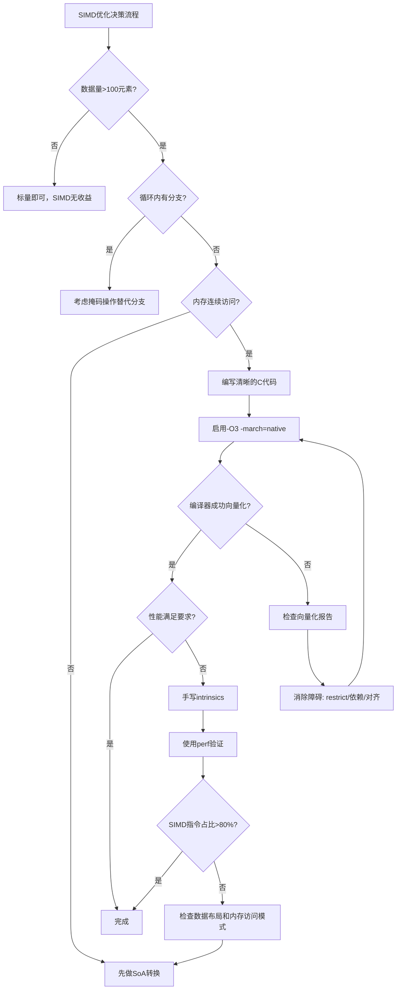

## 2.4 SIMD向量化编程

在第1.7节中，我们从微架构层面理解了SIMD（Single Instruction, Multiple Data）的硬件原理——一条指令同时操作多个数据元素，实现数据级并行。本节从**实操角度**出发，系统讲解如何编写、调试和优化SIMD代码：从编译器自动向量化到手写intrinsics，从内存对齐到性能分析，从调试验证到工程部署，覆盖完整的工程实践链路。



### 2.4.0 SIMD编程的硬件基础回顾

在深入编程实践之前，回顾几个与编程直接相关的硬件约束，这些约束决定了代码性能的上限：

| 硬件特性 | 编程影响 | 典型值（Skylake+） |
|---------|---------|-------------------|
| SIMD寄存器宽度 | 决定每次处理的元素数（float） | SSE=4, AVX2=8, AVX-512=16 |
| SIMD执行端口 | 每周期可发射的SIMD指令数 | 2个向量端口（Port 0/5） |
| FMA延迟 | 累加操作的最小等待周期 | 4周期（AVX2 FMA） |
| FMA吞吐量 | 每周期可完成的FMA操作数 | 2个（Port 0/5） |
| 缓存行大小 | 决定内存加载的粒度 | 64字节（16个float） |
| L1带宽 | 每周期可加载的数据量 | 2×32字节（2个load端口） |
| AVX-SSE切换惩罚 | ISA切换的额外开销 | ~70周期（Skylake） |

**关键认知**：SIMD编程的本质是**填满执行端口**。以FMA为例，Skylake每周期可在两个端口各执行一条FMA（256位），理论峰值为 2×8×2=32个浮点乘加/周期。编程时需要确保数据加载速度能喂饱这两个端口，否则SIMD单元会因数据饥饿而空转。

### 2.4.1 编译器自动向量化

现代编译器（GCC 12+、Clang 16+、MSVC 2022+）的自动向量化能力已经非常强大。在大多数场景下，**编写对编译器友好的代码**比手写intrinsics更高效、更可维护。自动向量化的核心挑战是：让编译器确信你的循环可以安全地并行化。

#### 启用与报告

```bash
# GCC：启用自动向量化并查看优化报告
# -O3 默认开启 -ftree-vectorize（GCC 4.9+）
gcc -O3 -march=native -ftree-vectorize -fopt-info-vec-optimized matrix.c

# 查看未能向量化的原因（最关键的调试手段）
gcc -O3 -march=native -ftree-vectorize -fopt-info-vec-missed matrix.c

# 显示全部向量化信息（包括循环展开）
gcc -O3 -march=native -ftree-vectorize -fopt-info-vec-all matrix.c

# 生成汇编后检查SIMD指令（验证向量化是否生效）
gcc -O3 -march=native -S -o output.s matrix.c
grep -cE "v(add|sub|mul|fma|mov)[a-z]" output.s  # SIMD指令数
grep -cE "v[a-z]" output.s                         # 总向量化指令

# Clang的对应选项
clang -O3 -march=native -Rpass=vectorize matrix.c          # 成功向量化
clang -O3 -march=native -Rpass-missed=vectorize matrix.c   # 未能向量化
clang -O3 -march=native -Rpass-analysis=vectorize matrix.c # 分析原因

# Clang还可以输出优化报告HTML（可视化展示）
clang -O3 -march=native -Rpass-missed=vectorize -fsave-optimization-record matrix.c
# 生成 matrix.opt.yaml 文件
```

#### 向量化的六大障碍与消除方法

当编译器报告"未向量化"时，通常是以下六类障碍之一。理解这些障碍是掌握自动向量化的关键：

| 障碍 | 编译器诊断信息 | 根因 | 消除方法 |
|------|---------------|------|---------|
| 指针别名（Pointer Aliasing） | "possible aliasing" | 编译器无法确定两个指针是否指向同一内存 | 使用 `restrict` 关键字 |
| 数据依赖（Data Dependency） | "loop maybe interleaved" | 当前迭代读取前一迭代的写入结果 | 重构算法消除循环间依赖 |
| 不确定的迭代次数 | "loop bound can't be computed" | 循环上界含运行时变量，编译器无法推断 | 明确循环边界，或使用 `#pragma omp simd` |
| 复杂控制流 | "loop body too complex" | 循环内含函数调用、深层嵌套if-else | 内联函数、扁平化分支、用掩码替换条件分支 |
| 非连续内存访问 | "non-consecutive memory access" | 结构体数组（AoS）导致跨步加载 | 改为数组的结构体（SoA）布局 |
| 类型不一致 | "type conversion needed" | 循环内混合int/float/double | 统一数据类型，或显式类型转换 |

**障碍一：指针别名的消除**

指针别名是自动向量化的头号杀手。编译器默认假设任意两个指针可能指向同一内存区域，导致它不敢将循环并行化（因为并行写入可能产生数据竞争）。

```c
// 未优化版本：编译器假设 a 和 c 可能重叠，不敢向量化
void transform_bad(float* a, float* c, int n) {
    for (int i = 0; i < n; i++) {
        c[i] = a[i] * 2.0f + 1.0f;
    }
}

// 使用 restrict 告诉编译器：a 和 c 不会重叠
// GCC/Clang: __restrict 或 __restrict__
// MSVC: __restrict
void transform_good(float* __restrict__ a, float* __restrict__ c, int n) {
    for (int i = 0; i < n; i++) {
        c[i] = a[i] * 2.0f + 1.0f;
    }
}

// 另一种方法：使用 restrict 指针参数
void transform_best(float* __restrict__ c, const float* __restrict__ a, int n) {
    for (int i = 0; i < n; i++) {
        c[i] = a[i] * 2.0f + 1.0f;
    }
}

// 还可以通过 __builtin_assume 帮助编译器推断（GCC 13+/Clang）
void transform_assume(float* __restrict__ c, const float* __restrict__ a, int n) {
    // 告诉编译器 n 总是 8 的倍数，消除余项处理开销
    __builtin_assume(n % 8 == 0);
    for (int i = 0; i < n; i++) {
        c[i] = a[i] * 2.0f + 1.0f;
    }
}
```

**障碍二：数据依赖的重构**

```c
// 前缀和（prefix sum）：每个元素依赖前一个，无法直接向量化
void prefix_sum_bad(float* data, int n) {
    for (int i = 1; i < n; i++) {
        data[i] += data[i-1];  // 经典循环依赖
    }
}

// 解法1：使用SSE/AVX的并行前缀和算法
// 算法思路：将n个元素分成若干块（每块4个float），
// 块内用SIMD shuffle做并行扫描，块间用串行传播
void prefix_sum_simd(float* data, int n) {
    int i;

    // 阶段1：块内并行扫描（每块4个float，用shuffle级联实现块内前缀和）
    for (i = 0; i + 4 <= n; i += 4) {
        __m128 v = _mm_loadu_ps(&amp;data[i]);
        // shuffle级联法：第0位不动，第1位+=第0位，第2位+=第1位，第3位+=第2位
        // _mm_slli_si128 将128位整数左移（按字节），空出的位填0
        // 移4字节=1个float，移8字节=2个float
        v = _mm_add_ps(v, _mm_castsi128_ps(
            _mm_slli_si128(_mm_castps_si128(v), 4)));   // 每个元素 += 左边1个元素
        v = _mm_add_ps(v, _mm_castsi128_ps(
            _mm_slli_si128(_mm_castps_si128(v), 8)));   // 每个元素 += 左边2个元素
        _mm_storeu_ps(&amp;data[i], v);
    }

    // 阶段2：跨块串行扫描（处理每个块最后一个元素的累加）
    // 此时每个块的4个元素已各自包含块内前缀和，
    // 但块与块之间还没有传播
    for (i = 4; i < n; i += 4) {
        float last = data[i - 1];  // 前一个块的最后一个元素（块内前缀和的总值）
        data[i]   += last;
        data[i+1] += last;
        data[i+2] += last;
        data[i+3] += last;
    }
}
```

**障碍三：AoS到SoA的数据布局转换**

结构体数组（Array of Structures, AoS）是自动向量化的天然阻碍——每个SIMD加载都会跨越多个结构体实例的不连续字段：

```c
// AoS布局：SIMD加载会拿到不连续的x坐标，无法高效向量化
struct Particle { float x, y, z, mass; };
struct Particle particles[N];
// 内存布局: [x0,y0,z0,m0, x1,y1,z1,m1, x2,y2,z2,m2, ...]
// 一条256位load只能拿到2个粒子的全部字段，而非8个粒子的x坐标

// SoA布局：所有x坐标连续存储，SIMD加载一次拿到8/16个x
struct ParticlesSoA {
    float* x;  // [x0, x1, x2, ..., xN]  连续
    float* y;  // [y0, y1, y2, ..., yN]  连续
    float* z;  // [z0, z1, z2, ..., zN]  连续
    float* mass;
};

// AoS → SoA 转换（使用SIMD交错/解交错模式）
// 利用 unpacklo/unpackhi 指令实现高效的转置
void aos_to_soa(const struct Particle* aos, struct ParticlesSoA* soa, int n) {
    int i;
    for (i = 0; i + 4 <= n; i += 4) {
        // 加载4个连续的Particle结构体
        // 使用maskload按偏移加载各个字段
        __m128 x = _mm_maskload_ps(&amp;aos[i].x, _mm_setr_epi32(-1,-1,-1,-1));  // 跨步16字节
        __m128 y = _mm_maskload_ps(&amp;aos[i].y, _mm_setr_epi32(-1,-1,-1,-1));
        __m128 z = _mm_maskload_ps(&amp;aos[i].z, _mm_setr_epi32(-1,-1,-1,-1));
        __m128 m = _mm_maskload_ps(&amp;aos[i].mass, _mm_setr_epi32(-1,-1,-1,-1));
        _mm_storeu_ps(&amp;soa->x[i], x);
        _mm_storeu_ps(&amp;soa->y[i], y);
        _mm_storeu_ps(&amp;soa->z[i], z);
        _mm_storeu_ps(&amp;soa->mass[i], m);
    }
    // 标量余项
    for (; i < n; i++) {
        soa->x[i] = aos[i].x;
        soa->y[i] = aos[i].y;
        soa->z[i] = aos[i].z;
        soa->mass[i] = aos[i].mass;
    }
}

// 转换后的向量化计算（高效！连续内存访问）
void compute_forces_soa(const struct ParticlesSoA* soa, float* out, int n) {
    for (int i = 0; i + 8 <= n; i += 8) {
        __m256 xi = _mm256_loadu_ps(&amp;soa->x[i]);    // 一条指令加载8个x
        __m256 yi = _mm256_loadu_ps(&amp;soa->y[i]);    // 一条指令加载8个y
        __m256 zi = _mm256_loadu_ps(&amp;soa->z[i]);    // 一条指令加载8个z
        __m256 mi = _mm256_loadu_ps(&amp;soa->mass[i]); // 一条指令加载8个mass
        // 向量化力计算示例：距离平方 = dx²+dy²+dz²
        __m256 r2 = _mm256_fmadd_ps(xi, xi,
                    _mm256_fmadd_ps(yi, yi,
                    _mm256_mul_ps(zi, zi)));
        // ... 更多计算
    }
}
```

#### 编译指导（Pragmas）

当编译器因保守分析而拒绝向量化时，可以使用pragma明确告知编译器：

```c
// 1. SIMD pragma：强制编译器向量化指定循环（GCC/Clang/MSVC通用）
#pragma omp simd
for (int i = 0; i < n; i++) {
    result[i] = a[i] + b[i] * c[i];
}

// 2. GCC特定：展开+向量化
#pragma GCC ivdep          // 告诉编译器循环无向量依赖（无视指针别名）
#pragma GCC unroll 4       // 展开4次
for (int i = 0; i < n; i++) {
    dst[i] = src[i] * 2.0f;
}

// 3. 指定向量化宽度（控制使用SSE/AVX/AVX-512）
#pragma omp simd simdlen(8)  // 强制使用256位宽度（8个float）
for (int i = 0; i < n; i++) {
    result[i] = a[i] * b[i];
}

// 4. 关闭特定循环的向量化（调试或特殊场景）
#pragma GCC optimize ("no-tree-vectorize")
for (int i = 0; i < n; i++) {
    // 这个循环不会被向量化
    sum += data[i];
}

// 5. Clang特有：向量化宽度和交错因子
#pragma clang loop vectorize(enable) vectorize_width(8)
#pragma clang loop interleave(enable) interleave_count(2)
for (int i = 0; i < n; i++) {
    result[i] = src[i] * scale;
}

// 6. 数组声明对齐（帮助编译器生成对齐加载指令）
float arr[64] __attribute__((aligned(64)));

// 7. OpenMP 4.0+ simd reduction
#pragma omp simd reduction(+:sum)
for (int i = 0; i < n; i++) {
    sum += data[i];
}
```

### 2.4.2 Intrinsics编程：从SSE到AVX-512

当自动向量化无法满足需求（非标准算法、特殊数据布局、极致性能要求）时，需要使用编译器内置函数（Intrinsics）手动控制SIMD指令。Intrinsics是C/C++函数接口，直接映射到硬件SIMD指令，编译器负责寄存器分配和指令调度。

#### Intrinsics编程的基本模式

```c
#include <immintrin.h>  // 包含所有SIMD intrinsic的头文件

/*
 * SIMD编程的核心模式：
 * 1. 加载（Load）：从内存到向量寄存器
 * 2. 计算（Compute）：向量寄存器上的并行操作
 * 3. 存储（Store）：从向量寄存器到内存
 * 4. 余项处理（Tail）：标量循环处理剩余元素
 *
 * 函数命名规则：
 *   _mm/si128  → 128位 SSE操作
 *   _mm256     → 256位 AVX操作
 *   _mm512     → 512位 AVX-512操作
 *
 * 操作码后缀：
 *   ps  → packed single-precision float（单精度浮点）
 *   pd  → packed double-precision float（双精度浮点）
 *   epi8/16/32/64 → 有符号整数
 *   epu8/16/32/64 → 无符号整数
 *   si128/256    → 整数（宽类型）
 */
```

#### 向量加法：三个ISA级别的完整实现

```c
#include <immintrin.h>
#include <string.h>

// ============ SSE 版本：每次处理 4 个 float（128位）============
void add_sse(float* dst, const float* src1, const float* src2, int n) {
    int i = 0;
    // SIMD主循环：每次处理4个元素
    for (; i + 4 <= n; i += 4) {
        __m128 v1 = _mm_loadu_ps(src1 + i);   // 加载4个float（未对齐）
        __m128 v2 = _mm_loadu_ps(src2 + i);
        __m128 vr = _mm_add_ps(v1, v2);       // 4个加法并行
        _mm_storeu_ps(dst + i, vr);            // 存储4个结果
    }
    // 标量余项处理
    for (; i < n; i++) {
        dst[i] = src1[i] + src2[i];
    }
}

// ============ AVX2 版本：每次处理 8 个 float（256位）============
void add_avx2(float* dst, const float* src1, const float* src2, int n) {
    int i = 0;
    for (; i + 8 <= n; i += 8) {
        __m256 v1 = _mm256_loadu_ps(src1 + i);
        __m256 v2 = _mm256_loadu_ps(src2 + i);
        __m256 vr = _mm256_add_ps(v1, v2);
        _mm256_storeu_ps(dst + i, vr);
    }
    for (; i < n; i++) {
        dst[i] = src1[i] + src2[i];
    }
}

// ============ AVX-512 版本：每次处理 16 个 float（512位）============
// 注意：AVX-512在某些CPU上会降频（AVX-512 throttling），需实测验证
void add_avx512(float* dst, const float* src1, const float* src2, int n) {
    int i = 0;
    for (; i + 16 <= n; i += 16) {
        __m512 v1 = _mm512_loadu_ps(src1 + i);
        __m512 v2 = _mm512_loadu_ps(src2 + i);
        __m512 vr = _mm512_add_ps(v1, v2);
        _mm512_storeu_ps(dst + i, vr);
    }
    for (; i < n; i++) {
        dst[i] = src1[i] + src2[i];
    }
}

// ============ 对齐版本（性能更优）============
// 对齐加载要求地址是32/64字节对齐的，否则会崩溃（不是性能问题，是SIGSEGV）
void add_avx2_aligned(float* dst, const float* src1, const float* src2, int n) {
    int i = 0;
    // 确保使用对齐的加载（_mm256_load_ps 要求32字节对齐）
    for (; i + 8 <= n; i += 8) {
        __m256 v1 = _mm256_load_ps(src1 + i);   // 对齐加载
        __m256 v2 = _mm256_load_ps(src2 + i);
        __m256 vr = _mm256_add_ps(v1, v2);
        _mm256_store_ps(dst + i, vr);            // 对齐存储
    }
    for (; i < n; i++) {
        dst[i] = src1[i] + src2[i];
    }
}

// ============ 带循环展开的AVX2版本（4路展开）============
// 展开减少循环控制开销，增加指令级并行度
void add_avx2_unrolled(float* dst, const float* src1, const float* src2, int n) {
    int i = 0;
    // 4路展开：每次处理32个float（4 × 8）
    for (; i + 32 <= n; i += 32) {
        __m256 v1_0 = _mm256_loadu_ps(src1 + i);
        __m256 v1_1 = _mm256_loadu_ps(src1 + i + 8);
        __m256 v1_2 = _mm256_loadu_ps(src1 + i + 16);
        __m256 v1_3 = _mm256_loadu_ps(src1 + i + 24);
        __m256 v2_0 = _mm256_loadu_ps(src2 + i);
        __m256 v2_1 = _mm256_loadu_ps(src2 + i + 8);
        __m256 v2_2 = _mm256_loadu_ps(src2 + i + 16);
        __m256 v2_3 = _mm256_loadu_ps(src2 + i + 24);
        _mm256_storeu_ps(dst + i,       _mm256_add_ps(v1_0, v2_0));
        _mm256_storeu_ps(dst + i + 8,   _mm256_add_ps(v1_1, v2_1));
        _mm256_storeu_ps(dst + i + 16,  _mm256_add_ps(v1_2, v2_2));
        _mm256_storeu_ps(dst + i + 24,  _mm256_add_ps(v1_3, v2_3));
    }
    // 处理剩余的8元素块
    for (; i + 8 <= n; i += 8) {
        __m256 v1 = _mm256_loadu_ps(src1 + i);
        __m256 v2 = _mm256_loadu_ps(src2 + i);
        _mm256_storeu_ps(dst + i, _mm256_add_ps(v1, v2));
    }
    for (; i < n; i++) {
        dst[i] = src1[i] + src2[i];
    }
}
```

#### 水平归约（Horizontal Reduction）详解

水平归约是SIMD编程中最具技巧性的操作之一——将N个向量元素折叠为一个标量。它是点积、求和、求最大值等操作的核心。

```c
#include <immintrin.h>

// ============ 方法1：shuffle级联法（最快，推荐）============
// 将8个float累加到1个float，时间复杂度O(log n)
static inline float hsum_avx2(__m256 v) {
    // 第一步：将256位拆为两个128位并相加
    __m128 hi = _mm256_extractf128_ps(v, 1);   // 取高128位
    __m128 lo = _mm256_castps256_ps128(v);      // 低128位
    __m128 s  = _mm_add_ps(lo, hi);             // 合并为4个float
    // 第二步：4→1的级联折叠
    __m128 shuf = _mm_movehdup_ps(s);           // [1,1,3,3]
    __m128 sums = _mm_add_ps(s, shuf);          // [0+1,1+1,2+3,3+3]
    shuf = _mm_movehl_ps(shuf, sums);           // [2+3,3+3,1,3]
    sums = _mm_add_ss(sums, shuf);              // [0+1+2+3, _, _, _]
    return _mm_cvtss_f32(sums);
}

// ============ 方法2：存储到数组后标量求和（简单但慢）============
static inline float hsum_store_avx2(__m256 v) {
    float temp[8];
    _mm256_storeu_ps(temp, v);
    return temp[0] + temp[1] + temp[2] + temp[3] +
           temp[4] + temp[5] + temp[6] + temp[7];
}

// ============ 方法3：hadd指令法（SSE3+，但通常不如shuffle）============
static inline float hsum_hadd_avx2(__m256 v) {
    // hadd是水平相邻元素相加，需要3次才能完成8→1
    __m128 lo = _mm256_castps256_ps128(v);
    __m128 hi = _mm256_extractf128_ps(v, 1);
    lo = _mm_hadd_ps(lo, lo);   // [0+1, 2+3, 0+1, 2+3]
    hi = _mm_hadd_ps(hi, hi);   // [4+5, 6+7, 4+5, 6+7]
    lo = _mm_hadd_ps(lo, hi);   // [0+1+2+3, ..., 4+5+6+7, ...]
    lo = _mm_hadd_ps(lo, lo);   // [0+1+2+3+4+5+6+7, ...]
    return _mm_cvtss_f32(lo);
}

// ============ 16元素归约（AVX-512）============
static inline float hsum_avx512(__m512 v) {
    __m256 lo = _mm512_castps512_ps256(v);
    __m256 hi = _mm512_extractf32x8_ps(v, 1);
    __m256 s256 = _mm256_add_ps(lo, hi);
    return hsum_avx2(s256);
}
```

#### 向量点积：归约操作的实现

点积是向量化编程中最常见也最容易出错的操作——它需要将向量结果"折叠"为标量，称为**归约（Reduction）**。

```c
#include <immintrin.h>

// ============ AVX2 点积（使用FMA指令 + 多累加器）============
// FMA (Fused Multiply-Add)：a*b + c，在一条指令中完成，减少舍入误差
// 多累加器策略：打破FMA的4周期延迟依赖，利用指令级并行
float dot_product_avx2(const float* a, const float* b, int n) {
    // 4个独立累加器：每个累加器的FMA不依赖前一个
    __m256 sum0 = _mm256_setzero_ps();
    __m256 sum1 = _mm256_setzero_ps();
    __m256 sum2 = _mm256_setzero_ps();
    __m256 sum3 = _mm256_setzero_ps();
    int i = 0;

    // 4路展开，每次处理32个float（4 × 8）
    for (; i + 32 <= n; i += 32) {
        __m256 a0 = _mm256_loadu_ps(a + i);
        __m256 b0 = _mm256_loadu_ps(b + i);
        __m256 a1 = _mm256_loadu_ps(a + i + 8);
        __m256 b1 = _mm256_loadu_ps(b + i + 8);
        __m256 a2 = _mm256_loadu_ps(a + i + 16);
        __m256 b2 = _mm256_loadu_ps(b + i + 16);
        __m256 a3 = _mm256_loadu_ps(a + i + 24);
        __m256 b3 = _mm256_loadu_ps(b + i + 24);

        sum0 = _mm256_fmadd_ps(a0, b0, sum0);  // sum0 += a0 * b0
        sum1 = _mm256_fmadd_ps(a1, b1, sum1);
        sum2 = _mm256_fmadd_ps(a2, b2, sum2);
        sum3 = _mm256_fmadd_ps(a3, b3, sum3);
    }
    // 合并4路累加器
    sum0 = _mm256_add_ps(sum0, sum1);
    sum2 = _mm256_add_ps(sum2, sum3);
    sum0 = _mm256_add_ps(sum0, sum2);

    // 处理剩余的8元素块
    for (; i + 8 <= n; i += 8) {
        __m256 va = _mm256_loadu_ps(a + i);
        __m256 vb = _mm256_loadu_ps(b + i);
        sum0 = _mm256_fmadd_ps(va, vb, sum0);
    }

    float result = hsum_avx2(sum0);

    // 标量余项
    for (; i < n; i++) {
        result += a[i] * b[i];
    }
    return result;
}

// ============ SSE4.1 点积（使用DPPS指令）============
// DPPS（Dot Product of Packed Single-precision）可一步完成部分归约
float dot_product_sse41(const float* a, const float* b, int n) {
    __m128 sum = _mm_setzero_ps();
    int i = 0;
    for (; i + 4 <= n; i += 4) {
        __m128 va = _mm_loadu_ps(a + i);
        __m128 vb = _mm_loadu_ps(b + i);
        // DPPS：点积并累加
        // 立即数 0xFF 表示：对所有4个float做乘加，结果累加到所有通道
        sum = _mm_dp_ps(va, vb, 0xFF);
    }
    // 水平归约
    float temp[4];
    _mm_storeu_ps(temp, sum);
    float result = temp[0] + temp[1] + temp[2] + temp[3];

    for (; i < n; i++) {
        result += a[i] * b[i];
    }
    return result;
}

// ============ AVX-512 点积（掩码归约）============
float dot_product_avx512(const float* a, const float* b, int n) {
    __m512 sum = _mm512_setzero_ps();
    int i = 0;
    for (; i + 16 <= n; i += 16) {
        __m512 va = _mm512_loadu_ps(a + i);
        __m512 vb = _mm512_loadu_ps(b + i);
        sum = _mm512_fmadd_ps(va, vb, sum);
    }
    float result = hsum_avx512(sum);
    for (; i < n; i++) {
        result += a[i] * b[i];
    }
    return result;
}
```

#### SIMD优化的矩阵乘法

矩阵乘法是SIMD优化的标志性问题。下面展示从朴素到高度优化的演进过程：

```c
// ============ 朴素版本：O(N^3)，缓存不友好 ============
void matmul_naive(float* A, float* B, float* C, int N) {
    for (int i = 0; i < N; i++)
        for (int j = 0; j < N; j++) {
            float sum = 0;
            for (int k = 0; k < N; k++)
                sum += A[i*N+k] * B[k*N+j];
            C[i*N+j] = sum;
        }
}
// 问题：B矩阵按列访问，缓存命中率极低

// ============ 循环重排版本：改善B的访问模式 ============
void matmul_reorder(float* A, float* B, float* C, int N) {
    // 将 k-j 循环对调，使B按行访问
    memset(C, 0, N * N * sizeof(float));
    for (int i = 0; i < N; i++)
        for (int k = 0; k < N; k++) {
            float a_ik = A[i*N+k];
            for (int j = 0; j < N; j++)
                C[i*N+j] += a_ik * B[k*N+j];
        }
}

// ============ SIMD版本：j方向向量化 ============
void matmul_simd(float* A, float* B, float* C, int N) {
    for (int i = 0; i < N; i++) {
        // j方向每次处理8个float
        int j = 0;
        for (; j + 8 <= N; j += 8) {
            __m256 sum = _mm256_setzero_ps();
            for (int k = 0; k < N; k++) {
                // 将 A[i][k] 广播到所有8个通道
                __m256 a_ik = _mm256_broadcast_ss(&amp;A[i*N+k]);
                // 一次性加载B[k][j..j+7]
                __m256 b_row = _mm256_loadu_ps(&amp;B[k*N+j]);
                sum = _mm256_fmadd_ps(a_ik, b_row, sum);
            }
            _mm256_storeu_ps(&amp;C[i*N+j], sum);
        }
        // 标量处理余项
        for (; j < N; j++) {
            float s = 0;
            for (int k = 0; k < N; k++)
                s += A[i*N+k] * B[k*N+j];
            C[i*N+j] = s;
        }
    }
}

// ============ 分块（Tiling）+ SIMD版本 ============
// 分块让数据适配L1缓存，SIMD加速计算，两者叠加效果显著
#define BLOCK 32  // 适配32KB L1D缓存：32×32×4B×3 ≈ 12KB
void matmul_tiled_simd(float* A, float* B, float* C, int N) {
    memset(C, 0, N * N * sizeof(float));
    for (int ii = 0; ii < N; ii += BLOCK) {
        for (int kk = 0; kk < N; kk += BLOCK) {
            for (int jj = 0; jj < N; jj += BLOCK) {
                int iEnd = ii + BLOCK > N ? N : ii + BLOCK;
                int kEnd = kk + BLOCK > N ? N : kk + BLOCK;
                int jEnd = jj + BLOCK > N ? N : jj + BLOCK;
                for (int i = ii; i < iEnd; i++) {
                    int j = jj;
                    for (; j + 8 <= jEnd; j += 8) {
                        __m256 sum = _mm256_loadu_ps(&amp;C[i*N+j]);
                        for (int k = kk; k < kEnd; k++) {
                            __m256 a_ik = _mm256_broadcast_ss(&amp;A[i*N+k]);
                            __m256 b_row = _mm256_loadu_ps(&amp;B[k*N+j]);
                            sum = _mm256_fmadd_ps(a_ik, b_row, sum);
                        }
                        _mm256_storeu_ps(&amp;C[i*N+j], sum);
                    }
                    // 标量余项
                    for (; j < jEnd; j++) {
                        for (int k = kk; k < kEnd; k++)
                            C[i*N+j] += A[i*N+k] * B[k*N+j];
                    }
                }
            }
        }
    }
}
```

#### 条件操作与掩码编程

真实代码中经常遇到条件分支（如 `if (a[i] > 0) b[i] = a[i]`），传统SIMD不擅长处理分支。AVX-512引入的**掩码寄存器（k寄存器）**提供了优雅的解决方案：

```c
// ============ 传统方法：使用 blend 指令 ============
// 对数组取绝对值（有分支 → 向量化困难 → 使用 blend 替代）
void abs_values_avx2(float* data, int n) {
    __m256 zero = _mm256_setzero_ps();
    __m256 sign_mask = _mm256_set1_ps(-0.0f);  // 仅符号位为1
    int i;
    for (i = 0; i + 8 <= n; i += 8) {
        __m256 v = _mm256_loadu_ps(&amp;data[i]);
        // 条件取反：如果v < 0，则 v = -v
        __m256 neg = _mm256_xor_ps(v, sign_mask);   // 按位取反符号
        __m256 cmp = _mm256_cmp_ps(v, zero, _CMP_LT_OQ);  // v < 0?
        __m256 result = _mm256_blendv_ps(v, neg, cmp);     // 条件选择
        _mm256_storeu_ps(&amp;data[i], result);
    }
    for (; i < n; i++) {
        data[i] = data[i] < 0 ? -data[i] : data[i];
    }
}

// ============ AVX-512掩码版本（更简洁）============
#include <immintrin.h>
void abs_values_avx512(float* data, int n) {
    int i;
    for (i = 0; i + 16 <= n; i += 16) {
        __m512 v = _mm512_loadu_ps(&amp;data[i]);
        // 生成掩码：k1[i] = (data[i] < 0) ? 1 : 0
        __mmask16 k1 = _mm512_cmp_ps_mask(v, _mm512_setzero_ps(), _CMP_LT_OQ);
        // 仅对k1为1的元素执行取反
        __m512 neg = _mm512_castsi512_ps(
            _mm512_xor_epi32(_mm512_castps_si512(v),
                             _mm512_set1_epi32(0x80000000)));
        _mm512_mask_storeu_ps(&amp;data[i], k1, neg);
    }
    for (; i < n; i++) {
        data[i] = data[i] < 0 ? -data[i] : data[i];
    }
}

// ============ AVX-512压缩操作（去重/过滤）============
// 从数组中提取所有大于阈值的元素（模拟WHERE子句）
int filter_greater_than(const float* src, float* dst, int n, float threshold) {
    __m512 thresh = _mm512_set1_ps(threshold);
    int dst_idx = 0;
    int i;
    for (i = 0; i + 16 <= n; i += 16) {
        __m512 v = _mm512_loadu_ps(&amp;src[i]);
        __mmask16 k = _mm512_cmp_ps_mask(v, thresh, _CMP_GT_OQ);
        // vcompresspd：根据掩码将满足条件的元素压缩到目标地址
        _mm512_mask_compress_storeu_ps(&amp;dst[dst_idx], k, v);
        dst_idx += _popcnt32(k);  // 掩码中1的个数 = 通过过滤的元素数
    }
    // 标量余项
    for (; i < n; i++) {
        if (src[i] > threshold) dst[dst_idx++] = src[i];
    }
    return dst_idx;
}
```

#### Gather/Scatter操作：非连续内存的SIMD访问

Gather操作允许从多个不连续的内存地址一次性加载数据到一个向量寄存器中，这对于稀疏数据、索引数组等场景非常有价值。

```c
// ============ Gather：从不连续地址加载 ============
// 示例：从索引数组指定的位置批量读取数据
void gather_example(const float* data, const int* indices, float* output, int n) {
    int i;
    for (i = 0; i + 8 <= n; i += 8) {
        // 根据indices[i..i+7]从data中加载8个float（地址不连续）
        __m256i idx = _mm256_loadu_si256((__m256i*)(indices + i));
        __m256 values = _mm256_i32gather_ps(data, idx, 4);  // scale=4（float大小）
        _mm256_storeu_ps(output + i, values);
    }
    for (; i < n; i++) {
        output[i] = data[indices[i]];
    }
}
// 注意：gather的性能取决于数据的分散程度
// 如果8个地址在同一缓存行内，性能接近连续加载
// 如果8个地址分散在不同缓存行，每次gather可能需要8次缓存行加载

// ============ Scatter：向不连续地址写入 ============
void scatter_example(float* data, const int* indices, const float* values, int n) {
    int i;
    for (i = 0; i + 8 <= n; i += 8) {
        __m256i idx = _mm256_loadu_si256((__m256i*)(indices + i));
        __m256 val = _mm256_loadu_ps(values + i);
        _mm256_i32scatter_ps(data, idx, val, 4);  // data[indices[i]] = values[i]
    }
    for (; i < n; i++) {
        data[indices[i]] = values[i];
    }
}
```

### 2.4.3 内存对齐策略

SIMD对内存对齐有严格要求，但现代CPU对此的处理已大幅改善。理解何时需要对齐、何时可以忽略，是实用的关键知识。

#### 对齐要求对照表

| ISA级别 | 对齐要求的加载/存储 | 未对齐的加载/存储 | 性能差异 |
|---------|-------------------|-----------------|---------|
| SSE | `_mm_load_ps`（16字节对齐） | `_mm_loadu_ps`（无要求） | Haswell+几乎无差异 |
| AVX2 | `_mm256_load_ps`（32字节对齐） | `_mm256_loadu_ps`（无要求） | Haswell+几乎无差异 |
| AVX-512 | `_mm512_load_ps`（64字节对齐） | `_mm512_loadu_ps`（无要求） | 大多数场景无差异 |

**关键认知**：在Intel Haswell（2013）及之后的CPU上，未对齐的加载/存储（`_mm_loadu_*`）只要不跨越缓存行边界（64字节），性能与对齐版本几乎相同。**只有当数据跨越缓存行边界时，未对齐访问才产生额外惩罚**（通常1-2个额外周期）。

#### 分配对齐内存

```c
#include <stdlib.h>

// ============ 方法1：aligned_alloc（C11标准，推荐）============
float* a = (float*)aligned_alloc(64, n * sizeof(float));
// 参数：对齐边界（必须是2的幂），分配大小（自动填充到对齐边界的倍数）

// ============ 方法2：posix_memalign（POSIX）============
float* b;
posix_memalign((void**)&amp;b, 64, n * sizeof(float));

// ============ 方法3：_mm_malloc / _mm_free（Intel特有）============
float* c = (float*)_mm_malloc(n * sizeof(float), 64);
_mm_free(c);  // 必须用_mm_free释放

// ============ 方法4：C++17 std::aligned_alloc ============
#include <cstdlib>
float* d = (float*)std::aligned_alloc(64, n * sizeof(float));

// ============ 方法5：C++ std::vector with aligned allocator ============
// 最安全的C++方式，自动管理内存生命周期
#include <vector>
#include <memory>
struct AlignedDeleter { void operator()(float* p) { free(p); } };
std::unique_ptr<float[], AlignedDeleter> aligned_array(
    (float*)aligned_alloc(64, n * sizeof(float)), AlignedDeleter{}
);

// ============ 方法6：编译器属性自动对齐 ============
// GCC/Clang
float arr[8] __attribute__((aligned(32)));
// MSVC
__declspec(align(32)) float arr2[8];
// C11
_Alignas(32) float arr3[8];

// ===== 实用建议 =====
// 对于大部分场景，直接用 _mm_loadu_ps/_mm256_loadu_ps 即可
// 只在以下场景才值得做对齐：
// 1. 需要使用 gather/scatter 指令（要求对齐）
// 2. 在循环中频繁加载同一块数据（对齐可避免跨行惩罚）
// 3. 使用 AVX-512 的对齐加载变体（_mm512_load_ps）
```

#### 跨缓存行检测

```c
#include <stdint.h>

// 检测一个内存区间是否跨越缓存行边界
// 缓存行通常是64字节
static inline int crosses_cache_line(const void* ptr, size_t size) {
    uintptr_t addr = (uintptr_t)ptr;
    return ((addr &amp; 63) + size) > 64;
}

// 使用示例
void safe_load(const float* data, int n) {
    if (!crosses_cache_line(data, 32)) {
        // 256位加载不跨缓存行，可以用对齐版本
        __m256 v = _mm256_load_ps(data);  // 安全
    } else {
        __m256 v = _mm256_loadu_ps(data); // 回退到未对齐版本
    }
}
```

### 2.4.4 性能分析与调优

编写SIMD代码只是第一步，验证它确实比标量版本更快才是关键。

#### 性能对比测试框架

```c
#include <stdio.h>
#include <stdlib.h>
#include <time.h>
#include <immintrin.h>

// 高精度计时
static inline double now_ms(void) {
    struct timespec ts;
    clock_gettime(CLOCK_MONOTONIC, &amp;ts);
    return ts.tv_sec * 1000.0 + ts.tv_nsec / 1e6;
}

// 标量版本
void add_scalar(float* dst, const float* a, const float* b, int n) {
    for (int i = 0; i < n; i++)
        dst[i] = a[i] + b[i];
}

// AVX2版本
void add_avx2(float* dst, const float* a, const float* b, int n) {
    int i;
    for (i = 0; i + 8 <= n; i += 8) {
        __m256 va = _mm256_loadu_ps(a + i);
        __m256 vb = _mm256_loadu_ps(b + i);
        _mm256_storeu_ps(dst + i, _mm256_add_ps(va, vb));
    }
    for (; i < n; i++) dst[i] = a[i] + b[i];
}

int main(void) {
    const int N = 10000000;  // 1000万元素
    float *a, *b, *c_scalar, *c_simd;

    // 分配内存（64字节对齐）
    posix_memalign((void**)&amp;a, 64, N * sizeof(float));
    posix_memalign((void**)&amp;b, 64, N * sizeof(float));
    posix_memalign((void**)&amp;c_scalar, 64, N * sizeof(float));
    posix_memalign((void**)&amp;c_simd, 64, N * sizeof(float));

    // 初始化
    for (int i = 0; i < N; i++) { a[i] = i * 0.01f; b[i] = i * 0.02f; }

    // 预热（加载到缓存）
    add_scalar(c_scalar, a, b, N);
    add_avx2(c_simd, a, b, N);

    // 标量计时
    double t0 = now_ms();
    for (int rep = 0; rep < 100; rep++)
        add_scalar(c_scalar, a, b, N);
    double t_scalar = (now_ms() - t0) / 100;

    // SIMD计时
    t0 = now_ms();
    for (int rep = 0; rep < 100; rep++)
        add_avx2(c_simd, a, b, N);
    double t_simd = (now_ms() - t0) / 100;

    printf("Array size: %d floats (%.1f MB)\n", N, N * 4.0 / 1e6);
    printf("Scalar: %.3f ms\n", t_scalar);
    printf("AVX2:   %.3f ms\n", t_simd);
    printf("Speedup: %.2fx\n", t_scalar / t_simd);

    // 正确性验证
    for (int i = 0; i < N; i++) {
        if (c_scalar[i] != c_simd[i]) {
            printf("MISMATCH at [%d]: scalar=%f simd=%f\n", i, c_scalar[i], c_simd[i]);
            break;
        }
    }

    free(a); free(b); free(c_scalar); free(c_simd);
    return 0;
}
```

#### 使用perf分析SIMD使用情况

```bash
# 查看CPU支持的SIMD扩展
grep -oE "(sse|avx|avx2|avx512)[a-z0-9]*" /proc/cpuinfo | sort -u

# 编译（开启AVX2和FMA）
gcc -O3 -march=native -mavx2 -mfma -o simd_test simd_test.c

# perf统计SIMD指令执行数
perf stat -e \
    fp_arith_inst_retired.128b_packed_single,\
    fp_arith_inst_retired.256b_packed_single,\
    fp_arith_inst_retired.512b_packed_single,\
    fp_arith_inst_retired.128b_packed_double,\
    fp_arith_inst_retired.256b_packed_double,\
    fp_arith_inst_retired.512b_packed_double \
    ./simd_test

# perf记录缓存未命中（判断是否受内存限制）
perf stat -e cache-misses,cache-references,L1-dcache-load-misses ./simd_test

# 使用likwid进行更详细的浮点分析
likwid-perfctr -g FLOPS_DP -C 0 ./simd_test

# 查看生成的汇编中SIMD指令占比
gcc -O3 -march=native -S -o simd_test.s simd_test.c
grep -cE "(vadd|vsub|vmul|vfma|vmov)" simd_test.s  # SIMD指令数
grep -cE "(add|sub|mul|fma|mov)" simd_test.s        # 总指令数
```

#### 向量化效率评估

```bash
# 计算向量化率
# 向量化率 = SIMD指令处理的元素数 / 总元素数
# 目标：>80% 的元素被SIMD指令处理

# GCC的向量化报告会直接给出效率
gcc -O3 -march=native -fopt-info-vec-optimized -fopt-info-vec-missed test.c 2>&amp;1 | grep -E "(vectorized|not vectorized|vectorization efficiency)"

# 典型输出分析：
# test.c:8:5: note: vectorized 80.0% of the loop  ← 好
# test.c:15:5: note: loop not vectorized: cannot identify array bounds  ← 需要修复
```

#### AVX-SSE切换惩罚

一个经常被忽视的性能陷阱：当代码在AVX指令和SSE指令之间切换时，CPU需要插入**状态切换开销**来保存/恢复SIMD寄存器状态。

```c
// 错误示例：AVX函数调用SSE函数
// 每次调用都触发AVX→SSE→AVX切换，消耗~70周期
void problematic(void) {
    avx_heavy_computation();  // 使用AVX寄存器
    sse_helper_function();    // 切换到SSE，触发状态保存
    avx_heavy_computation();  // 切换回AVX，触发状态恢复
}

// 正确做法：统一使用AVX版本的函数
// 避免ISA切换，消除~70周期的惩罚
void correct(void) {
    avx_heavy_computation();
    avx_helper_function();    // 不触发切换
    avx_heavy_computation();
}

// 编译器层面的防护
// GCC: -mavx2 隐含 -msse2 -msse3 -msse4.1 等，编译器会统一ISA
// 如果混用AVX和SSE intrinsics，编译器可能生成切换代码
// 最佳实践：在同一个编译单元中统一ISA级别
```

### 2.4.5 SIMD调试与验证

SIMD代码的常见错误非常隐蔽——程序不崩溃但结果错误，或者在某些CPU上正确而在其他CPU上崩溃。

#### 常见错误与诊断

| 错误类型 | 症状 | 诊断方法 | 修复 |
|---------|------|---------|------|
| 对齐违规 | SIGSEGV崩溃（`_mm256_load_ps`用于未对齐地址） | 检查崩溃地址是否是32/64的倍数 | 改用`_mm256_loadu_ps`或对齐分配 |
| 余项遗漏 | 部分元素未处理，结果偏小 | 添加边界检查断言 | 补全标量余项循环 |
| 混用ISA | 某些CPU上崩溃（AVX-512代码在不支持的CPU上） | 使用CPUID检查特性位 | 运行时特性检测 + 分发 |
| 精度差异 | SIMD结果与标量结果差一个ULP | 使用`-ffast-math`关闭会改变精度 | 比较时使用容差：`fabs(a-b) < 1e-6` |
| 水平归约错误 | 点积等归约操作结果错误 | 单步调试shuffle过程 | 验证每步的中间结果 |
| AVX-SSE切换惩罚 | 性能低于预期，但结果正确 | 使用perf stat检查cycles | 统一ISA级别，避免混用 |
| 隐藏的整数溢出 | 整数SIMD运算溢出产生错误结果 | 使用unsigned版本或更大的类型 | 在SIMD前验证数值范围 |

#### 运行时CPU特性检测与分发

```c
#include <cpuid.h>
#include <immintrin.h>

// 检测CPU支持的SIMD特性
static int cpu_supports_avx512f(void) {
    unsigned int eax, ebx, ecx, edx;
    __cpuid_count(7, 0, eax, ebx, ecx, edx);
    return (ebx &amp; (1 << 16)) != 0;  // EBX bit 16 = AVX-512F
}

static int cpu_supports_avx2(void) {
    unsigned int eax, ebx, ecx, edx;
    __cpuid_count(7, 0, eax, ebx, ecx, edx);
    return (ebx &amp; (1 << 5)) != 0;  // EBX bit 5 = AVX2
}

static int cpu_supports_fma(void) {
    unsigned int eax, ebx, ecx, edx;
    __cpuid(1, eax, ebx, ecx, edx);
    return (ecx &amp; (1 << 12)) != 0;  // ECX bit 12 = FMA
}

// GCC/Clang内置检测（更简洁）
static int cpu_supports_avx2_builtin(void) {
    return __builtin_cpu_supports("avx2");
}

// 运行时分发：根据CPU能力选择最优实现
typedef void (*add_fn)(float*, const float*, const float*, int);

void add_dispatch(float* dst, const float* a, const float* b, int n) {
    static add_fn best_add = NULL;

    if (best_add == NULL) {
        if (cpu_supports_avx2_builtin()) {
            best_add = add_avx2;
            printf("Using AVX2 implementation\n");
        } else if (__builtin_cpu_supports("sse4.1")) {
            best_add = add_sse;
            printf("Using SSE4.1 implementation\n");
        } else {
            best_add = add_scalar;
            printf("Using scalar implementation\n");
        }
    }
    best_add(dst, a, b, n);
}

// 编译多版本代码（GCC/Clang函数多版本化）
// 编译器自动生成分发代码，比手动检测更优雅
__attribute__((target_clones("avx512f", "avx2,fma", "sse4.1", "default")))
void add_auto_dispatch(float* dst, const float* a, const float* b, int n) {
    for (int i = 0; i + 8 <= n; i += 8) {
        __m256 va = _mm256_loadu_ps(a + i);
        __m256 vb = _mm256_loadu_ps(b + i);
        _mm256_storeu_ps(dst + i, _mm256_add_ps(va, vb));
    }
    for (int i = (n / 8) * 8; i < n; i++)
        dst[i] = a[i] + b[i];
}
```

#### 回归测试策略

SIMD代码的正确性验证需要覆盖各种边界条件，特别是数组长度与向量宽度的关系：

```c
#include <assert.h>
#include <math.h>

// 测试各种非对齐长度（SSE=4, AVX2=8, AVX-512=16的边界值）
void test_edge_lengths(void (*fn)(float*, const float*, const float*, int)) {
    int test_lengths[] = {0, 1, 2, 3, 4, 5, 7, 8, 9, 15, 16, 17, 31, 32, 33, 63, 64, 65, 100, 1000};
    int num_tests = sizeof(test_lengths) / sizeof(test_lengths[0]);

    for (int t = 0; t < num_tests; t++) {
        int n = test_lengths[t];
        float *a, *b, *c_simd, *c_ref;
        posix_memalign((void**)&amp;a, 64, n * sizeof(float));
        posix_memalign((void**)&amp;b, 64, n * sizeof(float));
        posix_memalign((void**)&amp;c_simd, 64, n * sizeof(float));
        c_ref = (float*)malloc(n * sizeof(float));

        // 初始化
        for (int i = 0; i < n; i++) { a[i] = i * 0.1f; b[i] = i * 0.2f; }

        // 参考结果
        for (int i = 0; i < n; i++) c_ref[i] = a[i] + b[i];

        // SIMD结果
        fn(c_simd, a, b, n);

        // 比较
        for (int i = 0; i < n; i++) {
            assert(fabs(c_ref[i] - c_simd[i]) < 1e-6);
        }
        printf("n=%d PASS\n", n);

        free(a); free(b); free(c_simd); free(c_ref);
    }
}
```

### 2.4.6 SIMD编程中的浮点精度问题

SIMD与浮点精度的关系容易被忽视，但在科学计算和金融场景中至关重要：

```c
// ============ 辅助函数：8个float的水平归约 ============
static float hsum_avx2_fp(__m256 v) {
    __m128 hi = _mm256_extractf128_ps(v, 1);
    __m128 lo = _mm256_castps256_ps128(v);
    __m128 s  = _mm_add_ps(lo, hi);           // 4个float
    __m128 shuf = _mm_movehdup_ps(s);          // [1,1,3,3]
    __m128 sums = _mm_add_ps(s, shuf);         // [0+1,1+1,2+3,3+3]
    shuf = _mm_movehl_ps(shuf, sums);          // [2+3,3+3,1,3]
    sums = _mm_add_ss(sums, shuf);             // [0+1+2+3]
    return _mm_cvtss_f32(sums);
}

// ============ 问题：累加顺序影响精度 ============
// 标量累加（从左到右）和SIMD累加（并行后归约）可能产生不同的结果
//
// 标量：((a + b) + c) + d  → 64位中间精度
// SIMD：(a + c) + (b + d)  → 不同的舍入路径
//
// 举例：累加 1.0 + 1e-8 + 1.0 + 1e-8 + 1.0 + 1e-8
// 标量（从左到右）：先累加大数，小数被吞掉
// SIMD（2路并行）：大数和小数交替累加，精度更高

// ============ 解决方案1：Kahan补偿求和 ============
// 在SIMD环境中保持数值稳定性
float kahan_sum_avx2(const float* data, int n) {
    __m256 sum = _mm256_setzero_ps();
    __m256 comp = _mm256_setzero_ps();  // 补偿值
    int i;
    for (i = 0; i + 8 <= n; i += 8) {
        __m256 y = _mm256_loadu_ps(data + i) - comp;
        __m256 t = _mm256_add_ps(sum, y);
        // 补偿：comp = (t - sum) - y（舍入误差）
        comp = _mm256_sub_ps(_mm256_sub_ps(t, sum), y);
        sum = t;
    }
    // 归约 + 补偿
    float result = hsum_avx2_fp(sum) - hsum_avx2_fp(comp);
    for (; i < n; i++) result += data[i];
    return result;
}

// ============ 解决方案2：双精度累加 ============
// 将单精度数据提升到双精度累加，最后转回单精度
double sum_double_precision(const float* data, int n) {
    __m256d acc = _mm256_setzero_pd();
    __m128i convert_mask = _mm256_castsi256_si128(_mm256_set1_epi32(0x7FFFFFFF));
    int i;
    for (i = 0; i + 4 <= n; i += 4) {
        __m128 v = _mm_loadu_ps(data + i);
        __m256d v_d = _mm256_cvtps_pd(v);  // 4个float → 4个double
        acc = _mm256_add_pd(acc, v_d);
    }
    // 标量余项
    double result = 0;
    double temp[4];
    _mm256_storeu_pd(temp, acc);
    result = temp[0] + temp[1] + temp[2] + temp[3];
    for (; i < n; i++) result += data[i];
    return result;
}

// ============ -ffast-math的影响 ============
// GCC的 -ffast-math 允许编译器：
// 1. 重新排列浮点运算顺序（破坏IEEE 754保序性）
// 2. 将a*b+c合并为FMA（改变舍入结果）
// 3. 假设除数非零（消除零检查）
// 4. 忽略NaN和Inf的特殊语义
//
// 影响：SIMD代码可能产生与标量不同的结果
// 建议：科学计算和金融场景不要使用 -ffast-math
//        游戏和多媒体场景可以使用以换取性能
//
// -ffast-math 等价于：
//   -fno-math-errno -funsafe-math-optimizations -ffinite-math-only
//   -fno-rounding-math -fno-signaling-nans -fcx-limited-range
//   -fno-trapping-math -fno-unsafe-math-optimizations (部分子选项)
```

### 2.4.7 SIMD在实际工程中的应用

#### 应用一：图像处理（像素批量操作）

```c
// 图像亮度调整：pixel = pixel * brightness + offset
// 4通道RGBA格式，每次处理2个像素（8个float）
void adjust_brightness_avx2(
    uint8_t* pixels, int n_pixels,
    float brightness, float offset)
{
    __m256 v_bright = _mm256_set1_ps(brightness);
    __m256 v_offset = _mm256_set1_ps(offset);
    __m256 v_zero = _mm256_setzero_ps();
    __m256 v_255 = _mm256_set1_ps(255.0f);

    int i;
    for (i = 0; i + 8 <= n_pixels * 4; i += 8) {
        // 加载8个字节（2个RGBA像素）
        __m128i raw = _mm_loadl_epi64((__m128i*)(pixels + i));
        __m256i raw_i = _mm256_cvtepu8_epi32(raw);       // u8 → u32
        __m256 v_f = _mm256_cvtepi32_ps(raw_i);           // u32 → float

        // 亮度调整
        v_f = _mm256_fmadd_ps(v_f, v_bright, v_offset);

        // 钳位到 [0, 255]
        v_f = _mm256_max_ps(v_f, v_zero);
        v_f = _mm256_min_ps(v_f, v_255);

        // float → u32 → u8（使用SSE4.1的packus指令）
        __m256i result_i = _mm256_cvtps_epi32(v_f);
        // 打包回u8并存储
        __m128i lo_128 = _mm256_castsi256_si128(result_i);
        __m128i hi_128 = _mm256_extracti128_si256(result_i, 1);
        __m128i packed = _mm_packus_epi16(
            _mm_packus_epi32(lo_128, hi_128), _mm_setzero_si128());
        // 存储8个字节
        _mm_storel_epi64((__m128i*)(pixels + i), packed);
    }
    // 标量余项
    for (; i < n_pixels * 4; i += 4) {
        float r = pixels[i+0] * brightness + offset;
        float g = pixels[i+1] * brightness + offset;
        float b = pixels[i+2] * brightness + offset;
        pixels[i+0] = (uint8_t)(r < 0 ? 0 : (r > 255 ? 255 : r));
        pixels[i+1] = (uint8_t)(g < 0 ? 0 : (g > 255 ? 255 : g));
        pixels[i+2] = (uint8_t)(b < 0 ? 0 : (b > 255 ? 255 : b));
    }
}
```

#### 应用二：字符串处理（SIMD加速字符串搜索）

```c
#include <immintrin.h>
#include <string.h>

// 在字符串中查找字符首次出现的位置（SIMD加速）
// 适用于长字符串（>32字节），短字符串用strstr即可
size_t simd_strchr(const char* str, char c, size_t len) {
    __m256i target = _mm256_set1_epi8(c);

    size_t i = 0;
    for (; i + 32 <= len; i += 32) {
        __m256i chunk = _mm256_loadu_si256((__m256i*)(str + i));
        __m256i cmp = _mm256_cmpeq_epi8(chunk, target);
        int mask = _mm256_movemask_epi8(cmp);
        if (mask != 0) {
            return i + __builtin_ctz(mask);  // 找到第一个匹配
        }
    }
    // 标量处理余项
    for (; i < len; i++) {
        if (str[i] == c) return i;
    }
    return len;  // 未找到
}

// SIMD加速的strstr：查找子串首次出现的位置
// 原理：同时搜索首字符和后续字符，用掩码检查匹配
size_t simd_strstr(const char* haystack, size_t hay_len,
                   const char* needle, size_t need_len) {
    if (need_len > hay_len || need_len == 0) return need_len == 0 ? 0 : hay_len;
    if (need_len == 1) return simd_strchr(haystack, needle[0], hay_len);

    __m256i first = _mm256_set1_epi8(needle[0]);
    __m256i last  = _mm256_set1_epi8(needle[need_len - 1]);

    size_t i = 0;
    for (; i + 32 <= hay_len; i += 32) {
        __m256i chunk = _mm256_loadu_si256((__m256i*)(haystack + i));
        __m256i first_match = _mm256_cmpeq_epi8(chunk, first);
        __m256i last_match  = _mm256_cmpeq_epi8(chunk, last);

        // 先找首字符匹配的位置
        int first_mask = _mm256_movemask_epi8(first_match);
        while (first_mask != 0) {
            int bit = __builtin_ctz(first_mask);
            first_mask &amp;= first_mask - 1;  // 清除最低位
            size_t pos = i + bit;
            // 检查尾字符是否匹配
            if (pos + need_len - 1 < hay_len) {
                int last_mask_check = _mm256_movemask_epi8(last_match);
                if (last_mask_check &amp; (1 << bit)) {
                    // 首尾都匹配，逐字节验证中间部分
                    if (memcmp(haystack + pos + 1, needle + 1, need_len - 2) == 0) {
                        return pos;
                    }
                }
            }
        }
    }
    // 标量余项
    for (; i + need_len <= hay_len; i++) {
        if (memcmp(haystack + i, needle, need_len) == 0) return i;
    }
    return hay_len;
}

// SIMD加速的memcpy核心（使用AVX-512非临时存储）
// 适用于大块数据复制（>256字节），避免污染缓存
void fast_memcpy(void* dst, const void* src, size_t n) {
    char* d = (char*)dst;
    const char* s = (const char*)src;

    size_t i = 0;
    // 大块复制：使用非临时存储（NT stores）绕过缓存
    for (; i + 64 <= n; i += 64) {
        __m512i v = _mm512_loadu_si512((__m512i*)(s + i));
        _mm512_stream_si512((__m512i*)(d + i), v);  // 非临时存储
    }
    _mm_sfence();  // 保证非临时存储的顺序

    // 剩余部分用标准memcpy
    if (i < n) memcpy(d + i, s + i, n - i);
}
```

#### 应用三：加密算法中的SIMD加速

```c
// AES-GCM模式中的GHASH（Galois域乘法）
// 这是TLS/SSL加密的核心热点函数
// 使用PCLMULQDQ指令加速GF(2^128)乘法
#include <immintrin.h>

__m128i ghash_multiply(__m128i x, __m128i y) {
    // PCLMULQDQ：无进位乘法（Carry-Less Multiplication）
    // 这是硬件加速的GF(2^128)乘法指令
    __m128i lo = _mm_clmulepi64_si128(x, y, 0x00);  // 低64×低64
    __m128i hi = _mm_clmulepi64_si128(x, y, 0x11);  // 高64×高64
    __m128i mid = _mm_clmulepi64_si128(x, y, 0x01); // 低64×高64
    __m128i mid2 = _mm_clmulepi64_si128(x, y, 0x10); // 高64×低64
    mid = _mm_xor_si128(mid, mid2);

    // 合并结果（需要模约减）
    __m128i tmp = _mm_slli_si128(mid, 8);
    lo = _mm_xor_si128(lo, tmp);
    tmp = _mm_srli_si128(mid, 8);
    hi = _mm_xor_si128(hi, tmp);

    // 最终模约简（约去x^128 + x^7 + x^2 + x + 1）
    // ... 省略GCM约减步骤
    return _mm_xor_si128(lo, hi);
}
```

### 2.4.8 SIMD编程中的高级工具

除了手动intrinsics，还有多种高层工具可以帮助编写高效SIMD代码。

#### ISPC：Intel SPMD Program Compiler

ISPC是一种基于SPMD（Single Program, Multiple Data）编程模型的编译器，让你用类似Shader的语法编写SIMD代码，编译器自动映射到目标ISA的SIMD指令。

```c
// ispc代码示例：向量加法（语法类似C，但自动向量化）
// 文件: vector_add.ispc
export void vector_add_ispc(uniform float dst[],
                            uniform const float src1[],
                            uniform const float src2[],
                            uniform int n) {
    // programIndex 是ISPC内置变量，范围为0..programCount-1
    // programCount 由运行时根据ISA自动决定（SSE=4, AVX2=8, AVX-512=16）
    foreach (i = 0 ... n) {
        dst[i] = src1[i] + src2[i];
    }
}

// 编译:
// ispc vector_add.ispc -o vector_add_ispc.o --target=avx2-i32x8
// 生成8路并行的AVX2代码

// C/C++端调用:
// #include "vector_add_ispc.h"
// vector_add_ispc(dst, src1, src2, n);  // 自动使用最优ISA
```

ISPC相比intrinsics的优势：
- 代码可读性接近普通C
- 自动适配不同ISA宽度（SSE/AVX/AVX-512）
- 内置for/foreach循环并行化
- 支持掩码和if/else条件操作
- 内存分散访问（gather/scatter）有语法支持

#### SIMD库生态系统

对于不想深入底层但需要SIMD加速的场景，有多种封装好的SIMD库：

| 库 | 语言 | 特点 | 适用场景 |
|---|------|------|---------|
| xsimd | C++ | header-only, STL风格 | 通用数值计算 |
| Vc/Vc::std | C++ | 可移植SIMD向量类型 | 跨平台高性能计算 |
| std::experimental::simd | C++26 | 标准委员会提案 | 未来标准兼容 |
| Agner Fog's VCL | C++ | 高性能向量类库 | 极致性能场景 |
| SIMD Everywhere | C/C++ | 跨平台SIMD封装 | 移动端/嵌入式 |
| highway | C++ | Google出品，SSE到SVE | 跨平台图像处理 |

```cpp
// xsimd 用法示例（header-only，无需链接）
#include <xsimd/xsimd.hpp>
#include <vector>

std::vector<float> add_vectors(const std::vector<float>&amp; a,
                                const std::vector<float>&amp; b) {
    std::vector<float> result(a.size());
    // xsimd自动选择最优ISA，自动处理对齐和余项
    xsimd::transform(a.begin(), a.end(), b.begin(), result.begin(),
        [](float x, float y) { return x + y; });
    return result;
}
```

### 2.4.9 常见误区与最佳实践

#### 五大误区

**误区一：SIMD总是更快**

不对。以下场景SIMD可能无法加速甚至更慢：
- **数据量很小**（<100个元素）：循环开销和函数调用开销占主导，向量化没有收益
- **分支密集**：大量条件判断导致掩码操作的开销抵消了并行收益
- **内存带宽瓶颈**：计算速度提升4倍，但数据供给跟不上，SIMD单元饿死
- **随机内存访问**：缓存未命中率高，SIMD的批量加载优势无法发挥
- **不规则循环结构**：循环次数不固定、有内层依赖等

**误区二：手写intrinsics一定比自动向量化好**

现代编译器（GCC 12+、Clang 16+）的自动向量化能力已经很强。在大多数情况下：
- 手写intrinsics代码**更难维护**，且容易引入bug
- 编译器在寄存器分配和指令调度上**通常优于人工**
- 手写代码可能**阻止编译器的后续优化**（如循环融合、常量折叠）

**最佳策略**：先依赖自动向量化，用perf确认性能，只在热点代码处才手写intrinsics。

**误区三：AVX-512总是比AVX2快**

Intel的Alder Lake和Raptor Lake（12/13代酷睿）不支持AVX-512（为了兼容E-core）。更关键的是，部分Intel CPU在执行AVX-512指令时会**降低其他核心的频率**（AVX-512 throttling），在多核场景下反而可能更慢。

**误区四：SIMD代码不需要测试正确性**

SIMD编程中的常见错误非常隐蔽——程序不崩溃但结果错了一位（off-by-one），或者只有在特定长度时出错。务必对不同数组长度（0、1、7、8、9、15、16、17、31、32、33、64、100、1000、10000）进行回归测试。

**误区五：对齐总是必要的**

如2.4.3节所述，现代CPU（Haswell+）的未对齐加载性能损失在大多数场景下可以忽略。只在以下场景才值得做对齐：
- 使用gather/scatter指令
- 在热循环中频繁加载同一块数据
- 跨缓存行边界的访问确实造成了可测量的性能损失

#### 最佳实践总结

| 原则 | 具体做法 |
|------|---------|
| **先自动后手动** | 先写清晰的C代码 + `restrict`，确认编译器向量化效果，不足时再手写intrinsics |
| **内存对齐** | 大块数据用`aligned_alloc(64, ...)`，小块或边界处用`_mm_loadu_*` |
| **消除别名** | 函数参数加上`__restrict__`，使用`const`修饰只读指针 |
| **多累加器** | 归约操作使用2-4个累加器，打破依赖链，利用指令级并行 |
| **处理余项** | 每个SIMD循环后必须有标量余项处理，且测试各种非对齐长度 |
| **运行时分发** | 使用`__attribute__((target_clones))`或`__builtin_cpu_supports`适配不同CPU |
| **避免ISA切换** | 同一编译单元内统一ISA级别，避免AVX-SSE切换惩罚 |
| **性能验证** | 用perf统计SIMD指令占比，确认向量化率>80% |
| **编译报告** | 定期检查`-fopt-info-vec-missed`输出，消除所有向量化障碍 |



### 2.4.10 SIMD编程速查表

#### Intrinsics函数命名规则

前缀:
  _mm_      → 128位 SSE
  _mm256_   → 256位 AVX
  _mm512_   → 512位 AVX-512

操作码:
  add/sub/mul/div/fma  → 算术运算
  min/max              → 取最值
  and/or/xor/not       → 位运算
  cmp                  → 比较（返回掩码）
  shuffle/permute      → 重排
  load/store           → 内存访问
  set1/setzero         → 初始化
  cvt                  → 类型转换
  hadd                 → 水平加法
  blendv               → 条件选择
  extract/insert       → 提取/插入子向量
  i32gather/scatter    → 非连续内存访问
  compress/expand      → AVX-512压缩/扩展

类型后缀:
  ps  → packed single-precision float
  pd  → packed double-precision float
  epi8/16/32/64 → 有符号整数
  epu8/16/32/64 → 无符号整数
  si128/256/512 → 宽整数
  ss/sd → scalar single/double（标量版本）

#### 常用Intrinsics速查

| 操作 | SSE (128位) | AVX2 (256位) | AVX-512 (512位) |
|------|-------------|-------------|----------------|
| 加载（未对齐） | `_mm_loadu_ps` | `_mm256_loadu_ps` | `_mm512_loadu_ps` |
| 加载（对齐） | `_mm_load_ps` | `_mm256_load_ps` | `_mm512_load_ps` |
| 存储（未对齐） | `_mm_storeu_ps` | `_mm256_storeu_ps` | `_mm512_storeu_ps` |
| 加法 | `_mm_add_ps` | `_mm256_add_ps` | `_mm512_add_ps` |
| 乘法 | `_mm_mul_ps` | `_mm256_mul_ps` | `_mm512_mul_ps` |
| FMA (a*b+c) | 无（需SSE4.1+DPPS） | `_mm256_fmadd_ps` | `_mm512_fmadd_ps` |
| 广播标量 | `_mm_set1_ps` | `_mm256_set1_ps` | `_mm512_set1_ps` |
| 比较 | `_mm_cmpgt_ps` | `_mm256_cmp_ps` | `_mm512_cmp_ps_mask` |
| 条件选择 | `_mm_blendv_ps` | `_mm256_blendv_ps` | `_mm512_mask_blend_ps` |
| 水平加法 | `_mm_hadd_ps` | 无（需shuffle） | `_mm512_reduce_add_ps` |
| 零向量 | `_mm_setzero_ps` | `_mm256_setzero_ps` | `_mm512_setzero_ps` |
| Gather | 无 | `_mm256_i32gather_ps` | `_mm512_i32gather_ps` |
| Scatter | 无 | `_mm256_i32scatter_ps` | `_mm512_i32scatter_ps` |
| 压缩存储 | 无 | 无 | `_mm512_mask_compress_storeu_ps` |
| 元素数（float） | 4 | 8 | 16 |

#### 编译选项速查

| 目标 | GCC | Clang | MSVC |
|------|-----|-------|------|
| 启用AVX2 | `-mavx2` | `-mavx2` | `/arch:AVX2` |
| 启用AVX-512 | `-mavx512f` | `-mavx512f` | `/arch:AVX512` |
| 启用FMA | `-mfma` | `-mfma` | `/arch:AVX2` |
| 自动向量化 | `-ftree-vectorize`（-O3默认） | `-fvectorize`（-O2默认） | `/O2` 默认 |
| 向量化报告 | `-fopt-info-vec-missed` | `-Rpass-missed=vectorize` | `/Qvec-report:2` |
| 原生指令集 | `-march=native` | `-march=native` | 不支持 |
| 函数多版本化 | `-O2 -mavx2 -mfunction-clones` | `-O2 -mavx2` | 不支持 |
| 快速数学 | `-ffast-math` | `-ffast-math` | `/fp:fast` |
| 限制数学 | `-fno-fast-math` | `-fno-fast-math` | `/fp:precise` |
