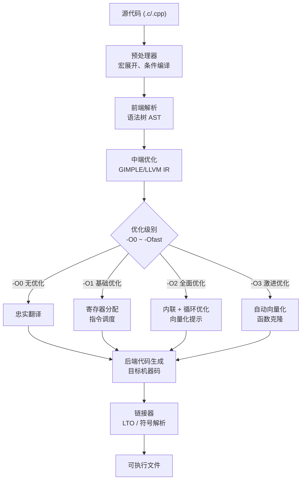
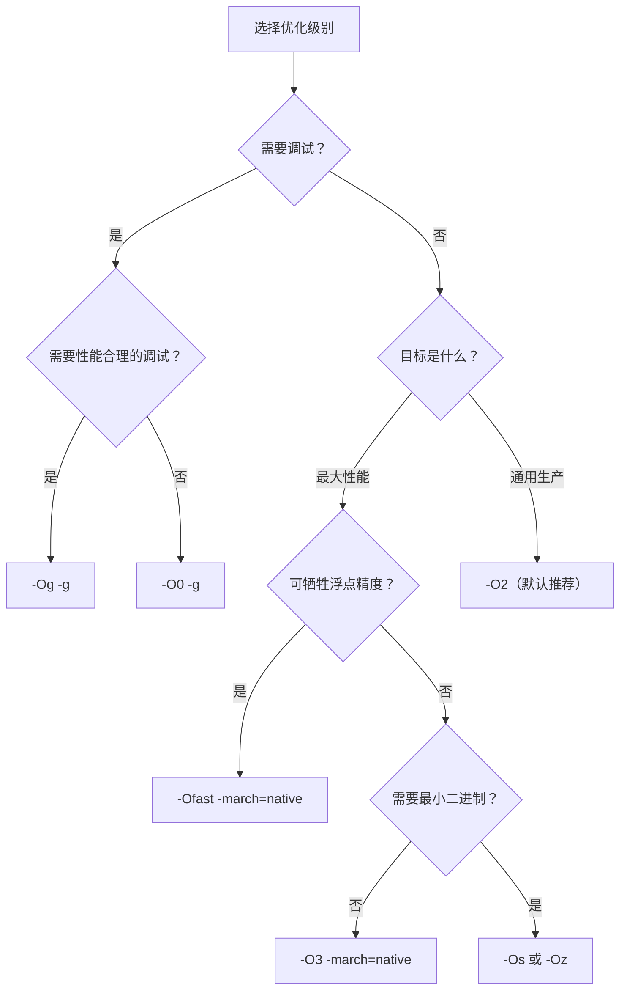
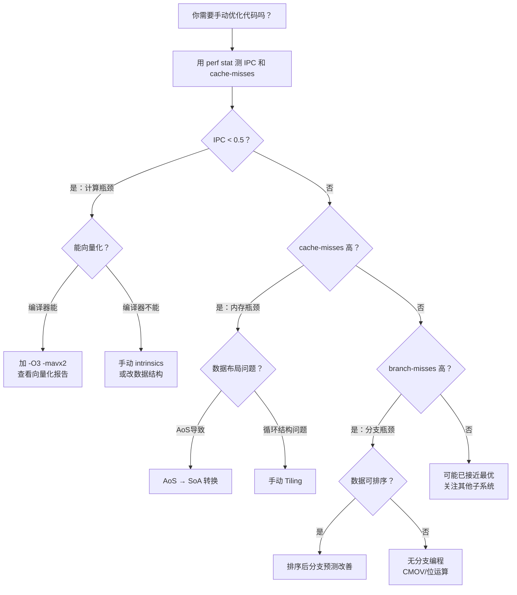

## 2.6 编译器优化选项

### 引言：编译器——连接算法与硅片的桥梁

前五节分别从性能分析（perf）、缓存友好编程、分支优化、SIMD向量化和伪共享修复五个维度探讨了CPU架构对程序性能的影响。但有一个关键环节始终贯穿其中：**编译器如何将C/C++源代码翻译成利用这些CPU特性的机器指令？**

编译器不是简单的"翻译器"，它是一个深度理解目标微架构的优化引擎。同样的源代码，不同的编译选项可以产生**5-50倍**的性能差异。理解编译器优化选项，就是在不改变算法的前提下，最大限度地释放CPU的计算能力。

本节从"道法术器"四个层面系统讲解GCC/Clang的编译器优化选项，帮助读者建立"看到优化标志就能预测其对CPU行为影响"的能力。



---

### 1. 优化级别全景：-O标志族

#### 1.1 八大优化级别对比

GCC/Clang提供一系列优化级别，每个级别是多个独立优化的"打包"。理解每个级别的实际含义是选择编译策略的基础。

| 优化级别 | 核心思想 | 编译速度 | 代码大小 | 运行性能 | 调试友好 | 适用场景 |
|---------|---------|---------|---------|---------|---------|---------|
| `-O0` | 不做任何优化 | 最快 | 最大 | 最慢 | 最好 | 开发调试阶段 |
| `-Og` | 调试友好的优化 | 快 | 中等 | 中等 | 好 | 日常开发调试 |
| `-O1` | 基础优化 | 较快 | 较小 | 中等 | 较好 | 平衡场景 |
| `-O2` | 全面优化（不含激进） | 较慢 | 较小 | 较好 | 一般 | **生产环境默认选择** |
| `-O3` | 全面+激进优化 | 慢 | 可能更大 | 最好 | 差 | 计算密集型生产代码 |
| `-Os` | 优化代码大小 | 较慢 | 最小 | 较好 | 一般 | 嵌入式、移动端 |
| `-Oz` | 极致大小优化 | 慢 | 极小 | 中等 | 一般 | 极端空间受限场景 |
| `-Ofast` | O3+不严格数学 | 慢 | 可能更大 | 最好 | 差 | 科学计算（可牺牲精度） |

> **GCC vs Clang 差异提示**：`-Oz` 是Clang特有的标志，在GCC中不存在。GCC使用`-Os`兼顾大小与性能，而Clang将二者拆分为两个级别。`-Oz`比`-Os`更激进地削减代码体积，甚至禁用一些对性能有益但增加体积的优化（如对齐填充、部分循环展开）。在实际选择时，如果目标是GCC，用`-Os`；如果目标是Clang，根据空间约束选择`-Os`或`-Oz`。

#### 1.2 每个级别的具体优化内容

**`-O0`（无优化）：** 编译器完全忠实于源代码。每条语句对应独立的指令序列，所有变量都分配在栈上，不做寄存器分配优化。生成的代码最容易调试，但性能最差。

```bash
# -O0 生成的典型代码（每行变量都从栈读写）
movl  $0, -4(%rbp)      # i = 0
jmp   .L2
.L3:
  movl  -4(%rbp), %eax   # 每次循环都从栈读取 i
  addl  $1, %eax
  movl  %eax, -4(%rbp)   # 每次循环都写回栈
.L2:
  cmpl  $999, -4(%rbp)
  jle   .L3
```

**`-Og`（调试友好优化）：** 保留所有调试信息和源码映射，同时应用不影响调试体验的优化。包括：常量传播、死代码消除、简单的函数内联。变量仍然可以被GDB观察和修改。

**`-O1`（基础优化）：** 在Og基础上增加：寄存器分配、指令调度（利用流水线）、简单的循环优化（循环展开、强度削减）、公共子表达式消除。编译速度显著快于O2。

**`-O2`（全面优化）：** 这是**生产环境的标准选择**。在O1基础上增加：更激进的指令调度（利用乱序执行）、更深度的函数内联、循环向量化提示、更积极的公共子表达式消除。GCC文档明确推荐大多数项目使用O2。

```bash
# -O2 做了什么？
# 1. 寄存器分配：变量尽可能留在寄存器中，减少栈访问
# 2. 指令调度：重排指令顺序以利用流水线并行
# 3. 函数内联：将小函数体直接嵌入调用处，消除调用开销
# 4. 循环优化：展开、融合、强度削减
# 5. 死代码消除：删除不可达代码
# 6. 常量传播：编译期计算常量表达式
```

**`-O3`（激进优化）：** 在O2基础上增加最关键的三项：**自动向量化**（ftree-vectorize）、**循环展开**（-funroll-loops，更激进的版本）、**函数克隆**（为不同调用路径生成特化版本）。这是性能导向的推荐级别。

```bash
# -O3 相比 O2 的关键增量
# 1. 自动向量化 (ftree-vectorize)：将标量循环转为SIMD指令
#    → 直接关联本章2.4节SIMD内容
# 2. 激进循环展开：减少循环控制开销
#    → 改善指令流水线利用率
# 3. 函数多版本克隆：为不同调用场景生成特化代码
# 4. 更大的内联阈值：更多函数被内联
```

**`-Ofast`（不严格优化）：** 在O3基础上启用`-ffast-math`，允许编译器违反IEEE 754浮点标准：
- `-fno-math-errno`：数学函数不设置errno
- `-funsafe-math-optimizations`：允许重新关联浮点运算
- `-ffinite-math-only`：假设没有NaN和无穷大
- `-fno-rounding-math`：假设默认舍入模式
- `-fno-signaling-nans`：忽略信号NaN

```c
// ffast-math 的实际影响
double dot = 0;
for (int i = 0; i < N; i++)
    dot += a[i] * b[i];

// -O3: 严格按顺序累加（保证数值精度）
// -Ofast: 编译器可能重排累加顺序以利用FMA指令
//   → 速度快10-20%，但结果可能有微小差异
//   → 科学计算可接受，金融计算绝对禁止
```

**`-Os`（大小优化）：** 优先减小代码体积，同时保持O2的大部分性能优化。禁用通常增大代码的优化（如大循环展开）。适用于：
- 嵌入式系统（Flash/ROM空间有限）
- 移动端App（减小安装包大小）
- 操作系统内核（减少I-Cache压力）

#### 1.3 真实性能对比

以下数据基于经典测试集（矩阵乘法、数组求和、字符串处理）的典型表现：

基准: -O0 = 1.0x (基线)

-Og:     2.5x - 4.0x   (调试友好，仍有显著提升)
-O1:     4.0x - 8.0x   (基础优化，性价比高)
-O2:     6.0x - 15.0x  (全面优化，生产环境首选)
-O3:     7.0x - 50.0x  (激进优化，向量化是关键增量)
-Os:     5.0x - 12.0x  (大小优先，性能接近O2)
-Oz:     4.0x - 10.0x  (极致压缩，牺牲部分性能)
-Ofast:  8.0x - 55.0x  (最激进，浮点密集型收益最大)

注意：具体倍数取决于代码特征。
- 纯计算密集型（矩阵运算）: O3比O2可快2-5倍（向量化收益）
- 分支密集型（解析器）: O3比O2仅快5-15%（向量化帮助有限）
- 内存密集型（链表遍历）: O3比O2几乎无差异（瓶颈在内存）

#### 1.4 优化级别背后的决策逻辑



---

### 2. 架构定向优化：让代码为特定CPU而生

#### 2.1 -march 与 -mtune 的区别

这是最容易混淆的一对标志：

| 标志 | 作用 | 影响范围 | 举例 |
|------|------|---------|------|
| `-march=` | 生成目标CPU**支持的指令集** | 指令选择（能不能用） | 允许使用AVX2、BMI2等指令 |
| `-mtune=` | **调整指令调度**以适应目标CPU | 指令排序（怎么用更好） | 调整指令顺序匹配特定流水线 |

```bash
# 两个标志的独立性
gcc -march=haswell -mtune=skylake program.c
# 含义：可以使用Haswell的所有指令，但指令调度按Skylake优化
# 适用场景：部署环境CPU是Skylake，但编译机器是Haswell

# 最常用组合
gcc -march=native -mtune=native program.c
# 含义：自动检测当前CPU的所有特性（编译时检测）
# 适用场景：编译机=运行机（如个人开发、CI/CD匹配部署环境）
```

#### 2.2 -march的版本演进

`-march`接受微架构名称或特性列表：

```bash
# 按微架构名称
-march=pentium-mmx    # MMX
-march=pentium4       # SSE2
-march=core2          # SSSE3
-march=sandybridge    # AVX
-march=haswell        # AVX2 + FMA + BMI1/2
-march=skylake        # AVX2 + SGX + MPX
-march=cannonlake     # AVX-512
-march=icelake        # AVX-512 + VBMI + IFMA
-march=alderlake      # AVX2 (大小核混合)
-march=sapphirerapids # AVX-512 + BF16 + AMX
-march=armv8-a        # ARM基础
-march=native         # 当前机器（推荐）

# 按特性列表（更精确）
-march=x86-64-v3      # ABI标准：AVX2 + FMA (GCC 12+)
-march=x86-64-v4      # ABI标准：AVX-512 (GCC 12+)
```

**微架构名对应的CPU指令集关键特性：**

| 微架构 | Intel CPU | AMD CPU | 关键指令集特性 |
|--------|-----------|---------|--------------|
| Sandy Bridge | 2代 | Bulldozer | AVX, AES-NI |
| Haswell | 4代 | Excavator | AVX2, FMA3, BMI1/2, TSX |
| Skylake | 6代 | Zen | AVX2, SGX, MPX, ADX |
| Ice Lake | 10代 | Zen 2 | AVX-512 (1lane), VBMI |
| Sapphire Rapids | 4代Xeon | Zen 3 | AVX-512, BF16, AMX |

**ARM 架构的 `-march` 对照：**

| `-march` 值 | ARM架构 | 关键特性 | 典型芯片 |
|------------|---------|---------|---------|
| `armv8-a` | ARMv8 基础 | NEON SIMD | Cortex-A53 |
| `armv8.2-a` | ARMv8.2 | 半精度FP16 | Cortex-A75 |
| `armv8.4-a` | ARMv8.4 | I8MM, SHA-512 | Cortex-A77 |
| `armv9-a` | ARMv9 | SVE2, SME | Cortex-X2, Apple M2 |
| `apple-m1` | Apple M1 | NEON, AES, SHA | Apple Silicon M1 |

#### 2.3 检查当前CPU支持的指令集

```bash
# 方法一：读取/proc/cpuinfo
grep -oP 'flags\s*: \K.*' /proc/cpuinfo | tr ' ' '\n' | sort -u | head -20

# 方法二：用cpuid工具
sudo apt-get install -y cpuid
cpuid | grep -i "avx\|sse\|fma\|bmi"

# 方法三：GCC内置宏（推荐）
echo | gcc -dM -E - -march=native | grep -E '__AVX|__SSE|__FMA|__BMI'
# 输出示例:
# #define __AVX2__ 1
# #define __AVX__ 1
# #define __SSE4_2__ 1
# #define __FMA__ 1

# 方法四：运行时检测（运行时选择最优代码路径）
# 在代码中使用 __builtin_cpu_supports()（GCC/Clang均支持）
```

#### 2.4 Function Multi-Versioning（函数多版本）

GCC 4.8+ 和 Clang 支持**函数多版本（FMV）**：同一个函数生成多个版本，运行时根据CPU特性自动选择最合适的版本。这在跨平台部署中极为重要。

```c
// FMV示例：同一函数生成多个版本，运行时自动选择
__attribute__((target_clones("avx2=default","sse4.1=loop")))
double compute_sum(double* data, int n) {
    double sum = 0;
    for (int i = 0; i < n; i++)
        sum += data[i];
    return sum;
}

// 编译器会生成：
// 1. AVX2版本（如果CPU支持AVX2，优先使用）
// 2. SSE4.1版本（如果CPU支持SSE4.1但不支持AVX2）
// 3. 默认版本（兜底）

// 运行时通过 __cpu_model 结构自动选择最优版本
```

```c
// 更精细的FMV控制（GCC特有）
#pragma GCC target("avx2")
double compute_avx2(double* data, int n) {
    // AVX2优化的实现
}

#pragma GCC target("sse4.1")
double compute_sse4(double* data, int n) {
    // SSE4.1版本的实现
}

// 使用ifunc机制，运行时选择最优版本
double compute(double* data, int n)
    __attribute__((ifunc("compute_resolver")));

static void* compute_resolver(void) {
    if (__builtin_cpu_supports("avx2"))
        return compute_avx2;
    return compute_sse4;
}
```

FMV的典型应用场景：
- **Linux发行版**：Debian、Ubuntu的系统库（如glibc）使用FMV，一个二进制兼容所有x86 CPU
- **跨平台游戏引擎**：在新CPU上自动使用AVX2，老CPU上回退到SSE
- **科学计算库**：Intel MKL、OpenBLAS 根据CPU选择最优内核

---

### 3. SIMD与向量化标志

#### 3.1 向量化相关标志一览

| 标志 | 作用 | 与CPU架构的关联 |
|------|------|----------------|
| `-ftree-vectorize` | 启用循环自动向量化（O3默认） | 利用SSE/AVX/NEON数据并行 |
| `-mavx` | 启用AVX指令（256位） | Sandy Bridge+ |
| `-mavx2` | 启用AVX2指令（整数256位） | Haswell+ |
| `-mavx512f` | 启用AVX-512基础指令 | Skylake-X+ |
| `-mfma` | 启用FMA融合乘加 | Haswell+（一个时钟完成a*b+c） |
| `-msse4.2` | 启用SSE4.2（字符串加速） | Nehalem+ |
| `-ftree-loop-vectorize` | 强制循环向量化 | 编译器尝试更多向量化机会 |
| `-fopt-info-vec-optimized` | 显示成功向量化信息 | 调试向量化 |
| `-fopt-info-vec-missed` | 显示未能向量化的原因 | 调试向量化 |
| `-fslp-vectorize` | 启用SLP（超字级并行）向量化 | 多个标量操作合并为向量 |

#### 3.2 向量化报告实战

```bash
# 查看哪些循环被向量化了
gcc -O3 -mavx2 -fopt-info-vec-optimized matmul.c -o matmul

# 输出示例:
# matmul.c:15:17: optimized: loop vectorized
# matmul.c:28:5: optimized: loop vectorized with 8 floats per iteration

# 查看哪些循环为什么没有被向量化
gcc -O3 -mavx2 -fopt-info-vec-missed matmul.c -o matmul

# 常见未向量化原因:
# matmul.c:22:12: missed: data type user-defined or aliasing
# → 编译器无法确定指针是否别名，不敢向量化
# matmul.c:35:8: missed: loop body too complex
# → 循环体内有if/else等复杂控制流
# matmul.c:41:5: missed: non-consecutive data access
# → 数据访问非连续（如链表），无法用SIMD
```

#### 3.3 消除指针别名疑虑

向量化最大的障碍是**指针别名（pointer aliasing）**——编译器不知道两个指针是否指向同一块内存，不敢重排或向量化：

```c
// 编译器认为 a 和 b 可能重叠 → 无法向量化
void add(float* a, float* b, float* c, int n) {
    for (int i = 0; i < n; i++)
        c[i] = a[i] + b[i];
}
```

三种解决方案：

```bash
# 方案一：restrict关键字（推荐）
void add(float* restrict a, float* restrict b, float* restrict c, int n) {
    for (int i = 0; i < n; i++)
        c[i] = a[i] + b[i];
}

# 方案二：-fno-strict-aliasing（降低C语言严格别名规则）
# 适用于老旧代码无法加restrict的场景

# 方案三：-fwhole-program（LTO模式下编译器看到所有代码）
# 编译器可以跨函数分析指针关系
```

#### 3.4 ARM NEON向量化

ARM架构的SIMD指令集是NEON（128位），与x86的SSE/AVX对应：

```bash
# ARM NEON向量化标志
gcc -O3 -march=armv8-a+simd program.c    # 启用NEON
gcc -O3 -march=armv8.2-a+fp16 program.c  # 启用半精度浮点
gcc -O3 -march=armv9-a+sve2 program.c    # 启用SVE2（可变长度向量）

# 验证NEON是否被使用
gcc -O3 -march=armv8-a+simd -fopt-info-vec-optimized program.c
```

```c
// ARM NEON intrinsics 示例
#include <arm_neon.h>

void add_neon(float* a, float* b, float* c, int n) {
    for (int i = 0; i < n; i += 4) {
        float32x4_t va = vld1q_f32(a + i);  // 加载4个float
        float32x4_t vb = vld1q_f32(b + i);
        float32x4_t vc = vaddq_f32(va, vb); // 4路并行加法
        vst1q_f32(c + i, vc);               // 存储结果
    }
}
// 每次循环处理4个float，理论上4倍吞吐量
```

---

### 4. 循环优化标志

循环是CPU性能的主战场——90%以上的执行时间消耗在循环中。GCC提供了丰富的循环优化控制：

| 标志 | 作用 | 对CPU的影响 |
|------|------|------------|
| `-funroll-loops` | 展开循环 | 减少分支指令，改善流水线 |
| `-funroll-all-loops` | 展开所有循环（包括不确定次数的） | 可能增加代码体积 |
| `-floop-interchange` | 循环交换（改善数据局部性） | 减少缓存未命中 |
| `-floop-block` | 循环分块（Tiling） | 改善缓存命中率 |
| `-floop-unroll-and-jam` | 展开+融合嵌套循环 | 改善寄存器重用 |
| `-floop-optimize` | 启用所有循环优化 | 一般与-O2+配合 |
| `-fno-math-errno` | 数学函数不检查errno | 允许更多循环优化 |
| `-floop-nest-optimize` | 多面体模型优化（Polyhedral） | 跨迭代重排，最大幅度改善 |

```bash
# 循环优化实战：对比不同标志的效果
# 源代码：矩阵乘法

# 无循环优化
gcc -O2 -fno-loop-optimize matmul.c    # 1.0x

# 循环展开
gcc -O2 -funroll-loops matmul.c        # 1.3x

# 循环分块（Tiling）——对缓存友好至关重要
gcc -O2 -floop-block matmul.c          # 2.0x - 5.0x

# 组合使用
gcc -O3 -funroll-loops -floop-block matmul.c  # 3.0x - 8.0x
```

#### 4.1 循环分块（Tiling）深度解析

循环分块是改善缓存性能的最关键技术。其核心思想：将大循环拆分为小块，每块的工作集恰好能放入L1缓存。

```c
// 未分块的矩阵乘法：每次访问 B[j][k] 可能cache miss
// L1缓存=32KB，矩阵维度N=1024，B的行=4KB
// → 每次内循环访问B的不同行，频繁evict
for (int i = 0; i < N; i++)
    for (int j = 0; j < N; j++)
        for (int k = 0; k < N; k++)
            C[i][j] += A[i][k] * B[k][j];

// 分块后：每块的工作集 fits in L1
// 块大小=32时，A的块=32*4=128B，B的块=32*4=128B，总共256B << 32KB
#define BLOCK 32
for (int ii = 0; ii < N; ii += BLOCK)
    for (int jj = 0; jj < N; jj += BLOCK)
        for (int kk = 0; kk < N; kk += BLOCK)
            for (int i = ii; i < ii + BLOCK; i++)
                for (int j = jj; j < jj + BLOCK; j++)
                    for (int k = kk; k < kk + BLOCK; k++)
                        C[i][j] += A[i][k] * B[k][j];
```

性能对比（N=2048，double矩阵乘法）：

未分块:           1.0x   (L1 miss率 ~80%)
手动Tiling(32):  4.5x   (L1 miss率 ~5%)
-O3 -floop-block: 3.8x   (编译器自动分块，但不如手动精细)
组合优化:         8.2x   (手动Tiling + 编译器其他优化)

---

### 5. Profile-Guided Optimization（PGO）

#### 5.1 原理：让编译器看到真实运行数据

PGO（配置文件引导优化）是**最具价值的高级优化手段**。它分三步：


```bash
# 第一步：插桩编译
gcc -O3 -fprofile-generate -o app_instrumented app.c

# 第二步：收集运行数据（用典型负载执行）
./app_instrumented < typical_input.txt
# 生成 app.gcda 文件（分支计数、基本块执行次数等）

# 第三步：用数据优化编译
gcc -O3 -fprofile-use -o app_optimized app.c

# 合并多份数据（如果多次运行）
gcc -O3 -fprofile-generate=profile/ -o app_instrumented app.c
./app_instrumented < input1.txt
./app_instrumented < input2.txt
gcc -O3 -fprofile-use=profile/ -o app_optimized app.c
```

#### 5.2 PGO如何影响CPU行为

PGO对CPU微架构层面的影响是深层次的：

| PGO优化 | CPU层面的改善 | 典型收益 |
|---------|--------------|---------|
| **热路径优化** | 将热代码连续放置，改善I-Cache和I-TLB命中率 | 10-30% |
| **分支权重分配** | 热路径直连，冷路径外置，减少分支预测压力 | 5-15% |
| **函数布局** | 高频调用链的函数连续放置，改善指令缓存局部性 | 5-10% |
| **内联决策** | 基于真实调用频率决定内联，避免过度/不足内联 | 5-20% |
| **寄存器分配** | 热路径的变量优先分配寄存器 | 3-10% |

```bash
# 用perf验证PGO的效果
perf stat -e instructions,cycles,branch-misses,icache-misses ./app_optimized
perf stat -e instructions,cycles,branch-misses,icache-misses ./app_baseline

# 典型结果对比:
# PGO优化后 branch-misses 减少 20-40%
# PGO优化后 icache-misses 减少 30-60%
# 总体CPI改善 10-25%
```

#### 5.3 PGO的实际收益案例

| 项目类型 | 无PGO(O3) | 有PGO(O3+PGO) | 额外收益 |
|---------|----------|--------------|---------|
| Web服务器(Nginx) | 1.0x | 1.10-1.15x | 10-15% |
| 数据库(MySQL) | 1.0x | 1.15-1.25x | 15-25% |
| 编译器(GCC自身) | 1.0x | 1.10-1.20x | 10-20% |
| 游戏引擎 | 1.0x | 1.05-1.15x | 5-15% |
| 科学计算 | 1.0x | 1.05-1.10x | 5-10%（计算密集，分支少） |
| **Google Chrome** | 1.0x | 1.10-1.15x | ~10%（Google官方报告） |
| **LLVM/Clang** | 1.0x | 1.15-1.20x | ~15%（LLVM官方使用PGO构建） |
| **Microsoft Edge** | 1.0x | 1.10-1.15x | ~10%（微软博客数据） |

#### 5.4 AutoFDO：基于采样的PGO

传统PGO（BOLT/Instrumentation PGO）需要运行插桩版本，收集数据较慢。**AutoFDO**（Automated Feedback-Directed Optimization）基于perf采样，不需要插桩版本：

```bash
# AutoFDO流程（Clang）
# Step 1: 正常编译（带调试信息）
clang -O3 -g -gline-tables-only -o app app.c

# Step 2: 用perf采样
perf record -b -o perf.data ./app < typical_input.txt
# 注意 -b (LBR=Last Branch Record) 关键：记录分支跳转信息

# Step 3: 将perf数据转换为LLVM profile
llvm-profdata merge --sample --output=app.profdata perf.data

# Step 4: 使用profile优化编译
clang -O3 -fprofile-sample-use=app.profdata -o app_optimized app.c
```

AutoFDO vs 传统PGO：

| 特性 | 传统PGO | AutoFDO |
|------|--------|---------|
| 需要插桩版本 | 是 | 否 |
| 数据收集开销 | 10-30% | <1% |
| profile精度 | 高（精确计数） | 中（采样估计） |
| 适用场景 | 自有项目 | 第三方库、系统组件 |
| 典型收益 | 10-25% | 5-15% |
| 灵活性 | 需要特定输入 | 生产环境直接采样 |

#### 5.5 PGO的常见陷阱

```bash
# 陷阱1：采样输入不具代表性
./app < benchmark_only.txt   # 只用了基准测试输入
# → 编译器只优化了基准测试路径，生产环境可能更慢
# 正确做法：使用真实生产流量或典型用户行为数据

# 陷阱2：profile过期
# 代码大改后仍使用旧profile → 优化方向错误
# 正确做法：每次重大重构后重新收集profile

# 陷阱3：多线程程序的profile合并
# 多个线程的profile需要合并，否则数据不完整
# 正确做法：使用多次运行合并profile
gcc -fprofile-generate=profile/ -o app app.c
for i in $(seq 1 10); do ./app < input_$i.txt; done
gcc -fprofile-use=profile/ -o app_final app.c
```

---

### 6. Link-Time Optimization（LTO）

#### 6.1 原理：跨编译单元的全局优化

传统编译中，每个`.c`文件独立编译，编译器无法跨文件优化。LTO将所有编译单元合并为中间表示（IR），在链接阶段进行全局优化：

```bash
# 传统编译（每个文件独立优化）
gcc -O2 -c main.c -o main.o
gcc -O2 -c util.c -o util.o
gcc main.o util.o -o app    # 链接器不做优化

# LTO（链接时全局优化）
gcc -O2 -flto -c main.c -o main.o
gcc -O2 -flto -c util.c -o util.o
gcc -O2 -flto main.o util.o -o app  # 链接时进行全局优化

# 或者一步完成
gcc -O2 -flto main.c util.c -o app
```

#### 6.2 LTO带来的CPU层面优化

| LTO优化 | 说明 | 对CPU的影响 |
|---------|------|------------|
| **跨文件内联** | 将小工具函数内联到调用文件 | 减少函数调用开销，暴露更多优化机会 |
| **跨文件常量传播** | 消除跨文件的常量传递 | 减少运行时计算 |
| **死代码消除** | 删除未使用的全局函数/变量 | 减小代码体积，改善I-Cache |
| **跨文件别名分析** | 全局视角分析指针关系 | 允许更激进的向量化和重排 |

```bash
# LTO + PGO 组合使用（最优编译策略）
gcc -O3 -flto -fprofile-use=profile/ main.c util.c -o app_optimal

# ThinLTO（Clang特色，增量LTO，编译更快）
clang -O3 -flto=thin -fprofile-use=profile/ main.c util.c -o app
```

#### 6.3 LTO的代价与权衡

```bash
# LTO 的代价:
# 1. 编译时间显著增加（需要加载所有IR，全局分析）
#    → 典型增加 20-50% 编译时间
# 2. 内存占用大（所有IR同时在内存中）
#    → 大型项目可能需要 8GB+ 内存
# 3. 增量编译变慢（任何文件改动都触发全局重优化）
#    → 开发阶段不建议启用

# 建议策略:
# 开发阶段:  -O2（快速编译，足够快的运行速度）
# CI/CD:     -O2 -flto（全局优化，验证正确性）
# 最终发布:  -O3 -flto -fprofile-use（完整优化流水线）
```

---

### 7. 链接器优化标志

链接器（ld/lld/ld.gold）也有自己的优化能力，常被忽略但收益可观：

#### 7.1 段级优化

```bash
# --gc-sections：删除未引用的段（需要配合编译标志）
gcc -ffunction-sections -fdata-sections -c file.c -o file.o
ld --gc-sections file.o -o app
# 效果：删除未使用的函数和全局变量
# 典型收益：减小10-30%的二进制大小

# --icf=all：Identical Code Folding，合并相同函数体
ld --icf=all file.o -o app
# 效果：多个相同实现的函数合并为一个
# 典型收益：减小5-15%的二进制大小

# --sort-section=name：段按名字排序（改善I-Cache局部性）
# 将频繁调用的函数放在相邻位置
```

#### 7.2 链接器替换

```bash
# Gold链接器（更快的LTO支持）
gcc -O3 -flto -fuse-ld=gold program.c -o app

# LLD（LLVM链接器，速度最快）
gcc -O3 -flto -fuse-ld=lld program.c -o app
# LLD的LTO速度比传统ld快5-10倍

# Mold（最快的链接器，C++重写）
gcc -O3 -flto -fuse-ld=mold program.c -o app
# Mold链接速度比lld还快2-5倍
```

#### 7.3 CMake中的链接器配置

```cmake
# CMakeLists.txt 最佳实践
cmake_minimum_required(VERSION 3.20)

# Release模式配置
set(CMAKE_C_FLAGS_RELEASE "-O3 -flto -march=native")
set(CMAKE_EXE_LINKER_FLAGS_RELEASE "-flto -fuse-ld=lld -Wl,--gc-sections")

# 为每个源文件启用段分离
add_compile_options(-ffunction-sections -fdata-sections)

# 启用 ThinLTO（如果使用Clang）
if(CMAKE_C_COMPILER_ID MATCHES "Clang")
    set(CMAKE_INTERPROCEDURAL_OPTIMIZATION TRUE)
endif()
```

---

### 8. 安全与调试相关标志

#### 8.1 安全标志

在生产环境中，安全标志与性能优化之间存在需要权衡的关系：

| 标志 | 作用 | 性能影响 | 建议 |
|------|------|---------|------|
| `-fstack-protector-strong` | 栈缓冲区溢出保护 | 1-3% | **必须启用** |
| `-D_FORTIFY_SOURCE=2` | 缓冲区溢出检测 | 1-2% | **必须启用** |
| `-fPIE -pie` | 位置无关可执行文件 | 2-5% | 支持ASLR |
| `-fstack-clash-protection` | 栈冲突攻击防护 | 1-2% | 推荐启用 |
| `-fcf-protection=full` | 控制流完整性 | 1-3% | Intel CET |
| `-Wl,-z,relro,-z,now` | 完整RELRO保护 | 0-1% | **必须启用** |
| `-Wl,-z,noexecstack` | 栈不可执行 | 0% | **必须启用** |

```bash
# 生产环境推荐的安全+性能组合
gcc -O3 -flto -fprofile-use \
    -fstack-protector-strong \
    -D_FORTIFY_SOURCE=2 \
    -fPIE -pie \
    -fstack-clash-protection \
    -ffunction-sections -fdata-sections \
    -Wl,-z,relro,-z,now \
    -Wl,--gc-sections \
    -o app main.c util.c
```

#### 8.2 Sanitizer的性能代价

Sanitizer是强大的调试工具，但在性能关键路径上需要了解其代价：

| Sanitizer | 检测能力 | 性能代价 | 内存代价 | 适用阶段 |
|-----------|---------|---------|---------|---------|
| ASan (AddressSanitizer) | 缓冲区溢出、UAF、泄漏 | 2-3x | 3x | 测试/CI |
| MSan (MemorySanitizer) | 未初始化内存读取 | 3x | 3x | 测试/CI |
| TSan (ThreadSanitizer) | 数据竞争、死锁 | 5-15x | 5-10x | 测试/CI |
| UBSan (UBSan) | 未定义行为 | 5-20% | <5% | 可生产 |
| LSan (LeakSanitizer) | 内存泄漏 | 5-10% | 5% | 测试/CI |

```bash
# 测试环境：全量sanitizer
gcc -O2 -g -fsanitize=address,undefined,leak \
    -fno-omit-frame-pointer program.c -o program_test

# 生产环境：仅UBSan（低开销）
gcc -O3 -fsanitize=undefined program.c -o program_prod
# 注意：UBSan在生产环境是安全的，只报告违规到stderr

# TSan需要特殊编译（不兼容ASan）
gcc -O2 -g -fsanitize=thread program.c -o program_tsan
```

#### 8.3 调试标志

| 标志 | 作用 | 适用场景 |
|------|------|---------|
| `-g` | 生成调试信息 | 需要gdb调试时 |
| `-g3` | 生成宏定义等额外调试信息 | 需要调试宏时 |
| `-fno-omit-frame-pointer` | 保留栈帧指针 | perf/callgrind分析 |
| `-fsanitize=address` | AddressSanitizer | 检测内存越界/泄漏 |
| `-fsanitize=undefined` | UBSan | 检测未定义行为 |
| `-gline-tables-only` | 仅行号信息（轻量级） | AutoFDO、轻量调试 |

```bash
# 性能分析专用编译（不牺牲太多性能，保留足够调试信息）
gcc -O2 -g -fno-omit-frame-pointer -fsanitize=undefined program.c -o program
# -O2 保证足够性能
# -g 保留调试信息（perf需要）
# -fno-omit-frame-pointer 让栈回溯准确（perf report需要）
# -fsanitize=undefined 检测潜在的UB（可能影响优化效果的代码）
```

---

### 9. 编译器优化报告：让编译器告诉你它做了什么

#### 9.1 GCC报告标志

```bash
# 显示编译器做了哪些优化
gcc -O3 -fopt-info-all program.c 2>&amp;1 | head -50

# 显示循环优化详情
gcc -O3 -fopt-info-vec-missed,optimized,inline,loop program.c 2>&amp;1

# 显示决策原因
gcc -O3 -fopt-info-vec-optimized=-stat=program.vec program.c
cat program.vec
```

#### 9.2 GCC树图输出（调试优化决策）

```bash
# 输出函数的GIMPLE IR（GCC中间表示）
gcc -O3 -fdump-tree-all -fdump-tree-all-raw program.c

# 查看特定优化前后的IR变化
gcc -O3 -fdump-tree-optimized program.c    # 优化后
gcc -O3 -fdump-tree-vect-details program.c # 向量化详情

# Clang的优化报告（RPass格式）
clang -O3 -Rpass=loop-vectorize program.c -o program
# 输出: program.c:5:5: remark: vectorized loop (vectorization width: 8)

clang -O3 -Rpass-missed=loop-vectorize program.c -o program
# 输出: program.c:10:5: remark: loop not vectorized: cannot identify array bounds

# Clang的优化统计报告
clang -O3 -Rpass-analysis=loop-vectorize program.c -o program
```

#### 9.3 使用Compiler Explorer（Godbolt）对比

[Godbolt Compiler Explorer](https://godbolt.org/)是在线对比不同优化级别汇编输出的最佳工具：

实操步骤:
1. 打开 godbolt.org
2. 左侧粘贴C/C++代码
3. 右侧选择编译器（如 GCC 13.2）和优化标志
4. 开启 "Compile to Binary" 查看指令数统计
5. 开启 "Instruction Set" 高亮不同指令集

对比模板:
- 第1栏: GCC -O0 （基线，每条语句的原始翻译）
- 第2栏: GCC -O2 （全面优化后的变化）
- 第3栏: GCC -O3 （向量化带来的变化）
- 第4栏: GCC -O3 -march=native （针对特定CPU的优化）

```c
// Godbolt对比示例：循环求和
int sum_array(int* arr, int n) {
    int sum = 0;
    for (int i = 0; i < n; i++)
        sum += arr[i];
    return sum;
}

// -O0: 逐元素读取，每次循环4-5条指令
// -O2: 展开循环+寄存器累加，每次迭代处理4个元素
// -O3: AVX2向量化，每次处理8个int + 水平归约
// -O3 -mavx512f: AVX-512向量化，每次处理16个int
```

#### 9.4 编译器版本对优化质量的影响

不同编译器版本的优化能力差异显著：

| 版本变化 | 关键优化改进 | 典型性能变化 |
|---------|------------|------------|
| GCC 10→11 | 更好的循环向量化、OpenMP 5.0 | 2-5% |
| GCC 11→12 | `-march=x86-64-v3/v4` ABI标准支持 | 1-3% |
| GCC 12→13 | 改进的PGO/LTO交互、更好的寄存器分配 | 3-8% |
| GCC 13→14 | AVX10.1支持、改进的自动向量化 | 2-5% |
| Clang 15→16 | 更好的SLP向量化、OpenMP 5.2 | 2-5% |
| Clang 16→17 | 改进的LoopVectorize、AMD Zen 4 tuning | 3-8% |
| Clang 17→18 | AVX10.1支持、MLGO（机器学习引导优化） | 2-5% |

```bash
# 检查编译器版本
gcc --version
clang --version

# 查看编译器支持的-march值（快速参考）
gcc --target-help 2>/dev/null | grep -A50 "march="
```

---

### 10. 常见优化误区与纠正

#### 误区1：-O3总是比-O2好

**事实：** O3相比O2的增量主要来自自动向量化和激进循环展开。对于以下场景，O3可能反而更慢：
- **分支密集型代码**：向量化帮助有限，但更大的代码体积增加I-Cache压力
- **小数据集**：循环展开增加代码体积，数据不够多时收益为负
- **递归算法**：控制流复杂，编译器难以向量化

```bash
# 验证方法：实测对比
gcc -O2 program.c -o app_O2 &amp;&amp; ./app_O2
gcc -O3 program.c -o app_O3 &amp;&amp; ./app_O3
# 如果 O3 比 O2 慢，说明你的代码不适合 O3 的优化策略
```

#### 误区2：开了-O3就不需要手动优化

**事实：** 编译器优化的局限性——它能做和不能做的事情：

| 编译器能做 | 编译器不能做 |
|-----------|------------|
| 循环展开 | 改变算法复杂度（O(n²)→O(n log n)） |
| 寄存器分配 | 理解业务语义（哪些是热数据） |
| 简单向量化 | 复杂控制流的向量化 |
| 常量传播 | 数据结构转换（AoS→SoA） |
| 死代码消除 | 缓存分块（Tiling）的手动布局 |
| 函数内联 | 消除伪共享的变量排列 |

#### 误区3：更多标志=更好的性能

**事实：** 标志之间可能冲突，盲目叠加可能适得其反：

```bash
# 冲突示例
gcc -O3 -Os program.c   # O3和Os矛盾，-Os覆盖-O3
gcc -O3 -O0 program.c   # 后面的-O0覆盖前面的-O3

# 不必要的标志
gcc -O3 -funroll-loops -march=native program.c
# -O3已经包含循环展开，额外的-funroll-loops可能导致过度展开
# 应该用 -O3 -fno-unroll-loops 来禁用默认展开
```

#### 误区4：编译器优化会破坏程序正确性

**事实：** 除`-Ofast`（启用`-ffast-math`）外，所有标准优化级别都保证符合C/C++标准。O3不会改变程序的可观察行为（C++ as-if规则）。但`-Ofast`可能影响浮点精度：

```c
// -Ofast的精度风险
double a = 1e16;
double b = 1.0;
double c = a + b - a;  // 严格模式: c = 1.0 (但实际是 0.0 因为精度)
                        // -Ofast: 编译器可能假设结果为 1.0 (激进优化)
```

#### 误区5：-march=native在CI/CD中是安全的

**事实：** `-march=native`检测的是**编译机**的CPU特性。如果CI/CD机器的CPU比生产环境更新（如CI用Skylake，生产用Haswell），生成的代码可能在生产环境崩溃（illegal instruction）。

```bash
# 危险：CI/CD机器用Skylake，生产环境用Haswell
gcc -O3 -march=native program.c  # 生成了AVX2指令
# 在只支持AVX的Haswell以下CPU上崩溃

# 正确做法：显式指定目标微架构
gcc -O3 -march=haswell program.c  # 安全：明确指定最低要求
# 或使用x86-64 ABI标准
gcc -O3 -march=x86-64-v3 program.c  # AVX2 + FMA（LCC 12+）
```

#### 误区6：PGO只对大型项目有用

**事实：** PGO对小项目同样有效，关键看代码中分支的比例。即使是几千行的代码，如果包含多层条件判断，PGO也能带来10-20%的提升。

```bash
# 小项目PGO的正确姿势
gcc -O3 -fprofile-generate small_tool.c -o small_tool_instrumented
./small_tool_instrumented < typical_input.txt
gcc -O3 -fprofile-use small_tool.c -o small_tool_optimized
# 小项目插桩开销低，收集速度快，性价比高
```

---

### 11. 优化编译的最佳实践

#### 11.1 分阶段编译策略

```bash
# 阶段一：开发调试（快速迭代）
gcc -Og -g -fno-omit-frame-pointer program.c -o app_debug

# 阶段二：功能测试（验证正确性）
gcc -O2 -g -fno-omit-frame-pointer -fsanitize=address,undefined program.c -o app_test

# 阶段三：性能测试（基线测量）
gcc -O3 program.c -o app_perf
perf stat -e cycles,instructions,cache-misses,branch-misses ./app_perf

# 阶段四：深度优化（最终发布）
# 4a. 插桩编译
gcc -O3 -flto -fprofile-generate=profile/ program.c -o app_instrumented
# 4b. 收集运行数据
./app_instrumented < typical_workload.txt
# 4c. 最终编译
gcc -O3 -flto -fprofile-use=profile/ \
    -march=native \
    -fstack-protector-strong \
    program.c -o app_release
```

#### 11.2 项目级编译配置

```cmake
# CMakeLists.txt（CMake项目推荐配置）
set(CMAKE_C_FLAGS_RELEASE "-O3 -flto -march=native")
set(CMAKE_C_FLAGS_DEBUG   "-Og -g -fno-omit-frame-pointer")
set(CMAKE_EXE_LINKER_FLAGS_RELEASE "-flto")

# Makefile 项目
CC = gcc
CFLAGS_DEBUG = -Og -g -fno-omit-frame-pointer
CFLAGS_RELEASE = -O3 -flto -fprofile-use=profile/ -march=native

# Meson 项目
# meson build --buildtype=release -Db_lto=true -Db_pch=true
```

#### 11.3 优化决策流程图



---

### 12. 进阶：编译器标志与CPU微架构的深度映射

#### 12.1 编译器如何利用流水线

```bash
# 指令调度：编译器重排指令以减少流水线停顿
-O2 -fschedule-insns2  # 寄存器分配后的指令调度（默认启用）

# 软件流水线：编译器尝试重叠循环迭代
-O3 -floop-nest-optimize  # 多面体模型优化（GCC特有）

# 对CPU的影响:
# 调度前: ADD r1, r2, r3; MUL r4, r1, r5  (RAW冒险，停顿2周期)
# 调度后: ADD r1, r2, r3; NOP; MUL r4, r1, r5  (NOP填充)
# 或:      ADD r1, r2, r3; SUB r6, r7, r8; MUL r4, r1, r5 (插入无关指令)
```

#### 12.2 编译器如何利用缓存

```bash
# 数据预取提示
-fprefetch-loop-arrays  # 自动为数组循环生成 prefetch 指令

# 缓存行对齐
-ffast-math              # 允许非对齐访问优化
__attribute__((aligned(64)))  # 手动对齐到缓存行

# 对CPU的影响:
# 无预取: 访问 arr[0..N-1] → 频繁 cache miss
# 有预取: 编译器插入 prefetch 指令 → 提前将数据拉入 L1
#          对于顺序访问，prefetch 可将 miss 率降低 30-50%
```

#### 12.3 编译器如何利用乱序执行

```bash
# 函数克隆：为不同调用场景生成特化版本
-fclone-functions            # 克隆函数以优化不同调用路径
-fif-conversion2             # 将简单 if-else 转为条件移动指令（CMOV）
-fif-conversion              # 将 if-else 转为条件执行

# 对CPU的影响:
# 传统 if-else:
#   CMP r1, 0
#   JE  .else       ← 分支预测失败风险
#   ...
# CMOV 版本:
#   CMP r1, 0
#   CMOVNE r2, r3   ← 无分支，直接条件移动
#   → 消除分支预测失败的流水线冲刷代价
```

#### 12.4 编译器如何利用TLB

```bash
# 大页（Huge Page）支持
-mllvm -enable-tls-huge -mtls-dialect=gnu2  # GCC TLS优化
# 使用大页减少TLB miss

# 代码段布局优化
-freorder-functions -ffunction-sections
# 将频繁调用的函数放在相邻的段中
# → 减少I-TLB miss

# 数据段布局优化
-freorder-blocks-and-partition
# 将热数据和冷数据分离到不同的段
# → 热数据集中在少数几页中，减少D-TLB miss
```

#### 12.5 BOLT：链接后优化

BOLT（Binary Optimization and Layout Tool）是LLVM项目的链接后优化工具，在链接完成后进一步优化二进制：

```bash
# BOLT流程
# Step 1: 正常编译
clang -O3 -Wl,--emit-relocs -o app app.c
# 注意 --emit-relocs 必须：保留重定位信息供BOLT使用

# Step 2: 收集profile
perf record -e cycles:u -j any,u -o perf.data -- ./app < input.txt

# Step 3: 用perf2bolt转换profile
perf2bolt -p perf.data -o app.fdata app

# Step 4: BOLT优化
llvm-bolt app -o app_bolt -data=app.fdata \
    -reorder-blocks=ext-tsp \
    -reorder-functions=hfsort+
```

BOLT的典型收益（在PGO之上）：额外5-15%的性能提升，主要来自：
- 代码段重排：热函数更紧凑，减少I-Cache和I-TLB miss
- 函数布局：调用链上的函数连续放置
- 冷代码分离：冷路径移到代码段末尾

---

### 本节核心速查表

| 场景 | 推荐标志组合 | 预期收益 |
|------|------------|---------|
| 日常开发 | `-Og -g` | 调试友好，足够快 |
| 生产环境（通用） | `-O2` | 6-15x vs O0 |
| 生产环境（计算密集） | `-O3 -march=native` | 7-50x vs O0 |
| 最终发布（完整优化） | `-O3 -flto -fprofile-use -march=native` | 最大性能 |
| 嵌入式/移动端 | `-Os -flto` | 大小优先 |
| 极端空间受限（Clang） | `-Oz -flto -Wl,--gc-sections` | 最小二进制 |
| 科学计算（可牺牲精度） | `-Ofast -march=native` | 浮点密集型最快 |
| 安全敏感生产环境 | `-O3 -fstack-protector-strong -D_FORTIFY_SOURCE=2 -PIE` | 安全+性能 |
| 性能分析 | `-O2 -g -fno-omit-frame-pointer` | perf准确分析 |
| SIMD调试 | `-O3 -mavx2 -fopt-info-vec-missed` | 查看向量化瓶颈 |
| 跨平台兼容 | `-O3 -march=x86-64-v3` | AVX2标准兼容 |

---

### 自检清单

- [ ] 能说出-O0到-Ofast各级别的核心差异和适用场景
- [ ] 能解释-march和-mtune的区别，并说出自己CPU对应的-march值
- [ ] 能用-fopt-info-vec-missed诊断为什么编译器没有向量化某个循环
- [ ] 能解释PGO的三步流程及其对CPU分支预测和I-Cache的影响
- [ ] 能解释LTO如何实现跨文件内联和全局别名分析
- [ ] 能在godbolt.org上对比不同优化级别的汇编输出
- [ ] 能制定项目的分阶段编译策略（开发→测试→性能→发布）
- [ ] 能解释为什么-O3对某些代码反而更慢（I-Cache压力）
- [ ] 能解释FMV（Function Multi-Versioning）如何实现跨CPU兼容
- [ ] 能说出ASan/TSan/UBSan各自的性能代价和适用场景
- [ ] 能描述AutoFDO与传统PGO的区别及各自适用场景
- [ ] 能解释链接器标志（--gc-sections、--icf）对性能的影响
