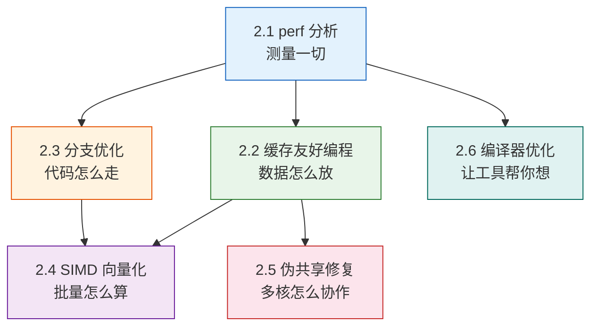

# 核心技巧：从理论到可观测的性能数据

理论基础章节揭示了CPU的内部工作原理——流水线、乱序执行、分支预测、缓存层次和缓存一致性。但如果这些知识只停留在"知道"的层面，它们对实际编程毫无帮助。**核心技巧的目的是将硬件知识转化为可操作的编程实践**：用工具量化问题，用技术解决问题，用选项控制编译器。

本章六节内容构成一条完整的优化链路：**先测量（perf）→ 理解数据访问（缓存友好编程）→ 理解控制流（分支优化）→ 利用数据级并行（SIMD）→ 消除多核隐患（伪共享修复）→ 让编译器帮你做前三项（编译器优化选项）**。

---

## 核心技巧全景



---

## 2.1 使用perf分析CPU行为

**一句话**：perf是你与CPU硬件计数器对话的终极窗口，能精确告诉你程序慢在哪里。

perf直接读取CPU的PMU（Performance Monitoring Unit）硬件寄存器，获取真实的数据——不是统计估算，不是模拟，而是硬件的精确计数。它能让你回答三个核心问题：

- **程序的瓶颈在计算还是在等待？** → 看IPC（instructions per cycle）。IPC > 1.5说明CPU在做有效工作；IPC < 1.0说明CPU在等待（缓存、内存、锁）。
- **缓存效率如何？** → 看L1-dcache-load-misses和LLC-load-misses。一次L1命中只需4个周期，一次DRAM访问需要200+个周期，差距达50倍。
- **分支预测准不准？** → 看branch-misses。每次误预测浪费10-20个周期，对分支密集的代码影响巨大。

**三个最常用的perf子命令**：

| 子命令 | 用途 | 典型场景 |
|--------|------|----------|
| `perf stat` | 运行程序并输出硬件计数器汇总 | 快速诊断瓶颈类型 |
| `perf record` | 按采样频率收集调用栈 | 找到热点函数 |
| `perf report` | 可视化采样结果 | 定位具体代码行 |

**性能分析决策矩阵**：

| 观察到的现象 | 根因诊断 | 优化方向 |
|-------------|---------|---------|
| IPC < 1.0，cache-misses高 | 缓存未命中导致CPU停顿 | 改善数据局部性、使用缓存友好的数据结构 |
| IPC < 1.0，branch-misses高 | 分支预测失败频繁 | 排序数据、无分支代码、PGO |
| IPC > 1.5，但cycles高 | CPU做了很多有效工作 | SIMD指令、循环展开、减少指令数 |
| LLC-load-misses高 | 工作集超出最后一级缓存 | 分块（tiling）处理、减小工作集 |
| task-clock远小于time elapsed | 程序大量等待I/O或锁 | 异步I/O、减少锁竞争 |

**关键数据**：perf的默认采样频率997Hz（质数避免与时钟对齐），性能开销通常低于1%。相比之下，Valgrind等插桩工具会把程序放慢5-50倍。

---

## 2.2 缓存友好的代码编写

**一句话**：代码的性能瓶颈往往不是计算本身，而是数据能否被高效地喂给CPU。

本节是本章的核心内容之一，覆盖六个关键优化维度：

### 遍历顺序——最容易忽视的10-50倍差距

C/C++中二维数组按行优先存储。行优先遍历（`matrix[i][j]`，j递增）每次访问仅前进4字节，缓存行利用率接近100%；列优先遍历（`matrix[i][j]`，i递增）每次跳过N×4字节，几乎每次访问都cache miss。对于4096×4096的int矩阵，差距达15倍。

### AoS vs SoA——数据布局决定性能天花板

当只更新结构体中的部分字段时，AoS（Array of Structures）布局的每个缓存行只包含不到一个元素的有效数据，其余字段全部浪费。SoA（Structure of Arrays）布局让同类型字段连续存储，缓存命中率提升3-8倍，配合SIMD可达4-16倍。

### 预取技术——当硬件预取器不够用时

硬件预取器能识别简单的线性访问模式，但对链表遍历、哈希表探测、间接数组访问等非线性模式无能为力。GCC的`__builtin_prefetch`函数允许程序员主动提示CPU提前加载数据，在链表遍历场景中可带来20-40%的性能提升。

### 分块（Tiling）——矩阵乘法的核心优化

将大矩阵切分为能装入L1缓存的小块，使每个小块在计算期间始终驻留在缓存中。对于4096×4096的double矩阵乘法，分块（BLOCK=64）可带来14.8倍加速。

### 对齐与填充——避免跨缓存行和伪共享

确保频繁访问的数据结构对齐到缓存行边界（64字节），避免一个数据对象横跨两个缓存行。多线程场景中，填充相邻的热字段到独立缓存行，消除伪共享。

### Cache-Oblivious算法——不需要知道缓存参数的优化

递归分治策略让算法自动适配所有层级的缓存，无需手动调整分块参数。FFT、矩阵乘法、归并排序中都有经典应用。

---

## 2.3 分支优化技巧

**一句话**：分支是流水线最大的威胁——消除不可预测的分支，让CPU的流水线始终畅通。

现代CPU分支预测器（TAGE混合预测器）在大多数场景下误预测率低于2%，但在特定场景下会彻底失效：

| 场景 | 为什么失效 | 解决方案 |
|------|-----------|---------|
| 随机数据分支 | 预测器准确率逼近50% | 无分支代码（CMOV/位运算） |
| 排序后数据 | 分支变为"先全不跳再全跳" | 排序使分支可预测 |
| 小范围整数分类 | 多个if-else判断 | 查表法（256项以内最佳） |
| 批量同构数据 | 标量逐元素分支 | SIMD向量化 |

**核心优化手段的性能对比**（1000万元素，Intel i7-12700K）：

| 方案 | 耗时 | 分支误预测率 | 加速比 |
|------|------|-------------|--------|
| 未排序 + if分支 | ~85ms | ~50% | 基准 |
| 排序后 + if分支 | ~45ms | <1% | 1.9× |
| CMOV / 三目运算 | ~12ms | 0% | 7.1× |
| SIMD向量化（AVX2） | ~3ms | 0% | 28× |

**关键洞察**：排序方案虽然有效，但排序本身的O(N log N)开销可能抵消收益。只有当同一个数组会被多次遍历做条件过滤时，排序才值得。如果只遍历一次，直接用无分支写法更优。

**重要提醒**：并非所有分支都需要消除。当分支预测率>95%时，有分支版本与CMOV版本性能相当甚至更快，因为CMOV要求两条路径都计算。编译器的代价模型会自动选择更优方案。**先写清晰代码，再用`-S`检查汇编**。

---

## 2.4 SIMD向量化编程

**一句话**：一条指令同时处理8-16个数据元素——SIMD是数据级并行的终极武器。

本节从三个层次讲解SIMD实践：

### 编译器自动向量化——大多数场景的首选

现代编译器（GCC 12+、Clang 16+）的自动向量化能力已经非常强大。关键在于让编译器确信你的循环可以安全地并行化：

- **指针别名**：使用`__restrict__`关键字消除疑虑
- **数据依赖**：重构算法消除循环间依赖
- **内存访问模式**：AoS→SoA转换，确保连续内存访问

```bash
# 查看编译器是否成功向量化
gcc -O3 -march=native -fopt-info-vec-optimized matrix.c

# 查看未能向量化的原因（最关键的调试手段）
gcc -O3 -march=native -fopt-info-vec-missed matrix.c
```

### Intrinsics编程——从SSE到AVX-512

当自动向量化无法满足需求时，使用编译器内置函数手动控制SIMD指令：

| 指令集 | 位宽 | 一次处理 | 适用CPU |
|--------|------|---------|---------|
| SSE | 128位 | 4个float | Pentium 4+ |
| AVX2 | 256位 | 8个float | Haswell+ |
| AVX-512 | 512位 | 16个float | Skylake-X+ |
| NEON | 128位 | 4个float | ARM Cortex-A+ |

**SIMD编程的核心模式**：加载（Load）→ 计算（Compute）→ 存储（Store）→ 余项处理（Tail）。

**归约操作的挑战**：点积、求和等操作需要将向量结果"折叠"为标量，使用多累加器策略避免依赖链（4路展开，每次处理32个float）。

### 矩阵乘法的SIMD演进

从朴素实现到分块+SIMD的演进路径：朴素→循环重排→SIMD向量化→分块+SIMD，每一步都带来显著加速。分块让数据适配L1缓存，SIMD加速计算，两者叠加效果显著。

---

## 2.5 伪共享检测与修复

**一句话**：伪共享不会崩溃、不会出错，只会悄无声息地让程序慢几倍甚至几十倍。

伪共享是多核编程中最隐蔽的性能杀手。当不同核心频繁写入**同一缓存行中的不同变量**时，MESI协议会以缓存行为单位在核间传输，导致频繁的缓存行失效和重建。

### 为什么叫"伪"共享

真正的共享（True Sharing）是多个线程确实需要读写同一个变量，性能下降不可避免。伪共享则是：线程之间并没有共享数据，只是碰巧把不同的变量放在了同一个缓存行里。这种"冤枉"的性能损失完全可以通过代码布局来消除。

### 检测工具链

| 工具 | 用途 | 开销 |
|------|------|------|
| `perf stat` | 快速初筛（LLC miss率） | 极低 |
| `perf c2c` | 精确定位伪共享热点变量 | 低 |
| `pahole` | 查看结构体内存布局 | 无 |

```bash
# 检测流程
perf c2c record -a -g -- ./your_program
perf c2c report --stdio
# 关注 Lcl HITM 高的符号 → 那就是伪共享热点
```

### 五种修复方案

| 方案 | 原理 | 适用场景 | 内存开销 |
|------|------|----------|----------|
| 缓存行填充 | `alignas(64)` 拉开热字段间距 | 结构体字段级 | 中等 |
| 线程局部存储 | `__thread` 完全隔离副本 | 计数器/累加器 | 高（N倍） |
| 分片计数器 | 逻辑共享，物理隔离 | 高频计数器 | 中等 |
| 读写分离 | 减少假象共享面积 | 配置+状态混合结构 | 低 |
| 原子操作+relaxed | 减少内存屏障开销 | 必须共享的场景 | 无 |

**实测数据**（Intel Xeon E5-2680 v4，2线程累加1亿次）：有伪共享时620ms，无伪共享时85ms，差距7.3倍。8线程时差距扩大到91倍。

---

## 2.6 编译器优化选项

**一句话**：同样的源代码，不同的编译选项可以产生5-50倍的性能差异。

编译器不是简单的"翻译器"，它是一个深度理解目标微架构的优化引擎。本节从七个维度系统讲解GCC/Clang的编译器优化选项：

### 优化级别选择

| 优化级别 | 核心思想 | 适用场景 | 相对-O0加速 |
|---------|---------|---------|------------|
| `-O0` | 不做任何优化 | 开发调试 | 1× |
| `-Og` | 调试友好的优化 | 日常开发 | 2.5-4× |
| `-O1` | 基础优化 | 平衡场景 | 4-8× |
| `-O2` | 全面优化（不含激进） | **生产环境默认** | 6-15× |
| `-O3` | 全面+激进优化 | 计算密集型 | 7-50× |
| `-Os` | 优化代码大小 | 嵌入式、移动端 | 5-12× |
| `-Ofast` | O3+不严格数学 | 科学计算 | 8-55× |

### 关键高级优化

**PGO（Profile-Guided Optimization）**：三步流程——插桩编译→收集运行数据→用数据优化编译。PGO让编译器看到真实的运行时行为，将热路径连续放置（改善I-Cache），基于真实调用频率决定内联（避免过度/不足内联），热路径变量优先分配寄存器。典型额外收益10-25%。

**LTO（Link-Time Optimization）**：将所有编译单元合并为IR，在链接阶段进行全局优化。核心价值：跨文件内联、跨文件别名分析（允许更激进的向量化）、全局死代码消除。配合PGO使用效果最佳。

**架构定向优化**：`-march=native`自动检测当前CPU的所有特性（编译时检测），让编译器生成利用本机所有指令集的代码。`-mtune=native`调整指令调度以适应本机微架构。

### 生产环境推荐编译命令

```bash
# 最终发布的完整优化流水线
gcc -O3 -flto -fprofile-use=profile/ \
    -march=native \
    -fstack-protector-strong \
    -D_FORTIFY_SOURCE=2 \
    -o app main.c util.c
```

---

## 六节之间的关联

这六节内容不是孤立的，它们构成一个有机的整体：

1. **perf是入口**：先用perf定位问题，再用后续技术解决。没有测量的优化是盲目的。
2. **缓存友好编程和分支优化是两大核心**：几乎所有性能问题都可以归结为"数据没喂够CPU"或"CPU在等分支结果"。这两个维度的优化覆盖面最广。
3. **SIMD是数据并行的终极手段**：当数据布局已经优化（SoA）、分支已经消除后，SIMD可以在已有基础上再带来4-16倍的加速。
4. **伪共享是多核场景的专属陷阱**：单线程优化到极致后，加核反而变慢——这就是伪共享在作祟。
5. **编译器优化贯穿始终**：`-O3`自动帮你做向量化，`-floop-block`帮你做分块，PGO帮你做分支优化。理解编译器能让你的优化事半功倍。

---

## 学习建议

**推荐学习路径**：

1. **第一步**：先学perf（2.1节）。有了测量工具，后续学习中的每个优化都可以实测验证效果，学习效率翻倍。
2. **第二步**：学缓存友好编程（2.2节）。这是覆盖面最广、收益最确定的优化维度。
3. **第三步**：学分支优化（2.3节）。分支优化与缓存优化互补——前者解决"控制流"，后者解决"数据流"。
4. **第四步**：学SIMD（2.4节）。在前两步基础上，SIMD能带来额外的量级提升。
5. **第五步**：学伪共享修复（2.5节）。为多核编程打下基础。
6. **第六步**：学编译器优化（2.6节）。最后学编译器选项，因为它帮你自动完成前五步中的很多工作。

**实践原则**：

- **每个技巧都要动手验证**：学完一个概念后，用perf在你的机器上实测。理论说L1 miss代价是5个周期，你的机器上是多少？
- **先写清晰代码，再优化**：不要一开始就写intrinsics或位运算。先用自然的C/C++写法，用perf找到瓶颈，再针对性优化。
- **优化要基于数据，不是直觉**：无分支不一定比有分支快（预测率>95%时），SIMD不一定比标量快（数据量太小时），`-O3`不一定比`-O2`快（瓶颈在内存时）。
