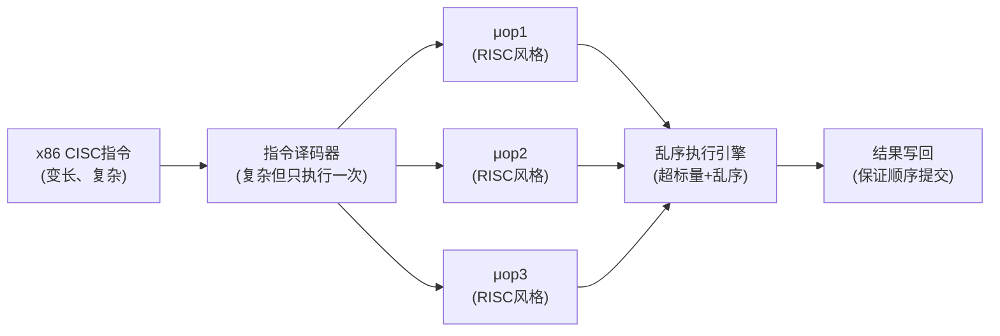
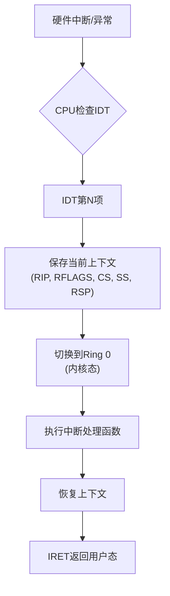

## 1.1 ISA：CPU的指令集架构

### 1.1.1 什么是ISA

ISA（Instruction Set Architecture，指令集架构）是计算机系统中最重要的抽象层——它定义了**硬件（CPU）与软件（编译器/操作系统）之间的契约**。任何运行在x86处理器上的程序，无论Windows还是Linux，无论C语言还是Rust，都是通过ISA这一接口与硬件交互的。

ISA具体定义了以下五大要素：

| 要素 | 含义 | 举例 |
|------|------|------|
| 指令集 | CPU能执行的操作类型 | `ADD`（加法）、`MUL`（乘法）、`LOAD`（加载）、`STORE`（存储）、`BRANCH`（跳转） |
| 寄存器 | CPU内部的高速存储单元 | x86-64的RAX、RBX、RCX等通用寄存器，XMM0-15等SIMD寄存器 |
| 内存寻址模式 | 操作数的定位方式 | 立即数、寄存器直接、直接内存、间接寻址、基址+变址+比例因子+偏移 |
| 数据类型与对齐 | 数据在内存中的组织方式 | 整数（8/16/32/64位）、浮点数（IEEE 754单双精度）、SIMD向量 |
| 中断与异常处理 | 外部事件和错误的响应机制 | 硬件中断（I/O完成）、软件中断（系统调用）、CPU异常（除零、页错误） |

**类比理解**：如果把CPU比作一位厨师，ISA就是这位厨师掌握的完整菜谱手册。菜谱决定了三件事——厨师**能做什么菜**（指令集）、**用什么工具**（寄存器和寻址模式）、**遇到突发情况怎么处理**（中断异常机制）。不同的菜谱体系决定了完全不同的烹饪风格和效率。

**为什么ISA如此重要？** 因为它是软件生态的基石。Intel从1978年的8086到今天的Core i9，历经40多年，指令集始终向后兼容。你在今天写的x86汇编代码，理论上仍然可以在一台1985年的80386上运行。这种稳定性让整个软件生态——从操作系统到编译器到应用程序——可以在硬件迭代中持续积累而不被推倒重来。

ISA也是一种**设计哲学的体现**：设计者在指令集的复杂度、性能、功耗、编码密度之间做出的权衡选择。不同的选择造就了完全不同的处理器家族。

### 1.1.2 CISC vs RISC：两大架构哲学

计算机体系结构历史上最重要的分野是CISC和RISC之争。这不是简单的"谁更好"，而是两种截然不同的设计哲学在不同历史条件下的产物。

#### CISC：复杂指令集计算机

CISC（Complex Instruction Set Computer）诞生于内存极其昂贵的年代（1960-70年代）。当时1KB内存的价格相当于今天的数万美元，因此设计者拼命压缩每条指令的编码，希望用一条指令完成尽可能多的工作。

**核心设计理念**：
- **指令功能强大**：一条指令可以完成"读内存→计算→写回内存"的完整操作
- **指令数量庞大**：x86指令集有超过1000条指令（含变体）
- **寻址模式丰富**：支持多种操作数定位方式，减少寄存器压力
- **编码变长**：1到15字节不等，允许复杂指令用更多字节编码

**CISC的典型代表——x86系列**：

; x86 CISC示例：一条指令完成内存到内存的加法
ADD [RAX + RBX*4 + 0x10], 0x42
; 含义：从地址 (RAX + RBX*4 + 0x10) 读取数据，加上 0x42，写回原地址
; 这一条指令在RISC上需要至少4条指令才能完成

#### RISC：精简指令集计算机

RISC（Reduced Instruction Set Computer）起源于1980年代的学术研究。Berkeley的David Patterson和Stanford的John Hennessy发现：程序中80%的时间只使用20%的指令，而那些复杂的CISC指令在实际中很少被使用。

**核心设计理念**：
- **指令简单统一**：每条指令只做一件事，执行时间可预测
- **指令数量精简**：ARM A64指令集约200-300条基本指令
- **Load/Store架构**：只有专门的加载/存储指令才能访问内存，其他指令只能操作寄存器
- **固定编码长度**：所有指令统一4字节，简化取指和译码

**RISC的典型代表——ARM A64**：

```asm
// ARM A64：需要多条指令完成同样的操作
LDR  W0, [X1, X2, LSL #2]   // 加载：从 X1 + X2*4 读取32位数据到 W0
ADD  W0, W0, #0x42           // 加法：W0 = W0 + 0x42
STR  W0, [X1, X2, LSL #2]   // 存储：将 W0 写回 X1 + X2*4
```

#### 完整对比

| 特性 | CISC（如x86） | RISC（如ARM） |
|------|---------------|---------------|
| 指令长度 | 变长（1-15字节） | 固定（4字节） |
| 指令数量 | 1000+（含变体和前缀） | 200-300（基本指令） |
| 单指令操作 | 复杂（一条指令完成加载+计算+存储） | 简单（每条指令只做一件事） |
| 寻址模式 | 丰富（直接、间接、基址+偏移、比例变址等） | 简单（主要靠Load/Store） |
| 译码复杂度 | 高（需要微码翻译，多级译码） | 低（硬连线译码，单周期可完成） |
| 代码密度 | 高（单条指令功能强，总字节数少） | 低（需要更多指令完成同一任务） |
| 流水线效率 | 低（变长指令导致取指困难） | 高（固定长度便于对齐取指） |
| 功耗 | 较高（译码器复杂，晶体管多） | 较低（简单译码器，适合移动设备） |
| 生态系统 | 桌面/服务器主导（Windows、Linux） | 移动/嵌入式主导（Android、iOS） |

#### 关键洞察：现代CPU的"外CISC内RISC"设计

这是理解现代x86处理器最关键的一点：**现代Intel/AMD处理器本质上是RISC核心外包了一层CISC的"翻译壳"**。

x86 CISC指令在译码阶段被拆分成更小的μops（micro-operations，微操作），这些μops才是CPU内部真正执行的单元。每个μop都类似一条RISC指令——简单、固定、可预测。



这个设计的精妙之处在于：
- **对软件透明**：程序员和编译器看到的仍然是CISC接口，不需要改变
- **对硬件高效**：内部用RISC风格的μops执行，享受流水线、乱序执行等所有现代优化
- **译码器做一次性开销**：变长指令的译码复杂度只在译码阶段支付一次，后续执行阶段完全按RISC方式运行

AMD的Zen架构和Intel的Core架构都在译码阶段设置了微码ROM，将复杂的CISC指令展开为3-10个μops。一些特别复杂的指令（如`REP MOVSB`字符串复制）可能展开为数十个μops。

#### 现代架构的融合趋势

值得注意的是，CISC和RISC的界限在现代已经变得模糊：

- **x86在RISC化**：内部执行μops，越来越依赖编译器生成的简单指令序列
- **ARM在CISC化**：ARMv8增加了`LDP/STP`（成对加载/存储）、`NEON`复杂向量指令、`SVE`可变长度向量扩展
- **RISC-V的务实选择**：作为最晚出生的主流ISA，RISC-V在保持精简核心的同时，通过可选扩展支持复杂指令

现代处理器设计的竞争焦点早已不是"CISC还是RISC"，而是**微架构实现**——同样的ISA可以有截然不同的性能表现（比如同一ARM指令集，Apple M系列和某些低端ARM芯片的性能差距可达10倍以上）。

### 1.1.3 x86-64寄存器组织

寄存器是CPU内部最快的数据存储单元。理解寄存器的组织方式，是理解CPU如何高效执行指令的基础。访问寄存器的延迟约为0.3-0.5纳秒（1个CPU周期），而访问L1缓存需要约1纳秒，访问主存则需要约100纳秒。

#### 通用寄存器

x86-64架构提供了16个64位通用寄存器（RAX到R15），相比x86-32的8个寄存器翻了一倍。更多的寄存器意味着编译器可以将更多变量保存在寄存器中，减少昂贵的内存访问。

| 寄存器 | 64位 | 32位 | 16位 | 8位低 | 传统用途 | System V AMD64 ABI调用约定 |
|--------|------|------|------|-------|---------|--------------------------|
| RAX | RAX | EAX | AX | AL | 返回值、累加器 | 返回值（整数/指针） |
| RBX | RBX | EBX | BX | BL | 基址寄存器 | 被调用者保存（callee-saved） |
| RCX | RCX | ECX | CX | CL | 循环计数器 | 第4个整数参数 |
| RDX | RDX | EDX | DX | DL | 乘除法辅助 | 第3个整数参数 |
| RSI | RSI | ESI | SI | SIL | 源字符串指针 | 第2个整数参数 |
| RDI | RDI | EDI | DI | DIL | 目标字符串指针 | 第1个整数参数 |
| RSP | RSP | ESP | SP | SPL | 栈指针 | 栈指针（不可通用） |
| RBP | RBP | EBP | BP | BPL | 栈帧基址 | 被调用者保存（可选帧指针） |
| R8 | R8D | R8W | R8B | — | 64位新增 | 第5个整数参数 |
| R9 | R9D | R9W | R9B | — | 64位新增 | 第6个整数参数 |
| R10 | R10D | R10W | R10B | — | 64位新增 | 调用者保存（caller-saved） |
| R11 | R11D | R11W | R11B | — | 64位新增 | 调用者保存（caller-saved） |
| R12 | R12D | R12W | R12B | — | 64位新增 | 被调用者保存 |
| R13 | R13D | R13W | R13B | — | 64位新增 | 被调用者保存 |
| R14 | R14D | R14W | R14B | — | 64位新增 | 被调用者保存 |
| R15 | R15D | R15W | R15B | — | 64位新增 | 被调用者保存 |

**为什么了解调用约定很重要？** 当你用C/C++编写函数或分析汇编代码时，调用约定决定了参数如何传递、返回值在哪里、哪些寄存器需要保存。System V AMD64 ABI（Linux默认）和Microsoft x64 ABI（Windows默认）的调用约定不同：

// System V AMD64 (Linux): 前6个整数参数用RDI, RSI, RDX, RCX, R8, R9
// Microsoft x64 (Windows): 前4个整数参数用RCX, RDX, R8, R9

// 以下C函数在两个平台上编译后，汇编代码会有不同的参数传递方式：
long add(long a, long b) {
    return a + b;
}
// Linux汇编：  add(参数a在RDI, 参数b在RSI) → 结果在RAX
// Windows汇编：add(参数a在RCX, 参数b在RDX) → 结果在RAX

#### 段寄存器与RIP相对寻址

x86-64在64位长模式下将段寄存器（CS、DS、ES、SS、FS、GS）的作用大幅简化——大多数量段寄存器的基址被固定为0，实现了平坦内存模型。但有两个例外仍然有实际用途：

- **FS段**：Linux用于指向线程局部存储（TLS，Thread-Local Storage），即`%fs:0`指向当前线程的TLS块
- **GS段**：Windows用于指向线程环境块（TEB，Thread Environment Block）

**RIP相对寻址**是x86-64新增的重要特性。在x86-32中，访问全局变量需要绝对地址（4字节），而x86-64使用RIP+偏移量（也是4字节偏移但可寻址±2GB），这使得位置无关代码（PIC）更加高效，对动态链接库（.so/.dll）的性能有显著提升。

#### SIMD寄存器：从SSE到AVX-512的演进

SIMD（Single Instruction, Multiple Data）寄存器是现代CPU高性能计算的关键。它们允许一条指令同时处理多个数据元素，是向量化编程的硬件基础。

| 指令集 | 寄存器 | 宽度 | 单精度浮点数并行度 | 首次出现 | 典型应用场景 |
|--------|--------|------|-------------------|---------|-------------|
| SSE | XMM0-15 | 128位 | 4个 | Pentium III (1999) | 基础向量化、多媒体处理 |
| AVX | YMM0-15 | 256位 | 8个 | Sandy Bridge (2011) | 科学计算、图像处理 |
| AVX-512 | ZMM0-31 | 512位 | 16个 | Skylake-X (2017) | 高性能计算、AI推理 |

**SIMD的工作原理**：

; 传统标量方式：4次循环做4次加法
ADDSS XMM0, XMM1   ; 加1个浮点数
ADDSS XMM0, XMM1   ; 再加1个浮点数
ADDSS XMM0, XMM1   ; 再加1个浮点数
ADDSS XMM0, XMM1   ; 再加1个浮点数

; SIMD方式：1条指令同时做4个浮点数加法
ADDPS XMM0, XMM1   ; 同时加4个浮点数（XMM0的4个元素各自加上XMM1的对应元素）

**寄存器的"部分寄存器"问题**：x86的向下兼容性导致了一个性能陷阱。当你只修改RAX的低32位（`EAX`）时，CPU的依赖性检测逻辑需要确保旧的RAX高32位数据不再被依赖。现代CPU通过寄存器消除（register renaming）技术在硬件层面解决了大部分问题，但在某些极端场景下（如频繁交替读写`AL`和`AX`），仍然可能产生性能惩罚。

### 1.1.4 内存寻址模式详解

x86-64的寻址模式是所有主流ISA中最丰富的，这也是CISC哲学的核心体现。掌握寻址模式对于理解汇编代码、调试性能问题、编写高效代码至关重要。

#### 标准寻址模式

x86-64的有效地址计算公式为：

有效地址 = 基址寄存器 + 变址寄存器 × 比例因子 + 偏移量

| 模式 | 语法示例 | 含义 | 实际用途 |
|------|---------|------|---------|
| 立即数寻址 | `MOV RAX, 42` | 操作数直接在指令中 | 常量赋值 |
| 寄存器寻址 | `MOV RAX, RBX` | 操作数在寄存器中 | 变量交换、临时值 |
| 直接内存寻址 | `MOV RAX, [0x1000]` | 操作数在固定内存地址 | 访问硬件寄存器（MMIO） |
| 间接寻址 | `MOV RAX, [RBX]` | 操作数地址在寄存器中 | 指针解引用 |
| 基址+偏移 | `MOV RAX, [RBX+8]` | 寄存器值加固定偏移 | 结构体成员访问、数组元素 |
| 基址+变址 | `MOV RAX, [RBX+RCX]` | 两个寄存器相加 | 数组动态索引 |
| 基址+变址+比例 | `MOV RAX, [RBX+RCX*4]` | 变址乘以比例因子 | 结构体数组的成员访问 |
| 完整形式 | `MOV RAX, [RBX+RCX*8+16]` | 基址+变址×比例+偏移 | 最一般的形式，编译器最爱用 |

#### 为什么寻址模式很重要？

编译器在生成代码时，寻址模式的选择直接影响指令数量和性能。一个好的寻址模式可以让一条指令替代多条指令：

```c
// C代码
struct Point {
    int x;  // 偏移0
    int y;  // 偏移4
};
int get_y(struct Point* p, int index) {
    return p[index].y;
}

// x86-64汇编：编译器使用完整的寻址模式，一条指令完成
// p[index].y 的地址 = p + index * sizeof(Point) + offsetof(y)
// = RDI + RSI * 8 + 4
MOV EAX, [RDI + RSI*8 + 4]   // 一条指令搞定：基址+变址×8+偏移4
RET
```

如果没有这些寻址模式，同样的操作需要用4-5条指令来完成：先把index乘8、加到p上、再加偏移4、然后加载内存。

#### RIP相对寻址的优势

x86-64引入的RIP相对寻址不仅节省了代码空间，更重要的是支持了**位置无关代码**（Position-Independent Code）：

```nasm
; x86-32：需要绝对地址（4字节），链接时必须修正
MOV EAX, [global_var]       ; 绝对地址，链接器需要重定位

; x86-64：使用RIP相对偏移，运行时自动计算
MOV EAX, [RIP + global_var] ; 相对于当前指令地址的偏移
; 或者编译器直接省略RIP，NASM会自动使用RIP相对寻址：
MOV EAX, [global_var]       ; 隐含使用RIP相对寻址
```

### 1.1.5 数据类型与内存对齐

ISA不仅定义了指令，还定义了数据在内存中的组织方式。理解数据类型和对齐要求对于编写高效、正确的程序至关重要。

#### x86-64的基本数据类型

| 类型 | 大小 | 说明 | 对齐要求 |
|------|------|------|---------|
| BYTE | 1字节 | 字符、布尔值 | 无特殊要求 |
| WORD | 2字节 | 短整数 | 2字节对齐 |
| DWORD | 4字节 | 整数、单精度浮点 | 4字节对齐 |
| QWORD | 8字节 | 长整数、双精度浮点、指针 | 8字节对齐 |
| XMMWORD | 16字节 | SSE向量 | 16字节对齐 |
| YMMWORD | 32字节 | AVX向量 | 32字节对齐 |
| ZMMWORD | 64字节 | AVX-512向量 | 64字节对齐 |

#### 对齐的重要性

CPU访问对齐的数据只需要一次内存操作，而访问未对齐的数据可能需要两次（跨缓存行或页面边界时），甚至在某些旧处理器上会触发硬件异常。

```c
// 对齐访问：高效（一次内存操作）
struct __attribute__((aligned(8))) AlignedData {
    long a;  // 地址0x1000，8字节对齐
    long b;  // 地址0x1008，8字节对齐
};

// 未对齐访问：低效（可能两次内存操作）
struct PackedData {
    char c;   // 地址0x1000
    long b;   // 地址0x1001（未对齐！读取需要跨两个8字节边界）
};
```

**现代CPU的硬件支持**：Intel和AMD的现代处理器都支持未对齐内存访问（不再触发异常），但在性能敏感的场景中，未对齐访问仍然可能导致2-3倍的延迟。对于SIMD指令，某些对齐的加载/存储指令（如`MOVAPS`）要求16字节对齐，否则会触发段错误。

### 1.1.6 中断与异常处理机制

中断和异常是CPU响应外部事件和内部错误的机制。它们是操作系统实现进程调度、内存管理、I/O处理的基础。

#### 中断 vs 异常

| 特性 | 中断（Interrupt） | 异常（Exception） |
|------|-------------------|-------------------|
| 来源 | 外部硬件设备 | CPU内部 |
| 时机 | 异步（随时可能发生） | 同步（执行特定指令时触发） |
| 例子 | 键盘输入、磁盘I/O完成、定时器 | 除零错误、缺页异常、断点 |
| 可屏蔽 | 部分可屏蔽（通过IF标志） | 不可屏蔽 |

#### 异常的三种子类型

**故障（Fault）**：可恢复的异常，修复后重新执行触发指令。最典型的是**缺页异常**（Page Fault）——访问一个虚拟地址对应的物理页尚未加载到内存时，CPU触发缺页异常，操作系统从磁盘加载页面后重新执行访问指令。

**陷阱（Trap）**：执行完当前指令后触发，返回点是下一条指令。典型用途是**系统调用**（`syscall`指令）——用户态程序通过陷阱进入内核态执行系统服务。

**中止（Abort）**：严重的硬件错误，无法恢复，通常导致操作系统panic。如硬件校验错误（ECC无法纠正的内存错误）。

#### 中断描述符表（IDT）

x86-64通过IDT（Interrupt Descriptor Table）将中断号映射到处理函数。IDT有256个表项，每个表项包含处理函数的地址、特权级、类型等信息。



### 1.1.7 主流ISA全景对比

除了x86和ARM，当今世界还有多个重要的ISA家族。了解它们的定位和特点，有助于在技术选型时做出明智判断。

| ISA | 开发者 | 许可模式 | 主要应用 | 核心特点 |
|-----|--------|---------|---------|---------|
| x86-64 | Intel/AMD | 私有授权 | 桌面、服务器 | 向后兼容40年，性能最强但功耗高 |
| ARM A系列 | ARM Ltd. | 商业授权 | 手机、平板、笔记本 | 低功耗高性能，Apple M系列证明其潜力 |
| ARM M系列 | ARM Ltd. | 商业授权 | 微控制器、IoT | 极低功耗，Cortex-M系列统治MCU市场 |
| RISC-V | RISC-V基金会 | 开源免费 | IoT、嵌入式、新兴领域 | 开源免授权费，可自由定制扩展 |
| MIPS | MIPS Technologies | 商业/开源 | 路由器、游戏机 | 教科书经典，实际市场份额持续缩小 |
| LoongArch | 龙芯 | 龙芯授权 | 国产桌面/服务器 | 中国自主ISA，兼顾性能和自主可控 |
| POWER | IBM | 商业授权 | 大型机、HPC | 高可靠性，IBM大型机的基石 |
| WebAssembly | W3C | 开源标准 | 浏览器、边缘计算 | 沙箱化执行，跨平台二进制格式 |

#### RISC-V：开源ISA的崛起

RISC-V是近年来最受关注的ISA，它的核心价值不在于性能（目前还追不上x86和高端ARM），而在于**开放性和可定制性**：

- **零授权费**：任何人可以自由使用、实现、修改，无需向任何公司支付授权费
- **模块化设计**：基础指令集RV32I/RV64I仅约47条指令，通过可选扩展（M/A/F/D/C/V等）按需添加功能
- **生态快速成长**：Linux内核已正式支持RISC-V，多个厂商推出了RISC-V芯片

RISC-V的模块化架构：
┌─────────────────────────────────┐
│  可选扩展                        │
│  ┌───┐ ┌───┐ ┌───┐ ┌───┐ ┌───┐│
│  │ M │ │ A │ │F/D│ │ C │ │ V ││
│  │乘除│ │原子│ │浮点│ │压缩│ │向量││
│  └───┘ └───┘ └───┘ └───┘ └───┘│
├─────────────────────────────────┤
│  基础指令集 RV64I               │
│  (47条指令，必需)                │
└─────────────────────────────────┘

### 1.1.8 ISA设计中的关键权衡

设计一套ISA需要在多个相互矛盾的目标之间做出权衡。理解这些权衡有助于你理解不同ISA的设计决策。

#### 向后兼容 vs 架构纯洁性

**向后兼容的代价**：x86为了保持与1978年8086的兼容，不得不背负大量历史包袱。8086的分段内存模型、实模式、BCD运算指令（`DAA`/`DAS`）等早已过时，但至今仍在CPU中保留。这些历史指令增加了译码器复杂度、占用晶体管、消耗功耗。

**纯洁架构的优势**：ARM和RISC-V没有历史包袱，每条指令都是精心设计的。ARM从AArch32到AArch64时大胆抛弃了大部分旧指令，获得了更干净的架构。RISC-V作为全新设计，从一开始就避免了许多x86的教训。

但向后兼容也有巨大的商业价值——数十亿美元的x86软件投资不需要重写。这就是为什么"更好的架构"不一定能取代"占主导地位的架构"。

#### 指令数量 vs 灵活性

- **x86的哲学**：提供尽可能多的专用指令（如`POPCNT`计算二进制中1的个数、`CRC32`硬件循环冗余校验），让编译器或程序员可以用最少的指令完成任务
- **RISC-V的哲学**：提供最少量的通用指令，让硬件保持简单，将复杂操作留给编译器和软件实现

这不是非此即彼的选择。RISC-V可以通过扩展机制添加专用指令，而x86也可以通过编译器将复杂操作分解为简单指令序列。

#### 编码密度 vs 译码效率

变长编码（x86）在**编码密度**上占优——常见的简单指令用1-2字节，只有复杂指令才用更多字节。这减少了程序占用的内存和磁盘空间。

固定长度编码（ARM、RISC-V）在**译码效率**上占优——CPU可以直接根据指令地址的对齐关系确定每条指令的位置，取指和译码可以高度并行。ARM通过Thumb-2（16/32位混合编码）在两者之间取得了平衡。

### 1.1.9 实践：用GDB观察ISA的行为

理论知识需要通过实践来内化。以下练习帮助你直接观察ISA层面的行为。

#### 练习1：观察寄存器变化

```bash
# 编译一个简单的C程序
cat > test.c << 'EOF'
#include <stdio.h>
int main() {
    int a = 42;
    int b = 10;
    int c = a + b;
    printf("%d\n", c);
    return 0;
}
EOF
gcc -g -O0 -o test test.c

# 用GDB观察汇编执行
gdb ./test
(gdb) set disassembly-flavor intel
(gdb) break main
(gdb) run
(gdb) disassemble main       # 查看main函数的汇编代码
(gdb) si                     # 单步执行一条指令
(gdb) info registers         # 查看所有寄存器的变化
```

#### 练习2：观察CISC到μops的转换

```bash
# 使用Intel IACA或llvm-mca分析指令吞吐
cat > vec_add.c << 'EOF'
void add_arrays(float* a, float* b, float* c, int n) {
    for (int i = 0; i < n; i++) {
        c[i] = a[i] + b[i];
    }
}
EOF
gcc -O2 -mavx2 -S -o vec_add.s vec_add.c
cat vec_add.s    # 观察编译器生成的SIMD指令
```

#### 练习3：对比不同优化级别的汇编

```bash
# 对比-O0（无优化）和-O3（激进优化）的汇编差异
gcc -O0 -S -o test_O0.s test.c
gcc -O3 -S -o test_O3.s test.c
diff test_O0.s test_O3.s
# 观察：-O3下的常量折叠、循环展开、内联等优化如何改变指令序列
```

### 1.1.10 常见误区与纠正

| 误区 | 纠正 |
|------|------|
| "RISC一定比CISC快" | 现代x86（内部μops执行）和ARM的性能差距主要取决于微架构实现，而非ISA本身 |
| "x86就是CISC" | 现代x86 CPU内部执行的是RISC风格的μops，本质上是"外CISC内RISC" |
| "寄存器越多越好" | 超过一定数量后收益递减（编译器分配难度增加），x86-64的16个是经过验证的平衡点 |
| "未对齐访问一定很慢" | 现代x86的未对齐访问性能已经很好，只有跨缓存行边界时才有明显惩罚 |
| "SIMD总是更快" | SIMD对数据并行度要求高；数据不连续或存在数据依赖时，SIMD可能反而更慢 |
| "ISA决定一切" | 同一ISA的不同微架构实现（如Intel Alder Lake vs AMD Zen4）性能差异巨大 |
| "64位一定比32位快" | 64位模式的指针增大了结构体大小，可能降低缓存效率；对于不需要大地址空间的程序，32位可能更高效 |

### 1.1.11 进阶：ISA的未来演进趋势

#### 专用化与领域特定扩展

通用ISA正在向专用化方向演进。x86增加了AVX-512 VNNI（神经网络推理加速）、AMX（矩阵运算加速）；ARM增加了SME（可扩展矩阵扩展）；RISC-V通过自定义扩展支持各种专用加速。这反映了AI和大数据时代对特定计算模式的强烈需求。

#### 安全性增强

侧信道攻击（Spectre、Meltdown）的发现暴露了现代CPU微架构中的安全漏洞。未来的ISA设计正在将安全性提升到一等公民地位：

- **ARM的MTE**（Memory Tagging Extension）：为每个内存指针添加标签，检测缓冲区溢出和use-after-free
- **Intel的CET**（Control-flow Enforcement Technology）：硬件级别的控制流完整性保护，防御ROP/JOP攻击
- **RISC-V的Zkr扩展**：硬件随机数生成指令，支持密码学操作

#### 持续的性能演进

从指令集角度看，未来的主要趋势包括：更宽的向量/矩阵执行单元、更智能的内存预取指令、硬件事务内存（HTM）的成熟、以及异构计算（CPU+GPU+NPU）的统一ISA编程模型。

### 1.1.12 本节要点总结

1. **ISA是CPU与软件之间的契约**，定义了指令、寄存器、寻址模式、数据类型和中断机制
2. **CISC vs RISC不是非此即彼**，现代x86内部用RISC风格μops执行，ARM也在增加复杂指令
3. **寄存器是最快的存储**，理解寄存器组织和调用约定是读懂汇编代码的基础
4. **寻址模式直接影响代码效率**，一条好的寻址模式可以替代多条简单指令
5. **内存对齐**对于SIMD和性能敏感代码至关重要
6. **中断/异常机制**是操作系统实现进程管理、虚拟内存、I/O的核心基础设施
7. **ISA设计是权衡的艺术**，没有完美的ISA，只有适合特定场景的选择
