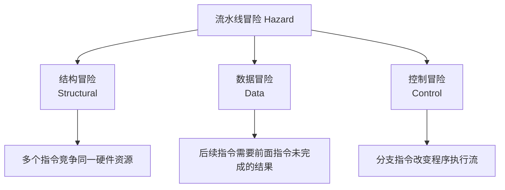
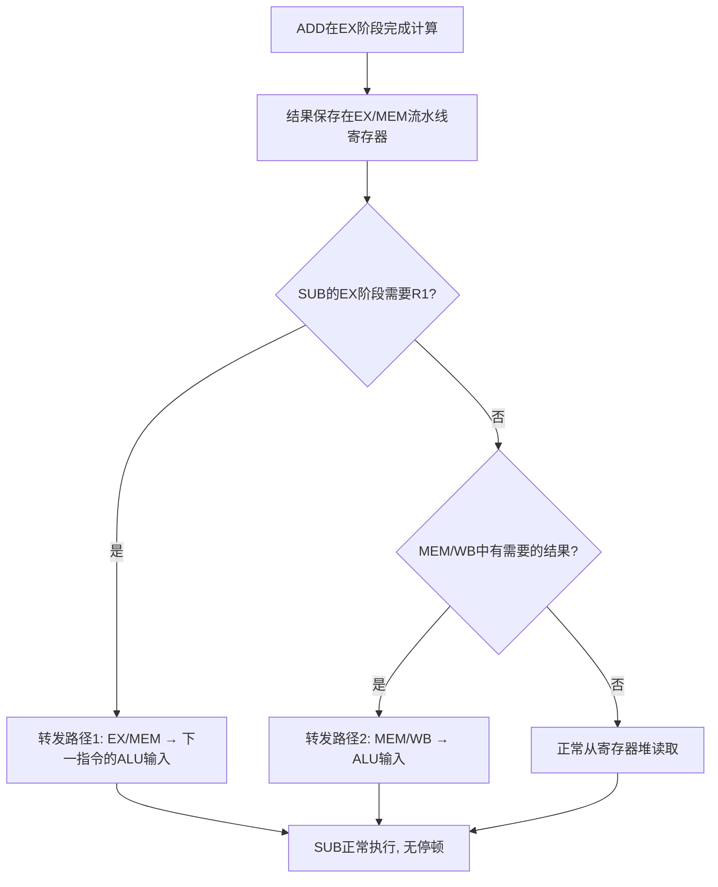
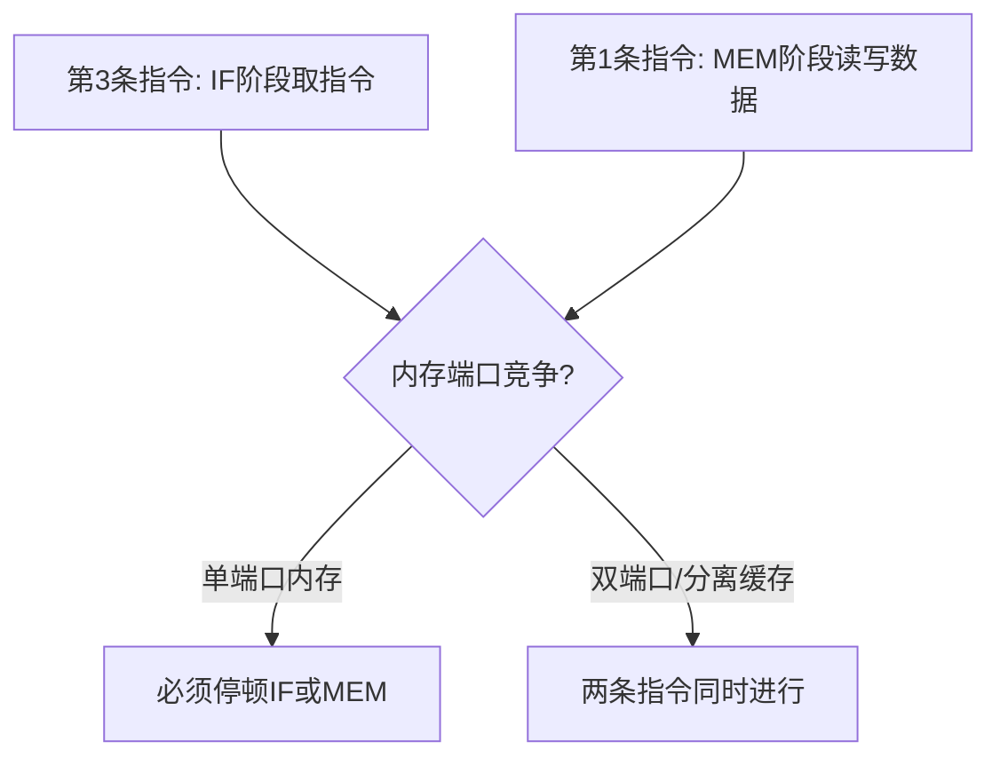
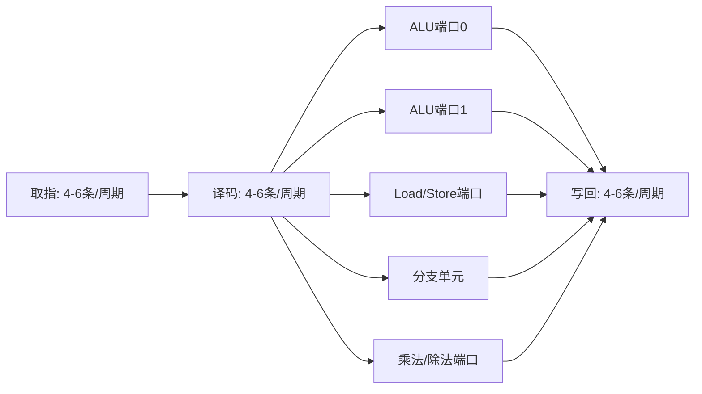

## 1.2 流水线技术

流水线（Pipeline）是现代CPU提升指令吞吐量的核心技术。理解流水线的工作原理、冒险机制和优化策略，是深入掌握CPU微架构的关键一步。本节从经典5级流水线出发，逐步揭示冒险检测、转发路径、分支处理等硬件机制，最后落脚到软件开发者如何利用流水线特性编写高性能代码。

---

### 1.2.1 从工厂装配线到CPU流水线

流水线的核心思想源自工业工程：亨利·福特在1913年将T型车的装配过程分解为45个独立工位，每个工位只负责一个特定操作，汽车在工位之间连续流动。这一创新将装配时间从12小时缩短到93分钟。

CPU流水线的本质与之完全一致：将一条指令的执行过程分解为若干独立阶段，每个阶段由专用硬件负责，多个指令的不同阶段重叠执行。关键区别在于，CPU流水线的每个阶段严格在一个时钟周期内完成——这是数字逻辑电路的同步特性决定的。

**流水线 vs 串行执行的本质差异**

| 对比维度 | 串行执行 | 流水线执行 |
|---------|---------|-----------|
| 执行方式 | 一条指令完成后再取下一条 | 多条指令的不同阶段同时进行 |
| 吞吐量 | 1条/5周期 = 0.2条/周期 | 1条/周期（理想值） |
| 单条延迟 | 5周期 | 5周期（不变） |
| 硬件开销 | 一套功能单元 | 5套功能单元 + 流水线寄存器 |
| 核心权衡 | 硬件简单，吞吐量低 | 硬件复杂，吞吐量高 |

这里有一个至关重要的区分：**流水线降低的是延迟还是吞吐量？** 答案是吞吐量。单条指令从取指到写回仍然需要5个周期（延迟不变），但每个周期都有一条新指令完成（吞吐量提升）。就像高速公路的车道数增加不会让每辆车开得更快，但能让更多车辆同时通行。

### 1.2.2 经典5级流水线

CPU执行一条指令的过程可以分解为5个阶段，每个阶段由独立的硬件模块负责：


| 阶段 | 英文 | 主要工作 | 硬件资源 | 典型耗时 |
|------|------|----------|----------|----------|
| 取指 | Instruction Fetch (IF) | 从指令缓存读取指令，更新程序计数器(PC) | 指令缓存(I-Cache)、PC寄存器、加法器 | 1个时钟周期 |
| 译码 | Instruction Decode (ID) | 解析操作码和操作数字段，读取寄存器堆，生成控制信号 | 译码器、寄存器堆(RegFile)、控制单元 | 1个时钟周期 |
| 执行 | Execute (EX) | ALU进行算术/逻辑运算、计算有效地址、比较分支条件 | 算术逻辑单元(ALU)、乘法器 | 1个时钟周期 |
| 访存 | Memory Access (MEM) | Load指令读数据缓存、Store指令写数据缓存 | 数据缓存(D-Cache)、Load/Store队列 | 1个时钟周期 |
| 写回 | Write Back (WB) | 将执行结果或访存数据写回寄存器堆 | 寄存器堆(RegFile) | 1个时钟周期 |

**流水线寄存器的作用**

每个阶段之间有一组流水线寄存器（Pipeline Register），用于保存当前阶段的处理结果并传递给下一阶段。这些寄存器是流水线能正常工作的物理基础：

- **IF/ID寄存器**：保存当前取到的指令编码和PC+4值
- **ID/EX寄存器**：保存译码后的操作数、控制信号、目标寄存器编号
- **EX/MEM寄存器**：保存ALU计算结果、要写入内存的数据、内存地址
- **MEM/WB寄存器**：保存从内存读取的数据或ALU结果、目标寄存器编号

没有流水线寄存器，多个阶段之间会发生信号干扰，流水线无法正常工作。这些寄存器也引入了一个关键约束：**每个阶段必须在一个时钟周期内完成**，时钟周期由最慢的阶段决定。

### 1.2.3 流水线时序分析

下面的时序图展示了3条指令在5级流水线中的执行过程。每一行代表一条指令，每一列代表一个时钟周期：

时钟周期:  1    2    3    4    5    6    7
指令1:    IF → ID → EX → MEM → WB
指令2:          IF → ID → EX  → MEM → WB
指令3:                IF → ID  → EX  → MEM → WB
                           ↓
                    从第5周期起,每周期有1条指令完成

**关键观察**：

1. **启动阶段**：前4个周期，流水线尚未填满，没有指令完成
2. **稳态阶段**：从第5个周期开始，每个周期都有1条指令完成写回
3. **排空阶段**：最后4个周期，流水线逐渐排空，同样没有新指令完成

对于n条指令，总周期数为 `5 + (n - 1) = n + 4`（前4个周期填充流水线，之后每个周期完成1条）。

#### 性能提升的严格推导

- **无流水线**：每条指令需要5个周期，n条指令需要 `5n` 个周期
- **5级流水线**：第一条指令需要5个周期，之后每条只需1个周期，总计 `5 + (n-1) = n+4` 个周期
- **加速比**：

Speedup = 5n / (n + 4)

当n=1:     5×1 / 5       = 1.0x   (无收益,只有一条指令)
当n=10:    5×10 / 14     = 3.57x
当n=100:   5×100 / 104   = 4.81x
当n=1000:  5×1000 / 1004 = 4.98x
当n→∞:     趋近5倍        = 5.0x

| 指令数(n) | 无流水线耗时 | 5级流水线耗时 | 加速比 | 流水线效率 |
|-----------|-------------|--------------|--------|-----------|
| 1条 | 5ns | 5ns | 1.0x | 0% (仅1条，无法重叠) |
| 5条 | 25ns | 9ns | 2.8x | 56% |
| 10条 | 50ns | 14ns | 3.6x | 71% |
| 50条 | 250ns | 54ns | 4.6x | 93% |
| 100条 | 500ns | 104ns | 4.8x | 96% |
| 1000条 | 5000ns | 1004ns | 5.0x | 99.6% |

**效率公式**：流水线效率 = 实际加速比 / 理论最大加速比 = (n+4) / (n+4) × (5n/(n+4))/5 ... 实际上就是 `(n+4) / (5 × (n/5))`，简化后为 `(n+4) / n`。当n远大于流水线深度时，效率趋近100%。

这个分析揭示了一个重要事实：**流水线只有在大量指令连续执行时才能发挥最大效益**。如果程序频繁中断（系统调用、中断、异常），流水线需要反复填充和排空，实际加速比会大打折扣。

---

### 1.2.4 流水线冒险

流水线并非完美，有三种冒险（Hazard）会阻碍流水线的顺畅运行。冒险处理不当会导致流水线停顿（Stall），降低实际吞吐量，甚至引发计算错误。



#### 数据冒险（Data Hazard）

数据冒险发生在后续指令需要使用前面指令尚未写回的结果时。这是最常见的冒险类型，根据读写顺序分为三种子类型。

**1. RAW（Read After Write）——真数据依赖**

这是唯一真正影响正确性的数据冒险，后续指令确实需要前面指令的计算结果：

```asm
ADD R1, R2, R3    ; R1 = R2 + R3，在EX阶段计算，WB阶段写回
SUB R4, R1, R5    ; 需要R1的值作为减数，但ADD还没写回
```

时序分析（无转发机制）：

时钟周期:  1    2    3    4    5    6    7
ADD:       IF → ID → EX → MEM → WB
SUB:            IF → ID → [STALL] → EX → MEM → WB
                              ↑ SUB等待ADD的WB结果
                              ↑ 流水线停顿2个周期

SUB在第4周期的EX阶段需要R1的值，但ADD直到第5周期的WB阶段才将结果写入寄存器堆。在没有转发机制的简单流水线中，SUB必须停顿2个周期（插入2个气泡）等待数据就绪。

**2. WAR（Write After Read）——反依赖**

后续指令在前面指令读取寄存器之前就覆盖了该寄存器的值：

```asm
ADD R1, R2, R3    ; 需要读取R2、R3
SUB R2, R4, R5    ; 写入R2（可能在ADD读取R2之前执行）
```

在**顺序执行的简单流水线**中，WAR冒险不会产生问题——译码阶段读寄存器在前，写回阶段写寄存器在后，读操作总是先于写操作完成。但在**乱序执行**的现代CPU中，SUB可能被提前调度到ADD之前执行并写入R2，导致ADD读到错误的值。消除WAR假依赖的方法是**寄存器重命名**（详见1.3节）。

**3. WAW（Write After Write）——输出依赖**

两条指令都写入同一个寄存器，最终结果取决于写入顺序：

```asm
ADD R1, R2, R3    ; 写入R1（应该先写）
SUB R1, R4, R5    ; 写入R1（应该后写）
```

按照程序语义，R1的最终值应该是SUB的结果（后写的覆盖先写的）。但在乱序执行中，如果SUB比ADD先完成写回，R1会保留ADD的结果而非SUB的结果，导致计算错误。消除WAW假依赖同样通过**寄存器重命名**实现。

**三种依赖类型的本质区别**

| 依赖类型 | 是否真依赖 | 顺序执行是否安全 | 乱序执行是否安全 | 消除方法 |
|---------|-----------|----------------|----------------|---------|
| RAW（写后读） | 是，真依赖 | 需要转发/停顿 | 需要转发/停顿 | 转发、停顿、编译器调度 |
| WAR（读后写） | 否，假依赖 | 安全（读先于写） | 不安全（可能乱序） | 寄存器重命名 |
| WAW（写后写） | 否，假依赖 | 安全（写保持顺序） | 不安全（可能乱序） | 寄存器重命名 |

#### 数据冒险的解决方案

**方案一：转发/旁路（Forwarding/Bypassing）**

转发是解决RAW冒险最高效的硬件机制。核心思想是：不需要等待结果写回寄存器堆，而是直接将计算结果从流水线寄存器传递给需要它的后续指令。



三条主要转发路径（以MIPS为例）：

1. **EX/MEM → EX**：最近一条指令的ALU结果直接送到下一条指令的ALU输入。这是最常见、延迟最低的转发路径，覆盖了大部分RAW场景。
2. **MEM/WB → EX**：上两条指令的结果（可能经过MEM阶段，如Load指令）从MEM/WB流水线寄存器转发。用于间隔一条指令的数据依赖。
3. **WB → ID（寄存器堆内部转发）**：寄存器堆支持同时读写——当写端口和读端口同时操作同一寄存器时，读端口直接返回将要写入的值。这消除了"写回阶段写入、译码阶段读取"的冒险。

转发机制的效果是显著的：对于3条连续指令的RAW依赖链（ADD→SUB→MUL，每条依赖前一条的结果），无转发需要停顿4个周期，有转发只需停顿0个周期。

**方案二：流水线暂停/气泡（Stall/Bubble）**

当转发也无法解决时，必须插入气泡（Bubble）暂停流水线。最典型的场景是**Load-Use冒险**：

```asm
LW R1, 0(R2)     ; Load从内存读取数据到R1
ADD R4, R1, R5    ; 立即需要R1作为加数
```

Load指令的数据在MEM阶段才从缓存中读出，而ADD指令的EX阶段需要在MEM阶段之前执行。即使有转发路径，Load的结果也无法"穿越时间"在EX阶段就可用。这是**所有转发机制都无法消除的最小停顿**——Load-Use冒险需要至少1个气泡。

时钟周期:  1    2    3    4    5    6    7
LW:        IF → ID → EX → MEM → WB
ADD:            IF → ID → [STL] → EX → MEM → WB
                                ↑ 插入1个气泡
                                     ↑ LW在MEM阶段的结果转发给ADD

硬件检测逻辑：当译码阶段发现当前指令的操作数依赖上一条Load指令的目标寄存器时，自动插入一个气泡。这个检测逻辑非常简单——只需要比较目标寄存器编号，是流水线控制单元中最基础的冒险检测器。

**方案三：编译器调度（Compiler Scheduling）**

编译器可以通过重新排列指令顺序，将不相关的指令插入延迟槽，减少流水线停顿：

```asm
; 原始代码：Load-Use冒险，停顿1周期
LW R1, 0(R2)
ADD R4, R1, R5    ; 停顿1周期，等待R1
SUB R6, R7, R8    ; 独立指令
MUL R9, R10, R11  ; 独立指令

; 编译器优化：将无关指令前移
LW R1, 0(R2)
SUB R6, R7, R8    ; 填充Load-Use延迟槽（不依赖R1）
MUL R9, R10, R11  ; 继续填充
ADD R4, R1, R5    ; 此时R1已经就绪（经过2个周期），无停顿
```

编译器调度的效果取决于可用的无关指令数量。在指令密集的循环体中，通常有足够多的独立指令可以填充；而在简单的线性代码中，可用的调度空间有限。

更高级的编译器技术还包括：

- **循环展开（Loop Unrolling）**：复制循环体多次，减少循环控制开销，同时暴露更多可调度的指令
- **软件流水线（Software Pipelining）**：从不同迭代中抽取指令组合成新的循环体，使每次迭代同时包含来自不同原始迭代的指令
- **VLIW调度**：为超长指令字架构显式填充并行槽位

#### 控制冒险（Control Hazard）

控制冒险发生在分支指令改变程序执行流时。CPU在分支结果确定之前已经预取了后续指令，如果分支跳转，这些预取的指令是错误的：

```asm
CMP R1, R2
BEQ label        ; 如果相等跳转到label
ADD R3, R4, R5   ; 这条指令已经进入流水线了！
SUB R6, R7, R8   ; 这条也是！
```

时序分析：

时钟周期:  1    2    3    4    5
CMP:       IF → ID → EX → MEM → WB
BEQ:            IF → ID → EX  → MEM → WB
ADD:                 IF → ID  → EX  → MEM → WB
                          ↑ 分支结果在EX阶段才确定

如果BEQ跳转，ADD和SUB都是错误的预取指令，需要**冲刷（Flush）**流水线。冲刷意味着将错误进入流水线的指令标记为无效，浪费了已消耗的功耗和性能。

**分支预测的基本策略**

分支预测是解决控制冒险的主流方案（1.4节有更深入的分析）。这里简要介绍基本策略：

| 策略 | 原理 | 典型准确率 | 硬件开销 |
|------|------|-----------|---------|
| 静态预测（不跳转） | 总是假设分支不跳转 | ~60% | 零 |
| 静态预测（向后跳） | 向后跳转预测为跳，向前跳转预测不跳 | ~65-70% | 零 |
| 1位预测器 | 记录上次分支结果 | ~75-80% | 极小 |
| 2位饱和计数器 | 连续两次预测错误才改变方向 | ~85-90% | 小 |
| 相关预测器（GShare） | 结合PC和全局分支历史 | ~90-95% | 中等 |
| TAGE预测器 | 多个不同历史长度的预测表 | ~95-97% | 较大 |

现代CPU的分支预测准确率通常在95%以上。对于15级流水线的CPU，这意味着每20次分支只有1次预测错误需要冲刷流水线，实际性能损失很小。

**分支目标缓冲（BTB, Branch Target Buffer）**

BTB是一个缓存结构，存储最近执行过的分支指令的目标地址。当IF阶段取到一条分支指令时，同时用PC索引BTB查找目标地址。如果命中（BTB中记录了该分支上次跳转的目标），可以直接从目标地址取指，无需等待译码和执行阶段。

BTB对于间接跳转（如虚函数调用、switch语句）尤为重要——这些跳转的目标地址在运行时动态变化，BTB能显著减少地址计算延迟。

**延迟槽（Delay Slot）**

这是MIPS架构的经典方案：分支指令后面的1条（或几条）指令总是执行，无论分支是否跳转。编译器需要在这"延迟槽"中填充一条有用的指令：

```asm
; MIPS延迟槽示例
BEQ R1, R2, label
SUB R6, R7, R8    ; 延迟槽：这条指令总是执行
; 编译器会尝试把一条有用的指令移到这里
; 如果没有有用指令可填，放NOP
```

延迟槽是一种"硬件简化"方案——通过让编译器承担部分冒险处理责任来简化硬件设计。但现代处理器（包括ARM和RISC-V的主流实现）已很少使用延迟槽，因为深流水线和分支预测的组合比延迟槽更高效。

#### 结构冒险（Structural Hazard）

结构冒险发生在多个指令同时需要使用同一硬件资源时。这是三种冒险中最容易通过硬件升级解决的类型。

**经典案例：单端口内存冲突**



如果指令缓存和数据缓存共享同一个存储端口，IF阶段的取指和MEM阶段的访存会同时竞争，导致必须停顿其中一个阶段。

**现代解决方案**

| 方案 | 原理 | 应用场景 |
|------|------|---------|
| 哈佛架构（缓存层面） | L1缓存分离为I-Cache和D-Cache | 几乎所有现代CPU |
| 增加功能单元 | 多个ALU、多个乘法器并行执行 | 超标量CPU |
| 资源复制 | 增加内存端口数量、多端口寄存器堆 | 高性能核心 |
| 流水线调度 | 暂停低优先级请求，避免资源冲突 | 动态调度器 |

现代CPU通过分离I-Cache和D-Cache，基本消除了取指和访存之间的结构冒险。但在更细粒度上，结构冒险仍然存在——例如多个指令同时需要写入寄存器堆（WAW冲突），或多个指令同时竞争同一个ALU（如两条乘法指令）。这些需要通过增加执行端口和寄存器堆端口数来解决。

---

### 1.2.5 现代CPU的流水线实现

经典5级流水线是教学模型，现代CPU的流水线要复杂得多。主要的扩展方向有两个：**加宽**（超标量）和**加深**（超流水线）。

#### 超标量（Superscalar）：每个周期发射多条指令

超标量CPU每个时钟周期从译码器发射多条指令到多个执行单元并行执行。这突破了经典流水线"每周期1条指令"的理论上限：



| 微架构 | 每周期发射宽度 | 执行端口数 | 最大并行度 |
|--------|-------------|-----------|-----------|
| ARM Cortex-A8 | 2 | 2 | 2 μops/cycle |
| Intel Skylake | 6 (4解码 + 2微码) | 8 | 6 μops/cycle |
| Intel Golden Cove (Alder Lake P核) | 6 | 12 | 6 μops/cycle |
| AMD Zen 4 | 6 | 6 | 6 μops/cycle |
| Apple M1 Firestorm | 8 | 8 | 8 μops/cycle |

超标量的关键约束不是发射宽度，而是**指令级并行度（ILP）**——程序中真正可以并行执行的独立指令数量。即使CPU每周期能发射6条指令，如果指令之间存在大量数据依赖，实际并行度可能只有2-3。这就是为什么现代CPU不仅加宽流水线，还需要乱序执行来挖掘更多ILP（详见1.3节）。

#### 超流水线（Superpipelining）：将阶段进一步细分

超流水线将经典阶段拆分为更细的子阶段，使每个子阶段的逻辑更简单，从而允许更高的时钟频率。代价是流水线更深，分支预测失败和中断的代价更大。

| CPU | 流水线深度 | 时钟频率 | 典型IPC | 每周期发射 | 备注 |
|-----|-----------|---------|---------|-----------|------|
| MIPS R4000 | 8级 | 100-200MHz | 1 | 1 | 早期超流水线 |
| Intel Pentium 4 (Willamette) | 20级 | 1.3-2.0GHz | 0.7-1 | 1-2 | 高频策略开始 |
| Intel Pentium 4 (Prescott) | 31级 | 2.8-3.8GHz | 0.7-1 | 1-2 | 超流水线的极端尝试 |
| AMD Athlon 64 | 12级 | 1.8-2.8GHz | >1 | 3 | 更短流水线、更高IPC |
| ARM Cortex-A8 | 13级 | 0.6-1.0GHz | 1-2 | 2 | 移动端平衡设计 |
| ARM Cortex-A77 | 13级 | 2.4-2.8GHz | 2-3 | 4 | 现代移动高性能 |
| Intel Skylake | ~14-19级 | 3.0-5.0GHz | 2-3 | 4-6 | 主流桌面/服务器 |
| AMD Zen 4 | ~19-21级 | 4.0-5.7GHz | 2-3 | 6 | 高频+高IPC并行 |
| Apple M1 Firestorm | ~14-16级 | 3.0-3.2GHz | 3-4 | 8 | 移动端最高IPC |

**Pentium 4 Netburst架构：超流水线的反面教材**

Pentium 4的31级流水线是CPU设计史上最具争议的决策之一。Prescott核心（2004年）将流水线拉深到31级，目标是突破4GHz频率墙。实际效果：

- **频率目标达成**：最高3.8GHz，确实是当时的最高频率
- **IPC严重下降**：每周期实际完成的指令数不到1条，远低于同期AMD Athlon 64的1+ IPC
- **分支预测代价巨大**：预测失败需冲刷31级流水线，浪费31个周期
- **功耗爆炸**：3.8GHz Prescott功耗115W，而Athlon 64仅67W

根本原因：**频率提升带来的收益被IPC下降完全抵消**。频率从2GHz提升到3.8GHz（1.9倍），但IPC从~1.2降到~0.7（0.58倍），实际吞吐量只提升了1.1倍（1.9×0.58），而功耗翻倍。AMD的Athlon 64用12级流水线、2.4GHz频率，在同功耗下性能反而领先。

**关键洞察**：流水线深度不是越深越好。需要在频率（由阶段数决定）和IPC（受分支预测代价、数据冒险代价、功耗约束影响）之间找到最优平衡点。现代CPU普遍选择14-21级，正是这个平衡的体现。

#### 保留站与重排序缓冲

现代乱序执行CPU使用以下关键组件协同工作：

1. **重排序缓冲（ROB, Reorder Buffer）**：维护指令的程序顺序，确保结果按原序提交（Retire），支持精确异常处理
2. **保留站（RS, Reservation Station）/ 调度器**：等待操作数就绪后才发射指令到执行单元，消除不必要的停顿
3. **物理寄存器文件（PRF）**：通过寄存器重命名消除假依赖（WAR、WAW冒险），将16个架构寄存器映射到上百个物理寄存器
4. **执行端口**：连接到不同功能单元（ALU、FPU、Load/Store单元等），支持多条指令同时执行

这些组件的详细工作原理将在1.3节（乱序执行）中深入分析。此处只需理解：**乱序执行是流水线技术的终极演进**——它在保持程序语义正确性的同时，最大化指令级并行度，使超标量CPU的宽流水线真正发挥作用。

---

### 1.2.6 推测执行与流水线安全

推测执行（Speculative Execution）是现代CPU流水线的关键特性。当分支预测器预测"跳转"时，CPU不是等待分支结果，而是**提前沿着预测路径执行**后续指令。如果预测正确，这些提前执行的指令结果直接可用，省去了等待分支结果的10-20个周期；如果预测错误，丢弃所有推测执行的结果，从正确路径重新开始。

推测执行大幅提升了流水线效率，但也引入了安全隐患。

#### Meltdown与Spectre：推测执行的副作用

2018年公开的Meltdown和Spectre漏洞利用了推测执行的微架构副作用：

**Spectre（变体1：边界检查绕过）**：

```c
// 受害者代码
if (index < array_size) {        // 分支预测器"学习"到这个分支通常成立
    value = array[index];         // 推测执行时，即使index越界也会执行
    secret = shared_table[value * 4096]; // 利用推测执行泄露secret
}
```

攻击者通过训练分支预测器，让CPU错误地推测执行越界访问。虽然推测执行的架构结果被丢弃，但**数据被加载到缓存中的副作用**（Cache Side Channel）可以被攻击者探测到。通过分析缓存命中/未命中的时序差异，攻击者可以逐字节泄露内核内存。

**应对措施**：

| 措施 | 原理 | 性能影响 |
|------|------|---------|
| KPTI (Kernel Page Table Isolation) | 内核和用户态使用不同的页表 | 5-30% |
| Retpoline | 替换间接跳转为安全的返回序列 | 2-10% |
| IBRS/IBPB | 限制分支预测器的跨进程共享 | 5-15% |
| SSBD (分支预测禁用) | 禁用推测执行中的分支预测 | 10-30% |
| 硬件修复（新CPU） | 微架构层面隔离推测执行副作用 | 接近零 |

理解这些漏洞的价值在于：它们证明了**流水线和推测执行不仅仅是性能优化，更是安全边界**。软件开发者在编写安全敏感代码时，需要了解微架构行为，使用编译器提供的安全屏障（如Linux内核中的 `array_index_nospec()` 宏）防止推测执行泄露信息。

---

### 1.2.7 流水线性能分析

#### 核心性能指标

**CPI（Cycles Per Instruction）——每条指令的平均时钟周期数**

CPI是衡量流水线效率的核心指标。理想情况下CPI=1（每周期完成1条指令），但冒险会导致CPI>1：

实际CPI = 理想CPI + 冒险惩罚
        = 1 + (数据冒险停顿 + 控制冒险停顿 + 结构冒险停顿) / 总指令数

**IPC（Instructions Per Cycle）——每个时钟周期的平均指令数**

IPC是CPI的倒数，更适合描述超标量CPU的性能。现代超标量CPU的IPC通常在2-4之间，Apple M1的Firestorm核心在特定工作负载下可达4+。

**流水线效率**

效率 = 实际IPC / 理论最大IPC × 100%

例如，一个4发射超标量CPU，IPC为2.8，则效率为70%。30%的损失来自冒险停顿、缓存未命中、分支预测失败等因素。

#### 各类冒险对性能的量化影响

| 冒险类型 | 典型停顿开销 | 现代CPU缓解效果 | 残余性能损失 |
|---------|-------------|----------------|------------|
| RAW数据冒险 | 0-3周期/次 | 转发消除大部分 | Load-Use仍需1周期 |
| Load-Use冒险 | 1周期/次 | 编译器调度减少 | 无法完全消除 |
| 控制冒险（分支预测失败） | 10-30周期/次 | TAGE预测>95%准确率 | 仅5%分支产生冲刷 |
| 结构冒险 | 1-2周期/次 | 哈佛架构+多端口 | 现代设计中极少出现 |
| 缓存未命中（L1） | 3-5周期/次 | 预取+大缓存 | 随机访问模式下显著 |
| 缓存未命中（L2/L3） | 10-50周期/次 | 软件预取 | 数据局部性差时严重 |

#### 用perf测量流水线性能

Linux的perf工具可以直接测量流水线相关性能事件：

```bash
# 查看整体CPI和IPC
perf stat -e cycles,instructions -- command

# 输出示例：
#  1,234,567,890  cycles
#    987,654,321  instructions  # 0.80 insn per cycle
# → IPC = 0.80, CPI = 1.25

# 查看分支预测失败
perf stat -e branch-misses,branches -- command

# 输出示例：
#    12,345,678  branches
#       617,284  branch-misses  # 5.00% of all branches

# 查看流水线停顿（需要支持的CPU）
perf stat -e machine_clears,resource_stalls.rob -- command

# 详细的微架构分析
perf stat -e \
    uops_issued.any,\
    uops_executed.thread,\
    l1d_pend_miss.pending,\
    br_misp_retired.all_branches \
    -- command
```

**性能诊断流程**：

1. 先看IPC：如果IPC远低于理论值（如4发射CPU的IPC<2），说明流水线效率低
2. 检查分支预测失败率：如果>5%，说明分支模式复杂或不可预测
3. 检查缓存未命中率：L1D未命中率>10%说明数据局部性差
4. 检查流水线停顿事件：识别是数据冒险、结构冒险还是资源瓶颈

---

### 1.2.8 软件开发者的流水线视角

理解流水线对编写高性能代码至关重要。以下是与流水线直接相关的代码优化技术。

#### 分支对性能的影响与优化

分支预测失败的代价 = 流水线深度 × 失败频率 × 分支密度。以15级流水线的CPU为例：

场景：每100条指令中有15条分支指令

情况A（规律分支，如循环）：预测失败率2%
→ 停顿 = 15 × 2% × 15 = 4.5 周期/100条指令
→ CPI = 1 + 4.5/100 = 1.045
→ 性能损失约4.5%

情况B（随机分支，如数据依赖判断）：预测失败率50%
→ 停顿 = 15 × 50% × 15 = 112.5 周期/100条指令
→ CPI = 1 + 112.5/100 = 2.125
→ 性能损失约53%！

情况C（优化后，减少分支数量到5条/100条指令）：
→ 停顿 = 5 × 50% × 15 = 37.5 周期/100条指令
→ CPI = 1 + 37.5/100 = 1.375
→ 性能损失约27%（比情况B好一倍）

**分支优化技术**：

```c
// 技巧1：用位运算替代条件判断
// 原始代码（分支）
if (x > 0) y = x; else y = -x;

// 优化后（无分支，用算术技巧）
y = (x ^ (x >> 31)) - (x >> 31);  // 等价于abs(x)

// 技巧2：用查找表替代复杂条件链
// 原始代码（多个分支）
switch (grade) {
    case 'A': score = 4; break;
    case 'B': score = 3; break;
    case 'C': score = 2; break;
    default:  score = 0; break;
}

// 优化后（无分支，O(1)查找）
static const int table[26] = {
    ['A'-'A']=4, ['B'-'A']=3, ['C'-'A']=2
};
score = table[grade - 'A'];

// 技巧3：对数值密集型代码，用SIMD替代分支
// 原始代码（逐个判断）
for (int i = 0; i < n; i++) {
    if (data[i] > threshold)
        result[i] = data[i];
    else
        result[i] = threshold;
}

// 优化后（SIMD无分支）
__m256 vthreshold = _mm256_set1_ps(threshold);
for (int i = 0; i < n; i += 8) {
    __m256 v = _mm256_loadu_ps(&amp;data[i]);
    __m256 cmp = _mm256_cmp_ps(v, vthreshold, _CMP_GT_OQ);
    __m256 sel = _mm256_blendv_ps(vthreshold, v, cmp);
    _mm256_storeu_ps(&amp;result[i], sel);
}
```

**分支提示（Hints）**：

编译器提供 `__builtin_expect()` 宏告诉编译器分支的可能方向，让编译器更好地安排代码布局：

```c
// 热路径（经常执行的分支）放在连续的代码段
// 这样CPU的指令缓存更容易命中
if (__builtin_expect(error_condition, 0)) {  // 极少执行
    handle_error();  // 放在远处的冷代码段
}
process_data();  // 热路径紧跟if语句
```

GCC的 `[[likely]]` / `[[unlikely]]` 属性（C++20）和Linux内核的 `likely()` / `unlikely()` 宏都是这一思想的封装。

#### 循环展开与流水线

循环展开（Loop Unrolling）可以同时减少分支预测失败频率和增加指令级并行度：

```c
// 原始循环：每次迭代1条分支
for (int i = 0; i < n; i++) {
    sum += a[i];
}
// 分支频率：每1条指令中有0.25条分支（循环回边）

// 展开4次：每4次迭代才1条分支
for (int i = 0; i < n; i += 4) {
    sum += a[i] + a[i+1] + a[i+2] + a[i+3];
}
// 分支频率降低到1/4，且4次加法之间无依赖，可并行执行

// 展开8次（配合SIMD）：
// 4次展开 + AVX2（8个float并行）= 每次处理32个float
```

展开的副作用与权衡：

| 展开因子 | 分支减少 | 指令缓存压力 | 寄存器压力 | 适用场景 |
|---------|---------|------------|-----------|---------|
| 2x | 50% | 低 | 低 | 通用优化 |
| 4x | 75% | 中 | 中 | 循环体较简单 |
| 8x | 87.5% | 高 | 高 | 循环体极简单+SIMD |
| 16x | 93.75% | 很高 | 很高 | 特殊场景 |

现代编译器（GCC `-funroll-loops`、LLVM `-mllvm -unroll-count=4`）会自动决定最优展开因子。手动展开通常只在编译器无法自动优化的场景下使用。

#### 数据局部性与Load-Use延迟

Load指令的结果需要1个周期才能转发给后续指令（Load-Use冒险）。代码组织应尽量减少这种"Load后立即使用"的模式：

```c
// 不好：连续的Load-Use，每次都产生1个周期停顿
x = array[i];       // Load-Use停顿
y = x + 1;          // 等待x
z = array[j];       // Load-Use停顿
w = z + 2;          // 等待z

// 更好：交错Load和计算，隐藏Load延迟
x = array[i];       // Load x
z = array[j];       // Load z（与x的Load-Use延迟重叠）
a = x + 1;          // 此时x已就绪
b = z + 2;          // 此时z已就绪
```

更深层的优化考虑：

```c
// 预取（Prefetch）：提前将数据加载到缓存
// 当数据访问模式可预测时特别有效
for (int i = 0; i < n; i++) {
    __builtin_prefetch(&amp;array[i + 16], 0, 0);  // 预取16个元素后
    process(array[i]);
}
// 预取让数据在需要时已经在L1缓存中，避免3-5周期的L1访问延迟
// 或更糟的L2/L3/主存延迟
```

#### 流水线友好的代码组织原则

1. **热路径短小紧凑**：将频繁执行的代码放在连续的内存地址，减少指令缓存未命中
2. **减少数据依赖链**：长依赖链会阻塞流水线，通过重组计算打破串行依赖
3. **利用指令级并行**：同一循环体中的独立计算可以并行执行
4. **避免假共享**：多线程程序中，不同线程修改同一缓存行的不同变量会导致伪共享，严重降低流水线效率

---

### 1.2.9 常见误区

**误区1：流水线越深性能越好**

事实：流水线深度增加可以提高频率，但也增加了分支预测失败的代价和设计复杂度。Pentium 4的31级流水线是反面教材——频率从2GHz提升到3.8GHz，但IPC从~1.2降到~0.7，实际吞吐量提升不到10%，功耗却翻倍。现代CPU倾向于适中的流水线深度（15-21级），在频率和IPC之间取得平衡。

**误区2：分支预测只是"碰运气"**

事实：现代分支预测器使用复杂的算法（如TAGE预测器使用多个不同历史长度的预测表），准确率可达95-97%。分支预测是CPU中最重要的性能优化之一——Intel在Skylake架构上为分支预测器分配了数万个晶体管。没有准确的分支预测，现代深流水线CPU的性能会下降30-50%。

**误区3：CPI=1就是最优的**

事实：在超标量CPU中，理想CPI可以低于1（即IPC>1）。如果CPI=1，可能意味着流水线中存在大量停顿，或者没有充分利用超标量能力。一个4发射超标量CPU的CPI应该是0.25-0.5之间才正常。

**误区4：编译器优化不影响流水线**

事实：编译器的指令调度、循环展开、分支消除等优化直接影响流水线效率。相同的算法，不同编译器产生的代码性能可能相差20-50%。理解流水线特性可以帮助开发者编写更"流水线友好"的代码，或更好地利用编译器的优化选项。

**误区5：流水线冒险只影响性能，不影响正确性**

事实：虽然现代CPU通过转发、暂停等机制保证了顺序执行程序的正确性，但错误的硬件实现或竞态条件可能导致流水线冒险引发的正确性问题。在FPGA设计或自定义处理器中，必须正确处理所有冒险类型。此外，推测执行的副作用还可能引发安全问题（如Spectre漏洞）。

**误区6：流水线是"免费的午餐"**

事实：流水线引入了显著的硬件开销——每级都需要流水线寄存器、冒险检测逻辑、转发路径、分支预测器等。深流水线CPU的芯片面积中，流水线控制逻辑可能占30-40%。此外，流水线增加了功耗（寄存器翻转消耗动态功耗）和设计验证复杂度。

**误区7：流水线技术对软件开发者不重要**

事实：理解流水线特性直接影响代码性能。分支预测失败、Load-Use延迟、指令缓存未命中等问题，都需要软件层面的优化配合。掌握`perf`工具和流水线性能分析方法，是编写高性能代码的必备技能。

---

### 1.2.10 本节总结

| 核心概念 | 关键要点 |
|---------|---------|
| 流水线本质 | 提升吞吐量（非延迟），通过阶段重叠实现 |
| 性能公式 | 加速比 = 5n/(n+4)，n→∞时趋近流水线级数 |
| 数据冒险 | RAW真依赖需转发/停顿，WAR/WAW假依赖用重命名消除 |
| 控制冒险 | 分支预测是主流方案，TAGE准确率>95% |
| 结构冒险 | 现代设计通过分离I/D缓存和多端口资源基本消除 |
| 超标量 | 每周期发射多条指令，突破CPI=1的上限 |
| 超流水线 | 细分阶段提频率，但增加分支失败代价 |
| 推测执行 | 预测正确时获益巨大，但有安全副作用（Spectre） |
| 软件优化 | 减少分支、循环展开、预取、利用指令级并行 |

**下一步学习**：理解了流水线的基础原理后，1.3节将深入分析**乱序执行**——它是流水线技术的终极演进，通过Tomasulo算法和寄存器重命名，将指令级并行度推到极致。1.4节将详细解析**分支预测**的各种策略和实现细节。
