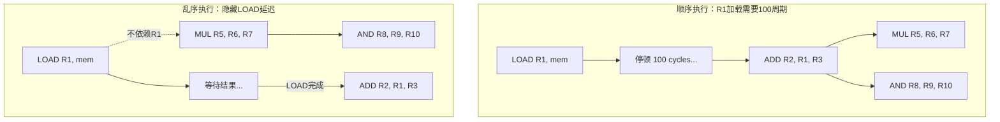
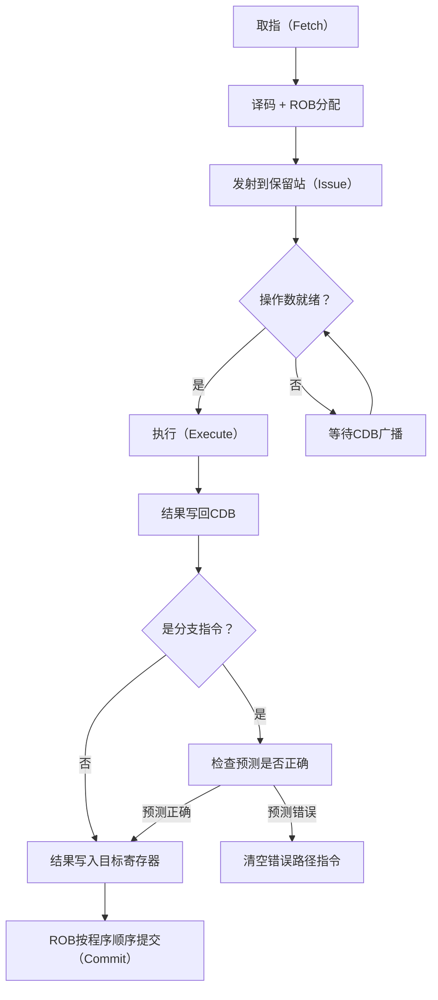
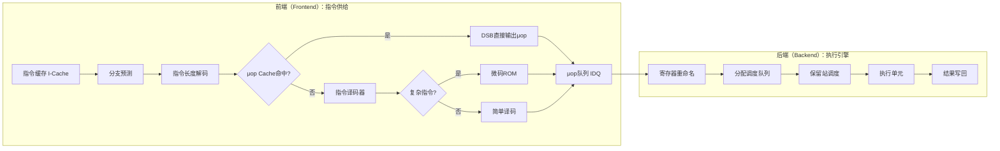
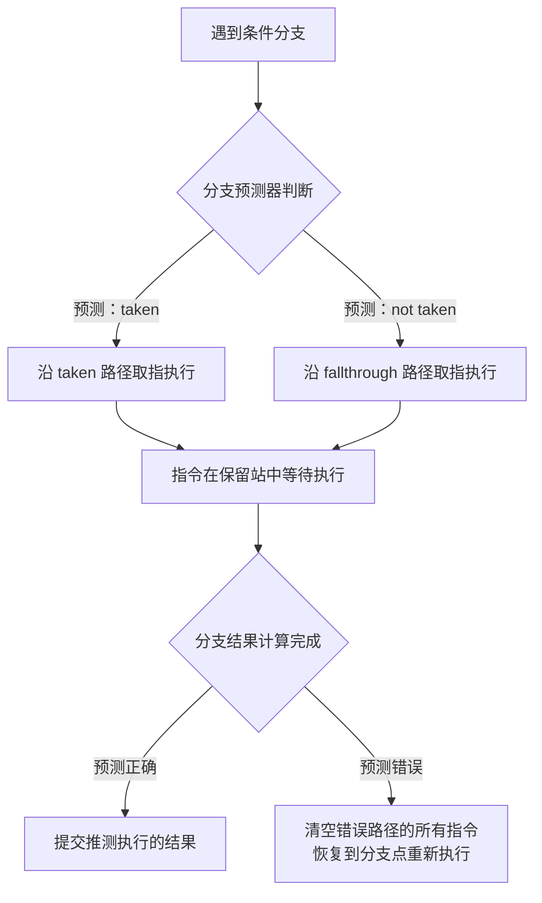
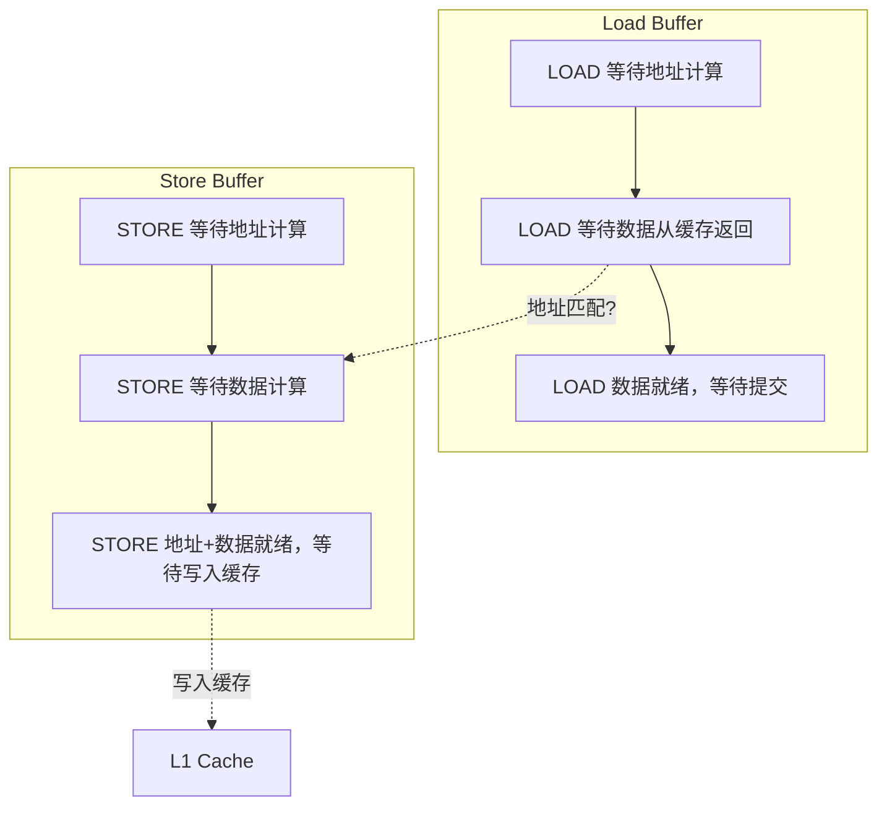

## 1.3 乱序执行（Out-of-Order Execution）

### 1.3.1 为什么需要乱序执行

在 1.2 节中我们学习了流水线技术——让多条指令重叠执行以提升吞吐量。但流水线有一个根本性假设：每条指令都能在一个周期内推进到下一阶段。现实远非如此。

#### 顺序执行的致命缺陷

顺序执行（In-Order Execution）的 CPU 遇到长延迟操作时必须停顿（stall），即使后续有大量与该操作无关的指令也得排队等待。这就是所谓的**流水线气泡（Pipeline Bubble）**——一个停顿会像多米诺骨牌一样沿流水线传播。

典型延迟场景：

| 延迟场景 | 典型延迟 | 相对时钟周期 | 说明 |
|---------|---------|------------|------|
| L1 Cache 命中 | 3-4 cycles | 最短 | 寄存器级别速度 |
| L2 Cache 命中 | 10-14 cycles | 中等 | 片上 SRAM |
| L3 Cache 命中 | 30-50 cycles | 较长 | 多核共享，含一致性开销 |
| 主存访问（DRAM） | 100-300 cycles | 极长 | 跨芯片总线+行激活+列读取 |
| 分支预测错误 | 10-20 cycles | 严重 | 清空流水线+重新取指 |
| 浮点除法 | 10-20 cycles | 较长 | 迭代算法，难以加速 |

当一条 LOAD 指令需要从主存加载数据时（100+ cycles），后续的加法、乘法等不依赖该数据的指令全部空等，CPU 利用率骤降。在一个每周期可执行 4 条指令的 4-wide 流水线中，100 cycles 的停顿意味着白白浪费了 400 条指令的执行机会。

#### 顺序执行的量化损失模型

我们可以用一个简单的公式来估算顺序执行的性能损失：

IPC_理想 = 发射宽度（如 4-wide）
IPC_实际 = IPC_理想 × (1 - 停顿比例)

停顿比例 = Σ(指令频率 × 停顿周期数 × 停顿概率)

以一个典型服务器负载为例：
- 25% 的指令是 LOAD
- 其中 5% 的 LOAD 会 L3 miss（访问主存）
- 每次 L3 miss 停顿 200 cycles
- 停顿贡献 = 25% × 5% × 200 = 2.5 cycles/指令
- 如果 IPC_理想 = 4，则 IPC_实际 = 4 × (1 - 2.5/4) = **1.5**（仅为理论峰值的 37.5%）

这意味着超过 60% 的执行能力被内存延迟白白浪费。

#### 乱序执行的核心思想

乱序执行打破了"严格按程序顺序执行"的限制：如果指令 B 不依赖指令 A 的结果，即使 A 排在前面且尚未完成，B 也可以先执行。这并非真正改变程序的逻辑顺序——结果仍然按原顺序提交（commit），只是中间的执行过程可以重排。

核心原则可以用一句话概括：**执行可以乱序，但提交必须顺序**。



#### 性能增益量化

假设一段代码有 10 条指令，其中第 3 条是 LOAD（100 cycles 延迟），后续 7 条中有 5 条不依赖该 LOAD 的结果：

- **顺序执行**：100 + 2 = 102 cycles（必须等 LOAD 完成才能执行后续指令）
- **乱序执行**：5 条无关指令可以在等待期间并行执行，总延迟约 100 + 1 = 101 cycles，但 CPU 功能单元的利用率从 ~3% 提升到 ~98%

真实场景中，现代 CPU 每周期可发射 4-6 条微操作（μops），乱序窗口（Reorder Buffer）可达 200-680 条（如 Intel Golden Cove 微架构为 512 条，AMD Zen 4 为 320 条），隐藏延迟的效果极为显著。

#### 乱序执行的历史演进

乱序执行并非现代 CPU 的发明。其思想可以追溯到：

| 年份 | 里程碑 | 贡献 |
|------|--------|------|
| 1967 | IBM System/360 Model 91 | Robert Tomasulo 提出保留站算法，首次在商用 CPU 中实现乱序执行 |
| 1981 | IBM 3090 | 引入分支预测 + 乱序执行的组合 |
| 1995 | Intel Pentium Pro | x86 首个乱序执行微架构，将 CISC 指令译码为类 RISC 的 μops |
| 2001 | IBM POWER4 | 进一步扩大乱序窗口，支持更多并行发射 |
| 2004 | Intel Pentium 4 (Prescott) | 31 级超深流水线 + 推测执行 |
| 2006 | Intel Core 2 (Merom) | 回归短流水线 + 宽乱序，奠定现代 CPU 基础 |
| 2011 | Intel Sandy Bridge | 引入 μop Cache（DSB），绕过译码阶段 |
| 2021 | Intel Alder Lake | 混合架构（P-Core 宽乱序 + E-Core 窄乱序） |
| 2023 | Apple M3 | 8-wide 发射，680 条 ROB 条目，移动端乱序之最 |

---

### 1.3.2 Tomasulo 算法

Tomasulo 算法由 IBM 的 Robert Tomasulo 于 1967 年为 IBM System/360 Model 91 设计，是乱序执行的经典实现框架。其核心目标是：**在保证正确性的前提下，最大化指令级并行度（ILP）**。

#### 核心组件

| 组件 | 功能 | 关键特性 |
|------|------|---------|
| **保留站（Reservation Station, RS）** | 每个功能单元前的缓冲区，存储等待执行的指令及其操作数 | 操作数就绪后方可发射；带标记的数据来源 |
| **寄存器重命名（Register Renaming）** | 将体系结构寄存器映射到物理寄存器，消除假依赖 | 消除 WAR 和 WAW 冲突 |
| **公共数据总线（Common Data Bus, CDB）** | 广播执行结果，所有等待该结果的保留站同时获取 | 单周期广播，支持寄存器旁路（bypass） |
| **重排序缓冲（Reorder Buffer, ROB）** | 记录指令的原始程序顺序，确保按序提交 | 异常处理和精确中断的基础 |

#### 完整执行流程



#### 执行阶段详解

**1. 取指（Fetch）**
从指令缓存（I-Cache）中取出指令，按程序顺序放入取指缓冲区。取指宽度通常为每周期 4-8 条指令。如果 I-Cache miss，需要从 L2/L3 甚至主存加载指令，前端会严重阻塞。

**2. 译码 + ROB 分配（Decode + Allocate）**
- x86 指令被译码为微操作（μops）。一条复杂的 x86 指令（如 `REP MOVSB`）可能产生多个 μop，而简单的 `ADD R1, R2, R3` 通常只产生 1 个 μop
- 为每条 μop 在 ROB 中分配一个条目，记录其原始顺序、目标寄存器、操作类型、源操作数标识
- 同时在对应功能单元的保留站中分配条目，如果保留站已满则发生**保留站满停顿**

**3. 发射（Issue）**
指令从保留站中发射（也叫"调度"）。发射条件：
- 至少有一个空闲保留站条目（否则发生保留站满停顿）
- 操作数就绪：寄存器值已可用或正在通过 CDB 传播（带标记匹配）

这就是乱序的关键：**哪条指令的操作数先就绪，哪条就先发射**，而非按程序顺序。

**4. 执行（Execute）**
在对应的功能单元（ALU、FPU、Load/Store 单元）上执行。执行延迟取决于操作类型：

| 操作类型 | 延迟（cycles） | 吞吐量 | 说明 |
|---------|---------------|--------|------|
| 整数加减法 | 1 | 每周期 1 条 | 最快的操作 |
| 整数乘法 | 3 | 每周期 1 条 | 64 位乘法需要部分积累加 |
| 浮点加法 | 3-4 | 每周期 1-2 条 | 含对阶和规格化 |
| 浮点乘法 | 3-5 | 每周期 1 条 | 部分积树形累加 |
| 浮点除法 | 10-20 | 每 4-10 周期 1 条 | 迭代算法，难以并行化 |
| 整数除法 | 20-90 | 每 20-90 周期 1 条 | 最慢的整数操作 |
| Cache miss 的 LOAD | 100-300 | 不确定 | 取决于内存子系统 |

**5. 写回 + CDB 广播（Write Back + CDB）**
执行结果通过 CDB 广播到所有保留站。任何在等待该操作数的指令同时获得数据，无需逐个通知。CDB 的宽度决定了结果广播的带宽——现代 CPU 通常有多条 CDB 以支持多个功能单元同时写回。

**6. 提交（Commit/Retire）**
结果按程序顺序写入体系结构寄存器或内存。这是乱序执行正确性的保证——即使中间执行乱了序，最终效果与顺序执行完全一致。提交阶段还负责：
- **异常处理**：只提交到第一条真正触发异常的指令，后续指令全部丢弃
- **中断响应**：在精确的程序状态点响应中断
- **内存可见性**：STORE 指令在此阶段才真正写入缓存（通过 Store Buffer）

#### 一个完整示例

考虑以下代码序列（假设 LOAD 需要 3 cycles，ADD 需要 1 cycle，MUL 需要 3 cycles）：

```asm
; Cycle 1: LOAD R1, [addr]     ; 从内存加载到R1，延迟3 cycles
; Cycle 1: ADD  R2, R3, R4     ; R2 = R3 + R4，与R1无关
; Cycle 1: MUL  R5, R6, R7     ; R5 = R6 * R7，与R1无关
; Cycle 1: ADD  R8, R1, R2     ; R8 = R1 + R2，依赖R1和R2
```

**顺序执行时序**：
Cycle 1: LOAD R1, [addr]   → 开始执行
Cycle 2: (LOAD 进行中)     → 停顿
Cycle 3: (LOAD 进行中)     → 停顿
Cycle 4: ADD R2, R3, R4    → R1 就绪
Cycle 5: MUL R5, R6, R7
Cycle 6: MUL ...
Cycle 7: MUL ...
Cycle 8: ADD R8, R1, R2    → R2 和 R1 都就绪
总计：8 cycles

**乱序执行时序**：
Cycle 1: LOAD R1, [addr]   → 开始（保留站等待）
         ADD R2, R3, R4    → 操作数就绪，立即执行
         MUL R5, R6, R7    → 操作数就绪，立即执行
Cycle 2: ADD R2 完成, CDB广播
         MUL R5 进行中
Cycle 3: MUL R5 完成, CDB广播
         ADD R8, R1, R2    → R1 刚好就绪（LOAD完成），R2 已就绪
Cycle 4: ADD R8 完成
总计：4 cycles（加速 2 倍）

#### Tomasulo 算法的逐步追踪

为了更深入理解 Tomasulo 算法的工作机制，让我们用一个包含分支的更复杂示例来逐步追踪保留站和 ROB 的状态变化：

```asm
; 假设 4-wide CPU，功能单元：2 ALU, 1 FPU, 1 Load/Store
; LOAD 延迟 2 cycles, ADD 延迟 1 cycle, MUL 延迟 3 cycles
01: LOAD  F1, [R10]      ; F1 ← Mem[R10]
02: ADD   F2, F1, F3     ; F2 ← F1 + F3（依赖指令 01）
03: MUL   F4, F5, F6     ; F4 ← F5 × F6（独立）
04: SUB   R1, R2, R3     ; R1 ← R2 - R3（独立）
05: ADD   F7, F4, F1     ; F7 ← F4 + F1（依赖指令 01 和 03）
```

**Cycle 1**：
- 指令 01-04 同时取指、译码
- ROB 分配 4 个条目（条目 1-4），保留站分配条目
- 指令 01 进入 Load 保留站，操作数就绪，立即发射
- 指令 03 进入 FPU 保留站，操作数就绪，立即发射
- 指令 04 进入 ALU 保留站，操作数就绪，立即发射
- 指令 02 进入 FPU 保留站，等待 F1（标记为等待指令 01 的结果）

**Cycle 2**：
- 指令 05 取指、译码，分配 ROB 条目 5
- 指令 01 的 LOAD 完成，结果 F1 通过 CDB 广播
- 指令 02 的 F1 就绪，立即发射
- 指令 04 的 SUB 完成
- 指令 03 的 MUL 进行中

**Cycle 3**：
- 指令 03 的 MUL 完成，结果 F4 通过 CDB 广播
- 指令 05 的 F4 就绪，但 F1 仍待确认（指令 02 还未完成 MUL）

**Cycle 4**：
- 指令 02 的 ADD 完成，结果 F2 通过 CDB 广播
- 指令 05 的 F7 等待 F4（已就绪）和 F1（已就绪），立即发射

**提交顺序**（严格按程序序）：
Cycle 2: 提交指令 01（LOAD 完成）
Cycle 3: 提交指令 04（SUB 完成）
Cycle 4: 提交指令 02（ADD 完成）
Cycle 5: 提交指令 03（MUL 完成）
Cycle 6: 提交指令 05（ADD 完成）

关键观察：指令 04（SUB）虽然在程序中排在第 4 位，但在 Cycle 2 就执行完毕，却要等到指令 01 和 02 都提交后才能提交。这就是 ROB 的作用——保证**精确状态**。

---

### 1.3.3 寄存器重命名

#### 假依赖的三种类型

在 1.2 节中我们学习了数据冒险。寄存器重命名专门解决其中的**假依赖**问题：

| 依赖类型 | 全称 | 含义 | 是否真依赖 | 重命名能否消除 |
|---------|------|------|----------|-------------|
| RAW | Read After Write | 后读前写的数据 | ✅ 真依赖 | ❌ 不能 |
| WAR | Write After Read | 后写前读（反依赖） | ❌ 假依赖 | ✅ 能 |
| WAW | Write After Write | 后写前写（输出依赖） | ❌ 假依赖 | ✅ 能 |

**RAW（真依赖）**：后面指令的输入是前面指令的输出。这种依赖无法消除，只能等待数据产生后执行。例如 `ADD R1, R2, R3` 后面跟 `SUB R4, R1, R5`，`SUB` 必须等 `ADD` 产生 `R1` 的值。

**WAR（反依赖）**：后面指令要写入的寄存器恰好是前面指令正在读取的。逻辑上两条指令没有数据传递关系，只是共用了同一个"名字"。例如 `ADD R1, R2, R3` 读 `R1` 作为输入，后面的 `MUL R1, R4, R5` 要写 `R1`——但 `MUL` 的执行不需要等 `ADD` 读完 `R1`，它们读写的是不同的逻辑值。

**WAW（输出依赖）**：两条指令都要写入同一个寄存器，但它们之间没有数据传递。例如连续两条 `ADD R1, R2, R3` 和 `ADD R1, R4, R5`，最终 `R1` 的值应该是后者的结果。在顺序执行中自然保证，但在乱序执行中必须确保提交顺序正确。

#### 重命名原理

寄存器重命名将程序员可见的体系结构寄存器（如 x86 的 RAX、RBX...R15，共 16 个通用寄存器 + 16 个 SSE/AVX 寄存器）映射到大量物理寄存器（现代 CPU 通常有 180-280 个）。当一条指令要写入某个体系结构寄存器时，分配一个新的物理寄存器，而非覆盖旧的。

这就像图书馆的借阅系统：读者（指令）看到的书架编号（体系结构寄存器）不变，但管理员（重命名硬件）在幕后将每本书的物理位置（物理寄存器）重新分配，避免不同读者在同一时间争夺同一本书。

#### 具体示例

```asm
; 原始代码
ADD R1, R2, R3    ; 1. 写 R1（RAW 依赖：后续指令读 R1 是真依赖）
SUB R4, R1, R5    ; 2. 读 R1（RAW 依赖：依赖指令 1 的结果）
MUL R1, R6, R7    ; 3. 写 R1（WAR 依赖：与指令 2 冲突，但逻辑上无关）
ADD R4, R1, R8    ; 4. 写 R4（WAW 依赖：与指令 2 冲突，但逻辑上无关）
```

**重命名后的映射关系**：

```asm
; 体系结构寄存器 → 物理寄存器映射表
; R1 → P1 (写入时分配), R1 → P8 (再次写入分配新映射)
; R2 → P2, R3 → P3, R4 → P4 (指令2), R4 → P9 (指令4分配新映射)

ADD P1, P2, P3    ; 1. 结果写入 P1（原 R1 的映射）
SUB P4, P1, P5    ; 2. 读 P1（RAW 依赖保留，正确获取指令 1 的结果）
MUL P8, P6, P7    ; 3. R1 新映射到 P8（WAR 消除！不再与指令 2 冲突）
ADD P9, P8, P10   ; 4. R4 新映射到 P9（WAW 消除！不再与指令 2 冲突）
```

**重命名前**：指令 3 必须等指令 2 读完 R1 才能写入（WAR），指令 4 必须等指令 2 写完 R4 才能写入（WAW）。

**重命名后**：指令 3 写入 P8，指令 2 读 P1，完全独立，可以并行执行。指令 4 写入 P9，与指令 2 的 P4 无关，也可以并行。

#### 物理寄存器管理机制

现代 CPU 使用两种物理寄存器管理方案：

**方案一：分离式（Intel 方案）**
┌─────────────────────────────────────────────────────┐
│  体系结构寄存器文件（Arch Register File）              │
│  保存提交状态：只有最终正确的值在这里                    │
│  x86-64: 16 个通用 + 16 个 XMM = 32 个条目            │
├─────────────────────────────────────────────────────┤
│  重命名寄存器文件（Rename Register File）              │
│  保存推测状态：所有在推测执行窗口中的中间值               │
│  Intel Golden Cove: ~280 个物理寄存器                  │
└─────────────────────────────────────────────────────┘

- 提交时将重命名寄存器的值复制到体系结构寄存器
- 优点：提交操作简单（寄存器复制）
- 缺点：需要两套寄存器文件，面积开销较大

**方案二：统一式（ARM/部分 RISC 方案）**
┌─────────────────────────────────────────────────────┐
│  统一物理寄存器文件（Unified Physical Register File）  │
│  既保存体系结构状态，也保存推测状态                      │
│  ARM Cortex-A78: ~200 个物理寄存器                     │
│  指令发射时分配，提交时标记为"已提交"                    │
│  推测失败时通过检查点恢复映射表                          │
└─────────────────────────────────────────────────────┘

- 单一物理寄存器文件同时承担体系结构和重命名功能
- 指令发射时分配，提交时"释放"（或通过检查点恢复）
- 寄存器利用率更高，但管理逻辑更复杂
- ARM 推测失败时可以快速恢复寄存器映射状态

**寄存器压力**：物理寄存器数量有限。当乱序窗口中活跃指令过多，物理寄存器耗尽，CPU 被迫停顿等待寄存器释放。这是乱序执行的一个重要限制因素。现代 CPU 的物理寄存器数通常为体系结构寄存器的 10-20 倍。可以通过以下公式估算寄存器压力：

所需物理寄存器 ≈ 发射宽度 × 流水线深度 + 活跃 LOAD/STORE 数 × 2
如果可用物理寄存器 < 所需 → 寄存器压力停顿

#### 标记文件（RAT）机制

寄存器重命名的核心数据结构是**寄存器别名表（Register Alias Table, RAT）**，它维护体系结构寄存器到物理寄存器的映射关系：

提交态 RAT（Committed RAT）: 永久映射，反映程序的确定状态
推测态 RAT（Speculative RAT）: 临时映射，反映当前推测执行路径的状态

当发生分支预测错误时，CPU 不需要逐条撤销重命名——只需将推测态 RAT 恢复到最近一次提交态 RAT 的快照即可。这个恢复操作在一个周期内完成，使得乱序执行的回滚代价相对可控。

---

### 1.3.4 乱序执行的前端与后端

现代 CPU 的乱序执行引擎可分为前端（Frontend）和后端（Backend），两者通过 μop 队列连接：



#### 前端：指令供给

前端负责将程序指令翻译成微操作（μops）并持续供给后端。前端瓶颈会导致后端"挨饿"——即使后端有再多的执行单元，没有指令可执行也是枉然。

**前端关键组件**：

| 组件 | 功能 | 性能影响 |
|------|------|---------|
| **指令缓存（I-Cache）** | 存放最近使用的指令 | miss 会严重阻塞前端，每次 miss 损失 10-100+ cycles |
| **μop Cache（DSB）** | 存放已译码的 μop，跳过译码阶段 | Intel Haswell 以后支持，命中时前端带宽翻倍 |
| **Loop Stream Detector（LSD）** | 自动检测小循环并缓存其 μop 序列 | 典型循环体 < 64 条 μop 时生效 |
| **指令预取器（Prefetcher）** | 预测未来需要的指令并提前加载到 I-Cache | 减少 I-Cache miss |

**μop Cache 的重要性**：

传统 x86 指令译码是一个复杂的过程——x86 指令长度可变（1-15 字节），译码器需要先确定指令边界，再将其拆分为 μops。Intel 的前端通常有 4 个译码器，其中只有 1 个能处理复杂指令（产生 4 个 μop），其余 3 个只能处理简单指令（1-2 个 μop）。这意味着：

简单指令: 4 条/周期（4 个译码器各处理 1 条）
混合指令: 约 3-5 个 μop/周期（受复杂指令比例影响）
μop Cache 命中: 最多 6 个 μop/周期（绕过译码，直接输出）

**前端瓶颈判断**：
- 如果 `idq.uops_not_delivered` 计数器高 → 前端供给不足
- 如果 I-Cache miss rate 高 → 取指带宽不够
- 如果 μop Cache miss rate 高 → 译码器成为瓶颈
- 如果 LSD 启动频繁 → 循环代码对前端压力大

#### 后端：执行引擎

后端包含执行单元、保留站、加载/存储队列等，是乱序执行的核心。

**后端关键组件**：

| 组件 | 功能 | 典型容量 |
|------|------|---------|
| **ROB（重排序缓冲）** | 保存所有在途指令的状态，按序提交 | 224-680 条目 |
| **保留站（RS）** | 等待操作数就绪的指令缓冲区 | 97-360 条目 |
| **物理寄存器文件** | 存放所有在途指令的中间结果 | 180-400 个寄存器 |
| **Load/Store 队列** | 管理内存操作的顺序和依赖 | 72-192 条目 |
| **执行单元** | ALU、FPU、SIMD、分支、Load/Store 单元 | 6-12 个单元 |

**后端关键指标**（通过 `perf` 可观测）：
- `uops_issued_any`：每周期发射的 μop 数
- `uops_executed_thread`：每周期执行的 μop 数
- `rob_full_events`：ROB 满导致的停顿
- `rs_full_events`：保留站满导致的停顿

**后端瓶颈判断**：
- 如果 `uops_executed < uops_issued` → 执行单元争用（某些功能单元过载）
- 如果 `rob_full` 高 → ROB 深度不够，推测窗口受限
- 如果 `rs_full` 高 → 保留站容量不够，指令堆积
- 如果 Load/Store 队列满 → 内存操作积压，影响 LOAD/STORE 乱序

#### 前端 vs 后端瓶颈的区分方法

使用 Top-Down Microarchitecture Analysis（TMA）方法可以精确定位性能瓶颈：

           总停顿
          /      \
    前端瓶颈    后端瓶颈
    /    \       /    \
  I-Cache  分支  执行   内存
  miss    预测  单元   停顿
         错误  争用

# TMA 一级分析
perf stat -e \
  idq.uops_not_delivered.core,\
  uops_executed.thread,\
  cycle_activity.stalls_l3_miss,\
  br_mispredict_all \
  -- ./benchmark

# 如果 idq.uops_not_delivered 高 → 前端瓶颈
# 如果 uops_executed 低但 issued 高 → 后端执行单元瓶颈
# 如果 cycle_activity.stalls_l3_miss 高 → 内存瓶颈

---

### 1.3.5 推测执行与分支预测

乱序执行的威力在于"提前执行可能需要的指令"。分支预测是推测执行的关键使能技术。

#### 推测执行的工作方式



#### 分支预测错误的代价

当预测错误时，所有在错误路径上已经进入乱序执行窗口的指令都必须被丢弃。代价包括：

- **前端清空**：已取指的错误路径指令全部作废，需从正确路径重新取指
- **后端清空**：ROB 中错误路径的条目全部释放，物理寄存器回收
- **流水线重填**：从新路径取指到结果可用，需要 10-20 cycles（取决于流水线深度）

分支预测错误的代价可以用以下公式量化：

分支损失 = 预测错误率 × 错误路径长度 × 每周期执行的指令数

示例：Intel Golden Cove（15 级流水线，6-wide）
- 分支预测错误率: 3%
- 错误路径平均长度: ~15 条 μop（从分支到 ROB 头部的距离）
- 每周期执行: 6 条 μop
- 损失 = 3% × 15 / 6 ≈ 0.075 cycles/指令
- 对 IPC 的影响: IPC_实际 = IPC_理想 × (1 - 0.075)

现代 CPU 分支预测准确率通常在 95%-99% 之间，但即便 5% 的错误率在高频流水线下也意味着显著的性能损失。分支预测的详细原理将在 1.4 节展开。

#### 间接跳转预测

函数指针、虚函数调用、switch-case 语句等使用间接跳转（`jmp rax`），其目标地址不固定。间接跳转预测比条件分支更难，因为同一个分支指令可能有多个不同的目标地址。现代 CPU 使用 **BTB（Branch Target Buffer）** 和 **indirect target array** 来预测——不仅记录"是否跳转"，还记录"跳转到哪里"。间接跳转预测错误的代价与条件分支类似，但更频繁出现在面向对象代码（虚函数调用）中。

#### 推测执行的安全隐患

推测执行虽然对程序员透明，但存在安全漏洞风险：

- **Spectre（2018）**：利用分支预测器的推测执行，在错误路径上访问本不应访问的内存。虽然推测执行的结果最终会被丢弃，但访问过程中对缓存状态的改变（Cache Side Channel）可以被攻击者利用来窃取敏感数据
- **Meltdown（2018）**：利用乱序执行在异常处理之前访问内核内存，通过 Cache 侧信道读取数据

这些漏洞的影响深远，导致了硬件层面的安全补丁（如 retpoline、IBRS、KPTI），但也带来了 5%-30% 的性能开销。推测执行的详细安全分析将在第 8 章（安全与隐私）中展开。

---

### 1.3.6 内存依赖与 LOAD/STORE 乱序

乱序执行中，LOAD 和 STORE 指令的处理比 ALU 指令更复杂，因为涉及内存地址的依赖分析。

#### LOAD-LOAD 重排序

两条 LOAD 指令如果访问不同地址，可以乱序执行。如果访问同一地址，必须保持顺序（RAW 依赖）。

```asm
LOAD R1, [addrA]    ; L1
LOAD R2, [addrB]    ; L2，如果 addrA ≠ addrB，可以先于 L1 执行
LOAD R3, [addrA]    ; L3，必须等 L1 完成（同地址 RAW）
```

CPU 通过**地址比较**来判断两条 LOAD 是否可能访问同一地址。如果无法确定（例如 addrA 是另一个 LOAD 的结果），CPU 会保守地假设存在依赖，这会限制 LOAD 乱序的程度。

#### LOAD-STORE 与 STORE-LOAD 依赖

```asm
STORE [addr], R1     ; S1
LOAD  R2, [addr]     ; L1：如果 addr 相同，L1 必须等 S1（STORE-LOAD 依赖）
```

STORE-LOAD 依赖是最难优化的：即使地址不同，CPU 在 STORE 的地址计算完成前无法确定是否存在冲突。现代 CPU 使用 **memory disambiguation（内存消歧）** 技术来预测：

- **Store-to-Load Forwarding（STORE 转发）**：如果 STORE 的数据已计算完毕且地址匹配，LOAD 可以直接从 Store Buffer 读取数据，无需等待写入缓存。这可以将 STORE-LOAD 的延迟从 100+ cycles 降低到 0-1 cycles
- **Memory Order Buffer（MOB）**：维护 LOAD/STORE 的顺序约束，确保内存操作的正确性。MOB 同时管理 Load Queue 和 Store Queue
- **Speculative Memory Disambiguation（推测内存消歧）**：CPU 猜测 LOAD 不与任何在途 STORE 冲突，直接执行。如果猜错，需要回滚并重新执行。Intel Haswell 以后支持此功能

#### Load Buffer 与 Store Buffer 的交互



**Load Buffer** 的典型容量为 72-128 条目，**Store Buffer** 的典型容量为 56-96 条目。当 Load Buffer 满时，新的 LOAD 指令无法发射，导致后端停顿。当 Store Buffer 满时，新的 STORE 指令无法发射，可能阻塞后续的 LOAD（如果存在 STORE-LOAD 依赖）。

#### 伪共享与乱序

当两个核心同时修改同一缓存行中的不同变量时，虽然逻辑上无依赖，但缓存一致性协议（MESI/MOESI）会导致频繁的缓存行传输。这个问题在 1.6 节（缓存一致性）和第 1 章核心技巧 25 节（伪共享检测与修复）中有详细讨论。

伪共享的典型症状：
- 两个线程各自执行独立计算，但共享同一缓存行
- 性能远低于预期，甚至比单线程更慢
- `perf c2c` 可以检测到高频的缓存行传输（HITM，Hit Modified）

修复方法：
- **填充（Padding）**：在变量之间添加填充字节，确保每个变量独占一个缓存行（64 字节对齐）
- **压缩（Compression）**：将频繁一起访问的变量合并到同一缓存行，减少跨核传输
- **无锁设计**：使用原子操作替代共享变量，避免缓存行在核间弹跳

---

### 1.3.7 乱序执行的硬件开销与局限性

乱序执行并非免费午餐，它以显著的硬件成本换取性能。

#### 功耗与面积

| 组件 | 占核心面积比例 | 功耗影响 | 说明 |
|------|-------------|---------|------|
| 重排序缓冲（ROB） | ~15-20% | 高（大 SRAM） | 每个条目需要存储指令元数据 |
| 保留站（RS） | ~10-15% | 中高 | 每个条目需要操作数标签和就绪位 |
| 物理寄存器文件 | ~10-15% | 高（读写端口多） | 多端口 SRAM，每增加一个端口面积翻倍 |
| 调度器（Scheduler） | ~5-10% | 中（组合逻辑密集） | 仲裁逻辑和优先级编码器 |
| **总计（乱序逻辑）** | **~40-60%** | **核心功耗的 60-70%** | 这是乱序执行的主要代价 |

作为对比，一个纯顺序执行的核心面积仅为乱序核心的 1/3-1/2。

#### 为什么 ARM big.LITTLE / Intel 混合架构存在

现代 SoC 采用大小核混合架构，本质是在性能和功耗之间寻找最优平衡点：

| 特性 | 性能核（P-Core） | 效率核（E-Core） |
|------|-----------------|-----------------|
| 发射宽度 | 6-8 wide | 3-4 wide |
| ROB 深度 | 256-512 条目 | 64-128 条目 |
| 流水线深度 | 15-21 级 | 8-11 级 |
| 典型频率 | 3.5-6.0 GHz | 1.5-3.0 GHz |
| 功耗 | 5-25W（单核） | 1-5W（单核） |
| 适用场景 | 前台交互、计算密集型 | 后台任务、IO 密集型 |

Intel 的 Thread Director 硬件线程调度器会实时监控每个线程的行为（指令类型、缓存命中率、分支模式），动态将线程分配到最适合的核心类型。例如：
- 前台浏览器渲染 → P-Core（需要高 IPC）
- 后台邮件同步 → E-Core（IO 等待为主，乱序执行无意义）
- 视频编码 → P-Core（计算密集）+ E-Core（预处理/后处理）

#### 顺序执行处理器的持续存在

并非所有处理器都需要乱序执行。在特定场景下，顺序执行仍然是最优选择：

- **RISC-V 低功耗核心**（如 NEORV32）：顺序执行，面积仅 0.1mm²，适合 FPGA 原型验证
- **嵌入式微控制器**（如 ARM Cortex-M0/M0+）：顺序流水线，功耗可低至 μW 级，适合 IoT 传感器
- **特定加速器**：GPU 的 SM 核心采用 SIMD 流水线而非通用乱序，TPU 的矩阵单元使用脉动阵列（Systolic Array），这些专用硬件通过数据级并行（DLP）而非指令级并行（ILP）来提升吞吐量
- **安全敏感场景**：顺序执行天然免疫 Spectre 类攻击，某些安全芯片选择顺序执行以避免推测执行的侧信道风险

---

### 1.3.8 现代 CPU 乱序实现对比

不同 CPU 厂商的乱序实现在设计理念上有显著差异：

| 特性 | Intel Golden Cove (12th Gen) | AMD Zen 4 | ARM Cortex-A78 | Apple M3 P-Core |
|------|----------------------------|-----------|----------------|-----------------|
| 发射宽度 | 6-wide | 6-wide | 8-wide | 8-wide |
| ROB 深度 | 512 条目 | 320 条目 | 224 条目 | 630+ 条目 |
| 保留站容量 | ~140 条目（整数） | ~96 条目 | ~128 条目 | ~300+ 条目 |
| 物理寄存器 | ~280（整数）+ ~332（向量） | ~224（整数）+ ~192（向量） | ~200 | ~400+ |
| μop Cache | 4096 μops | 4096 μops | 6000+ μops | 不公开 |
| Load Queue | 128 条目 | 88 条目 | 72 条目 | 130+ 条目 |
| Store Queue | 72 条目 | 64 条目 | 56 条目 | 80+ 条目 |
| 推测内存消歧 | 支持 | 支持 | 支持 | 支持 |

**设计理念差异**：

- **Intel**：注重 x86 兼容性和通用性能，通过微码 ROM 处理复杂 CISC 指令
- **AMD**：注重性价比，Zen 架构在较小的硬件面积下实现接近 Intel 的性能
- **ARM**：注重能效比，通过较小的乱序窗口和精细的功耗管理实现移动端最优
- **Apple**：不计成本追求极致性能，M3 的 ROB 深度（680 条目）远超同期竞品

---

### 1.3.9 性能分析与观测手段

#### 使用 perf 观测乱序执行行为

```bash
# 查看前端 vs 后端瓶颈
perf stat -e idq.uops_not_delivered.core,uops_executed.thread ./benchmark

# 查看 ROB 满停顿
perf stat -e rob_full_events ./benchmark

# 查看保留站满停顿  
perf stat -e rs_full_events ./benchmark

# 综合 CPU 微架构分析
perf c2c record ./benchmark    # Cache-to-Cache 分析（检测伪共享）
perf mem record ./benchmark     # 内存访问分析（LOAD/STORE 延迟分布）

# Top-Down Microarchitecture Analysis（TMA）
perf record -e cycles ./benchmark
perf report --tui    # 在 TUI 界面中查看 TMA 分类
```

#### Intel VTune 的乱序执行分析

```bash
# 在 VTune 中选择 Microarchitecture Analysis
vtune -collect microarchitecture ./benchmark

# 关键指标解读：
# - Clocks: 停顿周期数
# - CPI Unhalted: 未停顿时的 CPI
# - Frontend Bound: 前端瓶颈占比（I-Cache miss、译码器瓶颈）
# - Backend Bound: 后端瓶颈占比（执行单元争用、内存延迟）
# - Bad Speculation: 推测失败（分支预测错误等）占比
# - Retiring: 有效执行占比（越高越好）
```

#### 各指标的基准参考值

| 指标 | 优秀 | 良好 | 一般 | 差 |
|------|------|------|------|---|
| IPC（Instructions Per Cycle） | >4.0 | 2.5-4.0 | 1.5-2.5 | <1.5 |
| Frontend Bound | <10% | 10-20% | 20-30% | >30% |
| Backend Bound | <15% | 15-25% | 25-40% | >40% |
| Bad Speculation | <5% | 5-10% | 10-20% | >20% |
| Retiring | >60% | 40-60% | 25-40% | <25% |

#### 实战案例：定位乱序执行瓶颈

假设我们有一个矩阵乘法程序，性能不达预期：

```bash
# 第一步：整体性能概览
perf stat -e instructions,cycles,cache-misses,branch-misses ./matmul

# 结果：IPC=1.2, L3 miss rate=15%, branch miss rate=8%
# → IPC 较低，内存和分支都有问题

# 第二步：TMA 一级分析
perf stat -e \
  idq.uops_not_delivered.core,\
  uops_executed.thread,\
  cycle_activity.stalls_l3_miss,\
  br_mispredict_all,\
  rob_full_events \
  ./matmul

# 结果：idq.uops_not_delivered=0.3, stalls_l3_miss=45%, rob_full=2%
# → 后端内存瓶颈为主（45% 停顿来自 L3 miss）

# 第三步：确认内存瓶颈
perf c2c record ./matmul
perf c2c report    # 查看是否有伪共享

# 结果：发现矩阵行边界处有大量 HITM
# → 修复：调整矩阵访问模式（分块/tile），改善数据局部性
```

---

### 1.3.10 常见误区

**误区一：乱序执行会改变程序行为**

乱序执行的中间过程可以乱序，但提交（commit/retire）严格按程序顺序进行。异常处理、中断响应都基于精确的程序状态，与顺序执行完全等价。对于多线程程序，乱序执行也不会破坏内存一致性——CPU 通过 Store Buffer 和内存屏障（Memory Barrier）保证全局可见性顺序。

**误区二：乱序窗口越大越好**

更大的 ROB 意味着更多的硬件开销（面积、功耗、延迟）。超过一定规模后，收益递减严重，因为指令间的依赖链长度有限。例如，一条依赖链 `A→B→C→D→E`，每步 1 cycle，总共 5 cycles——即使 ROB 有 1000 条目，这条链也无法并行化。典型桌面 CPU 的 ROB 深度在 200-512 条目之间，Apple M3 的 680 条目已经接近实际收益的天花板。

**误区三：乱序执行可以解决所有性能问题**

乱序执行擅长隐藏短延迟停顿（cache miss、分支依赖），但对于以下场景效果有限：
- **数据依赖链很长**（A → B → C → D，每步 3 cycles，共 12 cycles 不可并行）：乱序执行无法打破真依赖
- **内存带宽瓶颈**（所有核心同时访问主存）：乱序执行可以隐藏延迟，但无法增加带宽
- **串行逻辑过重**（如加密算法的某些操作、串行 I/O）：没有可并行化的指令
- **前端瓶颈**（I-Cache miss、译码器饱和）：后端再强也无指令可执行

**误区四：编译器优化与乱序执行是替代关系**

两者是互补关系。编译器优化（如指令重排、循环展开、数据预取）减少依赖链长度和分支数量，让乱序引擎有更多可并行执行的指令。即使有乱序执行，编译器优化仍然可以带来 20%-50% 的额外性能提升。例如：
- 循环展开将 100 次循环减少为 25 次，每次循环内有 4 条可并行指令
- 数据预取（`__builtin_prefetch`）将 100 cycle 的 LOAD 延迟提前隐藏
- 指令调度将独立指令放在一起，减少依赖等待

---

### 1.3.11 本节小结

| 要点 | 说明 |
|------|------|
| 乱序执行的本质 | 打破指令顺序限制，利用 ILP 隐藏延迟 |
| Tomasulo 算法 | 保留站 + CDB + ROB，乱序执行的经典框架 |
| 寄存器重命名 | 消除 WAR/WAW 假依赖，释放并行度 |
| 推测执行 | 基于分支预测提前执行，预测错误需回滚 |
| 内存乱序 | LOAD/STORE 的地址依赖分析和 Store Forwarding |
| 硬件代价 | 乱序逻辑占核心面积 40-60%，功耗占 60-70% |
| 性能观测 | perf/VTune 可分析前端/后端瓶颈和推测效率 |

**核心公式**：

加速比 = 顺序执行时间 / 乱序执行时间

影响加速比的关键因素：
1. 指令级并行度（ILP）：可同时执行的独立指令数
2. 乱序窗口大小：ROB 深度 × 每周期发射数
3. 功能单元数量：决定同时执行的指令数上限
4. 分支预测准确率：决定推测执行的有效利用率
5. 内存延迟：决定 LOAD 停顿的隐藏难度
6. 编译器质量：决定供给后端的指令流质量

**核心认知框架**：

乱序执行的本质是**用硬件面积和功耗换取指令级并行度**。它不能创造并行性——如果指令之间存在真依赖或串行逻辑，乱序执行无能为力。它的价值在于：当程序中存在大量可并行的独立指令时，自动发现并利用这些并行性，将原本浪费的等待时间转化为有效计算。

**进一步学习**：
- 1.4 节：分支预测——推测执行的精度之源
- 1.5 节：缓存层次——理解 LOAD 延迟的根源
- 1.6 节：缓存一致性——多核乱序执行的同步挑战
- 核心技巧 25 节：伪共享检测与修复
