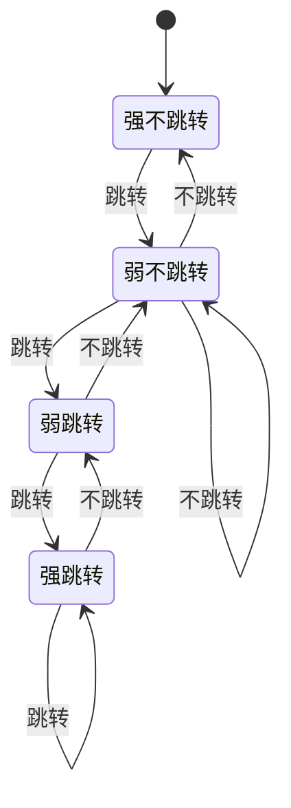
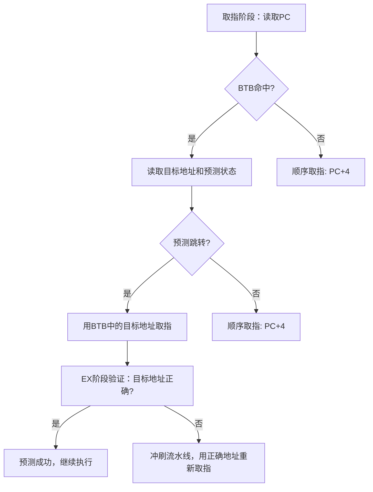
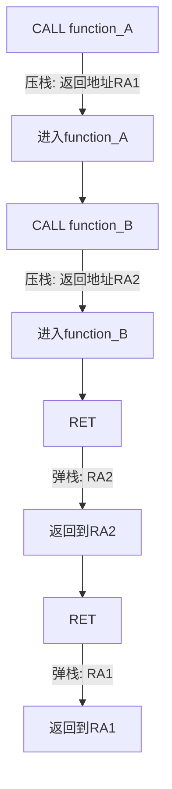
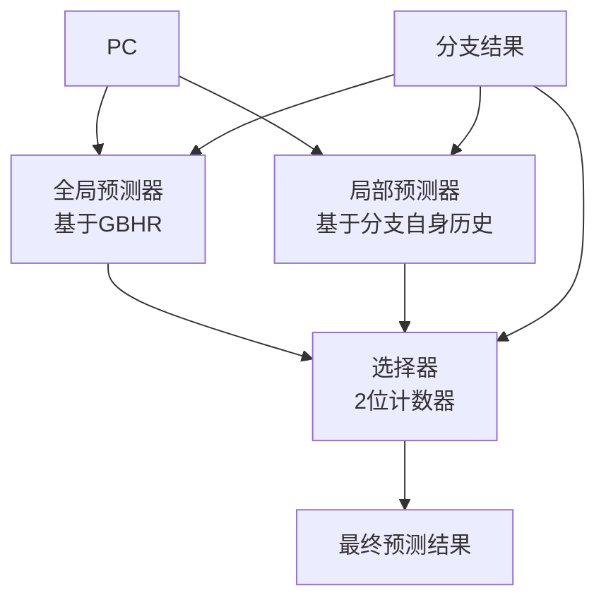
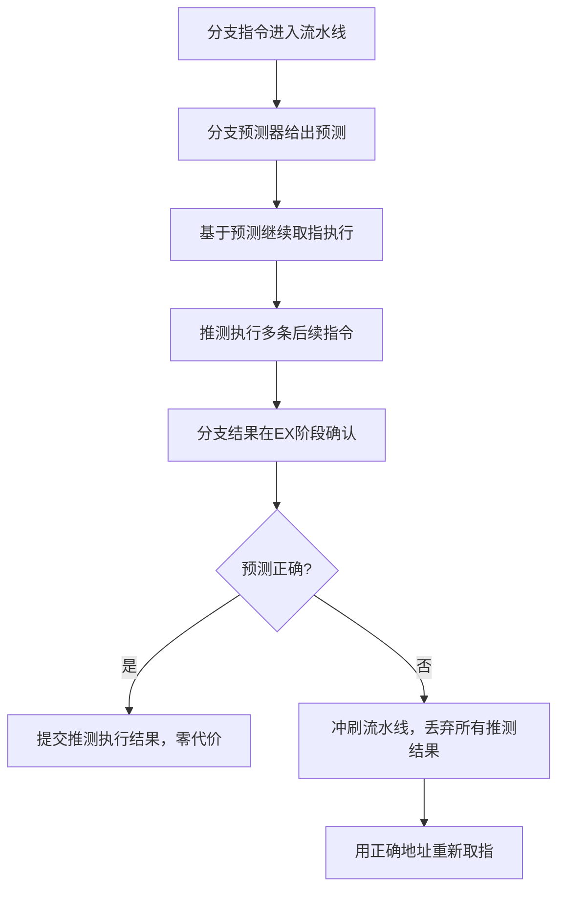

## 1.4 分支预测

### 1.4.1 为什么需要分支预测

分支预测是解决流水线**控制冒险**的核心机制。在1.2节中我们了解到，当CPU遇到条件分支指令（如`BEQ`、`BNE`）时，需要等到EX阶段才能确定分支方向——是继续顺序执行还是跳转到目标地址。但现代CPU的流水线深度通常为15-21级，如果每次都等分支结果确定再取指，就会浪费大量流水线周期。

时钟周期:  1    2    3    4    5    6    7    ...   16
CMP:       IF → ID → EX → MEM → WB
BEQ:            IF → ID → EX → MEM → WB
ADD:                 IF → ID → EX → MEM → WB
                          ↑ 分支结果在第4周期才确定
...                      此时后面已经有多条指令进入流水线
                         如果跳转，这些指令全部作废

**核心矛盾**：流水线越深，频率越高，但分支预测失败的代价也越大。假设15级流水线，每条分支预测失败需要冲刷15条已进入流水线的指令，浪费15个时钟周期。如果一个程序每执行100条指令就有10条分支，预测失败率5%，那么：

性能损失 = 10 × 5% × 15 = 7.5个停顿周期 / 100条指令
CPI = 1 + 7.5/100 = 1.075
→ 性能下降约7%

而如果预测失败率是50%（如随机数据上的条件判断），性能损失将达到：

性能损失 = 10 × 50% × 15 = 75个停顿周期 / 100条指令
CPI = 1 + 75/100 = 1.75
→ 性能下降43%！

这就是为什么分支预测被称为现代CPU中**最重要的性能优化机制之一**。一个优秀的分支预测器能在95%以上的情况下猜对分支方向，使得流水线几乎不会因控制冒险而停顿。对于一个超标量处理器而言，分支预测的准确性直接决定了其能否充分发挥多发射能力——如果预测错误，不仅浪费取指带宽，还会浪费解码、重命名、执行等所有后续阶段的硬件资源。

**分支在程序中的普遍性**：

| 代码模式 | 每100条指令中的分支数 | 典型来源 |
|---------|---------------------|---------|
| 数值计算密集型（矩阵乘法） | 3-5条 | 循环边界检查 |
| 通用应用（Web服务器） | 10-15条 | 条件判断、虚函数调用 |
| 解释器（Python、JS引擎） | 20-30条 | 字节码分派、类型判断 |
| 数据库查询引擎 | 15-25条 | 条件过滤、B树遍历 |

### 1.4.2 静态分支预测

静态预测是最简单的策略，不需要任何历史信息，由硬件或编译器在编译时确定。

**策略一：总是预测不跳转（Always Not Taken）**

最朴素的方案——假设分支总是不跳转，顺序取指。如果实际跳转了，冲刷流水线。

- 优点：硬件实现最简单
- 缺点：循环体内的跳转（向后跳转）几乎100%预测失败
- 适用：早期简单处理器

**策略二：向后跳转预测为跳转，向前跳转预测为不跳转**

利用了循环的特性——向后跳转通常是循环的回边（loop back-edge），几乎总是执行；向前跳转通常是循环的退出条件，通常不执行。

```asm
; 向后跳转：预测为跳转（循环继续）✓ 准确
loop:
    ADD R1, R1, R2
    SUB R3, R3, #1
    BNE loop          ; 向后跳转，预测跳转

; 向前跳转：预测为不跳转（循环未结束）✓ 准确
    CMP R4, #100
    BGT exit          ; 向前跳转，预测不跳转
    ; ... 循环体 ...
exit:
```

静态预测的典型准确率约60-70%。虽然不高，但对于没有动态预测硬件的简单处理器已经足够。

**策略三：编译器标注（Likely/Unlikely）**

编译器可以通过**分支偏置（Branch Bias）**提示来辅助预测。例如GCC的`__builtin_expect`：

```c
// 提示编译器：条件大概率为假（error_code通常为0，热路径）
// 1表示likely，0表示unlikely
if (__builtin_expect(error_code != 0, 0)) {
    // 错误处理（冷路径）—— 编译器会将其放在远离热路径的位置
    handle_error(error_code);
}
// 正常处理（热路径）
process(data);
```

现代编译器会将冷路径的代码放到函数末尾（远离指令缓存热区），减少指令缓存miss和分支预测失败的双重影响。Linux内核中广泛使用了`likely()`和`unlikely()`宏：

```c
// Linux内核中的典型用法
static inline int list_empty(const struct list_head *head)
{
    return READ_ONCE(head->next) == head;  // 空链表是少数情况
}

if (likely(skb->dev != NULL)) {
    // 正常网络包处理（热路径）
    netif_receive_skb(skb);
} else {
    // 异常情况（冷路径）
    kfree_skb(skb);
}
```

### 1.4.3 动态分支预测：1位预测器

动态预测利用运行时的历史信息来预测分支方向。最简单的动态预测器是**1位预测器**：记录上次分支的实际方向，下次预测相同方向。

**实现方式**：使用一个小的**分支历史表（Branch History Table, BHT）**，表项为1位，用分支指令的低若干位作为索引。

BHT结构（2^k个表项）：
┌──────────┬──────────┐
│ 索引(位)  │ 预测位    │
├──────────┼──────────┤
│ 000      │ 0 (NT)   │
│ 001      │ 1 (T)    │
│ 010      │ 0 (NT)   │
│ ...      │ ...      │
│ 111      │ 1 (T)    │
└──────────┴──────────┘

**1位预测器的致命缺陷：嵌套循环**

考虑一个执行10次的外层循环，每次内层循环执行100次：

```c
for (int i = 0; i < 10; i++) {      // 外层循环：执行10次
    for (int j = 0; j < 100; j++) {  // 内层循环：执行100次
        // 循环体
    }
    // 内层循环退出时跳转方向改变
}
```

内层循环的回边执行了100次"跳转"和1次"不跳转"（退出）。1位预测器会在每次退出时记录"不跳转"，导致下次外层循环重新进入内层循环时预测"不跳转"——而这恰恰是100次循环的开始。结果：每次外层循环的第一次内层迭代都会预测失败。

内层循环BHT状态变化：
... → [T][T][T]... → [NT] (退出) → [NT] (重新进入！预测失败) → [T]... → [NT] (退出) → [NT]...
       ↑ 100次跳转        ↑ 1次不跳转      ↑ 预测失败！

**总预测失败次数**：每次外层循环2次失败（进入1次 + 退出1次），共10×2 = 20次失败，总共110次分支执行，失败率约18%。

### 1.4.4 2位饱和计数器预测器

为了解决1位预测器的"抖动"问题，**2位饱和计数器**引入了"惯性"——需要连续两次改变方向才更新预测。

**状态转换**：



| 状态（2位） | 含义 | 下次预测 | 遇到跳转 | 遇到不跳转 |
|------------|------|---------|---------|-----------|
| 00（强不跳转） | 强烈不跳转 | 不跳转 | → 01 | → 00 |
| 01（弱不跳转） | 弱不跳转 | 不跳转 | → 10 | → 00 |
| 10（弱跳转） | 弱跳转 | 跳转 | → 11 | → 01 |
| 11（强跳转） | 强烈跳转 | 跳转 | → 11 | → 10 |

**回到嵌套循环的例子**：

内层循环回边：连续100次跳转，状态从"强跳转"到"强跳转"不变。退出时遇到1次不跳转，状态从"强跳转"→"弱跳转"（仍预测跳转）。下次重新进入时仍然预测跳转——正确！只在真正退出时才可能连续两次不跳转。

总预测失败次数：每次外层循环1次（退出时的第二次不跳转才改变预测）
共10次失败 / 110次分支 = 9%失败率（相比1位的18%减半）

2位饱和计数器是工业实践中最广泛使用的基础预测单元，后续更复杂的预测器都是在此基础上增加历史信息维度。

### 1.4.5 分支目标缓冲（BTB）

前面讨论的预测器只解决了"跳不跳"的问题，但还有一个关键问题：**跳到哪里？**

**分支目标缓冲（Branch Target Buffer, BTB）**缓存分支指令的目标地址，在取指阶段就能提供跳转目标，避免等到EX阶段计算地址。

BTB结构：
┌──────────────┬──────────────┬──────────────┐
│ PC（标签）     │ 目标地址      │ 预测状态      │
├──────────────┼──────────────┼──────────────┤
│ 0x401000     │ 0x400800     │ 强跳转        │
│ 0x402004     │ 0x403000     │ 弱不跳转      │
│ ...          │ ...          │ ...          │
└──────────────┴──────────────┴──────────────┘

**BTB工作流程**：



BTB的关键性能指标：

| 指标 | 典型值 | 影响 |
|------|--------|------|
| 容量 | 512-4096条目 | 覆盖更多分支指令 |
| 命中率 | 95-99% | 未命中需要等到EX阶段 |
| 查找延迟 | 1个时钟周期 | 在取指阶段必须完成 |
| 关联度 | 4-8路组相联 | 减少冲突失效 |

**间接跳转的挑战**：虚函数调用、switch语句的跳转表等间接跳转的目标地址不固定，同一个PC可能跳转到多个不同目标。BTB只能缓存最近一次的目标地址，对这类场景预测能力有限。现代CPU通过**间接分支预测器（Indirect Branch Predictor）**来解决，它记录间接跳转的历史目标序列。

例如，一个虚函数调用点可能根据对象类型在A、B、C三个实现之间跳转：

```cpp
// C++虚函数调用 — 间接跳转
class Shape {
    virtual void draw() = 0;  // 不同子类实现不同
};
// draw()的调用地址取决于实际对象类型
// 间接分支预测器通过观察历史目标序列来预测
```

间接分支预测器通常维护一个**全局间接历史寄存器（GHIR）**，记录最近K次间接跳转的目标地址哈希值，用PC和GHIR共同索引目标地址表。

### 1.4.6 返回地址栈（RAS）

函数调用（`CALL`）和返回（`RET`）是一种特殊的分支——返回地址是确定的（调用者的下一条指令），但嵌套调用时栈上有很多返回地址。

**返回地址栈（Return Address Stack, RAS）**利用了调用/返回的LIFO（后进先出）特性：



RAS通常是一个小型硬件栈（16-32项），深度匹配最大调用深度。大多数程序的调用深度很少超过32层，因此RAS的命中率通常>99%。

**RAS在超标量处理器中的实现**：现代处理器的RAS需要支持每个周期处理多条CALL/RET指令（如Intel Skylake每周期可处理2条分支）。这要求RAS实现为一个**多端口栈**，能同时进行多次压栈和弹栈操作，并在检测到预测错误时回滚到正确状态。

**RAS的局限与安全风险**：如果程序的调用/返回模式异常（如通过函数指针调用导致压栈但不对应真正的返回），RAS可能被污染。更严重的是，2018年披露的**Spectre-RSB（Return Stack Buffer）变体**利用了RAS的预测特性进行攻击。缓解措施包括在上下文切换时清空RAS（flush RSB），Intel和AMD的微码更新中都包含了这类修复。

### 1.4.7 相关预测器（Correlating Predictor）

2位饱和计数器只考虑了单个分支的历史，忽略了**分支之间的关联性**。相关预测器引入了**全局分支历史寄存器（Global Branch History Register, GBHR）**，记录最近N条分支的方向，用（全局历史，当前PC）共同索引BHT。

**m,n相关预测器**：用最近m条全局分支历史和当前分支PC的n位来索引一个2位计数器表。

示例：(2,2)相关预测器
GBHR = [上上条分支方向, 上条分支方向]
BHT索引 = GBHR XOR PC低2位

┌─────────────┬────────────────────────────┐
│ GBHR \ PC   │ PC低2位: 00  01  10  11     │
├─────────────┼────────────────────────────┤
│ 00          │  C0      C1  C2  C3         │
│ 01          │  C4      C5  C6  C7         │
│ 10          │  C8      C9  C10 C11        │
│ 11          │  C12     C13 C14 C15        │
└─────────────┴────────────────────────────┘
其中C0-C15为2位饱和计数器

**为什么关联性有帮助？**

考虑以下代码模式：

```c
if (x > 0) {          // 分支A
    y = 1;
} else {
    y = -1;
}

if (y > 0) {          // 分支B：与分支A强关联
    z = 1;
} else {
    z = -1;
}
```

分支B的方向几乎完全由分支A决定。如果只看分支B自身的历史，预测器可能无法捕捉这种关联。但通过GBHR记录分支A的方向，分支B的预测器就能利用这个信息做出更准确的预测。

**全局历史长度的权衡**：GBHR越长，能捕捉的关联范围越广，但BHT需要的容量也呈指数增长。一个12位GBHR配合10位PC索引，就需要2^22个表项——这在硬件上代价太高。因此，相关预测器通常使用较短的全局历史（8-12位），并通过**哈希折叠**技术来缩减索引宽度。

### 1.4.8 锦标赛预测器（Tournament Predictor）

实际程序中，不同分支适合不同的预测策略。锦标赛预测器（如Alpha 21264使用的设计）同时运行多个预测器，用一个**选择器（Chooser）**动态选择表现更好的那个。



| 预测器 | 适合场景 | 历史来源 |
|--------|---------|---------|
| 全局预测器 | 分支间有强关联的模式 | 全局分支历史 |
| 局部预测器 | 单个分支有固定模式的循环 | 分支自身的历史 |
| 选择器 | 根据历史表现动态选择 | 两个预测器的预测结果 |

**选择器的工作方式**：每个PC对应一个2位饱和计数器。当全局预测器正确而局部预测器错误时，选择器向"选全局"方向调整；反之亦然。

**Alpha 21264的实际设计细节**：该处理器使用4K个条目的全局预测表和4K个条目的局部历史表，每个条目包含12位的局部历史记录。选择器同样使用4K个2位计数器。这套设计在1998年实现了约95%的预测准确率，是当时最成功的商业分支预测器之一。

### 1.4.9 TAGE预测器：现代工业标准

**TAGE（TAgged GEometric history length）**预测器是目前工业界最广泛采用的高级分支预测器，被Intel Skylake及后续架构、AMD Zen系列、ARM Cortex-A76及后续核心所采用。

**核心思想**：不同分支需要不同长度的历史信息。有些分支只需要最近几条的历史，有些则需要数百条的历史。TAGE使用几何级数递增的历史长度来覆盖这个范围。

TAGE结构：
┌──────────────┬──────────┬──────────┬──────────┬──────────┐
│ 基础预测器    │ 表1       │ 表2       │ 表3       │ 表4       │
│ (2位计数器)  │ L=4      │ L=8      │ L=16     │ L=64     │
│ 无标签       │ 有标签    │ 有标签    │ 有标签    │ 有标签    │
│ PC直接索引   │ 历史哈希  │ 历史哈希  │ 历史哈希  │ 历史哈希  │
└──────────────┴──────────┴──────────┴──────────┴──────────┘
                 ↑ 历史长度几何递增：4, 8, 16, 32, 64, 128...

**TAGE工作流程**：

1. 用PC和不同长度的历史哈希值分别索引各级表
2. 查找匹配的标签（tag）——标签匹配的表项提供预测
3. 选择**最长历史匹配**的表项作为最终预测（最长历史匹配通常最精确）
4. 如果所有标签都不匹配，使用基础预测器（类似2位计数器）

**为什么用标签？** 不同的PC+历史组合可能映射到同一个表项（哈希冲突）。标签用于验证匹配是否正确，避免错误的预测信息被使用。

**TAGE的更新机制**：TAGE的更新策略是其设计中最精妙的部分。当一个标签匹配的表项提供了预测时，如果预测正确且该表项的置信度已经很高，则不进行任何更新（节省功耗）。只有在预测错误、或者匹配表项的置信度较低时，才会尝试分配新的表项。新表项的分配优先在历史长度比当前匹配更长的表中进行——这鼓励更长历史的表项被填充，从而逐步提升预测精度。

**TAGE的优势**：

| 特性 | 2位计数器 | 相关预测器 | TAGE |
|------|----------|-----------|------|
| 历史长度 | 无 | 固定m位 | 几何级数多长度 |
| 冲突处理 | 无 | 无 | 标签验证 |
| 自适应性 | 低 | 中 | 高 |
| 硬件开销 | 极小 | 中等 | 较大（~32KB） |
| 预测准确率 | ~85% | ~90-93% | ~95-97% |

### 1.4.10 神经分支预测器

2016年，Google在ISCA会议上发表了用小型神经网络做分支预测的研究，开启了**感知机分支预测器（Perceptron Branch Predictor）**的新时代。AMD从Zen+架构开始引入基于感知机的预测器。

**感知机预测器原理**：

输出 = Σ(wi × hi) + bias
其中：
  hi = 分支i的历史方向（+1或-1）
  wi = 对应的权重
  bias = 偏置项
  阈值 = 0（正数预测跳转，负数预测不跳转）

历史寄存器:  h1  h2  h3  h4  h5  ...  hN
              ↓   ↓   ↓   ↓   ↓        ↓
权重:        w1  w2  w3  w4  w5  ...  wN
              ↓   ↓   ↓   ↓   ↓        ↓
求和:        w1×h1 + w2×h2 + ... + wN×hN + bias = score
              ↓
预测:        score > 0 → 跳转
             score < 0 → 不跳转

**权重更新规则**：

```python
# 伪代码：感知机权重更新
def predict_and_update(history, weights, bias, threshold):
    score = bias
    for i in range(len(history)):
        score += weights[i] * history[i]  # history[i] = +1 或 -1
    
    prediction = 1 if score >= 0 else -1
    
    # 如果预测错误或置信度不够，更新权重
    if prediction != actual_outcome or abs(score) <= threshold:
        bias += actual_outcome * learning_rate
        for i in range(len(history)):
            weights[i] += actual_outcome * history[i] * learning_rate
    
    return prediction
```

**神经预测器的优势**：可以捕捉**非线性**的分支模式，这是传统查表式预测器（2位计数器、TAGE）难以做到的。例如，当分支方向取决于多个历史位的异或关系时，神经预测器能学习到这种模式。

**感知机预测器的实际性能**：Google的研究表明，在2K条目（每个感知机64个历史位）的配置下，感知机预测器的MPKI（每千条指令预测失败数）比当时的TAGE预测器低约10-15%。但感知机预测器的推理延迟（需要进行64次乘加运算）高于TAGE的查表操作，因此在流水线极深的处理器中需要权衡预测精度和流水线时钟频率。

**现代混合方案**：Intel在Skylake之后的处理器中采用了**感知机+TAGE混合方案**：用TAGE处理短历史分支，用感知机处理长历史分支。这种组合充分利用了两种预测器的互补优势。

### 1.4.11 循环预测器（Loop Predictor）

传统预测器对固定次数循环的退出预测较差——循环的最后一次迭代方向与之前不同，导致预测失败。**循环预测器**专门检测固定次数的循环模式：

循环预测器工作原理：
1. 检测到循环回边：记录循环体执行次数（迭代计数器）
2. 学习循环次数：连续N次观察到相同迭代次数后"锁定"
3. 锁定后：精确预测循环何时退出，何时继续

循环模式: T T T T T T T T T T NT T T T T T T T T T T NT ...
计数器:  1 2 3 4 5 6 7 8 9 10→重置  1 2 3 4 5 6 7 8 9 10→重置...
预测:    T T T T T T T T T T NT T T T T T T T T T T NT ...
          ↑ 全部正确！

循环预测器通常作为TAGE预测器的补充组件。当TAGE的最长历史匹配表项认为会跳转，而循环预测器认为该退出时，循环预测器的判断优先。

**循环预测器的典型规格**：一个现代循环预测器可能包含128-512个条目，每个条目记录循环PC、迭代次数阈值、当前迭代计数、以及置信度计数器。整个预测器的硬件开销约为1-2KB，但能为常见循环（迭代次数10-1000）消除几乎所有的退出预测失败。

### 1.4.12 分支预测与推测执行

分支预测不仅用于解决控制冒险，更是**推测执行（Speculative Execution）**的基础。CPU基于分支预测的结果，提前执行后续指令（包括读取内存、计算等），如果预测正确，推测执行的结果直接提交；如果预测错误，冲刷所有推测执行的结果。



**推测执行的安全影响**：2018年披露的**Spectre漏洞**利用了分支预测和推测执行的机制。攻击者通过训练分支预测器，诱导CPU推测执行访问本不该访问的内存区域，然后通过侧信道（缓存时序）泄露数据。这揭示了分支预测器作为共享硬件资源的安全隐患。

Spectre攻击简要流程：
1. 攻击者构造一个分支，训练预测器使其预测为"跳转"
2. 实际运行时，该分支应该"不跳转"
3. CPU基于错误预测，推测执行了越界内存访问
4. 越界访问将数据加载到缓存中
5. 攻击者通过缓存侧信道测量访问时间，推断出数据内容

**Spectre变体及缓解**：

| 变体 | 利用机制 | 缓解措施 | 性能影响 |
|------|---------|---------|---------|
| Spectre v1（边界检查绕过） | 条件分支训练+越界加载 | 编译器插入LFENCE/barrier | 5-15% |
| Spectre v2（分支目标注入） | 间接跳转训练 | Retpoline替换、IBRS | 5-30% |
| Spectre-RSB | 返回地址栈污染 | RSB填充、上下文切换清空 | 1-5% |
| Spectre v4（推测存储绕过） | 推测存储转发 | SSBD禁用推测加载 | 2-8% |

**Meltdown与分支预测的关系**：虽然Meltdown主要利用乱序执行而非分支预测，但它与Spectre共同揭示了现代CPU推测执行的深层安全问题。Spectre的修复比Meltdown更为困难——Meltdown可以通过内核页表隔离（KPTI）基本解决，而Spectre需要在编译器、微码、操作系统多个层面同时防御。

### 1.4.13 分支预测失败的代价分析

不同架构下分支预测失败的代价差异很大，主要取决于**流水线深度**和**取指宽度**：

| CPU架构 | 流水线深度 | 每周期取指 | 单次预测失败代价 | 预测准确率 | 平均代价/100条分支 |
|---------|-----------|-----------|-----------------|-----------|-------------------|
| ARM Cortex-A8 | 13级 | 2条 | ~13周期 | ~93% | ~9.1周期 |
| Intel Skylake | 14-19级 | 4-6条 | ~15-20周期 | ~97% | ~4.5-6周期 |
| AMD Zen 4 | 19-21级 | 6条 | ~19-21周期 | ~97% | ~5.7-6.3周期 |
| Intel Pentium 4 | 31级 | 1-2条 | ~31周期 | ~90% | ~31周期 |
| Apple M2 | ~14级 | 8条 | ~14周期 | ~97% | ~4.2周期 |

**关键洞察**：Pentium 4（Netburst架构）是反面教材——31级流水线意味着单次预测失败代价极高，而当时90%的预测准确率根本不够。现代CPU在流水线深度和预测准确率之间找到了平衡。Apple M系列处理器在这一点上尤其出色：相对较短的流水线（~14级）配合极宽的取指（每周期8条指令），使得预测失败的恢复代价较低。

**分支密度的影响**：

假设：15级流水线，预测失败率3%

每100条指令中：
- 分支密度5%：5条分支 → 5 × 3% × 15 = 2.25停顿周期 → CPI ≈ 1.02
- 分支密度15%：15条分支 → 15 × 3% × 15 = 6.75停顿周期 → CPI ≈ 1.07
- 分支密度25%：25条分支 → 25 × 3% × 15 = 11.25停顿周期 → CPI ≈ 1.11

这就是为什么解释型语言（如Python、JavaScript）比编译型语言（如C、Rust）在CPU密集型任务上慢得多——解释器本身就有大量分支（字节码分派），加上被解释代码的分支，总分支密度极高。

### 1.4.14 用perf测量分支预测性能

在Linux系统上，可以使用`perf`工具精确测量分支预测行为：

```bash
# 基础分支统计
perf stat -e branch-instructions,branch-misses ./my_program
# 输出示例：
#  1,234,567,890  branch-instructions
#     23,456,789  branch-misses  # 1.90% of all branches

# 更详细的分支事件（需要CPU支持）
perf stat -e \
  branch-instructions,\
  branch-misses,\
  branch-load-misses,\
  branch-loads \
  ./my_program

# 使用perf record记录分支采样
perf record -e branch-misses -b ./my_program
perf report --sort=symbol_from,symbol_to
# 这会显示哪些分支对之间的预测失败最频繁
```

**解读perf输出的关键指标**：

| 指标 | 含义 | 健康值 |
|------|------|--------|
| branch-misses/branch-instructions | 分支预测失败率 | <3%为优秀，<5%为良好 |
| 绝对miss数 | 总预测失败次数 | 越少越好，与程序规模相关 |
| IPC | 每周期指令数 | >2为优秀，>1为良好 |

**实战：排序前后性能对比**

下面这段代码可以让你直观感受分支预测对性能的影响：

```c
// branch_bench.c — 排序对分支预测的影响
#include <stdio.h>
#include <stdlib.h>
#include <time.h>

#define ARRAY_SIZE 32768
#define LOOP_COUNT 100

int data[ARRAY_SIZE];

int compare(const void* a, const void* b) {
    return (*(int*)a - *(int*)b);
}

int main() {
    // 填充随机数据
    srand(42);
    for (int i = 0; i < ARRAY_SIZE; i++)
        data[i] = rand() % 256;

    // 预热缓存
    volatile int sum = 0;
    for (int i = 0; i < ARRAY_SIZE; i++)
        sum += data[i];

    // 测试1：未排序数据
    clock_t start = clock();
    for (int loop = 0; loop < LOOP_COUNT; loop++) {
        sum = 0;
        for (int i = 0; i < ARRAY_SIZE; i++) {
            if (data[i] >= 128)  // 约50%概率跳转
                sum += data[i];
        }
    }
    double unsorted_time = (double)(clock() - start) / CLOCKS_PER_SEC;

    // 测试2：排序后数据
    qsort(data, ARRAY_SIZE, sizeof(int), compare);
    start = clock();
    for (int loop = 0; loop < LOOP_COUNT; loop++) {
        sum = 0;
        for (int i = 0; i < ARRAY_SIZE; i++) {
            if (data[i] >= 128)  // 前半段全部不跳转，后半段全部跳转
                sum += data[i];
        }
    }
    double sorted_time = (double)(clock() - start) / CLOCKS_PER_SEC;

    printf("未排序: %.4f s\n", unsorted_time);
    printf("排  序: %.4f s\n", sorted_time);
    printf("加速比: %.2fx\n", unsorted_time / sorted_time);
    return 0;
}
```

```bash
# 编译运行
gcc -O2 -o branch_bench branch_bench.c
./branch_bench
# 典型输出（x86-64）：
# 未排序: 0.1843 s
# 排  序: 0.0521 s
# 加速比: 3.54x

# 用perf观察分支预测差异
perf stat -e branch-instructions,branch-misses ./branch_bench
```

未排序时，由于分支方向接近随机（约50%跳转），预测器几乎无法学习到模式。排序后，分支方向呈现"先连续不跳转、再连续跳转"的模式，预测器能轻松预测。

### 1.4.15 编译器与分支预测的协作

编译器是分支预测的重要盟友。现代编译器提供了多种与分支预测协作的优化手段。

**条件移动消除分支（If-Conversion）**

编译器可以将简单的if-else结构转换为无分支的条件移动指令（CMOV），彻底消除分支：

```c
// 原始代码 — 有分支
int max(int a, int b) {
    if (a > b) return a;
    else return b;
}

// 编译器生成的汇编（-O2）：
//   cmp   edi, esi
//   cmovg eax, esi    ; 无分支！条件移动，不改变流水线
//   ret
```

**跳转线程化（Jump Threading）**

编译器可以消除冗余的分支判断：

```c
// 原始代码
if (x == 0) {
    if (x == 0) {       // 永远为真（已被外层保证）
        do_something();
    }
}

// 编译器优化后 — 内层判断被消除
if (x == 0) {
    do_something();
}
```

**配置文件引导优化（PGO）**

PGO让编译器获得程序实际运行时的分支统计信息，据此优化代码布局：

```bash
# PGO三步流程
# 1. 插桩编译
gcc -fprofile-generate -o my_pgo ./my_program.c

# 2. 运行收集数据
./my_pgo < typical_input.txt
# 生成 gcda 数据文件

# 3. 基于数据重新编译
gcc -fprofile-use -O3 -o my_optimized ./my_program.c
```

PGO带来的分支预测相关优化包括：
- **基本块重排**：将热路径的代码放在连续内存区域，提升指令缓存命中率
- **循环展开调整**：根据实际迭代次数决定展开倍数
- **冷热代码分离**：将低概率分支对应的代码移到函数末尾
- **分支权重标注**：为每个分支标注实际执行频率，帮助CPU的编译时静态预测

### 1.4.16 软件开发者应知的分支预测原则

理解分支预测机制后，开发者可以写出更高效的代码。以下是经过实战验证的核心原则。

**原则一：热路径保持简单**

```c
// 好：热路径（高频执行）条件简单，预测器容易猜对
if (likely(data != NULL)) {  // __builtin_expect(data != NULL, 1)
    process(data);           // 热路径：简单条件，高可预测性
} else {
    log_error("null data");  // 冷路径：异常条件
}
```

关键不是使用`__builtin_expect`本身，而是**将热路径的代码组织为预测器容易学习的模式**。即使不使用显式标注，良好的代码结构（如卫语句提前返回）也能帮助预测器。

**原则二：数据局部性影响分支可预测性**

排序后的数据比随机数据的分支预测准确率高得多——因为排序后相同值连续出现，分支方向呈现长程一致性。

```c
// 差：随机数据，分支预测率约50%
for (int i = 0; i < n; i++) {
    if (data[i] >= threshold) sum += data[i];
}

// 好：排序后，分支方向连续一致，预测率>95%
qsort(data, n, sizeof(int), cmp);
for (int i = 0; i < n; i++) {
    if (data[i] >= threshold) sum += data[i];
}
```

这一原则在数据库系统中被广泛使用——B+树的有序性、排序后的列存数据，都能显著提升查询引擎中条件判断的可预测性。

**原则三：减少分支数量**

```c
// 用条件移动（CMOV）替代分支
int max(int a, int b) {
    return (a > b) ? a : b;  // 编译器通常生成CMOV指令
}

// 用位运算消除分支
int abs_branchless(int x) {
    int mask = x >> 31;        // 算术右移：正数=0x00000000，负数=0xFFFFFFFF
    return (x ^ mask) - mask;  // 无分支绝对值
}

// 用查表替代复杂条件分支
int classify_branchless(float x) {
    // 将浮点数的位模式解释为整数，用位运算判断区间
    int32_t raw = *(int32_t*)&amp;x;
    int32_t sign = raw >> 31;
    int32_t exponent = (raw >> 23) &amp; 0xFF;
    // 零/非零/NaN 的分类可以完全无分支完成
    return (exponent == 0) ? 0 : (exponent == 0xFF) ? 2 : 1;
}
```

**原则四：循环展开减少分支频率**

```c
// 展开前：每次迭代1条分支
for (int i = 0; i < n; i++) {
    sum += a[i];
}

// 展开后：每4次迭代才1条分支
for (int i = 0; i < n; i += 4) {
    sum += a[i] + a[i+1] + a[i+2] + a[i+3];
}
// 分支预测失败率降低到1/4，且4次加法可并行（利用超标量）
```

**原则五：避免虚函数在热路径中的过度使用**

虚函数调用本质上是间接跳转，其目标地址比直接分支更难预测：

```cpp
// 差：热循环中大量虚函数调用
for (auto&amp; shape : shapes) {
    shape->draw();     // 间接跳转 — 每次目标可能不同
    shape->transform(); // 又一个间接跳转
}

// 改进：按类型分组处理，消除间接跳转
for (auto&amp; circle : circles) {
    circle->draw();    // 直接调用 — 预测器确定性100%
}
for (auto&amp; rect : rects) {
    rect->draw();      // 直接调用
}
```

**原则六：利用编译器的profile-guided优化**

如果你的应用有典型的输入模式，PGO是提升分支预测性能的最有效手段：

```c
// PGO优化前：编译器无法判断哪个分支更热
while (has_next_packet()) {
    packet_t* pkt = get_next_packet();
    if (pkt->type == TCP) {          // 95%是TCP
        process_tcp(pkt);            // 编译器不知道这是热路径
    } else if (pkt->type == UDP) {   // 4%是UDP
        process_udp(pkt);
    } else {                         // 1%是其他
        process_other(pkt);
    }
}
// PGO后：编译器将 process_tcp 放在热区，并用 likely() 标注
```

### 1.4.17 分支预测的前沿趋势

**机器学习驱动的预测**：学术界正在研究使用强化学习模型来训练分支预测器，使其能够根据程序的行为模式自适应调整。与固定结构的TAGE不同，这类预测器能在运行时学习新的分支模式，但硬件开销仍然是主要挑战。

**安全感知的预测器设计**：后Spectre时代，新的分支预测器设计需要在性能和安全性之间找到平衡。Intel的eIBRS（Enhanced Indirect Branch Restricted Speculation）和AMD的SSBD（Speculative Store Bypass Disable）都在硬件层面增加了安全控制，但这些控制本身也带来了额外的性能开销。

**异构计算中的分支预测**：在GPU等大规模并行处理器中，由于SIMT执行模型（多个线程共享同一条控制流路径），分支预测的角色完全不同。GPU通过**warp divergence**处理分支——当同一warp内的线程走不同分支路径时，两条路径都会被执行（通过mask选择性写入）。这种"全部执行"策略避免了预测失败的冲刷代价，但浪费了计算资源。

---

**本节要点回顾**：

1. **静态预测**：零开销但精度有限（60-70%），适合简单处理器
2. **1位预测器**：引入运行时历史，但存在嵌套循环抖动问题
3. **2位饱和计数器**：增加预测惯性，将嵌套循环失败率减半，是所有高级预测器的基础单元
4. **BTB与RAS**：分别解决"跳到哪里"和"函数返回地址"两个关键问题
5. **相关预测器**：引入全局历史，捕捉分支间的关联性
6. **锦标赛预测器**：多预测器动态选择，Alpha 21264的成功实践
7. **TAGE**：几何级数多历史长度+标签验证，现代工业标准
8. **神经预测器**：感知机网络捕捉非线性模式，与TAGE互补
9. **循环预测器**：精确预测固定次数循环的退出
10. **推测执行与安全**：Spectre揭示了分支预测的深层安全隐患
