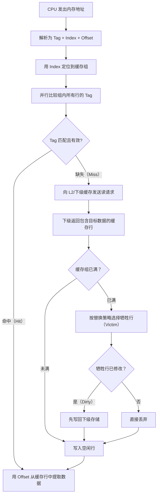

## 1.5 缓存层次

现代计算机系统中，CPU 的运算速度与主存的访问速度之间存在巨大的鸿沟。为了弥合这一差距，硬件工程师设计了多级缓存（Cache）层次结构，用少量高速存储来"欺骗"CPU，让它误以为自己拥有与自身速度匹配的大容量内存。理解缓存层次的工作原理，是掌握程序性能优化、并发编程、乃至系统架构设计的基础。

### 1.5.1 为什么需要缓存

#### 内存墙（Memory Wall）

CPU 的主频在过去二十年提升了数百倍，但 DRAM 的访问延迟仅改善了约 10 倍。现代 CPU 每个时钟周期可以执行多条指令，但访问一次主存可能需要 200 个以上时钟周期。这意味着如果不做任何缓存优化，CPU 在等待数据的时间上将浪费绝大部分算力。

这种 CPU 速度与内存速度之间的持续扩大的差距被称为**内存墙**。缓存层次是目前解决内存墙问题最核心的硬件手段。

#### 存储层次全景

下表展示了从寄存器到外存的完整存储层次，每一级都在容量、延迟和成本之间做出不同的权衡：

| 存储层次 | 典型容量 | 访问延迟 | 带宽 | 每GB成本 | 类比 |
|----------|----------|----------|------|----------|------|
| 寄存器 | 1-4 KB | 0.25-0.5 ns（<1个周期） | 极高（与ALU同速） | 不可单独计价 | 手边正在用的笔 |
| L1 数据缓存 | 32-64 KB | 1-2 ns（3-5个周期） | ~200 GB/s | ~$10,000/GB | 桌面上的文件 |
| L1 指令缓存 | 32-64 KB | 1-2 ns（3-5个周期） | ~200 GB/s | — | 桌面上的参考书 |
| L2 缓存 | 256 KB-1 MB | 3-10 ns（7-20个周期） | ~100 GB/s | ~$1,000/GB | 抽屉里的文件 |
| L3 缓存 | 数MB-数十MB | 10-30 ns（20-50个周期） | ~50 GB/s | ~$100/GB | 柜子里的文件 |
| 主存（DDR5） | 16-128 GB | 50-100 ns（100-200+个周期） | ~50 GB/s | ~$2/GB | 隔壁房间的档案室 |
| SSD（NVMe） | 256 GB-8 TB | 10-100 μs（万级周期） | ~7 GB/s | ~$0.05/GB | 楼下的仓库 |
| HDD | 1-20 TB | 5-10 ms（千万级周期） | ~0.2 GB/s | ~$0.01/GB | 远处的仓库 |

> **关键认知**：L1 缓存和主存之间的延迟差距约为 50-100 倍，而主存和 SSD 之间的延迟差距也是约 1000 倍。每一级缓存都是在用少量高速存储来捕获"热数据"，减少对下级慢速存储的访问。

#### 局部性原理——缓存存在的理论基础

缓存之所以有效，根本原因在于程序访问数据时的两个局部性原理：

- **时间局部性（Temporal Locality）**：最近被访问过的数据，在不久的将来很可能再次被访问。典型场景：循环变量、函数内反复使用的临时变量。
- **空间局部性（Spatial Locality）**：与最近被访问的数据地址相邻的数据，在不久的将来很可能被访问。典型场景：数组遍历、顺序读取结构体成员。

这两个原理共同决定了缓存行的大小设计（利用空间局部性）以及替换策略的设计（利用时间局部性）。

### 1.5.2 缓存的组织方式

缓存本质上是一个从"内存地址"到"缓存中数据"的映射表。如何组织这张映射表，直接决定了缓存的查找速度、命中率和硬件复杂度。

#### 直接映射缓存（Direct-Mapped Cache）

每个内存块只能映射到缓存中唯一确定的一个缓存行。

**工作原理**：将内存地址按位拆分为三部分——Tag（标签位）、Index（索引位）、Offset（偏移位）。用 Index 直接定位到缓存中的某一行，然后比较 Tag 是否匹配。

**优点**：
- 查找速度最快——只需比较一个 Tag，一次比较即可完成
- 硬件实现简单，功耗低

**缺点**：
- 冲突缺失（Conflict Miss）率高——如果程序交替访问两个映射到同一缓存行的地址，即使缓存未满，也会不断互相驱逐（抖动/Thrashing）

**适用场景**：对延迟极度敏感但容量较小的缓存（如某些微控制器的 L1 缓存）。

#### 全相联缓存（Fully Associative Cache）

内存块可以放入缓存中的任意一个缓存行。

**工作原理**：不使用 Index 分组，而是将输入地址的 Tag 与缓存中**所有行**的 Tag 同时比较。

**优点**：
- 冲突缺失率最低——只要缓存未满，就不会因为地址冲突而被驱逐

**缺点**：
- 硬件复杂度高——需要 N 路并行比较器（N = 缓存行数）
- 功耗大——每次访问都要比较所有行
- 查找延迟高

**适用场景**：TLB（页表缓存）等容量极小（通常 16-64 行）的缓存。

#### 组相联缓存（Set-Associative Cache）——现代 CPU 的标准选择

组相联是直接映射和全相联的折中方案，几乎所有现代通用处理器都采用此方案。

**工作原理**：

1. 将缓存划分为若干个"组"（Set），每个组包含 n 个缓存行（n 称为"路"/Way）
2. 用地址的 Index 部分定位到一个组
3. 将地址的 Tag 与该组内所有 n 行的 Tag 并行比较
4. 如果任一行匹配，则命中

**"n 路"的含义**：n 路组相联 = 每组 n 个缓存行。直觉上，n 越大，冲突缺失越少，但比较器越多、功耗越高。

**典型的相联度选择**：

| 缓存级别 | 典型相联度 | 设计考量 |
|----------|-----------|---------|
| L1 数据缓存 | 8 路 | 平衡命中率与访问延迟 |
| L1 指令缓存 | 8 路 | 指令流通常更线性，冲突较少 |
| L2 缓存 | 8-16 路 | 容量更大，需要更高相联度降低冲突 |
| L3 缓存 | 12-20 路 | 多核共享，需要最高相联度 |

> **经验法则**：从直接映射到 2 路组相联，冲突缺失大幅下降；从 2 路到 4 路，进一步显著改善；超过 8 路后，收益递减明显。这就是为什么大多数 L1 缓存选择 8 路——它在命中率和硬件开销之间取得了良好的平衡。

### 1.5.3 缓存行（Cache Line）

缓存行是缓存与下级存储之间数据传输的**最小单位**。即使你只需要一个字节的数据，整个缓存行都会被加载到缓存中。

#### 为什么是 64 字节？

在现代 x86 和大多数 ARM 处理器上，缓存行大小为 64 字节。这个数字并非随意选择：

- **空间局部性利用**：程序访问一个数据后，通常很快会访问相邻数据。一次性加载 64 字节可以覆盖大多数顺序访问模式，减少后续访问的缺失。
- **DRAM 突发传输（Burst Transfer）特性**：DRAM 内部按行/列组织，访问一行的开销（行激活延迟 ~13ns）远高于列读取。一次突发传输 64 字节的延迟与传输 8 字节几乎相同，因为行激活的开销是固定的。
- **总线效率**：现代处理器的数据总线通常为 256 位（32 字节）或 512 位（64 字节）宽，一个总线周期即可传输一个缓存行。

**不同架构的缓存行大小**：

| 架构 | 缓存行大小 | 说明 |
|------|-----------|------|
| x86 / x86-64 | 64 字节 | Intel 和 AMD 统一标准 |
| ARM Cortex-A 系列 | 32-64 字节 | 可配置，移动设备常为 64 字节 |
| RISC-V | 32-64 字节 | 实现相关 |
| Apple M 系列 | 128 字节 | 192KB L1，128字节缓存行 |

> **性能影响**：错误地理解缓存行大小会导致严重的性能问题。例如，错误地认为缓存行是 32 字节来设计数据结构对齐，可能导致同一缓存行的数据跨两次传输，甚至产生伪共享（False Sharing）问题。

#### 缓存行状态

在缓存一致性协议中，每个缓存行都维护着一个状态位。最常见的状态集合来自 MESI 协议（见 1.5.7 节）：

| 状态 | 含义 |
|------|------|
| Modified（修改） | 该行已被当前核修改，与主存不一致，只有当前核持有该行的副本 |
| Exclusive（独占） | 该行与主存一致，只有当前核持有该行的副本 |
| Shared（共享） | 该行与主存一致，可能有多个核同时持有该行的副本 |
| Invalid（无效） | 该行数据无效，相当于不在缓存中 |

### 1.5.4 缓存地址的解析

CPU 访问缓存时，需要将内存地址解析为三个字段。假设一个 64 位地址、64 字节缓存行大小、64KB 的 8 路组相联 L1 缓存：

**地址划分**：

|<--- 64 位虚拟地址 --->|
| 高位Tag | Index | 6位Offset |

**计算各字段宽度**：

- **Offset（偏移位）**：6 位（2^6 = 64 字节，对应缓存行大小）
- **Index（索引位）**：缓存组数 = 容量 / (相联度 × 缓存行大小) = 64KB / (8 × 64B) = 128 组 → 7 位（2^7 = 128）
- **Tag（标签位）**：64 - 7 - 6 = 51 位

**查找过程**：

1. 用 Index 选中一个组（Set），该组包含 8 个缓存行
2. 将 Tag 与这 8 个行的 Tag **并行比较**（8 路比较器同时工作）
3. 若某一行的 Tag 匹配且有效位为 1，则 Cache Hit
4. 用 Offset 从该缓存行中取出所需的字节

#### 缓存访问流程



### 1.5.5 缓存缺失的三种类型——3C 模型

所有缓存缺失都可以归类为三种原因，这就是经典的 **3C 模型**（也称为"三C"或"Three Cs"）：

| 缺失类型 | 英文 | 原因 | 特征 | 可优化？ |
|----------|------|------|------|---------|
| 强制缺失 | Compulsory（Cold） | 首次访问某个地址，缓存中必然没有 | 程序启动时大量出现，之后趋于稳定 | 可通过预取（Prefetching）缓解 |
| 容量缺失 | Capacity | 缓存容量不足以容纳工作集 | 工作集超出缓存容量时持续出现 | 增大缓存或优化数据局部性 |
| 冲突缺失 | Conflict | 多个地址映射到同一缓存组导致驱逐 | 与缓存相联度和访问模式相关 | 提高相联度或优化数据布局 |

此外还有第四种缺失——**一致性缺失（Coherence Miss / Invalidation Miss）**，在多核系统中，其他核的写操作会导致本地缓存行被无效化，从而产生缺失。这是多核编程中性能问题的重要来源。

> **3C 模型的实际应用**：性能分析工具（如 `perf stat` 中的 `L1-dcache-load-misses`）报告的是所有缺失的总和，但要定位问题根因，需要进一步区分缺失类型。Linux 下可以使用 `perf stat -e` 配合硬件性能计数器来估算各类缺失的比例。

### 1.5.6 缓存替换策略

当一个缓存组已满且需要装入新的缓存行时，必须选择一个已有的行替换出去。替换策略的选择直接影响命中率。

#### 常见替换策略对比

| 策略 | 原理 | 优点 | 缺点 | 实际应用 |
|------|------|------|------|---------|
| **LRU**（最近最少使用） | 替换最久未被访问的行 | 简单有效，命中率较高 | 高相联度时实现成本指数增长 | 中小相联度的缓存 |
| **伪 LRU**（Tree-PLRU） | 用二叉树近似 LRU，记录访问路径而非精确顺序 | 硬件开销远小于真 LRU | 命中率略低于真 LRU | 大多数 x86/ARM L1/L2 缓存 |
| **随机替换** | 随机选择一行替换 | 硬件最简单，无可维护状态 | 命中率略低于 LRU | 某些 GPU 缓存、组数极多的 L3 |
| **FIFO** | 替换最早装入的行 | 实现简单 | 不考虑访问频率，命中率低 | 几乎不用 |
| **RRIP**（Reference Priority Replacement） | 为每行分配引用优先级，低优先级优先替换 | 对扫描友好，避免一次性访问污染缓存 | 实现复杂 | Intel Haswell+ 的 L2/L3 |

> **关于伪 LRU 的细节**：以 8 路组相联为例，真 LRU 需要为每组维护 8 × 3 = 24 位的状态信息（3 位/行表示 8 种优先级）。而 Tree-PLRU 只需要 7 位（每个内部节点 1 位），但牺牲了精确性。对于 8 路组相联，Tree-PLRU 的命中率通常只比真 LRU 低 1-3%，但硬件开销减少约 70%。

#### 缓存污染（Cache Pollution）

不是所有数据都值得缓存。以下场景会导致缓存污染——有价值的数据被无价值的数据驱逐：

- **顺序扫描大数组**：遍历一次就不会再次访问的数据会污染整个缓存组
- **DMA 传输**：外设直接写入内存，绕过缓存，但某些实现可能污染缓存
- **非时间局部性数据**：如一次性使用的临时缓冲区

**解决方案**：
- 非时间局部性数据使用 `streaming store`（如 x86 的 `_mm_stream_si128` 或 `MOVNTI` 指令），绕过缓存直接写入内存
- 某些处理器支持预取提示（`_mm_prefetch`），提前将预期使用的数据拉入缓存
- 现代缓存支持流式缓冲区（Streaming Buffer），限制顺序扫描对缓存组的占用

### 1.5.7 缓存一致性（Cache Coherence）

在多核处理器中，每个核都有自己私有的 L1、L2 缓存。当多个核同时缓存了同一内存地址的数据，其中一个核修改了数据，其他核的缓存副本就会变成"脏"的。缓存一致性协议确保所有核看到一致的内存视图。

#### MESI 协议

MESI 是最经典的缓存一致性协议，每个缓存行处于以下四种状态之一：

| 状态 | 含义 | 该行是否有其他副本？ | 与主存一致？ |
|------|------|---------------------|-------------|
| **M**odified | 已被当前核修改 | 否（独占且脏） | 否 |
| **E**xclusive | 未修改，只有当前核持有 | 否（独占且干净） | 是 |
| **S**hared | 未修改，多个核可能持有 | 是 | 是 |
| **I**nvalid | 无效 | — | — |

**典型场景**：

1. **核 A 读取地址 X**：X 的缓存行从内存加载，状态为 Exclusive
2. **核 B 也读取地址 X**：核 A 的 X 状态变为 Shared，核 B 的 X 也设为 Shared
3. **核 A 写入地址 X**：核 A 发出"总线使无效"（BusInvalidate），核 B 的 X 变为 Invalid；核 A 的 X 变为 Modified
4. **核 B 再次读取 X**：发生缺失，从核 A 获取最新数据（而非内存），双方都变为 Shared

#### MESIF 和 MOESI 扩展

| 协议 | 新增状态 | 改进 |
|------|---------|------|
| **MESIF**（Intel） | Forward（F） | 在 Shared 状态中指定一个核负责响应请求，减少不必要的总线事务 |
| **MOESI**（AMD） | Owned（O） | Modified 行可将数据传给其他核而不必先写回内存，减少写回开销 |

#### 一致性开销与伪共享

缓存一致性不是免费的。每次使无效操作都会产生延迟，核间通信需要通过互联总线或环形网络（Ring Bus），其延迟通常为 20-80 ns。

**伪共享（False Sharing）** 是最隐蔽的一致性性能杀手：

```c
// 两个线程各自频繁修改自己的变量
// 但这两个变量恰好在同一个缓存行中
struct {
    long counter_a;  // 线程 A 频繁写
    long counter_b;  // 线程 B 频繁写
} shared_data;
// counter_a 和 counter_b 在同一 64 字节缓存行中
// 每次写操作都会使对方核的缓存行无效，触发一致性流量
```

**解决方案——缓存行对齐填充**：

```c
struct {
    long counter_a;
    char padding[56];  // 填充到 64 字节，确保不同字段在不同缓存行
    long counter_b;
} aligned_data;
```

C++11 提供了 `alignas(64)` 关键字，C11 提供了 `_Alignas(64)`，用于精确控制缓存行对齐。

### 1.5.8 缓存写策略

当 CPU 写入缓存命中时，需要决定如何将数据同步到下级存储。

#### 写命中策略

| 策略 | 行为 | 优点 | 缺点 | 应用 |
|------|------|------|------|------|
| **写回（Write-Back）** | 仅修改缓存行，标记为 Dirty，写回延迟到替换时 | 减少写入次数，降低总线流量 | 实现复杂，替换时需写回 | 几乎所有通用处理器的 L1/L2 |
| **写直达（Write-Through）** | 同时写缓存和下级存储 | 实现简单，数据一致性好 | 每次写都产生总线流量，延迟较高 | 某些 I/O 缓存、小容量缓存 |

#### 写缺失策略

| 策略 | 行为 | 特点 |
|------|------|------|
| **写分配（Write-Allocate）** | 先将目标行加载到缓存，再执行写入 | 与写回配合使用，利用空间局部性 |
| **写不分配（No-Write-Allocate）** | 直接写入下级存储，不加载到缓存 | 与写直达配合使用 |

> **最常见的组合**：写回 + 写分配（Write-Back + Write-Allocate）。写直达 + 写不分配（Write-Through + No-Write-Allocate）是第二常见的组合，通常用于 I/O 缓存。

#### 写合并（Write Combining）

现代处理器在写缓冲区（Write Buffer）中实现了写合并优化：如果短时间内对同一缓存行的多个字节进行写入，硬件会将这些写入合并后再一次性刷出。这对于未对齐的写入和连续的小写入特别有效。

### 1.5.9 多级缓存的协作

现代 CPU 通常有三级缓存（L1/L2/L3），它们之间的协作机制直接影响性能。

#### 包含式 vs 排他式 vs 非包含非排他

| 策略 | 定义 | 代表处理器 | 优缺点 |
|------|------|-----------|--------|
| **包含式（Inclusive）** | L3 包含 L2 的所有数据，L2 包含 L1 的所有数据 | Intel（传统） | 一致性简单（L3 是权威副本），但 L3 利用率低 |
| **排他式（Exclusive）** | 任意数据最多只存在于一级缓存中 | IBM POWER | 缓存有效容量最大，但一致性实现复杂 |
| **非包含非排他（NINE）** | 不强制包含也不强制排他 | AMD Zen, Intel Ice Lake+ | 兼顾容量利用和一致性效率 |

#### 写入放大与读取放大

多级缓存结构会产生放大效应：

- **写入放大**：L1 的一次写入可能触发 L2 的一次写入，进而触发 L3 和内存的写入。写回策略虽然减少了写入次数，但每次写回的延迟随层级递增。
- **读取放大**：L1 缺失触发 L2 读取，L2 缺失触发 L3 读取。现代处理器通过硬件预取器和非阻塞缓存（Non-Blocking Cache）来缓解读取放大的影响。

#### 非阻塞缓存（Lockup-Free Cache）

传统缓存在处理缺失时会阻塞后续访问。非阻塞缓存允许在处理一个缺失的同时继续服务其他访问（MSHR——Miss Status Holding Registers），显著提升了指令级并行度。

### 1.5.10 硬件预取（Hardware Prefetching）

为了在程序访问数据之前就将其加载到缓存中，现代处理器内置了多种硬件预取器：

#### 预取器类型

| 预取器 | 工作原理 | 检测模式 | 典型应用 |
|--------|---------|---------|---------|
| **步长预取器**（Stride Prefetcher） | 检测等间距的访问模式 | a, a+s, a+2s, ... | 数组遍历、结构体数组 |
| **流预取器**（Stream Prefetcher） | 检测连续地址的顺序访问 | a, a+64, a+128, ... | 链表遍历、流式处理 |
| **相邻行预取器**（Adjacent Line Prefetcher） | 自动预取缓存行的下一行 | 每次访问自动加载下一个 64 字节行 | 空间局部性极强的访问 |
| **关联预取器**（Correlation Prefetcher） | 基于历史访问序列预测未来访问 | 复杂的模式匹配 | 指针追踪、间接访问 |

**预取的局限性**：
- 无法预测不规则的访问模式（如链表、树的随机遍历）
- 过度预取会污染缓存，驱逐有用数据
- 预取的数据可能在被使用前就被替换出去

> **编程层面的配合**：了解硬件预取器的行为后，程序员可以通过以下方式配合：
> - 按内存顺序访问数据（而非随机跳跃），充分利用步长/流预取器
> - 使用软件预取指令（`__builtin_prefetch` / `_mm_prefetch`）在关键访问前手动触发预取
> - 避免跨步过大的访问模式（stride > 缓存行大小 × 预取器窗口）

### 1.5.11 缓存性能的度量与分析

#### 关键性能指标

| 指标 | 定义 | 计算公式 | 含义 |
|------|------|---------|------|
| 命中率（Hit Rate） | 命中次数 / 总访问次数 | Hits / (Hits + Misses) | 比例越高越好 |
| 缺失率（Miss Rate） | 缺失次数 / 总访问次数 | Misses / (Hits + Misses) | L1 通常为 2-5% |
| 平均访问时间（AMAT） | 一次访问的平均延迟 | HitTime + MissRate × MissPenalty | 衡量缓存层次整体效能 |
| 缺失代价（Miss Penalty） | 缺失时从下级获取数据的额外延迟 | 下级缓存/内存的访问延迟 | L1→L2 约 5ns，L1→内存约 100ns |

**AMAT 计算示例**：

假设 L1 命中时间为 1ns，缺失率为 3%，L2 命中时间为 10ns，L2 缺失率为 20%，内存访问时间为 100ns：

L1 AMAT = 1 + 0.03 × 10 = 1.3 ns       （L2 有效访问时间）
L2 AMAT = 10 + 0.20 × 100 = 30 ns       （内存有效访问时间）
全局 AMAT = 1 + 0.03 × 30 = 1.9 ns

> **关键洞察**：尽管 L1 缺失率只有 3%，但由于缺失代价高，L1 缓存将系统的平均访问时间从 1ns 拉高到了 1.9ns——接近翻倍。这就是为什么即使是零点几个百分点的缺失率改善，也可能带来显著的性能提升。

#### Linux 下的缓存性能分析工具

```bash
# 查看 L1/L2/L3 缓存命中和缺失计数
perf stat -e L1-dcache-loads,L1-dcache-load-misses,L2-cache-references,L2-cache-misses \
    ./your_program

# 查看缓存缺失的具体来源（需要 root）
perf record -e cache-misses ./your_program
perf report

# 查看处理器缓存层次结构信息
lscpu | grep -i cache

# 使用 cachegrind 进行缓存模拟（Valgrind 工具集）
valgrind --tool=cachegrind ./your_program
cg_annotate cachegrind.out.<pid>
```

### 1.5.12 缓存友好编程实践

理解缓存的硬件机制后，以下编程原则可以显著提升程序性能：

#### 原则一：顺序访问优于随机访问

// 缓存友好：顺序遍历
for (int i = 0; i < N; i++)
    sum += array[i];           // 空间局部性极佳，预取器全速工作

// 缓存不友好：随机访问
for (int i = 0; i < N; i++)
    sum += array[permute(i)];  // 无法预取，频繁缺失

#### 原则二：数据结构布局影响缓存利用率

// AoS（Array of Structures）——可能缓存不友好
struct Particle { float x, y, z; float vx, vy, vz; float mass; };
Particle particles[N];
// 每个粒子占 28 字节，如果只更新 x,y,z，缓存行中有大量无用数据

// SoA（Structure of Arrays）——缓存友好
struct Particles {
    float x[N], y[N], z[N];     // 紧凑排列，更新时缓存利用率高
    float vx[N], vy[N], vz[N];
    float mass[N];
};

#### 原则三：减小数据结构体积

```cpp
// 使用合适的类型大小
struct Bad {
    bool flag;      // 1 字节
    long data;      // 8 字节 → 编译器填充到 16 字节
};

struct Good {
    bool flag;      // 1 字节
    char data[7];   // 7 字节 → 紧凑的 8 字节
};

// 使用位域减少内存占用
struct Flags {
    unsigned int a : 1;
    unsigned int b : 1;
    unsigned int c : 6;  // 2 字节而非 3 字节
};
```

#### 原则四：避免伪共享

```cpp
// C++11 对齐到缓存行
struct alignas(64) AlignedCounter {
    std::atomic<long> value;
    char padding[64 - sizeof(std::atomic<long>)];
};

// Linux 内核风格
struct counter {
    long value;
    long __pad[7];  // 填充到 64 字节（8 × 8 = 64）
};
```

#### 原则五：利用预取器友好的访问模式

```c
// 步长固定的遍历——预取器可以学习
for (int i = 0; i < N; i += STRIDE) {
    __builtin_prefetch(&amp;data[i + PREFETCH_DISTANCE], 0, 0);  // 软件预取
    process(data[i]);
}

// 链表遍历——预取器无法预测，考虑切换到数组实现
node *p = head;
while (p) {
    __builtin_prefetch(p->next, 0, 1);  // 提前预取下一个节点
    process(p);
    p = p->next;
}
```

### 1.5.13 常见误区与纠正

| 误区 | 真相 | 纠正方法 |
|------|------|---------|
| "缓存越大越好" | 缓存增大会增加访问延迟，L3 的延迟是 L1 的 10-20 倍 | 关注命中率和 AMAT，而非绝对容量 |
| "我的程序数据量小，不需要考虑缓存" | 只要超过 L1 容量（32-64KB），缓存行为就开始影响性能 | 用 `perf stat` 验证，不要靠猜测 |
| "多线程总是更快" | 伪共享和一致性流量可能让多线程比单线程更慢 | 确保不同线程访问的数据在不同缓存行 |
| "用 `-O2` 就够了" | 编译器优化不理解数据访问模式，无法自动优化缓存布局 | 手动调整数据结构布局，验证编译器优化效果 |
| "prefetch 总是有益的" | 过度预取会污染缓存、占用带宽、浪费计算周期 | 只在确认有收益时使用，用基准测试验证 |

### 1.5.14 不同应用场景的缓存策略

| 场景 | 缓存特征 | 优化重点 |
|------|---------|---------|
| 数据库引擎 | 工作集常远大于缓存 | 减小索引/行大小以增加缓存中的行数；使用缓存行对齐避免 False Sharing |
| 科学计算 | 大矩阵运算 | 分块（Tiling）算法使工作集适配 L1/L2；保持内存访问步长规律 |
| 游戏引擎 | 实时性要求高 | 预取控制避免缓存污染；将频繁访问的热数据集中排列 |
| Web 服务器 | 大量并发请求 | 避免共享状态的 False Sharing；使用 per-CPU 数据结构 |
| 嵌入式系统 | L1 可能只有几 KB | 精确控制每个字节的位置；避免动态内存分配 |

### 1.5.15 本节小结

缓存层次是现代计算机体系结构中最精妙的设计之一。它利用时间局部性和空间局部性原理，通过多级高速小容量存储与低速大容量存储的组合，为程序提供接近缓存速度的内存访问体验。

核心要点回顾：

- **多级缓存**：L1（快速、小容量）→ L2（中等）→ L3（大容量、共享）层层递进，每一级都是一道速度防线
- **组相联设计**：n 路组相联在冲突缺失率和硬件复杂度之间取得平衡，8 路是 L1 的经典选择
- **64 字节缓存行**：DRAM 突发传输特性与空间局部性共同决定了这一经典尺寸
- **3C 模型**：强制缺失、容量缺失、冲突缺失是分析缓存问题的基本框架
- **缓存一致性**：MESI/MESIF/MOESI 协议确保多核系统中数据的一致性视图
- **伪共享**：同一缓存行中不同线程的数据会导致严重的性能退化，需要通过填充对齐解决
- **编程实践**：顺序访问、紧凑数据结构、避免伪共享、合理预取是缓存友好编程的四大支柱

掌握这些知识后，你就能在性能分析中快速识别缓存相关的瓶颈，并采取针对性的优化措施。在后续章节中，我们将结合具体案例深入探讨缓存在并发编程和系统设计中的实战应用。
