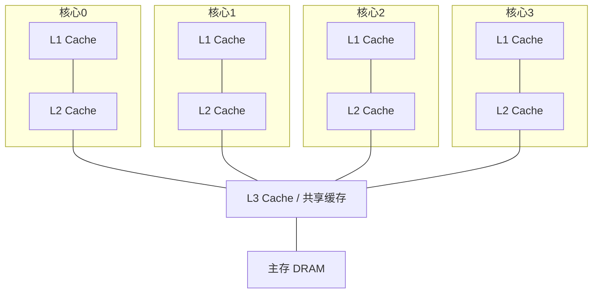
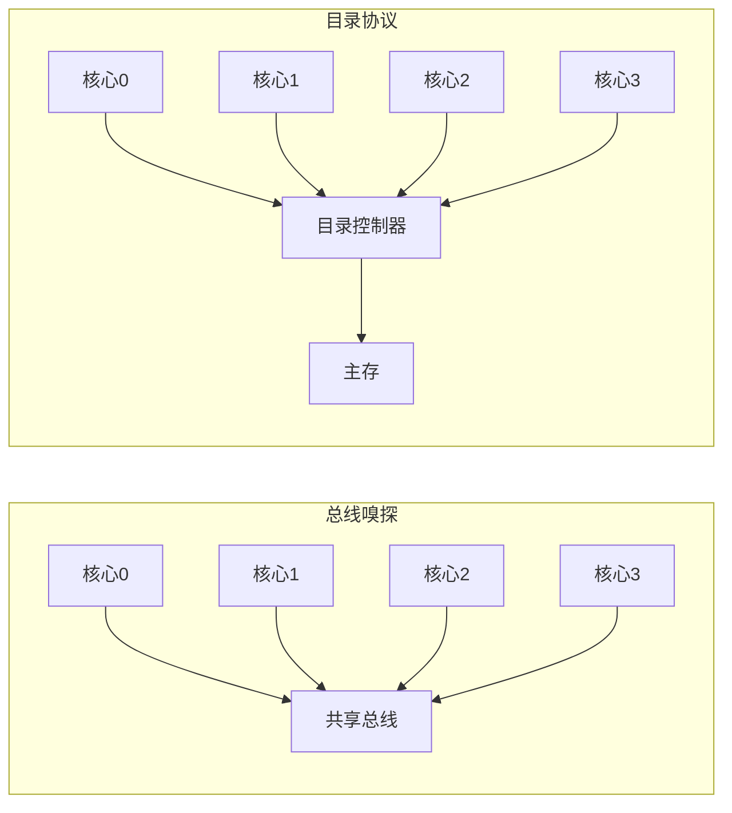
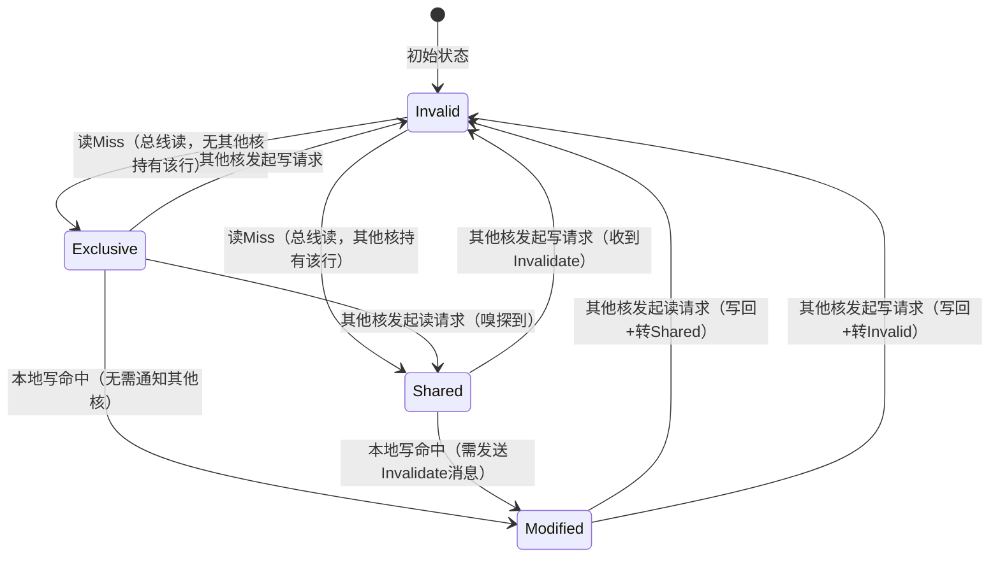
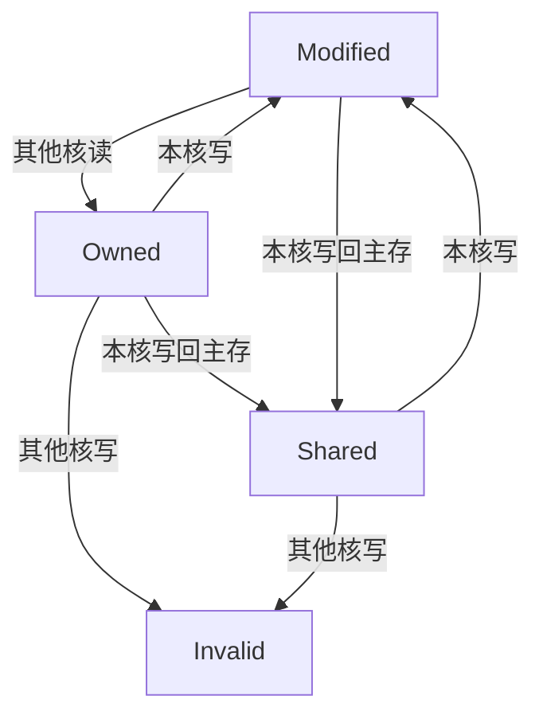
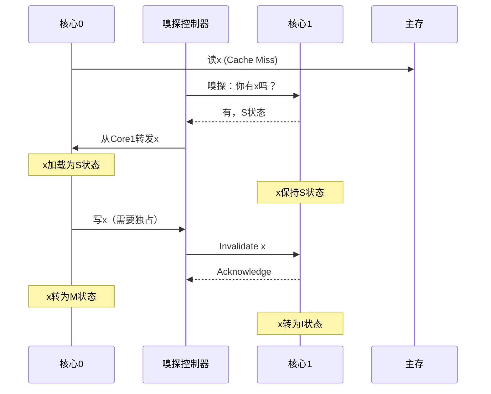
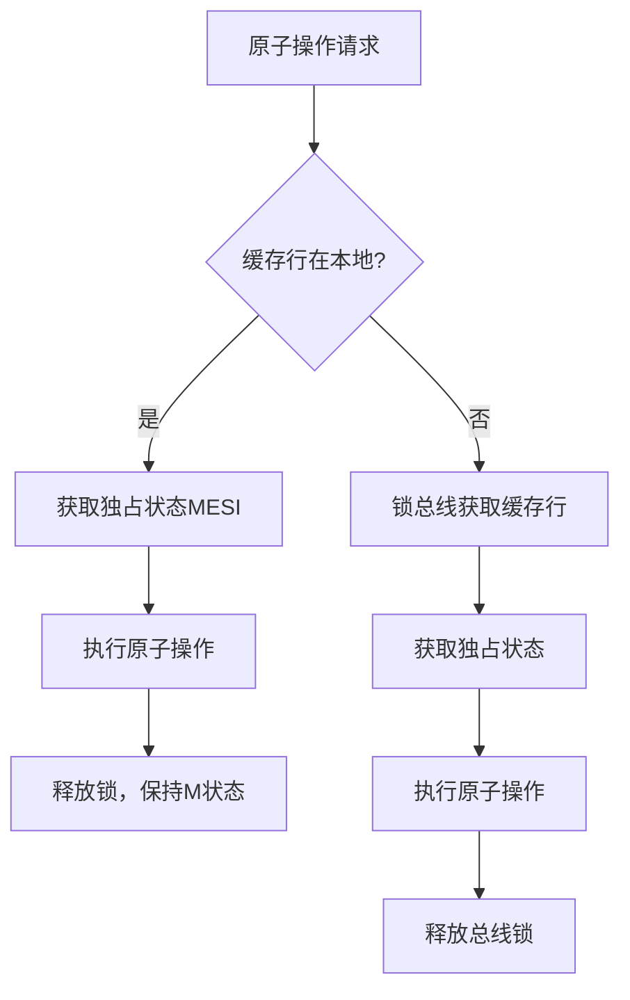
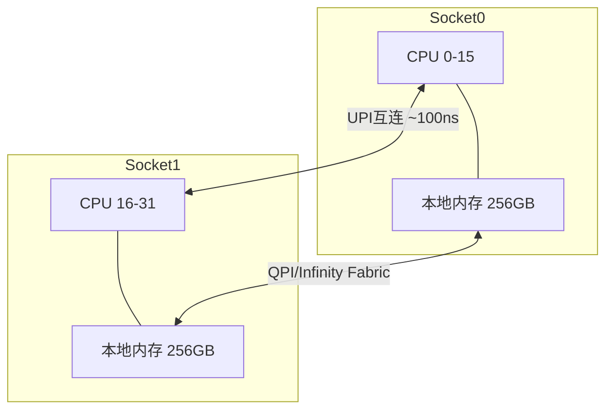

## 1.6 缓存一致性

> **本节定位**：缓存一致性是连接"CPU微架构"与"并发编程"的桥梁。理解一致性机制，是理解内存模型、锁实现、无锁算法、NUMA优化的基石。如果你只读本章一节，就读这一节。

### 1.6.1 为什么需要缓存一致性

#### 多核时代的核心矛盾

现代CPU几乎都是多核架构。每个核心拥有独立的L1和L2缓存，多个核心共享L3缓存和主存。这就产生了一个根本问题：**同一份数据可能同时存在于多个缓存中，任何一个核心的修改如何被其他核心感知？**



**一个具体场景：**

假设变量 `x` 初始值为 0，核心0和核心1各自将 `x` 加1，预期结果是 2。

| 时间 | 核心0 | 核心1 | 缓存0中x | 缓存1中x | 主存中x |
|------|-------|-------|----------|----------|---------|
| T0 | - | - | - | - | 0 |
| T1 | 读x=0 | 读x=0 | 0 | 0 | 0 |
| T2 | x++ (x=1) | - | 1 | 0 | 0 |
| T3 | - | x++ (x=1) | 1 | 1 | 0 |
| T4 | 写回 | 写回 | ? | ? | ? |

如果核心0在T2将修改后的 `x=1` 写回主存，但核心1在T1已经读取了旧值 `x=0` 并在自己的缓存中将其修改为1，那么主存中的最终值取决于谁最后写入——可能是1而不是预期的2。这就是**缓存一致性问题**。

更严重的是，如果没有任何一致性协议，核心1甚至可能永远看不到核心0的修改——它的缓存中始终是旧值，这就是**可见性丧失**。

#### 一致性问题的本质

缓存一致性问题本质上是**数据可见性问题**，可以分解为三个子问题：

- **写-写冲突**：两个核心同时修改同一地址，最终结果取决于写入顺序。没有全局顺序保证，不同核心可能看到不同的最终值
- **读-写冲突**：一个核心在读，另一个核心在写，读到的可能是旧值。在时间窗口上，读操作可能"穿过"写操作的中间状态
- **不存在"原子可见"**：一个核心的修改不会自动对其他核心可见。缓存是分层的，写操作需要经过写缓冲区→L1→L2→L3→主存的多级传递

如果没有硬件层面的一致性协议，程序员就必须手动管理所有共享数据的同步，这将极大地增加编程复杂度并降低性能。想象一下：每次读写共享变量都需要手动发送"无效化通知"并等待确认——这就是为什么一致性协议必须由硬件实现。

#### 历史演进

缓存一致性并非与生俱来：

| 时代 | 状态 | 代表 |
|------|------|------|
| 1980年代前 | 无一致性协议，软件管理 | IBM System/360 Model 65 |
| 1983年 | 首个商用MESI实现 | Intel i860 |
| 1990年代 | x86多核引入 | Intel Pentium Pro |
| 2000年代 | NUMA + 目录协议 | AMD Opteron, Intel Xeon |
| 2010年代至今 | 大规模多核 + 混合协议 | ARM DynamIQ, RISC-V |

---

### 1.6.2 一致性的两个维度

缓存一致性需要解决两个层面的问题：

#### 1. 写传播（Write Propagation）

一个核心对数据的修改最终必须对所有其他核心可见。常见的实现策略：

| 策略 | 原理 | 优点 | 缺点 | 使用者 |
|------|------|------|------|--------|
| **写失效（Write-Invalidate）** | 修改数据时，使其他缓存中同一行的副本无效 | 总线流量小（只发一次无效化） | 后续读取可能miss | x86/ARM/RISC-V（主流） |
| **写更新（Write-Update）** | 修改数据时，将新值广播到所有持有副本的缓存 | 其他核心无需重新加载 | 总线流量大（每次写都广播） | 早期SPARC、早期Sun Fire |
| **写广播（Write-Broadcast）** | 修改数据时广播新值，但接收方自行决定是否更新 | 兼顾可见性和灵活性 | 实现复杂，需要每个核心过滤 | 少数专用处理器 |

现代主流处理器（x86、ARM、RISC-V）几乎都采用**写失效**策略，原因有三：

1. **写操作远多于读操作**：在典型工作负载中，写操作占比60-80%，写更新的广播成本不可接受
2. **写失效是一次性成本**：发送一次Invalidation后，后续读写不再需要额外总线事务（直到被其他核再次写入）
3. **缓存局部性天然匹配**：大多数写操作针对核心私有数据，写失效避免了不必要的广播

#### 2. 事务顺序（Serialization）

多个核心对同一地址的修改必须有一个全局一致的顺序，所有核心看到的顺序相同。这被称为**全序（Total Order）**。

例如，核心0写入 `x=1`，核心1写入 `x=2`，所有核心最终看到的要么是 `x=1` 后 `x=2`，要么是 `x=2` 后 `x=1`，而不能核心A看到 `x=1` 而核心B看到 `x=2`。

全序保证的**必要性**：如果没有全序，即使每个核心的缓存最终都包含最新值，不同核心在中间时刻看到的值可能不同，这会导致不可预测的程序行为。例如，两个核心同时对共享链表进行插入操作，如果没有全序保证，一个核心可能看到链表处于不一致的中间状态（节点A指向B，但B还没指向A）。

---

### 1.6.3 一致性的实现方式

硬件层面有两种主流的一致性协议实现方式：



#### 总线嗅探（Snooping）

所有核心通过共享总线（或互连网络）连接，每个核心的缓存控制器"嗅探"总线上的事务，检测是否有其他核心访问自己缓存中的数据。

**工作原理**：每当核心发起内存事务（读/写），该事务会被广播到所有核心。每个核心的缓存控制器检查自己是否持有该地址的副本，如果是则根据协议状态和事务类型做出响应（提供数据、无效化本地副本等）。

- **优点**：实现简单，延迟低（广播即达），不需要额外的目录存储
- **缺点**：总线带宽成为瓶颈，扩展性差（核心数超过8-16个时总线饱和）
- **适用场景**：少核心（2-8核）的单芯片系统，桌面/笔记本CPU
- **典型协议**：MESI、MOESI、MESIF、Dragon

#### 目录协议（Directory-Based）

维护一个集中式或分布式的目录，记录每个内存块被哪些核心缓存、处于什么状态。目录通常与内存控制器集成在一起。

**工作原理**：

1. 核心发起内存事务时，请求被路由到目录控制器（而非广播）
2. 目录查询该内存块的状态：哪些核心持有副本、各处于什么状态
3. 目录仅向持有相关副本的核心发送点对点消息
4. 相关核心响应后，目录更新目录条目状态

**目录条目结构**（以4核心为例）：

| 内存块地址 | 状态 | 核心0 | 核心1 | 核心2 | 核心3 | 脏数据位置 |
|-----------|------|-------|-------|-------|-------|-----------|
| 0x1000 | Shared | ✓ | ✓ | - | - | - |
| 0x2000 | Modified | - | - | ✓ | - | Core2 |
| 0x3000 | Uncached | - | - | - | - | - |

- **优点**：点对点通信，扩展性好，适合大规模系统
- **缺点**：目录本身占用额外存储，查询目录有延迟（需要先访问目录才能知道该问谁）
- **适用场景**：多路服务器（NUMA）、大规模多核系统（64+核心）
- **典型协议**：Dir1B（一位状态目录）、Dir4B（四位状态目录）、Dragon协议

#### 两种方式的对比

| 维度 | 总线嗅探 | 目录协议 |
|------|----------|----------|
| 核心数 | 2-16 | 16-数千 |
| 通信方式 | 广播 | 点对点 |
| 延迟 | 低（1-2周期） | 中等（3-10周期） |
| 带宽消耗 | 高（O(n)） | 低（O(k)，k为副本数） |
| 额外存储 | 无 | 目录条目（~0.5%-2%内存） |
| 实现复杂度 | 低 | 高 |
| 典型应用 | 桌面/笔记本CPU | 服务器/超算 |
| 可扩展性 | 差（总线瓶颈） | 好（点对点通信） |

**现实中的混合方案**：现代处理器往往采用混合方案。例如，Intel的Mesh互连在芯片内使用目录协议（因为核心数多达28-60个），但在Socket内某些子系统仍使用嗅探协议。AMD的Infinity Fabric也结合了两种方式，根据数据局部性动态选择。

---

### 1.6.4 MESI协议详解

MESI是最经典的缓存一致性协议，由Misner和Hawthorne于1980年代在Intel处理器中实现。每个缓存行有四种状态：

| 状态 | 英文 | 含义 | 其他核有副本? | 与主存一致? | 允许的操作 |
|------|------|------|--------------|------------|-----------|
| **M** | Modified | 已修改，仅本核缓存有效 | 否 | 否（缓存中是最新值） | 读/写均可，需写回主存 |
| **E** | Exclusive | 独占，本核缓存与主存一致 | 否 | 是 | 读/写均可，写时直接转M |
| **S** | Shared | 多核共享，与主存一致 | 是 | 是 | 只读，写需先获总线权 |
| **I** | Invalid | 无效，需重新加载 | - | - | 不可用，必须重新获取 |

#### 状态转换详解



**关键转换场景解读：**

1. **Exclusive → Modified（本地写命中）**：这是最优路径。核心持有独占副本，写入时无需任何总线事务，直接修改缓存行并标记为Modified。这就是为什么独占状态对性能至关重要——写入延迟为零。

2. **Shared → Modified（写命中但有共享）**：核心需要先通过总线发送Invalidate消息，使其他核心的副本无效。其他核心收到后将本地副本标记为Invalid并回复确认（Acknowledge）。发送方等待所有确认后才能执行写入并转为Modified状态。这个等待过程会造成**写延迟**（20-50周期）。

3. **Modified → Invalid（被其他核访问）**：核心必须将修改后的数据写回主存（或通过 Intervention 转发给请求方），然后将本地副本标记为Invalid。这个操作引入了**写回延迟**。

4. **Exclusive → Shared（其他核读取）**：当另一个核心请求同一缓存行时，当前核心将数据转发给请求方，两者都标记为Shared。注意这个转换是**被动的**——当前核心不做任何写操作。

#### MESI的总线事务

MESI协议依赖三种总线事务：

| 事务 | 缩写 | 用途 | 触发条件 |
|------|------|------|----------|
| Bus Read | BusRd | 核心读Miss时发起，获取缓存行 | 本地缓存未命中 |
| Bus Read Exclusive | BusRdX | 核心写Miss时发起，获取独占副本 | 写入时缓存未命中 |
| Bus Writeback | BusWB | 将Modified状态的数据写回主存 | 缓存行被驱逐或被其他核请求 |

#### MESI的性能特征

| 操作类型 | 额外延迟 | 原因 |
|----------|----------|------|
| 读命中（Hit） | 0周期 | 直接从缓存读取 |
| 读Miss（E/S状态其他核） | 3-5周期 | 从其他核或L3缓存加载 |
| 写命中且E/M状态 | 0-1周期 | 无需总线事务，直接修改 |
| 写命中但S状态 | 20-50周期 | 需发送Invalidate并等待确认 |
| 写Miss | 50-100周期 | 需获取独占副本（可能涉及主存） |

**关键洞察**：MESI的性能差异极大——最优路径（E→M）和最差路径（写Miss）相差50-100倍。这意味着数据访问模式对性能的影响远超算法复杂度。在并发编程中，减少跨核心共享写是提升性能的关键。

---

### 1.6.5 MOESI与MESIF协议变体

标准MESI在某些场景下效率不够高，处理器厂商开发了多种变体来解决特定的性能瓶颈。

#### AMD的MOESI协议

AMD在Opteron及后续处理器中引入了**Owned（O）**状态：

| 状态 | 含义 | 与MESI的区别 |
|------|------|-------------|
| **O** (Owned) | 本核拥有最新数据，其他核有S副本，主存可能过时 | 允许在不写回主存的情况下响应其他核的读请求 |

**MOESI的核心优势**：当Modified行被其他核读取时，在MESI中必须先写回主存再转发（产生写回延迟），而MOESI允许直接通过缓存到缓存（Cache-to-Cache）传输，省去了写回主存的步骤。



**MOESI的实际收益**：在读密集型多核工作负载中（如数据库查询），MOESI相比MESI可减少15-30%的缓存行写回，因为读请求可以通过Cache-to-Cache传输直接满足，而不需要先写回主存再从主存读取。

#### Intel的MESIF协议

Intel在Nehalem及后续处理器中引入了**Forward（F）**状态：

| 状态 | 含义 | 解决的问题 |
|------|------|-----------|
| **F** (Forward) | 本核负责响应其他核的读请求 | 避免多个核同时响应造成的总线冲突 |

在MESI中，当多个核心持有S状态副本时，读请求可能被所有核心同时响应（或需要额外的仲裁逻辑）。MESIF通过指定一个核心为Forwarder（转发者），简化了响应流程：只有Forwarder才会响应嗅探到的读请求，其他核心保持静默。

**MESIF的Forwarder选择策略**：通常选择最近访问该缓存行的核心作为Forwarder，因为它最可能仍在L1缓存中持有该行，响应延迟最低。

#### 协议对比总结

| 协议 | 额外状态 | 核心优化 | 典型使用者 |
|------|----------|----------|-----------|
| MESI | 无 | 基础一致性 | Intel Core系列（早期） |
| MOESI | Owned | 减少写回主存 | AMD Opteron/EPYC |
| MESIF | Forward | 减少响应冲突 | Intel Nehalem及后续 |

---

### 1.6.6 嗅探控制器的工作流程

以x86处理器为例，嗅探控制器的典型工作流程：



**嗅探控制器的硬件实现：**

现代处理器中，嗅探控制器是一个独立于核心流水线的硬件模块，持续监听互连网络上的事务。它的核心职责：

1. **监听过滤（Snoop Filter）**：维护一个摘要表，记录本核L1/L2缓存中每个缓存行的状态。收到嗅探请求时，先查摘要表，如果本核没有该行的副本，则直接返回"未命中"，无需访问实际缓存。这大大降低了无效嗅探的能耗和延迟。

2. **响应生成**：根据本地缓存状态和请求类型，生成相应的响应（数据转发、确认、无效化等）。

3. **冲突仲裁**：多个核心同时请求同一缓存行时，仲裁器决定服务顺序。通常采用Round-Robin或优先级仲裁。

4. **写合并（Write Combining）**：将对同一缓存行的多次小写操作合并为一次总线事务，减少Invalidation次数。这对非时态写入（如memcpy）尤为重要。

---

### 1.6.7 内存屏障与缓存一致性的关系

缓存一致性保证了**修改的可见性**，但不保证**可见的时机**。现代CPU的乱序执行和写缓冲区会打破程序员对内存操作顺序的直觉。

#### 写缓冲区与可见性延迟

即使缓存一致性协议保证了Modified行在被其他核读取时会收到最新值，但写操作先进入**写缓冲区（Write Buffer）**，可能延迟对其他核心可见：

```c
// 核心0执行：
x = 1;          // 写入写缓冲区（非立即可见）
y = 1;          // 可能在x之前对其他核可见

// 核心1执行：
while (y == 0) {}  // 等待y变为1
assert(x == 1);    // 可能失败！x可能还未写入缓存
```

**根本原因**：写缓冲区是一个FIFO队列，但不同地址的写操作可能被乱序刷新到缓存。即使x先执行，y可能先到达缓存——因为y的地址可能更"热"（在L1缓存中），而x需要先写回L2/L3。

#### 内存屏障（Memory Barrier / Fence）

内存屏障强制CPU在屏障点之前的操作对其他核心可见后，才执行屏障之后的操作：

```c
// 核心0
x = 1;
__asm__ volatile ("mfence" ::: "memory");  // x的修改对其他核可见
y = 1;

// 核心1
while (y == 0) {}
assert(x == 1);  // 保证成功
```

**内存屏障的本质**：它不是一个"同步指令"，而是一个"排序约束"。它告诉CPU："屏障之前的所有内存操作必须在屏障之后的内存操作之前对其他核心可见。"这包括：

- **StoreStore屏障**：确保屏障前的Store在屏障后的Store之前可见
- **LoadLoad屏障**：确保屏障前的Load在屏障后的Load之前完成
- **StoreLoad屏障**：确保屏障前的Store在屏障后的Load之前可见（最强的屏障）

#### x86的内存模型

x86采用**TSO（Total Store Order）**内存模型，这是一种相对宽松的模型：

| 操作 | 保证 | 解释 |
|------|------|------|
| Store → Store | 保持顺序 | 第一个store对其他核可见后才执行第二个 |
| Load → Load | 保持顺序 | 第一个load完成后才执行第二个 |
| Load → Store | 保持顺序 | load完成后才执行后续store |
| Store → Load | **不保证顺序** | store可能延迟，load可能先于之前的store对其他核可见 |

x86的 `mfence` 指令用于解决 Store → Load 的重排序问题。而 `lock` 前缀指令（如 `lock add`）不仅提供原子性，还隐含完整的内存屏障语义。

**为什么x86只需要StoreLoad屏障？** 因为x86的硬件保证了其他三种顺序（Store→Store、Load→Load、Load→Store），只有Store→Load可能被重排。这是x86架构的历史设计决策——较严格的内存模型简化了编程，但也限制了硬件优化空间。

#### 各架构的内存模型对比

| 架构 | 内存模型 | 松弛程度 | 屏障指令 | 编程复杂度 |
|------|----------|----------|----------|-----------|
| x86/x64 | TSO | 较严格 | `mfence`, `lock` 前缀 | 低 |
| ARM | 弱一致性 | 很宽松 | `dmb`, `dsb`, `isb` | 高 |
| RISC-V | RVWMO | 中等偏松 | `fence` | 中 |
| POWER/PowerPC | 弱一致性 | 很宽松 | `lwsync`, `sync`, `isync` | 高 |

ARM等弱一致性架构需要更频繁地使用内存屏障，但也因此能获得更高的乱序执行效率——CPU有更大的自由度来重排内存操作以提升性能。这就是为什么ARM在移动设备上能效比更高：硬件更简单，软件承担更多排序责任。

---

### 1.6.8 原子操作与缓存一致性

原子操作（Atomic Operations）与缓存一致性协议紧密相关。硬件通过一致性协议确保原子操作的全局可见性。

#### x86原子操作的实现机制

x86处理器中的原子操作（如 `LOCK CMPXCHG`、`LOCK XADD`）通过以下机制实现：

1. **总线锁定（Bus Lock）**：早期处理器通过在总线上放置LOCK#信号，在操作期间锁住整个总线，阻止其他核心访问任何内存。**代价极高**（所有内存操作被阻塞），已基本淘汰，仅在跨缓存行操作时才可能触发。

2. **缓存行锁定（Cache Line Lock）**：现代处理器通过MESI协议实现。操作前先获取缓存行的独占（E或M）状态，此时其他核心无法同时修改该缓存行，无需锁总线。仅当缓存行不在本地缓存中时，才需要锁总线。



3. **全缓存一致性（Full Cache Coherence）**：对于跨越多个缓存行的原子操作（如某些平台上的128位CAS），需要更高级的一致性保证。现代处理器通常使用"锁对齐"策略——将跨缓存行的数据对齐到缓存行边界，避免跨行原子操作。

#### lock前缀的性能特征

| 场景 | 耗时 | 原因 | 出现频率 |
|------|------|------|----------|
| 缓存行已在E/M状态 | 1-2周期 | 仅需内部状态转换 | 高（低争用时） |
| 缓存行在S状态 | 20-50周期 | 需发送Invalidate并等待确认 | 中 |
| 缓存行不在本地缓存 | 50-100周期 | 需从其他核或主存获取 | 低（冷启动时） |

这就是为什么高争用的原子操作会严重拖慢性能——每次操作都需要协调多个核心的缓存状态。一个典型的反模式是：多个线程对同一原子变量执行 `fetch_add`，在8核系统上，吞吐量可能降至单线程的1/10。

---

### 1.6.9 伪共享（False Sharing）

#### 问题本质

伪共享是缓存一致性协议的**副作用**。两个核心分别修改同一缓存行中的**不同变量**，逻辑上完全独立，但因为它们位于同一缓存行，一致性协议会反复使对方的缓存行失效，产生大量无意义的一致性流量。

```mermaid
graph LR
    subgraph 缓存行（64字节）
        V1[var_a: 4字节] --- PAD[填充: 56字节] --- V2[var_b: 4字节]
    end
    subgraph 核心0
        C0[修改 var_a]
    end
    subgraph 核心1
        C1[修改 var_b]
    end
    C0 -->|使Core1的缓存行无效| C1
    C1 -->|使Core0的缓存行无效| C0
```

**为什么叫"伪"共享？** 因为两个核心实际上没有共享任何数据——它们操作的是不同的变量。但由于缓存一致性是以**缓存行**为粒度的，同一缓存行中的任何写操作都会使整行无效，导致"假冲突"。

#### 伪共享的性能影响

伪共享的严重程度取决于**写频率**和**核心数**：

| 场景 | 写频率 | 核心数 | 性能损失 |
|------|--------|--------|----------|
| 两个核心各写100万次 | 低 | 2 | 10-20% |
| 四个核心各写1亿次 | 高 | 4 | **10-100倍** |
| 八个核心高争用计数器 | 极高 | 8 | **100倍以上** |

一个经典的伪共享案例：4个线程分别递增独立的计数器，如果计数器位于同一缓存行，4线程性能可能**低于单线程**。这是因为4个核心不断互相Invalidate对方的缓存行，每次Invalidate都包含完整的总线事务开销。

#### 检测伪共享

**方法一：perf c2c（推荐，Linux）**

```bash
# 编译（需要调试信息和性能计存器支持）
gcc -O3 -pthread -g false_sharing.c -o false_sharing

# 采样
perf c2c record ./false_sharing

# 分析
perf c2c report --stats
# 关注 HITM (Hit Modified) 列 —— 高HITM值表明伪共享
```

HITM（Hit in Modified line）表示一个核心访问的缓存行在另一个核心的缓存中处于Modified状态，这是伪共享的直接证据。`perf c2c` 还会显示具体的缓存行地址和涉及的核心，帮助定位问题变量。

**方法二：perf stat**

```bash
perf stat -e cache-misses,cache-references,L1-dcache-load-misses ./false_sharing
# 对比有/无伪共享的cache-misses差异
```

**方法三：Intel VTune**

VTune的"Memory Access"分析可以直接在GUI中标注伪共享热点，显示具体的缓存行地址和涉及的核心。对于大型代码库，VTune的热点视图能快速定位伪共享发生的位置。

**方法四：简化的内联检测**

在开发阶段，可以添加简单的计时检测：

```c
#include <time.h>

struct counters {
    long long c0;
    long long c1;
} __attribute__((aligned(64)));  // 预防性填充

// 测试函数：检测是否可能存在伪共享
void detect_false_sharing(void) {
    struct timespec start, end;
    clock_gettime(CLOCK_MONOTONIC, &amp;start);
    // ... 执行高频写入操作 ...
    clock_gettime(CLOCK_MONOTONIC, &amp;end);
    double elapsed = (end.tv_sec - start.tv_sec) + 
                     (end.tv_nsec - start.tv_nsec) / 1e9;
    printf("Elapsed: %.3f seconds\n", elapsed);
}
```

#### 修复伪共享的方法

**方法一：缓存行填充（Cache Line Padding）**

```c
#include <stdio.h>
#include <pthread.h>
#include <time.h>

#define CACHELINE_SIZE 64

// 修复前：伪共享
struct Counters_Bad {
    long long c0;
    long long c1;
    long long c2;
    long long c3;
};  // 总共32字节，4个计数器在同一缓存行

// 修复后：消除伪共享
struct Counters_Good {
    long long c0 __attribute__((aligned(CACHELINE_SIZE)));
    long long c1 __attribute__((aligned(CACHELINE_SIZE)));
    long long c2 __attribute__((aligned(CACHELINE_SIZE)));
    long long c3 __attribute__((aligned(CACHELINE_SIZE)));
};  // 每个计数器独占一个缓存行

void* increment(void* arg) {
    int id = (int)(long)arg;
    long long *counter = &amp;counters.c0 + id;
    for (long long i = 0; i < 100000000LL; i++) {
        (*counter)++;
    }
    return NULL;
}
```

**方法二：C++11 alignas**

```cpp
struct alignas(64) Counters {
    std::atomic<long long> c0{0};
    std::atomic<long long> c1{0};
    std::atomic<long long> c2{0};
    std::atomic<long long> c3{0};
};
```

**方法三：Linux内核的 cacheline_aligned 宏**

```c
#include <linux/cache.h>

struct my_data {
    int hot_field __cacheline_aligned;
    int cold_field;
} __cacheline_aligned;
```

**方法四：线程本地存储（Thread-Local Storage）**

完全避免共享，每个线程维护自己的副本，最终汇总：

```cpp
thread_local long long my_counter = 0;  // 无共享，无伪共享

// 线程结束后汇总
long long total = 0;
for (auto&amp; t : threads) {
    total += get_thread_local_counter(t);
}
```

**方法五：生产者-消费者模式**

如果写操作有天然的分区特性（如不同线程处理不同数据块），可以通过数据分区彻底避免跨核心写争用：

```cpp
// 每个线程处理独立的数据分区
void process_partition(int thread_id, const Data* data, size_t size) {
    size_t chunk = size / NUM_THREADS;
    size_t start = thread_id * chunk;
    // 只写入本地结果，最后汇总
    local_results[thread_id] = compute(data + start, chunk);
}
```

#### 修复效果对比

| 方案 | 4线程耗时 | 加速比 | 缓存行争用 | 适用场景 |
|------|----------|--------|-----------|----------|
| 无填充（伪共享） | 2.46s | 1x（基准） | 极高 | 反面教材 |
| alignas(64) 填充 | 0.23s | **10.7x** | 无 | 必须共享时 |
| thread_local | 0.21s | **11.7x** | 无 | 可聚合时 |
| std::atomic + 填充 | 0.25s | **9.8x** | 无 | 需要原子操作时 |

---

### 1.6.10 一致性协议的性能开销与优化

#### 一致性带来的开销

缓存一致性不是免费的。它带来的主要开销包括：

1. **带宽开销**：Invalidate消息、数据传输、目录查询都占用互连带宽
2. **延迟开销**：写操作需要等待Invalidate确认（Write-Back Invalidation的延迟）
3. **存储开销**：目录协议需要额外的目录存储（每内存块一个条目）
4. **功耗开销**：嗅探控制器持续监听、频繁的缓存行状态转换

**量化数据（Intel Skylake-SP, 双路服务器）：**

| 操作 | 典型延迟 | 说明 |
|------|----------|------|
| 本地L3读命中 | ~12ns | 最优路径 |
| 远端L3读命中（跨Socket） | ~100ns（通过UPI互连） | 8-10倍延迟差 |
| 写Invalidation往返 | ~40-60ns | 包含请求+确认 |
| 全缓存一致性同步 | ~200-500ns | 大规模同步的代价 |

#### 硬件层面的优化

1. **嗅探过滤器（Snoop Filter）**：只对真正持有相关缓存行的核心发送嗅探请求，减少无效嗅探。Intel的Home Agent实现了这一功能，可以将嗅探流量减少50-80%。

2. **写合并（Write Combining）**：将多次对同一缓存行的小写操作合并为一次，减少Invalidation次数。这对memcpy、memset等流式操作特别有效。

3. **推测性Invalidation**：预测即将被写入的缓存行，提前发送Invalidation，隐藏延迟。这需要硬件分支预测器和内存访问模式预测器的配合。

4. **非时态存储（Non-Temporal Store）**：对于流式写入（如 `MOVNTPS`），绕过缓存直接写入主存，避免污染缓存和触发不必要的Invalidation。适用于大块数据拷贝（>256KB）。

5. **缓存行预取（Prefetch）**：预测即将被访问的缓存行，提前加载到本地缓存，避免读Miss时的延迟。但错误的预取会污染缓存并增加带宽消耗。

#### 软件层面的优化

1. **减少共享数据**：尽量使用线程本地数据，减少跨核心共享
2. **读写分离**：将只读数据和频繁修改的数据放在不同的缓存行
3. **批量操作**：将多次小修改合并为一次大修改，减少一致性事务
4. **数据布局优化**：将经常一起访问的数据放在同一缓存行（空间局部性），将独立修改的数据分开（避免伪共享）
5. **使用无锁数据结构**：在低争用场景下，无锁队列/哈希表比互斥锁更适合，减少一致性协议的压力
6. **避免false sharing**：检查结构体布局，确保不同线程访问的字段不在同一缓存行

---

### 1.6.11 NUMA架构下的一致性挑战

#### NUMA（Non-Uniform Memory Access）简介

在多路服务器中，每个CPU插槽有自己的内存控制器和本地内存。访问本地内存快（~80ns），访问远端内存慢（~150-200ns），这就是非均匀内存访问。



#### NUMA下的一致性问题

在NUMA系统中，缓存一致性协议需要跨越Socket边界：

1. **跨Socket写延迟高**：修改远端Socket的缓存行需要通过UPI互连传输Invalidation，延迟是本地操作的5-10倍
2. **目录一致性开销**：远端Socket可能需要查询目录才能确定缓存行状态
3. **内存带宽竞争**：跨Socket的内存访问会争用UPI互连带宽
4. **一致性域扩展**：当核心数超过64个时，全互连的一致性开销变得不可接受，需要分层一致性域

#### NUMA感知的编程实践

```bash
# 查看NUMA拓扑
numactl --hardware
# node 0 cpus: 0-15
# node 1 cpus: 16-31
# node 0 size: 262144 MB
# node 1 size: 262144 MB

# 将进程绑定到NUMA节点
numactl --cpunodebind=0 --membind=0 ./my_program

# 查看内存分配策略
numastat -p $(pidof my_program)
```

```c
#include <numa.h>

// 在NUMA节点0上分配内存
void* ptr = numa_alloc_onnode(size, 0);

// 绑定线程到NUMA节点0的CPU
numa_run_on_node(0);
```

**NUMA优化原则：**

1. **本地化访问**：线程分配在哪个NUMA节点，就使用该节点的内存
2. **减少跨Socket共享**：将共享数据尽量放在一个Socket的内存中
3. **使用 `numactl`**：启动进程时指定NUMA策略
4. **避免 first-touch 延迟**：Linux的默认内存分配策略是first-touch——内存实际分配在首次访问该页面的CPU所在的NUMA节点。如果主线程在Node0上初始化数组，所有页面都会分配在Node0，即使Worker线程运行在Node1上

**NUMA感知的典型场景：**

| 场景 | 问题 | 解决方案 |
|------|------|----------|
| 数据库缓存 | Worker在Node1，数据在Node0 | 使用numa_bind或interleave策略 |
| 多线程计算 | 线程迁移导致远程访问 | 使用pthread_setaffinity_np绑定 |
| 大数组初始化 | first-touch导致单节点热点 | 在目标节点上初始化 |

---

### 1.6.12 一致性与并发编程的深层关系

缓存一致性不仅影响性能，更直接关系到并发程序的正确性。理解一致性机制是理解高级并发概念的基础。

#### 与Java内存模型的关系

Java内存模型（JMM）在硬件一致性之上又加了一层抽象。JMM的`volatile`和`synchronized`语义最终映射到硬件的内存屏障：

| Java语义 | 硬件实现（x86） | 硬件实现（ARM） |
|----------|----------------|----------------|
| volatile读 | 普通load（x86已保证LoadLoad+LoadStore） | `ldar`（acquire语义） |
| volatile写 | `lock addl`（隐含StoreLoad屏障） | `stlr`（release语义） |
| synchronized | `lock cmpxchg`（完整屏障） | `dmb ish` + CAS |

**关键洞察**：x86的强内存模型意味着Java的`volatile`读在x86上几乎无额外开销（只是普通load），但在ARM上需要显式的acquire屏障。这就是为什么在ARM服务器上，Java并发程序的性能特征可能与x86不同。

#### 与无锁编程的关系

无锁（Lock-Free）算法依赖CAS（Compare-And-Swap）原子操作，而CAS的实现直接依赖缓存一致性：

1. CAS需要获取缓存行的独占状态（MESI的E或M状态）
2. 如果缓存行在S状态，需要发送Invalidate等待确认
3. 如果缓存行不在本地缓存，需要从其他核或主存获取

**无锁算法的性能陷阱**：在高争用场景下，CAS的重试循环会产生大量无效的一致性流量。每次CAS失败都意味着一次无效的Invalidate+确认往返。这就是为什么在高争用场景下，互斥锁（特别是futex）反而比无锁算法更高效。

#### 与锁实现的关系

现代互斥锁（如Linux的futex）的实现与缓存一致性紧密相关：

1. **无竞争时**：通过CAS将锁变量从0改为1，获取E/M状态，延迟1-2周期
2. **有竞争时**：CAS失败后进入futex系统调用，内核通过等待队列挂起线程，避免自旋消耗带宽
3. **锁释放时**：写回锁变量（触发Invalidate），唤醒等待线程

---

### 1.6.13 常见误区与最佳实践

#### 误区一："MESI只影响缓存性能，不影响正确性"

**事实**：MESI保证硬件层面的一致性，但软件层面的可见性还需要内存屏障。MESI确保最终一致，但不保证在特定时刻可见。例如，MESI不能保证核心0的写操作在核心1执行下一条指令之前对核心1可见——这需要内存屏障。

#### 误区二："原子操作是免费的"

**事实**：即使在最佳情况下（缓存行已在E/M状态），原子操作也需要1-2个额外周期。在高争用下，每次操作可能需要50-100周期。一个常见的反模式是用原子操作替代所有同步，结果性能反而更差。

#### 误区三："伪共享只在高频写入时才是问题"

**事实**：即使写入频率不高，只要涉及伪共享的代码位于热点路径（如循环内），累积效应仍然显著。更隐蔽的是：读操作也可能触发伪共享——如果核心0在读缓存行A，核心1在写同一缓存行中的变量B，核心0的读操作会因Invalidation而延迟。

#### 误区四："更多核心一定更快"

**事实**：如果共享数据比例过高，增加核心数会因为一致性开销的增加而降低总性能。这被称为**争用扩展性瓶颈**。Amdahl定律的硬件版本：串行部分（一致性同步）限制了并行加速比。

#### 误区五："缓存行大小是固定的"

**事实**：不同处理器的缓存行大小不同。x86通常是64字节，某些ARM处理器是64字节，某些早期处理器是32字节。编写可移植代码时，应该使用运行时检测（如 `sysconf(_SC_LEVEL1_DCACHE_LINESIZE)`）而非硬编码。

#### 最佳实践清单

| 实践 | 做法 | 原因 |
|------|------|------|
| 避免伪共享 | 填充或对齐到缓存行 | 减少无效Invalidation |
| 减少共享写 | 线程本地聚合后汇总 | 最小化一致性事务 |
| NUMA感知 | 线程绑定到内存所在节点 | 避免跨Socket访问 |
| 选择合适的同步原语 | 低争用用CAS，高争用用futex | 匹配硬件特性 |
| 监控一致性开销 | 使用perf c2c/VTune | 定量分析而非猜测 |
| 批量修改 | 合并多次小写为一次大写 | 减少Invalidation频率 |
| 数据布局审查 | 检查结构体字段的线程亲和性 | 预防伪共享 |
| 避免跨缓存行原子操作 | 使用 `__attribute__((aligned(64)))` | 避免总线锁 |

---

### 1.6.14 本节小结

缓存一致性是多核CPU正确运行的基石。核心要点：

1. **问题本质**：多核系统中同一数据的多个缓存副本可能导致不一致，本质是数据可见性问题
2. **两种实现**：总线嗅探（适合少核，延迟低）vs 目录协议（适合多核/NUMA，扩展性好）
3. **MESI核心**：四种状态（Modified/Exclusive/Shared/Invalid）的转换是理解一致性的关键
4. **写失效为主**：现代处理器几乎都采用写失效策略，因为写操作远多于读操作
5. **内存屏障**：硬件一致性 ≠ 软件可见性，需要内存屏障来保证跨核心操作顺序
6. **伪共享**：缓存行级别的假冲突，是性能杀手，需要通过填充或数据布局来避免
7. **性能成本**：一致性协议带来带宽、延迟、功耗开销，需要在正确性和性能之间权衡
8. **NUMA挑战**：跨Socket一致性开销是本地操作的5-10倍，需要NUMA感知编程

理解缓存一致性不仅帮助你写出更高效的并发代码，更能让你在遇到多核性能问题时，能从硬件层面分析根因，而不是盲目猜测。当你看到一个多线程程序的性能随核心数增加反而下降时，首先应该检查的不是算法复杂度，而是一致性协议的开销——特别是伪共享和高争用原子操作。
