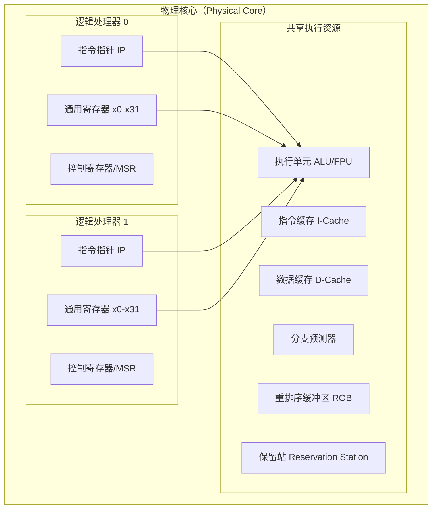

## 1.7 超线程与SIMD

在单核性能提升遇到物理瓶颈之后，现代CPU转向两条并行化路径来提升计算能力：**超线程（Hyper-Threading）** 在同一核心内模拟多个逻辑处理器，提高资源利用率；**SIMD（Single Instruction, Multiple Data）** 让单条指令同时处理多个数据元素，实现数据级并行。两者分别从**任务级**和**数据级**两个维度扩展了CPU的并行能力，是理解现代处理器性能的关键。

### 1.7.1 超线程（SMT）

#### 为什么需要超线程

回顾前面介绍的流水线技术，一个典型的现代CPU核心拥有丰富的执行资源——多个ALU、FPU、Load/Store单元、分支预测器等。但在任意时刻，单线程程序往往无法同时利用所有这些资源。原因有三：

1. **数据依赖**：后一条指令需要等待前一条指令的结果，执行单元被迫空闲
2. **缓存未命中**：指令或数据不在缓存中，CPU需要等待内存访问完成（数十到数百个周期）
3. **分支预测失败**：预测错误导致流水线冲刷，执行单元无事可做

超线程的核心思想就是：**当一个线程因等待而空闲时，让另一个线程使用这些空闲资源**。

从芯片经济学角度看，一个现代CPU核心（如Intel Golden Cove或AMD Zen 4核心）的执行引擎面积占核心总面积的40%-60%，而架构状态（寄存器、控制逻辑）仅占5%-10%。复制架构状态的代价极低，却能显著提高执行引擎的利用率。这就是SMT的本质——以极小的硬件成本换取显著的吞吐量提升。

#### SMT的基本原理

Intel将超线程技术称为**同步多线程（Simultaneous Multi-Threading, SMT）**。其核心是在一个物理核心内复制架构状态（Architectural State），但共享执行资源。



**需要复制的部分（架构状态）：**
- 程序计数器（IP/RIP）
- 通用寄存器文件（x86下每个逻辑处理器32个64位GPR）
- 段寄存器、控制寄存器
- APIC（高级可编程中断控制器）
- 调试寄存器
- 全局控制寄存器（如CR3，用于页表基地址）

**共享的部分（执行引擎）：**
- 译码器和重命名逻辑
- 保留站（Reservation Station）/ 调度器
- 执行单元（ALU、FPU、SIMD单元等）
- 缓存层次（L1/L2/L3 Cache）
- 分支预测器
- TLB（转换后备缓冲区）

> **对比：SMT vs. 多核 vs. 异构计算**
>
> | 特性 | SMT（超线程） | 多核（Multi-Core） | 异构（big.LITTLE） |
> |------|-------------|-------------------|-------------------|
> | 资源共享程度 | 共享执行引擎，仅复制架构状态 | 完全独立核心，共享L3缓存 | 大核与小核架构不同 |
> | 面积开销 | 约5% | 100%（完整核心） | 小核面积约为大核的30%-40% |
> | 性能提升 | 15%-30%吞吐量 | 近线性扩展（理想情况） | 功耗优化为主 |
> | 典型应用 | 服务器、桌面 | 手机SoC、服务器 | 手机SoC（ARM big.LITTLE）、Intel Alder Lake+ |

#### SMT的工作机制

时钟周期:      1     2     3     4     5     6
线程A指令:    I_A1  ---   I_A2  I_A3  ---   I_A4
线程B指令:    I_B1  I_B2  ---   I_B3  I_B4  I_B5
空闲槽位:     ---   I_B2  I_A2  ---   I_B4  ---
              (A等待)  (B填充) (A恢复) (A空闲) (B填充)

--- 代表该线程因等待而空闲
线程B的指令填补了线程A的空闲槽位

具体执行过程：

1. **取指阶段**：每个时钟周期，调度器从两个线程的指令缓存中轮流取指。当线程A因缓存未命中而停顿时，取指器继续从线程B取指。Intel的实现中，取指宽度为每个周期8条指令（4个解码器），两个线程共享这个取指带宽。

2. **译码阶段**：指令译码器不区分来源线程，按序接收两条线程的指令。复杂的CISC指令（如REP MOVSB）会被译码为多个微操作（μops），每个μops独立调度。

3. **重命名与调度**：寄存器重命名逻辑根据来源线程映射到对应的架构寄存器。两个线程的指令被统一放入保留站，等待执行资源就绪。保留站的条目数决定了两个线程能同时持有的在途指令数量。

4. **执行阶段**：执行单元不关心指令来自哪个线程，谁的指令操作数先就绪就先执行。这是SMT的核心优势——通过**细粒度交织**最大化执行单元利用率。

5. **退休阶段**：每个线程的指令按序退休，各自维护独立的程序状态。这保证了线程间的隔离性——一个线程的异常不会影响另一个线程的程序状态。

#### 超线程的实际收益

SMT的性能提升并非固定比例，取决于工作负载特性：

| 工作负载类型 | 超线程加速比 | 原因 |
|-------------|-------------|------|
| 内存密集型（数据库查询） | 30%-50% | 缓存未命中率高，大量空闲周期可供另一线程使用 |
| 计算密集型（科学模拟） | 0%-15% | 执行单元已接近饱和，另一线程能获取的资源有限 |
| 混合型（Web服务器） | 20%-40% | I/O等待与计算交替，互相填补空闲 |
| 编译任务 | 15%-30% | 解析阶段I/O密集，编译阶段计算密集，互补性好 |
| 实时音视频处理 | 5%-15% | 数据流处理较连续，空闲周期较少 |
| 虚拟化（多租户） | 25%-45% | 不同虚拟机的负载特征差异大，互补性强 |

**关键数据**：Intel的测试数据显示，在服务器工作负载（SPECint/SPECfp的混合）中，开启SMT平均带来15%-30%的吞吐量提升，而芯片面积仅增加约5%。这意味着SMT是性价比极高的并行化手段。

**实测方法**：可以用以下命令在Linux下对比开启/关闭SMT的性能差异：

```bash
# 当前SMT状态
cat /sys/devices/system/cpu/smt/active
# 1 = 开启, 0 = 关闭

# 对比测试（使用sysbench CPU基准测试）
# SMT开启时
taskset -c 0,2 sysbench cpu --threads=2 --time=10 run  # CPU0和CPU2共享核心

# SMT关闭时（需要root权限）
echo off > /sys/devices/system/cpu/smt/control
taskset -c 0 sysbench cpu --threads=1 --time=10 run
echo on > /sys/devices/system/cpu/smt/control  # 恢复
```

#### 超线程的安全与隔离问题

SMT引入了一个不容忽视的安全隐患——**侧信道攻击**。由于两个逻辑处理器共享微架构状态（缓存、分支预测器、执行单元的内部缓冲区），恶意线程可以通过观测这些共享资源的时序变化来推断另一个线程的敏感数据。

**主要攻击类型：**

| 攻击名称 | 披露时间 | 攻击原理 | 影响范围 |
|---------|---------|---------|---------|
| Spectre Variant 1/2 | 2018年1月 | 利用推测执行和分支预测的共享状态，跨SMT线程泄露数据 | 所有现代CPU |
| L1TF / Foreshadow | 2018年8月 | 利用L1数据缓存的推测访问，跨SMT线程泄露其他虚拟机的数据 | Intel CPU（虚拟化环境） |
| MDS（RIDL/Fallout/ZombieLoad） | 2019年5月 | 利用CPU内部缓冲区（行填充缓冲区、Store缓冲区等）的数据残留，跨线程泄露信息 | Intel CPU（2019年前产品） |
| TAA（TSX Asynchronous Abort） | 2019年11月 | 利用TSX事务的异步中止机制泄露数据 | 支持TSX的Intel CPU |
| CacheOut / L1DES | 2020年1月 | 利用L1数据缓存的驱逐策略缺陷 | Intel CPU |
| SGAxe / CrossTalk | 2020年6月 | 利用SGX enclave和微架构数据采样 | Intel SGX环境 |
| Downfall / GDS | 2023年8月 | 利用 Gather Data Sampling，在SMT环境下跨线程泄露SIMD寄存器数据 | Intel 8代-11代CPU |

**缓解措施：**

| 缓解方式 | 性能影响 | 适用场景 |
|---------|---------|---------|
| 操作系统禁用SMT | 15%-30%性能损失 | 高安全要求环境（如金融、政务） |
| Core Scheduling（Linux） | 5%-10%性能损失 | 混合信任级别环境 |
| STIBP（单线程间接分支预测器屏障） | 3%-5%性能损失 | 通用服务器 |
| SSBD（投机存储绕过禁用） | 1%-3%性能损失 | 通用服务器 |
| L1D缓存按需填零 | 1%-5%性能损失 | 虚拟化环境 |
| ERAPS（增强型IBRS） | 2%-5%性能损失 | 2022年后CPU |

Linux Core Scheduling 的配置方法：

```bash
# 查看当前SMT状态
cat /sys/devices/system/cpu/smt/active

# 禁用SMT
echo off > /sys/devices/system/cpu/smt/control

# 启用SMT
echo on > /sys/devices/system/cpu/smt/control

# 查看每个逻辑CPU属于哪个物理核心
lscpu -e
# 输出示例：
# CPU  CORE  SOCKET  NODE
# 0    0     0       0
# 1    1     0       0
# 2    0     0       0    ← 与CPU 0共享物理核心
# 3    1     0       0    ← 与CPU 1共享物理核心

# 配置Core Scheduling（仅允许信任的线程在同一核心上运行）
# 需要内核配置 CONFIG_SCHED_CORE
echo 1 > /sys/kernel/debug/sched/core_dump_domains
```

**决策建议**：对于云服务提供商和虚拟化环境，建议采用Core Scheduling而非完全禁用SMT，以在安全性和性能之间取得平衡。对于单租户高性能计算环境，保持SMT开启并配合SSBD/STIBP是更经济的选择。

#### SMT的演进

| 代际 | 产品 | SMT线程数 | 关键改进 |
|------|------|-----------|---------|
| 第一代 | Pentium 4 (2002) | 2路SMT | 首次商用，共享简单流水线 |
| 第二代 | Core系列 (2006-2010) | 不支持 | Intel认为收益不足，退回单线程（超长流水线时代结束后的策略调整） |
| 第三代 | Sandy Bridge (2011) | 2路SMT | 重新引入，共享复杂乱序执行引擎 |
| 当前代 | Ice Lake/Sapphire Rapids | 2路SMT | 更精细的资源共享和隔离，配合安全缓解措施 |
| AMD | Zen系列 (2017-) | 2路SMT | AMD首次支持SMT，实现方式与Intel类似，但调度器设计不同 |
| ARM | Neoverse V2 (2023) | 2路SMT | ARM服务器芯片首次支持SMT |
| 未来趋势 | Intel Meteor Lake+ | 可能调整 | 混合架构（P-core + E-core）中E-core不支持SMT，P-core保留2路 |

> **AMD SMT vs. Intel HT 的实现差异**
> Intel的超线程在Pentium 4时代使用粗粒度交织（每个周期只从一个线程取指），而Sandy Bridge之后改为细粒度交织（每个周期可从两个线程取指）。AMD从Zen架构开始就采用细粒度交织，两个逻辑处理器可以更紧密地共享执行资源。AMD的SMT还支持更灵活的线程调度——操作系统可以通过MSR控制每个逻辑处理器的资源分配权重。

#### SMT的未来发展

随着芯片设计趋向异构化，SMT的角色也在演变：

- **Intel混合架构**：P-core（性能核）保留2路SMT，E-core（能效核）不支持SMT。操作系统需要理解这种差异，将不同优先级的任务分配到合适的核上。
- **ARM服务器**：ARM Neoverse V2/V3开始支持SMT，但在移动领域仍以big.LITTLE异构方案为主。
- **安全驱动的关闭趋势**：部分云厂商（如Google Cloud的部分实例）默认关闭SMT，以规避安全风险。AWS的Nitro架构通过硬件隔离来降低SMT安全风险。

### 1.7.2 SIMD（单指令多数据）

#### SIMD的基本概念

SIMD（Single Instruction, Multiple Data）是一种**数据级并行**技术：一条指令同时对多个数据元素执行相同操作。

标量运算（一次处理1个元素）：
  ADD R1, R2, R3    →  R1 = R2 + R3
  ADD R4, R5, R6    →  R4 = R5 + R6
  ADD R7, R8, R9    →  R7 = R8 + R9
  （需要3条指令，3个时钟周期）

SIMD运算（一次处理4个元素）：
  VADD V0, V1, V2   →  V0[0..3] = V1[0..3] + V2[0..3]
  （只需1条指令，1个时钟周期，4倍吞吐量）

下图展示了SIMD处理数组加法的过程：

数据：
  数组A: [a0, a1, a2, a3]
  数组B: [b0, b1, b2, b3]

SIMD向量寄存器操作：
  V1: | a0 | a1 | a2 | a3 |    ┐
                                   ├  VADD V0, V1, V2
  V2: | b0 | b1 | b2 | b3 |    ┘

  V0: | a0+b0 | a1+b1 | a2+b2 | a3+b3 |

一条VADD指令完成了4个加法操作

**SIMD的理论加速比**：假设向量宽度为W，理想情况下SIMD可提供W倍的吞吐量提升。但实际加速比受以下因素制约：
- **数据对齐**：未对齐的内存访问可能需要额外的加载/存储周期
- **循环开销**：循环控制、掩码处理、尾部元素处理等非计算开销
- **数据依赖**：如果元素间存在依赖关系（如前缀和），无法直接并行化
- **内存带宽**：当数据供给速度跟不上计算速度时，SIMD的加速效果受限

#### SIMD指令集演进

SIMD技术的发展是CPU性能提升的重要脉络，每一代都在宽度和功能上扩展：

| 指令集 | 推出年份 | 寄存器宽度 | 寄存器数量 | 寄存器命名 | 关键特性 |
|--------|---------|-----------|-----------|-----------|---------|
| MMX | 1997 | 64位 | 8个 | MM0-MM7 | 首次引入，整数SIMD，与x87 FPU共用寄存器 |
| SSE | 1999 | 128位 | 8个 | XMM0-XMM7 | 浮点SIMD，独立寄存器文件 |
| SSE2 | 2001 | 128位 | 8个 | XMM0-XMM7 | 整数SIMD + 双精度浮点 |
| SSE3 | 2004 | 128位 | 8个 | XMM0-XMM7 | 水平操作（HADD）、对齐加载 |
| SSSE3 | 2006 | 128位 | 8个 | XMM0-XMM7 | 字节重排、符号扩展 |
| SSE4.1 | 2007 | 128位 | 8个 | XMM0-XMM7 | 点积、min/max、多取指 |
| SSE4.2 | 2008 | 128位 | 8个 | XMM0-XMM7 | 字符串比较、CRC32 |
| AVX | 2011 | 256位 | 16个 | YMM0-YMM15 | 宽度翻倍，三操作数编码 |
| AVX2 | 2013 | 256位 | 16个 | YMM0-YMM15 | 整数也支持256位，FMA融合乘加 |
| AVX-512 | 2016 | 512位 | 32个 | ZMM0-ZMM31 | 宽度再翻倍，掩码操作，嵌入广播 |
| AVX-VNNI | 2019 | 256/512位 | - | - | 专为深度学习矩阵运算优化 |
| AVX10 | 2023 | 256/512位 | 32个 | ZMM0-ZMM31 | 统一AVX-512和AVX2，跨平台兼容 |

> **ARM SIMD发展路线**
>
> | 指令集 | 推出年份 | 寄存器宽度 | 关键特性 |
> |--------|---------|-----------|---------|
> | NEON | 2009 (ARMv7) | 128位 | 移动设备标配，16个Q寄存器 |
> | SVE | 2019 (ARMv8.2) | 128-2048位 | 可变长度向量，Scatter/Gather |
> | SVE2 | 2021 (ARMv9) | 128-2048位 | DSP/信号处理增强，加密指令 |
>
> ARM的SVE采用**可变向量长度（VLA）**编程模型：编译器生成的代码不依赖固定的向量宽度，同一份二进制可以在128位和2048位的硬件上运行，自动利用可用的向量宽度。这与x86的固定宽度SIMD形成鲜明对比，是ARM在服务器和HPC领域的重要优势。

#### AVX-512详解

AVX-512是当前x86平台最强大的SIMD扩展，值得深入了解其设计细节：

**寄存器层次：**
ZMM寄存器（512位）:
┌──────────────────────────────────────────────────────────────────────────┐
│                           512-bit ZMM register                          │
├──────────────────────────────────────────────────────────────────────────┤
│                           256-bit upper half                             │
├────────────────────────────────┬─────────────────────────────────────────┤
│       128-bit XMM             │              128-bit XMM                │
└────────────────────────────────┴─────────────────────────────────────────┘

向下兼容关系：
  ZMM0 = 512位完整寄存器
  YMM0 = ZMM0的低256位
  XMM0 = ZMM0的低128位

**掩码寄存器（k0-k7）：**

AVX-512引入了8个掩码寄存器（k0-k7），每个64位宽，支持逐元素的条件操作：

```asm
; 示例：对数组中大于阈值的元素加1
; vmask = (src > threshold) ? 0xFF : 0x00 （每字节一个掩码位）
vmovdqu32   zmm0, [src]             ; 加载源数组
vpcmpd      k1, zmm0, zmm1, 0x0E    ; k1[i] = (src[i] > threshold) ? 1 : 0
vpaddd      zmm2{k1}, zmm0, zmm3    ; 仅在k1为1的位置执行加法
vmovdqu32   [dst], zmm2             ; 存储结果
```

**嵌入广播（Embedded Broadcast）：**

```asm
; 将标量值广播到所有向量通道
; vbcstsi322ps: 将内存中的单个32位整数广播到256位寄存器的所有8个通道
vfmadd231ps  zmm0, zmm1, [scalar_addr]{1to16}
; 等价于：
; 加载 scalar_addr 处的值，复制16份
; 然后与 zmm1 做逐元素乘加
```

**压缩/解压（Compress/Expand）：**

```asm
; 根据掩码条件压缩数组（去掉不满足条件的元素）
vmovdqu32   zmm0, [src]
vpcmpd      k1, zmm0, zmm1, 0x0E    ; k1[i] = (src[i] > threshold)
vcompressd  zmm2{k1}, zmm0          ; 将k1为1的元素压缩到zmm2的低地址端
vmovdqu32   [dst], zmm2
```

**AVX-512的子集与兼容性问题：**

Intel将AVX-512细分为多个子集，这导致了著名的"AVX-512分裂"问题：

| AVX-512子集 | 功能 | 支持的CPU |
|------------|------|----------|
| AVX-512F | 基础指令集（浮点/整数运算） | Skylake-SP+ |
| AVX-512DQ | 64位整数运算、标量浮点 | Skylake-SP+ |
| AVX-512BW | 8位/16位整数运算 | Skylake-SP+ |
| AVX-512VL | 128/256位向量长度版本 | Skylake-SP+ |
| AVX-512VNNI | 神经网络推理加速 | Cascade Lake+ |
| AVX-512IFMA | 52位整数乘加 | Ice Lake+ |
| AVX-512VBMI/VBMI2 | 字节级操作 | Ice Lake+ |
| AVX-512FP16 | 半精度浮点 | Sapphire Rapids+ |

这种碎片化曾导致Intel在12代酷睿（Alder Lake）中完全禁用AVX-512，因为E-core不支持该指令集。AVX10标准的推出旨在统一这些子集。

#### SIMD编程实战

##### 使用C/C++内置函数（Intrinsics）

```c
#include <immintrin.h>
#include <stdio.h>

// 标量版本：逐个元素相加
void add_scalar(const float* a, const float* b, float* c, int n) {
    for (int i = 0; i < n; i++) {
        c[i] = a[i] + b[i];
    }
}

// SSE版本：每次处理4个float
void add_sse(const float* a, const float* b, float* c, int n) {
    int i;
    // 每次处理4个元素
    for (i = 0; i <= n - 4; i += 4) {
        __m128 va = _mm_loadu_ps(&amp;a[i]);  // 加载4个float
        __m128 vb = _mm_loadu_ps(&amp;b[i]);  // 加载4个float
        __m128 vc = _mm_add_ps(va, vb);   // 4个加法并行
        _mm_storeu_ps(&amp;c[i], vc);         // 存储4个结果
    }
    // 处理剩余元素
    for (; i < n; i++) {
        c[i] = a[i] + b[i];
    }
}

// AVX2版本：每次处理8个float
void add_avx2(const float* a, const float* b, float* c, int n) {
    int i;
    for (i = 0; i <= n - 8; i += 8) {
        __m256 va = _mm256_loadu_ps(&amp;a[i]);  // 加载8个float
        __m256 vb = _mm256_loadu_ps(&amp;b[i]);  // 加载8个float
        __m256 vc = _mm256_add_ps(va, vb);   // 8个加法并行
        _mm256_storeu_ps(&amp;c[i], vc);
    }
    for (; i < n; i++) {
        c[i] = a[i] + b[i];
    }
}

// AVX-512版本：每次处理16个float
void add_avx512(const float* a, const float* b, float* c, int n) {
    int i;
    for (i = 0; i <= n - 16; i += 16) {
        __m512 va = _mm512_loadu_ps(&amp;a[i]);  // 加载16个float
        __m512 vb = _mm512_loadu_ps(&amp;b[i]);  // 加载16个float
        __m512 vc = _mm512_add_ps(va, vb);   // 16个加法并行
        _mm512_storeu_ps(&amp;c[i], vc);
    }
    for (; i < n; i++) {
        c[i] = a[i] + b[i];
    }
}
```

编译和性能对比：

```bash
# 编译（开启不同级别的SIMD优化）
gcc -O3 -march=native -o add_simd add_simd.c

# 查看生成的汇编，确认SIMD指令
gcc -O3 -march=native -S -o add_simd.s add_simd.c
grep -E "(vadd|addps)" add_simd.s

# 性能测试（使用perf统计SIMD指令数）
perf stat -e fp_arith_inst_retired.256b_packed_single \
          -e fp_arith_inst_retired.128b_packed_single \
          ./add_simd
```

##### 使用GCC自动向量化

现代编译器能够自动将循环转换为SIMD指令，无需手动编写intrinsics：

```c
// 编译器自动向量化示例
// 使用编译指导（pragma）或属性提示编译器
#pragma GCC optimize("O3,unroll-loops")

void process_array(float* restrict dst, const float* restrict src, int n) {
    // 编译器通常会自动向量化这个循环
    for (int i = 0; i < n; i++) {
        dst[i] = src[i] * 2.0f + 1.0f;
    }
}

// 编译选项：
// gcc -O3 -march=native -ftree-vectorize -fopt-info-vec    ← 显示向量化信息
// gcc -O3 -mavx2 -ftree-vectorize -fopt-info-vec-optimized ← 仅显示成功向量化的循环
// gcc -O3 -mavx2 -ftree-vectorize -fopt-info-vec-missed    ← 显示未能向量化的原因
```

**自动向量化的限制条件：**

| 限制因素 | 说明 | 解决方法 |
|---------|------|---------|
| 指针别名 | 编译器不确定两个指针是否指向同一内存 | 使用 `restrict` 关键字 |
| 循环依赖 | 当前迭代依赖前一迭代的结果 | 重构算法消除依赖（如使用并行前缀和） |
| 非对齐访问 | 未对齐的数据影响SIMD加载效率 | 使用 `_mm_malloc` 或编译器自动处理 |
| 分支复杂 | 循环内有复杂条件分支 | 使用掩码操作或 `__builtin_expect` |
| 数据类型不匹配 | 混合精度导致向量化困难 | 统一精度或使用混合精度SIMD |
| 间接寻址 | 数组索引通过另一个数组计算（Gather操作） | 使用AVX2 Gather指令或重排数据布局 |
| 循环体过大 | 过多操作导致寄存器压力过大 | 拆分循环或降低向量化宽度 |

> **何时手写intrinsics，何时依赖自动向量化？**
>
> | 场景 | 推荐方式 | 原因 |
> |------|---------|------|
> | 简单的数组运算 | 自动向量化 | 编译器已能很好处理 |
> | 热点内核（矩阵乘法核心） | 手写intrinsics | 需要精确控制寄存器分配和指令调度 |
> | 信号处理滤波器 | 混合方式 | 框架自动向量化，边界处理手写 |
> | 加密/哈希算法 | 手写intrinsics | 算法对位操作有特殊需求 |
> | 机器学习算子 | 手写intrinsics或使用DSL（如Halide） | 需要tiling、循环变换等高级优化 |

##### SIMD性能优化的内存对齐

SIMD指令对内存对齐有严格要求，未对齐的内存访问可能导致性能下降甚至程序崩溃：

```c
#include <immintrin.h>
#include <stdlib.h>

// 未对齐的内存分配
float* a = (float*)malloc(n * sizeof(float));  // 可能未对齐

// 对齐的内存分配（AVX要求32字节对齐，AVX-512要求64字节对齐）
float* b = (float*)aligned_alloc(64, n * sizeof(float));  // 64字节对齐

// C11版本（更推荐）
float* c;
posix_memalign((void**)&amp;c, 64, n * sizeof(float));

// 对齐的加载（性能更好，但要求地址对齐）
__m256 va = _mm256_load_ps(b);       // 要求32字节对齐

// 未对齐的加载（通用但略慢）
__m256 vb = _mm256_loadu_ps(a);      // 允许任意地址

// 现代CPU（Haswell及之后）未对齐加载与对齐加载性能差异很小
// 但在某些微架构（如Skylake-SP）上，跨缓存行的未对齐访问仍有惩罚
```

**对齐对性能的实际影响：**

| 操作 | 未对齐开销（Haswell） | 未对齐开销（Skylake-SP） | 建议 |
|------|---------------------|------------------------|------|
| L1缓存内未对齐加载 | 0周期 | 0周期 | 无需对齐 |
| 跨缓存行加载（同L2） | 1-3周期 | 5-8周期 | 建议对齐 |
| 跨页加载 | 额外TLB查询 | 额外TLB查询 | 必须对齐 |

##### ARM NEON/SVE编程简介

对于ARM平台的读者，SIMD编程使用NEON（固定128位）或SVE（可变宽度）：

```c
#include <arm_neon.h>  // NEON
#include <arm_sve.h>   // SVE

// NEON版本：每次处理4个float
void add_neon(const float* a, const float* b, float* c, int n) {
    int i;
    for (i = 0; i <= n - 4; i += 4) {
        float32x4_t va = vld1q_f32(&amp;a[i]);   // 加载4个float
        float32x4_t vb = vld1q_f32(&amp;b[i]);
        float32x4_t vc = vaddq_f32(va, vb);  // 4个加法并行
        vst1q_f32(&amp;c[i], vc);                // 存储4个结果
    }
    for (; i < n; i++) {
        c[i] = a[i] + b[i];
    }
}

// SVE版本：向量宽度无关（可移植到128位-2048位硬件）
void add_sve(const float* a, const float* b, float* c, int n) {
    for (int i = 0; i < n; i += svcntw()) {  // svcntw()返回当前硬件的float通道数
        svbool_t pg = svwhilelt_b32(i, n);   // 自动处理尾部元素
        svfloat32_t va = svld1(pg, &amp;a[i]);
        svfloat32_t vb = svld1(pg, &amp;b[i]);
        svfloat32_t vc = svadd_f32_x(pg, va, vb);
        svst1(pg, &amp;c[i], vc);
    }
}
```

> **NEON vs. SVE的选择**
> - NEON：固定128位宽度，API成熟，适合移动设备和嵌入式
> - SVE/SVE2：可变宽度，未来ARM服务器的主流选择，但编译器支持仍在完善中
> - 统一方案：使用SVCLE/SVWHILELT等谓词指令，同一份代码在不同宽度硬件上自动适配

#### SIMD的实际应用场景

**场景一：多媒体处理**

视频编解码是SIMD的经典应用。以H.264解码中的IDCT（逆离散余弦变换）为例：

```c
// H.264 4x4 IDCT的SIMD实现（简化示意）
// 一次处理4个系数
__m128i idct_row(__m128i row) {
    __m128i t0 = _mm_add_epi32(row, _mm_shuffle_epi32(row, 0x4E));
    __m128i t1 = _mm_sub_epi32(row, _mm_shuffle_epi32(row, 0x4E));
    // ... 旋转因子乘加 ...
    return result;
}
```

Intel Quick Sync Video 硬件编解码器内部大量使用AVX-512加速视频处理管线。实际效果：AVX-512可将H.264解码速度提升3-5倍（相比纯标量代码）。

**场景二：科学计算与数值模拟**

```c
// N体模拟的核心计算：计算每对粒子之间的引力
// 使用AVX-512一次处理16对粒子
void compute_forces_avx512(Particle* particles, int n) {
    for (int i = 0; i < n; i++) {
        __m512 fx = _mm512_setzero_ps();
        __m512 fy = _mm512_setzero_ps();
        __m512 fz = _mm512_setzero_ps();

        __m512 xi = _mm512_broadcast_ss(&amp;particles[i].x);
        __m512 yi = _mm512_broadcast_ss(&amp;particles[i].y);
        __m512 zi = _mm512_broadcast_ss(&amp;particles[i].z);

        for (int j = 0; j <= n - 16; j += 16) {
            // 加载16个粒子的坐标
            __m512 xj = _mm512_loadu_ps(&amp;particles[j].x);
            __m512 yj = _mm512_loadu_ps(&amp;particles[j].y);
            __m512 zj = _mm512_loadu_ps(&amp;particles[j].z);
            __m512 mj = _mm512_loadu_ps(&amp;particles[j].mass);

            // 计算距离向量
            __m512 dx = _mm512_sub_ps(xj, xi);
            __m512 dy = _mm512_sub_ps(yj, yi);
            __m512 dz = _mm512_sub_ps(zj, zi);

            // 计算距离的平方（用于万有引力公式）
            __m512 dist_sq = _mm512_fmadd_ps(dx, dx,
                             _mm512_fmadd_ps(dy, dy,
                             _mm512_mul_ps(dz, dz)));
            // F = G * m1 * m2 / r^2
            // ... 省略力的计算细节 ...
        }
    }
}
```

**场景三：机器学习推理**

现代ML推理框架（如ONNX Runtime、TensorFlow Lite）使用SIMD加速矩阵乘法和卷积：

```c
// 8位整数量化矩阵乘法（用于INT8推理）
// 一次处理32个INT8元素（256位AVX2寄存器）
__m256i matmul_int8_avx2(const int8_t* A_row, const int8_t* B_col, int k) {
    __m256i acc = _mm256_setzero_si256();
    for (int i = 0; i < k; i += 32) {
        __m256i a = _mm256_loadu_si256((__m256i*)(A_row + i));
        __m256i b = _mm256_loadu_si256((__m256i*)(B_col + i));
        // VNNI指令：a * b + 累加器，避免中间溢出
        acc = _mm256_dpwssd_avx2(acc, a, b);
    }
    // 水平求和
    // ...
    return result;
}
```

**场景四：密码学与安全**

AES-NI和SHA扩展是专门化的SIMD指令，广泛用于TLS/SSL加密：

```c
#include <wmmintrin.h>  // AES-NI
#include <smmintrin.h>  // SSE4.1

// AES-128加密一轮的SIMD实现
// 一条AESENC指令完成：SubBytes + ShiftRows + MixColumns + AddRoundKey
__m128i aes_encrypt_round(__m128i state, __m128i round_key) {
    return _mm_aesenc_si128(state, round_key);
}

// 使用AES-NI加速的GCM模式（用于TLS 1.3）
// GHASH计算：一条PCLMULQDQ指令完成GF(2^128)乘法
__m128i ghash_mul(__m128i a, __m128i b) {
    return _mm_clmulepi64_si128(a, b, 0x00);
}
```

#### SIMD与超线程的协同

在实际应用中，SIMD和超线程可以同时发挥作用：

                ┌─────────────────────────────────────────────┐
                │              物理核心                        │
                │  ┌─────────────┐    ┌─────────────┐        │
                │  │ 逻辑处理器0  │    │ 逻辑处理器1  │        │
                │  │ (线程A: 矩阵 │    │ (线程B: I/O  │        │
                │  │  乘法计算)   │    │  处理/网络)   │        │
                │  └──────┬──────┘    └──────┬──────┘        │
                │         │                  │                │
                │  ┌──────▼──────────────────▼──────┐        │
                │  │        共享执行资源              │        │
                │  │  ┌──────┐  ┌──────┐  ┌──────┐  │        │
                │  │  │SIMD  │  │ ALU  │  │ FPU  │  │        │
                │  │  │单元  │  │      │  │      │  │        │
                │  │  │(AVX) │  │      │  │      │  │        │
                │  │  └──────┘  └──────┘  └──────┘  │        │
                │  └────────────────────────────────┘        │
                └─────────────────────────────────────────────┘

最佳实践：将计算密集型线程（充分利用SIMD）和I/O密集型线程
（在SIMD单元空闲时运行）配对到同一物理核心的两个逻辑处理器上

**线程亲和性配置示例：**

```bash
# 将计算密集线程绑定到逻辑CPU 0，I/O线程绑定到逻辑CPU 1
# （两者共享同一物理核心，实现SMT协同）
taskset -c 0 ./compute_thread &amp;
taskset -c 1 ./io_thread &amp;

# 验证绑定效果
# 查看线程实际运行在哪个CPU上
cat /proc/<pid>/status | grep voluntary_ctxt_switches
```

#### 性能监控与调优

使用性能计数器监控SIMD指令的使用情况：

```bash
# 查看CPU支持的SIMD扩展
grep -oE "(sse|avx|avx2|avx512)[a-z]*" /proc/cpuinfo | sort -u

# 使用perf监控SIMD指令数
perf stat -e \
    fp_arith_inst_retired.128b_packed_single,\
    fp_arith_inst_retired.256b_packed_single,\
    fp_arith_inst_retired.512b_packed_single,\
    fp_arith_inst_retired.128b_packed_double,\
    fp_arith_inst_retired.256b_packed_double,\
    fp_arith_inst_retired.512b_packed_double \
    ./my_program

# 使用likwid工具进行详细分析
likwid-perfctr -g FLOPS_DP -C 0 ./my_program

# 查看编译器向量化报告
gcc -O3 -mavx512f -fopt-info-vec-all -o my_program my_program.c

# 检测程序实际使用的最高SIMD指令（需要root权限）
# 使用perf record追踪PMU事件
perf record -e fp_arith_inst_retired.512b_packed_single -g ./my_program
perf report
```

**性能计数器解读：**

| 计数器名称 | 含义 | 使用场景 |
|-----------|------|---------|
| `fp_arith_inst_retired.128b_packed_single` | 128位单精度浮点指令退休数 | SSE优化效果 |
| `fp_arith_inst_retired.256b_packed_single` | 256位单精度浮点指令退休数 | AVX2优化效果 |
| `fp_arith_inst_retired.512b_packed_single` | 512位单精度浮点指令退休数 | AVX-512优化效果 |
| `fp_arith_inst_retired.scalars_single` | 标量单精度浮点指令退休数 | 未向量化的部分 |
| `inst_retired.any` | 总退休指令数 | 整体吞吐量 |
| `cpu_clk_unhalted.thread` | 未停顿时钟周期 | CPU利用率 |

> **关键指标**：`packed_single / (packed_single + scalar_single)` 的比值越高，说明向量化程度越好。理想情况下该比值应接近1.0。

#### SIMD选择决策框架

在实际项目中选择合适的SIMD级别时，可参考以下决策流程：

开始
  │
  ├─ 目标平台支持AVX-512？
  │   ├─ 是 → 数据量足够大（>16个元素）且对齐？
  │   │       ├─ 是 → 使用AVX-512（16路并行）
  │   │       └─ 否 → 使用AVX2（8路并行，兼容性更好）
  │   └─ 否 → 平台支持NEON/SVE？
  │           ├─ 是 → ARM平台：使用SVE（可变宽度）或NEON（128位固定）
  │           └─ 否 → 使用SSE（4路并行）
  │
  ├─ 编译器能自动向量化？
  │   ├─ 是 → 使用auto-vectorization + restrict + aligned_alloc
  │   └─ 否 → 手写intrinsics
  │
  └─ 需要跨平台？
      ├─ 是 → 使用运行时检测（__builtin_cpu_supports）或SIMD抽象库
      └─ 否 → 针对目标平台的最高SIMD级别优化

**跨平台SIMD抽象方案对比：**

| 方案 | 优点 | 缺点 | 适用场景 |
|------|------|------|---------|
| 手写多版本intrinsics | 最大性能，精确控制 | 代码量大，维护困难 | 高性能计算内核 |
| 编译器自动向量化 | 零额外代码，可维护 | 优化程度取决于编译器能力 | 通用应用 |
| ISPC（Intel SPMD Program Compiler） | 类C语法，高效 | Intel主导，ARM支持有限 | 渲染管线、科学计算 |
| Rust `std::simd`（nightly） | 安全、可移植 | 仍在nightly阶段 | Rust项目 |
| Vc/vcpkg库 | 跨平台SIMD抽象 | 额外依赖 | C++跨平台项目 |

#### 常见误区与最佳实践

**误区一：SIMD总是更快**

不对。对于以下场景，SIMD可能无法带来加速甚至可能更慢：
- 数据量很小（向量化循环的开销大于收益，阈值通常为8-16个元素）
- 分支密集（大量条件判断导致掩码操作开销）
- 内存带宽瓶颈（计算速度提升了，但数据供给跟不上）
- 随机内存访问（缓存不友好，SIMD的批量加载优势无法发挥）
- 需要水平归约的操作（如求和、求最大值）需要额外的shuffle/permute指令

**误区二：手动写SIMD一定比自动向量化好**

现代编译器（GCC 12+、Clang 16+、MSVC 2022）的自动向量化能力已经非常强大。在大多数情况下，编写编译器友好的代码（使用`restrict`、避免别名、保持循环简洁）比手写intrinsics更高效且更易维护。手写intrinsics的价值主要体现在：算法本身需要特殊的位操作、需要精确控制指令调度、或编译器无法处理的复杂数据布局。

**误区三：SMT对所有工作负载都有帮助**

对于已经饱和使用执行单元的计算密集型代码，SMT几乎没有帮助。更糟糕的是，两个SMT线程共享缓存可能导致缓存冲突，反而降低性能。在性能敏感的场景下，应该通过 `taskset` 或 `isolcpus` 控制线程的CPU亲和性。

**误区四：AVX-512总是比AVX2快**

AVX-512在某些微架构上会触发频率降频（thermal throttling），导致实际性能反而不如AVX2。Intel从Ice Lake开始改善了这个问题，但在Sapphire Rapids上仍可能观察到。实测比对是验证的最佳方式。

**最佳实践总结：**

| 原则 | 具体做法 |
|------|---------|
| 数据对齐 | 使用 `aligned_alloc(64, ...)` 分配SIMD友好的内存 |
| 向量化友好 | 使用 `restrict` 消除指针别名，循环步长固定 |
| 混合精度 | 根据精度需求选择合适的SIMD宽度（FP32用AVX2，FP64用SSE） |
| SMT配对 | 计算密集线程配I/O密集线程，避免两个计算密集线程共享核心 |
| 性能验证 | 使用 `perf` 和 `likwid` 确认SIMD指令确实被使用 |
| 跨平台兼容 | 使用运行时CPU特性检测（`__builtin_cpu_supports`）而非编译时固定 |
| 安全意识 | 在多租户环境中评估SMT安全风险，必要时启用Core Scheduling |
| 基准测试 | 在目标硬件上实际测量，不要仅凭理论推断性能 |

```c
// 运行时CPU特性检测示例
#include <cpuid.h>

void dispatch_add(const float* a, const float* b, float* c, int n) {
    if (__builtin_cpu_supports("avx512f")) {
        add_avx512(a, b, c, n);       // 16个float并行
    } else if (__builtin_cpu_supports("avx2")) {
        add_avx2(a, b, c, n);         // 8个float并行
    } else if (__builtin_cpu_supports("sse4.1")) {
        add_sse(a, b, c, n);          // 4个float并行
    } else {
        add_scalar(a, b, c, n);       // 标量回退
    }
}
```

#### 本节小结

超线程和SIMD代表了CPU内部并行化的两个互补维度：

- **超线程（SMT）** 通过共享执行引擎的多线程交织，提高核心的资源利用率，适合I/O密集型和混合型工作负载，但在计算密集型场景下收益有限，且引入了安全风险。
- **SIMD** 通过宽向量寄存器实现数据级并行，是多媒体处理、科学计算和机器学习推理的核心加速手段。选择合适的SIMD级别需要平衡性能需求、兼容性和维护成本。

两者可以协同工作：将计算密集线程（充分利用SIMD）和I/O密集线程（利用SMT填充空闲周期）配对到同一物理核心，最大化核心的整体吞吐量。
