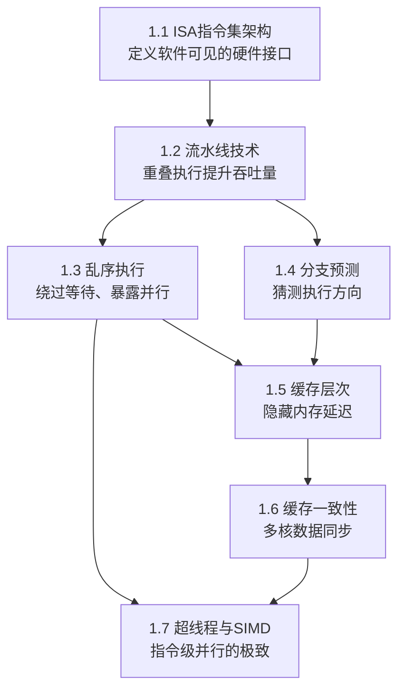

# 理论基础：从硅片到代码的认知桥梁

理解CPU架构不是学术消遣——它是写出高性能代码的物理前提。当你在终端输入 `perf stat -a sleep 1`，看到 L1-dcache-load-misses 的数字飙升时，如果你不理解缓存层次和组相联映射，你就无法判断该优化数据布局还是调整算法结构。当你的多线程程序在8核机器上跑出1.2倍的加速比时，如果不理解缓存一致性协议和伪共享，你甚至无法解释为什么会出现这种结果。

本节构建从"硅片如何执行一条指令"到"多核如何协同工作"的完整认知链条。七个主题并非孤立的知识点，而是层层递进的因果链——后一个主题的存在，往往源于前一个主题的局限。

## 知识依赖关系



这七个主题之间存在三条核心因果链：

- **因果链A（单核性能链）**：ISA定义了指令格式 → 流水线重叠执行多条指令 → 乱序执行绕过阻塞指令 → 分支预测减少流水线冲刷 → 缓存掩盖内存访问延迟。每一环都是为了弥补上一环的性能瓶颈。
- **因果链B（多核协作链）**：私有缓存提升单核性能 → 但多核各自缓存导致数据不一致 → MESI协议保证一致性 → 伪共享成为新的性能杀手。这是一条"解决一个问题，引入新问题"的工程演进链。
- **因果链C（并行度扩展链）**：SMT在同一核心上共享执行资源 → SIMD用一条指令处理多个数据 → 两者结合实现从指令级到数据级的全面并行。这是对单核算力的深度挖掘。

### 如何用工具验证你的理解

在深入理论之前，先建立实测直觉。以下命令让你亲眼看到这些机制的效果：

```bash
# 查看CPU微架构信息（架构名、流水线宽度、TLB条目等）
lscpu | grep -E 'Model name|Core|Thread|Cache|CPU\(s\):'
cat /proc/cpuinfo | grep "model name" | head -1

# 实测IPC（Instructions Per Cycle）——衡量流水线效率的核心指标
perf stat -e instructions,cycles -- sleep 1

# 查看缓存层级和大小
getconf -a | grep CACHE
# 或更直观的方式：
perf stat -e L1-dcache-loads,L1-dcache-load-misses,L1-dcache-stores -- ls -R /

# 检测伪共享（需要perf record + perf c2c，见1.6节详解）
perf c2c record -a -- sleep 5
perf c2c report
```

如果 IPC 低于 1.0，说明流水线频繁停顿（数据冒险、缓存未命中或分支预测失败）；如果 L1-dcache-load-misses 比例超过 5%，缓存优化可能有显著收益。

---

## 七大主题概览

### 1.1 ISA：CPU的指令集架构

ISA（Instruction Set Architecture）是硬件与软件之间的契约，定义了程序员可见的寄存器、内存模型、数据类型和指令编码格式。它是理解后续所有主题的起点——流水线的阶段划分取决于ISA的指令格式，乱序执行的实现复杂度取决于ISA的寻址模式丰富程度，缓存的行为也受ISA内存模型的约束。

本节覆盖两大ISA阵营的对比：

| 维度 | CISC（x86/x86-64） | RISC（ARM AArch64/RISC-V） |
|------|---------------------|---------------------------|
| 设计哲学 | 一条指令做更多事 | 简单指令、快速执行 |
| 指令长度 | 变长（1-15字节） | 固定（32位ARM/16位Thumb） |
| 指令数量 | 1000+ | 200-300 |
| 内存访问 | 任意指令可访问内存 | 仅Load/Store可访问内存 |
| 译码复杂度 | 需微码翻译为μops | 硬连线直接译码 |
| 现代实现 | 外CISC内RISC | 引入复杂向量指令(SVE/SME) |

关键洞察：现代x86 CPU内部实际上是RISC风格的微架构。CISC指令在译码阶段被拆分为更小的μops（micro-operations），内部以RISC方式执行。这解释了为什么x86的解码器是芯片上最复杂的模块之一——Intel Skylake的解码器占了核心面积的约15%。

此外，本节还涵盖x86-64的16个通用寄存器（RAX-R15）和ARM AArch64的31个通用寄存器（X0-X30）的组织方式、调用约定（System V AMD64 ABI vs AAPCS64）以及三种工作模式（实模式→保护模式→长模式）的切换机制。

### 1.2 流水线技术

流水线是"空间换时间"思想在CPU设计中的经典应用。通过将指令执行分解为多个阶段（取指→译码→执行→访存→写回），让多条指令的不同阶段同时执行，从而在每个时钟周期完成一条指令（理想CPI=1），即使单条指令的延迟仍为多个周期。

**经典5级流水线的性能提升计算**：

无流水线：n条指令 × 5周期/条 = 5n 周期
5级流水线：5 + (n-1) × 1 = n+4 周期
加速比 = 5n / (n+4) → 当n→∞时趋近5倍

但流水线并非一帆风顺，三种冒险（Hazard）会破坏理想的重叠执行：

**结构冒险**：硬件资源冲突。典型场景——冯·诺依曼架构中，指令缓存和数据缓存共享同一存储，IF阶段取指和MEM阶段访存无法并行。解决方案：分离指令缓存和数据缓存（哈佛架构的缓存层面实现）。

**数据冒险**：指令间的数据依赖。当SUB指令需要R1的值，但ADD指令的结果尚未写回时，流水线必须等待。三种子类型：
- RAW（写后读）：真依赖，必须保证顺序
- WAR（读后写）：反依赖，乱序执行中通过寄存器重命名消除
- WAW（写后写）：输出依赖，乱序执行中通过寄存器重命名消除

解决方案从简单到复杂：插入气泡（stall）→ 转发（forwarding）→ 编译器调度 → 乱序执行。

**控制冒险**：分支指令改变程序流。在15级流水线中，一条分支指令在EX阶段才确定方向，此时IF/ID阶段已取了14条"可能错误"的指令。这直接引出1.4节的分支预测主题。

**超流水线（Superpipelining）** 将阶段进一步细分以提升时钟频率。Intel Pentium 4（Prescott）使用了31级流水线，频率达3.8GHz，但IPC极低。现代设计（Intel Core 14级、ARM Cortex-A77 13级）在频率和IPC之间取得平衡——这是流水线深度的核心权衡。

### 1.3 乱序执行

顺序执行的致命缺陷是：当一条指令因缓存未命中需要等待数百个周期时，后续所有指令（即使数据完全无关）都必须停顿。乱序执行（Out-of-Order Execution）允许数据已就绪的指令绕过等待指令先执行，从而充分利用执行单元。

顺序执行:                          乱序执行:
LDR R1, [addr]  ; 缓存未命中,等100  LDR R1, [addr]  ; 发射,等待
ADD R2, R3, R4  ; 被迫等待!          ADD R2, R3, R4  ; 立即执行!
MUL R5, R6, R7  ; 被迫等待!          MUL R5, R6, R7  ; 立即执行!
SUB R8, R1, R9  ; 依赖R1             SUB R8, R1, R9  ; R1就绪后执行

实现乱序执行的核心是Robert Tomasulo于1967年为IBM 360/91设计的算法。其三大组件构成一个精巧的硬件调度系统：

**保留站（Reservation Station）**：每个功能单元前的缓冲区。指令发射到保留站后，持续监测操作数状态。所有操作数就绪时立即送入功能单元执行，否则等待CDB广播。这种"数据驱动"的执行模式天然实现了乱序——哪个保留站先就绪，哪条指令先执行。

**公共数据总线（CDB）**：功能单元完成后通过CDB广播结果。所有保留站同时捕获匹配自己标签的结果，实现了"一次广播、多处接收"的高效数据传递。

**寄存器重命名**：通过物理寄存器文件（PRF）将架构寄存器映射到更大的物理寄存器池，消除WAR和WAW假依赖。以x86-64为例：架构只有16个通用寄存器，但Intel Skylake有180个物理整数寄存器和168个物理向量寄存器。RAT（Register Alias Table）维护这种映射关系。

**ROB（重排序缓冲）** 是乱序执行的安全网。指令按程序序进入ROB，乱序执行完成后，必须按程序序从ROB头部提交（Commit/Retire），保证精确异常——当发生页错误或中断时，丢弃ROB中该指令之后的所有结果，从异常点重新执行。

**性能意义**：ROB大小直接决定乱序执行的"窗口"——Skylake的ROB有224条目，这意味着CPU最多可以向前看224条指令来寻找可并行执行的工作。窗口越大，发现并行性的能力越强，但硬件成本也成比例增加。这就是为什么服务器级CPU（如AMD Zen 4的320条目ROB）比移动端CPU（如ARM Cortex-A55的80条目ROB）有更高的乱序执行能力。

### 1.4 分支预测

条件分支约占所有指令的15-25%。在15级流水线中，一次分支预测错误意味着冲刷14条已进入流水线的指令，损失约40-50个时钟周期。准确的分支预测对维持高IPC至关重要——这是现代CPU最值得"投资"的晶体管区域之一。

**预测器的演进**：

**1-bit预测器**：记录分支上次是否跳转。问题在于循环的首尾两次都会预测错误。一个执行100次的循环，预测准确率仅98%。

**2-bit饱和计数器**：需要连续两次预测错误才改变方向。对循环更友好——100次循环只有2次错误（循环进入和退出时），准确率99%。使用BHT（Branch History Table）存储，用PC低位索引，典型大小2K-64K条目。

**局部历史预测器**：为每个分支维护独立的历史移位寄存器，记录该分支最近N次的跳转模式。适合有固定模式的分支（如循环）。

**全局历史预测器**：维护全局移位寄存器记录最近N个分支的结果，能捕捉分支间的相关性（correlated branches）。但PC冲突会导致别名（aliasing）问题。

**GShare预测器**（McFarling, 1993）：将PC和全局历史进行XOR来索引BHT，使不同分支和历史模式均匀分布到BHT中，减少别名冲突。在SPECint基准上可达93-95%准确率。

**TAGE预测器**（Seznec, 2006）：目前最先进的分支预测器之一，被Intel Skylake及后续微架构采用。核心思想是使用多个不同历史长度的预测表（几何级数增长：4, 8, 16, 32, 64, 128），同时捕捉短程和长程相关性。每个表条目附带tag标签以减少误匹配，useful计数器用于替换策略。在SPECint上可达96-97%准确率。

**对编程实践的启示**：

分支预测效率直接影响代码性能。以下编程模式对分支预测友好：

```c
// 对分支预测不友好的模式：随机条件判断
for (int i = 0; i < n; i++) {
    if (data[i] % 2 == 0)  // 随机分布，预测率~50%
        sum_even++;
}

// 对分支预测友好的模式：分离热点路径
// 方法1：排序后处理（使条件变为连续块）
qsort(data, n, sizeof(int), cmp);
// 排序后，所有偶数连续出现，分支预测率>99%

// 方法2：用位运算消除分支
// 条件赋值代替if-else
int val = (condition) ? true_val : false_val;
// 现代编译器通常将其编译为CMOV指令，完全消除分支
```

**实测分支预测效果**：

```bash
# 使用perf观察分支预测准确率
perf stat -e branch-misses,branch-instructions ./your_program
# branch-miss-rate = branch-misses / branch-instructions
# 正常应用 < 2%，高性能应用 < 0.5%

# 使用perf record + perf annotate定位热点分支
perf record -e cycles:u ./your_program
perf annotate -s your_program
# 可以看到每条指令的cycle数和分支预测miss率
```

### 1.5 缓存层次

现代CPU每GHz每秒可执行数十亿条指令，但主存延迟约为50-100ns（即150-300个时钟周期@3GHz）。这种巨大的速度差距被称为"内存墙"（Memory Wall）。缓存利用程序的**时间局部性**（最近访问的数据可能再次被访问）和**空间局部性**（相邻地址可能被连续访问）来隐藏延迟。

**存储层次的延迟梯度**：

| 存储层级 | 典型容量 | 访问延迟 | 相对CPU周期 |
|----------|----------|----------|------------|
| 寄存器 | 数KB | 0.3ns | 1周期 |
| L1缓存 | 32-64KB | 1-2ns | 3-5周期 |
| L2缓存 | 256KB-1MB | 3-10ns | 12-15周期 |
| L3缓存 | 8-64MB | 10-30ns | 30-50周期 |
| 主存 | 数GB-数百GB | 50-100ns | 150-300周期 |
| SSD | 数百GB-TB | 10-100μs | 30,000-300,000周期 |
| HDD | 数TB | 5-10ms | 15,000,000-30,000,000周期 |

**缓存组织方式**：

直接映射（每个内存地址只能映射到一个缓存行）快速但冲突率高；全相联（可放在任意位置）冲突率最低但硬件开销大；N路组相联是现代CPU的折中选择。L1通常8路组相联，L2为8-16路，L3为12-20路。

**地址解析过程**（以32KB 8路组相联L1D为例）：

地址: [Tag | Set Index (6位) | Offset (6位)]
32KB / (64B × 8路) = 64组 → Index需要6位
查找: Index选组 → 并行比较8路Tag → 命中时Offset选数据

**替换策略**：精确LRU需要记录8!种排列（硬件不可行），实际使用伪LRU——树形PLRU用7位构建二叉树，时钟算法用使用位+循环指针。现代处理器还使用自适应策略如RRIP（Re-Reference Interval Prediction）。

**写策略**：写回（Write-Back）只更新缓存，脏行被替换时才写回下级存储，减少总线带宽消耗；写直达（Write-Through）同时更新缓存和下级存储，保证一致性但增加总线流量。大多数现代L1D使用写回+写分配（Write-Allocate）组合。

**缓存优化实操指南**：

对程序员而言，理解缓存的最终目的是写出缓存友好的代码。以下是关键原则：

```c
// 原则1：顺序访问优于随机访问
// 差：列优先遍历二维数组（stride = 行长 × sizeof(int)）
for (int j = 0; j < N; j++)
    for (int i = 0; i < M; i++)
        sum += matrix[i][j];  // 每次访问跳过一整行，cache miss率高

// 好：行优先遍历（stride = sizeof(int)，缓存行预取生效）
for (int i = 0; i < M; i++)
    for (int j = 0; j < N; j++)
        sum += matrix[i][j];  // 连续访问，空间局部性极佳

// 原则2：数据结构布局影响缓存效率
// 差：AoS (Array of Structures) — 遍历时加载不需要的字段
struct Particle { float x, y, z, vx, vy, vz, mass; };
Particle particles[N];
// 只更新位置？仍然加载mass等不需要的字段

// 好：SoA (Structure of Arrays) — 只加载需要的数据
struct Particles {
    float x[N], y[N], z[N];
    float vx[N], vy[N], vz[N];
    float mass[N];
};
// 只遍历x[], y[], z[]，缓存利用率大幅提升
// 游戏引擎和科学计算中SoA是标准做法

// 原则3：避免缓存行跨行访问
// 64字节缓存行 = 16个int或8个double
// 确保热数据结构大小是缓存行的整数倍
struct __attribute__((aligned(64))) HotData {
    int counter;  // 被频繁更新的字段
    char padding[60];  // 填充到64字节
};
```

**实测缓存行为**：

```bash
# 测量缓存命中率
perf stat -e L1-dcache-loads,L1-dcache-load-misses,L1-dcache-prefetches \
    -e LLC-loads,LLC-load-misses \
    -e dTLB-load-misses \
    ./your_program

# 使用cachegrind模拟缓存行为（valgrind工具，不需要硬件支持）
valgrind --tool=cachegrind ./your_program
# 输出CG的缓存命中率、D1miss、LLmiss等指标

# 使用Intel MLC（Memory Latency Checker）测量内存延迟
# 下载地址：https://software.intel.com/content/www/us/en/develop/articles/intelr-memory-latency-checker.html
mlc --latency_matrix    # 测量不同访问模式下的延迟
mlc --bandwidth_matrix  # 测量带宽
```

### 1.6 缓存一致性

在多核处理器中，每个核心有私有L1/L2缓存。当核心A写入地址X时，核心B的缓存中可能持有X的旧值。缓存一致性协议确保所有核心看到的内存视图一致。

**MESI协议**是最经典的监听（Snooping）一致性协议，每个缓存行有四种状态：

| 状态 | 含义 | 共享? | 脏? |
|------|------|-------|-----|
| M (Modified) | 本核独占修改，与主存不一致 | 否 | 是 |
| E (Exclusive) | 本核独占未修改，与主存一致 | 否 | 否 |
| S (Shared) | 多核共享，与主存一致 | 是 | 否 |
| I (Invalid) | 无效 | - | - |

MESI保证了**写传播**（一个核心的写最终被所有核心看到）和**写串行化**（对同一地址的所有写操作有全局顺序）。当核心在M状态修改数据后，其他核心的读请求会触发写回（write-back）和状态降级，确保数据一致性。

**MOESI协议**（AMD处理器使用）在MESI基础上增加O（Owned）状态：数据与主存不一致但本核拥有最新副本，其他核可以有S状态的副本。好处是脏数据可通过缓存间传输（cache-to-cache transfer）直接共享，无需先写回主存。

**伪共享（False Sharing）** 是多核编程中最隐蔽的性能杀手之一。两个核心分别修改同一缓存行中的不同变量，虽然逻辑上无冲突，但缓存一致性协议会反复使对方的缓存行失效，导致严重的性能退化。

```c
// 伪共享的典型场景
struct {
    long counter_A;  // 核心0频繁写
    long counter_B;  // 核心1频繁写
    // counter_A和counter_B在同一个缓存行（64字节）内！
} shared;

// 修复：使用对齐确保不同核心的数据在不同缓存行
struct {
    long counter_A __attribute__((aligned(64)));
    long counter_B __attribute__((aligned(64)));
} fixed;
// 或者使用编译器提供的填充宏：
// Linux内核: DEFINE_PER_CPU(), __cacheline_aligned
// C++17: alignas(64) long counter_A;
```

**伪共享的性能影响有多大？** 以下是一个可直接运行的基准测试：

```c
// false_sharing_bench.c
#include <stdio.h>
#include <stdlib.h>
#include <pthread.h>
#include <time.h>

#define ITERATIONS 100000000

struct {
    long a __attribute__((aligned(64)));
    long b __attribute__((aligned(64)));
} counters;

struct {
    long a;  // 在同一缓存行
    long b;  // 伪共享！
} counters_bad;

void* worker(void* arg) {
    int id = (int)(long)arg;
    for (long i = 0; i < ITERATIONS; i++) {
        if (id == 0) counters.a++;
        else counters.b++;
    }
    return NULL;
}

void* worker_bad(void* arg) {
    int id = (int)(long)arg;
    for (long i = 0; i < ITERATIONS; i++) {
        if (id == 0) counters_bad.a++;
        else counters_bad.b++;
    }
    return NULL;
}

int main() {
    pthread_t t0, t1;
    struct timespec start, end;

    // 无伪共享
    clock_gettime(CLOCK_MONOTONIC, &amp;start);
    pthread_create(&amp;t0, NULL, worker, (void*)0L);
    pthread_create(&amp;t1, NULL, worker, (void*)1L);
    pthread_join(t0, NULL); pthread_join(t1, NULL);
    clock_gettime(CLOCK_MONOTONIC, &amp;end);
    printf("对齐(无伪共享): %.3f秒\n",
        (end.tv_sec-start.tv_sec)+(end.tv_nsec-start.tv_nsec)/1e9);

    // 有伪共享
    clock_gettime(CLOCK_MONOTONIC, &amp;start);
    pthread_create(&amp;t0, NULL, worker_bad, (void*)0L);
    pthread_create(&amp;t1, NULL, worker_bad, (void*)1L);
    pthread_join(t0, NULL); pthread_join(t1, NULL);
    clock_gettime(CLOCK_MONOTONIC, &amp;end);
    printf("未对齐(有伪共享): %.3f秒\n",
        (end.tv_sec-start.tv_sec)+(end.tv_nsec-start.tv_nsec)/1e9);

    return 0;
}
// 编译运行：
// gcc -O2 -pthread false_sharing_bench.c -o bench &amp;&amp; ./bench
// 典型结果：伪共享版本慢5-20倍
```

**检测伪共享的工具**：

```bash
# 方法1：perf c2c（最直接的检测方式）
perf c2c record -a -- ./your_program
perf c2c report --stdio
# 会显示哪些缓存行有共享写冲突，以及涉及的核心

# 方法2：perf mem（记录内存访问延迟分布）
perf mem record -a -- ./your_program
perf mem report --sort=mem,sym,dso
# 高延迟的load操作可能指向伪共享或缓存容量问题

# 方法3：Intel VTune（GUI工具，最全面）
# 可视化显示False Sharing热点和影响程度
```

**目录协议（Directory-based Coherence）** 用集中式目录记录每个缓存行的状态和共享者集合，避免监听协议的广播开销。在核心数较多时（如服务器CPU的64+核心），目录协议的扩展性远优于监听协议。AMD的Infinity Fabric和Intel的Mesh Interconnect都采用了目录协议变体。

### 1.7 超线程与SIMD

超线程（SMT，Simultaneous Multi-Threading）和SIMD（Single Instruction, Multiple Data）是两种不增加核心数就能提升吞吐量的技术，分别从"线程级并行"和"数据级并行"两个维度扩展算力。

**SMT超线程**：在同一物理核心上模拟多个逻辑核心。Intel的超线程技术在一个核心上提供2个逻辑线程，共享执行单元、缓存和分支预测器，但各自有独立的寄存器文件和程序计数器。当一个线程因缓存未命中或分支预测错误而停顿时，另一个线程可以使用空闲的执行单元。典型的吞吐量提升为15-30%（取决于工作负载的线程级并行度）。

SMT有效的前提条件：两个逻辑线程的工作负载具有互补的资源需求——一个线程偏向整数运算时，另一个线程如果偏向浮点或内存访问，就能更好地利用核心的执行资源。如果两个线程竞争相同的资源，SMT可能反而降低性能。

**何时应该关闭SMT**：

```bash
# 关闭SMT（需要root权限，Linux系统）
echo 0 | sudo tee /sys/devices/system/cpu/cpu*/online
# 或者在BIOS中禁用

# 验证SMT是否开启
lscpu | grep "Thread(s) per core"
# 2 = 开启, 1 = 关闭

# 关闭SMT的场景：
# 1. 安全敏感场景（SMT可能被利用进行侧信道攻击）
# 2. 需要稳定的尾延迟（SMT增加了延迟的不确定性）
# 3. 单线程基准测试（SMT会分走执行资源）
```

**SIMD向量化**：用一条指令同时处理多个数据。从SSE（128位，4个32位浮点）到AVX（256位，8个32位浮点）再到AVX-512（512位，16个32位浮点），SIMD宽度每代翻倍。ARM的NEON（128位）和SVE/SVE2（可变长度向量）则为ARM平台提供了类似能力。

SIMD的应用场景包括：图像处理（像素批量运算）、科学计算（矩阵乘法、FFT）、机器学习（推理加速）、密码学（AES-NI）等。编译器可通过 `-mavx2` 或 `-march=native` 等选项自动向量化循环，但手写intrinsics（如 `_mm256_add_ps`）通常能获得更好的性能控制。

**SIMD编程实例——向量加法**：

```c
// 普通标量版本
void add_scalar(float* a, float* b, float* c, int n) {
    for (int i = 0; i < n; i++)
        c[i] = a[i] + b[i];
}

// AVX2向量版本（一次处理8个float）
#include <immintrin.h>
void add_avx2(float* a, float* b, float* c, int n) {
    int i = 0;
    for (; i + 8 <= n; i += 8) {
        __m256 va = _mm256_loadu_ps(&amp;a[i]);
        __m256 vb = _mm256_loadu_ps(&amp;b[i]);
        __m256 vc = _mm256_add_ps(va, vb);
        _mm256_storeu_ps(&amp;c[i], vc);
    }
    // 处理剩余元素
    for (; i < n; i++)
        c[i] = a[i] + b[i];
}
// 编译: gcc -O3 -mavx2 -march=native add_avx2.c
// 典型加速比：3-5x（取决于内存带宽是否成为瓶颈）
```

**AVX-512频率降频现象**：Intel的某些CPU在执行AVX-512指令时会降低时钟频率（如从4.5GHz降至3.5GHz），因为向量单元功耗更高。这意味着对于非向量化友好（分支密集、无法有效向量化）的工作负载，AVX-512可能反而变慢。AVX-512适合计算密集、数据并行度高的场景（如矩阵运算、加密解密）。

**自动向量化编译器选项**：

```bash
# GCC自动向量化
gcc -O3 -march=native -ftree-vectorize code.c    # 启用自动向量化
gcc -O3 -ftree-vectorizer-verbose=2 code.c        # 显示向量化决策

# 验证是否成功向量化
gcc -O3 -S -march=native code.c -o code.s
grep -E 'vmov|vadd|vmul' code.s  # 找到AVX指令说明向量化成功

# Clang的更激进向量化
clang -O3 -march=native -ffast-math code.c
```

---

## 设计哲学提炼

理解这七个主题后，可以提炼出CPU架构设计的三大核心哲学：

**空间换时间**：缓存用少量高速存储隐藏大量低速存储的延迟；寄存器重命名用大量物理寄存器消除假依赖；重排序缓冲用额外存储保证精确异常。每一处"浪费"的晶体管都在换取更高的执行效率。

**猜测执行**：分支预测器猜测程序走向并提前执行；乱序执行器猜测哪些指令可以绕过阻塞提前执行；推测执行（Speculative Execution）在分支预测正确时带来巨大收益，但预测错误时需要回滚——Meltdown/Spectre漏洞正是利用了推测执行的副作用。

**并行暴露**：流水线让多条指令的不同阶段并行执行（指令级并行的时序维度）；乱序执行让无依赖的指令并行执行（指令级并行的空间维度）；SMT让多个线程共享核心资源（线程级并行）；SIMD让一条指令处理多个数据（数据级并行）。从单线程到多核，本质上是在不同粒度上暴露并行性。

---

## 常见误区与纠正

| 误区 | 事实 | 纠正方法 |
|------|------|----------|
| "更多核心=更快" | Amdahl定律限制了并行加速比。串行部分占10%时，核心数再多也只能加速约10倍 | 分析程序的串行比例，优先优化串行瓶颈，再考虑增加核心 |
| "编译器优化够用了" | 编译器擅长代数化简、循环展开，但无法自动向量化复杂数据布局（如AoS→SoA转换） | 手动优化数据布局，使用intrinsics做热点路径 |
| "缓存命中率100%最好" | 100%意味着缓存太大浪费面积，或数据集太小无意义 | 关注L1 miss→L2的延迟（10-15周期）和L2 miss→L3/主存的延迟（50-300周期） |
| "伪共享只影响计数器" | 任何共享缓存行的写操作都会触发，包括结构体中相邻字段 | 用`perf c2c`检测，用`alignas(64)`隔离热数据 |
| "分支预测不重要" | 分支预测错误的惩罚随流水线深度增加而增加。Skylake上一次miss≈15-20周期 | 用`perf stat -e branch-misses`测量，用排序或无分支编程减少miss |
| "SMT总是提升性能" | 对延迟敏感的工作负载，SMT可能增加尾延迟20-40% | 延迟敏感场景考虑关闭SMT |

---

## 学习路径建议

本节的七个主题按依赖关系编排，建议按顺序阅读。每读完一个主题，思考以下问题：

1. **这个技术解决什么问题？** 如果不存在这个问题，这个技术还有存在的必要吗？
2. **它的权衡（trade-off）是什么？** 没有免费的性能——增加了什么硬件复杂度？消耗了什么额外资源？
3. **如果绕过它会发生什么？** 关闭分支预测、禁用缓存、关闭超线程——通过 `perf stat` 对比前后的IPC和CPI变化，直观感受每项技术的贡献。

对于有经验的开发者，建议重点关注1.3节（乱序执行）和1.6节（缓存一致性），因为它们直接影响多线程程序的性能特征。对于关注系统级优化的读者，1.5节（缓存层次）和1.7节（SIMD）是后续"核心技巧"章节的理论基础。

### 速查：性能分析工具链

| 工具 | 用途 | 命令示例 |
|------|------|----------|
| `perf stat` | 硬件计数器概览（IPC、缓存miss率） | `perf stat -e cycles,instructions,cache-misses ./prog` |
| `perf record` | 采样分析热点函数 | `perf record -g ./prog && perf report` |
| `perf c2c` | 检测缓存行共享冲突 | `perf c2c record -a -- sleep 5 && perf c2c report` |
| `valgrind --tool=cachegrind` | 模拟缓存行为（无需硬件支持） | `valgrind --tool=cachegrind ./prog` |
| `lmbench` | 系统级延迟/带宽基准测试 | `lat_mem_rd 256m 64` |
| `Intel MLC` | 内存延迟和带宽测量 | `mlc --latency_matrix` |
| `likwid` | 直接读取CPU内部计数器 | `likwid-perfctr -C 0-3 -g MEM ./prog` |

---

## 各主题深入阅读指引

| 主题 | 核心问题 | 推荐深入资源 |
|------|----------|-------------|
| ISA | x86的μops如何拆分？ARM的条件执行如何工作？ | Intel SDM Vol. 1, Ch. 2; ARM ARM (Architecture Reference Manual) |
| 流水线 | 现代CPU的流水线到底有多深？冒险如何量化影响？ | Hennessy & Patterson, Ch. 3; Agner Fog微架构手册 |
| 乱序执行 | Tomasulo算法的保留站容量如何影响性能？ | Hennessy & Patterson, Ch. 3; Intel优化手册 Ch. 2 |
| 分支预测 | TAGE的tag匹配机制细节？间接分支预测器？ | Seznec "A new case for the TAGE predictor" (JILP 2014) |
| 缓存 | 如何用代码测量缓存延迟和带宽？ | lmbench; Intel Memory Latency Checker |
| 缓存一致性 | 伪共享在实际程序中的性能影响有多大？ | Intel白皮书 "Intel 64 Architecture Memory Ordering"; `perf c2c` 工具 |
| SMT/SIMD | AVX-512的频率降频机制？SVE的可变长度优势？ | Intel优化手册 Ch. 15; ARM SVE白皮书 |
