# 第02章：内存系统 —— 章节概览

## 本章导读

如果你曾经做过性能调优，一定遇到过这些困惑：明明CPU使用率只有30%，程序却跑得飞慢；明明服务器有128GB内存，free却显示只剩几百MB可用；Redis内存占用只有4GB，却频繁触发OOM被kill——这些看似矛盾的现象，根源都在**内存系统**。

内存系统是计算机体系结构中**最影响性能可预测性**的子系统。CPU的算力再强，如果数据不能及时送达，一切都是空谈。一个直观的对比可以说明内存的分量：L1缓存命中只需约1纳秒，而一次DRAM随机访问需要约60-80纳秒——差距高达60-80倍。如果你的程序每秒执行10亿次内存访问，其中哪怕只有1%从L1降级到DRAM，性能就会下降一个数量级。这就是为什么"内存访问模式"比"代码优化技巧"更根本地决定了程序性能。

更深层地说，内存系统的设计牵动着整个计算机系统的四大核心能力：**带宽供给**（数据能不能跟上CPU的处理速度）、**延迟可控**（响应时间能不能满足SLA）、**容量扩展**（能不能支撑不断增长的数据规模）、**正确性保障**（多核/多线程环境下数据读写是否一致）。无论是设计一个高吞吐的缓存系统，优化一个OLAP查询引擎的列式存储，还是诊断一个线上MySQL的慢查询——对内存系统的深入理解都是不可绕过的前置知识。

本章从DRAM的物理电容出发，逐层向上讲解DDR时序、内存控制器调度、NUMA架构、内存一致性模型，最终落地到Cache Line对齐、对象池、大页等实战优化技术。无论你是想搞清楚为什么DDR4和DDR5的时序参数不能直接比较，还是想理解NUMA跨节点访问为什么能让MySQL延迟翻倍，或者想在Go/Python/Java程序中正确使用内存屏障——这一章都将为你提供从物理原理到实战优化的完整链路。

## 学习目标

完成本章学习后，你将能够：

1. **理解DRAM物理原理**：掌握1T1C存储单元结构，解释为什么DRAM必须定期刷新（64ms周期），区分Row Hit / Row Miss / Row Empty三种访问模式对延迟的影响
2. **精通DDR时序参数**：理解CL、tRCD、tRP、tRAS的物理含义，手动计算任意DDR规格的CAS延迟和理论带宽（DDR4-3200 CL22的实际CAS延迟 = 13.75ns）
3. **掌握NUMA架构**：解读NUMA距离矩阵（10=本地，21=一跳），理解First-Touch / Bind / Interleave / Preferred四种分配策略的适用场景，诊断和解决NUMA导致的性能退化
4. **理解内存一致性模型**：对比SC / TSO / PSO / RMO四种模型的排序保证，解释Store-Load重排序的硬件原因，知道何时需要Memory Barrier/Fence
5. **掌握性能优化手段**：运用Cache Line对齐避免伪共享，配置HugePages减少TLB Miss（可改善96%），使用sync.Pool / 对象池降低GC压力，热冷数据分离提升缓存效率
6. **具备诊断能力**：用perf stat分析cache miss率，用numactl诊断NUMA亲和性问题，用dmidecode查看DIMM配置，用edac-util监控ECC错误

## 前置知识

本章假设你已经具备以下基础：

- **第01章：缓存层次与一致性** —— 理解L1/L2/L3缓存的工作原理，有助于理解DRAM在存储层次中的定位和cache miss的性能影响
- **计算机组成基础** —— 了解CPU、总线、存储器的基本概念
- **Linux命令行基础** —— 能使用free、top、cat /proc/*等基础命令
- **至少一门编程语言** —— C/Go/Python任选，能读懂代码示例

如果你对并发编程有一定了解（如使用过锁、原子操作），学习内存一致性模型部分会更加顺畅。但即使没有并发经验，本章从物理原理到优化实践的递进式讲解同样适用于理解内存性能的通用原理。

## 核心概念速览

开始深入学习前，先快速了解本章涉及的核心术语：

| 术语 | 一句话解释 | 为什么重要 |
|------|-----------|-----------|
| **DRAM（Dynamic RAM）** | 基于电容充放电的易失性存储，需要定期刷新 | 理解内存延迟和带宽的物理根源 |
| **1T1C** | 每个存储位由1个晶体管+1个电容组成 | DRAM的基本存储单元结构 |
| **Row Buffer（行缓冲）** | DRAM Bank中缓存最近打开的整行数据 | Row Hit延迟仅为Row Miss的1/4-1/6 |
| **CAS Latency（CL）** | 列地址选通延迟，从发出读命令到数据可用的时钟周期数 | 决定内存读延迟的核心参数 |
| **NUMA（Non-Uniform Memory Access）** | 多处理器系统中，不同CPU访问不同内存区域的延迟不同 | 服务器性能优化的关键架构 |
| **内存一致性模型** | 定义多核系统中，一个核的写操作何时对其他核可见 | 并发正确性的硬件基础 |
| **TSO（Total Store Order）** | x86的强一致性模型，只允许Store-Load重排序 | 大多数x86程序不需要显式内存屏障 |
| **HugePages** | 2MB或1GB的大页，减少TLB Miss和页表遍历开销 | 数据库、虚拟机等大内存场景必备 |
| **Cache Line** | CPU缓存的最小数据传输单元，通常64字节 | 对齐和伪共享问题的根源 |
| **ECC（Error Correcting Code）** | 内存错误检测与纠正技术 | 服务器内存可靠性保障 |

## 知识图谱

```mermaid
graph TD
    A[内存系统] --> B[DRAM物理特性]
    A --> C[DDR代际演进]
    A --> D[NUMA架构]
    A --> E[性能优化]
    A --> F[内存一致性]

    B --> B1[1T1C存储单元]
    B --> B2[刷新机制 64ms]
    B --> B3[行缓冲 Row Buffer]
    B --> B4[Bank级并行 BLP]

    C --> C1[DDR3→4→5 演进]
    C --> C2[时序参数 CL/tRCD/tRP]
    C --> C3[带宽计算公式]
    C --> C4[HBM/CXL/LPDDR5X]

    D --> D1[本地vs远程访问]
    D --> D2[距离矩阵]
    D --> D3[First-Touch/Interleave]
    D --> D4[numactl/cgroup配置]

    E --> E1[Cache Line对齐]
    E --> E2[对象池 sync.Pool]
    E --> E3[HugePages 2MB/1GB]
    E --> E4[预取 Prefetch]
    E --> E5[热冷数据分离]

    F --> F1[TSO x86]
    F --> F2[PSO/RMO ARM/SPARC]
    F --> F3[Memory Barrier/Fence]
    F --> F4[Store Buffer/Load Buffer]

    C2 -.->|决定| B3
    D4 -.->|影响| E1
    F4 -.->|决定| F1

    style A fill:#1a1a2e,stroke:#e94560,color:#fff
    style B fill:#16213e,stroke:#0f3460,color:#fff
    style C fill:#16213e,stroke:#0f3460,color:#fff
    style D fill:#16213e,stroke:#0f3460,color:#fff
    style E fill:#16213e,stroke:#0f3460,color:#fff
    style F fill:#16213e,stroke:#0f3460,color:#fff
```

## 道法术器：四层知识框架

本章内容按"道→法→术→器"四层递进组织，每层回答不同层次的问题：

### 道 — 本质规律（为什么）

> "带宽与延迟的永恒权衡"是内存系统的第一性原理。

- **物理约束**：DRAM电容的电荷会随时间泄漏，因此必须每64ms刷新一次。刷新期间Bank无法服务请求，这直接决定了DRAM的可用带宽上限。DDR5通过引入片上ECC和Bank Group架构，在不增加刷新开销的前提下提升了可靠性与并行度
- **局部性原理**：程序倾向于访问最近访问过的数据（时间局部性）和相邻数据（空间局部性）。这个经验规律是整个存储层次结构——从寄存器到磁盘——存在的理论基础。违背局部性的访问模式（如链表遍历、哈希表随机探测）会直接击穿缓存层次，暴露DRAM的真实延迟
- **一致性张力**：更强的一致性保证（如SC全序模型）要求硬件在每个核的Store Buffer中排队等待，直到数据对所有核可见，这会严重限制指令级并行。x86选择TSO模型作为折中——只允许Store-Load重排序——在保持编程直觉的同时释放了大部分性能。ARM/SPARC选择更弱的RMO模型，将排序责任推给软件，换取更高性能
- **NUMA的本质**：扩展性与一致性的折中——把内存"贴近"CPU提高带宽（每个节点独立内存控制器，总带宽随节点线性增长），代价是跨节点访问延迟增加30%-200%。这是"没有免费午餐"在内存架构上的体现

### 法 — 方法论（怎么做）

> 知道了原理，如何系统性地分析和优化内存性能？

- **性能分析方法论**：量化瓶颈（延迟？带宽？容量？）→ 定位层级（L1/L2/L3/DRAM/Swap）→ 选择优化手段。关键原则：**先量化，再优化**。用perf stat测量cache miss率，用mlc测量实际带宽，用numastat测量NUMA访问分布，用数据驱动决策
- **NUMA配置策略**：单实例绑定节点（`numactl --cpunodebind=0 --membind=0`），共享数据交错分配（`--interleave=all`），多租户cgroup隔离（`cpu.cfs_quota_us` + `cpuset.mems`）。核心原则：**让数据靠近计算**——内存分配在哪个节点，就在哪个节点上执行计算
- **内存模型推理**：识别代码中的Store-Load模式 → 判断是否需要Fence → 选择正确的原子操作语义。x86上大多数场景不需要显式屏障，但在ARM/RISC-V上必须显式使用`dmb`/`fence`指令
- **容量规划方法**：工作集估算（程序活跃数据集大小）→ 峰值余量（×1.5安全系数）→ ECC开销（额外8-12.5%容量）→ NUMA均衡（各节点内存均匀分配，避免跨节点溢出）

### 术 — 具体技术（用什么）

> 每一个可执行的优化手段和诊断命令。

- **Cache Line对齐**：`__attribute__((aligned(64)))`（C/GCC）、`[CacheLineSize(64)]`（.NET）、`@contended`（Java JMH）确保热数据独占Cache Line，避免伪共享。热冷数据分离：将频繁读写的字段（热数据）和很少访问的字段（冷数据）拆分到不同的结构体中
- **对象池**：Go `sync.Pool`（标准库内置，自动GC回收）、C自定义arena（`malloc`批量分配+批量释放）、Python对象缓存（`functools.lru_cache` + `__slots__`减少对象开销）。核心收益：减少GC扫描范围和内存分配频率
- **HugePages**：2MB静态大页（`echo 1024 > /proc/sys/vm/nr_hugepages`）适合数据库等大内存服务；1GB大页通过GRUB参数`hugepagesz=1G hugepages=N`配置，适合超大内存场景；透明大页(THP)建议对延迟敏感的服务禁用（`echo madvise > /sys/kernel/mm/transparent_hugepage/enabled`）
- **NUMA工具**：`numactl --membind/--interleave`控制内存分配策略、`numastat -p`诊断进程级NUMA访问、`lstopo`可视化NUMA拓扑和Cache层次
- **诊断命令**：`perf stat -e LLC-load-misses,dTLB-load-misses`分析缓存/TLB命中率、`dmidecode -t memory`查看DIMM配置、`edac-util -s`监控ECC错误

### 器 — 工具与环境（用什么工具）

> 直接可用的工具链和测试环境。

| 层级 | 工具 | 用途 | 获取方式 |
|------|------|------|----------|
| 硬件探测 | `dmidecode -t memory` | 查看DIMM配置、频率、ECC状态 | 预装/`apt install dmidecode` |
| 拓扑可视化 | `lstopo` / `numactl --hardware` | NUMA节点、距离矩阵、Cache层次 | `apt install hwloc` |
| 带宽测试 | `mlc --bandwidth_matrix` / `sysbench memory` / `mbw` | 内存带宽基准 | Intel MLC需单独下载 |
| 延迟测试 | `mlc --latency_matrix` / rdtsc编程 | 内存访问延迟 | Intel MLC / 自编RDMSR |
| Cache分析 | `perf stat -e LLC-load-misses,dTLB-load-misses` | 缓存命中率、TLB miss | 预装/`apt install linux-tools` |
| ECC监控 | `edac-util -s` / `edac-util -r` | 内存错误计数 | `apt install edac-utils` |
| NUMA诊断 | `numastat -p <pid>` | 进程级NUMA访问统计 | 预装 |
| 碎片分析 | `/proc/buddyinfo` / `/proc/pagetypeinfo` | 物理内存碎片状态 | 内核procfs |
| 性能剖析 | `perf mem record` + `perf mem report` | 内存访问热点定位 | 预装 |

## 本章关键公式

掌握以下公式，是理解内存性能量化分析的基础：

CAS延迟（ns）= CL × 2000 / DDR速率（MT/s）

示例：DDR4-3200 CL22
  CAS延迟 = 22 × 2000 / 3200 = 13.75 ns

理论带宽（GB/s）= 速率（MT/s）× 位宽（bits）× 通道数 / 8 / 1000

示例：DDR4-3200 双通道 64-bit DIMM
  带宽 = 3200 × 64 × 2 / 8 / 1000 = 51.2 GB/s

DRAM刷新间隔 = 64ms（所有Bank共享）
刷新期间带宽损失 ≈ 刷新时间 / 刷新周期 ≈ 1-7%

NUMA远程访问延迟比 = 远程延迟 / 本地延迟
  典型值：1.3x-3.0x（取决于拓扑距离）

Little定律：平均队列长度 = 到达率 × 平均服务时间
  应用：评估内存控制器调度队列深度对延迟的影响

## 读者适配指南

本章内容覆盖从硬件原理到应用层优化的完整链路，不同背景的读者可以按需选择学习路径：

| 读者类型 | 推荐学习路径 | 重点关注 | 预计时间 |
|----------|-------------|----------|----------|
| **应用开发**（Go/Python/Java） | 理论基础03 → 核心技巧04 → 实战案例 → 常见误区 | 性能优化清单、GC调优、对象池 | 3-4h |
| **后端/中间件开发** | 理论基础01-03 → 核心技巧03-04 → 实战案例 | NUMA亲和性、HugePages、Cache Line对齐 | 6-8h |
| **DBA/运维** | 理论基础03 → 核心技巧03 → 实战案例 → 常见误区 | NUMA绑定、内存碎片诊断、ECC监控 | 4-5h |
| **系统工程师/内核开发** | 全部按序学习 | DRAM物理、内存控制器、一致性模型 | 10-12h |
| **面试准备** | 理论基础01-03 → 核心技巧04 → 本章小结 | 带宽计算、时序参数、NUMA原理 | 3-4h |

**跳读建议**：时间有限时，优先完成"理论01核心概念 + 核心技巧04性能优化清单 + 常见误区"三篇，覆盖80%的日常工作场景，预计2-3小时可完成。

## 学习路径

                    ┌─────────────────────────────┐
                    │     你当前的水平是？          │
                    └──────────┬──────────────────┘
                               │
              ┌────────────────┼────────────────┐
              ▼                ▼                ▼
        【入门级】         【进阶级】         【精通级】
     不了解DRAM原理     知道基本概念       想深入优化
              │                │                │
              ▼                ▼                ▼
    理论01 核心概念    理论01-03 全读     全章按序学习
    理论03 关键指标    技巧03-04 重点     重点：一致性模型
    常见误区           实战案例           控制器调度
    练习01-02          练习03-05          HBM/CXL前沿
              │                │                │
              ▼                ▼                ▼
      能够：              能够：             能够：
    · 理解内存层次      · 诊断NUMA问题    · 设计内存子系统
    · 解释free输出      · 优化GC/池化    · 选型DDR/HBM
    · 避开常见误区      · 配置HugePages   · 推理并发正确性

## 预计学习时间

| 模块 | 时间 | 占比 |
|------|------|------|
| 理论基础（3篇） | 2-3h | 25% |
| 核心技巧（4篇） | 5-6h | 50% |
| 实战案例 | 1h | 8% |
| 常见误区 | 0.5h | 4% |
| 练习方法 | 1.5h | 13% |
| **合计** | **10-12h** | 100% |

## 跨章节关联

本章内容与书中其他章节有密切的知识依赖关系：

| 关联章节 | 关系 | 说明 |
|----------|------|------|
| 第01章 缓存层次与一致性 | **前置** | L1/L2/L3缓存是理解DRAM延迟的起点，cache miss直接暴露本章讨论的内存延迟 |
| 第03章 IO系统 | **后续** | 磁盘IO与内存缓冲（Page Cache）的协作，IO性能瓶颈往往根源在内存带宽 |
| 第05章 内存管理 | **深入** | Linux内核的页表、伙伴系统、Slab分配器，本章讨论的HugePages在内核层的实现 |
| 第07章 IO模型 | **关联** | mmap将文件映射到虚拟内存，Direct IO绕过Page Cache——都涉及本章的内存访问模式 |
| 第10章 并发编程 | **交叉** | 本章的一致性模型直接决定第10章无锁数据结构的正确性，Memory Barrier是两章的共同基础 |

## 章节内容详解

### 理论基础（3篇）

| 序号 | 标题 | 核心内容 | 关键收获 |
|------|------|----------|----------|
| 01 | 核心概念 | 存储器层次结构全景、DRAM工作原理（1T1C/刷新/行缓冲/Bank并行）、内存控制器架构（FR-FCFS调度）、NUMA基本概念、带宽vs延迟权衡、内存一致性模型（SC/TSO/PSO/RMO） | 理解从电容到程序的完整数据通路 |
| 02 | 技术演进 | DDR→DDR2→DDR3→DDR4→DDR5每代创新（预取翻倍/Bank Group/片上ECC）、HBM/LPDDR5X/CXL.mem/PMEM新兴技术、生产环境选型建议 | 能根据场景选择合适的内存技术 |
| 03 | 关键指标 | 延迟指标（L1到HDD六级对比）、带宽指标（理论vs实际）、并发与QPS指标、可靠性指标（UBE/CBE/MTBF）、Prometheus监控配置 | 建立内存性能的量化评估能力 |

### 核心技巧（4篇）

| 序号 | 标题 | 核心内容 | 关键收获 |
|------|------|----------|----------|
| 01 | DRAM物理特性与刷新机制 | 1T1C结构详解、三种刷新模式对比、DDR5 SAME-BANK刷新、C语言观察行命中vs冲突延迟、Python检测DRAM配置、Bash监控刷新开销 | 能解释并测量DRAM刷新对性能的影响 |
| 02 | DDR3/4/5时序参数与带宽计算 | 核心时序参数（CL/tRCD/tRP/tRAS）的物理含义、带宽计算公式、Go语言DDR参数计算器、Python读取实际配置、mbw/sysbench带宽测试 | 能手动计算任意DDR规格的延迟和带宽 |
| 03 | NUMA架构与内存亲和性 | NUMA拓扑模式、距离矩阵解读、四种内存分配策略（DEFAULT/BIND/INTERLEAVE/PREFERRED）、C/Go/Python NUMA编程示例、生产环境NUMA配置 | 能诊断并解决NUMA导致的性能问题 |
| 04 | 性能优化清单 | 三层优化框架（硬件/OS/应用）、Cache Line对齐、Go sync.Pool、HugePages配置、热冷数据分离、优化速查表（8种场景） | 掌握完整的内存性能优化工具箱 |

### 综合实践（4篇）

| 序号 | 标题 | 核心内容 | 关键收获 |
|------|------|----------|----------|
| 03 | 实战案例 | Redis内存碎片OOM（碎片率3.2→1.1）、Go程序GC延迟抖动（45ms→2ms）、NUMA跨节点导致MySQL慢查询（延迟降40%）、HugePages减少TLB Miss（96%改善） | 每个案例：问题→排查→方案→结果，完整闭环 |
| 04 | 常见误区 | 7大误区：free少≠不够、swap≠不足、越大越好、THP全局禁用、malloc立即分配、NUMA仅服务器、memtest够了 | 每个误区配诊断命令和正确认知 |
| 05 | 练习方法 | 5个动手实验：层次延迟差异观察、NUMA亲和性对比、内存碎片诊断、Go pprof实战、HugePages配置验证 | 每个实验有完整代码+预期输出+思考题 |
| 06 | 本章小结 | 7大知识模块回顾、关键公式汇总（Little定律/带宽/刷新间隔/NUMA延迟比）、下一步学习指引 | 快速复习和知识串联 |

## 学习误区警示

在开始学习前，了解以下常见认知误区，可以避免走弯路：

- **误区1："内存越大越好"** → 实际上，内存容量只有在超过工作集大小后才有意义。一个工作集16GB的程序，配置256GB内存不会让它跑得更快——瓶颈可能在带宽或延迟
- **误区2："free显示可用内存少就是内存不足"** → Linux会积极利用空闲内存做Page Cache，`available`列才是真正的可用内存。`free`显示的`buff/cache`是系统在帮你加速IO，不是浪费
- **误区3："NUMA只在多路服务器上需要关注"** → 现代单路服务器（如AMD EPYC）也有NUMA架构（多CCD/多IOD），单路不等于单NUMA节点
- **误区4："HugePages对所有场景都有益"** → 对内存使用模式不规则、频繁分配释放的服务（如Redis小key场景），HugePages反而可能增加内部碎片

## 学习检查清单

学完本章后，用以下清单自检：

硬件层理解：
  □ 能画出DRAM存储单元结构图（1T1C + Sense Amplifier）
  □ 能解释为什么DRAM需要刷新（电容泄漏机制）
  □ 能区分Row Hit / Row Miss / Row Empty三种访问模式
  □ 能说出DDR4和DDR5的核心区别（双通道、片上ECC、Bank Group）

量化计算能力：
  □ 能手动计算DDR4-3200 CL22的实际CAS延迟（13.75ns）
  □ 能计算任意DDR规格的理论带宽（MT/s × 位宽 × 通道数 / 8）
  □ 能解读NUMA距离矩阵（10=本地，21=一跳，31=两跳）

工具使用能力：
  □ 能用 numactl --hardware 解读系统NUMA拓扑
  □ 能用 perf stat 统计cache miss率和TLB miss率
  □ 能用 dmidecode -t memory 查看DIMM配置
  □ 能配置HugePages并用perf验证TLB miss改善

优化实战能力：
  □ 能用Cache Line对齐和热冷分离优化数据结构
  □ 能用sync.Pool（Go）或对象池减少GC压力
  □ 能为数据库/缓存服务配置正确的NUMA策略
  □ 能诊断内存碎片问题并给出解决方案

并发理解：
  □ 能解释TSO模型下Store-Load重排序的原因
  □ 能说明Memory Barrier/Fence的使用时机
  □ 理解"一致性vs可扩展性"的根本张力

## 参考文献

- Jacob, B. et al. *Memory Systems: Cache, DRAM, Disk*. Morgan Kaufmann, 2007.
- Hennessy & Patterson, *Computer Architecture: A Quantitative Approach*, Ch.2 (Memory Hierarchy Design)
- Bovet & Cesati, *Understanding the Linux Kernel*, Ch.2 (Memory Addressing)
- Intel, *Intel 64 and IA-32 Architectures Software Developer's Manual*, Vol.3A (Memory Ordering)
- AMD, *AMD64 Architecture Programmer's Manual*, Vol.2 (System Programming)
- Ulrich Drepper, *What Every Programmer Should Know About Memory*, 2007
