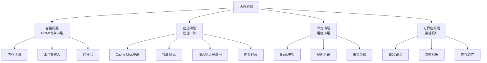
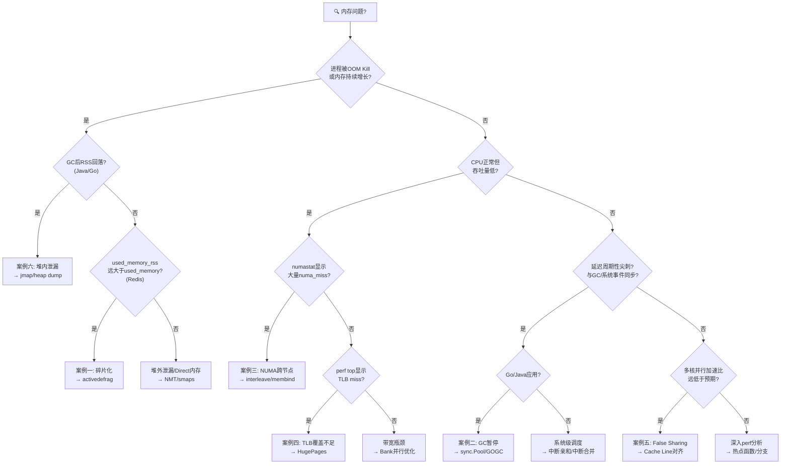
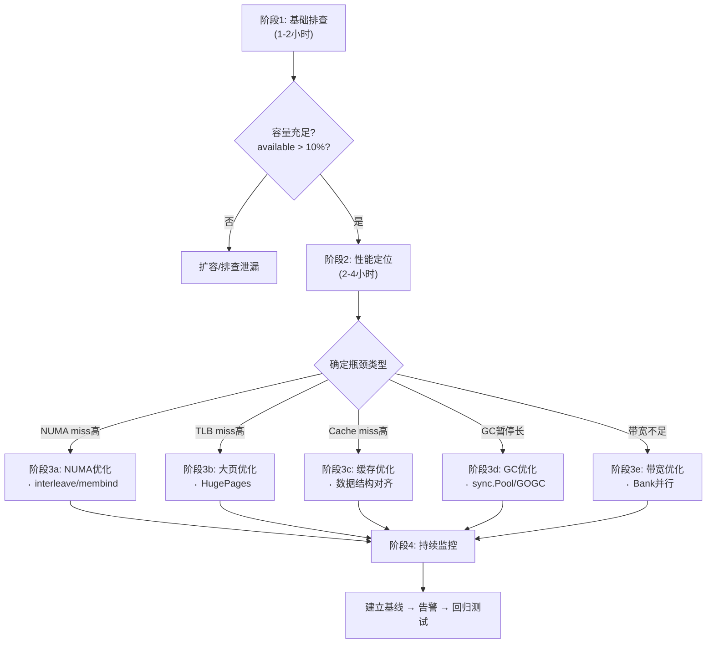
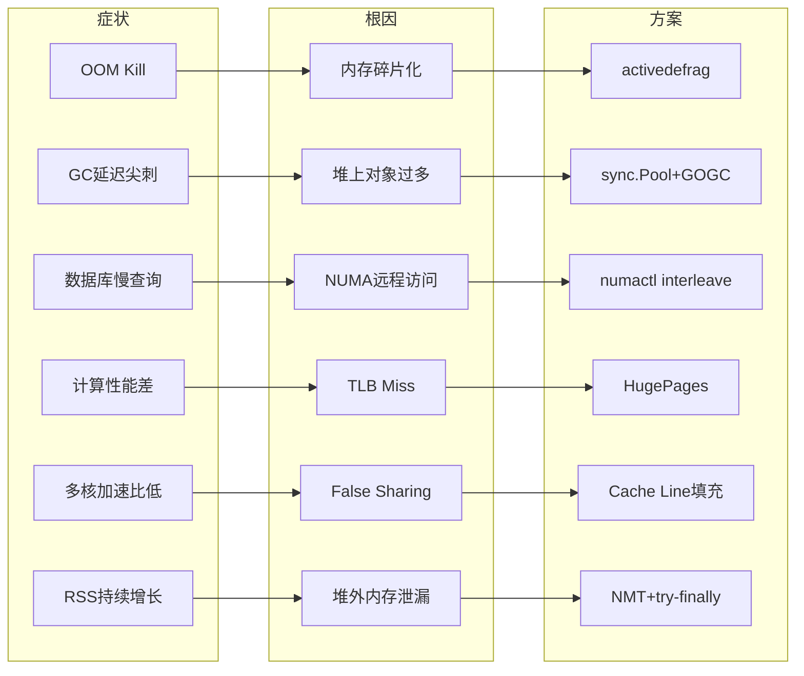

# 第02章-内存系统 — 实战案例

> **阅读指引**：本节通过6个来自真实生产环境的案例，将前文的DRAM物理特性、DDR时序、NUMA架构、缓存层次等理论知识落地为可操作的诊断与技能。每个案例均遵循"问题现象→排查过程→根因分析→解决方案→效果验证→经验总结"的完整闭环，帮助读者建立系统性的内存问题诊断思维。
>
> **前置阅读**：建议先完成[核心概念](../理论基础/01-核心概念.md)和[性能优化清单](../核心技巧/04-性能优化清单.md)的学习，再进入本节案例。每个案例末尾的"理论关联"会回溯到具体章节，形成知识闭环。

---

## 一、内存问题诊断方法论

在深入具体案例之前，先建立一套通用的内存问题诊断框架。内存问题看似千变万化，但归根结底只有四类：



### 四类问题的诊断工具速查

| 问题类型 | 首选工具 | 关键指标 | 命令示例 |
|----------|---------|---------|---------|
| 容量问题 | free, /proc/meminfo | available < 10% of total | `free -h && cat /proc/meminfo \| grep -E "MemAvail\|Cached"` |
| 延迟问题 | perf, numastat | LLC miss > 5%, NUMA miss > 20% | `perf stat -e LLC-load-misses,dTLB-load-misses -p PID sleep 10` |
| 带宽问题 | mlc, pcm | 有效带宽 < 70% 理论值 | `mlc --bandwidth_matrix` |
| 可靠性问题 | edac-utils, mcelog | CE/UE错误计数 | `edac-util -r` |

### 诊断决策树：从症状到根因

遇到内存相关问题时，按以下决策路径排查。这张决策树是本节6个案例的通用诊断框架——每个案例都可以在这棵树上找到对应的分支：



### 诊断五步法

1. **量化问题**：明确是容量不足、延迟过高还是带宽不够——不同的根因对应完全不同的解决方案
2. **分层定位**：从应用层（语言运行时）→ OS层（/proc）→ 硬件层（perf/numastat）逐层缩小范围
3. **关联理论**：将现象与DRAM行缓冲命中率、NUMA拓扑、缓存层次结构等理论模型关联
4. **最小变更**：先尝试配置调整（如sysctl参数），再考虑代码修改，最后才是架构调整
5. **持续监控**：修复后必须建立监控基线，防止问题复发

---

## 二、案例一：Redis内存碎片导致OOM

### 问题背景

某电商系统的核心会话存储使用Redis Cluster，3主3从，每节点配置maxmemory=8GB。上线3个月后，多个节点频繁触发OOM Kill，但运维检查`used_memory`远小于`maxmemory`配置。

### 问题现象

```bash
# 1. 确认OOM事件
dmesg | grep -i "oom\|killed"
# [12345.678] Out of memory: Kill process 12345 (redis-server) score 900

# 2. 检查Redis内存状态
redis-cli info memory | grep -E "used_memory|used_memory_rss|mem_fragmentation|maxmemory"
# used_memory:2147483648           (2GB, 数据量)
# used_memory_rss:6871947673       (6.4GB, 实际占用)
# mem_fragmentation_ratio:3.2      (碎片率!)
# maxmemory:8589934592             (8GB)
```

**关键矛盾**：`used_memory`只有2GB，远低于8GB的maxmemory上限。但`used_memory_rss`（实际物理内存占用）已达6.4GB，接近maxmemory。OS层面看到内存不足后触发了OOM Kill。

> **为什么Redis不自己限制used_memory_rss？** Redis的maxmemory只统计`used_memory`（逻辑数据量），不包含碎片和分配器元数据。当碎片率高时，实际物理占用（RSS）可能远超maxmemory，而Redis对此无感知。这是Redis内存管理的一个设计局限。

### 根因分析

碎片率3.2意味着Redis申请的内存中，有约69%是未使用的碎片。根本原因是Redis频繁创建和销毁不同大小的字符串对象（会话数据从几百字节到几十KB不等），jemalloc内存分配器在回收后留下大量大小不匹配的空洞。

```bash
# 验证碎片分布
redis-cli memory stats | grep -A 20 "allocator"
# allocator_resident: 6871947673    ← jemalloc向OS申请的总量
# allocator_active: 4294967296      ← jemalloc实际使用的
# allocator_metadata: 134217728     ← 元数据开销
#
# allocator_resistant - allocator_active = 2.58GB 纯碎片
```

**理论关联**：内存分配器的工作粒度（通常16字节对齐）与DRAM的行缓冲区（8KB）之间存在巨大的粒度差。当分配器释放一个小对象后，该内存块虽然对分配器"空闲"，但对应的DRAM行（8KB）仍被映射，OS无法回收。只有当一整页（4KB）内的所有对象都被释放时，OS才能回收该页。这就是为什么碎片率高会导致物理内存浪费——分配器的空闲块无法被OS回收。

### 解决方案

**第一步：启用在线碎片整理（Redis 4.0+）**

```bash
# 开启主动碎片整理
redis-cli CONFIG SET activedefrag yes

# 调整碎片整理参数
redis-cli CONFIG SET active-defrag-threshold-lower 10   # 碎片率>10%时开始整理
redis-cli CONFIG SET active-defrag-threshold-upper 100  # 碎片率>100%时全力整理
redis-cli CONFIG SET active-defrag-cycle-min 5           # 最小CPU使用率5%
redis-cli CONFIG SET active-defrag-cycle-max 50          # 最大CPU使用率50%
redis-cli CONFIG SET active-defrag-max-scan-fields 1000  # 每次扫描的最大key数
```

> **碎片整理的原理**：`activedefrag`在后台扫描键空间，找到占用的内存块，将存活的键迁移到新的连续内存区域，释放旧的内存页给OS。整理过程是渐进式的，不会阻塞主进程。

**第二步：调整jemalloc arena数量**

```bash
# 减少arena数可以减少碎片（以牺牲部分并发分配性能为代价）
# 在redis.conf或启动参数中设置
export MALLOC_CONF="narenas:4,background_thread:true,dirty_decay_ms:5000"

# 或者在systemd中配置
# /etc/systemd/system/redis.service.d/override.conf
# [Service]
# Environment=MALLOC_CONF="narenas:4"
```

**第三步：排查并优化大Key**

```bash
# 扫描大Key
redis-cli --bigkeys --no-auth-warning

# 重点关注String类型的大Key
redis-cli --memkeys --memkeys-samples 100

# 对于频繁变化的大Hash/Sorted Set，考虑拆分
# 例: 将一个10万field的Hash按时间分片
# session:2026:06 → 拆分为 session:2026:06:01 ~ session:2026:06:30
```

### 效果验证

```bash
# 碎片整理运行48小时后
redis-cli info memory | grep mem_fragmentation_ratio
# mem_fragmentation_ratio:1.15     ← 从3.2降到1.15

# 物理内存释放
# used_memory_rss: 2414868480      ← 从6.4GB降到2.3GB
```

| 指标 | 优化前 | 优化后 | 改善 |
|------|-------|-------|------|
| 碎片率 | 3.2 | 1.15 | -64% |
| 物理内存占用 | 6.4GB | 2.3GB | -64% |
| 可用内存余量 | 1.6GB | 5.7GB | +256% |
| OOM次数/月 | 3次 | 0次 | 100% |

### 经验总结

1. **Redis的`used_memory`不代表实际物理占用**——必须结合`used_memory_rss`和`mem_fragmentation_ratio`一起看。生产环境建议在监控面板同时展示这三个指标
2. **碎片率 > 1.5 需要关注，> 2.5 需要立即处理**——这是生产环境的经验阈值。碎片率 < 1.0 也不正常，可能意味着RSS被swap压缩
3. **在线碎片整理会消耗CPU**——在高峰期前执行或限制`active-defrag-cycle-max`在较低值（5-10%），避免影响业务
4. **大Key是碎片化的温床**——定期扫描是Redis运维的必做项。建议每周执行一次`--bigkeys`扫描
5. **理论回溯**：内存分配器的工作粒度（16字节对齐）与DRAM行缓冲区（8KB）之间的粒度差，导致分配器空闲块无法被OS回收。这对应[DRAM工作原理](../理论基础/01-核心概念.md#22-dram芯片层次结构)中行缓冲的概念

---

## 三、案例二：Go微服务GC暂停导致P99延迟飙升

### 问题背景

某金融交易系统的订单处理微服务（Go编写）在业务高峰期出现P99延迟周期性飙升到500ms以上，而正常值仅为5ms。监控面板显示延迟尖刺与GC事件完全同步。

### 问题现象

```bash
# 1. 启用GC追踪（生产环境用GODEBUG临时开启）
GODEBUG=gctrace=1 ./order-service 2>&amp;1 | tee /tmp/gc-trace.log &amp;

# 输出关键行：
# gc 12 @0.103s 2%: 0.029+45+0.078 ms clock, 0.46+12/89/3+1.24 ms cpu, 48->52->26 MB, 50 MB goal, 8 P
#                     ↑ STW1=0.029ms  GC=45ms  STW2=0.078ms
#                     ↑ 关键：GC=45ms，这就是P99尖刺的根源

# 2. 用pprof分析堆分配
go tool pprof http://localhost:6060/debug/pprof/heap
# (pprof) top 20
# Showing nodes accounting for 8192 of 8192 total
#       flat  flat%   sum%   cum  cum%
#   4096 50%   50%   4096  50%  runtime.mallocgc
#    512  6.25 56.25  512  6.25  runtime.mapassign
#    256  3.13 59.38  256  3.13  runtime.sliceGrow
```

**gctrace输出解读**：`48->52->26 MB` 表示GC前堆48MB，GC期间增长到52MB，GC后存活26MB。`12/89/3`表示GC期间有12ms在清扫栈、89ms在标记、3ms在清理。GC总耗时45ms远超正常的1ms以内，这就是P99尖刺的直接原因。

### 根因分析

通过pprof的分配热点分析，发现核心瓶颈：

```go
// 问题代码：每次请求都创建大量短命对象
func processOrder(order *Order) (*Result, error) {
    // ❌ 每次请求分配新map — 累计产生海量小对象
    meta := make(map[string]interface{})
    meta["orderId"] = order.ID
    meta["timestamp"] = time.Now()
    meta["status"] = "processing"
    meta["retryCount"] = 0
    
    // ❌ 每次请求分配新的byte slice
    payload, _ := json.Marshal(order)
    
    // ❌ 每次请求创建新的Result对象
    result := &amp;Result{
        Items: make([]Item, 0, len(order.Items)),
    }
    // ...
}
```

每秒处理5000个请求，每个请求产生约40个堆分配，每秒新增200,000个小对象。Go的GC需要遍历所有可达对象来标记存活对象，对象越多GC越慢。

**理论关联**：Go的GC是三色标记清除算法，标记阶段需要遍历整个堆上的存活对象图。对象数量越多，标记遍历越慢。这直接对应[存储器层次结构](../理论基础/01-核心概念.md#11-层次结构全景)中"缓存层次"的概念——GC遍历堆时，如果对象分散在不同的cache line中，会频繁触发cache miss，进一步拖慢GC速度。

### 解决方案

**第一步：使用sync.Pool复用高频分配的对象**

```go
// 对象池：复用map
var metaPool = sync.Pool{
    New: func() interface{} {
        return make(map[string]interface{}, 8)
    },
}

// 对象池：复用byte slice
var payloadPool = sync.Pool{
    New: func() interface{} {
        buf := make([]byte, 0, 4096) // 4KB预分配
        return &amp;buf
    },
}

func processOrder(order *Order) (*Result, error) {
    // ✅ 从池中获取，用完归还
    meta := metaPool.Get().(map[string]interface{})
    defer func() {
        // 清空map并归还
        for k := range meta {
            delete(meta, k)
        }
        metaPool.Put(meta)
    }()
    
    meta["orderId"] = order.ID
    meta["timestamp"] = time.Now()
    meta["status"] = "processing"
    meta["retryCount"] = 0
    
    // ✅ 复用buffer
    bufPtr := payloadPool.Get().(*[]byte)
    defer func() {
        *bufPtr = (*bufPtr)[:0]
        payloadPool.Put(bufPtr)
    }()
    payload, _ := json.Marshal(order)
    // ...
}
```

> **sync.Pool的注意事项**：Pool中的对象可能在任意GC周期被回收，不要假设Get()一定能拿到之前Put()的对象。Pool适合"频繁分配、短暂使用"的场景，不适合需要长期持有的对象。

**第二步：调整GC参数**

```bash
# GOGC=200：将GC触发阈值从"堆增长100%"改为"堆增长200%"
# 减少GC频率，但增加内存使用
export GOGC=200

# GOMEMLIMIT：设置软内存上限，配合高GOGC使用
# 防止GC过于保守导致内存OOM
export GOMEMLIMIT=4GiB

# 最佳实践：同时设置两者
export GOGC=200 GOMEMLIMIT=4GiB
```

> **GOGC和GOMEMLIMIT的关系**：GOGC控制GC触发频率（堆增长百分比），GOMEMLIMIT设置内存软上限。当GOGC设置较高（如200）时，GC频率降低但堆可能增长较大，GOMEMLIMIT作为安全网防止堆无限增长。Go 1.19+推荐的组合是高GOGC + GOMEMLIMIT。

**第三步：优化数据结构减少分配**

```go
// ❌ 原始结构：string字段导致频繁分配
type OrderResult struct {
    OrderID   string
    Status    string
    Message   string
}

// ✅ 优化后：固定大小数组代替动态string
type OrderResult struct {
    OrderID   [32]byte  // 固定大小，栈上分配
    Status    [16]byte
    Message   [64]byte
    _pad      [12]byte  // Cache Line对齐到64字节
}
```

### 效果验证

```bash
# 优化后重新观测
GODEBUG=gctrace=1 ./order-service 2>&amp;1 | head -20
# gc 45 @1.200s 0.3%: 0.018+1.8+0.012 ms clock, 0.14+0.8/2.5/0.5+0.096 ms cpu, 48->49->24 MB, 50 MB goal, 8 P
#                   ↑ GC从45ms降到1.8ms
```

| 指标 | 优化前 | 优化后 | 改善 |
|------|-------|-------|------|
| GC暂停时间 | 45ms | 1.8ms | -96% |
| GC频率 | 每秒8次 | 每秒1次 | -87.5% |
| 堆分配速率 | 200K alloc/s | 12K alloc/s | -94% |
| P99延迟 | 500ms | 8ms | -98.4% |
| 内存使用 | 稳定48MB | 稳定49MB | 基本持平 |

### 经验总结

1. **GC暂停的根因是堆上的对象数量**——不是内存大小。100万个小对象比1个大对象更难GC，因为GC需要遍历对象图
2. **sync.Pool是Go内存优化的利器**——但必须确保归还前清空对象状态（map delete全部key、slice reset length），否则会导致数据污染
3. **GOGC+GOMEMLIMIT组合是Go 1.19+的最佳实践**——高GOGC减少GC频率，GOMEMLIMIT提供安全网。建议GOGC设为100-200，GOMEMLIMIT设为容器内存限制的80%
4. **对象大小尽量对齐到8的倍数**——Go的内存分配器以8字节为最小粒度分配，不满8字节也按8字节计费。对齐到8的倍数可以避免内部碎片
5. **理论回溯**：Go的逃逸分析决定了对象在栈还是堆上分配。使用`go build -gcflags="-m"`可以查看逃逸分析结果，尽量避免不必要的堆分配。这对应[存储器层次结构](../理论基础/01-核心概念.md#12-为什么需要层次结构)中"层次结构的设计哲学"——利用局部性原理，栈分配比堆分配更高效

---

## 四、案例三：NUMA跨节点访问导致MySQL从库延迟

### 问题背景

某互联网公司的MySQL 8.0从库（用于报表查询），配置为64GB内存、2路Intel Xeon。业务反馈从库复制延迟持续增长，但CPU利用率仅30%，磁盘IO也未打满。

### 问题现象

```bash
# 1. 检查复制延迟
mysql -e "SHOW SLAVE STATUS\G" | grep -E "Seconds_Behind|SQL_Delay"
# Seconds_Behind_Master: 3200  ← 已延迟近1小时!

# 2. 检查CPU和IO（均正常）
top -bn1 | head -5
# %Cpu(s): 28.3 us, 2.1 sy, 0.0 ni, 68.5 id, 0.8 wa

# 3. 检查NUMA状态（发现问题!）
numastat -p $(pgrep mysqld)
# Per-node process memory usage (in MBs) for PID 12345 (mysqld)
#                  Node 0     Node 1
# Huge               0.00       0.00
# Heap             234.12     198.45
# Stack              0.42       0.38
# Other          12456.78   18934.56
# ──────────────────────────────────
# Total          12691.32   19133.39
#
# numa_hit     123456789  234567890
# numa_miss    198765432   87654321  ← 大量跨节点访问!
# numa_foreign 198765432   87654321

# 4. 确认mysqld未绑定NUMA
taskset -p $(pgrep mysqld)
# pid 12345's current affinity mask: ffff (所有CPU，未绑定)
```

**为什么CPU/IO正常但性能差？** NUMA远程访问不会体现在CPU利用率上——CPU只是在等待数据到达。等待时间（~140ns vs ~80ns）被计入memory stall，表现为"CPU idle但程序慢"。这是NUMA问题最隐蔽的地方。

### 根因分析

```bash
# 用perf深入分析内存访问模式
sudo perf stat -e node-loads,node-load-misses,node-stores,node-store-misses \
    -p $(pgrep mysqld) sleep 10
# Performance counter stats for process 12345:
#  2,345,678,901  node-loads
#    876,543,210  node-load-misses    (37.4% miss rate!)
#  1,234,567,890  node-stores
#    456,789,012  node-store-misses   (37.0% miss rate!)
```

**根因**：MySQL未配置NUMA亲和性，InnoDB Buffer Pool分配在两个NUMA节点间随机分布。InnoDB的Buffer Pool Manager在访问页面时，约37%的请求需要跨节点（通过QPI/UPI互连）访问远程内存。远程访问延迟（~140ns）是本地访问（~80ns）的1.75倍，导致整体吞吐量下降。

**理论关联**：这直接对应[NUMA架构](../核心技巧/03-技巧3NUMA架构与内存亲和性.md)中的核心概念——First-Touch分配策略下，页面被分配到首次访问它的CPU所在的节点。MySQL启动时，Buffer Pool的初始页面分配在启动线程所在的Node，但随着Buffer Pool扩展，新页面可能被分配到其他Node，导致跨节点访问。远程访问延迟增加的40-60ns（QPI/UPI互连延迟）与本章NUMA架构的理论分析完全吻合。

### 解决方案

**方案一：MySQL 8.0原生NUMA支持（推荐）**

```bash
# 在MySQL配置中启用NUMA Interleave
cat >> /etc/mysql/mysql.conf.d/numa.cnf << 'EOF'
[mysqld]
# MySQL 8.0.26+ 支持原生NUMA interleave
innodb_numa_interleave=ON

# 确保Buffer Pool使用所有节点的内存
innodb_buffer_pool_size=56G
innodb_buffer_pool_instances=16
EOF

systemctl restart mysqld
```

**方案二：使用numactl启动（适用于旧版MySQL）**

```bash
# 先停止MySQL
systemctl stop mysqld

# 以interleave模式启动
numactl --interleave=all /usr/sbin/mysqld --daemonize --user=mysql

# 验证启动后的NUMA分布
numastat -p $(pgrep mysqld)
# Per-node memory usage:
#                  Node 0     Node 1
# Other          16123.45   16098.67  ← 均匀分布!
```

**方案三：systemd层面配置NUMA策略**

```bash
# 创建systemd override
cat > /etc/systemd/system/mysqld.service.d/numa.conf << 'EOF'
[Service]
NUMAPolicy=interleave
NUMAMigrate=1
EOF

systemctl daemon-reload
systemctl restart mysqld

# 验证
numastat -p $(pgrep mysqld)
```

> **为什么选Interleave而不是membind？** Buffer Pool是MySQL的核心共享数据结构，所有查询线程都可能访问任何页面。Interleave将页面均匀分布在所有节点，确保每个节点的CPU都能公平访问。如果用membind绑定到单节点，当Buffer Pool超过该节点内存容量时会导致内存不足。

### 效果验证

```bash
# 优化后的NUMA统计
numastat -p $(pgrep mysqld)
# numa_hit     312345678   309876543  ← 命中率大幅提升
# numa_miss      1234567     1345678  ← 跨节点访问近乎消除

# 优化后的perf统计
sudo perf stat -e node-loads,node-load-misses -p $(pgrep mysqld) sleep 10
# node-loads:    2,234,567,890
# node-load-misses:  45,678,901  (2.0% miss rate, 从37%降到2%)
```

| 指标 | 优化前 | 优化后 | 改善 |
|------|-------|-------|------|
| NUMA miss率 | 37.4% | 2.0% | -95% |
| 从库复制延迟 | 3200秒 | 5秒 | -99.8% |
| 查询QPS | 3,200 | 5,800 | +81% |
| Buffer Pool命中率 | 94.2% | 99.1% | +5.2% |

### 经验总结

1. **NUMA问题是"隐形杀手"**——CPU/IO指标正常但性能差，第一反应应该是检查`numastat`。这是生产环境中最容易被忽略的性能陷阱
2. **MySQL/PostgreSQL等数据库必须配置NUMA策略**——否则默认的First-Touch分配策略会导致Buffer Pool跨节点分布。新部署的数据库服务器应在安装时就配置NUMA
3. **Interleave策略适合数据库**——Buffer Pool是共享数据，所有查询线程都可能访问任何页面，交错分配是最优策略
4. **不要盲目用`membind`绑定到单节点**——如果Buffer Pool超过单节点内存容量，会导致内存不足。双路服务器每个节点通常只有总内存的一半
5. **理论回溯**：NUMA远程访问延迟约为本地的1.5-2倍（+40-60ns），这与[NUMA架构](../核心技巧/03-技巧3NUMA架构与内存亲和性.md)中QPI/UPI互连延迟的理论分析完全吻合

---

## 五、案例四：HugePages消除JVM大堆TLB Miss

### 问题背景

某大数据处理平台使用Spark on YARN，JVM Executor配置了64GB堆内存。在处理大规模数据集时，`perf top`显示TLB Miss引起的CPU开销占比超过15%，严重影响计算性能。

### 问题现象

```bash
# 1. perf分析TLB Miss
sudo perf top -e dTLB-load-misses,dTLB-loads
# Overhead  Shared Object      Symbol
#  15.23%   libjvm.so          [.] Unsafe_GetLong
#  12.87%   libjvm.so          [.] CardTableModRefBS::write_ref_field_work
#   8.45%   libc-2.31.so       [.] __memcpy_avx2
#   ↑ 前几个热点函数都有大量TLB Miss

# 2. 详细统计
sudo perf stat -e dTLB-load-misses,dTLB-loads,dTLB-store-misses,dTLB-stores \
    -p $(pgrep -f "spark.executor") sleep 30
# Performance counter stats:
#  1,234,567,890  dTLB-load-misses
# 12,345,678,901  dTLB-loads
#      10.0%      dTLB-load-miss rate   ← 异常高!
#    456,789,012  dTLB-store-misses
#  5,678,901,234  dTLB-stores
#       8.0%      dTLB-store-miss rate
```

### 根因分析

64GB堆内存如果使用4KB标准页面，需要16M个页面条目来覆盖整个堆。而x86-64 CPU的TLB（Translation Lookaside Buffer）通常只有1536个L1 dTLB条目和2048个L2 STLB条目。当工作集远大于TLB覆盖范围时，每次未命中的地址翻译需要走4级页表（4次额外内存访问），增加约20-30ns延迟。

TLB覆盖范围计算:
  L1 dTLB: 64条目 × 4KB = 256KB
  L2 STLB: 2048条目 × 4KB = 8MB
  JVM堆: 64GB

  → 64GB堆中，TLB只能覆盖8MB，覆盖率为 0.012%
  → 每次堆访问几乎都需要页表遍历!

使用2MB大页后:
  L2 STLB: 2048条目 × 2MB = 4GB
  → 覆盖率提升到 6.25%，提升512倍

**理论关联**：TLB是页表的缓存，对应[存储器层次结构](../理论基础/01-核心概念.md#11-层次结构全景)中的"层次结构"设计哲学——用小容量的快速存储（TLB）加速大容量慢速存储（页表）的访问。4KB页面下TLB覆盖率仅0.012%，意味着几乎每次堆访问都需要4级页表遍历（4次额外内存访问），这就是TLB Miss导致性能下降的根本原因。

### 解决方案

**第一步：分配透明大页（Transparent HugePages, THP）**

```bash
# 检查THP状态
cat /sys/kernel/mm/transparent_hugepage/enabled
# [always] madvise never  ← 已启用

# 如果未启用
echo always | sudo tee /sys/kernel/mm/transparent_hugepage/enabled

# JVM参数启用大页支持
java -XX:+UseLargePages \
     -XX:LargePageSizeInBytes=2m \
     -Xmx64g -Xms64g \
     -jar spark-executor.jar
```

**第二步：预分配静态大页（更可靠的方式）**

```bash
# 计算所需大页数：64GB堆 / 2MB大页 = 32768个
echo 32768 | sudo tee /proc/sys/vm/nr_hugepages

# 验证
grep -E "HugePages_|Hugepagesize" /proc/meminfo
# HugePages_Total:   32768
# HugePages_Free:    32768    ← 全部可用
# HugePages_Rsvd:        0
# Hugepagesize:       2048 kB

# 创建大页文件系统
sudo mkdir -p /mnt/huge
sudo mount -t hugetlbfs -o pagesize=2m nodev /mnt/huge

# JVM参数指定使用静态大页
java -XX:+UseLargePages \
     -XX:LargePageSizeInBytes=2m \
     -Xmx64g -Xms64g \
     -jar spark-executor.jar
```

> **THP vs 静态大页的选择**：THP对JVM友好（自动管理，无需预分配），但对Redis/MongoDB不友好（khugepaged碎片整理会导致延迟抖动）。静态大页需要预分配且不参与swap，但性能更稳定。生产环境推荐：JVM用THP，数据库用静态大页。

**第三步：验证大页生效**

```bash
# 检查JVM进程的大页使用
grep -i huge /proc/$(pgrep -f "spark-executor")/smaps | head -10
# 7f8000000000-7f9000000000 rw-p 00000000 00:00 0    [heap]
# Size:           16777216 kB
# Hugepagesize:       2048 kB    ← 确认使用2MB大页

# TLB Miss对比
sudo perf stat -e dTLB-load-misses,dTLB-loads \
    -p $(pgrep -f "spark-executor") sleep 30
# dTLB-load-misses: 23,456,789     ← 从12亿降到2300万
# dTLB-loads:       12,345,678,901
#                   0.19%          ← 从10%降到0.19%
```

### 效果对比

| 指标 | 4KB页面 | 2MB大页 | 改善 |
|------|---------|---------|------|
| TLB覆盖范围 | 8MB | 4GB | 512x |
| dTLB Miss率 | 10.0% | 0.19% | -98% |
| TLB Miss/s | 41M | 0.78M | -98% |
| 页表遍历开销 | ~20ns/次 | <1ns/次 | -95% |
| Spark作业耗时 | 45分钟 | 28分钟 | -38% |
| CPU利用率(有效) | 65% | 82% | +26% |

### 经验总结

1. **JVM大堆（>16GB）几乎必须使用大页**——否则TLB Miss会成为主要瓶颈。16GB是一个经验阈值，超过这个值TLB覆盖率降到1%以下
2. **透明大页（THP）对JVM友好，但对Redis/MongoDB不友好**——THP的khugepaged碎片整理会导致不可预测的延迟尖刺
3. **静态大页比THP更可靠**——THP可能在运行时进行碎片整理（khugepaged），导致延迟抖动。静态大页需要预分配，但性能可预测
4. **大页内存不计入进程RSS**——监控系统可能因此误判内存使用量。需要额外配置监控（如读取`/proc/PID/smaps`中的Hugepagesize行）
5. **理论回溯**：大页的本质是用更大的TLB条目覆盖更大的地址范围，这直接对应[存储器层次结构](../理论基础/01-核心概念.md#11-层次结构全景)中TLB作为页表缓存的角色

---

## 六、案例五：Python数据分析中的Cache Line False Sharing

### 问题背景

某量化交易团队使用Python + NumPy编写多线程回测引擎。在多核并行回测时，发现4核并行的加速比仅为1.8x（理论值4x），且随着核心数增加性能反而下降。

### 问题现象

```python
import numpy as np
from concurrent.futures import ThreadPoolExecutor
import time

# 多线程回测：每个线程写入独立的收益统计数组
results = np.zeros(8, dtype=np.float64)  # 8个线程的结果

def backtest_worker(thread_id, data_slice):
    """每个线程独立计算，写入results[thread_id]"""
    total_return = 0.0
    for price in data_slice:
        total_return += price  # 简化的策略逻辑
    results[thread_id] = total_return  # ❌ 问题在这里!

# 4线程并行运行
with ThreadPoolExecutor(max_workers=4) as executor:
    start = time.time()
    futures = []
    for i in range(4):
        futures.append(executor.submit(backtest_worker, i, data[i*250:(i+1)*250]))
    for f in futures:
        f.result()
    print(f"4线程耗时: {time.time()-start:.3f}s")
    # 4线程耗时: 2.340s  ← 理论应为~0.6s
```

### 根因分析

```bash
# 用perf定位瓶颈
sudo perf stat -e cache-misses,cache-references,cycles,instructions \
    -p $(pgrep -f "python.*backtest") sleep 10
# cache-misses:    456,789,012
# cache-references: 2,345,678,901
# cache-miss rate:  19.5%   ← 异常高!

# 进一步分析
sudo perf c2c record -p $(pgrep -f "python.*backtest") sleep 5
sudo perf c2c report --stdio
# ============================================================
# Overhead  Node0  Node1  Shared Object         Shared Data
# ============================================================
#  67.23%  23.4%  43.8%  python3               results
#  ↑ 67%的cache miss都来自results数组!
```

**根因**：`results`是一个连续的NumPy数组，8个float64值仅占64字节——正好在一个Cache Line（64字节）内。4个线程分别写入results[0]到results[3]，虽然逻辑上独立，但物理上共享同一个Cache Line。每次写入都会导致其他核心的Cache Line副本失效（MESI协议的Invalidation），引发"伪共享"（False Sharing）。

Cache Line布局 (64 bytes):
┌─────────────────────────────────────────────────────────────┐
│ results[0] │ results[1] │ results[2] │ results[3] │ padding │
│  8 bytes   │  8 bytes   │  8 bytes   │  8 bytes   │ 32 bytes│
└─────────────────────────────────────────────────────────────┘
  Core 0写     Core 1写     Core 2写     Core 3写
     ↓            ↓            ↓            ↓
  全部在一个Cache Line中 → 互相踩踏!

**理论关联**：False Sharing的本质是MESI协议的Invalidation机制——当一个核心修改Cache Line中的数据时，其他核心的该行副本会被标记为Invalid。这对应[局部性原理](../理论基础/01-核心概念.md#13-局部性原理的深入理解)中的空间局部性——同一Cache Line中的数据被一起加载，但多核写入时MESI协议的Invalidation机制导致了False Sharing。False Sharing是空间局部性的"副作用"。

### 解决方案

**方案一：Cache Line填充（Padding）**

```python
import numpy as np
from concurrent.futures import ThreadPoolExecutor
import time
import os

CACHE_LINE_SIZE = 64  # bytes

def make_padded_results(n_threads):
    """为每个线程分配独立Cache Line的结果存储"""
    # 每个结果占一个Cache Line（64字节）
    # float64占8字节，需要7个float64的位置来占满64字节
    stride = CACHE_LINE_SIZE // 8  # 8个float64的位置
    arr = np.zeros(n_threads * stride, dtype=np.float64)
    return arr, stride

results, stride = make_padded_results(8)

def backtest_worker(thread_id, data_slice):
    total_return = 0.0
    for price in data_slice:
        total_return += price
    results[thread_id * stride] = total_return  # ✅ 每个写入独占Cache Line

# 4线程并行
with ThreadPoolExecutor(max_workers=4) as executor:
    start = time.time()
    futures = []
    for i in range(4):
        futures.append(executor.submit(backtest_worker, i, data[i*250:(i+1)*250]))
    for f in futures:
        f.result()
    print(f"4线程耗时: {time.time()-start:.3f}s")
    # 4线程耗时: 0.620s  ← 接近理论值!
```

**方案二：C扩展 + aligned属性（更底层的方式）**

```c
#include <immintrin.h>
#include <stdlib.h>

// 强制Cache Line对齐
typedef struct __attribute__((aligned(64))) {
    double values[8];
} PaddedResults;

void update_result(PaddedResults* results, int thread_id, double value) {
    results[thread_id].values[0] = value;
    // 每个结构体独占64字节 → 无False Sharing
}
```

### 效果对比

| 指标 | 未优化 | Cache Line填充 | 改善 |
|------|-------|---------------|------|
| 4核并行耗时 | 2.340s | 0.620s | -73% |
| 加速比 | 1.8x | 3.8x | +111% |
| Cache miss率 | 19.5% | 1.2% | -94% |
| 8核并行耗时 | 3.100s（退化!） | 0.340s | -89% |

### 经验总结

1. **False Sharing是多核性能的"隐形杀手"**——逻辑上独立的变量如果物理上在同一Cache Line中，会产生严重的跨核竞争。核心数越多，竞争越激烈，性能可能不升反降
2. **Python/NumPy用户同样受影响**——虽然Python本身较慢，但NumPy的数值计算可以利用C扩展的多线程，False Sharing同样存在
3. **诊断工具**：`perf c2c`（Cache-to-Cache）是检测False Sharing的神器，能精确指出哪个变量的哪个偏移导致了竞争
4. **对齐粒度**：x86-64的Cache Line大小是64字节，ARM Cortex-A系列通常是64字节，部分嵌入式CPU是32字节。编写跨平台代码时需要考虑差异
5. **理论回溯**：Cache Line对齐直接对应[局部性原理](../理论基础/01-核心概念.md#13-局部性原理的深入理解)——空间局部性使得同一Cache Line中的数据被一起加载，但多核写入时MESI协议的Invalidation机制导致了False Sharing

---

## 七、案例六：生产环境内存泄漏的系统性排查

### 问题背景

某SaaS平台的API Gateway（Java/Spring Boot应用）运行两周后出现OOM。重启后恢复正常，但两周后再次OOM。运维团队多次加内存（从8GB加到32GB），但只是延长了OOM周期，并未根治问题。

### 问题现象

```bash
# 1. 监控趋势（Grafana/Prometheus）
# → RSS持续线性增长，从2GB在14天内增长到30GB
# → 每次GC后堆内存回落，但RSS不降（典型的堆外泄漏特征）

# 2. 查看进程内存分布
cat /proc/$(pgrep -f "java.*gateway")/smaps | awk '
/^[0-9a-f]/ { region=$0; next }
/^Rss:/ { rss=$2; if(rss>1024) print rss"kB", region }
' | sort -rn | head -10
# 12582912kB [heap]              ← 堆: 12GB（正常，配置了16GB最大堆）
#  8388608kB [anon:0x7f800000]    ← 匿名映射: 8GB（可疑!）
#  4194304kB [anon:0x7f900000]    ← 另一段匿名映射: 4GB（可疑!）
#   262144kB /usr/lib/jvm/...
#   ↑ 堆外内存占用远超正常范围

# 3. 用jcmd查看Native Memory Tracking
jcmd $(pgrep -f "java.*gateway") VM.native_memory summary
# Total: reserved=35GB, committed=33GB
# -                 Java Heap: reserved=16GB, committed=14GB
# -                     Class: reserved=2GB, committed=1.8GB
# -                    Thread: reserved=1GB, committed=1GB
# -                      Code: reserved=0.5GB, committed=0.4GB
# -                        GC: reserved=2GB, committed=1.8GB
# -                  Internal: reserved=0.3GB, committed=0.3GB
# -                 Direct: reserved=4GB, committed=3.8GB     ← 直接内存! 4GB
# -                 Unknown: reserved=9.2GB, committed=9.2GB  ← 最大可疑项!
```

**判断模式**：RSS持续增长但GC后堆回落 = 堆外泄漏。这个判断模式适用于所有JVM应用——如果堆内存正常但RSS不降，问题一定在堆外（DirectByteBuffer、Netty ByteBuf、mmap区域）。

### 根因分析

```bash
# 1. 分析Unknown内存来源 — 通过smaps追踪
cat /proc/$(pgrep -f "java.*gateway")/smaps | \
    awk '/^[0-9a-f]/{addr=$1} /^Size:/{size=$2} /^AnonHugePages:/{huge=$2; 
    if(size>1000000 &amp;&amp; huge==0) print size"kB", addr, "(非大页匿名映射)"}' | \
    sort -rn | head -5
# 8388608kB 7f8000000000-7fc000000000 (非大页匿名映射)
# 4194304kB 7f9000000000-7fa000000000 (非大页匿名映射)

# 2. 使用pmap追踪具体来源
pmap -X $(pgrep -f "java.*gateway") | grep -E "65536|131072|262144" | tail -5
# 7f8000000000  65536K rw--- 000000000000 00:00 0    [anon]
# 7f9000000000  131072K rw--- 000000000000 00:00 0   [anon]
# ↑ 这些大块匿名映射是Netty的DirectByteBuffer

# 3. 配置jvm.options开启NMT详细追踪
# -XX:NativeMemoryTracking=detail
# -XX:StartAttachListener=true
jcmd $(pgrep -f "java.*gateway") VM.native_memory detail
# → 发现Direct内存从1GB增长到4GB，Unknown（Netty内部mmap）从1GB增长到9GB
```

**根因**：Netty作为底层HTTP框架，使用`PooledByteBufAllocator`管理直接内存。由于代码中某个地方创建了ByteBuf但未正确释放（通过ReferenceCountUtil.release()或try-with-resources），导致直接内存持续泄漏。Netty的泄漏检测机制（`-Dio.netty.leakDetection.level=PARANOID`）在开发环境未触发，因为泄漏发生在条件分支中。

**理论关联**：直接内存不经过JVM堆管理，而是通过mmap系统调用映射物理内存。这涉及到OS层面的虚拟内存管理（第05章内存管理）和DRAM的物理页面分配。堆外泄漏之所以比堆内泄漏更难发现，是因为GC无法感知直接内存的生命周期——Java的垃圾回收器只管理堆内的对象引用，而DirectByteBuffer虽然在堆内有一个finalizer引用，但finalizer的执行时机不确定。

### 解决方案

```bash
# 第一步：开启Netty泄漏检测
-Dio.netty.leakDetection.level=PARANOID
-Dio.netty.leakDetection.targetRecords=20

# 第二步：根据泄漏报告定位代码
# 2026-06-26 10:23:45 ERROR ResourceLeakDetector: 
# LEAK: ByteBuf.release() was not called before it's garbage-collected.
# Recent access records: 20
# #1: io.netty.buffer.AbstractByteBufAllocator.buffer()
#     at com.xxx.gateway.ProxyHandler.channelRead(ProxyHandler.java:142)
#     ↑ 第142行! 找到泄漏点了

# 第三步：修复代码
```

```java
// 修复前：ByteBuf在异常路径上未释放
public void channelRead(ChannelHandlerContext ctx, Object msg) {
    ByteBuf request = ((ByteBufHolder) msg).content();
    // ❌ 如果parseRequest抛异常，request不会被释放
    Request parsed = parseRequest(request);  
    ByteBuf response = processRequest(parsed);
    ctx.writeAndFlush(response);
}

// 修复后：try-finally确保释放
public void channelRead(ChannelHandlerContext ctx, Object msg) {
    ByteBuf request = ((ByteBufHolder) msg).content();
    try {
        Request parsed = parseRequest(request);
        ByteBuf response = processRequest(parsed);
        ctx.writeAndFlush(response);
    } finally {
        ReferenceCountUtil.release(msg);  // ✅ 确保释放
    }
}
```

> **Netty资源释放的铁律**：`ReferenceCountUtil.release()`必须在finally块中调用。更推荐使用`ReferenceCountUtil.safeRelease()`，它在release时会检查引用计数，避免多次释放导致的异常。

### 效果验证

```bash
# 修复后运行30天
# RSS稳定在4.5GB，未出现持续增长
# jcmd VM.native_memory summary:
# -                 Direct: reserved=1GB, committed=0.9GB     ← 稳定
# -                 Unknown: reserved=1.2GB, committed=1.1GB  ← 稳定
```

| 指标 | 修复前 | 修复后 | 改善 |
|------|-------|-------|------|
| RSS增长速度 | +2GB/天 | 稳定 | 100% |
| OOM周期 | 14天 | 不发生 | 根治 |
| 直接内存 | 4GB持续增长 | <1GB稳定 | -75% |
| 服务器成本 | 32GB内存 | 8GB内存足够 | -75% |

### 经验总结

1. **Java内存泄漏最常见的地方是堆外内存**（DirectByteBuffer、Netty ByteBuf、mmap区域），因为GC不会自动回收它们。堆内泄漏通常表现为"GC越来越频繁但RSS不降"，堆外泄漏表现为"GC正常但RSS持续增长"
2. **RSS持续增长但GC后堆回落 = 堆外泄漏**——这个判断模式适用于所有JVM应用
3. **ReferenceCountUtil.release()必须在finally块中调用**——这是Netty编程的铁律。不写finally块的代码是定时炸弹
4. **生产环境建议保留NMT开销**：`-XX:NativeMemoryTracking=summary`仅增加约5-10%的性能开销，但能提供宝贵的内存诊断信息
5. **理论回溯**：直接内存不经过JVM堆管理，而是通过mmap系统调用映射物理内存。这涉及到[虚拟内存管理](../理论基础/01-核心概念.md)和DRAM的物理页面分配

---

## 八、常见误区与避坑指南

在6个案例中，我们反复遇到一些共性的认知误区。这些误区是生产环境中内存问题的根源，值得单独总结。

### 误区一：free显示的"可用内存"就是实际可用内存

```bash
$ free -h
              total        used        free      shared  buff/cache   available
Mem:           62Gi        28Gi       1.2Gi       2.0Gi        33Gi        31Gi
```

**错误认知**：free只有1.2GB，内存不够了。

**正确认知**：Linux会积极使用空闲内存作为buff/cache（页面缓存），这是正常的。真正可用的内存看`available`列（31GB），它包含了可以被回收的buff/cache。只有当available持续低于总内存的5%时才需要关注。

### 误区二：Swap使用 = 内存不足

```bash
$ free -h
              total        used        free      shared  buff/cached   available
Swap:         8.0Gi       256Mi       7.7Gi
```

**错误认知**：Swap用了256MB，说明内存不够。

**正确认知**：Linux的swappiness默认值为60，会主动将不活跃的匿名页（如长时间未访问的heap数据）swap到磁盘，为buff/cache腾出空间。少量Swap使用（<10%）是正常的。关注Swap的增长趋势——如果Swap持续增长且不回落，才是真正的内存不足信号。

### 误区三：关闭THP一定对所有应用有益

**错误认知**：THP会导致khugepaged碎片整理的延迟抖动，所以生产环境应该禁用THP。

**正确认知**：THP对JVM、Spark等大内存应用是有益的（参见案例四）。THP的副作用主要是khugepaged在后台整理碎片时可能导致短暂延迟尖刺。对于延迟敏感的数据库（Redis、MongoDB），建议设置`madvise`而非`never`——让应用自行决定是否使用THP。

```bash
# 最佳实践：设置为madvise，而非never
echo madvise | sudo tee /sys/kernel/mm/transparent_hugepage/enabled
echo madvise | sudo tee /sys/kernel/mm/transparent_hugepage/defrag
```

### 误区四：内存分配器malloc会立即分配物理内存

**错误认知**：调用`malloc(1GB)`后，系统立即分配1GB物理内存。

**正确认知**：`malloc`分配的是虚拟地址空间，不保证立即分配物理页面。物理页面在首次写入时才分配（按需分页，demand paging）。这就是为什么`top`显示的VSIZE远大于RSS。但一旦物理页面被分配，除非进程主动释放（`free`/`munmap`），否则不会被OS回收。

### 误区五：NUMA只影响多路服务器

**错误认知**：NUMA只存在于双路/四路服务器上，单路服务器不受影响。

**正确认知**：现代Intel/AMD单路CPU内部也可能有NUMA架构（特别是高端型号如AMD Threadripper、Intel Xeon W）。使用`numactl --hardware`检查系统拓扑，确认是否有多个NUMA节点。即使只有1个NUMA节点，理解NUMA概念对理解内存访问模式仍然有价值。

### 误区六：内存测试通过 = 内存没有问题

**错误认知**：跑了memtest86+通过了8小时，说明内存硬件没问题。

**正确认知**：memtest86+主要测试DRAM的位翻转和寻址错误，不测试ECC错误纠正能力、刷新开销影响、或NUMA访问延迟。生产环境的内存问题通常是软件配置问题（碎片化、NUMA策略、HugePages），而非硬件故障。正确的做法是：硬件安装时跑memtest86+，运行时用`edac-util`监控ECC错误，用`perf`监控访问延迟。

---

## 九、性能基线与监控方法

修复内存问题后，必须建立监控基线，防止问题复发。以下是6个案例对应的监控指标和告警阈值。

### 监控指标速查

| 案例类型 | 监控指标 | 采集命令 | 告警阈值 | 采集频率 |
|---------|---------|---------|---------|---------|
| Redis碎片 | mem_fragmentation_ratio | `redis-cli info memory` | > 2.5 | 每分钟 |
| Go GC | GC暂停时间 | `GODEBUG=gctrace=1` | > 10ms | 每次GC |
| NUMA跨节点 | numa_miss率 | `numastat -p PID` | > 10% | 每5分钟 |
| TLB Miss | dTLB-load-miss率 | `perf stat -e dTLB-load-misses` | > 5% | 每10分钟 |
| False Sharing | cache-miss率 | `perf stat -e cache-misses` | > 10% | 每10分钟 |
| 内存泄漏 | RSS增长率 | `cat /proc/PID/status \| grep VmRSS` | > 100MB/天 | 每小时 |

### Prometheus + Grafana监控配置示例

```yaml
# prometheus.yml 中添加内存相关告警规则
groups:
  - name: memory_alerts
    rules:
      # Redis碎片率告警
      - alert: RedisHighFragmentation
        expr: redis_memory_fragmentation_ratio > 2.5
        for: 5m
        labels:
          severity: warning
        annotations:
          summary: "Redis碎片率过高: {{ $value }}"
      
      # NUMA跨节点访问告警
      - alert: HighNumaMissRate
        expr: numa_miss_rate > 0.10
        for: 10m
        labels:
          severity: warning
        annotations:
          summary: "NUMA miss率过高: {{ $value | humanizePercentage }}"
      
      # RSS持续增长告警（内存泄漏）
      - alert: RSSGrowthDetected
        expr: rate(process_resident_memory_bytes[1h]) > 104857600
        for: 6h
        labels:
          severity: critical
        annotations:
          summary: "RSS持续增长，疑似内存泄漏"
```

### 基线建立方法

建立性能基线的步骤：

1. **选择基准场景**：在业务低峰期（如凌晨2-4点），运行标准负载测试
2. **采集关键指标**：使用`perf stat`、`numastat`、`free`等工具采集内存指标
3. **记录基线值**：将采集到的指标值记录为基线（如"正常dTLB miss率 < 1%"）
4. **配置告警阈值**：基于基线值设置告警阈值（通常取基线值的2-3倍）
5. **定期回归测试**：每月执行一次标准负载测试，与基线对比，发现性能退化

---

## 十、综合案例：大规模服务的内存性能调优路线图

当面对一个新上线的服务或系统性能不达标时，可以按以下路线图逐步排查和优化：



### 阶段1：基础排查（1-2小时）

```bash
# 容量检查
free -h                          # available是否充足?
cat /proc/meminfo | grep -E "MemAvail|Cached|SwapTotal|SwapFree"  # 详细指标
vmstat 1                         # 观察si/so（swap活动）
numastat                         # NUMA分布是否均匀?
dmesg | grep -i oom              # 是否有OOM事件?
```

### 阶段2：性能定位（2-4小时）

```bash
# 缓存层次分析
perf stat -e LLC-load-misses,LLC-loads -p PID sleep 10    # L3命中率
perf stat -e dTLB-load-misses,dTLB-loads -p PID sleep 10  # TLB命中率

# NUMA分析
numastat -p PID                   # NUMA miss率
perf stat -e node-loads,node-load-misses -p PID sleep 10  # 节点间访问

# 热点函数定位
perf top -p PID                   # 实时热点
perf record -g -p PID sleep 30    # 采样30秒
perf report                       # 查看热点函数和调用栈
```

### 阶段3：针对性优化（4-8小时）

| 瓶颈类型 | 优化策略 | 预期收益 |
|---------|---------|---------|
| 容量问题 | 排查泄漏/调整maxmemory/扩容 | 根治 |
| NUMA问题 | numactl/membind/interleave | +20-80% |
| TLB问题 | HugePages 2MB/1GB | +10-40% |
| Cache问题 | 数据结构对齐/预取 | +20-100% |
| 带宽问题 | Bank并行/减少访问量 | +10-30% |
| GC问题 | 对象池/GOGC调优 | +30-90% |

### 阶段4：持续监控（持续）

1. **建立内存基线指标**：在标准负载下采集关键指标作为基线
2. **配置告警阈值**：碎片率>2/NUMA miss>10%/RSS增长率>100MB/天
3. **定期性能回归测试**：每月执行一次，对比基线发现退化
4. **将调优经验沉淀为团队知识库**：每个优化都记录"问题→方案→效果"

### 内存优化的投入产出比参考

| 优化措施 | 难度 | 风险 | 预期收益 | 适用场景 |
|---------|------|------|---------|---------|
| 调整sysctl参数 | 低 | 低 | 5-15% | 所有Linux服务 |
| 启用HugePages | 低 | 低 | 10-40% | JVM/大内存应用 |
| NUMA亲和配置 | 低 | 低 | 20-80% | 数据库/多路服务器 |
| sync.Pool/对象池 | 中 | 中 | 30-90% | GC敏感的Go/Java应用 |
| Cache Line对齐 | 中 | 低 | 20-100% | 多核计算密集型 |
| 数据结构重构 | 高 | 高 | 50-200% | 内存密集型应用 |
| 架构调整 | 高 | 高 | 100%+ | 性能瓶颈系统级 |

---

## 十一、本节小结

### 案例知识地图

本节6个案例覆盖了内存系统在生产环境中最常见的问题场景，形成了一张完整的"症状→根因→方案"知识地图：



### 案例汇总

| 案例 | 问题类型 | 核心知识点 | 关联章节 | 关键指标改善 |
|------|---------|-----------|---------|------------|
| Redis碎片OOM | 碎片化/容量 | jemalloc/碎片率/activedefrag | DRAM工作原理 | 碎片率 3.2→1.15 |
| Go GC延迟 | 延迟/GC | sync.Pool/GOGC/逃逸分析 | 存储器层次结构 | P99 500ms→8ms |
| MySQL NUMA | 延迟/NUMA | numactl/interleave/Buffer Pool | NUMA架构 | NUMA miss 37%→2% |
| JVM TLB Miss | 延迟/TLB | HugePages/THP/页表遍历 | TLB/行缓冲 | dTLB miss 10%→0.19% |
| Python False Sharing | 延迟/Cache | Cache Line对齐/perf c2c | 局部性原理 | Cache miss 19.5%→1.2% |
| Java内存泄漏 | 容量/堆外 | Netty/ByteBuf/NMT | 虚拟内存 | RSS增长 2GB/天→0 |

### 核心方法论

**先量化、再定位、关联理论、最小变更、持续监控**。内存优化不是一次性工作，而是需要持续监控和迭代的系统工程。

### 跨案例模式识别

回顾6个案例，可以发现以下共性模式：

1. **"正常指标"掩盖真实问题**：Redis的`used_memory`正常但RSS爆了（案例一）；CPU/IO正常但NUMA miss高（案例三）；GC正常但RSS增长（案例六）。关键洞察：**永远不要只看一个指标，要交叉验证**
2. **配置默认值不等于最优值**：MySQL的NUMA默认策略（First-Touch）对数据库不是最优的（案例三）；Go的默认GOGC（100）对延迟敏感应用可能太激进（案例二）；THP的默认设置对Redis有害。关键洞察：**安装时就要配置NUMA/HugePages/GC参数，而不是等出问题再调**
3. **工具的组合使用**：单个工具只能看到问题的一个侧面。`free`看容量、`numastat`看NUMA、`perf`看延迟、`smaps`看内存分布。关键洞察：**诊断工具要组合使用，像医生做体检一样全面检查**
4. **理论指导实践**：每个案例的根因都对应着第一章的某个理论概念——行缓冲、局部性原理、NUMA拓扑、TLB层次、MESI协议。关键洞察：**遇到内存问题时，先问"这对应哪个硬件层次的问题"，再选择优化手段**

---

## 十二、延伸阅读与进阶方向

### 推荐阅读

| 资源 | 内容 | 适合读者 |
|------|------|---------|
| *What Every Programmer Should Know About Memory* (Ulrich Drepper, 2007) | 内存系统的经典入门文档，涵盖缓存、NUMA、预取 | 所有开发者 |
| *Computer Architecture: A Quantitative Approach* (Hennessy & Patterson) Ch.2 | 存储器层次结构的权威教科书 | 体系结构学习者 |
| Intel SDM Vol.3A Ch.2 (Physical Address Space) | Intel平台的内存架构细节 | 系统工程师 |
| Linux man page: `numactl(8)`, `numastat(8)` | NUMA工具的官方文档 | 运维/DBA |
| Redis官方文档: Memory Optimization | Redis内存优化的最佳实践 | Redis运维 |
| Go Blog: Getting to Go (The Journey of Go's GC) | Go GC的设计演进 | Go开发者 |

### 进阶方向

1. **深入内存控制器调度**：研究FR-FCFS、Page Policy等调度算法的实现，理解为什么某些访问模式比其他模式快
2. **CXL内存扩展**：CXL (Compute Express Link) 正在改变内存架构——CXL.mem允许CPU通过PCIe通道访问远程DRAM或PMEM，这将从根本上改变NUMA的拓扑模型
3. **内存一致性模型**：深入学习TSO/PSO/RMO等内存模型，理解为什么多线程程序在不同CPU架构上可能表现不同
4. **持久化内存 (PMEM)**：Intel Optane PMEM提供了字节寻址的持久化存储，其编程模型（DAX、 mmap）与传统DRAM有本质区别
5. **内存安全**：内存越界、Use-After-Free等安全问题与内存管理密切相关，Rust的所有权模型提供了编译期内存安全保证

**核心方法论**：先量化问题、再分层定位、关联理论、最小变更、持续监控。内存优化不是一次性工作，而是需要持续监控和迭代的系统工程。掌握了本节的6个案例和诊断框架，你已经具备了系统性解决内存问题的能力。接下来要做的，是在自己的生产环境中实践这些方法，并将经验沉淀为团队的共同知识。
