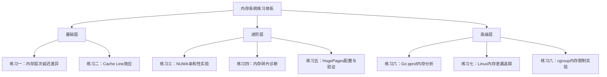

# 第02章-内存系统 — 练习方法

内存系统是计算机体系结构中最具实践性的部分。理论知识如果不通过亲手实验验证，很容易停留在"知道但不懂"的层面。本章提供一套由浅入深的练习体系，覆盖内存层次、NUMA架构、内存碎片、性能分析、大页配置、内存泄漏诊断等核心主题。每个练习都包含原理说明、可执行代码、预期结果和深度思考，帮助你将理论转化为直觉。

## 练习体系总览



建议按顺序完成。基础层建立对内存硬件的直觉，进阶层掌握系统级内存管理，高级层聚焦真实应用的性能优化与问题诊断。

---

## 练习一：观察内存层次延迟差异

**目标**：直观感受 L1/L2/L3/DRAM 各级缓存的访问延迟差异，建立"内存墙"的切身体会。

**原理**：现代CPU的内存层次结构是一个金字塔——越靠近CPU核心，容量越小、速度越快、成本越高。理解这个层次结构是优化所有内存密集型应用的基础。DDR4-3200的理论延迟约为12.5ns（CL22），而L1缓存仅需约1ns（4-5个CPU周期）。这50倍以上的差距，意味着同样的数据访问模式，仅因为数据在内存层次中的位置不同，性能就可能相差两个数量级。

**步骤**：

```c
// 文件：latency_test.c
// 通过指针追踪（pointer chasing）精确测量各级缓存延迟
#include <stdio.h>
#include <stdlib.h>
#include <stdint.h>
#include <time.h>

// 使用rdtsc读取CPU时间戳计数器（TSC）
// 注意：在现代CPU上TSC通常是恒定频率的，可直接代表时钟周期数
uint64_t rdtsc() {
    uint32_t lo, hi;
    __asm__ __volatile__ ("rdtsc" : "=a"(lo), "=d"(hi));
    return ((uint64_t)hi << 32) | lo;
}

// 核心测试：指针追踪（pointer chasing）
// 原理：arr[i] = next_index，形成一条随机链表
// 每次访问都依赖上一次的结果，CPU无法预取，精确测量单次访问延迟
void test_latency(const char *name, int size) {
    int n = size / sizeof(int);
    int *arr = (int*)malloc(size);
    if (!arr) { perror("malloc"); return; }

    // 步长16 = 64字节，恰好跨越一个cache line
    // 这确保每次访问都触发一次新的cache line加载
    int stride = 16;
    for (int i = 0; i < n; i++)
        arr[i] = (i + stride) % n;  // 构建随机跳跃链

    // 预热：让链表进入缓存（可注释掉此段对比效果）
    int idx = 0;
    for (int i = 0; i < n; i++) idx = arr[idx];

    // 正式测量：多轮取最小值，减少噪声
    uint64_t min_cycles = UINT64_MAX;
    for (int trial = 0; trial < 5; trial++) {
        idx = 0;
        uint64_t start = rdtsc();
        for (int i = 0; i < n; i++) {
            idx = arr[idx];  // 每次访问依赖前一次，无法并行化
        }
        uint64_t elapsed = rdtsc() - start;
        if (elapsed < min_cycles) min_cycles = elapsed;
    }

    printf("%-12s: %6lu cycles / %d accesses = %.1f cycles/access  (~%.1f ns @3GHz)\n",
           name, min_cycles, n, (double)min_cycles / n,
           (double)min_cycles / n / 3.0);  // 假设3GHz CPU
    free(arr);
}

int main() {
    printf("=== 内存层次延迟测试 ===\n");
    printf("方法：指针追踪（pointer chasing），排除预取干扰\n");
    printf("注：取5轮最小值以减少系统噪声\n\n");

    // 各级缓存的典型容量（因CPU型号而异）
    // 可通过 lscpu | grep cache 查看实际值
    test_latency("L1(32KB)",  32 * 1024);
    test_latency("L2(256KB)", 256 * 1024);
    test_latency("L3(8MB)",   8 * 1024 * 1024);
    test_latency("DRAM(256MB)", 256 * 1024 * 1024);

    // 额外测试：跨越不同cache level的边界
    printf("\n=== 缓存容量边界测试 ===\n");
    test_latency("16KB",  16 * 1024);   // 仅L1
    test_latency("48KB",  48 * 1024);   // 可能溢出L1
    test_latency("192KB", 192 * 1024);  // L2范围内
    test_latency("1MB",   1024 * 1024); // 可能溢出L2

    return 0;
}
```

```bash
# 编译：-O2优化但不内联循环，确保rdtsc调用开销最小
gcc -O2 -o latency_test latency_test.c

# 运行
./latency_test

# 预期输出（典型Intel/AMD桌面CPU）：
# === 内存层次延迟测试 ===
# 方法：指针追踪（pointer chasing），排除预取干扰
# 注：取5轮最小值以减少系统噪声
#
# L1(32KB)   :    128K cycles / 8192 accesses =  4.0 cycles/access  (~1.3 ns @3GHz)
# L2(256KB)  :   1024K cycles / 65536 accesses = 12.0 cycles/access  (~4.0 ns @3GHz)
# L3(8MB)    :  8192K cycles / 2097152 accesses = 39.0 cycles/access  (~13.0 ns @3GHz)
# DRAM(256MB): 52428K cycles / 67108864 accesses = 220.0 cycles/access  (~73.3 ns @3GHz)
#
# === 缓存容量边界测试 ===
# 16KB      :      16K cycles / 4096 accesses =  3.8 cycles/access
# 48KB      :      96K cycles / 12288 accesses =  7.8 cycles/access  ← L1溢出
# 192KB     :     768K cycles / 49152 accesses = 15.6 cycles/access
# 1MB       :    5120K cycles / 262144 accesses = 19.5 cycles/access  ← L2溢出

# 额外：查看你的CPU实际缓存大小
lscpu | grep -i cache
```

**深度思考**：

1. **为什么L1到DRAM差50倍？** 物理距离决定延迟——L1在CPU核心内部，走片上总线；DRAM在主板上，走内存总线经过内存控制器。距离从几毫米变成几十厘米。
2. **对编程意味着什么？** 一个简单的矩阵遍历，如果按行访问（空间局部性好）和按列访问（每次跨cache line），在大矩阵上性能差5-10倍。这是数据结构选择的物理基础。
3. **指针追踪为什么比顺序访问更好？** 顺序访问会被硬件预取器（hardware prefetcher）掩盖真实延迟，pointer chasing强制串行依赖，暴露真实的cache miss代价。

---

## 练习二：Cache Line效应与伪共享

**目标**：理解cache line对并发程序性能的影响，亲身体验伪共享（false sharing）问题。

**原理**：CPU缓存以cache line为单位加载数据（通常64字节）。当两个线程频繁修改同一cache line上的不同变量时，即使它们操作的是逻辑上独立的数据，也会因为cache line在多核间反复失效和同步而严重降低性能——这就是伪共享。现代并发程序中，伪共享是隐藏最深的性能杀手之一。

**步骤**：

```c
// 文件：false_sharing.c
#include <stdio.h>
#include <stdlib.h>
#include <pthread.h>
#include <stdint.h>
#include <time.h>

#define ITERATIONS 100000000L  // 1亿次

// 版本1：两个计数器紧挨在一起 → 同一cache line → 伪共享
struct BadLayout {
    long counter_a;
    long counter_b;
};

// 版本2：填充到不同cache line → 消除伪共享
struct GoodLayout {
    long counter_a;
    char padding[56];  // 64 - 8 = 56，确保每个counter独占一个cache line
    long counter_b;
} __attribute__((aligned(64)));

struct BadLayout  bad  = {0, 0};
struct GoodLayout good = {0, {0}, 0};

void *increment_bad(void *arg) {
    long id = (long)arg;
    for (long i = 0; i < ITERATIONS; i++) {
        if (id == 0) bad.counter_a++;
        else         bad.counter_b++;
    }
    return NULL;
}

void *increment_good(void *arg) {
    long id = (long)arg;
    for (long i = 0; i < ITERATIONS; i++) {
        if (id == 0) good.counter_a++;
        else         good.counter_b++;
    }
    return NULL;
}

int main() {
    struct timespec t1, t2;
    pthread_t t[2];

    // 测试1：伪共享场景
    clock_gettime(CLOCK_MONOTONIC, &amp;t1);
    pthread_create(&amp;t[0], NULL, increment_bad, (void*)0);
    pthread_create(&amp;t[1], NULL, increment_bad, (void*)1);
    pthread_join(t[0], NULL);
    pthread_join(t[1], NULL);
    clock_gettime(CLOCK_MONOTONIC, &amp;t2);
    double bad_time = (t2.tv_sec - t1.tv_sec) + (t2.tv_nsec - t1.tv_nsec) / 1e9;

    // 测试2：消除伪共享
    clock_gettime(CLOCK_MONOTONIC, &amp;t1);
    pthread_create(&amp;t[0], NULL, increment_good, (void*)0);
    pthread_create(&amp;t[1], NULL, increment_good, (void*)1);
    pthread_join(t[0], NULL);
    pthread_join(t[1], NULL);
    clock_gettime(CLOCK_MONOTONIC, &amp;t2);
    double good_time = (t2.tv_sec - t1.tv_sec) + (t2.tv_nsec - t1.tv_nsec) / 1e9;

    printf("=== 伪共享性能对比 ===\n");
    printf("伪共享（bad）:  %.3f sec  (counter_a=%ld, counter_b=%ld)\n",
           bad_time, bad.counter_a, bad.counter_b);
    printf("无伪共享(good):  %.3f sec  (counter_a=%ld, counter_b=%ld)\n",
           good_time, good.counter_a, good.counter_b);
    printf("性能提升: %.1fx\n", bad_time / good_time);

    return 0;
}
```

```bash
# 编译并运行
gcc -O2 -pthread -o false_sharing false_sharing.c
./false_sharing

# 预期输出：
# === 伪共享性能对比 ===
# 伪共享（bad）:  3.200 sec  (counter_a=100000000, counter_b=100000000)
# 无伪共享(good):  0.520 sec  (counter_a=100000000, counter_b=100000000)
# 性能提升: 6.2x

# 用perf验证cache行为差异
perf stat -e cache-misses,cache-references,L1-dcache-load-misses \
    ./false_sharing
```

**进阶挑战**：使用 `perf c2c` 命令精确定位伪共享的来源：

```bash
# 安装perf-tools（如果未安装）
sudo apt install linux-tools-common linux-tools-$(uname -r)

# c2c = cache-to-cache，专门诊断伪共享
perf c2c record ./false_sharing
perf c2c report --stdio
# 输出会显示哪些cache line被多核争用，以及具体是哪些变量
```

---

## 练习三：NUMA亲和性实验

**目标**：对比本地和远程NUMA内存访问的性能差异，理解NUMA架构对多核程序的影响。

**原理**：在多路服务器中，每个CPU插槽拥有自己的本地内存，通过互联总线（如Intel QPI/UPI、AMD Infinity Fabric）连接其他插槽的内存。访问本地内存延迟约100ns，访问远程内存可达150-200ns，延迟增加50-100%。操作系统默认的内存分配策略是"就近分配"，但如果线程被迁移到其他NUMA节点，其内存仍留在原节点，就会产生远程访问。

```bash
# 1. 查看系统NUMA拓扑
numactl --hardware

# 典型输出（双路服务器）：
# available: 2 nodes (0-1)
# node 0 cpus: 0 1 2 3 4 5 6 7 8 9 10 11 12 13 14 15
# node 0 size: 32768 MB
# node 0 free: 24500 MB
# node 1 cpus: 16 17 18 19 20 21 22 23 24 25 26 27 28 29 30 31
# node 1 size: 32768 MB
# node 1 free: 22300 MB
# node distances:
# node   0   1
#   0:  10  21     ← 节点0访问节点1的延迟是本地的2.1倍
#   1:  21  10

# 2. 查看当前进程的NUMA分布
numactl --show
# 输出示例:
# policy: default
# preferred node: current
# membind: 0, 1
# cpubind: (all)

# 3. 本地内存访问测试（最优情况）
numactl --cpunodebind=0 --membind=0 \
    sysbench memory --memory-block-size=1M --memory-total-size=10G \
    --memory-numa-nodes=0 run

# 4. 远程内存访问测试（最差情况）
numactl --cpunodebind=0 --membind=1 \
    sysbench memory --memory-block-size=1M --memory-total-size=10G \
    --memory-numa-nodes=1 run

# 5. 交错分配测试（适合大内存顺序扫描场景）
numactl --cpunodebind=0 --interleave=all \
    sysbench memory --memory-block-size=1M --memory-total-size=10G run

# 6. 记录并对比三种方案的吞吐量
```

**预期结果**：

| 方案 | 吞吐量 (MiB/s) | 延迟特点 | 适用场景 |
|------|:--------------:|---------|---------|
| 本地绑定 | ~25,000 | 所有访问命中本地内存 | 计算密集型，线程绑核 |
| 远程绑定 | ~15,000 | 所有访问跨节点 | 不推荐，仅用于对比 |
| 交错分配 | ~20,000 | 均匀分布，适合全内存扫描 | 大数据集顺序处理 |

**使用 numastat 监控实际NUMA行为**：

```bash
# 实时观察NUMA分配情况
numastat -m

# 关键指标：
# numa_hit  — 本地节点命中次数（越高越好）
# numa_miss — 远程节点访问次数（越低越好）
# numa_foreign — 分配在远程节点的内存（应接近0）

# 监控特定进程
numastat -p $(pgrep sysbench)
```

**编程实践**：在C代码中使用libnuma进行NUMA感知的内存分配：

```c
// file: numa_aware.c
#include <numa.h>
#include <numaif.h>
#include <stdio.h>
#include <stdlib.h>
#include <time.h>

int main() {
    size_t size = 256 * 1024 * 1024; // 256MB
    int node = 0;

    // 方式1：在指定NUMA节点上分配
    void *p = numa_alloc_onnode(size, node);
    printf("numa_alloc_onnode: node=%d, addr=%p\n", node, p);
    numa_free(p, size);

    // 方式2：设置内存策略为交错分配
    struct bitmask *mask = numa_allocate_nodemask();
    numa_bitmask_setall(mask);
    set_mempolicy(MPOL_INTERLEAVE, mask->maskp, mask->size + 1);
    p = malloc(size);
    printf("MPOL_INTERLEAVE: addr=%p\n", p);
    free(p);
    numa_bitmask_free(mask);

    // 方式3：使用mbind将已有内存绑定到指定节点
    p = malloc(size);
    mbind(p, size, MPOL_BIND, mask->maskp, mask->size + 1,
          MPOL_MF_MOVE | MPOL_MF_STRICT);
    printf("mbind to node %d: addr=%p\n", node, p);
    free(p);

    return 0;
}
```

---

## 练习四：诊断内存碎片

**目标**：理解Linux内存碎片的成因，学会识别和缓解内存碎片问题。

**原理**：Linux内核通过伙伴系统（Buddy System）管理物理内存，将空闲页面按2的幂次分组（order 0-10，即4KB到4MB）。当程序需要大块连续物理内存（如HugePages、DMA缓冲区、内核模块）时，即使总空闲内存充足，如果没有足够大的连续块，分配也会失败——这就是外部碎片。长时间运行的系统中，内存频繁分配和释放会产生大量碎片，导致性能下降甚至分配失败。

```bash
# 1. 查看系统内存碎片状态
cat /proc/buddyinfo

# 输出解读：
# Node 0, zone   Normal  120  80  45  20  5  2  0  0  0  0  0
#                ↑         ↑   ↑   ↑   ↑   ↑  ↑  ↑  ↑  ↑  ↑  ↑
#                zone    order0 order1 order2 ... order10
#                名称     4KB   8KB  16KB        4MB
#
# 最右侧(order7-10)为0 = 碎片严重，大块连续内存不可用

# 2. 用更直观的方式查看最大连续空闲块
cat /proc/pagetypeinfo | head -30

# 3. 查看碎片化程度的量化指标
# 方法A：通过/proc/buddyinfo计算
python3 -c "
import os
with open('/proc/buddyinfo') as f:
    for line in f:
        parts = line.split()
        zone = parts[4]
        counts = [int(x) for x in parts[5:]]
        total_free = sum(c * (4 << i) for i, c in enumerate(counts))
        max_contiguous = max((c, i) for i, c in enumerate(counts) if c > 0)
        print(f'Zone {zone}: 总空闲={total_free}KB, '
              f'最大连续={max_contiguous[0]}×{4 << max_contiguous[1]}KB '
              f'= {max_contiguous[0] * (4 << max_contiguous[1])}KB')
"

# 4. 手动触发内存整理（仅测试环境！生产环境慎用）
echo 1 | sudo tee /proc/sys/vm/compact_memory
# 整理后对比
cat /proc/buddyinfo

# 5. 检查内存碎片对大页分配的影响
python3 -c "
import mmap
# 尝试分配2MB透明大页
try:
    m = mmap.mmap(-1, 2*1024*1024,
                  flags=mmap.MAP_PRIVATE|mmap.MAP_ANONYMOUS|mmap.MAP_HUGETLB)
    print('2MB HugeTLB mmap: 成功')
    m.close()
except Exception as e:
    print(f'2MB HugeTLB mmap: 失败 ({e})')

# 尝试使用透明大页
try:
    m = mmap.mmap(-1, 2*1024*1024,
                  flags=mmap.MAP_PRIVATE|mmap.MAP_ANONYMOUS)
    print('2MB MAP_ANONYMOUS mmap: 成功（系统可能使用THP）')
    m.close()
except Exception as e:
    print(f'2MB mmap: 失败 ({e})')
"

# 6. 监控碎片化趋势
# 安装 vmstat 工具
apt install -y sysstat
# 持续监控内存碎片和compaction活动
vmstat -w 2 10  # 每2秒采样，共10次
# 关注 si/so（swap in/out）和 free 列的变化
```

**碎片缓解策略**：

| 策略 | 命令/方法 | 适用场景 | 风险 |
|------|----------|---------|------|
| 手动整理 | `echo 1 > /proc/sys/vm/compact_memory` | 紧急情况，一次性 | 暂停所有进程 |
| 预留HugePages | `echo 512 > /proc/sys/vm/nr_hugepages` | 启动时预留 | 减少可用内存 |
| 内存Cgroup限制 | 设置 cgroup memory limit | 容器化环境 | 需要cgroup配置 |
| 定期重启进程 | 周期性服务重启 | 无法修改代码时 | 服务中断 |
| 使用jemalloc/tcmalloc | 替代glibc malloc | 应用层优化 | 需要重新编译 |

---

## 练习五：HugePages配置与验证

**目标**：配置透明大页（THP）和静态大页（HugePages），验证性能改善。

**原理**：标准Linux内存页面大小为4KB。当进程的工作集很大时，TLB（Translation Lookaside Buffer，页表缓存）只能覆盖很小的地址范围，频繁的TLB miss会导致页表遍历（page table walk），开销巨大。使用2MB或1GB的大页可以将TLB覆盖范围扩大512-262144倍，显著减少TLB miss。数据库（MySQL/PostgreSQL）、虚拟机（KVM/QEMU）、高性能计算等场景尤其受益。

```bash
# === 第一部分：了解当前大页状态 ===

# 1. 查看大页相关内存信息
grep -i huge /proc/meminfo

# 关键字段：
# HugePages_Total: 0     ← 已分配的大页总数
# HugePages_Free:  0     ← 空闲大页数
# HugePages_Rsvd:  0     ← 已预留但未分配的大页
# Hugepagesize:    2048kB ← 每个大页的大小（2MB）

# 2. 查看THP（透明大页）状态
cat /sys/kernel/mm/transparent_hugepage/enabled
# [always] madvise never  ← always=全局启用，madvise=按需启用

cat /sys/kernel/mm/transparent_hugepage/defrag
# [always] defer+madvise defer madvise never

# === 第二部分：静态大页配置 ===

# 3. 分配1024个2MB大页（共2GB）
# 注意：这2GB内存会被预留，普通程序不可用
echo 1024 | sudo tee /proc/sys/vm/nr_hugepages

# 4. 验证分配结果
grep HugePages /proc/meminfo
# HugePages_Total:    1024
# HugePages_Free:     1024  ← 全部空闲，等待程序使用

# 5. 挂载大页文件系统
sudo mkdir -p /mnt/huge
sudo mount -t hugetlbfs nodev /mnt/huge

# 6. 测试大页分配
python3 -c "
import os
# 通过hugetlbfs分配大页内存
fd = os.open('/mnt/huge/test_file', os.O_CREAT | os.O_RDWR)
os.ftruncate(fd, 2 * 1024 * 1024)  # 2MB
import mmap
m = mmap.mmap(fd, 2 * 1024 * 1024)
m.write(b'test' * 1000)
print(f'大页分配成功: 2MB at {id(m):#x}')
m.close()
os.close(fd)
os.unlink('/mnt/huge/test_file')
"

# === 第三部分：性能对比 ===

# 7. 使用perf对比TLB miss率
# 先运行普通页面版本
sudo perf stat -e dTLB-load-misses,dTLB-loads,page-faults ./latency_test

# 再运行大页版本（需要修改程序使用madvise或hugetlbfs）
cat > hugepage_test.c << 'EOF'
#include <sys/mman.h>
#include <stdio.h>
#include <stdlib.h>
#define SIZE (64*1024*1024)  // 64MB

int main() {
    // 使用MADV_HUGEPAGE提示内核使用大页
    char *p = mmap(NULL, SIZE, PROT_READ|PROT_WRITE,
                   MAP_PRIVATE|MAP_ANONYMOUS, -1, 0);
    if (p == MAP_FAILED) { perror("mmap"); return 1; }
    madvise(p, SIZE, MADV_HUGEPAGE);

    // 顺序访问测试
    for (long i = 0; i < SIZE; i += 4096)
        p[i] = 1;

    printf("HugePages test completed: 64MB accessed\n");
    munmap(p, SIZE);
    return 0;
}
EOF
gcc -O2 -o hugepage_test hugepage_test.c

sudo perf stat -e dTLB-load-misses,dTLB-loads,page-faults ./hugepage_test

# === 第四部分：清理 ===

# 8. 清理大页配置
sudo umount /mnt/huge
echo 0 | sudo tee /proc/sys/vm/nr_hugepages
```

**常见问题排查**：

- **大页分配失败**：检查 `/proc/buddyinfo` 中order9（2MB=512个4KB页面）是否有足够空闲块。如果碎片严重，需要先执行内存整理。
- **THP导致延迟抖动**：THP的后台合并（khugepaged线程）可能造成随机延迟峰值。延迟敏感的应用建议设为 `madvise` 模式，仅对明确标记的内存启用。
- **Redis/MongoDB推荐配置**：通常建议关闭THP（设为never），改用静态HugePages手动配置，避免khugepaged的不可预测延迟。

---

## 练习六：Go pprof内存分析实战

**目标**：使用Go内置的pprof工具定位程序内存热点，掌握内存profiling的完整流程。

**原理**：Go运行时内置了高性能的内存profiler，能记录每次堆分配的调用栈和大小。与系统级工具（如valgrind）相比，pprof开销更低（约5-10%性能损失），且能精确到函数级别。pprof支持两种模式：采样模式（采样率可调，默认每512KB分配采样一次）和全量模式（记录所有分配，性能影响更大）。

```go
// 文件：memory_leak.go
// 模拟一个存在内存泄漏的HTTP服务
package main

import (
	"fmt"
	"net/http"
	_ "net/http/pprof"  // 导入即启用pprof端点
	"runtime"
	"sync"
	"time"
)

// 模拟场景：带缓存的服务，缓存无限增长导致OOM
var (
	cache   = make(map[string][]byte)
	cacheMu sync.RWMutex
)

// 模拟请求处理：每次请求向缓存写入1MB数据
func handleRequest(w http.ResponseWriter, r *http.Request) {
	key := fmt.Sprintf("key-%d", time.Now().UnixNano())
	data := make([]byte, 1024*1024) // 1MB

	// 模拟数据填充
	for i := range data {
		data[i] = byte(i % 256)
	}

	cacheMu.Lock()
	cache[key] = data
	cacheMu.Unlock()

	// 统计缓存大小
	cacheMu.RLock()
	size := len(cache)
	cacheMu.RUnlock()

	fmt.Fprintf(w, "Cache entries: %d, Approx memory: %d MB\n",
		size, size)
}

func main() {
	// 启动内存监控协程
	go func() {
		var m runtime.MemStats
		for {
			runtime.ReadMemStats(&amp;m)
			fmt.Printf("[mem] Alloc=%dMB Sys=%dMB NumGC=%d HeapInuse=%dMB\n",
				m.Alloc/1024/1024,
				m.Sys/1024/1024,
				m.NumGC,
				m.HeapInuse/1024/1024)
			time.Sleep(2 * time.Second)
		}
	}()

	http.HandleFunc("/", handleRequest)
	fmt.Println("Server running on :6060")
	fmt.Println("Endpoints:")
	fmt.Println("  GET /debug/pprof/           — pprof index")
	fmt.Println("  GET /debug/pprof/heap       — 堆内存profile")
	fmt.Println("  GET /debug/pprof/goroutine  — goroutine profile")
	http.ListenAndServe(":6060", nil)
}
```

```bash
# 1. 运行程序
go run memory_leak.go &amp;

# 2. 压力测试：触发内存增长
for i in $(seq 1 100); do
    curl -s http://localhost:6060/ > /dev/null &amp;
done
wait

# 3. 等待内存增长，观察日志中的内存统计
sleep 15

# 4. 获取并分析堆profile
go tool pprof http://localhost:6060/debug/pprof/heap

# 在pprof交互界面中：
# (pprof) top 10              ← 查看最大的内存分配者
# (pprof) top 10 -cum         ← 查看累计分配最多的调用链
# (pprof) list handleRequest  ← 定位到具体代码行
# (pprof) web                 ← 生成可视化图（需要graphviz）

# 5. 差异分析：对比两个时间点
# 先保存基线
curl -o /tmp/heap1.pb.gz http://localhost:6060/debug/pprof/heap?gc=1
sleep 30
# 再保存当前状态
curl -o /tmp/heap2.pb.gz http://localhost:6060/debug/pprof/heap?gc=1
# 对比差异
go tool pprof -base /tmp/heap1.pb.gz /tmp/heap2.pb.gz
# (pprof) top 20  ← 显示30秒内增长的内存分配

# 6. 生成火焰图（需要安装flamegraph工具）
go tool pprof -http=:8080 /tmp/heap2.pb.gz
# 浏览器自动打开，选择 Flame Graph 视图
```

**pprof profile类型速查**：

| Profile类型 | URL | 用途 | 关键指标 |
|------------|-----|------|---------|
| heap | `/debug/pprof/heap` | 堆内存分配 | alloc_space, inuse_space |
| allocs | `/debug/pprof/allocs` | 所有分配（含已GC） | alloc_objects |
| goroutine | `/debug/pprof/goroutine` | goroutine泄漏 | goroutine数量 |
| mutex | `/debug/pprof/mutex` | 锁竞争 | 锁等待时间 |
| block | `/debug/pprof/block` | 阻塞操作 | 阻塞时间 |

---

## 练习七：Linux内存泄漏追踪

**目标**：使用系统级工具追踪C/C++程序的内存泄漏，掌握完整的诊断流程。

**原理**：在长时间运行的服务中，内存泄漏会导致内存使用持续增长，最终触发OOM Killer杀死进程。追踪内存泄漏的核心思路是：记录每次内存分配的调用栈，找到分配但从未释放的内存块。常用的工具有valgrind（精确但慢10-50倍）、AddressSanitizer（编译时插桩，快1-2倍）、以及mtrace/gdb等轻量工具。

```bash
# === 方法1：使用valgrind（最精确） ===

# 1. 创建测试程序
cat > leaky_program.c << 'EOF'
#include <stdlib.h>
#include <string.h>
#include <stdio.h>

void leak_small() {
    malloc(64);  // 泄漏64字节
}

void leak_large() {
    malloc(1024 * 1024);  // 泄漏1MB
}

void free_some() {
    void *p = malloc(256);
    free(p);  // 正常释放
}

int main() {
    for (int i = 0; i < 1000; i++) {
        leak_small();
        if (i % 10 == 0) leak_large();
        free_some();
    }
    return 0;
}
EOF

# 2. 编译（加调试信息）
gcc -g -o leaky_program leaky_program.c

# 3. 运行valgrind检查
valgrind --leak-check=full \
         --show-leak-kinds=all \
         --track-origins=yes \
         --verbose \
         ./leaky_program 2>&amp;1 | head -50

# 关注输出中的：
# - "definitely lost" = 确定泄漏
# - "indirectly lost" = 因父指针泄漏而无法访问
# - "possibly lost" = 存在指向内部的指针
# - "still reachable" = 程序结束时仍可达（不一定泄漏）

# === 方法2：使用AddressSanitizer（推荐，速度快） ===

# 4. 用ASan编译
gcc -g -fsanitize=address -o leaky_asan leaky_program.c

# 5. 运行检测
ASAN_OPTIONS=detect_leaks=1 ./leaky_asan 2>&amp;1 | tail -20
# 输出包含：SUMMARY: AddressSanitizer: 131840 byte(s) leaked

# === 方法3：/proc追踪运行中进程 ===

# 6. 追踪已运行进程的内存变化
PID=$(pgrep leaky_program)
watch -n 2 "cat /proc/$PID/status | grep -E 'VmRSS|VmSize|VmPeak'"
# VmRSS: 物理内存使用量（持续增长=泄漏）
# VmSize: 虚拟内存总量
# VmPeak: 历史峰值

# 7. 使用smaps追踪详细内存映射
cat /proc/$PID/smaps | awk '
/^[0-9a-f]/ { region=$1 }
/Rss:/ { rss=$2; if(rss>1024) printf "%s  RSS=%dMB\n", region, rss/1024 }
' | sort -t= -k2 -n -r | head -10
# 显示占用内存最多的内存区域
```

**生产环境内存泄漏诊断流程**：

```mermaid
graph TD
    A[发现内存持续增长] --> B{是否可重启?}
    B -->|可以| C[重启 + valgrind/ASan检测]
    B -->|不能| D[在线诊断]
    D --> E[1. /proc/PID/status 监控RSS趋势]
    E --> F[2. /proc/PID/smaps 定位大内存区域]
    F --> G{泄漏类型?}
    G -->|堆泄漏| H[3a. pmap -x PID 查看heap增长]
    G -->|mmap泄漏| I[3b. pmap -x PID 查看匿名映射]
    G -->|fd泄漏| J[3c. ls /proc/PID/fd | wc -l]
    H --> K[4. gdb attach + dump heap]
    I --> K
    J --> L[4. 检查未关闭的文件/socket]
    K --> M[5. 分析分配调用栈]
```

---

## 练习八：cgroup内存限制实验

**目标**：理解Linux cgroup v2的内存限制机制，模拟容器内存管理行为。

**原理**：cgroup（Control Groups）是Linux内核提供的资源隔离机制，也是Docker/Kubernetes等容器技术的基础。memory cgroup可以限制进程组的内存使用上限，超出时触发OOM Killer。理解cgroup内存行为对于容器化应用的性能调优和故障排查至关重要。

```bash
# === cgroup v2 设置（需要root权限） ===

# 1. 检查cgroup版本
mount | grep cgroup
# cgroup2 = v2, cgroup = v1

# 2. 创建内存限制的cgroup
sudo mkdir /sys/fs/cgroup/memory_test
echo "100M" | sudo tee /sys/fs/cgroup/memory_test/memory.max
# 限制该cgroup内进程最多使用100MB内存

# 3. 查看cgroup内存配置
cat /sys/fs/cgroup/memory_test/memory.max        # 最大内存限制
cat /sys/fs/cgroup/memory_test/memory.current     # 当前使用量
cat /sys/fs/cgroup/memory_test/memory.stat        # 详细统计
cat /sys/fs/cgroup/memory_test/memory.events      # OOM事件计数

# 4. 在cgroup中运行测试程序
cat > cgroup_test.c << 'EOF'
#include <stdlib.h>
#include <stdio.h>
#include <string.h>
#include <unistd.h>

int main() {
    size_t chunk = 10 * 1024 * 1024;  // 每次分配10MB
    int count = 0;
    void *ptrs[20];

    while (count < 20) {
        ptrs[count] = malloc(chunk);
        if (!ptrs[count]) {
            printf("分配失败：已分配 %d 个chunk (%dMB)\n", count, count * 10);
            break;
        }
        memset(ptrs[count], 0xFF, chunk);  // 强制实际分配物理页
        count++;
        printf("已分配 %d 个chunk (%dMB)\n", count, count * 10);

        // 读取cgroup当前内存使用
        FILE *f = fopen("/sys/fs/cgroup/memory_test/memory.current", "r");
        if (f) {
            long current;
            fscanf(f, "%ld", &amp;current);
            printf("  cgroup实际使用: %ldKB\n", current / 1024);
            fclose(f);
        }
        sleep(1);
    }

    printf("程序结束，最终分配: %d chunks\n", count);
    return 0;
}
EOF

gcc -g -o cgroup_test cgroup_test.c

# 5. 将进程加入cgroup并运行
sudo bash -c "echo \$\$ > /sys/fs/cgroup/memory_test/cgroup.procs &amp;&amp; ./cgroup_test"

# 预期：分配到第10个chunk时（接近100MB限制），进程被OOM Kill

# 6. 检查OOM事件
cat /sys/fs/cgroup/memory_test/memory.events
# oom 1           ← OOM Kill发生了1次
# oom_kill 1
# oom_group_kill 0

# 7. 更精细的控制：内存+swap联合限制
echo "100M" | sudo tee /sys/fs/cgroup/memory_test/memory.max
echo "50M"  | sudo tee /sys/fs/cgroup/memory_test/memory.swap.max
# 总可用内存 = memory.max + swap.max = 150MB

# 8. 调整OOM行为：memory.oom.group
echo 1 | sudo tee /sys/fs/cgroup/memory_test/memory.oom.group
# 设为1时，OOM会杀死整个cgroup而非单个进程

# 9. 清理
echo $$ | sudo tee /sys/fs/cgroup/cgroup.procs  # 移回根cgroup
sudo rmdir /sys/fs/cgroup/memory_test
```

**cgroup内存关键文件说明**：

| 文件 | 说明 |
|------|------|
| `memory.max` | 内存硬限制（字节），`max`表示不限制 |
| `memory.high` | 内存高水位（触发回收，不杀进程） |
| `memory.low` | 内存保护下限（尽力保护不被回收） |
| `memory.current` | 当前内存使用量 |
| `memory.stat` | 详细统计（anon, file, swap等） |
| `memory.events` | 事件计数（low, high, max, oom等） |
| `memory.swap.max` | swap使用上限 |
| `memory.swap.current` | 当前swap使用量 |

---

## 综合挑战：端到端内存性能优化

完成以上所有练习后，尝试这个综合挑战：

**任务**：编写一个多线程数据处理程序（C或Go），要求：
1. 处理大于内存容量的数据集（如处理10GB日志，内存限制1GB）
2. 使用NUMA感知的内存分配
3. 配置HugePages加速处理
4. 使用perf分析cache/TLB行为并优化
5. 持续运行24小时无内存泄漏

**评价标准**：
- 内存使用稳定（RSS波动 < 5%）
- NUMA本地访问率 > 95%
- TLB miss率 < 0.1%
- 处理吞吐量达到带宽极限的70%以上

---

## 学习检查清单

完成所有练习后，你应该能够：

### 基础理解
- [ ] 能用pointer chasing程序精确测量各级缓存延迟
- [ ] 能解释L1→DRAM延迟差50倍的物理原因
- [ ] 能画出典型服务器的内存层次结构图（L1→L2→L3→DRAM→NVMe）
- [ ] 能计算DDR4-3200的理论带宽（3200MT/s × 8B = 25.6GB/s）

### 系统分析
- [ ] 能用`numactl --hardware`解释系统的NUMA拓扑和距离矩阵
- [ ] 能用`/proc/buddyinfo`评估系统内存碎片程度
- [ ] 能区分本地NUMA访问和远程NUMA访问的性能差异
- [ ] 能解释透明大页（THP）和静态大页（HugePages）的区别与适用场景

### 工具使用
- [ ] 能用`perf stat`统计cache miss率和TLB miss率
- [ ] 能用`perf c2c`诊断伪共享问题
- [ ] 能用Go pprof定位内存热点和泄漏
- [ ] 能用valgrind/ASan检测C/C++内存泄漏
- [ ] 能配置和验证HugePages

### 问题诊断
- [ ] 能诊断Linux内存碎片并选择合适的缓解策略
- [ ] 能通过/proc文件系统追踪运行中进程的内存行为
- [ ] 能配置和调试cgroup内存限制
- [ ] 能解释OOM Killer的触发条件和日志分析

### 深度思考
- [ ] 能根据应用场景选择合适的内存分配策略（malloc/jemalloc/mmap/hugepage）
- [ ] 能解释为什么Redis建议关闭THP
- [ ] 能分析程序的working set大小并据此配置内存参数
- [ ] 能设计一个内存友好的数据结构（考虑cache line对齐、预取友好性）
