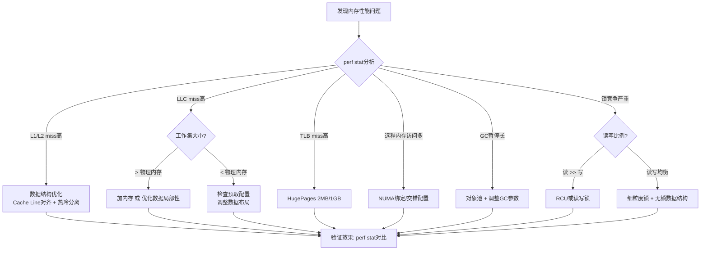

# 第02章-内存系统 — 本章小结

本章从DRAM的单个晶体管出发，一路向上经过代际演进、时序参数、NUMA拓扑、内存一致性模型，最终落地到优化实践和四个生产案例。以下是对全章核心知识的系统梳理、交叉关联与升华提炼。

## 知识体系总览

本章知识按"道→法→术→器"四层递进组织，从最底层的物理原理到最上层的诊断工具，形成完整的内存系统知识体系：

```mermaid
graph TD
    subgraph 道——物理原理
        A1[1T1C存储单元] --> A2[电容刷新机制]
        A2 --> A3[行缓冲区架构]
        A3 --> A4[Bank级并行]
    end

    subgraph 法——架构设计
        B1[DDR代际演进 DDR→DDR5] --> B2[时序参数 CL/tRCD/tRP/tRAS]
        B2 --> B3[NUMA多节点拓扑]
        B3 --> B4[内存一致性模型 TSO/RMO/SC]
    end

    subgraph 术——优化策略
        C1[Cache Line对齐与热冷分离] --> C2[对象池与内存池]
        C2 --> C3[HugePages 2MB/1GB]
        C3 --> C4[NUMA亲和性绑定]
        C4 --> C5[RCU无锁并发]
    end

    subgraph 器——诊断工具
        D1[perf stat/report — cache/TLB miss分析]
        D2[numastat/numactl — NUMA诊断与配置]
        D3[pprof/Valgrind — 应用内存profiling]
        D4[edac-util — ECC错误监控]
    end

    道 --> 法 --> 术 --> 器
```

四层之间不是单向依赖，而是**互相印证**的关系：当你用`perf stat`发现LLC miss率飙升（器），你需要回到NUMA拓扑（法）和行缓冲区命中率（道）去理解根因，然后选择HugePages或数据布局优化（术）来解决。掌握这条"器→道→术"的回溯链路，才是本章的核心能力目标。

## 一、DRAM物理特性——理解一切的基础

### 1.1 存储单元：1T1C结构

每个DRAM比特由一个晶体管（Transistor）和一个电容（Capacitor）组成。电容存储电荷表示0/1，晶体管控制读写访问。这是所有内存优化技术的物理起点——理解了这个结构，就能理解为什么刷新是必要的、为什么行缓冲区存在、为什么随机访问比顺序访问慢。

| 组件 | 功能 | 关键特性 |
|------|------|----------|
| 电容 | 存储电荷（数据） | 电荷泄漏，需要定期刷新 |
| 晶体管 | 控制读写通路 | 读取时破坏性，需要回写 |
| 感应放大器 | 检测微弱电荷信号 | 一次读取整行（数千个bit） |
| 行缓冲区 | 暂存整行数据 | 同一行的后续访问无需再次激活 |

**直觉理解**：可以将1T1C想象成一个漏水的蓄水池——电容是池子，晶体管是阀门，感应放大器是水位传感器。每次读取就像用传感器检测水位（会排空池子），所以读完必须把水灌回去（回写）。这个"读破坏+回写"的机制，决定了DRAM读操作的延迟下限。

### 1.2 刷新机制的代价

DRAM必须每64ms刷新一次所有行，否则数据丢失。刷新期间该Bank无法服务请求，这是DRAM与SRAM（CPU缓存）的根本性能差异来源。

刷新周期开销计算（DDR4）：
- 总行数：约65,536行（16Gb die）
- 每次刷新一行：约50ns
- 64ms内必须刷新完所有行
- 刷新占用时间比例 ≈ 65536 × 50ns / 64ms ≈ 5.1%
- 这5%的带宽是"白交的税"，无法通过任何优化消除

**进阶理解**：DDR5引入了细粒度刷新（Fine Granularity Refresh），将刷新粒度从整行缩小到半行，使得刷新可以更灵活地穿插在正常访问之间，将刷新对带宽的影响从~5%降低到~3%。但代价是每次刷新操作的控制逻辑更复杂，部分场景下延迟略有增加。

### 1.3 行缓冲区与Bank并行

理解行缓冲区是理解DRAM延迟的关键。访问一个内存地址的完整过程是：

激活行（tRCD）→ 等待行缓冲区就绪 → 选择列输出（CL）→ 预充电（tRP）准备下一次访问

Bank级并行是DRAM隐藏延迟的核心机制——当Bank 0在刷新时，Bank 1可以正常服务请求，Bank 2可以做预充电。现代DDR4有16个Bank（DDR5有32个），足够实现高并发访问。

**行缓冲区命中**是一个容易被忽略的性能因素：如果连续访问的地址落在同一个已激活行内，只需发送列选择命令（CL延迟），无需重新激活行（省去tRCD+tRP）。这就是为什么**顺序访问远快于随机访问**——顺序访问大概率命中同一行，而随机访问几乎每次都触发行切换。

## 二、DDR代际演进——性能提升的三驾马车

DDR的每一代升级主要围绕三个维度：**降低电压**（省电）、**提高预取宽度**（提带宽）、**引入新机制**（提效率）。

| 代际 | 年份 | 电压 | 预取 | 关键创新 | 典型带宽 |
|------|------|------|------|----------|----------|
| DDR | 2000 | 2.5V | 2n | 双沿采样（DDR核心思想） | 3.2 GB/s |
| DDR2 | 2003 | 1.8V | 4n | On-Die Termination（信号完整性） | 8.5 GB/s |
| DDR3 | 2007 | 1.5V | 8n | Fly-by拓扑（走线优化） | 17 GB/s |
| DDR4 | 2014 | 1.2V | 8n | Bank Group（伪通道提升并行） | 34 GB/s |
| DDR5 | 2020 | 1.1V | 16n | 双通道/片上ECC/128bit总线 | 68+ GB/s |

### 核心认知

DDR5不只是"更快的DDR4"。它的片上ECC（On-Die ECC）意味着DRAM自身就能纠正1bit错误，但这**不替代**系统级ECC——片上ECC只保证数据从DRAM die到芯片引脚的正确性，不覆盖传输路径上的错误。这是生产环境中一个常见的误解。

**DDR5的另一个关键变化**是通道架构：DDR5将单个64bit通道拆分为两个独立的32bit子通道，每个子通道有独立的命令/地址总线。这意味着DDR5在相同物理引脚下实现了更高的并行度，但也使得单条内存的最小访问粒度从64B降到了32B，在某些工作负载下需要重新评估数据对齐策略。

## 三、关键时序参数——延迟的本质

时序参数决定了DRAM的延迟下限，是性能调优的"硬约束"。

| 参数 | 全称 | 物理含义 | DDR4-3200 CL22 | 实际延迟 |
|------|------|----------|----------------|----------|
| CL | CAS Latency | 列地址选通延迟 | 22个时钟周期 | 13.75ns |
| tRCD | RAS to CAS Delay | 行激活到列访问 | 22个时钟周期 | 13.75ns |
| tRP | Row Precharge | 行预充电时间 | 22个时钟周期 | 13.75ns |
| tRAS | Row Active Time | 行最短激活时间 | 52个时钟周期 | 32.5ns |

### 延迟计算公式

实际延迟(ns) = 时序参数(时钟数) / 数据率(MT/s) × 1000

DDR4-3200 CL22:
  实际CAS延迟 = 22 / 3200 × 1000 = 6.875ns × 2(双沿) = 13.75ns

DDR5-6400 CL40:
  实际CAS延迟 = 40 / 6400 × 1000 = 6.25ns × 2 = 12.5ns

**关键洞察**：DDR5虽然数据率翻倍，但CL数值也翻倍，实际CAS延迟几乎没有改善。内存性能提升主要靠带宽而非延迟——这也是为什么CPU缓存层次结构如此重要。

**选配时序的实际意义**：市面上DDR4-3200同时存在CL16和CL22两种规格。CL16比CL22的CAS延迟低约3.2ns（~10ns vs ~13.75ns），对于数据库OLTP、游戏等延迟敏感型负载，这个差异在高频访问下会被放大数千倍。但对于带宽敏感型负载（视频转码、科学计算），CL差异几乎无感知——选择时应根据工作负载特性决策，而非一味追求低CL。

## 四、带宽计算——理论与现实

### 理论带宽公式

理论带宽 = 数据率(MT/s) × 位宽(B) × 通道数

示例：
  DDR4-3200 单通道 = 3200 × 8 × 1  = 25.6 GB/s
  DDR4-3200 双通道 = 3200 × 8 × 2  = 51.2 GB/s
  DDR5-6400 双通道 = 6400 × 8 × 2  = 102.4 GB/s
  DDR5-6400 四通道 = 6400 × 8 × 4  = 204.8 GB/s（服务器）

### 实际带宽的折扣

理论带宽是"出厂标称"，实际可用带宽通常只有60%-80%，原因包括：

| 损耗来源 | 影响比例 | 说明 |
|----------|----------|------|
| 刷新开销 | 5-8% | 刷新期间Bank不可用 |
| 行冲突 | 10-20% | 同Bank不同行切换需预充电 |
| 协议开销 | 3-5% | 命令总线、地址总线占用 |
| NUMA远程访问 | 30-50% | 跨节点访问带宽和延迟双降 |
| 预取未命中 | 变化大 | 随机访问模式下预取无效 |

### 实测带宽的方法

```bash
# 使用sysbench快速测试
sysbench memory --memory-block-size=1M \
    --memory-total-size=10G \
    --memory-oper=read \
    run

# 使用intel MLC（Memory Latency Checker，Intel平台推荐）
mlc --bandwidth_matrix

# 使用stream benchmark（学术界标准）
# 编译：gcc -O2 -fopenmp stream.c -o stream
OMP_NUM_THREADS=$(nproc) ./stream
```

**测试注意事项**：sysbench测出的是接近理论峰值的纯顺序读写带宽，而STREAM（尤其是`triad`操作）更接近真实应用的带宽表现。生产环境评估应优先使用STREAM，并设置与实际应用相近的线程数。

## 五、NUMA架构——多路系统的内存亲和性

### 5.1 为什么NUMA存在

在多路服务器中，每个CPU有自己直连的本地内存。访问本地内存走快速的内存控制器（~60-80ns），访问远程内存要经过QPI/UPI互联（~120-150ns）。这不是"可以优化"的选项，而是**物理拓扑决定的硬约束**。

### 5.2 NUMA延迟对比

| 访问类型 | 延迟 | 带宽 | 典型场景 |
|----------|------|------|----------|
| 本地访问 | ~60-80ns | ~50 GB/s | 进程绑定在CPU 0，内存分配在Node 0 |
| 远程访问 | ~120-150ns | ~25 GB/s | 进程在CPU 0，内存分配在Node 1 |
| 跨UPI跳数 | 每多一跳+20ns | 带宽进一步下降 | 4路以上服务器 |

**关键洞察**：远程访问的延迟是本地的1.5-3倍，带宽可能减半。对于内存密集型应用（数据库、缓存），NUMA配置不当可能导致性能下降30-50%——案例三中MySQL查询延迟降低40%就是直接证据。

### 5.3 NUMA配置决策树

你的应用是内存密集型的吗？
├── 否 → 使用默认配置（interleave=all 或内核自动）
└── 是 → 应用的内存访问模式是什么？
    ├── 均匀访问所有数据 → --interleave=all（均衡各节点负载）
    ├── 主要访问特定数据子集 → --membind=N（绑定到数据所在节点）
    └── 不确定 → 用numactl --interleave=all 启动，用numastat观察

**容易忽略的边界情况**：Redis的`maxmemory`如果设置为系统总内存的50%以上，即使启用了NUMA interleave，仍可能因为单个Node内存不足而触发OOM。这时需要先用`numactl --membind`将Redis锁定在特定Node上，再将`maxmemory`设为该Node可用内存的80%。

### 5.4 诊断与配置命令速查

```bash
# 查看NUMA拓扑
numactl --hardware

# 查看进程的NUMA分布
numastat -p $(pgrep mysqld)

# 绑定进程到Node 0
numactl --cpunodebind=0 --membind=0 ./my-server

# 交错分配（适合全内存扫描型应用）
numactl --interleave=all ./my-server

# 永久配置（systemd方式）
# /etc/systemd/system/my-service.service.d/numa.conf
[Service]
NUMAPolicy=interleave
```

## 六、内存一致性模型——并发编程的底层约束

内存一致性模型定义了多核CPU对内存操作的可见性顺序，是编写正确并发程序的理论基础。

| 模型 | 重排规则 | 代表架构 | 性能 | 编程难度 |
|------|----------|----------|------|----------|
| 顺序一致性(SC) | 不允许任何重排 | 理论模型 | 最低 | 最简单 |
| 全存储序(TSO) | 写可被读重排 | x86/x64 | 较高 | 中等 |
| 部分存储序(PSO) | 写可重排 | SPARC | 高 | 较难 |
| 宽松内存序(RMO) | 读写均可重排 | ARM/AArch64 | 最高 | 最难 |

### 实际影响

x86的TSO模型保证了"写入操作对其他CPU的可见顺序与程序顺序一致"（Store-Store不重排），这使得大多数x86并发程序无需显式内存屏障就能正确工作。但ARM的RMO模型连Store-Store都可能重排，移植x86并发代码到ARM时必须添加memory barrier，否则会出现"在x86上运行正确但ARM上偶尔出bug"的诡异问题。

Linux内核通过 `smp_mb()`、`smp_wmb()`、`smp_rmb()` 等屏障原语抽象了不同架构的差异，但理解底层模型有助于编写高效的并发代码——知道哪些屏障是必要的，哪些是多余的。

**实际案例**：在x86上使用Java的`volatile`变量可以保证可见性，因为x86的TSO模型天然保证Store-Store顺序。但在ARM（如AWS Graviton）上，JVM需要在`volatile`写后插入DMB屏障指令，这在高争用场景下可能带来额外的5-15ns开销。理解这一点，就能解释为什么某些Java应用从x86迁移到Graviton后出现意料之外的性能回退。

## 七、优化技术全景——从简单到复杂

### 7.1 优化技术分层总览

| 技术 | 优化层级 | 核心思想 | 预期效果 | 实施复杂度 | 适用场景 |
|------|----------|----------|----------|------------|----------|
| Cache Line对齐 | 数据结构 | 减少伪共享，提高缓存利用率 | L1 miss减少50-90% | ⭐ | 高频访问的结构体 |
| 热冷分离 | 数据结构 | 频繁访问字段集中排列 | 减少无效cache line加载 | ⭐⭐ | 大结构体（>64B） |
| 对象池/内存池 | 应用层 | 复用已分配对象，减少malloc/GC | 分配延迟降低80%+ | ⭐⭐ | 高频创建销毁场景 |
| sync.Pool | Go运行时 | Go原生对象池，GC时自动清理 | GC压力降低50%+ | ⭐ | Go微服务 |
| HugePages 2MB | OS层 | 减少TLB条目数，降低TLB miss | TLB miss减少80-96% | ⭐⭐ | 大内存应用(>4GB) |
| HugePages 1GB | OS/固件 | 极致TLB覆盖范围 | TLB miss减少99%+ | ⭐⭐⭐ | 超大内存应用(>64GB) |
| NUMA绑定 | OS层 | 确保本地内存访问 | 延迟降低30-50% | ⭐⭐ | 多路服务器 |
| NUMA交错 | OS层 | 均衡各节点负载 | 带宽提升20-40% | ⭐ | 全内存扫描型 |
| 数据预取 | 硬件/软件 | 提前加载即将访问的数据 | 隐藏50-100ns延迟 | ⭐⭐⭐ | 可预测的访问模式 |
| RCU | 并发模型 | 读操作完全无锁 | 读吞吐提升10-100x | ⭐⭐⭐⭐ | 读多写少场景 |
| Arena分配器 | 应用层 | 批量分配、统一释放 | 减少碎片和系统调用 | ⭐⭐⭐ | 生命周期明确的对象 |

### 7.2 选择优化策略的决策框架

面对一个内存性能问题，不要盲目堆砌优化手段，而应按以下顺序诊断和优化：



**关键原则**：先用数据定位瓶颈层级（L1/LLC/TLB/NUMA），再选择对应的优化手段。盲目调优是最常见的浪费——Redis案例中，如果先做HugePages而不是先修碎片，效果会大打折扣。

### 7.3 各优化技术的适用边界

每种优化技术都有其适用条件，盲目使用可能适得其反：

| 优化技术 | 适用条件 | 不适用/风险 |
|----------|----------|------------|
| Cache Line对齐 | 多线程共享数据、高频访问 | 单线程场景收益微小，过度填充浪费内存 |
| 对象池 | 对象创建开销大、生命周期可预测 | 对象持有时间不确定时池会膨胀 |
| HugePages | 内存>4GB、大页可预分配 | 内存碎片化时大页分配失败；Redis等不适合THP |
| NUMA绑定 | 多路服务器、进程内存访问有局部性 | 单路系统无意义；绑定不当反而限制调度 |
| 预取 | 访问模式可预测（流式、步长固定） | 随机访问预取浪费带宽，可能污染缓存 |
| RCU | 读远多于写、延迟敏感 | 写操作需要宽限期等待，写密集场景退化 |

### 7.4 优化实施的优先级清单

如果时间有限，按以下顺序实施优化，每一步都在前一步验证有效后进行：

| 优先级 | 优化动作 | 耗时 | 风险 | 适用条件 |
|--------|----------|------|------|----------|
| P0 | 检查NUMA配置是否合理 | 10分钟 | 极低 | 多路服务器 |
| P0 | 确认HugePages已启用且足够 | 10分钟 | 极低 | 内存>4GB |
| P1 | `perf stat`定位cache miss层级 | 30分钟 | 低 | 所有场景 |
| P1 | 调整swappiness和vm.dirty_ratio | 5分钟 | 低 | 通用 |
| P2 | 数据结构Cache Line对齐 | 2-4小时 | 中 | 多线程高频访问 |
| P2 | 对象池/内存池 | 4-8小时 | 中 | 高频分配场景 |
| P3 | NUMA亲和性精细调优 | 1-2天 | 中 | 内存密集型 |
| P3 | RCU/无锁改造 | 2-5天 | 高 | 读多写少、延迟敏感 |

## 八、关键公式速查

| 概念 | 公式 | 应用场景 |
|------|------|----------|
| 理论带宽 | BW = 数据率(MT/s) × 位宽(B) × 通道数 | 评估内存配置是否匹配CPU需求 |
| 实际CAS延迟 | Latency(ns) = CL / 数据率(MT/s) × 1000 × 2 | 对比不同DDR配置的延迟特性 |
| Little定律 | L = λ × W | 队列长度 = 到达率 × 平均等待时间，用于容量规划 |
| 刷新间隔 | tREFI = 64ms / 行数 ≈ 7.8μs (DDR4) | 估算刷新开销占比 |
| NUMA延迟比 | Local : Remote ≈ 1 : 1.5~3 | 评估NUMA配置优化空间 |
| TLB覆盖 | 覆盖范围 = TLB条目数 × 页大小 | 4KB页×64条目=256KB vs 2MB页×64条目=128MB |

## 九、诊断工具箱——从问题到答案

本章涉及的诊断工具按使用场景组织：

### 9.1 系统级诊断

```bash
# 内存总量与使用分布
free -h
cat /proc/meminfo

# NUMA拓扑与访问统计
numactl --hardware
numastat -p $(pgrep <进程名>)

# HugePages状态
grep Huge /proc/meminfo

# 内存碎片状态
cat /proc/buddyinfo

# 页面分配/回收统计
cat /proc/vmstat | grep -E "pgalloc|pgfree|pgfault|pgmajfault"

# OOM事件回溯
dmesg | grep -i "oom\|out of memory"
```

### 9.2 性能分析

```bash
# Cache/TLB miss分析（最常用的起点）
perf stat -e L1-dcache-load-misses,L1-dcache-loads,\
LLC-load-misses,LLC-loads,\
dTLB-load-misses,dTLB-loads \
-p $(pgrep <进程名>) sleep 30

# 详细的cache miss来源分析
perf record -e cache-misses -p $(pgrep <进程名>) -- sleep 10
perf report

# NUMA访问模式分析
perf stat -e node-loads,node-load-misses,\
node-stores,node-store-misses \
-p $(pgrep <进程名>) sleep 10
```

### 9.3 应用级诊断

```bash
# Go程序内存profiling
go tool pprof http://localhost:6060/debug/pprof/heap
# (pprof) top 10
# (pprof) list <函数名>
# (pprof) web  # 生成调用图

# Java/JVM内存分析
jmap -heap $(pgrep java)
jstat -gc $(pgrep java) 1000

# Redis内存诊断
redis-cli info memory | grep -E "used_memory|mem_fragmentation"

# Python内存分析
# pip install memory_profiler
# python -m memory_profiler my_script.py
```

### 9.4 一键诊断脚本

```bash
#!/bin/bash
echo "=== 内存系统全面诊断 ==="
echo ""
echo "--- 1. 内存概况 ---"
free -h
echo ""
echo "--- 2. NUMA拓扑 ---"
numactl --hardware 2>/dev/null || echo "numactl未安装"
echo ""
echo "--- 3. HugePages ---"
grep -i huge /proc/meminfo
echo ""
echo "--- 4. 内存碎片 ---"
cat /proc/buddyinfo | head -5
echo ""
echo "--- 5. 页面统计 ---"
cat /proc/vmstat | grep -E "pgalloc|pgfree|pgfault|pgmajfault" | head -8
echo ""
echo "--- 6. OOM事件 ---"
dmesg | grep -i "oom\|out of memory" | tail -5
echo ""
echo "--- 7. 内存带宽(需sysbench) ---"
command -v sysbench &amp;>/dev/null &amp;&amp; \
    sysbench memory --memory-block-size=1M --memory-total-size=1G run 2>&amp;1 | grep "transferred"
```

## 十、生产案例启示录

本章的四个实战案例分别代表了四类典型的内存问题模式：

| 案例 | 问题模式 | 根因 | 解决方案 | 收益 |
|------|----------|------|----------|------|
| Redis碎片OOM | 内存碎片 | jemalloc碎片率3.2 | active-defrag + 调整arena数 | 物理内存占用降低60% |
| Go GC抖动 | 对象分配压力 | 每请求分配新map | sync.Pool复用 + GOGC=200 | P99从500ms降到8ms |
| MySQL NUMA慢查询 | 跨节点访问 | 未配置NUMA亲和 | innodb_numa_interleave=ON | 查询延迟降低40% |
| JVM TLB Miss | TLB覆盖不足 | 64GB堆用4KB页 | HugePages 2MB | TLB miss降低96% |

### 跨案例的共性教训

1. **先诊断，后优化**：每个案例都先用具体工具（numastat/perf/redis-cli）定位问题，再针对性解决，而非凭经验猜测。Redis案例中，如果直接加内存而非先修碎片，只会延缓问题爆发。

2. **工具组合使用**：单一工具只能看到问题的一个侧面，需要多个工具交叉验证。例如Go GC问题同时需要`pprof heap`（看分配热点）和`perf stat`（看cache miss），两者结合才能全面理解。

3. **配置而非重写**：四个案例中没有一个是通过重写代码解决的——合理的OS配置和运行时参数调整就能解决大部分内存性能问题。这是"先调配置，后改代码"原则的最佳注脚。

4. **量化验证**：每个优化前后都有数据对比，这是工程实践的基本素养。没有数据支撑的"优化"只是猜测——优化前记录基线（P99延迟、内存占用、miss率），优化后对比，差异不显著就回滚。

## 十一、常见误区速查

本章总结的七个常见误区，是生产环境中最高频的"坑"：

| 误区 | 正确认知 | 诊断命令 |
|------|----------|----------|
| free内存少 = 内存不够 | 看available列，Linux会积极用空闲内存做页缓存 | `free -h` → 看available |
| swap被使用 = 内存不足 | 少量swap正常，调swappiness比关swap更合理 | `swapon --show` |
| 内存越大性能越好 | 超过工作集后无效，瓶颈可能在带宽/延迟 | `perf stat -e LLC-load-misses` |
| 全局禁用THP | 按场景配置：Redis禁用，JVM/MySQL开启 | `cat /sys/.../enabled` |
| malloc立即分配物理内存 | Linux延迟分配，写入时才真正分配 | `cat /proc/PID/status` |
| NUMA只关心服务器 | 多CCD/多Tile架构也有类似问题 | `numactl --hardware` |
| memtest通过就够了 | 内存错误可能是间歇性的，需持续ECC监控 | `edac-util -s` |

**补充一个高阶误区**：认为"NUMA interleave是万能的"。实际上interleave将内存页交替分配到所有Node，对于数据有明显访问局部性的应用（如Redis的key空间有热点key），interleave反而会增加远程访问概率，导致性能下降。正确的做法是先用`numastat`观察实际访问模式，再决定用interleave还是bind。

## 十二、下一步学习路径

本章建立了内存系统的硬件和OS层认知。后续章节将在此基础上深入：

| 章节 | 主题 | 与本章的衔接 |
|------|------|-------------|
| 第03章 IO系统 | 磁盘IO与内存缓冲 | 理解page cache如何作为IO和DRAM之间的桥梁 |
| 第05章 内存管理 | Linux页表、伙伴系统、Slab分配器 | 从硬件层上升到OS内核的内存管理机制 |
| 第07章 IO模型 | mmap、Direct IO、io_uring | 内存映射IO如何绕过内核直接操作DRAM |

### 推荐实践路线

1. **入门**：用`free -h`和`numactl --hardware`了解你的服务器内存配置
2. **进阶**：用perf stat分析你的应用cache miss率，找到优化切入点
3. **实战**：为你的服务配置HugePages和NUMA绑定，用perf验证效果
4. **深入**：阅读Linux内核源码中的`mm/`目录，理解伙伴系统和Slab分配器

### 本章核心能力检验

完成本章学习后，你应该能够独立回答以下问题：

- [ ] 能画出DRAM存储单元（1T1C）的结构图，并解释为什么需要刷新
- [ ] 能计算任意DDR配置的理论带宽和实际CAS延迟
- [ ] 能用`numactl --hardware`解释系统的NUMA拓扑和延迟矩阵
- [ ] 能用perf stat定位cache miss/TLB miss的瓶颈层级
- [ ] 能为不同类型的应用选择合适的NUMA配置策略
- [ ] 能配置HugePages并量化验证性能改善
- [ ] 能解释为什么x86的TSO模型让并发编程比ARM更简单
- [ ] 能用pprof/Valgrind定位应用级内存问题
- [ ] 能区分"内存不足"和"内存碎片"两种不同的问题模式
- [ ] 能说出至少三种减少GC压力的具体技术手段
