# 第02章 内存系统

## 章节定位

内存系统是连接CPU计算核心与持久化存储的关键桥梁。如果说缓存是CPU的"工作台"，那么内存就是CPU的"仓库"——它的容量、带宽和延迟直接决定了系统能处理多大的数据集、能以多快的速度完成数据搬运。

本章从存储器层次结构出发，深入DRAM物理特性、DDR时序、内存控制器调度、虚拟内存与分页机制、NUMA架构、内存一致性模型和非易失性内存等核心主题。理解内存系统对于编写高性能系统软件、数据库引擎、大数据处理框架和嵌入式实时系统至关重要。

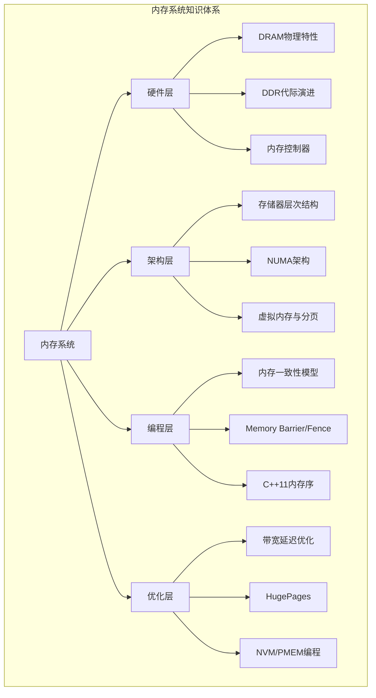

## 核心问题

| 编号 | 核心问题 | 对应小节 |
|------|----------|----------|
| Q1 | 存储器层次结构如何组织？各层级的延迟和容量差距有多大？ | §1 |
| Q2 | DRAM为什么需要刷新？行缓冲（Row Buffer）如何影响访问延迟？ | §2 |
| Q3 | DDR3/DDR4/DDR5的时序参数如何影响实际带宽？ | §3 |
| Q4 | 内存控制器的调度算法如何优化访问模式？ | §4 |
| Q5 | 虚拟内存如何实现地址翻译？TLB和大页如何影响性能？ | §5 |
| Q6 | NUMA架构下如何避免远程内存访问的性能惩罚？ | §6 |
| Q7 | TSO/PSO/RMO等内存模型对并发编程有何影响？ | §8 |
| Q8 | 非易失性内存（NVM/PMEM）带来什么编程模型变革？ | §9 |
| Q9 | CXL如何突破传统DDR通道数限制，实现内存池化？ | §10 |

## 学习路径


1. **术**：掌握DDR时序参数含义，能计算理论带宽，会使用numactl/membind，能配置HugePages，会用perf c2c检测False Sharing
2. **法**：理解内存模型对并发正确性的影响，掌握Fence指令的使用时机，能诊断NUMA性能问题，掌握内存性能分析工具链
3. **道**：领悟"带宽vs延迟"的永恒权衡，理解"一致性vs可扩展性"的张力，认识"层次化"是计算机系统设计的核心哲学，理解CXL如何打破传统内存架构的限制

## 前置知识

- 第01章：缓存层次与一致性基础
- 数字电路基础（电容、晶体管概念）
- 并发编程基础（互斥锁、原子操作概念）
- Linux基本操作（/proc文件系统、性能工具）

## 参考文献

- Jacob, B. et al. *Memory Systems: Cache, DRAM, Disk*. Morgan Kaufmann, 2007.
- Hennessy & Patterson, *Computer Architecture: A Quantitative Approach*, Ch.2 (Memory Hierarchy Design)
- Bovet & Cesati, *Understanding the Linux Kernel*, Ch.2 (Memory Addressing)
- Intel, *Intel 64 and IA-32 Architectures Software Developer's Manual*, Vol.3A (Memory Ordering)
- Mutlu, O. & Kim, J.S. "Processing Using Memory." IEEE Micro, 2019.
- Adve, S.V. & Gharachorloo, K. "Shared Memory Consistency Models: A Tutorial." IEEE Computer, 1996.

---

# 理论基础

## 1. 存储器层次结构

### 1.1 层次结构全景

计算机存储系统按速度和容量组织为层次结构，每一层都是上一层的缓存。这种分层设计源于一个基本物理事实：**没有任何单一存储技术能同时满足速度、容量和成本三个维度的需求**。

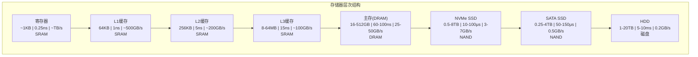

各层级的关键参数对比：

| 层级 | 典型容量 | 访问延迟 | 带宽 | 技术 | 每GB成本 |
|------|----------|----------|------|------|----------|
| 寄存器 | ~1KB | 0.25ns | ~TB/s | SRAM | — |
| L1缓存 | 32-64KB | 1ns | ~500GB/s | SRAM | — |
| L2缓存 | 256KB-1MB | 5ns | ~200GB/s | SRAM | — |
| L3缓存 | 8-64MB | 15ns | ~100GB/s | SRAM | — |
| 主存(DRAM) | 16-512GB | 60-100ns | 25-50GB/s | DRAM | ~$2/GB |
| NVMe SSD | 0.5-8TB | 10-100μs | 3-7GB/s | NAND | ~$0.1/GB |
| SATA SSD | 0.25-4TB | 50-150μs | 0.5GB/s | NAND | ~$0.05/GB |
| HDD | 1-20TB | 5-10ms | 0.2GB/s | 磁盘 | ~$0.02/GB |

**延迟层次差距**（每一级之间的倍数关系）：

寄存器→L1:    4倍     ← CPU设计者精心优化
L1→L2:        5倍     ← 容量换速度
L2→L3:        3倍     ← 多核共享的折中
L3→主存:      4-6倍   ← 跨越片上/片外的鸿沟
主存→SSD:     100-1000倍 ← 电子 vs 闪存的本质差异
SSD→HDD:      100倍   ← 固态 vs 机械的物理限制

一个直观的类比：如果L1缓存访问是1秒（翻桌上的书），那么主存访问就是1分钟（走到书架取书），SSD是2小时（开车去图书馆），HDD是一整天（从另一个城市寄书）。

### 1.2 为什么需要层次结构

**速度差距的本质**：SRAM（寄存器/缓存）使用6个晶体管存储1位，速度快但面积大、功耗高。DRAM使用1个晶体管+1个电容存储1位，密度高但速度慢。物理定律决定了无法用一种技术同时满足速度和容量需求。

**成本差距的本质**：SRAM的面积效率约为1Mbit/mm²，DRAM约为100Mbit/mm²。这意味着同样面积下，DRAM的存储密度是SRAM的100倍。反映到成本上，SRAM约为$10,000/GB，DRAM约为$2/GB——差距达5000倍。

**层次结构的设计哲学**：利用程序的局部性（Locality）原理，将小容量的快速存储作为大容量慢速存储的缓存。只要大多数访问都能命中快速层，系统的平均访问速度就接近最快层。

### 1.3 局部性原理的深入理解

局部性原理是层次结构有效性的理论基础，分为两种类型：

**时间局部性（Temporal Locality）**：最近访问的数据很可能再次被访问。
- 典型场景：循环变量、热点数据结构、频繁调用的函数代码
- 硬件支持：LRU/LRU近似替换策略，保留最近使用的行
- 量化指标：重用距离（Reuse Distance）——两次访问同一地址之间访问了多少不同地址

**空间局部性（Spatial Locality）**：访问某个地址后，相邻地址很可能被访问。
- 典型场景：数组遍历、结构体顺序访问、指令顺序执行
- 硬件支持：Cache Line（通常64字节）——一次加载一整行，而非单个字节
- 量化指标：步长（Stride）——连续访问之间的地址间隔

**利用局部性优化代码的原则**：

```cpp
// 反面教材：列优先遍历（空间局部性差）
for (int j = 0; j < N; j++)
    for (int i = 0; i < N; i++)
        sum += matrix[i][j];  // 每次跳过一整行，cache miss严重

// 正面教材：行优先遍历（空间局部性好）
for (int i = 0; i < N; i++)
    for (int j = 0; j < N; j++)
        sum += matrix[i][j];  // 连续访问，一次cache line加载多个元素

// 性能差异：N=4096时，列优先比行优先慢10-50倍
```

**预取（Prefetching）**：硬件和软件都可以利用空间局部性提前加载数据到缓存。现代CPU的硬件预取器能检测顺序访问和步长访问模式，自动预取后续cache line。软件预取（`__builtin_prefetch`）可以处理硬件预取器无法识别的复杂访问模式。

## 2. DRAM工作原理

### 2.1 基本结构：1T1C

DRAM（Dynamic Random Access Memory）的核心存储单元由**1个晶体管（Transistor）+ 1个电容（Capacitor）**组成：

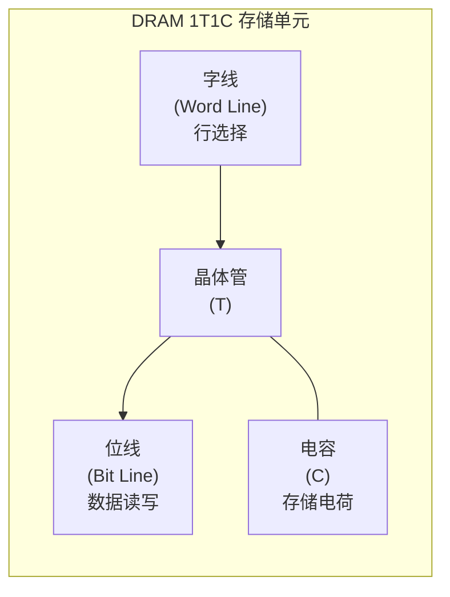

- **写入**：激活字线（Word Line），晶体管导通，位线（Bit Line）上的电压对电容充电
- **读取**：激活字线，电容电荷通过晶体管释放到位线，Sense Amplifier检测微小电压变化
- **存储**：电容充满电荷表示"1"，放电表示"0"

**为什么叫"动态"**：电容会通过晶体管的漏电流缓慢泄漏电荷（典型值：每64ms泄漏约50%）。因此必须定期刷新（Refresh）——读取每个单元并重新写入，否则数据会丢失。这就是DRAM（Dynamic RAM）名称的由来，区别于不需要刷新的SRAM（Static RAM）。

### 2.2 DRAM芯片层次结构

一颗DRAM芯片内部以及从CPU到数据的完整路径：

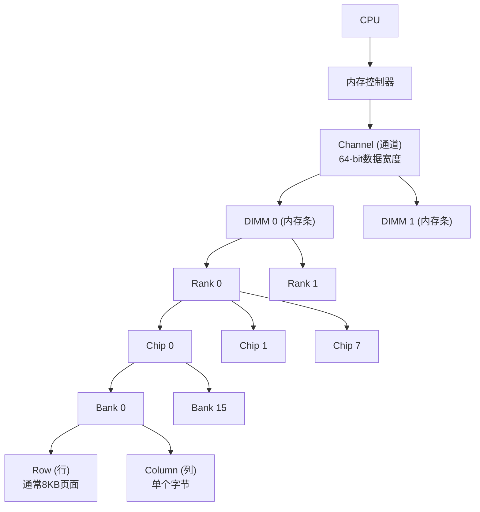

现代DDR4-3200 DIMM典型配置：

| 层级 | 数量 | 规格 | 说明 |
|------|------|------|------|
| Channel | 1 | 64-bit宽 | 一个DIMM占一个通道 |
| Rank | 2 | 每Rank 8芯片 | 两个Rank共享数据线，交替访问 |
| Bank | 16/芯片 | 4个Bank Group × 4 Bank | 独立的二维存储阵列 |
| Row | 16,384/Bank | 8KB页面 | 1024列 × 8bit |
| Column | 1,024/Bank | 8bit | 单个字节 |

**容量计算**：
总容量 = Rank数 × 芯片数/Rank × Bank数/芯片 × 行数 × 列数 × 位宽
       = 2 × 8 × 16 × 16384 × 1024 × 8bit
       = 8GB (单条DDR4-3200)

### 2.3 DRAM访问过程

一次完整的DRAM读操作分为三个阶段，每个阶段都有严格的时间约束：

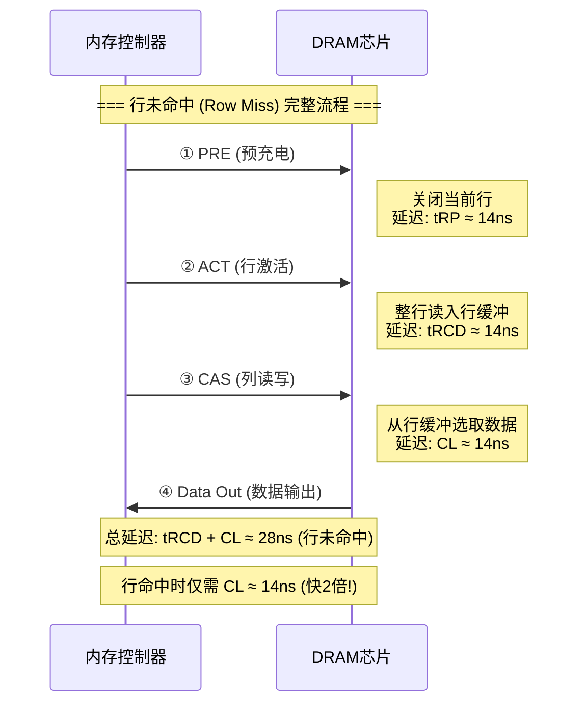

各时序参数的精确含义：

tRCD (RAS to CAS Delay): 14ns
  → 行激活(ACT)到列访问(CAS)的最小间隔
  → 等价于：行缓冲区完成数据加载所需的时间

CL (CAS Latency): 14ns  
  → 列访问命令发出到数据输出的延迟
  → 这是用户最常看到的"内存延迟"指标

tRP (Row Precharge Time): 14ns
  → 预充电(PRE)持续时间
  → 关闭当前行、为下一次激活做准备的时间

tRAS (Row Active Time): 33ns
  → 行保持激活状态的最小时间
  → 行激活后至少保持这么长时间才能预充电

tRC (Row Cycle Time): 47ns (= tRAS + tRP)
  → 同一Bank两次行激活的最小间隔
  → 决定了一个Bank的最高访问频率

**三种访问模式的延迟对比**：

| 访问模式 | 操作序列 | 延迟 | 说明 |
|----------|----------|------|------|
| Row Hit（行命中） | CAS → Data | ~14ns | 行已在缓冲中，最快 |
| Row Empty（行空） | ACT → CAS → Data | ~28ns | 缓冲为空，需激活 |
| Row Miss（行未命中） | PRE → ACT → CAS → Data | ~42ns | 需先关闭旧行再激活新行，最慢 |

**性能影响**：Row Miss比Row Hit慢3倍。在高负载场景下，如果大量请求都命中不同的行，实际延迟可能远超标称的CAS延迟。这就是为什么内存访问模式对性能如此重要。

### 2.4 Bank架构与并行

每个Bank有独立的行缓冲和控制逻辑，不同Bank可以并行操作——这称为**Bank级并行（Bank-Level Parallelism, BLP）**：

时间 →

Bank 0: [ACT Row5]──[CAS]──[CAS]──[PRE]───────────────
Bank 1: ────[ACT Row3]──[CAS]──[PRE]───────────────────
Bank 2: ──────────[ACT Row1]──[CAS]──[CAS]──[PRE]──────
Bank 3: ──────────────[ACT Row7]──[CAS]──[PRE]─────────
         ↑ 各Bank独立操作, 有效带宽提升接近Bank数倍

**Bank Group架构**（DDR4引入）：DDR4将16个Bank分为4个Bank Group（每组4个Bank）。同一Bank Group内的Bank共享部分资源（如数据总线），而不同Bank Group的Bank可以完全并行。DDR5进一步扩展到8个Bank Group × 4 Bank = 32 Bank。

**Bank级并行的实际意义**：一个DDR4-3200通道有16个Bank，理论最大并行度为16。如果所有Bank都在活跃操作，有效带宽可以接近理论峰值。但在实践中，由于刷新（Refresh）操作会短暂阻塞所有Bank，实际并行度通常为8-12。

### 2.5 刷新机制详解

DRAM刷新是维持数据完整性的必要操作，但也是性能损失的主要来源之一：

刷新机制:
  1. 全行刷新: 每64ms必须刷新所有行
  2. 每次刷新一行: 一个Bank一次只刷新一行
  3. 刷新优先级最高: 刷新期间所有访问必须等待

刷新开销计算 (DDR4-3200):
  每个Bank有16384行
  刷新间隔: 64ms
  每次刷新耗时: ~7.8μs (tRFC)
  刷新占总时间: 7.8μs / 64ms ≈ 12%
  
  → 刷新导致约12%的带宽损失!

**刷新对性能的影响**：
- **带宽损失**：约10-15%的理论带宽被刷新操作占用
- **延迟抖动**：刷新期间的请求可能额外增加7-8μs延迟
- **尾延迟恶化**：P99/P999延迟中，刷新是主要贡献者
- **Row Refresh Conflict**：如果刷新的行恰好是某Bank的当前行缓冲行，该Bank在刷新期间完全不可用

**减少刷新影响的技术**：
- **Per-Bank Refresh**：DDR4支持按Bank刷新而非全芯片刷新，减少阻塞时间
- **Temperature-Compensated Refresh**：高温时增加刷新频率，低温时减少
- **Refresh Management**：内存控制器可以将刷新安排在空闲期执行

## 3. DDR演进

### 3.1 DDR3 vs DDR4 vs DDR5

DDR（Double Data Rate）内存的核心创新是在时钟的上升沿和下降沿都传输数据，有效数据速率是时钟频率的两倍。

| 特性 | DDR3 | DDR4 | DDR5 |
|------|------|------|------|
| 电压 | 1.5V | 1.2V | 1.1V |
| 数据速率 | 800-2133 MT/s | 1600-3200 MT/s | 3200-6400 MT/s |
| 预取宽度 | 8n | 8n | 16n |
| Bank数 | 8 | 16 (4 BG) | 32 (8 BG) |
| 突发长度 | BL8 | BL8 | BL16 |
| 单条最大容量 | 8GB | 32GB | 64GB |
| 通道宽度 | 64-bit | 64-bit | 2×32-bit |
| 典型CL | 9-11 | 14-22 | 22-40 |
| ECC | 可选 | 可选 | On-die ECC |

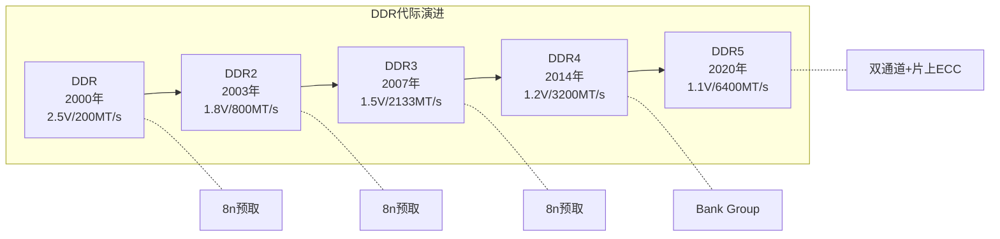

### 3.2 时序参数详解

DDR内存的性能不仅由频率决定，时序参数同样关键。理解时序参数是内存超频和性能调优的基础。

**核心时序参数**（以DDR4-3200 CL22为例）：

CL (CAS Latency): 22周期
  → 列访问延迟，从发出CAS命令到数据输出
  → 物理含义：数据从DRAM阵列经过Sense Amplifier、数据总线到达输出引脚的时间

tRCD (RAS to CAS Delay): 22周期
  → 行激活到列访问的最小间隔
  → 物理含义：行数据从DRAM阵列加载到Sense Amplifier所需的时间

tRP (Row Precharge): 22周期
  → 预充电持续时间
  → 物理含义：关闭当前行、恢复位线电平所需的时间

tRAS (Row Active Time): 52周期
  → 行保持激活状态的最小时间
  → 物理含义：电容电荷完全稳定并可被Sense Amplifier可靠检测的时间

tRC (Row Cycle Time): 74周期 (= tRAS + tRP)
  → 同一Bank两次行激活的最小间隔
  → 物理含义：完成一次完整的行访问周期所需时间

**实际延迟计算**（DDR4-3200, 时钟频率1600MHz, 周期0.625ns）：

Row Hit延迟:  CL × 0.625ns = 22 × 0.625ns = 13.75ns
Row Miss延迟: (tRCD + CL) × 0.625ns = 44 × 0.625ns = 27.5ns
Row Empty延迟: (tRP + tRCD + CL) × 0.625ns = 66 × 0.625ns = 41.25ns

### 3.3 时序与频率的权衡

高频低延迟 vs 低频高延迟的实际延迟对比：

DDR4-3200 CL22: 22/1600MHz = 13.75ns (高频标准)
DDR4-2666 CL19: 19/1333MHz = 14.25ns (中频)
DDR4-2400 CL17: 17/1200MHz = 14.17ns (低频)

→ 虽然频率差异很大(3200 vs 2400, 差33%)
→ 但实际延迟差异很小(13.75ns vs 14.17ns, 差3%)
→ 高频内存的优势主要体现在带宽而非延迟
→ 对延迟敏感的应用, 关注CL/frequency比值而非单纯频率

**选购建议**：
- **带宽敏感场景**（视频编辑、科学计算）：选择高频内存，优先提升MT/s
- **延迟敏感场景**（数据库、交易系统）：选择低CL内存，关注绝对延迟
- **性价比最优**：DDR4-3200 CL16/CL18是目前甜点区

### 3.4 DDR5深度解析

DDR5相比DDR4有三项关键架构改进：

**双通道设计**：一个DDR5 DIMM内部包含两个独立的32-bit子通道（而非DDR4的单个64-bit通道）。每个子通道有独立的命令/地址总线和数据总线。这降低了访问粒度——即使只需读取一个cache line，也只需激活一个32-bit子通道，减少总线占用。

**On-die ECC**：DDR5在芯片内部集成ECC校验，每个芯片可以纠正单bit错误。注意这是**芯片级**ECC，不是**系统级**ECC——系统级ECC仍需额外的ECC DIMM。On-die ECC主要提高芯片良率和可靠性，对操作系统透明。

**Bank Group扩展**：DDR5将Bank Group从4个扩展到8个，每个Group 4个Bank，总共32个Bank。更多Bank意味着更高的Bank级并行度和更好的Row Hit率。

## 4. 内存控制器

### 4.1 内存控制器架构

现代CPU将内存控制器集成在芯片上（曾是北桥的功能），直接连接DDR通道。内存控制器是CPU与DRAM之间的智能调度中枢：

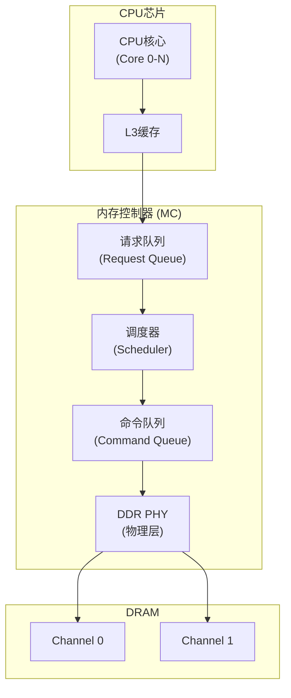

内存控制器的核心职责：
- **维护Bank状态**：跟踪每个Bank的当前行缓冲内容、空闲/忙碌状态
- **请求调度**：决定下一个发出的DRAM命令（ACT/PRE/CAS）
- **刷新管理**：安排定期刷新操作，最小化对正常访问的干扰
- **ECC处理**：检测和纠正内存错误（ECC模式下）
- **电源管理**：在空闲时将DRAM置于低功耗状态（Self-Refresh）

### 4.2 FR-FCFS调度算法

**FR-FCFS（First-Ready, First-Come-First-Served）**是现代内存控制器最常用的调度策略。它的核心思想是：**优先服务能立即执行的请求（Ready），相同就绪状态下按到达顺序服务（FCFS）**。

优先级规则:
  1. Row Hit 优先于 Row Miss/Empty (最大化行缓冲利用率)
  2. 同优先级按到达顺序 (FCFS, 保证基本公平性)

调度过程示例:
  请求队列: [R1:Bank0-Row5(命中), R2:Bank1-Row3(未命中), R3:Bank0-Row5(命中), R4:Bank2-Row1(空)]
  
  排序后:   [R1:Bank0-Row5, R3:Bank0-Row5, R4:Bank2-Row1, R2:Bank1-Row3]
             ↑ 行命中优先    ↑ 行命中      ↑ 行空         ↑ 行未命中(最低优先)

FR-FCFS的优点:
  → 简单高效, 硬件开销小
  → 自然最大化Row Hit率
  → 在低负载下表现良好

FR-FCFS的缺点:
  → 优先服务行命中可能导致行未命中的请求饥饿
  → 高负载下延迟抖动大(P99延迟可能数倍于平均延迟)
  → 对公平性考虑不足

### 4.3 高级调度技术

**请求重排序（Request Reordering）**：通过重新排序请求来提高Row Hit率。例如，将同一Row的请求集中处理，减少行切换次数：

原始请求序列: [Bank0-Row5, Bank0-Row3, Bank0-Row5, Bank0-Row7]
Bank0当前行: Row5

重排后:       [Bank0-Row5, Bank0-Row5, Bank0-Row3, Bank0-Row7]
              ↑ 命中       ↑ 命中     ↑ 未命中     ↑ 未命中
              
→ 重排后减少了1次行切换(从3次降到2次), 延迟降低约14ns

**并行调度（Parallel Scheduling）**：不同Bank的请求可以并行发出，充分利用Bank级并行：

Bank0: ACT(Row5) → CAS → CAS → PRE ──────────────
Bank1: ──ACT(Row3) → CAS → PRE ──────────────────
Bank2: ──────ACT(Row1) → CAS → CAS → PRE ──────
Bank3: ────────────ACT(Row7) → CAS → PRE ──────

→ 4个Bank流水线操作, 有效带宽提升接近4倍

**写合并（Write Merging）**：将多个小的写请求合并为一个大的突发写入，减少DRAM命令开销。写合并在写缓冲（Write Buffer）中实现，是提高写带宽的关键技术。

**刷新调度优化**：将刷新操作安排在Bank空闲期间执行，减少对正常访问的干扰。高级内存控制器支持Per-Bank Refresh，只刷新需要刷新的Bank，而非所有Bank同时刷新。

## 5. 虚拟内存与分页

### 5.1 地址翻译

虚拟内存是操作系统提供的抽象层，让每个进程拥有独立的、连续的地址空间。CPU发出的是虚拟地址（Virtual Address），必须经过地址翻译转换为物理地址（Physical Address）才能访问DRAM。

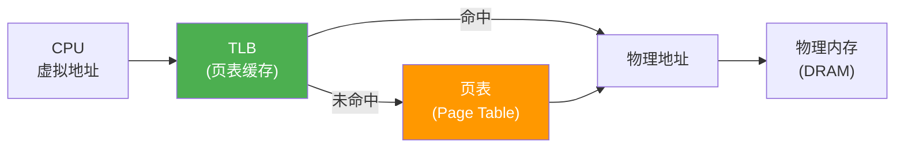

**x86-64的四级页表**：

虚拟地址 (48位有效):
┌─────────┬─────────┬─────────┬─────────┬────────────┐
│ PML4 (9)│ PDP (9) │ PD (9)  │ PT (9)  │ Offset(12) │
└────┬────┴────┬────┴────┬────┴────┬────┴─────┬──────┘
     │         │         │         │          │
     ↓         ↓         ↓         ↓          ↓
  PML4E → PDPTE → PDE → PTE → 物理页帧 + 页内偏移

每一级页表项(PTE)包含:
  → 物理页帧号(PFN): 40位, 指向下一级或最终物理页
  → Present位: 是否在物理内存中
  → Read/Write位: 读写权限
  → User/Supervisor位: 用户/内核权限
  → Accessed/Dirty位: 访问/修改标记
  → NX(No Execute)位: 禁止执行

**地址翻译的开销**：四级页表需要4次内存访问才能完成一次地址翻译——这太慢了。解决方案是TLB（Translation Lookaside Buffer）。

### 5.2 TLB：地址翻译加速器

TLB是页表的缓存，存储最近使用的虚拟页→物理页帧映射。TLB命中时，地址翻译只需1个时钟周期（约0.3ns），与L1缓存访问相当。

TLB典型配置 (Intel Skylake):
  L1 iTLB: 128 entries, 4-way (指令)
  L1 dTLB: 64 entries, 4-way (数据)
  L2 STLB: 1536 entries, 12-way (统一)
  
TLB覆盖范围:
  L1 dTLB: 64 entries × 4KB = 256KB
  L2 STLB: 1536 entries × 4KB = 6MB
  → 64GB内存中, TLB只覆盖0.01%!
  → TLB未命中时需走页表, 延迟40-100ns

**TLB未命中（TLB Miss）的代价**：
- **L1 TLB Miss**：查L2 TLB，约5-10个时钟周期
- **L2 TLB Miss**：走页表（Page Table Walk），4次内存访问，约200-400个时钟周期
- **Page Fault**：页面不在物理内存中，需要从磁盘加载，约10ms（百万倍于TLB命中）

### 5.3 大页（HugePages）

大页通过增大页面大小来扩大TLB的覆盖范围。Linux支持两种大页：

| 页面大小 | TLB覆盖(64 entries) | 适用场景 |
|----------|---------------------|----------|
| 4KB（标准页） | 256KB | 通用 |
| 2MB（HugePage） | 128MB | 数据库、JVM大堆 |
| 1GB（Gigantic Page） | 64GB | 超大内存应用 |

```bash
# 配置2MB大页
# 计算所需数量: 64GB应用 / 2MB = 32768个
echo 32768 | sudo tee /proc/sys/vm/nr_hugepages

# 验证配置
grep Huge /proc/meminfo
# HugePages_Total:   32768
# HugePages_Free:    32768
# HugePages_Rsvd:    0
# Hugepagesize:       2048 kB

# Java使用大页
java -XX:+UseLargePages -XX:LargePageSizeInBytes=2m -jar app.jar

# Redis使用大页
echo madvise > /sys/kernel/mm/transparent_hugepage/enabled
```

**透明大页（THP, Transparent HugePages）**：Linux自动将连续的4KB页面合并为2MB大页。THP对应用透明，但合并操作（khugepaged线程）可能导致延迟抖动。Redis、MongoDB等对延迟敏感的应用通常建议禁用THP。

### 5.4 Linux内存分配机制

Linux内核使用多种分配器管理物理内存：

应用调用 malloc(size):
  ↓
glibc malloc → brk() 或 mmap()
  ↓
内核 → 缺页中断(Page Fault)
  ↓
伙伴系统(Buddy System) → 分配物理页帧
  ↓
Slab分配器 → 小对象(内核数据结构)
  ↓
页表更新 → 建立虚拟→物理映射

分配路径:
  小对象(< 128KB): brk() → 堆扩展
  大对象(> 128KB): mmap() → 独立映射区域
  巨大对象(> MAP_THRESHOLD): mmap() + MAP_ANONYMOUS

**延迟分配（Lazy Allocation）**：`malloc(1GB)`后，Linux只分配虚拟地址空间，不立即分配物理页。只有当程序首次写入某页面时，才触发缺页中断并分配物理页。这意味着：

```c
char *buf = malloc(1024 * 1024 * 1024);  // 分配1GB
// 此时 VmRSS ≈ 0, 只有虚拟地址空间被分配

memset(buf, 0, 1024 * 1024 * 1024);      // 写入1GB
// 此时 VmRSS ≈ 1GB, 物理页才真正被分配

// 可以用 mmap + MAP_POPULATE 预分配物理页
void *ptr = mmap(NULL, size, PROT_READ|PROT_WRITE,
                 MAP_PRIVATE|MAP_ANONYMOUS|MAP_POPULATE, -1, 0);
// MAP_POPULATE: 预填充页表, 触发所有缺页中断
```

## 6. NUMA架构

### 6.1 NUMA基本概念

NUMA（Non-Uniform Memory Access）是多socket服务器的内存架构。在传统UMA（Uniform Memory Access）架构中，所有CPU访问所有内存的延迟相同。但在多socket系统中，每个CPU socket有本地内存，访问本地内存快，访问远程socket内存慢。

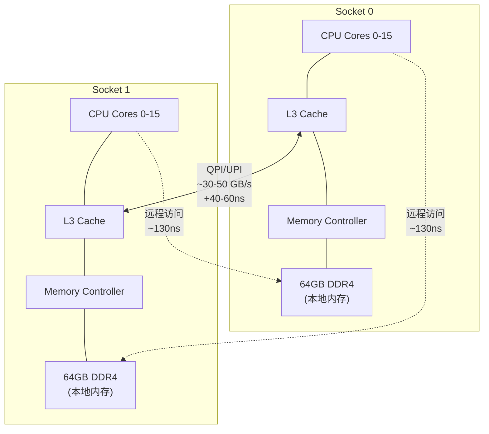

**性能差异的量化**：

| 访问类型 | 延迟 | 带宽 | 说明 |
|----------|------|------|------|
| 本地访问 | ~80ns | ~80GB/s | CPU访问自己节点的内存 |
| 一跳远程 | ~130ns | ~52GB/s | 跨QPI/UPI互连，延迟+60% |
| 两跳远程 | ~180ns | ~35GB/s | 4路服务器，经过中间节点 |

### 6.2 NUMA距离矩阵

Linux通过`numactl --hardware`显示NUMA距离矩阵：

```bash
$ numactl --hardware
available: 4 nodes (0-3)
node 0 cpus: 0 1 2 3 4 5 6 7 8 9 10 11 12 13 14 15
node 0 size: 65536 MB
node 0 free: 40960 MB
...
node distances:
node   0   1   2   3
  0:  10  21  31  21
  1:  21  10  21  31
  2:  31  21  10  21
  3:  21  31  21  10
```

距离矩阵解读：
- **10** = 本地访问（基准延迟，定义为1.0倍）
- **21** = 一跳远程访问（约2.1倍延迟）
- **31** = 两跳远程访问（约3.1倍延迟）

### 6.3 NUMA-aware编程原则

**原则1：线程-数据亲和性**

线程在哪个socket上运行, 就在哪个socket的本地内存分配数据
→ 减少远程内存访问

反面教材:
  Socket 0的线程访问Socket 1的内存
  → 每次访问多60ns, 吞吐量下降30-40%

正面教材:
  Socket 0的线程只访问Socket 0的内存
  → 所有访问都是本地, 延迟最低

**原则2：First-Touch策略**

Linux在第一次写入页面时，在当前CPU的本地节点分配物理页。利用这个特性，可以通过并行初始化实现自动NUMA分配：

```cpp
// 并行初始化利用First-Touch
#pragma omp parallel for
for (int i = 0; i < N; i++) {
    array[i] = 0;  // 第一次写入, 在当前CPU的本地节点分配
}
// 结果: 每个OpenMP线程初始化的数据都在其本地节点
// Socket 0的线程初始化的数据在Node 0
// Socket 1的线程初始化的数据在Node 1
```

**原则3：交错分配（Interleaved Allocation）**

对于所有线程都需要访问的共享数据，在所有NUMA节点间均匀分配，避免热点节点：

```cpp
#include <numa.h>
#include <numaif.h>

// 交错分配: 在所有节点间均匀分布
void* interleaved_alloc(size_t size) {
    void* ptr = mmap(NULL, size, PROT_READ | PROT_WRITE,
                     MAP_PRIVATE | MAP_ANONYMOUS, -1, 0);
    struct bitmask* all_nodes = numa_allocate_nodemask();
    numa_bitmask_setall(all_nodes);
    mbind(ptr, size, MPOL_INTERLEAVE, all_nodes->maskp,
          all_nodes->size + 1, 0);
    numa_free_nodemask(all_nodes);
    return ptr;
}

// 本地分配: 在当前CPU的本地节点分配
void* local_alloc(size_t size) {
    int node = numa_node_of_cpu(sched_getcpu());
    return numa_alloc_onnode(size, node);
}
```

### 6.4 NUMA诊断工具

```bash
# 1. 查看NUMA拓扑
numactl --hardware

# 2. 查看进程的NUMA内存分布
numastat -p $(pgrep mysqld)
# numa_hit:  本地访问次数
# numa_miss: 远程访问次数 (越低越好)
# numa_foreign: 其他节点分配给本节点的内存

# 3. 绑定进程到特定NUMA节点
numactl --cpunodebind=0 --membind=0 ./my-app

# 4. 交错分配启动
numactl --interleave=all ./my-app

# 5. 查看NUMA内存使用
numastat

# 6. 监控NUMA命中率
watch -n 1 'numastat -p $(pgrep myapp) | grep -A2 numa'
```

## 7. 内存带宽与延迟

### 7.1 带宽vs延迟的本质权衡

**延迟（Latency）**：单次内存访问从发出请求到收到数据的等待时间。单位：纳秒（ns）。

**带宽（Bandwidth）**：单位时间内能传输的数据总量。单位：GB/s。

两者的关系：

带宽 = 并发度 × 数据宽度 / 延迟

提高带宽的方法:
  1. 增加并发度 → 更多Bank, 更多通道, 更多Rank
  2. 增加数据宽度 → DDR5将64-bit拆为2×32-bit
  3. 降低延迟 → 更高的频率, 更紧的时序

但降低延迟和提高带宽往往互相矛盾:
  → 提高频率增加带宽, 但更高的流水线深度可能增加延迟
  → 增加Bank减少冲突, 但更多Bank意味着更大的芯片面积
  → 增加通道数提高带宽, 但增加了布线复杂度和成本

### 7.2 理论带宽计算

理论带宽 = 数据速率(MT/s) × 通道宽度(bit) × 通道数 / 8

DDR4-3200 双通道:
  = 3200 MT/s × 64-bit × 2 / 8
  = 51.2 GB/s

DDR5-6400 双通道:
  = 6400 MT/s × 32-bit × 4 / 8  (每DIMM 2个子通道, 双通道共4个)
  = 102.4 GB/s

实际有效带宽 (考虑效率):
  读带宽 ≈ 理论值 × 0.70-0.85
  写带宽 ≈ 理论值 × 0.60-0.75
  读写混合 ≈ 理论值 × 0.50-0.65

影响有效带宽的因素:
  1. Row Hit率 (越高越好)
  2. Bank并行度 (越高越好)
  3. 请求突发长度 (越长越好)
  4. 刷新周期 (每7.8μs暂停访问)
  5. 命令总线开销 (ACT/PRE命令占用周期)
  6. 写缓冲满 (写请求被阻塞)

### 7.3 内存带宽测试

```bash
# 方法1: Intel MLC (Memory Latency Checker)
# 带宽测试
mlc --bandwidth_matrix

# 延迟测试
mlc --latency_matrix

# 典型输出 (2路Xeon):
#        Numa node
# Numa node     0      1
#        0   78.2   52.3   (GB/s)
#        1   51.8   79.1   (GB/s)
#
# 本地带宽: ~79 GB/s
# 远程带宽: ~52 GB/s (65% of local)

# 方法2: STREAM基准测试
# 测量可持续内存带宽
gcc -O2 -o stream stream.c -fopenmp
OMP_NUM_THREADS=4 ./stream

# 典型输出:
# Copy:      45.2 GB/s
# Scale:     44.8 GB/s
# Add:       48.1 GB/s
# Triad:     48.5 GB/s  ← 最能代表实际应用的指标

# 方法3: 简单的带宽估算
# 使用dd测试内存带宽
dd if=/dev/zero of=/dev/null bs=1M count=10000
# 注意: 这个方法不精确, 仅做粗略估算
```

## 8. 一致性与顺序

### 8.1 内存一致性模型

内存一致性模型（Memory Consistency Model）定义了多核处理器对内存操作的可见性顺序。这是并发编程中最难理解但最关键的概念之一。

**顺序一致性（Sequential Consistency, SC）**：

所有处理器看到的所有内存操作有全局顺序，且每个处理器内的操作保持程序顺序。这是最强的保证，但硬件实现开销最大——因为它禁止几乎所有重排序优化。

**总存储排序（Total Store Order, TSO）**：

x86采用的模型。核心特点是：Store操作先进入Store Buffer（FIFO队列），导致后续的Load可能在Store到达内存之前执行。即只允许Store→Load重排序。

TSO允许的重排序:
  Store → Load  (允许, 因为Store Buffer)
  Store → Store (禁止)
  Load  → Load  (禁止)
  Load  → Store (禁止)

TSO的Store缓冲机制:
  Core 0:                 Core 1:
  MOV [X], 1     → SB    MOV R1, [Y]
  MOV R2, [Y]    → MEM   MOV R2, [X]
  
  SB = Store Buffer (写入缓冲, FIFO)
  Core 0的Store [X]=1先进入SB, 但Core 1可能还未看到
  → 如果Core 1同时执行MOV R2,[X], 可能读到旧值

**部分存储排序（Partial Store Order, PSO）**：SPARC采用的模型。在TSO基础上进一步允许Store→Store重排序。这在写入非连续地址时可能发生——后写的Store可能先到达内存。

**弱排序（Relaxed Memory Order, RMO）**：ARM/RISC-V采用的模型。允许所有类型的重排序（Load→Load、Load→Store、Store→Store、Store→Load），需要程序员显式使用Fence指令保证顺序。

内存模型强度对比:
  SC > TSO > PSO > RMO
  (强)                    (弱)

越弱的模型:
  → 硬件优化空间越大 (性能更好)
  → 程序员负担越重 (需要更多Fence)
  
现代CPU的实际选择:
  x86/x64:  TSO (足够强, 大多数代码无需Fence)
  ARMv8:    RMO + Acquire/Release语义
  RISC-V:   RVWMO (类似ARM的弱排序)

### 8.2 TSO模型详解

x86的TSO模型是实际系统中最重要的内存模型。它的关键特性是：**大多数x86代码无需Memory Barrier**，因为TSO足够强——只有Store→Load重排序可能发生。

TSO下的典型竞态条件:

  Core 0:                    Core 1:
  MOV [flag], 1    (Store)  MOV R1, [flag]   (Load)
  MOV [data], 42   (Store)  MOV R2, [data]   (Load)
  
  问题: Core 1可能看到 flag=1 但 data=0
  原因: Core 0的两个Store在Store Buffer中,
        Core 1可能先看到 [flag]=1 的Store到达内存,
        而 [data]=42 的Store还在Store Buffer中

  修复: 在Store [flag]之前插入MFENCE
  MOV [data], 42
  MFENCE               ← 确保[data]的Store在[flag]之前到达内存
  MOV [flag], 1

### 8.3 Memory Barrier/Fence指令

**x86 Fence指令**：

| 指令 | 语义 | 场景 | 开销 |
|------|------|------|------|
| MFENCE | 全屏障：之前的Load/Store完成后才执行之后的Load/Store | 最强保证 | ~30周期 |
| SFENCE | Store屏障：之前的Store完成后才执行之后的Store | DMA一致性 | ~10周期 |
| LFENCE | Load屏障：之前的Load完成后才执行之后的Load | 推测执行屏障(Spectre) | ~5周期 |
| LOCK前缀 | 原子操作+全屏障 | 锁、原子变量 | ~20周期 |

**ARM Fence指令**：

DMB (Data Memory Barrier):
  DMB ISH     ; 内部共享域全屏障 (最常用)
  DMB ISHST   ; 仅Store屏障
  DMB ISHLD   ; 仅Load屏障
  
  语义: 保证DMB之前的内存访问在DMB之后的内存访问之前完成
  性能: 约10-20周期

DSB (Data Synchronization Barrier):
  DSB ISH     ; 比DMB更强, 等待所有之前的内存访问物理完成
  
  语义: 不仅保证顺序, 还等待所有之前的访问实际完成
  性能: 约50-100周期

ISB (Instruction Synchronization Barrier):
  ISB         ; 刷新流水线, 确保之后的指令使用最新的内存视图
  
  语义: 刷新指令流水线, 类似x86的IRET
  场景: 自修改代码、修改页表后
  性能: 约100+周期

### 8.4 内存模型对并发编程的影响

**C++11内存序**：C++11引入了`std::atomic`和6种内存序（memory order），允许程序员在正确性和性能之间精确选择：

```cpp
std::atomic<int> x, y;

// 1. memory_order_relaxed: 无顺序保证, 仅保证原子性
x.store(1, std::memory_order_relaxed);
// 适用: 计数器、统计量等不需要顺序的场景

// 2. memory_order_acquire: 之后的读写不会被重排到此Load之前
int val = x.load(std::memory_order_acquire);
// 适用: 获取锁、读取共享数据

// 3. memory_order_release: 之前的读写不会被重排到此Store之后
x.store(1, std::memory_order_release);
// 适用: 释放锁、写入共享数据

// 4. memory_order_acq_rel: 同时具有Acquire和Release语义
x.exchange(1, std::memory_order_acq_rel);
// 适用: Read-Modify-Write操作

// 5. memory_order_seq_cst: 最强顺序保证 (默认)
x.store(1, std::memory_order_seq_cst);
// 适用: 需要全局顺序的场景, 但性能开销最大
```

**生产者-消费者模式的正确实现**：

```cpp
// ❌ 错误: 使用relaxed, 在ARM上可能看到data=0
int data = 0;
std::atomic<bool> ready{false};

// 线程A (生产者)
data = 42;
ready.store(true, std::memory_order_relaxed);

// 线程B (消费者)
while (!ready.load(std::memory_order_relaxed)) {}
printf("%d\n", data);  // 可能输出0!

// ✅ 正确: 使用release/acquire
// 线程A (生产者)
data = 42;
ready.store(true, std::memory_order_release);  // 确保data先写入

// 线程B (消费者)
while (!ready.load(std::memory_order_acquire)) {}  // 确保看到data
printf("%d\n", data);  // 保证输出42
```

### 8.5 内存序选择指南

| 场景 | 推荐内存序 | 原因 |
|------|-----------|------|
| 简单计数器（统计） | relaxed | 无需顺序，只要原子性 |
| 获取/释放锁 | acquire/release | 保护临界区的读写顺序 |
| 生产者-消费者 | release/acquire | 确保数据在标志之前可见 |
| 引用计数 | acq_rel | 引用增加和释放都需要顺序 |
| 全局配置切换 | seq_cst | 需要所有线程看到一致的顺序 |
| 无锁数据结构 | 根据操作选择 | CAS用acq_rel，读用acquire |

## 9. 非易失性内存

### 9.1 NVM概述

非易失性内存（Non-Volatile Memory, NVM）是一种新型存储技术，兼具DRAM的字节寻址能力和SSD的数据持久性。Intel Optane DC Persistent Memory（基于3D XPoint技术）是NVM的代表产品。

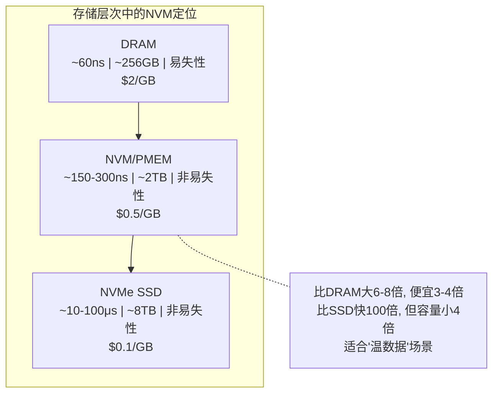

**NVM的定位**：NVM填补了DRAM和SSD之间的空白。它适合"温数据"——比DRAM大但比SSD快的场景。典型应用包括：
- 大规模内存数据库（如SAP HANA）
- 持久化键值存储（如PebbleDB）
- 日志结构存储引擎
- 计算存储（Processing-in-Memory）

### 9.2 PMEM编程模型

Intel Optane PMEM支持两种运行模式：

**Memory Mode（内存模式）**：
- PMEM作为主存，DRAM作为缓存
- 对应用完全透明，无需修改代码
- 缺点：DRAM缓存是易失性的，断电数据在DRAM中丢失（但PMEM中保留）
- 适用场景：需要大内存但不要求持久化的应用

**App Direct Mode（应用直连模式）**：
- PMEM作为独立的持久化内存设备
- 应用直接使用DAX（Direct Access）API访问
- 需要修改代码，但可实现微秒级持久化
- 适用场景：需要持久化且对延迟敏感的应用

```cpp
// App Direct Mode下的持久化编程
#include <libpmem.h>

void* pmem_addr;
size_t mapped_len;
int is_persistent;

// 映射PMEM文件
pmem_addr = pmem_map_file("/mnt/pmem/data.bin", FILE_SIZE,
                           PMEM_FILE_CREATE, 0666,
                           &amp;mapped_len, &amp;is_persistent);

// 写入数据并确保持久化
struct Record* rec = (struct Record*)pmem_addr;
rec->key = 123;
rec->value = 456;

// 持久化: 确保数据写入PMEM (不只是CPU缓存)
pmem_persist(rec, sizeof(struct Record));
// 等价于:
//   pmem_flush(rec, sizeof(struct Record));  // CLWB/CLFLUSH指令
//   pmem_drain();                             // SFENCE指令

// 或使用更高效的事务API (保证崩溃一致性)
PMEMobjpool* pop = pmemobj_open("/mnt/pmem/pool.bin", 
                                 POBJ_LAYOUT_NAME(myapp));
TX_BEGIN(pop) {
    TX_ADD(root);                    // 开始修改
    D_RO(root)->data = new_value;    // 修改数据
} TX_END                            // 自动持久化 + 崩溃一致性
```

### 9.3 NVM的挑战

**性能差异**：
| 操作 | DRAM | NVM | 差距 |
|------|------|-----|------|
| 读延迟 | ~60ns | ~150-300ns | 2-5倍 |
| 写延迟 | ~60ns | ~200-500ns | 3-8倍 |
| 写带宽 | ~25GB/s | ~8GB/s | 3倍 |
| 持久化延迟 | N/A | ~100ns (CLWB) | — |

**持久化顺序保证**：
- **ADR (Asynchronous DRAM Refresh)**：只有Write Pending Queue (WPQ)中的数据在断电时丢失。CPU缓存中的数据会丢失。
- **eADR (Enhanced ADR)**：CPU缓存中的数据也在断电时丢失。需要软件显式flush。

**磨损均衡**：
- NVM有写入次数限制（~10^8次/cell，远高于SSD的~10^3次/cell）
- 但仍需要日志结构或磨损均衡算法来延长寿命
- Intel Optane的写入放大约为2-3x（远优于SSD的5-10x）

## 10. CXL内存互连

### 10.1 CXL概述

CXL（Compute Express Link）是基于PCIe物理层的新一代开放互连标准，旨在解决CPU与内存、加速器之间的带宽和一致性问题。CXL 1.1/2.0/3.0逐步演进，是内存系统架构的重要变革方向。

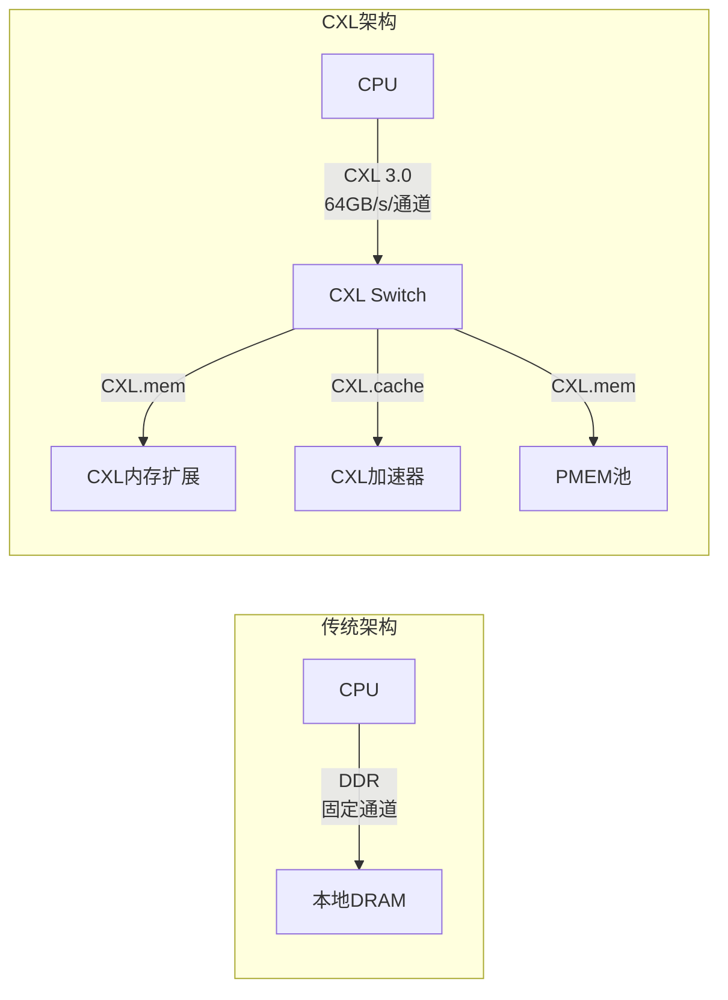

**CXL解决的核心问题**：
- **内存容量墙**：CPU的DDR通道数有限（通常8通道），CXL通过额外内存扩展槽突破容量限制
- **异构一致性**：CXL.cache/CXL.mem协议确保CPU与加速器之间的缓存一致性，无需软件干预
- **内存池化**：CXL 3.0支持多主机共享内存池，提高内存利用率

### 10.2 CXL协议族

| 协议 | 方向 | 用途 | 特点 |
|------|------|------|------|
| CXL.cache | 设备→CPU | 设备缓存CPU内存 | 硬件一致性，对软件透明 |
| CXL.mem | CPU→设备 | CPU访问设备内存 | 低延迟远端内存访问 |
| CXL.io | 双向 | 传统PCIe兼容IO | 向后兼容 |

**CXL延迟特性**：
本地DDR:        ~80ns
CXL附加内存:    ~120-180ns  (比本地DDR慢50-120%)
CXL远端内存:    ~200-300ns  (比本地DDR慢150-275%)

→ CXL内存延迟高于本地DDR, 但远低于NVMe SSD
→ 适合"容量优先, 延迟可接受"的场景

### 10.3 CXL适用场景

- **内存容量扩展**：数据库缓冲池、大规模JVM堆——本地DDR不够时用CXL扩展，而非使用更慢的NVMe
- **异构计算一致性**：GPU/FPGA通过CXL.cache与CPU共享数据，避免显式数据搬运
- **内存池化**：多台服务器共享CXL内存池，按需分配，提高利用率（数据中心级场景）
- **持久化内存替代**：Intel Optane停产后，CXL附加NVM成为持久化内存的新选择

---

# 核心技巧

## 技巧1：DRAM访问模式优化

**原则：最大化Row Hit率，最小化行切换次数**

```c
// 优化前: 随机访问 (Row Miss率高)
for (int i = 0; i < N; i++) {
    int idx = random_access_pattern[i];
    sum += array[idx];  // 每次可能跨行, 延迟~42ns
}

// 优化后: 顺序访问 (Row Hit率高)
for (int i = 0; i < N; i++) {
    sum += array[i];  // 连续访问, 延迟~14ns
}

// 性能差异: 顺序访问比随机访问快2-3倍 (纯内存操作场景)
```

**批量访问**：减少行激活次数，通过突发传输提高效率。

**Bank级并行**：将数据分布在多个Bank上，允许并发访问。例如，将大型数组按Bank数分段，不同线程访问不同段。

## 技巧1.5：False Sharing诊断与修复

**False Sharing（伪共享）** 是多核编程中最隐蔽的性能杀手之一：多个线程频繁修改不同变量，但这些变量恰好位于同一个Cache Line（64字节）中，导致CPU在核间反复无效化和传输整个Cache Line。

```cpp
// ❌ False Sharing: 两个计数器相邻, 共享同一Cache Line
struct BadLayout {
    int64_t counter_a;  // 核心0写
    int64_t counter_b;  // 核心1写
};
// counter_a和counter_b相隔8字节, 在同一64字节Cache Line中
// 核心0每次写counter_a, 都会让核心1的Cache Line失效, 反之亦然
// 性能: ~50ns/次操作 (远超正常缓存命中~4ns)

// ✅ 修复: 填充到独立Cache Line
struct GoodLayout {
    int64_t counter_a;
    char padding_a[56];  // 填充56字节, 确保落在不同Cache Line
    int64_t counter_b;
    char padding_b[56];
};
// 性能: ~4ns/次操作 (正常缓存命中)
```

**检测False Sharing**：
```bash
# 方法1: perf记录cache-line交互
perf c2c record -a -- sleep 5
perf c2c report --stdio

# 输出中的"Shared Data Cache Line Table"显示被多核争用的Cache Line
# HITM (Hit Modified) 列表示跨核无效化次数, 越高说明False Sharing越严重

# 方法2: perf stat统计L1缓存失效
perf stat -e L1-dcache-load-misses,L1-dcache-loads -- ./my-app
# 如果L1 miss率异常高, 且访问模式是顺序的, 可能是False Sharing
```

**现代编译器的优化**：
- GCC 9+：`-fno-strict-aliasing`下，`__attribute__((aligned(64)))`确保变量对齐到Cache Line
- C++17：`alignas(std::hardware_destructive_interference_size)`自动适配Cache Line大小
- Linux内核：`____cacheline_aligned`宏用于关键数据结构

**常见False Sharing场景**：
| 场景 | 原因 | 修复 |
|------|------|------|
| 多线程计数器相邻 | 热变量在同一行 | padding到64字节对齐 |
| 结构体数组按字段遍历 | 每行只用一个字段 | AoS转SoA（结构数组→数组结构） |
| 无锁队列head/tail | 头尾指针相邻 | 分配到不同Cache Line |
| 锁变量与保护数据 | 锁和数据在同一行 | 将锁变量单独对齐 |

## 技巧2：虚拟内存优化

**大页（HugePages）配置**：

```bash
# 1. 计算所需大页数
APP_SIZE_MB=64000  # 应用内存需求
HUGEPAGE_SIZE_MB=2  # 2MB大页
NR_PAGES=$((APP_SIZE_MB / HUGEPAGE_SIZE_MB))

# 2. 分配大页
echo $NR_PAGES | sudo tee /proc/sys/vm/nr_hugepages

# 3. 验证
grep HugePages /proc/meminfo

# 4. 应用使用大页
# Java: -XX:+UseLargePages
# Redis: echo madvise > /sys/kernel/mm/transparent_hugepage/enabled
# MySQL: innodb_use_native_aio=ON + 大页
```

**内存锁定（mlock）**：防止关键数据被换出到swap。

```c
#include <sys/mman.h>
void* ptr = malloc(size);
mlock(ptr, size);        // 锁定到物理内存
// ptr不会被换出, 保证延迟稳定
// 注意: 锁定过多内存可能导致系统OOM
```

## 技巧3：NUMA亲和性配置

```bash
# 方案1: 启动时绑定
numactl --cpunodebind=0 --membind=0 ./my-app

# 方案2: systemd服务配置
# /etc/systemd/system/my-app.service
[Service]
NUMAPolicy=bind
NUMANode=0

# 方案3: 运行时调整 (需要libnuma)
# 见§6.3 NUMA-aware编程代码示例

# 方案4: 交错分配 (适合全内存扫描应用)
numactl --interleave=all ./my-app
```

## 技巧4：内存屏障使用原则

```cpp
// 原则1: 默认用SeqCst, 性能不够时降级
std::atomic<int> counter{0};
counter.fetch_add(1, std::memory_order_seq_cst);  // 默认

// 原则2: 生产者-消费者用release/acquire
// (见§8.4示例)

// 原则3: 引用计数用acq_rel
void release() {
    if (ref_count.fetch_sub(1, std::memory_order_acq_rel) == 1) {
        delete this;  // 最后一个引用, 安全删除
    }
}

// 原则4: 简单统计用relaxed
counter.fetch_add(1, std::memory_order_relaxed);  // 仅保证原子性
```

## 技巧5：性能优化清单

| 优化项 | 层级 | 效果 | 复杂度 | 适用场景 |
|--------|------|------|--------|----------|
| Cache Line对齐 | 数据结构 | 减少L1 miss | ⭐ | False Sharing修复 |
| 对象池/内存池 | 应用 | 减少GC/malloc开销 | ⭐⭐ | 高频分配/释放 |
| HugePages | OS | 减少TLB miss 80% | ⭐⭐ | 大内存应用 |
| NUMA绑定 | OS | 减少远程访问 | ⭐⭐ | 多路服务器 |
| 顺序访问 | 算法 | Row Hit率提升 | ⭐ | 纯内存计算 |
| 预取(Prefetch) | 硬件/软件 | 隐藏内存延迟 | ⭐⭐⭐ | 复杂访问模式 |
| RCU | 并发模型 | 读无锁 | ⭐⭐⭐⭐ | 读多写少 |

## 技巧6：内存性能分析工具箱

### perf mem — 硬件级内存访问分析

```bash
# 记录内存访问事件 (需要PEBS支持, Intel CPU)
perf mem record -e load -- ./my-app
# 或同时记录load和store
perf mem record -e load,store -- ./my-app

# 查看内存访问延迟分布
perf mem report --stdio
# 输出显示:
#   Local RAM  : 本地DRAM访问 (高延迟)
#   L1/L2/L3   : 缓存命中 (低延迟)
#   Remote RAM : 远程NUMA访问 (最高延迟)

# 热点函数的内存延迟分析
perf mem report --sort=mem,symbol --stdio

# 可视化: 生成火焰图
perf mem record -e load -- ./my-app
perf script | stackcollapse-perf.pl | flamegraph.pl > mem_flame.svg
```

### perf c2c — False Sharing检测

```bash
# 检测跨核缓存行争用
perf c2c record -a -u -- ./my-app
perf c2c report --stdio --sort=mem

# 关键指标:
# HITM (Hit Modified): 本地L1命中但数据被远程核修改过, 延迟~30-40ns
# Local HITM: 同socket内跨核争用
# Remote HITM: 跨socket争用, 延迟最高

# 输出示例:
#   Total Records: 1,000,000
#   Shared Data Cache Line Table:
#   #    Total    Rmt   Lcl  Offset           Symbol
#   1    45,230  12,100 33,130  0x00           counter_a
#   2     1,200    800    400  0x08           counter_b
#   → counter_a有45230次跨核争用, 是False Sharing热点
```

### valgrind massif — 堆内存分析

```bash
# 记录堆内存使用随时间的变化
valgrind --tool=massif --pages-as-heap=no ./my-app

# 生成可视化报告 (ms_print需要安装massif-visualizer)
ms_print massif.out.12345

# 输出显示:
#  KB
# 102400  |          ****
#  92160  |         *****
#  81920  |        ******
#         +---alloc-counts--time-------------->
# → 可以看到内存是在哪个时间点快速增长的(泄漏? 批量分配?)
```

### glibc malloc调试

```bash
# 启用malloc统计
export MALLOC_TRACE=malloc.log
./my-app
mtrace ./my-app malloc.log  # 查看未释放的内存块

# 更好的替代: 使用jemalloc的统计
LD_PRELOAD=/usr/lib/x86_64-linux-gnu/libjemalloc.so.2 \
MALLOC_CONF="stats_print:true" ./my-app

# 或使用tcmalloc的heap profiler
LD_PRELOAD=/usr/lib/libtcmalloc_minimal.so.4 \
HEAPPROFILE=/tmp/heap ./my-app
google-pprof --text ./my-app /tmp/heap.0001.heap
```

### 系统级内存监控脚本

```bash
#!/bin/bash
# mem_monitor.sh - 持续监控系统内存健康状态
INTERVAL=5
LOG=/var/log/mem_monitor.log

echo "时间 | 可用内存 | 碎片率 | NUMA命中 | Swap使用 | OOM风险" > $LOG

while true; do
    # 可用内存
    avail=$(awk '/MemAvailable/{printf "%.1f", $2/1024/1024}' /proc/meminfo)
    
    # 碎片率 (MaxFree连续块大小)
    maxfree=$(awk '/^Node.*Normal/{print $12}' /proc/buddyinfo 2>/dev/null || echo "N/A")
    
    # Swap使用
    swap=$(awk '/SwapTotal/{t=$2} /SwapFree/{printf "%.1f", (t-$2)/t*100}' /proc/meminfo)
    
    # OOM风险评估
    avail_pct=$(awk '/MemAvailable/{a=$2} /MemTotal/{printf "%.0f", a/$2*100}' /proc/meminfo)
    if [ "$avail_pct" -lt 10 ]; then
        risk="⚠️  高风险(${avail_pct}%)"
    elif [ "$avail_pct" -lt 20 ]; then
        risk="⚡ 中风险(${avail_pct}%)"
    else
        risk="✅ 正常(${avail_pct}%)"
    fi
    
    echo "$(date '+%H:%M:%S') | ${avail}GB | maxfree=${maxfree} | swap=${swap}% | $risk" >> $LOG
    sleep $INTERVAL
done
```

---

# 实战案例

## 案例1：Redis内存碎片导致OOM

**问题**：生产Redis实例频繁触发OOM Kill，但`used_memory`远小于`maxmemory`。

**排查**：
```bash
redis-cli info memory | grep -E "used_memory|mem_fragmentation|maxmemory"
# mem_fragmentation_ratio:3.2  ← 碎片率过高!
```

**解决**：
```bash
# 启用主动碎片整理 (Redis 4.0+)
redis-cli CONFIG SET activedefrag yes
redis-cli CONFIG SET active-defrag-threshold-lower 10

# 调整jemalloc arena数
export MALLOC_CONF="narenas:4"
```

**结果**：碎片率从3.2降到1.1，物理内存占用减少60%。

## 案例2：Go程序GC导致延迟抖动

**问题**：Go微服务P99延迟周期性飙升到500ms，正常时5ms。

**排查**：
```bash
GODEBUG=gctrace=1 ./my-server 2>&amp;1 | head -20
# gc 12 @0.103s 2%: 0.029+45+0.078 ms clock, ...
#                   ↑ 这次GC暂停了45ms
```

**解决**：
```go
// 使用sync.Pool复用对象
var headerPool = sync.Pool{
    New: func() interface{} {
        return make(map[string]string, 16)
    },
}

// 调整GC目标
// GOGC=200 (默认100) — 减少GC频率
// GOMEMLIMIT=4GiB — 内存上限保护
```

**结果**：GC暂停从45ms降到2ms，P99延迟稳定在8ms以内。

## 案例3：NUMA跨节点访问导致数据库慢查询

**问题**：MySQL从库延迟持续增长，CPU/IO均未打满。

**排查**：
```bash
numastat -p mysqld
# numa_miss: 87654321  ← 大量远程访问!
```

**解决**：
```bash
# 方案1: numactl启动
numactl --interleave=all /usr/sbin/mysqld --daemonize

# 方案2: MySQL 8.0+ 配置
innodb_numa_interleave=ON
```

**结果**：查询延迟降低40%，从库复制延迟恢复正常。

## 案例4：HugePages减少TLB Miss

**问题**：JVM应用使用64GB堆内存，perf显示大量TLB Miss。

**解决**：
```bash
echo 32768 > /proc/sys/vm/nr_hugepages  # 32768 × 2MB = 64GB
java -XX:+UseLargePages -XX:LargePageSizeInBytes=2m -jar app.jar
```

**效果对比**：

| 指标 | 4KB页面 | 2MB大页 | 改善 |
|------|---------|---------|------|
| TLB Miss/s | 50M | 2M | 96% |
| TLB覆盖范围 | 256MB | 16GB | 64x |
| 延迟P99 | 50ms | 12ms | 76% |

## 案例5：False Sharing导致多线程性能不升反降

**问题**：8核服务器上跑多线程统计服务，线程数从1增加到8，吞吐量只提升2倍（理论应为8倍）。

**排查**：
```bash
# perf c2c检测跨核缓存行争用
perf c2c record -a -u -- ./stats-server
perf c2c report --stdio

# Shared Data Cache Line Table:
#   #    Total    Rmt   Lcl  Offset  Symbol
#   1   892,340  210K  682K  0x00    Counter::total_requests
#   2   45,120   12K   33K   0x08    Counter::total_errors
# → total_requests有89万次跨核争用!
```

**根因**：两个统计计数器在同一个结构体中相邻，位于同一Cache Line。8个线程同时写入时，Cache Line在核间反复弹跳。

**修复**：
```cpp
// 修复前
struct Counter {
    std::atomic<int64_t> requests;  // 偏移0x00
    std::atomic<int64_t> errors;    // 偏移0x08 → 同一Cache Line!
};

// 修复后: 填充到独立Cache Line
struct alignas(64) Counter {
    std::atomic<int64_t> requests;          // Cache Line 0
    char pad1[64 - sizeof(std::atomic<int64_t>)];
    std::atomic<int64_t> errors;            // Cache Line 1
    char pad2[64 - sizeof(std::atomic<int64_t>)];
};
```

**结果**：8线程吞吐量从2x提升到7.2x（接近理论8倍）。perf c2c显示HITM计数从89万降到不足1000。

---

# 常见误区

## 误区1：free内存少就是内存不够

❌ **错误**：`free -h`显示可用内存很少，认为需要加内存

✅ **正确**：Linux会积极使用空闲内存做页缓存(Page Cache)，真正的可用内存应看`available`列

```bash
# ❌ 看free列会误判
free -h
#              total   used   free   shared  buff/cache  available
# Mem:          62Gi   58Gi  1.2Gi   512Mi     3.1Gi      5.8Gi
#                                  ↑ 看这里会以为内存不足

# ✅ 应看available列: 5.8Gi — 系统可随时分配的内存
cat /proc/meminfo | grep -E "MemTotal|MemAvail|Cached|Buffers|Slab"
```

## 误区2：swap使用等于内存不足

❌ **错误**：看到swap被使用就认为内存不足，立即关闭swap

✅ **正确**：少量swap使用是正常的——内核会将不活跃的匿名页交换出去，腾出内存给更有用的页缓存

```bash
# 查看哪些进程在用swap
for pid in /proc/[0-9]*/; do
    swap=$(awk '/VmSwap/{print $2}' "$pid/status" 2>/dev/null)
    if [ "$swap" -gt 0 ] 2>/dev/null; then
        name=$(cat "$pid/comm")
        echo "$name ($pid): ${swap}kB swap"
    fi
done | sort -t: -k2 -n -r | head -10

# ✅ 正确做法：调整swappiness而非关闭swap
echo 10 > /proc/sys/vm/swappiness  # 服务器建议设为10
```

**Swap加速方案：zswap与zram**

当swap不可避免时，可以用压缩机制减少IO延迟：

传统Swap:     内存页 → 磁盘(SATA ~5ms, NVMe ~0.1ms)
zswap:        内存页 → 压缩 → RAM中缓存 → 仅溢出才写磁盘
zram:         内存页 → 压缩 → 虚拟块设备(纯RAM, 无磁盘IO)

延迟对比:
  传统swap (HDD):     ~5,000,000ns (5ms)
  传统swap (NVMe):    ~100,000ns (0.1ms)
  zswap (压缩命中):   ~1,000-5,000ns (1-5μs)
  zram:               ~500-2,000ns (0.5-2μs)

→ zram比传统swap快100-1000倍!

```bash
# 启用zswap (内核参数)
# /etc/default/grub
GRUB_CMDLINE_LINUX="zswap.enabled=1 zswap.compressor=lz4 zswap.max_pool_percent=20"
sudo update-grub &amp;&amp; reboot

# 启用zram (适合内存有限的设备)
sudo apt install zram-tools
# 或手动配置:
echo lz4 > /sys/block/zram0/comp_algorithm
echo 4G > /sys/block/zram0/disksize   # 压缩后可容纳约8-12GB数据
mkswap /dev/zram0
swapon /dev/zram0 -p 100  # 优先级高于普通swap

# 查看zram压缩率
cat /sys/block/zram0/mm_stat
# 第2列: 原始大小, 第3列: 压缩后大小
# 压缩比 = 原始/压缩, 典型2:1~3:1
```

## 误区3：内存越大性能越好

❌ **错误**：盲目增加内存容量来提升性能

✅ **正确**：内存容量超过工作集后不再有收益，瓶颈可能在带宽或延迟

```bash
sudo perf stat -e LLC-load-misses,LLC-loads -p $(pgrep myapp) sleep 30
# 如果 LLC miss rate < 5%，说明工作集适合L3
# 如果 LLC miss rate > 20%，可能需要优化数据结构
```

| 场景 | 加内存有效？ | 更好的方案 |
|------|------------|-----------|
| 工作集 > 物理内存 | ✅ 有效 | — |
| 工作集 < L3 | ❌ 无效 | 优化数据结构 |
| 内存带宽瓶颈 | ❌ 无效 | 减少内存访问量 |
| 延迟瓶颈 | ❌ 无效 | 用缓存/预取 |

## 误区4：禁用透明大页(THP)总比开启好

❌ **错误**：看到网上建议"Redis要禁用THP"就全局禁用

✅ **正确**：不同场景需要不同配置

| 应用 | THP建议 | 原因 |
|------|---------|------|
| Redis/MongoDB | 禁用 | 避免合并延迟抖动 |
| JVM大堆 | 开启 | 减少TLB miss |
| MySQL InnoDB | 开启 | 配合native AIO |
| KVM虚拟机 | 开启 | 减少EPT/NPT miss |

## 误区5：malloc后内存就分配了

❌ **错误**：`malloc(1GB)` 后认为物理内存已占用1GB

✅ **正确**：Linux使用延迟分配(Lazy Allocation)，只有写入时才真正分配物理页

```c
char *buf = malloc(1024 * 1024 * 1024);  // 仅分配虚拟地址空间
// 此时 cat /proc/$PID/status 中 VmRSS 很小

memset(buf, 0, 1024 * 1024 * 1024);      // 写入时才分配物理页
// 此时 VmRSS 增长1GB
```

## 误区6：NUMA只有服务器才需要关心

❌ **错误**：笔记本/桌面电脑没有NUMA

✅ **正确**：现代多核CPU即使在单路系统也有类似问题。AMD Zen4的CCD结构中，每个CCD有独立的L3 Cache，跨CCD访问有额外延迟。

```bash
numactl --hardware  # 检查系统NUMA拓扑
lscpu | grep "NUMA\|Core\|Socket"
```

## 误区7：memtest通过就不会出内存错误

❌ **错误**：服务器部署前跑一次memtest86+通过就认为没问题

✅ **正确**：内存错误可能是间歇性的，需要持续监控ECC

```bash
# 安装EDAC工具持续监控
sudo apt install edac-utils
sudo edac-util -r  # 查看ECC错误

# 设置告警: ECC纠错错误超阈值时通知
```

## 总结速查

| 误区 | 正确认知 | 诊断命令 |
|------|----------|----------|
| free少=不够 | 看available | `free -h` |
| swap=不足 | 少量swap正常 | `swapon --show` |
| 越大越好 | 瓶颈可能在带宽 | `perf stat` |
| THP全局禁用 | 按场景配置 | `cat /sys/.../enabled` |
| malloc立即分配 | 写入才分配 | `cat /proc/PID/status` |
| 无需NUMA | 多CCD也有类似问题 | `numactl --hardware` |
| memtest够了 | 需持续ECC监控 | `edac-util -s` |
| swap只能用磁盘 | zswap/zram压缩提速100x | `cat /sys/block/zram0/mm_stat` |

---

# 练习方法

## 练习一：观察内存层次延迟差异

**目标**：直观感受L1/L2/L3/DRAM的延迟差异

```c
// latency_test.c - 测量各级缓存延迟
#include <stdio.h>
#include <stdlib.h>
#include <stdint.h>

uint64_t rdtsc() {
    uint32_t lo, hi;
    __asm__ __volatile__ ("rdtsc" : "=a"(lo), "=d"(hi));
    return ((uint64_t)hi << 32) | lo;
}

int main() {
    int sizes[] = {32*1024, 256*1024, 8*1024*1024, 256*1024*1024};
    char *names[] = {"L1(32KB)", "L2(256KB)", "L3(8MB)", "DRAM(256MB)"};
    
    for (int s = 0; s < 4; s++) {
        int size = sizes[s];
        int *arr = (int*)malloc(size);
        int n = size / sizeof(int);
        int stride = 16;
        
        for (int i = 0; i < n; i++) arr[i] = (i + stride) % n;
        
        uint64_t start = rdtsc();
        int idx = 0;
        for (int i = 0; i < n; i++) idx = arr[idx];
        uint64_t cycles = rdtsc() - start;
        
        printf("%-12s: %lu cycles / %d accesses = %.1f cycles/access\n",
               names[s], cycles, n, (double)cycles/n);
        free(arr);
    }
    return 0;
}
// 编译: gcc -O2 -o latency_test latency_test.c
```

**预期输出**：
L1(32KB)   : ~4 cycles/access    (1ns)
L2(256KB)  : ~12 cycles/access   (4ns)
L3(8MB)    : ~40 cycles/access   (13ns)
DRAM(256MB): ~200+ cycles/access (65ns)

**思考**：为什么L1到DRAM的差距是50倍？这对你编写高性能代码意味着什么？

---

## 练习二：NUMA亲和性实验

```bash
# 1. 查看系统NUMA拓扑
numactl --hardware

# 2. 本地内存访问测试
numactl --cpunodebind=0 --membind=0 \
    sysbench memory --memory-block-size=1M --memory-total-size=10G run

# 3. 远程内存访问测试
numactl --cpunodebind=0 --membind=1 \
    sysbench memory --memory-block-size=1M --memory-total-size=10G run

# 4. 交错分配测试
numactl --cpunodebind=0 --interleave=all \
    sysbench memory --memory-block-size=1M --memory-total-size=10G run

# 5. 对比三种方案的吞吐量
```

**预期结果**：

| 方案 | 吞吐量 | 说明 |
|------|--------|------|
| 本地绑定 | 最高 | 所有访问命中本地内存 |
| 远程绑定 | 最低 | 所有访问跨节点 |
| 交错分配 | 中等 | 均匀分布，适合全内存扫描 |

---

## 练习三：诊断内存碎片

```bash
# 1. 查看系统内存碎片状态
cat /proc/buddyinfo
# Node 0, zone   Normal  120  80  45  20  5  2  0  0  0  0  0
#                              ↑ 右侧(大连续块)为0 = 碎片严重

# 2. 查看可分配的最大连续物理内存
cat /proc/pagetypeinfo | head -20

# 3. 手动触发内存整理 (仅测试环境)
echo 1 > /proc/sys/vm/compact_memory

# 4. 编程测试: mmap大页是否成功
python3 -c "
import mmap
try:
    m = mmap.mmap(-1, 2*1024*1024, flags=mmap.MAP_PRIVATE|mmap.MAP_ANONYMOUS)
    print('2MB mmap成功')
    m.close()
except Exception as e:
    print(f'失败: {e}')
"
```

---

## 练习四：Go内存profiling实战

```go
// memory_leak.go - 模拟内存泄漏
package main

import (
    "fmt"
    "net/http"
    _ "net/http/pprof"
    "time"
)

var cache = make(map[string][]byte)

func leakyFunction() {
    for i := 0; ; i++ {
        key := fmt.Sprintf("key-%d", i)
        cache[key] = make([]byte, 1024*1024) // 每次1MB
        time.Sleep(100 * time.Millisecond)
    }
}

func main() {
    go leakyFunction()
    http.ListenAndServe(":6060", nil)
}
```

```bash
# 运行并分析
go run memory_leak.go &amp;
sleep 10

# 获取堆profile
go tool pprof http://localhost:6060/debug/pprof/heap

# 在pprof中分析
# (pprof) top 10          # 查看内存占用最多的函数
# (pprof) list leakyFunction  # 查看具体代码行
# (pprof) web             # 生成可视化调用图
```

---

## 练习五：HugePages配置与验证

```bash
# 1. 查看当前大页配置
grep Huge /proc/meminfo

# 2. 分配1024个2MB大页 (共2GB)
echo 1024 | sudo tee /proc/sys/vm/nr_hugepages
grep HugePages /proc/meminfo

# 3. 验证大页可用
mkdir -p /mnt/huge
mount -t hugetlbfs nodev /mnt/huge

# 4. 测试大页vs普通页性能
sudo perf stat -e dTLB-load-misses,dTLB-loads ./latency_test

# 5. 清理
umount /mnt/huge
echo 0 | sudo tee /proc/sys/vm/nr_hugepages
```

---

## 学习检查清单

- [ ] 能画出DRAM 1T1C存储单元结构图
- [ ] 能解释Row Hit/Miss/Empty三种访问模式的延迟差异
- [ ] 能计算DDR4-3200的理论带宽和实际CAS延迟
- [ ] 能解释虚拟地址到物理地址的四级页表翻译过程
- [ ] 能用`numactl --hardware`解释系统NUMA拓扑和距离矩阵
- [ ] 能用perf统计cache miss率和TLB miss率
- [ ] 能配置HugePages并用perf验证TLB miss改善
- [ ] 能解释TSO内存模型下Store-Load重排序的原因
- [ ] 能用release/acquire正确实现生产者-消费者模式
- [ ] 能用pprof分析Go程序内存使用热点
- [ ] 能解释Linux延迟分配机制和VmRSS/VmSize的区别
- [ ] 能用perf c2c检测False Sharing并用padding修复
- [ ] 能解释CXL内存互连的基本协议和适用场景
- [ ] 能配置zswap/zram加速swap性能

---

# 本章小结

## 核心知识体系

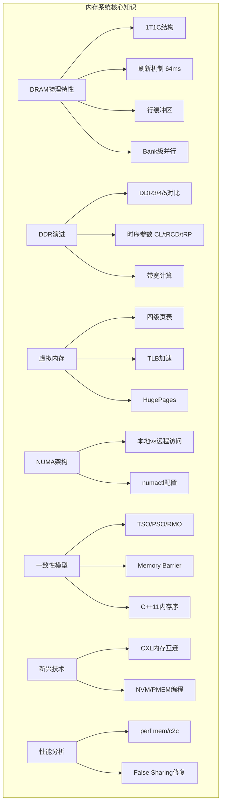

## 关键公式

| 概念 | 公式 | 说明 |
|------|------|------|
| 理论带宽 | BW = MT/s × 位宽 × 通道数 / 8 | DDR双沿传输 |
| CAS延迟 | 延迟(ns) = CL / 时钟频率(MHz) | 关注绝对延迟 |
| 刷新开销 | 刷新时间 / 刷新间隔 ≈ 12% | 带宽损失 |
| NUMA延迟比 | Local : Remote ≈ 1 : 1.5~3 | 取决于互连拓扑 |
| TLB覆盖 | 覆盖范围 = 条目数 × 页面大小 | 大页扩大覆盖 |

## 关键要点

1. **DRAM使用电容存储**，需要定期刷新（每64ms），刷新导致约12%的带宽损失
2. **行缓冲是性能关键**：Row Hit比Row Miss快3倍，内存控制器的调度目标是最大化Row Hit率
3. **DDR时序参数决定延迟**：CL/frequency比值决定绝对延迟，高频主要提升带宽
4. **虚拟内存通过页表翻译地址**：TLB是关键加速器，大页可将TLB覆盖范围扩大64倍
5. **NUMA架构下内存访问不均匀**：本地访问比远程快60%，需要NUMA-aware编程
6. **内存模型决定并发正确性**：x86的TSO足够强（大多数代码无需Fence），ARM需要更多Fence
7. **C++11内存序提供精确控制**：release/acquire是生产者-消费者的正确选择
8. **False Sharing是多核隐形杀手**：用`perf c2c`检测，用padding修复
9. **CXL正在重塑内存架构**：突破DDR通道数限制，实现内存池化和异构一致性
10. **swap优化不止关swap**：zswap/zram压缩可将swap延迟降低100-1000倍

## 下一步学习

1. **第03章 IO系统**：理解磁盘IO与内存缓冲的关系，Direct IO vs Buffered IO
2. **第05章 内存管理**：Linux内核的页表管理、伙伴系统、Slab分配器、OOM Killer
3. **第07章 IO模型**：深入理解mmap内存映射IO、Sendfile零拷贝
4. **实践项目1**：为你的服务配置NUMA绑定和HugePages，用perf mem验证效果
5. **实践项目2**：用perf c2c检测并修复一个False Sharing问题
6. **前沿关注**：跟踪CXL 3.0生态发展，了解内存池化在数据中心的落地实践

## 参考文献

1. Jacob, B., Ng, S., & Wang, D. *Memory Systems: Cache, DRAM, Disk*. Morgan Kaufmann, 2007.
2. Hennessy, J.L. & Patterson, D.A. *Computer Architecture: A Quantitative Approach*. 6th Ed. Ch.2.
3. Mutlu, O. & Kim, J.S. "Processing Using Memory." IEEE Micro, 2019.
4. Intel. *Intel 64 and IA-32 Architectures Software Developer's Manual*, Vol.3A (Memory Ordering).
5. Adve, S.V. & Gharachorloo, K. "Shared Memory Consistency Models: A Tutorial." IEEE Computer, 1996.
6. Bovet, D.P. & Cesati, M. *Understanding the Linux Kernel*. 3rd Ed. Ch.2.
7. Corbet, J., Kroah-Hartman, G., & McPherson, A. *Linux Kernel Development Reports*. Linux Foundation.
8. CXL Consortium. *Compute Express Link Specification*. 3.0, 2024.
9. Intel. *Intel Optane Persistent Memory Programming Guide*. 2021.
10. McKenney, P.E. "Memory Barriers: a Hardware View for Software Hackers." Linux Plumbers Conference, 2009.
