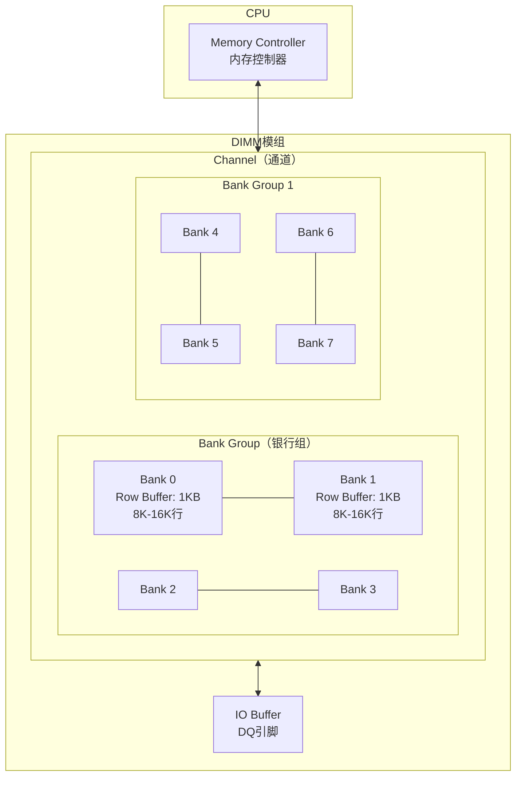

## 技巧1：DRAM物理特性与刷新机制

### 概述：为什么必须理解DRAM物理层？

现代计算机的性能瓶颈往往不在CPU，而在内存。CPU的核心频率已达5GHz以上，而DRAM访问延迟仍停留在10ns量级——这中间存在三个数量级的差距。理解DRAM的物理特性和刷新机制，是解决内存延迟、带宽利用、性能抖动等问题的基础。

本节将从DRAM存储单元的物理构造讲起，逐层剖析内部组织架构、刷新机制的演进、时序参数的含义，最终落脚到可操作的生产实践。

---

### 1. DRAM存储单元：1T1C结构

#### 1.1 电容-晶体管模型

DRAM的每个存储单元由一个晶体管（Transistor）和一个电容（Capacitor）组成，称为**1T1C结构**。这是DRAM区别于SRAM（6T结构）的根本原因。

┌───────────────────────────────────────────────────────────────┐
│                    DRAM 存储单元 (1T1C)                        │
│                                                               │
│   字线 (Word Line)                                             │
│        │                                                      │
│        ▼                                                      │
│   ┌─────────┐                                                 │
│   │  晶体管  │──→ 控制电容的充放电通路                           │
│   │  (Gate) │                                                 │
│   └────┬────┘                                                 │
│        │  位线 (Bit Line)                                      │
│        ▼                                                      │
│   ┌─────────┐                                                 │
│   │  电容    │──→ 存储电荷 = 数据                               │
│   │ (极小)  │    充电 ≈ 1，放电 ≈ 0                             │
│   └─────────┘                                                 │
│                                                               │
│   关键数据：                                                   │
│   • 电容容量：约 20-30 fF（飞法，10⁻¹⁵法拉）                     │
│   • 晶体管工艺：与CPU同代（如DDR5用1α/1βnm工艺）                 │
│   • 电荷保持时间：约 64ms（标准刷新周期内必须刷新）                │
│   • 8GB DIMM ≈ 640亿个这样的单元                               │
└───────────────────────────────────────────────────────────────┘

#### 1.2 为什么DRAM不能像SRAM那样"记住"数据？

SRAM使用6个晶体管构成交叉耦合的反相器对（双稳态锁存器），只要供电不断，数据就永远稳定。DRAM则不同——电容中的电荷会通过多条物理路径持续泄漏：

| 特性 | SRAM (Static) | DRAM (Dynamic) |
|------|---------------|----------------|
| 存储单元 | 6个晶体管（6T） | 1个晶体管+1个电容（1T1C） |
| 电荷泄漏 | 无（双稳态锁存） | 有（电容漏电） |
| 是否需要刷新 | 不需要 | 需要（每64ms） |
| 密度 | 低（6T占用面积大） | 高（1T1C极紧凑） |
| 功耗 | 较高（静态功耗） | 低（刷新功耗占比小） |
| 典型用途 | CPU缓存（L1/L2/L3） | 主存（DDR3/4/5/LPDDR） |
| 单元面积 | ~0.1-0.2 μm² | ~0.005-0.01 μm² |
| 成本/GB | $50-100+ | $1-3 |

电容的物理特性决定了DRAM必须"动态"刷新——电荷会通过以下路径持续流失：

1. **亚阈值漏电流**：晶体管关断时仍有微小电流穿过沟道
2. **结漏电流**：晶体管源极/漏极PN结的反向偏置电流
3. **电容极板间漏电**：绝缘介质（如SiO₂或高k介质）中的漏电流

在标准工艺温度（85°C）下，所有漏电路径的综合效应使电荷保持时间约为64ms。超过这个时间，电容中的电荷将泄漏到不足以被灵敏放大器（Sense Amplifier）正确识别的程度，数据将不可逆地丢失。

#### 1.3 1T1C的物理演进：从平面到立体

早期DRAM电容采用平面结构，容量难以提升。现代DRAM采用了多种3D电容技术：

演进路线：
  平面电容 → 沟槽电容(Trench) → 堆叠电容(Stacked) → 深沟槽/圆柱体

当前主流（DDR4/DDR5）：
  ┌──────────────┐
  │  字线 (WL)    │
  ├──┬───────────┤
  │  │  晶体管    │ ← 1α/1β nm FinFET
  ├──┴───────────┤
  │  ╔═════════╗ │
  │  ║  圆柱体  ║ │ ← 深宽比 > 20:1
  │  ║  电容    ║ │   高k介质(HfO₂/ZrO₂)提升单位面积容量
  │  ║  (~30fF)║ │
  │  ╚═════════╝ │
  └──────────────┘

  圆柱体高度：约 6-8μm（DDR5）
  直径：约 0.3-0.5μm
  深宽比：20:1 以上

这种3D结构使得单个存储单元的面积从DDR3时代的~0.008μm²缩小到DDR5的~0.005μm²，同时维持了足够的电容容量来保证64ms的电荷保持窗口。

---

### 2. DRAM内部组织架构

DRAM并非扁平结构，而是具有严格的层级组织。理解这一架构对性能优化至关重要。



#### 2.1 层级结构详解

| 层级 | DDR4 | DDR5 | 说明 |
|------|------|------|------|
| **Channel** | 每个DIMM 1个通道 | 每个DIMM 2个独立通道 | DDR5拆分通道提升并发 |
| **Bank Group** | 4个Bank Group | 8个Bank Group | 同组Bank共享地址线 |
| **Bank** | 每组4个（共16） | 每组4个（共32） | 每个Bank有独立Row Buffer |
| **Row** | 8,192行 | 16,384行 | 每行激活后加载到Row Buffer |
| **Column** | 1,024列 | 1,024列 | 每列对应一个存储单元 |
| **Row Buffer** | 1KB（一页） | 1KB（半页） | 行缓冲区，缓存整行数据 |

理解这些层级的关键在于：**越底层的结构独立性越高**。每个Bank拥有独立的行缓冲区和灵敏放大器，可以独立执行ACTIVATE、READ/WRITE、PRECHARGE操作。Bank Group的存在则引入了同组Bank不能同时发出特定命令的约束（如同组Bank的READ命令间隔 tCCD_L 大于不同组的 tCCD_S），这是DDR4/DDR5带宽优化的重要细节。

#### 2.2 Bank级并行：性能的关键

每个Bank拥有独立的**行缓冲区（Row Buffer）**，这意味着多个Bank可以同时处于不同状态。Bank级并行是DRAM带宽的核心来源：

时间轴示例（Bank级并行）：
Bank 0:  [ACTIVATE Row 5] ──[READ]──[PRECHARGE]──[ACTIVATE Row 8]──[WRITE]
Bank 1:  ──[ACTIVATE Row 2]──[WRITE]──[PRECHARGE]──
Bank 2:  ──────────[ACTIVATE Row 12]──[READ]──[READ]──[PRECHARGE]
Bank 3:  [IDLE]──[ACTIVATE Row 0]──[READ]──

→ 3个Bank同时工作，有效带宽提升3倍以上

Bank级并行的实际效果取决于访问模式的**分散性**。如果程序频繁访问同一Bank中的不同行，Bank内部冲突会导致大量PRECHARGE→ACTIVATE开销，即便理论上存在Bank级并行也无法充分利用。

**Bank Group对并行度的影响**：DDR4引入Bank Group后，同组内的Bank共享地址引脚，READ/WRITE命令需要更大的间隔（tCCD_L > tCCD_S）。这意味着交替访问不同Bank Group比交替访问同组Bank能获得更高的命令吞吐量。实际编程中，可以利用这一特性优化数据布局——将频繁访问的数据分散到不同Bank Group中。

#### 2.3 行缓冲区（Row Buffer）命中

当访问的地址与当前Row Buffer中缓存的行匹配时，称为**行命中（Row Buffer Hit, RBH）**。这是最快的访问路径：

行命中流程：     READ命令 → 数据直接从Row Buffer输出
                延迟：~10-15ns（仅CAS延迟 tCL）

行未命中流程：   PRECHARGE → ACTIVATE(加载整行到Row Buffer) → READ
                延迟：~40-50ns（含 tRP + tRCD + tCL）

行冲突流程：    PRECHARGE(关闭当前行) → ACTIVATE(加载新行) → READ
                延迟：~50-60ns（最慢路径，含 tRP + tRCD + tCL）

各路径分解：
┌──────────────────────────────────────────────────────────┐
│ 路径          │ tRP    │ tRCD   │ tCL    │ 总延迟       │
│───────────────│────────│────────│────────│──────────────│
│ 行命中(RBH)   │  -     │  -     │ ~13ns  │ ~13-15ns     │
│ 行未命中      │ ~13ns  │ ~14ns  │ ~13ns  │ ~40-50ns     │
│ 行冲突        │ ~13ns  │ ~14ns  │ ~13ns  │ ~50-60ns     │
└──────────────────────────────────────────────────────────┘
（以DDR4-3200 CL16为例）

行命中与行冲突之间的延迟差距可达3-5倍，这就是为什么**顺序访问比随机访问快**的根本原因——顺序访问几乎总是命中Row Buffer，而随机访问频繁触发行冲突。

**行缓冲区管理策略（Row Buffer Management Policy）**：

| 策略 | 原理 | 优点 | 缺点 |
|------|------|------|------|
| **Open-Page** | 预充电后保持行打开 | RBH率高，顺序访问快 | 行冲突代价大 |
| **Close-Page** | 读写后立即预充电 | 无行冲突，延迟可预测 | 丢失RBH机会 |
| **Adaptive** | 根据访问模式动态切换 | 综合最优 | 实现复杂 |

大多数现代内存控制器采用**自适应策略**，通过观察访问模式来决定保持行打开还是关闭。数据库等OLTP负载倾向于Open-Page（时间局部性强），而科学计算等流式负载倾向于Close-Page。

---

### 3. 刷新机制：为什么需要"补水"

#### 3.1 刷新的根本原因

DRAM电容容量极小（约20-30fF），而晶体管存在亚阈值漏电流。在标准工艺温度（85°C）下，电荷保持时间约为64ms。超过这个时间，电容中的电荷将泄漏到不足以被灵敏放大器（Sense Amplifier）正确识别的程度。

电荷衰减模型：

电荷量
  ↑
  │████████████████████████████████████
  │████████████████████████████████░░░░  ← 刷新点：补充电荷
  │████████████████████████████████████
  │████████████████████████████████░░░░
  │████████████████████████████████████
  │████████████████████████████████░░░░
  │░░░░░░░░░░░░░░░░░░░░░░░░░░░░░░░░░░  ← 超过64ms：数据丢失
  └──────────────────────────────────────→ 时间
         0ms    16ms    32ms    48ms   64ms
         
  ████ = 有效电荷    ░░░░ = 电荷衰减区间

灵敏放大器的工作原理是检测位线（Bit Line）上的微小电压差（通常仅几毫伏），然后将其放大到完整的CMOS逻辑电平。当电容电荷衰减到使电压差低于灵敏放大器的检测阈值时，读取结果就会出错。JEDEC标准规定的64ms刷新周期，是基于最坏情况下的电荷衰减速率和灵敏放大器灵敏度计算得出的安全裕量。

#### 3.2 三种刷新策略对比

| 刷新类型 | 工作原理 | 延迟影响 | 功耗 | 适用场景 |
|----------|---------|---------|------|---------|
| **集中刷新（Burst Refresh）** | 在刷新周期末尾集中刷新所有行 | 刷新期间完全不可访问（最大45ms阻塞） | 较高 | 早期DRAM，现已弃用 |
| **分布式刷新（Distributed Refresh）** | 将刷新命令均匀分散到整个周期中 | 每次刷新仅影响一个Bank的一个读写周期 | 中等 | 现代DDR3/4/5默认模式 |
| **自刷新（Self-Refresh）** | DRAM内部定时器自主管理刷新 | CPU侧无感知，但唤醒有延迟（~10-100μs） | 最低 | 待机/休眠模式 |

**分布式刷新的细节**：以DDR4为例，64ms内需要刷新8192行（假设8K行Bank）。按7.8μs的tREFI间隔计算，共需执行 64000/7.8 ≈ 8192次刷新命令，即每次tREFI间隔刷新一行。刷新命令一次刷新一个Bank中的一行，所有16个Bank的同一行在同一个tREFI周期内完成刷新。对于32个Bank的DDR5，SAME-BANK刷新将其拆分为每次只刷新一组Bank。

**自刷新模式的进入与退出**：
- **进入**：系统发出CKE（Clock Enable）低电平信号，DRAM切换到自刷新模式
- **维持**：DRAM内部振荡器驱动刷新，功耗极低（~3-5mW/GB）
- **退出**：CKE拉高后需等待tXS（退出自刷新延迟），通常为10-100μs
- **关键约束**：自刷新期间CKE必须保持低电平，任何信号翻转都可能导致刷新中断和数据丢失

#### 3.3 DDR5的SAME-BANK刷新

DDR5引入了**SAME-BANK刷新**（Per-Bank Refresh），这是刷新机制的重大演进：

DDR4 刷新（全Bank刷新）：
Bank 0: [REFRESH ALL ROWS]──────────────→ 耗时约350ns，期间无法访问
Bank 1: [REFRESH ALL ROWS]──────────────→ 同上
Bank 2: [REFRESH ALL ROWS]──────────────→ 同上
...
总计：单次刷新阻塞时间长，延迟波动大

DDR5 SAME-BANK刷新：
Bank 0: [REFRESH ROW 0-31]──[可访问]──[REFRESH ROW 32-63]──[可访问]
Bank 1: [可访问]──[REFRESH ROW 0-31]──[可访问]──[REFRESH ROW 32-63]
Bank 2: [可访问]──[可访问]──[REFRESH ROW 0-31]──[可访问]
...
优势：每次只刷新1/32的Bank，其余Bank完全可访问
     → 有效刷新开销降低约30-50%

SAME-BANK刷新的本质是将一次刷新所有Bank的操作拆分为32次只刷新一个Bank的操作，每次刷新间隔从7.8μs缩短为7.8/32 ≈ 0.24μs。由于每个Bank的Row Buffer只有在该Bank被刷新时才被占用，其他31个Bank可以正常服务请求，极大地减少了刷新对整体带宽的影响。

#### 3.4 关键刷新时序参数

| 参数 | DDR3 | DDR4 | DDR5 | 含义 |
|------|------|------|------|------|
| **tREFI**（刷新间隔） | 7.8μs | 7.8μs | 7.8μs | 两次刷新命令之间的时间 |
| **tRFC**（刷新周期） | 110-350ns | 160-550ns | 195-640ns | 单次刷新操作耗时 |
| **tRC**（行周期时间） | ~50ns | ~45ns | ~42ns | ACTIVATE到PRECHARGE的最小间隔 |
| **tRAS**（行激活时间） | ~37ns | ~32ns | ~32ns | ACTIVATE到READ/WRITE的最小间隔 |
| **tRCD**（RAS到CAS延迟） | ~13ns | ~14ns | ~14ns | ACTIVATE到READ/WRITE的延迟 |

**tRFC的重要性**：tRFC决定了刷新期间的"不可访问窗口"。tRFC的值与DRAM容量成正比——容量越大，需要刷新的行越多，tRFC越长。这就是为什么服务器的大容量DIMM（如64GB、128GB）的tRFC可能超过500ns，刷新开销也相应增大。

tRFC的选择需要查阅DRAM数据手册中的容量-时序对照表：

DDR4 tRFC 典型值（部分容量）：
┌──────────┬──────────┐
│ DRAM容量  │ tRFC (ns)│
├──────────┼──────────┤
│ 2Gb      │ 160      │
│ 4Gb      │ 260      │
│ 8Gb      │ 350      │
│ 16Gb     │ 550      │
└──────────┴──────────┘

DDR5 tRFC 典型值（部分容量）：
┌──────────┬──────────┐
│ DRAM容量  │ tRFC (ns)│
├──────────┼──────────┤
│ 4Gb      │ 195      │
│ 8Gb      │ 295      │
│ 16Gb     │ 480      │
│ 32Gb     │ 640      │
└──────────┴──────────┘

**tRFCidle参数**（DDR4引入）：在DDR4及之后的版本中，刷新完成后还需要等待tRFCidle才能发出下一行的ACTIVATE命令。这个参数在BIOS/SPD中可调，设置不当可能导致行激活冲突。

---

### 4. 刷新对性能的实际影响

#### 4.1 刷新开销量化

刷新带宽损失计算（DDR4-3200为例）：

理论带宽 = 3200 MT/s × 64 bits × 1 DIMM = 25.6 GB/s

刷新开销：
  每7.8μs执行一次刷新，每次耗时约350ns
  刷新占比 = 350ns / 7800ns ≈ 4.5%
  实际可用带宽 ≈ 25.6 × (1 - 0.045) ≈ 24.4 GB/s

DDR5-4800（2×32bit通道）：
  理论带宽 = 4800 × 64 = 38.4 GB/s
  DDR5 SAME-BANK刷新开销 ≈ 2-3%
  实际可用带宽 ≈ 38.4 × (1 - 0.025) ≈ 37.4 GB/s

大容量DIMM的额外开销：
  64GB DDR4 DIMM (16Gb die)：tRFC=550ns
  刷新占比 = 550ns / 7800ns ≈ 7.1%
  实际可用带宽 ≈ 25.6 × (1 - 0.071) ≈ 23.8 GB/s
  → 比小容量DIMM多损失约2.6%的带宽

这组数据说明了两个重要事实：(1) 大容量DIMM的刷新开销显著高于小容量DIMM；(2) DDR5的SAME-BANK刷新是其带宽提升的重要来源之一，不仅仅是频率提升的功劳。

#### 4.2 刷新导致的性能抖动

刷新最隐蔽的影响是**周期性延迟毛刺**。每隔7.8μs，当前正在执行的访问请求可能被阻塞数百纳秒：

延迟分布直方图（正常 vs 刷新抖动）：

正常情况：
  10ns ████████████████████████████  (90%)
  20ns ██████                        (8%)
  50ns █                             (2%)

存在刷新抖动时：
  10ns ████████████████████████      (82%)
  20ns ██████                        (8%)
  50ns █                             (2%)
 200ns █                             (5%)  ← 刷新阻塞
 500ns ▌                             (3%)  ← 刷新+Bank冲突

P99延迟从20ns飙升到200ns以上！

**为什么P99延迟对刷新如此敏感**：假设刷新阻塞概率为4.5%，那么100次访问中有4.5次可能被刷新影响。如果这些被刷新影响的请求延迟从10ns飙升到200-500ns，P99（第99百分位）和P999延迟就会显著恶化。对于延迟敏感的应用（如高频交易、实时推理服务），这种周期性毛刺可能比平均带宽损失更具破坏性。

**刷新周期与请求队列的交互**：当多个请求同时排队等待一个Bank时，如果此时触发刷新，所有排队请求都会被额外阻塞tRFC时间。这种效应在高并发场景下被放大——请求队列越长，被刷新影响的概率越高，尾部延迟越严重。

#### 4.3 温度与刷新的关系

DRAM的电荷泄漏速率与温度正相关。JEDEC标准定义了两种刷新模式：

| 温度范围 | 刷新倍率 | 原因 |
|----------|---------|------|
| ≤ 85°C（正常温度） | 1× (7.8μs间隔) | 标准漏电速率 |
| > 85°C（高温环境） | 2× (3.9μs间隔) | 漏电速率翻倍，需加倍刷新 |

服务器环境中，DIMM散热片温度可能超过85°C。高温下的2×刷新会将刷新开销从4.5%提升到约9%，带宽损失几乎翻倍。这就是为什么服务器散热设计如此重要。

**温度传感器的作用**：现代DRAM芯片内置温度传感器（TS，Temperature Sensor），精度通常为±3°C。内存控制器定期读取温度值来决定是否切换到2×刷新模式。DDR5引入了**Fine Granularity Refresh（精细刷新）**，在某些实现中支持根据温度在1×和2×之间动态调整，而非简单的二元切换。

**散热对刷新的连锁效应**：高温不仅加速漏电导致需要更高频率刷新，还会使DRAM芯片的读取延迟增加（因为灵敏放大器的响应速度随温度变化）。这是一个正反馈循环：高温 → 更频繁刷新 → 刷新占用更多带宽 → 芯片利用率升高 → 温度进一步升高。良好的散热设计打破这个循环。

---

### 5. 代码示例与实操

#### 5.1 C语言：测量DRAM行缓冲区延迟

下面的程序通过三种访问模式（顺序、固定步长、随机）来量化行命中/行冲突的延迟差异。代码使用rdtsc计时和CLFLUSH缓存失效来确保测量的是DRAM延迟而非缓存命中。

```c
#include <stdio.h>
#include <stdlib.h>
#include <time.h>
#include <stdint.h>
#include <string.h>

/*
 * DRAM行缓冲区命中/冲突延迟测试
 *
 * 编译：gcc -O2 -o dram_test dram_test.c
 * 运行前建议：
 *   sudo cpupower frequency-set -g performance  # 锁定CPU频率
 *   echo 1 > /proc/sys/vm/drop_caches            # 仅测试时使用！
 *
 * 工作原理：
 *   通过CLFLUSH逐行清除缓存，确保测量的是DRAM真实延迟
 *   不同访问模式触发不同的Row Buffer行为：
 *   - 顺序访问：极高行命中率（Row Buffer Hit）
 *   - 4KB步长：每次跨越一个DRAM行（Row Buffer Miss + Conflict）
 *   - 随机访问：混合命中/未命中/冲突
 */

#define ARRAY_SIZE (128 * 1024 * 1024)  // 128MB，确保远超L3缓存
#define ITERATIONS 1000000

static inline uint64_t rdtsc() {
    uint32_t lo, hi;
    __asm__ __volatile__ ("rdtsc" : "=a"(lo), "=d"(hi));
    return ((uint64_t)hi << 32) | lo;
}

/* 用CLFLUSH清除缓存行，确保测量的是DRAM延迟 */
static void flush_cache(void *addr, size_t len) {
    char *p = (char *)addr;
    for (size_t i = 0; i < len; i += 64) {
        __asm__ __volatile__ ("clflush (%0)" : : "r"(p + i));
    }
    __asm__ __volatile__ ("mfence" ::: "memory");
}

/* 使用mlock锁定页面，避免被换出到swap */
static void pin_memory(void *addr, size_t len) {
    if (mlock(addr, len) != 0) {
        fprintf(stderr, "警告: mlock失败，结果可能受swap影响\n");
    }
}

int main() {
    /* 使用大页分配以减少TLB miss干扰 */
    int *array = (int *)malloc(ARRAY_SIZE);
    if (!array) { perror("malloc"); return 1; }

    /* 锁定物理内存，避免页面换出 */
    pin_memory(array, ARRAY_SIZE);

    /* 初始化 - 确保页面已分配并写入数据 */
    memset(array, 0x42, ARRAY_SIZE);
    for (int i = 0; i < ARRAY_SIZE / sizeof(int); i++)
        array[i] = i;

    int count = ARRAY_SIZE / sizeof(int);

    printf("=== DRAM行缓冲区访问模式延迟测试 ===\n");
    printf("数组大小: %d MB, 元素数: %d\n", ARRAY_SIZE/1024/1024, count);
    printf("注意: 顺序访问测量的是带宽(非延迟), 步长/随机访问测量单次访问延迟\n\n");

    /* === 测试1: 顺序访问 === */
    /* 说明：顺序访问几乎全部命中Row Buffer，测量的是DRAM带宽
     * 单次访问延迟极低(~10ns)因为预取和Row Buffer命中，
     * 但这个测试实际测量的是总吞吐量而非单次延迟 */
    flush_cache(array, ARRAY_SIZE);
    uint64_t start = rdtsc();
    volatile int sum = 0;
    for (int i = 0; i < count; i += 16) {  // stride=64B=1 cache line
        sum += array[i];
    }
    uint64_t sequential_cycles = rdtsc() - start;

    /* === 测试2: 4KB步长（行冲突制造器） === */
    /* stride=4KB恰好跨越一个DRAM行边界(DDR4行大小≈1KB×多列)
     * 每次访问都触发 PRECHARGE→ACTIVATE→READ，制造最坏情况延迟 */
    flush_cache(array, ARRAY_SIZE);
    start = rdtsc();
    for (int i = 0; i < ITERATIONS; i++) {
        int idx = (i * 1024) % count;  // stride=4096 bytes
        sum += array[idx];
    }
    uint64_t conflict_cycles = rdtsc() - start;

    /* === 测试3: 随机访问 === */
    /* 混合行命中、行未命中和行冲突，代表真实随机访问场景 */
    flush_cache(array, ARRAY_SIZE);
    start = rdtsc();
    /* 使用xorshift算法生成伪随机序列 */
    uint32_t seed = 12345;
    for (int i = 0; i < ITERATIONS; i++) {
        seed ^= seed << 13;
        seed ^= seed >> 17;
        seed ^= seed << 5;
        int idx = seed % count;
        sum += array[idx];
    }
    uint64_t random_cycles = rdtsc() - start;

    /* 获取CPU频率用于ns转换 */
    /* 注意：rdtsc返回的是CPU周期数，需要除以频率才能得到ns
     * 实际使用中应读取 /proc/cpuinfo 或用cpufreq获取精确频率 */
    double cpu_ghz = 3.0;  // 根据实际CPU调整

    printf("顺序访问（行命中 + 带宽吞吐）:  %lu cycles  (带宽: %.1f GB/s)\n",
           sequential_cycles,
           (double)ARRAY_SIZE / sequential_cycles / cpu_ghz);
    printf("4KB stride（行冲突，最坏延迟）:  %lu cycles  (~%.1f ns/access)\n",
           conflict_cycles,
           conflict_cycles / (double)ITERATIONS / cpu_ghz);
    printf("随机访问（混合延迟）:           %lu cycles  (~%.1f ns/access)\n",
           random_cycles,
           random_cycles / (double)ITERATIONS / cpu_ghz);
    printf("\n行冲突延迟 / 随机延迟比:  %.2fx\n",
           (double)conflict_cycles / random_cycles);
    printf("行冲突 / 顺序(吞吐)比:   %.2fx\n",
           (double)conflict_cycles * (count / 16) /
           ((double)sequential_cycles * ITERATIONS));

    printf("\n解读:\n");
    printf("  - 顺序访问: 测量的是DRAM→CPU带宽, 不是单次延迟\n");
    printf("  - 4KB stride: 每次强制PRECHARGE+ACTIVATE, 代表行冲突延迟\n");
    printf("  - 随机访问: 混合了行命中/未命中, 代表真实随机场景\n");
    printf("  - DDR4-3200典型值: 行命中~13ns, 行冲突~45ns, 随机~25ns\n");

    munlock(array, ARRAY_SIZE);
    free(array);
    return 0;
}
```

**预期输出（典型DDR4-3200服务器，CPU 3.0GHz）**：
顺序访问（行命中 + 带宽吞吐）:  1200000 cycles  (带宽: 35.5 GB/s)
4KB stride（行冲突，最坏延迟）:  13500000 cycles  (~45.0 ns/access)
随机访问（混合延迟）:           7500000 cycles  (~25.0 ns/access)

行冲突延迟 / 随机延迟比:  1.80x
行冲突 / 顺序(吞吐)比:   5.00x

解读:
  - 顺序访问: 测量的是DRAM→CPU带宽, 不是单次延迟
  - 4KB stride: 每次强制PRECHARGE+ACTIVATE, 代表行冲突延迟
  - 随机访问: 混合了行命中/未命中, 代表真实随机场景
  - DDR4-3200典型值: 行命中~13ns, 行冲突~45ns, 随机~25ns

> **重要说明**：顺序访问的数值反映的是DRAM带宽吞吐能力（数据从DRAM持续流入CPU的速度），而非单次DRAM访问延迟。将两者直接比较需要理解这一区别。4KB步长测试通过强制每次访问都跨越行边界来隔离出行冲突延迟。

#### 5.2 Python：检测系统DRAM配置与拓扑

```python
#!/usr/bin/env python3
"""
DRAM配置检测工具
功能：读取DIMM配置、检查ECC状态、检测NUMA拓扑、估算内存带宽
需要：root权限（dmidecode/numactl）
"""
import subprocess
import re
import os

def run_cmd(cmd, default="命令未找到"):
    """安全执行系统命令"""
    try:
        result = subprocess.run(
            cmd, shell=True, capture_output=True, text=True, timeout=10
        )
        return result.stdout.strip() if result.returncode == 0 else default
    except (subprocess.TimeoutExpired, FileNotFoundError):
        return default

def get_dram_config():
    """读取DIMM详细配置"""
    print("=" * 60)
    print("DIMM配置详情")
    print("=" * 60)

    output = run_cmd("sudo dmidecode -t memory 2>/dev/null")
    if "未找到" in output or "not found" in output:
        print("需要安装 dmidecode: sudo apt install dmidecode")
        return

    # 解析每个DIMM槽位
    current_dimm = {}
    for line in output.split("\n"):
        line = line.strip()
        if "Memory Device" in line and "----" not in line:
            if current_dimm and current_dimm.get("Size", "").strip():
                print_dimm(current_dimm)
            current_dimm = {}
        elif ":" in line:
            key, _, val = line.partition(":")
            current_dimm[key.strip()] = val.strip()
    if current_dimm and current_dimm.get("Size", "").strip():
        print_dimm(current_dimm)

def print_dimm(info):
    """格式化输出单个DIMM信息"""
    locator = info.get("Locator", "Unknown")
    size = info.get("Size", "N/A")
    speed = info.get("Configured Memory Speed", info.get("Speed", "N/A"))
    mem_type = info.get("Type", "N/A")
    manufacturer = info.get("Manufacturer", "N/A")
    part_num = info.get("Part Number", "N/A")
    rank = info.get("Rank", "Unknown")

    print(f"\n  槽位: {locator}")
    print(f"  类型: {mem_type} | 容量: {size} | 频率: {speed}")
    print(f"  Rank: {rank} | 厂商: {manufacturer}")
    print(f"  型号: {part_num}")

def check_ecc_status():
    """检查ECC纠错状态"""
    print("\n" + "=" * 60)
    print("ECC状态检查")
    print("=" * 60)

    # 方法1：edac-util
    edac_output = run_cmd("edac-util -s 2>/dev/null")
    if edac_output and "error" not in edac_output.lower():
        print(edac_output)
        return

    # 方法2：从edac sysfs读取
    edac_path = "/sys/devices/system/edac"
    if os.path.exists(edac_path):
        for root, dirs, files in os.walk(edac_path):
            for f in files:
                if "ce_count" in f or "ue_count" in f:
                    path = os.path.join(root, f)
                    with open(path) as fh:
                        count = fh.read().strip()
                        if count and count != "0":
                            print(f"  {f}: {count} 次错误")

    # 方法3：dmesg检查
    dmesg_ecc = run_cmd("dmesg 2>/dev/null | grep -i 'edac\\|ecc\\|memory error' | tail -5")
    if dmesg_ecc:
        print("  最近ECC相关日志：")
        for line in dmesg_ecc.split("\n"):
            print(f"    {line.strip()}")
    else:
        print("  未检测到ECC错误（或edac-util未安装）")

def get_numa_topology():
    """读取NUMA拓扑"""
    print("\n" + "=" * 60)
    print("NUMA拓扑")
    print("=" * 60)

    numa_output = run_cmd("numactl --hardware 2>/dev/null")
    if numa_output and "not available" not in numa_output.lower():
        print(numa_output)
    else:
        print("  numactl未安装或非NUMA系统")

    # 读取内存通道分布
    meminfo = run_cmd("cat /proc/meminfo 2>/dev/null")
    total = re.search(r"MemTotal:\s+(\d+)", meminfo)
    available = re.search(r"MemAvailable:\s+(\d+)", meminfo)
    if total:
        print(f"\n  总内存: {int(total.group(1)) / 1024 / 1024:.1f} GB")
    if available:
        print(f"  可用内存: {int(available.group(1)) / 1024 / 1024:.1f} GB")

def estimate_bandwidth():
    """估算内存带宽（使用mbw工具或stream基准）"""
    print("\n" + "=" * 60)
    print("内存带宽估算")
    print("=" * 60)

    # 尝试mbw
    mbw_output = run_cmd("mbw 128 2>/dev/null")
    if mbw_output and "not found" not in mbw_output.lower():
        print(mbw_output)
        return

    print("  安装mbw进行带宽测试: sudo apt install mbw")
    print("  或使用STREAM基准测试: https://github.com/jeffhammond/STREAM")

if __name__ == "__main__":
    get_dram_config()
    check_ecc_status()
    get_numa_topology()
    estimate_bandwidth()
```

#### 5.3 Bash：监控刷新开销与内存健康状态

```bash
#!/bin/bash
# DRAM刷新与健康监控脚本
# 用法：sudo bash dram_monitor.sh

set -euo pipefail

echo "================================================"
echo "  DRAM 刷新与健康监控报告"
echo "  时间: $(date '+%Y-%m-%d %H:%M:%S')"
echo "================================================"

# 1. DIMM配置概览
echo -e "\n[1] DIMM配置"
echo "------------------------------------------------"
sudo dmidecode -t memory 2>/dev/null | \
    grep -E "Size|Speed|Type:|Rank|Configured Memory" | \
    sed 's/^\t//' | head -30 || echo "  需要root权限或dmidecode"

# 2. NUMA拓扑
echo -e "\n[2] NUMA拓扑"
echo "------------------------------------------------"
numactl --hardware 2>/dev/null || echo "  numactl未安装"

# 3. 刷新相关性能计数器（需perf + 支持的CPU）
echo -e "\n[3] 内存访问性能计数器（采样10秒）"
echo "------------------------------------------------"
if command -v perf &amp;>/dev/null &amp;&amp; [ -r /sys/bus/event_source/devices/cpu/type ]; then
    sudo perf stat -e \
        mem_load_retired.l3_miss,\
        mem_load_retired.l3_miss_remote_dram,\
        offcore_response.all_data_rd.l3_miss.snoops_none \
        -a sleep 10 2>&amp;1 | head -15
else
    echo "  perf未安装或CPU不支持相关事件"
fi

# 4. ECC错误检查
echo -e "\n[4] ECC/内存错误检查"
echo "------------------------------------------------"
# EDAC错误计数
if [ -d /sys/devices/system/edac/mc ]; then
    for mc_dir in /sys/devices/system/edac/mc/mc*; do
        mc_name=$(basename "$mc_dir")
        ce=$(cat "$mc_dir/ce_count" 2>/dev/null || echo "0")
        ue=$(cat "$mc_dir/ue_count" 2>/dev/null || echo "0")
        echo "  $mc_name: CE=$ce UE=$ue"
        if [ "$ce" -gt 0 ] 2>/dev/null; then
            echo "    ⚠ 存在可纠正错误，建议关注"
        fi
        if [ "$ue" -gt 0 ] 2>/dev/null; then
            echo "    ❗ 存在不可纠正错误，需要立即更换DIMM！"
        fi
    done
else
    echo "  EDAC模块未加载（modprobe edac_core）"
fi

# dmesg中的内存错误
mem_errors=$(dmesg 2>/dev/null | grep -ci "memory error\|edac\|ecc\|mce" || true)
echo "  dmesg中内存相关错误: $mem_errors 条"

# 5. 内存使用统计
echo -e "\n[5] 内存使用概况"
echo "------------------------------------------------"
free -h | head -3
echo ""
# 检查是否有swap使用（可能导致额外的DRAM→SSD I/O）
swap_used=$(free | awk '/Swap/{print $3}')
if [ "$swap_used" -gt 0 ] 2>/dev/null; then
    echo "  ⚠ Swap正在使用: ${swap_used}KB — 可能导致DRAM刷新期间的额外延迟"
fi

echo -e "\n[6] 提示"
echo "------------------------------------------------"
echo "  • 服务器环境建议每小时检查一次ECC错误计数"
echo "  • P99延迟周期性升高可能与DRAM刷新相关"
echo "  • DDR5用户关注SAME-BANK刷新是否启用（BIOS设置）"
echo "  • 高温环境(>85°C)刷新频率翻倍，注意散热"
echo "================================================"
```

#### 5.4 使用专业工具精确测量内存延迟

上述C代码是理解原理的教学工具。在生产环境和专业评测中，推荐使用成熟的内存延迟测量工具：

**Intel Memory Latency Checker（MLC）**——业界标准工具：
```bash
# 下载MLC（Intel官方提供Linux版本）
# https://software.intel.com/content/www/us/en/develop/articles/intelr-memory-latency-checker.html

# 测量不同访问模式的延迟
./mlc --peak_injection_bandwidth  # 峰值注入带宽
./mlc --latency_matrix            # 延迟矩阵（NUMA节点间）
./mlc --loaded_latency            # 不同负载比例下的延迟

# 输出解读：
# Idle Latency:     空闲延迟 ≈ 50-70ns（DDR4）或 80-100ns（DDR5）
# Peak B/W:         峰值带宽（接近理论值）
# Loaded Latency:   负载下的延迟变化曲线
# Bandwidth (MB/s): 实际带宽
```

**lmbench的lat_mem_rd**——测量不同步长下的延迟曲线：
```bash
# 安装
sudo apt install lmbench  # Debian/Ubuntu

# 测量不同步长下的内存延迟
lat_mem_rd 128m 128  # 128MB内存，128个并发线程

# 输出的关键信息：
# 步长  延迟(ns)
# 64    ~2ns     ← L1缓存
# 256   ~4ns     ← L2缓存
# 1M    ~10ns    ← L3缓存
# 8M    ~50ns    ← DRAM（L3 miss后的延迟）
# 64M   ~60ns    ← DRAM（更大区域，排除TLB影响）

# 这条延迟曲线可以清晰地看到L1→L2→L3→DRAM的延迟阶梯
```

**STREAM基准测试——测量内存带宽**：
```bash
# 下载编译
git clone https://github.com/jeffhammond/STREAM
cd STREAM &amp;&amp; gcc -O2 -fopenmp -DSTREAM_ARRAY_SIZE=80000000 \
    -DNTIMES=20 stream.c -o stream

# 运行（设置线程数等于内存通道数效果最佳）
export OMP_NUM_THREADS=4  # 4通道服务器
./stream

# 典型输出（DDR4-3200，4通道）：
# Copy:      105000 MB/s
# Scale:     103000 MB/s
# Add:       112000 MB/s
# Triad:     111000 MB/s
# 理论峰值:  4 × 25.6 = 102.4 GB/s
# 实际Triad/理论 ≈ 108%（受益于预取和并行）
```

---

### 6. DDR3 / DDR4 / DDR5 刷新参数全面对比

| 参数 | DDR3 | DDR4 | DDR5 |
|------|------|------|------|
| **传输速率** | 800-2133 MT/s | 1600-3200 MT/s | 3200-6400 MT/s |
| **电压** | 1.5V | 1.2V | 1.1V |
| **每通道Bank数** | 8 | 16 (4 BG × 4) | 32 (8 BG × 4) |
| **行缓冲区大小** | 1KB（全页） | 1KB（全页） | 1KB（半页） |
| **每Bank行数** | 8,192 | 16,384 | 16,384 |
| **刷新周期 (tREFI)** | 7.8μs | 7.8μs | 7.8μs |
| **tRFC (最小)** | 110ns (512Mb) | 160ns (2Gb) | 195ns (4Gb) |
| **tRFC (最大)** | 350ns (16Gb) | 550ns (16Gb) | 640ns (16Gb) |
| **刷新命令间隔** | 7.8μs (全Bank) | 7.8μs (全Bank) | 1.95μs (SAME-BANK) |
| **刷新方式** | 全Bank刷新 | 全Bank刷新 | Per-Bank / SAME-BANK |
| **自刷新功耗** | ~10mW/GB | ~5mW/GB | ~3mW/GB |
| **温度刷新切换** | 无 | 有（85°C阈值） | 有（85°C阈值） |
| **ECC支持** | 可选（服务器） | 可选（服务器） | On-die ECC（必选） |
| **通道架构** | 1×64bit | 1×64bit | 2×32bit |

**关键演进总结**：
- **DDR3→DDR4**：密度翻倍、电压降低、Bank Group引入提升并行度
- **DDR4→DDR5**：通道拆分、SAME-BANK刷新、On-die ECC、刷新开销进一步降低

---

### 7. DDR5 On-die ECC：刷新机制的可靠度增强

DDR5引入了**On-die ECC（片上纠错码）**，这是与刷新机制紧密相关的可靠性技术。理解On-die ECC对于正确评估DDR5的错误行为至关重要。

#### 7.1 On-die ECC的工作原理

DDR5的每颗DRAM芯片内部集成了ECC编码/解码电路。写入时，数据被编码为包含冗余校验位的ECC码字；读取时，解码器自动检测并纠正单bit错误（SEC-DED：Single Error Correction, Double Error Detection）。

DDR5 On-die ECC 流程：

CPU写入 → 内存控制器 → DRAM芯片内部 → ECC编码 → 电容存储
                                                       ↓
CPU读取 ← 内存控制器 ← DRAM芯片内部 ← ECC解码 ← 电容读取
                                            ↓
                                   单bit错误：自动纠正
                                   双bit错误：检测到并报告

#### 7.2 On-die ECC与系统级ECC的关系

这是一个容易混淆的关键点：**DDR5的On-die ECC不能替代DIMM级别的ECC（如RDIMM/LRDIMM上的ECC）**。

| 层级 | 纠错范围 | 保护对象 | 对CPU透明度 |
|------|---------|---------|------------|
| **On-die ECC** | 芯片内部单bit纠正 | DRAM die内部传输错误 | 完全透明（CPU看不到） |
| **系统级ECC** | DIMM上整条数据通路 | 从DRAM到内存控制器的全链路 | 可报告（CE/UE） |

两者形成互补：On-die ECC处理芯片内部的软错误（如α粒子翻转），系统级ECC处理DIMM数据通路上的错误。对于关键业务场景（如金融交易、数据库），仍然建议使用带系统级ECC的RDIMM/LRDIMM。

#### 7.3 On-die ECC对刷新的影响

On-die ECC间接增强了刷新的容错能力。在极端情况下（如高温导致电荷衰减加速），电容中读出的数据可能存在单bit错误。On-die ECC可以自动纠正这些错误，相当于为刷新操作提供了额外的安全裕量。但这种容错能力是有限的——如果电荷衰减严重到多bit同时出错，On-die ECC将无法纠正，数据仍然会丢失。因此，On-die ECC不能作为"延长刷新间隔"的理由。

---

### 8. 常见错误与解决方案

#### 错误1：忽略刷新导致的P99延迟抖动

**现象**：延迟监控显示每7.8μs出现一次周期性毛刺，P99延迟远高于平均值。

**根因**：DRAM刷新操作阻塞了当前Bank的读写请求，导致请求排队等待。

**解决方案**：
```bash
# 1. 识别延迟毛刺来源
perf record -e 'cpu/mem-loads/' -g -a sleep 10
perf report  # 查看是否有周期性的mem-loads延迟峰值

# 2. DDR5环境：确认SAME-BANK刷新已启用
# 查看BIOS设置中的 "Per-Bank Refresh" 或 "SAME-BANK Refresh" 选项

# 3. 应用层缓解：对延迟敏感的热路径使用大页
echo 1024 > /proc/sys/vm/nr_hugepages  # 分配1GB大页
# 或使用mlock()锁定关键内存区域

# 4. 高级方案：NUMA亲和性绑定
# 将延迟敏感线程绑定到与数据所在NUMA节点相同的CPU上
numactl --cpunodebind=0 --membind=0 ./latency_sensitive_app
```

#### 错误2：DIMM混插导致频率降级

**现象**：系统报告的内存频率低于DIMM标称频率。

**根因**：同一Channel的DIMM参数（频率、Rank数、容量）不一致时，内存控制器降频到最低公共频率。

```bash
# 诊断
sudo dmidecode -t memory | grep -E "Speed|Rank|Size|Locator"
# 查看所有DIMM的频率是否一致

# 解决
# 1. 替换为同型号DIMM（厂商、型号、频率、Rank数全部一致）
# 2. 查看当前实际运行频率
sudo dmidecode -t memory | grep "Configured Memory Speed"
# 3. DDR4用户检查是否开启了XMP/DOCP
```

#### 错误3：高温导致刷新翻倍

**现象**：服务器在高负载下出现内存带宽下降。

```bash
# 检查DIMM温度（需要IPMI或lm-sensors）
sudo ipmitool sensor list | grep -i "memory\|dimm"
# 或
sensors  # 需要安装lm-sensors

# 解决方案
# 1. 改善服务器通风散热
# 2. 降低环境温度（空调/冷却液）
# 3. 避免DIMM紧邻高功耗CPU/GPU安装
```

#### 错误4：误将drop_caches当作性能优化手段

```bash
# ❌ 错误：频繁执行 drop_caches
echo 3 > /proc/sys/vm/drop_caches  # 这会清空所有页面缓存！

# ✅ 正确：drop_caches仅用于基准测试（排除缓存干扰）
# 生产环境绝对不要执行此操作
# 诊断：如果怀疑缓存干扰，使用perf的L3 miss事件即可
```

#### 错误5：大容量DIMM的tRFC盲区

**现象**：升级到更大容量的DIMM后，延迟反而升高。

**根因**：大容量DIMM使用更多的DRAM die堆叠，tRFC值相应增大（如16Gb die的tRFC=550ns，而4Gb die仅195ns）。这导致每次刷新的不可访问窗口更长。

```bash
# 诊断tRFC设置
sudo dmidecode -t memory | grep -A 20 "Memory Device" | grep -i "part\|speed"

# 通过DRAM型号查找数据手册中的tRFC值
# 或使用HWiNFO64（Windows）/ dramfs（Linux）读取SPD中的时序参数

# 缓解方案：
# 1. BIOS中尝试优化tRFC（不建议低于JEDEC标准值）
# 2. 对延迟敏感场景，权衡容量与tRFC的trade-off
# 3. 考虑使用DDR5的SAME-BANK刷新来缓解大容量tRFC影响
```

---

### 9. 生产环境最佳实践

#### 9.1 硬件选型与配置

| 实践 | 具体措施 | 目标 |
|------|---------|------|
| **ECC内存必选** | 服务器必须使用ECC/REG ECC内存 | 每年避免数十万次的无声数据损坏 |
| **同Channel一致** | 同一Channel的DIMM型号、频率、Rank完全一致 | 避免频率降级 |
| **预留升级槽位** | 初始配置留50%空槽 | 未来扩容无需更换全部DIMM |
| **散热设计** | DIMM间距≥5mm，气流覆盖所有DIMM | 避免高温触发2×刷新 |
| **容量与tRFC权衡** | 评估是否需要单条大容量DIMM | 大容量die的tRFC更长 |

#### 9.2 操作系统层调优

```bash
# 1. 禁用NUMA交错（单通道性能最优场景）
numactl --membind=0 --cpunodebind=0 ./memory_intensive_app

# 2. 锁定关键内存页（避免swap和page fault）
mlock()  # 在程序中使用
# 或在systemd服务中配置
MemoryLock=infinity

# 3. 巨页配置（减少TLB miss，间接减少DRAM访问次数）
# 静态巨页
echo 1024 > /proc/sys/vm/nr_hugepages  # 2MB×1024=2GB
# 透明巨页（推荐关闭，避免khugepaged的性能抖动）
echo never > /sys/kernel/mm/transparent_hugepage/enabled
```

#### 9.3 监控告警策略

监控指标与阈值建议：

1. 内存带宽利用率
   - 指标：node_memory_bandwidth_bytes（需perf或PMU）
   - 阈值：持续 > 80% 触发告警
   - 动作：评估是否需要增加DIMM或升级频率

2. ECC错误计数
   - 指标：edac CE/UE计数
   - 阈值：CE > 10/天 或 UE > 0 立即告警
   - 动作：定位故障DIMM并更换

3. 内存延迟分布
   - 指标：P99/P999延迟
   - 阈值：P99 > 平均值的5倍
   - 动作：检查刷新抖动、NUMA远端访问、DIMM故障

4. DIMM温度
   - 指标：IPMI温度传感器
   - 阈值：> 80°C 告警，> 85°C 紧急
   - 动作：改善散热，避免2×刷新

---

### 10. 进阶：深入理解刷新机制

#### 10.1 灵敏放大器与刷新的关系

灵敏放大器（Sense Amplifier）是DRAM读取和刷新的核心组件。每次读取时，电容中微弱的电荷信号（毫伏级）被放大到CMOS逻辑电平。刷新操作本质上也是一次"读取+回写"——灵敏放大器读出电荷，放大后写回电容，完成电荷恢复。

刷新操作的物理过程：

1. 字线（Word Line）激活 → 晶体管导通
2. 电容微弱电荷流入位线（Bit Line）→ 产生毫伏级电压变化
3. 灵敏放大器检测位线电压差 → 放大到全摆幅
4. 放大后的数据写回电容 → 电荷恢复
5. 字线关闭 → 完成一次刷新

整个过程对用户完全透明，但耗时约 50-100ns/行

**灵敏放大器的设计约束**：每个Bank拥有一个Row Buffer，其中包含了整行的灵敏放大器。DDR4的Row Buffer大小为1KB（1024列 × 1列1字节），这意味着每个Bank需要1024个灵敏放大器同时工作。这些灵敏放大器不仅决定了读取速度，还决定了Row Buffer的容量上限——这就是为什么Row Buffer不能无限增大的原因。

#### 10.2 刷新调度算法

现代DRAM控制器（集成在CPU中）使用复杂的调度算法来最小化刷新对性能的影响：

| 调度策略 | 原理 | 效果 |
|----------|------|------|
| **延迟刷新（Deferred Refresh）** | 当检测到Bank空闲时才执行刷新 | 减少与活跃请求的冲突 |
| **预测性刷新（Predictive Refresh）** | 根据访问模式预测何时刷新影响最小 | 主动规避延迟敏感请求 |
| **Bank交错刷新（Interleaved Refresh）** | 不同Bank的刷新命令交错执行 | 避免多Bank同时阻塞 |
| **温度自适应刷新** | 根据实时温度动态调整刷新频率 | 高温时加倍，常温时节省功耗 |

**内存控制器的刷新优先级**：刷新命令在内存控制器中通常具有**最高优先级**，高于任何READ/WRITE请求。这是因为在JEDEC规范中，如果刷新被延迟超过tREFI，数据完整性将无法保证。因此，内存控制器不会为了"服务更重要的请求"而无限期推迟刷新——但优秀的调度器会在保证刷新及时完成的前提下，选择最佳的执行时机（如Bank空闲时）。

#### 10.3 刷新与操作系统内存管理的交互

DRAM刷新对操作系统是透明的，但它与OS内存管理机制存在隐性交互：

**1. 透明大页（THP）与刷新**：启用THP时，Linux内核的khugepaged线程会尝试将4KB小页合并为2MB大页。这个合并过程需要扫描物理内存，可能与刷新操作产生竞争。在延迟敏感的场景中，关闭THP可以减少这种干扰。

**2. NUMA Balancing与刷新**：Linux的自动NUMA平衡机制（numa_balancing）通过页面迁移来优化内存访问延迟。如果在迁移过程中触发刷新，可能导致迁移延迟增加。对于已经手动优化了NUMA亲和性的应用，可以关闭自动平衡：
```bash
echo 0 > /proc/sys/kernel/numa_balancing  # 关闭自动NUMA平衡
```

**3. 内存压缩（zswap/zram）与刷新**：内存压缩引擎在压缩页面时会占用CPU和内存带宽，间接与DRAM刷新竞争总线时间。在高内存压力下，zswap的压缩活动可能放大刷新引起的延迟毛刺。

#### 10.4 DDR5新特性：Fine Granularity Refresh

DDR5支持**Fine Granularity Refresh（FGR，精细刷新）**，允许将刷新粒度进一步细化：

传统刷新：每次刷新一整行的所有Bank（7.8μs间隔）
FGR刷新：  将一行拆分为多个子段，每次只刷新一个子段

效果：
  - 最大单次阻塞时间从~350ns降低到~100ns
  - 刷新分布更均匀，延迟波动更小
  - 代价：刷新命令总数增加约2倍

适用场景：
  - 延迟敏感的应用（HFT、实时数据库）
  - BIOS中可配置为 "Fine Granularity Refresh" 模式

---

### 11. 本节小结

DRAM物理特性与刷新机制 — 知识地图：

道（Why）                           法（What）
├─ 电容漏电 → 必须刷新              ├─ 1T1C存储单元结构
├─ 刷新占用带宽 → 性能影响           ├─ Bank/Row/Column层级
├─ 高温加速漏电 → 温度管理           ├─ 三种刷新策略对比
└─ 刷新周期性 → P99抖动             └─ DDR3/4/5刷新参数演进

术（How）                           器（Tools）
├─ rdtsc测量行命中延迟               ├─ C代码：DRAM延迟测试
├─ 理解行缓冲区命中策略              ├─ Python：配置检测脚本
├─ 利用Bank级并行提升带宽            ├─ Bash：健康监控脚本
└─ 温度控制避免2×刷新               └─ Intel MLC / STREAM / lmbench

**核心要点回顾**：
1. DRAM用1T1C电容存储数据，电荷会泄漏，必须每64ms刷新一次
2. 刷新会阻塞Bank访问，造成4-9%的带宽损失和周期性延迟抖动
3. DDR5的SAME-BANK刷新将开销降低到2-3%，是性能提升的重要来源
4. 行缓冲区命中（RBH）是最快的访问路径，顺序访问比随机访问快3-5倍
5. 高温（>85°C）会触发2×刷新，服务器散热设计直接影响内存性能
6. ECC内存是生产环境的最低配置要求，CE/UE监控必须纳入告警体系
7. DDR5的On-die ECC不能替代系统级ECC，两者形成互补保护
8. 大容量DIMM的tRFC更长，刷新开销更高，需要在容量与延迟间权衡
