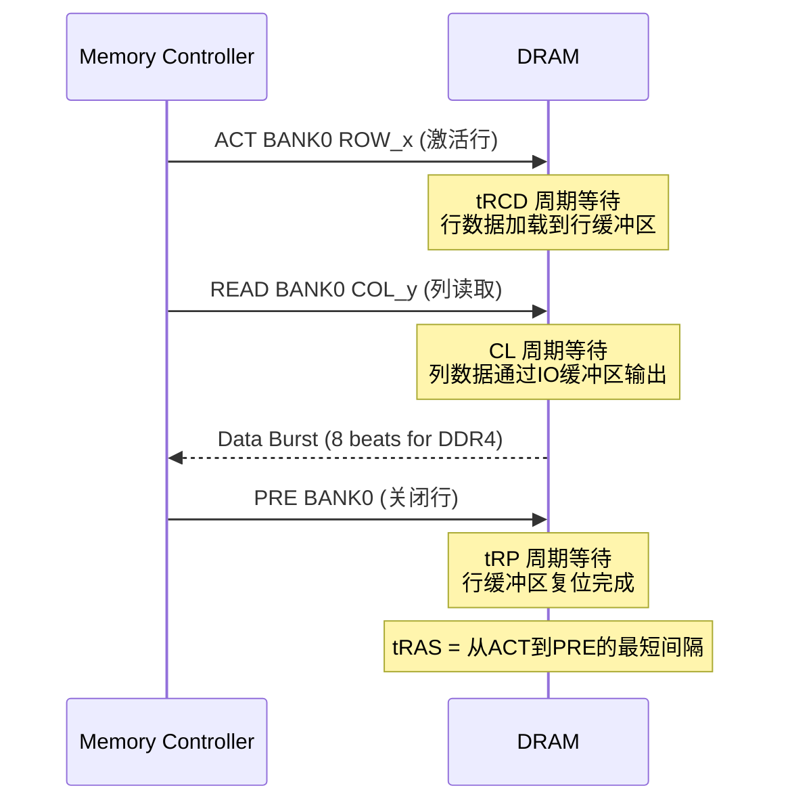
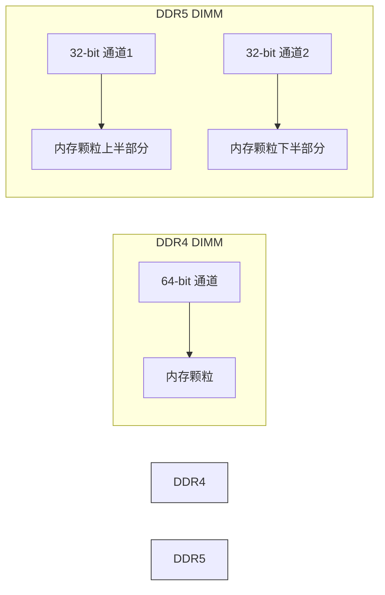

## 技巧2：DDR3/4/5时序参数与带宽计算

### 原理讲解

DDR（Double Data Rate）SDRAM 的核心思想极其简洁：在时钟信号的上升沿（rising edge）和下降沿（falling edge）各传输一次数据，因此数据速率是时钟频率的两倍。这一设计从 DDR1 时代延续至今，成为现代计算机内存的基石。

然而，理解 DDR 内存不能只看"频率翻倍"这一个点。完整的内存性能由三根支柱决定：**带宽**（每秒能传多少数据）、**延迟**（从请求到数据到达要多久）、**并发度**（能同时处理多少请求）。时序参数是连接这三根支柱的核心纽带——它们直接决定延迟，间接影响带宽，而配置方式则决定并发度。

#### DDR 内存架构速览

要理解时序参数，必须先理解 DRAM 的物理架构。一颗 DRAM 芯片内部采用**行-列二维寻址**结构：

┌─────────────────────────────────────────┐
│              DRAM 芯片                    │
│  ┌─────────┐  ┌─────────┐  ┌─────────┐  │
│  │ Bank 0  │  │ Bank 1  │  │ Bank 2  │  │
│  │ ┌─────┐ │  │         │  │         │  │
│  │ │Row 0│ │  │         │  │         │  │
│  │ │Row 1│ │  │         │  │         │  │
│  │ │ ... │ │  │         │  │         │  │
│  │ │Row N│ │  │         │  │         │  │
│  │ └─────┘ │  │         │  │         │  │
│  │  Row    │  │         │  │         │  │
│  │  Buffer │  │         │  │         │  │
│  └─────────┘  └─────────┘  └─────────┘  │
│              行缓冲区（Sense Amplifiers）  │
│  ┌─────────────────────────────────────┐ │
│  │          IO 缓冲区 / 数据总线        │ │
│  └─────────────────────────────────────┘ │
└─────────────────────────────────────────┘

**关键概念**：

| 架构层级 | DDR3 | DDR4 | DDR5 |
|----------|------|------|------|
| Bank 数/芯片 | 8 | 16 (8 Bank Group × 2) | 32 (8 Bank Group × 4) |
| Bank Group | 无 | 有（4 组） | 有（4 组） |
| Prefetch | 8n | 8n | 16n |
| Die 级 ECC | 无 | 无 | 有 |
| 每 DIMM 通道数 | 1 | 1 | 2（两个独立 32-bit 通道） |

- **Bank**：DRAM 内部的独立存储阵列，每个 Bank 可以独立操作，是并发的核心
- **Bank Group**（DDR4+）：Bank 被分成若干组，同一 Bank Group 内切换 Bank 有额外延迟，跨 Bank Group 则没有。这是 DDR4 相对 DDR3 的重要架构变化
- **Row Buffer（行缓冲区）**：每个 Bank 只有一个行缓冲区，存储当前被激活的整行数据。所有列访问都从这个缓冲区读取
- **Prefetch**：每次从 DRAM 阵列读取的最小数据量。DDR4 的 8n prefetch 意味着一次读取 8 个存储单元的数据，通过 8 次传输（每个时钟沿一次）送出

#### 核心时序参数详解

DDR 时序参数用**时钟周期数**表示（也叫"周期数"或"cycles"），标注格式通常为 `CL-tRCD-tRP-tRAS`，如 `16-18-18-36`。

用一个图书馆借书的比喻帮助理解：

| 参数 | 含义 | 图书馆比喻 | 时序标注示例 |
|------|------|-----------|-------------|
| **CL（CAS Latency）** | 列地址选通延迟：从发出读命令到数据出现在总线上的周期数 | 找到书架后，管理员从架上取书并递到你手上的时间 | DDR4-3200: 22 cycles |
| **tRCD（RAS to CAS Delay）** | 行地址到列地址延迟：从激活行到发出读/写命令的最小周期数 | 走到正确楼层（激活行），然后才能开始找具体哪本书（列访问） | DDR4-3200: 22 cycles |
| **tRP（Row Precharge）** | 行预充电延迟：关闭当前行并准备打开新行所需的周期数 | 把当前的书放回架上，整理好书架，才能去拿下一本书 | DDR4-3200: 22 cycles |
| **tRAS（Active to Precharge）** | 行激活时间：行被激活后到可以关闭的最小周期数 | 书从架上取下来到放回去的最短等待时间（防止数据损坏） | DDR4-3200: 52 cycles |

##### 时序参数的物理意义



**时序的层级关系**（理解它们之间的约束）：

tRAS ≥ tRCD + CL + 1      （行激活时间必须足够长，才能安全关闭）
tRC  = tRAS + tRP          （Row Cycle，一个完整行操作周期）
tRRD = tRCD + 2~4          （不同行激活间隔，Bank Group 内更长）
tCCD = CL + 1~2            （连续列读取间隔）

这些约束意味着：即使你把 CL 降到极致，如果 tRCD 和 tRP 不跟上，整体延迟改善有限。

#### 时序与实际延迟的关系

将周期数转换为实际时间（纳秒）是理解内存性能的关键：

实际延迟(ns) = 时序周期数 × 时钟周期(ns)

其中：
  时钟周期(ns) = 1000 / 时钟频率(MHz)
  时钟频率(MHz) = 数据速率(MT/s) / 2

合并公式：
  实际延迟(ns) = 时序周期数 × 2000 / 数据速率(MT/s)

**计算示例**：

DDR4-3200, CL=22
  时钟频率 = 3200 / 2 = 1600 MHz
  时钟周期 = 1000 / 1600 = 0.625 ns
  CAS 延迟 = 22 × 0.625 = 13.75 ns

DDR5-6400, CL=40
  时钟频率 = 6400 / 2 = 3200 MHz
  时钟周期 = 1000 / 3200 = 0.3125 ns
  CAS 延迟 = 40 × 0.3125 = 12.50 ns

DDR5-8800, CL=46
  时钟频率 = 8800 / 2 = 4400 MHz
  时钟周期 = 1000 / 4400 = 0.227 ns
  CAS 延迟 = 46 × 0.227 = 10.45 ns

**关键洞察**：DDR5 的时序周期数（CL=40）看起来比 DDR4（CL=22）大了近一倍，但由于时钟频率翻倍，实际延迟反而略低。这就是为什么不能只看"CL 数字"——必须换算成纳秒才能公平比较。

##### 读取延迟的完整链路

实际的内存读取延迟远不止 CAS 延迟一项，完整链路如下：

总读取延迟 = tCMD（命令延迟）
           + tCCD（列到列延迟）
           + tRCD（行激活延迟，如果是 Row Miss）
           + CL（CAS 延迟）
           + 突发传输时间（Burst Length × 时钟周期）
           + 线路传播延迟（PCB trace，通常 < 1ns）

典型读取延迟构成（DDR4-3200，Row Miss）：
  tRCD:     22 cycles × 0.625ns = 13.75ns
  CL:       22 cycles × 0.625ns = 13.75ns
  突发传输:  8 beats × 0.625ns   =  5.00ns
  线路延迟:                      ≈  0.50ns
  ─────────────────────────────────────────
  总计:                         ≈ 33.00ns

##### Row Buffer 命中对延迟的影响

DRAM 的行缓冲区（Row Buffer）机制使得三种场景的延迟差异巨大：

| 场景 | 描述 | 额外延迟 | 典型总延迟 |
|------|------|---------|-----------|
| Row Hit（行命中） | 访问的行已在行缓冲区 | 无 tRCD，仅需 CL | ~14ns |
| Row Conflict（行冲突） | 需要先关闭旧行再打开新行 | 需要 tRP + tRCD | ~34ns |
| Row Miss（行未命中） | 行缓冲区为空或已关闭 | 需要 tRCD | ~20ns |

**这就是为什么同一颗内存，不同场景下延迟可能差 2-3 倍**。内存控制器的行缓冲区管理算法（如 open-page、close-page、adaptive）对实际性能影响巨大。

#### 带宽计算

DDR 带宽分为**理论带宽**和**有效带宽**两个层次。

##### 理论带宽

理论带宽 = 数据速率(MT/s) × 总线位宽(bytes) × 通道数

其中：
  数据速率：内存颗粒的传输速率，如 DDR4-3200 = 3200 MT/s
  总线位宽：内存接口位宽 ÷ 8，单颗内存颗粒 = 8 bits = 1 byte
  通道数：内存控制器的独立通道数

**计算示例**：

单条 DDR4-3200（64-bit 接口）：
  3200 × 8 × 1 = 25.6 GB/s

双通道 DDR4-3200：
  3200 × 8 × 2 = 51.2 GB/s

四通道 DDR5-6400：
  6400 × 8 × 4 = 204.8 GB/s

注意 DDR5 特殊性：每条 DDR5 DIMM 物理上有两个独立的 32-bit 通道
单条 DDR5-6400：6400 × 4 × 2 = 51.2 GB/s（两个 32-bit 通道）

##### 有效带宽与带宽利用率

理论带宽是理想情况下的上限，实际可用带宽受多种因素制约：

| 损耗来源 | 带宽减少比例 | 说明 |
|----------|-------------|------|
| Refresh（刷新） | 3-7% | DRAM 需要定期刷新以保持数据，刷新期间不可访问 |
| Bank Bank/Rank 切换 | 2-5% | 不同 Bank/Rank 间切换的等待周期 |
| 命令开销 | 1-3% | ACT/PRE/READ/WRITE 命令占用的总线时间 |
| 读写切换 | 1-4% | 方向切换需要额外的 turnaround 周期 |
| 纠错码（ECC） | 12.5% | ECC 内存额外传输校验位（64-bit 数据 + 8-bit ECC） |
| 总计 | ~15-25% | 有效带宽约为理论带宽的 75-85% |

这意味着 DDR4-3200 双通道的 51.2 GB/s 理论带宽，实际可用约 38-43 GB/s。

##### DDR5 的新架构变化对带宽的影响

DDR5 在架构上做了多个改变来提升带宽效率：

1. **双通道架构**：每条 DDR5 DIMM 有两个独立的 32-bit 通道（而非 DDR4 的一个 64-bit 通道）。这意味着每条内存有两个独立的命令/地址总线，减少了总线争用

2. **更高的 Bank 数量**：32 个 Bank（DDR4 为 16 个）意味着更高的行缓冲区命中率和更好的并发度

3. **更长的突发长度**：BL16（DDR4 为 BL8），每次访问获取更多数据

4. **On-Die ECC**：芯片内部的纠错机制，提高了可靠性但增加了约 1-3% 的延迟



### 代码示例

#### 用 Go 计算 DDR 参数并对比

```go
package main

import "fmt"

// DDRSpec 描述一条 DDR 内存的规格参数
type DDRSpec struct {
    Name     string  // 规格名称，如 "DDR4-3200"
    DataRate int     // 数据速率 (MT/s)
    BusWidth int     // 总线位宽 (bits)，单通道
    Channels int     // 通道数
    CL       int     // CAS Latency (cycles)
    tRCD     int     // 行到列延迟 (cycles)
    tRP      int     // 行预充电延迟 (cycles)
    tRAS     int     // 激活时间 (cycles)
    Voltage  float64 // 电压 (V)
}

// ClockFreq 返回时钟频率 (MHz)
func (d DDRSpec) ClockFreq() float64 {
    return float64(d.DataRate) / 2.0
}

// ClockPeriod 返回时钟周期 (ns)
func (d DDRSpec) ClockPeriod() float64 {
    return 1000.0 / d.ClockFreq()
}

// BandwidthGBs 返回理论带宽 (GB/s)
func (d DDRSpec) BandwidthGBs() float64 {
    return float64(d.DataRate) * float64(d.BusWidth/8) * float64(d.Channels) / 1000.0
}

// CASLatencyNS 返回 CAS 延迟 (ns)
func (d DDRSpec) CASLatencyNS() float64 {
    return float64(d.CL) * d.ClockPeriod()
}

// TotalReadLatencyNS 返回 Row Miss 场景的典型总读取延迟 (ns)
func (d DDRSpec) TotalReadLatencyNS() float64 {
    return float64(d.tRCD)*d.ClockPeriod() + float64(d.CL)*d.ClockPeriod() + 8*d.ClockPeriod()
}

// RowHitLatencyNS 返回 Row Hit 场景的总读取延迟 (ns)
func (d DDRSpec) RowHitLatencyNS() float64 {
    return float64(d.CL)*d.ClockPeriod() + 8*d.ClockPeriod()
}

func main() {
    specs := []DDRSpec{
        {"DDR3-1600", 1600, 64, 1, 11, 11, 11, 28, 1.5},
        {"DDR4-2133", 2133, 64, 1, 15, 15, 15, 36, 1.2},
        {"DDR4-3200", 3200, 64, 1, 22, 22, 22, 52, 1.2},
        {"DDR5-4800", 4800, 32, 2, 40, 40, 40, 76, 1.1},
        {"DDR5-6400", 6400, 32, 2, 32, 32, 32, 76, 1.1},
        {"DDR5-8800", 8800, 32, 2, 46, 46, 46, 100, 1.1},
    }

    header := "%-15s %6s %8s %8s %8s %8s %10s %10s"
    fmt.Printf(header+"\n", "规格", "电压V", "频率MHz", "周期ns", "CL(ns)", "带宽GB/s", "行命中(ns)", "行缺失(ns)")
    fmt.Println("─────────────────────────────────────────────────────────────────────────────")

    for _, s := range specs {
        fmt.Printf("%-15s %6.1f %8.0f %8.3f %8.2f %10.1f %10.2f %10.2f\n",
            s.Name,
            s.Voltage,
            s.ClockFreq(),
            s.ClockPeriod(),
            s.CASLatencyNS(),
            s.BandwidthGBs(),
            s.RowHitLatencyNS(),
            s.TotalReadLatencyNS(),
        )
    }

    // 展示一个关键洞察：DDR5 高频但 CL 数字大
    fmt.Println("\n=== 关键洞察：高频率 vs 低延迟 ===")
    ddr4 := specs[2] // DDR4-3200 CL22
    ddr5 := specs[4] // DDR5-6400 CL32
    fmt.Printf("DDR4-3200 CL22: CAS延迟 = %.2f ns, 带宽 = %.1f GB/s\n", ddr4.CASLatencyNS(), ddr4.BandwidthGBs())
    fmt.Printf("DDR5-6400 CL32: CAS延迟 = %.2f ns, 带宽 = %.1f GB/s\n", ddr5.CASLatencyNS(), ddr5.BandwidthGBs())
    fmt.Printf("DDR5 带宽提升 %.0f%%, CAS延迟改善 %.1f%%\n",
        (ddr5.BandwidthGBs()-ddr4.BandwidthGBs())/ddr4.BandwidthGBs()*100,
        (1-ddr5.CASLatencyNS()/ddr4.CASLatencyNS())*100)
}
```

#### 用 Python 读取实际内存配置并评估

```python
#!/usr/bin/env python3
"""读取系统 DDR 配置，计算理论带宽和延迟，评估性能水平"""
import subprocess
import re
import sys


def get_dmidecode_output():
    """获取 dmidecode 内存信息"""
    try:
        result = subprocess.run(
            ["sudo", "dmidecode", "-t", "memory"],
            capture_output=True, text=True, timeout=10
        )
        if result.returncode != 0:
            print("错误：需要 sudo 权限运行 dmidecode")
            return None
        return result.stdout
    except FileNotFoundError:
        print("错误：未安装 dmidecode，请运行: sudo apt install dmidecode")
        return None


def parse_dimm_info(output):
    """解析 dmidecode 输出，提取每个 DIMM 的关键信息"""
    dimms = []
    current = {}
    in_memory_device = False

    for line in output.splitlines():
        stripped = line.strip()
        if stripped.startswith("Memory Device"):
            if current.get("Size") and "No Module" not in current.get("Size", ""):
                dimms.append(current)
            current = {}
            in_memory_device = True
        elif in_memory_device:
            for key in ["Size", "Speed", "Type", "Configured Memory Speed",
                         "Locator", "Bank Locator", "Manufacturer", "Part Number",
                         "Rank", "Data Width", "Total Width"]:
                if stripped.startswith(f"{key}:"):
                    current[key] = stripped.split(":", 1)[1].strip()

    if current.get("Size") and "No Module" not in current.get("Size", ""):
        dimms.append(current)
    return dimms


def estimate_bandwidth(dimms):
    """根据 DIMM 信息估算理论带宽"""
    # 从 Configured Memory Speed 解析数据速率
    speed_str = ""
    for d in dimms:
        if "Configured Memory Speed" in d:
            speed_str = d["Configured Memory Speed"]
            break
        if "Speed" in d:
            speed_str = d["Speed"]

    match = re.search(r"(\d+)", speed_str)
    if not match:
        print(f"无法解析内存速率: {speed_str}")
        return

    data_rate = int(match.group(1))

    # DDR5 每条 DIMM 有两个 32-bit 通道
    is_ddr5 = any("DDR5" in d.get("Type", "") or "Unknown" in d.get("Type", "")
                   for d in dimms)

    if is_ddr5:
        per_dimm_bw = data_rate * 4  # 2 channels × 4 bytes
    else:
        per_dimm_bw = data_rate * 8  # 1 channel × 8 bytes

    total_bw = per_dimm_bw * len(dimms) / 1000  # GB/s

    print(f"\n{'='*60}")
    print(f"带宽估算")
    print(f"{'='*60}")
    print(f"  数据速率:    {data_rate} MT/s")
    print(f"  DIMM 数量:   {len(dimms)}")
    print(f"  架构:        {'DDR5 双通道/DIMM' if is_ddr5 else 'DDR4 单通道/DIMM'}")
    print(f"  理论总带宽:  {total_bw:.1f} GB/s")
    print(f"  有效带宽(约): {total_bw * 0.78:.1f} ~ {total_bw * 0.85:.1f} GB/s")


def check_channel_mode():
    """检查内存是否运行在双通道模式"""
    try:
        result = subprocess.run(
            ["lscpu"], capture_output=True, text=True, timeout=5
        )
        for line in result.stdout.splitlines():
            if "NUMA" in line or "Node" in line:
                pass  # 记录但不阻断
    except Exception:
        pass

    print(f"\n{'='*60}")
    print("通道模式检查")
    print(f"{'='*60}")
    print("  提示：检查 BIOS 或 dmidecode 中的 Locator 字段")
    print("  双通道：两根 DIMM 应在不同 Channel（如 ChannelA-DIMM0 和 ChannelB-DIMM0）")


def main():
    output = get_dmidecode_output()
    if not output:
        sys.exit(1)

    dimms = parse_dimm_info(output)

    print(f"{'='*60}")
    print(f"系统内存配置（共 {len(dimms)} 条 DIMM）")
    print(f"{'='*60}")

    for i, d in enumerate(dimms):
        print(f"\n  DIMM {i}:")
        for key in ["Locator", "Bank Locator", "Type", "Size", "Speed",
                     "Configured Memory Speed", "Manufacturer", "Part Number", "Rank"]:
            if key in d:
                print(f"    {key}: {d[key]}")

    estimate_bandwidth(dimms)
    check_channel_mode()


if __name__ == "__main__":
    main()
```

#### 用 Bash 测试内存带宽和延迟

```bash
#!/bin/bash
# 内存带宽与延迟综合测试脚本
# 用法: sudo bash memory_benchmark.sh

set -e

echo "=============================================="
echo "  DDR 内存性能综合测试"
echo "=============================================="

# --- 1. 读取内存配置 ---
echo ""
echo "[1] 内存配置信息"
echo "----------------------------------------------"
if command -v dmidecode &amp;>/dev/null; then
    echo "  DIMM 配置:"
    sudo dmidecode -t memory 2>/dev/null | grep -E "Size:|Speed:|Configured Memory Speed:|Type:|Locator:" | head -20 | sed 's/^/    /'
    
    configured_speed=$(sudo dmidecode -t memory 2>/dev/null | grep "Configured Memory Speed" | head -1 | awk '{print $NF}')
    echo ""
    echo "  当前运行频率: ${configured_speed:-未知}"
    
    # 检查是否启用 XMP/EXPO
    max_speed=$(sudo dmidecode -t memory 2>/dev/null | grep -oP '\d+ MT/s' | head -1 | awk '{print $1}')
    if [ -n "$configured_speed" ] &amp;&amp; [ -n "$max_speed" ]; then
        if [ "$configured_speed" -lt "$max_speed" ] 2>/dev/null; then
            echo "  ⚠ 警告: 运行频率低于最大频率，XMP/EXPO 可能未启用"
        else
            echo "  ✓ 频率正常"
        fi
    fi
else
    echo "  未安装 dmidecode，跳过"
fi

# --- 2. 通道模式检查 ---
echo ""
echo "[2] 通道模式"
echo "----------------------------------------------"
# 通过 NUMA 节点信息粗略判断
if [ -f /sys/devices/system/node/node0/cpumap ]; then
    nodes=$(ls -d /sys/devices/system/node/node* 2>/dev/null | wc -l)
    echo "  NUMA 节点数: $nodes"
fi

# 查看 DIMM 位置
if command -v dmidecode &amp;>/dev/null; then
    echo "  DIMM 位置:"
    sudo dmidecode -t memory 2>/dev/null | grep "Locator:" | head -8 | sed 's/^/    /'
fi

# --- 3. 带宽测试 ---
echo ""
echo "[3] 带宽测试"
echo "----------------------------------------------"

# mbw - 专业内存带宽测试
if command -v mbw &amp;>/dev/null; then
    echo "  [mbw] 多块大小测试 (10次平均):"
    mbw -n 10 256 2>&amp;1 | grep -E "AVG|COPY|SUM" | sed 's/^/    /'
else
    echo "  mbw 未安装，安装命令: sudo apt install mbw"
fi

# sysbench 内存测试
if command -v sysbench &amp;>/dev/null; then
    echo ""
    echo "  [sysbench] 内存测试 (读取):"
    sysbench memory --memory-block-size=1M --memory-total-size=10G \
        --memory-oper=read run 2>&amp;1 | grep -E "transferred|speed" | sed 's/^/    /'
    
    echo ""
    echo "  [sysbench] 内存测试 (写入):"
    sysbench memory --memory-block-size=1M --memory-total-size=10G \
        --memory-oper=write run 2>&amp;1 | grep -E "transferred|speed" | sed 's/^/    /'
else
    echo "  sysbench 未安装，安装命令: sudo apt install sysbench"
fi

# --- 4. 延迟测试 ---
echo ""
echo "[4] 延迟测试"
echo "----------------------------------------------"
if command -v sysbench &amp;>/dev/null; then
    echo "  [sysbench] 随机读取延迟 (4KB 块):"
    sysbench memory --memory-block-size=4K --memory-total-size=1G \
        --memory-oper=read --memory-access-mode=rnd run 2>&amp;1 | grep -E "transferred|latency|min:|avg:|max:" | sed 's/^/    /'
fi

# --- 5. 稳定性检测 ---
echo ""
echo "[5] 内存稳定性 (快速自检)"
echo "----------------------------------------------"
echo "  注意：完整检测建议使用 memtest86+ 启动盘运行 24 小时"
if command -v memtester &amp;>/dev/null; then
    echo "  [memtester] 快速检测 64MB:"
    sudo memtester 64M 1 2>&amp;1 | tail -20 | sed 's/^/    /'
else
    echo "  memtester 未安装，安装命令: sudo apt install memtester"
fi

echo ""
echo "=============================================="
echo "  测试完成"
echo "=============================================="
```

### 对比表格

#### DDR3/4/5 核心参数对比

| 参数 | DDR3-1600 | DDR4-2400 | DDR4-3200 | DDR5-4800 | DDR5-6400 | DDR5-8800 |
|------|-----------|-----------|-----------|-----------|-----------|-----------|
| 数据速率 | 1600 MT/s | 2400 MT/s | 3200 MT/s | 4800 MT/s | 6400 MT/s | 8800 MT/s |
| 时钟频率 | 800 MHz | 1200 MHz | 1600 MHz | 2400 MHz | 3200 MHz | 4400 MHz |
| 电压 | 1.5V | 1.2V | 1.2V | 1.1V | 1.1V | 1.1V |
| CL（典型） | 11 | 17 | 22 | 40 | 32 | 46 |
| CAS 延迟 | 13.75 ns | 14.17 ns | 13.75 ns | 16.67 ns | 10.00 ns | 10.45 ns |
| tRCD | 11 | 17 | 22 | 40 | 32 | 46 |
| tRP | 11 | 17 | 22 | 40 | 32 | 46 |
| tRAS | 28 | 39 | 52 | 76 | 76 | 100 |
| 单通道带宽 | 12.8 GB/s | 19.2 GB/s | 25.6 GB/s | 38.4 GB/s | 51.2 GB/s | 70.4 GB/s |
| 双通道带宽 | 25.6 GB/s | 38.4 GB/s | 51.2 GB/s | 76.8 GB/s | 102.4 GB/s | 140.8 GB/s |
| Prefetch | 8n | 8n | 8n | 16n | 16n | 16n |
| Bank 数 | 8 | 16 | 16 | 32 | 32 | 32 |
| Burst Length | 8 | 8 | 8 | 16 | 16 | 16 |
| Bank Group | 无 | 有 (4组) | 有 (4组) | 有 (4组) | 有 (4组) | 有 (4组) |
| ECC 选项 | ECC | ECC | ECC | On-Die ECC + ECC DIMM | On-Die ECC + ECC DIMM | On-Die ECC + ECC DIMM |

#### 代际性能提升分析

| 对比维度 | DDR3 → DDR4 | DDR4 → DDR5 | 原因分析 |
|----------|-------------|-------------|---------|
| 带宽提升 | +100%（1600→3200） | +100%（3200→6400） | 频率翻倍 + Prefetch 加倍 |
| CAS 延迟变化 | 基本持平（13.75ns） | 改善（13.75→10ns） | 频率提升超过 CL 数字增长 |
| 电压降低 | 1.5V → 1.2V（-20%） | 1.2V → 1.1V（-8%） | 制程进步 + 架构优化 |
| Bank 数量 | 8 → 16（+100%） | 16 → 32（+100%） | Bank Group 架构 |
| 每 DIMM 通道数 | 1 → 1 | 1 → 2 | DDR5 独立双通道架构 |
| 通道位宽 | 64-bit | 32-bit × 2 | DDR5 拆分位宽以提升效率 |

#### Row Hit/Miss 场景延迟对比

| 规格 | Row Hit 延迟 | Row Miss 延迟 | Row Conflict 延迟 | 最大差异倍数 |
|------|-------------|--------------|-------------------|-------------|
| DDR3-1600 CL11 | 8.75 + 5.0 = 13.75 ns | 13.75 + 5.0 = 18.75 ns | 26.25 + 5.0 = 31.25 ns | 2.27× |
| DDR4-3200 CL22 | 13.75 + 5.0 = 18.75 ns | 27.50 + 5.0 = 32.50 ns | 41.25 + 5.0 = 46.25 ns | 2.47× |
| DDR5-6400 CL32 | 10.00 + 2.5 = 12.50 ns | 20.00 + 2.5 = 22.50 ns | 30.00 + 2.5 = 32.50 ns | 2.60× |

*注：Row Hit 延迟 = CL × 周期 + 突发传输时间；Row Miss 额加 tRCD；Row Conflict 额加 tRP + tRCD*

### 常见错误和解决方案

#### 错误1：只看 CL 数字不看实际延迟

这是最常见的误区。DDR5 的 CL 数字（40）看起来比 DDR4（22）大了近一倍，但实际 CAS 延迟反而更低。

```python
# ❌ 错误：认为 CL 数字小就延迟低
ddr4_cl = 22
ddr5_cl = 40
print(f"DDR4 CL 更小，所以 DDR4 更快")  # 这是错的！

# ✅ 正确：必须换算成纳秒
ddr4_latency_ns = 22 / (3200 / 2) * 1000  # = 13.75 ns
ddr5_latency_ns = 40 / (6400 / 2) * 1000  # = 12.50 ns
print(f"DDR4-3200 CL22: {ddr4_latency_ns:.2f} ns")
print(f"DDR5-6400 CL40: {ddr5_latency_ns:.2f} ns")
print(f"DDR5 实际延迟更低，仅改善 {(1 - ddr5_latency_ns/ddr4_latency_ns)*100:.1f}%")
```

**对比清单**：选购内存时必须同时关注的参数：

| 比较项 | 单看 CL | 正确方法 |
|--------|---------|---------|
| 延迟 | CL=14 < CL=22 | 14/(2400/2)×1000 = 11.67ns vs 22/(3200/2)×1000 = 13.75ns |
| 带宽 | DDR5 更快 | 需要同时看位宽、通道数、Burst Length |

#### 错误2：忽略双通道配置

只插一根 DIMM 运行在单通道模式，带宽直接减半。

```bash
# ❌ 单条内存，只有单通道
# ✅ 检查是否双通道激活
sudo dmidecode -t memory | grep "Locator"
# 应该看到类似：
#   Locator: DIMM 0
#   Locator: DIMM 1
# 且它们应该在不同的 Channel 下

# 快速确认通道数
# Linux 下：
sudo dmidecode -t memory | grep -c "Size: [0-9]"
# 如果返回 1，且你插了两根内存条，说明可能有问题
```

**DDR5 特殊注意**：DDR5 每条 DIMM 自带两个独立通道，所以即使只插一条 DDR5，也不是"单通道"。但如果插两条 DDR4，必须分别插在不同颜色的插槽才能双通道。

#### 错误3：XMP/EXPO 未启用

BIOS 中未启用内存超频配置文件，内存降频运行在 JEDEC 基础频率。

```bash
# 检查实际运行频率 vs 最大频率
sudo dmidecode -t memory | grep -E "Speed:|Configured Memory Speed:"
# 如果显示：
#   Speed: 3200 MT/s          ← 内存条最大能力
#   Configured Memory Speed: 2133 MT/s  ← 实际运行频率
# 说明 XMP 未启用，DDR4 降频 34%！

# 启用方法：进入 BIOS → 找到 XMP/EXPO/D.O.C.P 选项 → 选择 Profile 1
# 不同主板品牌名称：
#   华硕: D.O.C.P / EXPO
#   微星: A-XMP / EXPO
#   技嘉: XMP / EXPO
#   华擎: XMP / EXPO
```

#### 错误4：混用不同规格的内存条

不同频率、时序、容量的内存条混用时，系统会降频到最慢的那根运行。

```bash
# ❌ 混用 DDR4-3200 和 DDR4-2400 → 全部跑 2400
# ❌ 混用不同品牌的同频率内存 → 可能时序不兼容

# ✅ 检查是否降频
sudo dmidecode -t memory | grep "Configured Memory Speed:"
# 确认所有 DIMM 运行在相同频率

# 最佳实践：购买同品牌、同型号、同批次的内存套装
# 如果已有不同内存，使用 memtest86+ 测试兼容性
```

#### 错误5：认为 ECC 内存总是更慢

ECC 内存确实有额外校验位，但对大部分工作负载影响可忽略。

ECC 开销分析：
  数据位宽：64 bits
  校验位宽：8 bits (SECDED - 单错误纠正，双错误检测)
  总位宽：72 bits
  带宽损失：8/72 = 11.1%

实际影响：
  - 理论带宽减少约 11%
  - 对延迟影响 < 1%
  - 大部分应用场景（数据库、虚拟化）几乎无感知
  - 仅在极端带宽敏感场景（HPC、GPU 数据供给）有明显差异

#### 错误6：忽视 Rank 对性能的影响

Rank（秩）指内存颗粒的组织方式，直接影响芯片选择逻辑和性能。

单面 vs 双面 vs 双 Rank：
  Single Rank (1Rx8): 1个Rank → 芯片选择简单，延迟略低
  Dual Rank (2Rx8):   2个Rank → 容量翻倍，但有 Rank 切换延迟

性能差异：
  - 单 Rank 理论延迟更低（无 Rank 间切换）
  - 双 Rank 在交错访问时带宽更优（类似"两个队列交替服务"）
  - 内存控制器会利用 Rank Interleaving 来提升有效带宽

检查方法：
  sudo dmidecode -t memory | grep "Rank"
  # Rank: 1 = 单 Rank
  # Rank: 2 = 双 Rank

### 生产环境最佳实践

#### 选型决策矩阵

| 应用场景 | 推荐配置 | 原因 |
|----------|---------|------|
| 办公/网页浏览 | DDR4-2400 或 DDR5-4800 基础频率 | 带宽和延迟均不敏感，省钱优先 |
| 游戏 | DDR4-3600+ 或 DDR5-6000+ | 游戏对内存延迟敏感，低 CL 高频率 |
| 数据库 | DDR4-3200 ECC 双通道 | 数据可靠性优先，带宽足够 |
| 科学计算/HPC | DDR5-6400+ 四通道 | 极致带宽需求 |
| 视频编辑 | DDR4/5 双通道高容量 | 大数据集，带宽和容量都重要 |
| 虚拟化 | DDR4/5 ECC 多通道 | 可靠性 + 容量 + 带宽均衡 |

#### 配置检查清单

部署新服务器或工作站时，按以下步骤确认内存配置：

1. 通道验证
   ✓ dmidecode 确认 DIMM 分布在不同 Channel
   ✓ 每个 Channel 容量一致（避免 Performance Mode 降级为 Flex Mode）

2. 频率验证
   ✓ Configured Memory Speed = 内存条标称频率
   ✓ XMP/EXPO 已在 BIOS 启用

3. 容量规划
   ✓ 服务器: ECC 内存
   ✓ 充分考虑 OS + 应用的内存需求
   ✓ 预留 20-30% 余量用于 buffer/cache

4. 稳定性测试
   ✓ memtest86+ 完整运行至少 1 轮（推荐 4 轮或 24 小时）
   ✓ 通过后才投入生产

5. 监控配置
   ✓ IPMI/BMC 监控 DIMM 温度
   ✓ 配置 ECC 错误告警（correctable + uncorrectable）
   ✓ 通过 perf/memory controller 寄存器监控带宽利用率

#### 进阶：内存控制器优化

高级用户可以通过以下手段进一步优化内存性能：

```bash
# 1. 查看 NUMA 拓扑和内存分布
numactl --hardware
numastat

# 2. 绑定进程到特定 NUMA 节点（减少跨节点访问延迟）
numactl --cpunodebind=0 --membind=0 your_application

# 3. 查看内存带宽使用情况（需要 Intel PCM 或 perf）
# Intel Performance Counter Monitor
pcm-memory 1  # 每秒刷新

# 4. Linux 内核内存策略
cat /proc/sys/vm/dirty_ratio          # 脏页比例阈值
cat /proc/sys/vm/dirty_background_ratio  # 后台刷写阈值
cat /proc/sys/vm/swappiness           # swap 倾向

# 5. 透明大页 (THP) - 可能对大内存应用有益
cat /sys/kernel/mm/transparent_hugepage/enabled
# [always] madvise never
```

### 常用性能测试工具速查

| 工具 | 用途 | 安装 | 命令示例 |
|------|------|------|---------|
| memtest86+ | 离线内存稳定性测试 | 启动盘 | 开机选择 memtest86+ |
| mbw | 带宽测试（COPY/STRD/TRIAD） | `apt install mbw` | `mbw -n 10 256` |
| sysbench | 带宽 + 延迟测试 | `apt install sysbench` | `sysbench memory run` |
| Intel PCM | 硬件级内存带宽监控 | [GitHub](https://github.com/intel/pcm) | `pcm-memory 1` |
| lmbench | 综合系统性能基准 | `apt install lmbench` | `lat_mem_rd 1G 128M` |
| stream | 经典 STREAM 带宽基准 | 编译安装 | `./stream` |
| dmidecode | 读取内存硬件信息 | `apt install dmidecode` | `sudo dmidecode -t memory` |
| numactl/numastat | NUMA 拓扑和内存分布 | `apt install numactl` | `numactl --hardware` |

STREAM 基准测试是学术界和工业界公认的内存带宽测试标准，包含四个操作：

STREAM 测试四种操作：
  Copy:    a[i] = b[i]                     （简单复制）
  Scale:   a[i] = q × b[i]                 （乘法缩放）
  Add:     a[i] = b[i] + c[i]              （三数组加法）
  Triad:   a[i] = b[i] + q × c[i]          （乘加混合，最接近实际应用）

典型结果（DDR4-3200 双通道）：
  Copy:    ~45 GB/s
  Scale:   ~45 GB/s
  Add:     ~48 GB/s
  Triad:   ~48 GB/s
