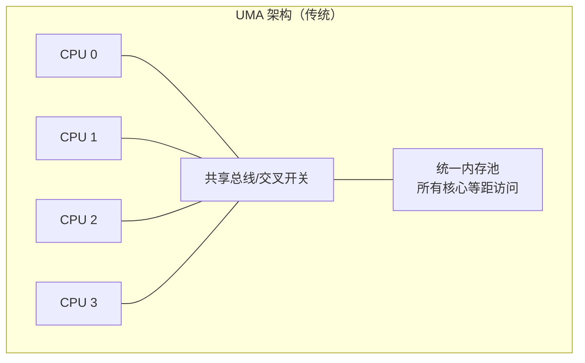
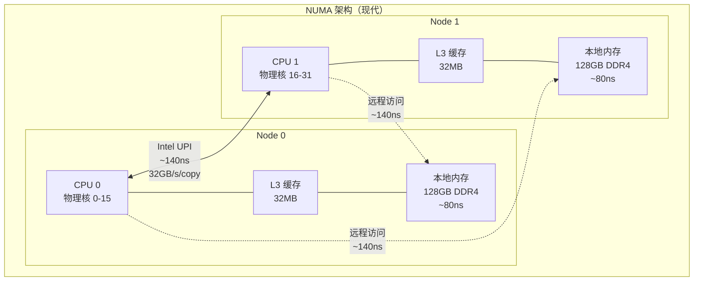
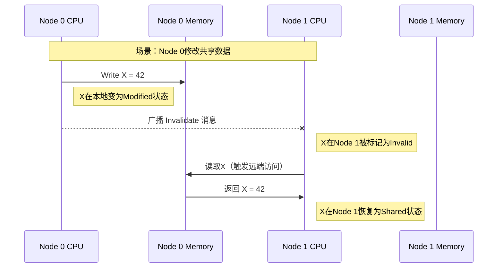
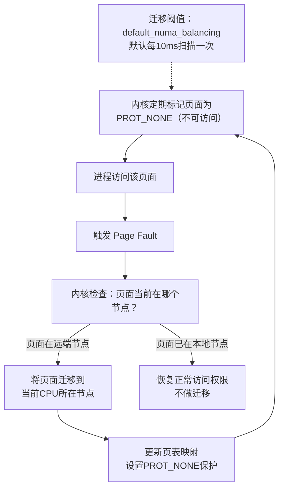
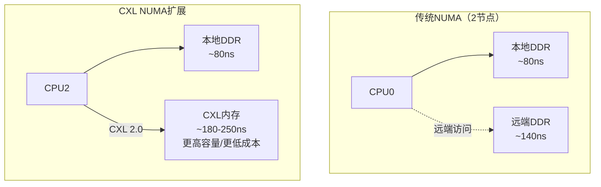

## 技巧3：NUMA架构与内存亲和性

### 概述：为什么NUMA是服务器性能的隐形杠杆？

在单路桌面系统上，所有CPU核心共享同一块内存，访问延迟均匀——这是**UMA（Uniform Memory Access）**模型。但在双路、四路甚至八路服务器上，每个CPU插槽拥有自己的本地内存，访问远端内存需要经过片间互联通道，延迟显著增加——这就是**NUMA（Non-Uniform Memory Access）**架构。

一个被忽视的事实是：**在NUMA系统上，如果进程的内存被错误地分配到远端节点，性能可能下降30%-50%**。数据库、缓存、高频交易等延迟敏感型应用尤其如此。NUMA优化不是"锦上添花"，而是"性能基线"。

本节将从硬件架构出发，深入NUMA的互联机制、内存分配策略、操作系统调度，最终落脚到可执行的生产优化方案。

---

### 1. NUMA硬件架构深度剖析

#### 1.1 从UMA到NUMA：架构演进

UMA架构中，所有CPU通过共享总线或交叉开关访问同一内存池。当核心数增多时，共享总线成为瓶颈——多个核心同时请求内存时，总线仲裁延迟急剧上升。NUMA通过将内存物理分布到各CPU附近来解决这个问题。





#### 1.2 NUMA节点内部结构

每个NUMA节点本质上是一颗独立的处理器（Socket），包含：

- **CPU核心**：物理核心+超线程，共享片上L3缓存
- **内存控制器**：直接连接DDR通道，管理本地DIMM
- **I/O Hub**：PCIe控制器，连接NVMe、网卡等设备

关键数据（以Intel Xeon Scalable 4th Gen为例）：

| 组件 | 规格 | 说明 |
|------|------|------|
| 每节点核心数 | 16-56核 | 取决于SKU |
| L3缓存 | 30-105MB | 核心共享，含Slice分布式设计 |
| 内存通道数 | 8通道 | DDR5-4800，每通道32-bit |
| 本地内存带宽 | 300-350GB/s | 8通道×4800MT/s×32bit÷8 |
| 本地内存延迟 | 75-90ns | 包含DRAM Row Hit |
| 互联带宽（UPI） | 16-24GT/s | 每条UPI链路 |

#### 1.3 节点间互联拓扑

互联通道的架构决定了远端访问的延迟特性：

| 拓扑类型 | 代表平台 | 节点数 | 延迟比（本地:远程） | 互联带宽 |
|----------|---------|--------|---------------------|----------|
| 线性（Ring/Chain） | AMD EPYC（部分） | 2-4 | 1:1.3-1:1.5 | 中等 |
| 三角/星形 | Intel Xeon 2S | 2 | 1:1.4 | 高（UPI） |
| 全连接（Full Mesh） | Intel Xeon 4S/8S | 4-8 | 1:1.5-1:2.0 | 最高 |
| Infinity Fabric | AMD EPYC（NPS4） | 2-8 | 1:1.2-1:1.8 | 按配置分片 |
| 多级互联 | IBM POWER | 4-16 | 1:2.0-1:3.0 | 分级衰减 |

**延迟构成分析**：

本地内存访问延迟（~80ns）：
  CPU核心 → L3缓存未命中 → 本地内存控制器 → DRAM读取
  总延迟 ≈ 10ns (L3 miss) + 70ns (内存控制器+DRAM) ≈ 80ns

远程内存访问延迟（~140ns）：
  CPU核心 → L3缓存未命中 → 本地内存控制器 → UPI链路 → 远端节点 → 远端DRAM
  总延迟 ≈ 10ns + 50ns (UPI传输) + 80ns (远端DRAM) ≈ 140ns
  
  → 远程访问比本地慢 75%！这不是线性叠加，而是关键路径增加

#### 1.4 缓存一致性与NUMA

NUMA系统必须维护**缓存一致性（Cache Coherency）**——当Node 0修改了某数据，Node 1的缓存中该数据的副本必须被标记为无效。Intel使用**MESIF协议**，AMD使用**MOESI协议**。



**缓存一致性的性能代价**：

- **Snoop流量**：每个写操作都需要向其他节点发送Invalidate消息
- **延迟抖动**：一致性消息穿越互联通道增加不确定性延迟
- **带宽占用**：snoop消息占用UPI/Infinity Fabric带宽

这解释了为什么**写密集型应用的NUMA敏感度远高于读密集型**——频繁写入导致大量一致性流量，远程写入的延迟惩罚更显著。

---

### 2. Linux内核的NUMA支持机制

#### 2.1 内存分配策略（Memory Policy）

Linux内核为每个进程（或VMA区域）维护NUMA内存策略：

MPOL_DEFAULT    — 默认策略：在当前CPU所在节点分配
                  典型行为：进程启动在Node 0，所有内存分配在Node 0
                  问题：如果CPU迁移了，新内存可能在不同节点

MPOL_BIND       — 绑定策略：严格限制在指定节点列表分配
                  用途：确保内存始终在特定节点上
                  风险：如果节点内存不足，分配可能失败（overcommit）
                  适用：数据库buffer pool、Redis等

MPOL_INTERLEAVE — 交错策略：在指定节点间轮询（round-robin）分配
                  用途：均匀分布内存访问，避免热点
                  适用：共享内存段、大文件缓存、memcached
                  优势：所有节点的带宽被均匀利用

MPOL_PREFERRED  — 优先策略：优先在指定节点分配，空间不足时回退
                  用途：柔性绑定，兼顾性能和可用性
                  适用：应用启动时首选节点，但允许溢出

#### 2.2 AutoNUMA（自动NUMA平衡）

Linux内核从3.8版本开始引入**AutoNUMA**（也称NUMA Balancing），通过页表采样自动检测和迁移内存页面：



AutoNUMA的优缺点：

| 方面 | 优点 | 缺点 |
|------|------|------|
| 透明性 | 应用无需修改 | 迁移过程引入短暂延迟 |
| 自适应 | 自动应对进程迁移 | 大页（HugeTLB）不支持自动迁移 |
| 开销 | 页表扫描本身消耗CPU | 内存带宽被迁移操作占用 |
| 适用性 | 适合通用负载 | 不适合延迟极敏感的应用 |

**控制参数**：

```bash
# 查看当前AutoNUMA状态
cat /proc/sys/kernel/numa_balancing
# 0 = 关闭, 1 = 开启

# 调整扫描周期（毫秒）
cat /sys/kernel/mm/numa_balancing/scan_delay_ms    # 默认1000ms（首次扫描延迟）
cat /sys/kernel/mm/numa_balancing/scan_period_min_ms  # 最小扫描间隔（默认1000ms）
cat /sys/kernel/mm/numa_balancing/scan_period_max_ms  # 最大扫描间隔（默认60000ms）
cat /sys/kernel/mm/numa_balancing/scan_size_mb        # 每次扫描页面数（默认256MB）

# 关闭AutoNUMA（性能敏感场景建议）
echo 0 > /proc/sys/kernel/numa_balancing
# 或在grub中：numa=off 或 numa_balancing=off
```

#### 2.3 内核参数与NUMA

```bash
# 查看当前内核的NUMA相关配置
sysctl -a | grep -i numa

# 关键参数：
vm.zone_reclaim_mode=0     # 0=不回收（默认），1=优先回收本节点
                           # 设置为1可能导致性能下降，通常保持0
                           
vm.numa_stat=1             # 启用per-node内存统计

kernel.numa_balancing=1    # AutoNUMA开关

# 大页与NUMA的关系
vm.nr_hugepages=0          # 全局大页数（不区分节点）
vm.nr_hugepages_mempolicy=0 # 按策略分配的大页数
```

#### 2.4 cgroups v2的NUMA控制

Kubernetes和容器环境中，cgroups v2提供了per-cgroup的NUMA资源控制：

```bash
# 查看cgroup的NUMA统计
cat /sys/fs/cgroup/myapp/memory.numa_stat

# cgroup v2 NUMA限制（需要内核5.10+）
# systemd slice中配置：
# [Slice]
# NUMAPolicy=bind
# NUMANodes=0
```

---

### 3. NUMA诊断与分析工具

#### 3.1 numactl：NUMA拓扑与策略管理

```bash
#!/bin/bash
echo "=========================================="
echo "    NUMA 系统诊断报告"
echo "=========================================="

echo ""
echo ">>> 1. 硬件拓扑"
echo "------------------------------------------"
numactl --hardware

echo ""
echo ">>> 2. 节点距离矩阵（Distance Matrix）"
echo "------------------------------------------"
echo "数值含义：100=本地访问，>100=远端访问"
echo "典型值：本地=100，远端=121-210（取决于互联架构）"
numactl --hardware | grep -A 50 "node distances"

echo ""
echo ">>> 3. 每节点内存详情"
echo "------------------------------------------"
for node_dir in /sys/devices/system/node/node*; do
    node=$(basename $node_dir)
    meminfo="$node_dir/meminfo"
    if [ -f "$meminfo" ]; then
        total=$(grep "MemTotal" "$meminfo" | awk '{print $2}')
        free=$(grep "MemFree" "$meminfo" | awk '{print $2}')
        used=$((total - free))
        echo "$node: 总计 $((total/1024/1024))GB, 已用 $((used/1024/1024))GB, 空闲 $((free/1024/1024))GB"
    fi
done

echo ""
echo ">>> 4. CPU核心到节点的映射"
echo "------------------------------------------"
for cpu_dir in /sys/devices/system/cpu/cpu*/topology/physical_package_id; do
    cpu=$(echo $cpu_dir | grep -o 'cpu[0-9]*')
    pkg=$(cat $cpu_dir 2>/dev/null)
    if [ -n "$pkg" ]; then
        echo "$cpu -> Socket/Node $pkg"
    fi
done | head -20

echo ""
echo ">>> 5. 当前AutoNUMA状态"
echo "------------------------------------------"
echo "numa_balancing: $(cat /proc/sys/kernel/numa_balancing)"
echo "zone_reclaim_mode: $(cat /proc/sys/vm/zone_reclaim_mode 2>/dev/null)"

echo ""
echo ">>> 6. 系统级NUMA统计（numastat）"
echo "------------------------------------------"
numastat 2>/dev/null || echo "numastat未安装（包：numactl）"

echo ""
echo ">>> 7. 可视化拓扑（需要安装hwloc/lstopo）"
echo "------------------------------------------"
which lstopo >/dev/null 2>&amp;1 &amp;&amp; lstopo --of ascii 2>/dev/null || echo "lstopo未安装（包：hwloc）"
```

#### 3.2 numastat：NUMA内存使用监控

```bash
#!/bin/bash
# NUMA内存使用监控脚本（建议用systemd timer每30秒执行一次）

PID=$1
if [ -z "$PID" ]; then
    echo "用法: $0 <pid>"
    echo "示例: $0 $(pgrep mysqld)"
    exit 1
fi

echo "=== PID $PID 的NUMA内存分布 ==="
echo "时间: $(date '+%Y-%m-%d %H:%M:%S')"
echo ""

# 每节点内存使用
numastat -p $PID 2>/dev/null

echo ""
echo "=== 跨节点访问统计 ==="
# 从numastat -p解析other_node（远端访问次数）
stats=$(numastat -p $PID 2>/dev/null)
if echo "$stats" | grep -q "other_node"; then
    local_hit=$(echo "$stats" | grep "local_node" | awk '{print $3}')
    remote_hit=$(echo "$stats" | grep "other_node" | awk '{print $3}')
    if [ -n "$local_hit" ] &amp;&amp; [ -n "$remote_hit" ]; then
        total=$((local_hit + remote_hit))
        if [ "$total" -gt 0 ]; then
            remote_pct=$(echo "scale=1; $remote_hit * 100 / $total" | bc)
            echo "本地访问: $local_hit 次"
            echo "远程访问: $remote_hit 次 (${remote_pct}%)"
            if (( $(echo "$remote_pct > 10" | bc -l) )); then
                echo "⚠️  警告：远程访问比例超过10%，建议优化NUMA绑定！"
            fi
        fi
    fi
fi
```

**numastat输出解读**：

Per-node process memory breakdown (MB):
                 Node 0     Node 1      Total
                --------   --------   --------
Huge               0.00       0.00       0.00
Heap              64.00     128.00     192.00
Stack              0.84       0.84       1.68
Private          256.00     512.00     768.00
Other            128.00      64.00     192.00
--------         --------   --------   --------
Total            448.74     704.84    1153.58

**关键指标解读**：
- **Node 1的Heap/Private远高于Node 0**：说明进程在Node 1上分配了更多内存
- **如果进程CPU绑定在Node 0但内存主要在Node 1**：这是典型的NUMA不亲和，需要优化
- **目标**：内存分配节点与CPU执行节点一致

#### 3.3 Intel MLC（Memory Latency Checker）

Intel MLC是测量真实内存延迟的权威工具：

```bash
# 下载Intel MLC（需要注册Intel开发人员账号）
# https://software.intel.com/content/www/us/en/develop/articles/intelr-memory-latency-checker.html

# 测量本地vs远程内存延迟
sudo ./mlc --latency_matrix

# 输出示例（2路Xeon）：
#           Node0   Node1
# Node0    81.2ns  136.5ns
# Node1   137.1ns   82.0ns
#
# → 本地访问~81ns，远程访问~137ns，延迟增加68%

# 测量内存带宽（每节点独立）
sudo ./mlc --bandwidth_matrix

# 输出示例：
#           Node0   Node1
# Node0   245GB/s   95GB/s
# Node1    95GB/s  248GB/s
#
# → 本地带宽~245GB/s，远程带宽~95GB/s，带宽下降61%
```

#### 3.4 perf：硬件级NUMA分析

```bash
# 使用perf分析内存访问的NUMA分布
sudo perf stat -e \
    uncore_imc/cas_count_read/,\
    uncore_imc/cas_count_write/ \
    -a sleep 5

# 使用perf c2c（Cache-to-Cache）分析伪共享
sudo perf c2c record -a -- sleep 5
sudo perf c2c report

# 使用perf mem分析内存访问延迟
sudo perf mem record -a -- sleep 5
sudo perf mem report --sort=mem,sym,dso

# 关键事件解读：
# - localDRAM hits: 本地DRAM命中（正常）
# - remoteDRAM hits: 远端DRAM命中（NUMA惩罚）
# - remoteCache hits: 远端缓存命中（一致性流量）
# - localRAM hits: 本地RAM命中
```

#### 3.5 lstopo：拓扑可视化

```bash
# 安装hwloc包
sudo apt install hwloc    # Debian/Ubuntu
sudo yum install hwloc    # RHEL/CentOS

# 文本模式拓扑图
lstopo --of ascii

# 典型2路服务器输出：
# ┌─────────────────────────────────────┐
# │ NUMANode#0               126GB     │
# │   ├─ Core#0                         │
# │   │  ├─ PU#0 (cpu0)                 │
# │   │  └─ PU#1 (cpu1)                 │
# │   ├─ Core#1                         │
# │   │  ├─ PU#2 (cpu2)                 │
# │   │  └─ PU#3 (cpu3)                 │
# │   ...                              │
# │   └─ HostBridge                     │
# │      ├─ PCIe Bridge                 │
# │      │  └─ NIC (eth0)              │
# │      └─ PCIe Bridge                 │
# │         └─ NVMe (nvme0)            │
# └─────────────────────────────────────┘
#        ↕ QPI/UPI
# ┌─────────────────────────────────────┐
# │ NUMANode#1               126GB     │
# │   ├─ Core#16                        │
# │   │  ├─ PU#32 (cpu32)              │
# │   │  └─ PU#33 (cpu33)              │
# │   ...                              │
# └─────────────────────────────────────┘

# PNG格式（需要X11或framebuffer）
lstopo --of png numa_topology.png
```

---

### 4. 代码示例与实操

#### 4.1 C语言：NUMA感知的内存分配

```c
#define _GNU_SOURCE
#include <numa.h>
#include <numaif.h>
#include <stdio.h>
#include <stdlib.h>
#include <string.h>
#include <time.h>
#include <sys/mman.h>

/*
 * NUMA内存分配策略演示
 * 编译：gcc -O2 -o numa_demo numa_demo.c -lnuma
 * 运行：./numa_demo
 */

#define ALLOC_SIZE (64 * 1024 * 1024)  // 64MB

static double get_time_ms() {
    struct timespec ts;
    clock_gettime(CLOCK_MONOTONIC, &amp;ts);
    return ts.tv_sec * 1000.0 + ts.tv_nsec / 1000000.0;
}

int main() {
    if (numa_available() < 0) {
        fprintf(stderr, "NUMA不可用\n");
        return 1;
    }

    int max_node = numa_max_node();
    printf("NUMA节点数: %d\n", max_node + 1);

    // 打印每个节点的可用内存
    for (int i = 0; i <= max_node; i++) {
        long free = numa_node_size(i, NULL);
        printf("  Node %d: 可用 %ld MB\n", i, free / (1024 * 1024));
    }

    // === 场景1：本地分配 vs 远程分配性能对比 ===
    printf("\n=== 场景1：内存分配位置对延迟的影响 ===\n");

    // 获取当前CPU所在节点
    int current_cpu = sched_getcpu();
    int current_node = numa_node_of_cpu(current_cpu);
    int remote_node = (current_node == 0) ? 1 : 0;
    printf("当前CPU: %d, 本地节点: %d, 远端节点: %d\n",
           current_cpu, current_node, remote_node);

    // 测试本地分配
    void *local_buf = numa_alloc_onnode(ALLOC_SIZE, current_node);
    if (local_buf) {
        double start = get_time_ms();
        memset(local_buf, 0x42, ALLOC_SIZE);
        volatile char sum = 0;
        for (size_t i = 0; i < ALLOC_SIZE; i += 64)
            sum += ((char*)local_buf)[i];
        double local_time = get_time_ms() - start;
        printf("本地分配(%d): %.2f ms\n", current_node, local_time);
        numa_free(local_buf, ALLOC_SIZE);
    }

    // 测试远程分配
    if (max_node > 0) {
        void *remote_buf = numa_alloc_onnode(ALLOC_SIZE, remote_node);
        if (remote_buf) {
            double start = get_time_ms();
            memset(remote_buf, 0x42, ALLOC_SIZE);
            volatile char sum = 0;
            for (size_t i = 0; i < ALLOC_SIZE; i += 64)
                sum += ((char*)remote_buf)[i];
            double remote_time = get_time_ms() - start;
            printf("远程分配(%d): %.2f ms\n", remote_node, remote_time);
            numa_free(remote_buf, ALLOC_SIZE);
        }
    }

    // === 场景2：MPOL_BIND绑定策略 ===
    printf("\n=== 场景2：绑定到指定节点 ===\n");

    // 创建绑定掩码
    struct bitmask *bind_mask = numa_allocate_nodemask();
    numa_bitmask_setbit(bind_mask, current_node);
    numa_set_membind(bind_mask);
    printf("已设置内存绑定到 Node %d\n", current_node);

    // 此后的所有malloc都会在指定节点分配
    void *bound_buf = malloc(ALLOC_SIZE);
    if (bound_buf) {
        printf("malloc %dMB 完成（实际在Node %d分配）\n",
               ALLOC_SIZE / 1024 / 1024, current_node);
        free(bound_buf);
    }

    // 恢复默认策略
    numa_set_local();
    numa_bitmask_free(bind_mask);

    // === 场景3：MPOL_INTERLEAVE交错分配 ===
    printf("\n=== 场景3：交错分配（适合共享内存） ===\n");
    numa_set_interleave();
    printf("已设置交错分配策略\n");

    void *interleaved_buf = numa_alloc_interleaved(ALLOC_SIZE);
    if (interleaved_buf) {
        printf("交错分配 %dMB 完成（均匀分布在所有节点）\n",
               ALLOC_SIZE / 1024 / 1024);
        numa_free(interleaved_buf, ALLOC_SIZE);
    }

    // 恢复默认
    numa_set_local();

    // === 场景4：使用mmap + MPOL_BIND（推荐方式） ===
    printf("\n=== 场景4：mmap + NUMA策略（生产推荐） ===\n");

    // mmap分配，然后通过mbind设置策略
    void *mmap_buf = mmap(NULL, ALLOC_SIZE, PROT_READ | PROT_WRITE,
                          MAP_PRIVATE | MAP_ANONYMOUS, -1, 0);
    if (mmap_buf != MAP_FAILED) {
        struct bitmask *nodemask = numa_allocate_nodemask();
        numa_bitmask_setbit(nodemask, current_node);

        // MPOL_BIND确保只在指定节点分配
        if (mbind(mmap_buf, ALLOC_SIZE, MPOL_BIND,
                  nodemask->maskp, nodemask->size + 1, 0) == 0) {
            printf("mmap + MPOL_BIND: 已绑定到 Node %d\n", current_node);
        } else {
            perror("mbind");
        }
        numa_bitmask_free(nodemask);
        munmap(mmap_buf, ALLOC_SIZE);
    }

    printf("\n完成。所有NUMA策略演示结束。\n");
    return 0;
}
```

#### 4.2 Python：NUMA感知的内存延迟测试

```python
#!/usr/bin/env python3
"""
NUMA内存延迟测试工具
功能：
  1. 检测NUMA拓扑和节点距离
  2. 测量本地vs远程内存访问延迟
  3. 对比顺序vs随机访问模式
  4. 生成NUMA优化建议
需要：root权限（numactl），Python 3.6+
"""
import subprocess
import time
import os
import sys
import struct

def run_cmd(cmd, default=""):
    """安全执行系统命令"""
    try:
        result = subprocess.run(
            cmd, shell=True, capture_output=True, text=True, timeout=30
        )
        return result.stdout.strip() if result.returncode == 0 else default
    except (subprocess.TimeoutExpired, FileNotFoundError):
        return default

def detect_numa_topology():
    """检测NUMA拓扑"""
    print("=" * 60)
    print("NUMA 拓扑检测")
    print("=" * 60)
    
    # 检查是否为NUMA系统
    if not os.path.exists("/sys/devices/system/node/node1"):
        print("⚠️  当前系统为UMA架构（单节点），NUMA优化不适用")
        return 0, {}
    
    # 获取节点数
    nodes = [d for d in os.listdir("/sys/devices/system/node") 
             if d.startswith("node") and d[4:].isdigit()]
    node_count = len(nodes)
    print(f"NUMA节点数: {node_count}")
    
    # 获取节点距离矩阵
    distance_file = "/sys/devices/system/node/node0/distance"
    if os.path.exists(distance_file):
        with open(distance_file) as f:
            distances = [int(x) for x in f.read().split()]
        print(f"\n节点距离矩阵（100=本地）:")
        for i, d in enumerate(distances[:node_count]):
            print(f"  Node 0 → Node {i}: {d}")
    
    # 每节点内存
    print(f"\n各节点内存:")
    for node_id in range(node_count):
        meminfo = f"/sys/devices/system/node/node{node_id}/meminfo"
        if os.path.exists(meminfo):
            with open(meminfo) as f:
                for line in f:
                    if "MemTotal" in line:
                        parts = line.split()
                        total_kb = int(parts[1])
                        print(f"  Node {node_id}: {total_kb / 1024 / 1024:.1f} GB")
                        break
    
    return node_count, {}

def measure_memory_bandwidth():
    """测量内存带宽（使用STREAM-like方法）"""
    print("\n" + "=" * 60)
    print("内存带宽测量（简化STREAM）")
    print("=" * 60)
    
    size_mb = 256  # 256MB，确保超出L3缓存
    num_elements = (size_mb * 1024 * 1024) // 4  # int32
    
    # 使用numactl运行带宽测试
    for policy in ["local", "interleave"]:
        cmd = f"numactl --{policy} python3 -c \""
        cmd += f"import time; a = [0] * {num_elements}; "
        cmd += f"b = [1] * {num_elements}; "
        cmd += f"start = time.perf_counter(); "
        cmd += f"a = b[:]; "  # 复制操作
        cmd += f"elapsed = time.perf_counter() - start; "
        cmd += f"bw = {size_mb} / elapsed; "
        cmd += f"print(f'策略={policy}: {{elapsed:.3f}}s, 带宽={{bw:.1f}} MB/s')"
        cmd += "\""
        
        output = run_cmd(cmd, "测量失败（需要numactl）")
        if output:
            for line in output.split('\n'):
                if '策略=' in line:
                    print(f"  {line.strip()}")

def measure_access_pattern():
    """测量顺序vs随机内存访问模式"""
    print("\n" + "=" * 60)
    print("内存访问模式对比（顺序 vs 随机）")
    print("=" * 60)
    
    # 使用纯Python测量（简化版，真实环境建议用C扩展）
    size_mb = 64
    num_elements = (size_mb * 1024 * 1024) // 8  # 使用bytearray的index
    
    print(f"测试缓冲区: {size_mb} MB")
    print(f"注意：以下为用户态测量（含Python解释器开销），用于对比趋势")
    
    # 顺序访问
    import random
    buf = bytearray(size_mb * 1024 * 1024)
    
    start = time.perf_counter()
    for i in range(0, len(buf), 64):  # 每64字节访问一次（cache line）
        buf[i] = 1
    seq_time = time.perf_counter() - start
    
    # 随机访问（采样，避免超时）
    sample_size = min(1000000, len(buf) // 64)
    indices = random.sample(range(len(buf) // 64), sample_size) * 64
    
    start = time.perf_counter()
    for idx in indices:
        buf[idx] = 1
    rand_time = time.perf_counter() - start
    
    seq_rate = len(buf) / seq_time / 1024 / 1024
    rand_rate = len(buf) * sample_size / (len(buf) // 64) / rand_time / 1024 / 1024
    
    print(f"\n  顺序访问: {seq_time*1000:.1f} ms ({seq_rate:.0f} MB/s)")
    print(f"  随机访问: {rand_time*1000:.1f} ms ({rand_rate:.0f} MB/s)")
    print(f"  随机/顺序比: {rand_time/seq_time:.1f}x（越大说明缓存/预取越重要）")

def generate_optimization_report():
    """生成NUMA优化建议"""
    print("\n" + "=" * 60)
    print("NUMA 优化建议")
    print("=" * 60)
    
    recommendations = [
        ("查看拓扑", "numactl --hardware"),
        ("绑定运行（单实例应用）", "numactl --cpunodebind=0 --membind=0 ./app"),
        ("交错分配（共享内存）", "numactl --interleave=all ./app"),
        ("监控跨节点", "watch -n 5 'numastat -p $(pgrep app)'"),
        ("关闭AutoNUMA", "echo 0 > /proc/sys/kernel/numa_balancing"),
        ("内核参数", "sysctl -w vm.zone_reclaim_mode=0"),
        ("K8s NUMA感知", "topologyManager: best-effort（Pod spec中）"),
    ]
    
    for i, (desc, cmd) in enumerate(recommendations, 1):
        print(f"  {i}. {desc}:")
        print(f"     {cmd}")

def main():
    if os.geteuid() != 0:
        print("⚠️  建议以root权限运行以获取完整信息")
    
    node_count, _ = detect_numa_topology()
    measure_access_pattern()
    measure_memory_bandwidth()
    generate_optimization_report()

if __name__ == "__main__":
    main()
```

#### 4.3 Go语言：NUMA感知的服务启动

```go
package main

import (
	"fmt"
	"os"
	"runtime"
	"strconv"
	"syscall"
)

/*
 * Go NUMA感知启动脚本
 * 
 * 核心思路：
 * 1. 限制GOMAXPROCS到单节点的核数
 * 2. 设置CPU亲和性绑定
 * 3. 配合numactl --membind使用
 * 
 * 编译：go build -o numa_server numa_server.go
 * 运行：numactl --cpunodebind=0 --membind=0 ./numa_server
 */

func setCPUAffinity(cpus []int) error {
	var cpuSet syscall.CPUSet
	cpuSet.Zero()
	for _, cpu := range cpus {
		cpuSet.Set(cpu)
	}
	pid := os.Getpid()
	return syscall.SchedSetaffinity(pid, &amp;cpuSet)
}

func detectNumaNodeCPUs() (int, int) {
	// 读取CPU到NUMA节点映射
	// 简单假设：前N/2个CPU在Node 0，后N/2在Node 1
	numCPUs := runtime.NumCPU()
	halfCPUs := numCPUs / 2

	// 检查是否有NUMA信息
	if _, err := os.Stat("/sys/devices/system/node/node1"); err == nil {
		// 真正的NUMA系统，尝试读取拓扑
		cpuList := []int{}
		for cpu := 0; cpu < halfCPUs; cpu++ {
			cpuList = append(cpuList, cpu)
		}
		return numCPUs, len(cpuList)
	}

	// UMA系统，使用全部CPU
	return numCPUs, numCPUs
}

func main() {
	totalCPUs, targetCPUs := detectNumaNodeCPUs()
	fmt.Printf("总CPU数: %d, 绑定核数: %d\n", totalCPUs, targetCPUs)

	// 构建CPU绑定列表（前targetCPUs个核心）
	cpus := make([]int, targetCPUs)
	for i := range cpus {
		cpus[i] = i
	}

	// 设置CPU亲和性
	if err := setCPUAffinity(cpus); err != nil {
		fmt.Printf("CPU亲和性设置失败: %v\n", err)
		fmt.Println("请使用 numactl --cpunodebind=0 运行此程序")
	} else {
		fmt.Printf("已绑定到CPU: %v\n", cpus)
	}

	// 限制GOMAXPROCS
	runtime.GOMAXPROCS(targetCPUs)
	fmt.Printf("GOMAXPROCS = %d\n", runtime.GOMAXPROCS(0))

	// 分配大块内存并初始化（触发页面分配）
	sizeMB := 512
	buf := make([]byte, sizeMB*1024*1024)
	for i := 0; i < len(buf); i += 4096 {
		buf[i] = 1 // 逐页触发分配
	}
	fmt.Printf("已分配 %d MB 测试内存\n", sizeMB)

	// 提示numactl配置
	if node := os.Getenv("NUMA_NODE"); node != "" {
		n, _ := strconv.Atoi(node)
		fmt.Printf("\nNUMA_NODE环境变量=%d\n", n)
		fmt.Printf("建议: numactl --cpunodebind=%d --membind=%d ./numa_server\n", n, n)
	} else {
		fmt.Println("\n提示: 建议通过 numactl 运行以确保内存绑定:")
		fmt.Println("  numactl --cpunodebind=0 --membind=0 ./numa_server")
	}

	// 模拟服务运行
	fmt.Println("\n服务已启动，按Ctrl+C退出...")
	select {}
}
```

#### 4.4 Java：NUMA感知的JVM配置

```bash
#!/bin/bash
# Java应用NUMA优化启动脚本
# 适用于：Elasticsearch、Cassandra、HBase等Java大数据应用

APP_NAME="my-java-app"
JAR_PATH="/opt/apps/${APP_NAME}.jar"
HEAP_SIZE="64g"
GC="G1GC"

echo "=== Java NUMA优化启动 ==="

# 检测NUMA节点
NODE_COUNT=$(numactl --hardware | grep "cpus:" | wc -l)
echo "检测到 $NODE_COUNT 个NUMA节点"

if [ "$NODE_COUNT" -gt 1 ]; then
    echo "多节点系统，启用NUMA优化..."
    
    # JVM NUMA选项
    JAVA_OPTS="
        -Xms${HEAP_SIZE} -Xmx${HEAP_SIZE}
        -XX:+UseNUMA               # 启用NUMA感知分配
        -XX:+UseG1GC               # G1GC支持NUMA
        -XX:ParallelGCThreads=16   # GC线程数=单节点核数
        -XX:ConcGCThreads=4        # 并发GC线程数
        -XX:+UseTransparentHugePages  # 大页支持
        -XX:ReservedCodeCacheSize=256m
        -Djava.net.preferIPv4Stack=true
    "
    
    # 使用numactl绑定到Node 0
    echo "绑定到 NUMA Node 0"
    exec numactl --cpunodebind=0 --membind=0 \
        java $JAVA_OPTS -jar $JAR_PATH
else
    echo "单节点系统，使用默认配置"
    exec java \
        -Xms${HEAP_SIZE} -Xmx${HEAP_SIZE} \
        -XX:+UseG1GC \
        -jar $JAR_PATH
fi
```

**JVM NUMA选项详解**：

| 参数 | 作用 | 适用场景 |
|------|------|----------|
| `-XX:+UseNUMA` | 启用NUMA感知的Eden区分配 | G1GC、ParallelGC |
| `-XX:NUMAChunkSize=N` | 每次在NUMA节点上分配的内存块大小（字节） | 大堆应用 |
| `-XX:+UseLargePages` | 使用2MB/1GB大页 | 减少TLB miss |
| `-XX:ParallelGCThreads=N` | GC线程数，建议=单节点核数 | 减少跨节点GC通信 |
| `-XX:+UseZGC` | ZGC天然NUMA感知（JDK 15+） | 超大堆、延迟敏感 |

---

### 5. 生产场景最佳实践

#### 5.1 数据库（MySQL/PostgreSQL）

```bash
# MySQL 8.0+ NUMA优化
# my.cnf
[mysqld]
# InnoDB缓冲池NUMA交错分配（推荐，避免缓冲池集中在单节点）
innodb_numa_interleave=ON

# 或手动绑定（适合专用数据库服务器）
# numactl --interleave=all mysqld

# PostgreSQL NUMA优化
# postgresql.conf
shared_buffers = '64GB'           # 匹配单节点内存的50-70%
effective_cache_size = '192GB'    # 系统总内存的75%
# 运行方式：
# numactl --interleave=all postgres -D /var/lib/postgresql/data
```

**数据库NUMA策略对比**：

| 数据库 | 推荐策略 | 原因 |
|--------|---------|------|
| MySQL（单实例） | `--interleave=all` | InnoDB buffer pool大，均匀分布避免热点 |
| PostgreSQL（单实例） | `--interleave=all` | shared_buffers类似，均匀分布 |
| Redis（单实例） | `--membind=0` | 全内存，严格绑定到单节点 |
| Redis（主从） | 每实例绑定不同节点 | 利用多节点并行 |
| MongoDB | `--interleave=all` | WiredTiger缓存跨节点均匀分布 |
| ClickHouse | `--cpunodebind=0 --membind=0` | 列式引擎，本地化性能最优 |

#### 5.2 缓存系统（Redis/Memcached）

```bash
# Redis：单实例绑定
numactl --membind=0 redis-server /etc/redis/redis.conf

# Memcached：交错分配（适合多线程共享）
numactl --interleave=all memcached -m 64 -t 8

# 多实例Redis（每实例一个NUMA节点）
# Node 0
numactl --cpunodebind=0 --membind=0 \
    redis-server --port 6379 --daemonize yes --logfile /var/log/redis/6379.log

# Node 1
numactl --cpunodebind=1 --membind=1 \
    redis-server --port 6380 --daemonize yes --logfile /var/log/redis/6380.log
```

#### 5.3 容器与Kubernetes

```yaml
# Kubernetes Pod NUMA亲和性配置
apiVersion: v1
kind: Pod
metadata:
  name: numa-sensitive-app
spec:
  containers:
  - name: app
    image: myapp:latest
    resources:
      limits:
        cpu: "8"
        memory: "32Gi"
      requests:
        cpu: "8"
        memory: "32Gi"
  topologyPolicy: best-effort  # kube-scheduler NUMA感知调度
  # 节点必须启用TopologyManager
  # kubelet配置：--topology-manager-policy=best-effort
```

**Kubernetes NUMA管理要点**：

1. **TopologyManager**：kubelet级别的NUMA感知调度策略
   - `none`：不感知（默认）
   - `best-effort`：尽量匹配，不保证
   - `restricted`：必须匹配，否则Pod启动失败
   - `single-numa-node`：强制单节点（最严格）

2. **CPU Manager**：静态分配CPU核心到Pod
   - `none`（默认）：可抢占
   - `static`：独占核心绑定

3. **Memory Manager**：内存节点绑定（K8s 1.22+）
   - `none`（默认）
   - `static`：绑定到指定NUMA节点

#### 5.4 虚拟化环境

```bash
# KVM/QEMU：NUMA透传
# 将宿主机的NUMA拓扑暴露给虚拟机
qemu-system-x86_64 \
    -smp 16,sockets=2,cores=8,threads=1 \
    -m 64G \
    -numa node,nodeid=0,cpus=0-7,memdev=mem0 \
    -numa node,nodeid=1,cpus=8-15,memdev=mem1 \
    -object memory-backend-ram,size=32G,id=mem0 \
    -object memory-backend-ram,size=32G,id=mem1 \
    -numa dist,src=0,dst=1,val=210 \
    ...

# libvirt XML配置示例
# <numatune>
#   <memory mode='strict' nodeset='0'/>
# </numatune>
# <vcpu placement='static'>8</vcpu>
# <cputune>
#   <vcpupin vcpu='0' cpuset='0'/>
#   <vcpupin vcpu='1' cpuset='1'/>
#   ...
# </cputune>
```

---

### 6. 常见错误与解决方案

#### 错误1：Go服务未做NUMA约束

```bash
# ❌ 错误：Go运行时在所有CPU核上调度，goroutine跨NUMA访问
./my-go-server

# ✅ 正确方案：
# 方案A：numactl绑定（简单直接）
numactl --cpunodebind=0 --membind=0 ./my-go-server

# 方案B：代码内设置GOMAXPROCS + CPU亲和性
# （见4.3节Go示例）

# 方案C：systemd服务配置
# [Service]
# CPUAffinity=0-15
# ExecStart=/usr/local/bin/my-go-server
```

#### 错误2：Redis跨节点分配

```bash
# ❌ 错误：Redis数据被分配到远端NUMA节点
redis-server /etc/redis/redis.conf
# 典型表现：GET/SET延迟从0.1ms飙升到0.3ms

# ✅ 正确：
# 方案A：交错分配（推荐，利用所有节点带宽）
numactl --interleave=all redis-server /etc/redis/redis.conf

# 方案B：严格绑定（适合小数据集，<单节点内存）
numactl --membind=0 redis-server /etc/redis/redis.conf

# 验证：
redis-cli INFO memory | grep used_memory
numastat -p $(pgrep redis-server)
```

#### 错误3：MySQL Buffer Pool跨节点

```bash
# ❌ 错误：InnoDB buffer pool跨越两个NUMA节点，查询延迟抖动
# MySQL 8.0之前默认行为

# ✅ 正确（MySQL 8.0+）：
# my.cnf
[mysqld]
innodb_numa_interleave=ON  # 交错分配buffer pool

# ✅ 正确（MySQL 5.7及更早版本）：
# 使用numactl启动
numactl --interleave=all mysqld --defaults-file=/etc/my.cnf

# 验证：
mysql> SHOW GLOBAL STATUS LIKE 'Innodb_buffer_pool%';
# 检查buffer pool是否均匀分布
```

#### 错误4：HugePages与NUMA冲突

```bash
# ❌ 错误：全局分配大页但未指定节点
echo 32768 > /proc/sys/vm/nr_hugepages  # 32768 × 2MB = 64GB
# 大页可能集中在单个节点，导致其他节点内存不足

# ✅ 正确：per-node分配大页
# Node 0 分配32GB大页
numactl --membind=0 sh -c 'echo 16384 > /sys/kernel/mm/hugepages/hugepages-2048kB/nr_hugepages'

# Node 1 分配32GB大页
numactl --membind=1 sh -c 'echo 16384 > /sys/kernel/mm/hugepages/hugepages-2048kB/nr_hugepages'

# 验证：
cat /sys/kernel/mm/hugepages/hugepages-2048kB/nr_hugepages
cat /sys/kernel/mm/hugepages/hugepages-2048kB/free_hugepages
```

#### 错误5：AutoNUMA对延迟敏感应用的干扰

```bash
# ❌ 问题：AutoNUMA频繁迁移页面，导致延迟毛刺
# 典型表现：P99延迟周期性飙升到数百微秒

# ✅ 正确：
# 1. 关闭AutoNUMA
echo 0 > /proc/sys/kernel/numa_balancing

# 2. 使用numactl手动控制
numactl --cpunodebind=0 --membind=0 ./latency-sensitive-app

# 3. 检查是否还有迁移活动
watch -n 1 'numastat -p $(pgrep app)'
# 观察 other_node 计数是否持续增长
```

---

### 7. 进阶：NUMA与现代内存架构

#### 7.1 CXL（Compute Express Link）与NUMA

CXL是基于PCIe 5.0的互联标准，允许CPU通过CXL协议访问远端内存设备（CXL Memory），形成**内存分层（Memory Tiering）**架构：



CXL内存的NUMA特性：

| 特性 | 本地DDR | 远端DDR | CXL Memory |
|------|---------|---------|------------|
| 延迟 | ~80ns | ~140ns | ~180-250ns |
| 带宽 | ~300GB/s | ~100GB/s | ~32-64GB/s（取决于CXL控制器） |
| 容量 | 受DDR通道限制 | 同左 | 可扩展TB级 |
| 用途 | 热数据 | 温数据 | 冷数据/大容量缓存 |

Linux对CXL内存的NUMA支持（内核6.1+）：

```bash
# 查看CXL设备
cxl list

# CXL内存作为NUMA节点
# 内核自动将CXL内存注册为新的NUMA node
numactl --hardware  # 会显示额外的node

# 手动策略：热数据放DDR，冷数据放CXL
numactl --membind=0,1 ./app        # 热数据在本地DDR
numactl --interleave=0,1,2 ./app   # 混合所有节点（含CXL）
```

#### 7.2 Intel Hybrid Architecture（P-core/E-core）与NUMA

Intel 12th Gen+的混合架构（P-core性能核+E-core能效核）引入了额外的NUMA层次：

```bash
# 查看P-core/E-core的NUMA分布
lscpu -e
# CPU  ONLINE  SOCKET  NODE  L1d:L1i:L2:L3  ONLINE书籍

# P-core（性能核）：每个核心独立L2，共享L3
# E-core（能效核）：4个核心共享L2，共享L3
# 
# 在NUMA上下文中：
# - P-core更适合延迟敏感任务
# - E-core适合批处理/后台任务
# - 绑核策略：关键线程绑P-core，Worker绑E-core
```

#### 7.3 AMD Infinity Fabric与NPS配置

AMD EPYC的NUMA节点分片（Nodes Per Socket, NPS）配置：

| NPS模式 | 每Socket节点数 | 适用场景 | 内存带宽利用 |
|---------|---------------|---------|-------------|
| NPS1 | 1 | 大内存应用（单VM占满） | 最低（所有内存视为一个节点） |
| NPS2 | 2 | 双路部署、中等VM | 中等 |
| NPS4 | 4 | 多VM、高性能计算 | 最高（每节点独立带宽） |

```bash
# 查看当前NPS配置
lscpu | grep "NUMA"
# NUMA node(s): 8        ← 2路×NPS4=8个节点

# 在BIOS中设置NPS模式
# AMD CBS → SVM Mode → NUMA Nodes Per Socket → NPS4
```

---

### 8. NUMA优化检查清单

在生产环境部署前，按以下清单逐项确认：

□ 1. 拓扑确认
  □ 运行 numactl --hardware 确认节点数和距离
  □ 运行 lstopo --of ascii 可视化拓扑
  □ 确认CPU核心到节点的映射关系

□ 2. 策略选择
  □ 单实例延迟敏感应用 → --cpunodebind + --membind
  □ 单实例吞吐导向应用 → --interleave=all
  □ 多实例应用 → 每实例绑定不同节点
  □ 共享内存场景 → --interleave=all

□ 3. 内核配置
  □ vm.zone_reclaim_mode=0（避免跨节点回收）
  □ numa_balancing=0（延迟敏感应用关闭AutoNUMA）
  □ 确认THP（Transparent Huge Pages）配置

□ 4. 应用配置
  □ 数据库：设置innodb_numa_interleave=ON（MySQL）
  □ JVM：-XX:+UseNUMA（G1GC/ZGC）
  □ Go：GOMAXPROCS=单节点核数 + CPU亲和性
  □ Redis：numactl --interleave=all 或 --membind

□ 5. 监控验证
  □ numastat -p <pid> 检查内存分布
  □ 关注other_node计数（跨节点访问次数）
  □ perf c2c 分析缓存一致性流量
  □ 基线测试：对比优化前后的P50/P99延迟

□ 6. 容器/编排
  □ Kubernetes：TopologyManager策略配置
  □ CPU Manager：static模式独占核心
  □ Memory Manager：内存节点绑定
  □ cgroups v2：NUMA资源限制

---

### 9. 总结

NUMA优化的核心思想可以归纳为一句话：**让计算靠近数据**。

NUMA优化的本质：

  进程的CPU执行位置 = 内存分配的物理节点
  
  本地访问（~80ns）  ← 优化目标
  远端访问（~140ns） ← 必须避免
  
  两者差距：75%延迟增加 → 直接反映在P99延迟上

**不同层级的读者应关注**：

| 读者层级 | 关注重点 |
|---------|---------|
| 初级运维 | numactl基本用法，绑定和交错策略 |
| 中级开发 | 应用层NUMA配置（JVM/Go/Redis参数） |
| 高级SRE | AutoNUMA调优，cgroups v2，K8s TopologyManager |
| 架构师 | CXL内存分层，AMD NPS设计，NUMA感知的微服务拆分 |
| 内核开发者 | AutoNUMA迁移算法，页表扫描策略，cache一致性协议优化 |

**记住**：NUMA不是"高级优化"，而是"基础正确性"——在多路服务器上，不做NUMA绑定就像在高速公路上逆行。性能下降是必然的，只是你可能还没意识到而已。
