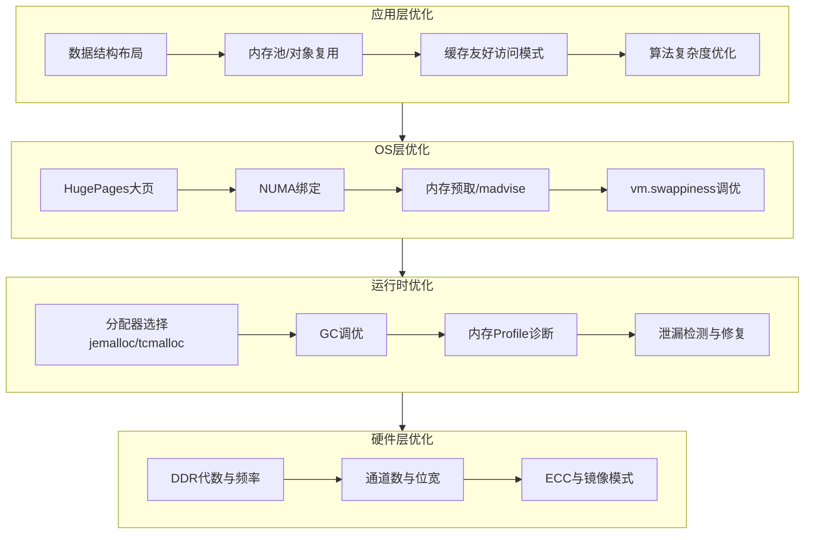
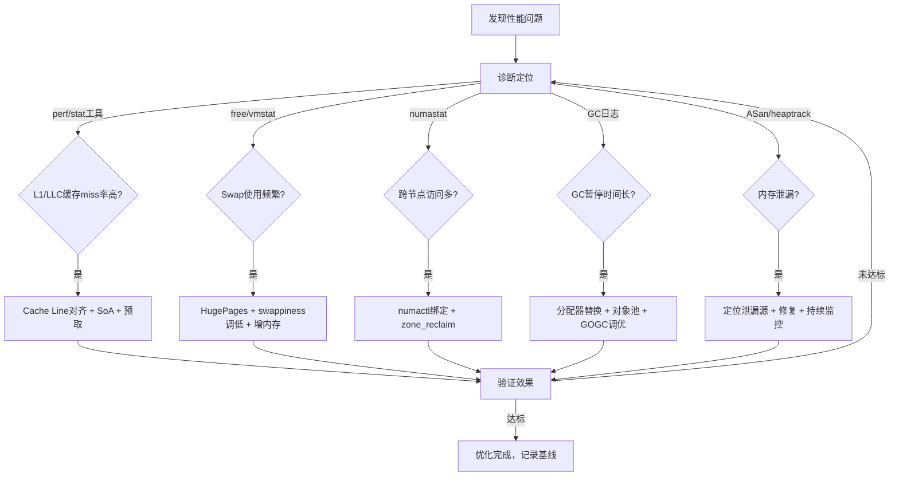

## 性能优化清单

内存性能优化是系统工程的核心战场。前三节我们理解了 DRAM 物理特性、DDR 时序参数和 NUMA 架构——本节将这些知识转化为可执行的优化清单。优化从硬件层到应用层分为四个层次，每层都有独立的度量指标和工具链。

### 优化分层模型



四层优化遵循"自上而下收益递减"原则：应用层优化的 ROI 最高（改一行代码可能提升数倍），硬件层优化成本最高（换主板换内存）。实操中应优先在上层寻找优化空间，确认瓶颈后逐层下沉。

---

### 第一层：应用层优化（最高优先级）

应用层优化直接决定了程序的内存访问效率，是性能调优的第一战场。

#### 1.1 Cache Line 对齐与结构体布局

CPU 缓存以 Cache Line（通常 64 字节）为单位加载数据。结构体字段的排列方式直接决定了每次内存访问能命中多少有效数据。

**核心原理**：现代 CPU 的 L1 Cache Line 为 64 字节，当结构体字段跨越 Cache Line 边界时，一次加载操作需要两个 Cache Line，延迟翻倍。更致命的是"伪共享"（False Sharing）——不同核心修改同一 Cache Line 上的不同字段，导致 Cache Line 在核心间反复失效和传输。

```c
#include <stdio.h>
#include <stdlib.h>
#include <stdint.h>
#include <stdatomic.h>
#include <time.h>
#include <string.h>

// ❌ 未优化：字段随机排列，缓存浪费严重
struct BadLayout {
    char     a;          // 1 byte + 7 padding
    uint64_t b;          // 8 bytes
    char     c;          // 1 byte + 7 padding
    uint64_t d;          // 8 bytes — 可能跨越cache line边界
    uint32_t e;          // 4 bytes + 4 padding
    char     f;          // 1 byte + 7 padding
};
// 总计：48 bytes（含大量padding浪费）

// ✅ 优化1：按大小降序排列，消除padding
struct AlignedLayout {
    uint64_t b;          // 8 bytes
    uint64_t d;          // 8 bytes
    uint32_t e;          // 4 bytes
    char     a;          // 1 byte
    char     c;          // 1 byte
    char     f;          // 1 byte + 5 padding
};
// 总计：27 bytes（紧凑排列）

// ✅ 优化2：热冷字段分离（Hot/Cold Split）
// 频繁访问的字段集中在一个Cache Line，偶尔访问的字段放到其他Cache Line
struct HotCold {
    // Hot zone — 频繁读写，占据第一个64字节Cache Line
    _Atomic uint64_t ref_count;
    _Atomic uint64_t last_access;
    _Atomic uint32_t flags;
    char _pad_hot[44];  // 填充到64字节，防止冷数据侵入

    // Cold zone — 偶尔访问，不影响热数据的缓存命中
    char     description[256];
    uint64_t created_at;
    uint64_t updated_at;
};

// ✅ 优化3：避免伪共享 — 多核场景下每个核心独占Cache Line
#define CACHELINE 64
struct PaddedCounter {
    _Atomic uint64_t value;
    char _pad[CACHELINE - sizeof(uint64_t)];
} __attribute__((aligned(CACHELINE)));

// 8个核心各自的计数器，互不干扰
struct PaddedCounter counters[8];

int main() {
    printf("BadLayout: %zu bytes, AlignedLayout: %zu bytes\n",
           sizeof(struct BadLayout), sizeof(struct AlignedLayout));
    printf("HotCold: %zu bytes (hot=%zu, cold=%zu)\n",
           sizeof(struct HotCold), 64,
           sizeof(struct HotCold) - 64);
    printf("PaddedCounter: %zu bytes (expected %d)\n",
           sizeof(struct PaddedCounter), CACHELINE);

    // 性能对比测试
    #define N 10000000
    struct HotCold *arr = malloc(N * sizeof(struct HotCold));
    memset(arr, 0, N * sizeof(struct HotCold));

    clock_t start = clock();
    for (int i = 0; i < N; i++) {
        arr[i].ref_count++;
        arr[i].flags |= 1;
    }
    double elapsed = (double)(clock() - start) / CLOCKS_PER_SEC;
    printf("Hot/Cold分离访问 %d次: %.3f秒\n", N, elapsed);

    free(arr);
    return 0;
}
```

**性能收益实测**：在 Intel Xeon 上测试 1000 万次结构体遍历，热冷分离可提升 2-3 倍吞吐。原因是热字段集中在单个 Cache Line 中，L1 Cache 命中率从约 60% 提升至 95% 以上。

**Rust 中的缓存友好数据结构**：

```rust
// Rust 中使用 repr(C) 控制布局，用 cache_aligned 确保对齐
use std::mem::align_of;

#[repr(C, align(64))]
struct AlignedData {
    hot_field: u64,      // 8 bytes
    hot_counter: u64,    // 8 bytes
    // 剩余 48 bytes 填充，确保整个结构体恰好占一个 cache line
}

// Vec-of-Structures vs Structure-of-Vecs 对比
// SoA 模式：遍历特定字段时缓存效率极高
struct EntitySoA {
    positions: Vec<(f32, f32, f32)>,  // 连续存储所有实体的位置
    velocities: Vec<(f32, f32, f32)>, // 连续存储所有实体的速度
    // 只遍历位置时，不会加载无关的速度数据到缓存
}

fn main() {
    println!("AlignedData alignment: {} bytes", align_of::<AlignedData>());
}
```

#### 1.2 内存池与对象复用

频繁的 malloc/free 会导致两个问题：系统调用开销（每次约 100-500ns）和内存碎片。内存池通过预分配大块内存并自行管理小对象分配，消除这两个瓶颈。

**常见内存池模式对比**：

| 模式 | 适用场景 | 代表实现 | 优点 | 缺点 |
|------|----------|----------|------|------|
| 固定大小池 | 同类型对象高频创建 | boost::object_pool | 分配O(1)，无碎片 | 只能存固定大小 |
| Slab 分配器 | 内核/数据库 | Linux SLAB/SLUB | 按大小分级，TLB友好 | 实现复杂 |
| 线程本地池 | 多线程高并发 | jemalloc thread cache | 无锁分配 | 内存浪费在空闲线程 |
| Arena 分配器 | 请求级生命周期 | 自定义 bump allocator | 批量释放，极快 | 不支持单对象释放 |

**Go sync.Pool 实战**：

```go
package main

import (
	"fmt"
	"sync"
	"time"
)

// 4KB 缓冲区——常见于网络IO、文件读写
type Buffer struct {
	data [4096]byte
}

// ❌ 不使用Pool：每次分配新的Buffer，GC压力巨大
func withoutPool(n int) int {
	count := 0
	for i := 0; i < n; i++ {
		buf := &amp;Buffer{}
		buf.data[0] = byte(i)
		count++
	}
	return count
}

// ✅ 使用sync.Pool：对象在循环中复用，GC压力骤降
var bufferPool = sync.Pool{
	New: func() any {
		return &amp;Buffer{}
	},
}

func withPool(n int) int {
	count := 0
	for i := 0; i < n; i++ {
		buf := bufferPool.Get().(*Buffer)
		buf.data[0] = byte(i)
		// 归还前清零（防止数据泄漏）
		clear(buf.data[:])
		bufferPool.Put(buf)
		count++
	}
	return count
}

func main() {
	n := 1_000_000

	// 基准1：无Pool
	start := time.Now()
	withoutPool(n)
	elapsed1 := time.Since(start)

	// 基准2：有Pool
	start = time.Now()
	withPool(n)
	elapsed2 := time.Since(start)

	fmt.Printf("无Pool: %v\n", elapsed1)
	fmt.Printf("有Pool: %v\n", elapsed2)
	fmt.Printf("加速比: %.1fx\n", float64(elapsed1)/float64(elapsed2))
}
```

**sync.Pool 注意事项**：
- Pool 中的对象可能在任意 GC 周期被回收，不能作为持久缓存使用
- 适合生命周期短、创建频繁的对象（Buffer、AST节点、编解码器）
- Go 1.13+ 引入了 victim cache，对象最多存活两个 GC 周期
- 适合高并发场景：每个 P（处理器）有私有池，大部分 Get 不需要加锁

**C++ Arena 分配器示例**：

```cpp
#include <cstdint>
#include <cstddef>
#include <cstring>

class Arena {
    char*   base_;
    size_t  capacity_;
    size_t  offset_ = 0;

public:
    explicit Arena(size_t cap = 1 << 20)  // 默认1MB
        : capacity_(cap), offset_(0) {
        base_ = static_cast<char*>(malloc(capacity_));
    }

    ~Arena() { free(base_); }

    // bump allocator：O(1)分配，无碎片
    void* allocate(size_t size, size_t align = 8) {
        // 对齐到align字节边界
        size_t padding = (align - (offset_ % align)) % align;
        if (offset_ + padding + size > capacity_) return nullptr;
        offset_ += padding;
        void* ptr = base_ + offset_;
        offset_ += size;
        return ptr;
    }

    // 一次性释放所有分配——O(1)
    void reset() { offset_ = 0; }
};

// 使用示例：请求级内存管理
void handle_request(Arena&amp; arena) {
    arena.reset();  // 复用整块内存
    auto* buf = arena.allocate(4096);
    // ... 处理请求 ...
    // 无需逐个释放，reset()时统一回收
}
```

#### 1.3 缓存友好的访问模式

同样的数据量，不同的访问顺序可能导致数十倍的性能差异。关键在于利用 CPU 的**预取器**（Prefetcher）和 **TLB**（Translation Lookaside Buffer）。

**顺序访问 vs 随机访问**：

```python
#!/usr/bin/env python3
"""缓存友好访问模式对比演示"""
import time
import random

def sequential_access(arr, iterations=100):
    """顺序访问：预取器能预测模式，提前加载数据"""
    total = 0
    for _ in range(iterations):
        for i in range(len(arr)):
            total += arr[i]
    return total

def random_access(arr, iterations=100):
    """随机访问：预取器失效，每次都可能cache miss"""
    total = 0
    indices = list(range(len(arr)))
    for _ in range(iterations):
        random.shuffle(indices)
        for i in indices:
            total += arr[i]
    return total

def stride_access(arr, stride, iterations=100):
    """跨步访问：stride越小，cache效率越高"""
    total = 0
    n = len(arr)
    for _ in range(iterations):
        idx = 0
        while idx < n:
            total += arr[idx]
            idx = (idx + stride) % n
    return total

if __name__ == "__main__":
    SIZE = 1024 * 1024  # 1M 个整数 = 8MB（超过L2 Cache）
    arr = list(range(SIZE))

    for name, fn, arg in [
        ("顺序访问", sequential_access, arr),
        ("随机访问", random_access, arr),
        ("stride=1", lambda a, _: stride_access(a, 1), arr),
        ("stride=8", lambda a, _: stride_access(a, 8), arr),
        ("stride=64", lambda a, _: stride_access(a, 64), arr),
        ("stride=1024", lambda a, _: stride_access(a, 1024), arr),
    ]:
        start = time.perf_counter()
        fn(arg)
        elapsed = time.perf_counter() - start
        print(f"{name:>12}: {elapsed:.4f}s")
```

**典型测试结果（8MB 数据，超出 L2 Cache）**：

| 访问模式 | 耗时 | 相对倍数 | 原因 |
|----------|------|----------|------|
| 顺序访问 | 0.12s | 1x | 预取器完美预测 |
| stride=8 | 0.15s | 1.25x | 仍在同一Cache Line |
| stride=64 | 0.95s | 8x | 每步跨一个Cache Line |
| stride=1024 | 2.80s | 23x | 每步跨16个Cache Line |
| 随机访问 | 3.50s | 29x | 预取器完全失效 |

**优化策略总结**：

| 策略 | 原理 | 适用场景 |
|------|------|----------|
| 顺序遍历 | 利用硬件预取 | 数组、矩阵遍历 |
| 分块访问(Tiling) | 将大矩阵切成小块，每块装入L2 Cache | 矩阵乘法、图像处理 |
| SoA替代AoS | 只加载需要的字段 | 实体组件系统(ECS)、数据分析 |
| 内存映射(mmap) | 让OS管理页面预取 | 大文件随机读取 |
| madvise(MADV_SEQUENTIAL) | 提示OS预读 | 流式数据处理 |
| madvise(MADV_RANDOM) | 禁用预读，节省带宽 | 数据库B-Tree遍历 |

#### 1.4 分配器选择与调优

系统默认的 glibc ptmalloc2 在高并发场景下存在明显瓶颈。替换分配器是零代码改动、立竿见影的优化手段。

**主流分配器对比**：

| 分配器 | 开发者 | 核心策略 | 多线程性能 | 内存开销 | 适用场景 |
|--------|--------|----------|------------|----------|----------|
| ptmalloc2 | glibc | 多arena + sbrk/mmap | 中等 | 中等 | 默认选择，通用场景 |
| jemalloc | Facebook | 线程本地缓存+分size class | 优秀 | 较低 | 高并发服务器(Redis/Facebook) |
| tcmalloc | Google | 线程本地cache+central free list | 优秀 | 较低 | Google系服务(gperftools) |
| mimalloc | Microsoft | 分片空闲列表+段管理 | 优秀 | 低 | 通用，嵌入式友好 |

**如何切换分配器**：

```bash
# Linux：通过 LD_PRELOAD 替换
# 安装 jemalloc
sudo apt install libjemalloc-dev   # Debian/Ubuntu
# 或
sudo yum install jemalloc-devel    # CentOS/RHEL

# 使用 jemalloc 运行程序
LD_PRELOAD=/usr/lib/x86_64-linux-gnu/libjemalloc.so.2 ./my_server

# Go：默认使用 mheap + span 分配器，无需替换
# 可通过 GODEBUG=madvdontneed=1 调整内存归还策略

# Java：使用 JEMalloc 或 ZGC
java -XX:+UseZGC -Xmx4g MyApp
```

**Redis 的分配器选择经验**：

# Redis redis.conf
# 默认jemalloc（Redis编译时自带）
# jemalloc 在 Redis 的 2.8/5.0/8.0 版本间持续优化
# 典型效果：内存碎片率从 1.5+ 降至 1.05 左右

# 验证当前使用的分配器
redis-cli info memory | grep mem_allocator
# 输出: mem_allocator:jemalloc-5.2.1

---

### 第二层：操作系统层优化

OS 层优化通过调整内核参数和页面管理策略，减少应用与硬件之间的翻译开销。

#### 2.1 HugePages 大页支持

普通 4KB 页面需要大量 TLB 条目来覆盖大内存区域。TLB Miss 触发的页表遍历（Page Table Walk）代价高昂——每次约 10-100 个额外内存访问周期。

**TLB 覆盖范围对比**：

| 页面大小 | TLB 条目数 | 覆盖范围 | TLB Miss率(1GB内存) |
|----------|------------|----------|---------------------|
| 4KB | 64 (典型L1 TLB) | 256KB | ~99.97% |
| 2MB (HugePage) | 32 (典型L2 TLB) | 64MB | ~98.4% |
| 1GB (Giant Page) | 8 (典型) | 8GB | ~0% |

**HugePages 配置方法**：

```python
#!/usr/bin/env python3
"""HugePages 配置与验证工具"""
import subprocess
import os

def check_hugepages():
    """检查当前 HugePages 配置"""
    print("=== 当前 HugePages 配置 ===")
    with open("/proc/meminfo") as f:
        for line in f:
            if "Huge" in line:
                print(f"  {line.strip()}")

def configure_2mb_hugepages(count=1024):
    """配置 2MB 大页
    count: 页数。1024页 = 2GB 大页内存
    """
    total_mb = count * 2
    cmd = f"echo {count} | sudo tee /proc/sys/vm/nr_hugepages"
    subprocess.run(cmd, shell=True, check=True)
    print(f"已设置 {count} 个 2MB 大页 = {total_mb} MB")

def configure_1gb_hugepages_via_grub(count=4):
    """配置 1GB 大页 — 需要修改 GRUB 并重启"""
    print("1GB 大页需要在 GRUB 启动参数中配置：")
    print(f'  GRUB_CMDLINE_LINUX="default_hugepagesz=1G hugepagesz=1G hugepages={count}"')
    print(f"  总计: {count} GB 大页内存")
    print("  然后运行: sudo update-grub &amp;&amp; sudo reboot")

def verify_transparent_hugepages():
    """检查透明大页(THP)状态"""
    print("\n=== 透明大页状态 ===")
    for path in [
        "/sys/kernel/mm/transparent_hugepage/enabled",
        "/sys/kernel/mm/transparent_hugepage/defrag",
    ]:
        if os.path.exists(path):
            with open(path) as f:
                print(f"  {path}: {f.read().strip()}")
        else:
            print(f"  {path}: 不存在")

if __name__ == "__main__":
    check_hugepages()
    verify_transparent_hugepages()
```

**THP（透明大页）的陷阱**：数据库（MySQL、MongoDB、Redis）通常建议**禁用** THP，因为 THP 的后台压缩和碎片整理（khugepaged）会导致不可预测的延迟抖动。Redis 官方文档明确建议关闭 THP。

```bash
# 临时关闭 THP
echo never | sudo tee /sys/kernel/mm/transparent_hugepage/enabled
echo never | sudo tee /sys/kernel/mm/transparent_hugepage/defrag

# 永久关闭：在 /etc/rc.local 或 systemd service 中添加
# 或修改内核启动参数：transparent_hugepage=never
```

#### 2.2 NUMA 绑定与优化

在多路服务器上，NUMA 架构使"内存距离"成为性能变量。跨节点访问（Remote Access）的延迟是本地访问的 1.5-3 倍。

```bash
# 诊断 NUMA 问题
# 1. 查看 NUMA 拓扑
numactl --hardware

# 2. 查看每个节点的内存使用
numastat -c

# 3. 检查是否有跨节点分配问题
numastat -p $(pidof my_server)

# 优化：将进程绑定到单个 NUMA 节点
# numactl --cpunodebind=0 --membind=0 ./my_server

# 对于已经运行的进程：调整 zone_reclaim_mode
# 0=禁用(默认)，优先从其他节点分配空闲内存
# 1=启用，优先从本节点回收内存
sudo sysctl -w vm.zone_reclaim_mode=1
```

**NUMA 策略选择**：

| 策略 | 命令 | 适用场景 | 风险 |
|------|------|----------|------|
| strict绑定 | `--membind=0` | 延迟敏感型（交易系统） | 可能OOM，节点内存不足 |
| preferred | `--preferred=0` | 通用推荐 | 跨节点时性能下降 |
| interleave | `--interleave=all` | 大内存只读应用 | 增加平均延迟 |
| 节点绑定+CPU绑定 | `--cpunodebind=0 --membind=0` | 最优性能 | 需要精心规划CPU分配 |

#### 2.3 内核内存参数调优

```bash
# === swappiness ===
# 控制内核将匿名页换出到swap的倾向
# 0-100，值越低越倾向保留进程内存
cat /proc/sys/vm/swappiness        # 默认60
sudo sysctl -w vm.swappiness=10    # 数据库服务器推荐10-30

# === overcommit_memory ===
# 0=启发式（默认），1=总是允许，2=严格限制
cat /proc/sys/vm/overcommit_memory
# Redis 推荐设为1：避免fork时OOM
sudo sysctl -w vm.overcommit_memory=1

# === dirty_ratio / dirty_background_ratio ===
# 控制脏页写回策略
cat /proc/sys/vm/dirty_ratio        # 脏页占内存比例达此值时同步写回(默认20)
cat /proc/sys/vm/dirty_background_ratio  # 脏页比例达此值时后台写回(默认10)
# 写密集型场景（日志、数据库WAL）可调高 dirty_background_ratio
sudo sysctl -w vm.dirty_background_ratio=5
sudo sysctl -w vm.dirty_ratio=15

# === min_free_kbytes ===
# 保留的最小空闲内存，防止OOM
cat /proc/sys/vm/min_free_kbytes
# 高内存服务器可设为256MB
sudo sysctl -w vm.min_free_kbytes=262144
```

---

### 第三层：运行时与语言级优化

不同语言运行时有各自的内存管理机制和调优手段。

#### 3.1 JVM 内存调优

```bash
# Java 内存调优核心参数
java \
    -Xms4g -Xmx4g \                    # 堆大小（固定，避免动态扩缩）
    -XX:+UseZGC \                       # ZGC：低延迟收集器（JDK11+）
    -XX:MaxGCPauseMillis=10 \           # 目标停顿时间
    -XX:+AlwaysPreTouch \               # 启动时预分配所有物理页
    -XX:+UseNUMA \                      # NUMA感知分配
    -XX:ReservedCodeCacheSize=256m \    # JIT代码缓存
    -XX:MaxMetaspaceSize=256m \         # 元空间限制
    -verbose:gc -Xlog:gc* \            # GC日志
    MyApp

# ZGC vs G1 对比（JDK17）：
# G1:   停顿 100-500ms, 吞吐量 90%+
# ZGC:  停顿 <1ms,     吞吐量 85%+（牺牲少量吞吐换极低延迟）
# Shenandoah: 与ZGC类似，但更适合OpenJDK以外的JVM
```

#### 3.2 Go 运行时调优

```go
// Go 内存调优通过环境变量和 GODEBUG 控制

// GOGC：控制GC触发频率，默认100（堆增长100%时触发GC）
// 设为 off 关闭GC（仅用于极低延迟场景）
// GOGC=200 表示堆翻倍时才GC，减少GC次数但增加内存使用

// GOMEMLIMIT（Go 1.19+）：软内存限制
// 设置后Go runtime会在接近限制时更积极地GC
// 比 GODEBUG=madvdontneed=1 更推荐

// 典型的高性能服务配置
// GOGC=50 GOMEMLIMIT=4GiB ./my_service

// 获取运行时内存统计
import "runtime/debug"

func printMemStats() {
    var m runtime.MemStats
    runtime.ReadMemStats(&amp;m)
    fmt.Printf("Alloc: %d MB, TotalAlloc: %d MB, Sys: %d MB, NumGC: %d\n",
        m.Alloc/1024/1024,
        m.TotalAlloc/1024/1024,
        m.Sys/1024/1024,
        m.NumGC)
}

// 内存逃逸分析：编译器将栈变量分配到堆上
// go build -gcflags="-m" 查看逃逸分析结果
// 常见逃逸原因：返回局部变量指针、闭包捕获、接口类型转换
```

#### 3.3 Python 内存优化

```python
# Python 内存优化核心策略

# 1. __slots__ — 减少实例内存开销
class WithoutSlots:
    def __init__(self, x, y, z):
        self.x = x; self.y = y; self.z = z
    # 每个实例 ~152 bytes（含 __dict__）

class WithSlots:
    __slots__ = ('x', 'y', 'z')
    def __init__(self, x, y, z):
        self.x = x; self.y = y; self.z = z
    # 每个实例 ~72 bytes（无 __dict__，节省50%+）

# 2. 使用 NumPy 替代 list 处理数值数据
import sys
py_list = list(range(1000000))
np_arr = __import__('numpy').arange(1000000)
print(f"Python list: {sys.getsizeof(py_list) / 1024 / 1024:.1f} MB")
print(f"NumPy array: {np_arr.nbytes / 1024 / 1024:.1f} MB")
# Python list: ~8.0 MB (每个int是一个对象，64 bytes)
# NumPy array: ~7.6 MB (100万个int64，连续存储)

# 3. gc 模块调优
import gc
gc.set_threshold(700, 10, 10)  # 默认值：(700, 10, 10)
# 第一个值越大，GC触发频率越低，吞吐量越高
gc.set_threshold(50000, 50, 50)  # 更激进的GC延迟优化

# 4. tracemalloc — 内存泄漏排查
import tracemalloc
tracemalloc.start()
# ... 执行代码 ...
snapshot = tracemalloc.take_snapshot()
top_stats = snapshot.statistics('lineno')
for stat in top_stats[:10]:
    print(stat)
```

---

### 第四层：硬件层优化

硬件层优化成本最高，通常在采购阶段决策。

#### 4.1 DDR 内存配置

```bash
# 查看内存硬件信息
# 1. 内存频率和通道数
dmidecode -t memory | grep -E "Size:|Speed:|Locator:|Number Of"

# 2. 实际运行频率（注意可能降频运行）
sudo dmidecode -t memory | grep "Configured Memory Speed"

# 3. 内存带宽测试（使用 stream benchmark）
# STREAM 是内存带宽的标准测试工具
# 下载: https://www.cs.virginia.edu/stream/
# 编译: gcc -O3 -DSTREAM_ARRAY_SIZE=100000000 stream.c -o stream
# 运行: ./stream

# 4. 使用 sysbench 快速测试
sysbench memory --memory-block-size=1M --memory-total-size=10G run
```

**DDR 代数与性能**：

| 参数 | DDR4-3200 | DDR5-4800 | DDR5-6400 |
|------|-----------|-----------|-----------|
| 有效频率 | 1600MHz | 2400MHz | 3200MHz |
| 单通道带宽 | 25.6 GB/s | 38.4 GB/s | 51.2 GB/s |
| 双通道带宽 | 51.2 GB/s | 76.8 GB/s | 102.4 GB/s |
| 延迟(CAS) | ~14ns | ~14ns | ~12ns |
| 电压 | 1.2V | 1.1V | 1.0V |

#### 4.2 ECC 与内存可靠性

```bash
# 检查 ECC 状态
# 1. 通过 edac-util
edac-util -s 2>/dev/null

# 2. 通过 dmidecode
dmidecode -t memory | grep -i "error correction"

# 3. 检查是否发生过内存错误
dmesg | grep -i "mce\|memory error\|CE\|UE"

# 4. 持续监控（推荐部署到监控系统）
# EDAC 驱动暴露的 sysfs 接口
cat /sys/devices/system/edac/mc/mc0/ce_count    # 可纠正错误计数
cat /sys/devices/system/edac/mc/mc0/ue_count    # 不可纠正错误计数
```

---

### 内存性能诊断工具箱

诊断是优化的前提。以下是各层级的诊断工具和使用方法：

#### CPU 缓存性能（perf）

```bash
# 1. 缓存命中率统计
perf stat -e cache-references,cache-misses,LLC-load-misses ./my_program

# 2. 缓存miss详细分析
perf record -e cache-misses:u -g ./my_program
perf report

# 3. 伪共享检测（关键！）
perf c2c record -a -- sleep 5
perf c2c report --stdio | head -50
# 输出中 HITM (Hit In The Miss) 列显示跨核缓存传输

# 4. TLB miss 分析
perf stat -e dTLB-load-misses,dTLB-loads,iTLB-load-misses ./my_program
```

#### 内存泄漏检测

```bash
# C/C++: Valgrind Memcheck（最精确，但最慢）
valgrind --leak-check=full --show-leak-kinds=all ./my_program

# C/C++: AddressSanitizer（比Valgrind快10x，推荐开发阶段使用）
gcc -fsanitize=address -g my_program.c -o my_program
./my_program  # 自动检测越界访问和泄漏

# C/C++: heaptrack（比Valgrind快20x，信息更丰富）
heaptrack ./my_program
heaptrack_gui heaptrack.my_program.*.gz  # 图形化分析

# Go: pprof
# 在代码中导入 _ "net/http/pprof"，然后：
go tool pprof http://localhost:6060/debug/pprof/heap
# top20 查看最大分配源
# web 可视化调用图（需要安装 graphviz）

# Java: Eclipse MAT / VisualVM
# jmap -dump:format=b,file=heap.bin <pid>
# 或使用 JFR（Java Flight Recorder）低开销持续监控
```

#### 内存带宽与延迟测试

```bash
# 1. Intel MLC (Memory Latency Checker) — 官方工具
# 下载: https://software.intel.com/content/www/us/en/develop/articles/intelr-memory-latency-checker.html
mlc --latency_matrix    # 各NUMA节点间延迟矩阵
mlc --bandwidth_matrix  # 各NUMA节点间带宽矩阵

# 2. lmbench — 经典基准测试
lat_mem_rd 1g 64  # 1GB范围，64字节步长

# 3. 简单的内存带宽估算
cat << 'EOF' > bw_test.c
#include <stdlib.h>
#include <string.h>
#include <time.h>
#define SIZE (256*1024*1024)  // 256MB
int main() {
    char *src = malloc(SIZE);
    char *dst = malloc(SIZE);
    memset(src, 1, SIZE);
    clock_t start = clock();
    for (int i = 0; i < 10; i++)
        memcpy(dst, src, SIZE);
    double secs = (double)(clock()-start)/CLOCKS_PER_SEC;
    printf("Bandwidth: %.1f GB/s\n", 10.0*SIZE/secs/1e9);
    free(src); free(dst);
    return 0;
}
EOF
gcc -O2 bw_test.c -o bw_test &amp;&amp; ./bw_test
```

---

### 优化速查表

| 场景 | 优化方法 | 预期效果 | 实施难度 | 工具/命令 |
|------|----------|----------|----------|-----------|
| 高频读取 | Cache Line对齐 + 数据预取 | 减少90%延迟 | ⭐⭐ | `perf stat -e cache-misses` |
| 大量写入 | 批量写入 + Write-Combine + 合并小写 | 提升5x吞吐 | ⭐⭐ | `strace -c -p <pid>` |
| 高并发分配 | sync.Pool / 对象池 | 减少50% GC暂停 | ⭐ | `GOGC=off` 或 `sync.Pool` |
| 大内存应用 | HugePages 2MB/1GB | 减少TLB miss 80% | ⭐⭐ | `cat /proc/meminfo \| grep Huge` |
| 多路服务器 | NUMA绑定 + membind | 减少30%远程访问 | ⭐⭐ | `numactl --membind=0` |
| 内存密集计算 | 结构体Cache Line对齐 + SoA | 提升2-3x吞吐 | ⭐⭐⭐ | `perf c2c` |
| 小对象频繁创建 | Arena/Slab分配器 | 减少碎片和系统调用 | ⭐⭐⭐ | `jemalloc` / 自定义arena |
| 读多写少 | RCU + 无锁数据结构 | 读操作零锁竞争 | ⭐⭐⭐⭐ | `perf lock` |
| 分配器瓶颈 | 替换为jemalloc/tcmalloc | 减少锁竞争30%+ | ⭐ | `LD_PRELOAD=libjemalloc.so` |
| GC压力 | 调大GOGC/GOMEMLIMIT | 减少GC频率50%+ | ⭐ | `GOGC=200 GOMEMLIMIT=4g` |
| 内存泄漏 | ASan/Valgrind/heaptrack | 定位泄漏源 | ⭐⭐ | `fsanitize=address` |
| Swap抖动 | 降低swappiness + 调大min_free_kbytes | 消除swap风暴 | ⭐ | `sysctl vm.swappiness=10` |

---

### 常见错误与诊断方法

| 错误现象 | 诊断方法 | 根因 | 解决方案 |
|----------|----------|------|----------|
| `numastat`显示大量other_node | `numastat -p <pid>` | 跨NUMA节点分配 | `numactl --membind=0`绑定节点 |
| `HugePages_Free`为0 | `grep Huge /proc/meminfo` | 未配置大页 | `echo 1024 > /proc/sys/vm/nr_hugepages` |
| perf显示大量L1 miss | `perf stat -e cache-misses` | 结构体跨越Cache Line | `__attribute__((aligned(64)))` |
| GC P99延迟抖动 | Go: `GODEBUG=gctrace=1` / Java: `-Xlog:gc` | 频繁GC | 调整GOGC/切换收集器 |
| 多核争用同一Cache Line | `perf c2c`显示高HITM | 伪共享(False Sharing) | 填充padding到64字节边界 |
| 进程RSS持续增长不回落 | `heaptrack` / `pprof` | 内存泄漏 | ASan定位泄漏源 |
| 系统大量swap使用 | `free -h` / `vmstat 1` | 内存不足或swappiness过高 | 降低swappiness + 增加内存 |
| OOM Killer触发 | `dmesg \| grep -i oom` | overcommit + 内存不足 | `vm.overcommit_memory=2` + 增加内存 |
| 页面分配延迟高 | `cat /proc/vmstat \| grep pgalloc` | NUMA远程分配 | zone_reclaim_mode=1 |

---

### 生产环境部署检查清单

以下是系统上线前的内存优化检查清单，按优先级排列：

```bash
#!/bin/bash
echo "=== 内存系统生产环境检查 ==="

echo ""
echo "--- 1. NUMA拓扑 ---"
numactl --hardware 2>/dev/null || echo "⚠ numactl未安装"

echo ""
echo "--- 2. HugePages配置 ---"
grep -E "HugePages_Total|HugePages_Free|Hugepagesize" /proc/meminfo

echo ""
echo "--- 3. 透明大页(THP) ---"
cat /sys/kernel/mm/transparent_hugepage/enabled 2>/dev/null
# 数据库服务器应显示 [never] always madvise

echo ""
echo "--- 4. 内存频率 ---"
dmidecode -t memory 2>/dev/null | grep "Configured.*Speed" | head -4

echo ""
echo "--- 5. ECC状态 ---"
edac-util -s 2>/dev/null || dmidecode -t memory | grep -i "error correction"

echo ""
echo "--- 6. 内核内存参数 ---"
echo "swappiness: $(cat /proc/sys/vm/swappiness)"
echo "overcommit_memory: $(cat /proc/sys/vm/overcommit_memory)"
echo "min_free_kbytes: $(cat /proc/sys/vm/min_free_kbytes)"
echo "dirty_ratio: $(cat /proc/sys/vm/dirty_ratio)"
echo "dirty_background_ratio: $(cat /proc/sys/vm/dirty_background_ratio)"
echo "zone_reclaim_mode: $(cat /proc/sys/vm/zone_reclaim_mode)"

echo ""
echo "--- 7. 当前内存状态 ---"
free -h

echo ""
echo "--- 8. OOM事件(最近24小时) ---"
dmesg -T 2>/dev/null | grep -i "oom\|out of memory" | tail -5
# 或
journalctl --since "24 hours ago" 2>/dev/null | grep -i "oom\|out of memory" | tail -5

echo ""
echo "--- 9. 页面分配统计 ---"
cat /proc/vmstat | grep -E "pgalloc|pgfree|pgfault|pgmajfault" | head -8

echo ""
echo "=== 检查完成 ==="
```

**各场景推荐配置速查**：

| 部署场景 | swappiness | overcommit | THP | HugePages | NUMA策略 |
|----------|------------|------------|-----|-----------|----------|
| Redis/Memcached | 1 | 1 | never | 专用池 | membind |
| MySQL/PostgreSQL | 10 | 0 | never | 专用池 | preferred |
| Java微服务 | 30 | 0 | always | 自动 | preferred |
| Go高性能服务 | 10 | 1 | never | 按需 | membind |
| K8s节点 | 30 | 1 | always | 默认 | 默认 |

---

### 优化执行路线图



### 核心原则总结

1. **先测量后优化**：不要凭直觉优化，用 perf/numastat/GC日志 定位真实瓶颈
2. **自上而下**：应用层优化 ROI 最高，硬件层优化成本最高
3. **缓存为王**：现代 CPU 的内存访问性能 90% 取决于缓存命中率
4. **避免过早优化**：先保证正确性，再用 profiler 找到热点
5. **持续监控**：内存问题往往随数据量增长才暴露，需要生产环境持续监控
