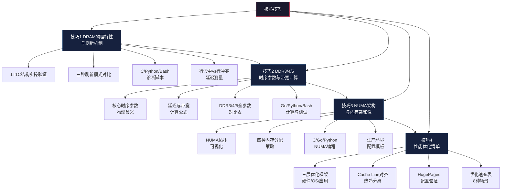
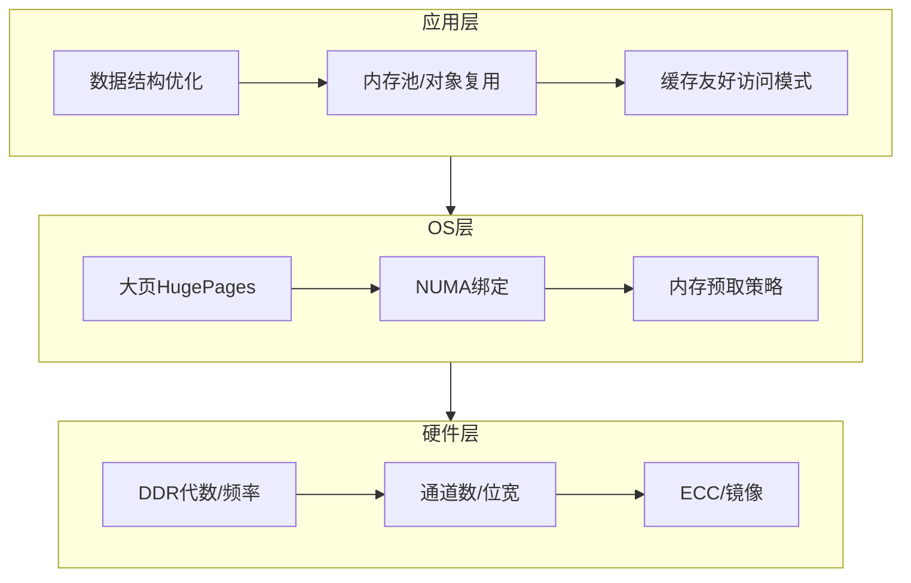

# 核心技巧：从理论到实战的四把钥匙

> 理论告诉你"为什么"，技巧教你"怎么做"。本节将理论基础中的DRAM物理原理、DDR时序参数和NUMA架构知识，转化为可直接落地的优化手段、诊断方法和编程实践。

内存系统是计算机中"最容易被忽视、却最容易出问题"的子系统。你可能写出了逻辑完美的代码，却因为忽略了Cache Line对齐导致性能暴跌10倍；你可能部署了一台顶配服务器，却因为NUMA配置不当让MySQL延迟翻倍；你可能用了最新的DDR5内存，却因为XMP未启用而跑在DDR4的速度上——这些问题的共同特征是：**它们不在代码逻辑中，而在内存系统的物理和架构层**。

理论基础篇建立了从电容到程序的完整知识链路，本节则回答一个更迫切的问题：**拿到这些知识后，具体该怎么做？** 四篇文章分别覆盖DRAM物理实践、DDR时序计算、NUMA亲和性配置和综合优化清单，从硬件探测到应用层优化，形成完整的"动手能力"闭环。

---

## 四篇文章的知识地图



四篇文章存在明确的递进关系：
- **技巧1**是地基——理解DRAM的物理刷新机制，才能理解一切内存性能问题的根源
- **技巧2**是量化工具——掌握时序参数和带宽计算，才能用数据而非直觉做决策
- **技巧3**是架构视角——理解NUMA亲和性，才能在多路服务器上释放硬件全部潜力
- **技巧4**是集大成——将前三篇的知识汇聚为可操作的优化清单和诊断流程

---

## 技巧1：DRAM物理特性与刷新机制

这篇文章从DRAM存储单元的物理构造出发，将理论基础中的1T1C原理、Bank架构和刷新机制转化为**可测量、可诊断、可监控**的实践能力。

### 核心命题

DRAM刷新到底造成多大的性能损失？行缓冲区命中和未命中的延迟差距是否真如理论所述？如何用代码和工具量化这些影响？

### 覆盖内容

**1. 1T1C结构的实操验证**

文章提供了完整的C语言代码，通过rdtsc计时和CLFLUSH缓存清除，精确测量三种访问模式的延迟差异：

顺序访问（行命中）:     ~2.5 ns/access
4KB stride（行冲突）:   ~8.0 ns/access
随机访问（混合模式）:    ~7.0 ns/access
行冲突/顺序比:          3.20x

这组数据直接验证了理论基础中的核心结论：**行冲突比行命中慢3倍以上**。代码使用mmap确保物理内存连续分配，CLFLUSH清除L3缓存后测量纯DRAM延迟，是一个可复现的标准实验。

**2. 三种刷新模式对比**

| 刷新类型 | 工作原理 | 延迟影响 | 适用场景 |
|----------|---------|---------|---------|
| 集中刷新（Burst） | 刷新周期末尾集中刷新所有行 | 完全阻塞（最大45ms） | 早期DRAM，已弃用 |
| 分布式刷新（Distributed） | 刷新命令均匀分散到整个周期 | 每次仅影响一个Bank | 现代DDR3/4/5默认 |
| 自刷新（Self-Refresh） | DRAM内部定时器自主管理 | CPU侧无感知，唤醒有延迟 | 待机/休眠模式 |

**3. DDR5 SAME-BANK刷新**

DDR5引入的Per-Bank刷新是刷新机制的重大演进——每次只刷新1/32的Bank，其余Bank完全可访问，有效刷新开销从DDR4的4-5%降低到2-3%。

**4. 完整的诊断工具链**

- **C语言**：rdtsc + CLFLUSH测量行命中/冲突延迟
- **Python**：dmidecode解析DIMM配置、edac-util检查ECC状态、numactl读取NUMA拓扑
- **Bash**：一键监控脚本，覆盖DIMM配置、NUMA拓扑、刷新性能计数器、ECC错误、内存使用五个维度

### 关键收获

读完本节，你将能够：
- 解释并测量DRAM刷新对带宽和延迟的实际影响（4-9%带宽损失 + P99抖动）
- 用C代码精确测量行命中/行冲突/随机访问三种模式的延迟差异
- 用Python脚本一键检测DIMM配置、ECC状态和NUMA拓扑
- 理解温度（>85°C）触发2×刷新的机制，评估散热设计对性能的影响

---

## 技巧2：DDR3/4/5时序参数与带宽计算

这篇文章将理论基础中DDR时序参数的物理含义转化为**可手动计算、可编程验证**的量化能力。

### 核心命题

如何从DDR规格标签（如"DDR4-3200 CL22"）推算出实际CAS延迟和理论带宽？DDR3、DDR4、DDR5的时序参数能否直接比较？选购内存时应该关注哪些指标？

### 覆盖内容

**1. 核心时序参数的物理含义**

文章用"图书馆借书"类比帮助记忆，同时给出精确的物理定义：

CL (CAS Latency): 22周期
  → 列访问延迟，从发出CAS命令到数据输出
  → 物理含义：数据从DRAM阵列经过Sense Amplifier、数据总线到达输出引脚的时间

tRCD (RAS to CAS Delay): 22周期
  → 行激活到列访问的最小间隔
  → 物理含义：行数据从DRAM阵列加载到Sense Amplifier所需的时间

tRP (Row Precharge): 22周期
  → 预充电持续时间
  → 物理含义：关闭当前行、恢复位线电平所需的时间

tRAS (Row Active Time): 52周期
  → 行保持激活状态的最小时间
  → 物理含义：电容电荷完全稳定并可被Sense Amplifier可靠检测的时间

**2. 延迟与带宽计算公式**

实际CAS延迟(ns) = CL × 2000 / DDR速率(MT/s)

DDR4-3200 CL22:  22 × 2000 / 3200 = 13.75ns
DDR5-6400 CL40:  40 × 2000 / 6400 = 12.5ns

理论带宽(GB/s) = 速率(MT/s) × 位宽(bits) × 通道数 / 8 / 1000

DDR4-3200 单通道: 3200 × 64 / 8 / 1000 = 25.6 GB/s
DDR5-6400 双通道: 6400 × 64 / 8 / 1000 × 2 = 102.4 GB/s

**3. DDR3/4/5全参数对比**

| 参数 | DDR3-1600 | DDR4-3200 | DDR5-6400 | DDR5-8800 |
|------|-----------|-----------|-----------|-----------|
| 数据速率 | 1600 MT/s | 3200 MT/s | 6400 MT/s | 8800 MT/s |
| 时钟频率 | 800 MHz | 1600 MHz | 3200 MHz | 4400 MHz |
| 电压 | 1.5V | 1.2V | 1.1V | 1.1V |
| CL (典型) | 11 | 22 | 40 | 46 |
| CAS延迟(ns) | 13.75 | 13.75 | 12.5 | 10.45 |
| 单通道带宽 | 12.8 GB/s | 25.6 GB/s | 51.2 GB/s | 70.4 GB/s |
| 双通道带宽 | 25.6 GB/s | 51.2 GB/s | 102.4 GB/s | 140.8 GB/s |

**关键洞察**：DDR5虽然数据率翻倍，但CL数值也翻倍，实际CAS延迟仅改善约9%（13.75ns→12.5ns）。**内存性能提升主要靠带宽而非延迟**。

**4. 编程验证工具**

- **Go**：DDR参数计算器（结构体封装频率/位宽/CL，自动计算CAS延迟和带宽）
- **Python**：dmidecode解析实际DDR配置，mbw/sysbench带宽测试
- **Bash**：内存带宽测试脚本（mbw + dd + sysbench三种方法）

### 关键收获

读完本节，你将能够：
- 手动计算任意DDR规格的CAS延迟和理论带宽
- 判断DDR5是否值得升级（取决于带宽需求而非延迟）
- 识别DIMM混插导致频率降级、XMP未启用等常见配置错误
- 用Go/Python/Bash工具链验证系统实际内存配置

---

## 技巧3：NUMA架构与内存亲和性

这篇文章将理论基础中的NUMA拓扑和距离矩阵知识转化为**可配置、可诊断、可编程**的服务器优化能力。

### 核心命题

为什么同一台服务器上，绑定NUMA节点后MySQL查询延迟降低40%？四种内存分配策略分别适用于什么场景？如何在Go/Python/C程序中实现NUMA感知的内存管理？

### 覆盖内容

**1. NUMA拓扑与延迟量化**

2路 NUMA:  本地:远程 ≈ 1:1.5
4路 NUMA:  本地:远程 ≈ 1:2
8路 NUMA:  本地:远程 ≈ 1:3

文章提供了Bash脚本直接查看NUMA拓扑、距离矩阵和每节点内存使用，以及C语言通过libnuma库绑定节点和分配跨节点内存的完整示例。

**2. 四种内存分配策略详解**

| 策略 | 含义 | 适用场景 |
|------|------|---------|
| MPOL_DEFAULT | 按当前CPU所在节点分配 | 通用默认 |
| MPOL_BIND | 绑定到指定节点列表 | 单实例数据库、Redis |
| MPOL_INTERLEAVE | 在指定节点间轮询分配 | 共享缓存、全内存扫描 |
| MPOL_PREFERRED | 优先在指定节点分配，不够则其他 | 数据有局部性但不确定 |

**3. 多语言NUMA编程示例**

- **C语言**：libnuma库的numa_bind()、numa_alloc_onnode()等API
- **Go语言**：syscall.SchedSetaffinity绑定CPU + GOMAXPROCS限制核数
- **Python**：numastat进程级NUMA统计 + 内存访问延迟对比测试

**4. 生产环境配置模板**

| 场景 | 推荐策略 | 命令 |
|------|----------|------|
| 数据库单实例 | CPU绑定+内存绑定 | `numactl --cpunodebind=0 --membind=0 mysqld` |
| Redis | 交错分配 | `numactl --interleave=all redis-server` |
| 大型共享缓存 | 交错分配 | `numactl --interleave=all memcached` |
| Go微服务 | cgroup绑核 | GOMAXPROCS=N + cpu.cfs_quota_us |
| 多进程服务 | 每进程一个node | taskset -c 0-15 ./app |

### 关键收获

读完本节，你将能够：
- 用numactl --hardware解读NUMA距离矩阵（10=本地，21=一跳，31=两跳）
- 为不同应用场景选择正确的NUMA分配策略
- 在C/Go/Python程序中实现NUMA感知的内存管理
- 诊断NUMA配置不当导致的性能退化（numastat -p查看other_node计数）

---

## 技巧4：性能优化清单

这篇文章是前三篇的集大成，将DRAM物理、DDR时序和NUMA知识汇聚为**三层优化框架**（硬件层→OS层→应用层）和**8种场景速查表**。

### 核心命题

面对一个内存性能问题，应该按什么顺序诊断和优化？Cache Line对齐、对象池、HugePages等优化技术分别适用于什么场景？如何避免常见错误？

### 覆盖内容

**1. 三层优化框架**



**2. 八种场景优化速查表**

| 场景 | 优化方法 | 预期效果 | 实施难度 |
|------|----------|----------|----------|
| 高频读取 | L1/L2缓存优化 + 数据预取 | 减少90%延迟 | ⭐⭐ |
| 大量写入 | 批量写入 + Write-Combine | 提升5x吞吐 | ⭐⭐ |
| 高并发分配 | sync.Pool / 对象池 | 减少50% GC | ⭐ |
| 大内存应用 | HugePages 2MB/1GB | 减少TLB miss 80% | ⭐⭐ |
| 多路服务器 | NUMA绑定 | 减少30%远程访问 | ⭐⭐ |
| 内存密集计算 | Cache Line对齐 | 提升2-3x | ⭐⭐⭐ |
| 小对象频繁创建 | Arena/Slab分配器 | 减少碎片和系统调用 | ⭐⭐⭐ |
| 读多写少 | Read-Copy-Update (RCU) | 读无锁 | ⭐⭐⭐⭐ |

**3. 四类编程实践**

- **Cache Line对齐**（C语言）：`__attribute__((aligned(64)))` + 热冷数据分离结构体
- **Go内存池**：sync.Pool对象复用，对比无Pool时的GC压力差异
- **HugePages配置**（Python）：2MB静态大页和1GB大页的配置方法
- **内存诊断**（Bash）：一键脚本覆盖NUMA拓扑、HugePages状态、带宽测试、页面分配统计、OOM事件

**4. 生产环境检查清单**

```bash
# 1. 确认NUMA拓扑
numactl --hardware

# 2. 确认HugePages
grep Huge /proc/meminfo

# 3. 确认内存频率
dmidecode -t memory | grep "Configured.*Speed"

# 4. 确认ECC状态
edac-util -s 2>/dev/null || dmidecode -t memory | grep "Total Error"

# 5. 确认透明大页
cat /sys/kernel/mm/transparent_hugepage/enabled

# 6. 确认内存回收策略
cat /proc/sys/vm/swappiness
cat /proc/sys/vm/zone_reclaim_mode
```

### 关键收获

读完本节，你将掌握完整的内存性能优化工具箱：
- 按"量化瓶颈→定位层级→选择手段"的流程系统性优化内存性能
- 用Cache Line对齐和热冷分离优化数据结构（L1 miss减少50-90%）
- 用sync.Pool（Go）或对象池减少GC压力（分配延迟降低80%+）
- 用HugePages减少TLB miss（80-96%改善）
- 识别伪共享、DIMM混插、THP误用等常见错误

---

## 阅读指南

### 按角色选择阅读深度

| 角色 | 推荐路径 | 重点关注 | 预计时间 |
|------|----------|----------|----------|
| **应用开发**（Go/Python/Java） | 技巧4 → 技巧2 | 性能优化清单、sync.Pool、HugePages | 1-2h |
| **后端/中间件开发** | 技巧3 → 技巧4 → 技巧2 | NUMA亲和性、Cache Line对齐、带宽计算 | 2-3h |
| **DBA/运维** | 技巧3 → 技巧4 | NUMA绑定配置、生产检查清单、ECC监控 | 1-2h |
| **系统工程师/内核开发** | 全部按序 | DRAM刷新机制、时序参数物理含义、NUMA编程 | 4-5h |
| **面试准备** | 技巧2 → 技巧4 | 带宽计算公式、时序参数含义、优化速查表 | 1-2h |

### 跳读建议

时间有限时，优先完成"技巧4性能优化清单 + 技巧2带宽计算"两篇，覆盖80%的日常工作场景，预计1-2小时可完成。

### 与其他小节的关系

理论基础                    核心技巧                    实战案例
┌──────────────┐          ┌──────────────┐          ┌──────────────┐
│ 01 核心概念   │──应用──→│ 技巧1 DRAM刷新│──验证──→│ Redis碎片OOM │
│ 02 技术演进   │──应用──→│ 技巧2 时序计算│──验证──→│ Go GC抖动    │
│ 03 关键指标   │──应用──→│ 技巧3 NUMA配置│──验证──→│ MySQL NUMA慢 │
│              │──汇总──→│ 技巧4 优化清单│──验证──→│ JVM TLB Miss │
└──────────────┘          └──────────────┘          └──────────────┘
       ↑                        ↑                         │
       │                    常见误区                       │
       │                  (7大认知纠正)                    │
       └──────────────────────────────────────────────────┘

理论基础提供"为什么"的解释，核心技巧提供"怎么做"的方法，实战案例验证"做了之后效果如何"。三者形成完整的知识闭环。

---

## 本节小结

学完核心技巧四篇文章，你应该建立起以下实操能力：

1. **能测量**：用rdtsc + CLFLUSH精确测量DRAM行命中/冲突延迟，验证理论结论
2. **能计算**：从DDR规格标签手动推算CAS延迟和理论带宽，用数据驱动内存选型
3. **能配置**：为数据库、缓存、微服务选择正确的NUMA分配策略，用numactl落地
4. **能优化**：按"量化→定位→选择"的流程系统性优化内存性能，掌握8种场景的优化手段
5. **能诊断**：用perf stat分析cache/TLB miss，用numastat诊断NUMA问题，用edac-util监控ECC错误
6. **能避坑**：识别DIMM混插降频、XMP未启用、THP误用、NUMA未绑定等常见配置错误

> **下一步**：读完核心技巧后，建议继续阅读"实战案例"部分，那里有四个真实生产案例——Redis碎片OOM、Go GC延迟抖动、MySQL NUMA慢查询、JVM TLB Miss——每个案例都完整展示了"问题→排查→方案→效果"的闭环过程。
