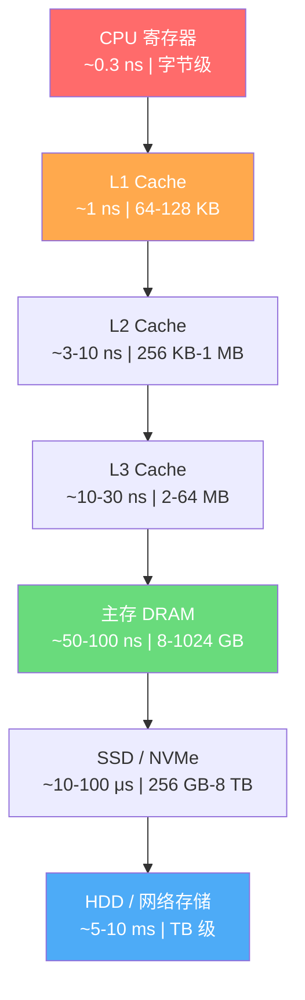
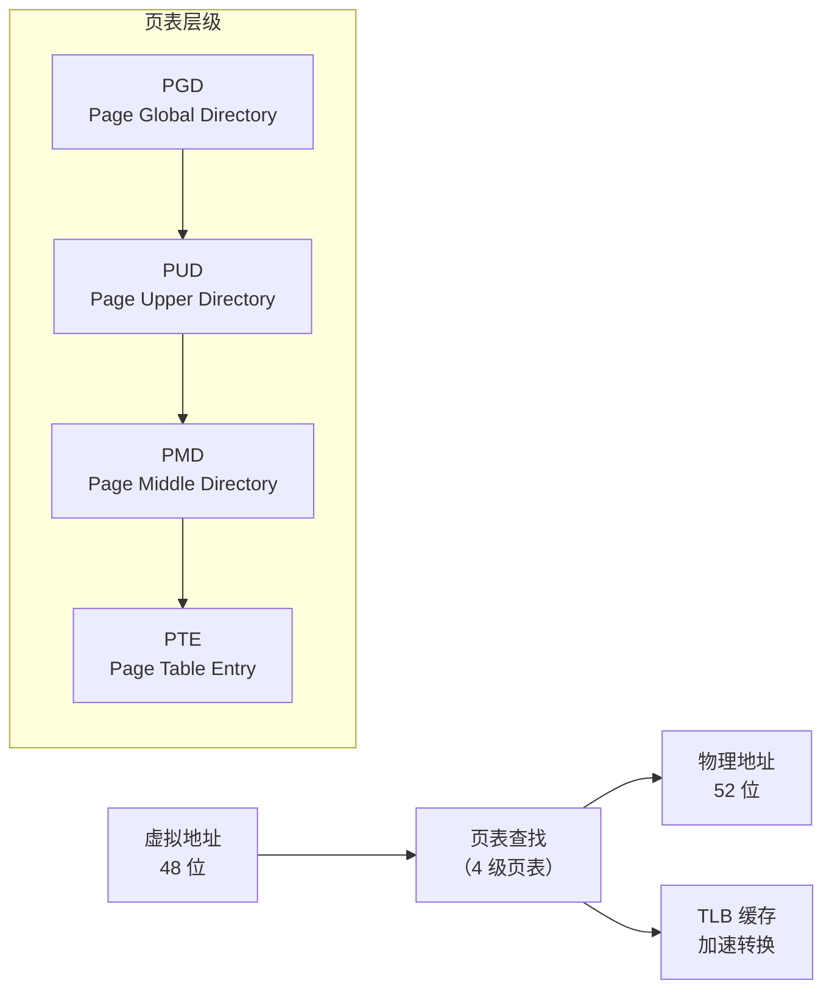
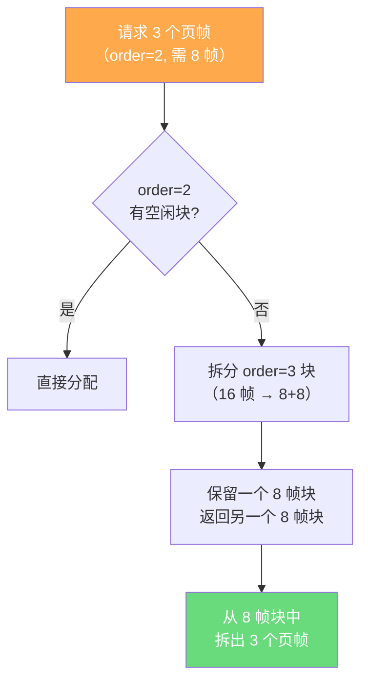
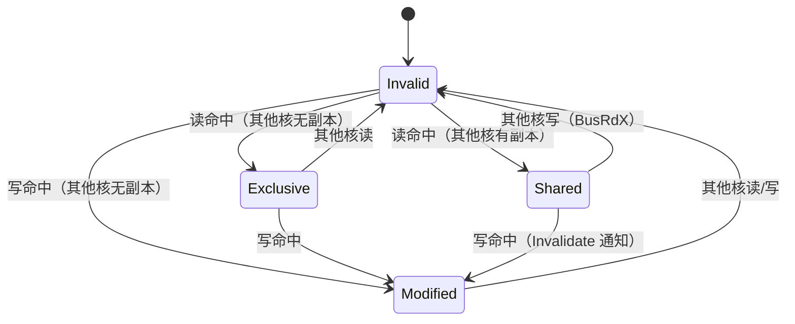
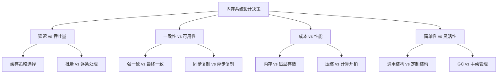

## 内存系统核心概念

内存系统是计算机体系结构中连接处理器与持久存储之间的关键层级。它不仅决定了程序的运行速度，更深刻地影响着系统架构的设计决策、并发模型的选择以及整体可扩展性的上限。本节将从硬件原理到软件抽象，系统性地构建内存系统的完整知识框架。

---

### 1. 内存的本质：为什么需要内存系统

#### 1.1 存储层次结构的根本矛盾

现代计算机面临一个永恒的矛盾：**处理器的运算速度远远快于存储设备的访问速度**。这个差距不是几倍、几十倍，而是数百万倍。以 2024 年的主流硬件为例：

| 存储层级 | 访问延迟 | 典型容量 | 每 GB 成本 | 带宽 |
|----------|----------|----------|------------|------|
| CPU 寄存器 | ~0.3 ns | 字节级 | 极高 | 极高 |
| L1 Cache | ~1 ns | 64 KB - 128 KB | 极高 | ~2 TB/s |
| L2 Cache | ~3-10 ns | 256 KB - 1 MB | 极高 | ~500 GB/s |
| L3 Cache | ~10-30 ns | 2 MB - 64 MB | 极高 | ~200 GB/s |
| 主存 (DRAM) | ~50-100 ns | 8 GB - 1 TB | ~$2-5 | ~50 GB/s |
| SSD (NVMe) | ~10-100 μs | 256 GB - 8 TB | ~$0.05-0.10 | ~7 GB/s |
| HDD | ~5-10 ms | 1 TB - 20 TB | ~$0.01-0.02 | ~0.2 GB/s |
| 网络存储 (10GbE) | ~100-500 μs | PB 级 | ~$0.01-0.05 | ~1.2 GB/s |

这个表格揭示了几个关键事实：

**延迟差距触目惊心**：L1 Cache 比主存快约 50-100 倍，主存比 SSD 快约 100-1000 倍，SSD 比 HDD 快约 100-1000 倍。如果处理器直接访问 HDD，一次访问的等待时间（~10 ms）足以执行约 3000 万条指令——这相当于让 CPU 空转了 1000 万个周期。

**带宽同样关键**：不仅延迟差距大，带宽也存在数量级差异。L1 的带宽（~2 TB/s）是主存（~50 GB/s）的 40 倍，而主存又是 SSD（~7 GB/s）的 7 倍。高带宽场景下（如大数据流处理），带宽差异的影响甚至比延迟更显著。

**成本-性能权衡驱动分层设计**：如果全部用 SRAM（Cache 使用的存储介质），1TB 需要数千万美元；全部用 DRAM，成本约 2-5 万美元但仍远超 HDD 的 100-200 美元。分层设计是唯一经济可行的方案。



#### 1.2 局部性原理：内存系统的理论基石

内存层次结构之所以有效，根本原因在于程序行为的**局部性原理（Principle of Locality）**。这个原理由 Peter Denning 在 1968 年提出，至今仍是计算机体系结构最重要的经验规律之一。它包含两个维度：

**时间局部性（Temporal Locality）**：如果一个数据项被访问，那么它在不久的将来很可能再次被访问。典型场景包括：
- 循环变量（`for` 循环中的 `i`，在整个循环期间反复访问）
- 频繁调用的函数的局部变量
- 热点数据库记录（热门商品信息、用户 session）
- 缓存系统中的热数据

**空间局部性（Spatial Locality）**：如果一个数据项被访问，那么与其地址相邻的数据项也很可能被访问。这解释了为什么 CPU Cache 按**缓存行（Cache Line）**加载数据——通常为 64 字节。即使程序只读取了 1 个字节，整行都会被载入，这意味着相邻的 63 个字节也被"免费"预取了。

```c
// 空间局部性的典型案例
// 好的访问模式：顺序遍历，充分利用缓存行
int sum_array(int *arr, int n) {
    int sum = 0;
    for (int i = 0; i < n; i++) {  // 顺序访问，空间局部性好
        sum += arr[i];
    }
    return sum;
}

// 差的访问模式：跳跃访问，缓存命中率极低
// 按列遍历二维数组（C 语言行优先存储）
int sum_matrix_bad(int matrix[][N], int rows, int cols) {
    int sum = 0;
    for (int j = 0; j < cols; j++) {      // 按列遍历
        for (int i = 0; i < rows; i++) {    // 跳跃 N*sizeof(int) 字节
            sum += matrix[i][j];
        }
    }
    return sum;
}

// 更隐蔽的局部性陷阱：链表 vs 数组
// 链表节点在内存中不连续，每次 next 指针跳转都可能 cache miss
struct node { int data; struct node *next; };
int sum_list(struct node *head) {  // 缓存命中率极低
    int sum = 0;
    while (head) {
        sum += head->data;  // 每次访问都可能 miss
        head = head->next;
    }
    return sum;
}

// 数组版本：缓存友好，性能提升 5-10 倍
int sum_array_friendly(int *arr, int n) {  // 缓存命中率极高
    int sum = 0;
    for (int i = 0; i < n; i++) {
        sum += arr[i];  // 连续内存，预取高效
    }
    return sum;
}
```

#### 1.3 局部性原理的量化影响

在现代多核处理器中，不同层级的缓存未命中导致的性能惩罚差异巨大：

| 缓存层级 | 未命中惩罚（CPU 周期） | 换算延迟 | 对比基准 |
|----------|------------------------|----------|----------|
| L1 Miss → L2 Hit | 3-4 个周期 | ~1 ns | 1x |
| L2 Miss → L3 Hit | 10-12 个周期 | ~3 ns | 3x |
| L3 Miss → 主存 Hit | 200-300 个周期 | ~70 ns | 70x |
| TLB Miss（4 级页表） | ~400 个周期 | ~130 ns | 130x |
| 主存 Miss → SSD | ~30000 个周期 | ~10 μs | 10000x |

一个优化良好的程序与未优化的程序，在相同计算任务上可能有 **10 倍以上的性能差距**，而这个差距几乎完全来自于内存访问模式的差异。Google 曾公开数据：通过优化内存访问模式，其搜索索引查询的吞吐量提升了 4-8 倍，而 CPU 利用率反而下降了 30%。

**实际案例**：以下是一段矩阵乘法优化前后的性能对比（N=2048，双精度浮点）：

| 优化策略 | 耗时 | 相对性能 | 缓存命中率 |
|----------|------|----------|------------|
| 朴素三重循环 (i-j-k) | 12.8s | 1x | ~15% |
| 循环分块 (Tiling, B=32) | 1.2s | 10.7x | ~72% |
| SIMD + Tiling | 0.3s | 42.7x | ~85% |

这说明仅靠改善内存访问模式（不改变算法复杂度），就能获得一个数量级的提升。

---

### 2. 虚拟内存：现代操作系统的核心抽象

#### 2.1 为什么需要虚拟内存

虚拟内存是操作系统提供的最重要抽象之一。它解决了三个核心问题：

1. **地址空间隔离**：每个进程拥有独立的虚拟地址空间（x86-64 下为 128 TB），彼此不干扰。一个进程的野指针不会写入另一个进程的内存，一个进程崩溃也不会影响其他进程——这是操作系统稳定性的基石。

2. **内存过载使用（Overcommit）**：多个进程可以声称使用比物理内存更大的地址空间。Linux 默认允许 overcommit（vm.overcommit_memory=0），通过按需分配实际物理页和按需换出（swap）来实现。这意味着 16GB 内存的机器可以同时运行总虚拟内存需求 64GB 的进程——只要它们不同时活跃使用所有内存。

3. **简化编程模型**：程序员无需关心物理内存的实际布局（碎片化、被谁占用、哪个物理帧对应哪个变量），可以使用连续的、从 0 开始的虚拟地址空间。`malloc(1GB)` 总是成功，即使物理内存只有 512MB——直到你真正读写所有页面时才会触发物理分配。

4. **写时复制（Copy-on-Write, CoW）**：`fork()` 创建子进程时，父子进程共享物理页（标记为只读），只有在某一方写入时才复制对应页面。这使得进程创建的开销从 O(内存大小) 降为 O(1)，是 Linux `fork()` + `exec()` 模型高效的关键。

#### 2.2 虚拟地址到物理地址的转换

在 x86-64 架构下，虚拟地址为 64 位（实际有效 48 位，高 16 位必须与第 47 位相同——这是"符号扩展"规则），物理地址最大可达 52 位（支持 4PB 物理内存）。地址转换通过**页表（Page Table）**完成：



**x86-64 四级页表结构**：

| 层级 | 名称 | 索引位数 | 条目数 | 说明 |
|------|------|----------|--------|------|
| PGD | Page Global Directory | 9 位 | 512 | 顶层目录，每个进程一个，存放在 CR3 寄存器 |
| PUD | Page Upper Directory | 9 位 | 512 | 上级目录 |
| PMD | Page Middle Directory | 9 位 | 512 | 中间目录，指向物理页或下级页表 |
| PTE | Page Table Entry | 9 位 | 512 | 最终页表项，包含物理帧号 + 权限位 |
| Offset | 页内偏移 | 12 位 | 4096 | 4 KB 页大小内的字节偏移 |

每级页表有 512 个条目（2^9），每条目 8 字节（64 位），每页表本身恰好占一个 4KB 页面。PTE 的低 12 位用于标志：Present（页面在物理内存中）、Read/Write、User/Supervisor（用户态/内核态）、Dirty（被写过）、Accessed（被访问过）、NX（不可执行）等。

**多级页表的优势**：如果使用单级页表，一个 48 位地址空间需要 2^36 个页表条目（每个 8 字节 = 512 GB），这显然不现实。多级页表允许只为实际使用的地址范围分配页表页，稀疏地址空间只需少量页表页。

#### 2.3 TLB：转换后备缓冲区

直接查四级页表需要 4 次内存访问（每级一次），加上页内偏移共 5 次——对于每次内存访问都这样做，性能不可接受。**TLB（Translation Lookaside Buffer）** 是一个高速硬件缓存，存储最近使用的虚拟页到物理帧的映射：

| TLB 级别 | 容量 | 访问延迟 | 典型命中率 |
|----------|------|----------|------------|
| L1 dTLB（数据） | 64-128 条目 | 1 个时钟周期 | ~95% |
| L1 iTLB（指令） | 32-64 条目 | 1 个时钟周期 | ~98% |
| L2 sTLB（统一） | 512-2048 条目 | 5-10 个时钟周期 | ~99%（含 L1） |

**TLB 未命中的代价**：对于 4 级页表，一次 TLB 未命中需要 4 次额外的内存访问（每次约 100 ns），总计约 400 ns。如果每秒有 100 万次内存访问，即使 1% 的 TLB 未命中率也会造成约 400 ms 的累计延迟。对于数据库等内存密集型应用，这可能是致命的性能瓶颈。

**TLB 被刷新的常见场景**：
- **上下文切换**：进程切换时，TLB 中属于旧进程的条目需要失效。现代 CPU 使用 ASID（Address Space Identifier）标记 TLB 条目所属进程，避免全量刷新。
- **`munmap` / `mprotect`**：手动失效指定范围的 TLB 条目。
- **中断处理**：部分架构在中断返回时刷新 TLB。

#### 2.4 大页（Huge Pages）

为减少 TLB 未命中的影响，现代操作系统支持大页：

| 页大小 | 可映射范围 | TLB 条目效率 | 适用场景 |
|--------|------------|--------------|----------|
| 4 KB | 2 MB (512 页) | 基准 (1x) | 通用默认 |
| 2 MB | 1 GB (512 页) | 512x | 数据库、JVM 大堆 |
| 1 GB | 512 GB | 262144x | 超大内存、HPC |

大页的代价是**内部碎片**：如果一个进程需要 2.1 MB 内存，用 4KB 页只需 537 页（2.148 MB），用 2MB 大页则需要 2 个大页（4 MB），浪费 47%。

**透明大页（THP, Transparent Huge Pages）**：Linux 自 2.6.38 起支持，内核自动将连续的 4KB 页合并为大页，对应用透明。但 THP 可能导致：
- **合并/拆分时的延迟尖峰**（compaction 和 khugepaged 线程的开销）
- **内存碎片化加剧**（大块连续内存难以找到）
- 数据库（MySQL、Redis、MongoDB）官方通常建议**禁用 THP**：

```bash
# 查看 THP 状态
cat /sys/kernel/mm/transparent_hugepage/enabled
# [always] madvise never

# 禁用 THP（需要 root）
echo never > /sys/kernel/mm/transparent_hugepage/enabled
echo never > /sys/kernel/mm/transparent_hugepage/defrag

# 验证
cat /sys/kernel/mm/transparent_hugepage/enabled
# always madvise [never]
```

**静态大页（Static Huge Pages）**：预分配、不可 swap、不可迁移，适合数据库等确定性的大内存场景：

```bash
# 分配 4 个 2MB 大页
echo 4 > /proc/sys/vm/nr_hugepages

# 查看大页使用情况
cat /proc/meminfo | grep HugePages
# HugePages_Total:       4
# HugePages_Free:        3
# HugePages_Rsvd:        1
# Hugepagesize:       2048 kB
```

#### 2.5 Swap 机制：虚拟内存的保底网

当物理内存不足时，操作系统将不活跃的页面换出（swap out）到磁盘上的 swap 分区或 swap 文件，腾出物理内存给活跃进程。

**Swap 的工作流程**：
1. 内存分配器发现物理内存不足（通过 watermark 机制检测：`/proc/sys/vm/min_free_kbytes`）
2. 内核的 kswapd 守护进程被唤醒，选择"不活跃"页面（LRU 列表尾部）
3. 如果页面是 dirty（被修改过），先写入 swap 区域，然后释放物理页帧
4. 当进程再次访问被换出的页面时，触发 page fault，内核从 swap 读回并更新页表

**Swap 的性能影响**：

| 操作 | 延迟 | 对比 |
|------|------|------|
| DRAM 读取 | ~100 ns | 1x |
| SSD Swap 读取 | ~100 μs | 1000x |
| HDD Swap 读取 | ~10 ms | 100000x |

一次 swap-in 的延迟是 DRAM 访问的 1000 倍（SSD）甚至 10 万倍（HDD），足以让一个正在运行的应用出现明显卡顿。

**生产环境最佳实践**：
- **数据库服务器**：设置 `vm.swappiness=1`（甚至 `=0`），尽量不使用 swap
- **通用服务器**：`vm.swappiness=10-30`，保留少量 swap 作为安全网
- **容器/虚拟机**：通过 cgroup 限制内存，超出 OOM kill 而非 swap
- **监控 swap 使用**：`vmstat 1` 中的 `si`/`so` 列（swap in/out），持续非零说明内存不足

```bash
# 查看当前 swappiness
cat /proc/sys/vm/swappiness

# 临时调整（重启失效）
sysctl vm.swappiness=10

# 永久调整
echo "vm.swappiness = 10" >> /etc/sysctl.conf
sysctl -p

# 监控 swap 活动
vmstat 1
# procs -----------memory---------- ---swap-- -----io---- -system-- ------cpu-----
#  r  b   swpd   free   buff  cache   si   so    bi    bo   in   cs us sy id wa st
#  1  0      0 512000 102400 2048000    0    0     0     0  500 1000 10  2 88  0  0
```

---

### 3. 内存分配策略

#### 3.1 用户态内存分配

在应用程序层面，内存分配主要通过 C 标准库的 `malloc`/`free` 或语言运行时的垃圾回收器完成。

**`malloc` 的实现机制（以 glibc 的 ptmalloc2 为例）**：

1. **小对象（< 128 KB）**：使用 `brk`/`sbrk` 扩展堆。ptmalloc2 维护多个 free list 按大小分类：
   - **Fast Bins**：≤ 80 字节（64 位系统），单链表，不合并，分配/释放最快
   - **Small Bins**：80-880 字节，双链表，FIFO，恰好对应 bin 大小
   - **Large Bins**：880 字节-128 KB，按大小范围分组，best-fit 查找
   - **Unsorted Bin**：刚释放的内存暂存此处，下次分配时优先检查

2. **大对象（≥ 128 KB）**：使用 `mmap` 直接映射匿名页，绕过堆管理器。释放时 `munmap` 直接归还操作系统。

3. **线程安全**：每个线程维护独立的 arena（约 64 MB），减少锁竞争。多线程高并发分配时，arena 数量受 `MALLOC_ARENA_MAX` 控制。

4. **内存回收**：`free` 后的内存不会立即归还操作系统（仍然在进程的虚拟地址空间中），而是在 `malloc_trim` 或内存压力时才收缩。

```c
// 内存分配的性能陷阱
// 错误：频繁的小对象分配和释放
void bad_pattern() {
    for (int i = 0; i < 1000000; i++) {
        int *p = malloc(sizeof(int) * 100);  // 每次循环都分配
        // ... 使用 p ...
        free(p);  // 每次循环都释放
    }
    // 问题：
    // 1. malloc/free 有锁竞争开销（arena lock）
    // 2. 频繁的 brk 调整导致内存碎片
    // 3. 每次分配约 100-500ns，百万次 = 0.1-0.5 秒纯开销
}

// 正确：批量分配，减少系统调用
void good_pattern() {
    int *buf = malloc(sizeof(int) * 100 * 1000000);  // 一次性分配
    for (int i = 0; i < 1000000; i++) {
        int *p = buf + i * 100;  // 指针运算，零开销
        // ... 使用 p ...
    }
    free(buf);  // 最后统一释放
}
```

**其他分配器对比**：

| 分配器 | 特点 | 适用场景 | 性能特点 |
|--------|------|----------|----------|
| ptmalloc2 | glibc 默认，通用 | 大多数 C/C++ 程序 | 中等，多线程有 arena 竞争 |
| jemalloc | Facebook 出品，碎片少 | Redis、Firefox、大内存服务 | 多线程优秀，内存碎片低 |
| tcmalloc | Google 出品，线程缓存 | 高并发 Web 服务 | 小对象极快，大对象用页级管理 |
| mimalloc | Microsoft 出品，极简设计 | 通用替代 | 极快，碎片极低，代码仅 6K 行 |
| dlmalloc | Doug Lea 的经典实现 | 教学参考 | 单线程优秀，多线程退化 |

```bash
# 使用 jemalloc 替换系统默认 malloc
LD_PRELOAD=/usr/lib/x86_64-linux-gnu/libjemalloc.so ./my_program

# 使用 tcmalloc
LD_PRELOAD=/usr/lib/x86_64-linux-gnu/libtcmalloc.so ./my_program

# 查看当前程序使用的分配器
ldd /bin/ls | grep -E "malloc|tcmalloc|jemalloc"
```

#### 3.2 内核态内存分配

Linux 内核使用多种分配器，针对不同场景优化：

| 分配器 | 适用场景 | 核心策略 | 典型使用者 |
|--------|----------|----------|------------|
| SLUB | 内核对象缓存 | 对象池 + per-CPU 缓存，简化元数据 | 现代 Linux 默认 |
| SLAB | 内核对象缓存 | 对象池 + per-CPU 缓存 | 已被 SLUB 取代 |
| SLOB | 嵌入式系统 | 极简设计，节省空间 | < 64MB 内存设备 |
| Buddy System | 物理页帧分配 | 伙伴算法，减少外部碎片 | 所有内核 |
| CMA | 连续物理内存 | 预留区域 + 适时迁移 | DMA、GPU、视频编解码器 |
| VFS Cache | 文件系统缓存 | dentry/inode 对象池 | 所有文件操作 |

**Buddy System 工作原理**：

Buddy System 将物理内存划分为 2^0、2^1、...、2^10 共 11 个 order 的块（每个 order 对应 1、2、4、...、1024 个连续页帧）。分配时向上查找恰好满足需求的最小块；释放时检查"伙伴"是否空闲，若空闲则合并为更大的块。



**Buddy System 的浪费**：请求 3 个页帧，实际分配 4 个（order=2 = 4 页 = 16KB），浪费 25%。请求 5 个页帧，分配 8 个（order=3），浪费 37.5%。这是内部碎片的典型来源。

#### 3.3 内存碎片问题

**外部碎片**：空闲内存总量充足，但没有足够大的连续块。例如，总空闲 128 页分散在 128 个不连续的 1 页中，无法满足一个 2 页的分配请求。Buddy System 通过合并相邻空闲块来缓解，但在长时间运行的系统中仍可能积累碎片。

**内部碎片**：分配的内存块大于实际需要的大小。Buddy System 的内部碎片率在最坏情况下可达 50%。SLUB 分配器通过 slab 缓存和对象着色（object coloring）来减少内部碎片。

```bash
# 查看当前系统的碎片情况
cat /proc/buddyinfo
# Node 0, zone      DMA      1      1      0      0      2      1      1      0      1      1      3
#                   ^order0  ^order1  ^order2 ...                     ^order10
# 高阶块（> order 4）数量过少表示存在外部碎片

# 使用 /proc/pagetypeinfo 查看更详细的碎片信息
cat /proc/pagetypeinfo | head -20

# 查看 Slab 缓存使用情况
cat /proc/slabinfo | head -10
# 或使用 slabtop 命令（交互式）
slabtop -o -s c

# 查看整体内存碎片评分（0-100，越高越碎片化）
cat /proc/buddyinfo | awk '{sum=0; for(i=1;i<=NF;i++) sum+=$i; print sum}'
```

#### 3.4 mmap：内存映射文件

`mmap` 是 Linux 最强大的内存管理工具之一，它将文件（或匿名区域）直接映射到进程的虚拟地址空间。读写映射区域等同于直接读写底层文件。

**mmap 的核心优势**：
- **零拷贝**：传统 `read`/`write` 需要 内核缓冲区 → 用户缓冲区 的数据拷贝，mmap 通过页表直接映射，避免了这次拷贝
- **按需加载**：映射时并不立即加载文件内容，只有在访问特定页面时才触发 page fault 加载
- **共享映射**：多个进程可以 mmap 同一文件，共享物理页，进程间通信无需显式 IPC

```c
#include <sys/mman.h>
#include <fcntl.h>
#include <unistd.h>

// 读取大文件的高效方式：mmap
int fd = open("large_file.dat", O_RDONLY);
off_t file_size = lseek(fd, 0, SEEK_END);

// 映射整个文件到内存
char *mapped = mmap(NULL, file_size, PROT_READ, MAP_PRIVATE, fd, 0);
if (mapped == MAP_FAILED) {
    perror("mmap failed");
    return -1;
}

// 直接通过指针访问文件内容，无需 read()
// 访问 mapped[0] 到 mapped[file_size-1]
// 内核按需加载页面到物理内存

// 使用完毕后解除映射
munmap(mapped, file_size);
close(fd);
```

**mmap 的典型应用**：
- **数据库引擎**：MySQL InnoDB、PostgreSQL 使用 mmap 映射数据文件
- **Java/Go 运行时**：GC 使用 mmap 管理堆内存（`MAP_ANONYMOUS`）
- **共享内存 IPC**：`MAP_SHARED | MAP_ANONYMOUS` 实现零拷贝进程间通信
- **可执行文件加载**：`execve` 使用 mmap 加载 ELF 的各段（代码段、数据段）

---

### 4. 缓存系统

#### 4.1 CPU 缓存架构

现代多核处理器的缓存层次设计遵循两个关键原则：

**包含式（Inclusive）** vs **排他式（Exclusive）** vs **非包含非排他式（NINE）**：

| 策略 | 说明 | 优点 | 缺点 | 代表架构 |
|------|------|------|------|----------|
| 包含式 | L2 包含 L1 的所有数据 | 一致性协议简单 | L2 有效容量减少 | Intel（部分） |
| 排他式 | L1 和 L2 无重叠 | 总有效容量最大 | 一致性实现复杂 | AMD Zen 系列 |
| NINE | 两者都可能包含或不包含 | 灵活平衡 | 实现最复杂 | ARM Cortex-A |

**缓存一致性协议（MESI）**：多核系统中，每个核有自己的私有缓存，需要协议保证数据一致性。MESI 协议是 x86 架构的基础：

| 状态 | 含义 | 内存一致性 | 下一次可能的转换 |
|------|------|------------|------------------|
| Modified | 已修改 | 该缓存行仅在本核，内存过期 | → Invalid（其他核读/写） |
| Exclusive | 独占 | 仅在本核，与内存一致 | → Modified（本核写） |
| Shared | 共享 | 在多核缓存中，与内存一致 | → Invalid（其他核写） |
| Invalid | 无效 | 不可使用 | → Exclusive/Shared（读） |



**False Sharing 问题**：两个不相关的变量恰好在同一个缓存行中，不同核分别修改它们时，会因为缓存行共享导致反复失效——这被称为"伪共享"。这是多核性能的隐形杀手：

```c
// False Sharing 的典型案例
struct {
    long counter_a;  // 核 0 频繁写入
    long counter_b;  // 核 1 频繁写入
} shared;

// counter_a 和 counter_b 在同一个 64 字节缓存行中
// 核 0 写 counter_a → 核 1 的缓存行失效 → 核 1 写 counter_b → 核 0 的缓存行失效
// 性能急剧退化，可能慢 10-100 倍

// 修复：padding 确保不同核使用的变量在不同缓存行
struct {
    long counter_a;
    char padding[56];  // 填充到 64 字节，确保独立缓存行
} __attribute__((aligned(64)));

struct {
    long counter_b;
    char padding[56];
} __attribute__((aligned(64)));
```

#### 4.2 软件层面的缓存设计

除了硬件缓存，软件系统中也广泛使用缓存策略：

**Cache-Aside（旁路缓存）模式**——最常用的缓存策略：

读取流程：
1. 先查缓存（如 Redis），命中则直接返回
2. 缓存未命中，从数据库/磁盘读取
3. 将结果写入缓存（设置合理 TTL）
4. 返回数据

写入流程：
1. 更新数据库（先写 DB，保证持久性）
2. 使缓存失效（DEL key，而不是更新缓存）
3. 下次读取时自然重新加载到缓存

**为什么"更新缓存"不如"删除缓存"**：如果同时更新缓存和数据库，存在并发场景下的数据不一致——线程 A 更新 DB 后、更新缓存前，线程 B 读取了旧缓存值并覆盖了 A 的更新。删除缓存（失效策略）让下一次读取自动重建，一致性更容易保证。

**Write-Through vs Write-Back vs Write-Around**：

| 策略 | 写操作流程 | 一致性 | 读性能 | 写性能 | 适用场景 |
|------|-----------|--------|--------|--------|----------|
| Write-Through | 同时写缓存和持久层 | 强一致 | 快 | 慢（双写） | 金融、计费 |
| Write-Back | 只写缓存，异步刷盘 | 最终一致 | 快 | 快（单写） | 数据库 buffer pool |
| Write-Around | 只写持久层，缓存失效 | 强一致 | 首次读慢 | 中等 | 大文件写入 |

**缓存三大经典问题**：

1. **缓存穿透（Cache Penetration）**：查询不存在的数据，每次都穿透到持久层。典型场景：恶意攻击者查询不存在的 ID（如 id=-1）。
   - 解决方案 A：**布隆过滤器**——在缓存前加一层，快速判断 key 是否可能存在
   - 解决方案 B：**空值缓存**——将查询结果为 null 也缓存（TTL 短，如 60s），防止反复穿透
   - 解决方案 C：**参数校验**——在业务层拦截明显非法的请求

2. **缓存雪崩（Cache Avalanche）**：大量缓存 key 同时过期，请求同时涌入持久层，可能导致数据库雪崩。
   - 解决方案 A：**过期时间加随机偏移**——`TTL = base_ttl + random(0, 300s)`
   - 解决方案 B：**热点数据永不过期**——配合后台异步刷新逻辑
   - 解决方案 C：**多级缓存**——L1 本地缓存 + L2 分布式缓存，错开过期时间

3. **缓存击穿（Cache Breakdown）**：单个热点 key 过期，大量并发请求同时穿透到持久层。
   - 解决方案 A：**互斥锁（setnx）**——只允许一个请求重建缓存，其他请求等待或返回旧值
   - 解决方案 B：**永不过期 + 异步刷新**——key 永不过期，后台线程定期更新
   - 解决方案 C：**热点 key 预热**——系统启动时提前加载热点数据

```python
# Python 实现：互斥锁防止缓存击穿
import redis
import time

r = redis.Redis()

def get_with_mutex(key, db_loader, ttl=300, lock_timeout=10):
    """带互斥锁的缓存读取"""
    value = r.get(key)
    if value:
        return value

    # 尝试获取锁
    lock_key = f"lock:{key}"
    if r.set(lock_key, 1, nx=True, ex=lock_timeout):
        try:
            # 拿到锁，从 DB 加载
            value = db_loader(key)
            r.setex(key, ttl, value)
            return value
        finally:
            r.delete(lock_key)
    else:
        # 没拿到锁，等待后重试
        time.sleep(0.1)
        return r.get(key)  # 递归或重试
```

---

### 5. 内存一致性模型

#### 5.1 从顺序一致性到最终一致性

**顺序一致性（Sequential Consistency）**：所有处理器看到的操作顺序与程序顺序一致。这是 Leslie Lamport 在 1979 年提出的最严格的一致性模型——任何执行结果都等价于所有处理器的操作按某种全局顺序串行执行。它保证了正确性，但实现成本极高（需要全局同步），现代硬件几乎不使用。

**松散一致性模型**（实际硬件使用）——在保证单线程正确性的前提下，允许多线程间操作重排以提升性能：

| 一致性模型 | 保证 | 性能 | 使用场景 | 典型架构 |
|-----------|------|------|----------|----------|
| 顺序一致性（SC） | 全局顺序一致 | 最慢 | 理论模型，几乎不使用 | 理论研究 |
| 全存储排序（TSO） | Store-Store 和 Load-Load 顺序 | 较快 | x86/x86-64 | Intel/AMD |
| 部分存储排序（PSO） | 仅保证 Store-Store 顺序 | 快 | SPARC | Oracle SPARC |
| 弱一致性（WC） | 仅保证同步操作间的一致 | 快 | ARMv7、RISC-V | 移动设备/嵌入式 |
| 最终一致性（EC） | 无冲突时最终收敛 | 最快 | 分布式数据库 | Cassandra、DynamoDB |

#### 5.2 屏障（Barrier）与原子操作

松散一致性模型中，编译器和 CPU 可以自由重排指令以提升性能。但有时重排会导致并发错误，程序员需要使用**内存屏障（Memory Barrier）**来强制特定的顺序：

```c
// Linux 内核中的内存屏障 API（推荐使用 acquire/release 语义）

// 写屏障 + 赋值：屏障前的写操作在屏障后的写操作之前对其他核可见
smp_store_release(&amp;flag, 1);  // 替代旧的 wmb() + 赋值

// 读屏障 + 读取：确保屏障前的读操作在屏障后的读操作之前完成
int val = smp_load_acquire(&amp;flag);  // 替代旧的 rmb() + 读取

// 完整内存屏障：同时保证读写顺序（代价最大）
smp_mb();

// 典型用法：生产者-消费者模式
// 生产者
data = prepare_data();
smp_store_release(&amp;ready, 1);  // 确保 data 写入在 ready 之前可见

// 消费者
while (!smp_load_acquire(&amp;ready)) {}  // 确保看到 ready 时也能看到 data
consume(data);
```

**原子操作的实现层级**：

软件层面:  atomic_t / std::atomic<T>  (高级抽象，C++11/内核)
              ↓
编译器层面:  __atomic_* / __sync_* 内建函数（GCC/Clang）
              ↓
硬件层面:  LOCK 前缀 (x86) / LR/SC (ARM) / AMO 指令 (RISC-V)

#### 5.3 C++11 内存序详解

C++11 标准定义了六种内存序，控制原子操作的排序保证：

| 内存序 | 保证 | 性能开销 | 使用场景 |
|--------|------|----------|----------|
| `memory_order_relaxed` | 仅保证原子性，不保证顺序 | 最低 | 计数器、统计 |
| `memory_order_consume` | 依赖顺序（几乎不用） | 低 | 理论上用于指针解引用 |
| `memory_order_acquire` | 后续读写不能重排到此操作之前 | 中 | 锁的获取、消费者 |
| `memory_order_release` | 之前的读写不能重排到此操作之后 | 中 | 锁的释放、生产者 |
| `memory_order_acq_rel` | 同时具有 acquire 和 release 语义 | 较高 | Read-Modify-Write |
| `memory_order_seq_cst` | 全局顺序一致（默认） | 最高 | 需要最强保证时 |

```cpp
#include <atomic>

// 典型的 acquire-release 模式
std::atomic<bool> ready{false};
int data = 0;

// 线程 1（生产者）
data = 42;
ready.store(true, std::memory_order_release);  // 之前的写入在此操作之前完成

// 线程 2（消费者）
while (!ready.load(std::memory_order_acquire)) {}  // 之后的读取在此操作之后执行
// 此处保证能看到 data == 42
int value = data;  // 安全
```

---

### 6. 内存与并发

#### 6.1 无锁编程（Lock-Free Programming）

无锁数据结构通过原子操作而非互斥锁来保证线程安全。其核心思想是 **CAS（Compare-And-Swap）循环**：尝试更新，如果发现被其他线程抢先修改了，则重试。

```c
// 无锁栈的 CAS 实现（伪代码）
struct node {
    void *data;
    struct node *next;
};

struct node *head;

void push(struct node *n) {
    struct node *old_head;
    do {
        old_head = head;
        n->next = old_head;
    } while (!CAS(&amp;head, old_head, n));  // 原子比较并交换
    // 如果 CAS 失败（被其他线程抢先 push 了），自动重试
}

struct node *pop() {
    struct node *old_head, *new_head;
    do {
        old_head = head;
        if (!old_head) return NULL;
        new_head = old_head->next;
    } while (!CAS(&amp;head, old_head, new_head));
    return old_head;
}
```

**ABA 问题**：CAS 操作可能在 A→B→A 的变化中误判为未修改。

场景：线程 1 读取 head=A，准备 CAS(A, C)；此时线程 2 pop A 后 push B 再 pop B，head 回到 A。线程 1 的 CAS 成功——但此时 A 节点已被释放并重新分配，next 指针可能已经失效。

解决方法包括：
- **版本号（Tagged Pointer）**：每次修改递增版本号，CAS 同时比较指针和版本号
- **Hazard Pointer**：线程声明"我正在使用这个指针"，其他线程不会回收它
- **Epoch-Based Reclamation（EBR）**：维护一个全局 epoch，延迟回收
- **RCU（Read-Copy-Update）**：Linux 内核广泛使用，读者无锁，写者延迟回收

#### 6.2 内存序（Memory Order）

详见第 5.3 节。核心原则：**使用最弱的内存序来满足正确性**，因为更强的内存序意味着更多的同步开销。大多数场景下 `memory_order_seq_cst`（默认值）是安全的，但在性能关键路径上，精确选择 acquire/release 可以带来显著提升。

---

### 7. NUMA 架构简介

#### 7.1 什么是 NUMA

**NUMA（Non-Uniform Memory Access）** 是现代多路服务器的标准架构。在 NUMA 系统中，每个 CPU socket 有自己本地的物理内存，访问本地内存快（~80 ns），访问其他 socket 的内存慢（~150-200 ns）——这种"非均匀"的访问延迟是 NUMA 名称的由来。

Socket 0                          Socket 1
┌──────────────────┐             ┌──────────────────┐
│  CPU 0  CPU 1    │             │  CPU 2  CPU 3    │
│     L3 Cache     │             │     L3 Cache     │
│   [NUMA Node 0]  │◄──────────►│   [NUMA Node 1]  │
│   本地内存 64GB  │  QPI/UPI    │   本地内存 64GB  │
└──────────────────┘  ~150ns     └──────────────────┘

#### 7.2 NUMA 感知的编程

```bash
# 查看 NUMA 拓扑
numactl --hardware
# available: 2 nodes (0-1)
# node 0 cpus: 0 1 2 3
# node 0 size: 65536 MB
# node 1 cpus: 4 5 6 7
# node 1 size: 65536 MB

# 将进程绑定到特定 NUMA 节点运行
numactl --cpunodebind=0 --membind=0 ./my_program

# 查看 NUMA 统计
numastat -p <pid>
```

**NUMA 编程要点**：
- 尽量在本地 NUMA 节点分配内存（`libnuma` 的 `numa_alloc_onnode`）
- 避免跨节点频繁访问（性能可能降低 50-100%）
- 数据库（MySQL、PostgreSQL）的 buffer pool 大小应接近单节点内存
- 虚拟机配置中，vCPU 和内存应尽量分配到同一节点

---

### 8. 常见内存问题与诊断

#### 8.1 经典内存问题

| 问题类型 | 表现 | 根因 | 严重性 | 检测工具 |
|----------|------|------|--------|----------|
| 内存泄漏 | 内存持续增长，最终 OOM | 忘记释放/引用未断 | 高 | Valgrind、LeakSanitizer、heaptrack |
| 缓冲区溢出 | 随机崩溃、安全漏洞 | 数组越界写入 | 极高 | AddressSanitizer、Valgrind |
| 野指针（Use-After-Free） | 崩溃、数据损坏 | 释放后继续使用 | 极高 | Valgrind、ASan |
| 双重释放 | 崩溃或堆损坏 | 释放后再次释放 | 极高 | ASan、mcheck |
| 未初始化读 | 随机值、不可预测行为 | 使用未初始化变量 | 中 | Valgrind、MSan |
| 内存碎片 | 内存充足但分配失败 | 大量小对象碎片化 | 中 | /proc/buddyinfo、pmap |
| Stack Overflow | 段错误 | 递归过深/大局部变量 | 高 |ulimit -s、AddressSanitizer |

#### 8.2 内存诊断工具链

```bash
# 1. Valgrind：全能型内存调试（最权威，但最慢）
valgrind --leak-check=full --show-leak-kinds=all --track-origins=yes ./program

# 2. AddressSanitizer（ASan）：编译时检测，运行时开销约 2x
#    比 Valgrind 快 2-5 倍，推荐日常开发使用
gcc -fsanitize=address -g -O1 program.c -o program

# 3. MemorySanitizer（MSan）：检测未初始化内存使用
clang -fsanitize=memory -g program.c -o program

# 4. ThreadSanitizer（TSan）：检测数据竞争
gcc -fsanitize=thread -g program.c -o program

# 5. UndefinedBehaviorSanitizer（UBSan）：检测未定义行为
gcc -fsanitize=undefined -g program.c -o program
```

**系统级内存诊断**：

```bash
# 查看系统内存使用概览
free -h
#               total        used        free      shared  buff/cache   available
# Mem:           31Gi       8.2Gi       2.1Gi       512Mi        21Gi        22Gi
# Swap:         8.0Gi          0B       8.0Gi

# 查看每个进程的内存使用
ps aux --sort=-%mem | head -10

# 查看进程详细内存映射
pmap -x $(pidof program)

# 查看内存分配热点（需要 glibc 扩展）
MALLOC_TRACE=/tmp/mem_trace ./program
mtrace /tmp/mem_trace

# 查看系统内存压力指标
cat /proc/pressure/memory
# some avg10=0.00 avg60=0.00 avg300=0.00 total=0
# full avg10=0.00 avg60=0.00 avg300=0.00 total=0

# 查看页缺失统计（major=swap in，minor=普通分配）
ps -o pid,min_flt,maj_flt -p $(pidof program)

# perf 缓存命中率分析
perf stat -e cache-references,cache-misses,LLC-load-misses,LLC-store-misses ./program
```

#### 8.3 Java/JVM 内存诊断

JVM 的内存管理由 GC 自动完成，但理解其布局对于诊断问题至关重要：

JVM 内存布局
┌─────────────────────────────────────────────────┐
│                    堆 (Heap)                      │
│  ┌──────────────────────────────────────────┐    │
│  │  新生代 (Young Generation)                │    │
│  │  ┌──────────┐  ┌────────┐  ┌────────┐   │    │
│  │  │  Eden    │  │  S0    │  │  S1    │   │    │
│  │  │  (80%)   │  │ (10%)  │  │ (10%)  │   │    │
│  │  └──────────┘  └────────┘  └────────┘   │    │
│  └──────────────────────────────────────────┘    │
│  ┌──────────────────────────────────────────┐    │
│  │  老年代 (Old Generation)                  │    │
│  │  ──────────────────────────────────────  │    │
│  └──────────────────────────────────────────┘    │
└─────────────────────────────────────────────────┘
┌─────────────────────────────────────────────────┐
│  元空间 (Metaspace)  │  线程栈  │  Code Cache  │
│  (类元数据)          │  (每线程  │  (JIT 编译)  │
│                      │  1MB)    │              │
└─────────────────────────────────────────────────┘

```bash
# JVM 内存诊断命令

# 查看堆使用情况
jmap -heap <pid>

# 生成堆转储（用于分析内存泄漏）
jmap -dump:live,format=b,file=heap.hprof <pid>
# 然后用 Eclipse MAT 或 VisualVM 分析 hprof 文件

# 查看 GC 活动（每秒打印一次，共 10 次）
jstat -gcutil <pid> 1000 10

# 常用 GC 调优参数
-XX:+UseG1GC                    # 使用 G1 垃圾收集器（JDK 9+ 默认）
-XX:MaxGCPauseMillis=200        # 目标最大 GC 停顿时间（毫秒）
-XX:NewRatio=2                  # 老年代:新生代 = 2:1
-XX:MetaspaceSize=256m          # 初始元空间大小
-XX:+HeapDumpOnOutOfMemoryError # OOM 时自动生成堆转储
-XX:MaxDirectMemorySize=1g      # 直接内存上限（NIO 使用）
```

#### 8.4 生产环境内存剖析最佳实践

```bash
# 1. 监控基线：记录正常运行时的内存指标
#    RSS（驻留集大小）、VSZ（虚拟大小）、页缺失率

# 2. 泄漏检测：对比时间点 A 和 B 的堆转储
jmap -dump:live,format=b,file=heap_A.hprof <pid>
# ... 运行一段时间 ...
jmap -dump:live,format=b,file=heap_B.hprof <pid>
# 对比两个 hprof 中对象数量增长

# 3. 内存火焰图（发现分配热点）
# 使用 async-profiler（Java）
./profiler.sh -e alloc -d 60 -f alloc_profile.html <pid>

# 4. 系统级 OOM 预警
# 查看 OOM 分数
cat /proc/<pid>/oom_score

# 调整 OOM 优先级（-1000 到 1000，越高越容易被 kill）
echo -500 > /proc/<pid>/oom_score_adj  # 保护关键进程

# 5. cgroup 内存限制（容器环境）
cat /sys/fs/cgroup/memory/memory.limit_in_bytes
cat /sys/fs/cgroup/memory/memory.usage_in_bytes
```

---

### 9. 内存系统设计决策框架

在实际系统设计中，内存相关决策需要在多个维度间权衡：



**决策清单**：

| 决策维度 | 关键问题 | 常见选择 |
|----------|----------|----------|
| 数据访问模式 | 顺序还是随机？读多还是写多？ | 顺序→预取优化；随机→大 cache |
| 延迟要求 | 是否需要亚毫秒级响应？ | <1ms→全内存；<10ms→NVMe |
| 数据规模 | 能否完全放入内存？ | <16GB→全内存；更大→分层 |
| 一致性要求 | 能接受多大的数据不一致窗口？ | 金融→强一致；社交→最终一致 |
| 故障容忍 | 数据丢失的代价是什么？ | 零丢失→同步复制；可丢→异步 |
| 运维复杂度 | 团队能否维护复杂方案？ | 小团队→简单方案；大团队→深度优化 |

**实际场景决策示例**：

| 场景 | 数据规模 | 延迟要求 | 推荐方案 |
|------|----------|----------|----------|
| 高频交易系统 | < 1 GB | < 1 μs | 全内存 + 无锁结构 + CPU 绑核 + huge pages |
| 电商商品缓存 | 10-100 GB | < 10 ms | Redis Cluster + L1 本地缓存 + LRU 淘汰 |
| 日志分析平台 | TB 级 | 秒级 | SSD 存储 + 列式压缩 + mmap 读取 |
| 实时推荐系统 | 100 GB - 1 TB | < 50 ms | 内存 + SSD 分层 + 预计算特征向量 |
| 物联网时序数据 | PB 级 | 秒级 | 压缩写入 + 时间分区 + 冷热分离 |

---

### 10. 本节小结

内存系统的核心概念构成了现代软件工程的基石。理解这些概念不仅有助于编写高性能代码，更是设计可靠分布式系统的前提。

**关键要点回顾**：

1. **存储层次结构**利用局部性原理（时间局部性 + 空间局部性），在成本和性能之间取得平衡。缓存行（64 字节）是理解性能的关键粒度——优化内存访问模式可以获得 10 倍以上的性能提升。

2. **虚拟内存**通过四级页表和 TLB 实现地址空间隔离和按需分配，是操作系统稳定性和安全性的基石。大页（Huge Pages）可以将 TLB 效率提升 512 倍，但需要权衡内部碎片。

3. **Swap** 是虚拟内存的保底网，但 swap-in 的延迟是 DRAM 的 1000-100000 倍。生产环境应监控 `si`/`so` 指标，数据库等延迟敏感场景需设置低 swappiness。

4. **内存分配策略**需要根据对象大小和生命周期选择合适的分配器（ptmalloc/jemalloc/tcmalloc）和分配模式（批量分配 vs 逐条分配）。

5. **缓存设计**是系统性能的关键。Cache-Aside 是最通用的策略，需要正确处理穿透（布隆过滤器）、雪崩（随机过期）、击穿（互斥锁）三大问题。False Sharing 是多核编程的隐形杀手。

6. **内存一致性模型**决定了并发编程的正确性保证和性能上限。x86-64 使用 TSO 模型（较强保证），ARM 使用弱一致性模型（需要显式屏障）。使用 acquire/release 语义是性能和正确性的最佳平衡点。

7. **无锁编程**通过 CAS 循环在高并发场景下提供优于锁的可扩展性，但需要正确处理 ABA 问题和内存回收。

8. **NUMA 架构**下，跨节点内存访问延迟可能翻倍。数据库等大内存应用应做 NUMA 感知的内存分配和线程绑定。

9. **内存诊断工具**（Valgrind、ASan、MSan、perf、jstat）是发现和修复内存问题的必备武器，生产环境应建立内存监控基线和 OOM 预警机制。

> 下一节将深入探讨**内存管理机制**，包括页面置换算法（LRU、Clock、LFU）、内存压缩技术（zswap、zram）以及 NUMA 架构下的内存管理策略。
