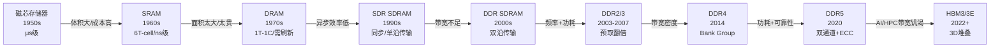

## 内存技术演进

内存技术的发展史，是一部人类在速度、密度、功耗三个维度上持续突破物理极限的工程史诗。从1950年代笨重的磁芯存储器到如今的DDR5和HBM3，每一次代际跃迁都源于上一代技术的核心瓶颈无法通过改良解决，必须从架构层面进行革命性重构。理解这段演进历程，不是为了考古，而是为了理解当前每一项内存技术特性的"为什么"——为什么DDR5要拆成双通道？为什么需要Bank Group？为什么HBM要用3D堆叠？答案都藏在演进的脉络中。

本节将按照技术演进的时间线，从物理存储单元的原理出发，逐层展开到DDR代际架构变革、专用内存分支（LPDDR/GDDR/HBM）的分化、新兴存储技术的探索，最终落地到生产环境的选型决策。阅读时建议结合本章"核心概念"一节中关于存储层次结构和局部性原理的讨论，它们构成了理解本节所有技术特性的理论基础。

### 演进全景：从磁芯到硅



内存技术演进的驱动力可以归纳为三条主线：

| 驱动力 | 含义 | 典型转折点 |
|--------|------|------------|
| **带宽饥渴** | CPU算力增长快于内存带宽（"内存墙"问题） | DDR→DDR2（预取翻倍）、DDR4→DDR5（双通道） |
| **功耗约束** | 移动设备和数据中心都要求更低功耗 | DDR2→DDR3（1.8V→1.5V）、LPDDR系列独立演进 |
| **密度极限** | 单颗芯片容量需求指数增长 | HBM（3D堆叠）、DDR5（16Gb die） |

#### 内存墙：一条正在扩大的鸿沟

"内存墙"（Memory Wall）是理解整个内存技术演进逻辑的核心概念。它描述的是CPU计算能力的增长速度远超内存带宽增长速度这一结构性矛盾。

以1980年代到2020年代的典型数据为例：CPU单核性能大约每两年翻一倍（遵循摩尔定律），而DRAM带宽的增长速率约为每两年提升20%-30%。四十年累积下来，CPU算力与内存带宽之间的差距扩大了约1000倍。这就是为什么现代CPU不得不配备多级缓存——用SRAM的高成本换取访问速度，用局部性原理将大部分数据访问拦截在片上。

内存墙的量化体现:

  CPU计算能力(理论峰值):  ████████████████████████████████████>>  每2年翻倍
  DRAM带宽(实际增长):     ████████████>>  每2年增长~25%
  
  1980s: CPU ≈ 内存带宽（勉强匹配）
  2000s: CPU > 内存带宽（开始出现瓶颈）
  2020s: CPU >> 内存带宽（鸿沟巨大, 缓存成为必需品）
  
  后果:
  - CPU利用率受限: 数据等待时间占比可高达50-70%
  - "内存延迟墙": 一次L3未命中 ≈ 200-300 CPU周期
  - 优化重心从"计算"转向"数据移动"

所有DDR代际创新的核心目标，本质上都是在试图缩小这条鸿沟——预取翻倍是为了在不提升内部频率的前提下增加接口带宽，Bank Group是为了通过并行隐藏延迟，DDR5的双通道设计则是从访问粒度上降低延迟。理解了内存墙，就理解了整个演进故事的主线。

### SRAM与DRAM：两条平行的技术路线

在深入DDR代际演进之前，必须先理解内存世界的两大基本技术——SRAM和DRAM——它们从诞生之初就走上了不同的道路，各自解决不同的问题。

**SRAM（Static RAM）**：1963年，Robert Norman在Fairchild Semiconductor首次展示SRAM。每个存储单元使用6个晶体管（6T）构成两个交叉耦合的反相器，通过正反馈锁定状态。优点是无需刷新、访问速度极快（1ns级），缺点是每个bit占6个晶体管，面积大、功耗高、成本高。SRAM至今仍然是CPU缓存（L1/L2/L3）的唯一选择。

SRAM 6T-cell结构:
         VDD           VDD
          │             │
        ┌─┴─┐         ┌─┴─┐
  WL ──▶│T1 │         │T3 │◀── WL
        └─┬─┘         └─┬─┘
    BL ──┤    ┌─────┐   ├── BL#
          └────┤ Q   ├───┘
               └──┬──┘
          ┌────┤ Q̄  ├───┐
    BL#──┤    └─────┘   ├── BL
        ┌─┴─┐         ┌─┴─┐
  WL ──▶│T2 │         │T4 │◀── WL
        └─┬─┘         └─┬─┘
          │             │
         GND           GND
    T5/T6: 访问管（由WL控制）

  每bit = 6个晶体管 → 面积大 → 但速度极快(1ns)

SRAM的核心优势在于"静态"——只要供电，数据就稳定保持，无需任何外部操作。但6个晶体管的代价是面积约为DRAM的4-6倍，这直接决定了SRAM无法用于大容量存储，只能服务于容量需求小但速度要求极高的缓存场景。

**DRAM（Dynamic RAM）**：1966年，IBM的Robert Dennard发明了DRAM的概念——用1个晶体管+1个电容（1T-1C）替代6个晶体管存储1位。电容充电表示1，放电表示0。面积缩小到SRAM的约1/6，成本大幅下降。但电容会泄漏电荷，必须每64ms刷新一次所有行，这带来了额外的功耗和带宽开销（刷新期间Bank不可用）。

DRAM 1T-1C cell结构:

  Word Line (WL)
    │
    ▼
  ┌──────┐
  │ 晶体管│──┬── Bit Line (BL)
  └──────┘  │
            ═══ 电容 (Cs)
            │
           GND

  每bit = 1个晶体管 + 1个电容 → 面积小
  但电容漏电 → 需要定期刷新 → "动态"的由来

"动态"（Dynamic）一词精确地概括了DRAM的本质特征：它的存储状态是暂时的，依赖于持续的电荷刷新来维持。一旦停止刷新，数据会在数十毫秒内因电容漏电而消失。这一特性使得DRAM无法像SRAM那样简单地通过"保持供电"来持久保存数据，但也正是这种设计让DRAM在密度和成本上获得了巨大优势。

**SRAM vs DRAM关键对比：**

| 特性 | SRAM | DRAM |
|------|------|------|
| 存储单元 | 6个晶体管 | 1晶体管 + 1电容 |
| 每bit面积 | ~120F² | ~20-30F² |
| 访问延迟 | 0.25-1ns | 50-100ns |
| 刷新需求 | 无 | 每64ms全部行 |
| 典型用途 | CPU缓存（L1/L2/L3） | 主存（DDR DIMM） |
| 成本/bit | 高（约DRAM的10倍） | 低 |
| 静态功耗 | 有（泄漏电流） | 低（但刷新消耗功耗） |

这种"快但贵"vs"慢但便宜"的二元格局，是存储层次结构存在的物理基础。正如本章"核心概念"一节所讨论的，正是SRAM和DRAM之间的性能/成本权衡，催生了从寄存器到L1/L2/L3缓存再到主存的多级存储层次——每一级都在速度和容量之间寻找最优平衡点。

### 磁芯存储器：内存的史前时代

在半导体存储器出现之前，计算机使用磁芯存储器（Core Memory）作为主存。磁芯存储器使用微小的铁氧体环（直径约1-2mm），通过电流方向产生的磁场来存储0和1。

磁芯存储器工作原理:
  ┌─────┐
  │ ○○○ │  ← 铁氧体环阵列
  │ ○○○ │    每个环穿过两根导线(行线/列线)
  │ ○○○ │    电流方向决定顺时针/逆时针磁化
  └─────┘
  
  写入: 行线+列线各通半电流, 交叉点的芯受到全电流激励而翻转
  读取: 试图写0, 如果芯原来有1则感应出电压脉冲(破坏性读取)

磁芯存储器的特点：

- **非易失性**：断电后数据保留（这是它至今仍被NASA用于太空辐射环境的原因——现代DRAM在高能粒子轰击下容易发生位翻转，而磁芯天然抗辐射）
- **访问速度**：微秒级（比DRAM慢约1000倍）
- **制造工艺**：手工穿线，人工成本极高。一台大型计算机的磁芯存储器可能需要工人花费数周时间手工编织
- **容量限制**：典型配置仅几KB到几十KB，IBM 704（1954年）配备了约4KB的磁芯存储器，这在当时已经是巨大的进步
- **读取破坏性**：读取操作会将磁芯的状态重置为0，因此每次读取后必须立即回写——这一机制与现代DRAM的"读取后刷新"有着惊人的相似性

1970年，Intel 1103——世界上第一款商用DRAM芯片——以更低的成本和更小的体积终结了磁芯存储器的时代。1103采用1T-1C结构，容量仅1Kbit（128字节），售价约$100，但它证明了半导体存储器可以在成本和密度上碾压磁芯。到1970年代末，磁芯存储器已基本退出主流市场。这场替代的本质是：半导体工艺的规模化效应使得存储单元的成本随产量指数下降，而磁芯的物理结构决定了其成本与容量线性相关。

### DRAM的诞生与早期发展（1970s-1980s）

Intel 1103（1970）开创了DRAM时代，但早期DRAM存在严重的设计缺陷：

- **需要三根电源线**（+5V, -5V, +12V），供电复杂，增加了主板设计难度
- **需要外部刷新电路**，增加了系统复杂度和成本
- **容易出现软错误**（Soft Error），宇宙射线翻转位——这个问题至今仍在困扰DRAM设计

1973年，Mostek推出MK4096（4Kbit DRAM），首次引入**地址复用技术**——行地址和列地址共用同一组引脚，分两次传输。这将芯片引脚数从原来的22个减少到16个，大幅降低了封装成本，成为后续所有DRAM的标准设计。

地址复用技术:
  传统方式(RAS前): A0-A11 共12根地址线 → 16引脚芯片
  地址复用(RAS/CAS): A0-A5 共6根地址线 → 10引脚芯片
  
  时序:
  ──RAS#──┐   ┌──CAS#──┐   ┌──
           └───┘        └───┘
  行地址: A0-A5 ↑       列地址: A0-A5 ↑
           (锁存行地址)        (锁存列地址)
  
  → 地址引脚减半, 封装成本大幅下降

地址复用技术的影响远超其表面的引脚节省。它实质上确立了DRAM的二维寻址范式——将一维的线性地址拆分为行地址和列地址，这种结构直接影响了后续所有DRAM的Bank组织、行缓冲（Row Buffer）设计，以及行缓冲冲突（Row Buffer Conflict）这一核心性能问题。

1980年代，DRAM经历了从16Kbit到4Mbit的快速迭代，每一代容量翻4倍（遵循"4M定律"，即每隔约3年容量提升4倍）。这一时期的竞争主要在日本厂商之间展开（NEC、东芝、日立），日本半导体产业凭借精益制造在DRAM市场取得了绝对主导地位。美国厂商的退出（包括英特尔在1985年彻底退出DRAM业务）标志着DRAM从实验室创新转向了大规模制造业竞争——谁的良率更高、成本更低，谁就能赢得市场。

### FPM到EDO：异步DRAM的最后挣扎（1980s-1990s）

**FPM（Fast Page Mode）DRAM**：传统DRAM每次访问都需要完整的ACT→CAS→PRE流程。FPM利用了行缓冲的局部性——如果连续访问同一行的不同列，可以跳过重复的ACT命令，只发送CAS。这将行命中场景的延迟从约100ns降低到约60ns。

FPM vs 传统DRAM访问同一行的4个连续列:

传统DRAM:
  ACT(Row) → CAS(Col0) → PRE → ACT(Row) → CAS(Col1) → PRE → ...
  每次访问都需要完整的ACT-PRE周期

FPM:
  ACT(Row) → CAS(Col0) → CAS(Col1) → CAS(Col2) → CAS(Col3) → PRE
  同一行只需一次ACT, 连续发送CAS即可
  → 有效延迟降低约40%

FPM的本质是对"局部性原理"在DRAM层面的工程实现——既然程序倾向于连续访问同一行的数据，那就减少不必要的行激活和预充电操作。

**EDO（Extended Data Out）DRAM**：在FPM基础上，EDO允许在CAS信号结束后保持数据输出有效，使得下一个CAS可以在前一个数据还没被取走时就开始。这进一步将流水线效率提升了约10%。

FPM时序:  CAS↓ → 等待数据输出完成 → 下一个CAS↓
EDO时序:  CAS↓ → 数据开始输出 → 下一个CAS↓(不等上一个完成)
                ↑ 数据窗口延长, 允许重叠

FPM和EDO都是异步设计——它们不依赖统一的时钟信号，而是由控制信号（RAS#、CAS#）的边沿触发。这限制了它们的最高工作频率和时序精确性。异步DRAM的极限约在66MHz（EDO-66），无法满足1990年代中期PC总线频率飞速提升的需求。当Intel Pentium处理器将前端总线提升到66MHz时，异步DRAM的带宽瓶颈成为了整个系统性能的天花板。

### SDRAM：同步时代的开启（1990s）

1993年，三星推出首款商用SDRAM（Synchronous DRAM）。SDRAM的核心创新是引入了**同步时钟**——所有操作都由统一的时钟信号驱动，而非异步控制信号。

异步 vs 同步:

异步DRAM (FPM/EDO):
  控制信号: RAS# ↓ ... CAS# ↓ ... 数据输出
  (由信号边沿触发, 无统一时钟)

SDRAM:
  CLK: ──┐  ┌──┐  ┌──┐  ┌──┐  ┌──┐  ┌──
          └──┘  └──┘  └──┘  └──┘  └──┘
  CMD:  LOAD  LOAD  LOAD
  DATA:              D0    D1    D2
  (所有操作对齐到CLK上升沿)

同步设计带来的关键优势：

1. **可预测的时序**：每个操作占用固定的时钟周期数，便于流水线设计。CPU可以精确地知道一次内存访问需要等待多少个时钟周期，从而更好地调度其他任务
2. **突发传输（Burst）**：一次ACT+CAS后可以连续输出多个数据（BL4/BL8），无需每个数据都发CAS。突发传输利用了空间局部性——一次行激活后连续读取多个列，大幅提升了连续访问场景的有效带宽
3. **模式寄存器（Mode Register）**：可通过编程配置CL（CAS Latency）、BL（Burst Length）、突发类型等参数。这使得同一颗芯片可以适配不同速度等级的系统，降低了库存管理复杂度
4. **多Bank并行**：不同Bank可以在同一时钟周期内交替操作，利用Bank间的独立性隐藏行激活延迟

SDRAM的数据速率与系统时钟相同（133MHz = 133MT/s），在1990年代末期达到极限。突破的关键在于——既然时钟上升沿和下降沿都能传输数据，为什么不两个边沿都用？

### DDR系列：双沿传输与预取革命（2000s-2020s）

#### DDR（DDR1）：双沿传输的诞生（2000年）

JEDEC于2000年发布DDR SDRAM标准。核心思想极为简洁：在时钟的上升沿和下降沿各传输一次数据，将数据速率翻倍而时钟频率不变。

SDR SDRAM (单沿):
  CLK:  ──┐  ┌──┐  ┌──┐  ┌──┐  ┌──
          └──┘  └──┘  └──┘  └──┘
  DATA:       D0       D1       D2
  (仅上升沿传输)

DDR SDRAM (双沿):
  CLK:  ──┐  ┌──┐  ┌──┐  ┌──┐  ┌──
          └──┘  └──┘  └──┘  └──┘
  DATA:     D0   D1   D2   D3   D4
  (上升沿+下降沿都传输)
  → 同样频率下带宽翻倍

DDR还引入了**2n预取（Prefetch）**：内部存储阵列在一个时钟周期内读出2bit数据，通过两个数据引脚（DQ）并行输出。配合双沿传输，实现了"内部慢、接口快"的设计。

DDR 2n预取:
  内部DRAM阵列(慢):  |----1周期----|----1周期----|
  读出数据:           2bit          2bit
  接口传输(快):       D0(↑) D1(↓)  D2(↑) D3(↓)
  
  → 内部频率不需要提高, 通过预取+双沿实现外部带宽翻倍

DDR的关键参数：

- 电压：2.5V
- 数据速率：200-400 MT/s
- 预取：2n
- 突发长度：BL8
- 典型CL：2.5-3（对应延迟约12.5-15ns）
- 时序参数：tRCD（RAS到CAS延迟）约15-20ns，tRP（行预充电时间）约15-20ns

#### DDR2：片外驱动器革命（2003年）

DDR2并非简单的"速度翻倍"。它解决的是DDR在高频下的信号完整性问题。

**核心创新1——片外驱动器（ODT, On-Die Termination）**：

DDR时代，信号线的终端电阻需要焊接在主板上（称为"外置终端"）。随着频率提升，信号反射（Reflection）问题越来越严重——高速信号在传输线末端遇到阻抗不匹配时会反弹回来，干扰后续信号。DDR2将终端电阻集成到芯片内部，大幅缩短了信号路径，减少了反射和串扰。ODT的意义不仅在于提升了信号质量，更在于它简化了主板设计——主板不再需要为每条数据线额外配置终端电阻。

**核心创新2——片外DLL（Delay-Locked Loop）**：

DDR2在芯片内部增加了DLL，用于精确调整输出数据相对于时钟的相位关系。在高频下，芯片内部的时钟树延迟和数据路径延迟可能不一致，DLL通过动态调整延迟来补偿这种差异，确保数据在正确的时钟边沿被采样。

**核心创新3——4n预取**：

内部数据宽度从2bit增加到4bit，内部频率进一步降低，但外部数据速率翻倍。这种"以面积换频率"的策略成为DDR后续演进的核心方法论。

DDR → DDR2 架构对比:
DDR:   内部阵列(1x) → 2n预取 → 2个DQ引脚 → 双沿传输
DDR2:  内部阵列(1x) → 4n预取 → 4个DQ引脚 → 双沿传输 + ODT + DLL

类比: DDR是双向两车道, DDR2是每方向拓宽为4车道, 并且加了交通信号灯(DLL)

DDR2参数：电压1.8V（比DDR降低28%），400-1066 MT/s，4n预取，4-8个Bank，CL 4-7。

#### DDR3：低功耗与更大容量（2007年）

DDR3的改进相对渐进，但每一项都针对实际痛点：

**8n预取**：内部数据宽度翻倍到8bit，内部频率进一步降低，有利于功耗控制和信号完整性。预取翻倍意味着在相同的内部频率下，DDR3的外部带宽是DDR2的两倍。

**自刷新（Self-Refresh）**：DDR3改进了刷新机制，支持温度控制刷新（Temperature Compensated Self-Refresh, TCSR）。DRAM的刷新频率本质上取决于电容的漏电速率，而漏电速率与温度正相关——高温下漏电加快，需要更频繁的刷新；低温下漏电减慢，可以降低刷新频率。TCSR通过温度传感器动态调整刷新间隔，在低温环境下将待机功耗降低20%-30%。这对于笔记本电脑和服务器的能效优化意义重大。

**写调平（Write Leveling）**：DDR3首次支持点对点（Point-to-Point）拓扑——一个通道只连接一个DIMM。在DDR2的多DIMM拓扑中，多个DIMM共享同一组地址/命令线，导致信号需要驱动更长的线路，反射问题严重。点对点拓扑消除了这一问题，但也意味着每个通道的容量上限取决于单个DIMM的最大容量。为了弥补这一点，DDR3将每个通道的Bank数从4增加到8。

**重置（Reset）引脚**：DDR3新增了硬件复位引脚，上电后所有内部寄存器自动恢复默认值，简化了初始化流程。在DDR2时代，上电初始化需要严格按照时序发送一系列命令来配置模式寄存器，任何步骤出错都可能导致芯片工作异常。

DDR3参数：电压1.5V（1.35V低电压版DDR3L），800-2133 MT/s，8n预取，8个Bank，CL 7-11。

#### DDR4：Bank Group与架构精炼（2014年）

DDR4没有像DDR2和DDR3那样通过翻倍预取来提升带宽（仍然保持8n），而是在架构层面进行了精细化改进。核心创新是**Bank Group架构**：

DDR3: 8个Bank, 扁平结构
  Bank0 Bank1 Bank2 Bank3 Bank4 Bank5 Bank6 Bank7
  (任意两个Bank可并行操作, 但同Bank内需顺序访问)

DDR4: 16个Bank, 分为4个Bank Group
  BG0: [Bank0, Bank1, Bank2, Bank3]
  BG1: [Bank4, Bank5, Bank6, Bank7]
  BG2: [Bank8, Bank9, Bank10, Bank11]
  BG3: [Bank12, Bank13, Bank14, Bank15]
  
  规则: 同一BG内需顺序访问, 不同BG可并行
  → Bank间冲突概率降低, 有效并发度提升

Bank Group的原理借鉴了CPU缓存中"组相联"的思想：通过分组减少了Bank之间的行缓冲冲突（Row Buffer Conflict），在保持总Bank数可控的前提下提升了并行度。行缓冲冲突是DRAM性能的主要杀手之一——当两个请求分别激活同一Bank的不同行时，必须先完成预充电再重新激活，这会引入额外的延迟（通常约30-50ns）。Bank Group通过将请求分散到不同Group中，大幅降低了这种冲突的概率。

DDR4不增加预取宽度的决策本身也值得深思。如前所述，预取翻倍的代价包括延迟增加和面积增大。DDR4选择了另一条路径——通过增加Bank并行度来提升有效带宽——这种"用并发换带宽"的策略在保持延迟不恶化的前提下实现了带宽提升。

DDR4其他改进：

- **电压降低到1.2V**：比DDR3的1.5V降低20%，功耗显著下降。对于数据中心中成千上万条DIMM的场景，这20%的电压降低意味着可观的电力成本节约
- **VLP（Very Low Profile）DIMM**：高度从31.25mm降至18.75mm，适合1U/2U服务器的紧凑空间
- **增强的CRC校验**：命令/地址总线支持CRC校验，提高数据完整性。这对大规模服务器集群的稳定性至关重要
- **更灵活的Burst Length**：支持BL8和BC8（Bank Copy），适应不同应用场景
- **ECC保护增强**：部分厂商支持on-die ECC（片内ECC），在数据从阵列到I/O的路径上增加纠错能力

DDR4参数：电压1.2V，1600-3200 MT/s，8n预取，16 Bank（4 BG），CL 10-22。

#### DDR5：双通道与片上ECC的革命（2020年）

DDR5不仅仅是"更快的DDR4"，它在架构层面进行了多项根本性改变：

**双子通道设计**：一个64-bit DIMM被拆分为两个独立的32-bit子通道（Sub-Channel），每个子通道有自己的时序控制。这大幅降低了访问粒度——原来需要读取整个64-bit字，现在只需读取32-bit即可。

DDR4:  一个64-bit通道
  ┌────────────────────────────────────────┐
  │            64-bit Data Bus              │
  └────────────────────────────────────────┘

DDR5:  两个32-bit子通道
  ┌──────────────────┐ ┌──────────────────┐
  │  Sub-Channel A   │ │  Sub-Channel B   │
  │     32-bit       │ │     32-bit       │
  └──────────────────┘ └──────────────────┘
  → 两个子通道可独立操作, 并发度翻倍
  → 延迟降低(更小的访问粒度)

双子通道设计的实际意义在于：对于小粒度的随机访问（如数据库OLTP场景中的索引查找），32-bit的访问粒度意味着每次事务性操作读取的数据量更少，队列深度可以更浅，从而降低了有效访问延迟。两个子通道可以同时处理不同的请求，相当于将单通道的排队模型变成了双通道并行处理。

**片上ECC（On-Die ECC）**：DDR5在每128bit数据中增加8bit ECC校验位，由芯片内部自动进行纠错。注意，这与系统级ECC（如RDIMM上的ECC芯片）不同——片上ECC主要应对的是随着制程缩小而增加的位翻转概率，而非系统级的可靠性需求。当DRAM制程从20nm缩小到10nm级别时，每个存储单元的电容更小、信号更弱，位翻转（Bit Flip）的概率显著增加。片上ECC是DRAM厂商在制程推进过程中必须采用的"自我保护"机制。

**DFE（Decision Feedback Equalizer）**：DDR5引入DFE电路，通过反馈机制消除高速信号的码间干扰（ISI）。在超过6400 MT/s的频率下，信号在传输线上的畸变变得不可忽略——前一个符号的残留能量会干扰当前符号的判决。DFE通过采样当前符号后，利用已知的前一符号信息来修正判决阈值，从而在不增加发射功率的前提下提升了信号质量。这是DDR5能够达到8800 MT/s甚至更高频率的物理层基础。

**Same-Bank Refresh**：DDR4在刷新时会阻塞整个芯片的所有Bank。DDR5引入Same-Bank Refresh模式，允许只刷新指定的Bank，其他Bank可以继续正常读写。刷新是DRAM的固有开销（约占总带宽的5%-10%），将刷新粒度从芯片级细化到Bank级，可以将刷新对正常读写的影响降低约70%。

**16n预取**：预取宽度从DDR4的8n翻倍到16n，配合更高的频率实现带宽的大幅提升。

**新增功能**：

- **板载电压调节器（VR）**：DDR5将电压调节从主板移到了DIMM板上，减少了主板设计复杂度，也允许更精细的电压控制
- **粒度刷新（Fine Granularity Refresh）**：支持更灵活的刷新间隔配置，在性能和可靠性之间提供更多调节空间

DDR5参数：电压1.1V，3200-8800 MT/s，16n预取，32 Bank（8 BG），片上ECC，CL 22-40。

#### DDR各代时序参数演进

理解DDR的性能不仅要看数据速率，还要看延迟参数的演进。以下表格展示了各代DDR的典型时序参数（以最高频率规格为基准）：

| 代数 | CL (cycles) | CL (ns) | tRCD (ns) | tRP (ns) | tRAS (ns) | 首次访问延迟 (ns) |
|------|-------------|---------|-----------|----------|-----------|-------------------|
| DDR | 2.5-3 | 12.5-15 | 15-20 | 15-20 | 40-50 | ~55-75 |
| DDR2 | 4-7 | 7.5-14 | 10-15 | 10-15 | 30-40 | ~45-60 |
| DDR3 | 7-11 | 8.5-14 | 10-14 | 10-14 | 28-36 | ~45-60 |
| DDR4 | 10-22 | 10-14 | 12-14 | 12-14 | 28-32 | ~50-60 |
| DDR5 | 22-40 | 12-14 | 12-14 | 12-14 | 28-32 | ~50-60 |

一个值得注意的现象：**尽管DDR的代际频率在大幅提升，绝对延迟（以纳秒计）却基本保持在45-75ns的范围内**。这是因为频率提升的同时，CAS Latency的cycle数也在增加，两者基本抵消。DDR的真正进步在于带宽（MB/s），而非延迟（ns）。这也是为什么"DDR5比DDR4快一倍"这种说法需要澄清——它快的是带宽，不是延迟。对于延迟敏感型工作负载（如高频交易、实时系统），DDR代际升级的收益远没有带宽敏感型工作负载那么显著。

### 预取机制深度解析

预取（Prefetch）是DDR系列提升带宽的核心机制。理解预取的本质，是理解DDR代际演进的关键。

预取的本质: 用面积换速度

  DRAM内部阵列: 天然慢 (受限于RC延迟, ~10ns级)
  外部接口:     需要快 (对接高速总线)

  预取 = 在一个内部时钟周期内, 从阵列中并行读出N个bit
         然后通过N个数据引脚并行输出
         → 外部速率 = 内部速率 × N × 2(双沿)

  DDR  (2n): 内部8bit → 2个DQ引脚 × 2沿 = 外部4×
  DDR2 (4n): 内部8bit → 4个DQ引脚 × 2沿 = 外部8×
  DDR3 (8n): 内部8bit → 8个DQ引脚 × 2沿 = 外部16×
  DDR4 (8n): 内部8bit → 8个DQ引脚 × 2沿 = 外部16×
  DDR5(16n): 内部8bit → 16个DQ引脚 × 2沿 = 外部32×

预取的代价：

- **延迟增加**：预取宽度越大，需要等待的数据量越多，首次访问延迟可能增加。这也是DDR5的CAS Latency cycle数远高于DDR4的原因
- **效率问题**：如果访问模式不连续，预取出的多余数据被浪费，有效带宽下降。对于随机访问场景，宽预取的实际收益远低于理论值
- **面积增加**：更多的DQ引脚意味着更大的芯片面积和封装成本

这也是为什么DDR4选择不增加预取宽度（仍为8n），而是通过Bank Group提升并行度来增加有效带宽。DDR5在16n预取的同时引入了双子通道，部分缓解了宽预取带来的效率问题——32-bit的子通道粒度使得16n预取的数据量仍然在合理范围内。

### 各代关键技术全面对比

| 代数 | 年份 | 电压 | 数据速率 | 预取 | Bank数 | 关键创新 | 最大单条容量 |
|------|------|------|----------|------|--------|----------|-------------|
| DDR | 2000 | 2.5V | 200-400 MT/s | 2n | 4 | 双沿采样 | 512MB |
| DDR2 | 2003 | 1.8V | 400-1066 MT/s | 4n | 4-8 | 片外DLL、ODT | 2GB |
| DDR3 | 2007 | 1.5V | 800-2133 MT/s | 8n | 8 | 自刷新、点对点 | 8GB |
| DDR4 | 2014 | 1.2V | 1600-3200 MT/s | 8n | 16(4 BG) | Bank Group、VLP | 32GB |
| DDR5 | 2020 | 1.1V | 3200-8800 MT/s | 16n | 32(8 BG) | 双通道、片上ECC、DFE | 128GB |
| HBM2E | 2020 | 1.2V | 3.6 Gbps/pin | — | — | 3D堆叠、1024位宽 | 24GB/stack |
| HBM3 | 2022 | 1.1V | 6.4 Gbps/pin | — | — | 伪通道、更高密度 | 48GB/stack |
| HBM3E | 2024 | 1.0V | 9.2 Gbps/pin | — | — | 进一步频率提升 | 64GB/stack |

### LPDDR系列：移动世界的独立演进

LPDDR（Low Power DDR）是面向移动设备的低功耗内存系列，与标准DDR并行发展但走了不同的技术路线。

| 代数 | 年份 | 电压 | 数据速率 | 关键特性 |
|------|------|------|----------|----------|
| LPDDR | 2007 | 1.8V | 200-406 MT/s | 低功耗DDR |
| LPDDR2 | 2010 | 1.2V | 1066 MT/s | 单电源、复用命令/地址 |
| LPDDR3 | 2012 | 1.2V | 1600-2133 MT/s | WCK时钟、DBI |
| LPDDR4 | 2014 | 1.1V | 3200 MT/s | 双通道16-bit |
| LPDDR4X | 2017 | 0.6V(I/O) | 4266 MT/s | 降低I/O电压 |
| LPDDR5 | 2019 | 1.05V | 6400 MT/s | 多Burst、DVFS |
| LPDDR5X | 2022 | 1.05V | 8533 MT/s | 进一步频率提升 |

LPDDR的核心设计哲学：**在任何不需要数据的时候立即进入低功耗状态**。

LPDDR功耗管理策略:
  
  Active:    全速运行, 最高功耗
  Idle:      降低频率/关闭未使用Bank
  Power-Down: 时钟门控, 保留数据
  Self-Refresh: 仅维持数据刷新, 最低功耗
  
  LPDDR5新增:
  - DVFS (动态电压频率调节): 根据负载实时调整频率和电压
  - 多Burst支持: 可配置Burst长度, 适应不同访问模式
  - WCK-to-CK比率: 支持1:1(低速)和1:2(高速)模式切换

LPDDR与标准DDR的核心差异不仅在于电压和功耗，更在于物理形态——LPDDR芯片直接焊接在主板上（BGA封装），而非通过DIMM插槽安装。这种设计消除了连接器的接触电阻和信号损耗，但也意味着内存容量在出厂后无法升级。对于智能手机和笔记本电脑来说，这是可以接受的妥协——用户更关心电池续航而非可升级性。

LPDDR4X将I/O电压从LPDDR4的1.1V大幅降低到0.6V，而核心电压保持1.1V不变。I/O电压是数据传输时的功耗主要来源（动态功耗与V²成正比），将I/O电压减半意味着数据传输功耗降低约70%。这就是为什么LPDDR4X在几乎不损失性能的前提下实现了显著的功耗改善。

LPDDR5的DVFS（Dynamic Voltage and Frequency Scaling）允许系统根据实时负载动态调整内存频率和电压——在轻度使用时降频降压以省电，在重负载时提升频率以保证性能。这种动态调节能力对于移动设备的续航优化至关重要。

### GDDR：图形专用内存的特殊路线

GDDR（Graphics DDR）是专为GPU设计的内存系列，追求极致带宽而非低延迟。

GDDR vs 主流DDR的设计取向:
  
  主流DDR: 64-bit宽通道 × 低频率 → 平衡带宽和延迟
  GDDR:    32-bit宽通道 × 极高频率 → 追求极致带宽
  
  GDDR6X (NVIDIA RTX 30/40系列):
  - PAM4信号: 4电平脉冲调制, 每符号传2bit
  - 数据速率: 21 Gbps/pin
  - 单芯片带宽: 84 GB/s (32-bit × 21 Gbps)
  
  GDDR7 (下一代):
  - 数据速率: 32+ Gbps/pin
  - 进一步缩小与HBM的带宽差距

GDDR采用PAM4（Pulse Amplitude Modulation 4-level）信号编码是其突破带宽瓶颈的关键技术。传统NRZ（Non-Return-to-Zero）编码每个时钟周期只传输1bit（高/低两个电平），而PAM4使用4个电平（00/01/10/11），每个符号传输2bit。这使得在相同时钟频率下，PAM4的有效带宽是NRZ的两倍。代价是对信号质量要求更高——4个电平之间的间距更小，更容易受到噪声干扰，因此需要更复杂的均衡电路和更严格的PCB设计。

GDDR与HBM的市场定位：

- **GDDR**：中端GPU、游戏显卡，成本约为HDDR的1/5-1/10，适合对成本敏感但对带宽有一定要求的场景。NVIDIA RTX 4090使用12颗GDDR6X，总带宽约1TB/s
- **HBM**：高端GPU（A100/H100/H200）、AI加速器，带宽是GDDR的5-10倍，但成本也是GDDR的5-10倍。NVIDIA H100使用6颗HBM3，总带宽约3.35TB/s
- **GDDR7的追赶**：单颗GDDR7的带宽约128GB/s（32-bit × 32 Gbps），8颗可达1TB/s级别，在特定场景下可以缩小与HBM的差距

### HBM（High Bandwidth Memory）：3D堆叠突破带宽墙

HBM彻底颠覆了传统DIMM的平面封装方式，将多颗DRAM die垂直堆叠，通过硅通孔（TSV, Through-Silicon Via）互连。

HBM堆叠架构 (以HBM3为例):

  ┌─────────────┐
  │   DRAM Die 7 │  ← 顶层
  ├─────────────┤
  │   DRAM Die 6 │
  ├─────────────┤
  │   DRAM Die 5 │
  ├─────────────┤
  │   DRAM Die 4 │
  ├─────────────┤
  │   DRAM Die 3 │
  ├─────────────┤
  │   DRAM Die 2 │
  ├─────────────┤
  │   DRAM Die 1 │
  ├─────────────┤
  │   Base Die   │  ← 控制逻辑 + 接口
  └──────┬──────┘
         │ TSV (硅通孔)
    ─────┴─────  Interposer (硅中介层)
         │
  ┌──────┴──────┐
  │  GPU/AI Die  │  ← 计算芯片
  └─────────────┘

  关键数据 (HBM3):
  - 堆叠层数: 8-12层
  - 位宽: 1024-bit (vs DDR5的64-bit)
  - 带宽: 819 GB/s (vs DDR5-6400的51.2 GB/s)
  - 延迟: ~20ns (vs DDR5的~14ns, 略高)
  - 功耗/bit: 低 (短互连距离)

HBM的优势：

- **位宽极大**：1024-bit（DDR5的16倍），即使频率不高也能实现超高带宽。这是HBM带宽优势的根本来源——它不是靠频率取胜，而是靠并行度
- **功耗效率高**：TSV互连距离短（几微米到几十微米），信号传输能耗远低于传统PCB走线（几厘米到几十厘米）。每bit传输的能耗约为DDR的1/3
- **封装面积小**：3D堆叠节省水平空间，HBM stack的占地面积仅约DDR DIMM的1/10
- **延迟可预测**：由于与计算芯片通过硅中介层直连，信号路径短且可控，延迟抖动小

HBM的劣势：

- **成本极高**：约为同容量DDR的5-10倍。TSV制造工艺复杂，良率挑战大，每增加一层堆叠都会降低整体良率
- **延迟略高**：TSV互连增加了一定延迟（约5-8ns），且堆叠层数越多延迟越高
- **容量受限**：单stack的最大容量受堆叠层数和制程限制，目前最大约64GB/stack
- **散热挑战**：多层die垂直堆叠导致散热路径变长，热量集中在stack内部，需要特殊的封装散热设计

HBM的主要应用：NVIDIA A100/H100/H200 GPU、AMD MI300X、Google TPU v5等AI加速器。在大模型训练场景中，HBM的带宽直接决定了GPU之间的通信效率——AllReduce等集合通信操作的性能与HBM带宽近似线性相关。

### CXL.mem：内存池化的未来

CXL（Compute Express Link）是一种基于PCIe物理层的互连标准，其CXL.mem协议允许CPU通过CXL总线访问远端内存设备，实现内存的解耦（Disaggregation）和池化（Pooling）。

传统架构 vs CXL内存池化:

传统: CPU0 ──本地DDR── 64GB
      CPU1 ──本地DDR── 64GB
      (每个CPU独占本地内存, 资源无法共享)

CXL池化: CPU0 ──┐              ┌── DDR Pool A (128GB)
                 ├── CXL交换机 ──┤
      CPU1 ──┘              └── DDR Pool B (128GB)
      (多个CPU共享内存池, 按需分配)

CXL 2.0+支持:
  - 内存池化: 多个主机共享内存资源
  - 内存扩展: 在不增加DIMM槽位的情况下扩展容量
  - 热插拔: 在线增加/移除内存设备

CXL.mem的核心价值：

- **突破单机容量限制**：单台服务器可访问的内存不再受DIMM槽位限制。对于内存数据库（如SAP HANA）和大型缓存系统（如Redis Cluster），这一能力至关重要
- **提高内存利用率**：多台服务器共享内存池，避免"有些服务器内存空闲、有些不够用"。在实际数据中心中，内存的平均利用率通常只有40%-60%，CXL池化可以将这一比例提升到80%以上
- **降低总体成本**：内存资源按需分配，减少闲置浪费。一台需要128GB内存的服务器不必在本地安装128GB（其中可能只使用60%），而是从池中按需获取

**CXL 3.0的新能力**（2024-2025年逐步落地）：

- **内存共享（Memory Sharing）**：多个主机可以同时访问同一物理内存区域，由硬件保证一致性。这为多主机协作计算提供了底层支持
- **内存广播（Memory Broadcasting）**：一次写操作可以自动广播到多个主机的缓存中，适合读多写少的共享数据场景
- **增强的一致性协议**：CXL 3.0引入了更完善的一致性域管理，支持跨主机的缓存一致性，使得内存池化不仅是"容量扩展"，更是"计算与内存的解耦"

CXL当前状态（2025年）：Intel和AMD的最新服务器平台已支持CXL 1.1/2.0，但大规模部署仍在早期阶段。主要障碍包括：CXL内存设备的生态尚未成熟（目前主要是三星和SK海力士在推进）、操作系统对CXL内存的管理支持仍在完善中（Linux内核的CXL子模块从5.18开始引入）、以及延迟补偿（CXL远端内存的延迟约为本地DDR的1.5-2倍，需要应用层适配）。

### 新兴内存技术

除了传统DRAM家族的持续演进，内存领域还涌现了多种颠覆性技术，它们试图在特定维度上突破DRAM的物理极限。

```mermaid
graph TB
    subgraph 传统DRAM家族
        DRAM[标准DDR<br/>通用/成熟]
        LPDDR[LPDDR5X<br/>低功耗/移动]
        GDDR[GDDR7<br/>图形/高带宽]
    end
    subgraph 3D堆叠方向
        HBM[HBM3/3E<br/>3D堆叠/超宽带宽]
    end
    subgraph 内存池化方向
        CXL[CXL.mem/CXL 3.0<br/>内存解耦/池化/共享]
    end
    subgraph 非易失方向
        PMEM[3D XPoint/Optane<br/>非易失/字节寻址<br/>(已停产)]
        ReRAM[ReRAM<br/>阻变存储器<br/>(研发中)]
        MRAM[STT-MRAM<br/>磁性存储器<br/>(小容量量产)]
    end
    subgraph 计算方向
        PIM[Processing-in-Memory<br/>存内计算<br/>(研究热点)]
    end
```

#### 非易失性新兴存储器

| 技术 | 原理 | 读延迟 | 写耐久 | 当前状态 |
|------|------|--------|--------|----------|
| 3D XPoint (Optane) | 相变+硫系化合物 | ~100ns | 10^8~10^9 | Intel已停产(2022) |
| ReRAM (RRAM) | 阻变材料导电丝 | ~10ns | 10^6~10^12 | 研发阶段 |
| STT-MRAM | 磁隧道结自旋极化 | ~10ns | 10^15+ | 小容量量产(SRAM替代) |
| PCM (相变存储) | GST晶态/非晶态 | ~50ns | 10^8~10^9 | 研发阶段 |

**Intel Optane的兴衰：一个关于市场定位的教训**

Intel Optane（基于3D XPoint）是最接近成功的新型非易失存储器。它实现了介于DRAM和NAND之间的性能定位：比NAND快100倍读延迟（~100ns vs ~10μs），比DRAM大10倍容量潜力，且断电数据不丢失。从技术角度看，Optane几乎完美填补了存储层次结构中的"DRAM-NAND间隙"。

然而，Intel于2022年宣布停产Optane产品线，累计亏损超过70亿美元。失败的根本原因不在于技术，而在于市场定位的尴尬：

1. **定位模糊**：作为主存替代品，Optane的延迟（~100ns）是DRAM（~50ns）的两倍，性能差距在延迟敏感场景中不可接受；作为存储替代品，Optane的成本（~$1/GB）远高于NAND（~$0.05/GB），性价比不足
2. **生态不足**：操作系统和应用软件对持久内存（Persistent Memory）的编程模型支持有限，开发者需要修改代码才能充分发挥Optane的优势
3. **DRAM降价**：Optane推出期间，DRAM价格持续下降，缩小了两者之间的成本差距，降低了Optane的吸引力
4. **战略调整**：Intel在2021年将存储业务出售给SK海力士（Solidigm），Optane的优先级大幅下降

Optane的教训表明：一项存储技术的成功不仅取决于性能指标，更取决于它是否能在特定应用场景中提供不可替代的价值。

**MRAM的嵌入式突破**

MRAM（磁性存储器）目前在嵌入式领域已实现小容量量产（如28nm工艺的4-16Mbit），主要用于替代SRAM缓存。其核心优势在于零待机功耗（磁性状态不依赖供电维持）和超高耐久性（10^15+次写入，远超闪存的10^3-10^5次）。但MRAM在大容量主存领域仍面临密度不足的挑战——每个MRAM存储单元需要的面积约为DRAM的3-5倍，难以在成本上与DRAM竞争。

#### Processing-in-Memory（存内计算）

存内计算（PIM, Processing-in-Memory）是一种试图从根本上改变"计算-存储"分离架构的新范式。传统计算机架构中，数据必须从存储器搬运到处理器才能被计算，这种"数据搬运"消耗的能量和时间远超计算本身（在AI推理场景中，数据搬运的能耗可达计算能耗的10-100倍）。

PIM的核心思想是：将计算逻辑直接集成到DRAM芯片内部，在数据所在的位置完成计算。Samsung的HBM-PIM（Programmable Memory Intelligence）在HBM stack中集成了可编程的SIMD单元，可以在不经过总线的情况下直接完成向量运算。

传统架构 vs PIM:

传统:
  DRAM ──总线──→ CPU ──计算──→ DRAM
  (数据搬运延迟 + 总线带宽瓶颈)

PIM:
  DRAM[计算逻辑] ──→ 结果
  (数据不移动, 在存储器内部完成计算)

优势:
  - 消除数据搬运开销
  - 突破总线带宽瓶颈
  - 能效比可提升10-100倍

挑战:
  - 编程模型复杂 (需要新的软件栈)
  - 通用性不足 (适合特定计算模式)
  - 散热困难 (计算产生的热量叠加在存储器内部)

PIM目前仍处于研究和早期探索阶段，尚未大规模商用。但它代表了内存技术演进的一个可能方向——当"数据搬运"成为性能和能耗的主要瓶颈时，在数据原位完成计算可能是唯一的出路。

### 生产环境选型指南

内存选型需要综合考虑性能需求、容量需求、功耗预算和成本约束四个维度。

| 场景 | 推荐技术 | 典型配置 | 理由 |
|------|----------|----------|------|
| Web应用服务器 | DDR5-4800/5600 ECC RDIMM | 64-128GB | 性价比最优，ECC保障可靠性 |
| OLTP数据库 | DDR5-5600 ECC RDIMM | 256-512GB | 低延迟+数据完整性，容量充足 |
| 大数据分析 | DDR5-4800 + CXL扩展 | 512GB-2TB | 突破单机容量限制 |
| AI训练 (大模型) | HBM3/3E | 80-192GB (H100) | 带宽是训练瓶颈的唯一答案 |
| AI推理 (边缘) | LPDDR5X | 16-64GB | 功耗约束下的最佳选择 |
| 高端游戏PC | DDR5-6400/7200 | 32-64GB | 高频率提升帧率稳定性 |
| 嵌入式/IoT | LPDDR4X/LPDDR5 | 2-8GB | 极低功耗，成本敏感 |
| 科学计算/HPC | DDR5 + HBM混合 | 256GB DDR5 + HBM | 大容量工作集 + GPU加速器 |

**选型决策流程：**

1. 确定性能瓶颈:
   ├── 带宽受限 → HBM (GPU/AI) 或 DDR5多通道
   ├── 延迟受限 → 高频低CL DDR5 或 评估SRAM缓存
   └── 容量受限 → CXL.mem扩展 或 大容量RDIMM

2. 确定功耗约束:
   ├── 服务器(无限制) → 标准DDR5 RDIMM
   ├── 笔记本/移动   → LPDDR5X (焊接式)
   └── 边缘/嵌入式   → LPDDR4X/LPDDR5

3. 确定可靠性需求:
   ├── 关键业务(金融/医疗) → ECC RDIMM + 系统级RAID
   ├── 一般服务器          → ECC RDIMM
   └── 消费级              → 非ECC UDIMM

4. 确定预算:
   ├── 不限 → HBM3 + 最高频率DDR5
   ├── 适中 → DDR5-5600 ECC
   └── 紧张 → DDR5-4800 或 上一代DDR4 (仍有库存)

### 演进趋势与未来展望

回顾内存技术70年的演进历程，可以看到几个清晰的趋势：

**趋势1：从通用到专用**。早期所有计算场景都使用相同的DRAM，如今已经分化出DDR（通用服务器）、LPDDR（移动）、GDDR（图形）、HBM（AI/HPC）四条独立的产品线，每条线针对特定场景深度优化。这种分化在可预见的未来还会继续——随着AI、边缘计算、自动驾驶等新场景的出现，可能会催生更多专用内存形态。

**趋势2：从平面到立体**。DRAM密度提升从单纯依赖制程缩小（Moore's Law），转向3D堆叠（HBM）和架构创新（Bank Group、双通道）双轮驱动。随着制程逼近物理极限（<10nm），3D化是必然方向。HBM已经证明了3D堆叠的商业可行性，未来可能会看到更多"3D+架构创新"的组合方案。

**趋势3：从独立到池化**。CXL的出现标志着内存从"CPU的附属品"转变为"独立的资源池"。未来数据中心的内存可能不再绑定在特定服务器上，而是作为共享资源按需分配。这一趋势将深刻影响服务器架构设计——CPU和内存的解耦意味着服务器可以更灵活地配置，内存资源可以更高效地利用。

**趋势4：非易失存储的持续探索**。尽管Optane已经停产，但对"通用存储器"（兼具DRAM的速度和NAND的非易失性）的追求不会停止。MRAM、ReRAM等技术仍在持续发展，可能会在特定场景（嵌入式、IoT、边缘计算）率先突破。

**趋势5：存内计算的兴起**。当数据搬运的能耗和延迟成为主要瓶颈时，在存储器内部完成计算可能成为新的突破口。PIM技术虽然仍在早期阶段，但它代表了一种从根本上重新定义"计算"与"存储"关系的可能性。

**趋势6：CXL 3.0与内存语义的扩展**。CXL 3.0引入的内存共享和广播能力，正在将内存从"被动的数据容器"转变为"主动的协作平台"。未来可能会看到更多基于CXL的内存语义创新——内存级别的事务处理、内存级别的数据一致性保证等。

这六条趋势并非相互独立，而是相互交织、共同演进。理解它们的交叉点——例如HBM + PIM的组合、CXL + 3D堆叠的融合——可能揭示内存技术的下一个重大突破方向。正如本章"关键指标"一节将要讨论的，内存选型和优化的终极目标，是在性能、容量、功耗、成本和可靠性这五个维度之间找到最佳平衡点。这个平衡点不是静态的，而是随着技术演进和应用场景变化而不断移动的。
