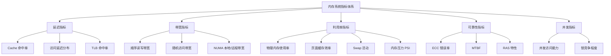

## 内存系统关键指标

内存系统的性能评估不是单一数字能回答的问题——它涉及**延迟、带宽、利用率、可靠性**等多个维度，每个维度又包含若干子指标。本节从原理到实操，系统讲解如何量化内存性能、如何选择监控指标、如何解读测量结果。

### 为什么需要关注内存指标

程序运行时的每一次数据访问最终都要落到内存系统上。当 CPU 等待内存数据时，流水线空转、缓存失效、NUMA 跨节点访问等现象都会导致性能急剧下降。一个典型的数据库查询，90% 的执行时间可能花在等待内存响应上，而非 CPU 计算。

关注内存指标的根本目的有三：

1. **定位瓶颈**：当系统变慢时，快速判断是 CPU 问题还是内存问题
2. **容量规划**：根据实际使用模式决定升级方案（加内存条 vs 换更快的内存 vs 优化程序）
3. **预防故障**：在 ECC 错误累积到不可纠正之前发现硬件退化



### 一、延迟指标：数据到达 CPU 需要多久

延迟是最直观的内存指标——从发出读取请求到数据可用的时间。理解延迟层级是性能优化的基石。

#### 1.1 存储层次延迟全景

| 层级 | 典型延迟 | 相对倍数 | 容量范围 | 说明 |
|------|----------|----------|----------|------|
| L1 Cache | 0.5-1 ns | 1x | 32-64 KB | 分为 I-Cache 和 D-Cache |
| L2 Cache | 2-5 ns | 3-5x | 256 KB-1 MB | 通常为私有 |
| L3 Cache | 8-15 ns | 10-15x | 8-64 MB | 多核共享，NUMA 感知 |
| DRAM (本地 NUMA) | 50-80 ns | 50-80x | 数十 GB | NUMA 节点本地 |
| DRAM (远程 NUMA) | 100-200 ns | 100-200x | — | 跨节点访问，代价翻倍 |
| NVMe SSD | 8-20 μs | 8,000-20,000x | TB 级 | 持久存储，4K 随机读 |
| SATA SSD | 80-150 μs | 80,000-150,000x | TB 级 | 传统 SSD |
| HDD | 3-10 ms | 3,000,000-10,000,000x | TB 级 | 机械寻道延迟 |

> **关键认知**：DRAM 和 L3 Cache 之间有 5-8 倍的延迟差距。这意味着数据不在 L3 中时，CPU 要等更长时间。而 DRAM 和 SSD 之间有 3 个数量级的差距，这就是为什么 Swap 操作如此昂贵。

#### 1.2 延迟测量方法

**方法一：硬件级精确测量（Intel MLC）**

```bash
# 安装 Intel Memory Latency Checker
# 下载地址: https://software.intel.com/content/www/us/en/develop/articles/intelr-memory-latency-checker.html

# 测量各层级延迟矩阵
sudo mlc --latency_matrix

# 输出示例：
#          0    1    2    3    4    5    6    7
# 0:      81   81   83   84  130  132  134  135
# 1:      82   81   84   83  131  130  133  132
# ...
# 对角线为本地访问延迟 (~81ns)，非对角线为远程访问 (~131ns)

# 测量不同距离（步长）的延迟
sudo mlc --latency_matrix --peak_injection_bandwidth 0
```

**方法二：软件级延迟采样（perf）**

```bash
# 统计 L1/LLC cache miss 率
sudo perf stat -e \
    L1-dcache-load-misses,L1-dcache-loads,\
    LLC-load-misses,LLC-loads \
    -a -- sleep 5

# 输出解读：
#   1,234,567  L1-dcache-load-misses     (miss rate = misses/loads)
#   即 1,234,567 / L1-dcache-loads 的比值就是 L1 miss rate
# 一般 L1 miss rate < 10% 是健康的
# LLC miss rate > 5% 则值得关注

# 用 perf record 采样热点内存访问
sudo perf record -e mem:0x10000:R -a -- sleep 10
sudo perf report
```

**方法三：应用级延迟感知（eBPF）**

```bash
# 用 bcc 工具测量进程级别的内存访问延迟分布
# 安装: apt install bpfcc-tools

# 观测进程的 page fault 延迟分布
funccount-bpfcc 'do_page_fault'

# 可视化内存操作延迟分布
/usr/share/bcc/tools/memleak -p $(pgrep myapp) -a --top 10 10
```

#### 1.3 延迟数据的实际意义

理解延迟数字后，可以推导出一些关键结论：

| 场景 | 延迟主导因素 | 优化方向 |
|------|------------|---------|
| 数据库 B+ 树查询 | L3 miss → DRAM 访问 | 提升 L3 命中率（调整数据布局） |
| 短视频推荐 | 大模型权重读取 | 提前预取、NUMA 绑定 |
| 日志写入 | DRAM → 持久化 | 异步刷盘、减少 fsync |
| 微服务 RPC | 序列化 + 网络 | 减少数据拷贝、零拷贝技术 |

### 二、带宽指标：每秒能搬运多少数据

带宽决定系统在单位时间内能处理的数据总量。即使单次延迟很低，带宽不足也会在高并发场景下成为瓶颈。

#### 2.1 内存带宽理论峰值

| 内存配置 | 理论峰值带宽 | 说明 |
|----------|-------------|------|
| DDR4-2133 双通道 | 34.1 GB/s | 老平台 |
| DDR4-3200 双通道 | 51.2 GB/s | 主流服务器 |
| DDR4-3200 四通道 | 102.4 GB/s | 高端服务器（Xeon W） |
| DDR5-4800 双通道 | 76.8 GB/s | 新一代桌面 |
| DDR5-5600 八通道 | 358.4 GB/s | 服务器平台（Xeon SP） |
| HBM2e | 461 GB/s | GPU 加速器（A100） |
| HBM3 | 819 GB/s | 新一代加速器（H100） |

> **带宽计算公式**：峰值带宽 = 数据速率 × 通道数 × 每通道位宽 / 8
> 
> 例：DDR4-3200 × 2 通道 × 64 位 = 3200 × 2 × 8 = 51,200 MB/s = 50 GB/s

#### 2.2 实际带宽测量

```bash
# 方法一: sysbench（推荐，简单可靠）
# 安装: apt install sysbench
sysbench memory \
    --memory-block-size=1M \
    --memory-total-size=100G \
    --memory-oper=read \
    --threads=$(nproc) run

# 关注输出中的 "transferred" 值
# 多线程累加值才是真实带宽
# 例：8 线程各 6.4 GB/s = 实际 51.2 GB/s（接近理论值）

# 方法二: Intel MLC 带宽测试
sudo mlc --bandwidth_matrix

# 方法三: lmbench（学术级精度）
# 需要编译安装，提供各级缓存带宽
lat_mem_rd 100m 64  # 测试 100MB 数据、64 字节步长的读带宽
```

**带宽测量的常见陷阱**：

- **多线程带宽 ≠ 单线程 × 线程数**：受内存控制器调度、NUMA 拓扑、bank 冲突影响
- **顺序带宽 ≠ 随机带宽**：随机访问因 cache miss 大幅降低有效带宽
- **理论峰值极难达到**：实测能达到理论值的 70-85% 已属优秀

#### 2.3 带宽利用效率

| 指标 | 含义 | 健康范围 | 优化方向 |
|------|------|---------|---------|
| 带宽利用率 | 实际带宽 / 理论峰值 | 50-80% | 优化访问模式 |
| 有效带宽 | 应用实际获得的带宽 | — | 减少无效数据搬运 |
| 内存拷贝率 | memcpy 占总操作比例 | < 30% | 零拷贝、in-place 处理 |

### 三、缓存性能指标：Cache 和 TLB 的命中率

缓存性能是延迟和带宽的中间桥梁——高缓存命中率意味着更多数据在近 CPU 处就获得了，从而降低实际访问延迟。

#### 3.1 Cache 命中率

Cache 命中率 = 命中次数 / (命中次数 + 未命中次数) × 100%

| 缓存层级 | 典型命中率 | 未命中代价 | 说明 |
|----------|-----------|-----------|------|
| L1 Cache | 95-99% | +3ns | 数据局部性好时接近 99% |
| L2 Cache | 80-95% | +10ns | 取决于工作集大小 |
| L3 Cache | 70-90% | +60ns | 多核竞争时下降明显 |
| TLB | 98-99.9% | 数十到数百 ns | TLB miss 导致 page walk |

```bash
# 测量 cache 命中率
# 硬件计数器方式（最准确）
sudo perf stat -e \
    L1-dcache-loads,L1-dcache-load-misses,\
    L1-icache-loads,L1-icache-load-misses,\
    LLC-loads,LLC-load-misses \
    -p $(pgrep myapp) -- sleep 10

# 输出示例：
#  50,000,000  L1-dcache-loads       (98.5% 命中)
#     750,000  L1-dcache-load-misses
#  20,000,000  LLC-loads             (85.2% 命中)
#   2,960,000  LLC-load-misses

# 用 cachestat 监控系统级缓存行为（需 root）
cachestat 1 10  # 每秒刷新，共 10 次
```

#### 3.2 TLB 命中率

TLB（Translation Lookaside Buffer）是虚拟地址到物理地址映射的硬件缓存。TLB miss 会触发 page walk（多级页表查找），代价可达 10-100 个时钟周期。

```bash
# 测量 TLB miss
sudo perf stat -e \
    dTLB-loads,dTLB-load-misses,\
    iTLB-loads,iTLB-load-misses \
    -p $(pgrep myapp) -- sleep 10

# 优化 TLB 命中率的方法：
# 1. 使用大页（Huge Pages）减少页表项数量
#    echo 1024 > /proc/sys/vm/nr_hugepages
#    mount -t hugetlbfs nodev /mnt/huge
# 2. 调整内存布局，减少碎片化
# 3. 减少进程的虚拟地址空间碎片
```

### 四、利用率与压力指标：系统是否"内存紧张"

利用率指标关注的是操作系统层面的内存使用状态，是日常运维最常用的观测维度。

#### 4.1 核心利用率指标

```bash
# 一目了然的内存概览
free -h

# 输出解读：
#               total        used        free      shared  buff/cache   available
# Mem:           62Gi        45Gi       1.2Gi       256Mi        16Gi        15Gi
# Swap:         8.0Gi       2.1Gi       5.9Gi
#
# 关键数字：
# - available (15Gi): 真正可用内存，比 free 更准确
# - used - (buff/cache) ≈ 应用实际使用的内存
# - Swap used (2.1Gi): 有 Swap 使用说明内存压力曾达到阈值
```

| 指标 | 来源 | 含义 | 告警阈值建议 |
|------|------|------|------------|
| MemAvailable | /proc/meminfo | 可用内存（含可回收缓存） | < 10% 总内存 |
| Buffers | /proc/meminfo | 块设备缓冲区 | — |
| Cached | /proc/meminfo | 页缓存（文件数据缓存） | — |
| SwapUsed | /proc/meminfo | 已用 Swap | > 50% 总 Swap |
| Dirty | /proc/meminfo | 等待写回磁盘的脏页 | > 20% 总内存 |
| Mlocked | /proc/meminfo | 锁定在内存中的页面 | 非零需排查原因 |

#### 4.2 内存压力指标（PSI）

Linux 4.20+ 引入的 PSI（Pressure Stall Information）是衡量内存压力的最直接指标，它测量因内存不足而导致任务被阻塞的时间比例。

```bash
# 查看 PSI 压力数据
cat /proc/pressure/memory

# 输出：
# some avg10=0.00 avg60=0.00 avg300=0.00 total=0
# full avg10=0.00 avg60=0.00 avg300=0.00 total=0
#
# some: 有任务因内存压力而被延迟（但未完全阻塞）
# full: 所有任务都因内存压力而被阻塞
# avg10/60/300: 过去 10s/60s/300s 的平均压力百分比
# total: 累计阻塞时间（微秒）

# 持续监控
while true; do
    echo "$(date '+%H:%M:%S') $(cat /proc/pressure/memory)"
    sleep 5
done

# 严重性判断：
# avg10 > 10%  → 轻度压力，关注
# avg10 > 30%  → 中度压力，需干预
# avg10 > 50%  → 重度压力，OOM 风险
```

#### 4.3 页面错误指标

```bash
# 查看进程页面错误统计
cat /proc/$(pgrep myapp)/status | grep -i fault
# 输出：
# voluntary_ctxt_switches: 12345
# nonvoluntary_ctxt_switches: 6789

# 更详细的 page fault 统计
sudo perf stat -e page-faults,minor-faults,major-faults \
    -p $(pgrep myapp) -- sleep 10

# 页面错误类型：
# - minor fault: 页面在内存中但页表未映射（常规操作，开销小）
# - major fault: 页面不在内存中，需从磁盘/Swap 加载（代价高，μs~ms 级）
# major fault 频繁 → 内存不足，频繁换入换出
```

### 五、NUMA 指标：多节点内存的亲和性

在多路服务器上，内存跨 NUMA 节点访问的延迟和带宽都会显著劣化。NUMA 指标帮助判断程序是否高效利用了本地内存。

```bash
# 查看 NUMA 拓扑
numactl --hardware
# 输出示例：
# available: 2 nodes (0-1)
# node 0 cpus: 0 1 2 3 4 5 6 7
# node 0 size: 32768 MB
# node 1 cpus: 8 9 10 11 12 13 14 15
# node 1 size: 32768 MB
# node distances:
# node   0   1
#   0:  10  21    ← 跨节点代价是本地的 2.1 倍
#   1:  21  10

# 查看各 NUMA 节点内存使用
numastat -p $(pgrep myapp)

# 输出示例：
# Per-node process memory usage (in MBs)
#              Node 0    Node 1     Total
# ------------  ------    ------     -----
# Anon             120        18400    18520   ← 大部分在 Node 1
# File               5           8       13
# ...

# NUMA 跨节点访问过多的诊断
numastat -m | head -20
# 查看 numa_hit (本地命中) 和 numa_miss (跨节点访问)
# numa_miss/near_total > 5% → 考虑优化 NUMA 绑定
```

**NUMA 优化决策框架**：

| 场景 | 问题 | 解决方案 |
|------|------|---------|
| 数据库大缓存池 | 数据跨节点分配 | `numactl --membind=0` 绑定节点 |
| 多线程 Web 服务 | 线程与数据分离 | `numactl --cpunodebind=0 --membind=0` |
| AI 推理服务 | 权重跨节点 | 启动时绑定 NUMA 节点 |
| 容器化部署 | cgroup 不感知 NUMA | 配置 topology-aware 调度 |

### 六、可靠性指标：硬件错误的早期预警

内存硬件错误（位翻转）是静默发生的，如果没有 ECC 纠错和监控，数据损坏可能长期潜伏。

#### 6.1 ECC 错误类型

| 类型 | 含义 | 严重性 | 处理方式 |
|------|------|--------|---------|
| CE (Correctable Error) | ECC 可纠正的单 bit 错误 | 低（监控趋势） | 记录日志，趋势上升则预警 |
| UE (Uncorrectable Error) | ECC 不可纠正的多 bit 错误 | 极高 | 立即排查，可能需更换内存 |
| SDDC (Single Device Data Correction) | 丢失一个内存 DIMM 后仍可工作 | 中 | 需更换故障 DIMM |
| ADDDC (Address parity error) | 地址奇偶校验错误 | 高 | 需更换故障 DIMM |

```bash
# 查看 ECC 错误统计
# 方法一: edacutil（EDAC 驱动）
edac-ctl --status
# 或
cat /sys/devices/system/edac/mc/mc*/ce_count   # Correctable Errors
cat /sys/devices/system/edac/mc/mc*/ue_count   # Uncorrectable Errors

# 方法二: mcelog（Machine Check Exception）
mcelog --client
# 或查看日志
journalctl -k | grep -i "memory\|edac\|mce"

# 方法三: rasdaemon（推荐，现代系统）
rasdaemon -f
# 实时监控并记录硬件错误

# 关键：CE 本身不危险，但 CE 增长趋势需要关注
# 每月 CE > 10 → 排查对应 DIMM
# CE 在同一地址重复出现 → 该 DIMM 有缺陷
```

#### 6.2 RAS 特性

| 特性 | 说明 | 适用场景 |
|------|------|---------|
| ECC | 检测并纠正单 bit 错误 | 所有服务器标配 |
| Chipkill | 检测并纠正整个 DIMM 故障 | 关键业务系统 |
| Memory Mirroring | 内存镜像，双写 | 极高可靠性要求 |
| Memory Sparing | 热备内存，故障时自动切换 | 高可用集群 |
| Memory Rank Sparing | 备用 Rank，细粒度容错 | 高端服务器 |

### 七、并发指标：高并发下的内存行为

当多个线程/进程同时访问内存时，竞争和锁会成为新瓶颈。

```bash
# 1. 内存操作吞吐量（MQPS）
# 用 sysbench 多线程测试
sysbench memory --memory-block-size=64 \
    --memory-total-size=10G \
    --threads=16 run
# 关注 requests per second

# 2. 锁竞争导致的内存延迟
sudo perf stat -e \
    L1-dcache-store-misses,\
    l2_rqsts.all_demand_data_rd,\
    offcore_response.demand_data_rd.llc_miss \
    -p $(pgrep myapp) -- sleep 10

# offcore_response.demand_data_rd.llc_miss 反映因锁竞争导致的
# 远程内存访问增加

# 3. 实际 IOPS（每秒内存操作数）
# IOPS = 并发线程数 / 平均访问延迟
# 例: 32 线程, 80ns 延迟 → 理论 IOPS = 32 / 80ns = 400M ops/s
# 实际受 cache 效果影响，一般为理论值的 60-80%
```

| 指标 | 含义 | 计算方法 | 优化方向 |
|------|------|---------|---------|
| MQPS | 内存操作 QPS | 带宽 / 每请求数据量 | 减少每请求大小 |
| 内存延迟中位数 | 典型访问延迟 | p50 延迟采样 | 减少长尾延迟 |
| 带宽利用率 | 实际/理论带宽 | 实测带宽 / 理论带宽 | 优化访问模式 |
| Cache 争用率 | 多核 cache 竞争 | LLC miss 增量 / 核数 | 减少共享数据 |

### 八、综合监控实践

#### 8.1 一键式指标采集脚本

```bash
#!/bin/bash
# 内存系统关键指标综合采集脚本
# 用法: sudo bash memory_metrics.sh [间隔秒数] [次数]

INTERVAL=${1:-5}
COUNT=${2:-12}

echo "=========================================="
echo " 内存系统关键指标监控报告"
echo " 采集时间: $(date '+%Y-%m-%d %H:%M:%S')"
echo " 主机名:   $(hostname)"
echo "=========================================="

echo ""
echo "=== 1. 基本内存信息 ==="
free -h
echo ""
echo "--- 内存详情 ---"
grep -E "^(MemTotal|MemFree|MemAvailable|Buffers|Cached|SwapTotal|SwapFree|Dirty|Writeback)" /proc/meminfo

echo ""
echo "=== 2. NUMA 拓扑 ==="
if command -v numactl &amp;>/dev/null; then
    numactl --hardware 2>/dev/null | head -12
    echo ""
    echo "--- NUMA 内存分布 ---"
    numastat 2>/dev/null | head -10
else
    echo "numactl 未安装"
fi

echo ""
echo "=== 3. Cache Miss 统计 (${INTERVAL}s 采样) ==="
if command -v perf &amp;>/dev/null; then
    sudo perf stat -e \
        L1-dcache-loads,L1-dcache-load-misses,\
        LLC-loads,LLC-load-misses \
        -a -- sleep "$INTERVAL" 2>&amp;1 | tail -6
else
    echo "perf 未安装或无权限"
fi

echo ""
echo "=== 4. 内存压力 PSI ==="
if [ -f /proc/pressure/memory ]; then
    cat /proc/pressure/memory
else
    echo "PSI 不可用（内核 < 4.20）"
fi

echo ""
echo "=== 5. 内存带宽测试 ==="
if command -v sysbench &amp;>/dev/null; then
    sysbench memory --memory-block-size=1M \
        --memory-total-size=1G \
        --memory-oper=read \
        --threads=$(nproc) run 2>&amp;1 | \
        grep -E "transferred|total time|total speed"
else
    echo "sysbench 未安装"
    echo "安装: apt install sysbench"
fi

echo ""
echo "=== 6. ECC 错误统计 ==="
if [ -d /sys/devices/system/edac ]; then
    for mc in /sys/devices/system/edac/mc/mc*; do
        name=$(basename "$mc")
        ce=$(cat "$mc/ce_count" 2>/dev/null || echo "N/A")
        ue=$(cat "$mc/ue_count" 2>/dev/null || echo "N/A")
        echo "$name: CE=$ce UE=$ue"
    done
else
    echo "EDAC 不可用"
fi

echo ""
echo "=== 7. Swap 活动 ==="
vmstat 1 "$COUNT" | tail -"$((COUNT+1))"

echo ""
echo "=== 8. 进程内存 TOP10 ==="
ps aux --sort=-%mem | head -11
```

#### 8.2 Prometheus + Grafana 监控配置

```yaml
# prometheus 规则：内存关键指标告警
groups:
  - name: memory_metrics
    interval: 15s
    rules:
      # 延迟类告警
      - alert: HighMemoryLatency
        expr: rate(node_memory_access_latency_ns[5m]) > 150
        for: 5m
        labels:
          severity: warning
          category: latency
        annotations:
          summary: "内存访问延迟超过 150ns (当前: {{ $value }}ns)"
          description: "可能原因：NUMA 跨节点访问、DIMM 性能退化"

      # 带宽类告警
      - alert: LowMemoryBandwidth
        expr: |
          node_memory_bandwidth_bytes < 20e9
          and node_memory_utilization > 70
        for: 10m
        labels:
          severity: warning
          category: bandwidth
        annotations:
          summary: "内存带宽异常偏低 (当前: {{ $value | humanBytes }})"
          description: "高利用率下带宽偏低，可能存在访问模式问题"

      # 利用率类告警
      - alert: HighMemoryUtilization
        expr: |
          (1 - node_memory_MemAvailable_bytes / node_memory_MemTotal_bytes) * 100 > 90
        for: 5m
        labels:
          severity: critical
          category: utilization
        annotations:
          summary: "内存使用率超过 90%"
          description: "可用内存不足，可能触发 OOM Killer"

      - alert: HighSwapUsage
        expr: |
          (1 - node_memory_SwapFree_bytes / node_memory_SwapTotal_bytes) * 100 > 50
        for: 10m
        labels:
          severity: warning
          category: utilization
        annotations:
          summary: "Swap 使用率超过 50%"
          description: "频繁 Swap 会严重拖慢应用性能"

      # 压力类告警
      - alert: HighMemoryPressure
        expr: |
          rate(memory_pressure_stalled_seconds_total[5m]) > 0.1
        for: 5m
        labels:
          severity: warning
          category: pressure
        annotations:
          summary: "内存压力导致任务阻塞率 > 10%"
          description: "PSI 指标显示内存压力偏高"

      # 可靠性类告警
      - alert: ECCErrorIncreasing
        expr: increase(node_memory_ecc_errors_total[1h]) > 10
        for: 0m
        labels:
          severity: critical
          category: reliability
        annotations:
          summary: "ECC Correctable Error 增加 (>10/h)"
          description: "CE 持续增加可能预示硬件退化，建议排查对应 DIMM"

      - alert: UncorrectableECCError
        expr: increase(node_memory_ue_errors_total[1h]) > 0
        for: 0m
        labels:
          severity: critical
          category: reliability
        annotations:
          summary: "检测到 Uncorrectable ECC Error"
          description: "UE 是严重硬件错误，需立即排查并更换内存"

      # NUMA 类告警
      - alert: HighNumaMiss
        expr: |
          rate(node_numa_hit_total[5m]) > 0
          and (rate(node_numa_miss_total[5m]) / 
               (rate(node_numa_hit_total[5m]) + rate(node_numa_miss_total[5m]))) > 0.15
        for: 10m
        labels:
          severity: warning
          category: numa
        annotations:
          summary: "NUMA 跨节点访问比例超过 15%"
          description: "建议检查 NUMA 绑定策略"
```

### 九、指标选择决策框架

面对众多指标，不同场景需要关注的重点不同：

| 场景 | 首要指标 | 次要指标 | 工具 |
|------|---------|---------|------|
| Web 应用响应慢 | L1/LLC miss rate | PSI、Swap 使用率 | perf、free |
| 数据库性能瓶颈 | 内存带宽利用率 | NUMA miss、Dirty pages | mlc、numastat |
| 容器频繁 OOM | MemAvailable、PSI | Swap 活动、cgroup 内存 | free、/proc/pressure |
| 服务器定期宕机 | ECC CE/UE 趋势 | DIMM 温度 | edac、mcelog、rasdaemon |
| AI 训练速度慢 | HBM 带宽、L2 命中率 | NUMA 延迟分布 | nvidia-smi、mlc |
| 虚拟化性能差 | Ballooning 频率 | NUMA miss、Swap | virsh、numastat |

### 十、常见测量误区

| 误区 | 正确认知 |
|------|---------|
| "free 显示内存快用完了，需要加内存" | available 才是真实可用内存；Linux 会积极用空闲内存做缓存 |
| "cache miss rate 越低越好" | 过低的 cache miss 可能意味着工作集太小、计算密度不足 |
| "带宽测试跑满理论值就没问题" | 实际应用的访问模式（随机 vs 顺序）决定了真实有效带宽 |
| "ECC 错误 = 内存坏了" | 单次 CE 是正常的，持续增长的 CE 才需要关注 |
| "Swap 有使用就是内存不足" | 短期少量 Swap 使用是正常的内存管理行为 |
| "多线程带宽可以线性扩展" | 受内存控制器和 bank 冲突限制，通常只有 3-4 倍扩展性 |
| "用 memcpy 测带宽等于应用带宽" | 应用的随机访问、分支预测、依赖链都会降低有效带宽 |

### 本节小结

内存系统的关键指标覆盖五个核心维度：

1. **延迟**：从 L1 的 1ns 到 HDD 的 10ms，跨越 7 个数量级——理解这个差距是优化的基础
2. **带宽**：决定数据搬运的吞吐上限，但实际有效带宽取决于访问模式
3. **缓存命中率**：L1/LLC/TLB 的命中率直接影响有效延迟
4. **利用率与压力**：PSI 是最直接的内存压力指标，free 的 available 比 free 更有用
5. **可靠性**：ECC 错误趋势是硬件健康的早期预警，需要持续监控

掌握这些指标不是目的，目的是能**快速定位问题并给出优化方向**。当系统变慢时，按"延迟 → 带宽 → 压力 → 可靠性"的顺序排查，通常能在 5 分钟内锁定问题所在。
