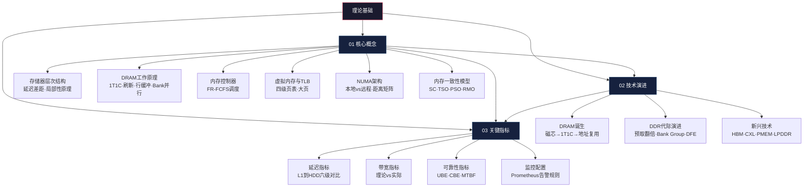

# 理论基础：从电容到程序的完整数据通路

> 理论不是空中楼阁——它是你日后诊断性能瓶颈、做出架构选型、编写正确并发代码的根基。

内存系统是现代计算机中最"隐藏"却最"致命"的子系统。CPU算力每年增长约25%，而内存带宽每两年才翻一倍——这个被称为"内存墙"（Memory Wall）的鸿沟，意味着绝大多数程序的性能瓶颈不在计算，而在数据搬运。要突破这面墙，你需要从物理层理解内存的工作原理，从架构层理解数据如何在层级之间流动，从编程层理解硬件如何影响你的代码行为。

本节三篇文章，分别从**硬件原理**、**技术演进**和**性能度量**三个维度，构建内存系统的完整理论框架。

---

## 三篇文章的知识地图

三篇文章之间存在明确的依赖关系：

- **01 核心概念**是地基，覆盖从存储器层次到内存一致性的完整知识链路
- **02 技术演进**建立在核心概念之上，解释"为什么DDR5要拆成双通道"、"为什么需要Bank Group"
- **03 关键指标**将前两篇的理论知识转化为可量化、可监控的性能指标

---

## 01 核心概念：内存系统的全景视图

这篇文章是整个理论基础的主干，覆盖六大核心主题。读完后，你应该能回答以下问题：

### 1.1 存储器层次结构

**核心命题**：为什么不能用一种存储技术满足所有需求？

答案藏在物理定律中——SRAM用6个晶体管存储1位数据，速度快（~1ns）但面积大、成本高（~$10,000/GB）。DRAM用1个晶体管+1个电容存储1位，密度高但速度慢（~60ns）。没有任何单一技术能同时做到快、大、便宜。层次结构是物理约束下的最优解。

文章会详细讲解：
- 从寄存器到HDD的八级层次结构，每级的延迟、容量、带宽和成本
- 层级之间的延迟倍数关系（寄存器→L1是4倍，L3→主存是4-6倍，主存→SSD是100-1000倍）
- 时间局部性和空间局部性的量化分析——为什么行优先遍历比列优先快10-50倍
- 预取机制：硬件预取器如何检测访问模式，软件预取（`__builtin_prefetch`）如何处理复杂场景

**实用价值**：理解局部性原理后，你能解释为什么同样的算法在不同数据布局下性能差异巨大，能在编码时自觉选择对缓存友好的数据结构。

### 1.2 DRAM工作原理

**核心命题**：DRAM为什么需要刷新？行缓冲如何影响延迟？

DRAM的核心是1T1C存储单元——1个晶体管控制读写，1个电容存储电荷。电容会泄漏电荷（每64ms约50%），因此必须定期刷新。刷新期间Bank不可用，约造成10-15%的带宽损失。

文章深入讲解：
- **三种访问模式的延迟差异**：Row Hit仅需CL（~14ns），Row Miss需要PRE+ACT+CL（~42ns），差距达3倍
- **Bank级并行**：16个Bank独立操作，有效带宽可接近理论峰值的8-12倍
- **Bank Group架构**：DDR4引入4个Bank Group减少行缓冲冲突，DDR5扩展到8个
- **刷新开销计算**：每个Bank有16384行，每64ms刷新一次，tRFC~7.8μs，刷新占比约12%

**实用价值**：理解行缓冲机制后，你能解释为什么某些内存访问模式比其他模式快3倍——这对数据库引擎设计、高性能计算优化至关重要。

### 1.3 内存控制器与调度

**核心命题**：内存控制器如何智能调度请求以最大化带宽？

现代CPU将内存控制器集成在芯片内部，它维护每个Bank的行缓冲状态，使用FR-FCFS（First-Ready, First-Come-First-Served）算法调度请求：优先服务行命中请求（Ready），相同就绪状态下按到达顺序服务（FCFS）。

文章讲解：
- 内存控制器的五大职责：Bank状态维护、请求调度、刷新管理、ECC处理、电源管理
- FR-FCFS调度策略的优先级规则和实际效果
- 调度器如何利用Bank级并行隐藏行缓冲冲突的延迟

**实用价值**：理解调度算法后，你能判断特定访问模式是否会给调度器造成困难，从而在软件层面优化访问模式。

### 1.4 虚拟内存与TLB

**核心命题**：虚拟地址到物理地址的转换代价有多大？如何减少？

x86-64使用四级页表（PGD→PUD→PMD→PTE），每次TLB未命中需要4次内存访问（每次~100ns），总计~400ns。即使1%的TLB未命中率，每秒100万次内存访问也会累积400ms延迟。

文章讲解：
- 四级页表的结构和地址拆分（9+9+9+9+12位）
- TLB的分层设计：L1 dTLB（64-128条目，1周期）、L2 sTLB（512-2048条目，5-10周期）
- 大页（HugePages）：2MB大页将TLB覆盖范围扩大512倍，1GB大页扩大262144倍
- 透明大页（THP）的利弊：自动管理方便但可能造成延迟抖动

**实用价值**：大页配置是数据库、JVM大堆、科学计算场景中最简单有效的性能优化之一，配置正确可减少90%以上的TLB miss。

### 1.5 NUMA架构

**核心命题**：为什么多路服务器上"就近访问"如此重要？

NUMA（Non-Uniform Memory Access）架构下，每个CPU有自己"本地"内存，访问远端内存延迟可能翻倍（10=本地，21=一跳，31=两跳）。

文章讲解：
- NUMA拓扑模式：SNC（子NUMA集群）、SMP、ccNUMA
- 四种内存分配策略：DEFAULT、BIND、INTERLEAVE、PREFERRED
- NUMA距离矩阵的解读方法
- `numactl`工具的配置方法和生产实践

**实用价值**：NUMA配置不当可导致数据库延迟增加40%以上。正确的NUMA绑定是数据库调优的第一步。

### 1.6 内存一致性模型

**核心命题**：为什么在x86上正确的并发代码可能在ARM上崩溃？

不同CPU架构对内存操作的重排规则不同——x86使用TSO（Total Store Order），只允许Store-Load重排；ARM使用更松散的RMO，几乎允许所有重排。

文章讲解：
- 四种一致性模型：SC（顺序一致性）→ TSO（全存储排序）→ PSO（部分存储排序）→ RMO（松散内存排序）
- Memory Barrier/Fence的使用时机和实现原理
- C++11六种内存序（memory_order_relaxed到seq_cst）的选择策略
- Store Buffer和Load Buffer如何导致重排

**实用价值**：理解内存模型是编写正确无锁代码的前提。在TSO架构（x86）上测试通过的并发程序，可能在ARM架构上出现微妙的竞态条件。

---

## 02 技术演进：从磁芯到硅的工程史诗

这篇文章讲述内存技术从1950年代到2020年代的发展历程。理解演进不是为了考古，而是为了理解当前每一项技术特性的"为什么"。

### 演进主线

文章覆盖三条技术演进主线：

**主线一：从异步到同步再到双沿传输**

磁芯存储器 → SRAM/DRAM → FPM/EDO(异步) → SDR SDRAM(同步) → DDR(双沿)
     ↑                                                       ↑
  1950s                                                  2000年
  μs级延迟                                              ns级延迟

每个转折点都源于上一代技术的核心瓶颈：
- FPM/EDO的异步设计限制了最高频率（~66MHz），SDRAM引入同步时钟突破瓶颈
- SDR SDRAM单沿传输限制了带宽，DDR双沿传输将带宽翻倍

**主线二：预取翻倍策略**

DDR系列通过不断增加预取宽度来提升带宽——DDR(2n)→DDR2(4n)→DDR3(8n)→DDR5(16n)。预取的本质是"用面积换速度"：在DRAM内部一个慢时钟周期内并行读出N个bit，通过N个数据引脚并行输出。DDR4是个特例——它选择不增加预取宽度（仍为8n），而是通过Bank Group提升并行度。

**主线三：功耗持续降低**

从DDR的2.5V到DDR5的1.1V，每一代电压降低约15-20%。LPDDR系列更激进——LPDDR4X将I/O电压降到0.6V，LPDDR5引入DVFS动态调压调频。

### 关键技术节点

文章深入讲解以下关键节点：

| 年代 | 技术 | 核心创新 | 解决的问题 |
|------|------|----------|------------|
| 1966 | DRAM发明 | 1T-1C结构 | 替代6T-SRAM降低成本 |
| 1973 | 地址复用 | RAS/CAS分时复用 | 芯片引脚数减半 |
| 1993 | SDRAM | 同步时钟+突发传输 | 异步设计的频率极限 |
| 2000 | DDR | 双沿采样 | 带宽翻倍 |
| 2003 | DDR2 | ODT+DLL+4n预取 | 高频信号完整性 |
| 2014 | DDR4 | Bank Group | 行缓冲冲突降低 |
| 2020 | DDR5 | 双子通道+片上ECC+DFE | 访问粒度+可靠性 |
| 2022 | HBM3 | 3D堆叠+1024位宽 | AI/HPC的带宽饥渴 |

### 新兴技术前沿

文章还覆盖了面向未来的新兴内存技术：

- **HBM（High Bandwidth Memory）**：通过3D堆叠和TSV互连实现1024位宽，单stack带宽达819GB/s，是DDR5的16倍。主要用于AI加速器（NVIDIA A100/H100）和高端GPU。
- **CXL.mem**：Compute Express Link标准的内存协议，支持内存池化和共享，打破"内存绑定CPU"的传统架构。
- **PMEM（持久化内存）**：Intel 3D XPoint技术（虽已停产），实现了字节寻址+非易失性的组合，改变了"内存=易失，存储=持久"的传统二分法。

**实用价值**：理解技术演进后，你能判断DDR5是否值得升级（取决于场景）、HBM是否必要（取决于带宽需求）、CXL是否适合你的架构（取决于内存池化需求）。

---

## 03 关键指标：将理论转化为可度量的性能

这篇文章将前两篇的理论知识转化为具体的性能指标和监控方法。

### 四大指标维度

**延迟指标**：从L1 Cache（~1ns）到HDD（~5-10ms），六个层级的延迟差距达到百万倍级别。文章给出了每个层级的典型延迟值、相对倍数关系，以及使用Intel MLC工具测量实际延迟的方法。

**带宽指标**：DDR4-3200双通道理论峰值51.2GB/s，DDR5-6400双通道102.4GB/s，HBM3高达819GB/s。文章解释了理论带宽的计算公式（MT/s × 位宽 × 通道数 / 8），以及实际带宽为何通常只有理论值的60-80%。

**并发与QPS指标**：内存操作的QPS（每秒操作数）取决于带宽和单次操作大小。文章给出了MQPS、IOPS的计算公式和优化方向。

**可靠性指标**：UBE（不可纠正位错误率）应低于10^-15 per bit-hour，CBE（可纠正位错误率）需要监控趋势。文章给出了ECC错误的Prometheus告警规则配置。

### 监控配置

文章提供了一套完整的Prometheus监控配置，包括：
- 内存延迟告警（超过150ns触发warning）
- 带宽告警（低于20GB/s触发warning）
- ECC错误告警（1小时内超过10次触发critical）

**实用价值**：这些指标和监控配置直接可用于生产环境。当你的数据库出现延迟抖动时，第一步就是检查内存延迟和带宽指标。

---

## 阅读指南

### 按角色选择阅读深度

| 角色 | 推荐路径 | 重点关注 | 预计时间 |
|------|----------|----------|----------|
| **应用开发**（Go/Python/Java） | 01核心概念 §1.1-1.2 → 03关键指标 | 局部性原理、层次延迟差距 | 1-2h |
| **后端/中间件开发** | 01全部 → 03关键指标 | NUMA架构、内存一致性、带宽计算 | 3-4h |
| **DBA/运维** | 01 §1.4-1.5 → 03关键指标 | 虚拟内存、NUMA配置、监控告警 | 2-3h |
| **系统工程师/内核开发** | 全部按序 | DRAM物理、控制器调度、一致性模型 | 6-8h |
| **面试准备** | 01 §1.1-1.3 → 03 §1-2 | 层次结构、DRAM原理、带宽计算 | 1-2h |

### 前置知识

开始学习前，确认你具备以下基础：

必须掌握：
  · 计算机组成基础 — 了解CPU、缓存、总线的基本概念
  · Linux命令行 — 能使用free、top、cat /proc/* 等基础命令
  · 至少一门编程语言 — C/Go/Python任选，能读懂代码示例

建议了解（不强制）：
  · 第01章 缓存层次与一致性基础 — 本节是其自然延伸
  · 数字电路基础 — 电容、晶体管概念有助于理解DRAM原理
  · 并发编程基础 — 理解锁、原子操作有助于理解内存模型

### 与其他章节的关系

第01章 缓存层次 ──→ 第02章 内存系统 ──→ 第03章 IO系统
    (CPU视角)         (存储视角)         (持久化视角)
                          │
                          ↓
                   第05章 内存管理
                   (Linux内核视角)

本节是第01章（缓存层次）的自然延伸——第01章从CPU视角讲解L1/L2/L3缓存，本节从存储视角讲解DRAM、内存控制器和NUMA。本节也是第05章（内存管理）的前置知识——理解了硬件层面的内存系统后，你才能真正理解Linux内核的页表、伙伴系统和Slab分配器。

---

## 本节小结

学完理论基础三篇文章，你应该建立起以下核心认知：

1. **物理约束决定架构**：SRAM和DRAM的物理差异（6T vs 1T1C）决定了层次结构的必然性，没有任何工程手段能绕过这个约束
2. **访问模式决定性能**：Row Hit比Row Miss快3倍，本地访问比远程快2倍，顺序访问比随机快10-50倍——性能的差异主要来自数据在哪里、怎么被访问
3. **刷新是不可避免的代价**：DRAM的刷新机制造成约10-15%的带宽损失和尾延迟恶化，这是DRAM技术的固有成本
4. **一致性是正确性的保障**：不同CPU架构的内存模型差异巨大，在TSO（x86）上正确的代码可能在RMO（ARM）上崩溃
5. **量化是优化的起点**：不要凭直觉判断瓶颈，用延迟、带宽、命中率等指标定位问题，然后针对性优化

> **下一步**：读完理论基础后，建议继续阅读"核心技巧"部分，那里将理论知识转化为可执行的优化手段和诊断方法。
