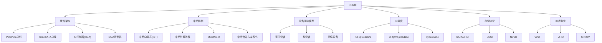
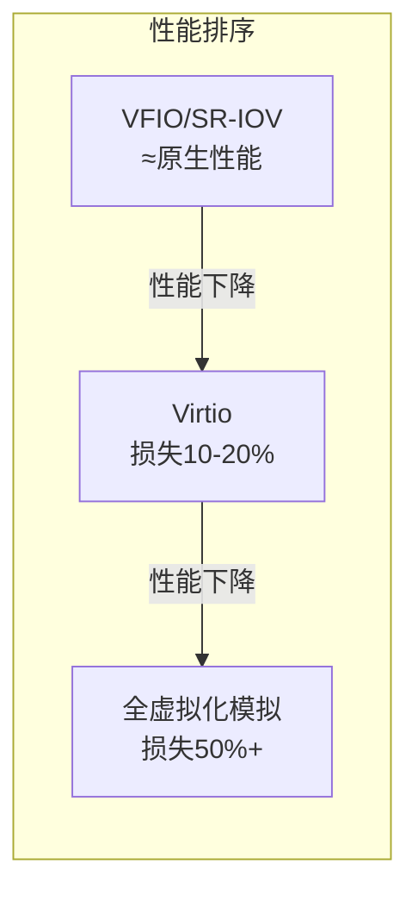

# 第03章：IO系统 —— 章节概览

## 本章导读

如果你曾经疑惑"为什么服务器已经配了SSD，数据库查询还是很慢"，或者"为什么同样的硬件配置，有的系统能扛住百万QPS，有的却在几千QPS时就开始超时"——答案往往藏在IO系统里。

IO（Input/Output）系统是计算机中最复杂、最容易被忽视、也最常成为性能瓶颈的子系统。一个直观的数字对比可以说明问题：CPU一次运算耗时约0.3纳秒，而一次HDD磁盘寻道需要约10毫秒，两者相差**3300万倍**。即使是最先进的NVMe SSD，其访问延迟（约100微秒）仍然比CPU慢30万倍。在如此巨大的速度鸿沟面前，如何让CPU、内存和外部设备高效协作而不互相等待，正是IO系统设计的核心命题。

本章将从硬件总线到软件栈、从中断机制到虚拟化技术，完整剖析IO系统的全貌。无论你是想理解Linux内核如何管理磁盘IO，还是想优化数据库的读写性能，或者想搞清楚虚拟化环境中IO设备如何共享——这一章都将为你提供扎实的理论基础和实操指导。

## 学习目标

完成本章学习后，你将能够：

1. **理解IO硬件架构**：掌握PCIe总线层次结构、IO控制器的工作原理、DMA控制器的数据传输机制，能看懂`lspci`输出并解释每个字段的含义
2. **深入中断机制**：理解中断向量表（IDT）、中断处理的上半部/下半部模型、MSI/MSI-X中断的工作原理，能解释`/proc/interrupts`中的中断分布
3. **掌握DMA原理**：理解DMA传输过程、Scatter-Gather DMA的描述符链表、IOVA地址映射，能解释DMA一致性问题的成因和解决方案
4. **理解设备驱动模型**：掌握Linux设备模型的kobject/kset层次、字符/块/网络设备的架构差异、设备文件与udev的联动机制
5. **掌握IO调度策略**：理解CFQ、Deadline、BFQ、mq-deadline、kyber等调度器的设计思想，能根据工作负载选择最优调度器
6. **了解存储协议**：对比SATA（AHCI）、NVMe、SCSI的架构差异，理解NVMe如何通过减少软件栈开销实现百万级IOPS
7. **掌握IO虚拟化**：理解Virtio半虚拟化、VFIO设备直通、SR-IOV硬件虚拟化的工作原理与性能差异

## 前置知识

本章假设你已经具备以下基础（对应本书前两章）：

- **第01章：CPU架构与执行模型** —— 理解CPU流水线、缓存层次、上下文切换等概念，有助于理解IO中断处理和DMA与CPU的协作关系
- **第02章：内存系统** —— 理解虚拟地址到物理地址的映射、缓存一致性协议、NUMA架构，有助于理解IOVA映射和DMA一致性问题

如果你对Linux内核有一定了解（如阅读过《Linux内核设计与实现》），学习本章会更加顺畅。但即使没有内核经验，本章的硬件架构和原理部分同样适用于系统级编程和性能优化场景。

## 知识地图：本章涵盖的核心主题

## 章节结构与内容预览

本章采用**从硬件到软件、从原理到实践**的递进式结构，共分为以下几个部分：

---

### 理论基础：IO系统的硬件与软件全貌

#### 3.1 IO系统概述

首先从宏观视角建立IO系统的整体认知。IO系统的本质是在CPU（纳秒级操作）与外部设备（微秒到毫秒级操作）之间架起一座高效的桥梁。IO操作有三种基本模式：

- **轮询模式**：CPU主动检查设备状态，适合超低延迟场景（如SPDK的NVMe轮询模式）
- **中断模式**：设备就绪后主动通知CPU，适合大多数通用场景
- **DMA模式**：CPU设置好参数后由DMA控制器独立传输，现代高速设备的标准模式

这三种模式的性能特征差异显著。以NVMe SSD为例，在高IOPS负载下轮询模式的延迟可低于中断模式（因为中断本身的处理开销——上下文切换、缓存污染——可能超过设备延迟），但在中低负载下中断模式的CPU利用率更高。

IO系统的软件栈是一个从用户空间到硬件的多层抽象。以一次`read()`系统调用为例，数据需要经过：

应用层 → 系统调用 → VFS → 文件系统(ext4/xfs) → 通用块层 → IO调度层 → 块设备多队列层(blk-mq) → 设备驱动 → IO控制器 → 存储介质

每一层都引入额外开销。以NVMe SSD上的4KB随机读为例，硬件延迟约100微秒，但经过完整软件栈后应用感知到的延迟可能达到200-300微秒，软件栈开销占了一半以上。这正是SPDK、io_uring等现代IO技术致力于减少软件栈开销的原因。

#### 3.2 IO硬件架构

本节深入硬件层面，讲解IO设备如何通过总线连接到CPU和内存。

**总线体系**：现代计算机采用层次化总线结构。CPU集成内存控制器和PCIe Root Complex，通过PCIe点对点链路连接高速设备（GPU、NVMe SSD、网卡），通过PCH（Platform Controller Hub）连接低速设备（SATA、USB）。PCIe从1.0到6.0的演进将单通道带宽从250MB/s提升到7.56GB/s，协议栈包括事务层、数据链路层和物理层三层。

**IO控制器**：作为CPU与设备之间的桥梁，IO控制器将CPU命令转换为设备操作。典型例子包括AHCI（SATA HBA）、NVMe控制器、SCSI HBA。CPU通过MMIO（Memory-Mapped IO）方式访问控制器寄存器。

**DMA控制器**：DMA是现代IO系统的核心机制。CPU只需设置好DMA参数（源地址、目标地址、传输长度），DMA控制器就能独立完成设备与内存之间的数据传输。Scatter-Gather DMA通过描述符链表解决了物理内存不连续的问题。IOMMU（IO Memory Management Unit）则为设备提供IOVA地址翻译和设备隔离能力。

DMA一致性是实践中常见的坑：CPU有缓存，DMA直接访问内存，如果不做缓存同步，CPU和设备看到的数据可能不一致。解决方案包括一致性DMA映射（uncacheable内存）和流式DMA映射（手动缓存刷新）。

#### 3.3 中断机制

中断是CPU与设备异步通信的核心机制。本节涵盖：

- **中断向量表（IDT）**：x86架构的256个中断入口，Linux将0-21分配给CPU异常，32-47分配给硬件中断
- **中断处理的上半部/下半部模型**：上半部在硬中断上下文执行最小工作并ACK中断，下半部（softirq/tasklet/workqueue）在进程上下文执行耗时处理——这种分层设计确保了中断响应的及时性
- **MSI/MSI-X中断**：PCIe设备使用内存写事务传递中断信号，MSI-X支持最多2048个独立中断向量，每个可以绑定到不同CPU——这是NVMe多队列架构的基础
- **中断合并与中断亲和性**：中断合并通过批量处理减少中断频率（提高吞吐但增加延迟），中断亲和性通过`/proc/irq/<n>/smp_affinity`控制中断绑定的CPU核

#### 3.4 设备驱动模型

Linux通过统一的设备模型管理所有IO设备。本节讲解：

- **kobject/kset层次**：Linux设备模型的基础设施，所有设备在sysfs中形成树形结构
- **字符设备**：字节流访问，通过`cdev`注册，适用于终端、串口、键盘等
- **块设备**：块级访问，支持随机寻址，经过通用块层和IO调度器，适用于硬盘、SSD
- **网络设备**：数据包收发，无设备文件，通过socket接口访问，使用sk_buff机制
- **设备文件与udev**：`/dev`下的设备文件如何与内核驱动关联，udev规则如何实现设备命名和事件处理

#### 3.5 IO调度

IO调度器是块设备性能优化的关键层。本节对比分析：

| 调度器 | 设计思想 | 适用场景 | 关键特性 |
|--------|---------|---------|---------|
| **CFQ** | 完全公平队列，为每个进程维护独立队列 | HDD桌面环境 | 按进程公平分配IO带宽 |
| **Deadline** | 为每个请求设置截止时间 | 数据库+HDD | 防止请求饿死 |
| **BFQ** | 基于预算的公平调度 | 桌面/交互式系统 | 低延迟、高响应性 |
| **mq-deadline** | 多队列版Deadline | 通用SSD | 适配blk-mq框架 |
| **kyber** | 令牌桶限流 | 高性能NVMe | 低开销、高吞吐 |
| **none** | 无调度，直接下发 | NVMe | 硬件自身已优化 |

选择建议：NVMe SSD使用`none`（硬件内部已有调度），SATA SSD使用`mq-deadline`，HDD使用`bfq`或`mq-deadline`。

#### 3.6 存储协议对比

存储协议决定了IO设备与主机之间的通信方式。本节深入对比：

- **SATA/AHCI**：单命令队列、队列深度32，适合消费级HDD和SSD
- **SCSI**：企业级协议，支持多路径、双端口，适合服务器存储阵列
- **NVMe**：专为闪存设计，支持65535个队列、每个队列65536个命令，通过减少软件栈开销实现百万级IOPS

NVMe的性能优势来源：
1. **多队列架构**：每个CPU核心有独立的提交/完成队列，消除锁竞争
2. **精简命令集**：相比SCSI的上百条命令，NVMe只有13条基本命令
3. **低中断开销**：MSI-X支持每队列独立中断，绑定到对应CPU核心
4. **直通路径**：绕过SCSI中间层，减少协议转换开销

#### 3.7 IO虚拟化

在云计算环境中，多个虚拟机需要共享物理IO设备。本节讲解三种主流方案：

- **Virtio半虚拟化**：虚拟机通过标准化的virtio接口与宿主机通信，VMM将virtio请求转换为真实设备操作。性能损失约10-20%，但兼容性最好
- **VFIO设备直通**：将物理设备直接分配给虚拟机，通过IOMMU隔离。性能接近原生，但设备只能分配给一个虚拟机
- **SR-IOV硬件虚拟化**：物理设备在硬件层面虚拟出多个VF（Virtual Function），每个VF可以独立分配给不同虚拟机。兼顾性能和多租户

---

### 核心技巧：IO优化与调优实战

本部分将理论转化为可操作的实践技能：

**技巧一：基本操作** —— 掌握IO性能测试工具的使用方法。包括`fio`（灵活的IO测试器）的基本用法，如何设计测试参数模拟真实工作负载，如何解读`iostat`、`iotop`等系统监控工具的输出。还会讲解`blktrace`的使用——它能追踪IO请求从应用层到硬件的完整路径，是定位IO瓶颈的利器。

**技巧二：性能优化** —— 从多个维度提升IO性能：
- **队列深度调优**：不同设备的最优队列深度不同，NVMe在QD32时IOPS接近峰值
- **IO调度器选择**：根据设备类型和工作负载选择合适的调度器
- **NUMA感知**：确保IO设备的中断和DMA缓冲区在正确的NUMA节点上
- **大页(HugePages)**：减少TLB miss对IO密集型应用的影响
- **异步IO框架**：从传统的同步阻塞IO到io_uring的异步提交/完成模型

---

### 实战案例：真实场景深度分析

本部分通过三个真实场景展示IO系统的实际应用：

**案例一：数据库存储优化** —— 分析MySQL/PostgreSQL在不同存储介质上的IO特征，展示如何通过调整innodb_flush_method、fsync策略、redo log放置等参数优化数据库IO性能。包含具体的benchmark对比数据。

**案例二：高并发Web服务器** —— 分析Nginx在静态文件服务场景下的IO瓶颈，展示sendfile、splice等零拷贝技术如何减少数据拷贝次数，以及如何通过调整文件系统预读策略提升吞吐量。

**案例三：分布式存储系统** —— 分析Ceph、GlusterFS等分布式存储的IO路径，展示客户端缓存、条带化写入、EC编码等技术如何在可靠性和性能之间取得平衡。

---

### 常见误区：IO系统的认知陷阱

本部分纠正IO领域最常见的错误认知：

- **误区一："SSD没有寻道时间，所以不需要IO调度"** —— 实际上SSD内部有垃圾回收、磨损均衡等操作，不当的IO模式会严重影响SSD性能和寿命
- **误区二："异步IO一定比同步IO快"** —— 在低并发场景下，同步IO的简单性和低开销可能更优
- **误区三："文件系统缓存能解决所有IO问题"** —— Page Cache对读操作有效，但写操作仍然需要刷盘，且缓存命中率取决于工作负载的局部性

---

### 练习方法：动手实践指南

本部分提供循序渐进的实践练习：

1. **基础练习**：使用`fio`测试不同IO模式下的SSD性能，理解IOPS、吞吐量、延迟之间的关系
2. **进阶练习**：使用`blktrace`追踪一次IO请求的完整内核路径，分析各层耗时
3. **高级练习**：使用`perf`分析IO密集型应用的CPU开销，定位中断处理和上下文切换的热点
4. **综合练习**：搭建简单的存储性能测试环境，对比不同IO调度器、队列深度、文件系统配置下的性能差异

---

### 本章小结：核心要点回顾

本章的核心要点可以用一句话概括：**IO系统的本质是在速度差异悬殊的设备之间建立高效的协作机制**。围绕这一命题，我们学习了：

- **硬件层面**：PCIe总线提供高带宽点对点连接，DMA控制器解放CPU使其不参与数据搬运，IOMMU提供地址翻译和安全隔离
- **中断层面**：MSI-X支持多队列独立中断，中断合并和亲和性优化减少CPU开销
- **驱动层面**：字符/块/网络三类设备在内核中有不同的处理路径和数据结构
- **调度层面**：不同IO调度器适用于不同设备和工作负载，选择正确的调度器可以显著提升性能
- **协议层面**：NVMe通过多队列、精简命令集、直通路径等设计实现了对SATA/SCSI的性能碾压
- **虚拟化层面**：Virtio、VFIO、SR-IOV提供不同粒度的IO虚拟化方案

## 推荐阅读

本章内容基于Linux内核源码和硬件规范撰写，以下是推荐的参考资料：

- **《Linux内核设计与实现》（Robert Love）** —— 设备驱动和中断处理的经典入门
- **《深入理解Linux内核》（Daniel P. Bovet）** —— IO子系统的内核实现细节
- **《Linux设备驱动程序》（LDD3）** —— 设备驱动开发的权威参考
- **NVMe规范（nvmexpress.org）** —— NVMe协议的官方技术文档
- **PCI-SIG（pcisig.com）** —— PCIe规范的官方发布渠道
- **SPDK文档（spdk.io）** —— 高性能存储开发工具包

## 章节结构总览

| 序号 | 文件 | 内容 | 预计阅读时间 |
|------|------|------|-------------|
| 01 | 理论基础/什么是IO系统 | IO定义、硬件基础、IO模式、软件栈、性能指标、设备分类 | 45-60分钟 |
| 02 | 理论基础/技术演进 | IO技术发展史、调度器演进、硬件接口演进、新兴趋势 | 15-20分钟 |
| 03 | 核心技巧/基本操作 | fio使用、iostat/iotop分析、blktrace追踪 | 30-40分钟 |
| 04 | 核心技巧/性能优化 | 队列深度调优、NUMA感知、异步IO框架、零拷贝技术 | 30-40分钟 |
| 05 | 实战案例 | 数据库存储优化、高并发Web服务、分布式存储系统 | 30-45分钟 |
| 06 | 常见误区 | IO调度误解、同步vs异步、缓存局限性 | 15-20分钟 |
| 07 | 练习方法 | 基础/进阶/高级/综合四级实践练习 | 60-120分钟 |
| 08 | 本章小结 | 核心要点回顾与知识体系梳理 | 10-15分钟 |

**预计总学习时间：4-6小时**（不含动手练习时间）

建议按照理论基础→核心技巧→实战案例的顺序学习，先建立完整的知识框架，再通过实践加深理解。常见误区和练习方法可以在学习过程中穿插使用。
