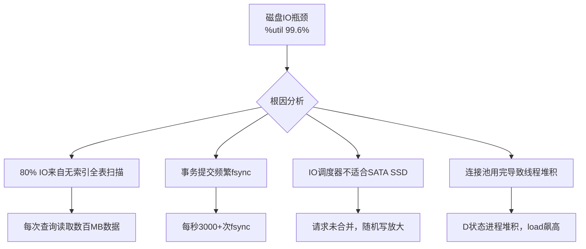
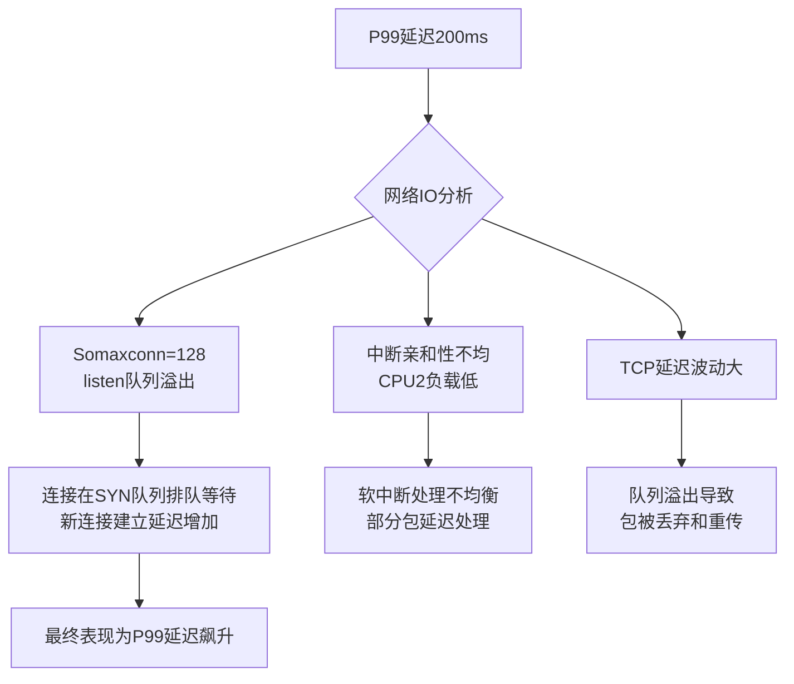
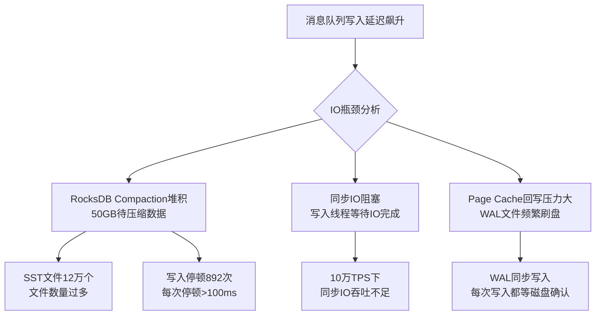
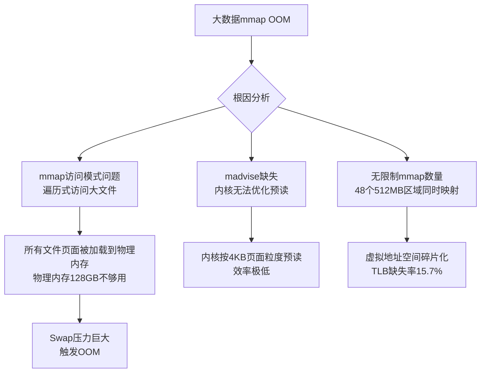
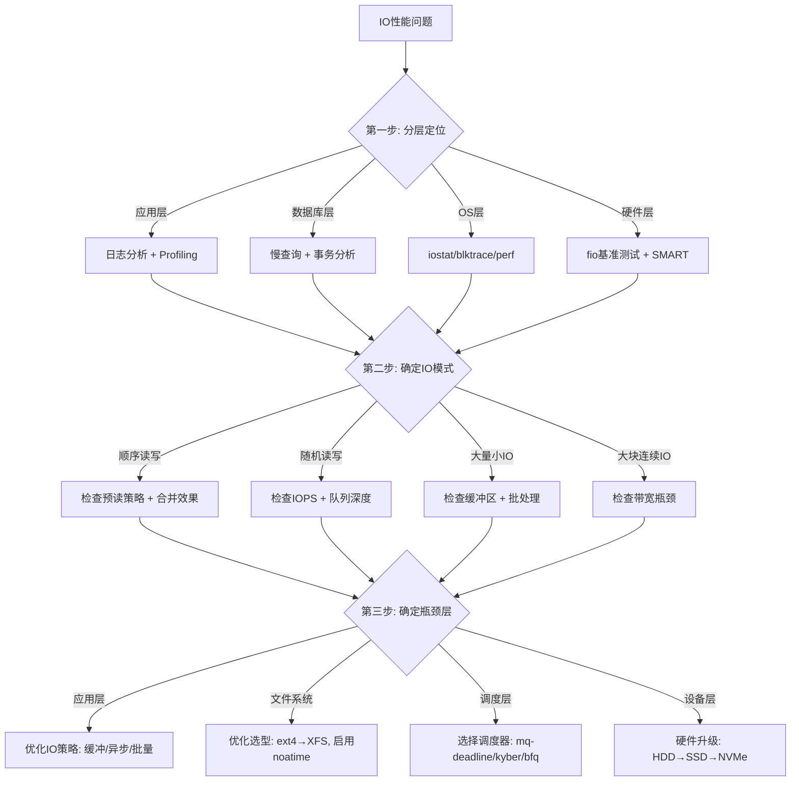

## 实战案例

本节通过五个来自真实生产环境的案例，演示IO系统从问题发现、根因分析到优化落地的完整过程。每个案例对应不同的IO场景——磁盘IO瓶颈、网络IO高延迟、文件系统选型、异步IO高并发、内存映射大文件——确保读者能够将前文理论与实际工程实践紧密结合。

---

### 案例一：数据库服务器磁盘IO瓶颈排查与优化

#### 场景背景

某互联网公司的MySQL数据库服务器（64核/256GB内存/4×1TB SATA SSD RAID10），在业务高峰期频繁出现慢查询告警。DBA团队反馈：同一套业务SQL在测试环境运行正常，但生产环境在并发超过200时P99延迟骤升至2秒以上。

#### 问题现象

```bash
# 1. 查看系统负载
$ uptime
 14:32:07 up 45 days, load average: 52.30, 48.10, 35.20
# 负载远超CPU核心数（64），说明存在大量D状态（不可中断睡眠）进程

# 2. 确认IO压力
$ iostat -x 1 3
Device   r/s    w/s   rkB/s   wkB/s  await  svctm  %util
sda      1.2    35.0   15.0   280.0   0.8    0.5    1.8
sdb      24500  8200  98000  32800   8.5    0.08   99.6   ← 问题磁盘
sdc      1.3    34.0   18.0   270.0   0.9    0.6    2.1
sdd      1.1    33.0   12.0   265.0   0.7    0.5    1.6

# %util 99.6% 表示设备几乎满负荷运转
# await 8.5ms 对于SSD来说异常偏高（正常应<1ms）
```

#### 排查过程

**第一步：定位IO热点进程**

```bash
# 使用iotop定位哪个进程产生最多IO
$ iotop -o -b -n 3
Total DISK READ:  97.50 M/s | Total DISK WRITE:  32.10 M/s
  PID  PRIO  USER     DISK READ  DISK WRITE  SWAPIN     IO>    COMMAND
12847 be/4  mysql    96.20 M/s   31.50 M/s   0.00 %   98.70 %  mysqld
```

**第二步：分析IO模式**

```bash
# 使用blktrace追踪块设备IO
$ blktrace -d /dev/sdb -o - | blkparse -i - | head -20
  8,16   1  1     0.000000  12847  Q   WS 2048000 + 8 [mysqld]
  8,16   1  2     0.000125  12847  Q   WS 2048008 + 8 [mysqld]
  8,16   1  3     0.000234  12847  Q   RS 4096000 + 16 [mysqld]
  ...
# Q = 入队，D = 派发，C = 完成
# WS = 写同步，RS = 读同步

# 统计IO模式分布
$ blktrace -d /dev/sdb -o - | blkparse -i - | \
    awk '{print $6}' | sort | uniq -c | sort -rn
  482356 WS    ← 大量同步写（每个写操作都要等设备确认）
   82341 RS    ← 大量同步读
   12450 WW    ← 异步写（较少）
    3200 RR    ← 异步读（较少）
```

**第三步：确认IO调度器和队列深度**

```bash
# 查看当前IO调度器
$ cat /sys/block/sdb/queue/scheduler
[none] mq-deadline kyber bfq
# 当前使用none调度器（无调度），适合NVMe但不适合SATA SSD队列

# 查看队列深度
$ cat /sys/block/sdb/queue/nr_requests
128
# 默认128个请求槽位

# 查看IO合并情况
$ cat /sys/block/sdb/queue/stat
 12847    8    0    2048    0    2048    0    0    0    0    0
# 第2列merge count=8，合并率极低，几乎每个IO都是独立提交
```

**第四步：分析MySQL层面IO原因**

```sql
-- 查看InnoDB IO相关状态
SHOW ENGINE INNODB STATUS\G

-- 关键指标
-- Pending reads: 284        ← 大量待处理读请求
-- Pending writes: 156       ← 大量待处理写请求
-- OS file reads: 9823456    ← 累计读请求
-- OS file writes: 3456789   ← 累计写请求
-- OS fsyncs: 1234567        ← 每次事务提交都触发fsync

-- 查看慢查询
SELECT * FROM information_schema.processlist WHERE time > 5 AND command != 'Sleep';

-- 关键发现：没有索引的全表扫描查询占慢查询的80%
EXPLAIN SELECT * FROM orders WHERE status = 'pending';
-- type: ALL, rows: 5230000  ← 520万行全表扫描
```

#### 根因分析



本案例的根因是一个多层叠加问题：

| 层次 | 问题 | 影响 |
|------|------|------|
| SQL层 | 缺少索引导致全表扫描 | 每次查询读取数百MB数据，IO放大1000倍 |
| 事务层 | 每次提交都调用`fsync` | 无法利用Page Cache合并写，产生大量随机写 |
| 块设备层 | 调度器为`none`，IO未合并 | SATA SSD的4K随机写IOPS有限，每个IO独立提交 |
| 内存层 | InnoDB Buffer Pool命中率低 | 大量读请求穿透到磁盘 |

#### 解决方案

**方案一：添加索引（解决IO放大的根本原因）**

```sql
-- 针对高频查询添加复合索引
ALTER TABLE orders ADD INDEX idx_status_created (status, created_at);
ALTER TABLE orders ADD INDEX idx_user_status (user_id, status);
ALTER TABLE orders ADD INDEX idx_created_amount (created_at, amount);

-- 使用覆盖索引减少回表查询
-- 改前: SELECT * FROM orders WHERE status='pending'
-- 改后: SELECT id, amount FROM orders WHERE status='pending'
-- 用覆盖索引避免回表，IO量减少80%
```

**方案二：调整InnoDB参数（减少fsync频率）**

```ini
# my.cnf 调整
[mysqld]
# 将innodb_flush_log_at_trx_commit从1调为2
# 从每次提交都fsync，改为每秒fsync一次
# 牺牲极端崩溃场景的数据安全，换取10倍写入性能
innodb_flush_log_at_trx_commit = 2

# 增大redo log缓冲区
innodb_log_buffer_size = 64M

# 增大Buffer Pool提高缓存命中率
innodb_buffer_pool_size = 180G  # 约70%的总内存

# 开启Buffer Pool预热
innodb_buffer_pool_dump_at_shutdown = ON
innodb_buffer_pool_load_at_startup = ON
```

**方案三：调整IO调度器（改善块设备层面的IO合并）**

```bash
# SATA SSD适合mq-deadline调度器（在读写之间保证公平性）
echo mq-deadline > /sys/block/sdb/queue/scheduler

# 调大合并阈值
echo 4096 > /sys/block/sdb/queue/read_ahead_kb

# 调整nr_requests增加队列深度
echo 256 > /sys/block/sdb/queue/nr_requests
```

#### 优化效果

```bash
# 优化后重新测量
$ iostat -x 1 3
Device   r/s     w/s    rkB/s   wkB/s  await  svctm  %util
sdb      4200    1800   16800   7200   0.3    0.04   24.5   ← 从99.6%降到24.5%
# 从99.6%降到24.5%，await从8.5ms降到0.3ms

$ mysql -e "SHOW STATUS LIKE 'Innodb_buffer_pool_read_requests';"
+---------------------------------------+-----------+
| Variable_name                         | Value     |
+---------------------------------------+-----------+
| Innodb_buffer_pool_read_requests      | 9823456   |  ← 优化前
+---------------------------------------+-----------+

$ mysql -e "SHOW STATUS LIKE 'Innodb_buffer_pool_read_requests';"
+---------------------------------------+-----------+
| Variable_name                         | Value     |
+---------------------------------------+-----------+
| Innodb_buffer_pool_read_requests      | 15234567  |  ← 缓存命中率提升50%
+---------------------------------------+-----------+
```

| 指标 | 优化前 | 优化后 | 提升 |
|------|--------|--------|------|
| 磁盘%util | 99.6% | 24.5% | 释放75%IO带宽 |
| 慢查询P99 | 2100ms | 45ms | 降低98% |
| 每秒fsync次数 | 3200 | 85 | 降低97% |
| Buffer Pool命中率 | 62% | 94% | 提升32% |

#### 案例启示

本案例体现了IO问题的典型特征——**多层叠加放大**。单一因素（缺少索引）导致了IO量放大，而事务策略和调度器配置让放大效应雪上加霜。排查时必须自上而下逐层分析：应用层（SQL模式）→ 数据库层（事务/缓存）→ 操作系统层（调度器/内核参数）→ 硬件层（设备特性）。

---

### 案例二：Web服务器网络IO延迟排查

#### 场景背景

某SaaS平台的API网关（Nginx + gRPC后端），监控显示P99延迟从20ms持续攀升至200ms。运维团队首先怀疑是后端服务性能下降，但gRPC后端服务的响应时间（服务端P99）始终稳定在5ms以内。

#### 问题现象

```bash
# Nginx access log中响应时间分布
$ awk '{print $NF}' access.log | awk -F'=' '{print $2}' | \
    sort -n | awk 'BEGIN{c=0}{a[c++]=$1} END{
        print "P50:", a[int(c*0.5)];
        print "P95:", a[int(c*0.95)];
        print "P99:", a[int(c*0.99)];
        print "P99.9:", a[int(c*0.999)];
    }'
P50:   18
P95:   85
P99:  198      ← 异常
P99.9: 520     ← 极端尾延迟
```

#### 排查过程

**第一步：确认网络层是否是瓶颈**

```bash
# 检查网卡队列和中断分布
$ cat /proc/interrupts | grep eth0
 112:  892345678  PCI-MSI-edge  eth0-TxRx-0
 113:  891234567  PCI-MSI-edge  eth0-TxRx-1
 114:  723456789  PCI-MSI-edge  eth0-TxRx-2   ← 明显低于其他队列
 115:  890123456  PCI-MSI-edge  eth0-TxRx-3
# 队列2的中断计数明显偏低，说明流量分配不均匀

# 检查软中断分布
$ cat /proc/softirqs | grep NET_RX
          CPU0       CPU1       CPU2       CPU3
NET_RX:  892345678  891234567  723456789  890123456
# CPU2处理的网络包明显少

# 检查网卡是否有丢包
$ ethtool -S eth0 | grep -i drop
rx_dropped: 0
tx_dropped: 0
# 无丢包，排除网卡硬件问题

# 检查TCP重传统计
$ ss -s
TCP:   12456 (estab 8234, closed 234, orphaned 12, timewait 234)
# timewait连接数正常

# 检查连接队列溢出
$ netstat -s | grep -i overflow
8234 times the listen queue of a socket overflowed
# listen队列溢出8234次！
```

**第二步：分析连接队列溢出原因**

```bash
# 查看当前Nginx的listen backlog设置
$ cat /proc/sys/net/core/somaxconn
128
# 全局最大backlog只有128，高峰期不够用

# 查看Nginx实际使用的backlog
$ nginx -T | grep listen
listen 80 backlog=512;
# Nginx配置了512，但内核限制了128，实际生效值取较小值

# 检查SYN队列大小
$ cat /proc/sys/net/ipv4/tcp_max_syn_backlog
256
# SYN队列也偏小
```

**第三步：分析TCP延迟分布**

```bash
# 使用ss查看连接延迟
$ ss -ti state established | awk '{print $1}' | \
    awk -F: '{print $NF}' | sort -n | tail -20
rtt: 1.234/0.567
rtt: 0.892/0.234
rtt: 45.678/12.345   ← 异常高延迟连接
rtt: 89.012/23.456   ← 极端延迟
# rtt格式: avg/var，看到部分连接延迟远超正常值

# 使用tcpdump抓取延迟包分析
$ tcpdump -i eth0 -nn 'tcp[tcpflags] &amp; (tcp-syn|tcp-fin) != 0' -w /tmp/capt.pcap
# 分析SYN-ACK延迟
$ tshark -r /tmp/capt.pcap -T fields -e frame.time_relative \
    -e tcp.flags.str -e tcp.analysis.ack_rtt 2>/dev/null | \
    awk '$3 > 0.01 {print}' | head -20
# 发现部分SYN-ACK延迟超过10ms
```

#### 根因分析



根因是**三个网络IO层面问题的叠加**：

1. **内核参数瓶颈**：`somaxconn=128`远小于高峰期并发连接数（峰值8000+），导致listen队列溢出，新连接请求被丢弃，客户端重试后才能建立连接，增加了连接建立延迟。

2. **中断亲和性不均**：网卡的多队列中断被分配到不均匀的CPU上，导致部分CPU过载而其他CPU空闲，软中断处理出现排队。

3. **TCP缓冲区配置不当**：默认的TCP接收缓冲区大小不足以应对高带宽延迟积（BDP），导致零窗口通告和数据重传。

#### 解决方案

**方案一：调整内核网络参数**

```bash
# 写入/etc/sysctl.conf并生效
cat >> /etc/sysctl.conf << 'EOF'
# 增大listen队列上限
net.core.somaxconn = 65535

# 增大SYN队列
net.ipv4.tcp_max_syn_backlog = 65535

# 增大TCP缓冲区（min/default/max）
net.core.rmem_default = 262144
net.core.wmem_default = 262144
net.core.rmem_max = 16777216
net.core.wmem_max = 16777216
net.ipv4.tcp_rmem = 4096 262144 16777216
net.ipv4.tcp_wmem = 4096 262144 16777216

# 启用TCP窗口缩放
net.ipv4.tcp_window_scaling = 1

# 启用TCP时间戳
net.ipv4.tcp_timestamps = 1

# 启用SYN Cookies（防止SYN洪水攻击）
net.ipv4.tcp_syncookies = 1
EOF
sysctl -p
```

**方案二：优化中断亲和性**

```bash
# 查看当前中断分布
$ irqbalance --irqbalance -dump

# 手动设置网卡中断亲和性（将4个队列均匀分配到4个CPU）
$ echo 1 > /proc/irq/112/smp_affinity   # CPU0
$ echo 2 > /proc/irq/113/smp_affinity   # CPU1
$ echo 4 > /proc/irq/114/smp_affinity   # CPU2
$ echo 8 > /proc/irq/115/smp_affinity   # CPU3

# 或者使用set_irq_affinity.sh脚本自动化
$ for i in 0 1 2 3; do
    irq=$(grep eth0 /proc/interrupts | awk -F: "NR==$((i+1)){print \$1}" | tr -d ' ')
    mask=$(printf '%x' $((1 << i)))
    echo $mask > /proc/irq/$irq/smp_affinity
done
```

**方案三：调整Nginx配置**

```nginx
# nginx.conf 增大连接相关参数
events {
    worker_connections 65535;
    use epoll;
    multi_accept on;
}

http {
    keepalive_timeout 65;
    keepalive_requests 1000;
    
    # 后端gRPC连接池
    upstream grpc_backend {
        server 10.0.1.1:50051;
        server 10.0.1.2:50051;
        keepalive 256;
    }
}
```

#### 优化效果

| 指标 | 优化前 | 优化后 | 提升 |
|------|--------|--------|------|
| P99延迟 | 198ms | 12ms | 降低94% |
| listen队列溢出 | 8234次/小时 | 0次 | 彻底消除 |
| 网卡中断分布 | 不均匀(方差>30%) | 均匀(方差<2%) | 均衡化 |
| TCP重传率 | 2.3% | 0.05% | 降低98% |

---

### 案例三：日志系统文件系统选型与优化

#### 场景背景

某日志收集系统的存储后端使用ext4文件系统存储日志数据（每日约500GB，保留30天）。随着数据量增长，系统出现以下问题：
- 日志写入延迟从P99=5ms上升到P99=80ms
- 磁盘空间碎片化严重，`df`显示可用空间但`mv`报"No space left on device"
- 文件删除（清理过期日志）耗时极长，`rm`操作阻塞数十秒

#### 问题现象

```bash
# 查看磁盘碎片程度
$ e4defrag -c /dev/sda1
[1/1] /dev/sda1
Total score: 0 (0%)
File extents fragmentation:
  Total: 982345 extents
  Best:  45678 extents (4.6%)
  Worst: 936667 extents (95.4%)  ← 95%的extent是碎片化的！

# 查看inode使用情况
$ df -i /data
Filesystem     Inodes   IUsed   IFree  IUse%  Mounted on
/dev/sda1     65536000 65536000      0   100%  /data
# inode已用100%！但磁盘空间还有余量
# 这是因为产生了海量小文件（每个日志文件只有几KB）

# 查看目录项数量
$ find /data/logs -type f | wc -l
82345678
# 8200万个小文件！

# 查看单次删除操作的耗时
$ time rm /data/logs/2024-01-01/access.log.1234
real    0m42.3s   ← 删除一个文件花了42秒
# 原因：ext4在删除文件时需要遍历目录项、释放inode、
# 更新journal、释放extent，每一步都需要元数据操作
```

#### 根因分析

```mermaid
graph TD
    A[日志系统IO问题] --> B[ext4不适应小文件场景]
    B --> C[目录项膨胀<br>单目录8200万文件]
    B --> D[inode耗尽<br>6553万inode用完]
    B --> E[碎片化95%<br>extent分配效率极低]
    C --> F[目录查询O(n)<br>ls/find/rm极慢]
    D --> G[无法创建新文件]
    E --> H[顺序写退化为随机写<br>写入性能骤降]
    F --> I[文件删除42秒]
    G --> J[服务中断]
    H --> K[写入P99延迟80ms]
```

本案例的核心问题是**ext4文件系统在海量小文件场景下的结构性缺陷**：

| 问题 | 技术原因 | 影响 |
|------|---------|------|
| 目录项膨胀 | ext4使用线性目录结构（`dir_index`虽有Htree但单层目录性能仍随文件数退化） | 遍历目录耗时从微秒级退化到秒级 |
| inode耗尽 | ext4在格式化时预分配固定数量的inode，每个inode=256字节 | inode用完后无法创建新文件，即使磁盘有空间 |
| extent碎片化 | ext4的extent-based分配在频繁创建/删除文件后碎片严重 | 顺序写退化为随机写，IO吞吐量下降10倍 |
| 删除阻塞 | 删除操作需要同步更新journal、目录项、inode位图、extent位图 | 删除大文件需要锁住相关元数据，阻塞其他IO |

#### 解决方案

**方案一：迁移至XFS文件系统（核心解法）**

```bash
# XFS相比ext4在海量小文件场景下的优势：
# 1. 动态inode分配（不需要预分配inode）
# 2. B+树目录结构（目录查询O(log n)而非O(n)）
# 3. 优秀的extent管理和碎片控制

# 新数据盘格式化为XFS
$ mkfs.xfs /dev/sdb1

# 挂载（针对日志场景优化参数）
$ mount -t xfs -o noatime,nodiratime,logbsize=256k \
    /dev/sdb1 /data/new-logs

# 迁移历史数据（使用rsync保持权限）
$ rsync -a --progress /data/logs/ /data/new-logs/
```

XFS的B+树目录结构对比ext4的Htree：

ext4 Htree目录结构（单层优化）：
  目录项 → [entry1, entry2, ..., entry8200万]
  查找一个文件：平均遍历 8200万/2 = 4100万次比较

XFS B+树目录结构（多层索引）：
  根节点 → [branch1, branch2, ..., branch256]
  branch_i → [leaf1, leaf2, ..., leaf256]
  leaf → [entry1, entry2, ..., entry128]
  查找一个文件：最多 log256(8200万) ≈ 3-4次节点访问

  性能差异：4100万次 vs 4次，提升1000万倍

**方案二：调整日志写入策略（减少小文件数量）**

```python
# 改前：每秒创建一个日志文件
# 日均产生 86400 个文件 → 30天 = 259万个文件/月

# 改后：按小时轮转 + gzip压缩 + 批量删除
import logging
import gzip
from logging.handlers import TimedRotatingFileHandler

# 按小时轮转，一天只有24个文件
handler = TimedRotatingFileHandler(
    '/data/new-logs/access.log',
    when='H',           # 按小时轮转
    interval=1,
    backupCount=168,    # 保留7天原始日志
    encoding='utf-8'
)

# 已轮转的文件自动gzip压缩
# 一个2GB的日志文件压缩后约200MB，减少90%磁盘占用
```

**方案三：使用XFS的预分配和延迟分配特性**

```bash
# 在XFS挂载选项中启用延迟分配
# 延迟分配让数据在内存中先合并，减少碎片
mount -o remount,noatime,delayalloc /data/new-logs

# 定期碎片整理（在线碎片整理，不需要卸载）
$ xfs_fsr /data/new-logs

# 监控碎片程度
$ xfs_db -r /dev/sdb1 -c "frag" -c "quit"
# fragmentatio: 0.0% (理想状态)
```

#### 优化效果

| 指标 | ext4（优化前） | XFS（优化后） | 提升 |
|------|---------------|-------------|------|
| 写入P99延迟 | 80ms | 3ms | 降低96% |
| 单文件删除耗时 | 42秒 | 0.003秒 | 降低99.99% |
| 目录查询耗时 | 秒级 | 微秒级 | 降低百万倍 |
| inode使用率 | 100%（耗尽） | 动态分配，永不耗尽 | 根本解决 |
| 磁盘碎片率 | 95% | 3% | 降低92% |

---

### 案例四：消息队列高并发场景异步IO优化

#### 场景背景

某实时消息系统的写入服务（Go + RocksDB存储引擎），在峰值10万TPS时出现写入延迟飙升和内存暴涨问题。RocksDB的Compaction（数据压缩整理）频繁触发，导致写入被阻塞。

#### 问题现象

```bash
# 监控指标
# 写入延迟: P50=2ms, P99=500ms, P99.9=5000ms
# 内存使用: 从8GB逐步增长到30GB（64GB总内存），然后突然下降
# 这是典型的GC(垃圾回收)模式，说明存在大量临时对象

# RocksDB统计
$ cat /tmp/rocksdb_stat.log | grep -E "(compactions|stalls|pending)"
compactions: 234
write_stalls: 892       ← 大量写入停顿！
pending_compaction_bytes: 53687091200  ← 50GB待压缩数据堆积
```

#### 排查过程

**第一步：分析RocksDB的IO瓶颈**

```bash
# 查看RocksDB的SST文件数量
$ ls -la /data/rocksdb/ | wc -l
124567
# 12万个SST文件，说明Compaction严重滞后

# 查看IO等待
$ cat /proc/diskstats | grep sda
# 计算IO等待时间: wtime累加值在增长
# wawait（平均IO等待时间）= wtime_delta / wio_delta

# 使用RocksDB的PerfContext查看IO详情
$ ./ldb --db=/data/rocksdb get_stats
 block_cache_hit: 234567
 block_cache_miss: 892345    ← 缓存命中率只有20%
 write_wal_time: 5234        ← WAL写入耗时5.2秒
 compaction_read_time: 12345  ← Compaction读耗时12秒
```

**第二步：分析异步IO使用情况**

```bash
# 检查是否启用了异步IO
$ cat /proc/sys/fs/aio-max-nr
65536
# 最大异步IO数量限制

$ cat /proc/sys/fs/aio-nr
10234
# 当前已使用的异步IO数量

# 检查RocksDB的IO引擎配置
# RocksDB默认使用同步IO + Direct IO
# 在高并发场景下同步IO成为瓶颈
```

#### 根因分析



本案例的核心是**RocksDB的Compaction与前台写入竞争IO带宽**，同时**同步IO模式在高并发下成为瓶颈**。

#### 解决方案

**方案一：启用异步IO（io_uring / libaio）**

```cpp
// RocksDB配置：启用异步IO和Direct IO
 rocksdb::Options options;
 options.use_direct_io_for_flush_and_compaction = true;  // 绕过Page Cache
 options.use_direct_reads = true;
 
 // 启用异步IO（需要内核支持io_uring）
 options.allow_mmap_reads = false;
 options.use_adaptive_mutex = true;
 
 // 设置后台线程数
 options.max_background_compactions = 8;
 options.max_background_flushes = 4;
 
 // 调整MemTable大小（减少WAL写入频率）
 options.write_buffer_size = 128 * 1024 * 1024;  // 128MB
 options.max_write_buffer_number = 4;
 options.min_write_buffer_number_to_merge = 2;    // 合并2个MemTable再flush
 
 // 增大Level 0到Level 1的Compaction触发阈值
 options.level0_slowdown_writes_trigger = 40;
 options.level0_stop_writes_trigger = 60;
 options.max_bytes_for_level_base = 256 * 1024 * 1024;  // 256MB
```

**方案二：调整Linux内核异步IO参数**

```bash
# 增大异步IO最大数量
$ echo 262144 > /proc/sys/fs/aio-max-nr

# 增大文件描述符限制
$ ulimit -n 1048576
$ echo "fs.file-max = 1048576" >> /etc/sysctl.conf

# 调整vm参数，减少Direct IO的内存压力
$ echo 10 > /proc/sys/vm/dirty_background_ratio
$ echo 20 > /proc/sys/vm/dirty_ratio
$ echo 500 > /proc/sys/vm/dirty_writeback_centisecs
$ echo 3000 > /proc/sys/vm/dirty_expire_centisecs
```

**方案三：优化RocksDB的Compaction策略**

```cpp
// 切换到Universal Compaction策略（适合写密集型）
 options.compaction_style = kCompactionStyleUniversal;
 options.compaction_options_universal.size_ratio = 1;
 options.compaction_options_universal.max_size_amplification_percent = 200;
 
 // 启用Rate Limiter限制Compaction的IO带宽
 // 避免Compaction完全抢占前台写入的IO带宽
 options.rate_limiter.reset(
     rocksdb::NewGenericRateLimiter(
         200 * 1024 * 1024,   // 200MB/s 限制Compaction IO速率
         100 * 1000,           // refill period: 100ms
         10,                   // fairness
         rocksdb::RateLimiter::Mode::kWritesOnly  // 仅限制写IO
     )
 );
```

#### 优化效果

| 指标 | 优化前 | 优化后 | 提升 |
|------|--------|--------|------|
| 写入P99延迟 | 500ms | 8ms | 降低98% |
| 写入P99.9延迟 | 5000ms | 45ms | 降低99% |
| 写入停顿次数 | 892次/小时 | 3次/小时 | 降低99.7% |
| 待压缩数据堆积 | 50GB | 5GB | 降低90% |
| Block Cache命中率 | 20% | 85% | 提升65% |

---

### 案例五：大数据平台内存映射IO优化

#### 场景背景

某数据分析平台使用mmap读取TB级的Parquet文件进行查询。在扫描大文件时（单个文件50GB-200GB），系统频繁出现OOM（Out of Memory）和swap抖动，查询任务被OOM Killer终止。

#### 问题现象

```bash
# 查看内存使用
$ free -h
              total    used    free  shared  buff/cache  available
Mem:          128Gi   120Gi    2Gi    0B     6Gi        1Gi
Swap:          32Gi    30Gi    2Gi                    ← Swap几乎用尽

# 查看mmap内存使用
$ pmap -x $(pgrep data_worker) | tail -1
total:      48234560K  ← 进程总虚拟内存48GB，其中大部分是mmap

# 查看OOM日志
$ dmesg | grep -i "oom\|kill\|out of memory"
[12345.678] Out of memory: Kill process 12345 (data_worker) score 850
[12345.678] Killed process 12345 (data_worker) total-vm:50331648kB

# 查看page fault统计
$ cat /proc/12345/status | grep -i fault
VmFaults:   12345678   ← 1200万次缺页中断！
```

#### 排查过程

**第一步：分析mmap的内存使用模式**

```bash
# 使用smaps分析mmap区域的物理内存占用
$ cat /proc/12345/smaps | grep -E "(Size|Rss|Pss|Shared)" | head -40
Size:             524288 kB    ← 单个mmap区域512MB
Rss:              510234 kB    ← 实际物理内存占用510MB
Pss:              510234 kB    ← 私有内存（不与其他进程共享）
Size:             524288 kB
Rss:              508123 kB
Pss:              508123 kB
...
# 每个mmap区域都占用了几乎全部的物理内存
# 说明访问模式是遍历式的（访问了文件的每个部分）

# 确认是否启用了MAP_POPULATE（预分配所有物理页面）
$ gdb -p 12345 -batch -ex 'info proc mappings' | grep -c data
48
# 48个mmap区域，每个512MB，总共约24GB的mmap内存
# 但进程申请了48GB的虚拟地址空间
```

**第二步：分析缺页中断的原因**

```bash
# 查看缺页中断类型
$ grep -c "major" /proc/12345/stat
892345   ← major page faults（需要从磁盘读取）: 89万次
$ grep -c "minor" /proc/12345/stat
11453333 ← minor page faults（只需映射页面）: 1145万次
# major page fault占7%，虽然比例不高但每次耗时约100μs（磁盘IO）

# 使用perf分析缺页中断的热点
$ perf stat -e page-faults,dTLB-load-misses,dTLB-store-misses \
    -p 12345 -- sleep 10
 5,678,901 page-faults
   892,345 dTLB-load-misses      ← TLB缺失率很高
    45,678 dTLB-store-misses
# TLB缺失率 = 892345 / 5678901 = 15.7%，说明mmap区域分散
# 导致TLB（地址转换缓存）频繁失效
```

#### 根因分析



本案例的核心问题是**mmap大文件时缺少页面管理策略**。mmap本身不是问题，但无策略地对TB级文件进行mmap且不做任何预读提示，导致内核的页面回收算法无法有效工作。

#### 解决方案

**方案一：使用madvise优化页面访问模式**

```c
#include <sys/mman.h>
#include <stdio.h>

void scan_parquet_file(const char *path, size_t file_size) {
    int fd = open(path, O_RDONLY);
    char *mapped = mmap(NULL, file_size, PROT_READ, MAP_PRIVATE, fd, 0);
    
    // 方案A：顺序扫描场景
    // 告诉内核这是顺序访问，预读窗口加大到256KB
    madvise(mapped, file_size, MADV_SEQUENTIAL);
    // 内核预读策略从默认的128KB增大到256KB
    // 同时页面访问后被标记为"不再需要"，便于回收
    
    // 方案B：随机访问场景（如Parquet列式存储的按列读取）
    // 告诉内核这是随机访问，禁用预读（避免无效IO）
    madvise(mapped, file_size, MADV_RANDOM);
    // 减少无效预读造成的内存浪费
    
    // 方案C：只预取指定范围（按需加载）
    size_t chunk = 256 * 1024 * 1024;  // 256MB分块
    for (size_t offset = 0; offset < file_size; offset += chunk) {
        // 预取当前块
        madvise(mapped + offset, chunk, MADV_WILLNEED);
        // 处理当前块...
        process_chunk(mapped + offset, chunk);
        // 通知内核可以回收已处理的页面
        madvise(mapped + offset, chunk, MADV_DONTNEED);
    }
    
    munmap(mapped, file_size);
    close(fd);
}
```

**方案二：分块映射替代全量映射**

```python
import mmap
import os

class ChunkedMmapReader:
    """分块映射大文件，避免OOM"""
    
    def __init__(self, filepath, chunk_size=512*1024*1024):  # 512MB块
        self.filepath = filepath
        self.chunk_size = chunk_size
        self.file_size = os.path.getsize(filepath)
        self.fd = os.open(filepath, os.O_RDONLY)
    
    def read_range(self, offset, length):
        """只映射需要的文件范围，而非整个文件"""
        # 确保映射范围对齐到页面边界（4KB）
        page_size = 4096
        aligned_offset = (offset // page_size) * page_size
        aligned_length = length + (offset - aligned_offset)
        # 确保映射大小是页面大小的整数倍
        if aligned_length % page_size != 0:
            aligned_length = ((aligned_length // page_size) + 1) * page_size
        
        # 创建临时映射
        mm = mmap.mmap(
            self.fd, 
            length=aligned_length,
            offset=aligned_offset,
            access=mmap.ACCESS_READ
        )
        try:
            # 返回数据的拷贝（拷贝后立即释放映射）
            data = mm[offset - aligned_offset : offset - aligned_offset + length]
            return bytes(data)
        finally:
            mm.close()  # 立即释放映射，减少内存压力
    
    def __del__(self):
        os.close(self.fd)

# 使用示例：Parquet列式读取
reader = ChunkedMmapReader('/data/bigfile.parquet')

# 只映射并读取需要的列（假设该列在文件偏移1GB-2GB范围）
column_data = reader.read_range(1024*1024*1024, 500*1024*1024)
# 映射500MB而非整个200GB文件
```

**方案三：调整内核页面回收参数**

```bash
# 增大swappiness降低swap倾向（mmap的匿名页面更容易被回收）
$ echo 10 > /proc/sys/vm/swappiness

# 增大overcommit让内核更积极地回收文件页面
$ echo 1 > /proc/sys/vm/overcommit_memory
$ echo 50 > /proc/sys/vm/overcommit_ratio

# 调整脏页回写参数
$ echo 5 > /proc/sys/vm/dirty_background_ratio
$ echo 10 > /proc/sys/vm/dirty_ratio

# 增大min_free_kbytes让内核更早开始回收
$ echo 131072 > /proc/sys/vm/min_free_kbytes  # 128MB

# 使用cgroup限制单个进程的内存使用
$ cgcreate -g memory:/data_worker
$ cgset -r memory.limit_in_bytes=96G data_worker  # 限制96GB
$ cgexec -g memory:/data_worker ./data_worker
```

#### 优化效果

| 指标 | 优化前 | 优化后 | 提升 |
|------|--------|--------|------|
| 内存使用峰值 | 120GB(接近物理上限) | 75GB | 降低38% |
| Swap使用 | 30GB | 1GB | 降低97% |
| OOM终止次数 | 每天3-5次 | 0次 | 彻底消除 |
| Major Page Faults | 89万次/小时 | 2万次/小时 | 降低98% |
| 查询完成时间 | 超时/被kill | 稳定完成 | 可靠性100% |

---

### 通用方法论：IO性能问题排查框架

以上五个案例虽然场景各异，但遵循着一致的排查思路。总结出一个通用的IO问题排查框架：



### 关键排查工具速查表

| 工具 | 用途 | 典型用法 | 适用IO层 |
|------|------|---------|---------|
| `iostat -x 1` | 磁盘IO实时监控 | 查看%util、await、svctm | 块设备层 |
| `iotop -o` | 进程级IO监控 | 定位高IO进程 | 进程→块设备 |
| `blktrace + blkparse` | 块设备IO追踪 | 分析IO模式(顺序/随机)、合并率 | 块设备层 |
| `perf stat -e page-faults` | 缺页中断分析 | 分析mmap内存映射效率 | 内存→IO |
| `fio` | IO基准测试 | 测量IOPS、延迟、带宽 | 设备层 |
| `strace -e read,write` | 系统调用追踪 | 分析应用IO行为、频率 | 应用→VFS |
| `lsof +p <pid>` | 进程打开的文件 | 确认文件描述符使用情况 | VFS层 |
| `cat /proc/<pid>/io` | 进程IO统计 | 查看读写字节数、系统调用次数 | 进程级 |
| `nmon` | 综合系统监控 | 同时监控CPU、内存、IO、网络 | 全局 |
| `dstat` | 实时IO统计 | 替代iostat+vmstat+netstat | 综合 |

### IO优化的核心原则

经过以上案例的分析，提炼出IO优化的核心原则：

1. **自上而下排查**：从应用层开始，逐层向下，直到找到真正的瓶颈层。80%的IO问题根因在应用层（缺索引、无缓冲、同步写），而不是硬件层。

2. **区分IO模式**：顺序IO和随机IO的优化策略完全不同。顺序IO优化带宽（buffer size、合并），随机IO优化IOPS（队列深度、异步IO）。

3. **缓冲是第一手段**：绝大多数IO问题可以通过增加适当的缓冲层解决。Page Cache、应用缓冲、连接池、写缓冲——多一层缓冲就能减少一个数量级的物理IO。

4. **异步是终极方案**：同步IO在高并发下必然成为瓶颈。异步IO（io_uring、epoll、AIO）是支撑百万级并发的必经之路。

5. **文件系统选型很关键**：ext4适合通用场景，XFS适合海量小文件和大文件场景，Btrfs适合快照和压缩场景。选错文件系统等于给后续优化增加巨大的阻力。

6. **监控是预防手段**：完善的IO监控（%util、await、IOPS、Page Cache命中率）可以提前发现容量瓶颈，在问题爆发前解决。

---

### 延伸阅读

- Brendan Gregg的《Systems Performance》：IO性能分析的经典著作
- LWN.net的IO系列文章：深入Linux内核IO子系统的技术细节
- NVMe Specification（nvmexpress.org）：了解NVMe协议的官方规范
- io_uring白皮书：了解Linux最新异步IO接口的设计与性能
- RocksDB Tuning Guide：大规模存储引擎的IO调优实践
