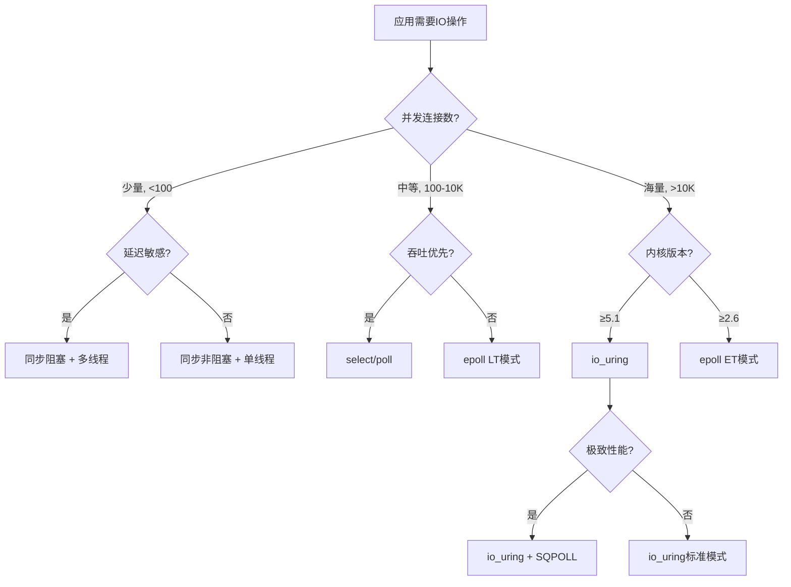

## 本章小结

本章从硬件总线架构到软件栈优化，系统性地构建了IO系统的完整知识体系。以下是对全章核心内容的结构化回顾、关键公式速查、实践要点清单，以及面向进阶学习的路线建议。

---

### 一、知识体系全景回顾

本章的主线可以概括为一条数据流：**一个IO请求从应用程序发起，经过内核软件栈的层层处理，最终由硬件完成数据搬运，并通过中断通知CPU**。围绕这条主线，我们从六个维度展开了深入讨论。

#### 1.1 IO硬件架构——数据搬运的物理基础

硬件层面解决了"数据如何在设备与内存之间高效流转"的问题，核心机制包括三个层次：

| 层次 | 关键技术 | 核心作用 |
|------|----------|----------|
| **总线互联** | PCIe Gen 1.0~6.0、USB 3.x | 提供设备与CPU/内存之间的物理传输通道，PCIe 5.0 x16单向带宽达63GB/s |
| **DMA搬运** | System DMA、Bus Master DMA、Scatter-Gather | 将CPU从逐字节数据搬运中解放，Scatter-Gather通过描述符链实现非连续内存的批量传输 |
| **地址管理** | IOMMU（Intel VT-d / AMD-Vi）、IOVA | 实现设备地址到物理地址的安全映射，支持设备直通（passthrough）和虚拟化场景 |

**关键认知转变**：理解IO系统的第一步，是认识到CPU与存储设备之间存在约3300万倍的速度差距——CPU指令周期约0.3ns，而HDD的一次随机读取需要约10ms。整个IO系统的设计哲学，本质上都是在弥合这个鸿沟。

#### 1.2 中断机制——异步事件的高效通知

当中断数据就绪或传输完成时，硬件通过中断机制通知CPU。本章深入分析了中断处理的完整链条：

**中断处理模型（上半部/下半部）**：
- **上半部（Hardirq）**：执行最关键的硬件应答和数据拷贝，禁用本地中断，要求极短的执行时间（微秒级）
- **下半部（Softirq/Tasklet/Workqueue）**：处理延迟敏感度较低的后续工作（如协议栈处理、缓冲区回收），可被高优先级中断抢占

**现代中断优化技术**：

| 技术 | 机制 | 适用场景 |
|------|------|----------|
| **MSI/MSI-X** | 通过内存写操作触发中断，替代传统引脚中断，单设备最多2048个向量 | 多队列NVMe SSD、高端网卡 |
| **中断聚合（Coalescing）** | 批量合并多次中断为一次，降低CPU中断开销 | 高吞吐网络场景，需权衡延迟 |
| **IRQ亲和性（Affinity）** | 将特定中断绑定到指定CPU核心，优化NUMA局部性 | 多核服务器、高性能存储 |
| **RPS/RFS** | 接收端包分流/转发，在软件层模拟多队列网卡 | 单队列网卡的多核扩展 |

#### 1.3 设备驱动模型——内核与硬件的桥梁

Linux通过统一的设备模型将异构硬件抽象为三类设备接口：

**字符设备（Character Device）**：
- 以字节流方式访问，无缓冲、无寻址
- 典型设备：终端（tty）、串口、随机数生成器（/dev/random）
- 核心结构：`cdev` + `file_operations`（open/release/read/write/ioctl/mmap）

**块设备（Block Device）**：
- 以固定大小的块为单位访问，支持随机寻址和缓冲
- 典型设备：HDD、SSD、RAID阵列
- 核心路径：VFS → 文件系统 → 通用块层 → IO调度器 → blk-mq → 设备驱动
- Linux 5.0+ 已移除传统单队列层，全面采用blk-mq多队列架构

**网络设备（Network Device）**：
- 以帧（frame）为单位，面向协议栈而非用户直接访问
- 典型设备：以太网卡、无线网卡
- 核心机制：NAPI（New API）——中断驱动与轮询的混合模式，在高流量时从"中断通知"切换到"轮询收包"，避免中断风暴

**设备发现机制**：Linux通过总线类型（`bus_type`）将设备（`device`）与驱动（`device_driver`）自动匹配。匹配方式包括：PCI Device ID匹配、USB Product ID匹配、ACPI表匹配、设备树（Device Tree）匹配。

#### 1.4 IO调度——在吞吐与延迟之间寻找平衡

IO调度器的核心任务是对来自多个进程的IO请求进行排序和合并，以优化底层存储设备的访问模式。

**调度算法演进**：

| 调度器 | 核心策略 | 适用场景 | 状态 |
|--------|----------|----------|------|
| **电梯算法（SCAN/LOOK/C-SCAN/C-LOOK）** | 按磁道方向扫描，减少磁头寻道 | HDD | 基础理论 |
| **CFQ** | 按进程分配时间片，保证公平性 | 桌面/通用 | Linux 5.0已移除 |
| **Deadline** | 在公平性基础上为读请求设置截止时间 | 数据库服务器 | 仍可用 |
| **BFQ** | 基于权重的预算分配，低延迟优先 | 桌面/交互式 | 推荐用于桌面 |
| **mq-deadline** | Deadline的多队列版本 | 数据库/通用 | blk-mq默认 |
| **kyber** | 基于目标延迟的双队列限流 | 高速NVMe | 延迟敏感场景 |
| **none** | 无调度，直接下发 | NVMe SSD、虚拟化 | 高速设备首选 |

**blk-mq多队列架构**：传统单队列在高并发下成为瓶颈（全局锁竞争）。blk-mq为每个CPU核心分配独立的软件队列（Software Queue），直接映射到硬件队列（Hardware Queue），消除了全局锁，显著提升高并发IO性能。对于NVMe SSD的数千个硬件队列，blk-mq是唯一的正确选择。

#### 1.5 存储协议——从SATA到NVMe的性能飞跃

存储协议定义了主机与存储设备之间的通信规则，三代协议的性能差异巨大：

| 协议 | 最大带宽 | 最大队列数 | 队列深度 | 命令提交方式 | 典型延迟 |
|------|----------|------------|----------|--------------|----------|
| **SATA/AHCI** | 6 Gbps (750 MB/s) | 1 | 32 | 基于内存映射的命令块 | ~100μs |
| **SCSI/SAS** | 22.5 Gbps (SAS-4) | 多 | 256/65535 | CDB命令描述块 | ~50μs |
| **NVMe** | 64 GB/s (PCIe 5.0 x16) | 65535 | 65536 | 内存共享队列（SQ/CQ） | ~10μs |

**NVMe革命性设计**：
- 命令提交通过内存中的 Submission Queue（SQ）和 Completion Queue（CQ）完成，无需PIO或MMIO操作
- 支持最多65535个IO队列，天然适配多核CPU的并行处理
- 中断复用MSI-X，每个队列可绑定独立中断向量
- 命令集精简（13条核心命令 vs SCSI的数十条），降低处理开销

#### 1.6 IO虚拟化——突破物理设备的边界

在虚拟化环境中，多个虚拟机需要共享物理IO设备。本章介绍了三种虚拟化方案：

| 方案 | 代表技术 | 性能 | 灵活性 | 适用场景 |
|------|----------|------|--------|----------|
| **设备模拟** | QEMU全模拟 | 低（多次VMExit） | 最高（任意设备） | 兼容性要求高 |
| **半虚拟化** | Virtio | 中高（共享内存通知） | 高 | 通用虚拟化 |
| **设备直通** | VFIO/SR-IOV | 接近原生 | 低（独占设备） | 高性能计算/数据库 |

**Virtio核心机制**：通过Virtqueue（描述符表 + Available Ring + Used Ring）实现Guest与Host之间的零拷贝数据共享。Guest将请求放入Available Ring，Host处理后将结果放入Used Ring，通过事件通知机制（eventfd/KVM中断）实现异步协作。

**SR-IOV**：在硬件层面将一个物理功能（PF）虚拟为多个虚拟功能（VF），每个VF可直通给不同的虚拟机，实现接近原生的IO性能，同时保持硬件级的资源隔离。

---

### 二、IO优化方法论——道法术器贯通

本章构建了一套完整的IO优化方法论，从底层哲学到具体工具，形成"道法术器"四层体系：

#### 2.1 道——三个核心原则

**原则一：减少IO次数**
- 一次4KB的随机写入约耗时100μs（HDD），而一次64KB的顺序写入约耗时300μs
- 后者传输16倍数据，但耗时仅3倍——单位数据的IO效率提升5.3倍
- 方法：缓冲聚合、批量提交、预读（Readahead）、延迟写回（Writeback）

**原则二：减少数据拷贝**
- 标准IO路径涉及4次拷贝：用户缓冲区→内核缓冲区→Page Cache→DMA缓冲区→磁盘
- `sendfile()`系统调用可将拷贝次数降至2次（DMA→DMA）
- `mmap`+`write`实现用户空间直接访问Page Cache，跳过一次拷贝
- io_uring的固定缓冲区（Registered Buffers）进一步减少注册/注销开销

**原则三：并行化IO与计算**
- 将IO等待时间与CPU计算时间重叠
- 异步IO（AIO/io_uring）：提交IO请求后立即返回，CPU继续处理其他任务
- 多线程/协程并发：每个线程/协程独立发起IO，操作系统层面并行调度

#### 2.2 法——IO模式选择决策树

#### 2.3 术——关键优化技术对比

| 优化技术 | 适用场景 | 性能提升 | 复杂度 | 风险 |
|----------|----------|----------|--------|------|
| **Direct IO** | 数据库、大文件顺序读写 | 避免Page Cache双份缓存 | 低 | 必须对齐到文件系统块大小 |
| **mmap** | 小文件频繁读取、共享内存 | 消除用户→内核拷贝 | 中 | 缺页中断开销、无法保证写入时机 |
| **sendfile/splice** | 网络文件传输（Web服务器） | 0拷贝传输 | 低 | 不适用于需要修改数据的场景 |
| **缓冲区调优** | 通用IO密集型应用 | 减少系统调用次数 | 低 | 过大缓冲区浪费内存 |
| **Readahead** | 顺序读取工作负载 | 预取下一批数据 | 低 | 随机读取场景浪费带宽 |
| **io_uring** | 高并发异步IO | 批量提交+零系统调用 | 高 | API复杂，需要内核5.1+ |
| **SPDK** | 存储后端、NVMe直通 | 用户态驱动，绕过内核 | 高 | 独占设备，无法与其他驱动共享 |

#### 2.4 器——性能诊断工具箱

| 工具 | 用途 | 输出信息 | 使用频率 |
|------|------|----------|----------|
| **fio** | IO性能基准测试 | IOPS、带宽、延迟分布 | 优化前后对比 |
| **iostat -x 1** | 实时磁盘IO监控 | %util、await、avgqu-sz | 日常监控 |
| **iotop** | 进程级IO统计 | 每个进程的IO读写速率 | 定位IO热点进程 |
| **blktrace/blkparse** | 块设备请求追踪 | IO请求的完整生命周期 | 深入分析IO路径 |
| **strace -c** | 系统调用统计 | IO相关系统调用次数和耗时 | 分析应用IO模式 |
| **perf stat/ftrace** | CPU级性能分析 | 缓存命中率、上下文切换 | 定位CPU/内存瓶颈 |
| **bpftrace/eBPF** | 内核动态追踪 | 自定义IO事件采集 | 高级诊断 |

---

### 三、关键公式与模型速查

| 概念 | 公式/模型 | 说明 | 实用示例 |
|------|-----------|------|----------|
| **Little定律** | QPS = 并发数 / 平均延迟 | 稳态系统吞吐量计算 | 100并发 / 10ms延迟 = 10K QPS |
| **SLA可用性** | SLA = 正常时间 / 总时间 | 99.9% = 8.76小时/年停机 | 99.99% = 52.6分钟/年 |
| **尾延迟** | P99 = 排序后第99百分位值 | 尾延迟比均值更能反映用户体验 | P50=5ms但P99=200ms说明长尾严重 |
| **容量规划** | QPS × 单次请求资源 = 总资源需求 | 硬件选型基础 | 10K QPS × 4KB = 40MB/s带宽需求 |
| **IOPS计算** | IOPS = 带宽 / 单次IO大小 | 顺序场景带宽受限，随机场景IOPS受限 | 500MB/s / 4KB = 125K IOPS（理论值） |
| **Amdahl定律** | 加速比 = 1 / (1-P + P/S) | IO优化的收益上限 | 若IO占30%，即使IO加速10倍，整体仅加速1.43倍 |
| **缓存命中率** | Hit% = 命中次数 / 总请求次数 | Page Cache/Buffer Cache效率 | 命中率95%意味着仅5%请求到达磁盘 |

---

### 四、常见误区与纠正

本章在学习和实践过程中，以下误区需要特别警惕：

#### 误区1：盲目追求高IOPS指标
- **错误认知**：IOPS越高越好，追求百万级IOPS
- **实际情况**：IOPS需要结合IO大小和读写比例才有意义。4K随机读的100K IOPS与128K顺序读的100K IOPS，实际吞吐量差32倍
- **正确做法**：以实际业务场景的IO模型（读写比、IO大小分布、顺序/随机比例）为基础进行评估

#### 误区2：Direct IO一定能提升性能
- **错误认知**：绕过Page Cache直接读写磁盘一定更快
- **实际情况**：Direct IO对小文件随机读取反而更慢，因为失去了Page Cache的加速。只有大文件顺序IO或数据库（自带缓存管理）才适合Direct IO
- **正确做法**：先用`vmtouch`检查文件在Page Cache中的占比，再决定是否使用Direct IO

#### 误区3：fsync调用越少越好
- **错误认知**：减少fsync调用能提升写入性能
- **实际情况**：不调用fsync意味着数据可能在断电时丢失。数据库需要通过WAL（Write-Ahead Logging）保证持久性，而非简单取消fsync
- **正确做法**：使用`fdatasync`替代`fsync`（跳过元数据刷写），或通过批量提交减少fsync频率，但不能完全省略

#### 误区4：NVMe SSD不需要IO调度器
- **错误认知**：NVMe性能足够高，调度器没有意义
- **实际情况**：对于NVMe SSD，`none`调度器确实是最优选择，但BFQ在桌面环境的交互式响应上仍有价值。关键在于理解"为什么"而不是盲目选择
- **正确做法**：根据场景选择——服务器NVMe用`none`，桌面混合负载用`BFQ`，数据库用`mq-deadline`

#### 误区5：epoll一定优于select/poll
- **错误认知**：epoll的O(1)复杂度一定比select/poll的O(n)快
- **实际情况**：当连接数较少（<1000）且活跃率高时，select的开销可能更低（无epoll的红黑树维护成本）。epoll的优势在于"大量连接中少量活跃"的场景
- **正确做法**：根据连接数和活跃比例选择——少量连接用select足够，万级以上用epoll

---

### 五、完整IO路径速览

理解一个IO请求的完整旅程，是融会贯通本章知识的最佳方式。以一次`read()`系统调用为例：

应用层          内核层                    硬件层
  │               │                        │
  ├─ read(fd,buf,n) ──→ VFS层判断文件类型    │
  │               ├─ ext4/NTFS查找inode     │
  │               ├─ 检查Page Cache         │
  │               │  ├─ 命中 → 直接拷贝返回  │
  │               │  └─ 未命中 ↓            │
  │               ├─ 构造bio请求            │
  │               ├─ 通用块层合并/排序       │
  │               ├─ IO调度器排序           │
  │               ├─ blk-mq分发到软件队列    │
  │               ├─ NVMe驱动提交SQE        │
  │               ├─ ──────────────────→ NVMe控制器执行读取
  │               │  ←── DMA将数据写入内存   │
  │               ├─ MSI-X中断通知完成       │
  │               ├─ 处理CQE，唤醒等待进程   │
  │               ├─ 数据拷贝到用户缓冲区    │
  │  ←── 返回 ──┤                        │
  │               │                        │

**各层延迟参考（NVMe SSD）**：

| 阶段 | 典型延迟 | 说明 |
|------|----------|------|
| 系统调用开销 | 0.1-0.5μs | 用户态↔内核态切换 |
| VFS + 文件系统查找 | 0.5-2μs | inode查找、权限检查 |
| Page Cache命中 | 0.1-1μs | 内存访问，无需IO |
| 块层 + 调度器 | 1-5μs | 请求合并、排序 |
| blk-mq + NVMe驱动 | 1-3μs | SQE提交、门铃写入 |
| NVMe控制器执行 | 10-100μs | 实际闪存读取 |
| DMA传输 | 1-5μs | 数据从设备到内存 |
| 中断处理 | 0.5-2μs | 上半部+下半部 |
| **总计（Page Cache未命中）** | **20-120μs** | 端到端读取延迟 |

---

### 六、最佳实践清单

#### 设计阶段

- [ ] **明确IO性能基线**：用`fio`测量目标硬件的顺序读写带宽、随机IOPS、延迟分布（P50/P95/P99），作为后续优化的参考基准
- [ ] **选择IO模型**：根据并发量和延迟要求，从阻塞/非阻塞/select/poll/epoll/io_uring中选择合适的IO多路复用方案
- [ ] **设计缓存策略**：确定应用层缓存（Redis/Memcached）、Page Cache利用、Direct IO使用的边界
- [ ] **规划容错方案**：为每个IO路径设计超时、重试、降级机制，关键数据写入必须考虑fsync/fdatasync策略

#### 实现阶段

- [ ] **缓冲区对齐**：Direct IO场景下确保缓冲区和偏移量对齐到文件系统块大小（通常4KB），使用`posix_memalign`而非栈分配
- [ ] **零拷贝传输**：网络文件传输使用`sendfile()`或`splice()`，避免用户态中转
- [ ] **批量提交**：高并发场景使用io_uring批量提交SQE，减少系统调用开销
- [ ] **异步化关键路径**：数据库、消息队列等延迟敏感组件使用异步IO，避免阻塞主线程

#### 部署阶段

- [ ] **文件系统选择**：数据库使用XFS（大文件性能好），通用场景用ext4（稳定成熟），快照需求用Btrfs
- [ ] **挂载选项优化**：考虑`noatime`（减少元数据写入）、`data=writeback`（ext4提升写入性能）、`barrier=0`（仅电池备份设备）
- [ ] **IO调度器配置**：NVMe SSD设置`none`，HDD数据库服务器设置`mq-deadline`，桌面系统设置`BFQ`
- [ ] **中断亲和性**：通过`/proc/irq/<IRQ>/smp_affinity`将存储中断绑定到特定CPU，避免跨NUMA访问

#### 运维阶段

- [ ] **持续监控**：部署`iostat`/`iotop`+Prometheus+Grafana监控IO指标，设置`%util>80%`、`await>10ms`等告警阈值
- [ ] **定期基线测量**：每月用`fio`重新测量存储性能，及时发现硬件老化或配置退化
- [ ] **IO路径追踪**：遇到性能问题时，用`blktrace`+`blkparse`还原IO请求的完整生命周期，定位瓶颈层级
- [ ] **容量规划**：基于业务增长预测，提前规划存储扩容，避免IO成为系统瓶颈

---

### 七、下一步学习建议

#### 7.1 源码阅读路线

对于希望深入理解IO系统实现细节的读者，推荐以下源码阅读路线：

| 阶段 | 阅读目标 | 代码位置 | 预期收获 |
|------|----------|----------|----------|
| 入门 | VFS层read/write系统调用 | `fs/read_write.c` | 理解用户态到内核态的IO入口 |
| 进阶 | ext4文件系统读取路径 | `fs/ext4/inode.c` → `fs/ext4/readpage.c` | 理解文件系统如何构造bio请求 |
| 深入 | 通用块层合并逻辑 | `block/blk-merge.c` | 理解IO请求的合并策略 |
| 高级 | blk-mq多队列调度 | `block/blk-mq.c` | 理解多队列架构的软件分发机制 |
| 专家 | NVMe驱动实现 | `drivers/nvme/host/pci.c` | 理解SQ/CQ提交和中断处理 |

#### 7.2 推荐阅读资源

**经典著作**：
- 《Operating Systems: Three Easy Pieces》（OSTEP）——IO章节免费在线阅读，系统性讲解IO子系统
- 《Linux Kernel Development》by Robert Love——内核IO子系统的权威参考
- 《Understanding the Linux Kernel》by Bovet & Cesati——深入分析Linux内核数据结构和算法
- 《Systems Performance》by Brendan Gregg——系统性能分析方法论，包含大量IO分析案例

**技术论文**：
- NVMe规范（nvmexpress.org）——理解NVMe协议设计的权威来源
- "The Linux I/O Stack"（LWN.net）——Linux IO栈演进的技术分析
- "io_uring: A New Asynchronous I/O API for Linux"（kernel.org）——io_uring设计文档

**在线资源**：
- Brendan Gregg的性能分析博客（brendangregg.com）——IO性能分析工具和方法的金矿
- Kernel Newbies（kernelnewbies.org）——内核子系统的入门级文档
- LWN.net——Linux内核社区的技术讨论，跟踪IO子系统的最新变化

#### 7.3 实践项目建议

| 项目 | 难度 | 学习目标 | 建议时长 |
|------|------|----------|----------|
| 用`fio`对比不同IO调度器性能 | ★★ | 理解调度器对性能的影响 | 2-3小时 |
| 实现简单的用户态文件缓存 | ★★★ | 掌握mmap和Page Cache机制 | 1-2天 |
| 用blktrace分析数据库IO模式 | ★★★ | 掌握IO路径分析方法 | 3-4小时 |
| 用io_uring实现高并发文件服务器 | ★★★★ | 掌握现代异步IO编程 | 3-5天 |
| 基于SPDK实现NVMe用户态驱动 | ★★★★★ | 理解存储栈全貌 | 1-2周 |

---

### 八、思考题

以下问题覆盖本章的核心知识点，建议先独立思考，再回翻对应章节验证。

**基础理解**：
1. 为什么CPU和存储设备之间需要DMA？如果取消DMA，完全由CPU进行数据搬运，会带来什么后果？
2. 中断的"上半部/下半部"分离设计解决了什么问题？如果不分离，直接在硬中断中完成所有处理，会出现什么情况？
3. Linux将设备分为字符设备、块设备、网络设备三类，这种分类的依据是什么？为什么不统一为一种设备模型？

**技术辨析**：
4. 在NVMe SSD上，`none`调度器和`mq-deadline`调度器的实际性能差异有多大？什么场景下选择`mq-deadline`仍然有意义？
5. `mmap`和`read/write`两种文件访问方式，在什么条件下`mmap`性能更优？什么条件下`read/write`反而更快？
6. io_uring的SQPOLL模式通过内核线程轮询SQ环形缓冲区来避免系统调用开销，但为什么不是所有场景都推荐使用SQPOLL？

**架构设计**：
7. 如果你需要设计一个支持10万并发连接的网络存储服务，从IO模型选择、缓冲策略、调度器配置、监控方案四个维度，你会如何设计？
8. Virtio和SR-IOV分别适合什么虚拟化场景？如果一个云服务商同时提供轻量级容器和高性能数据库两种产品，你会如何选择IO虚拟化方案？

**进阶思考**：
9. CXL（Compute Express Link）的CXL.mem和CXL.io分别解决了什么问题？CXL普及后，对传统NVMe SSD和RDMA网卡会产生什么影响？
10. SPDK绕过内核直接在用户态驱动NVMe设备，这种架构的优势和代价分别是什么？在什么场景下值得为此付出代价？

---

### 九、全章核心观点提炼

最后，用五句话概括本章最核心的认知：

1. **IO系统的设计本质是在弥合CPU与外设之间数千万倍的速度鸿沟**——所有的缓冲、异步、并行机制都是为了隐藏这个延迟差异。

2. **IO优化的第一性原理是减少IO次数和减少数据拷贝**——在讨论任何优化技术之前，先问自己：这次IO能不能不做？这次拷贝能不能省掉？

3. **选择IO模型要基于实际的并发规模和延迟要求**——没有"最好"的IO模型，只有最适合当前场景的模型。

4. **性能数据必须结合上下文才有意义**——脱离IO大小、读写比例、顺序/随机比例谈IOPS和带宽，就像脱离路况谈汽车速度。

5. **监控和度量是优化的前提**——在没有数据支撑的情况下做优化，就像蒙着眼睛调收音机，靠的是运气而非方法。
