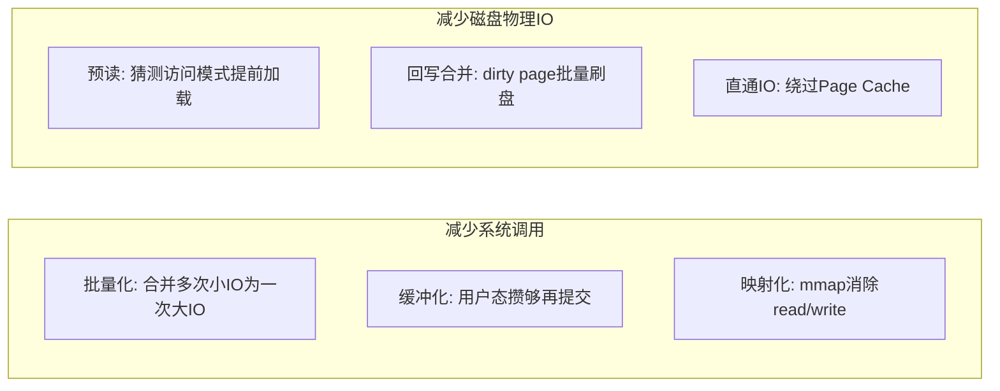
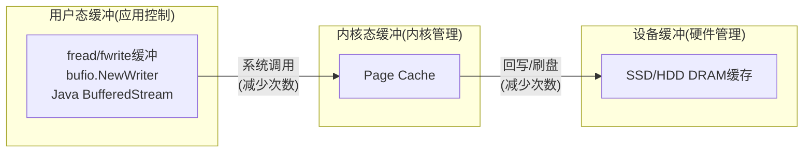
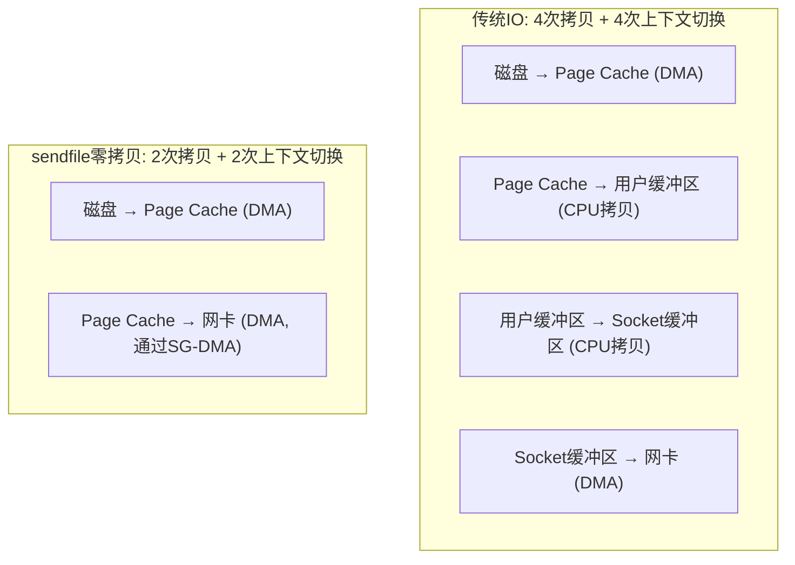
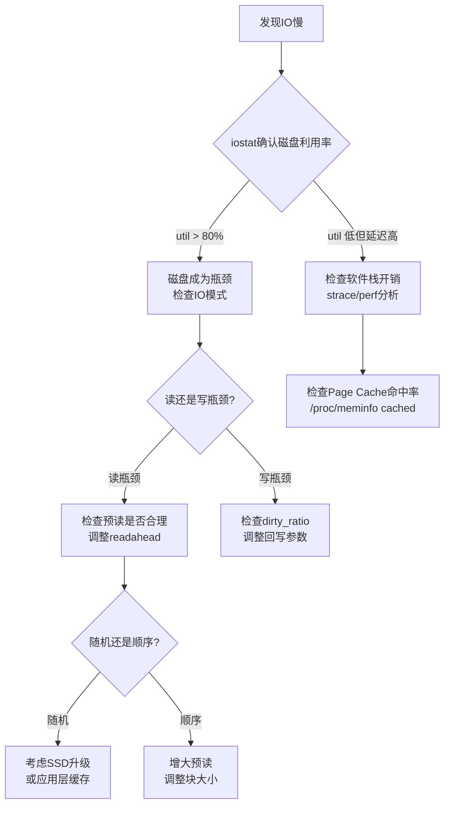

## 技巧二：IO性能优化

### 引言：为什么IO优化如此关键

在现代计算机系统中，IO往往是整体性能的"天花板"。一个典型的应用响应延迟构成如下：

| 延迟来源 | 耗时 |
|----------|------|
| 网络传输（同城） | 0.5-2 ms |
| 内存访问 | 100 ns |
| NVMe SSD 随机读 | 50-150 μs |
| SATA SSD 随机读 | 100-300 μs |
| HDD 随机读（含寻道） | 5-15 ms |
| 一次系统调用开销 | 0.1-1 μs |
| 一次 Page Cache 缺页 | 5-10 μs |

可以看到，从 HDD 到 NVMe SSD 延迟差了两个数量级，而一次优化良好的 Page Cache 命中则比磁盘 IO 快 1000 倍以上。IO 性能优化的本质就是：**尽可能让数据离 CPU 更近、尽可能减少"搬运"次数**。

本节从理论原理出发，系统讲解 IO 性能优化的核心方法，涵盖缓冲策略、内存映射、零拷贝、异步 IO 等关键技术，并提供可直接使用的基准测试方案和调优参数。

---

### 原理讲解

#### 核心原理：减少系统调用与磁盘物理IO

IO 性能优化的核心策略可归纳为两个维度：



类比寄快递：

- **缓冲IO**：攒够一箱再寄，减少快递次数（减少系统调用）
- **Direct IO**：绕过仓库直达客户，适合大数据量且自管缓存的场景（减少 Page Cache 开销）
- **预读（Readahead）**：猜你要什么，提前备货（减少后续 IO 延迟）
- **零拷贝**：快递员直接从仓库搬到客户车上，不经中转站（减少内存拷贝）

#### 1. Page Cache：IO优化的基石

Page Cache 是 Linux 内核中最核心的 IO 优化机制。内核将最近读写过的磁盘数据缓存在内存中，后续对同一数据的访问直接命中缓存，无需访问磁盘。

```mermaid
graph TB
    subgraph 用户空间
        APP[应用程序]
    end
    subgraph 内核空间
        VFS[VFS层]
        PC[Page Cache]
        WB[回写线线程 pdflush/writeback)]
        BIO[块IO层]
    end
    subgraph 硬件
        DISK[磁盘]
    end

    APP -->|"read()"| VFS
    VFS -->|"查缓存"| PC
    PC -.->|"命中: 直接返回"| APP
    PC -->|"未命中: 发起磁盘IO"| BIO
    BIO --> DISK
    DISK -->|"数据填入Page Cache"| PC
    APP -->|"write()"| PC
    PC -.->|"数据在Page Cache中"| PC
    WB -->|"定时/阈值触发回写"| BIO
    BIO --> DISK
```

**Page Cache 的工作流程：**

1. **读路径**：`read()` 系统调用 → VFS 查找 Page Cache → 命中则直接拷贝到用户缓冲区（零磁盘IO）→ 未命中则发起块IO请求，数据从磁盘读入 Page Cache 再返回
2. **写路径**：`write()` 系统调用 → 数据写入 Page Cache（标记为 dirty）→ 返回成功 → 内核后台线程定期将 dirty page 回写到磁盘
3. **回写触发条件**：dirty page 占比超过 `vm.dirty_ratio`（默认 20%），或 `vm.dirty_expire_centisecs` 超时（默认 30 秒），或手动 `sync()/fsync()`

**关键内核参数与调优：**

```bash
# 查看当前回写参数
cat /proc/sys/vm/dirty_ratio          # dirty page占内存比例触发同步回写 (默认20)
cat /proc/sys/vm/dirty_background_ratio  # 触发后台回写的比例 (默认10)
cat /proc/sys/vm/dirty_expire_centisecs  # dirty page过期时间(百分之一秒, 默认3000=30s)
cat /proc/sys/vm/dirty_writeback_centisecs  # 回写线程唤醒间隔(默认500=5s)
cat /proc/sys/vm/dirty_expire_interval     # 过期检查间隔(默认1000=10s)

# 数据库服务器调优: 降低脏页比例, 更频繁回写, 减少突发IO
sysctl -w vm.dirty_ratio=5
sysctl -w vm.dirty_background_ratio=2
sysctl -w vm.dirty_expire_centisecs=500     # 5秒过期
sysctl -w vm.dirty_writeback_centisecs=100  # 1秒检查
```

#### 2. Readahead（预读）机制

Readahead 是内核预测程序访问模式并提前读取后续数据块的机制。当检测到顺序访问时，内核会逐步增大预读窗口，减少后续的 IO 等待。

```bash
# 查看/调整块设备的预读大小(单位: 512字节扇区)
blockdev --getra /dev/sda           # 查看当前预读值(通常256=128KB)
blockdev --setra 4096 /dev/sda      # 设置为2MB(适合顺序扫描)
blockdev --setra 2048 /dev/nvme0n1  # NVMe设备设为1MB

# 通过sysfs查看
cat /sys/block/sda/queue/read_ahead_kb  # KB为单位
```

**预读策略的选择：**

| 场景 | 推荐预读大小 | 原因 |
|------|------------|------|
| 数据库随机读 | 4-16 KB | 小预读避免浪费带宽 |
| 日志顺序写 | 256-512 KB | 匹配顺序写入模式 |
| 文件服务器 | 128-256 KB | 通用默认值 |
| 视频流媒体 | 1-4 MB | 大块连续读取 |
| 大文件拷贝 | 2-8 MB | 最大化顺序吞吐 |

#### 3. 用户态缓冲 vs 内核缓冲

理解 IO 缓冲的关键是区分三层缓冲：



- **用户态缓冲**：应用通过 `fread/fwrite` 的 stdio 缓冲、Go 的 `bufio`、Java 的 `BufferedStream` 减少系统调用次数
- **内核态缓冲**：Page Cache 减少磁盘物理 IO 次数
- **设备缓冲**：SSD/HDD 内部的 DRAM 缓存进一步合并写入

三层缓冲协同工作，每一层的优化都能减少下一层的压力。

---

### 核心优化技术

#### 技术1：批量化IO — 消灭高频小IO

逐字节或小块 IO 是最常见的性能杀手。每次 `write(fd, buf, 1)` 都会触发一次系统调用，涉及用户态→内核态上下文切换、VFS 路径查找、锁获取/释放，开销约 0.1-1 微秒。看似微不足道，但当写入量达到百万级时，仅系统调用开销就可能累积到秒级。

**基准测试：不同缓冲大小的写入性能**

```c
#include <stdio.h>
#include <stdlib.h>
#include <time.h>
#include <fcntl.h>
#include <unistd.h>
#include <string.h>

#define TEST_SIZE (10 * 1024 * 1024)  // 10MB

double benchmark(const char *label, void (*write_fn)(int, const char*, size_t),
                 int fd, const char *data, size_t size) {
    lseek(fd, 0, SEEK_SET);
    ftruncate(fd, 0);

    struct timespec start, end;
    clock_gettime(CLOCK_MONOTONIC, &amp;start);
    write_fn(fd, data, size);
    fsync(fd);
    clock_gettime(CLOCK_MONOTONIC, &amp;end);

    double ms = (end.tv_sec - start.tv_sec) * 1000.0 +
                (end.tv_nsec - start.tv_nsec) / 1e6;
    double mbps = size / 1024.0 / 1024.0 / (ms / 1000.0);
    printf("%-25s: %8.1f ms  (%7.1f MB/s)\n", label, ms, mbps);
    return ms;
}

// ❌ 逐字节写入: 每次1字节系统调用
void write_byte_by_byte(int fd, const char *data, size_t size) {
    for (size_t i = 0; i < size; i++) {
        write(fd, &amp;data[i], 1);
    }
}

// ⚠️ 小块写入(1KB): 仍有很多系统调用
void write_1k_chunks(int fd, const char *data, size_t size) {
    size_t offset = 0;
    while (offset < size) {
        size_t chunk = (size - offset > 1024) ? 1024 : (size - offset);
        write(fd, data + offset, chunk);
        offset += chunk;
    }
}

// ✅ 标准4KB块写入: 匹配内存页大小
void write_4k_chunks(int fd, const char *data, size_t size) {
    size_t offset = 0;
    while (offset < size) {
        size_t chunk = (size - offset > 4096) ? 4096 : (size - offset);
        write(fd, data + offset, chunk);
        offset += chunk;
    }
}

// ✅✅ 大块写入(64KB): 接近最优吞吐
void write_64k_chunks(int fd, const char *data, size_t size) {
    size_t offset = 0;
    while (offset < size) {
        size_t chunk = (size - offset > 65536) ? 65536 : (size - offset);
        write(fd, data + offset, chunk);
        offset += chunk;
    }
}

// ✅✅✅ stdio全缓冲: 用户态攒够再提交
void write_stdio_fullbuf(int fd, const char *data, size_t size) {
    FILE *fp = fdopen(dup(fd), "wb");
    setvbuf(fp, NULL, _IOFBF, 64 * 1024);  // 64KB用户缓冲
    fwrite(data, 1, size, fp);
    fclose(fp);
}

int main() {
    int fd = open("/tmp/iobench", O_WRONLY | O_CREAT | O_TRUNC, 0644);
    char *data = malloc(TEST_SIZE);
    memset(data, 'A', TEST_SIZE);

    printf("=== IO写入性能对比 (10MB数据) ===\n\n");
    // 逐字节太慢, 只测1MB
    size_t small = 1024 * 1024;
    benchmark("1B逐字节write", write_byte_by_byte, fd, data, small);
    benchmark("1KB块write", write_1k_chunks, fd, data, TEST_SIZE);
    benchmark("4KB块write", write_4k_chunks, fd, data, TEST_SIZE);
    benchmark("64KB块write", write_64k_chunks, fd, data, TEST_SIZE);
    benchmark("stdio 64KB缓冲", write_stdio_fullbuf, fd, data, TEST_SIZE);

    free(data);
    close(fd);
    return 0;
}
```

**典型测试结果（NVMe SSD, 单核）：**

| 写入方式 | 系统调用次数 | 耗时 | 吞吐量 | 相对性能 |
|----------|------------|------|--------|---------|
| 1B 逐字节 | 1,048,576 | ~12000 ms | ~0.8 MB/s | 1x |
| 1KB 块 | 10,240 | ~120 ms | ~83 MB/s | 100x |
| 4KB 块 | 2,560 | ~35 ms | ~286 MB/s | 350x |
| 64KB 块 | 160 | ~15 ms | ~667 MB/s | 830x |
| stdio 64KB 缓冲 | 15-20 | ~12 ms | ~833 MB/s | 1000x |

**关键结论：** 系统调用次数从百万级降到几十级，性能提升超过 1000 倍。64KB-256KB 的缓冲大小是性能与内存占用的最佳平衡点。

#### 技术2：Direct IO — 绕过Page Cache

当应用已经自行管理缓存（如数据库、Redis）时，Page Cache 反而是多余的开销——数据被拷贝了两次（磁盘→Page Cache→用户缓冲区）。Direct IO 让数据直接在磁盘和用户缓冲区之间传输，消除这一冗余拷贝。

```c
#include <fcntl.h>
#include <stdio.h>
#include <stdlib.h>
#include <unistd.h>
#include <string.h>
#include <sys/mman.h>

#define FILE_SIZE (64 * 1024 * 1024)  // 64MB

int main() {
    char *buf;
    // Direct IO 要求缓冲区地址和大小按扇区(512字节)对齐
    // Linux 4.14+ 内核自动处理部分对齐，但最佳实践仍手动对齐
    posix_memalign((void**)&amp;buf, 4096, FILE_SIZE);
    memset(buf, 'A', FILE_SIZE);

    // 普通IO (经过Page Cache)
    int fd_normal = open("/tmp/test_normal", O_RDWR | O_CREAT | O_TRUNC, 0644);
    write(fd_normal, buf, FILE_SIZE);
    fsync(fd_normal);
    close(fd_normal);

    // Direct IO (绕过Page Cache)
    int fd_direct = open("/tmp/test_direct",
                         O_RDWR | O_CREAT | O_TRUNC | O_DIRECT, 0644);
    write(fd_direct, buf, FILE_SIZE);
    fdatasync(fd_direct);  // Direct IO仍需显式同步
    close(fd_direct);

    free(buf);
    return 0;
}
```

**Direct IO 的使用要点：**

| 要求 | 说明 |
|------|------|
| 对齐要求 | 缓冲区地址必须按 512 字节（或 4096 字节）对齐，传输大小也需对齐 |
| 适用场景 | 数据库（MySQL InnoDB、PostgreSQL）、自建缓存层的应用 |
| 不适用场景 | 小文件频繁读写（Direct IO 每次都需要物理IO） |
| fdatasync vs fsync | `fdatasync` 只刷数据不刷元数据，比 `fsync` 快 10-30% |

#### 技术3：mmap — 内存映射IO

mmap 将文件直接映射到进程的虚拟地址空间，读写文件就像读写内存。内核通过 Page Cache 和缺页中断透明地处理磁盘 IO。

```c
#include <sys/mman.h>
#include <sys/stat.h>
#include <fcntl.h>
#include <unistd.h>
#include <string.h>
#include <stdio.h>

int main() {
    int fd = open("/tmp/bigfile", O_RDWR | O_CREAT, 0644);
    size_t size = 1ULL * 1024 * 1024 * 1024;  // 1GB
    ftruncate(fd, size);

    // 映射到进程地址空间 — 不立即占用物理内存
    char *mapped = mmap(NULL, size, PROT_READ | PROT_WRITE,
                        MAP_SHARED, fd, 0);
    if (mapped == MAP_FAILED) {
        perror("mmap");
        return 1;
    }

    // 像访问内存一样读写文件
    strcpy(mapped, "Hello from mmap!");
    printf("文件内容: %.20s\n", mapped);

    // 给内核建议访问模式, 优化预读策略
    // MADV_SEQUENTIAL: 顺序访问, 加大预读
    // MADV_RANDOM: 随机访问, 关闭预读
    // MADV_WILLNEED: 告知即将访问, 提前预读
    madvise(mapped, size, MADV_SEQUENTIAL);

    // 强制写回磁盘
    msync(mapped, size, MS_SYNC);

    munmap(mapped, size);
    close(fd);
    return 0;
}
```

**mmap 的优势与陷阱：**

| 优势 | 陷阱 |
|------|------|
| 消除 read/write 系统调用和用户态→内核态拷贝 | 小文件随机读频繁 mmap/munmap 开销大 |
| 利用 Page Cache，无需额外缓存管理 | 写操作的缺页中断可能导致不可预期的延迟 |
| 多进程可共享同一文件映射 | 大文件 mmap 可能导致地址空间碎片 |
| 适合大文件顺序或随机访问 | 崩溃时未 msync 的数据可能丢失 |

**madvise 预读策略选择：**

```c
// 顺序扫描场景: 告知内核顺序访问, 增大预读窗口
madvise(mapped, file_size, MADV_SEQUENTIAL);

// 随机查询场景(如数据库): 关闭预读, 避免浪费IO带宽
madvise(mapped, file_size, MADV_RANDOM);

// 已知即将访问某区域: 提前触发预读, 消除缺页延迟
madvise(mapped + offset, length, MADV_WILLNEED);

// 不再需要某区域: 允许内核回收, 避免缓存污染
madvise(mapped + offset, length, MADV_DONTNEED);
```

#### 技术4：零拷贝 — 消灭多余的内存搬运

零拷贝的核心思想是让数据在内核空间内直接流转，避免"磁盘→内核→用户→内核→磁盘"的多次拷贝。



**Linux 零拷贝API对比：**

| API | 拷贝次数 | 适用场景 | 内核版本 |
|-----|---------|---------|---------|
| `read()` + `write()` | 4次 | 通用（兼容性最好） | 所有版本 |
| `mmap()` + `write()` | 3次 | 大文件传输 | 2.0+ |
| `sendfile()` | 2次 | 文件→网络传输 | 2.1+ |
| `splice()` | 0次（pipe中转） | 管道/套接字间传输 | 2.6.17+ |
| `io_uring` + 零拷贝 | 0次 | 高性能异步IO | 5.19+ |

**sendfile 示例（C语言，文件发送到网络）：**

```c
#include <sys/sendfile.h>
#include <fcntl.h>
#include <unistd.h>
#include <stdio.h>

// 将文件内容高效发送到socket
// 内核直接在Page Cache和网卡DMA之间搬运, 不经过用户态
int send_file_to_client(int client_fd, const char *filepath) {
    int file_fd = open(filepath, O_RDONLY);
    if (file_fd < 0) return -1;

    struct stat st;
    fstat(file_fd, &amp;st);

    // Linux 2.6.33+ 支持offset参数, 无需lseek
    off_t offset = 0;
    ssize_t sent = sendfile(client_fd, file_fd, &amp;offset, st.st_size);

    close(file_fd);
    return (sent == st.st_size) ? 0 : -1;
}
```

**Go 中的零拷贝：**

```go
package main

import (
    "fmt"
    "io"
    "os"
    "time"
)

func main() {
    size := 100 * 1024 * 1024 // 100MB
    data := make([]byte, size)

    // 方法1: 直接写入 (经过Page Cache)
    start := time.Now()
    f1, _ := os.Create("/tmp/test1")
    f1.Write(data)
    f1.Sync()
    f1.Close()
    fmt.Printf("直接写入: %v\n", time.Since(start))

    // 方法2: bufio缓冲写入
    start = time.Now()
    f2, _ := os.Create("/tmp/test2")
    w := bufio.NewWriterSize(f2, 256*1024) // 256KB缓冲
    w.Write(data)
    w.Flush()
    f2.Sync()
    f2.Close()
    fmt.Printf("bufio写入: %v\n", time.Since(start))

    // 方法3: io.Copy (底层自动使用sendfile零拷贝)
    start = time.Now()
    src, _ := os.Open("/tmp/test1")
    dst, _ := os.Create("/tmp/test3")
    io.Copy(dst, src) // Linux上自动调用sendfile
    dst.Sync()
    dst.Close()
    src.Close()
    fmt.Printf("io.Copy(零拷贝): %v\n", time.Since(start))
}
```

#### 技术5：io_uring — 新一代异步IO引擎

io_uring 是 Linux 5.1+ 引入的高性能异步IO框架，通过共享内存的提交队列（SQ）和完成队列（CQ）实现"零系统调用"的异步IO，是当前 Linux 上吞吐量最高的 IO 方案。

```mermaid
graph LR
    subgraph "用户态"
        SQ[提交队列 SQ<br>(用户写, 内核读)]
        CQ[完成队列 CQ<br>(内核写, 用户读)]
        APP[应用]
    end
    subgraph "内核态"
        WQ[内核工作线程<br>或轮询模式]
    end

    APP -->|"1. 填写SQE<br>(无系统调用)"| SQ
    SQ -->|"2. 内核消费SQE"| WQ
    WQ -->|"3. 完成后写入CQE"| CQ
    CQ -->|"4. 应用读取CQE<br>(无系统调用)"| APP
```

**io_uring 核心优势：**

- **批量提交**：一次 `io_uring_enter()` 系统调用提交多个IO请求，减少系统调用次数
- **共享内存**：SQ/CQ 通过 `mmap` 与内核共享，避免数据拷贝
- **轮询模式**：`IORING_SETUP_SQPOLL` 启动内核轮询线程，提交IO完全无需系统调用
- **支持所有IO操作**：文件读写、网络收发、文件描述符注册、定时器等

```bash
# 检查内核是否支持io_uring
uname -r  # 需要 5.1+
grep io_uring /proc/kallsyms | head -5

# Debian/Ubuntu安装开发库
apt install liburing-dev

# CentOS/RHEL安装
yum install liburing-devel
```

**io_uring 基本使用示例（C语言）：**

```c
#include <liburing.h>
#include <stdio.h>
#include <string.h>
#include <fcntl.h>
#include <unistd.h>

#define QUEUE_DEPTH 4

int main() {
    struct io_uring ring;
    // 初始化io_uring, 队列深度QUEUE_DEPTH
    io_uring_queue_init(QUEUE_DEPTH, &amp;ring, 0);

    // 打开文件
    int fd = open("/tmp/testfile", O_WRONLY | O_CREAT | O_TRUNC, 0644);
    char buf[4096];
    memset(buf, 'A', sizeof(buf));

    // 提交写请求
    struct io_uring_sqe *sqe = io_uring_get_sqe(&amp;ring);
    io_uring_prep_write(sqe, fd, buf, sizeof(buf), 0);
    sqe->user_data = 1;  // 自定义标识

    // 提交SQE到内核(批量)
    io_uring_submit(&amp;ring);

    // 等待完成
    struct io_uring_cqe *cqe;
    io_uring_wait_cqe(&amp;ring, &amp;cqe);

    if (cqe->res > 0) {
        printf("写入成功: %d 字节\n", cqe->res);
    } else {
        printf("写入失败: %d\n", cqe->res);
    }

    io_uring_cqe_seen(&amp;ring, cqe);
    io_uring_queue_exit(&amp;ring);
    close(fd);
    return 0;
}
```

#### 技术6：fio — 专业IO基准测试工具

fio 是业界标准的 IO 性能测试工具，可以模拟各种 IO 负载模式，精确测量 IOPS、吞吐量和延迟。

```bash
#!/bin/bash
# IO性能全面基准测试

echo "=== 磁盘IO基准测试 (fio) ==="
echo "测试文件: /tmp/fiotest"
echo ""

# 1. 顺序读 — 测量大文件拷贝/流媒体场景
echo "--- 1. 顺序读 (128KB块, 4线程) ---"
fio --name=seqread --rw=read --bs=128k --size=1G \
    --numjobs=4 --runtime=30 --group_reporting \
    --filename=/tmp/fiotest --output-format=json | \
    jq '.jobs[0].read | {bw_mb: (.bw/1024), iops: .iops, lat_avg_us: .lat_ns.mean/1000}'

# 2. 随机读 (4KB块, 深队列) — 测量数据库OLTP场景
echo ""
echo "--- 2. 随机读 (4KB块, QD=32) ---"
fio --name=randread --rw=randread --bs=4k --size=1G \
    --numjobs=4 --iodepth=32 --runtime=30 --group_reporting \
    --ioengine=libaio --direct=1 \
    --filename=/tmp/fiotest --output-format=json | \
    jq '.jobs[0].read | {bw_mb: (.bw/1024), iops: .iops, lat_p99_us: .lat_ns.percentile["99.000000"]/1000}'

# 3. 顺序写 — 测量日志写入场景
echo ""
echo "--- 3. 顺序写 (128KB块) ---"
fio --name=seqwrite --rw=write --bs=128k --size=1G \
    --numjobs=4 --runtime=30 --group_reporting \
    --filename=/tmp/fiotest

# 4. 随机写 — 测量数据库写入场景
echo ""
echo "--- 4. 随机写 (4KB块, QD=32) ---"
fio --name=randwrite --rw=randwrite --bs=4k --size=1G \
    --numjobs=4 --iodepth=32 --runtime=30 --group_reporting \
    --ioengine=libaio --direct=1 \
    --filename=/tmp/fiotest

# 5. 混合读写 (70读30写) — 模拟真实OLTP负载
echo ""
echo "--- 5. 混合读写 (70R/30W, 4KB块) ---"
fio --name=randrw --rw=randrw --rwmixread=70 --bs=4k --size=1G \
    --numjobs=4 --iodepth=32 --runtime=30 --group_reporting \
    --ioengine=libaio --direct=1 \
    --filename=/tmp/fiotest

# 6. 延迟测试 (单线程, 深队列1) — 测量单次IO延迟
echo ""
echo "--- 6. 随机读延迟 (单线程, QD=1) ---"
fio --name=latency --rw=randread --bs=4k --size=256M \
    --numjobs=1 --iodepth=1 --runtime=30 \
    --ioengine=libaio --direct=1 \
    --filename=/tmp/fiotest --output-format=json | \
    jq '.jobs[0].read.lat_ns | {min_ns, max_ns, mean_ns, p99_ns}'
```

**fio 关键参数说明：**

| 参数 | 说明 | 推荐值 |
|------|------|--------|
| `--rw` | 读写模式 | read/write/randread/randwrite/randrw |
| `--bs` | 块大小 | 4K(随机)/128K(顺序)/1M(大文件) |
| `--iodepth` | IO队列深度 | 1(延迟测试)/32(吞吐测试)/128(NVMe极限) |
| `--ioengine` | IO引擎 | psync(默认)/libaio(异步)/io_uring(最快) |
| `--direct` | Direct IO | 1(绕过Page Cache, 测真实硬件性能) |
| `--numjobs` | 并行任务数 | 匹配CPU核数或磁盘并发能力 |

---

### 优化效果全景对比

| 优化技术 | 系统调用次数 | CPU拷贝次数 | 吞吐量级别 | 适用场景 | 复杂度 |
|----------|------------|------------|-----------|---------|--------|
| 逐字节 write() | N | N | ~1 MB/s | ❌ 禁止使用 | — |
| 1KB 块 write() | N/1K | N | ~80 MB/s | 通用小IO | 低 |
| 4KB 块 write() | N/4K | N | ~280 MB/s | 通用 | 低 |
| stdio 64KB 缓冲 | N/64K | N | ~800 MB/s | 标准C IO | 低 |
| mmap + madvise | 0(按需缺页) | 0(内核处理) | ~2-3 GB/s | 大文件随机访问 | 中 |
| Direct IO | N/4K | 0(跳过Page Cache) | ~1-2 GB/s | 数据库自管理缓存 | 中 |
| sendfile 零拷贝 | N | 0(数据不进用户态) | ~2-3 GB/s | 文件→网络传输 | 低 |
| io_uring (批量) | N/QD | 0(共享内存) | ~3-5 GB/s | 高性能异步IO | 高 |
| io_uring + 轮询 | 0(完全零syscall) | 0 | ~5+ GB/s | 超低延迟数据库 | 很高 |

---

### 常见错误与纠正

#### 错误1：忘记fsync导致数据丢失

```c
// ❌ 错误: 写入后直接close, 数据可能还在Page Cache中
write(fd, data, len);
close(fd);  // 断电则数据丢失!

// ✅ 正确: 关键数据必须显式同步
write(fd, data, len);
fdatasync(fd);  // 只刷数据, 不刷metadata, 比fsync快10-30%
close(fd);

// ✅✅ 最佳实践: 使用O_SYNC(每次写入自动同步, 但性能最差)
int fd = open(path, O_WRONLY | O_CREAT | O_SYNC, 0644);
```

**fsync 语义对比：**

| 函数 | 刷数据 | 刷元数据 | 性能 | 适用场景 |
|------|--------|---------|------|---------|
| `fsync(fd)` | ✅ | ✅ | 最慢 | 数据库WAL |
| `fdatasync(fd)` | ✅ | 仅大小变化时 | 较快 | 一般日志 |
| `sync()` | 全部 | 全部 | 最差 | 仅在shutdown时 |
| 无同步 | ❌ | ❌ | 最快 | 可丢失数据的场景 |

#### 错误2：Direct IO未正确对齐

```c
// ❌ 错误: 栈上缓冲区可能未按512/4096字节对齐
char buf[4096];
pread(fd, buf, 4096, 0);  // O_DIRECT下可能返回-EINVAL

// ✅ 正确: 使用posix_memalign确保对齐
char *buf;
posix_memalign((void**)&amp;buf, 4096, 4096);  // 4096字节对齐
pread(fd, buf, 4096, 0);

// ✅✅ 现代Linux(4.14+): 内核会自动处理部分对齐
// 但仍建议手动对齐以获得最佳性能
```

#### 错误3：mmap大文件未munmap导致内存泄漏

```c
// ❌ 错误: mmap后忘记munmap, 虚拟地址空间泄漏
void process_file(const char *path) {
    int fd = open(path, O_RDONLY);
    struct stat st;
    fstat(fd, &amp;st);
    char *data = mmap(NULL, st.st_size, PROT_READ, MAP_PRIVATE, fd, 0);
    // ... 处理数据
    close(fd);  // 关了fd但没有munmap!
}

// ✅ 正确: 始终配对mmap/munmap
void process_file(const char *path) {
    int fd = open(path, O_RDONLY);
    struct stat st;
    fstat(fd, &amp;st);
    char *data = mmap(NULL, st.st_size, PROT_READ, MAP_PRIVATE, fd, 0);
    if (data == MAP_FAILED) { close(fd); return; }
    // ... 处理数据
    munmap(data, st.st_size);  // 释放映射
    close(fd);
}
```

#### 错误4：在顺序写入场景关闭预读

```c
// ❌ 错误: 顺序大文件扫描时使用MADV_RANDOM, 浪费带宽
madvise(mapped, file_size, MADV_RANDOM);  // 关闭预读, 每次缺页等磁盘

// ✅ 正确: 顺序访问应启用预读
madvise(mapped, file_size, MADV_SEQUENTIAL);

// ✅✅ 更好: 配合blockdev增大块设备预读值
// blockdev --setra 4096 /dev/sda  (设置为2MB)
```

#### 错误5：盲目使用Direct IO反而降低性能

```c
// ❌ 错误: 小文件(几KB)使用Direct IO
// 每次read/write都触发物理磁盘IO, 无法利用Page Cache缓存
int fd = open(small_file, O_RDONLY | O_DIRECT);
// 读100次小文件 = 100次磁盘IO, 延迟100ms+

// ✅ 正确: 小文件用Page Cache, 大文件顺序扫描用Direct IO
// 什么时候用Direct IO?
// - 数据库(Redis/MySQL/PostgreSQL)自建缓存层
// - 大文件一次顺序扫描(备份/ETL)
// - 需要精确控制IO调度(避免Page Cache回写干扰)
```

#### 错误6：Go中忽略bufio导致高频syscall

```go
// ❌ 错误: 每次Write都触发系统调用
for _, record := range records {
    f.Write(record)  // 底层直接调用syscall, 无缓冲
}

// ✅ 正确: 使用bufio.Writer批量提交
w := bufio.NewWriterSize(f, 256*1024)  // 256KB缓冲
for _, record := range records {
    w.Write(record)  // 写入用户态缓冲区
}
w.Flush()  // 一次性提交到内核

// ✅✅ 最佳: 使用os.Write (Go 1.16+) 配合大缓冲
// os.Write 内部使用单次write()调用, 适合一次性写入大数据
os.Write(path, largeData)  // 单次系统调用
```

---

### 实战：IO性能分析工具箱

#### 快速诊断流程



#### iostat — 磁盘IO实时监控

```bash
# 每秒刷新, 显示扩展统计
iostat -xdm 1

# 关键字段解读:
# r/s, w/s     — 每秒读/写请求数(IOPS)
# rkB/s, wkB/s — 每秒读/写吞吐量(KB/s)
# rrqm/s, wrqm/s — 每秒合并的读/写请求数(合并率越高越好)
# await        — 平均IO等待时间(ms), SSD应<1ms, HDD可能>10ms
# svctm        — 平均服务时间(ms), 越低越好
# %util        — 设备利用率, >80%说明接近饱和
```

**iostat 输出示例与解读：**

Device  r/s    w/s   rkB/s  wkB/s  rrqm/s  wrqm/s  await  svctm  %util
sda     50.00  200   2000   8000   15.00   120.00  12.50  4.00   85.00
nvme0   5000   3000  80000  48000  0       0       0.35   0.10   45.00

# 解读:
# sda(HDD): 随机读50 IOPS(典型HDD水平), 写合并率高(120/s), await 12.5ms
# nvme0(NVMe): 8000 IOPS, await 0.35ms, 利用率45%还有余量

#### perf — 性能剖析IO热点

```bash
# 记录IO相关的系统调用
perf record -e 'syscalls:sys_enter_read' -e 'syscalls:sys_enter_write' \
    -e 'block:block_rq_issue' -a -- sleep 10

# 分析结果
perf report

# 更精确的IO延迟分析
perf trace -e read,write,fsync,fdatasync -p <PID> --duration 10
```

#### strace — 系统调用追踪

```bash
# 追踪IO相关系统调用, 统计耗时
strace -T -e trace=read,write,fsync,fdatasync,open,close \
    -c -p <PID> 2>&amp;1 | head -30

# 输出示例:
# % time     seconds  usecs/call     calls    errors syscall
# ------ ----------- ----------- --------- --------- --------
#  85.00    0.042500        1700        25           write
#  10.00    0.005000          50       100           read
#   5.00    0.002500         500         5           fsync
# 
# 解读: write平均耗时1700us(每次写入约24KB), fsync平均500us
```

#### /proc/meminfo — Page Cache命中率

```bash
# 查看Page Cache使用情况
grep -E 'Cached|Buffers|Dirty|Writeback|Direct' /proc/meminfo

# Cached:      Page Cache总量
# Buffers:     块设备缓冲区
# Dirty:       等待回写的脏页
# Writeback:   正在回写中的数据
# DirectPages: Direct IO使用的页面
```

---

### 进阶：数据库级别的IO优化策略

对于 MySQL、PostgreSQL 等数据库，IO 优化有其特殊策略：

**InnoDB 的 IO 优化架构：**

```mermaid
graph TB
    subgraph "应用层"
        SQL[SQL查询]
    end
    subgraph "InnoDB缓冲池"
        BP[Buffer Pool<br>数据页缓存]
        REDO[Redo Log Buffer]
    end
    subgraph "IO子系统"
        DIO[Doublewrite Buffer<br>(防止部分写入)]
        LSN[Redo Log文件<br>(顺序追加写)]
        DAT[数据文件<br>(随机读写)]
    end

    SQL -->|"查数据"| BP
    BP -.->|"命中: 直接返回"| SQL
    BP -->|"未命中: 读数据页"| DAT
    SQL -->|"修改: 先写Redo Log"| REDO
    REDO -->|"定期刷盘"| LSN
    BP -->|"脏页刷盘前先写doublewrite"| DIO
    DIO --> DAT
```

**数据库IO调优清单：**

| 优化项 | 方法 | 效果 |
|--------|------|------|
| Buffer Pool 大小 | 设为物理内存的 50-75% | 减少 90%+ 的磁盘读 |
| Redo Log 刷盘策略 | `innodb_flush_log_at_trx_commit=2` | 每秒刷盘, 降低fsync频率 |
| 脏页刷新比例 | `innodb_max_dirty_pages_pct=25` | 控制后台刷盘节奏 |
| IO 线程数 | `innodb_io_threads=8-16` | 充分利用SSD并行能力 |
| 页面大小 | `innodb_page_size=16K`（默认） | 匹配OS页面大小 |
| 双写缓冲 | `innodb_doublewrite=ON` | 防止部分页面写入导致数据损坏 |

---

### 本节小结

IO 性能优化的核心方法论可归纳为三个层次：

1. **减少系统调用次数**：批量化小IO、使用用户态缓冲（stdio/bufio）、mmap 消除 read/write
2. **减少内存拷贝**：sendfile/splice 零拷贝、Direct IO 跳过 Page Cache
3. **利用预读和缓存**：合理设置 readahead、madvise 告知访问模式、脏页回写参数调优

选择优化策略时，需要根据应用场景决策：通用应用优先使用 stdio 缓冲；数据库场景使用 Direct IO + 自建缓存；文件传输使用 sendfile 零拷贝；高并发异步场景使用 io_uring。切忌盲目使用高级特性——简单场景下，标准缓冲 IO 已经足够好，过度优化反而增加复杂度。
