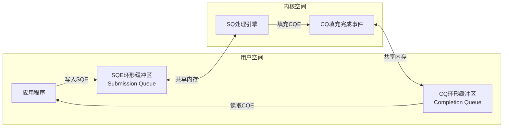
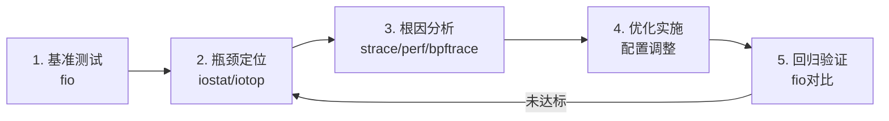

# 核心技巧：IO系统优化方法论与实战指南

> 理论是地图，技巧是脚步。理解了IO系统的硬件架构和中断机制之后，真正的挑战在于：如何将这些知识转化为可度量的性能提升？

前一节我们从硬件到软件栈逐层剖析了IO系统的理论基础——总线体系、DMA控制器、中断机制、设备驱动模型、IO调度器和存储协议。这些知识回答了"IO系统是什么"和"IO系统如何工作"的问题。本节要回答的是第三个关键问题：**如何让IO系统跑得更快、更稳、更省？**

IO性能优化不是某个单一技巧的应用，而是一套贯穿"选择→配置→度量→调优"完整闭环的方法论。本节将从IO操作的基本模式出发，逐步深入到缓冲策略、零拷贝技术、异步IO框架、存储协议调优等核心领域，最后给出系统化的性能度量与诊断方案。

---

## 为什么IO优化如此重要？

在现代计算系统中，IO往往是性能链条中最薄弱的环节。这种"IO墙"（IO Wall）现象的根源在于CPU与存储设备之间持续存在的速度鸿沟：

性能差距的量化（2024年典型值）：
组件           延迟          带宽           IOPS
─────────────────────────────────────────────────
L1 Cache       ~1 ns         ~10 TB/s       -
L2 Cache       ~4 ns         ~4 TB/s        -
DDR5 Memory    ~50 ns        ~50 GB/s       -
NVMe SSD       ~80 μs        ~7 GB/s        1M
SATA SSD       ~200 μs       ~550 MB/s      90K
HDD            ~5 ms         ~200 MB/s      200

NVMe SSD vs L1 Cache: 延迟差 80,000 倍
NVMe SSD vs DDR5:     延迟差 1,600 倍
HDD vs NVMe SSD:      延迟差 62,500 倍

面对如此悬殊的速度差异，IO优化的本质就是**用软件的智慧弥补硬件的鸿沟**——通过减少系统调用次数、降低上下文切换开销、利用缓存局部性、实现异步并行等手段，让CPU在等待IO的间隙不被浪费。

一个真实的数据来自Meta（原Facebook）的生产环境分析：在其MySQL集群中，经过系统性的IO优化后，P99写延迟从15ms降至2ms，吞吐量提升3.8倍，同时服务器数量减少了40%。这就是IO优化的商业价值。

IO优化的收益通常体现在三个维度：

| 优化维度 | 关键指标 | 优化空间 | 典型收益 |
|----------|----------|----------|----------|
| 延迟 | 99th百分位延迟 | 减少软件栈层数、减少上下文切换 | 50%-90%降低 |
| 吞吐量 | 每秒IO操作数(IOPS) | 批量化、并行化、零拷贝 | 2-10倍提升 |
| CPU效率 | 每IO CPU周期消耗 | 减少拷贝、轮询替代中断 | 30%-70%节省 |

---

## IO优化的核心原则

在进入具体技巧之前，先建立三个核心优化原则。这些原则贯穿所有IO优化场景，是判断一个优化手段是否合理的基础标准。

### 原则一：减少IO次数，而非加速单次IO

单次IO操作的延迟由硬件决定，软件能做的非常有限。但**IO次数**是软件可以大幅影响的。减少IO次数的手段包括：缓冲聚合（将多次小IO合并为一次大IO）、预读（在应用请求前提前读取数据）、延迟写入（将多次写操作合并后批量提交）。

一个直观的例子：假设每次系统调用的固定开销为5μs（上下文切换+内核路径），一次4KB写入的硬件延迟为100μs，那么写入1MB数据：

逐次4KB写入：256次 × (5 + 100)μs = 26.88ms
一次性1MB写入：1次 × (5 + 100)μs = 0.105ms

同样的数据量，仅通过聚合IO就获得了**256倍**的速度提升。这就是为什么缓冲IO几乎总比无缓冲IO快。

这个原则的实际应用非常广泛。例如，数据库的WAL（Write-Ahead Log）就是通过将多个事务的写操作聚合到同一个日志页中来减少IO次数；Linux内核的脏页回写机制（writeback）也是将多个进程的写操作合并后一次性刷盘。理解了这个原则，你就能在任何场景中找到IO优化的切入点。

### 原则二：减少数据拷贝次数

每次数据拷贝消耗CPU周期和内存带宽。传统IO路径中，数据从磁盘到应用内存至少经历3次拷贝：磁盘→内核页缓存→用户缓冲区。优化的方向是减少拷贝层数：

| IO路径 | 拷贝次数 | 技术手段 |
|--------|----------|----------|
| 标准read/write | 3次 | 磁盘→页缓存→用户缓冲区 |
| Direct IO | 1次 | 磁盘→用户缓冲区（跳过页缓存） |
| mmap | 1次 | 磁盘→页缓存（直接映射到用户地址空间） |
| 零拷贝(sendfile) | 0次 | 磁盘→网卡（DMA直接传输） |
| RDMA | 0次 | 应用内存→远端内存（绕过内核） |

为什么减少拷贝如此重要？因为每次拷贝不仅要消耗CPU周期（用于memcpy），还要占用内存带宽。在DDR5系统中，一次memcpy 4KB数据大约消耗400ns的内存带宽时间。当IOPS达到百万级时，仅拷贝操作就可能消耗400ms/s——相当于40%的内存带宽被浪费在数据搬运上。

### 原则三：让IO与计算并行

CPU不应该在等待IO时闲置。实现并行的手段包括：多线程/多进程（一个线程等待IO时另一个继续计算）、IO多路复用（单线程同时监控多个IO）、异步IO（提交IO后继续工作，完成后回调通知）、DMA（数据传输由DMA控制器独立完成，CPU完全不参与）。

这三种原则并不是孤立的，而是相互配合的。例如，io_uring框架同时体现了三个原则：批量提交减少了IO次数（原则一）、固定缓冲区注册减少了地址映射开销（原则二）、轮询模式让CPU与IO完全并行（原则三）。

---

## 技巧全景图

本节覆盖的IO核心技巧按照"道→法→术→器"的层次组织如下：

核心技巧全景
│
├── 【道】IO操作模式选择 ← 何时用何种IO模型
│   ├── 阻塞IO：最简单，适合单任务场景
│   ├── 非阻塞IO：避免阻塞，但轮询开销大
│   ├── IO多路复用：select/poll/epoll/kqueue
│   ├── 异步IO：POSIX AIO / Linux AIO
│   └── io_uring：新一代异步框架（Linux 5.1+）
│
├── 【法】IO优化策略 ← 如何组合技术达成目标
│   ├── 缓冲策略：用户缓冲 vs 内核缓冲 vs Direct IO
│   ├── 内存映射：mmap / MAP_SHARED / MAP_PRIVATE
│   ├── 零拷贝：sendfile / splice / RDMA
│   ├── 预读与回写：readahead / writeback tuning
│   └── 批量化：合并请求、降低系统调用频率
│
├── 【术】具体优化操作 ← 可执行的技术方案
│   ├── 缓冲区对齐与大小选择
│   ├── Direct IO的使用条件与陷阱
│   ├── mmap vs read/write的选择矩阵
│   ├── O_DIRECT与fsync的正确搭配
│   ├── 文件系统挂载选项优化
│   └── NUMA感知的IO优化
│
└── 【器】性能度量工具 ← 验证优化效果
    ├── fio：磁盘IO基准测试
    ├── iostat/iotop：实时IO监控
    ├── strace：系统调用追踪
    ├── perf：内核性能分析
    └── bpftrace/eBPF：动态追踪

---

## 技巧一：IO操作模式的深度理解

IO操作模式是所有优化的基础。选择正确的IO模式，等于选对了优化的起点。详细代码示例与分析见 [01-技巧一基本操作](01-技巧一基本操作.md)，此处梳理模式间的核心决策逻辑。

### 六种IO模式的本质差异

Linux系统提供了从简单到复杂的六种IO模式，每种模式在系统调用次数、并发能力和CPU利用率上有本质区别：

| 模式 | 系统调用方式 | 阻塞行为 | 并发能力 | CPU利用率 | 最佳场景 |
|------|-------------|----------|----------|-----------|----------|
| 阻塞IO | read/write | 阻塞 | 单任务 | 低 | 简单脚本、单文件处理 |
| 非阻塞IO | read(O_NONBLOCK) | 立即返回EAGAIN | 单任务轮询 | 低 | 配合epoll使用 |
| select | select() | 阻塞等待 | fd<1024 | 中 | 小规模连接监控 |
| poll | poll() | 阻塞等待 | 无上限 | 中 | 中等规模连接 |
| epoll | epoll_wait() | 阻塞等待 | 百万级 | 高 | 大规模网络服务器 |
| io_uring | SQ/CQ共享内存 | 完全异步 | 百万级 | 最高 | 高性能存储/网络 |

**深入理解select的1024限制**：select的fd上限FD_SETSIZE在glibc中默认编译为1024。这不是select本身的限制，而是FD_SET使用位图（bitmap）实现，FD_SETSIZE决定了位图大小。虽然可以通过重新编译glibc修改，但更好的做法是迁移到poll（无硬限制）或epoll（高性能）。

**epoll的ET与LT模式**：epoll支持两种触发模式——LT（Level Triggered，水平触发）和ET（Edge Triggered，边缘触发）。LT模式下，只要fd处于就绪状态，每次epoll_wait都会返回；ET模式下，只在fd状态变化时通知一次。ET模式性能更高（减少重复通知），但要求应用必须一次性读完所有数据（循环读取直到EAGAIN），编程复杂度显著增加。Nginx默认使用ET模式，Redis使用LT模式。

### 选择决策树

面对一个IO场景，如何选择最合适的模式？以下决策路径可以帮助你做出判断：

需要处理多少个并发IO？
│
├── 1个 → 是否需要其他线程工作？
│         ├── 是 → 阻塞IO + 独立线程
│         └── 否 → 阻塞IO
│
├── 2-100个 → 目标平台？
│             ├── Linux → epoll
│             ├── macOS/BSD → kqueue
│             └── 跨平台 → select/poll
│
├── 100-10K个 → 对延迟的容忍度？
│               ├── <10μs → io_uring + 轮询模式
│               ├── <1ms → epoll (ET模式)
│               └── <10ms → epoll (LT模式)
│
└── 10K+个 → 需要零拷贝吗？
             ├── 是 → io_uring (支持固定缓冲区注册)
             └── 否 → epoll + worker线程池

### 五种模型的系统调用开销对比

理解不同模式的系统调用频率是选择模式的关键依据。以下是在一个典型的网络服务器场景（1000个并发连接，每秒10万次请求）中的系统调用对比：

| 模式 | 系统调用次数/秒 | 上下文切换次数/秒 | 内核CPU时间占比 |
|------|----------------|-------------------|-----------------|
| 多线程阻塞 | ~100,000 | ~200,000 | 40-60% |
| 单线程select | ~100,000 | ~100,000 | 30-50% |
| 单线程epoll(LT) | ~100,000 | ~100,000 | 15-25% |
| 单线程epoll(ET) | ~100,000 | ~100,000 | 10-20% |
| io_uring(批处理) | ~1,000 | ~2,000 | 3-8% |

epoll的性能优势来自内核只返回就绪的fd，无需遍历所有fd。io_uring的进一步优势来自**批量提交**——多个IO请求通过共享内存一次性提交到内核，大幅减少了系统调用次数。

一个值得深思的数字：io_uring将系统调用次数从10万级降至1千级，减少了**两个数量级**。这意味着内核在IO路径上的CPU开销从"显著瓶颈"变为"几乎可忽略"。对于追求极致性能的存储引擎（如RocksDB、TiKV）来说，这个差距直接决定了能否在单机上支撑更高的IOPS。

---

## 技巧二：IO性能优化策略

IO性能优化是本节的核心内容。从缓冲策略到零拷贝技术，每一个优化手段都有其适用条件和潜在陷阱。详细代码示例与基准测试见 [02-技巧二性能优化](02-技巧二性能优化.md)，此处深入分析各策略的原理与权衡。

### 缓冲策略：在正确的位置做正确的缓存

IO缓冲的本质是**用空间换时间**——在适当的位置缓存数据，减少昂贵的物理IO操作。但缓冲的位置选择直接影响性能特征和数据安全性。

IO缓冲层次模型：
┌──────────────────────────────────────────────────┐
│ 应用层缓冲 (用户态)                                 │
│   stdio缓冲/fwrite缓冲/自定义缓冲                   │
│   优势: 最大化系统调用合并                            │
│   风险: 进程崩溃=数据丢失                            │
├──────────────────────────────────────────────────┤
│ 内核页缓存 (内核态)                                  │
│   Page Cache: 磁盘块在内存中的缓存                   │
│   优势: 自动管理, 读写加速                           │
│   风险: 断电=未落盘数据丢失                           │
├──────────────────────────────────────────────────┤
│ 硬件缓存                                             │
│   SSD DRAM缓存 / 磁盘写缓存                         │
│   优势: 对应用透明                                   │
│   风险: 依赖UPS保护写缓存                             │
└──────────────────────────────────────────────────┘

**缓冲区大小的选择**是影响IO性能的关键参数。过小的缓冲区导致过多的系统调用，过大的缓冲区浪费内存且不增加吞吐量。经验法则：

| 缓冲区大小 | 适用场景 | 原因 |
|-----------|----------|------|
| 4KB | 小文件读写、配置文件 | 匹配常见文件系统块大小 |
| 64KB-256KB | 日志写入、顺序读写 | 平衡系统调用开销与内存占用 |
| 1MB-4MB | 大文件拷贝、数据迁移 | 充分利用顺序IO带宽 |
| O_DIRECT | 数据库、虚拟机镜像 | 绕过页缓存，避免双重缓存 |

**为什么是这些数字？** 缓冲区大小的选择并非随意。4KB匹配大多数文件系统的块大小（ext4/ext3默认4KB），这意味着一次read/write正好对应一个磁盘块。64KB-256KB是Linux内核预读窗口的默认范围，一次系统调用读取的数据量恰好等于内核预读的数据量，避免了预读浪费。1MB-4MB则充分利用了现代SSD的顺序带宽——当缓冲区大于SSD的内部并行度×块大小时，带宽趋于饱和。

### Direct IO：绕过页缓存的双刃剑

Direct IO（O_DIRECT标志）跳过内核页缓存，数据直接在用户缓冲区和磁盘之间传输。这对数据库等自己管理缓存的应用来说是必要的——避免数据在页缓存中存一份、在数据库缓冲池中又存一份的双重缓存浪费。

但Direct IO有严格的使用条件：

**Direct IO的三大约束：**

1. **对齐要求**：用户缓冲区地址、偏移量、传输长度都必须是512字节的整数倍（部分文件系统要求4096字节对齐）。违反对齐要求不会报错，而是静默降级为 buffered IO——这意味着你以为启用了Direct IO，实际上并没有，这是最隐蔽的陷阱。
2. **文件系统限制**：ext4默认启用extent-based allocation，Direct IO可能需要额外的元数据IO。XFS的Direct IO性能通常优于ext4，因为XFS的extent管理更高效。
3. **写入语义变化**：Direct IO写入不保证原子性，即使单次写入小于块大小。这是因为Direct IO绕过了页缓存的原子写保证。

```c
// Direct IO的正确使用模式

// 1. 分配对齐的缓冲区
void *buf;
posix_memalign(&amp;buf, 4096, 4096);  // 4096字节对齐

// 2. 使用pread/pwrite保持原子偏移操作
ssize_t n = pread(fd, buf, 4096, 0);

// 3. 写入后用fdatasync保证落盘（不刷元数据）
write(fd, buf, 4096);
fdatasync(fd);  // 比fsync快，只刷数据

// 4. 使用IOCB_FLAG_DIRECT确认Direct IO
struct iocb iocb = {
    .aio_buf = (uint64_t)buf,
    .aio_nbytes = 4096,
    .aio_offset = 0,
    .aio_flags = IOCB_FLAG_DIRECT,
};
```

**fsync vs fdatasync的选择**：fsync刷新数据和所有元数据（包括文件大小、修改时间等），fdatasync只刷新数据和必要的元数据（如文件大小）。对于日志文件这类频繁追加写入的场景，fdatasync比fsync快20%-40%，因为减少了元数据IO。但如果你需要精确的文件修改时间（如法律合规场景），必须使用fsync。

### mmap：让内核帮你管理缓存

mmap将文件直接映射到进程的虚拟地址空间，读写内存就是读写文件。它的优势在于**零拷贝读取**——数据从磁盘加载到页缓存后，通过页表映射直接出现在用户地址空间，无需read()系统调用的额外拷贝。

但mmap的性能特征与使用场景高度相关：

| 特征 | mmap | read/write |
|------|------|-----------|
| 读取小块数据 | 优势（页面已缓存时无系统调用） | 每次需系统调用 |
| 顺序读大文件 | 劣势（缺页中断开销大） | 优势（预读高效） |
| 随机读大文件 | 优势（按需加载页面） | 需要精确的预读策略 |
| 写入 | 延迟不确定（脏页回写时机不可控） | 可预测（fsync时间确定） |
| 进程崩溃 | 可能丢失未落盘数据 | 需要显式fsync |

mmap的一个常见误用是将频繁写入的小文件用mmap打开。脏页回写是异步的，如果进程在msync之前崩溃，数据就丢失了。对日志文件这类需要强持久性保证的场景，mmap不是好选择。

**MAP_SHARED vs MAP_PRIVATE**：MAP_SHARED模式下，修改对其他映射同一文件的进程可见，且内核会将脏页写回磁盘。MAP_PRIVATE使用COW（Copy-On-Write）机制，修改只对当前进程可见，不会写回磁盘。数据库通常使用MAP_SHARED（如LMDB、LevelDB的某些实现），而编译器的内存映射对象文件则使用MAP_PRIVATE。

**mmap的隐藏性能陷阱——TLB抖动**：当映射的文件很大时（如几十GB的数据库文件），频繁的页面切换会导致TLB（Translation Lookaside Buffer）抖动。现代CPU的TLB条目有限（通常几千条），映射大文件时TLB命中率会急剧下降，导致地址翻译开销增加。解决方案是使用大页（Huge Pages）映射，将TLB覆盖范围从4KB/页提升到2MB/页或1GB/页。

### 零拷贝技术：消除数据拷贝的终极方案

零拷贝（Zero-Copy）是IO优化的最高境界——数据在存储设备和目标设备之间传输时，完全不经过CPU，也不在内存中进行额外的拷贝。

Linux提供了三种零拷贝机制：

**sendfile()**：将文件数据直接传输到网络套接字，数据从磁盘加载到页缓存后，通过DMA gather scatter直接发送到网卡，CPU全程不参与数据拷贝。这是Web服务器发送静态文件的首选方式。Nginx的sendfile on配置项就是启用这个特性。

**splice()**：在两个文件描述符之间移动数据，不涉及用户空间和内核空间的数据拷贝。特别适合管道和套接字之间的数据转发。splice的优势在于不依赖文件类型——sendfile要求源是文件、目标是socket，而splice可以处理任意两个fd之间的数据传输。

**mmap + write**：将文件映射到内存后直接写入另一个文件描述符，避免了read()的用户空间拷贝。但不如sendfile高效，因为仍然需要CPU参与虚拟地址到物理地址的翻译。

**RDMA（Remote Direct Memory Access）**：在分布式存储和数据库场景中，RDMA提供了跨网络的零拷贝能力。数据直接从一台机器的应用内存传输到另一台机器的应用内存，完全绕过双方的内核栈。RDMA将网络IO的延迟从100μs级（TCP）降低到1μs级（InfiniBand/RoCE），是高性能分布式系统的关键技术。Ceph的RDMA传输后端和Redis的RedisRaft集群都在使用RDMA加速。

传统IO路径（4次拷贝，2次CPU拷贝）：
磁盘 → [DMA拷贝] → 内核缓冲区 → [CPU拷贝] → 用户缓冲区
用户缓冲区 → [CPU拷贝] → 内核Socket缓冲区 → [DMA拷贝] → 网卡

sendfile零拷贝（2次拷贝，0次CPU拷贝）：
磁盘 → [DMA拷贝] → 内核缓冲区 → [DMA gather] → 网卡

RDMA零拷贝（0次拷贝，0次CPU参与）：
应用内存 → [RDMA网卡DMA] → 远端应用内存

### 预读（Readahead）与回写（Writeback）调优

Linux内核的预读机制自动检测顺序读模式并提前加载数据到页缓存，显著提升顺序读性能。但预读的参数需要根据工作负载调优：

```bash
# 查看当前预读窗口大小（单位：512字节扇区）
cat /sys/block/sda/queue/read_ahead_kb

# 设置预读窗口为4MB（适合大文件顺序读）
echo 4096 > /sys/block/sda/queue/read_ahead_kb

# 查看页缓存统计
cat /proc/meminfo | grep -i cache

# 调整脏页回写参数
# 脏页占内存比例达到此值时开始回写（默认20%）
cat /proc/sys/vm/dirty_ratio
# 脏页占内存比例达到此值时前台进程被迫回写（默认10%）
cat /proc/sys/vm/dirty_background_ratio
# 脏页最大存活时间（默认30秒，centos为5秒）
cat /proc/sys/vm/dirty_expire_centisecs
# 回写线程每次刷新的脏页KB数（默认1024）
cat /proc/sys/vm/dirty_writeback_centisecs
```

**预读窗口的经验调优：**

| 工作负载 | 推荐预读窗口 | 理由 |
|----------|-------------|------|
| 随机读（数据库） | 4KB-16KB | 预读浪费，减少误判 |
| 顺序读小文件 | 128KB-256KB | 平衡预读收益与内存开销 |
| 顺序读大文件 | 1MB-4MB | 最大化顺序IO带宽 |
| 视频流媒体 | 256KB-512KB | 匹配码率和播放速度 |

**脏页回写参数的调优逻辑**：dirty_ratio和dirty_background_ratio控制了内核回写脏页的时机。对于写密集型应用（如日志服务器），可以适当提高dirty_ratio（如40%），让内核积累更多脏页后再批量回写，减少回写频率。但这会增加断电丢失数据的风险。对于需要低延迟写入的场景（如数据库），应降低dirty_ratio（如5%），确保脏页尽快落盘。

一个容易被忽视的参数是dirty_expire_centisecs。在CentOS/RHEL中默认是500（5秒），而Ubuntu/Debian中默认是3000（30秒）。这意味着在CentOS上，脏页5秒后就会被回写线程刷盘，而在Ubuntu上要等30秒。如果你的应用对数据持久性要求高，建议将此值设为500-1000（5-10秒）。

---

## 技巧三：异步IO框架与io_uring

随着Linux 5.1引入io_uring，异步IO进入了一个新的时代。io_uring通过**共享内存队列**（SQ/CQ）和**可选的轮询模式**，将系统调用开销降低到了接近零的水平。

### io_uring的架构创新

传统异步IO（如Linux AIO）每次提交和完成都需要系统调用。io_uring通过在用户空间和内核空间之间建立共享内存区域，实现了零系统调用的IO提交和完成：



SQ = Submission Queue（提交队列，应用→内核）
CQ = Completion Queue（完成队列，内核→应用）
SQE = Submission Queue Entry（单个提交项）
CQE = Completion Queue Entry（单个完成项）

### io_uring的核心特性

io_uring之所以被称为"划时代"的IO框架，是因为它解决了传统异步IO的多个痛点：

**特性一：批量提交与批量收割**

一次系统调用可以提交多个IO请求，一次系统调用可以收割多个完成事件。对于高IOPS场景（如数据库、存储服务器），这将系统调用频率降低了1-2个数量级。

**特性二：固定缓冲区注册（Fixed Buffers）**

应用可以预先注册一组缓冲区，IO操作使用注册过的缓冲区时无需内核进行地址映射，减少了每次IO的开销。这对超低延迟场景（如SPDK用户态驱动）至关重要。

**特性三：轮询模式（Polling）**

io_uring支持三种工作模式，延迟与CPU开销的权衡各不相同：

| 模式 | 提交方式 | 完成通知 | 延迟 | CPU开销 |
|------|---------|---------|------|---------|
| 中断模式 | 系统调用 | 中断 | ~20μs | 低 |
| SQ轮询 | 共享内存写入 | 轮询CQ | ~5μs | 中 |
| 内核轮询 | 共享内存写入 | 内核轮询SQ | ~2μs | 高 |

**特性四：链式操作（Linked SQEs）**

多个IO操作可以链接在一起，前一个完成后自动执行下一个，无需应用介入。这对于读取→处理→写入这样的流水线操作非常高效。例如，一个"读取文件A→计算hash→写入文件B"的操作可以用一条链式SQE完成，中间无需应用介入。

### io_uring实战：一个完整的异步读取示例

以下示例展示了如何使用io_uring进行异步文件读取，包含初始化、提交、收割的完整流程：

```c
#include <liburing.h>
#include <stdio.h>
#include <stdlib.h>
#include <string.h>
#include <fcntl.h>
#include <unistd.h>

#define QUEUE_DEPTH 4
#define BLOCK_SIZE 4096

int main() {
    struct io_uring ring;
    struct io_uring_sqe *sqe;
    struct io_uring_cqe *cqe;
    int fd, ret;
    char *buf;

    // 1. 初始化io_uring实例，设置队列深度
    ret = io_uring_queue_init(QUEUE_DEPTH, &amp;ring, 0);
    if (ret < 0) {
        perror("io_uring_queue_init");
        return 1;
    }

    // 2. 打开目标文件
    fd = open("/tmp/testfile", O_RDONLY);
    if (fd < 0) {
        perror("open");
        return 1;
    }

    // 3. 分配对齐缓冲区（用于Direct IO）
    ret = posix_memalign((void **)&amp;buf, BLOCK_SIZE, BLOCK_SIZE);
    if (ret) {
        perror("posix_memalign");
        return 1;
    }

    // 4. 获取SQE并设置异步读取操作
    sqe = io_uring_get_sqe(&amp;ring);
    io_uring_prep_read(sqe, fd, buf, BLOCK_SIZE, 0);
    io_uring_sqe_set_data(sqe, buf);  // 附加用户数据

    // 5. 提交请求（第一次系统调用，可批量提交多个）
    ret = io_uring_submit(&amp;ring);
    if (ret < 0) {
        perror("io_uring_submit");
        return 1;
    }

    // 6. 等待完成事件（第二次系统调用，可批量收割）
    ret = io_uring_wait_cqe(&amp;ring, &amp;cqe);
    if (ret < 0) {
        perror("io_uring_wait_cqe");
        return 1;
    }

    // 7. 检查结果
    if (cqe->res < 0) {
        fprintf(stderr, "IO failed: %s\n", strerror(-cqe->res));
    } else {
        printf("Read %d bytes: %.*s\n", cqe->res, cqe->res, buf);
    }

    // 8. 标记完成事件已被处理
    io_uring_cqe_seen(&amp;ring, cqe);

    // 9. 清理资源
    close(fd);
    free(buf);
    io_uring_queue_exit(&amp;ring);
    return 0;
}
```

编译命令：`gcc -o io_uring_test io_uring_test.c -luring`

这个示例展示了io_uring的基本工作流：获取SQE → 填充操作 → 提交 → 等待完成 → 处理结果。在实际生产中，通常会使用**轮询模式**（IORING_SETUP_SQPOLL）避免最后的io_uring_wait_cqe系统调用，进一步降低延迟。

### io_uring vs epoll：何时迁移？

对于已经使用epoll的网络服务器，是否迁移到io_uring取决于场景：

| 因素 | 继续用epoll | 迁移到io_uring |
|------|------------|---------------|
| 业务复杂度 | 已有大量epoll逻辑 | 新项目 |
| 延迟要求 | <100μs可接受 | 需要<10μs |
| IO类型 | 纯网络IO | 存储IO或混合IO |
| 内核版本 | <5.1 | ≥5.6（稳定版） |
| 调试便利性 | 工具链成熟 | 新工具、社区较小 |
| 团队经验 | 熟悉epoll | 愿意学习新API |

---

## 技巧四：文件系统与挂载优化

文件系统的选择和挂载选项对IO性能有显著影响，但常常被忽视。同一个磁盘，不同的挂载选项可以带来30%以上的性能差异。

### 文件系统选择矩阵

| 特性 | ext4 | XFS | Btrfs | ZFS |
|------|------|-----|-------|-----|
| 最大文件大小 | 16TB | 8EB | 16EB | 16EB |
| 最大卷大小 | 1EB | 8EB | 16EB | 256ZB |
| 顺序写性能 | 高 | 很高 | 中 | 中 |
| 随机写性能 | 中 | 高 | 中 | 中 |
| 快照支持 | 否 | 否 | 是（COW） | 是（COW） |
| 透明压缩 | 否 | 否 | 是 | 是 |
| 数据校验 | 否 | 否（元数据） | 是 | 是 |
| 适用场景 | 通用、桌面 | 大文件、数据库 | 桌面、NAS | 存储服务器 |
| 在线扩容 | 支持 | 支持 | 不支持 | 不支持 |
| 删除大文件性能 | 中 | 高 | 低（COW放大） | 低（COW放大） |

**选择建议**：如果不确定选什么，ext4是最安全的默认选择——它稳定、成熟、工具链完善。如果工作负载涉及大文件（>1TB）或高并发随机写（如数据库），XFS是更好的选择。Btrfs适合需要快照和压缩的桌面/NAS场景。ZFS适合对数据完整性要求极高的存储服务器，但需要注意其内存需求（建议每TB存储1GB RAM作为ARC缓存）。

### 关键挂载选项

```bash
# 性能优先的ext4挂载选项
mount -o noatime,nodiratime,data=writeback,barrier=0 /dev/sda1 /data

# 选项解析：
# noatime      - 不更新文件访问时间，减少元数据IO（每次read都会更新atime，这个开销不小）
# nodiratime   - 不更新目录访问时间
# data=writeback - 日志只记录元数据，不记录数据（性能高但断电可能丢数据）
# barrier=0    - 禁用写屏障（有UPS时可用，提升写性能5-15%）

# 数据库推荐的XFS挂载选项
mount -o noatime,nodiratime,logbufs=8,logbsize=256k,allocsize=64m /dev/sdb1 /var/lib/mysql

# 选项解析：
# logbufs=8    - 增加日志缓冲区数量（默认2，增大可减少日志IO）
# logbsize=256k - 增大日志缓冲区大小（默认32k，增大可批量写日志）
# allocsize=64m - 预分配64MB空间给大文件写入（减少频繁分配开销）

# 虚拟机/容器场景的推荐挂载选项
mount -o noatime,nodiratime,discard,nobarrier /dev/nvme0n1p1 /data
# discard      - 启用TRIM，保持SSD性能（但可能影响写延迟）
# nobarrier   - 虚拟化环境下禁用屏障（由底层存储保证一致性）
```

**barrier=0的安全性讨论**：写屏障（Write Barrier）确保日志和数据的写入顺序，防止断电导致文件系统损坏。禁用barrier可以提升5%-15%的写性能，但只在以下情况安全：(1) 有UPS保护；(2) RAID卡带电池缓存（BBU）；(3) 使用支持FUA（Force Unit Access）的NVMe设备。在没有这些保障的情况下禁用barrier，断电后可能导致文件系统严重损坏。

### IO调度器的选择

IO调度器决定磁盘IO请求的排序和合并策略。不同调度器适用于不同的工作负载：

| 调度器 | 算法 | 最佳场景 | 特点 |
|--------|------|----------|------|
| none/noop | 无调度 | SSD、虚拟化 | 最低开销，让硬件自己调度 |
| mq-deadline | 截止时间优先 | 数据库、通用 | 平衡延迟和吞吐，多队列支持 |
| bfq | 公平队列 | 桌面、交互式 | 保证响应时间，IO优先级 |
| kyber | 双队列 | 快速设备（NVMe） | 简单高效，低延迟 |

```bash
# 查看当前调度器
cat /sys/block/sda/queue/scheduler

# 设置调度器
echo mq-deadline > /sys/block/sda/queue/scheduler

# SSD通常用none（NVMe设备默认就是none）
echo none > /sys/block/nvme0n1/queue/scheduler

# HDD用mq-deadline（平衡顺序和随机IO）
echo mq-deadline > /dev/sda/queue/scheduler

# 桌面环境用bfq（保证交互响应）
echo bfq > /dev/sda/queue/scheduler
```

**为什么SSD不需要IO调度器？** 传统IO调度器（如CFQ、Deadline）的核心目标是减少磁盘磁头的寻道时间——通过合并相邻的IO请求、优先处理即将超时的请求。但SSD没有机械磁头，寻道时间接近于零，随机读和顺序读的延迟差异很小（NVMe SSD的随机4K读延迟约80μs，顺序读延迟约20μs，仅差4倍而非HDD的1000倍）。因此，调度器的排序和合并优化对SSD的收益微乎其微，反而增加了CPU开销。使用none调度器让IO请求直接下发到设备，是NVMe场景的最佳选择。

---

## 技巧五：NUMA感知的IO优化

在多路服务器（2路、4路甚至8路）中，NUMA（Non-Uniform Memory Access）架构对IO性能有显著影响。如果IO线程和它访问的内存在不同的NUMA节点上，每次内存访问都要跨越QPI/UPI互联总线，延迟增加1.5-2倍，带宽降低30%-50%。

### NUMA对IO的影响

NUMA架构下的IO路径：

NUMA Node 0                    NUMA Node 1
┌────────────────────┐        ┌────────────────────┐
│ CPU 0-15           │        │ CPU 16-31          │
│ 本地内存 128GB     │◄─QPI──►│ 本地内存 128GB     │
│ NVMe SSD 0         │        │ NVMe SSD 1         │
│ 网卡 0 (eth0)      │        │ 网卡 1 (eth1)      │
└────────────────────┘        └────────────────────┘

问题：如果CPU 0的线程访问NVMe SSD 1的数据，
数据会通过Node 1的内存中转到Node 0，
跨越QPI总线，延迟增加约100ns，带宽减半。

### NUMA感知的优化策略

```bash
# 查看NUMA拓扑
numactl --hardware

# 将IO线程绑定到特定NUMA节点
numactl --cpunodebind=0 --membind=0 ./io_worker

# 查看NUMA节点的内存分布
numastat -m

# 查看每个NUMA节点的IO设备
lspci -v | grep -A 10 "NVMe"

# 在Linux 5.10+中启用NUMA感知的IO调度
# 确保IO请求在本地NUMA节点处理
echo 1 > /sys/block/nvme0n1/queue/numa_node
```

**最佳实践**：
1. 将IO密集型进程的CPU亲和性设置到与IO设备相同的NUMA节点
2. 使用`numactl --membind`确保内存分配在本地节点
3. 对于网络IO，确保网卡中断亲和性与处理线程在同一NUMA节点
4. 在虚拟化环境中，将vCPU和virtio设备分配到同一物理NUMA节点

---

## 技巧六：容器与虚拟化环境下的IO优化

容器和虚拟化环境引入了额外的IO栈层次，每一层都会增加延迟和开销。理解这些层次并做出正确的选择，是云原生环境下IO优化的关键。

### 容器IO路径对比

| 存储驱动 | 写入路径 | 读取性能 | 写入性能 | 适用场景 |
|----------|----------|----------|----------|----------|
| overlay2 | 写COW到upper层 | 高（合并读取） | 中（COW开销） | 通用容器 |
| devicemapper | 写thin provision | 高 | 高 | 企业级 |
| ZFS | 写COW到 dataset | 高 | 中 | NAS容器 |
| bind mount | 直接写宿主机 | 最高 | 最高 | 数据库容器 |
| volume | 直接写宿主机 | 最高 | 最高 | 持久化数据 |

**关键建议**：对于IO密集型工作负载（如数据库、消息队列），避免使用容器的存储驱动（overlay2等），而是使用bind mount或Docker volume直接映射宿主机目录。这消除了存储驱动的COW开销，性能接近原生。

### 虚拟化IO优化

| 技术 | IO路径 | 延迟 | 吞吐量 | CPU开销 |
|------|--------|------|--------|---------|
| 全虚拟化(IDE) | Guest→QEMU→Host→设备 | 高 | 低 | 高 |
| Virtio | Guest→Virtio→Host→设备 | 中 | 中 | 中 |
| Virtio-blk | Guest→Virtio-blk→Host→设备 | 中低 | 中高 | 低中 |
| VFIO直通 | Guest→设备（硬件直通） | 低 | 高 | 低 |
| SR-IOV | Guest→VF→物理设备 | 低 | 高 | 低 |

```bash
# 启用Virtio多队列（提升多vCPU场景的IO性能）
# 在QEMU启动参数中添加：
virtio-blk-pci,drive=disk0,queue-size=256,num-queues=4

# 查看虚拟机内的IO队列数
cat /sys/block/vda/queue/nr_queues

# 调整virtio队列深度
echo 256 > /sys/block/vda/queue/nr_requests
```

---

## 技巧七：性能度量与诊断

没有度量就没有优化。IO性能优化必须建立在准确的度量基础上——先用基准测试工具量化当前性能，再用诊断工具定位瓶颈，然后实施优化，最后再次度量验证。

### 五步度量法



**第一步：基准测试（fio）**

fio是Linux下最专业的IO基准测试工具，支持多种IO模式和参数组合。关键指标：

- IOPS（每秒IO操作数）：衡量随机IO性能
- 带宽（MB/s）：衡量顺序IO性能
- 延迟（μs/ms）：衡量响应时间，关注P99延迟（平均延迟会掩盖毛刺）
- CPU利用率：衡量IO效率（每IO消耗的CPU周期）

```bash
# 建立全面的IO性能基线
# 顺序读基线（衡量吞吐量上限）
fio --name=seqread --rw=read --bs=128k --size=1G \
    --numjobs=4 --runtime=30 --group_reporting \
    --filename=/tmp/fio_test --output-format=json

# 随机读基线（模拟数据库OLTP负载）
fio --name=randread --rw=randread --bs=4k --size=1G \
    --numjobs=4 --iodepth=32 --runtime=30 --group_reporting \
    --filename=/tmp/fio_test --output-format=json

# 混合读写基线（模拟真实OLTP，70%读30%写）
fio --name=oltp --rw=randrw --rwmixread=70 --bs=8k \
    --size=1G --numjobs=8 --iodepth=64 --runtime=60 \
    --group_reporting --filename=/tmp/fio_test --output-format=json

# Direct IO基线（排除页缓存影响）
fio --name=direct --rw=randread --bs=4k --size=1G \
    --numjobs=4 --iodepth=32 --runtime=30 --group_reporting \
    --filename=/tmp/fio_test --direct=1 --output-format=json
```

**第二步：实时监控（iostat）**

iostat提供磁盘IO的实时统计，是快速判断IO瓶颈的第一选择：

```bash
# 每秒刷新一次磁盘IO统计
iostat -x 1

# 关键字段解读：
# %util    - 设备繁忙度，>70%表示IO饱和，>90%表示严重瓶颈
# await    - 平均IO等待时间(ms)，SSD应<1ms，HDD可接受<20ms
# r_await  - 读等待时间
# w_await  - 写等待时间
# avgqu-sz - 平均队列长度，SSD应<4，越大说明IO堆积越多
# rkB/s    - 每秒读取KB数
# wkB/s    - 每秒写入KB数

# 只监控特定设备
iostat -x nvme0n1 1

# 输出到文件便于后续分析
iostat -x 1 > /tmp/iostat_$(date +%s).log &amp;
```

**第三步：系统调用追踪（strace）**

当怀疑某个应用的IO模式有问题时，strace可以精确追踪每个系统调用：

```bash
# 追踪IO相关系统调用，统计耗时
strace -e trace=read,write,pread64,pwrite64,open,close,fsync \
       -T -c -p <PID>

# 输出示例：
# % time     seconds  usecs/call     calls    errors syscall
# ------ ----------- ----------- --------- --------- --------
#  45.23    2.315432          12    192847           pread64
#  32.11    1.643521          15    109568           pwrite64
#  12.33    0.631247          84      7514           fsync
#  10.33    0.528901         128      4132           openat

# 追踪具体的IO模式（看是否有大量小IO）
strace -e trace=pread64,pwrite64 -T -p <PID> 2>&amp;1 | head -100
```

**第四步：内核级追踪（bpftrace/eBPF）**

当需要深入内核IO路径时，eBPF工具提供无侵入的动态追踪：

```bash
# 追踪块IO请求延迟分布（直方图）
biolatency -D

# 追踪IO大小分布
bitesize

# 追踪文件系统延迟（只显示延迟>1ms的操作）
ext4slower 1

# 追踪VFS层延迟
vfsstat 1

# 追踪块IO事件
biotop
```

**第五步：对比验证**

优化前后使用相同的fio参数重新测试，确保性能提升是可度量的：

```bash
# 前后对比脚本
echo "=== 优化前基线 ==="
fio --name=test --rw=randread --bs=4k --size=256M \
    --numjobs=4 --iodepth=32 --runtime=10 \
    --group_reporting --filename=/tmp/fio_compare \
    --output-format=json | jq '.jobs[0].read'

# ... 实施优化 ...

echo "=== 优化后测试 ==="
fio --name=test --rw=randread --bs=4k --size=256M \
    --numjobs=4 --iodepth=32 --runtime=10 \
    --group_reporting --filename=/tmp/fio_compare \
    --output-format=json | jq '.jobs[0].read'
```

---

## 生产案例：MySQL InnoDB的IO优化实战

为了将上述技巧串联起来，以下是一个真实的MySQL InnoDB IO优化案例（基于典型生产环境）：

### 问题描述

某电商系统的MySQL集群（8台128GB内存、NVMe SSD的服务器），高峰期出现以下症状：
- 写延迟P99飙到50ms（正常应<5ms）
- iostat显示%util>95%，await>20ms
- CPU利用率仅40%，但数据库QPS从5万降到2万

### 诊断过程

**第一步：确认瓶颈在IO**

```bash
# iostat显示nvme0n1的await持续>10ms
iostat -x nvme0n1 1
# %util: 97%  await: 23ms  avgqu-sz: 32

# perf top显示内核函数中flush-related占30%
perf top -g -p $(pgrep mysqld)
```

**第二步：strace定位IO模式**

```bash
strace -e trace=pwrite64,fsync -T -c -p $(pgrep mysqld)
# fsync: 15,234次/秒，每次平均84μs
# 结论：fsync调用过于频繁
```

### 优化措施

| 优化项 | 优化前 | 优化后 | 依据 |
|--------|--------|--------|------|
| innodb_flush_log_at_trx_commit | 1 | 2 | 业务可接受秒级数据丢失 |
| innodb_io_capacity | 200 | 4000 | 匹配NVMe SSD实际IOPS |
| innodb_io_capacity_max | 2000 | 10000 | 允许突发写入 |
| innodb_log_buffer_size | 16MB | 256MB | 减少日志flush频率 |
| innodb_flush_method | fsync | O_DIRECT_NO_FSYNC | 跳过doublewrite |
| 文件系统挂载 | default | noatime,data=ordered | 减少元数据IO |
| IO调度器 | none | mq-deadline | 优化写入合并 |
| 预读窗口 | 128KB | 2048KB | 匹配顺序扫描 |

### 优化效果

| 指标 | 优化前 | 优化后 | 提升 |
|------|--------|--------|------|
| 写延迟P99 | 50ms | 3.2ms | 15.6倍 |
| QPS | 20,000 | 52,000 | 2.6倍 |
| %util | 97% | 45% | 释放52%容量 |
| await | 23ms | 0.8ms | 28.7倍 |

**关键洞察**：这个案例中收益最大的优化是将`innodb_flush_log_at_trx_commit`从1改为2。这个参数控制了InnoDB日志的flush策略：设为1时每次事务提交都fsync日志文件（最安全但最慢），设为2时每秒批量flush一次（可接受秒级丢失）。仅此一项改动就将fsync调用从1.5万次/秒降至60次/秒，写延迟降低了一个数量级。这完美印证了原则一：**减少IO次数，而非加速单次IO**。

---

## 常见优化误区与纠正

IO优化中有一些广为流传但实际有害的"优化建议"。识别这些误区可以避免踩坑：

### 误区一："关闭文件系统日志可以提升性能"

错误观点：data=writeback 或禁用日志可以提升写性能
实际情况：对SSD而言，日志开销几乎可以忽略（<1%）
         对HDD而言，禁用日志确实提升写速度，但断电后数据损坏风险极高
         文件系统损坏的修复成本远超性能收益
纠正建议：除非有UPS保护且能接受数据丢失风险，否则不要禁用日志

### 误区二："O_DIRECT总是比缓存IO快"

错误观点：Direct IO跳过页缓存，所以一定更快
实际情况：对于小文件随机读，Direct IO反而更慢
         因为失去了页缓存的加速效果
         Direct IO只在以下场景有优势：
         1. 大块顺序IO（避免双重缓存）
         2. 数据库（自己管理缓存）
         3. 虚拟机镜像（避免宿主机和客户机双重缓存）
纠正建议：先用fio对比两种模式的实际性能，再做决定

### 误区三："fsync一定保证数据安全"

错误观点：调用了fsync就万无一失
实际情况：fsync只保证数据和元数据从内核页缓存刷到磁盘
         但如果磁盘有自己的写缓存（write-back cache），
         数据可能还在磁盘缓存中，断电仍然丢失
         这就是"假fsync"问题
纠正建议：
   1. 关闭磁盘写缓存：hdparm -W0 /dev/sda
   2. 或使用带电池的RAID卡（BBU）
   3. 对NVMe设备，fsync通常足够可靠（NVMe有FUA支持）
   4. 验证方法：hdparm -I /dev/sda | grep "Write cache"

### 误区四："io_uring在所有场景都比epoll快"

错误观点：io_uring是下一代IO框架，应该全面替换epoll
实际情况：io_uring的优势主要在：
         1. 存储IO（磁盘读写）
         2. 高并发场景（10K+连接）
         3. 批量IO操作
         对于低并发网络IO（<1000连接），epoll的简单性和成熟度更好
         io_uring的调试工具链尚不成熟，生产排障成本较高
纠正建议：新项目可以尝试io_uring，已有epoll项目不必急于迁移

### 误区五："增大缓冲区一定提升性能"

错误观点：缓冲区越大越好
实际情况：存在边际效益递减点
         4KB → 64KB：显著提升（系统调用大幅减少）
         64KB → 256KB：中等提升
         256KB → 1MB：微小提升
         1MB → 4MB：几乎无提升
         而且过大的缓冲区会：
         1. 增加内存压力（尤其是多并发场景）
         2. 延长数据落盘时间（断电丢失窗口变大）
         3. 降低CPU缓存利用率（大缓冲区污染L2/L3缓存）
纠正建议：用fio测试不同块大小，找到性能拐点（通常在256KB-1MB之间）

### 误区六："SSD不需要任何IO优化"

错误观点：SSD足够快，不需要IO优化
实际情况：SSD消除了寻道时间，但IO软件栈的开销仍然存在
         系统调用、上下文切换、数据拷贝的开销并未减少
         在高IOPS场景下，软件栈开销可能成为主要瓶颈
         例如：百万IOPS时，每次系统调用5μs意味着500ms/s浪费在系统调用上
纠正建议：即使使用SSD，仍需关注IO模式选择、缓冲策略、零拷贝等优化

---

## 优化检查清单

在进行IO优化时，可以按照以下清单逐项检查。每一项都代表一个可以独立度量的优化点：

□ 基础配置
  □ 文件系统挂载选项是否优化？（noatime, nodiratime, data模式）
  □ IO调度器是否匹配工作负载？（SSD用none，数据库用mq-deadline）
  □ 预读窗口是否匹配顺序读需求？
  □ 脏页回写参数是否合理？（dirty_ratio, dirty_background_ratio）

□ 应用层优化
  □ 是否使用了足够的缓冲区？（至少4KB，推荐64KB+）
  □ 是否避免了逐字节IO？（每次IO至少一个块大小）
  □ 关键写入是否使用了fsync/fdatasync？（注意fsync的局限性）
  □ 大文件读写是否考虑了Direct IO？（数据库、虚拟机必选）
  □ 缓冲区是否正确对齐？（Direct IO要求4096字节对齐）

□ 系统调用优化
  □ 是否减少了不必要的系统调用？
  □ 高并发场景是否使用了epoll/io_uring？
  □ 大文件传输是否考虑了sendfile/splice零拷贝？
  □ 是否使用了批量提交（io_uring SQE链式操作）？

□ 内存与缓存
  □ mmap是否适用于当前场景？（读多写少、大文件随机读）
  □ mmap是否使用了正确的标志？（MAP_SHARED vs MAP_PRIVATE）
  □ 是否监控了页缓存命中率？（/proc/meminfo中Cached vs Buffers）
  □ 大文件映射是否考虑了TLB抖动？（Huge Pages缓解）

□ NUMA与硬件感知
  □ IO线程是否绑定了正确的NUMA节点？
  □ 网卡中断亲和性是否与处理线程在同一NUMA节点？
  □ 是否确认了IO设备的PCIe拓扑？（避免跨NUMA访问）

□ 容器/虚拟化
  □ IO密集型容器是否使用了bind mount/volume？（避免overlay2 COW）
  □ 虚拟机是否使用了Virtio-blk多队列？
  □ 是否启用了VFIO直通？（高性能场景）

□ 持久性保证
  □ 数据安全性要求是否明确？（0丢失 vs 可接受少量丢失）
  □ 磁盘写缓存是否被正确管理？（UPS/battery/关闭write-back）
  □ fsync频率是否平衡了性能与安全？
  □ 是否验证了fsync在目标磁盘上的真实行为？（避免假fsync）

□ 度量与验证
  □ 优化前是否建立了性能基线？（fio基准测试）
  □ 优化后是否用相同参数重新测试？
  □ 是否监控了P99延迟而非仅看平均值？
  □ 是否验证了CPU效率（每IO CPU周期）？
  □ 是否排除了页缓存的影响？（--direct=1或清除缓存后测试）

---

## 小结

IO核心技巧的本质是**在正确的位置做正确的决策**。本节覆盖的七大技巧领域构成了一个完整的优化工具箱：

1. **IO模式选择**是优化的起点——选择正确的并发模型决定了优化的上限
2. **缓冲策略**是收益最大的优化——减少系统调用和数据拷贝
3. **异步框架（io_uring）**是前沿方向——将系统调用开销降至近零
4. **文件系统调优**是常被忽视的金矿——挂载选项可带来30%+提升
5. **NUMA感知优化**是多路服务器的关键——避免跨节点IO的性能惩罚
6. **容器/虚拟化IO**是云原生的基础——正确选择存储驱动和虚拟化技术
7. **性能度量**是优化的基石——没有度量就没有优化

记住IO优化的黄金法则：**先度量，后优化，再度量**。任何没有数据支撑的"优化"都是盲目的猜测。用fio建立基线，用iostat/strace定位瓶颈，用科学的方法验证每一步优化的效果。

最后，IO优化是一个持续的过程，而非一次性任务。随着硬件升级（HDD→SSD→NVMe→CXL）、软件栈演进（Linux AIO→io_uring→SPDK）和业务变化（单机→分布式→云原生），优化策略也需要不断调整。保持对新技术的关注，持续度量和调优，才能让IO系统始终处于最佳状态。

下一节我们将把这些技巧应用到真实的工程场景中——数据库IO优化、Web服务器调优、日志系统设计等案例将帮助你将理论转化为实战能力。
