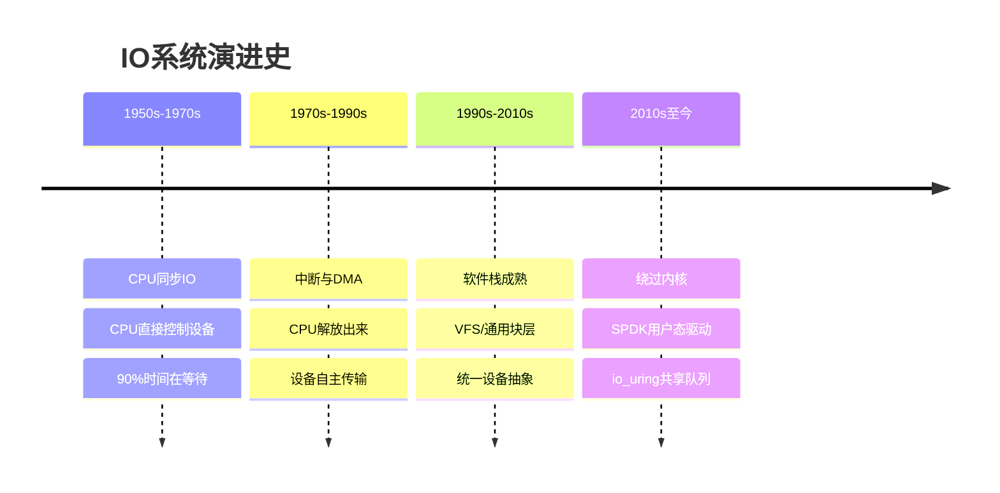
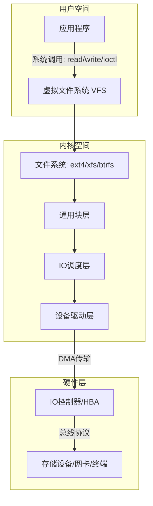
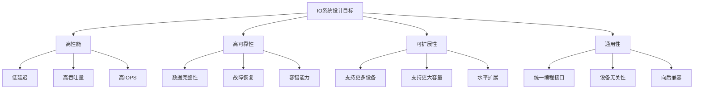

# 什么是IO系统

## 引言：为什么IO系统如此重要

在计算机系统的三大核心子系统——CPU、内存、IO——中，IO系统是最复杂、最被低估、也最容易成为性能瓶颈的一环。一个直观的对比可以帮助理解这种复杂性：

| 子系统 | 操作延迟 | 技术复杂度 | 关键挑战 |
|--------|----------|------------|----------|
| CPU | 纳秒级（~0.3ns/周期） | 高（微架构、分支预测） | 指令级并行 |
| 内存 | 十几纳秒（~10-50ns） | 中（缓存层次、一致性） | 容量与速度平衡 |
| IO设备 | 微秒到毫秒级（~100ns-10ms） | 极高（异构设备、协议多样性） | 异构性与速度差异 |

CPU一次操作耗时约0.3纳秒，而一次HDD磁盘寻道需要约10毫秒——两者相差约3300万倍。这意味着如果CPU发出一次磁盘读请求后原地等待，这段时间内CPU本可以执行约3300万条指令。IO系统的核心使命就是：**在如此巨大的速度差距下，让CPU、内存和外部设备高效协作，而不是互相等待**。

这个速度差距并非一成不变。理解IO系统的历史演进，有助于我们明白现代IO架构中的每一个设计决策都不是凭空出现的，而是对特定时代性能矛盾的回应。

## IO系统的历史演进

### 从打孔卡到NVMe：IO范式的四次跃迁

**第一阶段：CPU同步IO（1950s-1970s）**

最早的计算机没有独立的IO控制器。CPU直接控制每个设备的电子信号——读一个字节的数据，CPU需要逐位检查设备状态、搬运数据。这种模式下，CPU的90%以上时间花在等待慢速设备上，计算资源被严重浪费。

**第二阶段：中断与DMA的引入（1970s-1990s）**

中断机制让CPU不必轮询设备状态，设备就绪时主动"敲门"通知CPU。DMA进一步解放了CPU——数据在设备和内存之间直接传输，CPU只在传输开始和结束时介入。这两个发明将CPU从IO等待中解放出来，奠定了现代IO系统的基础。

**第三阶段：层次化软件栈的成熟（1990s-2010s）**

随着设备种类激增（HDD、光驱、USB、网卡……），操作系统需要统一的抽象来管理所有设备。VFS（虚拟文件系统）、通用块层、IO调度器等软件层次逐步建立，形成了今天IO软件栈的基本骨架。Linux 2.6引入的as-ioscheduler（后来的CFQ）和块层重构，标志着IO软件栈的成熟。

**第四阶段：绕过内核的极致性能（2010s至今）**

当NVMe SSD将设备延迟压缩到微秒级后，软件栈本身反而成了瓶颈。Linux内核IO栈的一次调用需要经过10+个软件层次、多次上下文切换和内存拷贝，总开销可达15-40微秒——这在100微秒级的NVMe延迟中占比高达20%-40%。

这催生了两个划时代的IO范式：
- **SPDK（Storage Performance Development Kit）**：完全绕过内核，在用户空间直接操作NVMe设备，将存储IO延迟压缩到接近硬件极限
- **io_uring**：通过共享环形队列（Submission Queue + Completion Queue）减少系统调用次数，单次批量提交数百个IO请求，大幅降低内核开销

理解这条演进路径，就能明白为什么现代IO系统中既有传统的层次化架构，也有"绕过层次"的新范式——它们解决的是不同时代的问题。



## IO系统的定义与本质

### 什么是IO

IO（Input/Output，输入/输出）是计算机与外部世界交换数据的一切活动。从广义上看，任何不属于CPU运算和内存存储的操作都属于IO范畴：

- **存储IO**：读写硬盘、SSD、USB存储设备中的文件数据
- **网络IO**：通过网卡收发网络数据包
- **设备IO**：键盘输入、鼠标移动、屏幕显示、打印机输出
- **进程间通信IO**：管道（pipe）、共享内存、消息队列中的数据传输

需要注意的是，**网络IO**虽然在概念上属于IO范畴，但在操作系统实现中走的是完全不同的代码路径（网络协议栈 vs 块设备栈），本章主要聚焦于存储IO。网络IO将在后续章节单独讨论。

### 什么是IO系统

IO系统是由硬件和软件共同构成的完整子系统，负责在CPU、内存和各类外部设备之间高效、可靠地传输数据。它不仅仅是"读写磁盘"这么简单，而是一个涵盖了从物理信号到用户空间接口的完整技术栈。

IO系统的本质可以概括为三个核心功能：

1. **数据传输**：在设备和内存之间搬运数据（物理层）
2. **设备管理**：统一管理各类异构设备的生命周期和状态（管理层）
3. **抽象封装**：为上层应用提供统一的、与设备无关的编程接口（接口层）

这三个功能对应了IO系统设计中最核心的矛盾：**效率 vs 抽象**。越接近硬件，效率越高但接口越复杂；越接近用户，接口越简单但性能损耗越大。整个IO系统的设计史，就是在这对矛盾之间寻找最佳平衡点。



## IO系统的硬件基础

### 设备的异构性

IO系统面临的最大挑战是**设备异构性**。不同类型设备在速度、接口、数据组织方式上差异巨大：

| 设备类型 | 典型延迟 | 接口协议 | 数据单位 | 访问模式 |
|----------|----------|----------|----------|----------|
| NVMe SSD | 10-100μs | NVMe over PCIe | 4KB-128KB块 | 随机读写 |
| SATA SSD | 50-200μs | SATA/AHCI | 512B-4KB块 | 随机读写 |
| HDD | 3-10ms | SATA/SCSI | 512B-4KB块 | 顺序为主 |
| 网卡(NIC) | 1-100μs | PCIe | 数据包(64B-1500B) | 流式收发 |
| GPU | <1μs(显存访问) | PCIe x16 | 像素/顶点数据 | 批量流式 |
| USB设备 | 0.1-10ms | USB 2.0/3.0 | 字节流 | 控制/批量 |
| 键盘/鼠标 | 1-10ms | USB/HID | 事件数据 | 中断式 |

这些设备的速度差异跨越了**六个数量级**。IO系统的硬件架构设计，首要任务就是将这些差异封装在统一的抽象层之下。

### 总线体系：数据传输的高速公路

所有IO设备最终都通过**总线**连接到CPU和内存。现代计算机采用层次化的总线结构：

CPU（集成内存控制器 + PCIe控制器）
  │
  ├── 内存总线 ←→ DDR内存
  │
  ├── PCIe Root Complex
  │     ├── PCIe Lane x16 → GPU
  │     ├── PCIe Lane x4  → NVMe SSD
  │     ├── PCIe Lane x4  → 网卡
  │     └── PCIe Switch → 更多PCIe设备
  │
  └── PCH (Platform Controller Hub)
        ├── SATA → HDD/SSD
        ├── USB → 外设
        └── 其他低速总线

**PCIe（PCI Express）**是现代IO系统的总线基石。与传统PCI的共享并行架构不同，PCIe采用串行点对点连接，每个设备独享链路带宽：

| PCIe版本 | 单通道单向带宽 | x16双向总带宽 | 典型应用场景 |
|----------|---------------|---------------|-------------|
| PCIe 3.0 | 984.6 MB/s | 31.5 GB/s | 主流SSD、中端网卡 |
| PCIe 4.0 | 1.969 GB/s | 63 GB/s | 高性能SSD、高速网卡 |
| PCIe 5.0 | 3.938 GB/s | 126 GB/s | 企业级NVMe、AI加速卡 |
| PCIe 6.0 | 7.56 GB/s | 242 GB/s | 下一代高性能设备 |

值得一提的是，PCIe通道数是主板和CPU的重要规格参数。消费级CPU通常提供16-28条PCIe通道，服务器级CPU可提供64-128条。当多个高速设备共享有限的PCIe通道时，可能出现带宽争用——这是服务器架构设计中需要仔细规划的问题。

### DMA：解放CPU的关键机制

在没有DMA的时代，CPU需要亲自在设备和内存之间搬运数据（PIO模式，Programmed IO）。这意味着CPU在数据传输期间被完全占用，无法执行其他任务。

**DMA（Direct Memory Access，直接内存访问）**彻底改变了这一局面。DMA控制器可以独立完成设备与内存之间的数据传输，CPU只需要在传输开始前设置好参数（源地址、目标地址、传输长度），然后就可以去做其他事情，等传输完成后再处理结果。

DMA的工作流程：

1. CPU准备阶段：
   - 在内存中分配缓冲区
   - 将缓冲区物理地址、传输长度写入设备的DMA寄存器
   - 启动DMA传输命令

2. DMA传输阶段（CPU可以执行其他任务）：
   - DMA控制器通过总线直接读写内存
   - 数据在设备和内存之间高速传输
   - 传输完成后，DMA控制器更新状态寄存器

3. 完成阶段：
   - 设备通过中断通知CPU传输完成
   - CPU检查传输结果
   - 处理缓冲区中的数据

**Scatter-Gather DMA**进一步增强了DMA的能力。在现代操作系统中，大块内存在物理上往往是不连续的。Scatter-Gather DMA通过描述符链表（Descriptor Chain）让DMA引擎可以一次性处理多个不连续的内存片段：

描述符链表示例：
┌──────────┐    ┌──────────┐    ┌──────────┐
│ 地址: 0x1000│──→│ 地址: 0x5000│──→│ 地址: 0x9000│
│ 长度: 4KB  │    │ 长度: 4KB  │    │ 长度: 2KB  │
│ 下一个: →  │    │ 下一个: →  │    │ 结束       │
└──────────┘    └──────────┘    └──────────┘

DMA引擎依次传输：
  从物理地址0x1000读取4KB → 写入设备
  从物理地址0x5000读取4KB → 写入设备
  从物理地址0x9000读取2KB → 写入设备

**DMA与缓存一致性**是一个容易被忽视但至关重要的问题。CPU通过L1/L2/L3缓存访问内存，而DMA直接操作物理内存——当DMA将新数据写入内存时，CPU缓存中可能还保存着旧数据。现代CPU通过**缓存一致性协议（如MESI）**和**硬件缓存别名检测**来处理这个问题。操作系统在分配DMA缓冲区时，通常会将其标记为不可缓存（non-cacheable），或者在DMA传输完成后显式刷新（flush）CPU缓存，确保数据一致性。

## IO操作的三种基本模式

CPU与外部设备交互有三种基本模式，理解它们的差异是掌握IO系统的关键。

### 轮询模式（Polling）

CPU定期检查设备的状态寄存器，判断设备是否就绪。

轮询模式时间线：
CPU: [检查][检查][检查][检查][检查][就绪！处理]
      ↑        ↑        ↑
      空忙等待，浪费CPU周期

**优点**：实现简单；延迟确定且可控（适合实时系统）。

**缺点**：CPU在等待期间无法执行其他任务，资源浪费严重。

**适用场景**：超低延迟设备（如NVMe SSD在高IOPS负载下，轮询比中断更高效，因为中断本身的处理开销可能超过设备延迟）。

Linux中的轮询IO示例：

```c
// SPDK的轮询模式：CPU核心持续轮询NVMe队列
while (1) {
    struct spdk_nvme_cpl *cpl;
    // 非阻塞检查完成队列
    if (spdk_nvme_qpair_process_completions(qpair, 0) > 0) {
        // 处理完成的IO请求
        handle_completion(cpl);
    }
    // 继续轮询，不进入内核
}
```

### 中断模式（Interrupt）

设备就绪后主动向CPU发送中断信号，CPU暂停当前工作转去处理中断。

中断模式时间线：
CPU: [其他任务...][中断！][处理中断][返回继续...]
                          ↑
                      设备主动通知
设备: [准备数据...................][完成，发中断]

**优点**：CPU在等待期间可以执行其他任务，利用率高。

**缺点**：中断处理本身有开销（保存/恢复上下文、缓存污染），高频率中断会导致大量CPU时间花在中断处理上。

**中断合并（Interrupt Coalescing）**是解决高频中断问题的常用技术。设备不为每个IO操作单独发送中断，而是将多个完成事件合并为一次中断通知。网卡和NVMe控制器都支持这一特性——通过权衡延迟和中断开销，找到最佳合并阈值。

**适用场景**：大多数通用IO场景，尤其是延迟不极端敏感的场景。

### DMA模式（Direct Memory Access）

DMA模式结合了中断和直接传输的优势：CPU设置好DMA参数后完全释放，DMA控制器独立完成数据传输，传输完成后通过中断通知CPU。

DMA模式时间线：
CPU: [设置DMA参数][其他任务............][处理结果]
DMA:               [数据传输............][完成]
设备: [准备数据]→[DMA传输中]→[传输完成]

**优点**：CPU几乎不参与数据传输过程，效率最高。

**缺点**：需要DMA控制器硬件支持，需要处理缓存一致性问题。

**适用场景**：几乎所有现代高速设备（存储、网络、GPU）都使用DMA，这是现代IO系统的基本工作模式。

### 三种模式的综合对比

| 特性 | 轮询 | 中断 | DMA |
|------|------|------|-----|
| CPU参与度 | 全程参与 | 仅中断处理时 | 仅设置和完成时 |
| CPU利用率 | 低（忙等） | 中（中断开销） | 高（几乎无开销） |
| 实现复杂度 | 简单 | 中等 | 较高 |
| 延迟特性 | 确定性低延迟 | 依赖中断频率 | 取决于传输大小 |
| 适用设备 | 超低延迟设备 | 低速/中速设备 | 高速设备 |
| 实际应用 | SPDK轮询模式 | USB键盘/鼠标 | NVMe SSD、NIC、GPU |

## IO系统的软件栈

IO系统的软件栈是理解整个IO架构的核心线索。一次完整的IO操作需要经过多个层次的处理，每层都有明确的职责。

### 完整的IO软件栈

┌─────────────────────────────────────────────────┐
│                    应用程序                       │
│          read(fd, buf, count) / write(...)        │
├─────────────────────────────────────────────────┤
│              系统调用接口 (syscall)                │
│         sys_read() → vfs_read()                  │
├─────────────────────────────────────────────────┤
│             虚拟文件系统 (VFS)                    │
│    统一文件操作接口，屏蔽不同文件系统的差异          │
├─────────────────────────────────────────────────┤
│            具体文件系统 (ext4/xfs/btrfs)          │
│    文件→块映射，元数据管理，日志，分配策略          │
├─────────────────────────────────────────────────┤
│              通用块层 (Generic Block Layer)       │
│    bio请求合并，请求队列管理，IO统计               │
├─────────────────────────────────────────────────┤
│               IO调度层 (I/O Scheduler)            │
│    请求排序、合并、优先级、截止时间保证             │
├─────────────────────────────────────────────────┤
│           块设备多队列层 (blk-mq)                  │
│    软件队列→硬件队列映射，无锁提交                 │
├─────────────────────────────────────────────────┤
│              设备驱动层 (Device Driver)            │
│    NVMe驱动 / SCSI驱动 / VirtIO驱动              │
├─────────────────────────────────────────────────┤
│           硬件控制器 (IO Controller)               │
│    NVMe控制器 / HBA / NIC                        │
├─────────────────────────────────────────────────┤
│            存储介质 / 网络物理层                    │
│    NAND Flash / HDD盘片 / 光纤 / 网线             │
└─────────────────────────────────────────────────┘

### 各层开销分析

以一次4KB随机读操作在NVMe SSD上为例，各层引入的延迟：

| 层次 | 耗时 | 占比 | 说明 |
|------|------|------|------|
| 应用→VFS | ~1μs | ~1% | 系统调用进入内核 |
| 文件系统 | ~5-10μs | ~5-10% | 元数据查找、页缓存检查 |
| 通用块层+调度 | ~2-5μs | ~2-5% | 请求合并、排序 |
| blk-mq+驱动 | ~3-8μs | ~3-8% | 队列映射、命令构造 |
| 硬件控制器 | ~5-15μs | ~5-15% | 命令解析、闪存翻译层(FTL) |
| NAND闪存 | ~50-100μs | ~50-80% | 实际数据读取 |
| **总计** | **~80-140μs** | **100%** | |
| **其中软件栈开销** | **~15-40μs** | **~20-30%** | 这是可优化的部分 |

可以看到，在NVMe SSD上，软件栈开销占到了总延迟的20%-30%。这正是为什么SPDK、io_uring等技术致力于绕过或简化内核IO栈——在硬件延迟已经很低的情况下，软件栈的每一点优化都能显著提升性能。

### 虚拟文件系统（VFS）：统一的文件抽象

VFS是IO软件栈中最精妙的设计之一。它为所有文件系统提供了一个统一的接口，使得应用程序无需关心底层使用的是ext4、XFS还是NFS。

用户看到的：                     VFS抽象的：
/dev/sda1 (ext4)  ─────→        /
/dev/sda2 (xfs)    ─────→   统一的 open/read/write/close
nfs://server/share ─────→        接口
tmpfs (内存文件系统) ────→

VFS通过一组**操作函数表（operations）**实现这种抽象：

```c
// VFS的超级块操作（以ext4为例）
struct super_operations {
    struct inode *(*alloc_inode)(struct super_block *sb);  // 分配inode
    void (*destroy_inode)(struct inode *);                  // 销毁inode
    void (*dirty_inode)(struct inode *, int flags);         // 标记脏
    int (*write_inode)(struct inode *, struct writeback_control *); // 回写
    int (*sync_fs)(struct super_block *sb, int wait);       // 同步文件系统
    // ...
};

// VFS的文件操作
struct file_operations {
    loff_t (*llseek)(struct file *, loff_t, int);          // 定位
    ssize_t (*read)(struct file *, char __user *, size_t, loff_t *);  // 读
    ssize_t (*write)(struct file *, const char __user *, size_t, loff_t *); // 写
    int (*open)(struct inode *, struct file *);             // 打开
    int (*release)(struct inode *, struct file *);          // 关闭
    // ...
};
```

VFS的这种设计模式在软件工程中被称为**策略与机制分离**：VFS提供统一的机制（接口定义），具体文件系统实现各自的策略（数据如何组织和存储）。这种分离使得添加新的文件系统只需实现一组操作函数表，而不需要修改VFS核心代码。

### Page Cache：IO性能的倍增器

Page Cache（页面缓存）是Linux内核中最重要的IO优化机制，其核心思想极为简单：**用内存缓存磁盘数据，避免重复访问慢速设备**。

当应用程序读取文件时，内核首先检查数据是否已在Page Cache中。如果命中，直接从内存返回数据，延迟从磁盘的毫秒/微秒级降低到内存的纳秒级——**这是一到两个数量级的性能提升**。

Page Cache的工作原理：

应用程序 read(fd, buf, 4096)
    │
    ▼
VFS → 文件系统 → 检查Page Cache
    │                    │
    │  命中（~1-5μs）    │  未命中（~80-140μs）
    │     ↓              │     ↓
    │  直接从内存复制     │  构造bio → 磁盘IO → 数据写入Cache
    │  到用户空间         │     → 再复制到用户空间
    │                    │
    ▼                    ▼
   返回 4096 字节

**Page Cache的淘汰策略**基于LRU（最近最少使用）算法的变体。Linux使用**双链表（Active List + Inactive List）**管理缓存页面：

- 新读入的页面先进入Inactive List
- 被再次访问的页面"晋升"到Active List
- 当内存不足时，优先从Inactive List尾部淘汰页面
- 这种设计避免了纯LRU算法的"一次扫描污染整个缓存"问题

**Page Cache的写回（Writeback）机制**同样关键。当应用程序写入文件时，数据先写入Page Cache（此时write()系统调用立即返回，用户感知到的延迟极低），然后由内核后台线程（如`kworker`）定期将脏页刷回磁盘。这种**延迟写回**策略大幅提升了写入性能，但引入了一个风险：如果在写回之前系统崩溃，未刷回的数据会丢失。

Linux通过以下机制平衡性能和可靠性：

```bash
# 查看Page Cache状态
free -h              # 查看 buffers/cached 行
vmstat 1              # 观察 bi/bo（块IO读写）
cat /proc/meminfo     # 查看详细缓存信息

# 关键参数
cat /proc/sys/vm/dirty_ratio          # 脏页占内存比例阈值（默认20%）
                                       # 超过此值，写操作被阻塞直到写回完成
cat /proc/sys/vm/dirty_background_ratio # 后台写回触发阈值（默认10%）
                                       # 超过此值，后台线程开始异步写回
cat /proc/sys/vm/dirty_expire_centisecs # 脏页过期时间（默认30秒）
                                       # 超过此时间的脏页会被强制写回

# 对比缓存读和直接IO的延迟
# 缓存读（Page Cache命中）：
time dd if=/tmp/testfile of=/dev/null bs=4k count=10000
# 典型结果：~0.05秒

# 直接IO（绕过Page Cache）：
time dd if=/dev/nvme0n1 of=/dev/null bs=4k count=10000 iflag=direct
# 典型结果：~0.8秒（差距约16倍！）

# 强制清空Page Cache（仅用于测试，生产环境慎用）
echo 3 > /proc/sys/vm/drop_caches
```

**Page Cache的实战意义**：对于数据库、文件服务器等IO密集型应用，Page Cache的命中率直接决定了性能。MySQL的InnoDB引擎有自己的Buffer Pool（独立于Page Cache），但其底层仍然依赖Page Cache来缓存数据文件和日志文件。监控Page Cache命中率是IO性能调优的第一步。

### 现代IO范式：io_uring与SPDK

当软件栈开销占到IO延迟的20%-30%时，绕过或简化软件栈就成为了提升性能的关键路径。io_uring和SPDK代表了两种不同的优化思路。

**io_uring：减少系统调用开销**

传统的Linux IO模型中，每次read/write都是一个独立的系统调用——进入内核、执行操作、返回用户空间，这个上下文切换本身就需要数百纳秒。当IOPS达到数十万时，系统调用开销累积成显著的性能瓶颈。

io_uring通过**共享内存环形队列**解决了这个问题：

用户空间                          内核空间
┌────────────┐                 ┌────────────┐
│            │    SQ Ring      │            │
│  提交请求  │ ──────────────→ │  取出请求  │
│  (批量)    │                 │  执行IO    │
│            │                 │            │
│  收获结果  │ ←────────────── │  写入结果  │
│            │    CQ Ring      │            │
└────────────┘                 └────────────┘

关键点：
- SQ (Submission Queue)：用户写入IO请求，内核异步消费
- CQ (Completion Queue)：内核写入完成事件，用户异步读取
- 一次系统调用可以提交/回收数百个IO请求
- 甚至可以完全无系统调用（通过io_uring_enter的IORING_SETUP_SQPOLL模式）

io_uring的典型使用模式：

```c
// io_uring批量提交示例（简化）
struct io_uring ring;
io_uring_queue_init(256, &amp;ring, 0);

// 批量提交100个读请求
for (int i = 0; i < 100; i++) {
    struct io_uring_sqe *sqe = io_uring_get_sqe(&amp;ring);
    io_uring_prep_read(sqe, fd, bufs[i], 4096, offset[i]);
}
// 一次系统调用提交所有请求
io_uring_submit(&amp;ring);

// 批量收割完成事件
struct io_uring_cqe *cqe;
int completed = 0;
while (completed < 100) {
    io_uring_wait_cqe(&amp;ring, &amp;cqe);
    // 处理完成的IO
    process_completion(cqe);
    io_uring_cqe_seen(&amp;ring, cqe);
    completed++;
}
```

io_uring在Linux 5.1引入，经过6.x系列的持续完善，已成为Linux上高性能IO的事实标准。Kafka、PostgreSQL、Redis等主流应用都已集成io_uring支持。

**SPDK：完全绕过内核**

SPDK更激进——它完全绕过内核的IO栈，在用户空间直接操作NVMe设备。SPDK使用**UIO（Userspace IO）驱动**直接映射设备寄存器到用户空间，通过轮询模式处理IO完成事件，完全消除了系统调用和中断的开销。

SPDK的架构：

传统IO路径：
应用 → 系统调用 → VFS → 文件系统 → 块层 → 调度器 → 驱动 → 硬件
     └──── 内核态上下文切换 × N ────┘

SPDK路径：
应用 → 用户态NVMe驱动 → 直接操作硬件
     └── 零系统调用，零中断 ──┘

SPDK的典型应用场景：
- **高性能存储系统**：Ceph BlueStore、NVMe-oF target
- **数据库**：MySQL、RocksDB的SPDK存储后端
- **虚拟化**：VFIO设备直通，虚拟机直接访问NVMe

SPDK的代价是失去了内核提供的通用抽象（文件系统、权限管理、安全隔离），需要应用自行处理这些功能。因此SPDK更适合专用存储系统，而非通用应用。

## IO系统的性能指标

理解IO系统的性能需要从多个维度衡量，不同应用场景关注的指标可能完全不同。

### 核心性能指标

| 指标 | 定义 | 典型值范围 | 关注场景 |
|------|------|-----------|----------|
| **IOPS** | 每秒完成的IO操作数 | HDD: 100-200<br>SATA SSD: 10K-100K<br>NVMe SSD: 100K-1M | 数据库、虚拟化 |
| **吞吐量(Bandwidth)** | 每秒传输的数据量 | HDD: 100-200MB/s<br>SATA SSD: 500MB/s<br>NVMe: 3-14GB/s | 大文件、视频、备份 |
| **延迟(Latency)** | 单次IO操作的响应时间 | HDD: 3-10ms<br>SATA SSD: 50-200μs<br>NVMe: 10-100μs | 实时系统、交易系统 |
| **队列深度(QD)** | 同时在设备中处理的IO请求数 | QD1-QD32(常见)<br>NVMe理论QD64K | 高并发场景 |

### IOPS与吞吐量的关系

IOPS和吞吐量之间存在密切但非线性的关系：

吞吐量 = IOPS × IO块大小

示例（NVMe SSD，4KB随机读）：
  IOPS = 500,000
  块大小 = 4KB
  吞吐量 = 500,000 × 4KB = 2GB/s

示例（同一SSD，128KB顺序读）：
  IOPS = 30,000
  块大小 = 128KB
  吞吐量 = 30,000 × 128KB = 3.75GB/s

这解释了为什么HDD的顺序读吞吐量（150MB/s）远高于随机读IOPS（150 IOPS × 4KB = 0.6MB/s）——HDD的瓶颈在寻道延迟而非传输带宽。

理解这个关系对容量规划至关重要。很多人在评估存储性能时只关注IOPS数字，却忽略了IO块大小的影响。一个宣称"100万IOPS"的NVMe SSD，如果IO块大小从4KB增加到64KB，IOPS会大幅下降，但吞吐量可能反而更高。

### 延迟的组成与分布

IO延迟不是固定的，而是呈现长尾分布。一次IO操作的延迟由以下部分组成：

总延迟 = 软件栈延迟 + 队列等待延迟 + 设备处理延迟

其中：
├── 软件栈延迟：系统调用 + VFS + 文件系统 + 块层 + 驱动（通常较稳定）
├── 队列等待延迟：取决于队列深度和设备处理能力（波动较大）
└── 设备处理延迟：控制器处理 + 介质访问（取决于设备特性）

**延迟分布的典型特征**：

- **P50（中位数）**：50%的IO在此延迟内完成，反映典型体验
- **P95/P99**：尾延迟，反映最差情况。高P99延迟会导致"毛刺"（jitter）
- **P99.9/P99.99**：极端尾延迟，对SLA有严格要求的系统必须关注

尾延迟的来源多种多样：后台垃圾回收（GC）导致SSD性能短暂下降、操作系统调度延迟、中断合并带来的额外等待、NUMA远端内存访问等。对于延迟敏感型系统（如金融交易、在线游戏），控制尾延迟比提升平均性能更重要。

```bash
# 使用fio测量延迟分布
fio --name=latency_test \
    --ioengine=io_uring \
    --rw=randread \
    --bs=4k \
    --size=1G \
    --runtime=60 \
    --log_avg_msec=1 \
    --write_lat_log=latency_log

# 查看延迟直方图
fio --name=hist --ioengine=io_uring --rw=randread --bs=4k \
    --size=1G --runtime=10 --histonly
```

### IO性能分析工具集

掌握IO性能分析工具是每个系统工程师的基本功。以下是实战中最常用的工具：

**fio：IO性能基准测试的瑞士军刀**

fio（Flexible IO Tester）是最通用的IO基准测试工具，支持几乎所有IO引擎和访问模式：

```bash
# 典型数据库负载模拟（80%读/20%写，4KB随机IO，队列深度32）
fio --name=db_workload \
    --ioengine=io_uring \
    --rw=randrw \
    --rwmixread=80 \
    --bs=4k \
    --size=10G \
    --numjobs=4 \
    --iodepth=32 \
    --runtime=300 \
    --group_reporting

# 典型备份/大文件负载模拟（1MB顺序读，单线程）
fio --name=backup_load \
    --ioengine=libaio \
    --rw=read \
    --bs=1M \
    --size=100G \
    --numjobs=1 \
    --iodepth=4 \
    --runtime=60
```

**iostat：实时IO统计监控**

```bash
# 每秒刷新一次IO统计
iostat -xz 1

# 关键列解读：
# r/s, w/s      - 每秒读/写次数
# rkB/s, wkB/s  - 每秒读/写数据量（KB）
# await          - 平均IO等待时间（毫秒）
# %util          - 设备繁忙百分比（接近100%说明IO饱和）
# svctm          - 已废弃，不要使用
```

**blktrace：IO请求追踪**

```bash
# 追踪/dev/sda的IO事件（持续10秒）
blktrace -d /dev/sda -o trace -w 10

# 分析追踪结果
blkparse -i trace.blktrace.0 | head -50

# 可视化IO时序
# btt（blktrace分析工具）可以统计每层的延迟分布
btt -i trace.blktrace.0
```

**pidstat和iotop：按进程统计IO**

```bash
# 查看每个进程的IO使用率
iotop -oP

# pidstat的IO统计
pidstat -d 1

# 关键指标：
# kB_rd/s  - 每秒读取KB
# kB_wr/s  - 每秒写入KB
# iodelay  - IO延迟（时钟周期）
```

## IO设备分类

从操作系统管理的角度，IO设备可以按多种维度分类。

### 按数据访问方式分类

| 类型 | 特征 | 典型设备 | 操作系统抽象 |
|------|------|----------|-------------|
| **字符设备** | 字节流访问，无随机寻址 | 终端、串口、键盘、鼠标、GPU | `/dev/ttyS0`, `/dev/input/mouse0` |
| **块设备** | 块级访问，支持随机寻址 | HDD、SSD、光驱、RAM盘 | `/dev/sda`, `/dev/nvme0n1` |
| **网络设备** | 数据包收发，无设备文件 | 网卡(NIC) | 通过socket接口访问，无`/dev`入口 |

这三类设备在内核中的处理路径完全不同：

- **字符设备**：通过`cdev`结构注册，直接在`file_operations`中实现read/write
- **块设备**：通过`block_device`注册，经过通用块层、IO调度器、多队列层
- **网络设备**：通过`net_device`注册，使用sk_buff（socket buffer）机制，走网络协议栈

### 按IO行为分类

| IO模式 | 描述 | 延迟特征 | 吞吐特征 | 典型场景 |
|--------|------|----------|----------|----------|
| 顺序读 | 按地址顺序连续读取 | 低延迟 | 高吞吐 | 视频播放、日志读取 |
| 顺序写 | 按地址顺序连续写入 | 低延迟 | 高吞吐 | 日志写入、视频录制 |
| 随机读 | 随机位置读取 | 高延迟(HDD) / 低延迟(SSD) | 取决于IOPS | 数据库查询 |
| 随机写 | 随机位置写入 | 高延迟 | 取决于IOPS | 数据库更新 |

HDD和SSD在不同IO模式下的性能差异尤为显著：

HDD（机械硬盘）：
  顺序读: 200 MB/s
  随机读(4KB): 0.6 MB/s (150 IOPS)
  差距: 333倍 ← 机械寻道是瓶颈

NVMe SSD：
  顺序读: 7000 MB/s
  随机读(4KB): 2000 MB/s (500,000 IOPS)
  差距: 3.5倍 ← 闪存无机械部件

这种差异的本质原因在于：HDD的寻道时间（3-10ms）是固定的，与数据量无关——读4KB和读1MB都需要同样的寻道时间，因此小IO的效率极低。SSD通过闪存颗粒的并行访问消除了机械延迟，随机IO和顺序IO的差距大幅缩小。

## IO系统的挑战与设计目标

### 核心挑战

**1. 异构性管理**：如何在统一接口下管理速度差异六个数量级的设备。这不仅是技术问题，更是架构设计问题——每一层抽象都带来便利性，但也引入性能开销。

**2. 可靠性保障**：数据在传输过程中不能丢失或损坏。这涉及到DMA一致性、校验和、原子写等机制。现代存储设备通过ECC（错误校验码）保证数据完整性，操作系统通过日志文件系统（如ext4的journal）保证元数据一致性。

**3. 并发与性能**：多核CPU同时发起大量IO请求时，如何避免锁竞争和资源争用。现代方案如NVMe多队列（每个CPU核心独立的提交/完成队列）、io_uring共享环形队列，都是为了解决这一问题。

**4. 延迟与吞吐量的权衡**：中断合并可以提高吞吐量但增加延迟，IO调度可以优化顺序性但引入排队延迟。没有万能方案，需要根据场景选择。

**5. 虚拟化开销**：在云计算环境中，多个虚拟机共享物理IO设备，虚拟化层引入的额外开销是性能优化的关键。VirtIO、VFIO、SR-IOV等IO虚拟化技术是云计算基础设施的核心支撑。

**6. 数据一致性保证**：在断电、系统崩溃等异常情况下，如何保证数据不丢失、不损坏。文件系统日志（journaling）、写时复制（CoW，如Btrfs和ZFS）、电池备份缓存（BBU）等机制各有取舍，需要根据可靠性要求和性能目标选择。

### 设计目标：IO系统追求什么



这些目标之间存在天然的矛盾。例如，高可靠性（数据冗余、日志记录）会增加写入延迟；高性能（绕过内核栈）会牺牲通用性和安全性；可扩展性（分布式架构）会引入网络延迟。优秀的IO系统设计，是在特定应用场景下找到这些目标之间的最佳平衡点。

## 实际案例：一次文件读取的完整旅程

为了将上述概念串联起来，让我们跟踪一次`read()`系统调用从用户空间到硬件的完整路径。

以读取一个4KB文件块为例，假设文件存储在NVMe SSD上的ext4文件系统：

应用层：
  ssize_t n = read(fd, buf, 4096);

内核处理路径：
  1. 系统调用入口
     sys_read() → vfs_read()
  
  2. VFS层
     检查文件描述符 → 调用具体文件系统的read_iter
  
  3. ext4文件系统
     查找inode → 确定逻辑块号 → 检查Page Cache
     如果命中Page Cache（缓存命中）：
       直接从内存复制到用户空间 → 返回（~1-5μs，无需访问硬件）
     如果未命中（缓存未命中）：
       构造bio请求 → 提交到通用块层
  
  4. 通用块层
     bio请求可能与队列中其他请求合并
     → 传递给IO调度器
  
  5. IO调度层 (mq-deadline)
     按截止时间和位置排序请求
     → 提交到blk-mq软件队列
  
  6. blk-mq多队列层
     软件队列 → 映射到硬件提交队列
     → 构造NVMe命令
  
  7. NVMe驱动
     将命令写入提交队列 → 通知NVMe控制器
  
  8. NVMe控制器硬件
     从提交队列取出命令 → 通过FTL查找物理位置
     → 从NAND闪存读取数据 → DMA写入内存
  
  9. DMA完成
     数据到达内存 → NVMe控制器触发中断
     → CPU执行中断处理 → 完成bio请求
  
  10. 返回用户空间
      数据从内核缓冲区复制到用户空间buf → read()返回4096

这个过程中，**缓存命中**可以将延迟从~100μs降低到~1-5μs，这也是为什么文件系统缓存对性能如此关键。

```bash
# 查看Page Cache状态
free -h           # 查看buffers/cached
vmstat 1           # 观察bi/bo（块IO读写）
cat /proc/meminfo  # 查看详细缓存信息

# 强制绕过缓存读取（直接IO）
dd if=/dev/nvme0n1 of=/dev/null bs=4k count=1000 iflag=direct

# 对比缓存读和直接IO的延迟
# 缓存读：
time dd if=/tmp/testfile of=/dev/null bs=4k count=10000
# 直接IO：
time dd if=/dev/nvme0n1 of=/dev/null bs=4k count=10000 iflag=direct
```

## IO系统在现代计算中的地位

IO系统不仅仅是"读写磁盘"的工具，它是现代计算架构的核心支撑。

### 数据库系统

数据库的性能几乎完全取决于IO系统的性能。OLTP系统需要高IOPS（每秒数十万次随机读写），OLAP系统需要高吞吐量（每秒数GB的数据扫描）。MySQL的InnoDB引擎、PostgreSQL的WAL日志、Redis的AOF持久化，都深度依赖IO系统的特性。

以MySQL为例，InnoDB的Buffer Pool将热点数据缓存在内存中，大部分读操作不需要访问磁盘。但写操作必须保证持久性——每次事务提交都需要将redo log刷盘。因此，MySQL的写入性能直接受磁盘延迟（fsync延迟）限制。这就是为什么MySQL部署中，将redo log放在独立的高性能NVMe SSD上能显著提升写入吞吐量。

### 分布式存储

Ceph、HDFS、MinIO等分布式存储系统在物理IO之上构建了分布式抽象，但底层仍然受单节点IO性能的限制。网络IO（RDMA、TCP/IP）的延迟和带宽直接决定了分布式存储的可用性。RDMA（Remote Direct Memory Access）将DMA的概念扩展到网络——数据可以直接在两台服务器的内存之间传输，无需CPU参与，延迟可低至1-2微秒。

### AI与高性能计算

大规模模型训练需要GPU持续读取训练数据，IO带宽不足会导致GPU空等（IO-bound training）。现代AI训练集群将NVMe SSD直通给GPU（GPUDirect Storage），绕过CPU直接传输数据。NVIDIA的 Magnum IO 套件整合了GPUDirect Storage、Mellanox网络、NVMe-oF等技术，构建了从存储到GPU的高性能数据通路。

在大语言模型推理场景中，KV Cache的管理也涉及IO问题。当推理上下文长度超过GPU显存容量时，需要将部分KV Cache卸载到CPU内存或NVMe SSD上（即"Offloading"策略），IO延迟直接决定了推理延迟。

### 云原生与虚拟化

容器和虚拟机的IO性能直接影响应用体验。Kubernetes中的PersistentVolume（PV）通过CSI（Container Storage Interface）驱动对接底层存储，但每次IO操作仍然要经过完整的软件栈。在高密度容器环境中，多个容器共享物理IO设备导致的资源争用是性能调优的常见难题。

SR-IOV（Single Root I/O Virtualization）通过将一个物理网卡虚拟成多个独立的虚拟网卡（VF），让虚拟机直接访问硬件资源，绕过了虚拟化层的软件交换，网络IO性能接近裸机水平。

## 本节要点回顾

1. **IO系统的本质**是在速度差异巨大的CPU、内存和外部设备之间建立高效的数据传输通道，其设计演进反映了计算机体系结构从简单到复杂的必然趋势。

2. **DMA**是现代IO系统的基础机制，让CPU从数据搬运中解放出来。理解DMA与缓存一致性的关系，是理解IO性能问题的关键。

3. **IO软件栈**通过分层抽象将异构设备封装为统一接口，但每一层都引入延迟开销。Page Cache是其中最重要的性能优化层，命中率直接决定IO性能。

4. **三种IO模式**（轮询、中断、DMA）各有适用场景，现代系统以DMA为主，但在超低延迟场景下轮询模式仍有优势。

5. **性能指标**包括IOPS、吞吐量、延迟，它们之间存在非线性关系，需要根据场景权衡。理解IO块大小对IOPS的影响，是容量规划的基础。

6. **io_uring和SPDK**代表了现代IO优化的两个方向：io_uring通过共享队列减少系统调用开销，SPDK则完全绕过内核在用户空间操作设备。

7. IO系统是数据库、分布式存储、AI训练、云计算等关键技术的底层支撑，其性能直接决定了上层应用的上限。理解IO系统，是理解整个计算机系统的关键一环。
