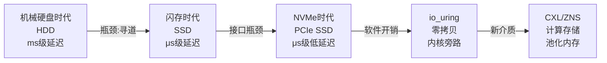
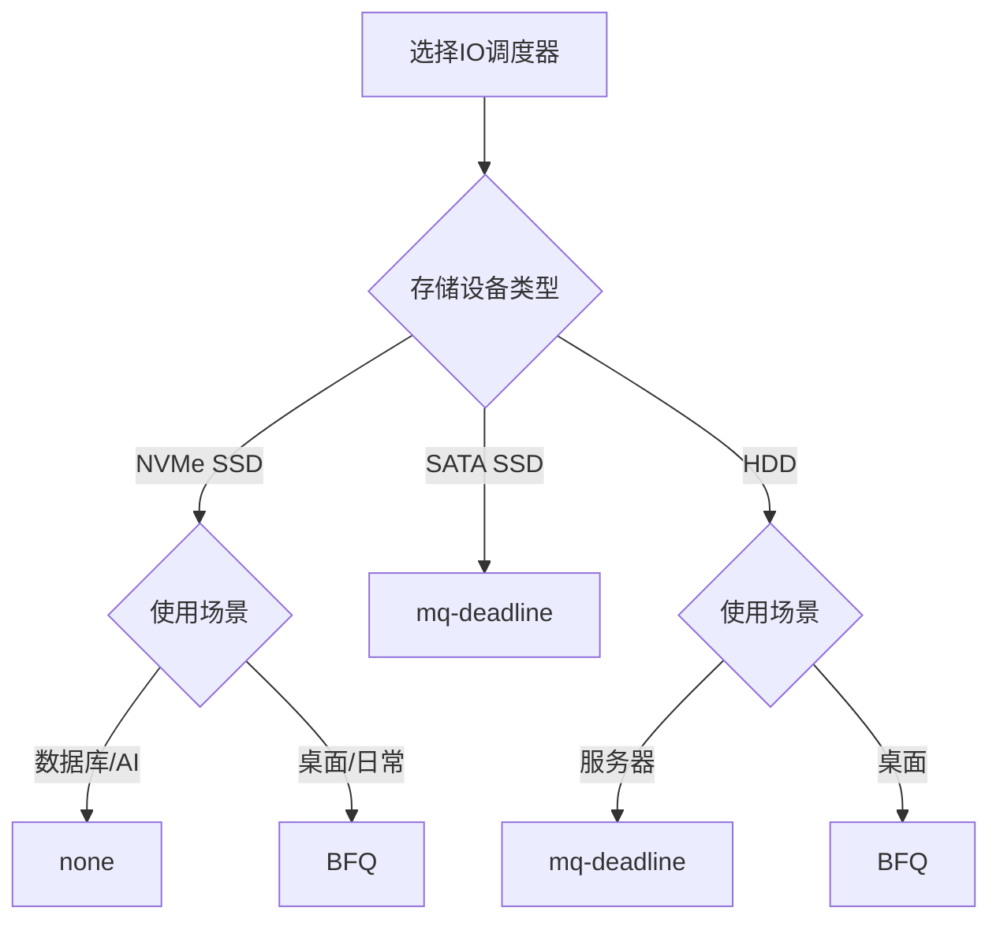

# IO技术演进

## 演进的底层逻辑：一切为了弥合速度鸿沟

上一节我们理解了IO系统的本质——在CPU与外部设备之间架起高效的数据桥梁。但这座桥并非一蹴而就，而是经历了半个世纪的持续演进。每一次技术跃迁，都源于同一个核心矛盾：**CPU的计算速度与外部设备的数据吞吐速度之间存在数量级的差距**。

这个矛盾催生了两条并行的演进路线：

1. **硬件路线**：用更快的存储介质和更宽的传输通道，从物理层缩短延迟、提升带宽
2. **软件路线**：用更聪明的调度算法和更少的系统调用开销，从逻辑层榨取每一纳秒的效率

理解这两条路线的交织演进，是掌握现代IO系统的关键。



## 存储介质演进：从磁片到硅晶

### 第一阶段：机械硬盘时代（1956—2010s）

1956年IBM推出RAMAC 305，使用50片24英寸铝盘，总容量仅5MB，重达一吨。此后半个世纪，HDD（Hard Disk Drive）统治了数据存储领域。HDD的核心工作原理是**电磁转换**：高速旋转的磁性盘片上，磁头通过改变磁畴方向来记录和读取数据。

**关键性能参数：**

| 参数 | 典型值 | 说明 |
|------|--------|------|
| 旋转速度 | 5400/7200/10000/15000 RPM | 转速越快，寻道延迟越低 |
| 平均寻道时间 | 3—15ms | 磁头移动到目标磁道的物理移动时间 |
| 旋转延迟 | 2—6ms（取决于转速） | 等待目标扇区旋转到磁头下方 |
| 顺序读写带宽 | 100—250 MB/s | 受限于磁头读取速率和转速 |
| 随机IOPS | 100—200 IOPS | 寻道+旋转等待是致命瓶颈 |
| 容量密度 | ~1 TB/in² | 仍在持续提升 |

**HDD的根本瓶颈在于机械运动。** 一次随机读操作需要经历三个物理过程：磁头寻道（机械臂移动）→ 等待旋转（盘片转到正确位置）→ 数据传输（磁头读取）。前两步受制于物理定律，无法突破机械运动的速度上限。这就是为什么HDD的随机IOPS只有百量级，而顺序带宽却能达到数百MB/s——顺序读不需要反复寻道。

**HDD时代催生了大量IO优化策略：**

- **磁盘调度算法**：电梯算法（SCAN）、循环扫描（C-SCAN）等，通过合并和排序IO请求减少磁头移动距离
- **磁盘缓存**：利用板载DRAM缓存热点数据，部分缓解随机访问延迟
- **RAID技术**：通过条带化（Striping）提升吞吐，通过镜像（Mirroring）提升可靠性
- **文件系统优化**：ext3/ext4的日志机制、XFS的extent分配，减少不必要的寻道操作

```bash
# HDD时代：查看磁盘物理参数
sudo hdparm -I /dev/sda | grep -E "Model|Rotational|Sector Size"
# Rotational: 1  表示机械盘
# 7200 RPM → 旋转延迟约 4.17ms (60/7200/2 ≈ 0.00417s)

# HDD随机IO性能基准测试
fio --name=hdd_random_read --ioengine=libaio --iodepth=32 \
    --rw=randread --bs=4k --size=1G --runtime=30 \
    --filename=/dev/sda --direct=1
# 预期结果：约 100-200 IOPS，延迟 10-30ms
```

### 第二阶段：闪存革命（2007—2015）

2007年，Intel和三星先后推出面向消费市场的SSD（Solid State Drive），标志着存储介质从磁性介质向半导体介质的根本转变。SSD使用NAND Flash芯片存储数据，**没有任何机械活动部件**，从根本上消除了HDD的寻道延迟和旋转延迟。

**NAND Flash的工作原理：**

NAND Flash通过在浮栅晶体管中注入或释放电荷来表示数据。每个存储单元（cell）可以存储1/2/3/4个比特，分别对应SLC、MLC、TLC、QLC四种类型：

| 类型 | 每cell比特 | 写入耐久(P/E cycles) | 读延迟 | 写延迟 | 成本 | 适用场景 |
|------|-----------|----------------------|--------|--------|------|----------|
| SLC | 1 | ~100,000 | ~25μs | ~200μs | 极高 | 企业级高耐久 |
| MLC | 2 | ~3,000 | ~50μs | ~600μs | 高 | 企业级混合负载 |
| TLC | 3 | ~500—3,000 | ~75μs | ~1,000μs | 中 | 消费级主流 |
| QLC | 4 | ~100—1,000 | ~100μs | ~2,000μs | 低 | 大容量冷存储 |

**SSD带来的性能飞跃：**

| 指标 | HDD (7200 RPM) | SATA SSD | 提升倍数 |
|------|----------------|----------|----------|
| 随机4K读IOPS | 100—200 | 80,000—100,000 | **500—1000x** |
| 顺序读带宽 | 150 MB/s | 550 MB/s | 3—4x |
| 随机读延迟 | 5—15ms | 50—100μs | **100—300x** |
| 功耗 | 6—10W | 0.5—3W | 3—5x |
| 抗震性 | 脆弱 | 坚固 | — |

SSD的随机IOPS提升高达三个数量级，这对数据库OLTP场景产生了革命性影响——过去需要在内存中缓存热点数据来规避HDD随机IO瓶颈的策略，在SSD时代变得不再必要。

**SSD自身的挑战：写放大（Write Amplification）。**

NAND Flash有一个物理限制：**不能原地覆盖写入，必须先擦除再写入**。擦除操作的最小单位（erase block）通常为256KB—4MB，而写入的最小单位（page）为4KB—16KB。这意味着即使只修改一个4KB的page，也可能需要读出整个block、修改目标page、擦除整个block、再写回全部数据。实际写入量远大于用户请求写入量，这就是**写放大（Write Amplification Factor, WAF）**。

写放大示意：
用户写入:     4 KB
实际NAND写入: 256 KB（整个erase block重写）
写放大因子:   WAF = 256 / 4 = 64x

WAF直接影响：SSD寿命（P/E次数被快速消耗）和写入性能

为应对写放大，业界发展出一系列关键算法：

- **FTL（Flash Translation Layer）**：逻辑地址到物理地址的映射层，是SSD控制器的核心软件组件
- **磨损均衡（Wear Leveling）**：均匀分布写入，避免某些block过早耗尽
- **垃圾回收（GC, Garbage Collection）**：回收包含无效数据的block，整理碎片空间
- **TRIM指令**：操作系统通知SSD哪些block不再使用，让GC更高效

```bash
# 查看SSD是否支持TRIM
sudo hdparm -I /dev/sda | grep TRIM
# 或
sudo lsblk -D /dev/sda   # 查看DISC-MAX列

# 手动触发TRIM
sudo fstrim -v /
# 或启用定期TRIM（fstab）
# /dev/sda1 / ext4 defaults,discard 0 1

# 查看SSD写入总量和寿命
sudo smartctl -A /dev/sda | grep -E "Data_Written|Lifetime_Writes"
```

### 第三阶段：NVMe突破接口瓶颈（2013—至今）

SSD解决了介质层面的速度问题，但早期SSD仍然使用SATA接口和AHCI协议——这套协议最初是为HDD设计的。AHCI的致命限制在于：**仅支持单个命令队列，队列深度最大32**。这意味着即使SSD内部具备极高的并行处理能力，也只能同时处理最多32个IO请求。

NVMe（Non-Volatile Memory Express）协议从根本上解决了这个问题：

| 特性 | AHCI (SATA) | NVMe (PCIe) |
|------|-------------|-------------|
| 传输通道 | SATA总线 (6Gbps) | PCIe总线 (32Gbps x4) |
| 命令队列数 | 1 | **65,535** |
| 队列深度 | 32 | **65,536** |
| 每条命令的寄存器操作 | 4次32位读写 | 无（内存映射） |
| 中断处理 | 共享中断 | MSI-X多核独立中断 |
| 最大带宽 | 600 MB/s | **7,880 MB/s** (PCIe 4.0 x4) |
| 延迟 | ~100μs | ~10μs |

NVMe的革命性在于三个方面：

1. **命令传输效率**：NVMe将命令提交和完成完全基于内存映射的环形队列（Submission Queue / Completion Queue），消除了AHCI需要的多次寄存器读写开销。一次IO操作的软件开销从AHCI的约6μs降低到NVMe的约2.5μs。

2. **并行性**：65,535个命令队列可以绑定到不同CPU核心，真正实现多核并行IO，消除了AHCI时代的单队列竞争瓶颈。

3. **PCIe直连**：绕过SATA控制器，直接通过PCIe总线与CPU通信，带宽从600MB/s提升到数GB/s。

**PCIe代际演进对存储带宽的影响：**

| 接口 | 带宽 (x4) | 典型设备 | 适用场景 |
|------|-----------|----------|----------|
| PCIe 3.0 x4 | 3.9 GB/s | 三星970 EVO Plus | 通用高性能 |
| PCIe 4.0 x4 | 7.9 GB/s | 三星980 PRO | 游戏/创意工作站 |
| PCIe 5.0 x4 | 15.8 GB/s | 三星990 EVO Plus | AI训练/HPC |
| PCIe 6.0 x4 | 31.5 GB/s | 预计2026+ | 下一代数据中心 |

```bash
# 查看NVMe控制器信息
sudo nvme id-ctrl /dev/nvme0n1 | grep -E "mn|sn|fr|sqslots|maxcmd"

# 查看当前PCIe连接速度和宽度
sudo lspci -v -s $(lspci | grep -i nvme | awk '{print $1}') | grep -i "lnk"

# NVMe性能基准测试（4队列×深度32）
fio --name=nvme_test --ioengine=io_uring --iodepth=128 \
    --rw=randread --bs=4k --size=1G --runtime=30 \
    --filename=/dev/nvme0n1 --direct=1 --numjobs=4
# 预期结果：500,000-1,000,000+ IOPS，延迟 <20μs
```

### 新兴存储技术展望

当前存储技术正处于新一轮变革的前夜：

| 技术 | 状态 | 核心特点 | 潜在影响 |
|------|------|----------|----------|
| ZNS SSD | 标准化阶段 | 应用直接管理zone，消除GC | WAF降至接近1，寿命和性能大幅提升 |
| Computational Storage | 早期部署 | 存储端计算（CSD） | 减少CPU-存储间数据搬运 |
| CXL.mem | 规范成熟中 | 基于CXL协议的内存池化 | 打破服务器内存墙，实现内存级存储 |
| DAOS | 生产就绪 | 分布式异步对象存储 | 面向百亿级文件的HPC场景 |
| MRAM/ReRAM | 实验阶段 | 非易失+DRAM级速度 | 可能终结存储/内存分界 |

**ZNS（Zoned Namespaces）** 值得特别关注。传统SSD的FTL需要维护复杂的逻辑-物理地址映射和垃圾回收，这不仅增加了延迟，还浪费了宝贵的NAND空间。ZNS将SSD内部存储空间划分为多个zone，每个zone必须顺序写入，应用可以直接控制数据放置位置。这相当于让应用承担了部分FTL的职责，换来的是几乎消除写放大（WAF≈1）、更低的延迟、更高的有效容量。

```bash
# 查看NVMe设备是否支持ZNS
sudo nvme id-ns /dev/nvme0n1 -H | grep "Zoned"
# 如果支持，查看zone信息
sudo nvme zoned-info /dev/nvme0n1
```

## IO软件栈演进：从阻塞到零拷贝

硬件在变快，但如果软件跟不上，硬件的潜力就无法释放。IO软件栈的演进同样是围绕着一个核心目标：**减少CPU在IO等待上的无效消耗**。

### 第一阶段：同步阻塞IO（1970s—1990s）

最原始的IO模型：进程调用`read()`后进入阻塞状态，直到数据到达内核缓冲区并复制到用户空间后才被唤醒。在Unix早期，这是唯一的IO方式。

```c
// 同步阻塞IO：线程在read处阻塞等待
char buf[4096];
ssize_t n = read(fd, buf, sizeof(buf));  // 阻塞！直到有数据
// 数据到达后才执行到这里
process_data(buf, n);
```

**致命问题：一连接一线程（thread-per-connection）。** 每个并发连接需要一个独立线程，每个线程大部分时间都在阻塞等待IO。当连接数达到数千时，线程上下文切换的开销本身就成为瓶颈。Apache HTTP Server在早期就受制于此，单机很难超过数千并发连接。

**适用场景**：低并发的本地文件IO，或连接数极少的简单服务。至今仍是默认模型——大多数应用调用`read()`时并不知道底层发生了什么。

### 第二阶段：IO多路复用（1983—2002）

**select/poll（1983/1997）：** 允许单个线程同时监听多个文件描述符的IO就绪状态。进程不再为每个连接分配一个线程，而是用一个线程同时监控多个连接。

```c
// select：单线程监控多个fd
fd_set read_fds;
FD_ZERO(&amp;read_fds);
FD_SET(fd1, &amp;read_fds);
FD_SET(fd2, &amp;read_fds);
FD_SET(fd3, &amp;read_fds);

select(max_fd + 1, &amp;read_fds, NULL, NULL, NULL);
// 检查哪些fd就绪
if (FD_ISSET(fd1, &amp;read_fds)) handle_client(fd1);
if (FD_ISSET(fd2, &amp;read_fds)) handle_client(fd2);
```

**select的O(n)问题**：每次调用select，内核需要遍历所有被监控的fd来检查就绪状态。当监控的fd数量从几十增长到数万时，这个O(n)遍历本身成为瓶颈。此外，select每次调用都需要将fd集合从用户空间复制到内核空间，进一步增加了开销。

**epoll（2002）：Linux的杀手锏。** epoll通过三个核心系统调用解决了select/poll的所有问题：

```c
// epoll三步走
int epfd = epoll_create1(0);  // 创建epoll实例

// 注册感兴趣的fd（仅需一次，O(logn)红黑树存储）
struct epoll_event ev = {
    .events = EPOLLIN,
    .data.fd = client_fd
};
epoll_ctl(epfd, EPOLL_CTL_ADD, client_fd, &amp;ev);

// 等待事件就绪（O(1)就绪通知，通过回调机制）
struct epoll_event events[MAX_EVENTS];
int n = epoll_wait(epfd, events, MAX_EVENTS, -1);
for (int i = 0; i < n; i++) {
    handle_client(events[i].data.fd);
}
```

epoll的关键创新：

| 特性 | select/poll | epoll |
|------|-------------|-------|
| 事件通知模型 | 轮询（每次遍历全部fd） | **回调（就绪fd主动加入就绪链表）** |
| 时间复杂度 | O(n) | **O(1)** |
| fd上限 | 1024 (FD_SETSIZE) | **系统内存允许的最大值** |
| 内存拷贝 | 每次调用都要拷贝fd集合 | **注册一次，后续仅拷贝就绪事件** |

epoll的出现直接催生了C10K问题的解决——单机轻松支持数万并发连接。Nginx、Redis、Node.js等高性能服务器都以epoll为核心事件驱动机制。

### 第三阶段：异步IO与事件驱动（2002—2015）

**Linux AIO（2002—2009）：** Linux内核尝试实现POSIX AIO接口，但实现存在严重缺陷——`io_submit()`在内部仍然可能阻塞（尤其是非O_DIRECT模式），且性能提升有限。这导致Linux AIO在很长时间内未被广泛采用，只有数据库等需要O_DIRECT的场景才使用。

**真正的异步IO需要满足三个条件：**

1. **提交不阻塞**：`io_submit()`立即返回，不等待IO完成
2. **完成通知**：IO完成后通过信号、回调或事件通知应用
3. **零拷贝**：数据直接在内核和用户空间之间传输，避免额外复制

在Linux上，满足所有三个条件的异步IO方案长期处于缺失状态。用户空间的libaio虽然是最接近的方案，但存在上述缺陷。

### 第四阶段：io_uring——统一的异步IO框架（2019—至今）

2019年，Jens Axboe（Linux内核IO维护者）提交了io_uring补丁，终于在Linux 5.1中合入主线。io_uring是Linux IO系统的一次范式级革新，它不仅是异步IO的解决方案，更是一个**通用的异步系统调用框架**。

**io_uring的核心架构：**

io_uring的核心设计是两个**共享内存环形队列**——提交队列（SQ, Submission Queue）和完成队列（CQ, Completion Queue）。用户空间直接写入SQE（Submission Queue Entry），内核直接写入CQE（Completion Queue Entry），整个过程**无需任何系统调用**（在默认的SQ轮询模式下）。

```c
// io_uring使用示例（简化）
struct io_uring ring;
io_uring_queue_init(256, &amp;ring, 0);

// 提交异步读请求
struct io_uring_sqe *sqe = io_uring_get_sqe(&amp;ring);
io_uring_prep_read(sqe, fd, buf, 4096, 0);
io_uring_sqe_set_data(sqe, user_data);
io_uring_submit(&amp;ring);  // 批量提交（1次系统调用提交N个请求）

// 收集完成事件
struct io_uring_cqe *cqe;
io_uring_wait_cqe(&amp;ring, &amp;cqe);
// cqe->res 包含读取的字节数
io_uring_cqe_seen(&amp;ring, cqe);
```

**io_uring相比传统IO模型的革命性突破：**

| 特性 | epoll + 异步read | Linux AIO | io_uring |
|------|------------------|-----------|----------|
| 系统调用次数 | 每次IO 2次（wait+read） | 每次1次（io_submit） | **0次（轮询模式）** |
| 批量提交 | 不支持 | 支持 | **支持，可一次提交数百请求** |
| 缓冲区管理 | 应用管理 | 应用管理 | **内核注册缓冲区（fixed buffers）** |
| 支持的操作 | 仅socket/file读写 | 仅O_DIRECT | **全面：读写、网络、定时器、同步** |
| 零拷贝sendfile | 需要splice | 不支持 | **内置零拷贝传输** |
| 多核扩展 | epollfd需在多线程间共享 | 每线程独立实例 | **多ring可绑定多CPU核心** |

**io_uring的零拷贝传输（MSG_ZEROCOPY）：**

传统网络发送文件需要经历：磁盘 → 内核页缓存 → 用户缓冲区 → 内核socket缓冲区 → 网卡。io_uring的零拷贝模式直接从内核页缓存传输到网卡，省去了两次数据拷贝和两次上下文切换。

```bash
# io_uring性能测试（对比epoll）
# 安装fio
apt install fio

# epoll模式基准
fio --name=epoll_test --ioengine=io_uring --fixedbufs \
    --registerfiles --hipri --iodepth=128 \
    --rw=randread --bs=4k --size=256m --runtime=30 \
    --filename=/dev/nvme0n1 --direct=1

# 典型结果对比（4K随机读）：
# epoll + libaio:  ~500K IOPS
# io_uring:        ~800K-1M+ IOPS  (提升60-100%)
```

**io_uring生态现状（截至2025年）：**

io_uring仍在快速演进中。Linux 5.6—6.10之间持续增加新特性：多轮询模式（SQPOLL/ICQ）、注册固定缓冲区、链式请求、超时控制、TCP接收/发送、epoll集成等。主要应用的适配情况：

| 应用/框架 | io_uring支持 | 说明 |
|-----------|-------------|------|
| fio | 完整支持 | 性能测试标杆 |
| Nginx | 实验性支持 | 需手动编译启用 |
| PostgreSQL | 开发中 | 社区活跃讨论 |
| Redis | 计划中 | 社区评估阶段 |
| S3QL/PolarDB | 支持 | 云原生数据库优先适配 |
| libuv | 支持 | Node.js可通过libuv间接使用 |

```bash
# 检查内核是否支持io_uring
uname -r  # 需要 >= 5.1
grep -i io_uring /proc/kallsyms | head -5  # 内核符号存在
ls /dev/io_uring* 2>/dev/null; echo "检查完成"

# 查看当前内核对io_uring的特性支持
# io_uring特性随内核版本持续增加：
# 5.1: 基础读写
# 5.6: fixed files, linked timeouts
# 5.11: registered buffers, multishot
# 5.19: io_uring for network send/recv
# 6.0+: splice, file clone
```

## IO调度器演进：从单一队列到多队列

IO调度器位于通用块层和设备驱动之间，负责决定IO请求的提交顺序。它的核心任务是：在保证公平性的前提下，最大化IO吞吐量。

### 单队列时代（2006—2016）

早期Linux使用单一请求队列，所有IO请求进入同一个队列，由调度器统一排序：

| 调度器 | 引入年份 | 核心算法 | 优势 | 劣势 |
|--------|----------|----------|------|------|
| **noop** | 2000 | 无调度，直接合并 | 最低CPU开销 | 无优化 |
| **deadline** | 2002 | 读写分开队列+截止时间 | 保证读延迟，防写饥饿 | 并发有限 |
| **cfq** | 2006 | 多优先级队列+时间片轮转 | 公平性最好 | 对SSD不友好 |

**CFQ（Completely Fair Queuer）** 是HDD时代的王者算法。它为每个进程维护独立的IO队列，通过时间片轮转确保所有进程公平地分享磁盘带宽。CFQ还实现了"空闲插入"优化——当磁盘空闲时预取下一个请求，减少磁盘寻道时间。

但CFQ的复杂度恰恰成了SSD时代的累赘。CFQ的排序、合并、时间片管理都是为HDD的机械特性优化的，SSD没有寻道延迟，这些优化不仅无用反而增加了CPU开销。

### 多队列革命（2017—至今）

2016年，Linux 4.12引入了**blk-mq（Block Multi-Queue）**框架，从根本上改变了IO调度的架构。blk-mq不再使用单一全局队列，而是为每个CPU核心维护独立的提交队列（software queue），直接映射到硬件队列（hardware queue），消除了多核竞争的锁开销。

基于blk-mq的新一代调度器：

| 调度器 | 引入版本 | 设计目标 | 核心机制 | 适用场景 |
|--------|----------|----------|----------|----------|
| **mq-deadline** | 4.11 | 通用性能 | deadline算法的多队列版本 | SATA SSD、SAS |
| **BFQ** | 4.12 | 桌面响应性 | 预算公平队列+进程权重 | 桌面、交互式 |
| **kyber** | 4.12 | 高性能NVMe | 令牌桶限流+双队列（读/写） | NVMe、高速SSD |
| **none** | — | 极致性能 | 无调度，直接下发 | 高端NVMe、数据库直通 |

```bash
# 查看当前IO调度器
cat /sys/block/nvme0n1/queue/scheduler
# 输出示例：[none] mq-deadline kyber bfq

# 切换调度器（立即生效，重启后恢复）
echo kyber > /sys/block/nvme0n1/queue/scheduler

# 持久化设置（重启后保留）
# Debian/Ubuntu
echo 'ACTION=="add|change", KERNEL=="nvme*", ATTR{queue/scheduler}="none"' \
    > /etc/udev/rules.d/60-io-scheduler.rules

# RHEL/CentOS
echo 'ACTION=="add|change", KERNEL=="sd*", ATTR{queue/scheduler}="mq-deadline"' \
    > /etc/udev/rules.d/60-io-scheduler.rules

# 选择建议：
# NVMe SSD → none（硬件调度器已足够高效）
# SATA SSD → mq-deadline（平衡吞吐和延迟）
# 桌面使用 → BFQ（保证UI交互流畅）
# 数据库 → none 或 mq-deadline（避免额外CPU开销）
# HDD → mq-deadline 或 BFQ（减少寻道）
```

**调度器选择的决策依据：**



## 硬件接口与协议演进：从串行到并行

IO接口是连接主机和存储设备的物理通道，其演进历程反映了"更快、更宽、更低延迟"的持续追求。

### 完整接口演进对比

| 接口 | 带宽 | 延迟 | 协议 | 队列 | 最大设备数 | 引入年份 |
|------|------|------|------|------|-----------|----------|
| PATA/IDE | 133 MB/s | ~5ms | ATA | 单队列深度1 | 2 | 1986 |
| SATA 1.0 | 1.5 Gbps (150 MB/s) | ~300μs | AHCI | 单队列深度32 | 1 | 2001 |
| SATA 2.0 | 3 Gbps (300 MB/s) | ~200μs | AHCI | 单队列深度32 | 1 | 2004 |
| SATA 3.0 | 6 Gbps (600 MB/s) | ~100μs | AHCI | 单队列深度32 | 1 | 2009 |
| SAS 3 | 12 Gbps | ~80μs | SCSI | 多队列 | 多路径 | 2013 |
| PCIe 3.0 x4 + NVMe | 32 Gbps (3.9 GB/s) | ~10μs | NVMe | 64K队列×64K深度 | — | 2013 |
| PCIe 4.0 x4 + NVMe | 64 Gbps (7.9 GB/s) | ~10μs | NVMe | 64K队列×64K深度 | — | 2017 |
| PCIe 5.0 x4 + NVMe | 128 Gbps (15.8 GB/s) | ~8μs | NVMe | 64K队列×64K深度 | — | 2022 |

**AHCI vs NVMe 的本质区别：**

AHCI（Advanced Host Controller Interface）是2004年为SATA硬盘设计的主机控制器接口协议。它的设计前提是"IO设备很慢"，因此采用了低效的寄存器访问方式——每次命令提交需要多次32位寄存器读写。

NVMe则完全不同。它将命令提交队列和完成队列映射到主机内存空间，CPU通过写入内存中的环形队列来提交命令，内核驱动通过读取内存中的完成队列来获取结果。整个过程无需经过PCIe配置空间的寄存器读写，**命令延迟从AHCI的约6μs降低到NVMe的约2.5μs**。

AHCI命令提交路径：
CPU → 内存(命令列表) → 写AHCI寄存器 → SATA控制器 → 硬盘
      ↑ 每次写寄存器 = 多次PCIe往返 (~1.5μs × N)

NVMe命令提交路径：
CPU → 写SQ门铃寄存器 → NVMe控制器 → SSD
      ↑ SQ/CQ在共享内存中，仅1次寄存器写入

### 未来：PCIe 6.0 与 CXL

PCIe 6.0（预计2026—2027年量产）将带宽提升至每通道64 GT/s（x4 = 32 GB/s），同时引入PAM4调制和Flit（Flow Control Unit）传输模式，使传输效率进一步提升。

CXL（Compute Express Link）则代表了一个更深远的变革——**打破存储与内存的边界**。CXL 2.0/3.0引入了CXL.mem协议，允许CPU通过CXL总线直接访问远端内存设备，实现内存池化和异构内存层级管理。这意味着未来的IO系统可能不再区分"存储"和"内存"，而是形成一个统一的、按延迟分层的字节寻址存储池。

```bash
# 查看PCIe版本和速度
sudo lspci -vv | grep -i "lnk"
# LnkCap: Speed 16GT/s (PCIe 4.0), Width x4
# LnkSta: Speed 16GT/s (PCIe 4.0), Width x4

# 查看CXL设备（如果存在）
sudo lspci -d c1aa: | head -5
# CXL联盟的设备ID前缀为 C1AA:xxxx
```

## 新兴技术趋势深度解析

### CXL：内存池化与异构计算

CXL是当前最有可能改变服务器架构的技术之一。传统的服务器架构中，每台服务器的内存是物理隔离的——即使一台服务器的内存只用了30%，另一台也无法使用空闲部分。CXL通过提供CPU与内存设备之间的高速缓存一致性互连，使得内存可以被池化和动态分配。

CXL 3.0引入了**内存共享和切换**功能，多个CPU可以同时访问同一内存池，内存控制器负责处理一致性问题。这对于AI训练、大数据分析等内存密集型工作负载意义重大——它们可以按需获取数十TB的池化内存，而无需为每台服务器配置过量的物理内存。

### DAOS：面向HPC的分布式异步对象存储

DAOS（Distributed Asynchronous Object Storage）是Intel开源的高性能分布式存储系统，专为百亿级小文件和大规模并行IO设计。与传统的POSIX文件系统不同，DAOS将数据存储为对象而非文件，利用SPDK和DPDK绕过内核协议栈，实现用户空间的低延迟IO。

DAOS已经在多个超算中心部署，包括美国能源部的Frontier超级计算机。它的核心创新包括：

- **无锁数据路径**：对象操作不涉及全局锁，天然支持高并发
- **端到端校验和**：从应用到存储全链路数据完整性保护
- **多级容错**：结合擦除编码和多副本，实现任意多节点故障恢复

### Storage Class Memory（SCM）

Intel Optane（基于3D XPoint技术）是Storage Class Memory的先驱产品。它填补了DRAM和NAND Flash之间的性能/容量/成本空隙：

| 参数 | DRAM | Optane PMem | NVMe SSD |
|------|------|-------------|----------|
| 延迟 | ~100ns | ~100ns（字节寻址） / ~10μs（块设备模式） | ~10μs |
| 容量 | 128GB—2TB/服务器 | 128GB—1TB/模组 | 1—8TB |
| 耐久性 | 无限 | 30+ DWPD | 1—3 DWPD |
| 每GB成本 | ~$3—5 | ~$1—2 | ~$0.1 |

虽然Intel已停产Optane产品线，但CXL.mem的兴起使得SCM理念得以延续——通过CXL协议挂接的高带宽存储级内存设备将成为未来服务器内存层级的重要组成部分。

## 演进趋势总结

回顾IO技术的半个世纪演进，可以总结出几条清晰的规律：

**1. 延迟持续压缩，但边际递减。**

HDD (10ms) → SATA SSD (100μs) → NVMe (10μs) → 未来 (<1μs)
    100x         10x              10x

从HDD到NVMe，延迟降低了1000倍。但进一步压缩的空间越来越小——受限于物理定律（光速传播延迟、NAND读写特性），存储延迟很难再降低一个数量级。未来的优化方向将从单一介质延迟转向**异构内存层级的智能数据放置**。

**2. 软件开销占比越来越大。**

在HDD时代，机械延迟（ms级）远大于软件开销（μs级），软件优化的收益有限。但在NVMe时代，存储介质延迟已降至10μs量级，而一次Linux系统调用的开销约0.5—1μs，软件栈的总开销可能占到IO总延迟的30—50%。这就是io_uring出现的根本原因——**当硬件足够快时，软件成为新的瓶颈**。

**3. 从通用到专用，再到融合。**

IO技术正从"一刀切"的通用方案向"按需定制"的专用方案演进。NVMe为高性能场景提供极致带宽和低延迟，ZNS为大规模存储提供数据放置控制，CXL为内存密集型场景提供池化内存。但这些技术并非互相替代，而是共存于一个异构的IO生态中。

**4. 软硬件协同设计成为主流。**

传统的IO系统设计是"硬件提供接口，软件在接口之上优化"。现代IO设计越来越强调软硬件协同——NVMe的多队列设计需要软件配合才能发挥并行性，io_uring的零拷贝需要存储设备支持特定特性，ZNS需要文件系统（如f2fs、btrfs）原生支持zone管理。**未来的IO优化不再是单纯的软件优化或硬件升级，而是端到端的协同设计。**

## 常见误区与纠正

| 误区 | 事实 | 纠正方法 |
|------|------|----------|
| "SSD不需要任何优化" | SSD仍受写放大、GC暂停、对齐问题影响 | 确保4K对齐、启用TRIM、监控SMART数据 |
| "NVMe一定比SATA快" | 顺序读场景下差距有限（受限于文件系统和应用层） | 测试随机IO才能体现NVMe优势 |
| "io_uring一定比epoll快" | 对低并发场景差异不大，epoll更成熟稳定 | 高并发(>10K连接)或高IOPS场景才值得迁移 |
| "调度器对SSD无影响" | 调度器影响IO合并和队列管理效率 | NVMe用none，SATA SSD用mq-deadline |
| "更多队列总是更好" | 队列过多增加上下文切换和内存开销 | 根据实际负载选择队列深度，监控利用率 |

## 实践指南：如何利用演进成果

理解IO技术演进的最终目的是指导实践。以下是针对不同场景的具体建议：

**1. 新购存储设备的选择**

预算充足 + 高性能需求 → PCIe 4.0/5.0 NVMe SSD（三星990 PRO、西数SN850X）
预算有限 + 通用需求   → SATA SSD（三星870 EVO、 Crucial MX500）
大容量冷存储          → HDD（西数金盘/红盘）+ NVMe SSD缓存
AI训练/HPC            → PCIe 5.0 NVMe RAID + CXL内存扩展

**2. IO调度器配置速查**

场景                    推荐调度器     配置命令
─────────────────────────────────────────────────────────
数据库服务器(NVMe)      none          echo none > /sys/block/nvme0n1/queue/scheduler
数据库服务器(SATA SSD)  mq-deadline   echo mq-deadline > /sys/block/sda/queue/scheduler
Web服务器              mq-deadline   同上
桌面/笔记本            BFQ           echo bfq > /sys/block/sda/queue/scheduler
虚拟机存储             mq-deadline   echo mq-deadline > /sys/block/*/queue/scheduler

**3. 监控与诊断工具箱**

```bash
# 实时IO监控
iostat -xz 1          # 每秒刷新IO统计
iotop -oP              # 按进程显示IO排行
biotop                 # BPF工具，更精细的块IO追踪

# 深度分析
blktrace -d /dev/nvme0n1 -o trace    # IO跟踪
btrace -d /dev/nvme0n1 | head -100    # 实时IO事件

# NVMe健康检查
sudo nvme smart-log /dev/nvme0n1      # SMART信息
sudo nvme error-log /dev/nvme0n1      # 错误日志
sudo nvme latency-log /dev/nvme0n1    # 延迟分布
```

掌握IO技术的演进脉络，不是为了记住年份和参数，而是为了理解**每一次技术变革背后的设计取舍**。当你面对一个具体的IO性能问题时，能够从介质、接口、调度、软件栈四个维度分析瓶颈所在，选择最适合的技术方案——这才是学习IO系统演进的真正价值。
