# 第04章：进程与线程 —— 章节概览

## 本章导读

如果你曾经思考过"为什么浏览器开了几十个标签页，每个标签都能独立加载页面"，或者"为什么一个Web服务器能同时处理数万个请求而不互相干扰"，又或者"为什么Go语言能轻松启动百万个goroutine而Java早期版本创建几千个线程就OOM了"——这些现象的答案都指向同一个核心机制：**进程与线程**。

进程与线程是操作系统中最基本、最重要的抽象概念，也是并发编程的基石。一个直观的对比可以说明二者的分量：一次进程上下文切换约需3-15微秒，看似微不足道，但当系统中有上万个活跃进程时，上下文切换本身就会消耗大量CPU时间——这就是为什么高并发服务器不能简单地为每个请求创建一个进程，而必须采用线程池、事件驱动或协程模型。

更深层地说，进程与线程的设计直接影响着操作系统的四大核心能力：**资源隔离**（进程间内存不互相影响）、**并发执行**（多个任务同时推进）、**通信协作**（进程间交换数据）和**性能优化**（调度策略决定响应速度和吞吐量）。无论是编写一个高并发的Web服务器，设计一个分布式任务调度系统，还是优化一个数据库的查询性能，对进程与线程机制的深入理解都是不可绕过的前置知识。

本章将从操作系统内核视角出发，系统性地讲解进程与线程的理论模型、调度策略、同步机制和现代并发范式。无论你是想理解Linux内核如何管理进程调度，还是想搞清楚Go的GMP调度模型如何工作，或者想在实际项目中避免死锁和竞态条件——这一章都将为你提供扎实的理论基础和实操指导。

## 学习目标

完成本章学习后，你将能够：

1. **理解进程核心概念**：掌握进程控制块（PCB/task_struct）的完整结构，理解进程状态机（RUNNING、INTERRUPTIBLE、UNINTERRUPTIBLE、ZOMBIE等）的转换逻辑，能解释`ps`输出中每个状态字段的含义
2. **深入上下文切换**：理解上下文切换的完整流程（寄存器保存→调度选择→地址空间切换→TLB刷新），能量化分析上下文切换的性能开销（3-15μs），知道PCID如何减少TLB刷新开销
3. **掌握fork/exec/wait机制**：理解fork的COW（写时复制）实现原理，能解释为什么fork后子进程不会立刻复制物理内存，掌握clone()系统调用如何通过标志位控制资源共享粒度
4. **理解线程模型**：对比N:1、1:1、M:N三种线程模型的优缺点，知道Linux pthreads为何选择1:1模型，能解释Go goroutine的M:N模型如何实现轻量级并发
5. **掌握调度算法**：深入理解CFS（完全公平调度器）的vruntime机制和红黑树实现，对比FCFS、SJF、RR、MLFQ四种经典调度算法的特性，能根据工作负载选择合适的调度策略
6. **精通IPC机制**：掌握管道、命名管道、消息队列、共享内存、信号量、Socket、Unix Domain Socket七种进程间通信方式的原理和适用场景，能根据性能需求和架构约束选择最优方案
7. **掌握线程同步原语**：深入理解互斥锁、读写锁、条件变量、自旋锁、信号量、屏障六种同步原语的工作原理，能解释Futex的用户态快速路径/内核态慢速路径双路径设计
8. **理解现代并发范式**：对比Go GMP模型、Kotlin协程、Java Virtual Thread三种现代并发方案的设计思想和性能特征，能根据项目需求选择合适的并发模型

## 前置知识

本章假设你已经具备以下基础：

- **第01章：CPU架构与执行模型** —— 理解CPU流水线、缓存层次、指令执行模型，有助于理解上下文切换中寄存器保存/恢复的开销来源
- **第02章：内存系统** —— 理解虚拟地址到物理地址的映射、页表结构、TLB机制，有助于理解fork的COW实现和进程地址空间切换
- **第03章：IO系统** —— 理解中断机制、DMA传输，有助于理解进程阻塞（等待IO）和调度器如何处理IO密集型进程

如果你对Linux系统编程有一定了解（如使用过`fork()`、`pthread_create()`等API），学习本章会更加顺畅。但即使没有系统编程经验，本章从概念到原理的递进式讲解同样适用于理解操作系统设计和并发编程的通用思想。

## 知识地图：本章涵盖的核心主题

```mermaid
graph TD
    A["进程与线程"] --> B["进程概念"]
    A --> C["线程概念"]
    A --> D["调度算法"]
    A --> E["进程间通信(IPC)"]
    A --> F["线程同步"]
    A --> G["现代并发范式"]

    B --> B1["PCB / task_struct"]
    B --> B2["进程状态机"]
    B --> B3["上下文切换"]
    B --> B4["fork / exec / wait"]
    B --> B5["COW写时复制"]

    C --> C1["用户态线程 vs 内核态线程"]
    C --> C2["N:1 / 1:1 / M:N 模型"]
    C --> C3["POSIX Threads (pthread)"]

    D --> D1["FCFS / SJF / RR"]
    D --> D2["MLFQ多级反馈队列"]
    D --> D3["Linux CFS (vruntime)"]
    D --> D4["RT / Deadline 调度"]

    E --> E1["管道 / 命名管道"]
    E --> E2["消息队列"]
    E --> E3["共享内存"]
    E --> E4["信号量"]
    E --> E5["Socket / Unix Domain"]

    F --> F1["互斥锁 / 读写锁"]
    F --> F2["条件变量"]
    F --> F3["自旋锁 / 屏障"]
    F --> F4["Futex机制"]

    G --> G1["Go GMP 模型"]
    G --> G2["Kotlin Coroutine"]
    G --> G3["Java Virtual Thread"]
```

## 章节结构与内容预览

本章采用**概念→机制→调度→同步→现代范式**的递进式结构，共分为以下几个部分：

---

### 理论基础：进程与线程的完整知识体系

#### 一、进程概念

本节建立进程的核心概念模型，从操作系统内核视角深入剖析进程的本质。

**进程的定义与本质**：进程是操作系统对正在运行的程序的抽象——程序是静态的菜谱，进程是按菜谱做菜的动态过程。每个进程拥有独立的地址空间、文件描述符表、信号处理表以及各种系统资源，是资源分配的基本单位。

**进程控制块（PCB/task_struct）**：深入讲解Linux内核中管理进程的核心数据结构。task_struct包含进程标识（pid/tgid）、调度信息（state/prio/policy）、内存管理（mm_struct）、文件系统（files_struct）、信号处理、进程间关系、内核栈等关键字段。在Linux 6.x中，task_struct约占6-8KB。

**进程状态机**：讲解Linux进程的六种主要状态——TASK_RUNNING（就绪/运行）、TASK_INTERRUPTIBLE（可中断睡眠）、TASK_UNINTERRUPTIBLE（不可中断睡眠）、__TASK_STOPPED（停止）、EXIT_ZOMBIE（僵尸）、EXIT_DEAD（死亡），以及Linux 6.x引入的TASK_KILLABLE等扩展状态。特别分析D状态（不可中断睡眠）的成因和排查方法。

**上下文切换**：这是理解并发性能的关键机制。详细讲解上下文切换的五个步骤（触发→保存状态→选择进程→恢复状态→切换地址空间），量化分析每步的性能开销（总计约3-15μs），解释Linux如何通过PCID减少TLB刷新开销。

**fork的实现与COW**：深入剖析fork()的写时复制（Copy-on-Write）原理——fork时只复制页表并标记为只读，实际写入时才触发页错误并复制页面。结合图示展示COW的工作流程，解释为什么fork后接exec()几乎不需要复制任何物理内存。

**exec与wait**：讲解exec()系列函数如何替换进程地址空间，wait()/waitpid()如何回收子进程退出状态。结合shell执行命令的完整过程（fork→exec→wait），展示这三个系统调用的协作模式。

#### 二、线程概念

本节从进程过渡到线程，讲解线程的本质和实现模型。

**线程的定义**：线程是进程内的执行单元，是CPU调度的基本单位。深入对比进程和线程共享与私有的资源——共享代码段、数据段、堆内存、文件描述符表，私有程序计数器、寄存器组、栈空间。结合进程地址空间布局图展示多线程环境下的内存组织。

**用户态线程 vs 内核态线程**：对比ULT（用户态线程）和KLT（内核态线程）的管理层次、切换开销和多核利用能力。

**N:1、1:1、M:N线程模型**：详细讲解三种模型的架构和权衡。N:1模型切换快但无法利用多核；1:1模型（Linux pthreads）每个用户线程对应一个内核线程，性能好但创建成本高；M:N模型（Go、Erlang）由少量内核线程承载大量用户线程，兼具性能和可扩展性。用ASCII图示直观展示三种模型的结构差异。

**POSIX Threads**：讲解pthread库的标准API，包括pthread_create、pthread_join、pthread_exit等核心函数，以及编译和链接方法。

#### 三、Linux进程管理

本节从通用概念深入到Linux内核的具体实现。

**task_struct完整结构**：展示Linux 6.x中task_struct的简化定义，涵盖调度相关（__state/prio/sched_class/sched_entity）、进程标识（pid/tgid/group_leader）、内存管理（mm/active_mm）、文件系统（fs/files）、进程关系（real_parent/parent/children/sibling）、信号处理（signal/sighand/blocked/pending）和命名空间（nsproxy）等字段。

**CFS调度器**：深入讲解完全公平调度器（Completely Fair Scheduler）的核心机制——虚拟运行时间（vruntime）的计算公式、nice值与权重的对应关系、红黑树组织就绪队列的原理、pick_next_entity和update_curr的核心伪代码、时间片与调度周期的动态调整逻辑。

**实时调度（RT）**：讲解SCHED_FIFO（先进先出）、SCHED_RR（轮转）和SCHED_DEADLINE（截止期限调度）三种实时调度策略的特点、优先级范围（1-99）和使用方法。

#### 四、调度算法详解

本节系统性地讲解四种经典调度算法，每种算法都配有伪代码、甘特图示例和特性分析。

**FCFS（先来先服务）**：最简单的非抢占式算法，分析其护航效应（Convoy Effect）导致的性能问题。

**SJF（最短作业优先）**：最优平均等待时间的非抢占式算法，分析其饥饿问题和对执行时间预估的依赖。

**RR（时间片轮转）**：分时系统的基础算法，深入分析时间片大小对性能的影响——太大退化为FCFS，太小导致上下文切换开销过高。

**MLFQ（多级反馈队列）**：现代操作系统最常用的调度框架，详细讲解五条核心规则（优先级队列、时间片递减、新进程入最高队列、用完降级、定时提升），分析其通过观察进程行为动态调整优先级的设计哲学。

#### 五、进程间通信（IPC）

本节全面覆盖Linux的七种主要IPC方式，每种都提供完整的代码示例和实现原理。

**管道（Pipe）**：最古老的IPC机制，内核环形缓冲区（默认64KB），单向字节流，父子进程间的简单通信。

**命名管道（FIFO）**：有文件系统路径的管道，可用于无亲缘关系的进程间通信。

**消息队列（Message Queue）**：有类型标识的结构化消息传递，支持异步通信和选择性接收。

**共享内存（Shared Memory）**：最快的IPC方式，多个进程直接访问同一块物理内存。重点分析其同步问题——共享内存本身不提供同步机制，必须配合信号量等使用。

**信号量（Semaphore）**：PV操作的实现，用于进程间同步。对比System V信号量和POSIX信号量的区别。

**Socket**：不仅用于网络通信，也可用于本地进程间通信（通过回环地址127.0.0.1）。

**Unix Domain Socket**：专用于同一主机的高性能Socket，不经过网络协议栈，支持传递文件描述符（SCM_RIGHTS）和进程凭证（SCM_CREDENTIALS）。

最后通过对比表格总结七种IPC方式在带宽、延迟、复杂度和适用场景上的差异，帮助读者在实际项目中做出合理选择。

#### 六、线程同步原语

本节深入讲解六种核心同步原语，每种都包含完整代码和关键陷阱分析。

**互斥锁（Mutex）**：保证同一时刻只有一个线程进入临界区。讲解四种锁类型（NORMAL、ERRORCHECK、RECURSIVE、DEFAULT）的区别。

**读写锁（Read-Write Lock）**：允许多个读者同时访问，写者独占。分析其在读多写少场景下的性能优势。

**条件变量（Condition Variable）**：线程间的条件等待和通知机制。重点强调**必须用while循环检查条件**（防止虚假唤醒）和**必须在持有锁时调用wait**两个关键点。

**自旋锁（Spinlock）**：忙等待锁，适用于临界区极短的场景。分析其与互斥锁的权衡——单核CPU上无意义，用户态编程中很少使用。

**信号量（Semaphore）**：计数器控制并发访问。对比信号量与互斥锁的本质区别——信号量没有所有权语义。

**屏障（Barrier）**：使一组线程在某个点同步等待，所有线程到达后才继续执行。

#### 七、Futex机制

Futex（Fast Userspace muTEX）是Linux实现高效同步原语的核心机制。本节深入讲解其**双路径设计**：

- **用户态快速路径**：通过原子操作（atomic_cmpxchg）尝试获取锁，无竞争时只需纳秒级操作，不需要系统调用
- **内核态慢速路径**：当锁被占用时，通过FUTEX_WAIT系统调用挂起线程；释放锁时通过FUTEX_WAKE系统调用唤醒等待者

结合完整的代码实现，展示如何基于Futex构建一个高性能的互斥锁，分析其在无竞争和有竞争场景下的性能特征。

#### 八、协程与现代并发范式

本节讲解三种现代并发方案，对比其设计思想和适用场景。

**Go GMP模型**：详细讲解G（Goroutine，轻量级协程，初始栈2KB）、P（Processor，逻辑处理器，默认等于CPU核心数）、M（Machine，OS线程）三者的协作关系。深入分析调度流程：本地队列→全局队列→work stealing偷取、阻塞系统调用时的hand off机制。

**Kotlin Coroutines**：基于结构化并发和挂起函数（suspend function）的协程模型。讲解CoroutineScope、Dispatcher（Default/IO/Main）等核心概念。

**Java Virtual Thread（Project Loom）**：Java 21引入的官方协程实现。分析其关键特点：创建成本极低（约几百字节vs平台线程~1MB栈）、阻塞时自动从载体线程卸载、与现有Java代码完全兼容。

最后通过对比表格总结三种方案在调度模型、栈大小、阻塞处理、学习曲线、生态成熟度和切换成本上的差异。

#### 九、fork的深入实现

本节从内核视角深入剖析fork的完整实现流程。

**fork的完整调用链**：从sys_fork()到kernel_clone()到copy_process()，展示内核如何依次复制task_struct、凭证、内存描述符（COW）、文件描述符表、文件系统信息、信号处理函数、命名空间等资源。

**COW的详细机制**：结合内核源码分析copy_mm()和dup_mmap()的实现——如何复制页表条目并标记为只读，页错误处理时如何按需复制页面。

**clone()系统调用**：讲解CLONE_VM、CLONE_FS、CLONE_FILES、CLONE_SIGHAND、CLONE_THREAD等标志位的含义，展示fork、vfork、pthread_create如何通过不同的标志位组合实现。

**vfork与posix_spawn**：分析vfork的优化原理（子进程直接使用父进程地址空间）和现代替代方案posix_spawn。

---

### 核心技巧：进程与线程编程实战

本部分将理论转化为可操作的实践技能：

**技巧一：基本操作** —— 掌握进程与线程编程的核心操作。包括线程池的设计与实现、CPU亲和性绑定（sched_setaffinity）、进程监控工具（top/htop/pstree/strace）的使用、/proc文件系统中进程信息的解读方法。

**技巧二：性能优化** —— 从多个维度提升并发性能：
- **上下文切换优化**：减少不必要的进程/线程创建，使用线程池复用
- **锁竞争优化**：使用无锁数据结构、缩小临界区、读写锁替代互斥锁
- **NUMA感知调度**：确保线程和内存分配在同一个NUMA节点上
- **CPU亲和性**：绑定线程到特定CPU核心，减少缓存失效

---

### 实战案例：真实场景深度分析

本部分通过三个真实场景展示进程与线程技术的实际应用：

**案例一：上下文切换导致的性能问题** —— 分析某服务器在高并发下CPU使用率高但吞吐量低的根因：频繁的进程上下文切换导致L1/L2缓存失效。展示如何通过改用线程池+CPU亲和性绑定实现5倍性能提升。

**案例二：僵尸进程排查与处理** —— 分析某程序fork子进程但不调用wait()导致僵尸进程累积的场景。展示如何通过/proc文件系统定位僵尸进程、注册SIGCHLD处理函数、使用双fork技术避免僵尸进程。

**案例三：死锁的检测与预防** —— 分析多线程程序中线程A持有锁1等待锁2、线程B持有锁2等待锁1的经典死锁场景。展示如何通过固定加锁顺序、使用trylock超时、死锁检测工具（如helgrind、ThreadSanitizer）来预防和定位死锁。

---

### 常见误区：进程与线程的认知陷阱

本部分纠正并发编程领域最常见的错误认知：

- **误区一："线程总是比进程快"** —— 实际上取决于场景。线程共享地址空间确实减少了创建和切换开销，但也意味着一个线程的内存错误可能影响整个进程，且需要复杂的同步机制
- **误区二："多线程一定能利用多核"** —— 如果存在全局锁或不合理的锁设计，多线程可能反而因为锁竞争导致性能下降（Amdahl定律的体现）
- **误区三："进程间通信很慢"** —— 共享内存是最快的IPC方式（带宽极高、延迟极低），但需要自行处理同步问题
- **误区四："fork会复制所有内存"** —— 现代Linux使用写时复制（COW），fork时只复制页表不复制物理页面，性能开销远小于直觉

---

### 练习方法：动手实践指南

本部分提供循序渐进的实践练习：

1. **基础练习**：编写多线程程序观察竞态条件，使用互斥锁修复；通过/proc/[pid]/status观察进程状态变化
2. **进阶练习**：实现一个完整的线程池（支持任务队列、动态扩缩容、优雅关闭）；使用共享内存+信号量实现进程间大数据量交换
3. **高级练习**：使用strace跟踪fork/exec/wait的系统调用序列；使用perf分析上下文切换的性能开销
4. **综合练习**：设计并实现一个生产者-消费者系统，分别使用管道、共享内存、消息队列三种IPC方式，对比性能差异

---

### 本章小结：核心要点回顾

本章的核心要点可以用一句话概括：**进程与线程是操作系统实现资源隔离与并发执行的两大核心抽象，理解它们的机制是掌握高性能系统编程的基石**。围绕这一命题，我们学习了：

- **进程层面**：PCB（task_struct）是进程管理的核心数据结构，进程状态机描述了进程的生命周期，上下文切换是并发执行的代价（3-15μs/次），fork+exec是Unix创建进程的经典模式
- **线程层面**：线程是轻量级的执行单元，1:1模型（Linux pthreads）和M:N模型（Go goroutine）是两种主流实现，选择取决于并发粒度和性能需求
- **调度层面**：CFS通过vruntime实现公平调度，MLFQ通过动态优先级兼顾交互式和计算密集型任务，RT调度满足实时性要求
- **IPC层面**：七种IPC方式各有适用场景——管道简单但单向，共享内存最快但需同步，Socket跨机器但开销大
- **同步层面**：Futex的双路径设计是高效同步的基础，正确使用互斥锁、条件变量等原语是避免竞态条件和死锁的关键
- **现代范式**：Go GMP、Kotlin协程、Java Virtual Thread代表了并发编程从重量级线程向轻量级协程的演进趋势

## 推荐阅读

本章内容基于操作系统经典教材和Linux内核源码撰写，以下是推荐的参考资料：

- **《操作系统概念》（Silberschatz等，第10版）** —— 操作系统领域的经典教材，覆盖进程、线程、调度、同步的完整理论体系
- **《Linux内核设计与实现》（Robert Love，第3版）** —— Linux内核机制的权威入门，进程管理和调度器章节尤为出色
- **《深入理解Linux内核》（Bovet & Cesati，第3版）** —— 深入内核源码剖析进程管理和调度算法的实现细节
- **《UNIX环境高级编程》（Stevens & Rago，第3版）** —— Unix/Linux系统编程的圣经，进程控制和线程章节是必读内容
- **《Is Parallel Programming Hard?》（Paul McKenney）** —— 并发编程的深度指南，涵盖锁、无锁编程、RCU等高级主题
- **Go语言官方博客（go.dev/blog）** —— GMP调度模型的权威解释
- **《The Linux Programming Interface》（Michael Kerrisk）** —— Linux系统编程的百科全书式参考

## 章节结构总览

| 序号 | 文件 | 内容 | 预计阅读时间 |
|------|------|------|-------------|
| 01 | 理论基础/什么是进程与线程 | 进程概念、PCB、状态机、上下文切换、fork/exec/wait、线程模型、pthread、CFS调度、经典调度算法、IPC、同步原语、Futex、协程 | 90-120分钟 |
| 02 | 理论基础/技术演进 | 进程/线程技术的发展历程，从早期多道程序到现代协程 | 20-30分钟 |
| 03 | 核心技巧/基本操作 | 线程池实现、CPU亲和性、进程监控工具、/proc文件系统 | 30-40分钟 |
| 04 | 核心技巧/性能优化 | 上下文切换优化、锁竞争优化、NUMA感知、无锁编程 | 30-40分钟 |
| 05 | 实战案例 | 上下文切换性能问题、僵尸进程排查、死锁检测与预防 | 30-45分钟 |
| 06 | 常见误区 | 线程vs进程速度、多线程多核利用、IPC性能、fork COW | 15-20分钟 |
| 07 | 练习方法 | 基础/进阶/高级/综合四级实践练习 | 60-120分钟 |
| 08 | 本章小结 | 核心要点回顾与知识体系梳理 | 10-15分钟 |

**预计总学习时间：4-6小时**（不含动手练习时间）

建议按照理论基础→核心技巧→实战案例的顺序学习，先建立完整的知识框架，再通过实践加深理解。常见误区和练习方法可以在学习过程中穿插使用。

**学习路径建议**：

入门路径（适合操作系统初学者）：
  理论基础（进程概念→线程概念）→ 核心技巧（基本操作）→ 常见误区 → 本章小结

进阶路径（适合有一定系统编程经验的开发者）：
  理论基础（调度算法→IPC→同步原语）→ 核心技巧（性能优化）→ 实战案例

深入路径（适合内核开发者/架构师）：
  理论基础（全部）→ Futex机制 → 协程与现代范式 → fork深入实现 → 实战案例
