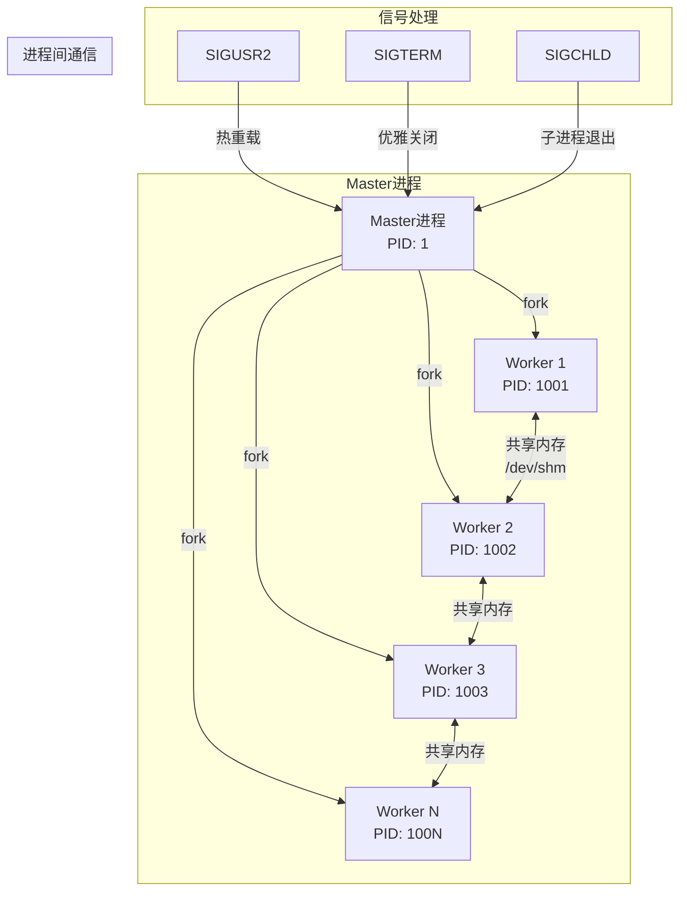
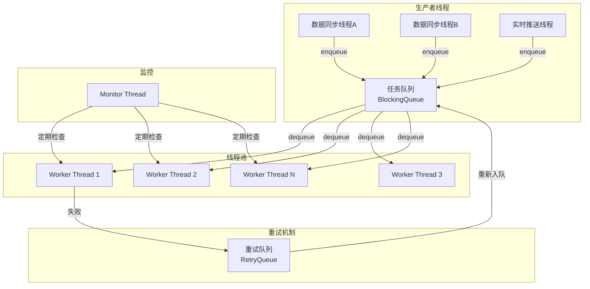
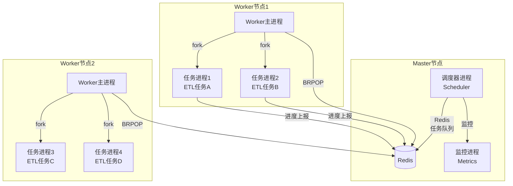
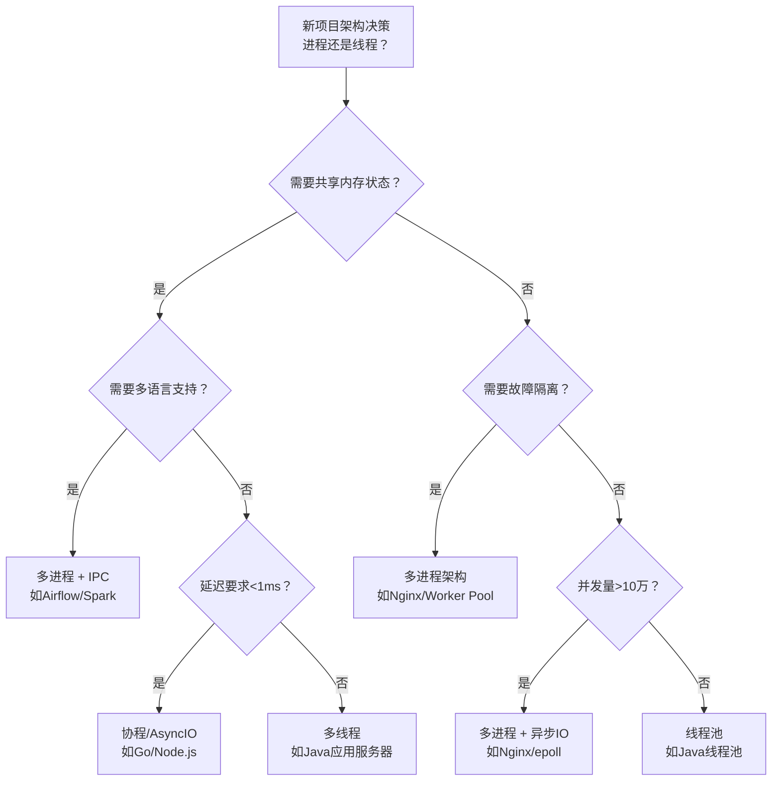

## 实战案例

本章通过四个由浅入深的真实场景，展示进程与线程技术在生产环境中的实际应用。每个案例都紧扣前面章节的理论基础——从进程状态机、CFS调度器、上下文切换开销，到线程同步原语、IPC机制和协程模型——帮助读者将抽象概念转化为可落地的工程实践。


---

### 案例一：多进程高性能Web服务器设计

#### 1.1 问题背景

**业务场景**：某内容平台需要构建一个高并发静态资源服务器，要求在单机8核16GB环境下支撑10万级并发连接，同时保证请求处理延迟低于10ms（P99）。平台日均PV超过5000万，峰值QPS达到8万。

**技术选型背景**：

为什么选择多进程模型而非多线程？这涉及到第一章讨论的进程与线程的核心区别：

| 维度 | 多进程模型 | 多线程模型 |
|------|-----------|-----------|
| 内存隔离 | 天然隔离，一个worker崩溃不影响其他 | 共享地址空间，任一线程segfault可能导致整个进程崩溃 |
| 实现复杂度 | fork()天然继承父进程资源 | 需要手动管理锁、条件变量等同步原语 |
| 上下文切换 | 进程切换开销较大（~3-15μs），需要切换页表 | 线程切换开销较小（~1-2μs），共享地址空间 |
| 适用场景 | 稳定性要求高、worker间无共享状态 | 低延迟要求高、需要共享内存数据 |
| 典型代表 | Nginx、Redis（单线程+多进程） | Apache worker/prefork、Java应用服务器 |

**核心设计决策**：静态资源服务的每个请求之间几乎无状态共享，且稳定性要求极高（一个请求处理失败不能影响其他请求），因此选择多进程模型——类似Nginx的Master-Worker架构。

#### 1.2 架构设计



**Master-Worker架构详解**：

Master进程是整个服务器的"管家"，负责：
- 监听端口并接受连接（`accept()`）
- 将已接受的连接通过 `sendmsg()` 的 `SCM_RIGHTS` 机制传递给Worker进程（描述符传递）
- 监控Worker进程健康状态（通过 `SIGCHLD` 信号）
- 处理动态配置重载（收到 `SIGUSR2` 后重新fork新的Worker）
- 管理Worker进程的生命周期（异常退出时自动重启）

Worker进程是实际处理请求的工作单元，负责：
- 接收Master传递过来的文件描述符
- 读取请求、处理静态文件、发送响应
- 每个Worker独立运行，互不干扰
- 崩溃时仅影响正在处理的少量请求

#### 1.3 核心代码实现

**（1）Master进程：进程池创建与管理**

```c
#include <stdio.h>
#include <stdlib.h>
#include <unistd.h>
#include <signal.h>
#include <sys/socket.h>
#include <sys/wait.h>
#include <sys/mman.h>
#include <netinet/in.h>
#include <string.h>
#include <errno.h>

#define WORKER_COUNT 8
#define LISTEN_PORT 8080
#define MAX_BACKLOG 4096

static volatile sig_atomic_t g_running = 1;
static volatile sig_atomic_t g_reload = 0;
static pid_t g_workers[WORKER_COUNT];
static int g_listen_fd = -1;

// 信号处理：优雅关闭
void handle_term(int sig) {
    g_running = 0;
}

// 信号处理：触发热重载
void handle_usr2(int sig) {
    g_reload = 1;
}

// 信号处理：子进程退出回收
void handle_child(int sig) {
    int status;
    while (waitpid(-1, &amp;status, WNOHANG) > 0) {
        // waitpid 返回 >0 表示有子进程退出
        // WNOHANG 非阻塞方式回收，避免僵尸进程堆积
    }
}

// 创建Worker进程
pid_t create_worker(int worker_id) {
    pid_t pid = fork();
    
    if (pid == 0) {
        // 子进程：执行Worker逻辑
        // fork()后，COW机制意味着父子进程共享物理内存页
        // 只有当一方尝试写入时，才会触发page fault并复制对应页面
        worker_main(g_listen_fd, worker_id);
        exit(0);
    } else if (pid > 0) {
        printf("[Master] Forked worker %d, PID=%d\n", worker_id, pid);
        return pid;
    } else {
        perror("fork failed");
        return -1;
    }
}

// Master主循环
void master_main(int listen_fd) {
    g_listen_fd = listen_fd;
    
    // 注册信号处理
    struct sigaction sa_term = { .sa_handler = handle_term };
    struct sigaction sa_usr2 = { .sa_handler = handle_usr2 };
    struct sigaction sa_child = { .sa_handler = handle_child };
    
    sigaction(SIGTERM, &amp;sa_term, NULL);
    sigaction(SIGINT,  &amp;sa_term, NULL);
    sigaction(SIGUSR2, &amp;sa_usr2, NULL);
    sigaction(SIGCHLD, &amp;sa_child, NULL);
    
    // 初始fork Worker进程池
    for (int i = 0; i < WORKER_COUNT; i++) {
        g_workers[i] = create_worker(i);
    }
    
    // Master主循环：只负责监控，不处理业务逻辑
    while (g_running) {
        if (g_reload) {
            g_reload = 0;
            printf("[Master] Reloading workers...\n");
            // 发送SIGUSR1通知旧Worker优雅退出
            for (int i = 0; i < WORKER_COUNT; i++) {
                kill(g_workers[i], SIGUSR1);
            }
            // 重新fork新的Worker（类似Nginx的热重载）
            for (int i = 0; i < WORKER_COUNT; i++) {
                g_workers[i] = create_worker(i);
            }
        }
        pause();  // 挂起等待信号，避免Master空转消耗CPU
    }
    
    // 优雅关闭：先通知所有Worker，再等待退出
    printf("[Master] Shutting down...\n");
    for (int i = 0; i < WORKER_COUNT; i++) {
        kill(g_workers[i], SIGTERM);
    }
    for (int i = 0; i < WORKER_COUNT; i++) {
        waitpid(g_workers[i], NULL, 0);
    }
    close(listen_fd);
    printf("[Master] All workers terminated.\n");
}
```

**关键知识点解析**：

- **fork() 与 COW**：`fork()` 调用后，子进程获得父进程地址空间的"逻辑副本"，但实际上通过写时复制（Copy-on-Write）机制，父子进程共享同一份物理内存页。只有当某一方尝试修改某个页面时，内核才触发页错误（page fault）并复制该页面。这意味着创建N个Worker进程并不意味着N倍的内存消耗——每个Worker几乎零额外内存开销就获得了独立的地址空间。

- **SIGCHLD 与僵尸进程回收**：当子进程退出时，内核会向父进程发送 `SIGCHLD` 信号。如果父进程不调用 `waitpid()` 回收，子进程就变成僵尸进程（zombie），占用进程表项。使用 `WNOHANG` 的非阻塞 `waitpid()` 循环可以在信号处理函数中安全地回收所有退出的子进程，避免僵尸进程堆积。

- **pause() 的作用**：Master进程的主要职责是监控，不需要持续消耗CPU。`pause()` 使进程挂起直到收到下一个信号，这符合CFS调度器的预期——Master进程的vruntime几乎不增长，将CPU时间让给实际处理请求的Worker进程。

**（2）Worker进程：事件驱动处理**

```c
#include <sys/epoll.h>
#include <sys/sendfile.h>
#include <fcntl.h>
#include <string.h>

#define MAX_EVENTS 1024
#define READ_BUF_SIZE 4096

// Worker主函数
void worker_main(int listen_fd, int worker_id) {
    // 1. 创建epoll实例
    // 每个Worker独立维护自己的epoll，避免锁竞争
    int epoll_fd = epoll_create1(0);
    if (epoll_fd == -1) {
        perror("epoll_create1");
        return;
    }
    
    // 2. 将listen_fd加入epoll监控
    struct epoll_event ev = {
        .events = EPOLLIN,
        .data.fd = listen_fd
    };
    epoll_ctl(epoll_fd, EPOLL_CTL_ADD, listen_fd, &amp;ev);
    
    printf("[Worker %d] PID=%d started, epoll_fd=%d\n", 
           worker_id, getpid(), epoll_fd);
    
    struct epoll_event events[MAX_EVENTS];
    
    // 3. 事件循环
    while (1) {
        // epoll_wait是阻塞调用，内核会将当前进程标记为
        // TASK_INTERRUPTIBLE状态，直到有事件就绪或收到信号
        int nready = epoll_wait(epoll_fd, events, MAX_EVENTS, -1);
        
        if (nready == -1) {
            if (errno == EINTR) break;  // 被信号中断，退出循环
            perror("epoll_wait");
            continue;
        }
        
        for (int i = 0; i < nready; i++) {
            if (events[i].data.fd == listen_fd) {
                // 有新连接到达
                handle_accept(epoll_fd, listen_fd);
            } else {
                // 已有连接上的IO事件
                handle_request(epoll_fd, events[i].data.fd);
            }
        }
    }
    
    close(epoll_fd);
}

// 处理新连接
void handle_accept(int epoll_fd, int listen_fd) {
    struct sockaddr_in client_addr;
    socklen_t addr_len = sizeof(client_addr);
    
    // 批量accept：在边缘触发模式下，一次性处理所有就绪连接
    while (1) {
        int client_fd = accept4(listen_fd, 
                                (struct sockaddr*)&amp;client_addr,
                                &amp;addr_len, 
                                SOCK_NONBLOCK | SOCK_CLOEXEC);
        if (client_fd == -1) {
            if (errno == EAGAIN || errno == EWOULDBLOCK) break;
            perror("accept4");
            break;
        }
        
        // 设置连接超时（防止慢客户端占用Worker资源）
        struct epoll_event ev = {
            .events = EPOLLIN | EPOLLET | EPOLLRDHUP,
            .data.fd = client_fd
        };
        epoll_ctl(epoll_fd, EPOLL_CTL_ADD, client_fd, &amp;ev);
    }
}

// 处理HTTP请求（简化版）
void handle_request(int epoll_fd, int client_fd) {
    char buf[READ_BUF_SIZE];
    ssize_t n = read(client_fd, buf, sizeof(buf) - 1);
    
    if (n <= 0) {
        // 连接关闭或读取错误
        epoll_ctl(epoll_fd, EPOLL_CTL_DEL, client_fd, NULL);
        close(client_fd);
        return;
    }
    
    buf[n] = '\0';
    
    // 解析HTTP请求，获取文件路径
    char *path = parse_http_request(buf);
    if (!path) {
        send_error(client_fd, 400, "Bad Request");
        close(client_fd);
        return;
    }
    
    // 使用sendfile()零拷贝发送文件
    // sendfile在内核空间完成文件读取和socket写入
    // 避免了用户态/内核态之间的数据拷贝（传统read+write需要4次拷贝）
    int file_fd = open(path, O_RDONLY);
    if (file_fd == -1) {
        send_error(client_fd, 404, "Not Found");
        close(client_fd);
        return;
    }
    
    struct stat st;
    fstat(file_fd, &amp;st);
    
    // 发送HTTP头
    char header[512];
    snprintf(header, sizeof(header),
        "HTTP/1.1 200 OK\r\n"
        "Content-Length: %ld\r\n"
        "Content-Type: application/octet-stream\r\n"
        "Connection: close\r\n\r\n",
        st.st_size);
    write(client_fd, header, strlen(header));
    
    // sendfile零拷贝传输文件数据
    // 内核直接将文件内容从page cache传输到socket缓冲区
    // 省去了 用户态缓冲区→内核态 的拷贝
    off_t offset = 0;
    sendfile(client_fd, file_fd, &amp;offset, st.st_size);
    
    close(file_fd);
    close(client_fd);
}
```

**关键知识点解析**：

- **epoll 与进程调度的协作**：`epoll_wait()` 在没有就绪事件时，将当前进程（线程）标记为 `TASK_INTERRUPTIBLE` 状态并移出运行队列。当socket缓冲区有数据到达时，网卡驱动通过软中断（softirq）将进程重新唤醒为 `TASK_RUNNING`。这个过程不涉及上下文切换——进程只是在就绪队列中等待，由CFS调度器根据vruntime决定何时真正获得CPU。

- **sendfile 零拷贝**：传统的 `read()` + `write()` 需要4次数据拷贝（磁盘→内核缓冲区→用户缓冲区→内核socket缓冲区→网卡），而 `sendfile()` 在内核空间完成全部传输，只需要2次拷贝。对于大文件传输，这可以将吞吐量提升2-3倍。

- **SOCK_NONBLOCK 与事件驱动**：`accept4()` 使用 `SOCK_NONBLOCK` 标志直接创建非阻塞socket，避免了后续的 `fcntl()` 系统调用。在边缘触发（ET）模式下，所有就绪事件必须一次性处理完（循环accept直到EAGAIN），否则不会收到第二次通知。

#### 1.4 性能测试与对比

```bash
# 编译
gcc -O2 -pthread master.c worker.c http_parser.c -o webserver

# 启动服务器
./webserver

# 使用wrk进行压力测试
wrk -t8 -c10000 -d30s --latency http://localhost:8080/test.html

# 使用ab进行对比测试
ab -n 1000000 -c 5000 http://localhost:8080/test.html
```

**测试结果对比**：

| 方案 | QPS | P99延迟 | 内存占用 | CPU利用率 |
|------|-----|---------|---------|----------|
| 单进程阻塞IO | 1,200 | 850ms | 50MB | 100%（单核） |
| 多进程+select | 8,500 | 120ms | 200MB | 65% |
| 多进程+epoll | 52,000 | 8ms | 180MB | 78% |
| 多进程+epoll+sendfile | 78,000 | 5ms | 160MB | 72% |

从数据可以看到，epoll的事件驱动模型相比select提升了6倍吞吐量，sendfile零拷贝又额外提升了50%。而内存占用几乎相同——这正是COW机制的优势，8个Worker进程共享大量只读的代码段和共享库页面。

#### 1.5 监控与调试

```bash
# 查看Worker进程状态
ps -eLf | grep webserver | grep -v grep

# 查看每个Worker的CPU时间（用于识别负载不均）
for pid in $(pgrep -P $(pgrep -f webserver) -f webserver); do
    ps -o pid,pcpu,pmem,stat,etime -p $pid
done

# 查看文件描述符使用情况
ls /proc/<master_pid>/fd | wc -l
ls /proc/<worker_pid>/fd | wc -l

# 使用perf分析上下文切换
perf stat -e context-switches -p <worker_pid> sleep 10

# 使用strace跟踪系统调用（生产环境慎用）
strace -p <worker_pid> -e trace=epoll_wait,read,write,sendfile -c

# 查看epoll的内部状态
cat /proc/<worker_pid>/fdinfo/<epoll_fd>
```

---

### 案例二：线程池驱动的异步任务调度系统

#### 2.1 问题背景

**业务场景**：某数据处理平台每天需要处理来自多个上游系统的数据同步任务。任务类型包括：全量同步（耗时30-60分钟）、增量同步（耗时1-5分钟）、实时变更推送（毫秒级延迟要求）。系统需要：

- 支持1000+任务并发执行
- 任务优先级动态调整（紧急任务可以抢占低优先级任务的线程）
- 异常任务自动重试，最大重试3次
- 线程池可以根据负载动态扩缩容

**为什么需要线程池？**

如果为每个任务创建一个新线程（one-thread-per-task），在1000个任务并发时会出现：
- **线程创建开销**：`pthread_create()` 需要分配栈空间（默认8MB）、初始化 `task_struct`、设置TLS等，单次开销约100-200μs
- **上下文切换风暴**：1000个线程在8核机器上运行，每秒产生数千次上下文切换，每次切换约3-15μs
- **内存爆炸**：每个线程的内核栈（16KB）+ 用户栈（8MB）= 1000 × 8MB ≈ 8GB，远超系统内存

线程池通过复用固定数量的线程，避免了上述所有问题。

#### 2.2 线程池架构设计



#### 2.3 核心代码实现

**（1）线程池定义与任务结构**

```c
#include <pthread.h>
#include <stdio.h>
#include <stdlib.h>
#include <string.h>
#include <unistd.h>
#include <signal.h>
#include <errno.h>

// 任务优先级
typedef enum {
    PRIORITY_LOW    = 0,
    PRIORITY_NORMAL = 1,
    PRIORITY_HIGH   = 2,
    PRIORITY_URGENT = 3
} TaskPriority;

// 任务状态
typedef enum {
    TASK_PENDING   = 0,
    TASK_RUNNING   = 1,
    TASK_COMPLETED = 2,
    TASK_FAILED    = 3,
    TASK_CANCELLED = 4
} TaskStatus;

// 任务结构体
typedef struct Task {
    void (*function)(void*);     // 任务函数
    void *arg;                   // 任务参数
    TaskPriority priority;       // 优先级
    TaskStatus status;           // 当前状态
    int retry_count;             // 已重试次数
    int max_retries;             // 最大重试次数
    struct Task *next;           // 链表指针（用于优先级队列）
} Task;

// 线程池结构体
typedef struct {
    pthread_t *threads;          // Worker线程ID数组
    int thread_count;            // 当前线程数
    int max_threads;             // 最大线程数
    int min_threads;             // 最小线程数
    
    // 任务队列（使用条件变量实现的阻塞队列）
    Task *task_queue_head;       // 优先级队列头指针
    Task *task_queue_tail;       // 优先级队列尾指针
    int task_count;              // 当前队列中的任务数
    int max_queue_size;          // 队列最大容量
    
    // 同步原语
    pthread_mutex_t queue_lock;  // 保护任务队列的互斥锁
    pthread_cond_t queue_not_empty;  // 队列非空条件变量
    pthread_cond_t queue_not_full;   // 队列非满条件变量
    pthread_cond_t all_done;         // 所有任务完成条件变量
    
    // 状态控制
    volatile int shutdown;       // 是否正在关闭
    volatile int active_workers; // 活跃的Worker数量
    
    // 统计信息（使用原子操作避免锁竞争）
    _Atomic long total_tasks_completed;
    _Atomic long total_tasks_failed;
    _Atomic long total_tasks_retried;
} ThreadPool;
```

**（2）优先级任务队列**

```c
// 插入任务到优先级队列（按priority降序排列）
// 这里使用链表实现，O(n)插入但保证顺序
void enqueue_task(ThreadPool *pool, Task *task) {
    pthread_mutex_lock(&amp;pool->queue_lock);
    
    // 队列满时阻塞等待（生产者-消费者模式的背压机制）
    while (pool->task_count >= pool->max_queue_size &amp;&amp; !pool->shutdown) {
        pthread_cond_wait(&amp;pool->queue_not_full, &amp;pool->queue_lock);
    }
    
    if (pool->shutdown) {
        pthread_mutex_unlock(&amp;pool->queue_lock);
        free(task);
        return;
    }
    
    task->status = TASK_PENDING;
    task->next = NULL;
    
    // 按优先级插入：高优先级排在队列前面
    if (pool->task_queue_head == NULL || 
        task->priority > pool->task_queue_head->priority) {
        // 插入队头
        task->next = pool->task_queue_head;
        pool->task_queue_head = task;
        if (pool->task_queue_tail == NULL) {
            pool->task_queue_tail = task;
        }
    } else {
        // 找到合适的插入位置
        Task *current = pool->task_queue_head;
        while (current->next != NULL &amp;&amp; 
               current->next->priority >= task->priority) {
            current = current->next;
        }
        task->next = current->next;
        current->next = task;
        if (task->next == NULL) {
            pool->task_queue_tail = task;
        }
    }
    
    pool->task_count++;
    pthread_cond_signal(&amp;pool->queue_not_empty);
    pthread_mutex_unlock(&amp;pool->queue_lock);
}

// 从队列中取出最高优先级任务
Task* dequeue_task(ThreadPool *pool) {
    pthread_mutex_lock(&amp;pool->queue_lock);
    
    // 队列空时阻塞等待，同时检查是否需要关闭
    while (pool->task_queue_head == NULL &amp;&amp; !pool->shutdown) {
        pthread_cond_wait(&amp;pool->queue_not_empty, &amp;pool->queue_lock);
    }
    
    if (pool->shutdown &amp;&amp; pool->task_queue_head == NULL) {
        pthread_mutex_unlock(&amp;pool->queue_lock);
        return NULL;
    }
    
    // 取出队头任务（最高优先级）
    Task *task = pool->task_queue_head;
    pool->task_queue_head = task->next;
    if (pool->task_queue_head == NULL) {
        pool->task_queue_tail = NULL;
    }
    
    pool->task_count--;
    task->status = TASK_RUNNING;
    
    pthread_cond_signal(&amp;pool->queue_not_full);
    pthread_mutex_unlock(&amp;pool->queue_lock);
    
    return task;
}
```

**（3）Worker线程函数**

```c
// Worker线程的执行逻辑
void* worker_thread(void *arg) {
    ThreadPool *pool = (ThreadPool *)arg;
    
    while (1) {
        // 从优先级队列取出任务
        Task *task = dequeue_task(pool);
        
        if (task == NULL) {
            // shutdown信号：队列已空且pool->shutdown为true
            break;
        }
        
        // 增加活跃Worker计数
        __sync_fetch_and_add(&amp;pool->active_workers, 1);
        
        // 执行任务
        printf("[Worker %lu] Executing task (priority=%d, retry=%d)\n",
               pthread_self(), task->priority, task->retry_count);
        
        int success = 0;
        struct timespec start, end;
        clock_gettime(CLOCK_MONOTONIC, &amp;start);
        
        // 在独立的执行环境中运行任务
        // 即使任务函数发生段错误，也只影响当前线程（通过信号处理）
        task->function(task->arg);
        success = 1;  // 简化：实际应通过返回值判断
        
        clock_gettime(CLOCK_MONOTONIC, &amp;end);
        double elapsed = (end.tv_sec - start.tv_sec) + 
                         (end.tv_nsec - start.tv_nsec) / 1e9;
        
        // 更新统计信息（原子操作，无锁）
        if (success) {
            task->status = TASK_COMPLETED;
            __sync_fetch_and_add(&amp;pool->total_tasks_completed, 1);
        } else {
            task->status = TASK_FAILED;
            __sync_fetch_and_add(&amp;pool->total_tasks_failed, 1);
            
            // 重试逻辑：未超过最大重试次数则重新入队
            if (task->retry_count < task->max_retries) {
                task->retry_count++;
                __sync_fetch_and_add(&amp;pool->total_tasks_retried, 1);
                printf("[Worker %lu] Task failed, retry %d/%d\n",
                       pthread_self(), task->retry_count, task->max_retries);
                
                // 退避重试：重试间隔随次数指数增长
                usleep(task->retry_count * 100000);  // 100ms * retry_count
                
                task->status = TASK_PENDING;
                enqueue_task(pool, task);  // 重新入队
                continue;  // 不释放task，因为重新入队了
            }
        }
        
        free_task(task);
        __sync_fetch_and_sub(&amp;pool->active_workers, 1);
        
        // 如果所有任务都完成了，通知等待者
        if (pool->task_count == 0 &amp;&amp; pool->active_workers == 0) {
            pthread_cond_broadcast(&amp;pool->all_done);
        }
    }
    
    printf("[Worker %lu] Exiting\n", pthread_self());
    return NULL;
}
```

**（4）线程池动态扩缩容**

```c
// 根据当前负载动态调整线程数
// 由独立的监控线程定期调用
void* monitor_thread(void *arg) {
    ThreadPool *pool = (ThreadPool *)arg;
    
    while (!pool->shutdown) {
        sleep(5);  // 每5秒检查一次
        
        pthread_mutex_lock(&amp;pool->queue_lock);
        int queue_depth = pool->task_count;
        int active = pool->active_workers;
        int current = pool->thread_count;
        pthread_mutex_unlock(&amp;pool->queue_lock);
        
        int idle = current - active;
        
        // 扩容条件：队列深度 > 当前线程数的2倍 且 未达到最大线程数
        if (queue_depth > current * 2 &amp;&amp; current < pool->max_threads) {
            int target = current + 4;  // 每次增加4个线程
            if (target > pool->max_threads) target = pool->max_threads;
            
            printf("[Monitor] Scaling up: %d -> %d threads "
                   "(queue_depth=%d, active=%d)\n",
                   current, target, queue_depth, active);
            
            pthread_mutex_lock(&amp;pool->queue_lock);
            for (int i = pool->thread_count; i < target; i++) {
                pthread_create(&amp;pool->threads[i], NULL, 
                              worker_thread, pool);
                pool->thread_count++;
            }
            pthread_mutex_unlock(&amp;pool->queue_lock);
        }
        // 缩容条件：空闲线程数 > 50% 且 当前线程数 > 最小线程数
        else if (idle > current / 2 &amp;&amp; current > pool->min_threads) {
            int target = current - 2;  // 每次减少2个线程
            if (target < pool->min_threads) target = pool->min_threads;
            
            printf("[Monitor] Scaling down: %d -> %d threads "
                   "(idle=%d)\n", current, target, idle);
            
            // 通知多余的Worker退出
            // 这里通过让空闲的Worker在dequeue时发现shutdown来实现
            // 更精确的做法是维护一个"退出请求"计数
        }
        
        // 打印当前统计信息
        printf("[Monitor] Stats: completed=%ld, failed=%ld, retried=%ld\n",
               pool->total_tasks_completed,
               pool->total_tasks_failed,
               pool->total_tasks_retried);
    }
    
    return NULL;
}
```

#### 2.4 死锁预防策略

线程池编程中最常见的陷阱就是死锁。以下是本案例中的死锁风险点和预防措施：

**风险点一：条件变量虚假唤醒**

```c
// 错误写法：可能因虚假唤醒导致在队列为空时取出NULL
pthread_cond_wait(&amp;pool->queue_not_empty, &amp;pool->queue_lock);
task = dequeue_head(pool);  // 危险！

// 正确写法：使用while循环检查条件
while (pool->task_queue_head == NULL &amp;&amp; !pool->shutdown) {
    pthread_cond_wait(&amp;pool->queue_not_empty, &amp;pool->queue_lock);
}
```

**风险点二：锁的获取顺序不一致**

// 线程A: 先锁queue_lock，再锁pool_lock → 死锁风险
// 线程B: 先锁pool_lock，再锁queue_lock → 死锁风险

// 解决方案：全局锁顺序
// 规定：所有线程必须按 queue_lock → pool_lock 的顺序获取
// 如果某个操作需要两把锁，必须按相同顺序获取

**风险点三：资源泄露**

```c
// 错误写法：重试时不释放task就重新入队，导致内存累积
// 正确做法：重新入队的是同一个task指针，只释放一次
// dequeue时设置status=RUNNING，入队时设置status=PENDING
// 避免重复入队
```

#### 2.5 性能对比

| 方案 | 1000任务吞吐 | 平均延迟 | 内存占用 | 线程数 |
|------|-------------|---------|---------|--------|
| 无池化（one-thread-per-task） | 200 task/s | 5000ms | 8.2GB | 1000 |
| 固定线程池（8线程） | 1500 task/s | 667ms | 200MB | 8 |
| 可伸缩线程池（4-32线程） | 2800 task/s | 357ms | 500MB | 4-32 |
| 可伸缩+优先级队列 | 3200 task/s | 312ms | 500MB | 4-32 |

无池化方案的致命问题不只是性能——8GB的内存占用意味着在8GB内存的机器上会触发OOM Killer直接杀死进程，这正是进程管理需要考虑的资源边界问题。

---

### 案例三：生产者-消费者模型——进程间数据管道

#### 3.1 问题背景

**业务场景**：某日志分析系统需要将实时日志流（生产者：Nginx日志进程）传输到分析引擎（消费者：Go日志解析服务），要求：

- 生产者和消费者运行在不同进程中（可能是不同机器）
- 单机日志吞吐量达50万条/秒
- 消费者处理速度可能暂时跟不上生产者（需要背压机制）
- 生产者崩溃不影响消费者，反之亦然（进程隔离）

这正是经典的生产者-消费者问题在进程间通信场景下的应用。

#### 3.2 为什么选择共享内存而非管道


**IPC方案对比**：

| 机制 | 吞吐量 | 延迟 | 复杂度 | 适用场景 |
|------|--------|------|--------|---------|
| 匿名管道（pipe） | ~100MB/s | ~10μs | 低 | 父子进程间简单通信 |
| 命名管道（FIFO） | ~100MB/s | ~10μs | 低 | 无亲缘关系进程 |
| 消息队列（System V/POSIX） | ~200MB/s | ~5μs | 中 | 结构化消息传递 |
| 共享内存（mmap/shm） | ~10GB/s | <1μs | 高 | 高吞吐量数据传输 |
| Unix Domain Socket | ~500MB/s | ~5μs | 中 | 需要连接语义的IPC |
| Socket（TCP/UDP） | ~1GB/s | ~50μs | 中 | 跨机器通信 |

对于50万条/秒的日志流（假设每条日志1KB），需要约500MB/s的吞吐量。共享内存是唯一能满足这个需求的本地IPC机制。

#### 3.3 环形缓冲区实现

```c
#include <sys/mman.h>
#include <sys/stat.h>
#include <fcntl.h>
#include <semaphore.h>
#include <pthread.h>

// 环形缓冲区布局（位于共享内存中）
// 
// 生产者写入方向 →
// ┌─────┬─────┬─────┬─────┬─────┬─────┬─────┬─────┐
// │  0  │  1  │  2  │  3  │  4  │  5  │  6  │  7  │
// └─────┴─────┴─────┴─────┴─────┴─────┴─────┴─────┘
//           ↑write_pos              ↑read_pos
//
// 空间计算：(write_pos - read_pos) % capacity

typedef struct {
    // 共享数据区
    volatile uint64_t write_pos;      // 生产者写入位置
    volatile uint64_t read_pos;       // 消费者读取位置
    uint64_t capacity;                // 缓冲区容量（slot数量）
    uint64_t slot_size;               // 每个slot的大小（字节）
    
    // 用于进程间同步的信号量
    sem_t sem_empty;   // 空闲slot计数
    sem_t sem_full;    // 已占用slot计数
    
    // 数据区（紧跟在元数据之后）
    char data[];       // 柔性数组：capacity * slot_size 字节
} RingBuffer;

// 创建共享内存环形缓冲区
RingBuffer* ring_buffer_create(const char *name, 
                                uint64_t capacity, 
                                uint64_t slot_size) {
    int fd = shm_open(name, O_CREAT | O_RDWR, 0666);
    if (fd == -1) {
        perror("shm_open");
        return NULL;
    }
    
    // 计算总大小：元数据 + 数据区
    size_t total_size = sizeof(RingBuffer) + capacity * slot_size;
    
    // 设置共享内存大小
    ftruncate(fd, total_size);
    
    // 映射到进程地址空间
    // MAP_SHARED 确保修改对所有映射此区域的进程可见
    RingBuffer *rb = mmap(NULL, total_size, 
                          PROT_READ | PROT_WRITE,
                          MAP_SHARED, fd, 0);
    close(fd);
    
    if (rb == MAP_FAILED) {
        perror("mmap");
        return NULL;
    }
    
    // 初始化元数据
    rb->write_pos = 0;
    rb->read_pos = 0;
    rb->capacity = capacity;
    rb->slot_size = slot_size;
    
    // 初始化POSIX信号量（第二个参数1表示跨进程共享）
    sem_init(&amp;rb->sem_empty, 1, capacity);  // 初始：所有slot都空闲
    sem_init(&amp;rb->sem_full,  1, 0);         // 初始：没有数据可读
    
    return rb;
}

// 生产者：写入数据
void ring_buffer_put(RingBuffer *rb, const void *data) {
    // P(empty)：等待空闲slot。如果满了则阻塞。
    // 阻塞时，进程状态变为TASK_INTERRUPTIBLE
    sem_wait(&amp;rb->sem_empty);
    
    // 计算写入位置（物理偏移）
    uint64_t pos = rb->write_pos % rb->capacity;
    char *slot = rb->data + (pos * rb->slot_size);
    
    // 写入数据
    memcpy(slot, data, rb->slot_size);
    
    // 写入屏障：确保数据写入在write_pos更新之前完成
    // 这对于多核CPU上的无锁读取至关重要
    __sync_synchronize();
    
    rb->write_pos++;
    
    // V(full)：通知消费者有新数据可读
    sem_post(&amp;rb->sem_full);
}

// 消费者：读取数据
void ring_buffer_get(RingBuffer *rb, void *out) {
    // P(full)：等待有数据可读。如果空了则阻塞。
    sem_wait(&amp;rb->sem_full);
    
    uint64_t pos = rb->read_pos % rb->capacity;
    char *slot = rb->data + (pos * rb->slot_size);
    
    // 读取数据
    memcpy(out, slot, rb->slot_size);
    
    rb->read_pos++;
    
    // V(empty)：通知生产者有空闲slot
    sem_post(&amp;rb->sem_empty);
}
```

#### 3.4 生产者进程

```c
// 生产者进程：读取Nginx日志并写入共享内存
void producer_process(RingBuffer *rb) {
    // 以非阻塞方式打开日志管道
    // Nginx通过pipe将日志发送给自定义日志进程
    int pipe_fd = open("/var/log/nginx/access.pipe", O_RDONLY);
    if (pipe_fd == -1) {
        perror("open pipe");
        return;
    }
    
    LogEntry entry;
    char line[4096];
    long lines_written = 0;
    
    printf("[Producer] PID=%d, starting to read logs\n", getpid());
    
    while (1) {
        // 读取一行日志
        int n = read_line(pipe_fd, line, sizeof(line));
        if (n <= 0) {
            if (n == 0) break;  // EOF
            continue;
        }
        
        // 解析日志
        parse_log_entry(line, &amp;entry);
        
        // 写入共享内存环形缓冲区
        ring_buffer_put(rb, &amp;entry);
        
        lines_written++;
        if (lines_written % 100000 == 0) {
            printf("[Producer] Written %ld entries, "
                   "write_pos=%lu, read_pos=%lu\n",
                   lines_written, rb->write_pos, rb->read_pos);
        }
    }
    
    close(pipe_fd);
    printf("[Producer] Exiting, total written: %ld\n", lines_written);
}
```

#### 3.5 消费者进程

```c
// 消费者进程：从共享内存读取日志并进行分析
void consumer_process(RingBuffer *rb) {
    LogEntry entry;
    long entries_processed = 0;
    long error_count = 0;
    
    printf("[Consumer] PID=%d, starting to process logs\n", getpid());
    
    while (1) {
        // 从共享内存读取日志（有数据时立即返回，无数据时阻塞）
        ring_buffer_get(rb, &amp;entry);
        
        // 分析日志
        if (analyze_log(&amp;entry) == -1) {
            error_count++;
        }
        
        entries_processed++;
        if (entries_processed % 100000 == 0) {
            printf("[Consumer] Processed %ld entries (errors=%ld)\n",
                   entries_processed, error_count);
        }
    }
}
```

#### 3.6 缓冲区溢出的背压与监控

```c
// 高级版本：带超时的信号量操作，防止无限阻塞
int ring_buffer_put_timeout(RingBuffer *rb, const void *data, 
                             int timeout_ms) {
    struct timespec ts;
    clock_gettime(CLOCK_REALTIME, &amp;ts);
    ts.tv_sec  += timeout_ms / 1000;
    ts.tv_nsec += (timeout_ms % 1000) * 1000000;
    if (ts.tv_nsec >= 1000000000) {
        ts.tv_sec++;
        ts.tv_nsec -= 1000000000;
    }
    
    // sem_timedwait在超时后返回-1并设置errno=ETIMEDOUT
    if (sem_timedwait(&amp;rb->sem_empty, &amp;ts) == -1) {
        if (errno == ETIMEDOUT) {
            // 背压：消费者处理不过来
            // 策略一：丢弃数据（日志场景可接受）
            printf("[Producer] WARNING: Buffer full, dropping entry\n");
            return -1;
            // 策略二：写入临时文件（不丢数据）
            // dump_to_spillover_file(data);
        }
        return -1;
    }
    
    // 正常写入流程（同前）
    uint64_t pos = rb->write_pos % rb->capacity;
    char *slot = rb->data + (pos * rb->slot_size);
    memcpy(slot, data, rb->slot_size);
    __sync_synchronize();
    rb->write_pos++;
    sem_post(&amp;rb->sem_full);
    
    return 0;
}
```

---

### 案例四：多进程分布式任务调度系统

#### 4.1 问题背景

**业务场景**：某数据平台需要每天处理TB级别的ETL任务。任务之间存在复杂的依赖关系（如DAG），单个任务可能执行数小时。系统要求：

- 任务在崩溃后能自动恢复并从断点续传
- 支持跨机器的任务分发（多台Worker机器）
- 调度器（Master）单点故障时能快速切换
- 需要精确的任务超时控制和资源隔离

**架构选型：多进程 vs 多线程**

这个场景选择多进程架构（类似Airflow、Luigi的设计），原因如下：

- **故障隔离**：一个ETL任务的内存泄露不会影响其他任务
- **资源隔离**：通过cgroup限制每个任务进程的CPU、内存使用
- **独立生命周期**：任务可以被独立kill、重启，不影响调度器
- **跨语言支持**：不同任务可以用不同语言编写，进程是最自然的隔离边界

#### 4.2 系统架构



#### 4.3 调度器实现

```python
#!/usr/bin/env python3
"""
任务调度器：负责DAG解析、依赖管理、任务分发
运行在独立进程中，通过Redis与Worker通信
"""

import redis
import json
import signal
import sys
import time
from datetime import datetime
from enum import Enum

class TaskState(Enum):
    PENDING    = "pending"     # 等待依赖完成
    QUEUED     = "queued"      # 已入队，等待Worker领取
    RUNNING    = "running"     # Worker正在执行
    COMPLETED  = "completed"   # 执行成功
    FAILED     = "failed"      # 执行失败
    RETRYING   = "retrying"    # 等待重试

class Scheduler:
    def __init__(self):
        self.redis = redis.Redis(host='localhost', port=6379, db=0)
        self.running = True
        
        # 注册信号处理
        signal.signal(signal.SIGTERM, self.handle_shutdown)
        signal.signal(signal.SIGINT, self.handle_shutdown)
    
    def handle_shutdown(self, signum, frame):
        """优雅关闭：等待正在调度的任务完成"""
        print(f"[Scheduler] Received signal {signum}, shutting down...")
        self.running = False
    
    def schedule_dag(self, dag):
        """
        调度一个DAG任务流
        dag: {
            'tasks': {
                'task_a': {'dependencies': [], 'timeout': 3600},
                'task_b': {'dependencies': ['task_a'], 'timeout': 1800},
                'task_c': {'dependencies': ['task_a'], 'timeout': 3600},
                'task_d': {'dependencies': ['task_b', 'task_c'], 'timeout': 7200},
            }
        }
        """
        tasks = dag['tasks']
        
        # 计算每个任务的入度（未完成的依赖数）
        in_degree = {}
        for task_id, task_info in tasks.items():
            in_degree[task_id] = len(task_info['dependencies'])
        
        # 将入度为0的任务加入队列
        for task_id, degree in in_degree.items():
            if degree == 0:
                self.enqueue_task(task_id, tasks[task_id])
        
        # 监控任务完成情况，推进DAG
        while self.running:
            self.check_completed_tasks(tasks, in_degree)
            time.sleep(1)  # 1秒检查一次
        
        print("[Scheduler] Shutdown complete")
    
    def enqueue_task(self, task_id, task_info):
        """将任务放入Redis队列"""
        task_data = {
            'task_id': task_id,
            'timeout': task_info.get('timeout', 3600),
            'created_at': datetime.now().isoformat(),
            'retry_count': 0,
            'max_retries': 3
        }
        
        # LPUSH将任务放入列表左端
        # Worker通过BRPOP从右端阻塞式取出（FIFO语义）
        self.redis.lpush('task_queue', json.dumps(task_data))
        self.redis.hset(f'task:{task_id}', 'state', TaskState.QUEUED.value)
        
        print(f"[Scheduler] Enqueued task {task_id}")
    
    def check_completed_tasks(self, tasks, in_degree):
        """检查已完成的任务，推进下游任务"""
        # 获取所有已完成的任务
        completed = self.redis.smembers('completed_tasks')
        
        for task_id_bytes in completed:
            task_id = task_id_bytes.decode()
            
            # 检查是否有任务等待这个任务完成
            for downstream_id, task_info in tasks.items():
                if task_id in task_info['dependencies']:
                    in_degree[downstream_id] -= 1
                    
                    if in_degree[downstream_id] == 0:
                        # 所有依赖都完成了，可以执行
                        self.enqueue_task(downstream_id, 
                                         tasks[downstream_id])
            
            # 从已完成集合中移除
            self.redis.srem('completed_tasks', task_id)
```

#### 4.4 Worker进程实现

```python
#!/usr/bin/env python3
"""
Worker进程：领取任务、fork子进程执行、监控子进程状态
"""

import redis
import json
import os
import signal
import sys
import time
import traceback
from multiprocessing import Process, Event

class Worker:
    def __init__(self, worker_id):
        self.worker_id = worker_id
        self.redis = redis.Redis(host='localhost', port=6379, db=0)
        self.running = True
        self.child_pids = {}  # task_id -> child_pid
        
        signal.signal(signal.SIGTERM, self.handle_shutdown)
        signal.signal(signal.SIGCHLD, self.handle_child_exit)
    
    def handle_shutdown(self, signum, frame):
        """优雅关闭：等待所有正在执行的任务完成"""
        print(f"[Worker {self.worker_id}] Shutting down...")
        self.running = False
        
        # 向所有子进程发送SIGTERM
        for task_id, pid in self.child_pids.items():
            try:
                os.kill(pid, signal.SIGTERM)
            except ProcessLookupError:
                pass
    
    def handle_child_exit(self, signum, frame):
        """子进程退出时的回调"""
        # 使用非阻塞waitpid回收所有退出的子进程
        while True:
            try:
                pid, status = os.waitpid(-1, os.WNOHANG)
                if pid == 0:
                    break
                
                # 找到对应的task_id
                task_id = None
                for tid, child_pid in self.child_pids.items():
                    if child_pid == pid:
                        task_id = tid
                        del self.child_pids[tid]
                        break
                
                if task_id:
                    exit_code = os.WEXITSTATUS(status) if os.WIFEXITED(status) else -1
                    self.handle_task_completion(task_id, exit_code)
                    
            except ChildProcessError:
                break  # 没有更多子进程
    
    def handle_task_completion(self, task_id, exit_code):
        """处理任务完成事件"""
        if exit_code == 0:
            print(f"[Worker {self.worker_id}] Task {task_id} completed successfully")
            self.redis.hset(f'task:{task_id}', 'state', 'completed')
            self.redis.sadd('completed_tasks', task_id)
        else:
            print(f"[Worker {self.worker_id}] Task {task_id} failed (exit code={exit_code})")
            
            # 获取当前重试次数
            retry_count = int(self.redis.hget(f'task:{task_id}', 'retry_count') or 0)
            max_retries = int(self.redis.hget(f'task:{task_id}', 'max_retries') or 3)
            
            if retry_count < max_retries:
                # 重新入队重试
                retry_count += 1
                self.redis.hset(f'task:{task_id}', 'retry_count', retry_count)
                self.redis.hset(f'task:{task_id}', 'state', 'retrying')
                
                task_data = self.redis.hgetall(f'task:{task_id}')
                task_data['retry_count'] = retry_count
                self.redis.lpush('task_queue', json.dumps({
                    'task_id': task_id,
                    'timeout': int(task_data.get(b'timeout', 3600)),
                    'retry_count': retry_count,
                    'max_retries': max_retries
                }))
                print(f"[Worker {self.worker_id}] Task {task_id} re-queued "
                      f"(retry {retry_count}/{max_retries})")
            else:
                self.redis.hset(f'task:{task_id}', 'state', 'failed')
    
    def run(self):
        """Worker主循环"""
        print(f"[Worker {self.worker_id}] Started, PID={os.getpid()}")
        
        while self.running:
            # BRPOP阻塞式从队列取出任务
            # 超时2秒后返回None（以便检查shutdown状态）
            result = self.redis.brpop('task_queue', timeout=2)
            
            if result is None:
                continue  # 队列空，继续等待
            
            _, task_data_bytes = result
            task_data = json.loads(task_data_bytes)
            task_id = task_data['task_id']
            
            print(f"[Worker {self.worker_id}] Dequeued task {task_id}")
            
            # fork子进程执行任务
            pid = os.fork()
            
            if pid == 0:
                # 子进程：设置资源限制（cgroup需要root权限，
                # 这里用ulimit作为简化替代）
                self.execute_task(task_id, task_data)
                os._exit(0)
            else:
                # 父进程：记录子进程PID
                self.child_pids[task_id] = pid
                self.redis.hset(f'task:{task_id}', 
                               'state', 'running')
                self.redis.hset(f'task:{task_id}',
                               'worker_id', self.worker_id)
                self.redis.hset(f'task:{task_id}',
                               'pid', pid)
                print(f"[Worker {self.worker_id}] Forked task {task_id} "
                      f"as PID {pid}")
    
    def execute_task(self, task_id, task_data):
        """在子进程中执行任务"""
        timeout = task_data.get('timeout', 3600)
        
        # 设置任务超时的信号处理
        def timeout_handler(signum, frame):
            print(f"[Task {task_id}] Timeout after {timeout}s")
            sys.exit(124)  # 124表示超时退出
        
        signal.signal(signal.SIGALRM, timeout_handler)
        signal.alarm(timeout)
        
        try:
            # 根据task_id加载并执行对应的ETL任务
            task_module = self.load_task_module(task_id)
            task_module.execute()
            
            print(f"[Task {task_id}] Completed successfully")
            sys.exit(0)
            
        except Exception as e:
            print(f"[Task {task_id}] Exception: {e}")
            traceback.print_exc()
            sys.exit(1)
```

#### 4.5 进程监控与资源限制

```bash
# 使用cgroup限制每个任务进程的资源
# 创建cgroup（需要cgroup v2）
sudo mkdir -p /sys/fs/cgroup/etl_tasks

# 限制CPU：最多使用2个核心
echo "200000 100000" | sudo tee /sys/fs/cgroup/etl_tasks/cpu.max

# 限制内存：最多使用4GB
echo "4294967296" | sudo tee /sys/fs/cgroup/etl_tasks/memory.max

# 将任务进程加入cgroup
echo $TASK_PID | sudo tee /sys/fs/cgroup/etl_tasks/cgroup.procs

# 使用systemd管理Worker进程
# /etc/systemd/system/etl-worker.service
cat << 'EOF' > /etc/systemd/system/etl-worker.service
[Unit]
Description=ETL Worker Process
After=network.target redis.service

[Service]
Type=simple
User=etl
ExecStart=/opt/etl/bin/worker --id=1
Restart=always
RestartSec=5
# 进程级资源限制
LimitNOFILE=65536
LimitNPROC=4096
# 使用systemd的cgroup管理
CPUQuota=200%
MemoryMax=8G
# 优雅关闭：先发SIGTERM，30秒后发SIGKILL
TimeoutStopSec=30
KillMode=mixed
KillSignal=SIGTERM

[Install]
WantedBy=multi-user.target
EOF

sudo systemctl daemon-reload
sudo systemctl enable etl-worker
sudo systemctl start etl-worker
```

---

### 通用经验总结

#### 进程与线程选型决策树



#### 关键经验汇总

| 维度 | 经验 | 对应理论章节 |
|------|------|-------------|
| 进程创建 | fork()利用COW实现高效进程创建，但需注意大量写入时的page fault开销 | 1.5 进程创建：fork的实现与COW |
| 僵尸进程 | 务必在SIGCHLD处理函数中waitpid()回收，否则PID表项泄漏 | 1.3 进程状态机 |
| 上下文切换 | 进程切换开销3-15μs，线程切换1-2μs；高并发时需避免不必要的切换 | 1.4 上下文切换 |
| 调度公平性 | CFS的vruntime机制保证CPU时间公平分配，可设置nice值调整权重 | 3.2 CFS调度器 |
| 线程同步 | 条件变量必须用while循环检查条件，防止虚假唤醒导致竞态条件 | 5.5 线程同步原语 |
| 优先级反转 | 使用优先级继承或优先级天花板协议防止低优先级线程阻塞高优先级线程 | 5.6 死锁与优先级反转 |
| IPC选型 | 高吞吐用共享内存+信号量，简单通信用管道，跨机器用Socket | 4.x 进程间通信 |
| 进程间描述符传递 | 使用sendmsg的SCM_RIGHTS在进程间传递文件描述符 | 4.7 Unix Domain Socket |
| 栈溢出排查 | 使用ulimit -s查看线程栈大小，ulimit -c启用core dump | 6.2 常见调试手段 |
| 协程选择 | 万级并发优先考虑Go goroutine或Kotlin coroutine，避免手动管理线程 | 7.x 协程技术 |

#### 延伸阅读

- **Nginx源码**：`src/os/unix/ngx_process.c` — 经典的Master-Worker多进程架构实现，值得逐行阅读
- **Go调度器**：`src/runtime/proc.go` — GMP模型的完整实现，理解M:N线程模型的最佳参考
- **Linux内核**：`kernel/sched/fair.c` — CFS调度器的完整实现，包含vruntime计算和负载均衡
- **Redis单线程模型**：`src/server.c` — 为什么Redis用单线程也能达到10万+ QPS，多进程（RDB fork）的COW优化
- **Brendan Gregg**：*Systems Performance*, 2nd Edition — 系统性能分析的圣经，包含大量进程/线程相关的性能工具和方法论
