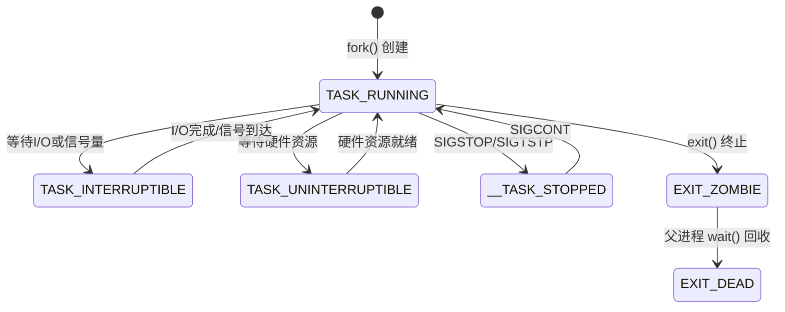
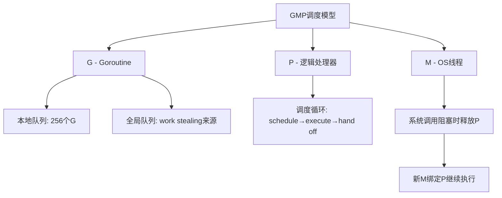
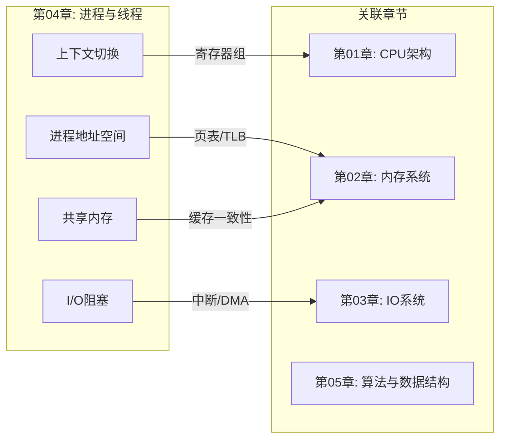

# 本章小结

本章从操作系统内核视角出发，系统性地讲解了进程与线程的理论模型、调度策略、同步机制和现代并发范式。以下对全章核心内容进行回顾、提炼与延伸，帮助读者建立完整的知识体系，并为实际工程决策提供可靠的参考依据。

---

## 一、核心知识体系回顾

### 1.1 进程：资源分配的基本单位

进程是操作系统对正在运行程序的抽象，是资源分配的基本单位。每个进程拥有独立的地址空间、文件描述符表、信号处理表以及各种系统资源。其核心数据结构——进程控制块（PCB），在Linux中的具体实现是 `task_struct`（约6-8KB），包含调度信息、内存管理、文件系统、信号处理、进程间关系、命名空间、cgroup等关键字段。

**进程状态机**是理解进程生命周期的关键模型：

| 状态 | 含义 | 触发条件 |
|------|------|----------|
| TASK_RUNNING | 就绪/运行 | fork()创建后或被唤醒 |
| TASK_INTERRUPTIBLE | 可中断睡眠 | 等待I/O、信号量等可被信号唤醒的事件 |
| TASK_UNINTERRUPTIBLE | 不可中断睡眠 | 等待硬件资源（磁盘I/O），不响应信号 |
| __TASK_STOPPED | 停止 | 收到SIGSTOP/SIGTSTP |
| EXIT_ZOMBIE | 僵尸 | 进程终止但父进程未wait()回收 |
| EXIT_DEAD | 死亡 | 父进程wait()后回收所有资源 |

其中，`TASK_KILLABLE`（Linux 2.6.25+）结合了不可中断睡眠的保护性和致命信号的可杀性，解决了D状态进程无法被杀死的长期问题。`TASK_IDLE`（Linux 4.14+）则为CFS提供了"可被任意调度器回收"的低优先级睡眠状态，用于空闲线程池的占位。



**上下文切换**是并发性能的核心机制，完整流程包括：保存当前进程寄存器状态 → 调度器选择下一个进程 → 恢复目标进程状态 → 切换地址空间（修改CR3）。典型开销为3-15μs，其中TLB刷新（无PCID时）和缓存失效是主要成本。Linux通过PCID（Process Context ID）减少TLB刷新开销——在Haswell及更新的CPU上，内核为每个进程分配一个12位PCID标签，使得切换进程时无需完全刷新TLB，将间接开销降低30-50%。

**进程创建**方面，`fork()` 的核心设计是写时复制（COW）：fork时不复制物理内存，仅复制页表并标记为只读；当任一进程写入时触发页错误，内核才复制被写页面。这使得fork极其高效——在32GB内存的系统上，fork一个占用2GB内存的进程，实际内存开销仅约几十KB（页表复制）。`exec()` 系列函数替换进程地址空间，`wait()/waitpid()` 回收子进程退出状态。现代Linux中，fork/vfork/pthread_create 都通过 `clone()` 系统调用实现，区别在于共享标志位的不同组合：

| 系统调用 | CLONE标志 | 效果 |
|----------|----------|------|
| fork() | SIGCHLD | 创建独立进程（不共享任何资源） |
| vfork() | CLONE_VFORK \| CLONE_VM | 共享地址空间，父进程阻塞等待 |
| pthread_create() | CLONE_VM \| CLONE_FS \| CLONE_FILES \| CLONE_SIGHAND \| ... | 共享几乎所有资源，仅独立栈和TLS |

### 1.2 线程：CPU调度的基本单位

线程是进程内的执行单元，与同进程的其他线程共享代码段、数据段、堆内存、文件描述符表和信号处理函数，但独立拥有程序计数器、寄存器组、栈空间和线程ID。

三种线程模型的演进体现了灵活性与性能的权衡：

| 模型 | 描述 | 代表实现 | 优点 | 缺点 |
|------|------|----------|------|------|
| N:1 | 多个用户线程映射到一个内核线程 | GNU pthread（早期） | 切换快、调度可自定义 | 一个阻塞全阻塞、无法多核并行 |
| 1:1 | 每个用户线程映射一个内核线程 | Linux pthreads | 阻塞不影响其他线程、支持多核 | 切换开销较大（需系统调用） |
| M:N | M个用户线程映射到N个内核线程 | Go、Erlang、Solaris | 兼顾灵活性和性能 | 实现复杂、调度困难 |

Linux pthreads 采用1:1模型，`pthread_create()` 最终调用 `clone()` 创建新的调度实体。虽然每个线程都有独立的内核栈（默认8KB，可通过 `ulimit -s` 调整），但同一进程的线程共享地址空间，使得线程间的数据交换无需IPC——这正是线程相比进程的核心优势，也是线程安全隐患（竞态条件）的根源。

### 1.3 调度：公平与效率的艺术

Linux默认的CFS（完全公平调度器）使用**虚拟运行时间（vruntime）** 衡量进程的CPU使用量，核心公式为：

vruntime += 实际运行时间 × (NICE_0_WEIGHT / 进程权重)

nice值越低（优先级越高），权重越大，vruntime增长越慢，获得的CPU时间越多。CFS使用红黑树组织就绪队列，vruntime最小的进程位于最左节点优先调度。调度周期内，每个进程获得的时间与权重成正比，但不会小于最小粒度（约0.75ms）。Linux nice值对应的权重映射（前10级）如下：

| nice | 权重 | 相对CPU占比（2进程对比） |
|------|------|--------------------------|
| -20 | 88761 | 约89% |
| -10 | 34816 | 约68% |
| 0 | 1024 | 约50%（基准） |
| 10 | 335 | 约25% |
| 19 | 15 | 约1.5% |

经典调度算法对比：

| 算法 | 特点 | 优势 | 劣势 |
|------|------|------|------|
| FCFS | 按到达顺序执行 | 简单、无开销 | 护航效应、平均等待长 |
| SJF | 优先执行最短作业 | 最优平均等待时间 | 饥饿、需预知执行时间 |
| RR | 固定时间片轮转 | 响应性好 | 时间片选择困难 |
| MLFQ | 多级队列+动态优先级 | 自适应I/O/CPU密集型 | 参数调优复杂 |

Linux实时调度提供三种策略：SCHED_FIFO（先进先出）、SCHED_RR（轮转，同优先级时间片轮转）、SCHED_DEADLINE（基于EDF算法，适用于严格时序要求的任务）。实时优先级范围1-99，数值越大优先级越高。值得注意的是，SCHED_DEADLINE（Linux 3.14+）为每个任务指定三个参数：运行时间(runtime)、截止期限(deadline)、周期(period)，内核保证任务在每个周期内的runtime时间内完成——这是实时音频处理、工业控制等场景的理想选择。

### 1.4 进程间通信（IPC）

七种主要IPC方式各有适用场景：

| 方式 | 带宽 | 延迟 | 复杂度 | 适用场景 |
|------|------|------|--------|----------|
| 管道（Pipe） | 中 | 中 | 低 | 父子进程单向字节流通信 |
| 命名管道（FIFO） | 中 | 中 | 低 | 任意进程单向通信 |
| 消息队列 | 中 | 中 | 中 | 异步消息传递，有类型标识 |
| 共享内存 | 极高 | 极低 | 高 | 大量数据交换（需配合同步） |
| 信号量 | N/A | 低 | 中 | 进程间同步控制 |
| Socket | 低 | 高 | 高 | 跨机器网络通信 |
| Unix Domain Socket | 高 | 低 | 高 | 本机高效通信，可传fd和凭证 |

关键设计细节：

- **管道**：内核中使用环形缓冲区（默认64KB，最大1MB），`PIPE_BUF`（通常4096字节）保证原子写入。`splice()` 系统调用可以在管道和文件之间零拷贝传输数据
- **共享内存**：本身不提供同步，必须配合信号量或互斥锁。Linux提供两种共享内存机制：POSIX shm_open（推荐）和 System V shmget。性能基准：memcpy共享内存约10GB/s，管道约2-3GB/s，TCP Socket约1-2GB/s
- **Unix Domain Socket**：比TCP Socket更快（跳过网络协议栈），且支持通过 `SCM_RIGHTS` 传递文件描述符、通过 `SO_PASSCRED` 传递进程凭证。Docker、systemd等系统组件大量使用Unix Domain Socket作为内部通信机制
- **现代替代**：io_uring（Linux 5.1+）提供了高性能异步I/O接口，结合SHARED模式可实现进程间零拷贝I/O共享，在数据库、存储引擎等场景中逐渐取代传统IPC

### 1.5 线程同步原语

六种核心同步机制的对比与适用场景：

| 同步原语 | 核心机制 | 适用场景 | 注意事项 |
|----------|----------|----------|----------|
| 互斥锁（Mutex） | 同一时刻只有一个线程进入临界区 | 保护共享数据 | 区分NORMAL/ERRORCHECK/RECURSIVE类型 |
| 读写锁（RWLock） | 多读者并发、写者独占 | 读多写少场景 | 写频繁时开销可能大于互斥锁 |
| 条件变量（CondVar） | 条件等待+通知机制 | 生产者-消费者模型 | 必须用while循环检查条件（防虚假唤醒） |
| 自旋锁（Spinlock） | 忙等待（不释放CPU） | 临界区极短、持锁时间可预测 | 单核CPU无意义；用户态很少使用 |
| 信号量（Semaphore） | 计数器控制并发数 | 限制同时访问资源的线程数 | 无所有权语义，任何线程可post |
| 屏障（Barrier） | 一组线程同步等待 | 多阶段并行计算 | 所有线程到达后才继续 |

**Futex**（Fast Userspace muTEX）是Linux高效同步的核心机制，采用双路径设计：无竞争时通过原子操作在用户态完成（纳秒级，无系统调用）；有竞争时通过 `FUTEX_WAIT/FUTEX_WAKE` 系统调用挂起/唤醒线程。`pthread_mutex_lock()` 在无竞争场景下正是依赖Futex快速路径实现高性能。在典型Web服务器中，超过95%的锁操作是无竞争的，Futex的快速路径使得锁的平均开销低于100ns。

**RCU**（Read-Copy-Update）是内核中更高级的同步机制，特别适合读多写少的场景：读者完全无锁（零开销），写者创建新副本后原子替换指针，旧副本通过回调延迟释放。Linux内核中网络路由表、进程列表等核心数据结构都使用RCU保护。

### 1.6 现代协程范式

协程是用户态的轻量级线程，切换成本远低于内核线程（~10-100ns vs ~3-15μs）：

| 特性 | Go Goroutine | Kotlin Coroutine | Java Virtual Thread |
|------|-------------|-----------------|-------------------|
| 调度模型 | M:N（GMP） | 用户态调度 | M:N |
| 栈大小 | 2KB起，可动态增长 | 无栈（状态机实现） | ~数百字节起 |
| 阻塞处理 | 运行时自动处理 | 需显式suspend | JVM自动处理 |
| 创建数量级 | 百万级 | 百万级 | 百万级 |
| 切换成本 | ~100ns | ~10ns | ~100ns |
| 与旧代码兼容性 | 中等 | 需要改写为suspend | 完全兼容 |

Go的GMP模型中：G是轻量级goroutine（初始栈2KB），P是逻辑处理器（数量等于CPU核心数，可通过 `GOMAXPROCS` 调整），M是OS线程。调度通过本地队列、全局队列和work stealing机制实现。当G阻塞在系统调用时，P被分离并绑定新的M（hand off），保证并发性。当P的本地队列满时，新G被放入全局队列，其他P会通过work stealing窃取一半的G——这种设计使得Go在高并发场景下依然保持良好的负载均衡。



### 1.7 前沿发展：Linux并发机制的演进

本章讨论的核心概念在持续演进，以下是一些值得关注的新发展：

| 技术 | 版本 | 核心创新 | 应用场景 |
|------|------|----------|----------|
| io_uring | Linux 5.1+ | 异步I/O + 零拷贝 + 共享提交队列 | 高性能存储、网络服务器 |
| eBPF | Linux 3.18+ | 内核可编程，用户态安全扩展 | 性能监控、网络过滤、安全策略 |
| cgroups v2 | Linux 4.5+ | 统一层级资源控制 | 容器CPU/内存限制 |
| PID namespaces | Linux 2.6.24+ | 进程ID隔离 | 容器进程管理 |
| SCHED_EXT | Linux 6.12+ | 用户态可编程调度器 | 自定义调度策略实验 |

io_uring 的出现对传统IPC和I/O模型产生了深远影响：通过共享的提交/完成队列（SQ/CQ），用户态和内核态之间无需系统调用即可传递I/O请求和结果，将异步I/O的延迟从传统aio的约5μs降低到约1μs。

eBPF 则改变了性能监控的方式：传统工具（top、perf）需要采样和统计推断，而eBPF可以精确追踪每次系统调用、每次调度事件、每次锁竞争，提供完整的可观测性——本章"诊断工具速查"中的 `perf` 工具，其底层正是通过eBPF实现高精度追踪。

---

## 二、关键决策指南

### 2.1 进程 vs 线程选择决策树

需要创建新执行单元吗？
├── 需要内存隔离（安全性、稳定性）
│   ├── 是 → 进程（或容器）
│   └── 否 ↓
├── 需要独立的文件描述符表
│   ├── 是 → 进程（或使用 unshare(CLONE_FILES)）
│   └── 否 ↓
├── 需要隔离故障域（一个崩溃不影响其他）
│   ├── 是 → 进程
│   └── 否 ↓
├── 需要利用多核并行执行
│   ├── 是 → 线程 或 协程
│   └── 否 → 单线程即可
├── 需要共享内存数据
│   ├── 少量数据 → 线程（天然共享堆）
│   └── 大量数据 → 进程 + 共享内存（避免写时复制放大）
└── 需要百万级轻量级任务
    ├── 是 → 协程（Go/Kotlin/Virtual Thread）
    └── 否 → 线程池（推荐）

### 2.2 IPC方式选择

| 场景 | 推荐方式 | 理由 |
|------|----------|------|
| Shell管道命令 | Pipe | 简单、零配置 |
| 父子进程传递少量数据 | Pipe | 无需额外设置 |
| 无亲缘关系进程单向通信 | 命名管道 | 有文件系统路径 |
| 异步消息传递（按类型分发） | 消息队列 | 支持消息类型选择性接收 |
| 大量数据交换（如图像处理） | 共享内存 | 零拷贝，最高带宽 |
| 本机进程高效通信 | Unix Domain Socket | 跳过协议栈，可传fd |
| 跨机器通信 | TCP/UDP Socket | 网络透明 |
| 高频异步I/O（数据库、存储） | io_uring | 内核级异步，零系统调用 |

### 2.3 同步原语选择

| 场景 | 推荐原语 | 理由 |
|------|----------|------|
| 保护共享计数器/状态 | 互斥锁 | 最简单、最通用 |
| 读多写少的配置数据 | 读写锁 | 多读者并发提升吞吐 |
| 生产者-消费者 | 条件变量+互斥锁 | 经典模型，支持等待通知 |
| 极短临界区（几条指令） | 自旋锁或无锁 | 避免上下文切换开销 |
| 限制并发资源池大小 | 信号量 | 计数器控制并发数 |
| 多阶段并行计算同步点 | 屏障 | 等待所有线程到达 |
| 内核级读多写少 | RCU | 读者零开销，写者延迟释放 |

---

## 三、性能优化要点

### 3.1 上下文切换优化

上下文切换的间接开销（缓存失效）往往远大于直接开销（寄存器保存恢复）。根据实测数据：

| 开销类型 | 耗时占比 | 说明 |
|----------|----------|------|
| 保存/恢复寄存器 | ~10% | 直接开销，约0.3-1.5μs |
| 切换页表（CR3） | ~15% | 直接开销 |
| TLB刷新 | ~30-50% | 间接开销，无PCID时最大 |
| CPU缓存失效 | ~25-40% | 间接开销，L1/L2缓存被污染 |
| 调度器决策 | ~5-10% | 红黑树操作、负载均衡 |

优化策略包括：

1. **减少进程/线程数量**：使用线程池避免频繁创建销毁。典型线程池参数：核心线程数 = CPU核心数，最大线程数 = CPU核心数 × 2（CPU密集型）或更高（I/O密集型）
2. **CPU亲和性（CPU Affinity）**：使用 `sched_setaffinity()` 或 `taskset` 将进程绑定到特定CPU，减少缓存失效。实测绑定CPU后，Redis的QPS提升约15-20%
3. **减少锁竞争**：使用无锁数据结构（如原子操作、CAS）、减小临界区、分片锁（如Java的ConcurrentHashMap使用16个分段锁）
4. **使用协程**：对于I/O密集型任务，协程的切换成本仅为线程的1/10到1/100

```bash
# 查看上下文切换频率
vmstat 1
# 关注 cs（context switch）列，正常Web服务器 < 10,000/秒
# 超过50,000/秒通常意味着过度并发

# 绑定进程到特定CPU
taskset -c 0,1 ./my_app    # 绑定到CPU 0和1
taskset -cp 0-3 $(pidof my_app)  # 动态绑定已运行进程
```

### 3.2 CFS调度调优

```bash
# 查看当前调度参数
sysctl kernel.sched_latency_ns          # 调度周期（默认6ms）
sysctl kernel.sched_min_granularity_ns  # 最小时间粒度（默认0.75ms）
sysctl kernel.sched_wakeup_granularity_ns  # 唤醒抢占粒度

# 调整进程优先级（-20最高，19最低）
renice -n -5 -p <pid>

# 设置实时调度策略
chrt -f 50 ./realtime_app   # FIFO策略，优先级50
chrt -r 50 ./realtime_app   # RR策略，优先级50
chrt -d --sched-runtime 5000000 --sched-deadline 10000000 --sched-period 10000000 ./realtime_app
```

**CFS参数调优场景**：

| 参数 | 默认值 | 调整建议 |
|------|--------|----------|
| sched_latency_ns | 6ms | 交互式系统可减小到4ms，提升响应性 |
| sched_min_granularity_ns | 0.75ms | 高负载服务器可增大到1.5ms，减少切换 |
| sched_wakeup_granularity_ns | 1ms | 增大可减少不必要的抢占 |

### 3.3 避免常见性能陷阱

- **避免僵尸进程**：fork后及时wait()，或注册SIGCHLD处理函数（`signal(SIGCHLD, SIG_IGN)` 在Linux下自动回收）。监控脚本：`ps -eo pid,ppid,stat,comm | grep 'Z'`
- **避免死锁**：固定加锁顺序、使用 `trylock` 超时、死锁检测工具（`pthread_mutexattr_settype` 设置ERRORCHECK类型）
- **避免线程泄漏**：确保所有线程都被join或detach，监控线程数量（`ls /proc/<pid>/task | wc -l`）
- **避免虚假唤醒**：条件变量等待必须使用while循环而非if判断
- **避免优先级反转**：使用优先级继承（priority inheritance）互斥锁，Linux PTHREAD_PRIO_INHERIT属性
- **避免fork后死锁**：多线程程序中fork()只复制调用线程，其他线程持有的锁永远不会释放。解决方案：fork后立即调用 `pthread_atfork()` 注册清理函数

---

## 四、诊断工具速查

| 工具 | 用途 | 关键命令 | 典型输出解读 |
|------|------|----------|-------------|
| `top`/`htop` | 查看进程/线程CPU使用率 | `top -H -p <pid>` | %CPU > 100% 说明多线程并行 |
| `ps` | 查看进程状态 | `ps -eo pid,ppid,stat,wchan,comm` | D状态多→I/O瓶颈；Z状态多→僵尸泄漏 |
| `strace` | 跟踪系统调用 | `strace -c -p <pid>` | futex调用多→锁竞争严重 |
| `perf` | 性能分析 | `perf stat -p <pid>` / `perf record -g` | context-switches高→减少并发 |
| `vmstat` | 查看上下文切换 | `vmstat 1` | cs列 > 50000→过度并发 |
| `pidstat` | 进程级详细统计 | `pidstat -w -t -p <pid>` | cswch/s = 自愿切换（I/O等待） |
| `ltrace` | 跟踪库函数调用 | `ltrace -c ./program` | pthread_mutex_lock多→锁瓶颈 |
| `/proc/<pid>/status` | 进程详细信息 | `grep -E 'Threads|voluntary'` | Threads多→线程泄漏风险 |
| `/proc/<pid>/schedstat` | 调度统计 | 读取三个字段 | 第二字段=等待时间，过大→CPU不足 |
| `stress-ng` | 压力测试 | `stress-ng --cpu 4 --timeout 60s` | 模拟负载验证调度配置 |

**快速诊断流程**：

性能问题诊断三步法：
1. 确认瓶颈类型
   vmstat 1 → 如果 us+sy > 90% → CPU瓶颈
              如果 wa > 20%     → I/O瓶颈
              如果 cs > 50000   → 过度并发

2. 定位热点
   top -H -p <pid>  → 找到CPU占用最高的线程
   perf top -p <pid> → 看到热点函数

3. 分析根因
   strace -c -p <tid>     → 系统调用统计
   perf record -g -p <tid> → 调用栈火焰图
   /proc/<tid>/wchan       → 当前阻塞在哪个内核函数

---

## 五、知识图谱总览

```mermaid
graph TD
    A[进程与线程] --> B[进程 - 资源分配单位]
    A --> C[线程 - CPU调度单位]
    A --> D[调度 - 公平与效率的平衡]
    A --> E[IPC - 进程间通信]
    A --> F[同步 - 数据一致性保障]
    A --> G[协程 - 用户态轻量级并发]
    
    B --> B1[PCB / task_struct]
    B --> B2[状态机: 6种状态]
    B --> B3[上下文切换: 3-15μs]
    B --> B4[生命周期: fork→COW→exec→wait]
    
    C --> C1[模型: N:1 / 1:1 / M:N]
    C --> C2[Linux pthreads: 基于clone]
    C --> C3[共享堆/库，私有栈/TLS]
    
    D --> D1[CFS: vruntime + 红黑树]
    D --> D2[RT调度: FIFO/RR/Deadline]
    D --> D3[经典算法: FCFS/SJF/RR/MLFQ]
    
    E --> E1[管道/命名管道: 字节流]
    E --> E2[消息队列: 有界消息]
    E --> E3[共享内存: 最快，需同步]
    E --> E4[Socket/Unix Domain Socket]
    
    F --> F1[互斥锁/读写锁]
    F --> F2[条件变量]
    F --> F3[自旋锁/信号量/屏障]
    F --> F4[Futex: 用户态+内核态双路径]
    F --> F5[RCU: 读零开销]
    
    G --> G1[Go GMP: work stealing]
    G --> G2[Kotlin: suspend + 结构化并发]
    G --> G3[Java Virtual Thread: 兼容旧代码]
```



**本章核心数据速查表**：

| 指标 | 典型值 | 说明 |
|------|--------|------|
| 进程上下文切换 | 3-15μs | 含TLB刷新 |
| 线程切换（同进程） | 1-5μs | 无需切换地址空间 |
| 协程切换 | 10-100ns | 用户态，无系统调用 |
| task_struct大小 | 6-8KB | Linux内核进程描述符 |
| 管道缓冲区 | 64KB-1MB | `/proc/sys/fs/pipe-max-size` |
| CFS调度周期 | 6ms | `kernel.sched_latency_ns` |
| CFS最小时间片 | 0.75ms | `kernel.sched_min_granularity_ns` |
| 默认线程栈大小 | 8MB（用户态） | `ulimit -s` 可调整 |
| 内核线程栈 | 8KB-16KB | 根据架构不同 |
| Futex无竞争开销 | ~50ns | 用户态原子操作 |

---

## 六、跨章节知识关联

本章内容与本书其他章节紧密关联，以下梳理关键的知识连接点：

| 本章概念 | 关联章节 | 关联方式 |
|----------|----------|----------|
| 进程地址空间、页表、TLB | 第02章-内存系统 | 进程切换的核心是地址空间切换，直接涉及页表操作和TLB刷新 |
| 上下文切换中的寄存器保存 | 第01章-CPU架构 | 保存的是CPU架构定义的寄存器组（通用寄存器+浮点+向量） |
| I/O阻塞与调度 | 第03章-IO系统 | 进程因I/O阻塞时的状态转换是调度器决策的关键输入 |
| 共享内存的缓存一致性 | 第02章-内存系统 | 多核CPU的缓存一致性协议（MESI）直接影响共享内存性能 |
| 信号量与PV操作 | 第05章-算法与数据结构 | 经典同步问题（生产者-消费者、读者-写者）的理论基础 |
| 协程与函数调用栈 | 第01章-CPU架构 | 协程的本质是用户态管理的栈帧，与CPU的调用约定直接相关 |
| io_uring与DMA | 第03章-IO系统 | io_uring的零拷贝依赖DMA引擎，是I/O系统演进的延续 |



---

## 七、面试高频问题与要点

本章知识点在系统工程师、后端开发、基础架构岗位面试中出现频率极高。以下是核心考点：

### 7.1 进程与线程基础

**Q: 进程和线程的本质区别是什么？**
> 进程是资源分配的基本单位（独立地址空间、文件描述符表），线程是CPU调度的基本单位（共享地址空间，独立栈和TLS）。选择依据：需要隔离性→进程，需要共享性→线程，需要百万级并发→协程。

**Q: fork()之后子进程复制了什么？为什么这么快？**
> fork()通过写时复制（COW）实现：仅复制页表和进程描述符（约几十KB），物理内存通过引用计数共享。子进程写入时才触发页错误并复制对应页面。实测fork 2GB内存的进程仅需约1-2ms。

**Q: 为什么D状态进程不能被kill -9杀死？**
> D状态（TASK_UNINTERRUPTIBLE）设计用于等待硬件资源（如磁盘I/O），此时不能响应任何信号（包括致命信号），否则可能导致硬件状态不一致。Linux 2.6.25+引入TASK_KILLABLE解决了这个问题。

### 7.2 调度与性能

**Q: CFS如何实现"完全公平"？**
> 通过vruntime（虚拟运行时间）衡量每个进程的CPU使用量。优先级高的进程vruntime增长慢，获得更多CPU时间。CFS用红黑树组织就绪队列，每次选择vruntime最小的进程执行，确保在调度周期内每个进程获得的时间与权重成正比。

**Q: 上下文切换的主要开销来自哪里？**
> 不是寄存器保存恢复（直接开销仅占10%），而是间接开销：TLB刷新（30-50%）和CPU缓存失效（25-40%）。Linux通过PCID减少TLB刷新，通过CPU亲和性减少缓存失效。

### 7.3 同步与IPC

**Q: 互斥锁和信号量的本质区别？**
> 互斥锁有所有权语义（只有加锁的线程才能解锁），信号量没有（任何线程都可以post）。互斥锁保护共享数据，信号量控制并发数量。互斥锁可以实现为信号量的特例（计数为1），但反之不行。

**Q: 如何避免死锁？**
> 四个必要条件（互斥、持有并等待、不可抢占、循环等待）至少破坏一个。实用方案：固定加锁顺序（破坏循环等待）、trylock超时（破坏持有并等待）、使用RAII自动释放（破坏持有并等待）。

---

## 八、进阶学习建议

### 8.1 必读经典

| 书名 | 作者 | 核心内容 | 推荐理由 |
|------|------|----------|----------|
| *Operating System Concepts* (10th ed.) | Silberschatz, Galvin, Gagne | 操作系统全面理论 | 教科书级别，概念清晰 |
| *Linux Kernel Development* (3rd ed.) | Robert Love | Linux内核进程/调度/同步实现 | 最佳内核入门，代码级讲解 |
| *The Linux Programming Interface* | Michael Kerrisk | Linux系统编程权威指南 | 手册级参考，涵盖所有系统调用 |
| *Programming with POSIX Threads* | David Butenhof | pthread编程实战 | pthread API的完整讲解 |
| *What Every Programmer Should Know About Memory* | Ulrich Drepper | 内存层次对并发性能的影响 | 理解缓存对并发性能的影响 |
| *Is Parallel Programming Hard?* | Paul McKenney | 并发编程的内核级视角 | RCU作者亲撰，内核并发权威 |

### 8.2 源码阅读路径

1. **入门**：阅读 `man fork`、`man pthread_create` 的完整手册页，理解API语义
2. **系统调用层**：阅读glibc的fork/pthread实现包装，理解用户态到内核态的桥接
3. **内核层**：阅读 `kernel/fork.c`（copy_process）、`kernel/sched/fair.c`（CFS）、`kernel/futex/` 目录
4. **运行时层**：阅读Go的 `src/runtime/proc.go`（GMP调度器实现）
5. **前沿探索**：阅读 `io_uring/` 目录和 `kernel/sched/ext.c`（SCHED_EXT）

### 8.3 实践项目推荐

1. **实现线程池**：支持动态伸缩、任务优先级、优雅关闭。进阶：添加CPU亲和性绑定和性能统计
2. **实现生产者-消费者**：分别用管道、共享内存+信号量、消息队列实现，对比带宽和延迟
3. **编写调度器模拟器**：模拟FCFS/SJF/RR/MLFQ，计算平均等待时间和周转时间，可视化调度过程
4. **实现基于Futex的互斥锁**：理解用户态快速路径和内核态慢速路径，用 `strace` 观察系统调用
5. **性能基准测试**：对比进程、线程、协程在CPU密集型和I/O密集型负载下的吞吐量和延迟
6. **并发Bug修复挑战**：阅读开源项目的并发Bug修复记录（如Linux kernel的race condition修复），理解真实世界的并发问题

---

## 九、全章核心结论

1. **进程与线程的本质区别**：进程是资源分配的基本单位（内存隔离），线程是CPU调度的基本单位（共享地址空间）。选择取决于是否需要隔离性和共享性。现代趋势是协程作为第三选择，用用户态调度替代内核态调度，将切换成本降低1-2个数量级。

2. **上下文切换是并发的主要成本**：不仅有寄存器保存恢复的直接开销，更有缓存失效的间接开销。减少切换次数比优化切换过程更有效——这就是为什么线程池比按需创建线程更高效，为什么协程在I/O密集型场景下优于线程。

3. **调度器的设计决定了系统的公平性和响应性**：CFS通过vruntime实现"完全公平"，MLFQ通过观察行为动态调整优先级，SCHED_DEADLINE通过时间预算保证实时性。理解调度器的工作原理，才能写出对调度器友好的程序。

4. **IPC方式的选择取决于数据量和通信模式**：管道适合简单字节流，共享内存适合大数据量，Unix Domain Socket适合需要结构化通信的本机场景。现代异步I/O（io_uring）正在改变传统IPC的设计范式。

5. **同步原语的选择需要权衡安全性和性能**：互斥锁最安全但可能成为瓶颈，无锁最快但实现复杂，Futex通过双路径设计在两者间取得平衡，RCU在读多写少场景下提供零开销读取。没有万能的同步方案，只有最适合场景的选择。

6. **并发编程的核心挑战是管理复杂性**：从进程到线程到协程，每次演进都在降低并发的复杂度——进程的IPC复杂性催生了线程，线程的同步复杂性催生了协程，协程的调度复杂性催生了结构化并发。理解这条演进脉络，才能在实际项目中做出正确的技术选型。
