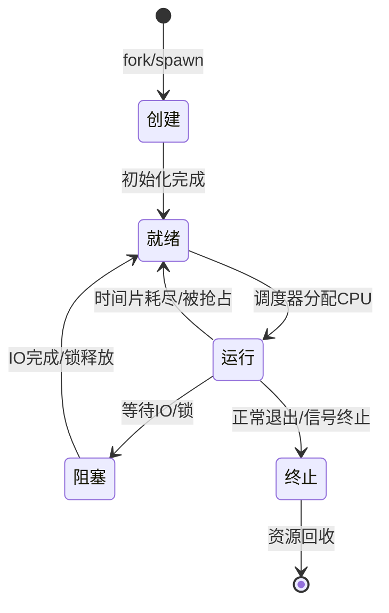
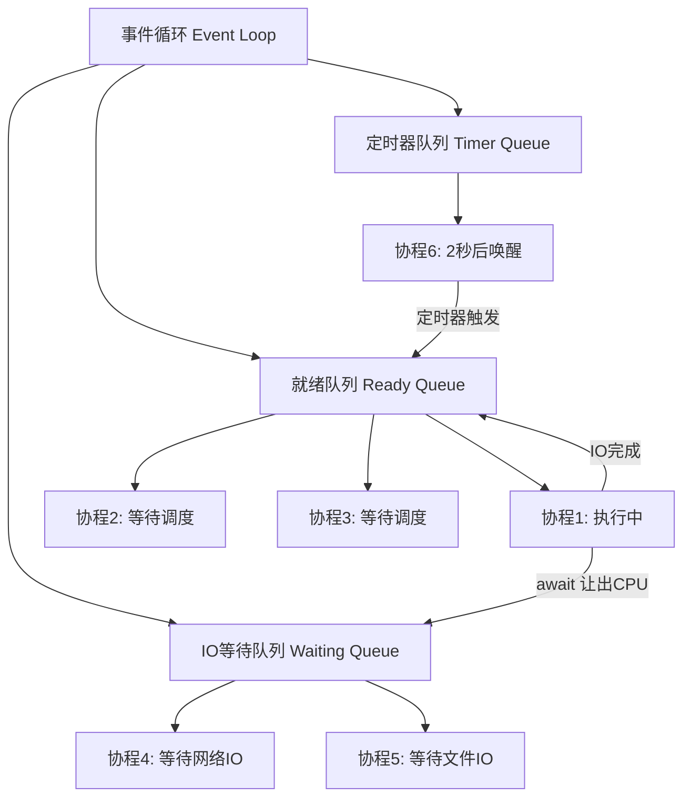

## 技巧一：基本操作——进程创建、线程管理与协程调度

在掌握了进程与线程的理论基础后，本节从"动手做"出发，覆盖日常开发中最高频的三类并发操作：**进程的创建与管理**、**线程的创建与同步**、**协程的创建与调度**。每个主题都遵循"原理→代码→调试→避坑"的完整闭环，确保读者不仅会写，还能排查问题、理解底层机制。

---

### 1. 进程的基本操作

#### 1.1 进程创建：fork、exec 与 spawn

Linux 创建进程有三条经典路径，适用场景各不相同：

| 创建方式 | 机制 | 适用场景 | 典型用途 |
|----------|------|----------|----------|
| `fork()` | 复制当前进程的完整地址空间（COW） | Unix/Linux 传统编程 | 守护进程、Shell |
| `exec()` 系列 | 替换当前进程映像为新程序 | fork 后加载新程序 | Shell 执行命令 |
| `spawn` | 不复制父进程，独立创建子进程 | Windows / Python multiprocessing | 跨平台多进程 |

**Python multiprocessing：跨平台进程创建**

Python 的 `multiprocessing` 模块封装了 OS 级进程操作，提供统一 API：

```python
import multiprocessing
import os
import time

def worker(name, delay):
    """子进程执行的函数"""
    print(f"[Worker-{name}] PID={os.getpid()}, PPID={os.getppid()}")
    time.sleep(delay)
    print(f"[Worker-{name}] 完成")

if __name__ == '__main__':
    processes = []
    for i in range(4):
        p = multiprocessing.Process(
            target=worker,
            args=(f"T{i}", 1 + i * 0.5),
            name=f"process-{i}"
        )
        processes.append(p)
        p.start()
        print(f"[Main] 启动子进程 {p.name}, PID={p.pid}")

    # 等待所有子进程完成
    for p in processes:
        p.join(timeout=10)
        if p.is_alive():
            print(f"[Main] 警告: {p.name} 超时，强制终止")
            p.terminate()

    print(f"[Main] 所有子进程已结束，退出码: {[p.exitcode for p in processes]}")
```

**fork 的 COW（Copy-on-Write）机制**

`fork()` 并不立即复制整个地址空间。操作系统利用 COW 机制延迟物理内存的复制：

- fork 后，父子进程共享相同的物理页面，但标记为"只读"
- 任一进程尝试写入时，触发页错误（page fault），内核才复制该页
- 这意味着 fork 后如果立即 exec（大多数情况），几乎零额外内存开销

fork() 调用流程：
┌──────────┐     fork()      ┌──────────┐
│ 父进程   │ ──────────────→ │ 父进程   │
│ (PID=100)│                 │ (PID=100)│
└──────────┘                 └─────┬────┘
                                   │ 写时复制触发页错误
┌──────────┐                       │
│ 子进程   │ ←────────────────────┘
│ (PID=101)│  内核复制被修改的页面
└──────────┘
  页表映射指向相同物理页（未修改时）

**Go 语言的 goroutine（轻量级"进程"）**

Go 的 goroutine 由运行时调度，开销极低（~2KB 栈），可以在单机上轻松创建数十万个：

```go
package main

import (
    "fmt"
    "sync"
    "time"
)

func worker(id int, wg *sync.WaitGroup) {
    defer wg.Done()
    fmt.Printf("[Worker-%d] 开始\n", id)
    time.Sleep(time.Duration(id) * 100 * time.Millisecond)
    fmt.Printf("[Worker-%d] 完成\n", id)
}

func main() {
    var wg sync.WaitGroup
    for i := 1; i <= 5; i++ {
        wg.Add(1)
        go worker(i, &amp;wg) // 启动 goroutine
    }
    wg.Wait() // 等待所有 goroutine 完成
    fmt.Println("所有任务完成")
}
```

#### 1.2 进程间通信（IPC）

进程拥有独立地址空间，必须通过 IPC 机制交换数据。常用的 IPC 方式：

| IPC 方式 | 性能 | 复杂度 | 适用场景 | 容量限制 |
|----------|------|--------|----------|----------|
| 管道（Pipe） | 高 | 低 | 父子进程单向通信 | 64KB（Linux 默认） |
| 命名管道（FIFO） | 高 | 低 | 无亲缘关系进程通信 | 64KB |
| 共享内存 | 最高 | 高 | 大数据量高频交换 | 受限于物理内存 |
| 消息队列 | 中 | 中 | 结构化消息传递 | 受限于内核配置 |
| Unix Socket | 中 | 中 | 跨机器/本地进程通信 | 无特殊限制 |
| 信号（Signal） | - | 低 | 事件通知（非数据传输） | 仅信号编号 |

**管道 IPC 示例（Python）**

```python
import multiprocessing
import os

def sender(conn):
    """发送端：通过管道发送数据"""
    data = {"cmd": "query", "params": {"table": "users", "limit": 10}}
    conn.send(data)
    print(f"[Sender] PID={os.getpid()}, 已发送: {data}")

    reply = conn.recv()
    print(f"[Sender] 收到回复: {reply}")
    conn.close()

def receiver(conn):
    """接收端：通过管道接收并处理"""
    data = conn.recv()
    print(f"[Receiver] PID={os.getpid()}, 收到: {data}")

    # 模拟处理
    result = {"status": "ok", "rows": 10}
    conn.send(result)
    print(f"[Receiver] 已发送回复: {result}")
    conn.close()

if __name__ == '__main__':
    parent_conn, child_conn = multiprocessing.Pipe(duplex=True)

    p1 = multiprocessing.Process(target=sender, args=(parent_conn,))
    p2 = multiprocessing.Process(target=receiver, args=(child_conn,))

    p1.start()
    p2.start()

    p1.join()
    p2.join()
    print("[Main] IPC 通信完成")
```

**共享内存示例（Python）**

```python
import multiprocessing
import numpy as np

def compute_chunk(shared_arr, start, end):
    """在共享内存上执行计算"""
    # 直接操作共享内存区域，无需序列化
    for i in range(start, end):
        shared_arr[i] = shared_arr[i] ** 2

if __name__ == '__main__':
    size = 1_000_000
    # 创建共享内存数组
    shared_array = multiprocessing.Array('d', size)

    # 初始化数据
    for i in range(size):
        shared_array[i] = float(i)

    # 分4块并行计算
    chunk_size = size // 4
    processes = []
    for i in range(4):
        start = i * chunk_size
        end = start + chunk_size
        p = multiprocessing.Process(
            target=compute_chunk,
            args=(shared_array, start, end)
        )
        processes.append(p)
        p.start()

    for p in processes:
        p.join()

    # 验证结果
    print(f"前5个元素: {[shared_array[i] for i in range(5)]}")
    print(f"预期值:     {[float(i**2) for i in range(5)]}")
```

#### 1.3 进程的生命周期管理



关键管理操作：

```bash
# 查看所有进程及其状态
ps aux --sort=-%mem | head -20

# 查看特定进程的子进程树
pstree -p <PID>

# 向进程发送信号
kill -TERM <PID>   # 优雅终止（SIGTERM=15）
kill -KILL <PID>   # 强制杀死（SIGKILL=9，不可捕获）
kill -USR1 <PID>   # 用户自定义信号（常用于日志轮转）

# 查看进程打开的文件描述符
ls -la /proc/<PID>/fd

# 查看进程的内存映射
cat /proc/<PID>/maps

# 限制进程资源（ulimit）
ulimit -n 4096     # 最大文件描述符数
ulimit -s 8192     # 栈大小（KB）
```

---

### 2. 线程的基本操作

#### 2.1 线程创建与基本生命周期

**Python threading：标准线程操作**

```python
import threading
import time
import random

class DownloadTask:
    """模拟文件下载任务"""

    def __init__(self, name, size_mb):
        self.name = name
        self.size_mb = size_mb
        self.progress = 0
        self.complete = False
        self._lock = threading.Lock()

    def download(self):
        """执行下载（模拟）"""
        chunks = 10
        for i in range(chunks):
            time.sleep(random.uniform(0.1, 0.3))  # 模拟网络延迟
            with self._lock:
                self.progress = int((i + 1) / chunks * 100)
        with self._lock:
            self.complete = True

    def get_status(self):
        with self._lock:
            return f"{self.name}: {self.progress}%{' ✓' if self.complete else ''}"

def main():
    files = [
        DownloadTask("ubuntu-24.04.iso", 4500),
        DownloadTask("pytorch-2.0.tar.gz", 2100),
        DownloadTask("dataset.zip", 850),
    ]

    # 创建并启动线程
    threads = []
    for task in files:
        t = threading.Thread(target=task.download, name=f"dl-{task.name}")
        threads.append((t, task))
        t.start()

    # 监控下载进度
    while any(t.is_alive() for t, _ in threads):
        status = " | ".join(task.get_status() for _, task in threads)
        print(f"\r{status}", end="", flush=True)
        time.sleep(0.5)

    print()  # 换行
    for _, task in threads:
        print(f"  {task.get_status()}")

if __name__ == '__main__':
    main()
```

**线程 vs 进程的关键差异**

| 维度 | 线程 | 进程 |
|------|------|------|
| 内存共享 | 共享进程地址空间 | 独立地址空间 |
| 创建开销 | ~微秒级（几KB栈） | ~毫秒级（需分配地址空间） |
| 通信方式 | 直接读写共享变量 | 需 IPC（管道/共享内存等） |
| 崩溃影响 | 一个线程崩溃可能导致整个进程退出 | 进程崩溃不影响其他进程 |
| Python GIL | 同一进程内线程无法利用多核（CPU密集型） | 不受 GIL 限制，真正并行 |
| 调度 | OS 线程调度 / 用户态调度 | OS 进程调度 |
| 适用场景 | IO 密集型、轻量级并发 | CPU 密集型、隔离性要求高 |

#### 2.2 线程同步原语

多线程共享内存时，必须使用同步机制防止竞态条件（Race Condition）。

**锁（Lock / Mutex）**

```python
import threading

class BankAccount:
    """线程安全的银行账户"""

    def __init__(self, balance=0):
        self.balance = balance
        self._lock = threading.Lock()

    def deposit(self, amount):
        with self._lock:  # 等价于 acquire() + try/finally + release()
            new_balance = self.balance + amount
            # 模拟处理延迟（放大竞态条件窗口）
            import time
            time.sleep(0.001)
            self.balance = new_balance
            return self.balance

    def withdraw(self, amount):
        with self._lock:
            if self.balance < amount:
                raise ValueError("余额不足")
            self.balance -= amount
            return self.balance

# 演示竞态条件
account = BankAccount(1000)
threads = []
for _ in range(100):
    t = threading.Thread(target=account.deposit, args=(10,))
    threads.append(t)
    t.start()

for t in threads:
    t.join()

print(f"最终余额: {account.balance}")  # 正确值: 2000
```

**可重入锁（RLock）**

当一个线程需要多次获取同一把锁时（如递归调用），必须使用 RLock：

```python
import threading

class ConnectionPool:
    def __init__(self):
        self._rlock = threading.RLock()  # 同一线程可重复获取
        self._connections = []

    def get_connection(self):
        with self._rlock:
            if self._connections:
                return self._connections.pop()
            return self._create_connection()

    def return_connection(self, conn):
        with self._rlock:
            if self._validate(conn):       # 内部也会获取 _rlock
                self._connections.append(conn)

    def _validate(self, conn):
        with self._rlock:  # 同一线程再次获取同一把锁——普通 Lock 会死锁
            return conn is not None

    def _create_connection(self):
        with self._rlock:
            return {"id": len(self._connections)}
```

**条件变量（Condition）**

用于线程间的"等待-通知"模式，典型如生产者-消费者模型：

```python
import threading
import time
import random
from collections import deque

class BoundedBuffer:
    """有界缓冲区：经典的生产者-消费者模型"""

    def __init__(self, capacity=10):
        self.buffer = deque()
        self.capacity = capacity
        self.condition = threading.Condition()

    def produce(self, item):
        with self.condition:
            # 缓冲区满时等待
            while len(self.buffer) >= self.capacity:
                print(f"  [Producer] 缓冲区已满({len(self.buffer)}/{self.capacity})，等待...")
                self.condition.wait()

            self.buffer.append(item)
            print(f"  [Producer] 放入 {item}，缓冲区: {len(self.buffer)}/{self.capacity}")
            self.condition.notify_all()  # 通知消费者

    def consume(self):
        with self.condition:
            # 缓冲区空时等待
            while len(self.buffer) == 0:
                print(f"  [Consumer] 缓冲区为空，等待...")
                self.condition.wait()

            item = self.buffer.popleft()
            print(f"  [Consumer] 取出 {item}，缓冲区: {len(self.buffer)}/{self.capacity}")
            self.condition.notify_all()  # 通知生产者
            return item

def producer_task(buf, count):
    for i in range(count):
        time.sleep(random.uniform(0.05, 0.15))
        buf.produce(f"item-{i}")

def consumer_task(buf, count):
    for _ in range(count):
        time.sleep(random.uniform(0.1, 0.3))
        item = buf.consume()

if __name__ == '__main__':
    buf = BoundedBuffer(capacity=3)
    items_to_produce = 10

    t1 = threading.Thread(target=producer_task, args=(buf, items_to_produce))
    t2 = threading.Thread(target=consumer_task, args=(buf, items_to_produce))

    t1.start()
    t2.start()
    t1.join()
    t2.join()
    print("生产者-消费者完成")
```

**信号量（Semaphore）**

控制对有限资源的并发访问数量，如连接池、限流器：

```python
import threading
import time

class RateLimiter:
    """基于信号量的请求限流器"""

    def __init__(self, max_concurrent=3):
        self.semaphore = threading.Semaphore(max_concurrent)

    def request(self, url):
        with self.semaphore:
            print(f"  [{threading.current_thread().name}] 请求 {url}")
            time.sleep(0.5)  # 模拟网络请求
            print(f"  [{threading.current_thread().name}] 完成 {url}")

limiter = RateLimiter(max_concurrent=3)
threads = [threading.Thread(target=limiter.request, args=(f"http://api/{i}",)) for i in range(8)]

for t in threads:
    t.start()
for t in threads:
    t.join()
```

#### 2.3 守护线程与线程池

**守护线程（Daemon Thread）**

守护线程在所有非守护线程退出后会被自动终止，适合执行后台心跳、日志刷新等任务：

```python
import threading
import time

def heartbeat():
    """守护线程：每2秒发送心跳"""
    while True:
        print(f"  [Heartbeat] {time.strftime('%H:%M:%S')}")
        time.sleep(2)

def main_task():
    print("[Main] 开始工作...")
    time.sleep(5)
    print("[Main] 工作完成")

# 创建守护线程
hb = threading.Thread(target=heartbeat, daemon=True, name="heartbeat")
hb.start()

# 主线程执行任务
main_task()
# 主线程结束后，守护线程自动终止，无需手动关闭
print("[Main] 退出")
```

**线程池（ThreadPoolExecutor）**

手动创建/销毁线程开销大，线程池通过复用线程减少开销：

```python
from concurrent.futures import ThreadPoolExecutor, as_completed
import time
import random

def fetch_url(url):
    """模拟网络请求"""
    delay = random.uniform(0.5, 2.0)
    time.sleep(delay)
    if random.random() < 0.2:
        raise ConnectionError(f"连接失败: {url}")
    return {"url": url, "status": 200, "time": round(delay, 2)}

urls = [f"http://example.com/page/{i}" for i in range(20)]

# 使用线程池并发请求
results = []
errors = []

with ThreadPoolExecutor(max_workers=5, thread_name_prefix="fetch") as executor:
    future_to_url = {executor.submit(fetch_url, url): url for url in urls}

    for future in as_completed(future_to_url):
        url = future_to_url[future]
        try:
            result = future.result()
            results.append(result)
            print(f"  ✓ {result['url']} ({result['time']}s)")
        except Exception as e:
            errors.append((url, str(e)))
            print(f"  ✗ {url}: {e}")

print(f"\n成功: {len(results)}/{len(urls)}, 失败: {len(errors)}")
```

**线程池 vs 手动线程的性能对比**

| 维度 | 手动创建线程 | ThreadPoolExecutor |
|------|-------------|-------------------|
| 创建开销 | 每次任务都创建/销毁线程 | 线程复用，仅创建一次 |
| 最大并发数控制 | 需手动限制 | max_workers 参数 |
| 异常处理 | 需逐个 try/except | future.exception() 统一处理 |
| 结果收集 | 需额外同步机制 | future.result() 直接获取 |
| 适用场景 | 少量长期运行任务 | 大量短期任务批量处理 |

---

### 3. 协程的基本操作

#### 3.1 协程的本质：用户态调度

协程（Coroutine）是一种在**用户态**进行上下文切换的并发模型。与线程的关键区别：

| 维度 | 线程 | 协程 |
|------|------|------|
| 调度方式 | OS 内核调度（抢占式） | 用户态调度（协作式） |
| 切换开销 | ~1-10 微秒（需陷入内核） | ~纳秒级（仅保存/恢复寄存器） |
| 并发数量 | 通常数千级别 | 可达数十万甚至百万 |
| 内存占用 | 每线程 ~1MB 栈 | 每协程 ~几KB |
| 适用场景 | CPU 密集 + IO 密集 | 高并发 IO 密集型 |
| 能否利用多核 | 可以（多线程） | 不能（单线程内调度） |
| 同步原语 | Lock/Semaphore/Condition | async/await + asyncio 同步原语 |

#### 3.2 Python asyncio：现代协程实践

```python
import asyncio
import aiohttp
import time

async def fetch_page(session, url, index):
    """异步获取单个页面"""
    print(f"  [Task-{index}] 开始请求 {url}")
    async with session.get(url, timeout=aiohttp.ClientTimeout(total=10)) as resp:
        text = await resp.text()
        print(f"  [Task-{index}] 完成, 状态码={resp.status}, 长度={len(text)}")
        return {"url": url, "status": resp.status, "length": len(text)}

async def main():
    urls = [
        "http://httpbin.org/delay/1",
        "http://httpbin.org/delay/2",
        "http://httpbin.org/delay/1",
        "http://httpbin.org/get",
    ]

    async with aiohttp.ClientSession() as session:
        # 方式一：gather — 并发执行所有任务
        start = time.time()
        tasks = [fetch_page(session, url, i) for i, url in enumerate(urls)]
        results = await asyncio.gather(*tasks, return_exceptions=True)
        elapsed = time.time() - start

        print(f"\n  gather 结果: {len(results)} 个任务, 耗时 {elapsed:.2f}s")

        # 方式二：create_task + 手动控制
        start = time.time()
        task_list = [asyncio.create_task(fetch_page(session, url, i)) for i, url in enumerate(urls)]

        for task in task_list:
            result = await task
            print(f"  收到结果: {result}")

        elapsed = time.time() - start
        print(f"  create_task 结果: 耗时 {elapsed:.2f}s")

# 运行
asyncio.run(main())
```

#### 3.3 异步上下文管理与异步迭代

```python
import asyncio

class AsyncDatabasePool:
    """异步数据库连接池示例"""

    def __init__(self, max_size=5):
        self.max_size = max_size
        self._pool = asyncio.Queue(maxsize=max_size)
        self._count = 0

    async def __aenter__(self):
        """异步上下文管理器入口"""
        print("  [Pool] 初始化连接池")
        for i in range(self.max_size):
            conn = f"conn-{i}"
            await self._pool.put(conn)
            self._count += 1
        return self

    async def __aexit__(self, exc_type, exc_val, exc_tb):
        """异步上下文管理器出口"""
        while not self._pool.empty():
            conn = await self._pool.get()
            print(f"  [Pool] 关闭连接 {conn}")
            self._count -= 1
        print("  [Pool] 连接池已关闭")
        return False  # 不抑制异常

    async def acquire(self):
        return await self._pool.get()

    async def release(self, conn):
        await self._pool.put(conn)

async def query(pool, sql):
    conn = await pool.acquire()
    try:
        print(f"  [{conn}] 执行: {sql}")
        await asyncio.sleep(0.1)  # 模拟查询
        return {"rows": 42, "conn": conn}
    finally:
        await pool.release(conn)

async def main():
    async with AsyncDatabasePool(max_size=3) as pool:
        # 并发执行多个查询
        queries = [
            "SELECT * FROM users LIMIT 10",
            "SELECT COUNT(*) FROM orders",
            "SELECT AVG(price) FROM products",
        ]
        results = await asyncio.gather(*[query(pool, sql) for sql in queries])
        for r in results:
            print(f"  结果: {r['rows']} 行 (via {r['conn']})")

asyncio.run(main())
```

#### 3.4 协程的调度模型：事件循环



asyncio 事件循环的核心调度逻辑：

```python
import asyncio
import time

async def task_a(name, delay):
    print(f"  [{name}] 开始 (t={time.time() - START:.2f}s)")
    await asyncio.sleep(delay)  # 让出CPU给事件循环
    print(f"  [{name}] 结束 (t={time.time() - START:.2f}s)")
    return name

async def main():
    global START
    START = time.time()

    # 三个任务并发执行，总耗时 = max(1, 2, 0.5) = 2s
    # 如果串行执行则需要 3.5s
    results = await asyncio.gather(
        task_a("A", 1.0),
        task_a("B", 2.0),
        task_a("C", 0.5),
    )

    print(f"  结果: {results}")
    print(f"  总耗时: {time.time() - START:.2f}s (串行需 3.5s)")

asyncio.run(main())
```

---

### 4. 三种并发模型的选择指南

面对并发需求时，如何选择正确的模型：

| 场景特征 | 推荐模型 | 原因 |
|----------|---------|------|
| CPU 密集型计算（数值计算、加密） | **多进程** | 绕过 GIL，利用多核 |
| IO 密集型 + 中等并发（<500连接） | **多线程** | 简单可靠，共享内存 |
| IO 密集型 + 高并发（>1000连接） | **协程** | 极低开销，单线程管理海量连接 |
| 需要进程隔离（安全沙箱） | **多进程** | 进程崩溃不影响其他 |
| 需要低延迟（实时系统） | **协程** | 上下文切换开销最小 |
| 混合型负载 | **进程 + 协程** | 多进程利用多核 + 进程内协程处理IO |

```python
import multiprocessing
import asyncio
from concurrent.futures import ProcessPoolExecutor

def cpu_bound_task(n):
    """CPU密集型：在子进程中运行"""
    return sum(i * i for i in range(n))

async def io_bound_task(url):
    """IO密集型：在协程中运行"""
    await asyncio.sleep(0.1)
    return f"fetched {url}"

async def hybrid_worker(urls, cpu_tasks):
    """混合模型：进程池处理CPU任务 + 协程处理IO任务"""
    loop = asyncio.get_event_loop()

    # CPU密集型任务在线程池中执行（避免阻塞事件循环）
    with ProcessPoolExecutor() as pool:
        cpu_results = await asyncio.gather(*[
            loop.run_in_executor(pool, cpu_bound_task, n)
            for n in cpu_tasks
        ])

    # IO密集型任务用协程并发
    io_results = await asyncio.gather(*[io_bound_task(url) for url in urls])

    return cpu_results, io_results

# 示例
cpu_tasks = [10**7, 10**7, 10**7]
urls = [f"http://example.com/{i}" for i in range(10)]

results = asyncio.run(hybrid_worker(urls, cpu_tasks))
print(f"CPU 结果: {results[0]}")
print(f"IO 结果: {results[1]}")
```

---

### 5. 调试并发代码

#### 5.1 线程调试工具

```bash
# 查看进程的线程数
ps -eLf | grep <PID> | wc -l

# 查看各线程的 CPU 占用
top -H -p <PID>

# 查看线程的系统调用（strace）
strace -f -p <PID> -e trace=process,futex

# Python 线程调试
python -X faulthandler script.py  # 线程死锁时打印栈回溯

# GDB 调试多线程程序
gdb -p <PID>
(gdb) info threads          # 列出所有线程
(gdb) thread 2              # 切换到线程2
(gdb) bt                    # 打印调用栈
```

#### 5.2 死锁检测与预防

```python
import threading
import time
import atexit

# 全局死锁检测器
_deadlock_detector_registered = False

def detect_deadlock():
    """检测死锁：获取所有锁的持有关系"""
    alive_threads = threading.enumerate()
    print(f"  [DeadlockDetector] 活跃线程: {len(alive_threads)}")
    for t in alive_threads:
        print(f"    - {t.name} (daemon={t.daemon}, alive={t.is_alive()})")

# 常见死锁场景：锁顺序不一致
lock_a = threading.Lock()
lock_b = threading.Lock()

def safe_operation_1():
    """正确做法：统一锁获取顺序"""
    with lock_a:
        with lock_b:
            print("  [Op1] 持有 A+B")
            time.sleep(0.1)

def safe_operation_2():
    """正确做法：同样先获取 A 再获取 B"""
    with lock_a:
        with lock_b:
            print("  [Op2] 持有 A+B")
            time.sleep(0.1)

# 死锁预防策略
# 1. 锁排序（Lock Ordering）：所有线程按相同顺序获取锁
# 2. 超时机制：lock.acquire(timeout=5) 设置超时
# 3. try_lock 模式：获取失败则释放已有锁并重试

def deadlock_free_operation(lock1, lock2, timeout=5):
    """死锁安全的锁获取：使用超时 + 重试"""
    while True:
        acquired_1 = lock1.acquire(timeout=timeout)
        if not acquired_1:
            continue

        acquired_2 = lock2.acquire(timeout=timeout)
        if acquired_2:
            try:
                # 业务逻辑
                return True
            finally:
                lock2.release()
                lock1.release()
        else:
            lock1.release()  # 获取第二把锁失败，释放第一把
            time.sleep(0.01)  # 短暂退避后重试
```

#### 5.3 竞态条件检测

```bash
# Python thread sanitizer（实验性）
pip install threadsanity

# 使用 pytest 检测并发问题
pip install pytest-xdist

# 压力测试暴露竞态条件
python -c "
import threading, random

counter = 0
errors = []

def unsafe_increment():
    global counter
    for _ in range(10000):
        tmp = counter
        random.uniform(0, 0.00001)  # 放大竞态窗口
        counter = tmp + 1

threads = [threading.Thread(target=unsafe_increment) for _ in range(10)]
for t in threads:
    t.start()
for t in threads:
    t.join()

expected = 100000
print(f'预期: {expected}, 实际: {counter}, 丢失: {expected - counter}')
# 实际输出会小于预期值，证明竞态条件存在
"
```

---

### 6. 常见误区与避坑指南

| 误区 | 正确做法 | 原因 |
|------|---------|------|
| Python 多线程做 CPU 密集型任务 | 改用 `multiprocessing` | GIL 导致多线程无法并行执行 Python 字节码 |
| 用 `threading.Thread` 不设 `daemon` | 后台任务设 `daemon=True` | 非守护线程会阻止进程退出 |
| `fork()` 后在子线程中做复杂操作 | fork 后立即 exec 或改用 spawn | fork 仅复制调用线程，其他线程状态丢失 |
| 在协程中调用 `time.sleep()` | 使用 `await asyncio.sleep()` | 同步阻塞会阻塞整个事件循环 |
| 不处理 `Future` 的异常 | 用 `try/except` 或 `return_exceptions=True` | 未处理的异常会静默丢失 |
| 共享变量不加锁直接读写 | 使用 `Lock`、`Queue` 等同步原语 | 竞态条件导致数据不一致 |
| `threading.Lock` 在递归函数中使用 | 改用 `threading.RLock` | 同一线程重复获取 Lock 会死锁 |
| 进程间直接共享 Python 对象 | 使用 `multiprocessing.Value/Array` 或 Manager | 普通对象仅在当前进程地址空间内 |

---

### 7. 性能基准：验证你的并发方案

在生产部署前，务必进行基准测试以验证并发方案的有效性：

```python
import time
import threading
import multiprocessing
import asyncio

def cpu_work(n):
    """CPU 密集型工作"""
    return sum(i * i for i in range(n))

def benchmark_threads(work_fn, args_list, max_workers=4):
    """多线程基准"""
    start = time.time()
    with __import__('concurrent.futures').ThreadPoolExecutor(max_workers=max_workers) as pool:
        results = list(pool.map(work_fn, args_list))
    return time.time() - start, results

def benchmark_processes(work_fn, args_list, max_workers=4):
    """多进程基准"""
    start = time.time()
    with __import__('concurrent.futures').ProcessPoolExecutor(max_workers=max_workers) as pool:
        results = list(pool.map(work_fn, args_list))
    return time.time() - start, results

def benchmark_sync(work_fn, args_list):
    """串行基准"""
    start = time.time()
    results = [work_fn(a) for a in args_list]
    return time.time() - start, results

if __name__ == '__main__':
    task_args = [10**6] * 8

    t_sync, _ = benchmark_sync(cpu_work, task_args)
    t_thread, _ = benchmark_threads(cpu_work, task_args)
    t_process, _ = benchmark_processes(cpu_work, task_args)

    print(f"串行:     {t_sync:.3f}s (基准)")
    print(f"多线程:   {t_thread:.3f}s (加速比: {t_sync/t_thread:.2f}x)")
    print(f"多进程:   {t_process:.3f}s (加速比: {t_sync/t_process:.2f}x)")
    print()
    print("注意：CPU密集型任务，多线程因GIL可能无加速甚至更慢；")
    print("      多进程可获得接近线性的加速比。")
```

---

### 8. 实用速查表

#### 8.1 进程操作速查

```bash
# 进程查看
ps aux                          # 查看所有进程
ps -ef --forest                 # 树状查看进程关系
pstree -p                       # 进程树

# 进程控制
kill -TERM <PID>                # 优雅终止
kill -KILL <PID>                # 强制杀死
nohup command &amp;                 # 后台运行，不受终端关闭影响
disown %1                       # 从 shell 任务列表移除

# 资源限制
ulimit -a                       # 查看所有限制
nice -n 10 command              # 低优先级运行
renice -5 -p <PID>              # 调整运行中进程优先级
```

#### 8.2 线程/协程代码模板

```python
# ---- 多线程模板 ----
from concurrent.futures import ThreadPoolExecutor, as_completed

def process_items(items, max_workers=8):
    results = {}
    with ThreadPoolExecutor(max_workers=max_workers) as executor:
        futures = {executor.submit(process, item): item for item in items}
        for future in as_completed(futures):
            item = futures[future]
            try:
                results[item] = future.result()
            except Exception as e:
                print(f"  错误 {item}: {e}")
    return results

# ---- 异步协程模板 ----
import asyncio

async def process_items_async(items, max_concurrent=100):
    semaphore = asyncio.Semaphore(max_concurrent)

    async def limited_task(item):
        async with semaphore:
            return await process_async(item)

    return await asyncio.gather(*[limited_task(item) for item in items])
```
