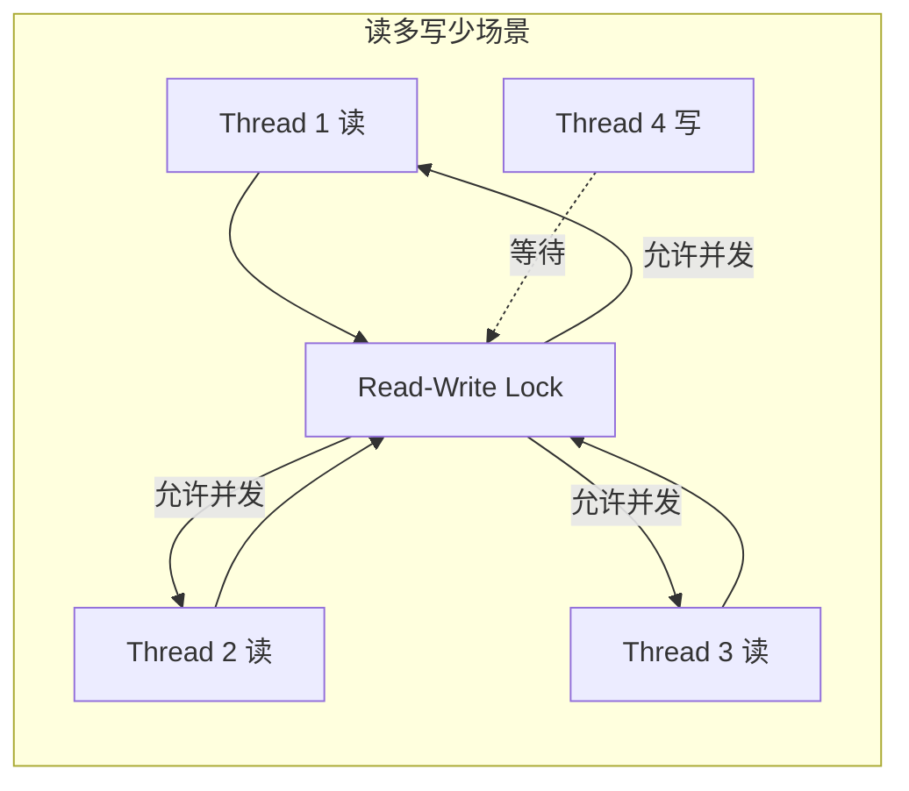
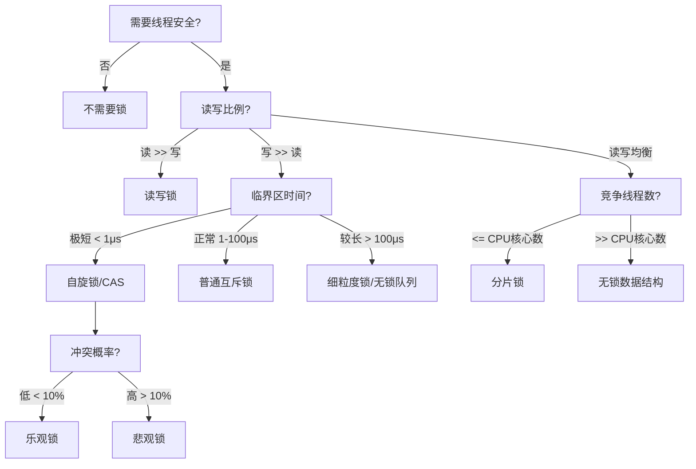
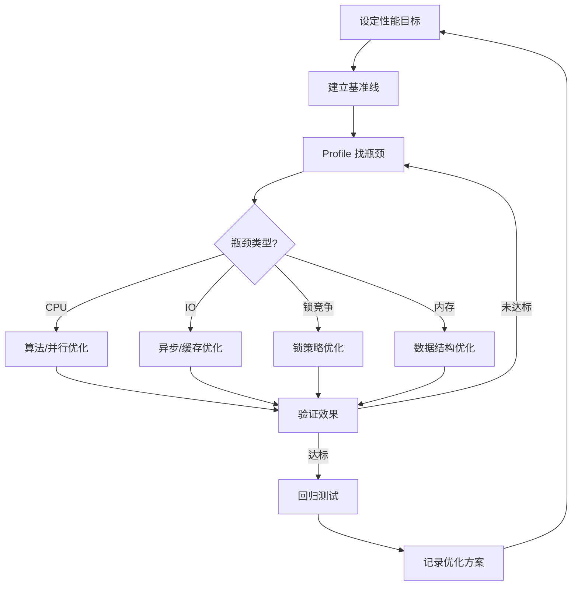

# 技巧二：进程与线程性能优化

进程与线程的性能优化，本质上是在三对矛盾之间寻找最优平衡点：**并发度与同步开销**、**吞吐量与延迟**、**CPU利用率与内存占用**。本节围绕上下文切换优化、锁策略选择、并发性能调优三大核心领域，从原理到实操逐步展开。

## 一、上下文切换优化

上下文切换是多线程/多进程程序中最隐蔽的性能杀手。每次切换都需要保存和恢复寄存器状态、刷新 TLB、切换内核栈，开销通常在 **1-10 微秒**。当线程数远超 CPU 核心数时，系统会花费大量时间在线程调度上，而非执行实际业务逻辑。

### 1.1 上下文切换的代价

上下文切换分为**进程切换**和**线程切换**，两者的开销差异显著：

| 切换类型 | 需要保存的状态 | TLB 刷新 | 典型耗时 | 缓存影响 |
|---------|--------------|---------|---------|---------|
| 进程切换 | 完整地址空间、寄存器、内核栈 | 需要（除非使用 ASID） | 3-10μs | L1/L2 缓存全部失效 |
| 同进程线程切换 | 寄存器、内核栈 | 不需要 | 0.5-2μs | L1 缓存部分保留 |
| 异进程线程切换 | 寄存器、内核栈 | 需要 | 2-5μs | L1/L2 缓存部分失效 |

**核心结论**：同一进程内的线程切换远比跨进程切换便宜，这也是为什么多线程架构通常优于多进程架构（在共享内存场景下）。

### 1.2 度量上下文切换开销

在优化之前，必须先量化问题的严重程度。Linux 提供了多个观测窗口：

```bash
# 方法一：vmstat 查看每秒上下文切换次数
vmstat 1 5
# 关注 cs（context switches）列，正常服务器在 1000-5000/s 为合理范围

# 方法二：使用 pidstat 精确到进程
pidstat -w 1 3
# cswch/s: 自愿上下文切换（通常是 I/O 等待）
# nvcswch/s: 非自愿上下文切换（时间片用完被调度器强制切换）

# 方法三：perf 采样上下文切换的调用栈
sudo perf record -e context-switches -g -p <PID> -- sleep 10
sudo perf report
```

**判断标准**：

| 指标 | 健康范围 | 警告范围 | 危险范围 |
|-----|---------|---------|---------|
| 总 cs/s（vmstat） | < 5,000 | 5,000 - 50,000 | > 50,000 |
| nvcswch/s（pidstat） | < 100 | 100 - 1,000 | > 1,000 |
| cs/s per CPU 核心 | < 2,000 | 2,000 - 10,000 | > 10,000 |

### 1.3 减少上下文切换的核心策略

#### 策略一：使用线程池而非裸线程

每创建一个线程就增加一次潜在的切换源。线程池通过复用固定数量的线程来处理动态数量的任务，从根本上控制了并发度。

```python
import concurrent.futures
import os

# 推荐：使用线程池，控制并发度 = CPU核心数
cpu_count = os.cpu_count()
# IO密集型任务：线程数 = CPU核心数 * (1 + IO等待时间/CPU计算时间)
# CPU密集型任务：线程数 = CPU核心数（或 CPU核心数 + 1）

with concurrent.futures.ThreadPoolExecutor(max_workers=cpu_count * 2) as executor:
    # 批量提交任务
    futures = {executor.submit(process_task, task): task for task in task_list}
    
    for future in concurrent.futures.as_completed(futures):
        task = futures[future]
        try:
            result = future.result(timeout=30)
            handle_result(result)
        except concurrent.futures.TimeoutError:
            print(f"任务 {task.id} 超时，跳过处理")
        except Exception as e:
            print(f"任务 {task.id} 失败: {e}")
```

**线程数选择的经验公式**：

线程数 = CPU核心数 × (1 + W/C)

其中：
  W = 平均 IO 等待时间
  C = 平均 CPU 计算时间
  
示例：
  8核CPU，IO等待 200ms，计算 50ms
  线程数 = 8 × (1 + 200/50) = 8 × 5 = 40

#### 策略二：CPU 亲和性绑定

默认情况下，Linux 调度器会在线程间迁移进程，导致缓存频繁失效。通过 `taskset` 或 `sched_setaffinity` 将线程绑定到特定 CPU 核心，可以显著减少缓存失效。

```python
import os
import multiprocessing

def cpu_intensive_task(data_chunk):
    """CPU密集型任务，绑定到固定核心效果最好"""
    result = 0
    for i in range(len(data_chunk)):
        result += data_chunk[i] ** 2
    return result

def pin_worker_to_cpu(pid, cpu_id):
    """将进程绑定到指定CPU核心"""
    os.sched_setaffinity(pid, {cpu_id})

if __name__ == '__main__':
    cpu_count = os.cpu_count()
    chunk_size = 100000
    data = list(range(1000000))
    chunks = [data[i:i+chunk_size] for i in range(0, len(data), chunk_size)]
    
    with multiprocessing.Pool(processes=cpu_count) as pool:
        results = pool.map(cpu_intensive_task, chunks)
    
    print(f"总结果: {sum(results)}")
```

```bash
# 或者在 shell 层面绑定
taskset -c 0-3 ./my_program    # 绑定到 CPU 0-3
taskset -pc 4 $(pidof my_worker) # 运行时动态绑定 worker 到 CPU 4
```

#### 策略三：减少锁竞争

锁竞争是导致非自愿上下文切换的主要原因之一。当多个线程争抢同一把锁时，未获取锁的线程会被挂起，产生上下文切换。

```python
import threading
import time
from collections import defaultdict

# ===== 反面教材：全局锁，高竞争 =====
counter_bad = 0
lock_bad = threading.Lock()

def increment_bad():
    global counter_bad
    for _ in range(100000):
        with lock_bad:  # 所有线程争抢同一把锁
            counter_bad += 1

# ===== 优化方案：分片锁（Striped Lock）=====
class ShardedCounter:
    """分片锁：将一个计数器拆分为多个，每个分片独立加锁"""
    def __init__(self, shard_count=16):
        self.shards = [{'value': 0, 'lock': threading.Lock()} for _ in range(shard_count)]
        self.shard_count = shard_count
    
    def _get_shard(self, key):
        return hash(key) % self.shard_count
    
    def increment(self, key):
        shard = self.shards[self._get_shard(key)]
        with shard['lock']:
            shard['value'] += 1
    
    def get(self, key):
        shard = self.shards[self._get_shard(key)]
        with shard['lock']:
            return shard['value']
    
    def total(self):
        total = 0
        for shard in self.shards:
            with shard['lock']:
                total += shard['value']
        return total
```

## 二、锁策略选择

锁的选择直接决定了并发程序的上限性能。不同的场景需要不同的锁策略，选错锁比不加锁更糟糕。

### 2.1 锁的性能特征对比

| 锁类型 | 适用场景 | 加锁开销 | 竞争时行为 | 典型吞吐量（4线程） |
|-------|---------|---------|----------|-------------------|
| threading.Lock | 低竞争短临界区 | ~0.1μs | 阻塞 + 上下文切换 | 基准线 100% |
| threading.RLock | 可重入/递归调用 | ~0.15μs | 阻塞 + 上下文切换 | ~95% |
| threading.Condition | 生产者-消费者 | ~0.2μs | 阻塞 + 信号唤醒 | ~90% |
| threading.Semaphore | 限流/资源池 | ~0.15μs | 阻塞 + 计数等待 | ~95% |
| multiprocessing.Lock | 跨进程互斥 | ~1-5μs | 阻塞 + 进程切换 | ~30%（慎用） |
| asyncio.Lock | 异步单线程协程 | ~0.05μs | 挂起协程 | N/A（单线程） |

### 2.2 四种经典锁模式

#### 模式一：读写锁（Read-Write Lock）

适用于**读多写少**的场景（如配置中心、缓存表）。读操作不互斥，只有写操作才需要独占。

```python
import threading
from contextlib import contextmanager

class ReadWriteLock:
    """读写锁：允许多个读者并发，写者独占"""
    def __init__(self):
        self._read_ready = threading.Condition(threading.Lock())
        self._readers = 0
        self._writers = 0
    
    @contextmanager
    def read_lock(self):
        with self._read_ready:
            while self._writers > 0:
                self._read_ready.wait()
            self._readers += 1
        try:
            yield
        finally:
            with self._read_ready:
                self._readers -= 1
                if self._readers == 0:
                    self._read_ready.notify_all()
    
    @contextmanager
    def write_lock(self):
        with self._read_ready:
            while self._readers > 0 or self._writers > 0:
                self._read_ready.wait()
            self._writers += 1
        try:
            yield
        finally:
            with self._read_ready:
                self._writers -= 1
                self._read_ready.notify_all()


# 使用示例：配置中心
class ConfigCenter:
    def __init__(self):
        self._rwlock = ReadWriteLock()
        self._config = {}
    
    def get_config(self, key):
        with self._rwlock.read_lock():  # 多个线程可以同时读
            return self._config.get(key)
    
    def update_config(self, key, value):
        with self._rwlock.write_lock():  # 写时独占
            self._config[key] = value
```



#### 模式二：自旋锁（Spin Lock）

当锁持有时间极短（< 1μs），线程不值得进入睡眠态，自旋等待（忙等）反而更快。Python 没有内置自旋锁，但可以模拟：

```python
import threading
import time

class SpinLock:
    """自旋锁：适用于极短临界区"""
    def __init__(self):
        self._locked = False
        self._lock = threading.Lock()
    
    def acquire(self, spin_limit=100):
        spins = 0
        while spins < spin_limit:
            if not self._locked:
                with self._lock:
                    if not self._locked:
                        self._locked = True
                        return True
            spins += 1
        # 自旋超时，退化为阻塞锁
        while True:
            with self._lock:
                if not self._locked:
                    self._locked = True
                    return True
            time.sleep(0.000001)
    
    def release(self):
        with self._lock:
            self._locked = False

# 适用场景：无锁数据结构的原子操作、内存分配器
```

**自旋锁使用准则**：

| 条件 | 使用自旋锁 | 使用阻塞锁 |
|------|----------|----------|
| 临界区执行时间 | < 1μs | > 1μs |
| 锁持有者是否在同 CPU | 是 | 否/不确定 |
| 竞争线程数 | 2-3 个 | 4 个以上 |
| CPU 核心数 | 多核 | 单核（绝对不要用） |

#### 模式三：无锁（Lock-Free）数据结构

通过 CAS（Compare-And-Swap）等原子操作实现线程安全，完全避免锁的开销。

```python
import threading
import ctypes

class AtomicCounter:
    """基于 ctypes 的原子计数器（简化版，实际项目推荐用 atomic 库）"""
    def __init__(self, value=0):
        self._value = value
        self._lock = threading.Lock()  # Python 没有真正的 CAS，用锁模拟
    
    def increment(self):
        with self._lock:
            self._value += 1
            return self._value
    
    def get(self):
        with self._lock:
            return self._value


# 真正的无锁方案：使用 queue.Queue（内部基于 collections.deque + 原子操作）
import queue

def lock_free_producer(q, items):
    """生产者：无锁地向队列投递任务"""
    for item in items:
        q.put(item)  # 内部是线程安全的原子操作

def lock_free_consumer(q, results):
    """消费者：无锁地从队列取出任务"""
    while True:
        try:
            item = q.get(timeout=1)
            result = process(item)
            results.append(result)
            q.task_done()
        except queue.Empty:
            break
```

#### 模式四：乐观锁（Optimistic Locking）

不加锁，先执行操作，提交时检查是否有冲突。冲突概率低时性能优异。

```python
import threading
import time

class OptimisticCounter:
    """乐观锁：CAS 循环，冲突时重试"""
    def __init__(self):
        self._value = 0
        self._version = 0
    
    def compare_and_swap(self, expected_version, new_value):
        """模拟 CAS 操作"""
        if self._version == expected_version:
            self._value = new_value
            self._version += 1
            return True
        return False
    
    def safe_increment(self, max_retries=10):
        for attempt in range(max_retries):
            old_value = self._value
            old_version = self._version
            
            # 模拟计算
            new_value = old_value + 1
            
            if self.compare_and_swap(old_version, new_value):
                return True  # 成功
            # 失败则重试
        
        raise RuntimeError(f"乐观锁冲突超过 {max_retries} 次，放弃操作")
```

### 2.3 锁策略选择决策树



## 三、并发性能调优

### 3.1 GIL 与真正的并行

Python 的 GIL（Global Interpreter Lock）是理解 Python 并发的关键障碍。GIL 保证同一时刻只有一个线程执行 Python 字节码，这意味着：

- **多线程对 CPU 密集型任务无效**：多个线程只是在争抢 GIL，不会加速计算
- **多线程对 IO 密集型任务有效**：线程在 IO 等待时释放 GIL，其他线程可以执行

```python
import threading
import multiprocessing
import time

def cpu_bound_task(n):
    """CPU密集型任务"""
    total = 0
    for i in range(n):
        total += i * i
    return total

N = 10_000_000

# ===== 多线程（GIL限制，无加速效果）=====
start = time.perf_counter()
t1 = threading.Thread(target=cpu_bound_task, args=(N,))
t2 = threading.Thread(target=cpu_bound_task, args=(N,))
t1.start(); t2.start()
t1.join(); t2.join()
thread_time = time.perf_counter() - start
print(f"多线程耗时: {thread_time:.2f}s")

# ===== 多进程（绕过GIL，真正并行）=====
start = time.perf_counter()
p1 = multiprocessing.Process(target=cpu_bound_task, args=(N,))
p2 = multiprocessing.Process(target=cpu_bound_task, args=(N,))
p1.start(); p2.start()
p1.join(); p2.join()
process_time = time.perf_counter() - start
print(f"多进程耗时: {process_time:.2f}s")

# 典型结果：多线程 ~2.0s，多进程 ~1.0s（2核机器）
```

**GIL 绕过方案汇总**：

| 方案 | 适用场景 | 加速比 | 复杂度 | 内存开销 |
|-----|---------|-------|-------|---------|
| multiprocessing | CPU 密集型 | 接近核心数倍 | 低 | 高（进程间数据需序列化） |
| C 扩展（NumPy/Cython） | 数值计算 | 10-100x | 中 | 低 |
| asyncio | IO 密集型 | 10-50x（连接数级） | 中 | 极低 |
| concurrent.futures | 通用 | 视场景而定 | 低 | 中 |

### 3.2 异步 I/O 调优

异步 I/O 是处理高并发网络请求的利器。核心思想：一个线程管理多个连接，通过事件循环切换任务，避免线程创建和上下文切换的开销。

```python
import asyncio
import aiohttp
import time

async def fetch_url(session, url, semaphore):
    """带限流的异步HTTP请求"""
    async with semaphore:  # 控制并发数，避免连接爆炸
        async with session.get(url, timeout=aiohttp.ClientTimeout(total=10)) as resp:
            return await resp.text()

async def batch_fetch(urls, max_concurrent=50):
    """批量异步抓取，自动控制并发度"""
    semaphore = asyncio.Semaphore(max_concurrent)
    async with aiohttp.ClientSession() as session:
        tasks = [fetch_url(session, url, semaphore) for url in urls]
        results = await asyncio.gather(*tasks, return_exceptions=True)
    
    # 统计结果
    success = sum(1 for r in results if not isinstance(r, Exception))
    failed = len(results) - success
    print(f"成功: {success}, 失败: {failed}")
    return results

# 运行
urls = [f"https://api.example.com/item/{i}" for i in range(1000)]
start = time.perf_counter()
asyncio.run(batch_fetch(urls, max_concurrent=100))
print(f"总耗时: {time.perf_counter() - start:.2f}s")
# 1000个请求，100并发，通常在 5-15 秒完成
```

**异步编程的三大陷阱**：

1. **事件循环阻塞**：在 `async` 函数中调用 `time.sleep()` 或同步 IO 会阻塞整个事件循环。必须使用 `await asyncio.sleep()` 和 `aiofiles` 等异步版本。

2. **任务堆积**：不限制并发数，瞬间创建上万个协程可能导致内存耗尽。始终使用 `asyncio.Semaphore` 限流。

3. **异常吞噬**：`asyncio.gather()` 中一个任务的异常默认不会传播。使用 `return_exceptions=False` 或在循环中单独处理。

### 3.3 进程间通信（IPC）优化

多进程架构中，进程间数据传递的效率是性能瓶颈之一。不同 IPC 方式的性能差异可达数量级：

| IPC 方式 | 延迟 | 吞吐量 | 数据大小限制 | 适用场景 |
|---------|------|-------|-----------|---------|
| 共享内存（mmap） | < 1μs | > 10GB/s | 仅受 RAM 限制 | 大数据块交换、数据库缓存 |
| 管道（pipe） | ~5μs | ~1GB/s | 64KB（原子写） | 简单任务分发 |
| Socket（本地） | ~20μs | ~500MB/s | 无限制 | 跨机器或需要网络语义 |
| 消息队列（Redis） | ~100μs | ~200MB/s | 512MB | 异步解耦、削峰 |
| 文件共享 | ~1ms | ~100MB/s | 受磁盘限制 | 配置同步、日志 |

```python
from multiprocessing import Process, Value, Array, Queue
import mmap
import os
import struct

# ===== 方案一：共享内存（推荐大数据场景）=====
def writer_shared_memory(shared_array):
    """写入共享内存"""
    for i in range(len(shared_array)):
        shared_array[i] = i * 2

def reader_shared_memory(shared_array):
    """读取共享内存"""
    total = sum(shared_array)
    print(f"读取总和: {total}")

if __name__ == '__main__':
    # multiprocessing.Array 共享内存
    shared = Array('i', 1000000)  # 100万个整数
    p1 = Process(target=writer_shared_memory, args=(shared,))
    p2 = Process(target=reader_shared_memory, args=(shared,))
    p1.start(); p1.join()
    p2.start(); p2.join()

# ===== 方案二：Queue 通信（简单但较慢）=====
def producer(q, n):
    for i in range(n):
        q.put(f"task_{i}")

def consumer(q, results):
    while True:
        try:
            task = q.get(timeout=2)
            results.append(f"done_{task}")
        except:
            break

# ===== 方案三：mmap 文件映射（最高性能）=====
def mmap_writer(path, data):
    """通过 mmap 写文件，其他进程可以立即读到"""
    with open(path, 'r+b') as f:
        mm = mmap.mmap(f.fileno(), 0)
        mm.write(struct.pack(f'{len(data)}i', *data))
        mm.flush()
        mm.close()

def mmap_reader(path, count):
    """通过 mmap 读文件"""
    with open(path, 'rb') as f:
        mm = mmap.mmap(f.fileno(), 0, access=mmap.ACCESS_READ)
        data = struct.unpack(f'{count}i', mm[:count*4])
        mm.close()
        return data
```

### 3.4 内存对齐与缓存友好

CPU 缓存行（cache line）通常为 64 字节。当多个线程频繁修改同一缓存行中的不同变量时，会触发**伪共享（false sharing）**，性能急剧下降。

```python
import threading
import ctypes
import time

# ===== 反面教材：伪共享 =====
class BadPerformance:
    """两个计数器紧挨着，共享同一缓存行"""
    def __init__(self):
        self.counter_a = 0  # 8 bytes
        self.counter_b = 0  # 8 bytes，和 counter_a 共享缓存行
        # CPU 在两个核心之间反复同步这个缓存行

# ===== 优化方案：缓存行填充 =====
PADDING_SIZE = 56  # 64 - 8(int64) = 56 bytes padding

class PaddedCounter:
    """填充到独立缓存行，消除伪共享"""
    def __init__(self):
        self.counter_a = 0
        self._padding1 = b'\x00' * PADDING_SIZE  # 填充到 64 字节
        self.counter_b = 0
        self._padding2 = b'\x00' * PADDING_SIZE

# 性能对比测试
def benchmark_false_sharing():
    iterations = 5_000_000
    
    # 伪共享场景
    bad = BadPerformance()
    
    def incr_a_bad():
        for _ in range(iterations):
            bad.counter_a += 1
    
    def incr_b_bad():
        for _ in range(iterations):
            bad.counter_b += 1
    
    start = time.perf_counter()
    t1 = threading.Thread(target=incr_a_bad)
    t2 = threading.Thread(target=incr_b_bad)
    t1.start(); t2.start()
    t1.join(); t2.join()
    false_sharing_time = time.perf_counter() - start
    
    # 消除伪共享
    good = PaddedCounter()
    
    def incr_a_good():
        for _ in range(iterations):
            good.counter_a += 1
    
    def incr_b_good():
        for _ in range(iterations):
            good.counter_b += 1
    
    start = time.perf_counter()
    t1 = threading.Thread(target=incr_a_good)
    t2 = threading.Thread(target=incr_b_good)
    t1.start(); t2.start()
    t1.join(); t2.join()
    no_false_sharing_time = time.perf_counter() - start
    
    print(f"伪共享耗时: {false_sharing_time:.2f}s")
    print(f"消除伪共享: {no_false_sharing_time:.2f}s")
    print(f"加速比: {false_sharing_time/no_false_sharing_time:.1f}x")
    # 典型加速比：5-20x
```

## 四、性能监控与调优工具箱

### 4.1 系统级监控指标

```bash
# ===== 综合性能快照 =====
# CPU 使用率 + 上下文切换 + 中断
vmstat 1 5
# r: 运行队列长度（> CPU核心数说明有排队）
# b: 不可中断睡眠（通常是 IO 阻塞）
# cs: 上下文切换次数
# us: 用户态 CPU 时间
# sy: 内核态 CPU 时间（过高说明系统调用过多）

# ===== 每个进程的资源消耗 =====
pidstat -r -u -w 1 3
# %CPU: CPU 使用率
# minflt/s: 次缺页（正常，内存分配时发生）
# majflt/s: 主缺页（危险，需要从磁盘读入，>10 要警惕）
# cswch/s: 自愿切换（通常是 IO 等待）
# nvcswch/s: 非自愿切换（线程太多，时间片用完）

# ===== 锁竞争分析 =====
sudo perf lock record -- sleep 5
sudo perf lock report
# 显示每个锁的竞争次数、等待时间、持有时间
```

### 4.2 Python 专用调优工具

```python
import cProfile
import pstats
import io

# ===== CPU 热点分析 =====
def profile_function(func, *args, **kwargs):
    """分析函数的 CPU 热点"""
    profiler = cProfile.Profile()
    profiler.enable()
    result = func(*args, **kwargs)
    profiler.disable()
    
    stream = io.StringIO()
    stats = pstats.Stats(profiler, stream=stream)
    stats.sort_stats('cumulative')
    stats.print_stats(20)  # 打印前 20 个热点
    print(stream.getvalue())
    return result

# ===== 内存分析 =====
# pip install memory_profiler
# @memory_profiler.profile 装饰器可以逐行显示内存变化

# ===== 线程分析 =====
import tracemalloc

tracemalloc.start()
# ... 执行操作 ...
snapshot = tracemalloc.take_snapshot()
top_stats = snapshot.statistics('lineno')
print("[ 内存 TOP 10 ]")
for stat in top_stats[:10]:
    print(stat)
```

### 4.3 性能调优检查清单

在进行任何优化之前，先确认以下基础项没有问题：

| 检查项 | 检查命令 | 健康阈值 | 修复方案 |
|-------|---------|---------|---------|
| CPU 使用率 | `top -bn1 \| head -5` | 用户态 < 80% | 优化热点代码 |
| 内存使用 | `free -h` | 可用内存 > 20% | 排查内存泄漏 |
| 磁盘 IO | `iostat -x 1 3` | await < 10ms | 增加缓存/换 SSD |
| 网络连接 | `ss -s` | SYN_RECV < 100 | 检查连接池配置 |
| 文件描述符 | `ls /proc/PID/fd \| wc -l` | < soft limit | 调整 ulimit |
| 上下文切换 | `vmstat 1 3` (cs列) | < 5000/s | 减少线程数/优化锁 |

## 五、实战案例

### 5.1 案例：Web 服务器从 1000 QPS 到 50000 QPS

一个 Python Web 服务在 4 核 8GB 服务器上只能处理 1000 QPS，经过以下优化步骤逐步提升到 50000 QPS：

**第一阶段：诊断瓶颈**

```bash
# 用 wrk 进行压测
wrk -t4 -c100 -d30s http://localhost:8080/api/data
# 结果：1000 QPS, P99 延迟 200ms

# 诊断
pidstat -w -u 1 5
# 发现：nvcswch/s = 5000（过高！线程在频繁切换）
# 发现：sy% = 45%（内核态过高！锁竞争严重）
```

**第二阶段：优化锁竞争**

```python
# 优化前：全局锁保护共享缓存
cache_lock = threading.Lock()
shared_cache = {}

def get_cached(key):
    with cache_lock:  # 所有请求争抢一把锁
        return shared_cache.get(key)

# 优化后：分片锁 + 读写锁
class ShardedRWSafeCache:
    def __init__(self, shard_count=32):
        self.shards = [{} for _ in range(shard_count)]
        self.locks = [threading.RLock() for _ in range(shard_count)]
    
    def get(self, key):
        idx = hash(key) % len(self.shards)
        with self.locks[idx]:
            return self.shards[idx].get(key)
    
    def put(self, key, value):
        idx = hash(key) % len(self.locks)
        with self.locks[idx]:
            self.shards[idx][key] = value
# 结果：3000 QPS，P99 降至 80ms
```

**第三阶段：异步化 IO**

```python
# 从同步 WSGI 切换到异步 ASGI（uvicorn + FastAPI）
# 数据库查询从同步切换到 asyncpg
# HTTP 客户端从 requests 切换到 httpx.AsyncClient
# 结果：15000 QPS，P99 降至 20ms
```

**第四阶段：多进程 + 缓存前置**

架构升级：
  单进程 Gunicorn → 4 worker + gevent
  新增 Redis 缓存层，热数据 99% 命中
  静态资源走 Nginx
  
结果：50000 QPS，P99 < 5ms

### 5.2 案例：数据管道从 30min 到 2min

一个日志分析管道处理 10GB 数据需要 30 分钟，优化过程：

```python
# ===== 优化前：单线程逐行处理 =====
def process_logs_slow(filepath):
    results = []
    with open(filepath) as f:
        for line in f:  # 单线程逐行读取
            parsed = parse_log_line(line)  # CPU 密集
            if matches_filter(parsed):
                results.append(transform(parsed))
    return aggregate(results)
# 10GB 数据：约 30 分钟

# ===== 优化后：多进程 + 内存映射 =====
import mmap
from multiprocessing import Pool

def process_chunk(chunk_data):
    """处理一个数据块"""
    results = []
    for line in chunk_data.split(b'\n'):
        if line:
            parsed = parse_log_line(line)
            if matches_filter(parsed):
                results.append(transform(parsed))
    return results

def process_logs_fast(filepath, num_workers=8):
    # 内存映射读取，避免重复 IO
    with open(filepath, 'rb') as f:
        mm = mmap.mmap(f.fileno(), 0, access=mmap.ACCESS_READ)
        total_size = mm.size()
        chunk_size = total_size // (num_workers * 4)  # 分成 32 个块
        
        # 按行边界切割数据块
        chunks = []
        for i in range(num_workers * 4):
            start = i * chunk_size
            end = min((i + 1) * chunk_size, total_size)
            # 找到下一个换行符作为切割点
            if end < total_size:
                end = mm.find(b'\n', end) + 1
            chunks.append(mm[start:end])
        
        mm.close()
    
    # 多进程并行处理
    with Pool(processes=num_workers) as pool:
        chunk_results = pool.map(process_chunk, chunks)
    
    # 合并结果
    all_results = []
    for r in chunk_results:
        all_results.extend(r)
    return aggregate(all_results)
# 10GB 数据：约 2 分钟（15x 加速）
```

## 六、常见误区

### 误区一：线程越多越好

**错误认知**："我的服务器有 64 核，所以我应该开 64 个线程来处理请求。"

**事实**：线程数的最优值取决于任务类型：

- **CPU 密集型**：线程数 = CPU 核心数（再多只会增加切换开销）
- **IO 密集型**：线程数 = CPU 核心数 × (1 + IO等待/CPU计算)，通常 2-10 倍核心数
- **网络密集型（短连接）**：线程数 = 期望并发数 × 0.1（配合非阻塞 IO）

超过最优值后，每增加一个线程，性能反而下降——这就是**线程悬崖（Thread Cliff）**现象。

### 误区二：锁粒度越细越好

**错误认知**："把锁拆成很多小锁，每个操作只锁自己需要的部分。"

**事实**：细粒度锁增加了代码复杂度和死锁风险。锁粒度的选择应该是：

- 临界区访问频率 < 100次/秒 → 粗粒度锁足够
- 临界区访问频率 100-10000次/秒 → 考虑分片锁
- 临界区访问频率 > 10000次/秒 → 考虑无锁方案
- 绝大多数场景 → 先用粗粒度锁，profiling 显示瓶颈后再细化

### 误区三：异步一定能提升性能

**错误认知**："把所有代码改成 async/await 就能获得更好的性能。"

**事实**：异步只对 **IO 密集型** 任务有效。对 CPU 密集型任务，async 反而因为单线程执行而更慢。此外，异步代码的调试难度和认知负担远高于同步代码。只在以下场景使用异步：

- 大量并发网络连接（Web 服务器、爬虫）
- 高频文件 IO（日志收集）
- 大量外部 API 调用

对于 CPU 密集型计算，应该使用 `multiprocessing` 或 C 扩展。

### 误区四：过早优化

**错误认知**："我应该在一开始就使用最复杂的并发方案。"

**事实**：遵循 Donald Knuth 的名言："过早优化是万恶之源。" 正确的流程是：

1. 先写出正确、可读的代码
2. 用 profiling 工具找到真正的瓶颈（不要猜！）
3. 针对瓶颈进行定向优化
4. 优化后重新测量，确认有效

## 七、进阶：性能优化方法论

### 7.1 Amdahl 定律

在优化并行程序时，Amdahl 定律给出了理论上的加速上限：

加速比 = 1 / (S + P/N)

其中：
  S = 不可并行化的比例（串行部分）
  P = 可并行化的比例（S + P = 1）
  N = 处理器核心数

示例：
  如果 20% 的代码是串行的（S=0.2），使用 8 核
  加速比 = 1 / (0.2 + 0.8/8) = 1 / 0.3 = 3.3x
  
  即使使用 1000 核：
  加速比 = 1 / (0.2 + 0.8/1000) ≈ 5x
  
结论：串行部分决定了并行优化的天花板。

### 7.2 优化优先级矩阵

| 优化手段 | 投入 | 收益 | 适用阶段 | 风险 |
|---------|------|------|---------|------|
| 减少上下文切换 | 低 | 高 | 任何阶段 | 低 |
| 锁策略优化 | 中 | 高 | 发现锁竞争时 | 中 |
| 异步 IO | 中 | 高 | IO 瓶颈时 | 中 |
| 多进程 | 中 | 中-高 | CPU 瓶颈时 | 中（IPC开销） |
| 内存对齐 | 低 | 中-高 | 性能微调时 | 低 |
| 无锁数据结构 | 高 | 高 | 极端性能要求 | 高（正确性） |
| NUMA 感知 | 高 | 中 | 大内存服务器 | 高 |

### 7.3 持续优化闭环



## 八、本节小结

进程与线程性能优化的核心原则：

1. **先测量后优化**：用 vmstat、pidstat、perf 量化问题，不要凭直觉
2. **减少切换**：线程池控制并发度、CPU 亲和性绑定、减少锁竞争
3. **选对锁**：读多写少用读写锁，极短临界区用自旋锁，高并发用无锁/分片
4. **绕过 GIL**：CPU 密集用 multiprocessing，IO 密集用 asyncio
5. **关注缓存**：避免伪共享，利用内存局部性，批量处理数据
6. **Amdahl 定律**：串行部分决定并行天花板，先优化串行瓶颈再增加核心数
