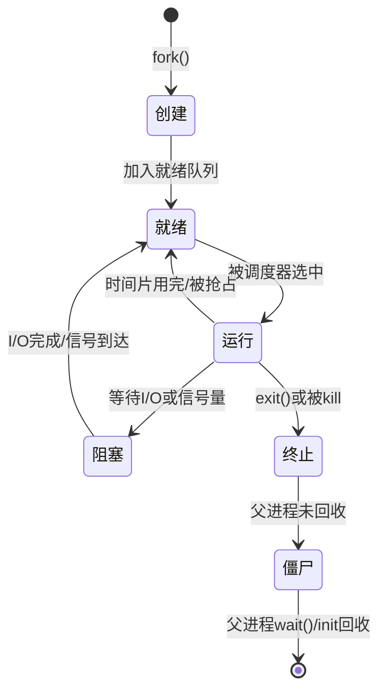
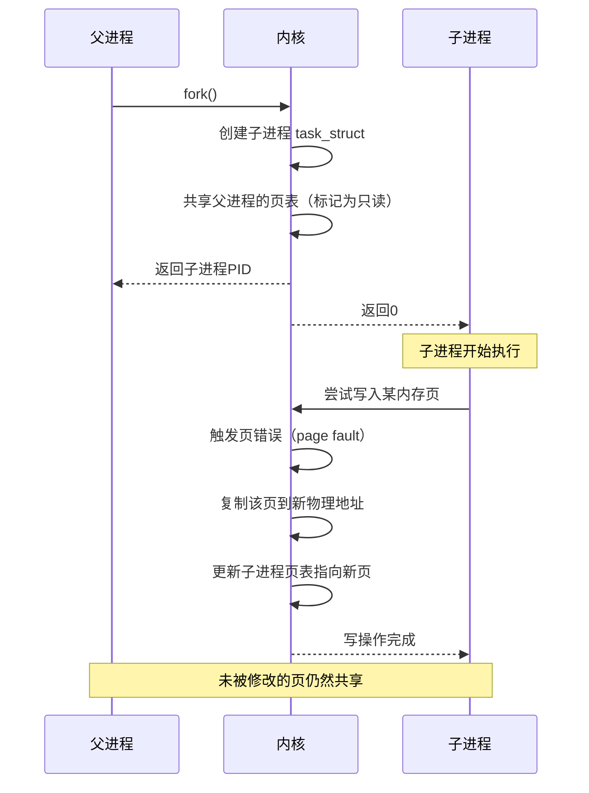
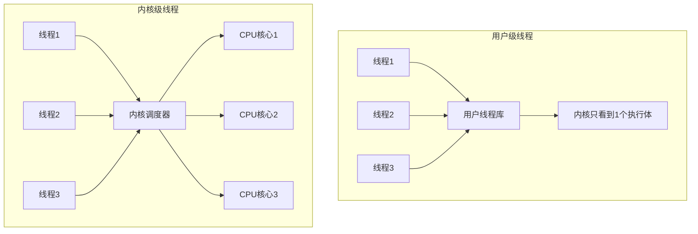

## 什么是进程与线程

进程与线程是操作系统最核心的抽象概念，也是理解并发编程、系统性能优化、资源管理的基石。无论是编写一个简单的命令行工具，还是设计支撑亿级用户的分布式系统，对进程和线程的理解深度直接决定了工程师的技术上限。本节从操作系统原理出发，系统性地讲清楚"进程是什么、线程是什么、它们如何协作、又如何影响程序的行为"。

---

### 1. 为什么需要进程与线程

要理解进程和线程，首先要理解一个根本问题：**为什么操作系统不能直接运行程序，而必须引入"进程"和"线程"这两个抽象层？**

#### 1.1 没有进程抽象的世界

早期的计算机（如1950-60年代）没有操作系统或只有极简的监控程序。程序员需要：

- 手动将程序加载到内存的固定地址
- 手动管理所有硬件资源（磁带机、打印机、打孔卡读取器）
- 一个程序独占整台机器，运行完才能加载下一个

这种模式存在三个致命问题：

1. **资源浪费**：CPU 在等待 I/O（如读磁带）时完全空转，利用率可能低至 5%
2. **无法隔离**：一个程序的 bug 可能直接破坏另一个程序的数据，甚至导致整机崩溃
3. **无法并发**：即使机器有多个外设，也只能串行执行任务

#### 1.2 操作系统的解决方案

操作系统引入了两个关键抽象来解决上述问题：

- **进程（Process）**：为程序提供一个"虚拟的独占计算机"，包含独立的内存空间、文件描述符、安全上下文等。解决了隔离和资源管理问题。
- **线程（Thread）**：在进程内部实现并发执行，多个线程共享进程的地址空间。解决了同一任务内的并行计算问题。

```mermaid
graph TB
    subgraph 没有抽象
        A1[程序A] -->|直接访问| HW1[硬件资源]
        A2[程序B] -->|直接访问| HW1
    end

    subgraph 有抽象
        B1[程序A] --> P1[进程A]
        B2[程序B] --> P2[进程B]
        P1 --> OS1[操作系统]
        P2 --> OS1
        OS1 -->|调度与隔离| HW2[硬件资源]
    end

    style 没有抽象 fill:#1a1a2e,stroke:#e74c3c
    style 有抽象 fill:#1a1a2e,stroke:#2ecc71
```



---

### 2. 进程（Process）：程序的一次执行实例

#### 2.1 进程的严格定义

**进程是程序的一次执行实例**。同一个程序可以创建多个进程（例如你打开三个 Chrome 窗口，就是三个进程），不同程序自然是不同的进程。

更精确地说，进程是操作系统**资源分配的基本单位**。操作系统为每个进程维护一个独立的环境，使它看起来像是独占了整台计算机。

#### 2.2 进程的组成要素

一个进程在内核中由多种数据结构描述，核心组件如下：

| 组成部分 | 说明 | 类比 |
|----------|------|------|
| **地址空间** | 进程可访问的全部内存区域（代码段、数据段、堆、栈、共享库映射等） | 一栋独立的房子 |
| **PCB（进程控制块）** | 内核中的数据结构，存储进程的所有元信息（PID、状态、优先级、寄存器上下文等） | 户口本 |
| **文件描述符表** | 进程打开的所有文件、socket、管道等 I/O 资源的句柄 | 钥匙串 |
| **信号处理器** | 进程注册的信号处理函数 | 门铃 |
| **安全上下文** | 用户 ID、组 ID、权限位、命名空间 | 身份证 |
| **资源限制** | 最大文件大小、最大内存、最大进程数等 ulimit 设置 | 预算 |

#### 2.3 PCB 的内部结构

PCB（Process Control Block）是操作系统管理进程的核心数据结构。在 Linux 中，PCB 对应的是 `task_struct` 结构体（约 6KB，包含近 800 个字段）。以下是关键字段：

task_struct (Linux PCB)
├── 标识信息
│   ├── pid: 进程ID（全局唯一）
│   ├── tgid: 线程组ID（主线程的pid）
│   ├── parent: 父进程指针
│   └── children: 子进程链表
├── 状态信息
│   ├── state: TASK_RUNNING / TASK_INTERRUPTIBLE / TASK_UNINTERRUPTIBLE / TASK_STOPPED / TASK_ZOMBIE
│   ├── exit_code: 退出码
│   └── flags: PF_KTHREAD / PF_IDLE / PF_EXITING 等
├── 调度信息
│   ├── prio: 动态优先级
│   ├── static_prio: 静态优先级
│   ├── policy: SCHED_NORMAL / SCHED_FIFO / SCHED_RR
│   └── sched_class: 调度器类（CFS、RT、Deadline）
├── 内存信息
│   ├── mm_struct: 虚拟内存描述符
│   ├── active_mm: 当前活跃的地址空间
│   └── stack: 内核栈指针
├── 文件系统
│   ├── files: 打开文件表
│   ├── fs: 当前工作目录信息
│   └── nsproxy: 命名空间代理
└── 信号与通信
    ├── signal: 信号描述符
    ├── sighand: 信号处理函数表
    └── pending: 待处理信号位图

#### 2.4 进程状态机

进程在其生命周期中会在多个状态之间转换。Linux 进程状态模型如下：



各状态的详细解释：

| 状态 | 含义 | 典型触发条件 |
|------|------|------------|
| **TASK_RUNNING（就绪/运行）** | 正在CPU上执行，或在就绪队列中等待调度 | 调度器分配时间片 |
| **TASK_INTERRUPTIBLE（可中断睡眠）** | 等待某个事件（如I/O完成），可被信号唤醒 | `read()` 等待网络数据 |
| **TASK_UNINTERRUPTIBLE（不可中断睡眠）** | 等待硬件操作完成，信号无法打断 | `wait_for_completion()` 等待磁盘写入 |
| **TASK_STOPPED（停止）** | 被信号（SIGSTOP/SIGTSTP）暂停 | `Ctrl+Z`、`kill -STOP` |
| **TASK_ZOMBIE（僵尸）** | 已终止但父进程尚未回收其资源 | `exit()` 后父进程未调用 `wait()` |
| **EXIT_DEAD（死亡）** | 资源已被完全回收 | 父进程调用 `wait()` 后 |

> **僵尸进程的危害与排查**
>
> 僵尸进程本身不占用内存和 CPU，但它在进程表中占一个条目。如果父进程持续创建子进程但不回收（不调用 `wait()`），僵尸进程会逐渐积累，最终耗尽进程号空间（Linux 默认最大 32768 个），导致系统无法创建新进程。
>
> 排查方法：
> ```bash
> # 查找僵尸进程
> ps aux | awk '$8 == "Z"'
> # 找到其父进程
> ps -o ppid= -p <zombie_pid>
> # 如果父进程是 init(1)，僵尸会被自动回收
> # 如果父进程有问题，kill 父进程即可
> ```

#### 2.5 进程的创建：fork() 与 exec()

Linux 创建新进程的标准流程是 **fork + exec** 模式：

1. **fork()**：复制当前进程，创建一个几乎完全相同的子进程。子进程获得父进程地址空间、文件描述符、信号处理等的副本。
2. **exec() 系列函数**：用一个新的可执行程序替换子进程的地址空间。

```c
#include <unistd.h>
#include <stdio.h>

int main() {
    pid_t pid = fork();

    if (pid == 0) {
        // 子进程：执行新程序
        execlp("/bin/ls", "ls", "-la", "/tmp", NULL);
        // execlp 失败才会执行到这里
        perror("exec failed");
        return 1;
    } else if (pid > 0) {
        // 父进程：等待子进程结束
        int status;
        waitpid(pid, &amp;status, 0);
        printf("子进程退出码: %d\n", WEXITSTATUS(status));
    } else {
        // fork 失败
        perror("fork failed");
    }
    return 0;
}
```

**fork() 的写时复制（Copy-on-Write）机制**：

fork 并不会立即复制整个地址空间（那太慢了），而是采用写时复制策略：



这意味着：
- 如果 fork 后立即 exec（这是绝大多数情况），几乎没有任何内存复制开销
- 如果 fork 后子进程只读不写，父子进程的内存页完全共享
- 只有在修改时才发生实际的页面复制

#### 2.6 进程间通信（IPC）

由于进程拥有独立的地址空间，进程之间的数据交换需要通过操作系统提供的 IPC 机制：

| IPC 方式 | 原理 | 优点 | 缺点 | 典型场景 |
|----------|------|------|------|----------|
| **管道（pipe）** | 内核维护的字节流缓冲区 | 简单，shell 直接支持 | 半双工，只能父子进程间 | shell 命令串联 `ls \| grep` |
| **命名管道（FIFO）** | 文件系统上的特殊文件 | 无亲缘关系进程可用 | 仍受管道语义限制 | 老式 UNIX 客户端-服务端 |
| **共享内存** | 多个进程映射同一物理页面 | 最快（无内核拷贝） | 需要同步机制 | 数据库、Redis |
| **消息队列** | 内核维护的消息链表 | 结构化消息，支持类型 | 有内核拷贝开销 | 微服务异步通信 |
| **信号（Signal）** | 内核向进程发送的软中断 | 异步通知，延迟极低 | 只能传信号编号，不能传数据 | `kill -9`、`SIGCHLD` |
| **信号量** | 内核维护的计数器 | 用于进程间同步 | 编程复杂，易死锁 | 控制共享资源访问数量 |
| **Unix域套接字** | 基于文件系统的 socket | 功能丰富，支持双向 | 有协议开销 | 本地数据库连接（SQLite） |
| **D-Bus** | 消息总线协议 | 标准化，跨语言 | 相对较重 | Linux 桌面应用通信 |

#### 2.7 进程的资源隔离：命名空间与 cgroups

Linux 容器技术（Docker 的基础）通过两个内核机制实现了比传统进程更强的隔离：

**命名空间（Namespaces）——隔离"看到什么"**：

| 命名空间 | 隔离内容 | 效果 |
|----------|----------|------|
| PID | 进程 ID | 容器内 PID 从 1 开始 |
| NET | 网络设备、IP、端口 | 容器有独立网络栈 |
| MNT | 挂载点 | 容器有独立文件系统 |
| UTS | 主机名 | 容器可有独立主机名 |
| IPC | 信号量、消息队列 | 容器间 IPC 隔离 |
| USER | 用户/组 ID | 容器内可映射 UID |
| Cgroup | Cgroup 根目录 | 容器看不到宿主 cgroup |

**cgroups（控制组）——限制"能用多少"**：

```bash
# 创建一个 cgroup，限制 CPU 为 50%，内存上限 512MB
mkdir /sys/fs/cgroup/my_container
echo "50000 100000" > /sys/fs/cgroup/my_container/cpu.max
echo "536870912" > /sys/fs/cgroup/my_container/memory.max

# 将进程加入该 cgroup
echo <pid> > /sys/fs/cgroup/my_container/cgroup.procs
```

---

### 3. 线程（Thread）：进程内的并发执行单元

#### 3.1 线程的严格定义

**线程是进程内的一个独立执行流**。如果说进程是操作系统调度和资源分配的基本单位，那么线程就是 **CPU 调度和分派的基本单位**。

一个进程至少有一个线程（主线程），也可以有多个线程。同一进程内的所有线程共享：

- 地址空间（全局变量、堆内存）
- 文件描述符
- 信号处理器
- 进程 ID 和用户身份

同时每个线程拥有独立的：

- 程序计数器（PC）——决定执行哪条指令
- 栈空间 ——函数调用链和局部变量
- 寄存器上下文 ——当前的运算状态
- 线程局部存储（TLS）——线程私有的全局变量

#### 3.2 进程与线程的对比

| 维度 | 进程 | 线程 |
|------|------|------|
| **本质** | 资源分配单位 | CPU 调度单位 |
| **地址空间** | 独立的虚拟地址空间 | 共享所属进程的地址空间 |
| **创建开销** | 需要复制/映射页表、分配 PCB（fork 约 1-10ms） | 只需分配栈和寄存器上下文（约 0.1-1ms） |
| **切换开销** | 需切换页表、刷新 TLB、保存完整上下文（约 1-10μs） | 只需保存/恢复寄存器（约 0.1-1μs） |
| **通信方式** | 需要 IPC 机制（管道、共享内存等） | 直接读写共享变量 |
| **健壮性** | 一个进程崩溃不影响其他进程 | 一个线程崩溃可导致整个进程终止 |
| **安全性** | 天然隔离 | 共享内存导致数据竞争风险 |
| **资源占用** | 较高（独立地址空间、较多内核数据结构） | 较低（共享地址空间） |

#### 3.3 用户级线程与内核级线程

线程的实现有两种基本模型，理解它们的区别对理解性能特征至关重要：

**用户级线程（User-Level Threads, ULT）**：

- 线程的创建、调度、同步完全由用户空间的线程库管理
- 内核完全不知道这些线程的存在，只看到一个进程
- 优点：切换极快（无需陷入内核），可移植性好
- 缺点：一个线程阻塞（如系统调用）会导致整个进程阻塞；无法利用多核

**内核级线程（Kernel-Level Threads, KLT）**：

- 线程的创建、调度由内核直接管理
- 内核为每个线程维护独立的调度实体
- 优点：一个线程阻塞不影响其他线程；可利用多核并行
- 缺点：每次线程操作都需要内核介入，开销较大



**主流操作系统的线程模型**：

| 操作系统 | 线程模型 | 说明 |
|----------|----------|------|
| Linux（NPTL） | 1:1 模型 | 每个用户线程对应一个内核线程，现代 Linux 的标准方案 |
| Solaris | M:N 模型 | M 个用户线程映射到 N 个内核线程 |
| GNU/Linux（旧版） | 也支持 M:N | 早期 LinuxThreads 已被 NPTL 取代 |
| Windows | 1:1 模型 | 每个用户线程对应一个内核线程对象 |

#### 3.4 Linux 中的线程实现：轻量级进程

Linux 内核其实没有专门的"线程"概念。Linux 通过 `clone()` 系统调用创建**轻量级进程（Lightweight Process, LWP）**，通过控制共享哪些资源来模拟线程行为：

```c
// 创建一个与当前进程共享地址空间的线程（简化示意）
clone(child_fn,          // 子进程入口
      stack_ptr,         // 新栈指针
      CLONE_VM |         // 共享地址空间（线程的核心特征）
      CLONE_FS |         // 共享文件系统信息
      CLONE_FILES |      // 共享文件描述符
      CLONE_SIGHAND |    // 共享信号处理器
      CLONE_THREAD |     // 属于同一线程组
      CLONE_SYSVSEM |    // 共享信号量
      0,                 // 参数
      NULL);             // TLS 指针
```

`pthread` 库在 Linux 上就是基于 `clone()` 实现的。当你调用 `pthread_create()` 时：

```c
// pthread_create 的简化伪代码
int pthread_create(pthread_t *tid, const pthread_attr_t *attr,
                   void *(*start_routine)(void *), void *arg) {
    // 分配新栈空间
    void *stack = mmap(NULL, STACK_SIZE, PROT_READ|PROT_WRITE,
                       MAP_PRIVATE|MAP_ANONYMOUS, -1, 0);
    // 调用 clone，设置共享标志
    pid_t tid = clone(start_routine, stack_top,
                      CLONE_VM|CLONE_FS|CLONE_FILES|CLONE_SIGHAND|
                      CLONE_THREAD|CLONE_SYSVSEM|CLONE_SETTLS,
                      arg);
    // ...
}
```

**线程 ID 与进程 ID 的关系**：

- `pthread_t`（线程 ID）：用户空间的线程标识，用于 `pthread_join()` 等用户态 API
- `gettid()` 返回的 TID：内核中的线程标识，每个线程唯一
- `getpid()` 返回的 PID：进程标识，在同一线程组内所有线程相同（等于主线程的 TID）
- `getppid()` 返回的 PPID：父进程标识

```bash
# 查看进程中的线程
ps -eLf | grep nginx
# PID  PPID  LWP  ... CMD
# 1234  1     1234 ... nginx    ← 主线程，LWP=PID
# 1234  1     1235 ... nginx    ← 工作线程1
# 1234  1     1236 ... nginx    ← 工作线程2

# 用 /proc 查看线程信息
ls /proc/<pid>/task/
# 1234  1235  1236  ← 每个目录代表一个线程
```

---

### 4. 进程与线程的实际编程

#### 4.1 多进程编程

**场景**：Web 服务器为每个请求 fork 一个子进程（经典的 Apache prefork 模型），或 Python 使用 `multiprocessing` 绕过 GIL 实现并行计算。

```python
import multiprocessing
import os
import time

def worker(task_id):
    """工作进程：模拟CPU密集型任务"""
    print(f"[进程 {os.getpid()}] 开始处理任务 {task_id}")
    result = sum(i * i for i in range(10_000_000))
    print(f"[进程 {os.getpid()}] 任务 {task_id} 完成, 结果: {result}")
    return result

if __name__ == "__main__":
    # 创建进程池，使用4个进程并行处理
    with multiprocessing.Pool(processes=4) as pool:
        start = time.time()

        # map 自动将任务分配给工作进程
        results = pool.map(worker, range(8))

        elapsed = time.time() - start
        print(f"8个任务用 4 个进程完成，耗时: {elapsed:.2f}s")
        print(f"结果: {results}")
```

**多进程的注意事项**：

1. **进程间数据不共享**：`multiprocessing` 使用 pickle 序列化在进程间传递数据，大数据传递开销大
2. **全局变量隔离**：每个进程有独立的全局变量副本，修改不会互相影响
3. **资源回收**：必须用 `wait()` 或 `waitpid()` 回收子进程，否则产生僵尸进程
4. **fork 安全性**：fork 后子进程只保留调用 fork 的线程，其他线程的状态丢失，可能导致死锁

#### 4.2 多线程编程

**场景**：I/O 密集型应用（网络代理、文件服务器）需要同时处理大量并发连接。

```python
import threading
import time
import queue

def producer(q, name):
    """生产者线程：生产数据"""
    for i in range(5):
        item = f"{name}-item-{i}"
        q.put(item)
        print(f"[生产者 {name}] 生产: {item}")
        time.sleep(0.1)

def consumer(q, name):
    """消费者线程：消费数据"""
    while True:
        try:
            item = q.get(timeout=2)
            print(f"[消费者 {name}] 消费: {item}")
            time.sleep(0.2)  # 模拟处理
            q.task_done()
        except queue.Empty:
            break

if __name__ == "__main__":
    q = queue.Queue(maxsize=10)

    # 创建2个生产者和3个消费者
    producers = [threading.Thread(target=producer, args=(q, f"P{i}")) for i in range(2)]
    consumers = [threading.Thread(target=consumer, args=(q, f"C{i}"), daemon=True) for i in range(3)]

    for t in producers + consumers:
        t.start()

    # 等待所有生产者完成
    for t in producers:
        t.join()

    # 等待队列清空
    q.join()

    print("所有任务完成")
```

**多线程的常见陷阱**：

```python
import threading

# 经典竞态条件示例
counter = 0

def increment(n):
    global counter
    for _ in range(n):
        counter += 1  # 这不是原子操作！

# 两个线程各加 100 万次
t1 = threading.Thread(target=increment, args=(1_000_000,))
t2 = threading.Thread(target=increment, args=(1_000_000,))
t1.start(); t2.start()
t1.join(); t2.join()

print(f"期望: 2000000, 实际: {counter}")
# 实际结果通常是 1000000~2000000 之间的某个值（不确定）
```

`counter += 1` 在 Python 中实际上分三步执行：
1. 读取 counter 的当前值
2. 加 1
3. 写回 counter

当两个线程交错执行这三步时，就产生了**数据竞争（Data Race）**。

修复方法：

```python
lock = threading.Lock()

def safe_increment(n):
    global counter
    for _ in range(n):
        with lock:  # 临界区
            counter += 1
```

#### 4.3 进程与线程的选择指南

| 场景 | 推荐选择 | 原因 |
|------|----------|------|
| I/O 密集型（网络请求、文件操作） | 多线程 | 线程创建/切换开销小，I/O 等待时不占 CPU |
| CPU 密集型（数值计算、图像处理） | 多进程（Python） | Python GIL 阻止多线程并行，多进程可绕过 |
| 需要强隔离（运行不可信代码） | 多进程 | 进程间天然隔离，一个崩溃不影响其他 |
| 需要大量共享状态 | 多线程 | 线程共享地址空间，通信零开销 |
| 短生命周期任务 | 线程池/进程池 | 避免频繁创建/销毁的开销 |
| 嵌入式/实时系统 | 用户级线程或协程 | 可控的调度策略，低延迟 |
| Java/C++ 应用 | 多线程 | 没有 GIL 限制，多线程可真正并行 |

---

### 5. 常见误区与纠正

#### 误区一："多线程一定比多进程快"

**事实**：这取决于具体场景。多线程的优势在于共享内存（无需序列化数据）和低创建开销。但在以下场景中，多进程更优：
- CPU 密集型任务（Python 因 GIL，C++/Java 则不一定）
- 需要强隔离的场景（一个任务崩溃不应影响其他）
- 需要利用多核但避免锁竞争的场景

#### 误区二："线程比进程更轻量，应该尽量用线程"

**事实**：线程虽然创建快，但共享地址空间意味着：
- 一个线程的内存错误（如缓冲区溢出）可能破坏其他线程的数据
- 调试更困难（竞态条件、死锁）
- 需要加锁保护共享数据，引入同步开销和潜在死锁

在微服务架构下，进程间通过网络通信（而非共享内存）反而是更好的选择。

#### 误区三："GIL 让 Python 的多线程毫无用处"

**事实**：GIL 只限制 CPU 密集型任务的并行。对于 I/O 密集型任务（网络请求、文件读写、数据库查询），Python 多线程仍然非常有效，因为线程在等待 I/O 时会释放 GIL：

```python
import threading
import time
import urllib.request

urls = [
    "https://www.example.com",
    "https://www.google.com",
    "https://www.github.com",
    # ... 很多URL
]

def fetch(url):
    response = urllib.request.urlopen(url, timeout=5)
    print(f"Fetched {url}: {len(response.read())} bytes")

# 串行执行
start = time.time()
for url in urls:
    fetch(url)
serial_time = time.time() - start

# 多线程执行
start = time.time()
threads = [threading.Thread(target=fetch, args=(url,)) for url in urls]
for t in threads: t.start()
for t in threads: t.join()
parallel_time = time.time() - start

print(f"串行: {serial_time:.2f}s, 多线程: {parallel_time:.2f}s")
# 多线程通常快 3-10 倍（取决于网络延迟）
```

#### 误区四："僵尸进程会消耗大量 CPU 和内存"

**事实**：僵尸进程已经终止，不再占用 CPU 和内存。它唯一占用的资源是**进程表中的一个条目**（约几十字节）。僵尸进程的危害是积累到一定数量后耗尽 PID 空间（Linux 默认 32768），导致无法创建新进程。

#### 误区五："fork 会完整复制父进程的内存"

**事实**：现代 Linux 的 fork 使用写时复制（Copy-on-Write）。fork 后父子进程共享相同的物理内存页（标记为只读），只有在某一方尝试写入时才触发页错误并复制该页。因此 fork 的实际开销远小于预期，尤其是 fork 后立即 exec 的场景（如 shell 执行命令）。

---

### 6. 进阶主题

#### 6.1 线程安全的本地存储（Thread-Local Storage）

当多个线程需要各自的全局变量副本时，TLS 提供了高效的解决方案：

```python
import threading

# 每个线程独立的计数器
local_data = threading.local()

def thread_func(name):
    local_data.counter = 0
    for _ in range(100):
        local_data.counter += 1  # 无需加锁，每个线程有自己的 counter
    print(f"[{name}] counter = {local_data.counter}")

# 三个线程，各自 counter = 100，互不影响
threads = [
    threading.Thread(target=thread_func, args=(f"T{i}",))
    for i in range(3)
]
for t in threads: t.start()
for t in threads: t.join()
```

#### 6.2 进程的父子关系与 init 进程

Linux 系统中的进程形成一棵以 `init`（PID=1）或 `systemd` 为根的树：

```bash
# 查看进程树
pstree -p | head -20
# systemd(1)─┬─sshd(890)───bash(1234)───python(5678)
#            ├─nginx(1000)─┬─nginx(1001)  ← worker进程
#            │              └─nginx(1002)
#            └─dockerd(2000)───containerd(2001)───nginx(3000)

# 关键规则：
# - PID 1 (init/systemd) 是所有孤儿进程的养父
# - 子进程终止后，如果父进程没有 wait()，子进程变成僵尸
# - 僵尸被 PID 1 收养后，init 会自动 wait() 回收
```

#### 6.3 进程与线程的性能基准

以下是典型操作的耗时量级对比（现代 Linux x86_64）：

| 操作 | 典型耗时 | 说明 |
|------|----------|------|
| fork() | 1-10 ms | 写时复制，实际只复制页表 |
| fork + exec | 5-50 ms | 包括 ELF 加载、动态链接 |
| pthread_create | 0.1-1 ms | 分配栈 + clone 系统调用 |
| 进程上下文切换 | 1-10 μs | 包括 TLB 刷新、页表切换 |
| 线程上下文切换 | 0.1-1 μs | 只需保存/恢复寄存器 |
| 线程间直接读写共享变量 | ~10 ns | 缓存命中时 |
| 线程间通过管道通信 | 1-10 μs | 涉及内核缓冲区 |
| 进程间通过管道通信 | 5-20 μs | 包括上下文切换 |
| 进程间通过共享内存通信 | 50-200 ns | 需要 TLB 刷新但无拷贝 |

---

### 7. 本节小结

| 概念 | 一句话定义 | 核心作用 |
|------|-----------|----------|
| **进程** | 程序的一次执行实例，操作系统资源分配的基本单位 | 实现资源隔离和安全 |
| **线程** | 进程内的独立执行流，CPU 调度和分派的基本单位 | 实现进程内的并发/并行 |
| **PCB / task_struct** | 内核中描述进程所有信息的数据结构 | 操作系统管理进程的依据 |
| **fork + exec** | Linux 创建新进程的标准模式 | 复制+替换，兼顾效率与灵活 |
| **写时复制** | fork 后共享内存页，写入时才复制 | 大幅降低 fork 开销 |
| **1:1 线程模型** | 每个用户线程对应一个内核线程 | Linux NPTL 的标准实现 |
| **命名空间 + cgroups** | 隔离可见资源 + 限制可用资源 | 容器技术的内核基础 |

理解了进程和线程的基本概念，后续章节将深入探讨进程调度算法、线程同步机制、死锁预防、协程与异步编程等进阶话题。
