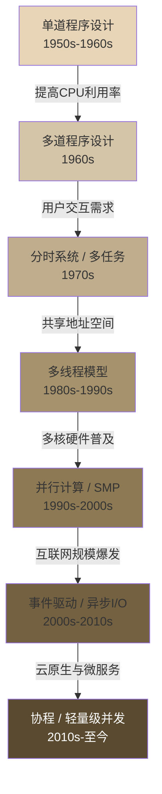

# 技术演进：从单道程序到现代并发模型

从最早的单道批处理系统到今天的异步并发框架，操作系统对处理器资源的调度与管理经历了半个多世纪的演进。每一次跃迁都源于同一个核心矛盾——**有限的计算资源与不断增长的性能需求之间的差距**。理解这条演进脉络，不仅能帮助我们明白当前并发模型"为什么是这个样子"，更能为架构选型提供历史纵深的判断力。

---

## 1. 演进全景图



下文将按时间线逐一剖析每个阶段的**核心动机、实现机制、典型系统和历史局限**。

---

## 2. 单道程序设计（1950s-1960s）

### 2.1 运行模式

单道程序设计（Single Programming）是最原始的执行模型：**内存中同一时刻只驻留一道程序，CPU 从头到尾执行完当前程序后，才加载下一道程序**。

```text
时间轴 ──────────────────────────────────────────►
程序A:  [====CPU执行====][====等待I/O====]
CPU:    [====执行A====][空闲][====执行A====]  ← I/O期间CPU完全空闲
程序B:                                      [====CPU执行====]...
```

### 2.2 核心特征

- **串行执行**：程序独占 CPU，无任何并发
- **手工操作**：通过穿孔卡片或控制面板输入，需要人工装卸程序
- **无操作系统**：早期机器甚至没有操作系统的概念，程序员直接面对裸机

### 2.3 致命缺陷

| 问题 | 具体表现 | 量化影响 |
|------|----------|----------|
| CPU利用率极低 | I/O等待期间CPU空转 | 典型利用率仅 **5%~15%** |
| 人工干预频繁 | 每个程序需人工装载和启动 | 操作时间可达数十分钟 |
| 吞吐量低下 | 串行排队，无法并行 | 一天仅能完成寥寥几个作业 |

> **数据参考**：IBM 7094（1962年）在单道模式下，CPU 有效利用率平均不到 10%。大量时间消耗在操作员手工装卸磁带和读卡器上。

---

## 3. 多道程序设计（1960s）

### 3.1 核心动机

为解决 CPU 空闲浪费的问题，人们提出了**多道程序设计（Multiprogramming）**：在内存中同时驻留多道程序，当当前程序执行 I/O 操作（阻塞）时，CPU 自动切换到下一道程序执行。

### 3.2 运行机制

```text
时间轴 ──────────────────────────────────────────►
程序A:  [==CPU==][===I/O等待===][==CPU==]
程序B:          [==CPU==][===I/O等待===]
程序C:                    [==CPU==]
CPU:    [==A==][==B==][==C==][==A==]  ← I/O期间切换到其他程序
```

操作系统通过**作业调度（Job Scheduling）**决定哪些程序进入内存，通过**CPU调度**决定哪个程序使用处理器。

### 3.3 里程碑系统

| 系统 | 年份 | 关键贡献 |
|------|------|----------|
| GM-NAA I/O | 1959 | 最早的多道程序系统之一，运行于 IBM 704 |
| OS/360 MFT | 1966 | IBM 大型机操作系统，固定分区多道程序 |
| OS/360 MVT | 1968 | 可变分区多道程序，内存利用率大幅提升 |
| UNICS/Unix | 1969→1973 | AT&T Bell Labs，从多道批处理走向分时交互 |

### 3.4 技术代价

多道程序虽然大幅提高了 CPU 利用率（可从 10% 提升到 **60%~80%**），但也带来了新问题：

- **内存保护**：多道程序共享内存，必须防止程序间相互干扰 → 引入基址寄存器/界限寄存器
- **资源竞争**：多个程序争抢 CPU、内存、I/O 设备 → 需要公平的调度算法
- **死锁风险**：多个程序相互等待对方释放资源 → 死锁检测与预防成为研究课题

---

## 4. 分时系统与多任务处理（1970s）

### 4.1 从批处理到交互

多道程序解决了 CPU 利用率问题，但用户无法与程序实时交互。**分时系统（Time-Sharing System）**应运而生：将 CPU 时间划分为短小的**时间片（Time Slice）**，每个程序轮流获得一个时间片的执行权，用户感觉仿佛在"独占"机器。

### 4.2 时间片轮转机制

```text
时间片 = 10ms（典型值）

程序A: [10ms]程序B: [10ms]程序C: [10ms]程序A: [10ms]...
        ↓          ↓          ↓          ↓
    响应时间≈30ms（3个程序轮转）          ← 用户几乎感觉不到等待
```

**关键参数**：
- **时间片大小**：通常 10ms~100ms。太小导致上下文切换开销过大，太大则响应变差
- **上下文切换开销**：每次切换需要保存/恢复寄存器、更新页表等，耗时约 **1μs~10μs**
- **响应时间**：= 时间片大小 × 就绪队列中的程序数

### 4.3 代表性系统

| 系统 | 年份 | 历史意义 |
|------|------|----------|
| CTSS | 1961 | MIT 开发，最早的时间分时系统之一 |
| Multics | 1964-1969 | MIT + Bell Labs + GE，Unix 的精神前身 |
| Unix V1~V7 | 1971-1979 | Bell Labs，奠定了现代操作系统的基本范式 |
| VMS | 1977 | DEC，VAX 平台上的商用分时操作系统 |
| CP/M | 1974 | 早期个人电脑操作系统，虽非严格分时，但引入了多任务概念 |

### 4.4 调度算法的演化

分时系统催生了经典调度算法的诞生：

| 算法 | 全称 | 核心思想 | 优缺点 |
|------|------|----------|--------|
| FCFS | 先来先服务 | 按到达顺序执行 | 简单但可能导致短作业长时间等待 |
| SJF | 短作业优先 | 执行时间短的先做 | 平均等待时间最优，但需预知执行时间 |
| RR | 时间片轮转 | 每个程序轮流执行固定时间片 | 响应时间公平，但上下文切换有开销 |
| MLFQ | 多级反馈队列 | 多级队列，动态升降级 | 兼顾响应和吞吐，Unix/Linux 经典选择 |
| CFS | 完全公平调度 | 基于虚拟运行时间的红黑树调度 | Linux 2.6.23+ 默认调度器 |

> **深入阅读**：Linux 的 CFS（Completely Fair Scheduler）用红黑树维护所有可运行任务，以 `vruntime`（虚拟运行时间）为键，每次选择 `vruntime` 最小的任务执行。Nice 值越高（优先级越低），`vruntime` 增长越快，从而自然实现加权公平。

---

## 5. 多线程模型（1980s-1990s）

### 5.1 为什么需要线程

进程之间的切换代价高昂——每次上下文切换需要切换整个地址空间（页表切换、TLB 刷新）。但在同一应用程序内部，经常有多个逻辑上需要并发执行的任务（如 Web 服务器同时处理多个请求、GUI 程序同时响应用户输入和后台计算）。**线程（Thread）**被引入作为进程内的轻量级执行单元：

| 对比维度 | 进程（Process） | 线程（Thread） |
|----------|-----------------|----------------|
| 地址空间 | 独立（通常 GB 级） | 共享（同一进程内） |
| 创建开销 | 高（需分配地址空间等） | 低（仅需栈和寄存器） |
| 切换开销 | 高（页表切换、TLB刷新） | 低（同地址空间内切换） |
| 通信方式 | IPC（管道、共享内存等） | 直接读写共享变量 |
| 容错性 | 进程崩溃不影响其他进程 | 一个线程崩溃可能拖垮整个进程 |
| 典型创建耗时 | 数百微秒至毫秒级 | 数十微秒级 |

### 5.2 三种经典线程模型

#### (1) 用户级线程（User-Level Threads, ULT）

线程库完全在用户态实现，内核只感知进程，不感知线程。

```text
┌──────────────────────────┐
│      用户空间             │
│  ┌─────┐ ┌─────┐ ┌─────┐│
│  │T1   │ │T2   │ │T3   ││  ← 用户级线程库管理调度
│  └──┬──┘ └──┬──┘ └──┬──┘│
│     └───────┼───────┘   │
│             ▼            │
│     ┌───────────┐        │
│     │ 1:1 映射   │        │  ← 内核只看到一个"进程"
│     └───────────┘        │
├──────────────────────────┤
│      内核空间             │
│  ┌───────────┐           │
│  │ Process   │           │
│  └───────────┘           │
└──────────────────────────┘
```

- **代表实现**：GNU Portable Threads、State Threads
- **优点**：切换极快（用户态完成，无系统调用开销），可移植性好
- **致命缺点**：一个线程阻塞（如系统调用）会导致整个进程阻塞；无法利用多核

#### (2) 内核级线程（Kernel-Level Threads, KLT）

内核直接管理线程，调度和切换都在内核态完成。

```text
┌──────────────────────────┐
│      用户空间             │
│  ┌─────┐ ┌─────┐ ┌─────┐│
│  │T1   │ │T2   │ │T3   ││
│  └─────┘ └─────┘ └─────┘│
├──────────────────────────┤
│      内核空间             │
│  ┌─────┐ ┌─────┐ ┌─────┐│
│  │KT1  │ │KT2  │ │KT3  ││  ← 内核独立调度每个线程
│  └─────┘ └─────┘ └─────┘│
│  [  调度器  ]            │
└──────────────────────────┘
```

- **代表实现**：Windows NT/2000+、Linux（via NPTL/`pthread`）、Solaris
- **优点**：一个线程阻塞不影响其他线程；可利用多核并行
- **缺点**：每次线程切换需要系统调用，开销比 ULT 大

#### (3) 两级线程模型（Hybrid）

结合用户级和内核级的优点。用户态线程库管理 N 个用户线程，映射到 M 个内核线程（M ≤ N）。

- **代表实现**：Solaris（早期）、GNU pth
- **优点**：灵活性高，可以调整 M/N 比例
- **缺点**：实现复杂，实际收益有限，逐渐被 1:1 模型取代

### 5.3 现代主流：1:1 内核线程

Linux 的 NPTL（Native POSIX Thread Library）和 Windows 的线程实现都采用了 **1:1 模型**——每个用户线程对应一个内核线程。这是当前操作系统层面的主流方案。

```text
Linux 线程创建示例（C语言）
```

```c
#include <pthread.h>
#include <stdio.h>

void* worker(void* arg) {
    int id = *(int*)arg;
    printf("Thread %d is running on CPU %d\n", id, sched_getcpu());
    return NULL;
}

int main() {
    const int N = 4;
    pthread_t threads[N];
    int ids[N];

    for (int i = 0; i < N; i++) {
        ids[i] = i;
        pthread_create(&amp;threads[i], NULL, worker, &amp;ids[i]);
    }

    for (int i = 0; i < N; i++) {
        pthread_join(threads[i], NULL);
    }
    return 0;
}
```

---

## 6. 对称多处理与并行计算（1990s-2000s）

### 6.1 SMP 的崛起

**对称多处理（Symmetric Multiprocessing, SMP）**架构中，多个相同的处理器通过共享总线或交叉开关连接，共同访问同一物理内存。操作系统将所有处理器视为平等的，可以任意分配任务。

```text
┌──────┐ ┌──────┐ ┌──────┐ ┌──────┐
│ CPU0 │ │ CPU1 │ │ CPU2 │ │ CPU3 │
└──┬───┘ └──┬───┘ └──┬───┘ └──┬───┘
   │        │        │        │
   └────────┼────────┼────────┘
            │  总线   │
      ┌─────┴────────┴─────┐
      │     共享内存         │
      │   (Main Memory)     │
      └────────────────────┘
```

### 6.2 多核时代的到来

2005 年 Intel 发布 Pentium D，标志着消费级多核 CPU 时代开启。这对软件开发产生了深远影响：

| 时期 | 硬件特征 | 软件挑战 |
|------|----------|----------|
| 单核时代 | 按时钟频率提升性能（摩尔定律） | 频率见顶（功耗墙/散热墙） |
| 多核时代（2005+） | 同一芯片上集成多个核心 | **并行编程成为必需而非可选** |
| 异构计算（2010s+） | CPU + GPU + FPGA + NPU | 异构编程模型（CUDA、OpenCL） |

### 6.3 并行编程模型

多核时代催生了多种并行编程范式：

**共享内存并行（Shared Memory）**

```c
// OpenMP 示例：并行归约求和
#include <omp.h>

double parallel_sum(double* arr, int n) {
    double sum = 0.0;
    #pragma omp parallel for reduction(+:sum)
    for (int i = 0; i < n; i++) {
        sum += arr[i];
    }
    return sum;
}
```

**消息传递并行（Message Passing）**

```c
// MPI 示例：分布式矩阵乘法的核心通信
#include <mpi.h>

MPI_Init(&amp;argc, &amp;argv);
MPI_Comm_rank(MPI_COMM_WORLD, &amp;rank);
MPI_Comm_size(MPI_COMM_WORLD, &amp;size);

// 主进程分发数据
if (rank == 0) {
    MPI_Scatter(matrix_a, rows/size, MPI_DOUBLE,
                local_a, rows/size, MPI_DOUBLE,
                0, MPI_COMM_WORLD);
}
// 各进程独立计算本地结果
multiply_local(local_a, matrix_b, local_result);
// 主进程收集结果
MPI_Gather(local_result, rows/size, MPI_DOUBLE,
           result, rows/size, MPI_DOUBLE,
           0, MPI_COMM_WORLD);
```

### 6.4 同步原语的演化

多线程并行引入了复杂的同步需求：

| 同步机制 | 原理 | 适用场景 | 性能特征 |
|----------|------|----------|----------|
| 互斥锁（Mutex） | 临界区互斥访问 | 保护共享数据 | 竞争激烈时性能急剧下降 |
| 读写锁（RWLock） | 读共享、写互斥 | 读多写少场景 | 读操作可并发，写操作互斥 |
| 自旋锁（Spinlock） | 忙等待循环 | 持锁时间极短的场景 | 避免上下文切换，但浪费 CPU |
| 信号量（Semaphore） | 计数器控制并发数 | 限制同时访问资源的数量 | 比互斥锁更灵活 |
| 条件变量（Condition） | 等待/通知机制 | 生产者-消费者模型 | 需配合互斥锁使用 |
| 原子操作（Atomic） | 硬件保证不可分割 | 简单计数器、标志位 | 无锁，性能最高 |

> **性能对比数据**：在 x86_64 平台上，pthread_mutex_lock 的竞争开销约 **20~80ns**，atomic 操作约 **5~15ns**，而一次上下文切换（用户态→内核态→用户态）约 **1000~3000ns**。这意味着设计并发算法时，减少锁竞争和减少上下文切换是两个最重要的优化方向。

---

## 7. 事件驱动与异步 I/O（2000s-2010s）

### 7.1 C10K 问题

2000 年 Dan Kegel 提出的 **C10K 问题**标志着一个新的时代：如何让单台服务器同时处理 10,000 个并发连接？传统的"一个连接一个线程"（thread-per-connection）模型在高并发场景下遇到了不可逾越的瓶颈：

| 连接数 | 线程数 | 内存消耗（每线程1MB栈） | 上下文切换开销 |
|--------|--------|--------------------------|----------------|
| 1,000 | 1,000 | ~1GB | 可控 |
| 10,000 | 10,000 | ~10GB | 严重退化 |
| 100,000 | 100,000 | ~100GB | 系统崩溃 |

### 7.2 I/O 多路复用技术

解决 C10K 问题的关键是 **I/O 多路复用（I/O Multiplexing）**——用少量线程监听大量文件描述符上的事件，仅在有 I/O 就绪时才处理。

| 技术 | 平台 | 机制 | 性能特点 |
|------|------|------|----------|
| `select` | 跨平台 | 轮询全部fd集合，返回就绪子集 | O(N)，fd上限1024 |
| `poll` | POSIX | 改进的select，无fd上限 | O(N)，仍需轮询 |
| `epoll` | Linux | 内核维护就绪列表，事件驱动 | O(1)事件通知，百万级fd |
| `kqueue` | BSD/macOS | 类似epoll的事件通知机制 | 高效，macOS/iOS标准方案 |
| `IOCP` | Windows | 完成端口模型，异步完成通知 | Windows高性能网络标准 |

### 7.3 Reactor 与 Proactor 模式

Reactor 模式（同步非阻塞）：
  事件循环 → 通知就绪 → 回调处理（读/写在回调中完成）
  代表：libevent、libuv、Nginx

Proactor 模式（全异步）：
  发起异步操作 → 内核完成 → 通知完成（读/写已在内核完成）
  代表：IOCP、Boost.Asio

### 7.4 代表性系统与框架

| 系统/框架 | 语言 | 并发模型 | 性能指标 |
|-----------|------|----------|----------|
| Nginx | C | 事件驱动 + 多worker进程 | 单机10万+并发连接 |
| Node.js | JavaScript | 单线程事件循环 + libuv | 高I/O吞吐，CPU密集受限 |
| Redis | C | 单线程事件循环（6.0+多线程I/O） | 10万+ QPS |
| Netty | Java | Reactor模式 + 线程池 | 百万级连接 |
| Twisted | Python | 异步I/O + 事件驱动 | 早期Python异步框架 |

### 7.5 事件驱动的优与劣

**优点**：
- 单线程处理数万并发连接，内存开销极小
- 无线程切换开销，CPU 缓存友好
- 在 I/O 密集型场景下性能优异

**缺点**：
- 代码复杂度高（回调地狱/Callback Hell）
- 无法利用多核 CPU（单线程）
- CPU 密集型任务会阻塞整个事件循环
- 调试困难，错误堆栈断裂

---

## 8. 协程与现代并发模型（2010s-至今）

### 8.1 协程（Coroutine）的回归

协程本质上是**用户态的、可暂停和恢复的函数**。它比线程更轻量（不需要内核参与调度），又比回调更直观（保持顺序执行的代码风格）。

```text
对比三种并发范式的代码风格：

线程模型：
  thread1 = create_thread(function_a)
  thread2 = create_thread(function_b)
  wait(thread1)
  wait(thread2)

回调模型：
  async_a(function_a_result => {
      async_b(function_b_result => {
          // 嵌套回调，层层嵌套
      });
  });

协程模型：
  result_a = await async_a()
  result_b = await async_b()
  // 顺序写法，异步执行，代码清晰
```

### 8.2 主流语言的协程实现

| 语言 | 机制名称 | 调度方式 | 特点 |
|------|----------|----------|------|
| Go | Goroutine | M:N 调度（GMP模型） | 极轻量（~2KB栈），原生并发 |
| Rust | async/await + Tokio | M:N 调度 + epoll | 零成本抽象，无GC，内存安全 |
| Python | async/await + asyncio | 事件循环（单线程） | 生态丰富，3.11+ TaskGroup |
| Kotlin | 协程（Coroutines） | 结构化并发 | Android/JVM生态，取消传播 |
| Swift | async/await + Actor | 结构化并发 | Swift 5.5+，Actor隔离 |
| JavaScript | async/await + Promise | 事件循环 | Node.js/Browser，单线程 |

### 8.3 Go 的 GMP 调度模型详解

Go 语言的并发模型是现代协程设计的典范：

```text
┌─────────────────────────────────────────┐
│              Go Runtime Scheduler        │
│                                         │
│  ┌─────┐  ┌─────┐  ┌─────┐             │
│  │ G1  │  │ G2  │  │ G3  │  ← Goroutine（用户态任务）
│  └──┬──┘  └──┬──┘  └──┬──┘             │
│     │        │        │                 │
│  ┌──▼────────▼────────▼──┐             │
│  │     本地运行队列        │  ← 每个P一个本地队列
│  └───────────┬────────────┘             │
│              │                          │
│  ┌───────────▼────────────┐             │
│  │     M:N 全局队列        │  ← 全局共享队列
│  └───────────┬────────────┘             │
│              │                          │
│  ┌───┐  ┌───┐  ┌───┐                   │
│  │P0 │  │P1 │  │P2 │  ← Processor（逻辑处理器=GOMAXPROCS）
│  └─┬─┘  └─┬─┘  └─┬─┘                   │
│    │      │      │                      │
│  ┌─▼──┐┌─▼──┐┌─▼──┐                    │
│  │ M0 ││ M1 ││ M2 │  ← Machine（操作系统线程）
│  └────┘└────┘└────┘                    │
└─────────────────────────────────────────┘
```

**GMP 模型核心概念**：
- **G（Goroutine）**：用户态协程，初始栈仅 **2KB**（可动态增长到 GB 级），创建成本极低
- **M（Machine）**：操作系统线程，实际执行计算的载体
- **P（Processor）**：逻辑处理器，数量等于 `GOMAXPROCS`（默认=CPU核心数），是 G 和 M 之间的调度中介

**调度策略**：
1. 每个 P 维护一个本地 G 队列，优先从本地队列取 G 执行
2. 本地队列为空时，从全局队列偷取（work stealing）
3. 全局队列也空时，从其他 P 的本地队列偷取（一半）
4. G 阻塞在系统调用上时，M 与 P 解绑，P 被交给空闲 M 继续执行其他 G

**性能数据**：创建一个 goroutine 仅需 **~0.3μs** 和 **~2KB 内存**，而创建一个 pthread 需要 **~10μs** 和 **~8MB 默认栈空间**。这意味着 Go 可以轻松创建数百万个 goroutine，而 Linux 系统通常限制每个进程的线程数在数千级别。

### 8.4 Rust 的零成本异步

Rust 通过 `async/await` 语法和 `Future` trait 实现异步编程，编译器将 async 函数转换为状态机，运行时（如 Tokio）负责调度：

```rust
// Rust 异步 HTTP 请求
use reqwest;

async fn fetch_data(url: &amp;str) -> Result<String, reqwest::Error> {
    let response = reqwest::get(url).await?;
    let body = response.text().await?;
    Ok(body)
}

// 并发执行多个请求
#[tokio::main]
async fn main() {
    let (r1, r2, r3) = tokio::join!(
        fetch_data("https://api.example.com/a"),
        fetch_data("https://api.example.com/b"),
        fetch_data("https://api.example.com/c"),
    );
    // 三个请求并发执行，总耗时≈最慢请求的耗时
}
```

**Rust 异步的核心优势**：Future 在编译期被转换为状态机（零成本抽象），没有运行时的装箱（boxing）和垃圾回收（GC）开销，性能接近手写状态机。

### 8.5 结构化并发

传统的"启动即遗忘"（fire-and-forget）并发模式容易导致资源泄漏和错误处理困难。**结构化并发（Structured Concurrency）**要求：所有并发任务都在一个明确的作用域内启动和结束，父任务等待所有子任务完成后才能退出。

```python
# Python 3.11+ 结构化并发示例
import asyncio

async def worker(name, delay):
    await asyncio.sleep(delay)
    return f"{name} done"

async def main():
    async with asyncio.TaskGroup() as tg:
        # 所有任务在同一作用域内启动
        t1 = tg.create_task(worker("A", 1.0))
        t2 = tg.create_task(worker("B", 0.5))
        t3 = tg.create_task(worker("C", 0.8))
    # 到达此处时，所有任务已完成
    print(t1.result(), t2.result(), t3.result())

asyncio.run(main())
```

Kotlin 协程、Swift Concurrency、Python TaskGroup、Java Virtual Threads（Project Loom）都在向结构化并发方向演进。

---

## 9. 全景对比：七大并发模型

| 维度 | 单道程序 | 多道程序 | 多任务(分时) | 多线程 | 事件驱动 | 协程 | 虚拟线程 |
|------|----------|----------|-------------|--------|----------|------|----------|
| 年代 | 1950s | 1960s | 1970s | 1980s-90s | 2000s | 2010s | 2020s |
| 并发度 | 0 | 进程级 | 进程级 | 线程级 | 连接级 | 函数级 | 虚拟线程级 |
| 切换开销 | N/A | 高(进程) | 高(进程) | 中(内核线程) | 极低(用户态) | 极低(用户态) | 低(用户态) |
| 内存开销 | 低 | 中 | 中 | 高(每线程~8MB) | 极低 | 极低(~KB级) | 中(可调) |
| 编程复杂度 | 低 | 中 | 中 | 中-高(同步) | 高(回调) | 低(async/await) | 低(类线程) |
| CPU利用率 | <15% | 60-80% | 80%+ | 高(多核) | 高(I/O密集) | 高(I/O密集) | 高 |
| 多核利用 | 无 | 无 | 有限 | 好 | 差(单线程) | 好 | 好 |
| 典型应用 | 科学计算 | 批处理 | 通用OS | 桌面/服务器 | Web服务器 | 网络服务 | 高并发服务 |

---

## 10. 未来趋势

### 10.1 Virtual Threads（虚拟线程）

Java 21（2023）正式引入的虚拟线程（Project Loom）代表了最新趋势——**将协程的概念带入传统 JVM 生态**：

```java
// Java 21 虚拟线程示例
try (var executor = Executors.newVirtualThreadPerTaskExecutor()) {
    IntStream.range(0, 100_000).forEach(i -> {
        executor.submit(() -> {
            Thread.sleep(Duration.ofSeconds(1));
            return i;
        });
    });
}
// 10万个虚拟线程，每个sleep 1秒，总耗时约1秒
// 传统线程池方案需要100秒（假设1000线程的池）
```

虚拟线程的核心思想：**让开发者用同步阻塞的简单写法，享受异步非阻塞的性能优势**。运行时自动在虚拟线程阻塞时将其挂载到底层平台线程上，释放平台线程给其他虚拟线程使用。

### 10.2 异构并发

未来的并发不仅仅是 CPU 核心之间的并行，还包括 CPU、GPU、NPU、FPGA 等异构计算单元之间的协作调度。统一的编程模型和调度器（如 SYCL、oneAPI）正在发展中。

### 10.3 分布式并发

随着微服务和云原生架构的普及，并发的边界从单机扩展到了分布式系统。Actor 模型（Erlang/Akka）、CSP 模型（Go Channel）、以及 Serverless 的事件驱动模型，都是分布式并发的不同表达。

---

## 11. 核心认知总结

并发模型演进的三条主线：

1. 资源粒度的细化
   进程 → 线程 → 协程 → 结构化任务
   粒度越细，调度开销越低，并发度越高

2. 调度权的转移
   手工调度 → 内核调度 → 用户态调度 → 语言运行时调度
   调度越靠近应用层，定制化和优化空间越大

3. 编程模型的进化
   回调 → 事件循环 → 生成器/yield → async/await → 结构化并发
   目标始终是：让并发代码写起来像顺序代码一样简单

理解这条脉络，你就能在面对具体场景时做出准确的技术选型：高 I/O 并发用事件驱动或协程，CPU 密集用多线程，混合负载用线程池 + 事件循环，大规模分布式用 Actor/CSP。**没有银弹，但有最适合的模型。**
