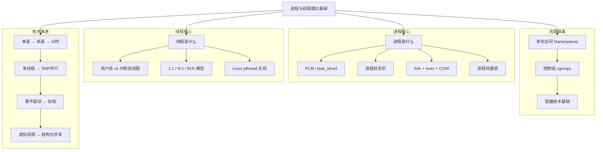

# 理论基础：从操作系统内核到现代并发范式

进程与线程是操作系统最核心的两个抽象，也是理解整个计算机系统运行机制的基石。无论你是写一个简单的 Python 脚本，还是设计支撑亿级用户的分布式系统，对进程和线程的理解深度直接决定了你的技术上限。本节从操作系统内核视角出发，系统性地构建进程与线程的完整知识体系。

---

## 本节的学习目标

完成本节学习后，你应该能够：

1. **准确区分**进程与线程的本质差异，理解它们各自承担的系统职责
2. **描述**进程的完整生命周期——从 fork 创建到 zombie 回收，包括每种状态的触发条件和排查方法
3. **解释**写时复制（COW）的工作原理，以及为什么 fork + exec 是如此高效的进程创建模式
4. **比较**用户级线程、内核级线程、以及 M:N 混合模型的性能特征和适用场景
5. **梳理**从单道程序到协程的七代并发模型演进脉络，理解每一代模型解决了什么问题、留下了什么局限
6. **掌握**命名空间与 cgroups 的隔离机制——这是容器技术（Docker）的内核基础
7. **选型**在具体场景中做出正确的并发模型决策——什么时候用多进程、什么时候用多线程、什么时候用协程

---

## 知识体系全景图

---

## 本节内容导航

本节分为两个核心主题，由浅入深层层递进：

### 主题一：进程与线程的核心概念

> 对应页面：[一、什么是进程与线程](01-一什么是进程与线程.md)

这一部分构建进程与线程的完整概念模型，是后续所有内容的理论根基。

**为什么先讲进程？** 因为进程是操作系统做资源隔离和安全边界的基本手段。理解了进程，才能理解为什么操作系统要引入线程——线程的本质动机是降低同一任务内并发执行的开销。

**核心内容覆盖：**

| 模块 | 要点 | 实用价值 |
|------|------|----------|
| **进程的定义与本质** | 进程 ≠ 程序，进程是资源分配的单位 | 理解"为什么一个程序可以产生多个进程" |
| **PCB / task_struct** | Linux 内核如何描述一个进程（~800个字段） | 读懂 `ps`、`top` 的输出含义 |
| **进程状态机** | 6种状态及转换条件，含 TASK_KILLABLE 等扩展 | 排查 D 状态（不可中断睡眠）和僵尸进程 |
| **上下文切换** | 完整的寄存器保存/恢复流程，含 PCID 优化 | 理解为什么线程切换比进程切换快一个数量级 |
| **fork + exec + COW** | 写时复制的页表级实现原理 | 理解 shell 命令执行的底层机制 |
| **IPC 七种方式** | 管道、共享内存、消息队列、信号等全面对比 | 根据场景选择最合适的进程间通信方式 |
| **命名空间 + cgroups** | 7种命名空间 + cgroup 资源限制 | Docker/K8s 容器隔离的内核原理 |
| **线程的三种模型** | ULT、KLT、Hybrid 的原理与性能对比 | 理解为什么 Linux 选择 1:1 模型 |
| **进程 vs 线程选择指南** | 7种典型场景的推荐方案 | 做架构决策时的快速参考 |

**关键概念速查：**

进程 = 程序的一次执行实例 = 资源分配的基本单位
  └─ 拥有：独立地址空间、文件描述符、信号处理、安全上下文
  └─ PCB(task_struct)：内核管理进程的核心数据结构，约 6-8KB

线程 = 进程内的独立执行流 = CPU调度的基本单位
  └─ 共享：地址空间、文件描述符、信号处理器
  └─ 独立：PC、栈、寄存器、TLS
  └─ Linux 实现：基于 clone() 的轻量级进程(LWP)

COW = fork后的写时复制优化
  └─ fork时不复制物理内存，只复制页表（标记为只读）
  └─ 写入时触发page fault，按页复制
  └─ fork+exec场景几乎零内存复制开销

### 主题二：并发模型的技术演进

> 对应页面：[二、技术演进](02-二技术演进.md)

这一部分从历史纵深的角度，梳理从 1950 年代至今并发模型的七代演进，回答一个核心问题：**"为什么当前的并发模型是这个样子？"**

**演进脉络总览：**

```mermaid
graph LR
    A["单道程序<br/>1950s<br/>CPU利用率<15%"] 
    -->|提高CPU利用率| B["多道程序<br/>1960s<br/>CPU利用率60-80%"]
    -->|用户交互需求| C["分时系统<br/>1970s<br/>响应时间可预测"]
    -->|降低切换开销| D["多线程<br/>1980s-90s<br/>线程级并发"]
    -->|多核硬件普及| E["SMP并行<br/>1990s-2000s<br/>多核并行计算"]
    -->|C10K问题| F["事件驱动<br/>2000s-2010s<br/>百万连接"]
    -->|异步编程复杂度| G["协程/虚拟线程<br/>2010s-至今<br/>简单+高效"]
    
    style A fill:#e74c3c,color:#fff
    style B fill:#e67e22,color:#fff
    style C fill:#f1c40f,color:#333
    style D fill:#2ecc71,color:#fff
    style E fill:#3498db,color:#fff
    style F fill:#9b59b6,color:#fff
    style G fill:#1abc9c,color:#fff
```

**每一代模型解决的核心矛盾：**

| 时代 | 模型 | 解决了什么 | 留下了什么局限 |
|------|------|-----------|---------------|
| 1950s | 单道程序 | — | CPU 利用率极低（<15%） |
| 1960s | 多道程序 | CPU 在 I/O 等待时不再空闲 | 无用户交互能力 |
| 1970s | 分时系统 | 用户可以实时交互 | 进程切换开销高 |
| 1980s-90s | 多线程 | 同一进程内低开销并发 | 死锁、竞态条件复杂 |
| 1990s-2000s | SMP 并行 | 利用多核 CPU 并行计算 | 并行编程难度大 |
| 2000s-2010s | 事件驱动 | 单线程处理万级并发连接 | 回调地狱，无法利用多核 |
| 2010s-至今 | 协程/虚拟线程 | 异步性能 + 同步写法 | 生态成熟度参差不齐 |

**深度内容包括：**

- **调度算法全谱**：FCFS → SJF → RR → MLFQ → CFS，每种算法的原理、伪代码和性能特征
- **C10K 问题**：为什么"一连接一线程"模型会崩溃，I/O 多路复用（select/poll/epoll/kqueue）的演进
- **Reactor vs Proactor**：Nginx、Node.js、Redis 的并发模型对比
- **Go GMP 调度模型**：Goroutine 的 M:N 调度、work stealing 策略、性能数据
- **Rust 零成本异步**：async/await 编译期状态机转换
- **Java 虚拟线程**：Project Loom 如何让同步写法享受异步性能
- **结构化并发**：为什么"启动即遗忘"模式正在被淘汰

---

## 进程与线程的全景对比

在深入具体技术之前，先建立一个高层对比框架：

| 维度 | 进程 | 线程 | 协程 |
|------|------|------|------|
| **本质** | 资源分配单位 | CPU 调度单位 | 用户态调度单位 |
| **地址空间** | 独立（GB 级） | 共享（同进程内） | 共享（同线程内） |
| **创建开销** | 1-10ms | 0.1-1ms | ~0.3μs（Go） |
| **切换开销** | 1-10μs | 0.1-1μs | <0.1μs |
| **内存占用** | 高（独立页表+地址空间） | 中（~8MB 栈） | 极低（~2KB 栈） |
| **通信方式** | IPC（管道/共享内存等） | 直接读写共享变量 | 直接读写 |
| **容错性** | 天然隔离，崩溃互不影响 | 一个线程崩溃可能拖垮进程 | 同线程级 |
| **多核利用** | 好 | 好 | 好 |
| **编程复杂度** | 中（IPC 较复杂） | 高（同步/死锁） | 低（async/await） |

---

## 学习路径建议

根据你的基础水平，推荐不同的学习路径：

**入门路径（操作系统初学者）：**
1. 先读主题一的"进程定义"和"线程定义"，建立基本概念
2. 重点理解进程状态机和 fork/exec 机制
3. 再读技术演进的前三代（单道→多道→分时），理解"为什么需要进程"
4. 最后看进程 vs 线程的选择指南，建立决策框架

**进阶路径（有并发编程经验）：**
1. 跳过基础定义，直接看 PCB/task_struct 的内核实现
2. 深入理解上下文切换的性能开销和 PCID 优化
3. 重点学习 COW 机制和命名空间/cgroups
4. 在技术演进部分重点关注 C10K 问题和协程模型

**架构师路径（做系统设计）：**
1. 快速浏览全部内容，重点关注全景对比表和选型指南
2. 深入 Go GMP 模型和事件驱动架构（Reactor/Proactor）
3. 理解虚拟线程和结构化并发的趋势
4. 结合实战案例，形成并发架构设计的方法论

---

## 与其他章节的关系

本节的理论基础是后续所有章节的前置知识：

- **核心技巧**（下一节）：基于本节的理论，提炼进程创建、线程池设计、无锁编程、协程调度的实战模式
- **实战案例**：通过 Web 服务器设计、生产者-消费者模型等真实场景验证理论
- **常见误区**：揭示竞态条件、死锁、线程泄漏等开发者最容易踩的坑
- **练习方法**：提供从理论到实战的系统性学习路径

---

## 本节核心认知

在开始深入学习之前，先记住三个核心认知：

> **认知一：进程和线程不是"谁更好"，而是"各司其职"。** 进程负责资源隔离和安全边界，线程负责同一任务内的并发加速。选错模型不是技术问题，是架构问题。

> **认知二：并发模型的演进始终围绕一个核心矛盾——有限的计算资源与不断增长的性能需求。** 每一代模型都是在特定硬件条件和应用需求下的最优解，没有"最好的模型"，只有"最适合的模型"。

> **认知三：理论不是用来背诵的，是用来决策的。** 当你需要在"用线程还是进程"、"用回调还是协程"、"用epoll还是线程池"之间做选择时，这些理论就是你的判断依据。

---

现在，让我们从最基础的问题开始：[什么是进程与线程？](01-一什么是进程与线程.md)
