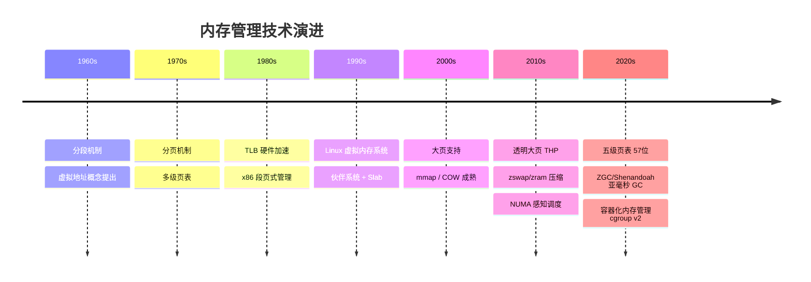

# 第05章 内存管理 · 章节概览

## 本章定位

内存管理是操作系统中最复杂也最关键的子系统之一。它在硬件（MMU、TLB、物理内存控制器）和软件（虚拟内存、页面置换、内存分配器）之间架起了桥梁，使得有限的物理内存能够支撑远超其容量的应用需求。

在本书的知识体系中，本章承接第04章"进程与线程"的地址空间概念，向下延伸到硬件层面的地址转换机制，同时为后续章节奠定基础——理解内存管理是掌握第06章"并发编程"中锁与同步性能优化、第07章"文件系统"I/O 缓冲策略、以及第10章"性能工程"中系统级调优的前提。

对于系统级开发者而言，内存管理不是"了解即可"的理论知识——它直接决定了程序的性能上限和稳定性下限。一个内存分配器的选择可能导致数倍的性能差异；页面置换策略的不当配置可能引发系统抖动（thrashing）；对虚拟内存机制的误解可能导致难以排查的 bug。本章从地址空间抽象出发，深入讲解虚拟内存的完整机制栈，覆盖从硬件原理到用户态分配器实现的全链路知识。

## 本章学习目标

完成本章学习后，你将能够：

| 层级 | 目标 | 可验证的能力 |
|------|------|-------------|
| **理解** | 虚拟地址到物理地址的完整转换链路 | 能手绘四级页表的地址翻译过程，标注每一步的硬件行为 |
| **理解** | 页面置换算法的设计取舍 | 能解释为什么 LRU 优于 FIFO，以及 Clock 算法如何以极低成本逼近 LRU |
| **掌握** | Linux 进程地址空间的组织方式 | 能用 `pmap`/`/proc/<pid>/maps` 分析任意进程的内存布局 |
| **掌握** | 物理内存分配器的层级结构 | 能描述从 `kmalloc` 到 Buddy System 的分配路径，理解各层级的设计动机 |
| **应用** | 根据场景选择合适的内存管理策略 | 能为数据库、微服务、实时系统分别推荐大页/NUMA/分配器配置 |
| **应用** | 诊断和解决内存相关性能问题 | 能用 `vmstat`/`slabtop`/`perf` 定位内存瓶颈并提出优化方案 |
| **分析** | 内存管理子系统的瓶颈 | 能分析 NUMA 远端访问、COW 风暴、Swap 抖动等复杂场景的根因 |

## 为什么内存管理如此重要

每一个程序的运行都离不开内存。变量分配、函数调用栈、文件 I/O 缓冲、进程间通信——几乎所有计算活动最终都映射到内存操作。内存管理的效率直接影响程序性能，以下是一些直观的对比数据：

| 场景 | 内存管理方式 | 性能差异 |
|------|-------------|---------|
| 内存分配器选择 | ptmalloc vs jemalloc | 并发场景下吞吐量差 2-5 倍 |
| 页面置换策略 | LRU vs 随机置换 | 缺页率差 30%-60% |
| TLB 配置 | 4KB 标准页 vs 2MB 大页 | TLB miss 减少 99.8%，数据库查询延迟降低 20%-40% |
| Swap 策略 | 合理配置 vs 默认配置 | 延迟敏感服务性能差 100-10000 倍 |
| 缓存行对齐 | 伪共享 vs 无竞争 | 多线程计数器吞吐量差 5-20 倍 |

**真实案例：一次"内存够用"的代价**

2019 年，某大型电商平台在双十一前夕发现其核心交易服务出现间歇性延迟飙升——P99 从 5ms 突增到 200ms，且规律性地出现在整点前后。排查发现，该服务运行在 48GB 内存的物理机上，`free -h` 显示可用内存约 12GB，"看起来够用"。但深入分析发现：

- 服务使用默认的 glibc ptmalloc，在高并发下产生了大量线程私有 arena（每个线程最多分配 4 个 arena），导致堆内存碎片率高达 40%
- 实际有效内存利用率不到 50%，其余被碎片占据无法使用
- 整点时批量任务触发，工作集瞬间超过可用连续内存，引发频繁 swap

解决方案分为三步：① 将分配器切换为 jemalloc，碎片率降至 8%；② 启用 2MB 大页，TLB miss 减少 95%；③ 为批量任务设置 NUMA 亲和性，避免跨节点访问。优化后 P99 稳定在 8ms 以内。

这个案例揭示了一个核心认知：**内存管理不只是"有没有足够内存"的问题，而是"内存如何被组织、分配和回收"的问题**。理解内存管理的机制，才能做出正确的工程决策。

## 本章知识图谱

```mermaid
graph TD
    A["内存管理"] --> B["地址空间"]
    A --> C["分页机制"]
    A --> D["页面置换"]
    A --> E["虚拟内存"]
    A --> F["物理内存管理"]
    A --> G["高级主题"]
    A --> H["性能优化"]

    B --> B1["虚拟地址 vs 物理地址"]
    B --> B2["Linux 进程地址空间布局"]
    B --> B3["mm_struct / VMA"]

    C --> C1["多级页表 4/5级"]
    C --> C2["TLB 地址转换缓存"]
    C --> C3["大页 2MB / 1GB"]
    C --> C4["透明大页 THP"]

    D --> D1["LRU 算法"]
    D --> D2["Clock 算法"]
    D --> D3["Working Set"]
    D --> D4["Belady 异常"]

    E --> E1["mmap 内存映射"]
    E --> E2["COW 写时复制"]
    E --> E3["内存映射文件"]

    F --> F1["Buddy System 伙伴系统"]
    F --> F2["Slab 分配器"]
    F --> F3["页帧分配"]

    G --> G1["zswap / zram 内存压缩"]
    G --> G2["OOM Killer"]
    G --> G3["NUMA 内存策略"]
    G --> G4["malloc 实现对比"]

    H --> H1["缓存友好设计"]
    H --> H2["内存池"]
    H --> H3["零拷贝技术"]

    style A fill:#1a1a2e,stroke:#e94560,color:#fff,stroke-width:2px
    style B fill:#16213e,stroke:#0f3460,color:#fff
    style C fill:#16213e,stroke:#0f3460,color:#fff
    style D fill:#16213e,stroke:#0f3460,color:#fff
    style E fill:#16213e,stroke:#0f3460,color:#fff
    style F fill:#16213e,stroke:#0f3460,color:#fff
    style G fill:#16213e,stroke:#0f3460,color:#fff
    style H fill:#16213e,stroke:#0f3460,color:#fff
```

## 本章内容结构

本章按照"地址空间 → 分页机制 → 页面置换 → 虚拟内存 → 物理内存 → 高级主题 → 性能优化 → 实践"的逻辑层层递进，从硬件原理到软件实现，从理论基础到工程实践。

### 第一部分：地址空间（理论基础）

> 理解内存管理的起点是回答"程序看到的内存和实际的物理内存有什么区别"。

本节从虚拟地址与物理地址的映射关系出发，讲解：

- **虚拟地址的必要性**：隔离性、简化编程、大于物理内存的地址空间、共享、安全性五大动机。核心命题：每个进程拥有独立的地址空间，是操作系统实现进程隔离的基石
- **Linux 进程地址空间布局**：从代码段到栈的完整内存布局，含 64 位系统的内核空间/用户空间划分。重点掌握 `mmap` 区域和堆的增长方向
- **内核数据结构**：`mm_struct` 和 `vm_area_struct`（VMA）的设计，理解内核如何管理每个进程的地址空间。阅读 `linux/mm_types.h` 中的源码定义

**核心问题**：为什么需要虚拟地址？如果直接使用物理地址会怎样？

### 第二部分：分页机制（理论基础）

> 分页是虚拟内存的核心实现，也是硬件和软件协作最紧密的环节。

本节深入硬件层面，讲解 CPU 如何将虚拟地址转换为物理地址：

- **基本分页**：VPN + Offset 的地址分解，页表的查找过程
- **多级页表**：为什么单级页表不可行（64 位系统需要 512GB），x86-64 四级页表（PGD → PUD → PMD → PTE）的层次结构，五级页表（P4D）对 57 位地址空间的支持
- **页表条目（PTE）格式**：64 位 PTE 中每个标志位的含义——Present、R/W、U/S、Accessed、Dirty、NX、Global 等。每个标志位都对应一次硬件判断分支
- **TLB**：地址转换缓存的工作流程、典型规格（L1/L2 TLB）、PCID 进程上下文标识。理解 TLB 刷新对上下文切换性能的影响
- **大页**：2MB 和 1GB 大页的原理与优势、配置方法（`/proc/sys/vm/nr_hugepages`）、透明大页（THP）的三种模式（always/madvise/never）及适用场景

**核心问题**：四级页表的地址翻译需要几次内存访问？TLB 命中如何将这个代价降为零？

### 第三部分：分段机制（理论基础）

> 分段是内存管理的历史产物，理解它有助于理解现代架构的设计选择。

本节追溯分段机制的来龙去脉，建立完整的历史视角：

- **分段的历史**：段选择子 + 段内偏移的二维地址模型，8086 时代的段寄存器设计
- **分段 vs 分页对比**：粒度、碎片、保护、共享等维度的系统对比。分段以逻辑单元为粒度（代码段/数据段），分页以固定大小为粒度（4KB 页）
- **现代 Linux 中的分段**：x86-64 如何将分段"扁平化"，仅利用段寄存器区分用户态和内核态（CS 的 RPL 位）

### 第四部分：页面置换算法（理论基础）

> 当物理内存不足时，选择哪个页面换出至关重要——这是操作系统调度能力的核心体现。

本节从理论到实践，覆盖经典的页面置换算法：

- **OPT（最优置换）**：理论最优但不可实现，作为性能评估的上界。证明了不存在比 OPT 更优的算法
- **LRU（最近最少使用）**：OPT 的实际近似，基于时间局部性原理，含完整的伪代码和手动模拟示例。纯硬件 LRU 的高成本（每次访问都需要维护时间戳或栈操作）
- **Clock 算法**：LRU 的低成本近似，利用硬件 Accessed 位。近似效果可达 LRU 的 95% 以上，而硬件成本为零
- **Working Set 模型**：基于程序行为的工作集概念，指导物理内存分配决策
- **Belady 异常**：为什么增加物理帧反而可能增加缺页次数。FIFO 是栈式算法的反例，揭示了算法设计的数学约束

**核心问题**：Linux 实际使用的是哪种页面置换算法？它如何在 LRU 和 Clock 之间取得平衡？（答案：Linux 使用双链表 LRU 的变体，活跃链表 + 非活跃链表，配合二次机会机制）

### 第五部分：虚拟内存核心机制（理论基础）

> 虚拟内存不只是地址映射，还包含一系列精巧的机制，这些机制是现代操作系统效率的基石。

- **mmap**：内存映射的工作原理、匿名映射与文件映射、`MAP_PRIVATE` 与 `MAP_SHARED` 的区别。理解 `MAP_PRIVATE` 下 COW 的延迟创建机制
- **COW（写时复制）**：fork() 的高效实现原理——父子进程共享物理页，仅在写入时触发页错误并复制。COW 页错误的触发条件、性能影响，以及 `vfork()` 的对比
- **内存映射文件**：文件 I/O 的零拷贝路径、与 read/write 的性能对比。mmap 适合顺序大文件访问，read/write 适合小数据量随机读写

### 第六部分：物理内存管理（理论基础）

> 内核如何管理实际的物理内存——从空闲页帧的分配到内核对象的缓存。

- **Buddy System（伙伴系统）**：空闲页帧的组织方式（按 order 分组的空闲链表）、分配与合并算法、内存碎片的处理。理解 `__GFP_COMP` 等分配标志的含义
- **Slab 分配器**：内核对象缓存的设计思想——频繁分配/释放的小对象（如 `task_struct`、`inode`）不直接从 Buddy 分配，而是使用预分配的对象缓存。slab/slub/slob 三种实现的演进：slub 是当前默认
- **页帧分配**：`__alloc_pages` 的分配路径、水位线（watermark）机制——min/low/high 三个水位如何触发不同的回收行为

**核心问题**：`kmalloc(64, GFP_KERNEL)` 从用户调用到物理页分配，经过了哪些层级？每层解决了什么问题？

### 第七部分：内存管理高级主题（理论基础）

> 面向高级开发者的深入主题，覆盖生产环境中常见的内存管理挑战。

- **内存压缩**：zswap（内核层 swap 压缩，作为 swap 的前端缓存）、zram（内存中的压缩 swap 设备）的原理与配置。在内存受限的容器环境中，zram 可将有效内存提升 30%-50%
- **OOM Killer**：内核的内存耗尽处理策略、`oom_score` 的计算（RSS + page fault + oom_score_adj）、如何保护关键进程（设置 `oom_score_adj=-1000`）
- **NUMA 内存策略**：非统一内存访问架构的特点、本地内存分配 vs 远端分配的性能差异（远端访问延迟增加 30%-100%）、`numactl` 的使用、NUMA balancing 内核机制
- **用户态分配器对比**：ptmalloc（glibc 默认，多 arena 设计）、jemalloc（Facebook，基于 extent 的分配）、tcmalloc（Google，线程本地缓存）的设计哲学与性能对比。不同场景下的选择建议

### 第八部分：核心技巧

> 从理论到实践的桥梁——掌握内存管理的日常工程工具。

- **内存泄漏检测**：Valgrind（精确但慢 10-50 倍）、AddressSanitizer（编译期插桩，运行时开销 2-3 倍）、strace 追踪 `brk/mmap` 系统调用（无侵入但信息有限）。三种方法的适用场景对比
- **性能调优**：大页配置（静态大页 vs 透明大页的选择）、NUMA 绑定（`numactl --cpunodebind` + `--membind`）、malloc 调优参数（`MALLOC_ARENA_MAX`、`MALLOC_MMAP_THRESHOLD_`）
- **内存分析工具**：`/proc/meminfo` 各字段含义、`pmap -x` 进程内存映射、`vmstat` 内存统计、`slabtop` 内核 slab 缓存监控、`smem` 按比例分摊的内存统计

### 第九部分：实战案例

> 通过真实场景展示内存管理技术的应用——这是检验理解深度的试金石。

- **高性能缓存设计**：如何利用大页和 NUMA 亲和性设计低延迟缓存（Redis、Memcached 的内存布局分析）
- **内存映射文件应用**：大型数据库如何利用 mmap 实现高效数据访问（PostgreSQL 的 shared buffer 机制）
- **GC 调优**：Java 应用在不同堆大小下的 GC 策略选择（G1/ZGC/Shenandoah），堆大小、暂停时间、吞吐量的三角权衡

### 第十部分：常见误区

> 揭示内存管理中最容易犯的十大错误，每一条都包含错误思维、真实案例、正确做法和自查清单：

1. 认为"内存够用就行"，忽视监控——内存是动态变化的，基线监控比峰值预留更重要
2. 盲目使用对象池，忽视 GC 实际能力——现代 GC（如 ZGC）的分配速率可达 GB/s 级别
3. 忽视 GC 调优，用默认配置上线——JVM 默认堆配置是通用值，不是最优值
4. 以为 swap 可以当"内存扩展"用——swap 延迟是 DRAM 的 1000-10000 倍，对延迟敏感服务是灾难
5. 忽略内存碎片化——长时间运行的服务碎片率可达 20%-40%，导致可用内存远低于预期
6. 容器环境忽视内存限制配置——不设 limit 的容器可能吃光宿主机内存
7. 过度预分配，浪费物理内存——预分配策略需要配合实际负载曲线评估
8. 认为"多用缓存就是优化"——缓存的收益取决于命中率，低命中率的缓存只是浪费内存
9. 忽略内存对齐和缓存行效应——伪共享（false sharing）是多线程性能的隐形杀手
10. 容器环境忽视 OOM 与 cgroup 的交互——cgroup v1 和 v2 的 OOM 行为不同，需要分别处理

### 第十一部分：练习方法与本章小结

- 五套递进式练习：基础理解 → 动手实操 → 问题排查 → 性能优化 → 架构设计
- 核心知识点回顾、关键公式与模型、最佳实践清单

## 难点预览

本章有若干概念需要反复消化，建议在首次阅读时做好标记：

| 难点 | 为什么难 | 建议学习方法 |
|------|---------|-------------|
| 四级页表地址翻译 | 涉及硬件行为和软件数据结构的交叉，步骤多 | 手动画图翻译一个具体地址，每步标注硬件/软件动作 |
| Clock 算法的近似质量 | 需要理解"近似"的含义和衡量标准 | 对比 Clock 与 LRU 的缺页率曲线，理解性价比权衡 |
| COW 的延迟创建 | 理解"共享但不复制"的时机判断 | 用 strace 观察 fork 前后的页表变化 |
| NUMA 亲和性 | 涉及硬件拓扑和调度策略的交叉 | 用 `numactl` + `numastat` 在实际 NUMA 机器上测量延迟差异 |
| Slab 分配器的层级 | 从 kmalloc 到 Buddy 的调用链长 | 读 `/proc/slabinfo` 观察实际的 slab 缓存使用情况 |

## 本章学习路线

根据读者的背景和目标，推荐以下学习路径：

- **入门路径**：理解"程序看到的内存不是真实的物理内存"这一核心抽象，掌握分页和页面置换的基本原理。适合所有开发者，是操作系统素养的基线
- **进阶路径**：深入虚拟内存和物理内存的实现机制，掌握日常开发中的内存管理技巧。适合需要调优服务性能的后端开发者和运维工程师
- **精通路径**：理解 NUMA、内存压缩、OOM Killer 等高级主题，能够进行系统级的内存性能优化。适合内核开发者、DBA、高频交易系统架构师

**学习建议**：不要试图一次读完整章。建议按路径分阶段学习，每完成一个阶段后用本章的练习验证理解，再进入下一阶段。对于入门路径的内容，即使你做应用层开发也值得花时间掌握——它能帮助你更好地理解为什么某些"最佳实践"有效，以及在新场景下如何做出合理判断。

## 前置知识

学习本章前，建议具备以下基础知识：

- **操作系统基础**（必修）：内核态与用户态的概念、系统调用的基本机制、中断处理的基本流程
- **计算机体系结构**（必修）：CPU 缓存层次（L1/L2/L3）的工作原理、地址总线的基本概念
- **第04章 进程与线程**（必修）：进程的地址空间概念、fork/exec 的行为、进程间通信的基本方式
- **C 语言基础**（推荐）：指针、内存分配（malloc/free）、结构体、位运算。阅读内核源码和理解页表格式需要这些知识
- **数据结构基础**（推荐）：链表、树、哈希表。Buddy System 和 Slab 分配器的实现大量使用这些数据结构

> 💡 **快速自检**：如果你能回答以下问题，说明前置知识已就绪——
> 1. 进程 A 的变量 X 地址 0x7fff1234 和进程 B 的同名变量 X 地址 0x7fff1234，它们在物理内存中是同一个位置吗？为什么？
> 2. `malloc(1024)` 返回的指针指向的是物理内存地址还是虚拟地址？
> 3. 进程切换时，为什么需要刷新 TLB？不刷新会怎样？

## 关键度量指标

内存管理的性能评估需要关注以下核心指标：

| 指标 | 含义 | 典型值 | 优化方向 |
|------|------|--------|----------|
| TLB 命中率 | TLB 查找成功的比例 | > 99% | 使用大页、减少进程切换 |
| 缺页率 | 页面不在物理内存中的比例 | < 0.1% | 增大工作集、优化访问模式 |
| 内存分配延迟 | 单次 malloc/new 的耗时 | < 100ns（L3 命中） | 使用 jemalloc/tcmalloc、内存池 |
| 内存利用率 | 已用内存 / 可用内存 | 70%-85%（警戒线） | 避免过度预分配、及时释放 |
| Swap 活跃度 | Swap 的读写频率 | 0（理想值） | 增加物理内存、优化内存使用 |
| OOM 频率 | OOM Kill 事件发生次数 | 0 | 内存限制合理、监控告警 |
| 缓存行命中率 | L1/L2 缓存行查找成功比例 | > 95% | 数据局部性优化、减少伪共享 |

## 技术演进

这条时间线揭示了一个规律：**内存管理的演进始终围绕"用有限硬件资源支撑更大、更快、更多并发的应用需求"这一核心矛盾**。从分段到分页是对碎片问题的回应，从单级页表到多级页表是对地址空间膨胀的应对，从纯 LRU 到 Clock 算法是在精度和成本之间的权衡。

## 与全书其他章节的关联

| 关联章节 | 关联内容 | 为什么重要 |
|---------|---------|-----------|
| 第04章 进程与线程 | 进程地址空间、fork/exec | 理解地址空间是理解分页的前提 |
| 第06章 并发编程 | 锁的实现、伪共享、内存屏障 | 并发性能的瓶颈往往在内存子系统 |
| 第07章 文件系统 | mmap I/O、page cache、readahead | 文件 I/O 性能的核心在于内存管理 |
| 第08章 网络编程 | 零拷贝、sendfile、内存池 | 网络吞吐量的关键在于减少内存拷贝 |
| 第10章 性能工程 | 缓存优化、NUMA 调优、benchmark | 性能调优的底层原理来自内存管理 |

## 参考文献

- Abraham Silberschatz, Peter B. Galvin, Greg Gagne. *Operating System Concepts*, 10th Edition. Wiley, 2018. — 经典操作系统教材，第8章"Memory Management"和第9章"Virtual-Memory Management"是理论基础的权威参考
- Randal E. Bryant, David R. O'Hallaron. *Computer Systems: A Programmer's Perspective*, 3rd Edition. Pearson, 2015. — 从程序员视角理解虚拟内存，第9章是必读内容
- Mel Gorman. *Understanding the Linux Virtual Memory Manager*. Prentice Hall, 2004. — Linux 内核内存管理的权威著作，适合深入源码分析
- Paul Gortmaker. *Linux Kernel Memory Management*. (kernel.org documentation) — 内核官方文档，覆盖最新实现细节
- Jason Evans. *A Scalable Concurrent malloc(3) Implementation for FreeBSD*. (jemalloc) — jemalloc 的原始论文，理解现代分配器的设计思想
- Andrea Arcangeli et al. *Transparent Hugepage Support*. (kernel.org documentation) — THP 的设计文档，理解大页机制的工程取舍
