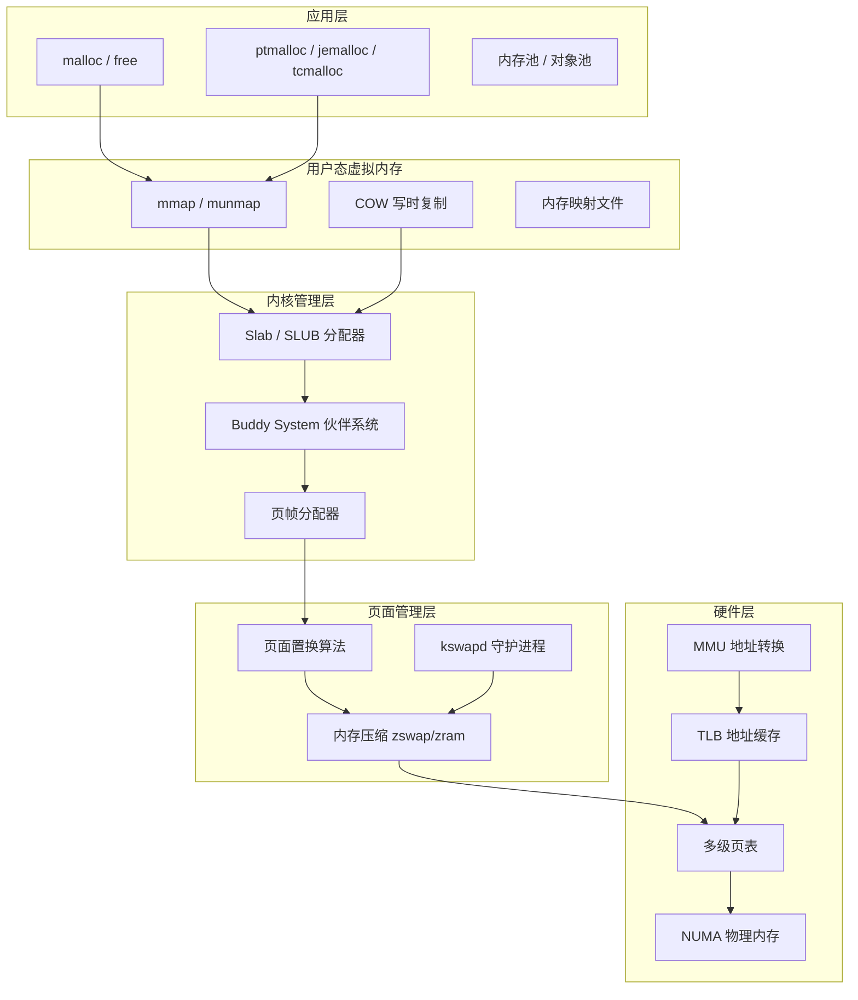

## 本章小结

内存管理是操作系统中最具纵深感的子系统——它横跨硬件芯片（MMU、TLB、缓存控制器）、内核软件（伙伴系统、Slab、页面置换守护进程）和用户空间（malloc实现、应用层内存池）三大层面，每一个层面的决策都直接影响程序的性能、稳定性和安全性。

本章从虚拟地址的抽象出发，逐层深入到物理内存的真实运作，最终回到应用开发者的日常实践中。我们不是在"了解内存管理"——而是在建立一套从硬件到应用的完整思维模型，使你能够：

- 遇到性能瓶颈时，准确定位是TLB miss、页错误还是分配器竞争
- 遇到内存问题时，区分泄漏、碎片和不合理的内存策略
- 做架构决策时，在各种内存管理方案之间做出有理有据的选择

下面是本章全部知识的系统回顾。

***

### 一、核心知识架构

本章的知识体系形成一个五层栈，自底向上覆盖了从硅片到应用的完整链路：



**每一层都在解决同一对根本矛盾：有限的物理资源 vs 无限增长的需求。**

- **硬件层**通过MMU和TLB在纳秒级完成地址转换，多级页表用按需分配避免了存储全部映射关系的巨大开销
- **页面管理层**通过智能置换算法和内存压缩，在物理内存不足时维持系统运转
- **内核管理层**通过Buddy System和Slab分配器，高效地将物理页帧转化为内核对象和用户内存
- **用户态**通过mmap实现零拷贝和进程间通信，COW机制让fork操作几乎零开销
- **应用层**通过不同的malloc实现，根据并发模式和性能需求选择最优的内存分配策略

理解这五层的协作关系，是掌握内存管理的关键。

***

### 二、十个核心知识点精要

#### 1. 虚拟地址与物理地址：内存管理的起点

虚拟内存为每个进程提供独立的、连续的地址空间。进程使用的地址都是虚拟地址，由MMU通过页表转换为物理地址才能访问实际的RAM芯片。

**Linux 64位进程地址空间布局（低→高）：**

| 区域 | 方向 | 内容 | 权限 |
|------|------|------|------|
| 代码段 (.text) | 低地址 | 编译后的机器指令 | 只读+可执行 |
| 数据段 (.data) | ↑ | 已初始化全局变量 | 读+写 |
| BSS段 | ↑ | 未初始化全局变量（零填充） | 读+写 |
| 堆 (heap) | ↑ | malloc分配，向高地址增长 | 读+写 |
| mmap区域 | ↑ | 共享库、匿名映射、文件映射 | 按映射设置 |
| 栈 (stack) | 高地址↓ | 函数调用帧，向低地址增长 | 读+写 |

**核心价值三要素：**
- **隔离性**：进程A无法访问进程B的内存，从根本上防止一个进程的错误导致整个系统崩溃
- **简化编程**：每个进程从虚拟地址0开始布局，链接器和程序员无需关心物理内存的实际位置
- **安全保护**：页表中的权限位（R/W、U/S、NX）实现了读/写/执行的细粒度控制，是DEP和ASLR等安全机制的硬件基础

#### 2. 分页机制与多级页表：按需分配的精妙设计

分页将虚拟地址空间和物理内存都划分为固定大小的页（4KB），通过页表记录映射关系。

**x86-64四级页表地址分解：**

63    48 47    39 38    30 29    21 20    12 11       0
┌───────┬────────┬────────┬────────┬────────┬──────────┐
│ 符号扩展 │ PGD索引 │ PUD索引 │ PMD索引 │ PTE索引 │ 页内偏移  │
│(16 bit)│(9 bit) │(9 bit) │(9 bit) │(9 bit) │(12 bit) │
└───────┴────────┴────────┴────────┴────────┴──────────┘
         ↓         ↓         ↓         ↓
      PGD页    PUD页     PMD页     PTE页    → 物理页帧

**为什么需要多级页表？** 如果使用单级页表，48位虚拟地址需要 2^48 / 2^12 = 2^36 个页表项，每个8字节，总计 **512GB**——比很多服务器的物理内存还大。多级页表的核心优势是**按需分配**：只有被使用的虚拟地址区域才需要分配页表页。一个仅使用1MB栈空间的进程，四级页表只需约 **5KB** 存储空间。

Linux 5.x+还引入了五级页表（P4D），支持57位虚拟地址（128PB地址空间），为未来超大内存系统预留了扩展空间。

#### 3. TLB与大页：地址转换的速度关键

TLB（Translation Lookaside Buffer）是页表条目的硬件缓存。没有TLB，每次内存访问都需要4次内存读取（四级页表），延迟高达 ~100个CPU周期。TLB命中则只需1次内存访问。

| 级别 | 典型容量 | 访问延迟 | 说明 |
|------|---------|---------|------|
| L1 dTLB | 64-128条目 | ~1周期 | 数据访问专用，全相联 |
| L1 iTLB | 64-128条目 | ~1周期 | 指令访问专用 |
| L2 sTLB | 512-2048条目 | ~7周期 | 统一TLB，组相联 |
| 页表遍历 | — | ~100周期 | TLB全部miss时的最坏情况 |

典型TLB命中率超过99%。PCID（Process Context ID）使得进程上下文切换时不需要刷新TLB，Linux 4.14+默认启用。

**大页的价值：** 2MB大页只需1个TLB条目覆盖2MB，而标准4KB页需要512个条目。对于拥有1GB数据的工作集，使用4KB页需要262144个TLB条目（远超L2 TLB容量），使用2MB大页只需512个条目（L2 TLB轻松容纳）。

透明大页（THP）由内核自动管理，但在数据库等延迟敏感场景可能导致"THP compaction"引起的延迟抖动（数十毫秒级），建议使用 `madvise` 模式让应用显式控制大页分配时机。

#### 4. 页面置换算法：内存不足时的决策智慧

当物理内存不足时，操作系统需要选择页面换出。本章讲解了五种算法，它们代表了从理论最优到工程实现的完整谱系：

| 算法 | 核心原理 | 理论缺陷 | 工程实现 | 实际使用 |
|------|---------|---------|---------|---------|
| OPT | 置换未来最长时间不访问的页面 | 无法实现（需预知未来） | 不可用 | 理论性能上界 |
| LRU | 置换最长时间未被访问的页面 | 精确实现需要每个页维护时间戳，硬件成本过高 | 需近似实现 | 近似实现广泛使用 |
| Clock | 使用访问位近似LRU，环形扫描 | 只有1-bit精度（访问/未访问） | 硬件友好 | **Linux实际使用** |
| Enhanced Clock | 同时考虑访问位和脏位 | 复杂度略高 | 优先置换干净页（减少磁盘写入） | Linux变体 |
| Working Set | 维护时间窗口Δ内的活跃页面集 | 窗口大小Δ难以选择 | 基于统计估计 | 抖动检测与预防 |

**Belady异常**：FIFO算法在增加物理帧时反而可能增加缺页次数——这是一个反直觉的现象。LRU和OPT作为"栈式算法"不会出现此异常，因为增加帧后原来被淘汰的页面一定仍然保留。

#### 5. mmap与虚拟内存：零拷贝的核心机制

`mmap()` 是Linux内存映射的核心系统调用，支持三种模式：

| 映射类型 | 标志组合 | 数据来源 | 典型用途 |
|---------|---------|---------|---------|
| 匿名映射 | MAP_ANONYMOUS | 零页（写时分配物理页） | 替代大块malloc、进程间共享 |
| 文件映射（私有） | MAP_PRIVATE | 文件内容（COW） | 只读配置文件、数据库索引 |
| 文件映射（共享） | MAP_SHARED | 文件内容（直接修改） | 共享内存IPC、内存映射数据库 |
| 共享内存 | MAP_SHARED + shm_open | 匿名共享 | 高性能进程间通信 |

**写时复制（COW）** 是fork()高效实现的核心——`fork()` 后父子进程共享全部物理页面（页表标记为只读），仅在任一方写入时才触发页错误并复制该页面。这意味着 `fork()` 本身几乎零开销（仅复制页表，不复制实际内存）。

**mmap vs read/write：**
- mmap：零拷贝（直接映射到进程地址空间），但可能增加TLB压力（每次访问新映射区域触发页错误）
- read/write：需要用户缓冲区↔内核缓冲区之间的数据拷贝，但对大文件顺序访问性能与mmap相当（因为内核readahead优化）

#### 6. 物理内存管理：从页帧到对象

**Buddy System（伙伴系统）** 是Linux内核管理物理页帧的核心算法。它将空闲内存组织为大小为2^n页面的块（MAX_ORDER=11，即最大4MB连续块）。

分配流程：请求N页 → 查找最小的2^k ≥ N的空闲块 → 向下分裂直到恰好匹配
释放流程：释放块 → 检查伙伴块是否空闲 → 递归合并为更大块

优点是分配速度快（O(log n)），缺点是存在**内部碎片**：分配5页实际获得8页（2^3），最坏情况内部碎片率接近50%（请求2^n + 1页时获得2^(n+1)页）。

**Slab分配器** 在Buddy System之上提供内核对象级缓存。Linux默认使用SLUB分配器（取代了旧的Slab实现），其核心设计是**每CPU本地缓存（per-cpu freelist）**：

CPU 0: [本地缓存: task_struct × 15] → [partial链表: slab × 8] → [Buddy System]
CPU 1: [本地缓存: task_struct × 12] → [partial链表: slab × 6] → [Buddy System]
CPU 2: [本地缓存: task_struct × 18] → [partial链表: slab × 10] → [Buddy System]

分配小对象时直接从当前CPU的freelist获取，无需加锁，性能极高。仅当本地缓存耗尽时才从partial链表补充，极端情况才向Buddy System申请新页。

`kmalloc` 分配物理连续内存（适合DMA操作），`vmalloc` 分配虚拟连续但物理不连续的内存（适合大缓冲区）。

#### 7. 内存压缩：用CPU换内存

| 方案 | 工作层级 | 压缩数据去向 | 磁盘依赖 | 适用场景 |
|------|---------|------------|---------|---------|
| zswap | 内核swap前端 | 内存压缩池 | 最终可能写入磁盘 | 有磁盘swap的服务器 |
| zram | 块设备层 | 全部在内存中 | 完全不依赖磁盘 | 无磁盘设备、移动设备 |

**zswap** 是磁盘swap的前端缓存——页面换出时先压缩存储在内存压缩池中（压缩比通常2:1到3:1），只有压缩池满了才写入磁盘。支持zstd（高压缩比，~3:1）或lz4（快速，~2:1）算法。

**zram** 创建基于内存的压缩块设备作为swap分区。所有数据都压缩存储在内存中，不依赖任何磁盘。默认压缩算法lz4在现代CPU上压缩/解压速度可达 **1GB/s** 以上。

**关键区别**：zswap是"缓冲层"，最终数据可能落盘；zram是"全部在内存"，适合没有传统swap分区的嵌入式系统和移动设备。

#### 8. OOM Killer：最后的安全网

当系统内存严重不足且无法通过置换和压缩释放时，Linux启动OOM Killer选择并杀死进程。

**OOM评分公式核心因素：**
- 进程RSS内存使用量（基础分数）
- 子进程内存使用量（乘以权重，因为杀父进程会连带释放子进程）
- oom_score_adj调整值（人工干预，范围-1000到1000）
- 进程运行时间（略微惩罚长期运行进程）

**关键实践：**
```bash
# 保护关键进程（如数据库）不被杀死
echo -1000 > /proc/<db_pid>/oom_score_adj

# 标记可牺牲进程（最容易被杀死）
echo 1000 > /proc/<batch_pid>/oom_score_adj

# 分析OOM日志
dmesg | grep -i "oom" | tail -20
```

#### 9. NUMA内存策略：距离决定速度

NUMA（Non-Uniform Memory Access）架构中每个CPU有本地内存，访问模式直接影响性能：

| 访问类型 | 典型延迟 | 相对性能 |
|---------|---------|---------|
| L1缓存 | ~1ns | 1x |
| L2缓存 | ~4ns | 4x |
| L3缓存 | ~12ns | 12x |
| 本地内存 | ~80ns | 80x |
| 远程内存（另一CPU节点） | ~140ns | 140x |

本地内存比远程内存快约1.75倍。Linux提供五种内存分配策略：

| 策略 | 行为 | 适用场景 |
|------|------|---------|
| DEFAULT | 在当前CPU所在节点分配 | 通用场景 |
| BIND | 强制绑定到指定节点 | 确定性的低延迟需求 |
| PREFERRED | 优先在指定节点，不足时扩展 | 性能优先但允许回退 |
| INTERLEAVE | 在多个节点间轮转分配 | 大内存只读数据集（均衡带宽） |
| WEIGHTED | 按权重在节点间分配 | 异构NUMA拓扑 |

高并发服务器应使用 `numactl --membind=0 --cpunodebind=0 ./myapp` 绑定内存到本地节点。

#### 10. 用户态内存分配器：选择决定性能

| 特性 | ptmalloc (glibc默认) | jemalloc (FreeBSD/Facebook) | tcmalloc (Google) |
|------|---------------------|---------------------------|-------------------|
| 多线程扩展性 | 中等（多arena，~2×CPU核数） | 好（per-thread cache + 多arena） | 极好（per-thread cache + central free list） |
| 内存碎片 | 较高（碎片率可达15-25%） | 低（精细大小类划分） | 低（span-based管理） |
| 内存归还 | 不主动（依赖malloc_trim） | 主动（munmap/madvise） | 主动（page heap收缩） |
| 典型分配延迟 | 50-200ns | 30-100ns | 20-80ns |
| 适用场景 | 通用默认 | 高并发Web服务器 | 低延迟系统 |

可通过 `LD_PRELOAD` 环境变量在不修改代码的情况下切换分配器：
```bash
LD_PRELOAD=/usr/lib/libjemalloc.so ./myapp
```

***

### 三、关键公式与模型

| 概念 | 公式/模型 | 量化意义 |
|------|-----------|---------|
| 虚拟地址分解 | VPN(高位) + Offset(低位) | 页表索引 + 页内偏移 = 物理地址 |
| 四级页表开销 | 512×512×512×512×8B | 1TB虚拟空间仅需~5KB页表（按需分配节省99.999%） |
| TLB命中延迟 | L1: ~1周期; L2: ~7周期; 页表遍历: ~100周期 | TLB命中率从99%降到98% → 性能下降约30% |
| 大页优势 | 2MB = 1个TLB条目 vs 512个4KB条目 | TLB压力降低512倍 |
| 工作集模型 | W(t, Δ) = {在(t-Δ, t)内被访问的所有页面} | 物理内存 < 工作集 → 抖动 |
| OOM评分 | score = RSS + 子进程RSS + oom_score_adj | 分数最高的进程最先被杀死 |
| NUMA延迟差 | 本地~80ns vs 远程~140ns | 不当的内存分配可导致1.75×性能损失 |
| Buddy碎片率 | 最坏情况 = (2^(n+1) - (2^n+1)) / 2^(n+1) ≈ 50% | 分配5页获8页，37.5%浪费 |

***

### 四、全章最佳实践清单

#### 系统级配置

```bash
# ═══ 1. 大页配置（数据库、大内存应用必配） ═══
# 预分配1024个2MB大页 = 2GB大页内存
echo 1024 > /proc/sys/vm/nr_hugepages
# 验证分配成功
grep -i huge /proc/meminfo

# ═══ 2. 透明大页策略 ═══
# 数据库场景建议 madvise（避免自动THP的延迟抖动）
echo madvise > /sys/kernel/mm/transparent_hugepage/enabled
# 禁用khugepaged的后台合并（减少延迟干扰）
echo 0 > /sys/kernel/mm/transparent_hugepage/khugepaged/defrag

# ═══ 3. NUMA绑定（多路服务器必做） ═══
# 将进程绑定到CPU节点0的本地内存
numactl --cpunodebind=0 --membind=0 ./myapp
# 查看NUMA拓扑
numactl --hardware

# ═══ 4. zswap配置（有磁盘swap的服务器） ═══
# 启用zswap
echo 1 > /sys/module/zswap/parameters/enabled
echo lz4 > /sys/module/zswap/parameters/compressor
echo z3fold > /sys/module/zswap/parameters/zpool
echo 20 > /sys/module/zswap/parameters/max_pool_percent

# ═══ 5. zram配置（无磁盘设备/容器/移动设备） ═══
modprobe zram
echo lz4 > /sys/block/zram0/comp_algorithm
echo 4G > /sys/block/zram0/disksize
mkswap /dev/zram0
swapon -p 100 /dev/zram0

# ═══ 6. OOM保护关键进程 ═══
echo -1000 > /proc/<db_pid>/oom_score_adj
echo -500 > /proc/<cache_pid>/oom_score_adj
# 查看OOM评分
for pid in /proc/[0-9]*/oom_score; do
    echo "$(cat $pid) $(cat ${pid%_score}_cmdline 2>/dev/null | tr '\0' ' ')"
done | sort -rn | head -5
```

#### 应用开发实践

```c
// ═══ 1. 大文件访问：优先使用mmap ═══
int fd = open("data.bin", O_RDONLY);
struct stat sb;
fstat(fd, &amp;sb);
// 映射为只读，操作系统按需加载页面（零拷贝）
void *mapped = mmap(NULL, sb.st_size, PROT_READ, MAP_PRIVATE, fd, 0);
if (mapped == MAP_FAILED) {
    perror("mmap failed");
    // 回退到read方案
}
// 使用完毕后释放
munmap(mapped, sb.st_size);
close(fd);

// ═══ 2. 进程间共享数据：使用POSIX共享内存 ═══
int shm_fd = shm_open("/myshm", O_CREAT | O_RDWR, 0666);
ftruncate(shm_fd, sizeof(struct shared_data));
void *shared = mmap(NULL, sizeof(struct shared_data),
                    PROT_READ | PROT_WRITE, MAP_SHARED, shm_fd, 0);
// 两个进程通过shared指针直接读写同一块物理内存

// ═══ 3. 防止内存泄漏的防御性编程模式 ═══
// 每个malloc都有明确的生命周期管理
void process_request(void) {
    char *buf = malloc(BUF_SIZE);    // 分配
    if (!buf) return;                // 检查
    // ... 使用buf ...
    free(buf);                       // 释放
    buf = NULL;                      // 置空，防止悬垂指针
}

// ═══ 4. 利用madvise优化mmap访问模式 ═══
// 顺序扫描文件：告诉内核预读
madvise(mapped, file_size, MADV_SEQUENTIAL);
// 随机访问：禁止预读，减少浪费
madvise(mapped, file_size, MADV_RANDOM);
// 不再需要：提示内核可回收页面
madvise(mapped, file_size, MADV_DONTNEED);
```

#### 性能调优决策树

内存性能问题诊断
│
├── TLB miss率过高？（perf stat中dTLB-load-misses > 1%）
│   ├── 访问模式有局部性 → 启用大页（Huge Pages）
│   ├── 数据库场景 → 配置显式大页 + madvise模式THP
│   └── 进程切换频繁 → 减少context switch（PCID已默认启用）
│
├── 内存分配延迟高？（malloc耗时 > 200ns）
│   ├── 多线程竞争 → 切换分配器（jemalloc/tcmalloc）
│   ├── 小对象频繁分配 → 使用内存池预分配
│   └── 大块分配 → 使用mmap直接映射
│
├── 内存碎片严重？（RSS持续增长但逻辑使用不变）
│   ├── 使用固定大小对象池（消除大小类碎片）
│   ├── 切换到jemalloc（主动归还内存）
│   └── 短期方案：定期重启进程（但非长久之计）
│
├── OOM频繁触发？
│   ├── 排查内存泄漏（Valgrind/ASan）
│   ├── 检查cgroup内存限制是否合理
│   ├── 配置zswap/zram压缩内存
│   ├── 保护关键进程（oom_score_adj = -1000）
│   └── 增加物理内存或调整应用内存使用
│
└── NUMA性能不均？
    ├── numactl绑定内存到本地节点
    ├── 大只读数据集使用MPOL_INTERLEAVE
    └── numastat -p确认内存分布是否均衡

***

### 五、内存管理调试工具速查

| 工具 | 用途 | 性能开销 | 使用场景 | 命令示例 |
|------|------|---------|---------|---------|
| Valgrind | 内存泄漏检测、越界访问 | 2-5×减速 | 开发阶段 | `valgrind --leak-check=full ./prog` |
| AddressSanitizer (ASan) | 内存错误检测（编译期插桩） | 1.5-2×减速 | 开发/CI | `gcc -fsanitize=address prog.c` |
| MemorySanitizer (MSan) | 未初始化内存读取检测 | 2-3×减速 | 开发阶段 | `gcc -fsanitize=memory prog.c` |
| /proc/meminfo | 系统内存全局视图 | 零开销 | 运行时监控 | `cat /proc/meminfo` |
| /proc/pid/maps | 进程地址空间布局 | 零开销 | 调试地址映射 | `cat /proc/<pid>/maps` |
| /proc/pid/smaps | 进程详细内存统计(RSS/PSS/USS) | 零开销 | 分析内存占用 | `cat /proc/<pid>/smaps_rollup` |
| pmap | 进程内存映射摘要 | 零开销 | 快速查看分布 | `pmap -x <pid>` |
| vmstat | 系统级内存/swap活动 | 零开销 | 实时监控 | `vmstat -s 1` |
| slabtop | 内核Slab缓存统计 | 零开销 | 分析内核内存 | `slabtop -o -s c` |
| numactl / numastat | NUMA策略与统计 | 零开销 | NUMA优化 | `numastat -p <pid>` |
| perf mem | 内存访问性能分析 | 1.3-2×减速 | 瓶颈定位 | `perf mem record ./prog` |
| /proc/pid/oom_score | OOM评分 | 零开销 | OOM分析 | `cat /proc/<pid>/oom_score` |
| valgrind massif | 堆内存使用趋势 | 5-10×减速 | 内存使用分析 | `valgrind --tool=massif ./prog` |
| heaptrack | 堆内存分配跟踪 | 2-4×减速 | 分配热点分析 | `heaptrack ./prog` |

**工具选择指南：**
- **开发阶段**：ASan（轻量、集成到CI） → Valgrind（深度分析）
- **生产环境**：/proc接口（零开销） → perf mem（低开销采样）
- **NUMA调优**：numactl + numastat（一站式方案）
- **内核内存分析**：slabtop + /proc/buddyinfo

***

### 六、常见误区与纠正

| 误区 | 真相 | 实际影响 | 纠正方法 |
|------|------|---------|---------|
| `free()` 后内存立即归还操作系统 | 分配器会缓存空闲内存以供复用，通常不会立即通过brk()归还内核 | RSS不会下降，可能误判为内存泄漏 | 使用 `malloc_trim()` 或切换jemalloc主动归还 |
| `malloc(0)` 一定返回NULL | 实现定义行为，glibc返回非NULL的最小分配指针 | 依赖此行为的代码在不同平台表现不一致 | 不要依赖 `malloc(0)` 的行为，始终检查返回值 |
| 内存使用增加 = 内存泄漏 | 可能是内存碎片、缓存预热、或应用的正常增长 | 错误的泄漏排查浪费大量时间 | 用Valgrind区分真实泄漏和碎片/缓存 |
| 虚拟内存使用量 = 实际物理内存占用 | VSS包含未实际分配物理页的映射，RSS才是实际使用量 | 按VSS分配资源会导致严重浪费 | 监控RSS/PSS，忽略VMS |
| swap使用 = 系统性能差 | 合理的swap使用是正常的内存管理行为 | 不必要的swap恐惧导致过度配置物理内存 | 关注swap活跃度（频繁换入换出），少量swap不等于问题 |
| OOM时总有swap兜底 | swap有容量上限，且swap满后仍会触发OOM | 过度依赖swap可能导致OOM来得更突然 | 配置合理的swap大小 + 保护关键进程 |
| 大页在所有场景都更好 | 大页可能导致内部碎片（512KB浪费）和THP延迟抖动 | 数据库查询出现随机的毫秒级毛刺 | 数据库用显式大页 + madvise模式 |
| NUMA只影响多路服务器 | 即使单路服务器，UMA架构中内存通道分布也可能不均匀 | 忽视NUMA可能错过20-40%的性能提升 | 用 `numactl --hardware` 确认拓扑 |
| jemalloc总是比ptmalloc好 | 简单单线程程序中ptmalloc可能更快（开销更低） | 盲目切换分配器可能适得其反 | 根据实际场景benchmark再决定 |

***

### 七、思考题与实践项目

#### 思考题

1. **为什么x86-64采用四级页表而非单级页表？** 如果使用52位虚拟地址和单级页表，需要多少内存来存储页表？多级页表如何通过按需分配解决这个问题？（提示：计算 2^40 × 8B = ？）

2. **为什么Linux使用近似LRU（Clock算法）而非精确LRU？** 从硬件成本（每个页表项需要额外的计数器）和实现复杂度两个角度分析。1-bit精度的Clock算法在实际工作负载中的表现如何？

3. **Buddy System为什么使用2的幂次方大小的块？** 这种设计的核心优势是什么？分配5页获得8页的内部碎片率是多少？如何通过Slab分配器缓解这一问题？

4. **Slab分配器为什么要为每个CPU维护独立的本地缓存？** 在32核服务器上，全局锁方案的理论最大并发性能是多少？per-CPU方案呢？

5. **jemalloc和tcmalloc都能主动归还内存给操作系统，ptmalloc为什么做不到？** 这是设计缺陷还是有意为之？对长期运行的服务器程序有什么影响？

6. **在多线程Web服务器中，为什么jemalloc通常优于ptmalloc？** 从Arena竞争、碎片管理和内存归还三个角度分析。

7. **OOM Killer选择杀死进程的评分公式中，为什么子进程的内存权重更高？** 杀死父进程会连带释放子进程内存吗？什么场景下这个设计可能导致意外后果？

8. **zswap和zram在什么场景下分别适用？** 如果一个嵌入式系统没有磁盘但有4GB RAM，应该选择哪个？为什么？

#### 实践项目

**项目一：实现简易内存分配器**（难度：★★★☆☆）

实现一个支持 `my_malloc()` 和 `my_free()` 的简单内存分配器，要求：
- 使用 `mmap()` 从操作系统获取内存（每次1MB）
- 实现首次适应（First Fit）算法
- 支持空闲块合并（释放时检查前后伙伴）
- 处理内存对齐（8字节对齐）
- 记录分配统计信息（总分配量、碎片率、空闲块数量）
- 实现 `my_malloc_stats()` 打印当前内存使用摘要

**项目二：内存泄漏检测实战**（难度：★★☆☆☆）

编写一个有内存泄漏的C程序，使用三种不同工具检测并定位泄漏：
1. Valgrind：`valgrind --leak-check=full --show-leak-kinds=all`
2. Address Sanitizer：编译时加 `-fsanitize=address`
3. 手动分析：通过 `/proc/<pid>/status` 的 VmRSS 持续增长判断

对比三种方法的检测精度、性能开销和使用便捷性，编写对比报告。

**项目三：内存分配器性能对比**（难度：★★★★☆）

编写多线程内存分配测试程序，对比 ptmalloc、jemalloc、tcmalloc 在不同场景下的性能：
- 场景A：单线程大量小对象分配/释放（16B-256B，各100万次）
- 场景B：多线程（8/16/32线程）并发分配（每线程独立arena）
- 场景C：混合大小（16B-64KB）随机分配，含频繁realloc
- 场景D：长期运行的内存碎片观察（持续分配/释放1小时）

通过 `LD_PRELOAD` 切换分配器，使用 `getrusage()` 记录每种场景的分配速度、峰值RSS和碎片率。

**项目四：NUMA内存优化实验**（难度：★★★★☆，需NUMA服务器）

在NUMA服务器上进行内存分配实验：
1. `numactl --hardware` 查看NUMA拓扑（节点数、CPU分布、内存分布）
2. 不指定策略运行内存密集型程序，用 `perf stat` 记录LLC miss和本地/远程内存访问比例
3. `--membind=0` 绑定本地节点，对比性能
4. `numastat -p` 分析内存实际分布
5. 测试 `MPOL_INTERLEAVE` 在大内存只读数据集上的效果

***

### 八、进阶学习路线

#### 阶段一：内核源码入门（1-2周）

| 主题 | 入口文件 | 学习重点 |
|------|---------|---------|
| 物理页帧分配 | `mm/page_alloc.c` | `__alloc_pages()` 分配路径、水位线（watermark）机制 |
| Buddy System | `mm/page_alloc.c` | `__free_pages()` 合并逻辑、`/proc/buddyinfo` 解读 |
| Slab/SLUB | `mm/slub.c` | per-cpu缓存、partial链表、`kmem_cache_alloc()` |
| 页面回收 | `mm/vmscan.c` | kswapd守护进程、direct reclaim、LRU链表扫描 |
| OOM Killer | `mm/oom_kill.c` | `oom_badness()` 评分函数、memcg OOM |

#### 阶段二：虚拟内存深入（2-3周）

| 主题 | 入口文件/资源 | 学习重点 |
|------|-------------|---------|
| VMA管理 | `mm/mmap.c` | `vm_area_struct` 结构、mmap/munmap实现 |
| 缺页处理 | `mm/memory.c` | `do_page_fault()` 路径、COW分配、demand paging |
| 用户态分配器源码 | glibc `malloc/malloc.c` | Arena管理、Bin组织、fast bin/small bin/large bin |
| jemalloc源码 | github.com/jemalloc/jemalloc | Size class、thread cache、arena shard、extent管理 |
| tcmalloc源码 | github.com/google/tcmalloc | Span管理、central free list、page heap |

#### 阶段三：经典文献精读

| 文献 | 作者 | 价值 |
|------|------|------|
| *Computer Systems: A Programmer's Perspective* (3rd Ed) | Bryant & O'Hallaron | 程序员理解内存管理的经典教材 |
| "What Every Programmer Should Know About Memory" (2007) | Ulrich Drepper | 从硬件层面理解内存访问模式、缓存层次 |
| *Understanding the Linux Virtual Memory Manager* | Mel Gorman | Linux VM实现的权威参考 |
| *Linux Kernel Development* (3rd Ed) | Robert Love | 内核内存管理子系统的入门读物 |
| Linux Kernel MM Documentation | kernel.org | 最权威的内核官方文档 |
| jemalloc论文 | Jason Evans | 高并发malloc实现的设计哲学 |

#### 前沿方向

| 方向 | 核心内容 | 当前状态 |
|------|---------|---------|
| CXL内存扩展 | 通过CXL协议连接外部内存池，突破单机内存容量限制 | 硬件已量产，内核支持持续完善 |
| 内存安全语言 | Rust的所有权系统在编译期消除use-after-free、double-free等漏洞 | Linux内核已开始引入Rust模块 |
| 可分解内存 | 将物理内存抽象为可灵活组合的资源池，云原生按需分配 | 学术研究阶段 |
| 持久内存(PMEM) | Intel Optane等技术模糊内存与存储的边界 | 已停产，但NVDIMM技术仍在发展 |
| CXL内存池化 | 多台服务器共享远程CXL内存设备 | 数据中心开始部署 |
| 内存加密 | AMD SEV / Intel TDX的内存加密对性能的影响 | 已量产，加密开销~5% |

***

### 九、本章核心要点速记

┌──────────────────────────────────────────────────────────────┐
│                     内存管理 · 核心速记                        │
├──────────────────────────────────────────────────────────────┤
│                                                              │
│  地址转换：虚拟地址 → MMU/TLB → 页表查找 → 物理地址           │
│  分页机制：多级页表按需分配，TLB加速转换，大页减少TLB压力       │
│  页面置换：Clock算法近似LRU，工作集模型预防抖动                │
│  虚拟内存：mmap零拷贝，COW写时复制，文件映射高效I/O           │
│  物理管理：Buddy System分配页帧，Slab分配小对象               │
│  内存压缩：zswap前端缓存(可能落盘)，zram全内存swap(无盘)      │
│  OOM机制：评分选择，oom_score_adj保护关键进程                 │
│  NUMA优化：本地内存~80ns vs 远程内存~140ns                   │
│  分配器选型：通用用ptmalloc，高并发用jemalloc，低延迟用tcmalloc│
│                                                              │
│  核心矛盾：有限的物理资源 vs 无限增长的需求                    │
│  核心思路：抽象(虚拟内存) + 缓存(TLB/Slab) + 压缩(zswap)     │
│            + 换出(swap) + 智能策略(OOM/NUMA)                  │
│                                                              │
└──────────────────────────────────────────────────────────────┘

***

### 十、自检清单

完成本章学习后，对照以下清单检验掌握程度：

**理解层（能解释清楚）：**
- [ ] 能画出Linux 64位进程地址空间的完整布局
- [ ] 能解释四级页表的地址分解过程
- [ ] 能说明TLB的工作原理和命中率对性能的影响
- [ ] 能比较5种页面置换算法的优缺点
- [ ] 能区分mmap匿名映射、文件映射和共享内存
- [ ] 能解释COW机制如何让fork几乎零开销
- [ ] 能说明Buddy System的分配/合并流程
- [ ] 能解释SLUB的per-cpu缓存设计
- [ ] 能区分zswap和zram的工作原理和适用场景
- [ ] 能说明OOM Killer的评分机制和保护方法

**实操层（能动手配置）：**
- [ ] 能配置大页并验证生效
- [ ] 能配置THP为madvise模式
- [ ] 能使用numactl绑定内存节点
- [ ] 能配置zswap或zram
- [ ] 能设置oom_score_adj保护关键进程
- [ ] 能使用LD_PRELOAD切换分配器
- [ ] 能用Valgrind/ASan检测内存泄漏
- [ ] 能用/proc接口分析进程内存使用

**分析层（能诊断问题）：**
- [ ] 能通过perf stat判断TLB miss是否是性能瓶颈
- [ ] 能通过/proc/pid/smaps分析进程内存组成
- [ ] 能区分内存泄漏和内存碎片
- [ ] 能通过numastat判断NUMA内存分布是否均衡
- [ ] 能通过dmesg分析OOM Kill的原因
