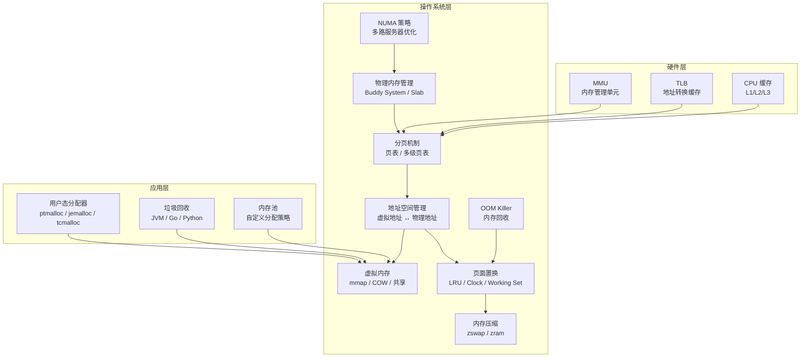

# 一、什么是内存管理

## 1.1 内存：计算的基石

在讨论"内存管理"之前，我们需要先理解"内存"本身在计算机系统中扮演的角色。

**内存（Memory）**，也称**主存（Primary Storage）**或**随机存取存储器（RAM, Random Access Memory）**，是 CPU 能够直接访问的数据存储介质。与磁盘、SSD 等辅助存储器不同，内存具有两个关键特性：

- **按字节寻址（Byte-Addressable）**：CPU 可以读写任意一个字节地址，无需像磁盘那样按块读取
- **易失性（Volatile）**：断电后数据立即丢失

这两个特性使得内存成为程序运行时的"工作台"——所有正在执行的指令和正在处理的数据都必须驻留在内存中，CPU 才能访问它们。

### 为什么内存如此重要

一个计算机系统中，内存是连接 CPU 与持久存储的桥梁：

计算机存储层次金字塔（从快到慢）：

              ┌──────────┐
              │ 寄存器    │  ← ~0.3ns，KB 级
              │ (Register)│
              ├──────────┤
             │  L1 Cache  │  ← ~1ns，64-128KB
             ├────────────┤
            │   L2 Cache   │  ← ~3-10ns，256KB-1MB
            ├──────────────┤
           │    L3 Cache    │  ← ~10-30ns，数MB-数十MB
           ├────────────────┤
          │     主存 (RAM)    │  ← ~50-100ns，GB 级
          ├──────────────────┤
         │     SSD / NVMe     │  ← ~10-100μs，GB-TB 级
         ├────────────────────┤
        │        HDD           │  ← ~5-10ms，TB 级
        └──────────────────────┘

  访问延迟差异：寄存器比 HDD 快约 1000万 倍

| 存储层级 | 典型延迟 | 典型容量 | 每 GB 成本（美元） | 是否易失 |
|---------|---------|---------|------------------|---------|
| 寄存器 | ~0.3ns | < 1KB | 极高（无法单独定价） | 是 |
| L1 Cache | ~1ns | 64-128KB | 极高 | 是 |
| L2 Cache | ~3-10ns | 256KB-1MB | 极高 | 是 |
| L3 Cache | ~10-30ns | 2-64MB | 极高 | 是 |
| 主存 (DDR5) | ~50-100ns | 8-256GB | ~2-5 | 是 |
| NVMe SSD | ~10-100μs | 256GB-4TB | ~0.05-0.1 | 否 |
| SATA SSD | ~50-200μs | 128GB-2TB | ~0.03-0.08 | 否 |
| HDD | ~5-10ms | 1-20TB | ~0.01-0.02 | 否 |

> **关键洞察**：内存的容量和速度处于一个"甜蜜点"——比 CPU 缓存大得多但比磁盘快得多。内存管理的核心挑战，就是如何在这个有限的"工作台"上高效地服务于可能远超其容量的应用需求。

## 1.2 什么是内存管理

**内存管理（Memory Management）** 是操作系统内核中最核心、最复杂的子系统之一。它负责协调 CPU、应用程序和物理内存之间的所有交互，确保系统中的每个程序都能安全、高效地使用内存资源。

用一句话概括：**内存管理是操作系统对物理内存进行抽象、分配、保护和回收的整套机制。**

更具体地说，内存管理需要同时解决以下几组看似矛盾的需求：

| 需求 | 矛盾 | 内存管理的回答 |
|------|------|--------------|
| 程序需要连续的大块内存 | 物理内存是有限且碎片化的 | 虚拟地址空间 + 分页机制 |
| 多个程序同时运行需要隔离 | 它们共享同一块物理内存 | 地址空间隔离 + 页表权限 |
| 程序可能比物理内存还大 | 内存无法容纳整个程序 | 按需调页 + Swap |
| 多个程序共享公共库（如 libc） | 每个程序都"看到"自己独立的副本 | 写时复制（COW）+ 共享映射 |
| 内核也需要内存 | 内核不能被用户程序破坏 | 内核空间/用户空间分离 |
| 程序动态申请和释放内存 | 内存需要被精确追踪 | 堆管理器（malloc/free） |

## 1.3 为什么需要内存管理

### 1.3.1 没有内存管理的年代

在现代操作系统诞生之前（1960年代以前），程序直接操作物理地址。程序员必须清楚地知道每个变量在内存中的确切位置，两个程序如果使用了同一段内存地址，就会互相覆盖导致崩溃。

裸机时代的内存使用：

  物理内存 (64KB)
  ┌────────────────────────────┐
  │ 0x0000-0x0FFF │ 程序A 代码  │  ← 程序员手动指定地址
  │ 0x1000-0x1FFF │ 程序A 数据  │
  │ 0x2000-0x2FFF │ 程序B 代码  │  ← 如果程序A写入 0x2000
  │ 0x3000-0x3FFF │ 程序B 数据  │     → 覆盖程序B的代码 → 崩溃！
  │ ...           │            │
  └────────────────────────────┘

  问题：
  × 程序之间没有隔离，一个程序的错误会影响所有程序
  × 程序无法使用超出物理内存大小的地址空间
  × 无法同时安全地运行多个程序
  × 没有任何安全保护机制

### 1.3.2 内存管理解决的六大核心问题

内存管理的出现，从根本上解决了早期计算机系统的六个关键痛点：

**问题一：地址隔离——让程序互不干扰**

每个进程拥有独立的虚拟地址空间，进程 A 无法直接访问进程 B 的内存（除非显式共享）。一个进程的内存错误（如越界写入）只会影响自身，不会波及其他进程或操作系统内核。

**问题二：内存保护——防止程序破坏系统**

通过页表中的权限位（读/写/执行），操作系统可以保护关键内存区域：
- 内核空间：用户态程序完全不可访问
- 代码段：只读且可执行，防止被意外修改
- 栈/堆：可读写但不可执行，防止代码注入攻击（NX/DEP）

**问题三：内存抽象——简化编程模型**

程序员无需关心物理内存的实际布局。每个进程的地址空间都从 0 开始线性排列，代码、数据、堆、栈各在其位。编译器和链接器可以假设程序运行在地址 0 开始的连续空间中，由操作系统和硬件负责将虚拟地址翻译为物理地址。

**问题四：内存超用——突破物理容量限制**

通过按需调页（Demand Paging）和交换空间（Swap），程序可以使用比实际物理内存更大的地址空间。操作系统仅将当前需要的页面保留在内存中，将不常用的页面暂时移到磁盘。这使得在 8GB 内存的机器上运行需要 16GB 地址空间的程序成为可能。

**问题五：内存共享——高效利用稀缺资源**

多个进程可以共享相同的物理内存页：
- **共享库**：数百个进程共享同一份 libc 代码段
- **fork() + COW**：子进程创建时共享父进程的所有页面，仅在写入时才复制
- **共享内存（shmget/mmap）**：进程间高效通信

**问题六：内存回收——保证系统持续运行**

当内存紧张时，操作系统可以通过页面置换将不活跃的页面换出到磁盘，或将低优先级进程的内存释放。OOM Killer 可以在极端情况下杀死占用过多内存的进程，防止系统完全崩溃。

### 1.3.3 一个直观的类比

可以将内存管理类比为一家图书馆的管理系统：

图书馆类比：

  物理内存  ≈  图书馆的书架空间（有限）
  虚拟内存  ≈  每个读者手中的借阅清单（无限大）
  页表      ≈  图书馆目录卡片（记录书在哪个书架）
  TLB       ≈  读者最近常翻的几本书的便签（加速查找）
  Swap      ≈  书库（书太多放不下时，把不常用的存到地下室）
  内存保护  ≈  限借区域（某些书只有馆长能看，某些只能在馆内看）
  共享内存  ≈  参考书区（多人可以同时阅读同一本百科全书）
  碎片整理  ≈  定期整理书架，把散落的空位合并

  没有图书管理员（操作系统）的图书馆：
  × 读者自己找书、自己放回、自己决定谁看什么
  × 经常找不到书，书被放错位置，有人偷看不该看的书

  有了图书管理员的图书馆：
  ✓ 读者只需说出书名，管理员帮忙找到并送到手上
  ✓ 每个人的借阅记录独立，互不影响
  ✓ 书不够时，管理员把最久没人看的书暂时收起来

## 1.4 内存管理的层次模型

内存管理不是操作系统单独完成的任务，而是一个跨越硬件和软件的协作体系。从底层到上层，可以分为三个层次：

### 1.4.1 硬件层：地址转换的执行者

硬件提供了内存管理的基础设施：

**MMU（Memory Management Unit，内存管理单元）**
- 集成在 CPU 内部，负责将虚拟地址实时转换为物理地址
- 当程序发出一个虚拟地址时，MMU 查找页表，得到对应的物理地址
- 如果页面不在物理内存中（PTE 的 Present 位为 0），MMU 触发**缺页中断（Page Fault）**，将控制权交给操作系统

**TLB（Translation Lookaside Buffer，地址转换后备缓冲器）**
- MMU 内部的高速缓存，存储最近使用的虚拟页到物理页帧的映射
- 典型 TLB 命中率 > 99%，命中时只需 1 个 CPU 周期即可完成地址转换
- 未命中时需要遍历页表（4-5 次内存访问，100+ 周期）

**页表硬件支持**
- x86-64 架构使用 4 级（或 5 级）页表结构
- 每个页表条目（PTE）包含物理页帧号和权限位
- 硬件自动遍历页表，支持 TLB 自动填充

硬件层的工作流程：

  CPU 发出虚拟地址 0x7f8a1c012345
       │
       ▼
  ┌──────────────────┐
  │       MMU         │
  │                   │
  │  ① 查 TLB         │──→ 命中 → 直接得到物理地址（1 周期）
  │                   │
  │  ② TLB 未命中     │──→ 遍历页表（4 级查找）
  │     PGD → PUD    │     PGD → PUD → PMD → PTE
  │     → PMD → PTE  │
  │                   │
  │  ③ PTE Present=1  │──→ 将 PFN + Offset 组合为物理地址
  │                   │     结果存入 TLB
  │  ④ PTE Present=0  │──→ 触发缺页中断，交给操作系统处理
  └──────────────────┘
       │
       ▼
  物理地址 → 访问实际 RAM 芯片

### 1.4.2 操作系统层：策略的制定者

操作系统内核定义了内存管理的策略和算法：

| 功能模块 | 职责 | 关键机制 |
|---------|------|---------|
| 地址空间管理 | 维护每个进程的虚拟地址空间 | `mm_struct`、VMA（虚拟内存区域） |
| 页表管理 | 创建和维护进程页表 | 多级页表、`pgd_t` |
| 物理内存分配 | 管理物理页帧的分配与回收 | Buddy System（伙伴系统） |
| 内核对象分配 | 为内核内部结构分配小对象 | Slab/SLUB 分配器 |
| 页面置换 | 在内存不足时选择换出的页面 | LRU、Clock、Working Set |
| 内存压缩 | 将页面压缩后保留在内存中 | zswap、zram |
| 交换管理 | 管理 swap 空间，处理页面换入换出 | swap 分区/文件 |
| OOM 管理 | 在极端情况下回收内存 | OOM Killer |
| NUMA 策略 | 在多路服务器上优化内存分配位置 | `numactl`、NUMA 策略 |

### 1.4.3 应用层：内存的使用者

用户态程序通过系统调用和库函数与内存管理交互：

**系统调用接口**
- `brk()` / `sbrk()`：调整堆的大小
- `mmap()`：创建匿名映射或文件映射
- `munmap()`：解除内存映射
- `mprotect()`：修改内存区域的保护属性
- `madvise()`：向内核提供内存使用建议

**用户态内存分配器**
标准库提供的 `malloc()` / `free()` 只是入口，背后有不同的分配器实现：

| 分配器 | 开发者 | 默认使用者 | 核心特点 |
|-------|-------|-----------|---------|
| ptmalloc2 | Wolfram Gloger | glibc (Linux) | 基于 `brk()` + `mmap()`，简单通用 |
| jemalloc | Jason Evans | FreeBSD, Firefox, Redis | 按 arena 分配，优秀的多线程扩展性 |
| tcmalloc | Google | Chrome, C++ 服务 | 线程本地缓存，减少锁竞争 |
| mimalloc | Microsoft | Windows Runtime | 小内存高效，延迟低 |
| rpmalloc | Rampant Pixels | 游戏引擎 | 基于全局 lock-free 虚拟内存管理 |

内存分配的完整路径（以 malloc 为例）：

  应用代码调用 malloc(1024)
       │
       ▼
  ┌──────────────────┐
  │  用户态分配器      │  ptmalloc / jemalloc / tcmalloc
  │  (用户态)         │
  │                   │
  │  ① 检查本地缓存    │──→ 有可用块 → 直接返回（最快路径）
  │                   │
  │  ② 检查线程缓存    │──→ 有可用块 → 返回
  │                   │
  │  ③ 检查全局空闲链表 │──→ 有可用块 → 返回
  │                   │
  │  ④ 向内核申请新页面 │──→ mmap() / brk() 系统调用
  └──────────────────┘
       │
       ▼
  ┌──────────────────┐
  │  操作系统内核      │
  │  (内核态)         │
  │                   │
  │  ① 分配物理页帧    │──→ Buddy System
  │  ② 创建页表映射    │──→ 更新进程页表
  │  ③ 设置权限位     │──→ 用户可读写
  └──────────────────┘
       │
       ▼
  返回指针给应用代码

## 1.5 内存管理的核心概念

在深入学习内存管理的各个子领域之前，需要先掌握一组核心概念。这些概念将贯穿整个章节：

### 1.5.1 虚拟地址与物理地址

**虚拟地址（Virtual Address）** 是程序"看到"的地址，每个进程都从 0 开始。**物理地址（Physical Address）** 是内存芯片上实际的存储位置。两者通过页表建立映射关系。

同一个虚拟地址在不同进程中可以映射到完全不同的物理地址——这就是地址空间隔离的基础。

### 1.5.2 页（Page）与页帧（Page Frame）

- **页（Page）**：虚拟地址空间的固定大小切片（通常 4KB）
- **页帧（Page Frame）**：物理内存的同样大小的切片
- **页表（Page Table）**：记录虚拟页到物理页帧映射关系的数据结构

虚拟地址被分为两部分：高位的**虚拟页号（VPN）**和低位的**页内偏移（Offset）**。MMU 通过 VPN 在页表中查找对应的物理页帧号（PFN），然后加上 Offset 得到物理地址。

### 1.5.3 缺页中断（Page Fault）

当进程访问一个虚拟页面，但该页面不在物理内存中时，硬件触发缺页中断。操作系统接管后执行以下操作：

1. **合法缺页（Minor Fault）**：页面在内存中但页表未建立映射（如首次访问 `mmap` 区域、COW 页面），直接建立映射即可，无需磁盘 I/O
2. **换入缺页（Major Fault）**：页面被换出到 swap，需要从磁盘读回，涉及磁盘 I/O，耗时较长
3. **非法缺页（Segmentation Fault）**：访问了未映射或无权限的地址，操作系统向进程发送 `SIGSEGV` 信号，进程通常会崩溃

### 1.5.4 碎片问题

内存管理中存在两种碎片：

| 碎片类型 | 成因 | 解决方案 |
|---------|------|---------|
| **外部碎片（External Fragmentation）** | 已分配的内存块之间留下过小的空闲间隙，无法满足新的分配请求 | 分页机制（消除外部碎片）、伙伴系统（按 2 的幂次合并） |
| **内部碎片（Internal Fragmentation）** | 分配的内存块大于实际需要的大小，多余部分被浪费 | 更细粒度的分配器（Slab/SLUB）、按需分页 |

### 1.5.5 局部性原理

内存管理的许多设计决策都建立在**局部性原理（Principle of Locality）** 之上：

- **时间局部性（Temporal Locality）**：最近被访问的地址很可能在近期再次被访问（循环、热路径）
- **空间局部性（Spatial Locality）**：访问某个地址后，其相邻地址也很可能被访问（数组遍历、顺序执行）

局部性原理使得以下技术成为可能：
- CPU 缓存（L1/L2/L3）能命中绝大多数访问
- TLB 能缓存最近使用的页表条目
- LRU 等页面置换算法能做出合理的置换决策
- 预取（Prefetch）可以提前将数据加载到缓存中

## 1.6 内存管理的性能影响

内存管理的效率对系统性能有着深远影响。以下用几组真实数据说明：

### 1.6.1 TLB Miss 的代价

一次完整的页表遍历（x86-64 四级页表）：

  步骤           访问次数    累计延迟
  ─────────────  ────────  ────────
  TLB 未命中         0        0ns（已有）
  读取 PGD           1       ~100ns
  读取 PUD           2       ~200ns
  读取 PMD           3       ~300ns
  读取 PTE           4       ~400ns
  读取数据           5       ~500ns
  ─────────────  ────────  ────────
  合计               5       ~500ns

  对比 TLB 命中：
  TLB 命中             1        ~1ns（1 个 CPU 周期）
  读取数据             2      ~101ns
  ─────────────  ────────  ────────
  合计                 2      ~102ns

  TLB 命中 vs 未命中：延迟差距约 5 倍

对于一个需要频繁遍历大数组的程序（如数据库扫描操作），如果 TLB 覆盖率不足，性能可能下降数倍。

### 1.6.2 Swap 抖动的灾难性影响

当系统物理内存耗尽、大量页面频繁换入换出时，会产生**抖动（Thrashing）**：

抖动发生时的系统状态：

  物理内存：64GB 全部占满
  Swap 使用：持续增长
  CPU 利用率：看似很高（90%+）
  实际有用工作：极低

  原因链：
  内存不足 → 频繁换页 → 磁盘 I/O 暴增 → CPU 等待 I/O → 无法执行有用指令

  直观感受：
  × 系统"卡死"，命令执行需要数秒甚至数分钟
  × `top` 显示 si/so（swap in/out）持续高位
  × `dstat` 显示磁盘利用率 100%，但 CPU idle 却很高

### 1.6.3 分配器选择对性能的影响

不同用户态分配器在不同工作负载下的性能差异可达数倍：

| 工作负载 | ptmalloc2 | jemalloc | tcmalloc | 说明 |
|---------|-----------|----------|----------|------|
| 单线程频繁小分配 | 基准 | -5% | -10% | tcmalloc 线程缓存优势明显 |
| 多线程并发分配 | 基准 | +40% | +30% | jemalloc 的 arena 设计减少锁竞争 |
| 大块分配（>256KB） | 基准 | 基准 | 基准 | 都直接走 mmap，差异不大 |
| 长期运行（内存碎片） | 基准 | +20% | +15% | jemalloc 的 junk/uninit 检测更彻底 |

> 注：正数表示性能提升，负数表示下降。基准为 ptmalloc2。

## 1.7 内存管理知识全景图

内存管理是一个庞大的知识体系。以下全景图展示了本章将要深入探讨的各个子领域及其关联：

## 1.8 内存管理在不同场景下的挑战

不同的应用场景对内存管理提出了截然不同的要求：

### 1.8.1 嵌入式系统

- 内存极其有限（可能只有几 MB 甚至更少）
- 通常没有 Swap 支持
- 需要确定性的内存分配行为（实时系统）
- 常用方案：固定分区、内存池、静态分配
- 典型 OS：FreeRTOS、RT-Thread、Linux（带实时补丁）

### 1.8.2 服务器/数据库

- 大内存配置（数百 GB 甚至 TB 级）
- 需要大页支持以减少 TLB miss
- 对延迟极度敏感（微秒级抖动不可接受）
- NUMA 感知至关重要
- 典型方案：大页 + `madvise` 模式 + NUMA 绑定 + 禁用 THP
- 典型应用：MySQL InnoDB Buffer Pool、Redis、PostgreSQL

### 1.8.3 桌面/移动应用

- 内存中等（4-32GB）
- 需要响应速度与内存效率的平衡
- GC（垃圾回收）语言的应用需要特别关注暂停时间
- 操作系统需要在后台进程和前台进程之间动态调整内存分配
- 典型方案：THP `madvise` 模式 + 按需交换 + OOM 优先级

### 1.8.4 超大规模集群

- 数千台机器，每台数百 GB 内存
- 内存碎片管理影响长期稳定性
- 需要 cgroup v2 进行容器级别的内存限制
- 内存过量分配（Memory Overcommit）策略的权衡
- 典型方案：cgroup 限制 + OOM 控制 + Swap 策略 + 监控告警

## 1.9 本节小结

本节从宏观角度回答了"什么是内存管理"这一根本问题。核心要点：

1. **内存是 CPU 直接访问的工作存储**，容量和速度处于 CPU 缓存与磁盘之间的"甜蜜点"
2. **内存管理是操作系统的核心子系统**，负责对物理内存进行抽象、分配、保护和回收
3. **内存管理解决六大问题**：地址隔离、内存保护、内存抽象、内存超用、内存共享、内存回收
4. **内存管理是三层协作**：硬件（MMU/TLB）执行地址转换 → 操作系统制定策略 → 应用通过分配器使用内存
5. **局部性原理**是内存管理许多设计决策的理论基础
6. **不同场景对内存管理有不同要求**：嵌入式追求确定性，服务器追求吞吐量，桌面追求响应速度

接下来，我们将沿着"硬件→操作系统→应用"的路径，逐层深入内存管理的每一个技术细节。

---

**下一节**：[二、技术演进](../理论基础/02-二技术演进.md) — 从裸机直接寻址到五级页表，内存管理技术八十年的演进之路
