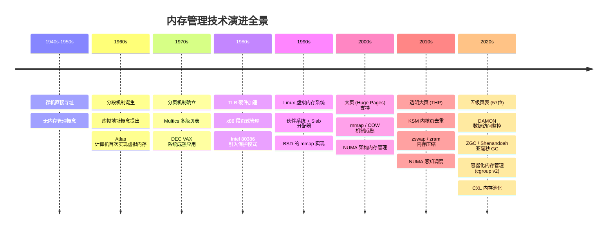
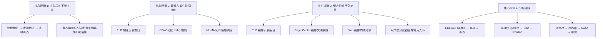

## 二、技术演进

内存管理技术的发展史，是一部硬件与软件协同进化的历史。从最早的裸机直接寻址，到如今支持 128PB 虚拟地址空间的五级页表；从手动管理内存的年代，到操作系统自动完成页面置换——每一次突破都深刻改变了计算机系统的架构范式。理解这条演进脉络，不仅有助于把握当前技术的设计动机，更能预见未来的发展方向。



### 2.1 裸机时代（1940s-1950s）：没有内存管理的年代

在计算机发展的最初阶段，程序直接操作物理地址。程序员必须清楚地知道每个变量在内存中的确切位置，程序之间的内存冲突只能通过"不要同时运行"来避免。

这一时期的核心特征：

| 特征 | 说明 |
|------|------|
| 地址模型 | 程序直接使用物理地址，无任何抽象层 |
| 并发模型 | 一次只能运行一个程序（批处理） |
| 内存保护 | 完全没有，一个程序可以修改任何内存位置 |
| 编程方式 | 手工计算内存偏移量，使用绝对地址 |
| 典型机器 | ENIAC（1945）、IBM 701（1952） |

裸机时代的程序运行模型：

┌──────────────────────────────────────┐
│            物理内存 (64KB)             │
├──────────────────────────────────────┤
│ 0x0000 - 0x0FFF  │ 程序A 的代码       │  ← 程序员手动指定地址
│ 0x1000 - 0x1FFF  │ 程序A 的数据       │
│ 0x2000 - 0x2FFF  │ 程序B 的代码       │  ← 如果两个程序重叠 → 崩溃
│ 0x3000 - 0x3FFF  │ 程序B 的数据       │
│ ...              │ （未使用）          │
└──────────────────────────────────────┘

问题：程序A如果写入 0x2000，会覆盖程序B的代码！

这种模式在单道批处理系统中勉强可用，但当计算机需要同时处理多个任务时，内存冲突就成了致命瓶颈。这催生了内存管理技术的第一个重大突破——地址空间隔离。

### 2.2 分段机制的诞生（1960s）：虚拟地址概念的提出

1960 年代，IBM 在 System/360 系列中首次引入了**基址寄存器（Base Register）** 的概念。程序不再直接使用物理地址，而是使用"相对地址"，由硬件自动加上基址寄存器中的偏移量来得到实际物理地址。

这一思想的真正突破来自 1961 年曼彻斯特大学的 **Atlas 计算机**。Atlas 是第一台实现了虚拟内存概念的计算机，由 Tom Kilburn 团队设计。它的核心创新在于：将程序"看到"的地址空间与实际物理内存解耦，让每个程序都运行在自己的虚拟地址空间中。

#### Atlas 的里程碑意义

Atlas 计算机引入了多项内存管理的核心概念：

1. **页面调度（Paging）**：Atlas 是最早将虚拟地址空间划分为固定大小"页"的系统，每页 512 字（48 位字长），通过硬件将虚拟页号映射到物理页帧
2. **按需调页（Demand Paging）**：页面仅在被访问时才从磁鼓加载到内存，大幅降低了内存占用
3. **页面置换**：当内存满了，Atlas 会将最不常用的页面写回磁鼓，为新页面腾出空间
4. **缺页中断**：当访问的页面不在内存中时，CPU 自动触发中断，由操作系统完成页面加载

Atlas 计算机的地址转换（1961年）：

  程序发出虚拟地址
       │
       ▼
  ┌────────────────┐
  │   页面表        │  ← 存在快速磁芯存储器中
  │   (Page Table)  │
  └───────┬────────┘
          │
          ▼
  虚拟页号 ──→ 物理页帧号
          │
          ▼
  ┌────────────────┐
  │   物理内存      │  ← 磁芯存储器
  │  (32个页面帧)   │
  └────────────────┘

与此同时，**分段（Segmentation）** 作为另一种虚拟化方案也在发展。与分页的"固定大小切片"不同，分段按逻辑单元（代码段、数据段、栈段）划分地址空间，每个段的大小可以不同。分段的优势在于更自然地匹配程序的逻辑结构，但缺点是容易产生外部碎片。

#### 分段在 x86 架构中的落地

1978 年，Intel 推出 8086 处理器，引入了段寄存器（CS、DS、SS、ES）模型。逻辑地址由"段选择子:段内偏移"组成，物理地址 = 段基地址 + 段内偏移。这一设计深刻影响了此后 40 年的 x86 架构演进。

8086 的段:偏移 地址计算：

  物理地址 = 段寄存器 × 16 + 偏移地址

  例：CS = 0x1000, IP = 0x0234
  物理地址 = 0x1000 × 16 + 0x0234 = 0x10234

  段寄存器 (16位)          偏移 (16位)
  ┌─────────────────┐     ┌─────────────────┐
  │    0x1000        │     │    0x0234        │
  └────────┬────────┘     └────────┬────────┘
           │                       │
           ▼                       ▼
     × 16 = 0x10000           + 0x0234
           │                       │
           └──────────┬────────────┘
                      ▼
              物理地址 0x10234

这种分段模型有明显局限：每个段最大 64KB（16 位偏移），段之间可能重叠产生外部碎片，且缺乏完善的保护机制。

### 2.3 分页机制的确立（1970s）：从理论到工业实践

1970 年代是分页机制从学术研究走向工业实践的关键十年。

#### Multics：分页思想的集大成者

1964 年启动、1969 年投入运行的 **Multics** 系统（由 MIT、贝尔实验室和 GE 联合开发）是最早将分页机制做到极致的操作系统。Multics 引入了多级页表的概念——用层次化的页表结构来避免单级页表的巨大内存开销。

Multics 的设计对后来的操作系统产生了深远影响：
- **层次化地址空间**：程序可以在虚拟地址空间中动态增长
- **环状保护模型（Ring Protection）**：通过硬件实现的特权级保护，从 Ring 0（内核）到 Ring 3（用户程序），共 4 级
- **分页与分段结合**：段内再分页，兼顾两者的优点

值得注意的是，Multics 的设计远超前人——它在 1960 年代就预见了后来 Unix/Linux 系统中几乎所有内存管理的核心思想。Ken Thompson 和 Dennis Ritchie 正是从 Multics 项目中获得灵感，后来创建了 Unix。

#### DEC VAX：分页的工业标准

1977 年推出的 DEC VAX-11/780 是第一款在商业上成功大规模部署分页机制的计算机。VAX 采用 512 字节的页面大小（而非后来 x86 的 4KB），其虚拟内存设计被广泛研究，成为教科书中的经典案例。

VAX-11 的虚拟地址空间（32位）：

  ┌──────────────────────────────────────┐
  │           进程 P1 的虚拟空间          │  0x00000000 - 0x7FFFFFFF
  ├──────────────────────────────────────┤
  │           进程 P2 的虚拟空间          │  0x00000000 - 0x7FFFFFFF
  ├──────────────────────────────────────┤
  │           内核空间（共享）            │  0x80000000 - 0xFFFFFFFF
  └──────────────────────────────────────┘

  每个进程都从地址 0 开始，拥有独立的虚拟空间
  内核空间在所有进程间共享
  页面大小：512 字节
  缺页处理：由 OS 软件实现（非硬件自动）

VAX 系统的一个重要特点是其缺页处理完全由操作系统软件实现（而非硬件自动完成页表遍历），这使得它成为研究页面置换算法的理想平台。许多经典的页面置换研究（如 Belady 的 FIFO 算法异常现象）都基于 VAX 系统展开。

#### 为什么 4KB 成为标准页面大小？

现代主流处理器普遍采用 4KB 作为标准页面大小，这并非偶然：

| 页面大小 | 页内偏移位数 | 页表条目数（32位） | 内存开销 |
|---------|-------------|-------------------|---------| 
| 512B | 9 位 | 8,388,608 | 64MB（全部条目） |
| 1KB | 10 位 | 4,194,304 | 32MB |
| 4KB | 12 位 | 1,048,576 | 8MB |
| 16KB | 14 位 | 262,144 | 2MB |
| 64KB | 16 位 | 65,536 | 512KB |

4KB 是一个精心权衡的结果：
- **太小**（如 512B）：页表本身太大，每次 TLB miss 的代价过高
- **太大**（如 64KB）：内部碎片严重，小文件也会占用整页
- **4KB**：在页表开销和内部碎片之间取得了良好平衡，同时与磁盘 I/O 的扇区大小（512B）和文件系统块大小形成整数倍关系（4KB = 8 × 512B）

### 2.4 TLB 与硬件加速（1980s）：让地址转换快起来

1980 年代，随着处理器速度与内存速度之间的差距（"内存墙"问题）日益加剧，硬件辅助的地址转换加速变得至关重要。

#### TLB 的引入

**TLB（Translation Lookaside Buffer，地址转换后备缓冲器）** 是 CPU 内部的高速缓存，存储最近使用的页表映射关系。TLB 的核心价值在于：将地址转换从"多次内存访问"（遍历页表）缩减为"一次缓存查找"。

没有 TLB 时（纯软件页表遍历）：

  CPU 发出虚拟地址
       │
       ▼
  ① 查找 PGD          → 内存访问 1（~100ns）
       │
       ▼
  ② 查找 PUD          → 内存访问 2（~100ns）
       │
       ▼
  ③ 查找 PMD          → 内存访问 3（~100ns）
       │
       ▼
  ④ 查找 PTE          → 内存访问 4（~100ns）
       │
       ▼
  ⑤ 用物理地址访问数据 → 内存访问 5（~100ns）
  
  总开销：500ns（5次内存访问）


有 TLB 时（硬件加速）：

  CPU 发出虚拟地址
       │
       ▼
  ① TLB 查找           → 1个CPU周期（~0.3ns）
       │
       ├── 命中 → 直接得到物理地址
       │         访问数据 → 1次内存访问
       │         总开销：~100ns
       │
       └── 未命中 → 走页表遍历 + 结果写入TLB
                     总开销：~400ns（但后续同一页面命中）

  TLB 命中率 > 99% → 平均开销 ≈ 100ns

Intel 80386（1985 年发布）是 x86 家族中首个引入 TLB 的处理器。80386 还引入了保护模式（Protected Mode），将分段和分页结合起来：

80386 的地址转换流水线：

  逻辑地址                    线性地址                    物理地址
  (段:偏移)                   (分段后)                    (分页后)
  ┌──────┬──────┐     ┌──────────────────┐     ┌──────────────────┐
  │ 段选择子 │ 偏移 │ →  │ 段基地址 + 偏移    │ →  │ 页表查找          │
  └──────┴──────┘     │ (段描述符查找)     │     │ (虚拟→物理)       │
                       └──────────────────┘     └──────────────────┘
  
  段寄存器 → GDT/LDT 查找段描述符 → 得到段基地址 → 加上偏移 → 线性地址
  线性地址 → 页表查找 → 得到物理地址

#### Intel 80486：片上 TLB 的革命

1989 年推出的 Intel 80486 首次将 TLB 集成到处理器芯片内部（而非像 386 那样依赖外部协处理器 80385），大幅降低了 TLB 查找的延迟。80486 的 TLB 规格：
- 32 条目全相联 TLB（指令 + 数据分开）
- TLB 命中：1 个时钟周期
- TLB 未命中：触发硬件页表遍历（Page Table Walk），约 20+ 个时钟周期

这一设计奠定了此后数十年 x86 处理器 TLB 架构的基础。现代处理器的 TLB 已经发展到多级结构（L1 dTLB + L2 sTLB），条目数也从 32 扩展到数千，但核心思想一脉相承。

### 2.5 Linux 虚拟内存系统的崛起（1990s）：开源革命

1991 年，Linus Torvalds 发布了 Linux 内核的第一个版本（0.01），其中的内存管理子系统虽然简陋，但已经包含了虚拟内存的基本框架。此后十年，Linux 的内存管理经历了从"能用"到"高性能"的蜕变。

#### 1991-1995：基础框架建立

Linux 0.01 的内存管理极为简单——仅支持分页机制和基本的按需调页。进程通过 `fork()` 创建时使用写时复制（COW）技术来提高效率，但页面置换算法还比较粗糙。

1994 年的 Linux 1.0 开始支持更完善的虚拟内存管理：
- 支持 `mmap()` 系统调用，实现内存映射文件
- 引入页面缓存（Page Cache），用空闲内存缓存文件数据
- 支持交换空间（Swap），将不常用的页面写入磁盘

#### 1996-2000：Buddy System 与 Slab 的引入

这是 Linux 内存管理架构定型的关键时期。

**Buddy System（伙伴系统）** 由 Mel Gorman 在 Linux 2.6 内核中重新设计和优化。伙伴系统负责管理物理内存的页帧分配，核心思想是将空闲内存按 2 的幂次分组：

Buddy System 工作原理：

空闲内存以 2^0, 2^1, 2^2, ..., 2^10 页帧的块组织

  Free Area[0]:  2^0 = 1页 (4KB)    → [0x1000]
  Free Area[1]:  2^1 = 2页 (8KB)    → [0x2000-0x2FFF]
  Free Area[2]:  2^2 = 4页 (16KB)   → [0x4000-0x7FFF]
  Free Area[3]:  2^3 = 8页 (32KB)   → [0x8000-0xFFFF]
  ...

分配 3 页（12KB）的过程：
  1. 请求 3 页 → 最小满足的是 2^2 = 4 页
  2. 如果 4 页块空闲 → 直接分配
  3. 如果没有 4 页块 → 拆分 8 页块为两个 4 页块
     8 页 [0x8000-0xFFFF]
         ├── 左兄弟 [0x8000-0xBFFF] → 空闲链表
         └── 右兄弟 [0xC000-0xFFFF] → 分配出去

释放时合并伙伴：
  释放 [0xC000-0xFFFF] (4页)
  检查其伙伴 [0x8000-0xBFFF] 是否空闲？
  → 空闲 → 合并为 [0x8000-0xFFFF] (8页)
  → 继续检查 8 页的伙伴...

**Slab 分配器** 则解决了内核中小对象（如 `task_struct`、`inode`、`dentry`）的高效分配问题。传统的 buddy system 以页为最小单位，分配 256 字节的 `task_struct` 也需要一整页，浪费严重。

Slab 分配器（由 Jeff Bonwick 在 Solaris 2.4 中首创，Linux 在 2.6 内核引入）采用"对象缓存"的思想：

Slab 分配器架构：

  ┌─────────────────────────────────────────────┐
  │              用户请求                          │
  │     kmalloc(128) → 从 cache_128 中分配        │
  └──────────────────────┬──────────────────────┘
                         │
                         ▼
  ┌─────────────────────────────────────────────┐
  │              Slab 缓存层                      │
  │                                              │
  │  ┌─────────┐  ┌─────────┐  ┌─────────┐     │
  │  │ cache_32│  │ cache_64│  │cache_128│     │
  │  │ (32B对象)│  │ (64B对象)│  │(128B对象)│    │
  │  └────┬────┘  └────┬────┘  └────┬────┘     │
  │       │            │            │            │
  └───────┼────────────┼────────────┼────────────┘
          │            │            │
          ▼            ▼            ▼
  ┌─────────────────────────────────────────────┐
  │              页帧分配层                       │
  │         向 Buddy System 申请页帧              │
  └─────────────────────────────────────────────┘

Linux 内核中 Slab 的演进路径：

| 时期 | 实现 | 特点 |
|------|------|------|
| Linux 2.2-2.6 | Slab (Jeff Bonwick 设计) | 功能完善，但代码复杂、内存开销大 |
| Linux 2.6.22+ | SLUB (Christoph Lameter) | 简化设计，减少元数据开销，成为默认分配器 |
| Linux 3.x+ | SLOB (Mark Salter) | 为嵌入式系统设计，极度精简 |

SLUB 是当前 Linux 的默认内核内存分配器，其核心改进在于：
- 去掉了 Slab 的 per-CPU 缓存队列，改用更简单的 freelist
- 减少了每 slab 的元数据开销
- 支持更好的 NUMA 感知

#### 1994 年：BSD 的 mmap 实现

1994 年，4.4BSD（包括 FreeBSD 的前身）实现了 `mmap()` 系统调用的完整版本，使得用户态程序可以将文件直接映射到进程的虚拟地址空间。这一机制深刻影响了后来所有类 Unix 系统的文件 I/O 设计。`mmap()` 相比传统 `read()`/`write()` 的优势在于：避免了内核态与用户态之间的数据拷贝（零拷贝），文件数据直接出现在进程的地址空间中。

### 2.6 大页与 mmap 的成熟（2000s）：性能优化的新维度

进入 21 世纪，内存管理技术的焦点从"让系统能工作"转向"让系统更快"。

#### 大页（Huge Pages）的引入

随着数据库（Oracle、MySQL）和 JVM 应用的普及，4KB 页面大小的局限日益暴露。一个使用 64GB 内存的数据库，需要 1600 万个页表条目才能覆盖全部内存——即使 TLB 命中率 99.99%，仍然有 1600 次 TLB miss，每次 miss 需要 4 次内存访问来遍历页表。

Linux 2.6.16（2006 年）正式引入了对 2MB 大页的支持，Linux 2.6.25（2008 年）进一步支持了 1GB 巨页：

大页 vs 标准页 的 TLB 效率对比：

  64GB 内存，TLB 条目数 = 1024

  标准页 (4KB)：
    需要覆盖的页数 = 64GB / 4KB = 16,777,216 页
    TLB 覆盖范围 = 1024 × 4KB = 4MB
    TLB 覆盖率 = 4MB / 64GB = 0.006%
    → 大量 TLB miss，每次 miss 损失 ~200ns

  大页 (2MB)：
    需要覆盖的页数 = 64GB / 2MB = 32,768 页
    TLB 覆盖范围 = 1024 × 2MB = 2GB
    TLB 覆盖率 = 2GB / 64GB = 3.125%
    → TLB miss 减少 512 倍

  巨页 (1GB)：
    需要覆盖的页数 = 64GB / 1GB = 64 页
    TLB 覆盖范围 = 1024 × 1GB = 1TB
    TLB 覆盖率 = 100%（完全覆盖）
    → TLB miss 接近零

在实际生产环境中，大页对数据库性能的提升尤为显著。Oracle 数据库在启用大页后，TLB miss 可降低 90% 以上，查询延迟减少 5%-15%。

#### mmap 的成熟与 COW 的广泛应用

`mmap()` 在 Linux 2.4 中得到了重大改进，支持了更灵活的映射选项和更大的映射区域。写时复制（Copy-on-Write）机制在 `fork()` 系统调用中的应用也变得更加成熟：

COW (Copy-on-Write) 在 fork() 中的工作流程：

  fork() 前：
  ┌──────────────────┐
  │ 父进程页表        │
  │ 虚拟页 0x1000     │──→ 物理帧 0xA000 [数据: 42]  ← 读/写
  │ 虚拟页 0x2000     │──→ 物理帧 0xB000 [数据: 99]  ← 读/写
  └──────────────────┘

  fork() 后（子进程创建时）：
  ┌──────────────────┐    ┌──────────────────┐
  │ 父进程页表        │    │ 子进程页表        │
  │ 虚拟页 0x1000     │    │ 虚拟页 0x1000     │
  │                  │    │                  │
  │  虚拟页 0x2000   │    │  虚拟页 0x2000   │
  └────────┬─────────┘    └────────┬─────────┘
           │                       │
           ▼                       ▼
  ┌─────────────────────────────────────┐
  │     物理帧 0xA000 [数据: 42] ← 只读  │  ← 两个进程共享！
  │     物理帧 0xB000 [数据: 99] ← 只读  │  ← 谁先写，谁触发 COW
  └─────────────────────────────────────┘

  当子进程写入虚拟页 0x1000 时：
  ① 触发保护异常（页标记为只读）
  ② 内核分配新物理帧 0xC000
  ③ 将 0xA000 的内容复制到 0xC000
  ④ 更新子进程页表指向 0xC000（读/写）
  ⑤ 父进程页表保持不变（仍指向 0xA000）

`fork()` + COW 组合是 Unix 系统高效创建进程的关键技术。如果不用 COW，每次 `fork()` 都需要复制整个地址空间（可能数 GB），耗时数秒甚至数分钟。有了 COW，`fork()` 只需要复制页表（几 KB 到几 MB），耗时在毫秒级。

#### MADV_FREE：COW 的进化

Linux 4.5（2016 年）引入了 `MADV_FREE` 标记，这是对传统 COW 机制的重要优化。传统上，当进程释放内存时（如 `free()` 调用 `munmap()`），内核会立即回收物理页。但很多场景下（如内存分配器的空闲缓存），进程可能很快再次使用这些内存。

`MADV_FREE` 允许内核延迟回收——标记为 `MADV_FREE` 的页面在内存充足时保留，在内存压力下才回收。这避免了不必要的分配/释放循环，提升了应用的内存分配性能。Linux 4.12+ 还进一步优化了 `MADV_FREE` 的实现，使其在低内存场景下也能及时回收。

### 2.7 透明大页、内存压缩与 NUMA 感知（2010s）：走向智能化

2010 年代的内存管理技术呈现出四大趋势：自动化、压缩化、去重化、拓扑感知化。

#### 透明大页（THP, Transparent Huge Pages）

Linux 2.6.38（2011 年）引入了透明大页（THP），它的核心思想是让内核自动将连续的小页合并为大页，无需应用程序显式请求。

THP 的三种工作模式：

| 模式 | 说明 | 适用场景 |
|------|------|---------|
| `always` | 所有符合条件的内存区域都自动使用大页 | 通用计算、内存密集型应用 |
| `madvise` | 仅对显式调用 `madvise(MADV_HUGEPAGE)` 的区域使用大页 | 数据库、JVM 等延迟敏感应用 |
| `never` | 完全禁用 THP | 需要精确控制内存布局的场景 |

THP 的合并与拆分过程：

THP 合并过程（khugepaged 内核线程）：

  时刻 T1：进程使用 512 个 4KB 小页
  ┌────┬────┬────┬────┬────┬─────┬────┐
  │ 4K │ 4K │ 4K │ 4K │ 4K │ ... │ 4K │  ← 512 个独立页面
  └────┴────┴────┴────┴────┴─────┴────┘

  时刻 T2：khugepaged 检测到 512 个连续小页
  ① 分配一个 2MB 大页
  ② 复制 512 个小页的内容到大页
  ③ 更新页表，指向新的 2MB 大页
  ④ 释放原来的 512 个小页帧

  ┌──────────────────────────────────────┐
  │          2MB 大页                      │  ← 单个 TLB 条目覆盖
  └──────────────────────────────────────┘

THP 的潜在问题值得注意：
- **合并/拆分开销**：`khugepaged` 在后台运行，合并操作可能消耗 CPU 和内存带宽
- **延迟抖动**：合并时需要持有内存锁，可能导致毫秒级的延迟峰值
- **内存浪费**：如果进程只使用了大页中的一小部分，剩余部分的内存被浪费
- 因此，数据库和 JVM 应用通常建议使用 `madvise` 模式而非 `always`

#### KSM：内核同页合并

**KSM（Kernel Same-page Merging，内核同页合并）** 是 Linux 2.6.32（2009 年）引入的内存去重技术，由 Red Hat 的 Izik Eidus 开发。KSM 的核心思想是：扫描物理内存中内容相同的页面，将它们合并为一个共享页面（写时复制），从而节省物理内存。

KSM 工作原理：

  合并前：
  ┌──────────────────┐  ┌──────────────────┐
  │   虚拟机 A        │  │   虚拟机 B        │
  │   物理帧 0x1000   │  │   物理帧 0x3000   │
  │   [内容: 全零页]   │  │   [内容: 全零页]   │  ← 两个页面内容相同
  └──────────────────┘  └──────────────────┘

  KSM 扫描后：
  ┌──────────────────┐  ┌──────────────────┐
  │   虚拟机 A        │  │   虚拟机 B        │
  │   物理帧 0x1000   │  │   物理帧 0x1000   │  ← 共享同一物理帧
  │   [内容: 全零页]   │  │   [内容: 全零页]   │     谁写谁触发 COW
  └──────────────────┘  └──────────────────┘
                          0x3000 被释放

KSM 在虚拟化场景中价值最大——多个虚拟机运行相同的操作系统时，大量内核库、共享内存区域的内容是相同的，KSM 可以节省 20%-50% 的物理内存。KVM/QEMU 和 VirtIO 虚拟机默认启用 KSM。

使用方式：
```bash
# 启用 KSM
echo 1 > /sys/kernel/mm/ksm/run

# 设置扫描频率（ms），默认 20ms
echo 20 > /sys/kernel/mm/ksm/sleep_millisecs

# 查看 KSM 统计
cat /sys/kernel/mm/ksm/pages_shared    # 共享页面数
cat /sys/kernel/mm/ksm/pages_sharing   # 正在共享的页面数
cat /sys/kernel/mm/ksm/pages_unshared  # 未共享的页面数
```

#### zswap 与 zram：内存压缩技术

当物理内存即将耗尽时，传统的做法是将页面写入磁盘（swap），但磁盘 I/O 的延迟（SSD ~100μs，HDD ~10ms）远高于内存（~100ns）。内存压缩技术在"写入磁盘"之前增加了一个中间层——将页面压缩后仍保留在内存中。

**zswap**（Linux 3.11, 2013 年）是内核层面的 swap 压缩缓存：

zswap 工作流程：

  当内存不足需要 swap out 时：
  ┌──────────────┐
  │ 待换出页面     │
  └──────┬───────┘
         │
         ▼
  ┌──────────────┐
  │ 尝试压缩到    │  ← 使用 LZO/LZ4/ZSTD 算法
  │ zswap 缓存    │     压缩比通常 2:1 ~ 3:1
  └──────┬───────┘
         │
    ┌────┴────┐
    │ 压缩成功？│
    └────┬────┘
     是  │   否
     │   └──→ 直接写入 swap 分区/文件
     ▼
  ┌──────────────┐
  │ 存储在 zswap   │  ← 占用物理内存，但比原始页面小
  │ 缓存池中       │     避免了磁盘 I/O
  └──────────────┘

**zram**（Linux 3.14, 2014 年）则更进一步，直接在内存中创建一个压缩的块设备作为 swap 分区：

zram vs 传统 swap 对比：

  传统 swap (磁盘)：
  物理内存 ──swap out──→ 磁盘 ──swap in──→ 物理内存
              ~100μs-10ms                   ~100μs-10ms

  zram (内存压缩)：
  物理内存 ──压缩──→ zram 设备 ──解压──→ 物理内存
              ~1-10μs                      ~1-10μs
  
  延迟降低 10-1000 倍

zram 在 Android 设备和内存受限的嵌入式系统中被广泛使用。通过压缩内存，2GB 物理内存的设备可以有效提供 3-4GB 的可用内存空间。在 Linux 桌面发行版（如 Fedora、Ubuntu）中，zram 也逐渐成为默认配置。

#### NUMA 感知的内存管理

随着多路服务器的普及，**NUMA（Non-Uniform Memory Access，非统一内存访问）** 架构成为主流。在 NUMA 系统中，每个 CPU 节点有自己"本地"的内存，访问远端节点的内存延迟显著更高。

双路 NUMA 系统拓扑：

  ┌─────────────────┐         ┌─────────────────┐
  │     Node 0      │         │     Node 1      │
  │ ┌─────────────┐ │         │ ┌─────────────┐ │
  │ │ CPU 0-7     │ │         │ │ CPU 8-15    │ │
  │ │ L3 Cache    │ │         │ │ L3 Cache    │ │
  │ └──────┬──────┘ │         │ └──────┬──────┘ │
  │        │        │         │        │        │
  │ ┌──────┴──────┐ │  QPI    │ ┌──────┴──────┐ │
  │ │ 本地内存     │ │◄──────►│ │ 本地内存     │ │
  │ │ (128GB)     │ │ ~100ns  │ │ (128GB)     │ │
  │ └─────────────┘ │         │ └─────────────┘ │
  └─────────────────┘         └─────────────────┘

  CPU 0 访问 Node 0 内存：~80ns（本地）
  CPU 0 访问 Node 1 内存：~150ns（远端，通过 QPI 互联）
  差距：约 2 倍

Linux 内核通过以下机制实现 NUMA 感知：
- **自动NUMA平衡（Automatic NUMA Balancing）**：内核定期扫描页面访问模式，将被远端 CPU 频繁访问的页面迁移到该 CPU 的本地内存
- **内存策略**：`set_mempolicy()` 系统调用允许进程指定分配策略（local、bind、interleave 等）
- **`numactl` 工具**：用户态工具，可以绑定进程到特定 NUMA 节点

```bash
# 将进程绑定到 Node 0
numactl --cpunodebind=0 --membind=0 ./my_app

# 在所有节点间交织分配（适合大数据场景）
numactl --interleave=all ./my_app

# 查看 NUMA 统计
numastat -p <pid>

# 查看系统 NUMA 拓扑
numactl --hardware
```

### 2.8 五级页表、容器化与内存监控（2020s）：面向未来的架构

2020 年代的内存管理技术呈现出三个显著方向：向更大地址空间扩展、适应云原生和容器化的新需求、以及基于数据访问模式的智能内存管理。

#### 五级页表（P4D）

Linux 4.14（2017 年）引入了五级页表支持，在原有的四层页表（PGD → PUD → PMD → PTE）中间增加了 P4D（Page 4th-level Directory），将虚拟地址空间从 48 位扩展到 57 位。

四级页表 vs 五级页表：

  四级页表（48位地址空间）：
  ┌────────┬────────┬────────┬────────┬──────────┐
  │ PGD(9) │ PUD(9) │ PMD(9) │ PTE(9) │ Offset(12)│ = 48位
  └────────┴────────┴────────┴────────┴──────────┘
  最大虚拟地址空间：2^48 = 256TB

  五级页表（57位地址空间）：
  ┌────────┬────────┬────────┬────────┬────────┬──────────┐
  │ PGD(9) │ P4D(9) │ PUD(9) │ PMD(9) │ PTE(9) │ Offset(12)│ = 57位
  └────────┴────────┴────────┴────────┴────────┴──────────┘
  最大虚拟地址空间：2^57 = 128PB

  新增的 P4D 层：
  - 每个 P4D 条目覆盖 256TB 的地址空间
  - 在 48 位系统上，P4D 层被优化掉（编译时折叠），不影响性能
  - 需要硬件支持（Intel 5-level paging, AMD5）

五级页表的实际应用场景：在超大规模内存服务器（数 TB 级别）中，48 位地址空间（256TB）可能不足以覆盖所有进程的虚拟地址空间。五级页表将上限扩展到 128PB，为未来的内存密集型应用留出了充足的空间。

#### DAMON：数据访问监控框架

**DAMON（Data Access MONitor，数据访问监控器）** 是 Linux 5.15（2021 年）引入的内核框架，由 SeongJae Park 开发。DAMON 提供了一种低开销的方式来监控进程的内存访问模式，为内存管理决策提供数据驱动的依据。

DAMON 工作原理：

  ┌─────────────────────────────────────────┐
  │           进程虚拟地址空间                  │
  │                                          │
  │  区域 1: [0x0000-0x1000]  访问频率: 高   │ ← 保持在内存中
  │  区域 2: [0x1000-0x3000]  访问频率: 低   │ ← 可以压缩或换出
  │  区域 3: [0x3000-0x5000]  访问频率: 极低 │ ← 优先换出
  │  区域 4: [0x5000-0x7000]  访问频率: 高   │ ← 保持在内存中
  │                                          │
  └─────────────────────────────────────────┘
          │
          ▼
  基于访问频率的内存管理决策：
  - 高频访问区域 → 保留在物理内存，甚至使用大页
  - 低频访问区域 → 压缩（zswap）或换出（swap）
  - 极低频访问区域 → 优先换出到磁盘

DAMON 的两大内置方案：
- **DAMOS（DAMON-based Operation Schemes）**：根据访问频率自动执行内存管理操作（如将冷页换出到 swap）
- **Proactive Reclaim**：主动回收不常用的内存页面，而非等到内存压力才被动回收

```bash
# 查看 DAMON 监控信息
cat /sys/kernel/mm/damon/admin/kdamonds/0/state

# 启用 DAMOS 方案：将冷页换出到 zswap
echo "sz/min 1000000 > /sys/kernel/mm/damon/admin/kdamonds/0/contexts/0/operations/0/min_sz
     sz/max 1000000000 > /sys/kernel/mm/damon/admin/kdamonds/0/contexts/0/operations/0/max_sz
     age/min 10000 > /sys/kernel/mm/damon/admin/kdamonds/0/contexts/0/operations/0/min_age
     age/max 100000 > /sys/kernel/mm/damon/admin/kdamonds/0/contexts/0/operations/0/max_age
     action swapout" > /sys/kernel/mm/damon/admin/kdamonds/0/contexts/0/operations/0/scheme
```

DAMON 特别适合数据库和 JVM 等内存密集型应用——通过了解实际的访问模式，可以做出比 LRU 更精确的页面置换决策。

#### ZGC 与 Shenandoah：亚毫秒级垃圾回收

Java 垃圾回收器的演进是内存管理在应用层面的重要体现：

Java GC 演进历程：

  JDK 1.x-8  : Serial GC → Parallel GC
               停顿时间：数百毫秒 ~ 数秒
               适用场景：小堆、批处理

  JDK 8u40+   : G1 GC (Garbage First)
               停顿时间目标：可配置（默认 200ms）
               适用场景：中大堆（4GB-64GB）

  JDK 11+     : ZGC (Z Garbage Collector)
               停顿时间：< 1ms（亚毫秒级）
               适用场景：超大堆（最大 16TB）

  JDK 12+     : Shenandoah GC
               停顿时间：< 10ms
               适用场景：延迟敏感的后端服务

  JDK 17+     : ZGC 成为默认选项之一
               支持分代模式（Generational ZGC）
               进一步提升吞吐量

ZGC 和 Shenandoah 的核心技术是**并发处理**——将标记、压缩等耗时操作与应用线程并发执行，从而将 Stop-the-World（STW）暂停时间控制在亚毫秒级。这意味着即使在 16TB 的堆上进行 GC，应用的延迟也不会因为 GC 而显著增加。

#### 容器化内存管理（cgroup v2）

随着 Kubernetes 和 Docker 的普及，内存管理需要适应容器化的新需求。Linux cgroup v2（Linux 4.5+, 完善于 5.x）提供了统一的资源控制框架：

容器内存限制层次：

  cgroup v2 根组
  ├── memory.max: 8GB           ← 硬限制（超过则 OOM）
  ├── memory.high: 6GB          ← 软限制（超过则回收 + 限流）
  ├── memory.low: 2GB           ← 保护阈值（低于则不回收）
  ├── memory.swap.max: 2GB      ← 最大 swap 使用量
  └── memory.oom.group: 1       ← OOM 时杀掉整个 cgroup
  
  ┌─── 容器 A ──────────────────┐
  │ PID 1 (主进程)              │
  │ PID 2 (工作线程)            │
  │ PID 3 (辅助进程)            │
  │                              │
  │ memory.max = 2GB            │
  │ → 三个进程共享 2GB 配额       │
  │ → 超出时 OOM Kill 被选中的    │
  │   进程（或整个组）            │
  └──────────────────────────────┘

cgroup v2 相比 v1 的关键改进：
- **统一层次结构**：所有资源控制器共享一棵 cgroup 树，避免了 v1 中控制器分散在不同挂载点的问题
- **memory.high**：引入"软限制"概念，超过时不限制分配但会降低分配速度（throttle），给应用一个优雅降级的机会
- **memory.oom.group**：OOM 时可以选择杀掉整个 cgroup 而非单个进程，避免容器内出现"僵尸"进程

在 Kubernetes 中，这些 cgroup 机制通过 Pod 的 `resources.limits.memory` 和 `resources.requests.memory` 直接映射。理解 cgroup v2 的内存控制层次，对于排查容器 OOM、优化资源利用率至关重要。

### 2.9 用户态内存分配器的演进

用户态的 `malloc()`/`free()` 实现也在不断演进，以适应多核时代的需求。

用户态分配器演进时间线：

  1987  Doug Lea's dlmalloc
        - 第一个广泛使用的 malloc 实现
        - 单锁设计，多核竞争严重

  1997  ptmalloc (Wolfgang Gloger 改进 dlmalloc)
        - 多 arena 设计，减少锁竞争
        - glibc 默认分配器，至今仍在使用

  2006  tcmalloc (Google, Chad Walters)
        - 线程本地缓存 (Thread-Local Cache)
        - 大对象直接从页堆分配
        - Google 搜索基础设施的标配

  2006  jemalloc (Jason Evans, FreeBSD)
        - 基于 arena 的设计，更好的多核扩展性
        - 精细的 size class 划分，减少碎片
        - Facebook 的默认分配器，被 Redis/Mozilla 采用

  2015  mimalloc (Microsoft, Daan Leijen)
        - 基于分片的设计，极致的多核性能
        - 每个线程有独立的"页队列"，几乎无锁
        - 微软内部广泛使用

各分配器的核心设计差异：

| 特性 | ptmalloc | jemalloc | tcmalloc | mimalloc |
|------|----------|----------|----------|----------|
| 多核扩展性 | 中等（多 arena） | 好（arena + 线程缓存） | 好（线程本地缓存） | 极好（分片无锁） |
| 内存碎片 | 较高 | 低 | 中等 | 低 |
| 小对象分配 | 通过 bin 链表 | 通过 size class | 通过 thread cache | 通过 page 空闲列表 |
| 大对象分配 | 直接 mmap | 直接 mmap | 直接从 page heap | 直接从 OS |
| 调试工具 | 有限 | 丰富（profiling） | 中等 | 丰富（leak check） |
| 典型部署 | Linux 系统默认 | Redis, Firefox, Facebook | Chrome, Google 后端 | Microsoft 内部 |

#### 如何选择分配器？

选择分配器的关键考量：

| 场景 | 推荐分配器 | 理由 |
|------|-----------|------|
| 通用服务（Web、API） | ptmalloc 或 jemalloc | ptmalloc 零配置可用，jemalloc 在高并发下更优 |
| 延迟敏感服务（交易系统） | mimalloc 或 jemalloc | 极低的分配延迟，减少锁竞争 |
| 内存密集型（数据库、缓存） | jemalloc | 碎片率低，内存利用率高 |
| 嵌入式/容器环境 | ptmalloc | 资源开销最小，glibc 原生集成 |
| 调试阶段 | jemalloc 或 mimalloc | 内置泄漏检测和分配分析工具 |

实际替换方法（以 jemalloc 为例）：
```bash
# 方式 1：LD_PRELOAD 注入（不修改代码）
LD_PRELOAD=/usr/lib/x86_64-linux-gnu/libjemalloc.so.2 ./my_app

# 方式 2：在代码中链接
# gcc -o my_app my_app.c -ljemalloc

# 方式 3：设置环境变量（glibc malloc 替换）
export MALLOC_CONF="background_thread:true,decay_time:1"
```

### 2.10 未来趋势：内存管理的下一个十年

基于当前的技术发展方向，内存管理的未来可能呈现以下趋势：

#### 持久内存（Persistent Memory）

Intel Optane DC Persistent Memory（2018 年发布）代表了一种新的存储层级——容量介于 DRAM 和 SSD 之间（128GB-512GB/条），延迟接近 DRAM（~300ns vs ~100ns），但断电后数据不丢失。

存储层级演进：

  传统层级：
  CPU 寄存器 (~1ns) → L1 (~1ns) → L2 (~5ns) → L3 (~20ns) → DRAM (~100ns) → SSD (~100μs) → HDD (~10ms)

  新增持久内存层级：
  CPU 寄存器 → L1 → L2 → L3 → DRAM (~100ns) → PMEM (~300ns) → SSD (~100μs) → HDD (~10ms)

  PMEM 填补了 DRAM 和 SSD 之间的延迟鸿沟

Linux 内核已经支持 PMEM 作为 DAX（Direct Access）设备——绕过页面缓存，直接通过 `mmap()` 访问持久内存。这为数据库和存储系统提供了新的优化空间。MySQL、PostgreSQL 等主流数据库已经支持将 WAL 日志存储在 PMEM 上，将写入延迟从 SSD 的 ~10μs 降低到 PMEM 的 ~1μs。

虽然 Intel 已于 2022 年停产 Optane 系列，但持久内存的理念并未消失——CXL 内存设备正在接棒这一方向。

#### CXL 内存扩展

CXL（Compute Express Link）是一种基于 PCIe 物理层的新互连标准，允许通过 CXL 互联扩展内存池。CXL 内存设备可以作为主机内存的扩展，操作系统将其视为本地内存的一部分：

CXL 内存池架构：

  ┌──────────────┐    ┌──────────────┐    ┌──────────────┐
  │   CPU 节点 0  │    │   CPU 节点 1  │    │  CXL 内存    │
  │   本地内存    │    │   本地内存    │    │  扩展池      │
  │   256GB      │    │   256GB      │    │  1TB         │
  └──────┬───────┘    └──────┬───────┘    └──────┬───────┘
         │                   │                   │
         └──────────┬────────┘───────────────────┘
                    │
              ┌─────┴──────┐
              │  CXL 互联   │  ← 基于 PCIe 物理层
              │  (低延迟)   │     延迟：~150-300ns
              └────────────┘

CXL 的意义在于打破了"内存必须紧贴 CPU"的限制，使得内存资源可以池化、共享、按需分配，为数据中心带来更高的内存利用率。CXL 3.0 规范（2024 年）进一步支持了内存共享和内存广播，为异构计算提供了更灵活的内存架构。

#### 可计算内存（Computational Memory / PIM）

处理中内存（Processing-in-Memory, PIM）或近内存计算（Near-Memory Computing）是更前沿的方向——将计算逻辑直接集成到内存芯片中，消除数据在内存和 CPU 之间传输的瓶颈。

传统架构 vs PIM 架构：

  传统架构：
  CPU ──── 数据总线 ──── 内存
  CPU 发出内存请求 → 等待数据传输 → 处理
  瓶颈：数据搬运消耗的能量和时间远大于计算本身

  PIM 架构：
  ┌────────────────────────────┐
  │         内存芯片            │
  │  ┌──────┐  ┌──────┐       │
  │  │ 存储  │  │ 计算  │ ←── 在内存旁直接计算
  │  │ 单元  │  │ 单元  │     只传输结果而非原始数据
  │  └──────┘  └──────┘       │
  └────────────────────────────┘

PIM 技术特别适合数据密集型应用（如数据库查询、AI 推理），可以将能效比提升 10-100 倍。Samsung 和 SK Hynix 已经推出了 PIM 原型产品。

#### 异构内存管理

随着 CXL、PMEM、GPU 显存等异构内存的普及，操作系统需要管理多种延迟和带宽特性各异的内存层级。未来的内存管理将更加"拓扑感知"——根据数据的访问频率和延迟敏感度，自动将数据放置在最合适的内存层级上：

异构内存管理愿景：

  热数据（频繁访问）     → DRAM（~100ns，带宽最高）
  温数据（偶尔访问）     → CXL 内存 / PMEM（~150-300ns）
  冷数据（极少访问）     → SSD（~100μs）
  归档数据（几乎不访问）  → HDD / 磁带

  内核根据 DAMON 等监控数据，自动在层级间迁移数据

### 2.11 演进规律总结

纵观内存管理 70 年的技术演进，可以总结出以下核心规律：



| 规律 | 含义 | 代表技术 |
|------|------|---------|
| 抽象层不断丰富 | 每一代技术都在上一代基础上增加新的抽象层，以隐藏复杂性 | 虚拟地址、多级页表、THP |
| 硬件软件协同进化 | 硬件提供新能力，软件利用这些能力提升效率 | TLB、PCID、NUMA 硬件支持 |
| 缓存思维贯穿始终 | 在每个层次都引入缓存来弥补速度差距 | TLB、Page Cache、Slab、分配器缓存 |
| 分层治理 | 不同规模的问题用不同粒度的策略解决 | Buddy（页级）→ Slab（对象级）→ 分配器（应用级） |
| 向更大规模扩展 | 每次扩展都是为了支持更大的内存和地址空间 | 32→48→57 位地址空间、128PB 虚拟空间 |
| 数据驱动决策 | 从基于固定规则到基于实际访问模式做决策 | NUMA balancing、DAMON、Proactive Reclaim |

### 2.12 关键里程碑时间线

| 年份 | 事件 | 意义 |
|------|------|------|
| 1961 | Atlas 计算机运行 | 首次实现虚拟内存和按需调页 |
| 1964 | Multics 项目启动 | 层次化地址空间、多级页表的先驱 |
| 1977 | DEC VAX-11/780 发布 | 商业上成功部署分页机制的里程碑 |
| 1978 | Intel 8086 发布 | 引入段寄存器模型，影响 x86 架构 40 年 |
| 1985 | Intel 80386 发布 | 引入保护模式和 TLB，段页式管理成熟 |
| 1989 | Intel 80486 发布 | 首次将 TLB 集成到处理器芯片内 |
| 1991 | Linux 0.01 发布 | 开源操作系统虚拟内存的起点 |
| 1994 | 4.4BSD 实现 mmap | 文件 I/O 的革命性抽象 |
| 1996 | Linux 2.0 NUMA 支持 | 开始适应多路服务器架构 |
| 2001 | Linux 2.4 重大内存管理改进 | 页面缓存、mmap 性能大幅提升 |
| 2005 | Linux 2.6 Buddy/Slab 重构 | 内核内存管理架构定型 |
| 2006 | Linux 2.6.16 大页支持 | 解决数据库等场景的 TLB 压力 |
| 2006 | jemalloc/tcmalloc 发布 | 用户态分配器的高性能时代 |
| 2008 | 1GB 巨页支持 | 超大内存场景的终极 TLB 优化 |
| 2009 | KSM 进入 Linux | 内核同页合并，虚拟化内存优化 |
| 2011 | Linux 2.6.38 THP 引入 | 自动化大页管理 |
| 2013 | zswap 进入 Linux | 内核级内存压缩技术 |
| 2014 | zram 在 Android 中广泛部署 | 移动设备内存优化标配 |
| 2016 | MADV_FREE 引入 | COW 机制的延迟回收优化 |
| 2017 | Linux 4.14 五级页表 | 虚拟地址空间扩展到 128PB |
| 2018 | Intel Optane PMEM 发布 | 持久内存改变存储层级 |
| 2019 | Java 11 ZGC 发布 | 亚毫秒级 GC 成为现实 |
| 2021 | DAMON 进入 Linux | 数据访问模式驱动的内存管理 |
| 2021 | cgroup v2 统一内存控制 | 容器化内存管理标准化 |
| 2022 | CXL 1.1 规范发布 | 内存池化和互联的新时代 |
| 2024 | Linux 内核持续优化 | MGLRU（多代 LRU）、内存回收路径优化 |

### 2.13 本节小结

内存管理技术的演进不是孤立的技术迭代，而是硬件能力、软件需求和架构范式三者共同驱动的结果。理解这条演进脉络，有四个关键认知：

1. **每个"新发明"都是为了解决上一代的核心痛点**：虚拟地址解决物理地址冲突，分页解决分段的外部碎片，TLB 解决分页的性能开销，大页解决 TLB 容量不足，内存压缩解决 swap 的 I/O 延迟，DAMON 解决 LRU 算法的盲目性

2. **架构选择本质上是权衡（trade-off）**：4KB 页面是页表开销与碎片率的权衡，NUMA 感知是分配延迟与实现复杂度的权衡，COW 是 `fork()` 性能与实现复杂度的权衡

3. **趋势是让系统更"聪明"**：从手动管理到自动管理（THP），从通用策略到拓扑感知策略（NUMA balancing），从固定规则到数据驱动决策（DAMON），从单一介质到多层级管理（DRAM + zswap + swap + PMEM + CXL）

4. **内存管理的边界正在扩展**：传统的内存管理只关注 RAM 和 swap，如今的内存管理已经扩展到持久内存（PMEM）、CXL 扩展内存、GPU 显存等异构内存，未来的操作系统需要成为"异构内存的调度器"

在接下来的章节中，我们将逐一深入每一个技术点，从原理到实现，从配置到调优，建立完整的内存管理知识体系。
