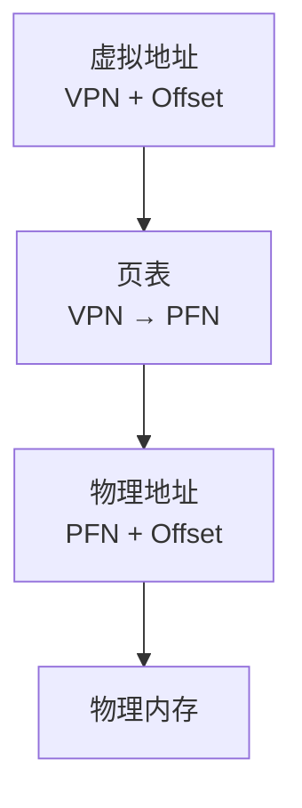
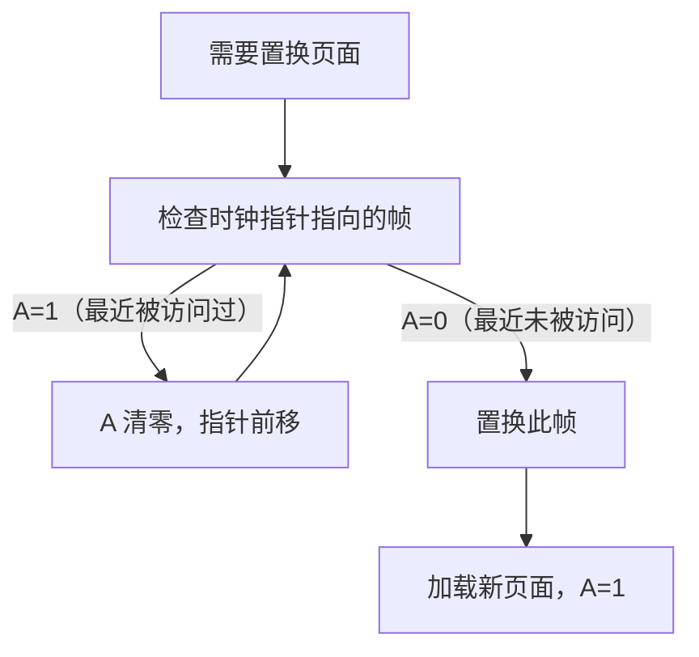
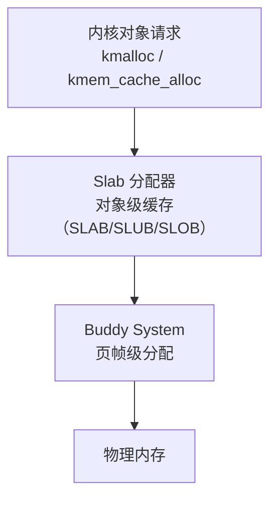
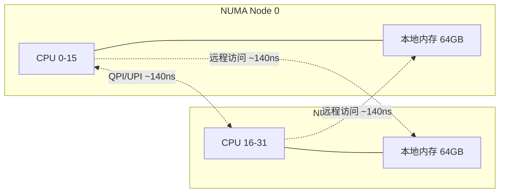
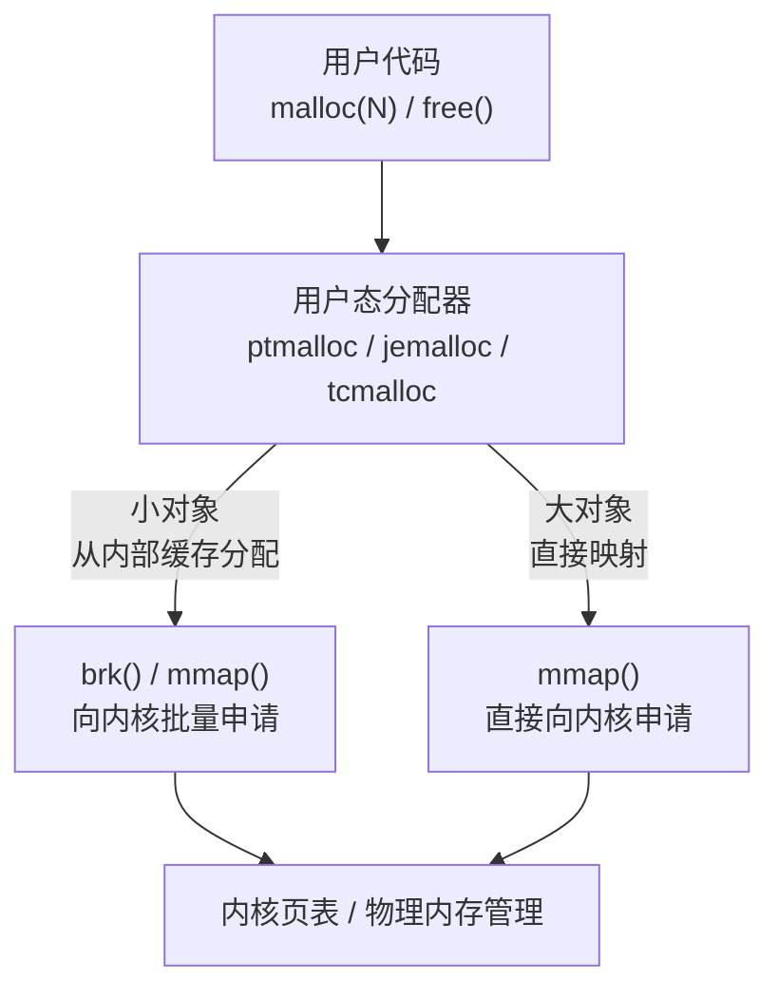

# 内存管理：理论基础

本节从底层原理出发，系统讲解内存管理的完整知识体系：从虚拟地址到物理内存的映射机制，从分页硬件到页面置换算法，从内核内存分配到用户态 malloc 的实现对比。理解这些理论是掌握内存管理一切实践技巧的根基。

---

## 一、地址空间

### 1.1 为什么需要虚拟地址

在没有虚拟内存的年代（早期嵌入式、裸机编程），程序直接操作物理地址——变量地址就是内存总线上的电信号。这带来三个致命问题：

1. **进程间没有隔离**：一个程序的指针错误可以覆写另一个程序的数据，甚至操作系统的内核数据结构。这是 DOS 时代病毒如此泛滥的根本原因。
2. **程序员必须关心物理布局**：同一份代码无法在不同机器上运行，因为物理内存的大小和布局各不相同。
3. **无法运行比物理内存更大的程序**：一个 4MB 物理内存的机器不可能运行一个需要 8MB 内存的程序。

虚拟内存技术同时解决了以上三个问题。其核心思想极为优雅：**给每个进程一个独立的、连续的、足够大的假地址空间**。程序使用的是**虚拟地址（Virtual Address）**，由硬件的**内存管理单元（MMU, Memory Management Unit）** 在每次内存访问时透明地转换为**物理地址（Physical Address）**，才能访问实际的 RAM 芯片。进程完全不知道这个转换的存在。

虚拟内存带来的五个核心价值：

| 价值 | 说明 |
|------|------|
| **隔离性** | 每个进程有独立地址空间，进程 A 无法访问进程 B 的内存，一个进程的错误不会影响其他进程 |
| **简化编程** | 程序员无需关心物理内存布局，每个进程都从虚拟地址 0 开始布局代码、数据、堆、栈 |
| **大于物理内存的地址空间** | 通过将不常用的页面交换到磁盘（swap），进程可以使用远超物理内存容量的虚拟地址空间 |
| **共享** | 多个进程可以共享只读代码段（如 libc.so），一份物理内存映射到多个进程的虚拟地址空间 |
| **安全性** | 通过页表权限位实现内存保护——代码段只读+不可执行，用户态无法访问内核空间 |

### 1.2 地址转换的全过程


整个过程对程序员完全透明。一次 `mov` 指令读取内存，硬件在背后完成了虚拟→物理的转换。TLB（Translation Lookaside Buffer）是 CPU 内部的页表缓存，命中率通常 > 99%，使得这个转换的平均开销极低。

### 1.3 Linux 进程地址空间布局

64 位 Linux 进程的虚拟地址空间是一个从 0 到 2⁴⁸ - 1（256TB）的线性区域。内核将这个空间划分为若干功能区域：

高地址 (0x7FFFFFFFFFFFFFFF)
┌──────────────────────────────────┐
│  内核空间                         │
│  (对所有进程相同，用户不可访问)     │  0xFFFF800000000000
├──────────────────────────────────┤
│  栈 (Stack)                       │  ← 向低地址增长
│  - 函数调用帧、局部变量、返回地址   │
├──────────────────────────────────┤
│  内存映射区 (mmap)                 │  ← 向低地址增长
│  - 共享库 (.so)、匿名映射、文件映射 │
├──────────────────────────────────┤
│  空闲区域 (虚拟地址空间)            │
├──────────────────────────────────┤
│  堆 (Heap)                        │  ← 向高地址增长
│  - malloc() 分配的动态内存          │
├──────────────────────────────────┤
│  BSS 段 (未初始化全局/静态变量)     │
├──────────────────────────────────┤
│  数据段 (已初始化全局/静态变量)     │
├──────────────────────────────────┤
│  代码段 (.text)                    │  ← 只读 + 可执行
│  - 程序指令                        │
低地址 (0x400000)
└──────────────────────────────────┘

几个关键点：

- **栈向下增长，堆向上增长**：两者之间有巨大的空闲区域，可以按需增长。当栈和堆相遇时（虚拟地址空间耗尽），进程收到 SIGSEGV 信号。
- **mmap 区域**：这是 Linux 内存管理最灵活的区域。共享库、匿名内存、文件映射都在这里分配，由内核的 VMA（Virtual Memory Area）机制管理。
- **内核空间**：所有进程共享同一份内核虚拟地址空间（高 128TB），但只有在内核态（syscall 陷入后）才能访问。这通过页表的 U/S 位（User/Supervisor）实现硬件级隔离。

可以通过 `/proc/<pid>/maps` 查看任意进程的实际布局：

```bash
cat /proc/self/maps
# 00400000-0048c000 r-xp 00000000 08:01 131074  /usr/bin/cat    # 代码段
# 0068c000-0068d000 r--p 0008c000 08:01 131074  /usr/bin/cat    # 只读数据
# 0068d000-0068e000 rw-p 0008d000 08:01 131074  /usr/bin/cat    # 可写数据
# 7f8a1c000000-7f8a1c021000 r-xp 00000000 08:01 262147  /lib/x86_64-linux-gnu/libc.so.6  # 共享库
# 7ffd23400000-7ffd23421000 rw-p 00000000 00:00 0       [stack]  # 栈
```

每行的 `rwxp` 分别代表读、写、执行、私有/共享权限。内核通过 `mmap_region()` 系统调用创建 VMA，并用红黑树管理所有 VMA 以支持快速查找。

### 1.4 内核中的地址空间表示

Linux 内核用 `mm_struct` 描述一个进程的完整地址空间：

```c
struct mm_struct {
    struct vm_area_struct *mmap;        // VMA 链表（按地址排序）
    struct rb_root mm_rb;               // VMA 红黑树（O(logN) 查找）
    pgd_t *pgd;                         // 页全局目录（页表顶层指针）
    atomic_t mm_users;                  // 使用此 mm 的线程数
    atomic_t mm_count;                  // 引用计数
    unsigned long start_code, end_code; // 代码段范围
    unsigned long start_data, end_data; // 数据段范围
    unsigned long start_brk, brk;       // 堆范围
    unsigned long start_stack;          // 栈起始地址
    // ...
};
```

每个 VMA（`vm_area_struct`）描述一段连续的虚拟地址区域，记录其起止地址、访问权限、映射的文件等。当进程调用 `mmap()` 或 `brk()` 时，内核创建或扩展 VMA。当发生缺页中断（Page Fault）时，内核通过查找 VMA 确认该虚拟地址是否合法，然后分配物理页帧并建立映射。

---

## 二、分页机制

### 2.1 基本原理

分页是虚拟内存的核心硬件机制。虚拟地址空间被等分为固定大小的**页（Page）**，物理内存被等分为同样大小的**页帧（Page Frame）**。页表（Page Table）记录了每个虚拟页到物理页帧的映射关系。



对于标准 4KB 页面和 48 位虚拟地址空间：
- **页内偏移**：12 位（2¹² = 4096 字节 = 4KB）
- **虚拟页号（VPN）**：36 位，对应 2³⁶ ≈ 687 亿个虚拟页

### 2.2 为什么需要多级页表

如果使用单级页表，每个虚拟页都需要一个页表条目（PTE），即使该虚拟页从未被使用过：

单级页表的内存开销：
  虚拟地址 48 位，页面 4KB
  → VPN = 36 位
  → 页表条目数 = 2^36 ≈ 687 亿
  → 每个 PTE = 8 字节
  → 总开销 = 687 亿 × 8B ≈ 512GB

这是一个不可接受的数字。多级页表通过**层次化结构**解决这个问题——只有被使用的虚拟地址区域才需要分配下级页表。如果一个 1GB 的页上级目录条目下没有任何有效映射，那整块区域的页表都不需要存在。

**x86-64 四级页表**（48 位虚拟地址）将 VPN 拆分为四段，每段 9 位（索引 512 个条目）：

| 层级 | 名称 | 缩写 | 作用 | 条目数 |
|------|------|------|------|--------|
| 第 1 级 | 页全局目录 | PGD | 指向 PUD 表 | 512 |
| 第 2 级 | 页上级目录 | PUD | 指向 PMD 表 | 512 |
| 第 3 级 | 页中间目录 | PMD | 指向 PTE 表 | 512 |
| 第 4 级 | 页表条目 | PTE | 指向物理页帧 | 512 |


关键特性：每一级页表恰好占 4KB（512 × 8 字节），正好是一个物理页帧。这意味着页表本身也可以被分页机制管理，可以被换出到磁盘。

Linux 5.x 引入了**五级页表**（P4D 层），将虚拟地址扩展到 57 位（128PB），但硬件上仍通过 PCID 和 CR3 寄存器适配四级页表。五级页表主要为未来的大规模服务器准备。

### 2.3 页表条目（PTE）的硬件语义

PTE 不仅仅是一个地址映射，它还携带了丰富的控制信息：

| 位 | 名称 | 含义 |
|----|------|------|
| 0 | Present (P) | 页面是否在物理内存中。为 0 时访问触发缺页中断 |
| 1 | Read/Write (R/W) | 0 = 只读，1 = 可读写。写只读页触发写保护缺页 |
| 2 | User/Supervisor (U/S) | 0 = 仅内核可访问，1 = 用户态可访问 |
| 3 | Page-Level Write-Through (PWT) | 写透模式（绕过缓存直接写内存） |
| 4 | Page-Level Cache Disable (PCD) | 禁用页级缓存 |
| 5 | Accessed (A) | 页面是否被读/写过（由硬件设置，软件清除） |
| 6 | Dirty (D) | 页面是否被写过（写回磁盘时需要检查） |
| 7 | PAT | 页属性表索引（控制缓存策略） |
| 8 | Global (G) | 全局页面（TLB 刷新时不被清除，如内核代码页） |
| 63 | NX (No Execute) | 不可执行位（DEP/NX 保护，防止代码注入攻击） |

这些位构成了操作系统实现内存保护的硬件基础。例如：
- 将代码段的 PTE 设为 `R/W=0, NX=1`（只读+不可执行），任何修改或执行该区域的尝试都会触发异常
- 将用户态页面的 `U/S=0`，确保用户程序无法访问内核数据
- `A` 和 `D` 位是页面置换算法的关键输入（Linux 用它们近似 LRU）

### 2.4 TLB：地址转换的加速器

没有 TLB 的话，一次内存访问需要先查 4 次页表（每次查一级都是一次内存访问），总共 5 次内存访问才能读取 1 个字节。TLB 缓存了最近使用的虚拟→物理映射，将地址转换的开销从 100+ 周期降到 1-2 周期。

**现代 x86-64 CPU 的典型 TLB 规格**：

| 层级 | 容量 | 关联方式 | 访问延迟 | 特点 |
|------|------|----------|----------|------|
| L1 iTLB | 64-128 条目 | 全相联 | ~1 周期 | 只缓存指令页 |
| L1 dTLB | 64-128 条目 | 全相联 | ~1 周期 | 只缓存数据页 |
| L2 TLB (STLB) | 512-2048 条目 | 8-16 路组相联 | ~7 周期 | 统一缓存指令和数据 |

**PCID（Process Context ID）** 是一个重要的优化：每个 TLB 条目标记了所属进程的 PCID，使得进程切换时不需要刷新整个 TLB。Linux 从 3.12 开始在支持 PCID 的硬件上使用这个特性，显著减少了上下文切换的开销。

**TLB miss 的代价分析**：

TLB 命中时的内存访问延迟：
  L1 dTLB hit → ~1 cycle + L1 cache access (~4 cycles) ≈ 5 cycles

TLB miss 时（4 级页表遍历，无页表缓存命中）：
  L1 dTLB miss → L2 TLB hit (~7 cycles) + L1 cache ≈ 11 cycles
  L2 TLB miss → Page Table Walk (~100 cycles) + L1 cache ≈ 104 cycles

→ TLB miss 的代价是 TLB 命中的 20 倍！

这就是为什么大页（Huge Pages）和 NUMA 感知如此重要——它们减少了 TLB miss 的概率。

### 2.5 大页（Huge Pages）

标准 4KB 页面在使用大内存的应用（如数据库、HPC）中会导致严重的 TLB 压力。以一个使用 8GB 内存的 Redis 为例：

使用 4KB 页面：8GB / 4KB = 2,097,152 个虚拟页
  → 需要 200 万+ 个 TLB 条目（实际只有几千个）→ 频繁 TLB miss

使用 2MB 大页：8GB / 2MB = 4,096 个虚拟页
  → 仅需 4096 个 TLB 条目 → 几乎全部命中

**x86-64 支持的页面大小**：

| 页面大小 | 页表级数 | 页内偏移位数 | 覆盖范围 | 典型用途 |
|----------|----------|-------------|----------|----------|
| 4KB | 4 级 | 12 位 | 4KB | 通用 |
| 2MB | 3 级 | 21 位 | 2MB | 大页（hugepage） |
| 1GB | 2 级 | 30 位 | 1GB | 巨页（gigapage） |

**显式大页 vs 透明大页（THP）**：

```bash
# 显式大页：预分配，应用程序显式使用
echo 1024 > /proc/sys/vm/nr_hugepages  # 预分配 1024 个 2MB 大页
cat /proc/meminfo | grep Huge

# 应用代码中使用
#include <sys/mman.h>
void *ptr = mmap(NULL, 2 * 1024 * 1024, PROT_READ | PROT_WRITE,
                 MAP_PRIVATE | MAP_ANONYMOUS | MAP_HUGETLB, -1, 0);
```

```bash
# 透明大页（THP）：内核自动管理
cat /sys/kernel/mm/transparent_hugepage/enabled
# [always] madvise never

# 三种模式：
# always  - 内核总是尝试使用 THP（可能导致延迟抖动）
# madvise - 只对显式请求的区域使用 THP（推荐）
# never   - 禁用 THP
```

**经验法则**：数据库（MySQL、PostgreSQL、Redis）建议使用 `madvise` 模式或完全禁用 THP，因为 THP 的合并/拆分操作可能引入延迟尖峰。HPC 和科学计算场景通常适合 `always`。

---

## 三、分段机制

### 3.1 历史角色

在早期 x86（8086/80286/80386）架构中，分段是主要的内存管理机制。逻辑地址由**段选择子 : 段内偏移**构成，通过段描述符表（GDT/LDT）将段选择子转换为基地址，再加上偏移得到线性地址。

分段在历史上解决了几个问题：
- **突破地址总线宽度限制**：8086 只有 16 位寄存器，但有 20 位地址总线。通过"段 × 16 + 偏移"突破 64KB 限制。
- **内存保护**：每个段可以独立设置访问权限和边界，防止越界访问。
- **逻辑分组**：将代码、数据、栈分别放在不同段中，符合程序的逻辑结构。

### 3.2 分段 vs 分页

| 维度 | 分段 | 分页 |
|------|------|------|
| 分配粒度 | 可变大小（按逻辑单元） | 固定大小（4KB/2MB/1GB） |
| 地址空间 | 二维（段:偏移） | 一维（线性虚拟地址） |
| 外部碎片 | **有**（段之间产生空洞） | 无 |
| 内部碎片 | 无 | 有（最后一页不满） |
| 内存保护 | 段级保护 | 页级保护（更细粒度） |
| 共享 | 段级共享 | 页级共享（更灵活） |
| 硬件复杂度 | 高（段表 + 基地址/界限检查） | 中（页表 + TLB） |
| 实际应用 | Intel x86（历史） | 所有现代操作系统 |

分段的根本缺陷在于**外部碎片**：段的大小不固定，释放后留下的空洞可能无法被其他段利用，导致内存利用率随时间下降。分页通过固定大小的页面消除了外部碎片，代价是少量内部碎片（平均每页浪费 2KB）。

### 3.3 现代 Linux 中的"扁平化分段"

在 x86-64 架构中，分段被**完全扁平化**——所有段的基地址设为 0，段界限设为最大值（2⁶⁴ - 1）。这意味着分段实际上不参与地址转换，虚拟地址直接等于线性地址，所有地址转换完全依赖分页。

Linux 仅保留分段用于一个目的：**区分用户态和内核态**。通过不同的代码段和数据段寄存器（CS、SS、DS）配合 CPL（Current Privilege Level），实现 Ring 0 和 Ring 3 的特权级隔离。

| 段寄存器 | 用户态（Ring 3） | 内核态（Ring 0） |
|----------|------------------|------------------|
| CS（代码段） | USER_CS | KERNEL_CS |
| SS（栈段） | USER_SS | KERNEL_SS |
| DS（数据段） | USER_DS | KERNEL_DS |

基地址全部为 0，界限全部为最大值——分段机制实质上是"透明的"，地址转换完全依赖分页。

---

## 四、页面置换算法

当物理内存不足时，操作系统必须选择一些页面换出（swap out），为新的页面腾出空间。页面置换算法的核心问题是：**选择哪个页面换出？** 不同的选择策略直接决定了系统的性能和稳定性。

### 4.1 最优置换（OPT）—— 理论上限

**原理**：置换在未来最长时间内不会被访问的页面。

**优势**：这是理论上最优的算法，能产生最少的缺页次数。

**致命缺陷**：需要预知未来的访问序列，在实际系统中不可能实现。OPT 的真正价值在于作为**评估基准**——任何实际算法的缺页次数都不可能低于 OPT。

### 4.2 LRU（最近最少使用）—— 最接近理想

**原理**：置换最长时间没有被访问的页面。基于**时间局部性原理**——最近被访问的页面很可能在近期再次被访问。

**精确 LRU 的实现**：为每个页面维护一个计数器，记录最后访问时间。每次内存访问时更新。这在理论上完美，但硬件上实现成本太高——每次内存访问都需要一次写操作来更新计数器，这会使内存访问延迟翻倍。

因此，操作系统使用 **LRU 的近似算法**（Clock 算法），利用页表中的 Accessed 位来粗略追踪访问情况。

**LRU 示例**（3 个物理帧，引用序列：7,0,1,2,0,3,0,4,2,3）：

引用  │ 帧1 │ 帧2 │ 帧3 │ 缺页？  说明
──────┼─────┼─────┼─────┼──────  ──────
  7   │  7  │     │     │  ✓     首次访问，分配帧1
  0   │  7  │  0  │     │  ✓     首次访问，分配帧2
  1   │  7  │  0  │  1  │  ✓     首次访问，分配帧3
  2   │  2  │  0  │  1  │  ✓     帧满，LRU 是 7，置换
  0   │  2  │  0  │  1  │  命中   0 刚访问过
  3   │  2  │  0  │  3  │  ✓     LRU 是 1，置换
  0   │  2  │  0  │  3  │  命中   0 刚访问过
  4   │  4  │  0  │  3  │  ✓     LRU 是 2，置换
  2   │  4  │  0  │  2  │  ✓     LRU 是 3，置换
  3   │  4  │  3  │  2  │  ✓     LRU 是 0，置换

总缺页次数：8 次（OPT 在同样条件下通常是 6 次）。

### 4.3 Clock 算法（近似 LRU）—— 实际的王者

Clock 算法是 Linux 实际使用的页面置换策略的核心。它利用页表 PTE 中的 **Accessed 位（A 位）** 来近似 LRU，不需要额外的硬件支持。

**工作流程**：将所有物理帧组织成一个**循环链表**，维护一个"时钟指针"（hand）。当需要置换时：

1. 检查指针当前指向的帧的 A 位
2. 如果 A=1：给"第二次机会"——将 A 清零，指针前移，继续扫描
3. 如果 A=0：这个帧就是置换目标



**Enhanced Clock 算法**（Linux 的变体）同时考虑 A 位和 D 位（Dirty），优先置换"既未被访问又未被修改"的页面，因为脏页写回磁盘需要额外 I/O：

置换优先级（从高到低）：
1. A=0, D=0  → 最佳候选：最近未访问，未修改，无需写回
2. A=0, D=1  → 次优：最近未访问，但需要写回磁盘
3. A=1, D=0  → 再次机会：最近访问过，但未修改
4. A=1, D=1  → 最不想置换：最近访问过且已修改

### 4.4 工作集模型（Working Set）—— 预防抖动

**工作集**是进程在时间窗口 Δ 内访问的页面集合，形式化定义为：

W(t, Δ) = { 在时间区间 (t-Δ, t) 内被访问的所有页面 }

工作集模型的核心洞察是：**一个正确运行的进程，其工作集大小应该是相对稳定的**。如果物理内存分配给进程的帧数小于其工作集大小，进程将频繁缺页，产生**抖动（Thrashing）**——系统大部分时间花在页面换入换出上，而不是执行有效计算。

**抖动的识别和预防**：

系统总工作集 = Σ 各进程的工作集大小

如果 系统总工作集 > 物理内存总量 → 抖动！

解决方案：
1. 增加物理内存
2. 减少并发进程数（挂起部分进程）
3. 增加 swap 空间（治标不治本）
4. 使用 cgroup 限制进程内存使用

### 4.5 Belady 异常——一个反直觉的发现

Belady 异常是指：在某些页面置换算法中，**增加物理帧数反而导致缺页次数增加**。

FIFO 的 Belady 异常示例：
引用序列：1, 2, 3, 4, 1, 2, 5, 1, 2, 3, 4, 5

3 个帧的缺页次数：9
4 个帧的缺页次数：10  ← 多了 1 个帧，反而多 1 次缺页！

**关键结论**：
- FIFO、Clock 等非栈式算法**可能**出现 Belady 异常
- LRU 和 OPT 是**栈式算法（Stack Algorithm）**，保证帧数增加时缺页次数**单调不增**
- 这也是为什么 Linux 选择基于 LRU 思想的 Clock 算法，而不是简单的 FIFO

---

## 五、虚拟内存机制

### 5.1 mmap 系统调用

`mmap()` 是 Linux 中将文件或设备映射到内存的核心系统调用，也是实现虚拟内存灵活性的关键工具。

**三种主要用途**：

**1. 匿名映射**——分配不关联文件的内存：

```c
#include <sys/mman.h>

// 分配 4KB 匿名内存（类似 malloc，但直接向内核申请）
void *mem = mmap(NULL, 4096, PROT_READ | PROT_WRITE,
                 MAP_PRIVATE | MAP_ANONYMOUS, -1, 0);
if (mem == MAP_FAILED) {
    perror("mmap");
    return -1;
}

// 使用内存（与普通指针完全相同）
*(int *)mem = 42;
printf("%d\n", *(int *)mem);

// 释放
munmap(mem, 4096);
```

**2. 文件映射**——将文件直接映射到进程地址空间：

```c
#include <sys/mman.h>
#include <fcntl.h>
#include <sys/stat.h>

int fd = open("database.db", O_RDWR);
struct stat sb;
fstat(fd, &amp;sb);

// 将整个文件映射到内存
void *mapped = mmap(NULL, sb.st_size, PROT_READ | PROT_WRITE,
                    MAP_SHARED, fd, 0);

// 直接通过指针读写文件内容——无需 read/write 系统调用
char *data = (char *)mapped;
data[0] = 'X';  // 修改直接反映到文件（MAP_SHARED）

// 确保修改写入磁盘
msync(mapped, sb.st_size, MS_SYNC);
munmap(mapped, sb.st_size);
```

**3. 共享内存**——进程间高效通信：

```c
// 进程 1：创建命名共享内存
int fd = shm_open("/myapp_cache", O_CREAT | O_RDWR, 0666);
ftruncate(fd, 4096);
void *shared = mmap(NULL, 4096, PROT_READ | PROT_WRITE, MAP_SHARED, fd, 0);
*(int *)shared = 123;  // 写入数据

// 进程 2：连接到同一共享内存
int fd = shm_open("/myapp_cache", O_RDWR, 0);
void *shared = mmap(NULL, 4096, PROT_READ | PROT_WRITE, MAP_SHARED, fd, 0);
printf("%d\n", *(int *)shared);  // 读到 123
```

### 5.2 写时复制（COW）

写时复制是虚拟内存中最精妙的优化之一。其核心思想：**多个进程可以共享同一份物理页面，直到某个进程试图写入时，才为该进程创建一份私有副本**。

**经典场景：`fork()` 系统调用**

```c
pid_t pid = fork();
if (pid == 0) {
    // 子进程：此时父子共享所有物理页面（标记为只读）
    variable = 100;  // 触发写保护缺页 → 内核复制该页 → 子进程获得私有副本
} else {
    // 父进程：variable 仍然是原始值
}
```

`fork()` 后立即 `exec()` 的情况下（几乎所有 shell 命令都如此），COW 使得 fork 几乎是零成本的——因为 exec 会替换整个地址空间，那些共享的 COW 页面永远不会被写入，也就永远不会被复制。

**COW 在 mmap 中的应用**：`MAP_PRIVATE` 模式的文件映射就是 COW 语义。映射时所有进程共享同一份物理页面（只读），任何写操作触发缺页后才创建私有副本。

### 5.3 mmap vs read/write 的选择

| 维度 | mmap | read/write |
|------|------|-----------|
| 数据拷贝次数 | 0（直接映射到进程地址空间） | 2（内核缓冲区 → 用户缓冲区） |
| 系统调用开销 | 1 次 mmap + 按需缺页 | 每次 read/write 都是系统调用 |
| 随机访问 | 极高（直接指针运算） | 低效（需要 lseek + read） |
| 顺序访问 | 相当 | 相当 |
| 大文件处理 | 优秀（按需加载，不占满物理内存） | 需要维护大缓冲区 |
| 小文件频繁写 | 有 flush 问题（msync 时机不可精确控制） | 更可控（write 后立即可见） |
| TLB 压力 | 大文件映射可能严重 | 不受影响 |
| 安全性 | 文件被截断时可能触发 SIGBUS | 更健壮 |

**最佳实践**：数据库（如 LevelDB、RocksDB）使用 mmap 进行索引文件的随机访问；Web 服务器（如 Nginx）使用 sendfile + splice 进行零拷贝文件传输，而非 mmap。

---

## 六、物理内存管理

### 6.1 Buddy System（伙伴系统）

Buddy System 是 Linux 内核管理物理页帧的核心算法。它将物理内存组织成若干大小为 2^n 个页面的空闲块，通过"分裂"和"合并"操作来分配和回收内存。

**工作原理**：

初始状态：16 页连续空闲
[======================== 16 页 ========================]

分配 5 页 → 需要 2^3 = 8 页的块
分裂 16 → [========8========] [========8========]
分裂 8 → [====4====] [====4====] [========8========]
分配前 4 页块（实际 8 页，3 页内部碎片）

分配 2 页 → 直接从 order-1 空闲链表取
[==2==] [==2==] [====4====] [========8========]

释放时合并：
释放 order-0 页 → 与伙伴合并为 order-1
释放 order-1 伙伴 → 合并为 order-2
释放 order-2 伙伴 → 合并为 order-3
→ 空闲块尽可能合并为更大的连续块

**关键数据结构**：

```c
// 每个 NUMA 节点维护一个 free_area 数组
struct free_area {
    struct list_head free_list[MAX_ORDER];  // 每个阶的空闲链表
    unsigned long nr_free[MAX_ORDER];       // 每个阶的空闲块数
};

// 分配：从请求的阶开始向上查找
void *buddy_alloc(int order) {
    int current_order = order;
    while (current_order < MAX_ORDER) {
        if (free_area.nr_free[current_order] > 0) {
            struct page *page = list_first_entry(
                &amp;free_area.free_list[current_order]);
            list_del(&amp;page->lru);
            free_area.nr_free[current_order]--;

            // 向下分裂到目标阶
            while (current_order > order) {
                current_order--;
                struct page *buddy = page + (1 << current_order);
                list_add(&amp;buddy->lru,
                         &amp;free_area.free_list[current_order]);
                free_area.nr_free[current_order]++;
            }
            return page_address(page);
        }
        current_order++;
    }
    return NULL;  // OOM
}
```

**MAX_ORDER 的含义**：Linux 默认为 11（6.4+ 改为 10），即最大可分配 2^10 = 1024 个连续页面 = 4MB。这是 Buddy System 的最大单次分配粒度。

**Buddy System 的局限**：它只处理整页的分配，无法满足内核中大量的小对象分配需求（如 `task_struct` 约 6KB、`inode` 约 1KB）。这正是 Slab 分配器存在的原因。

### 6.2 Slab 分配器

Slab 分配器建立在 Buddy System 之上，提供**内核对象级别的缓存**。其设计灵感来源于 Sun OS 的 slab 分配器（Jeff Bonwick, 1994）。



**SLUB 分配器**（Linux 默认，2.6.22+）的核心设计：

1. **每 CPU 本地缓存（`kmem_cache_cpu`）**：每个 CPU 维护一个无锁的 freelist，分配时直接从本地取对象，无需加锁。这是最常见的快速路径，延迟在纳秒级。

2. **每 NUMA 节点缓存（`kmem_cache_node`）**：当本地缓存耗尽时，从节点缓存批量补充。需要自旋锁，但竞争概率低。

3. **中央缓存（`kmem_cache` 的 partial 链表）**：当节点缓存也耗尽时，从 Buddy System 获取新页面并初始化为 slab。

分配快速路径（99% 的情况）：
  CPU 本地 freelist 有对象 → 直接取出 → ~10ns

分配中速路径：
  CPU 本地耗尽 → 从 node partial 链表补充 → ~100ns

分配慢速路径（极少发生）：
  所有缓存耗尽 → 向 Buddy System 申请新页面 → ~1μs

**SLUB vs 旧版 SLAB**：SLAB 使用队列化的 slab 列表和复杂的多级缓存，代码量大且难以维护。SLUB 用更简洁的设计（freelist 指针嵌入对象头部）达到了相同甚至更好的性能，代码量减少了约一半。

### 6.3 kmalloc vs vmalloc

内核中两种主要的内存分配方式：

| 维度 | kmalloc | vmalloc |
|------|---------|---------|
| 物理连续性 | **物理连续** | 物理不连续，仅虚拟连续 |
| 适用场景 | DMA 缓冲区、小对象 | 大缓冲区、不需要 DMA 的场景 |
| 最大大小 | ~4MB（受 MAX_ORDER 限制） | 理论上无限制 |
| 性能 | 快（无需修改页表） | 略慢（需要建立页表映射） |
| 底层实现 | Slab 分配器 → Buddy System | 直接调用 Buddy System + 手动建立页表 |

选择原则：如果需要 DMA（设备直接访问内存），必须使用 `kmalloc`（因为 DMA 控制器需要物理连续的地址）。如果只是分配大块内存做计算缓冲，`vmalloc` 更合适。

---

## 七、内存压缩技术

### 7.1 zswap —— 写回缓存

zswap 是磁盘 swap 的前端压缩缓存层。当页面需要换出时，zswap 先尝试将其压缩存储在内存中的压缩池里，只有压缩池满了才写入磁盘。

页面换出流程（启用 zswap）：
  内存不足 → 选择置换页面
    → zswap 尝试压缩（zstd/lz4）
      → 压缩池未满 → 保留在内存中（压缩态）→ 读取时解压
      → 压缩池已满 → 写入磁盘 swap 分区

压缩比通常在 2:1 到 3:1 之间（取决于数据类型），意味着原本需要换出到磁盘的 3GB 数据，压缩后可能只占 1GB 内存。

```bash
# 启用 zswap
echo 1 > /sys/module/zswap/parameters/enabled

# 查看统计
cat /sys/kernel/debug/zswap/stored_pages    # 压缩存储的页面数
cat /sys/kernel/debug/zswap/pool_total_size  # 压缩池总大小
cat /sys/kernel/debug/zswap/pool_hit         # 读取命中次数（避免了磁盘 I/O）
```

### 7.2 zram —— 压缩块设备

zram 创建一个基于内存的压缩块设备，作为 swap 分区使用。与 zswap 不同，zram 是独立的块设备，不依赖磁盘 swap。

| 维度 | zswap | zram |
|------|-------|------|
| 架构 | 磁盘 swap 的前端缓存 | 独立的压缩块设备 |
| 依赖磁盘 swap | 是（最终可能写入磁盘） | 否（所有数据都在内存中） |
| 适用场景 | 有磁盘的桌面/服务器 | 无磁盘的嵌入式/移动设备 |
| 典型用户 | 桌面 Linux | Android、ChromeOS |

```bash
# 创建 zram 设备
modprobe zram num_devices=1
echo lz4 > /sys/block/zram0/comp_algorithm
echo 2G > /sys/block/zram0/disksize
mkswap /dev/zram0
swapon /dev/zram0

# 查看压缩效果（orig_data_size / compr_data_size = 压缩比）
cat /sys/block/zram0/mm_stat
```

---

## 八、OOM Killer

### 8.1 触发条件

OOM（Out of Memory） Killer 是 Linux 内存管理的最后防线。当系统内存严重不足，页面置换和压缩都无法释放足够内存，且所有进程都无法继续运行时，内核会选择并杀死一个进程来释放内存。

触发 OOM 的典型场景：
- 物理内存 + swap 全部耗尽
- 内核无法分配连续页面（碎片严重）
- 某个进程的内存使用超过了 cgroup 限制

### 8.2 评分机制

每个进程有一个 OOM 评分（0-1000），分数越高越可能被杀死：

```bash
# 查看 OOM 评分
cat /proc/<pid>/oom_score        # 当前评分（内核计算）
cat /proc/<pid>/oom_score_adj    # 用户调整值（-1000 到 1000）

# 保护关键进程（永远不会被 OOM Killer 杀死）
echo -1000 > /proc/<pid>/oom_score_adj

# 让进程更容易被杀死（如测试程序）
echo 1000 > /proc/<pid>/oom_score_adj
```

**评分因素**：

1. **内存使用量**：RSS（Resident Set Size）+ swap 使用 + 页表大小。使用内存越多，分数越高。
2. **子进程数**：杀死有子进程的进程能释放更多内存（子进程一起被杀死）。
3. **oom_score_adj 调整值**：用户态可通过写入 `/proc/<pid>/oom_score_adj` 手动调整。
4. **进程年龄**：较年轻的进程分数略高（新进程可能还没产生价值）。
5. **特权降级**：特权进程（如 root 拥有的守护进程）的分数会被适当降低。

### 8.3 日志分析

```bash
# 查看 OOM 事件
dmesg | grep -i "oom\|out of memory\|killed"

# 典型 OOM 日志示例：
# [12345.678] Out of memory: Killed process 1234 (java)
#   total-vm:8192000kB, anon-rss:4096000kB, file-rss:0kB
#   oom_score_adj:0

# 在生产环境中，建议配合 Prometheus + node_exporter 监控：
# node_vmstat_oom_kill —— OOM 事件计数器
# node_memory_MemAvailable_bytes —— 可用内存趋势
```

---

## 九、NUMA 内存策略

### 9.1 NUMA 架构基础

在多路服务器中，每个 CPU 插槽直接连接自己的本地内存，通过 QPI/UPI 总线与其他 CPU 插槽的内存通信。访问本地内存延迟约 80ns，访问远程内存约 140ns——差距接近 2 倍。



### 9.2 Linux NUMA 内存策略

Linux 提供多种 NUMA 内存分配策略，可通过 `set_mempolicy()` 系统调用或 `numactl` 工具配置：

| 策略 | 说明 | 适用场景 |
|------|------|----------|
| MPOL_DEFAULT | 在当前 CPU 所在节点分配 | 通用场景 |
| MPOL_BIND | 绑定到指定节点集，不足时 OOM | 延迟敏感型应用 |
| MPOL_PREFERRED | 优先在指定节点分配，不足时回退到其他节点 | 带回退的绑定 |
| MPOL_INTERLEAVE | 在指定节点间轮转分配 | 大数据集共享访问 |
| MPOL_WEIGHTED | 按权重在节点间分配（Linux 5.12+） | 异构 NUMA 拓扑 |

```bash
# 查看 NUMA 拓扑
numactl --hardware

# 将进程绑定到 NUMA 节点 0
numactl --cpunodebind=0 --membind=0 ./myapp

# 使用 interleaved 策略（适合大内存只读数据）
numactl --interleave=all ./myapp

# 查看进程的 NUMA 内存分布
numastat -p <pid>
```

---

## 十、用户态 malloc 实现对比

### 10.1 malloc 的本质

`malloc()` 不是系统调用，而是 C 标准库（glibc/musl）提供的用户态内存管理器。它通过 `brk()`/`sbrk()`（调整堆顶）或 `mmap()`（匿名映射）向内核批量申请内存，然后在用户空间自行管理小块的分配和回收。



### 10.2 ptmalloc（glibc 默认）

ptmalloc 基于 Doug Lea 的 dlmalloc 改进，是 Linux 上最广泛使用的分配器。

**核心结构**：

Arena（分配区域）：
  ┌──────────────────────────────────────┐
  │ Fast Bins                            │  ← 小块（≤80B），LIFO，不合并
  │ Unsorted Bin                         │  ← 回收的块暂存于此
  │ Small Bins（62 个）                   │  ← 按大小分类的双向链表
  │ Large Bins（63 个）                   │  ← 大块，按大小范围排序的链表
  └──────────────────────────────────────┘

**特点与局限**：
- **多 Arena**：多线程使用不同 arena 减少锁竞争（默认 arena 数 = 8 × CPU 核心数）
- **Fast bins 极快**：LIFO 策略，无锁竞争（单线程时），但不合并相邻空闲块
- **内存归还问题**：`free()` 后的内存通常不会归还操作系统（brk 不会回缩），除非空闲块在堆顶。这是 ptmalloc 最大的痛点——长期运行的进程内存占用只增不减。

### 10.3 jemalloc

jemalloc 由 Jason Evans 为 FreeBSD 开发，被 Facebook（Meta）、Rust、Android 等大规模采用。

**核心优势**：

1. **更精细的大小类**：Small 对象按 8B 递增（ptmalloc 按 16B），减少内部碎片
2. **Per-thread cache**：每个线程有独立的本地缓存，分配无需加锁
3. **主动归还内存**：通过 `madvise(MADV_DONTNEED)` 或 `munmap()` 将空闲内存归还操作系统
4. **丰富的诊断工具**：`malloc_stats_print()`、`je_malloc_stats_print()` 提供详细的分配统计

```bash
# 使用 jemalloc
LD_PRELOAD=/usr/lib/x86_64-linux-gnu/libjemalloc.so.2 ./myapp

# 也可以在编译时链接
gcc -o myapp myapp.c -ljemalloc
```

### 10.4 tcmalloc

tcmalloc（Thread-Caching Malloc）由 Google 开发，专为多线程、低延迟场景优化。

**三层架构**：

1. Per-Thread Cache（线程本地缓存）
   → 小对象（≤256KB）分配完全无锁，延迟 ~10ns

2. Central Free List（全局中心链表）
   → 需要自旋锁，管理 span（连续页面的集合）

3. Page Heap（页堆）
   → 从操作系统批量申请页面，类似 Buddy System

**特点**：小对象分配延迟极低且尾延迟稳定（不受锁竞争影响），多线程扩展性极好。

### 10.5 三种分配器综合对比

| 维度 | ptmalloc | jemalloc | tcmalloc |
|------|----------|----------|----------|
| 默认环境 | glibc Linux | FreeBSD / Facebook / Rust | Google 内部 |
| 小对象分配延迟 | 快（~20ns） | 快（~15ns） | 极快（~10ns） |
| 多线程扩展性 | 中等（锁竞争明显） | 好（per-thread cache） | 极好（per-thread cache） |
| 内存碎片率 | 较高（不合并 fast bin） | 低（精细大小类） | 低（span 管理） |
| 内存归还 | 不主动（brk 不回缩） | 主动（madvise） | 主动（madvise） |
| 诊断工具 | 有限（malloc_info） | 丰富（stats、profiling） | 丰富（heap profiling） |
| 适用场景 | 通用 | 高并发 / 大内存服务 | 高并发 / 低延迟系统 |

**典型性能数据**（8 线程并发分配/释放，混合大小对象）：
- ptmalloc：基准线
- jemalloc：2-5 倍吞吐提升
- tcmalloc：2-5 倍吞吐提升

**选择建议**：
- 默认使用 ptmalloc（无需额外配置）
- 高并发 Web 服务器 → jemalloc（Redis、Rust 默认使用）
- 低延迟交易系统 → tcmalloc
- 可以通过 `LD_PRELOAD` 在不修改代码的情况下切换分配器

```bash
# 快速对比测试
LD_PRELOAD=/usr/lib/x86_64-linux-gnu/libjemalloc.so.2 \
  MALLOC_CONF=stats_print:true ./myapp

LD_PRELOAD=/usr/lib/x86_64-linux-gnu/libtcmalloc.so.4 \
  ./myapp
```

---

## 本节小结

内存管理的理论基础可以归纳为三条主线：

**1. 地址转换主线**：虚拟地址 → 页表（多级） → TLB 加速 → 物理地址。这是硬件和操作系统协作的基础，理解它才能理解缺页中断、内存保护和共享内存的原理。

**2. 内存分配主线**：用户态 malloc → brk/mmap → 内核 Buddy System → 物理页帧。从用户空间到硬件，每一层都有其存在的理由和设计权衡。

**3. 内存回收主线**：页面置换算法（LRU/Clock） → 内存压缩（zswap/zram） → OOM Killer。这是系统在内存压力下逐步升级的应对策略链。

掌握这三条主线，就掌握了内存管理的完整知识框架。接下来的"核心技巧"部分将在此基础上，讲解如何将这些理论应用于实际的性能优化和问题排查。
