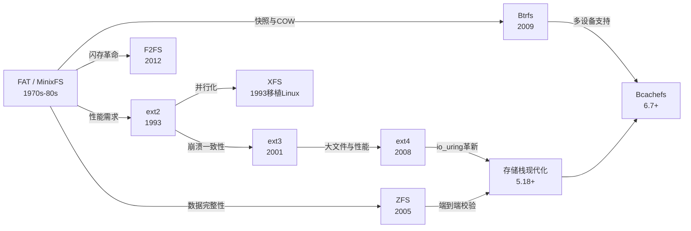
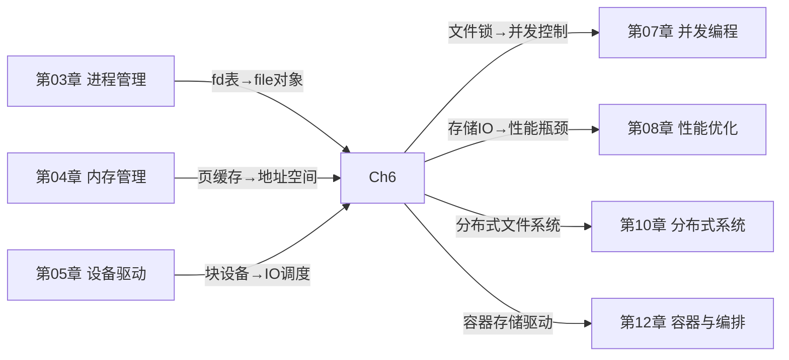

# 第06章 文件系统

> **"文件系统是操作系统中最接近用户的设计，也是最远离用户理解的实现。"**
> 每一次 `open()`/`read()`/`write()` 背后，都隐藏着一套精密的数据布局、一致性保障和性能优化机制。理解这套机制，是从"会用 Linux"到"驾驭 Linux"的关键分水岭。

---

## 1. 为什么文件系统是系统工程师的必修课

文件系统是操作系统中负责持久化存储管理的核心子系统。它将底层块设备的线性地址空间抽象为用户可理解的目录树结构，为数据的组织、检索、共享和保护提供统一的接口。无论你是编写高性能应用的后端工程师、负责基础设施的 SRE、还是研究操作系统内核的开发者，文件系统的知识都直接影响你对系统性能、数据可靠性和故障恢复的理解深度。

一个关键事实是：**文件系统的选型和配置往往是系统性能的决定性因素之一，但也是最容易被忽视的环节**。许多生产环境中的性能问题——数据库 IO 延迟飙升、日志写入阻塞、大文件处理变慢——其根因都指向文件系统的配置不当或选型失误。理解文件系统的工作原理，能帮助你从"会用"进阶到"用好"。

### 1.1 真实世界中的文件系统问题

以下是生产环境中最常见的文件系统相关故障，每一种都可能造成数小时的宕机和数十万的损失：

| 故障类型 | 典型场景 | 根因 | 影响 |
|---------|---------|------|------|
| inode 耗尽 | 大量小文件写入（日志、缓存），`df -h` 显示空间充足但 `df -i` 已满 | inode 数量在格式化时固定，小文件消耗 inode 远快于磁盘空间 | 新文件无法创建，应用崩溃 |
| 日志模式选错 | 数据库服务器使用 `writeback` 日志模式 | 崩溃后数据块内容与元数据不一致，导致数据库损坏 | 数据丢失，恢复困难 |
| 延迟分配碎片化 | 长时间运行后大文件读取性能急剧下降 | ext4 延迟分配在磁盘碎片严重时无法分配连续块 | IO 延迟从 ms 级飙升到百 ms 级 |
| Btrfs RAID 5/6 不稳定 | 生产环境使用 Btrfs RAID 5 | 写入 hole punching 和部分写入场景下的已知 bug | 数据静默损坏 |
| fsync 误解 | 应用调用 `fsync()` 后认为数据已安全落盘 | `fsync()` 只保证操作系统页缓存写入，不保证磁盘控制器缓存刷新 | 断电后数据丢失 |
| Direct IO 对齐错误 | 应用使用 Direct IO 但缓冲区未对齐 | Direct IO 要求用户缓冲区、文件偏移、IO 大小均为 512B/4K 对齐 | IO 失败或性能退化到 Buffered IO |

这些案例将在本章的「常见误区」和「实战案例」中逐一深入分析。

### 1.2 文件系统知识的职业价值

掌握文件系统知识在以下场景中具有直接的职业价值：

- **系统架构设计**：在存储方案选型时做出有数据支撑的决策（ext4 vs XFS vs Btrfs vs ZFS），而不是凭经验或直觉
- **性能调优**：通过理解 IO 路径，精准定位瓶颈层次（文件系统层？块层？设备驱动层？），避免盲目调参
- **故障诊断**：当应用报告 IO 错误时，能快速判断是文件系统层问题、磁盘硬件问题还是配置问题
- **面试竞争力**：Linux 内核/存储/SRE 岗位面试中，文件系统是高频考察领域（VFS 四大对象、ext4 extent tree、日志模式、IO 调度器等）
- **容器与云原生**：理解 OverlayFS、DeviceMapper、CephFS 等容器存储驱动的底层原理

---

## 2. 本章的知识体系

本章围绕文件系统技术构建了一个从理论到实践的完整知识体系，核心问题包括：

**问题一：抽象层如何统一多样性？** Linux 通过虚拟文件系统（VFS）层为数十种具体文件系统提供统一接口。VFS 通过四个核心数据结构——super_block（超级块）、inode（索引节点）、dentry（目录项）、file（文件对象）——实现面向对象的多态设计。理解这一层的设计精妙之处，是掌握整个文件系统架构的钥匙。

**问题二：不同文件系统的数据布局如何影响性能？** ext2/ext3/ext4 的块组设计与 extent tree、Btrfs 的 B-tree 与 COW（Copy-on-Write）机制、XFS 的分配组（Allocation Group）策略、ZFS 的存储池与 RAID-Z——不同的数据布局方案在不同工作负载下表现出截然不同的性能特征。

**问题三：一致性如何保证？** 文件系统操作通常涉及多个磁盘写入（创建一个文件需要更新 inode、目录项、位图等多处数据），崩溃可能导致不一致状态。日志机制（writeback/ordered/journal 三种模式）、COW 快照、fsck 工具——文件系统通过不同策略在性能和数据安全之间取得平衡。

**问题四：现代文件系统向何处演进？** 从 Btrfs 的快照与子卷到 ZFS 的端到端校验，从 F2FS 的闪存优化到 Bcachefs 的多设备支持，再到 io_uring 时代的存储栈革新——文件系统技术正在经历从"通用适配"到"场景专用"的范式转移。

### 2.1 知识图谱

```mermaid
graph TD
    A["第06章 文件系统"] --> B["理论基础"]
    A --> C["核心技巧"]
    A --> D["实战案例"]
    A --> E["常见误区"]
    A --> F["练习方法"]
    A --> G["本章小结"]

    B --> B1["核心概念<br/>VFS四大对象<br/>ext2/3/4演进<br/>Btrfs/XFS/ZFS/F2FS<br/>FUSE/OverlayFS<br/>一致性机制<br/>IO路径与调度器<br/>文件锁"]
    B --> B2["技术演进<br/>FAT→ext2→ext3→ext4<br/>XFS移植<br/>Btrfs/ZFS/F2FS<br/>Bcachefs<br/>io_uring革新"]
    B --> B3["关键指标<br/>IOPS/带宽/延迟<br/>P99延迟<br/>写放大因子"]

    C --> C1["VFS虚拟文件系统层<br/>dcache优化<br/>路径解析"]
    C --> C2["inode与数据块管理<br/>extent tree<br/>多块分配器"]
    C --> C3["ext4日志与B-tree索引<br/>JBD2事务<br/>延迟分配"]
    C --> C4["性能优化清单<br/>挂载参数<br/>IO调度器<br/>脏页参数"]

    D --> D1["高并发文件服务器<br/>inode耗尽<br/>目录遍历瓶颈"]
    D --> D2["嵌入式系统<br/>F2FS vs ext4<br/>eMMC优化"]
    D --> D3["分布式存储<br/>CephFS/GlusterFS<br/>容器化集成"]

    E --> E1["fsync安全性"]
    E --> E2["文件删除真相"]
    E --> E3["延迟分配风险"]
    E --> E4["inode耗尽隐蔽性"]
    E --> E5["Btrfs RAID成熟度"]
    E --> E6["文件锁兼容性"]

    F --> F1["FUSE内存文件系统"]
    F --> F2["debugfs磁盘分析"]
    F --> F3["性能对比测试"]
    F --> F4["内核模块开发"]
    F --> F5["日志机制模拟"]
```

---

## 3. 本章内容结构

本章共包含 6 个主要部分，按照「理论→方法→实操→纠错→练习→总结」的渐进逻辑组织：

| 节次 | 标题 | 核心内容 | 适合读者 | 难度 | 建议用时 |
|------|------|----------|----------|------|---------|
| 理论基础 | 文件系统核心原理 | VFS 四大对象与读写路径、ext2/3/4 演进与 extent tree、Btrfs COW 与快照、XFS 分配组与延迟日志、ZFS 存储池与校验和、F2FS 闪存优化、FUSE 用户态文件系统、OverlayFS 联合挂载、一致性机制（三种日志模式）、存储栈 IO 路径与调度器、io_uring 存储栈革新、文件锁（POSIX/BSD/flock） | 所有读者 | ★★★☆☆ | 2-3 小时 |
| 核心技巧 | 文件系统选型与调优 | 文件系统选型决策矩阵、ext4 vs XFS 深度对比、挂载参数调优（70+ 参数详解）、IO 调度器选择与配置、Readahead 调优、内核脏页参数、文件系统对齐、直接 IO 与异步 IO、空间监控与告警、诊断工具（ext4debug/xfs_db/btrfs-progs）、快照备份方案、性能基准测试方法论 | 运维工程师、SRE | ★★★★☆ | 1.5-2 小时 |
| 实战案例 | 真实场景深度分析 | 高并发文件服务器优化（inode 耗尽排查、目录遍历瓶颈解决）、嵌入式文件系统选型（F2FS vs ext4 在 eMMC 上的 IO 特征对比）、分布式文件系统集成（CephFS/GlusterFS 在容器化环境中的实践） | 系统架构师、存储工程师 | ★★★★★ | 1-1.5 小时 |
| 常见误区 | 文件系统认知纠偏 | fsync 的真实行为（它不保证硬件写入）、rm 删除文件的真实过程（inode 何时真正释放）、inode 耗尽的隐蔽性（df -h 看不出来）、日志模式选择的陷阱、Btrfs RAID 5/6 的稳定性问题、Direct IO 的对齐要求、XFS 小文件性能劣势、延迟分配的不可预测性 | 所有读者 | ★★☆☆☆ | 0.5-1 小时 |
| 练习方法 | 渐进式动手实践 | 从手写简单文件系统（FUSE 实现）到内核模块开发（ext4 调试），包含 5 个递进式练习，每个练习配有完整代码和验证步骤 | 学习者、面试准备者 | ★★★☆☆ | 3-5 小时（动手） |
| 本章小结 | 知识回顾与延伸 | 核心概念回顾、关键公式与模型、最佳实践清单、延伸阅读推荐 | 所有读者 | ★☆☆☆☆ | 0.5 小时 |

> **总阅读时间**：约 8-12 小时（含练习）。建议分 3-4 天完成，每天聚焦一个主题。

---

## 4. 七大文件系统横向对比

在深入学习之前，先建立全局视角。以下是本章涉及的七种文件系统的定位对比：

| 文件系统 | 设计哲学 | 核心优势 | 典型场景 | 内核状态 | 最新稳定版 |
|----------|----------|----------|----------|----------|-----------|
| ext4 | 稳定可靠 | 成熟稳定，默认选择，ordered 日志平衡安全与性能，支持 1EB 文件系统 | 通用服务器、桌面系统、Android（部分） | Linux 主线，默认 | 内核 6.x |
| XFS | 高性能 | 分配组并行化，大文件顺序 IO 卓越，延迟日志优化，支持在线碎片整理 | 大文件高吞吐、数据库、视频转码、RHEL 默认 | Linux 主线，RHEL/CentOS 默认 | 内核 6.x |
| Btrfs | 功能丰富 | COW 天然快照，子卷，端到端校验，在线压缩，RAID 1/0/10（推荐） | 需要快照/压缩的场景，开发测试环境，openSUSE 默认 | Linux 主线，非默认 | 内核 6.x |
| ZFS | 数据不损坏 | 端到端校验和，RAID-Z，ARC 自适应缓存，发送/接收增量快照，去重 | NAS 归档、数据完整性要求极高的场景、企业存储 | 需要额外安装（OpenZFS） | OpenZFS 2.2.x |
| F2FS | 闪存友好 | 冷热分离减少 GC，多头写入，日志结构优化，原子写支持 | SSD/eMMC/SD 卡等闪存设备，Android 内部存储 | Linux 主线 | 内核 6.x |
| LFS | 顺序写入 | 全部顺序 IO，适合闪存和 SSD，写放大极低 | 理论参考、F2FS 的设计基础 | 学术/历史 | 仅研究用 |
| FUSE | 用户态实现 | 无需内核模块，开发灵活，跨平台兼容 | sshfs、ntfs-3g、容器存储抽象、Go/Rust 文件系统原型 | Linux 主线 | 内核 6.x |

**选型决策速查**：

通用服务器 / 不确定选什么？          → ext4（安全默认值）
大文件高吞吐 / 数据库 / RHEL 环境？  → XFS
需要快照 / 压缩 / 开发测试？         → Btrfs（注意 RAID 5/6 除外）
数据完整性零容忍 / NAS 存储？        → ZFS
闪存设备 / 嵌入式 / Android？        → F2FS
需要自定义文件系统逻辑？             → FUSE（用户态原型）→ 内核态实现

---

## 5. 技术演进脉络

文件系统的发展不是孤立的，它与硬件技术的进步紧密耦合：

每个节点背后都有明确的工程动机：

- **FAT → ext2**：解决大容量磁盘的元数据管理问题，引入 inode 和块组设计
- **ext2 → ext3**：解决崩溃后文件系统不一致的问题，引入日志机制（JBD）
- **ext3 → ext4**：解决大文件碎片化问题，引入 extent tree 和延迟分配
- **ext2 → XFS**：解决高并发场景下的锁竞争问题，引入分配组（Allocation Group）并行化
- **LFS → F2FS**：解决闪存设备的写入放大问题，引入冷热分离和多头写入
- **ZFS 的出现**：提出"数据永远不应该损坏"的理念，将文件系统、卷管理、RAID 合为一体
- **Btrfs 的出现**：在 Linux 内核中实现类似 ZFS 的功能（COW、快照、校验和），但采用更模块化的设计
- **Bcachefs 的出现**（2023年合入主线）：从 bcache 块缓存层演进为完整文件系统，提供多设备支持、压缩、加密、快照等功能，被视为 Btrfs 和 ZFS 的现代替代方案

### 5.1 关键时间线

| 年份 | 事件 | 意义 |
|------|------|------|
| 1993 | ext2 进入 Linux 内核 | Linux 第一个实用文件系统 |
| 1993 | XFS 从 IRIX 移植到 Linux | 高性能大文件处理能力引入 |
| 2001 | ext3 进入 Linux 内核 | 日志机制解决了崩溃一致性问题 |
| 2005 | ZFS on Linux 项目启动 | 端到端数据完整性理念进入 Linux 生态 |
| 2008 | ext4 进入 Linux 内核 | extent tree、延迟分配等现代化特性 |
| 2009 | Btrfs 进入 Linux 内核 | 内核原生 COW 文件系统 |
| 2012 | F2FS 进入 Linux 内核 | 闪存优化文件系统 |
| 2019 | io_uring 合入内核 5.1 | 存储栈性能革命的起点 |
| 2022 | ext4 bigalloc 默认关闭修复 | 大块分配的稳定性问题得到重视 |
| 2023 | Bcachefs 合入内核 6.7 | 第一个现代多设备文件系统进入主线 |

---

## 6. 存储栈全景：从应用到磁盘

理解文件系统不能脱离存储栈的完整路径。一次 `write()` 系统调用经历的层次：

用户空间: write(fd, buf, count)
    │
    ▼
系统调用层: sys_write() → vfs_write()
    │
    ▼
VFS 层: file->f_op->write_iter()
    │
    ▼
具体文件系统 (ext4/XFS/Btrfs/...)
    ├── Buffered IO → 页缓存（延迟写回）
    │     └── writeback 线程定期刷盘
    ├── Direct IO → 绕过页缓存，直接到块层
    │     └── 要求对齐：用户缓冲区、偏移、大小均为 512B/4K 倍数
    ├── DAX (Direct Access) → 绕过页缓存和块层
    │     └── 仅支持持久内存 (PMEM) 设备
    └── mmap → 页错误触发，按需加载
    │
    ▼
块层 (Block Layer)
    ├── IO 合并: 相邻小 IO 合并为大 request
    ├── IO 调度: mq-deadline / bfq / kyber / none
    │     ├── mq-deadline: 通用场景，默认选择
    │     ├── bfq: 桌面/交互式场景，公平调度
    │     ├── kyber: NVMe 高速设备
    │     └── none: 无调度，NVMe 多队列设备首选
    ├── IO 优先级: ioprio 系统调用
    └── 生成 request → 设备请求队列
    │
    ▼
设备驱动 (NVMe / SCSI / virtio / virtio-blk)
    │
    ▼
硬件: 磁盘控制器 → 物理存储介质
    ├── HDD: 磁头寻道 + 旋转延迟（机械延迟 ~5-10ms）
    ├── SSD: 闪存介质（电子延迟 ~0.1ms，但有写入放大）
    └── NVMe SSD: PCIe 直连（~0.02ms 延迟，百万级 IOPS）

这条路径中的每一层都存在优化空间，而文件系统层是其中最可控、效果最显著的调优点。

### 6.1 Buffered IO vs Direct IO vs DAX

| 特性 | Buffered IO | Direct IO | DAX |
|------|------------|-----------|-----|
| 页缓存 | 使用 | 绕过 | 绕过 |
| 块层 | 经过 | 经过 | 绕过 |
| 适用设备 | 所有块设备 | 所有块设备 | 仅 PMEM |
| 对齐要求 | 无 | 严格对齐（512B/4K） | N/A |
| 延迟 | 低（缓存命中）/ 高（缓存未命中） | 可预测 | 最低 |
| 典型场景 | 通用读写 | 数据库、虚拟机 | 高性能数据库 |
| fsync 行为 | 页缓存 → 磁盘 | 仅同步元数据 | 持久内存原子写 |

### 6.2 io_uring 对存储栈的影响

io_uring（内核 5.1+）是近年来 Linux 存储栈最重要的革新：

- **提交/完成队列分离**：用户态和内核态共享环形缓冲区，避免系统调用开销
- **批量提交**：一次 `io_uring_enter()` 可提交数百个 IO 操作
- **内核轮询模式（SQPOLL）**：内核线程持续轮询提交队列，完全消除系统调用延迟
- **文件系统集成**（5.19+）：`IORING_OP_OPENAT`、`IORING_OP_READ` 等操作可完全绕过传统 VFS 路径

实测性能提升：对于小文件随机读取场景，io_uring 比传统 `pread()` 提升 30-50% 的吞吐量。

---

## 7. 关键性能指标

评估文件系统性能时，需要关注以下核心指标：

| 指标 | 含义 | 为什么重要 | 文件系统层面的影响因素 | 典型基准值 |
|------|------|-----------|----------------------|-----------|
| IOPS | 每秒 IO 操作数 | 随机小 IO 场景（数据库）的核心指标 | IO 调度器、队列深度、元数据操作效率 | HDD: 100-200; SATA SSD: 50K-100K; NVMe: 500K-1M |
| 带宽 (BW) | 每秒数据传输量 | 顺序大 IO 场景（视频、大数据）的核心指标 | 预读策略、extent 连续性、条带对齐 | HDD: 100-200MB/s; SATA SSD: 500MB/s; NVMe: 3-7GB/s |
| 延迟 (Latency) | 单次 IO 的响应时间 | 延迟敏感型应用（交易系统）的关键指标 | 日志模式、页缓存命中率、fsync 行为 | HDD: 5-10ms; SATA SSD: 0.1ms; NVMe: 0.02ms |
| P99 延迟 | 99 分位延迟 | 尾延迟决定用户体验和 SLA 达标率 | 写回策略、GC 停顿、日志提交间隔、碎片化程度 | 应 < 平均延迟的 5-10 倍 |
| 写放大因子 (WAF) | 实际写入量 / 逻辑写入量 | 闪存寿命的关键指标（WAF=2 意味着 SSD 寿命减半） | F2FS 冷热分离、Btrfs COW、SSD FTL、在线压缩 | ext4: ~1.0; Btrfs COW: 1.5-3.0; F2FS: ~1.1 |
| 空间利用率 | 有效数据 / 总占用空间 | 存储成本的直接指标 | 碎片化程度、COW 元数据开销、压缩率、预留空间 | ext4: ~95%; Btrfs COW: 80-90%; ZFS 去重: 可达 50% |
| 元数据性能 | 目录操作、文件创建/删除速率 | 大量小文件场景（日志、缓存、邮件）的核心指标 | 目录索引方式（htree）、inode 分配策略、日志提交频率 | ext4 htree: ~100K ops/s; XFS: ~200K ops/s |

### 7.1 性能评估工具链

| 工具 | 用途 | 特点 |
|------|------|------|
| fio | 通用 IO 基准测试 | 可配置几乎所有 IO 模式，最权威的 IO 测试工具 |
| filebench | 文件系统工作负载模拟 | 模拟真实应用（数据库、Web 服务器、邮件服务器）的 IO 模式 |
| bonnie++ | 文件系统综合测试 | 测试创建、读取、写入、删除等操作的综合性能 |
| iozone | 文件系统吞吐量测试 | 图形化展示不同 IO 大小和模式下的吞吐量曲线 |
| iostat | 实时 IO 统计 | 监控块层 IO 延迟、吞吐量、队列深度 |
| blktrace | 块层 IO 追踪 | 追踪从文件系统到块层的完整 IO 路径 |
| perf | 性能剖析 | 定位文件系统层面的性能热点函数 |

---

## 8. 与其他章节的关联

本章不是孤立的知识模块，它与本书其他章节有紧密的知识依赖和应用关系：

| 关联章节 | 知识连接点 | 本章提供的视角 |
|---------|-----------|--------------|
| 第03章 进程管理 | 文件描述符表（fdtable）→ `struct file` 对象 | 进程如何通过 fd 与文件系统交互，文件锁如何与进程同步配合 |
| 第04章 内存管理 | 页缓存（Page Cache）→ `address_space` 映射 | 文件数据如何通过页缓存与虚拟内存统一管理，脏页回写策略 |
| 第05章 设备驱动 | 块设备驱动 → IO 调度器 → 请求队列 | 文件系统如何将逻辑 IO 映射为物理 IO，不同调度器的适用场景 |
| 第07章 并发编程 | POSIX 文件锁（`flock`/`fcntl`）→ 进程同步 | 文件系统层面的锁机制与用户态锁的异同 |
| 第08章 性能优化 | IO 路径瓶颈分析 → 调优参数 | 文件系统层最有效的性能调优手段和诊断方法 |
| 第10章 分布式系统 | CephFS / GlusterFS / NFS | 分布式文件系统如何在本地文件系统之上构建全局命名空间 |
| 第12章 容器与编排 | OverlayFS / DeviceMapper / CSI 驱动 | 容器存储的底层文件系统实现，持久卷的文件系统选型 |

---

## 9. 学习路径建议

根据你的角色和目标，选择最适合的学习路径：

### 路径一：快速上手（运维/SRE，2-3 小时）

理论基础（仅 VFS 概述 + ext4 部分）→ 核心技巧（调优参数 + 诊断工具）→ 常见误区

**目标**：能在 30 分钟内定位和解决常见的文件系统故障（inode 耗尽、日志模式错误、空间不足）。

### 路径二：深入理解（后端工程师，5-6 小时）

理论基础（完整）→ 核心技巧（选型决策 + 性能优化）→ 常见误区 → 本章小结

**目标**：能在技术方案评审中对文件系统选型提出有数据支撑的建议。

### 路径三：系统掌握（系统架构师/存储工程师，8-12 小时）

理论基础（完整）→ 核心技巧（完整）→ 实战案例（完整）→ 常见误区 → 练习方法（至少完成前 3 个练习）→ 本章小结

**目标**：能设计和优化存储密集型系统的文件系统方案，理解从应用层到硬件层的完整 IO 路径。

### 路径四：内核开发（内核开发者，12+ 小时）

全部内容 → 练习方法（完成全部 5 个练习，特别是内核模块开发）→ 结合内核源码阅读

**目标**：能阅读和修改 Linux 内核文件系统相关代码，理解 VFS、ext4、Btrfs 的内部实现。

### 10.2 面试高频考点

文件系统是 Linux 内核/存储/SRE 岗位面试的高频考察领域：

| 考点 | 覆盖章节 | 常见问法 |
|------|---------|---------|
| VFS 四大对象 | 理论基础 1.2 | "描述 VFS 的四大核心数据结构及其关系" |
| ext4 extent tree | 理论基础 2.4 | "ext4 如何解决 ext2 的碎片化问题？" |
| 日志模式 | 理论基础 2.3 | "writeback/ordered/journal 三种模式的区别？" |
| inode 耗尽 | 常见误区 | "df -h 显示空间充足但无法创建文件，可能是什么原因？" |
| fsync 语义 | 常见误区 | "调用 fsync() 后数据一定安全了吗？" |
| 文件系统选型 | 核心技巧 | "数据库服务器应该选 ext4 还是 XFS？为什么？" |
| IO 调度器 | 理论基础/核心技巧 | "NVMe 设备应该用什么 IO 调度器？" |
| Btrfs vs ZFS | 理论基础/实战案例 | "Btrfs 和 ZFS 的主要区别是什么？" |

---

## 11. 前置知识

学习本章需要以下基础知识。如果你对某些概念不熟悉，建议先回顾对应章节：

| 前置知识 | 为什么需要 | 建议回顾 |
|---------|-----------|---------|
| 操作系统基础：进程、虚拟内存、中断机制 | 理解 VFS 如何与进程管理、内存管理交互 | 第03章 进程管理、第04章 内存管理 |
| C 语言与数据结构：B-tree、链表、位图 | 理解 inode、extent tree、块位图等核心数据结构的实现 | 任何 C 语言教材的数据结构章节 |
| 块设备与磁盘 IO 基本概念：扇区、块、磁道、寻道时间 | 理解文件系统如何管理底层存储设备 | 第05章 设备驱动 |
| Linux 基本操作：文件操作、系统调用概念 | 能在终端中执行文件系统相关的实验命令 | 基础 Linux 教程 |
| 性能分析基础：延迟、吞吐量、百分位数 | 理解文件系统性能指标的含义和评估方法 | 第08章 性能优化（如已阅读） |

---

## 12. 参考文献

### 核心教材

- Robert Love, *Linux Kernel Development*, 4th Edition (Addison-Wesley, 2023) — 内核开发者的圣经，文件系统章节深入讲解 VFS 和 ext4
- Daniel P. Bovet & Marco Cesati, *Understanding the Linux Kernel*, 3rd Edition (O'Reilly, 2005) — 经典内核分析，ext2/ext3 实现的权威参考
- W. Richard Stevens & Stephen A. Rago, *Advanced Programming in the UNIX Environment*, 3rd Edition (Addison-Wesley, 2013) — UNIX 文件系统 API 的权威参考

### 学术论文

- Rosenblum & Ousterhout, "The Design and Implementation of a Log-Structured File System," ACM TOCS, 1992 — LFS 奠基论文，理解日志结构文件系统的设计思想
- Rodeh et al., "Btrfs: The Linux B-tree Filesystem," ACM Transactions on Storage, 2013 — Btrfs 设计与实现的权威论文
- Lee et al., "F2FS: A New File System for Flash Storage," USENIX FAST, 2015 — F2FS 设计论文，理解闪存优化的关键技术
- Arpaci-Dusseau, *Operating Systems: Three Easy Pieces* (file-system chapters) — 免费在线教材，文件系统入门的最佳选择

### 在线资源

- The Linux Documentation Project — 文件系统相关 HOWTO
- kernel.org/doc/html/latest/filesystems/ — 内核官方文件系统文档
- Ext4 Wiki (ext4.wiki.kernel.org) — ext4 最权威的在线参考
- Btrfs Wiki (btrfs.wiki.kernel.org) — Btrfs 官方文档
- OpenZFS Documentation (openzfs.github.io/openzfs-docs/) — ZFS 最新文档
- Arch Wiki: File systems — 各文件系统的实用配置指南

### 性能测试工具

- fio documentation (fio.readthedocs.io) — IO 基准测试工具完整手册
- io-uring documentation (kernel.org/doc/html/latest/userspace-api/io_uring.html) — io_uring 用户态 API 文档

---

## 13. 本章数据与事实

以下是一些在学习本章时值得牢记的关键数据：

| 数据点 | 值 | 来源/说明 |
|--------|-----|----------|
| Linux 内核支持的文件系统类型 | 70+ | `cat /proc/filesystems` 可查看当前内核支持的类型 |
| ext4 最大文件大小 | 16 TB（4K 块） | ext4 规范 |
| ext4 最大文件系统大小 | 1 EB（exabyte） | ext4 规范 |
| XFS 最大文件大小 | 8 EB | XFS 规范 |
| ZFS 最大文件系统大小 | 256 ZB（zettabyte） | ZFS 理论上限 |
| inode 默认比例 | 1 个 inode / 16 KB 空间 | `mkfs.ext4` 默认设置，可用 `-i` 参数调整 |
| ext4 日志默认模式 | ordered | 内核默认值，可通过 `mount -o data=journal/writeback` 切换 |
| dcache 查找复杂度 | O(1) 哈希查找 | 路径解析的核心性能保证 |
| 页缓存典型命中率 | 90-99%（取决于工作负载） | 数据库场景通常 >99%，日志场景可能 <90% |
| io_uring vs epoll 性能差距 | 小 IO 场景提升 30-50% | 基于 fio 基准测试数据 |
| Bcachefs 合入内核版本 | 6.7（2023年12月） | Linux 内核发布日志 |
