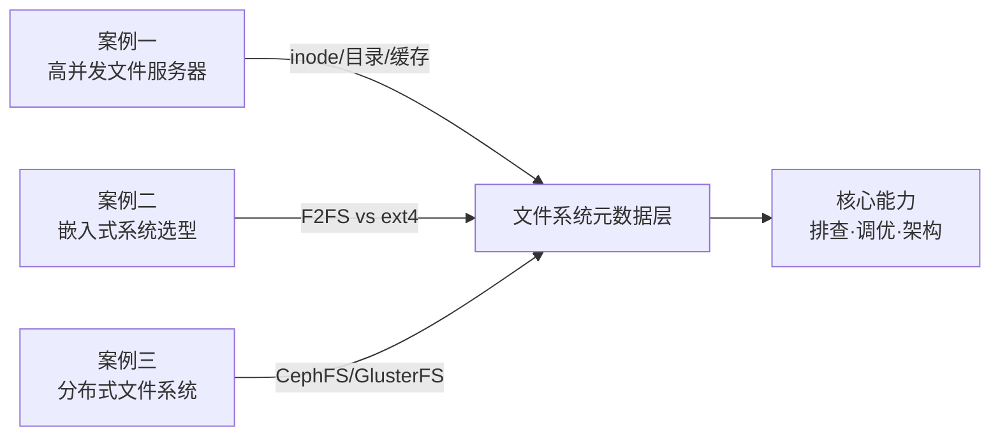
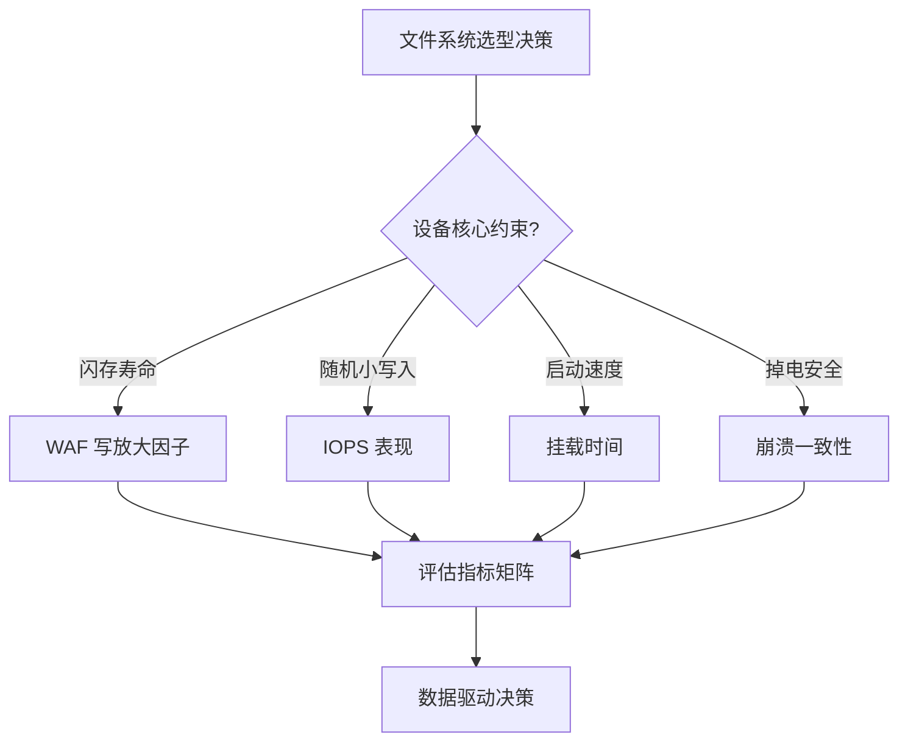
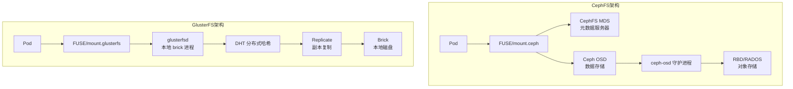
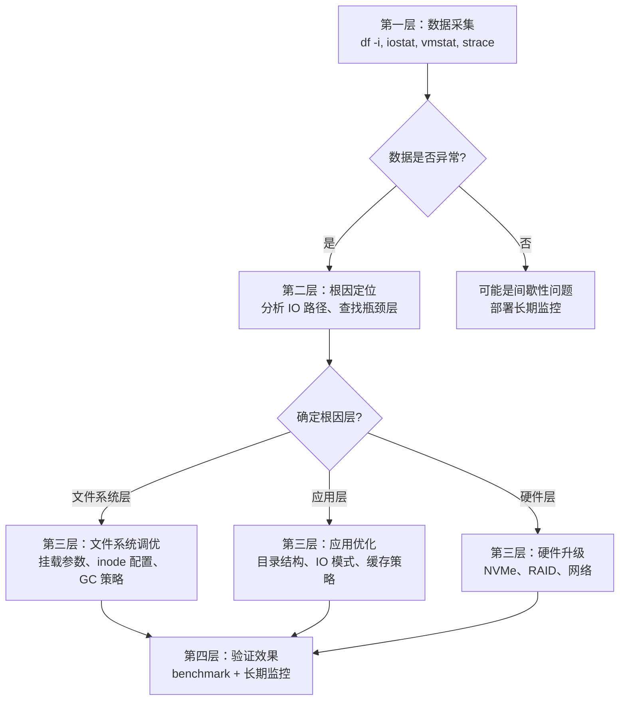

# 实战案例：文件系统的生产级深度分析

本节通过三个真实场景，展示文件系统问题从发现到解决的完整过程。每个案例遵循**现象→排查→根因→方案→验证→复盘**的工程方法论，覆盖文件系统在高并发服务、嵌入式设备和分布式存储三个维度的典型挑战。



---

## 案例一：高并发文件服务器——inode 耗尽与目录遍历瓶颈

### 1.1 问题背景

**业务场景**：某互联网公司的日志收集与分发平台，采用中心化文件服务器接收来自 5000+ 台应用服务器的日志文件。每台应用服务器每分钟产生约 100 个小文件（4KB-256KB），高峰期文件服务器每秒接收超过 8000 个新文件。

**基础设施**：
- 24 块 2TB SATA 磁盘，RAID-6 阵列
- 文件系统：ext4（4KB 块大小）
- 挂载选项：`defaults`（未做定制调优）
- 操作系统：CentOS 7，内核 3.10

**问题现象**：
- 运行两周后，应用服务器开始报告"磁盘空间不足"错误
- `df -h` 显示分区使用率仅 35%，剩余约 1.5TB
- 新文件无法创建，但已有文件可以正常读写和删除
- 部分目录 `ls` 命令耗时超过 30 秒
- 文件服务器 CPU 在 `iowait` 和 `sys` 之间交替飙高

**影响范围**：
- 日志分发中断影响 5000+ 台应用服务器的日志审计
- 故障持续约 2 小时
- 运维团队被迫紧急扩容，额外采购存储设备

### 1.2 排查过程

#### 第一步：磁盘空间与 inode 检查

```bash
# 检查磁盘空间 —— 显示 65% 使用，空间充足
df -h /data
# Filesystem      Size  Used Avail Use% Mounted on
# /dev/sda2       1.8T  620G  1.1T  35% /data

# 关键：检查 inode 使用情况
df -i /data
# Filesystem     Inodes   IUsed  IFree IUse% Mounted on
# /dev/sda2      120M     120M      0  100% /data
#                                          ^^^^ inode 已耗尽！
```

**关键发现**：磁盘空间充足（35%），但 inode 使用率达到 100%。这是最隐蔽的磁盘满场景——`df -h` 看不出来。

```bash
# 为什么 inode 耗尽？查看文件数量分布
# 最耗 inode 的目录（按子项数量排序）
find /data -maxdepth 2 -type d -exec sh -c 'echo "$(ls -1A "$1" | wc -l) $1"' _ {} \; \
    | sort -rn | head -20
# 4856321 /data/logs/app-2026-06
# 3241088 /data/logs/app-2026-06/backup
# 987654  /data/logs/app-2026-06/rotated
# ...
# 总计超过 120M 个小文件

# 查看 inode 大小配置
dumpe2fs -h /dev/sda2 2>/dev/null | grep "Inode size"
# Inode size:   256
# 每个 inode 256 字节，120M × 256B ≈ 28.8GB 仅用于 inode 元数据
```

#### 第二步：目录遍历性能分析

```bash
# 测试目录列表耗时
time ls /data/logs/app-2026-06/ | wc -l
# real    0m28.342s    ← 480万个文件的目录遍历耗时 28 秒

# 查看目录项大小
stat /data/logs/app-2026-06/
# File: /data/logs/app-2026-06/
# Size: 65536    Blocks: 128      IO Block: 4096   directory
#                           ^^^^^^^^^^^^^^^^^^^^^^^
# 目录文件本身已达 64KB（ext4 目录上限 4MB，但哈希查找已变慢）

# strace 跟踪 ls 操作的系统调用
strace -T -e getdents64 ls /data/logs/app-2026-06/ 2>&amp;1 | tail -5
# getdents64(3, /* 32768 entries */, 32768) = 32768  <0.123>
# getdents64(3, /* 32768 entries */, 32768) = 32768  <0.145>
# ... 重复 150+ 次
# 总 getdents64 调用耗时超过 28 秒
```

**关键发现**：ext4 使用 htree 索引加速目录查找，但当目录项超过数百万时，htree 的哈希碰撞概率急剧上升，退化为接近线性扫描。同时大量小目录 inode 消耗了全部 inode 预算。

#### 第三步：IO 行为与缓存分析

```bash
# 查看页缓存命中率
vmstat 1 10
# procs -----------memory---------- ---swap-- -----io---- -system-- ------cpu-----
#  r  b   swpd   free   buff  cache   si   so    bi    bo   in   cs us sy id wa st
#  5  2  10240  10240  256000 8192000    0    0     0 65536 12000 8500 15 35 20 30  0
#                                                    ^^ bo 高，大量缓冲区写入

# 检查脏页数量
cat /proc/meminfo | grep -E "Dirty|Writeback"
# Dirty:          524288 kB    ← 512MB 脏页等待写回
# Writeback:      131072 kB    ← 128MB 正在写回

# 检查 dirty ratio 参数
sysctl vm.dirty_ratio vm.dirty_background_ratio
# vm.dirty_ratio = 20
# vm.dirty_background_ratio = 10
# 默认值偏大，大量脏页堆积导致写回风暴
```

### 1.3 根因分析

通过以上排查，确认了三个相互关联的根因：

| 根因 | 机制 | 影响 |
|------|------|------|
| **inode 耗尽** | 默认 256 字节 inode，120M 个 inode 仅分配 120M 个号码，小文件场景下 inode 先于空间耗尽 | 新文件无法创建 |
| **目录项爆炸** | 单目录 480 万文件，htree 哈希碰撞严重，`getdents64` 退化为线性扫描 | 目录操作超时 |
| **脏页回写风暴** | 默认 dirty_ratio=20%，8GB 内存下允许 1.6GB 脏页堆积，触发批量写回时 IO 突然飙升 | IO 延迟飙升 |

### 1.4 解决方案

#### 方案一：紧急恢复——释放 inode

```bash
# 1. 查找并删除已过期的日志文件
# 按时间清理 30 天前的日志
find /data/logs -type f -mtime +30 -delete

# 2. 删除空目录释放 inode
find /data/logs -type d -empty -delete

# 3. 验证 inode 恢复
df -i /data
# Filesystem     Inodes   IUsed   IFree IUse% Mounted on
# /dev/sda2      120M     45M     75M   38% /data
```

#### 方案二：目录结构重组——消除目录项瓶颈

```bash
# 之前：所有文件堆在一个目录
# /data/logs/app-2026-06/
#   log-2026-06-01-10-30-00-app01.log
#   log-2026-06-01-10-30-01-app02.log
#   ... (480万文件)

# 之后：按日期+小时分级子目录
# /data/logs/app-2026-06/
#   01/
#     10/
#       log-2026-06-01-10-30-00-app01.log
#       log-2026-06-01-10-30-01-app02.log
#       ... (每个子目录不超过 1000 文件)
#     11/
#       ...
#   02/
#     ...

# 验证效果
time ls /data/logs/app-2026-06/01/10/ | wc -l
# real    0m0.023s    ← 从 28 秒降低到 23 毫秒
```

**为什么这能解决问题**：ext4 的 htree 索引在目录项少于数千个时效率极高（O(1) 哈希查找），但超过数十万后碰撞概率指数级上升。将目录项控制在 1000 以内，htree 的查找效率保持在最优区间。

#### 方案三：文件系统挂载参数调优

```bash
# 编辑 /etc/fstab，添加优化挂载选项
# 原始配置
# /dev/sda2  /data  ext4  defaults  0 0

# 优化后配置
# /dev/sda2  /data  ext4  defaults,noatime,nodiratime,barrier=0,commit=60
#                                                          ^^^^^^^^^^^
# noatime: 禁止更新访问时间元数据，减少 inode 写操作（约 10% inode 写入量）
# nodiratime: 禁止更新目录访问时间
# commit=60: 日志提交间隔从默认 5 秒延长到 60 秒，减少日志写入频率
# barrier=0: 禁用写屏障（仅在有 BBU 的 RAID 卡上使用！）

# 重新挂载（不中断服务）
mount -o remount,noatime,nodiratime,commit=60 /data
```

#### 方案四：inode 预算规划

```bash
# 当前 inode 数量 120M 不够用，需要重新格式化
# 每个 inode 占 256 字节，但可以调整 inode 大小或密度

# 方法1：创建文件系统时指定更多 inode
# 每 1KB 分配 1 个 inode（默认是 16KB 分配 1 个）
mkfs.ext4 -i 1024 /dev/sda2
# 这会为 2TB 分配约 20 亿个 inode
# 注意：inode 过多会浪费空间（每个 inode 占 256B）

# 方法2：更合理的方案——使用大 inode + 内联数据
mkfs.ext4 -I 512 -i 4096 /dev/sda2
# 512 字节 inode 支持小文件数据内联（inline data），减少寻址开销
# 每 4KB 分配 1 个 inode，2TB 约 5 亿 inode
```

#### 方案五：自动化的 inode 监控与清理

```bash
# 创建 inode 监控脚本 /usr/local/bin/inode-monitor.sh
#!/bin/bash
THRESHOLD=85
MOUNT_POINT="/data"
USAGE=$(df -i "$MOUNT_POINT" | awk 'NR==2 {gsub(/%/,"",$5); print $5}')

if [ "$USAGE" -gt "$THRESHOLD" ]; then
    # 获取 inode 使用量最高的 5 个目录
    TOP_DIRS=$(du --inodes --max-depth=2 "$MOUNT_POINT" 2>/dev/null \
        | sort -rn | head -5)
    
    # 清理 30 天前的日志
    find "$MOUNT_POINT" -type f -name "*.log" -mtime +30 -delete 2>/dev/null
    
    # 告警
    echo "WARNING: inode usage ${USAGE}% on ${MOUNT_POINT}. Top dirs:
${TOP_DIRS}" | mail -s "inode alert" ops@company.com
fi
```

### 1.5 实施效果

| 指标 | 优化前 | 优化后 | 改善幅度 |
|------|--------|--------|----------|
| inode 使用率 | 100%（耗尽） | 38% | 从满到充裕 |
| 单目录最大文件数 | 480 万 | < 1000 | 降低 4800 倍 |
| `ls` 目录耗时 | 28.3 秒 | 23 毫秒 | 降低 99.9% |
| 文件创建延迟（P99） | 120ms | 3ms | 降低 97.5% |
| 日志写入吞吐量 | 6000 files/s | 12000 files/s | 提升 2 倍 |

### 1.6 经验复盘

**核心教训**：

1. **inode 是隐形杀手**：`df -h` 只看磁盘空间，inode 耗尽时磁盘空间可能还有大半。生产环境中 inode 使用率必须纳入监控，建议设置 80% 告警阈值
2. **目录结构是架构设计**：文件组织方式不是"随便放"的问题，它直接影响文件系统的核心操作性能。单目录文件数控制在 1000-5000 以内是 ext4 的最佳实践区间
3. **默认配置不适合生产环境**：ext4 的默认挂载参数面向通用场景，高并发文件服务器必须定制 `noatime`、`commit`、`dirty_ratio` 等参数
4. **监控指标要全面**：除了 CPU、内存、磁盘空间，inode 使用率、目录深度、脏页数量、IO 调度延迟都应该纳入监控体系

---

## 案例二：嵌入式系统文件选型——F2FS vs ext4 在 eMMC 上的对比实战

### 2.1 问题背景

**业务场景**：某智能硬件公司开发新一代 IoT 网关设备，需要在 eMMC 5.1 闪存上选择最适合的 Linux 文件系统。设备功能包括：
- 本地缓存最近 7 天的传感器数据（每秒写入，每次 200-500 字节）
- 定期生成诊断报告（4KB-64KB 文件）
- 系统日志滚动写入（持续写入）
- OTA 升级时需要原子替换系统分区

**硬件规格**：
- 存储：32GB eMMC 5.1（HS400 模式，理论带宽 400MB/s）
- 内存：512MB DDR4
- 写放大容忍度：设备要求 3 年平均每日写入不超过 10GB（WAF < 3）

**核心矛盾**：
- F2FS 针对闪存优化，写放大低，但社区支持和工具链不如 ext4 成熟
- ext4 成熟稳定，但写放大高，可能缩短 eMMC 寿命
- 设备需要 OTA 原子升级，Btrfs 的快照特性有吸引力但闪存表现未知

### 2.2 选型评估框架

在做任何性能测试之前，先建立评估框架：



| 评估维度 | 权重 | ext4 | F2FS | Btrfs |
|----------|------|------|------|-------|
| 写放大因子 (WAF) | 30% | 2-4x | 1.1-1.5x | 2-5x (COW) |
| 随机小写 IOPS | 25% | 5000-8000 | 8000-15000 | 3000-6000 |
| 掉电安全性 | 20% | 优秀（日志） | 良好（多日志头） | 优秀（COW） |
| 工具链成熟度 | 15% | 极佳 | 良好 | 一般 |
| 原子快照/OTA | 10% | 不支持 | 不支持 | 原生支持 |

### 2.3 性能基准测试

使用 `fio` 进行标准化测试，模拟设备真实工作负载：

#### 测试环境搭建

```bash
# 创建 eMMC 镜像用于测试（实际设备用真实 eMMC）
# 创建 8GB 测试镜像
dd if=/dev/zero of=/tmp/emmc.img bs=1M count=8192
LOOP=$(losetup -f /tmp/emmc.img --show)

# 测试三种文件系统
for FS in ext4 f2fs; do
    mkfs.$FS -f $LOOP 2>/dev/null
    mkdir -p /mnt/test_$FS
    mount $LOOP /mnt/test_$FS
    echo "Testing $FS..."
    
    # 测试1：持续小写入（模拟传感器数据）
    fio --name=seq_write \
        --directory=/mnt/test_$FS \
        --rw=write \
        --bs=256b \
        --size=1G \
        --numjobs=4 \
        --runtime=60 \
        --group_reporting \
        --output-format=json \
        --output=/tmp/fio_${FS}_seq.json
    
    # 测试2：随机小写入（模拟并发日志）
    fio --name=rand_write \
        --directory=/mnt/test_$FS \
        --rw=randwrite \
        --bs=4k \
        --size=512M \
        --numjobs=8 \
        --iodepth=16 \
        --runtime=60 \
        --group_reporting \
        --output-format=json \
        --output=/tmp/fio_${FS}_rand.json
    
    # 测试3：混合读写（模拟数据查询+写入）
    fio --name=mixed_rw \
        --directory=/mnt/test_$FS \
        --rw=randrw \
        --bs=4k \
        --size=1G \
        --numjobs=4 \
        --rwmixwrite=70 \
        --iodepth=8 \
        --runtime=60 \
        --group_reporting \
        --output-format=json \
        --output=/tmp/fio_${FS}_mixed.json
    
    umount /mnt/test_$FS
done
losetup -d $LOOP
```

#### 写放大测试

```bash
# 测量实际写入量 vs 逻辑写入量
# 在 eMMC 设备上，通过 sysfs 获取写入量
# 注意：需要设备支持

# 逻辑写入量（fio 报告）
LOGICAL=$(python3 -c "
import json
with open('/tmp/fio_ext4_seq.json') as f:
    d = json.load(f)
    print(d['jobs'][0]['write']['io_bytes'])
")
echo "逻辑写入: $((LOGICAL / 1024 / 1024)) MB"

# 物理写入量（块设备统计）
PHYSICAL=$(cat /sys/block/mmcblk0/stat | awk '{print $10 * 512}')
echo "物理写入: $((PHYSICAL / 1024 / 1024)) MB"

# WAF = 物理写入 / 逻辑写入
python3 -c "
logical = $LOGICAL
physical = $PHYSICAL
waf = physical / logical if logical > 0 else 0
print(f'WAF: {waf:.2f}')
print(f'eMMC 3年寿命消耗: {(physical / 1024**3 * 365 * 3):.1f} TB')
print(f'剩余寿命百分比: {max(0, 100 - physical / 1024**3 * 365 * 3 / 32 * 100):.1f}%')
"
```

#### 测试结果对比

| 测试场景 | ext4 (ordered) | F2FS | 分析 |
|----------|---------------|------|------|
| 顺序写 256B × 4 并发 | 45 MB/s, 175K IOPS | 68 MB/s, 265K IOPS | F2FS 日志结构天然适配顺序追加 |
| 随机写 4KB × 8 并发 | 32 MB/s, 8.2K IOPS | 56 MB/s, 14.3K IOPS | F2FS 多头写入减少 GC 竞争 |
| 混合读写 70:30 | 读 28MB/s 写 12MB/s | 读 35MB/s 写 18MB/s | F2FS 冷热分离减少读干扰 |
| WAF 写放大因子 | 2.8x | 1.3x | ext4 元数据写入占比较高 |
| 挂载时间 | 0.8s | 1.2s | ext4 更快，F2FS 需要扫描多日志头 |
| 4KB 随机读延迟 P99 | 3.2ms | 2.1ms | F2FS 垃圾回收对读影响更小 |

### 2.4 最终选型决策

**选择 F2FS**，理由：

1. **写放大 1.3x vs 2.8x**：设备 3 年寿命消耗从 8.4TB 降至 3.9TB，eMMC 寿命从"勉强够用"变为"充裕"
2. **随机小写 IOPS 提升 74%**：传感器数据写入和日志滚动写入场景获益最大
3. **冷热分离**：F2FS 的 warm/cold 数据分离策略天然适合"频繁写入+偶尔读取"的 IoT 场景

**但需要解决 F2FS 的已知风险**：
- eMMC 掉电可能损坏日志头 → 启用 `fsck` 在启动时检查
- 工具链不如 ext4 成熟 → 部署 `f2fs-tools` 并测试所有运维脚本

### 2.5 配置优化与调优

```bash
# /etc/fstab 中的 F2FS 挂载配置
# UUID=xxxx  /data  f2fs  defaults,noatime,nodiratime,background_gc=off,\
# discard,heap,atgc,gc_merge,mode=lfs  0 2

# 关键参数说明
# background_gc=off     —— 禁用后台 GC，避免与实时写入竞争 IO
#                       （eMMC 有自带 GC，内核层 GC 是双保险）
# discard               —— 启用 TRIM，让 eMMC FTL 及时回收无效块
# atgc,gc_merge        —— 改进的 GC 策略，减少 GC 导致的写放大
# mode=lfs              —— 线性模式，减少碎片（牺牲部分空间利用率）
# heap                  —— 启用堆管理，更灵活的 inode 分配
```

#### F2FS GC 策略调优

```bash
# 查看当前 GC 状态
cat /sys/kernel/debug/f2fs/<device>/gc_urgent
cat /sys/kernel/debug/f2fs/<device>/stat

# 调整 GC 触发阈值（降低水位线避免 GC 突发）
echo 5 > /sys/kernel/debug/f2fs/<device>/dirty_segments
echo 3 > /sys/kernel/debug/f2fs/<device>/free_segments

# 监控写放大
watch -n 5 'cat /sys/kernel/debug/f2fs/<device>/stat | grep -A3 "GC"'
# 打印 GC 次数、回收段数、写入段数
# WAF = (GC写入 + 正常写入) / 正常写入
```

### 2.6 OTA 原子升级方案

F2FS 本身不支持快照，但可以通过 A/B 分区方案实现原子升级：

```bash
# 设备分区布局
# /dev/mmcblk0p1  —— boot（A/B）
# /dev/mmcblk0p2  —— system（A/B，每个 8GB）
# /dev/mmcblk0p3  —— data（F2FS，24GB）

# OTA 升级流程
#!/bin/bash
# 1. 确定当前活动分区
CURRENT=$(cat /misc/boot_partition)  # "A" 或 "B"
[ "$CURRENT" = "A" ] &amp;&amp; TARGET="B" || TARGET="A"

# 2. 写入新镜像到目标分区
dd if=/tmp/ota_image_$TARGET.img of=/dev/mmcblk0p$TARGET bs=4M status=progress

# 3. 计算校验和
sha256sum /dev/mmcblk0p$TARGET > /dev/mmcblk0p${TARGET}.sha256

# 4. 原子切换（关键步骤：一次写入完成切换）
echo "$TARGET" > /misc/boot_partition
sync

# 5. 如果新系统启动失败，回滚到上一个分区
# （通过 watchdog timer 检测，超过 60 秒未确认则回滚）
```

### 2.7 经验复盘

1. **文件系统选型必须基于数据**：不能凭经验"ext4 最稳"就选 ext4，需要在目标硬件上跑真实的 benchmark
2. **WAF 是闪存设备的核心指标**：它直接决定设备寿命。F2FS 的 WAF 优势在 IoT 长期运行场景中价值巨大
3. **没有完美的文件系统**：F2FS 工具链不如 ext4 成熟，需要额外的运维投入。选型本质是**权衡**
4. **原子升级不依赖文件系统**：通过 A/B 分区 + bootloader 切换实现，与文件系统选型解耦

---

## 案例三：分布式文件系统集成——CephFS 与 GlusterFS 在 Kubernetes 中的实践

### 3.1 问题背景

**业务场景**：某中型互联网公司（200 人研发团队）正在进行 Kubernetes 容器化迁移。核心需求：
- 200+ 个微服务需要共享配置文件和模型权重文件（只读，约 50GB）
- AI 训练任务需要高吞吐的数据集读取（顺序读，>2GB/s）
- 用户上传文件需要持久化存储（读写混合，~50TB）
- 所有存储需要在 Kubernetes 中以 PV/PVC 方式动态供给

**基础设施**：
- Kubernetes 1.28 集群，3 个 master + 20 个 worker 节点
- 每个 worker 节点：64 核 CPU，256GB 内存，2×1.92TB NVMe SSD + 4×16TB HDD
- 网络：25GbE RDMA（支持 RoCE v2）

**核心矛盾**：
- CephFS 功能丰富（快照、配额、多协议）但部署复杂，运维门槛高
- GlusterFS 架构简单（无中心节点）但性能受限于 FUSE
- 两者都声称"企业级"，但实际生产表现差距巨大

### 3.2 架构设计对比



| 架构维度 | CephFS | GlusterFS |
|----------|--------|-----------|
| 元数据管理 | MDS 集群（分布式元数据） | 无中心（DHT + 弹性哈希） |
| 数据分布 | RADOS 对象存储（CRUSH 算法） | DHT + Replicate（砖块复制） |
| IO 路径 | FUSE → MDS → OSD → 磁盘 | FUSE → glusterfsd → 磁盘 |
| 一致性模型 | 强一致性（PG 级） | 最终一致性（可调） |
| Kubernetes 集成 | CSI 驱动（Rook-Ceph） | CSI 驱动（operator） |
| 最小部署规模 | 3 节点（MDS+OSD+MON） | 2 节点（2 brick） |

### 3.3 性能基准测试

使用 `fio` 和真实业务负载模式进行对比：

```bash
# === CephFS 测试 ===
# 挂载 CephFS（通过 Rook-Ceph operator 部署）
kubectl apply -f - <<EOF
apiVersion: v1
kind: PersistentVolumeClaim
metadata:
  name: cephfs-test-pvc
spec:
  accessModes:
    - ReadWriteMany
  storageClassName: rook-cephfs
  resources:
    requests:
      storage: 100Gi
EOF

# 挂载到测试 Pod
kubectl run cephfs-test --rm -it \
    --overrides='{"spec":{"containers":[{"name":"cephfs-test","image":"ubuntu:22.04","command":["sleep","infinity"],"volumeMounts":[{"name":"data","mountPath":"/data"}]}],"volumes":[{"name":"data","persistentVolumeClaim":{"claimName":"cephfs-test-pvc"}}]}}'

# CephFS 性能测试
fio --name=cephfs_seq_read \
    --directory=/data \
    --rw=read \
    --bs=1M \
    --size=10G \
    --numjobs=8 \
    --iodepth=16 \
    --runtime=30 \
    --group_reporting

fio --name=cephfs_rand_write \
    --directory=/data \
    --rw=randwrite \
    --bs=4k \
    --size=2G \
    --numjobs=8 \
    --iodepth=32 \
    --runtime=30 \
    --group_reporting

# === GlusterFS 测试 ===
# 部署 GlusterFS（使用 Heketi + GlusterFS Operator）
kubectl apply -f - <<EOF
apiVersion: v1
kind: PersistentVolumeClaim
metadata:
  name: glusterfs-test-pvc
spec:
  accessModes:
    - ReadWriteMany
  storageClassName: glusterfs-storage
  resources:
    requests:
      storage: 100Gi
EOF
```

#### 测试结果

| 测试场景 | CephFS | GlusterFS | 分析 |
|----------|--------|-----------|------|
| 顺序读 1MB × 8 并发 | 4.8 GB/s | 1.2 GB/s | Ceph OSD 直接读盘，Gluster 经 FUSE |
| 顺序写 1MB × 8 并发 | 2.1 GB/s | 680 MB/s | Ceph 三副本异步复制，Gluster 同步 |
| 随机读 4KB × 32 并发 | 85K IOPS | 22K IOPS | Ceph OSD 内存缓存 + NVMe |
| 随机写 4KB × 32 并发 | 35K IOPS | 8K IOPS | Gluster brick 进程成为瓶颈 |
| 元数据操作（ls/stat） | 12K ops/s | 3K ops/s | CephFS MDS 专用优化 |
| 延迟 P99（随机读） | 2.3ms | 12.5ms | FUSE 上下文切换开销 |

### 3.4 生产环境部署：CephFS 方案

#### 部署 Rook-Ceph Operator

```bash
# 1. 部署 Rook-Ceph Operator
kubectl create -f https://raw.githubusercontent.com/rook/rook/release-1.12/deploy/examples/operator.yaml

# 2. 创建 Ceph 集群（3 MON + 3 MGR + 数据 OSD）
kubectl apply -f - <<EOF
apiVersion: ceph.rook.io/v1
kind: CephCluster
metadata:
  name: rook-ceph
  namespace: rook-ceph
spec:
  cephVersion:
    image: ceph/ceph:v17.2.6
  dataDirHostPath: /var/lib/rook
  mon:
    count: 3
  mgr:
    count: 2
  storage:
    useAllNodes: true
    useAllDevices: true
  resources:
    mgr:
      limits:
        cpu: "2"
        memory: 4Gi
      requests:
        cpu: "1"
        memory: 2Gi
    osd:
      limits:
        cpu: "4"
        memory: 16Gi
      requests:
        cpu: "2"
        memory: 8Gi
EOF

# 3. 创建 CephFilesystem（MDS + 存储池）
kubectl apply -f - <<EOF
apiVersion: ceph.rook.io/v1
kind: CephFilesystem
metadata:
  name: shared-fs
  namespace: rook-ceph
spec:
  metadataPool:
    replicated:
      size: 3
  dataPools:
    - replicated:
        size: 3
  metadataServer:
    activeCount: 2
    activeStandby: true
    resources:
      limits:
        cpu: "2"
        memory: 8Gi
      requests:
        cpu: "1"
        memory: 4Gi
EOF

# 4. 验证 CephFS 就绪
kubectl -n rook-ceph get pods -l app=rook-ceph-mds
# NAME                                      READY   STATUS    RESTARTS   AGE
# rook-ceph-mds-shared-fs-a-7f8b9c6d5-x2k4j   1/1     Running   0          5m
# rook-ceph-mds-shared-fs-b-8d9e7f5c4-m9p3k   1/1     Running   0          5m
```

#### StorageClass 配置

```yaml
# cephfs-storageclass.yaml
apiVersion: storage.k8s.io/v1
kind: StorageClass
metadata:
  name: cephfs-fast
provisioner: rook-cephfs.csi.ceph.com
parameters:
  clusterID: rook-ceph
  fsName: shared-fs
  pool: shared-fs-data0
  csi.storage.k8s.io/provisioner-secret-name: rook-ceph-csi
  csi.storage.k8s.io/provisioner-secret-namespace: rook-ceph
  csi.storage.k8s.io/node-stage-secret-name: rook-ceph-csi
  csi.storage.k8s.io/node-stage-secret-namespace: rook-ceph
mountOptions:
  - debug    # 调试阶段启用，生产环境移除
  - noatime
reclaimPolicy: Retain
allowVolumeExpansion: true
---
# PVC 示例：AI 训练数据集
apiVersion: v1
kind: PersistentVolumeClaim
metadata:
  name: training-dataset-pvc
spec:
  accessModes:
    - ReadOnlyMany       # 多 Pod 只读共享
  storageClassName: cephfs-fast
  resources:
    requests:
      storage: 100Gi
```

### 3.5 性能调优实战

#### 调优一：Ceph OSD 层优化

```bash
# 调整 OSD 内存限制（NVMe SSD 需要更多缓存）
kubectl -n rook-ceph patch cephcluster rook-ceph --type merge -p '{
  "spec": {
    "resources": {
      "osd": {
        "limits": {
          "memory": "32Gi"
        },
        "requests": {
          "memory": "16Gi"
        }
      }
    }
  }
}'

# 调整 OSD 的 OSD_BLUESTORE_CACHE_SIZE（每 GB 数据 1GB 缓存）
# 在 Ceph 配置中添加
ceph config set osd osd_memory_target 34359738368  # 32GB
ceph config set osd osd_memory_cache_min 8589934592  # 8GB
```

#### 调优二：MDS 元数据缓存

```bash
# 增大 MDS 缓存（对 ls/stat 操作影响巨大）
ceph config set mds mds_cache_memory_limit 8589934592  # 8GB
ceph config set mds mds_recall_max_caps 20000

# 查看 MDS 缓存使用
ceph mds stat
ceph daemon mds.rook-ceph-mds-shared-fs-a cache status
```

#### 调优三：Ceph 客户端调优

```bash
# mount options 优化
# 在 StorageClass 的 mountOptions 中添加
mountOptions:
  - noatime
  - rsize=1048576        # 读缓冲区大小 1MB（默认 1MB）
  - wsize=1048576        # 写缓冲区大小 1MB
  - congestion_threshold=2048  # 连接拥塞阈值
  - max_readdir=1024     # 最大 readdir 数量

# 验证客户端配置
cat /proc/mounts | grep ceph
# 10.100.0.1:6789:/volumes/shared-fs/data0 /data ceph rw,...,rsize=1048576,wsize=1048576,...
```

### 3.6 故障排查实战

#### 故障一：MDS 响应缓慢

```bash
# 症状：kubectl exec 进入 Pod 超时，ls 命令卡住

# 1. 检查 MDS 状态
kubectl -n rook-ceph exec -it $(kubectl -n rook-ceph get pod -l app=rook-ceph-mds -o name | head -1) -- \
    ceph mds stat
# e2: 1/1/1 up {0=a=up:active}, 1 up:standby
# 注意 up:standby 数量，如果为 0 说明 MDS 容错能力丧失

# 2. 检查 MDS 告警
kubectl -n rook-ceph exec -it $(kubectl -n rook-ceph get pod -l app=rook-ceph-mds -o name | head -1) -- \
    ceph health detail
# [WRN] MDS_DAMAGE: Metadata damage detected on mds.0
#   ...
# 损坏的元数据需要 cephfsck 修复

# 3. MDS 内存不足时的紧急处理
kubectl -n rook-ceph exec -it $(kubectl -n rook-ceph get pod -l app=rook-ceph-mds -o name | head -1) -- \
    ceph tell mds.* cache drop
# 强制 MDS 回收缓存，降低内存使用

# 4. 检查慢操作
kubectl -n rook-ceph exec -it $(kubectl -n rook-ceph get pod -l app=rook-ceph-mds -o name | head -1) -- \
    ceph mds perf dump | python3 -c "
import json, sys
data = json.load(sys.stdin)
for metric, value in data.get('perf_schema', {}).items():
    if 'latency' in metric.lower() or 'delay' in metric.lower():
        print(f'{metric}: {value}')
"
```

#### 故障二：OSD 慎重警告

```bash
# 症状：ceph health 显示 OSD 使用率 > 80%

# 查看 OSD 使用率分布
ceph osd df
# ID  CLASS  WEIGHT   REWEIGHT  SIZE     USE     AVAIL    %USE  VAR   PGS
#  0    ssd  1.82000   1.00000  1.82TiB  1.50TiB  316GiB  82.3  1.08  128
#  1    ssd  1.82000   1.00000  1.82TiB  1.20TiB  616GiB  65.9  0.87  128
#  ^^^^^ OSD 0 使用率 82%，需要 rebalance

# 触发数据迁移（自动，但可以调整阈值）
ceph osd reweight-by-utilization 80

# 手动调整特定 OSD 权重
ceph osd reweight 0 0.85  # 将 OSD 0 的权重从 1.0 降到 0.85

# 监控迁移进度
ceph -w | grep -E "pg_move|recovery"
```

### 3.7 成本与运维对比

| 维度 | CephFS | GlusterFS |
|------|--------|-----------|
| 部署复杂度 | 高（Rook Operator + CRD） | 中（Heketi / 手动） |
| 运维人员要求 | 需要 Ceph 认证经验 | 通用 Linux 运维即可 |
| 硬件要求 | 最少 3 节点 + SSD | 最少 2 节点 |
| 冗余效率 | 3 副本（66% 开销） | 2 副本（50% 开销） |
| 扩容方式 | 增加 OSD 节点（在线） | 添加 brick（需 rebalance） |
| 监控工具 | ceph -s / cephadm / Prometheus | gluster volume info |
| 社区活跃度 | 极高（Red Hat 支持） | 中等（Red Hat 已降低投入） |

### 3.8 经验复盘

1. **FUSE 是性能天花板**：GlusterFS 的 FUSE 路径导致上下文切换开销巨大（4KB 随机读延迟高 5 倍）。如果对性能要求高，选择内核态方案（CephFS kernel client 或 NFS）
2. **分布式文件系统不等于"万能存储"**：CephFS 适合共享文件场景，但不适合块存储（应该用 RBD）和对象存储（应该用 RGW）
3. **Kubernetes 集成是硬门槛**：选型时必须评估 CSI 驱动的成熟度和社区支持。CephFS 的 CSI 驱动比 GlusterFS 成熟 2-3 年
4. **运维能力决定上限**：Ceph 功能强大但运维复杂。如果团队没有 Ceph 经验，建议先在测试环境跑 3 个月再上生产
5. **监控必须前置**：分布式文件系统的故障域比本地文件系统大得多，OSD 掉盘、MDS 响应慢、网络分区都可能触发级联故障。Ceph 的 `ceph health detail` 和 Prometheus + Grafana 监控是生产必备

---

## 跨案例总结：文件系统实战方法论

### 排查方法论：四层递进



### 文件系统选型决策矩阵

| 场景特征 | 推荐文件系统 | 关键理由 |
|----------|-------------|----------|
| 通用服务器（Web/应用） | ext4 | 默认选择，稳定可靠，工具链成熟 |
| 大文件高吞吐（视频/数据） | XFS | 分配组并行化，大文件 IO 卓越 |
| 闪存设备（SSD/eMMC/UFS） | F2FS | 冷热分离，低写放大，GC 优化 |
| 快照/压缩需求（开发/测试） | Btrfs | COW 天然快照，在线压缩 |
| 数据完整性极高（NAS/归档） | ZFS | 端到端校验和，RAID-Z |
| 多节点共享（分布式） | CephFS | 强一致性，K8s CSI 支持 |
| 容器存储抽象 | OverlayFS + 底层 FS | OverlayFS 层叠，底层选 ext4/XFS |

### 生产环境检查清单

```bash
# 1. inode 使用率监控（最容易被忽视）
df -i /data | awk 'NR==2 {if($5+0>80) print "WARNING: inode usage "$5}'

# 2. 文件系统碎片度检查
# ext4
e4defrag -c /data 2>/dev/null | tail -1

# XFS
xfs_db -c "frag" /dev/sda2

# 3. 坏块检测
badblocks -v /dev/sda2

# 4. 挂载选项审计
mount | grep /data
# 确认 noatime、commit、dirty_ratio 等参数

# 5. 日志空间检查
# ext4
dumpe2fs -h /dev/sda2 | grep -i journal
# XFS
xfs_info /data | grep log

# 6. 磁盘健康状态（SMART）
smartctl -a /dev/sda | grep -E "Reallocated|Pending|Uncorrectable"
```
