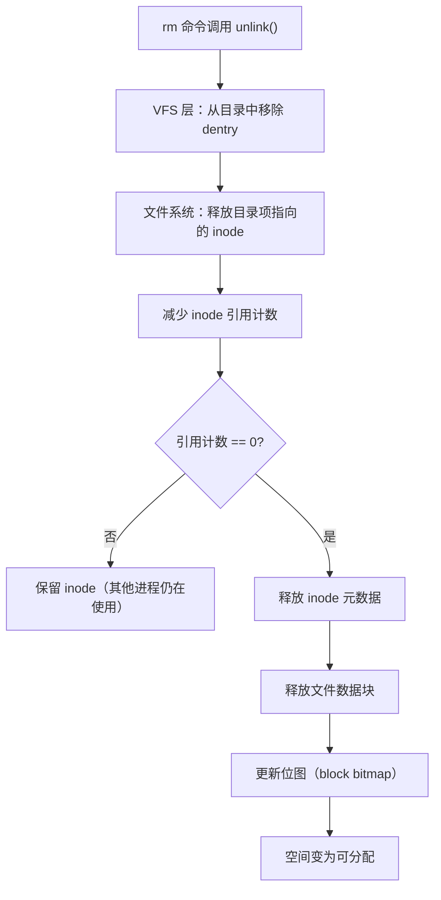
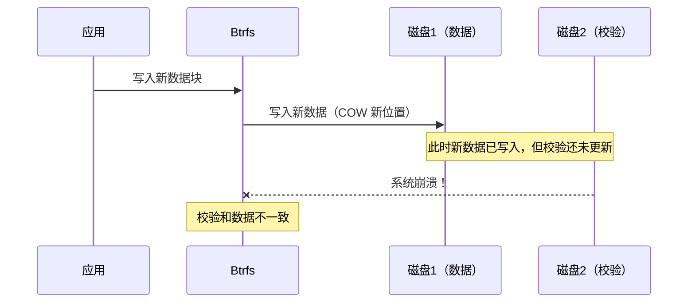
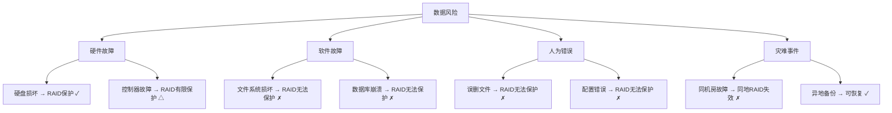

## 文件系统常见误区：认知纠偏与深度解析

文件系统的许多行为与其直觉相悖。开发者和运维工程师在日常工作中，常常基于不完整的心智模型做出错误判断——以为 `fsync` 保证数据安全，以为 `rm` 立即释放空间，以为 `df -h` 能反映一切。这些认知偏差在生产环境中可能演变为严重的数据丢失、性能劣化或系统故障。

本节系统梳理文件系统领域最常见的认知误区，每个误区都从「错误认知 → 真实机制 → 真实案例 → 正确做法」四个层次展开，帮助读者建立准确的文件系统心智模型。

---

## 误区一：fsync 保证数据安全落地

### 错误认知

> "我调用了 `fsync(fd)`，数据一定写到磁盘了，断电也不会丢。"

这是文件系统领域最危险的误解之一。许多开发者将 `fsync` 视为数据持久化的"银弹"，但事实远比这复杂。

### 真实机制

`fsync(fd)` 的实际行为分为以下几个阶段：

1. **刷写文件数据**：将文件的脏页从页缓存（Page Cache）写入磁盘的物理介质
2. **刷写元数据**：更新 inode、大小、时间戳等元数据（注意：这只在某些文件系统上保证）
3. **返回成功**：内核认为写入完成

但关键问题在于：**`fsync` 不保证数据已经到达物理存储介质**。

```bash
# 查看 fsync 的实际语义（Linux man page）
man 2 fsync

# fsync(2) 的关键描述：
# "fsync() transfers ("flushes") all modified in-core data of
#  (i.e., modified buffer cache pages) for the file referred to
#  by the file descriptor fd to the disk device"
#
# 但它不保证：
# 1. 写入已经到达磁盘介质（可能还在磁盘控制器缓存中）
# 2. 元数据已与数据同步（取决于文件系统日志模式）
# 3. 顺序写入保证（数据可能以任意顺序到达磁盘）
```

具体来说，`fsync` 存在以下层次的不确定性：

| 层次 | fsync 是否保证 | 说明 |
|------|---------------|------|
| 页缓存 → 块设备驱动 | ✓ 是 | 内核层面的写入完成 |
| 块设备驱动 → 磁盘控制器缓存 | 不确定 | 取决于磁盘的写缓存策略 |
| 磁盘控制器缓存 → 物理介质 | ✗ 否 | 可能被磁盘控制器延迟写入 |
| 写入顺序 | ✗ 否 | 不保证写入的物理顺序 |
| 元数据同步 | 部分保证 | 取决于日志模式（ordered/journal） |

### 真实案例

**案例：ext4 ordered 模式下的数据丢失**

一个典型的灾难场景：应用先写入数据文件，再写入索引文件，两次写入之间调用 `fsync`。在 ext4 的 ordered 模式下：

步骤1: write(data_file, ...)    → 数据写入页缓存
步骤2: fsync(data_file)         → 数据刷入磁盘（保证）
步骤3: write(index_file, ...)   → 元数据写入页缓存
步骤4: fsync(index_file)        → 元数据刷入磁盘
步骤5: 断电

在 ordered 模式下，步骤 2 保证数据先于元数据落盘，但**不保证数据已到达物理介质**。如果磁盘控制器的写缓存在断电时丢失，数据可能损坏。

更隐蔽的场景：**日志模式混淆**

# ext4 默认日志模式
mount -o data=ordered /dev/sda1 /mnt    # 只保证数据先于元数据写日志
mount -o data=journal /dev/sda1 /mnt    # 数据和元数据都写日志
mount -o data=writeback /dev/sda1 /mnt  # 不保证写入顺序

许多运维人员不知道自己的文件系统使用哪种日志模式，更不知道不同模式下 `fsync` 的语义差异。

### 进阶：fsync 与 fdatasync 的区别

```c
// fsync: 刷写数据 + 所有元数据（大小、时间戳、权限等）
fsync(fd);

// fdatasync: 只刷写数据 + 影响后续读取的元数据（如文件大小）
fdatasync(fd);
```

`fdatasync` 在大多数场景下比 `fsync` 更高效，因为它不需要刷写不改变数据读取结果的元数据（如 `atime`）。数据库系统（如 PostgreSQL、MySQL InnoDB）通常使用 `fdatasync` 而非 `fsync`。

```bash
# 验证当前文件系统的日志模式
mount | grep /dev/sda
# 输出示例：/dev/sda1 on / type ext4 (rw,relatime,data=ordered)
#                                                    ^^^^^^^^^^^^
#                                              这就是日志模式
```

### 正确做法

1. **理解 fsync 的层次语义**：它保证内核层面的写入完成，但不保证磁盘控制器层面的数据安全
2. **检查并配置磁盘写缓存**：
   ```bash
   # 查看磁盘写缓存状态
   hdparm -W /dev/sda
   
   # 如果需要数据安全，关闭写缓存（性能代价显著）
   hdparm -W0 /dev/sda
   
   # 使用带电池备份的 RAID 控制器是更好的方案
   ```
3. **选择合适的日志模式**：数据安全要求高时使用 `data=journal`，性能优先时使用 `data=ordered`
4. **使用 `O_DIRECT` + `fsync` 组合**：确保绕过页缓存直达磁盘
5. **关键应用考虑 `O_SYNC`**：每次写入都同步刷盘，牺牲性能换取最高安全等级

---

## 误区二：rm 删除文件立即释放空间

### 错误认知

> "`rm file` 之后磁盘空间应该立即恢复。如果 `df` 显示空间没变，说明有问题。"

许多开发者在 `rm` 大文件后发现磁盘空间没有立即释放，就恐慌地认为系统出了故障。

### 真实机制

Linux 上 `rm` 的真实过程涉及多个步骤：



关键点：**`rm` 操作的是 dentry（目录项），不是数据块本身**。只要还有进程打开了该文件，inode 和数据块就不会被释放。

```bash
# 演示：文件被删除但空间未释放
$ dd if=/dev/zero of=/tmp/test_large bs=1M count=1000
$ df -h /tmp
Filesystem      Size  Used Avail Use%
/dev/sda1        50G  1.0G   49G   2%

# 在另一个终端保持文件打开
$ tail -f /tmp/test_large &amp;

# 删除文件
$ rm /tmp/test_large

# 空间并未释放！
$ df -h /tmp
Filesystem      Size  Used Avail Use%
/dev/sda1        50G  1.0G   49G   2%    # 没变！因为进程仍持有文件句柄
```

### 为什么会这样？

Linux 文件系统的"删除"实际上是**引用计数减少**。只有当满足以下**所有条件**时，空间才会被真正释放：

1. **所有目录项被移除**（`rm` 完成）
2. **所有文件描述符被关闭**（没有进程打开该文件）
3. **inode 引用计数降为 0**

这就是为什么在生产环境中，你经常看到这样的情况：

```bash
# 删除日志文件后空间没变
$ rm /var/log/huge_app.log
$ df -h /var/log
Filesystem      Size  Used Avail Use%   ← 仍然显示已满

# 原因：应用进程仍持有已删除文件的句柄
# 解决：重启应用或使用 > 截断而非 rm
$ truncate -s 0 /var/log/huge_app.log   # 截断文件，保留 inode，立即释放空间
# 或者
$ echo "" > /var/log/huge_app.log       # 同样效果
```

### 进阶：/proc 下查看已删除但未释放的文件

```bash
# 查找所有被删除但仍占用空间的文件
$ lsof | grep '(deleted)'
COMMAND    PID  USER  FD   TYPE DEVICE SIZE/OFF NODE NAME
mysqld    1234  mysql  5w   REG  8,1  10737418240  12345678 /var/log/mysql/slow.log (deleted)

# 更精确的查看
$ ls -l /proc/1234/fd/5
lrwx------ 1 mysql mysql 64 Jun 26 10:00 5 -> /var/log/mysql/slow.log (deleted)

# 获取文件大小
$ ls -la /proc/1234/fd/5
-rw-r----- 1 mysql mysql 10737418240 Jun 26 10:00 /proc/1234/fd/5

# 重启进程释放空间，或者截断文件描述符
$ truncate -s 0 /proc/1234/fd/5        # 立即释放空间，无需重启进程
```

### 真实案例

**案例：Nginx 日志文件空间不释放**

某运维团队在日志轮转时使用 `mv` + `rm` 方式：

```bash
# 错误的日志轮转方式
mv /var/log/nginx/access.log /var/log/nginx/access.log.1
rm /var/log/nginx/access.log.1.old
```

Nginx 仍然持有 `access.log` 的文件句柄（现在被重命名为 `access.log.1`），所以即使 `rm` 了旧文件，磁盘空间也不会释放。正确的做法是：

```bash
# 正确的日志轮转方式
# 方法1：使用 logrotate（推荐）
# /etc/logrotate.d/nginx 配置文件

# 方法2：使用信号截断（Nginx 支持）
kill -USR1 $(cat /var/run/nginx.pid)

# 方法3：重启服务后删除
systemctl restart nginx
rm /var/log/nginx/access.log.1.old
```

### 正确做法

1. **优先使用截断而非删除**：`truncate -s 0 file` 或 `> file` 立即释放空间
2. **用 `lsof` 查看未释放的文件句柄**
3. **使用 `logrotate` 管理日志轮转**，而不是手动 `mv`/`rm`
4. **了解 `rm` 的延迟释放特性**，不要依赖 `df` 即时反映空间变化

---

## 误区三：df -h 能准确反映 inode 使用情况

### 错误认知

> "`df -h` 显示还有空间，说明磁盘没问题。"

这是最隐蔽的误区之一。`df -h` 只显示**块空间**（block space），完全忽略了 **inode 空间**。inode 耗尽会导致无法创建新文件，即使还有大量可用磁盘空间。

### 真实机制

Linux 文件系统存储文件需要两种资源：

| 资源类型 | 存储内容 | 耗尽后果 | 查看命令 |
|----------|----------|----------|----------|
| 数据块（Block） | 文件的实际内容 | 无法写入新数据 | `df -h` |
| 索引节点（Inode） | 文件的元数据（权限、所有者、时间戳等） | 无法创建新文件 | `df -i` |

**每个文件，无论大小，都消耗一个 inode**。一个 1 字节的文件和一个 1GB 的文件消耗的 inode 数量相同。因此，大量小文件会比少量大文件更快耗尽 inode。

```bash
# 查看 inode 使用情况
$ df -i
Filesystem      Inodes   IUsed   IFree IUse% Mounted on
/dev/sda1      6553600  6553600      0  100% /
                                               ^^^^^
                                          已经100%！但 df -h 可能显示还有空间

# 查看 inode 总数和使用情况
$ dumpe2fs -h /dev/sda1 | grep -i "inode count"
inode count:              6553600
free inodes:              0

# 统计目录下的文件数量
$ find /var -type f | wc -l
847293

# 查找 inode 占用最多的目录
$ find / -xdev -printf '%h\n' | sort | uniq -c | sort -rn | head -20
```

### 真实案例

**案例：邮件服务器 inode 耗尽**

一台邮件服务器使用 ext4，`df -h` 显示 `/var` 分区还有 40GB 可用空间，但邮件投递全部失败。

```bash
# 排查过程
$ df -h /var
Filesystem      Size  Used Avail Use%
/dev/sda3       100G   60G   40G   60%    # 看起来没问题

$ df -i /var
Filesystem      Inodes   IUsed   IFree IUse%
/dev/sda3      2621440  2621440      0  100%  # inode 已耗尽！

# 根因：邮件队列目录下积累了大量小文件
$ ls /var/mailqueue/ | wc -l
2621440

# 清理
$ find /var/mailqueue/ -name "*.tmp" -mtime +1 -delete
```

### inode 数量的限制

ext4 文件系统在格式化时固定了 inode 总数，默认比例约为每 16KB 一个 inode：

```bash
# 查看 inode 比例
$ mkfs.ext4 -n /dev/sdb1 2>&amp;1 | grep "inodes per group"
# 或
$ tune2fs -l /dev/sdb1 | grep "Inodes per group"

# 格式化时自定义 inode 比例（如每 4KB 一个 inode，适合大量小文件）
$ mkfs.ext4 -i 4096 /dev/sdb1

# 注意：inode 数量一旦设定，后续无法增加（XFS 和 Btrfs 除外）
```

不同文件系统的 inode 管理策略差异很大：

| 文件系统 | inode 管理 | 可扩展性 |
|----------|-----------|----------|
| ext4 | 格式化时固定总数 | 不可扩展 |
| XFS | 动态分配 inode | 自动扩展 |
| Btrfs | 动态分配 inode | 自动扩展 |
| ZFS | 动态分配 inode | 自动扩展 |

### 正确做法

1. **同时监控块空间和 inode 空间**：
   ```bash
   # 在监控脚本中同时检查两种资源
   BLOCK_USAGE=$(df -h / | awk 'NR==2{print $5}' | tr -d '%')
   INODE_USAGE=$(df -i / | awk 'NR==2{print $5}' | tr -d '%')
   
   if [ "$BLOCK_USAGE" -gt 85 ] || [ "$INODE_USAGE" -gt 85 ]; then
       echo "WARNING: disk usage block=${BLOCK_USAGE}% inode=${INODE_USAGE}%"
   fi
   ```

2. **大量小文件场景选择 XFS/Btrfs**：它们支持动态 inode 分配，不会出现固定 inode 耗尽的问题

3. **格式化 ext4 时根据场景调整 inode 比例**：数据库服务器每 4KB 一个 inode，媒体服务器每 64KB 一个 inode

4. **定期清理临时文件和缓存**：
   ```bash
   # 找出占用 inode 最多的目录
   find / -xdev -type f | awk -F/ '{for(i=1;i<NF;i++) printf "%s/", $i; print ""}' | \
       sort | uniq -c | sort -rn | head -20
   ```

---

## 误区四：日志模式随便选，差异不大

### 错误认知

> "ext4 的三种日志模式（writeback/ordered/journal）差别不大，用默认的就行。"

许多运维人员不清楚自己文件系统的日志模式，更不知道不同模式在数据安全和性能之间的巨大差异。

### 真实机制

ext4 的三种日志模式在写入顺序和数据安全性上有本质区别：


| 模式 | 数据安全性 | 性能（随机写） | 性能（顺序写） | 适用场景 |
|------|-----------|---------------|---------------|----------|
| writeback | 低 | 最快 | 最快 | 数据库（自身有 WAL） |
| ordered | 中 | 中等 | 接近最快 | 通用服务器（默认选择） |
| journal | 高 | 最慢 | 较慢 | 数据完整性要求极高 |

**ordered 模式的关键保证**：数据块必须在对应的元数据之前刷入磁盘。这意味着如果发生崩溃，你可能丢失新写入的数据，但不会出现"元数据指向垃圾数据"的严重不一致。

**writeback 模式的风险**：元数据和数据写入顺序不确定。崩溃后可能恢复出一个"正确指向"但内容是旧数据（甚至是随机数据）的文件——即**数据损坏**。

**journal 模式的代价**：所有数据都要写两次（一次写日志，一次写最终位置），性能下降可达 30%–50%。

### 真实案例

**案例：writeback 模式下的数据损坏**

一台使用 ext4 的文件服务器，管理员为追求性能改用了 `data=writeback` 模式：

```bash
# 错误的挂载配置
mount -o data=writeback /dev/sda1 /data
```

某天系统断电重启后，`fsck` 恢复了文件系统一致性，但发现多个文件内容损坏：

# 损坏的文件大小正确，但内容是乱码或全零
$ file /data/critical_config.json
/data/critical_config.json: ASCII text, with very long lines

$ head /data/critical_config.json
\x00\x00\x00\x00\x00\x00\x00\x00    ← 原本是有效的 JSON 配置

**根因分析**：writeback 模式下，元数据先于数据写入日志并恢复。文件的 inode 记录了正确的大小和块位置，但数据块内容在崩溃时丢失了（仍在页缓存中，未刷入磁盘），恢复后文件系统指向了无效数据。

### 如何检查当前日志模式

```bash
# 方法1：查看挂载选项
mount | grep "$(df / | tail -1 | awk '{print $1}')"
# 输出：/dev/sda1 on / type ext4 (rw,relatime,data=ordered)

# 方法2：更精确的方式
findmnt -o TARGET,SOURCE,FSTYPE,OPTIONS / | grep ext4

# 方法3：使用 tune2fs
tune2fs -l /dev/sda1 | grep "Filesystem features"
# 日志模式不会直接显示在 features 中，需要检查挂载选项
```

### 正确做法

1. **了解你的日志模式**：检查 `/etc/fstab` 和 `mount` 输出
2. **根据应用场景选择**：
   - 通用服务器：`data=ordered`（默认，安全与性能平衡）
   - 数据库服务器：`data=writeback`（数据库自身有事务日志保障）
   - 关键数据存储：`data=journal`（最高安全性）
3. **不要为了性能随意更改**：如果不确定后果，保持默认的 ordered 模式
4. **修改日志模式需要重新挂载**：`mount -o remount,data=ordered /`

---

## 误区五：Btrfs RAID 5/6 可以放心使用

### 错误认知

> "Btrfs 支持 RAID 5/6，应该能像 mdadm RAID 一样可靠。"

这是 Btrfs 社区长期警告的危险误区。Btrfs 的 RAID 5/6 实现目前仍然不稳定，不建议在生产环境中使用。

### 真实机制

Btrfs 的 RAID 5/6 实现面临几个根本性的技术挑战：

**1. 部分写入撕裂（Partial Write Tearing）**

Btrfs 使用 COW（Copy-on-Write）机制，写入新数据时会保留旧数据直到新数据完全写入。RAID 5/6 需要计算奇偶校验，而 COW 的写入模式可能导致校验和数据不一致：



**2. 断电恢复问题**

在 RAID 5/6 配置下断电，Btrfs 可能无法正确恢复奇偶校验数据。这是因为 COW 写入和校验更新不是原子操作。

**3. 重新平衡（Balance）操作的稳定性**

RAID 5/6 需要定期进行数据重新平衡，而这个过程本身可能导致数据不一致。

### 真实案例

**案例：Btrfs RAID 5 数据丢失事件**

2023 年，某开发者在 NAS 上使用 Btrfs RAID 5 配置了 4 块硬盘。在一次意外断电后：

```bash
# 断电重启后
$ btrfs device stats /mnt
[/dev/sda1].write_io_errs   0
[/dev/sda1].read_io_errs    0
[/dev/sda1].flush_io_errs   12
[/dev/sda1].corruption_errs 847     ← 大量数据损坏
[/dev/sda1].generation_errs 0

# 尝试修复
$ btrfs scrub start /mnt
# scrub 发现大量校验和错误

# 尝试恢复
$ btrfs rescue zero-log /dev/sda1
# 无法完全恢复
```

该事件导致约 2TB 数据永久丢失。

### Btrfs RAID 5/6 的已知问题清单

| 问题 | 严重程度 | 状态 | 影响 |
|------|----------|------|------|
| 断电后校验和数据不一致 | 严重 | 未解决 | 可能导致数据丢失 |
| 部分写入撕裂 | 严重 | 未解决 | 数据损坏 |
| Balance 操作不稳定 | 高 | 部分解决 | 运行时可能出错 |
| 缺少元数据冗余 | 高 | 未解决 | 元数据丢失=全部丢失 |
| 缺少 RAID-DZ 支持 | 中 | 计划中 | 无法使用更高效的校验 |

### Btrfs RAID 5/6 的替代方案

| 场景 | 推荐方案 | 说明 |
|------|----------|------|
| 需要 RAID 5/6 级别 | mdadm + ext4/XFS | 成熟稳定，生产级可靠 |
| 需要 Btrfs 功能 | Btrfs RAID 1/10 | Btrfs RAID 1/10 已经稳定 |
| 需要数据校验 | ZFS RAID-Z | ZFS 的 RAID-Z 实现已验证 |
| 需要快照 + 冗余 | Btrfs RAID 1 + mdadm | 组合方案，兼顾功能和安全 |

### 正确做法

1. **不要在生产环境使用 Btrfs RAID 5/6**：这是 Btrfs 社区的官方建议
2. **如果需要 Btrfs，使用 RAID 1 或 RAID 10**：这两种模式已经过充分测试
3. **需要 RAID 5/6 级别时使用 mdadm**：成熟稳定，有更好的错误处理
4. **关注 Btrfs 开发动态**：RAID 5/6 的改进在持续进行中，但目前仍不可靠
5. **始终做好备份**：无论使用什么 RAID 级别，备份都是最后一道防线

---

## 误区六：Direct IO 只要绕过页缓存就能加速

### 错误认知

> "使用 O_DIRECT 绕过页缓存就能提升 IO 性能。"

许多开发者在追求高性能时盲目使用 Direct IO，却忽略了它对对齐要求的严格性。不满足对齐条件的 Direct IO 调用会失败或回退到 Buffered IO，反而引入性能问题。

### 真实机制

Direct IO（O_DIRECT）要求满足以下**所有对齐条件**：

| 对齐条件 | 要求 | 典型值 |
|----------|------|--------|
| 缓冲区地址对齐 | `buf` 必须对齐到文件系统逻辑扇区大小 | 512 字节 |
| 传输大小对齐 | 读写字节数必须是逻辑扇区大小的整数倍 | 512 字节 |
| 文件偏移对齐 | `offset` 必须是逻辑扇区大小的整数倍 | 512 字节 |

更严格地，现代文件系统可能要求对齐到**物理扇区大小**（4KB）：

```bash
# 查看磁盘的物理扇区大小
$ lsblk -t /dev/sda
NAME   PHY-SEC LOG-SEC   MIN-IO   OPT-IO   SIZE ROTA SCHED   ROTA-SCHED
sda          4096     512     4096       0 465.8G    0 mq-deadline    0
#                ^^^^       ^^^^
#           物理扇区4K    最小IO粒度4K

# 查看文件系统的逻辑扇区大小
$ blockdev --getss /dev/sda1
512

# 查看最优 IO 大小
$ blockdev --getioopt /dev/sda1
4096
```

### 对齐失败的行为

当 Direct IO 的对齐条件不满足时，Linux 内核的行为取决于具体条件：

```c
// 不同内核版本的行为差异
// Linux < 4.14: 不满足对齐的 O_DIRECT 请求会失败（-EINVAL）
// Linux >= 4.14: 允许部分对齐，但不保证性能
// Linux >= 5.10: 进一步放宽，但仍建议满足对齐

// 测试对齐是否满足
#include <fcntl.h>
#include <unistd.h>
#include <stdlib.h>
#include <stdio.h>

int main() {
    // 使用 posix_memalign 确保对齐
    void *buf;
    if (posix_memalign(&amp;buf, 4096, 4096) != 0) {
        perror("posix_memalign");
        return 1;
    }
    
    int fd = open("/testfile", O_WRONLY | O_CREAT | O_DIRECT, 0644);
    if (fd < 0) {
        perror("open O_DIRECT");
        return 1;
    }
    
    // 对齐的写入
    ssize_t ret = pwrite(fd, buf, 4096, 0);  // 正确：偏移、大小、缓冲区都对齐
    if (ret < 0) {
        perror("pwrite");
    }
    
    // 不对齐的写入（可能失败或性能差）
    ret = pwrite(fd, buf, 1024, 0);  // 大小不是 4096 的整数倍
    if (ret < 0) {
        perror("pwrite (unaligned)");
    }
    
    close(fd);
    free(buf);
    return 0;
}
```

### Direct IO 与 Buffered IO 的性能对比

```bash
# 使用 fio 测试 Direct IO vs Buffered IO

# Buffered IO 测试
$ fio --name=buffered --ioengine=libaio --direct=0 \
    --rw=randread --bs=4k --size=1G --numjobs=4 \
    --runtime=30 --group_reporting

# Direct IO 测试（正确对齐）
$ fio --name=direct_aligned --ioengine=libaio --direct=1 \
    --rw=randread --bs=4k --size=1G --numjobs=4 \
    --runtime=30 --group_reporting

# Direct IO 测试（不对齐的 bs）
$ fio --name=direct_unaligned --ioengine=libaio --direct=1 \
    --rw=randread --bs=5k --size=1G --numjobs=4 \
    --runtime=30 --group_reporting
```

典型的性能表现：

| 配置 | 随机读 IOPS | 随机写 IOPS | CPU 使用率 |
|------|------------|------------|-----------|
| Buffered IO | ~100K（命中缓存） | ~50K | 低 |
| Direct IO（对齐） | ~50K（NVMe） | ~30K | 中 |
| Direct IO（不对齐） | 可能回退到 Buffered | 可能失败 | 高 |

### 真实案例

**案例：Direct IO 不对齐导致的性能退化**

某数据库应用切换到 Direct IO 后，性能不升反降：

```bash
# 使用了不对齐的缓冲区
$ fio --name=bad_direct --ioengine=libaio --direct=1 \
    --rw=randwrite --bs=3k --size=1G --numjobs=8

# 内核日志出现大量告警
$ dmesg | grep "unaligned"
[12345.678] Direct I/O to /dev/sdb: O_DIRECT write at offset 0 size 3072 
             failed: -22 (Invalid argument)
[12345.679] Direct I/O to /dev/sdb: falling back to buffered I/O
# ↑ 内核自动回退到 Buffered IO，失去了 Direct IO 的优势
```

**根因分析**：`bs=3k`（3072 字节）不是 4096（物理扇区）的整数倍，也不是 512（逻辑扇区）的整数倍，内核拒绝了 Direct IO 请求并回退到 Buffered IO。由于回退是静默的，开发者没有意识到性能已经退化。

### 正确做法

1. **确保对齐条件满足**：
   - 缓冲区使用 `posix_memalign` 或 `aligned_alloc`
   - 传输大小使用 4KB 的整数倍（最安全的选择）
   - 文件偏移使用 4KB 的整数倍

2. **先验证再使用**：
   ```bash
   # 使用 fio 验证 Direct IO 是否正常工作
   fio --name=test --ioengine=libaio --direct=1 \
       --rw=randread --bs=4k --size=100M --runtime=10
   
   # 检查是否有对齐错误
   dmesg | tail -20
   ```

3. **检查磁盘最优 IO 大小**：
   ```bash
   blockdev --getioopt /dev/sda1
   # 返回的值就是最优的 IO 大小
   ```

4. **不要盲目使用 Direct IO**：对于大多数应用， Buffered IO（利用页缓存）性能更好。只在以下场景考虑 Direct IO：
   - 数据库（如 MySQL InnoDB、PostgreSQL）
   - 大文件顺序读写（如视频转码）
   - 需要精确控制 IO 时机的场景

---

## 误区七：rm -rf 不会误删关键数据

### 错误认知

> "我有回收站保护，rm -rf 删除的数据可以恢复。"

Linux 默认的 `rm` 命令**没有回收站机制**。一旦执行 `rm -rf`，文件将被立即从文件系统中移除，且没有内置的恢复功能。

### 真实机制

Linux 上的 `rm` 与 Windows 的"删除"有本质区别：

| 特性 | Windows 回收站 | Linux rm |
|------|---------------|----------|
| 删除位置 | 移动到特殊目录 | 从文件系统中移除 |
| 恢复方式 | 从回收站还原 | 需要专业工具（成功率不确定） |
| 保留时间 | 默认 30 天 | 立即释放 inode 和数据块 |
| 误删保护 | 默认启用 | 无（除非自行配置） |

```bash
# 危险命令示例
rm -rf /etc/          # 删除系统配置目录
rm -rf /home/         # 删除所有用户目录
rm -rf /var/log/      # 删除所有日志
rm -rf /              # 删除整个根分区（需要 --no-preserve-root）

# 更危险的命令（使用变量）
rm -rf $DIR/          # 如果 $DIR 为空，则变成 rm -rf /
rm -rf ~              # 删除整个主目录
```

### 防误删的实践措施

**1. 别名保护**

```bash
# 在 ~/.bashrc 中添加安全别名
alias rm='rm -i'          # 删除前确认
alias rm='rm -I'          # 删除超过3个文件时才确认（GNU rm）

# 更安全的别名：将删除操作移到回收站
alias rm='mv -t ~/.trash'
```

**2. 使用 trash-cli 工具**

```bash
# 安装 trash-cli
$ sudo apt install trash-cli

# 使用 trash-put 替代 rm
$ trash-put /path/to/file

# 查看回收站
$ trash-list

# 恢复文件
$ trash-restore

# 清空回收站（7天前的文件）
$ trash-empty 7
```

**3. 脚本中的安全删除**

```bash
# 在脚本中使用安全删除函数
safe_rm() {
    local target="$1"
    
    # 检查目标是否为空
    if [ -z "$target" ]; then
        echo "ERROR: empty target, aborting"
        return 1
    fi
    
    # 检查目标是否为关键目录
    case "$target" in
        /|/bin|/sbin|/lib|/usr|/etc|/boot|/dev|/proc|/sys)
            echo "ERROR: refusing to delete critical directory: $target"
            return 1
            ;;
    esac
    
    # 执行删除
    echo "Deleting: $target"
    read -p "Are you sure? (y/n) " -n 1 -r
    echo
    if [[ $REPLY =~ ^[Yy]$ ]]; then
        rm -rf "$target"
    else
        echo "Aborted"
    fi
}
```

**4. 使用 Git 管理关键配置文件**

```bash
# 将配置文件纳入 Git 管理
cd /etc
sudo git init
sudo git add .
sudo git commit -m "Initial configuration snapshot"

# 任何误删都可以恢复
sudo git checkout -- <filename>
```

### 数据恢复的可能性

即使误删了数据，也不是完全无法恢复。但恢复成功率取决于多个因素：

```bash
# 数据恢复工具
$ sudo apt install testdisk extundelete photorec

# ext4 文件恢复（extundelete，成功率取决于时间）
$ sudo extundelete /dev/sda1 --restore-all

# 通用文件恢复（photorec，基于文件特征扫描）
$ sudo photorec /dev/sda1

# 更现代的工具
$ sudo apt install ext4magic
$ sudo ext4magic /dev/sda1 -a -f <timestamp>
```

恢复成功率的关键影响因素：

| 因素 | 影响 | 说明 |
|------|------|------|
| 删除后时间 | 关键 | 越早恢复，成功率越高 |
| 磁盘写入量 | 高 | 新数据覆盖旧数据区域后无法恢复 |
| 文件系统类型 | 中 | ext4 比 Btrfs 更容易恢复 |
| 文件大小 | 中 | 大文件比小文件更容易恢复（更容易找到连续区域） |
| 碎片化程度 | 中 | 碎片化严重的文件恢复难度更大 |

### 正确做法

1. **始终使用安全删除别名**：在 `.bashrc` 中配置 `alias rm='rm -i'` 或使用 `trash-cli`
2. **关键操作前备份**：删除重要数据前先备份到其他位置
3. **使用 Git 管理配置文件**：让每次变更都可追溯、可回滚
4. **脚本中使用 `set -e` 和目标检查**：防止变量为空导致误删
5. **定期备份**：没有任何恢复工具能替代可靠的备份策略

---

## 误区八：RAID 可以替代备份

### 错误认知

> "我用了 RAID 1/5/6，数据有多副本保护，不需要备份。"

RAID 和备份解决的是**完全不同的问题**。RAID 保护硬件故障，备份保护逻辑错误。

### 真实机制

| 保护目标 | RAID 能否保护 | 备份能否保护 |
|----------|-------------|-------------|
| 硬盘物理损坏 | ✓ 是 | ✓ 是 |
| RAID 控制器故障 | △ 部分（JBOD 不受影响） | ✓ 是 |
| 文件系统损坏 | ✗ 否 | ✓ 是 |
| 误删文件 | ✗ 否 | ✓ 是 |
| 勒索软件加密 | ✗ 否 | ✓ 是（离线备份） |
| 服务器被盗/火灾 | ✗ 否（同机柜） | ✓ 是（异地备份） |
| 人为操作失误 | ✗ 否 | ✓ 是 |



### 真实案例

**案例：RAID 5 无法阻止勒索软件**

某公司使用 RAID 5 阵列存储数据，认为"5块硬盘保护足够"。某天员工点击了钓鱼邮件，勒索软件加密了整个文件系统：

```bash
# 勒索软件的典型行为
$ ls /data/
README_DECRYPT.txt      # 勒索说明
file1.txt.enc           # 加密后的文件
file2.pdf.enc
database.sql.enc

# RAID 5 的状态
$ cat /proc/mdstat
md0 : active raid5 sdb1[0] sdc1[1] sdd1[1] sde1[1] sdf1[1]
      3906521088 blocks super 1.2 level 5, 512k chunk, algorithm 2 [5/5] [UUUUU]

# RAID 5 状态完美，但数据全部被加密
# RAID 同步了加密后的"坏数据"
```

**根因分析**：RAID 5 只能保护硬盘物理损坏。勒索软件加密的是文件系统层面的数据，RAID 会"忠实地"同步这些被加密的数据到所有成员盘。

### 正确做法

1. **3-2-1 备份策略**：至少 3 份副本，存储在 2 种不同介质上，其中 1 份异地保存
2. **定期测试备份恢复**：备份的价值在于恢复，不测试的备份等于没有备份
3. **使用不可变备份**：存储在 WORM（Write Once Read Many）介质上的备份可以抵抗勒索软件
4. **理解 RAID 的真正价值**：它减少停机时间，但不替代备份

---

## 误区总结与速查表

| 误区 | 错误认知 | 真实情况 | 危害等级 |
|------|----------|----------|----------|
| fsync 安全 | fsync 保证数据到物理介质 | 只保证到页缓存→块设备驱动 | ⚠️ 高 |
| rm 立即释放 | rm 后空间立即回收 | 有进程打开时不会释放 | ⚠️ 中 |
| df -h 完整 | 只看 df -h 就够了 | inode 耗尽不影响 df -h | ⚠️ 高 |
| 日志模式无差别 | 三种日志模式差异小 | writeback 可能导致数据损坏 | ⚠️ 高 |
| Btrfs RAID5/6 | 像 mdadm 一样可靠 | 不稳定，可能导致数据丢失 | 🔴 严重 |
| Direct IO 加速 | 绕过缓存就能快 | 必须满足对齐条件 | ⚠️ 中 |
| rm 有回收站 | 误删可以恢复 | Linux 默认无回收站 | 🔴 严重 |
| RAID 替代备份 | RAID = 备份 | RAID 保护硬件故障，不保护逻辑错误 | 🔴 严重 |

---

## 误区自检清单

定期检查你的系统是否踩了这些坑：

```bash
#!/bin/bash
# file-system-myth-checker.sh - 文件系统误区自检脚本

echo "=== 文件系统误区自检 ==="
echo ""

# 1. 检查日志模式
echo "[1] 日志模式检查"
MOUNT_OPTS=$(findmnt -n -o OPTIONS / | tr ',' '\n' | grep "data=")
echo "    当前日志模式: $MOUNT_OPTS"
if echo "$MOUNT_OPTS" | grep -q "data=writeback"; then
    echo "    ⚠️  警告: writeback 模式可能导致数据损坏"
fi
echo ""

# 2. 检查 inode 使用情况
echo "[2] inode 使用检查"
INODE_USAGE=$(df -i / | awk 'NR==2{print $5}' | tr -d '%')
echo "    inode 使用率: ${INODE_USAGE}%"
if [ "$INODE_USAGE" -gt 85 ]; then
    echo "    ⚠️  警告: inode 使用率过高"
fi
echo ""

# 3. 检查已删除但未释放的文件
echo "[3] 已删除未释放文件检查"
DELETED_COUNT=$(lsof 2>/dev/null | grep -c "(deleted)")
echo "    已删除但未释放的文件数: $DELETED_COUNT"
if [ "$DELETED_COUNT" -gt 100 ]; then
    echo "    ⚠️  警告: 大量已删除文件未释放空间"
fi
echo ""

# 4. 检查 RAID 类型
echo "[4] RAID 配置检查"
if [ -f /proc/mdstat ]; then
    RAID_LEVEL=$(grep "md" /proc/mdstat | head -1 | awk '{print $3}')
    echo "    RAID 级别: $RAID_LEVEL"
    if echo "$RAID_LEVEL" | grep -q "raid5\|raid6"; then
        echo "    ℹ️  信息: RAID 5/6 已配置，建议配合备份使用"
    fi
fi
echo ""

# 5. 检查备份状态
echo "[5] 备份策略检查"
if [ -d "/backup" ] || [ -d "/mnt/backup" ]; then
    BACKUP_TIME=$(find /backup /mnt/backup -name "*.tar.gz" -o -name "*.bak" 2>/dev/null | \
                  head -1 | xargs stat --format=%Y 2>/dev/null)
    if [ -n "$BACKUP_TIME" ]; then
        DAYS_AGO=$(( ($(date +%s) - $BACKUP_TIME) / 86400 ))
        echo "    最后备份时间: ${DAYS_AGO} 天前"
        if [ "$DAYS_AGO" -gt 7 ]; then
            echo "    ⚠️  警告: 备份超过 7 天未更新"
        fi
    fi
else
    echo "    ⚠️  警告: 未检测到备份目录"
fi

echo ""
echo "=== 自检完成 ==="
```

---

## 延伸阅读

1. **Understanding the Linux Kernel** (Bovet & Cesati) - 深入理解 VFS、ext4 内部机制
2. **Linux Kernel Development** (Robert Love) - 内核层面的文件系统实现
3. **Btrfs Wiki - RAID 5/6 Status** - Btrfs RAID 5/6 的最新状态跟踪
4. **ext4 Wiki - Data Mode** - ext4 日志模式的详细说明
5. **LWN.net 文章** - Linux 文件系统的最新技术讨论和内核补丁分析
