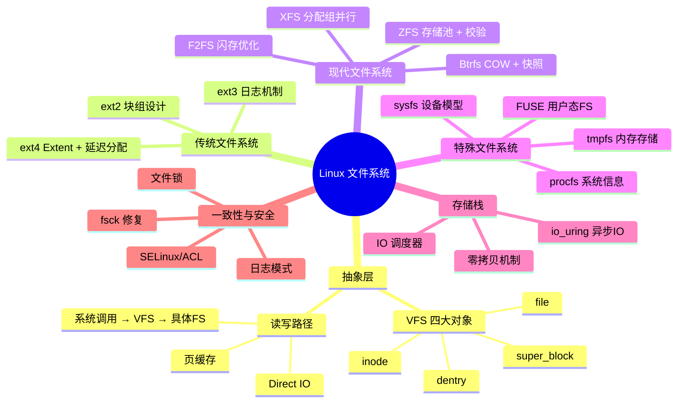
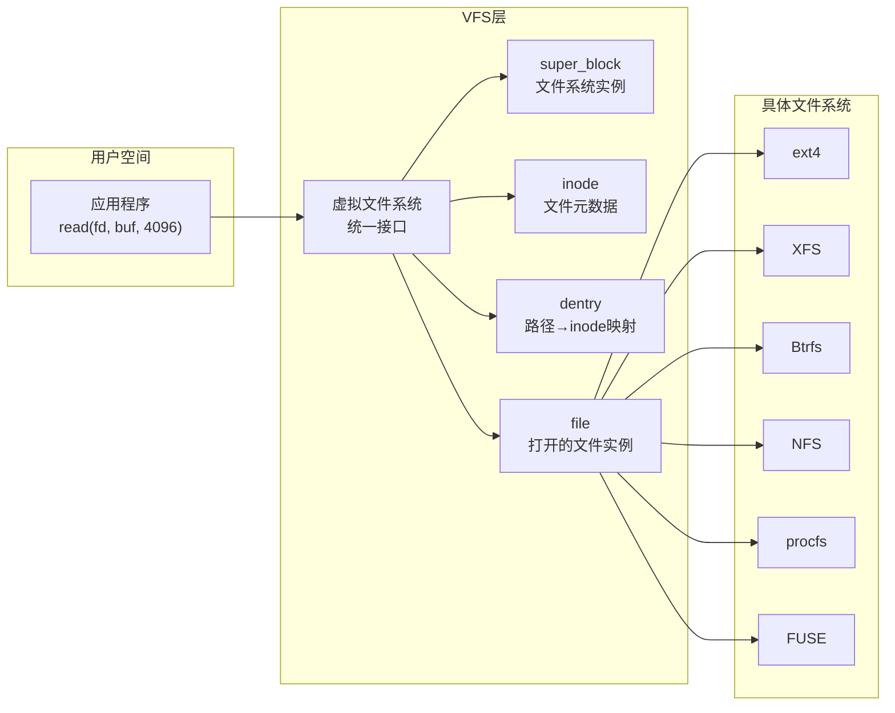
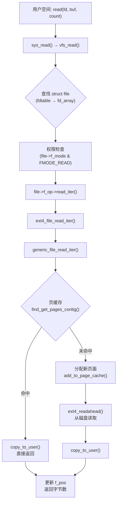
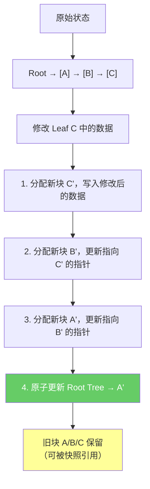
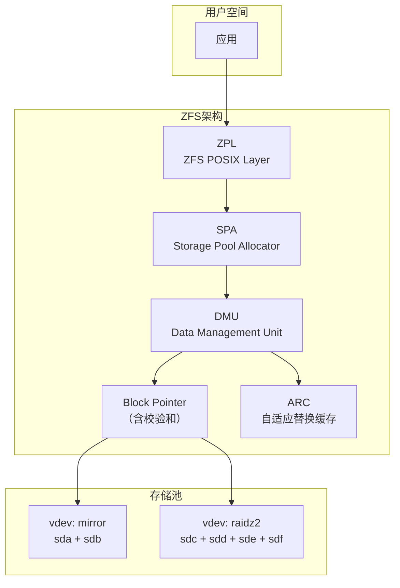
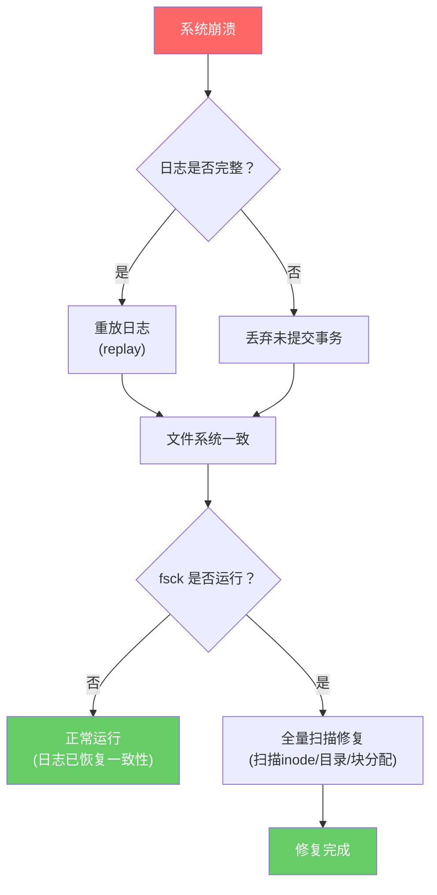
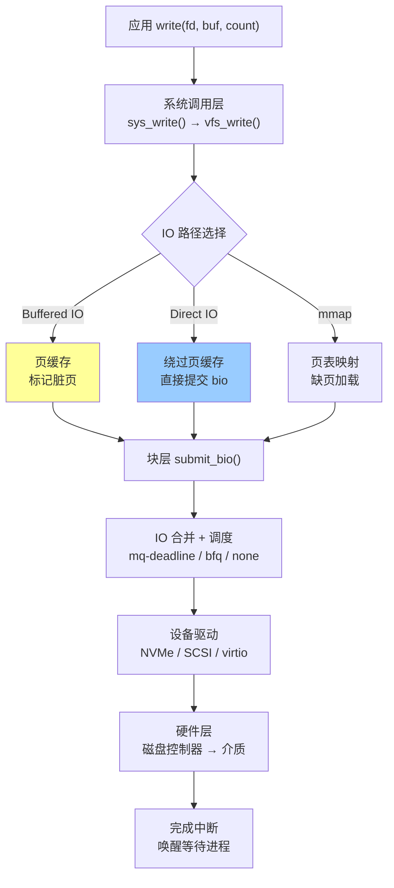
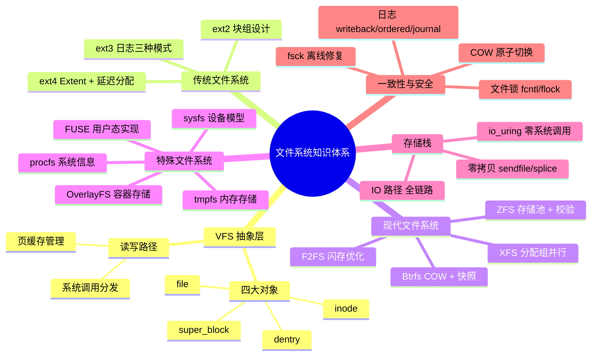

# 第六章 文件系统

## 章节定位

文件系统是操作系统中最古老、最核心的子系统之一——它直接决定了数据如何被组织、检索、共享和保护。从 1970 年代 Ken Thompson 为 Unix 设计的第一个文件系统，到 2020 年代 ZFS 与 Btrfs 的端到端数据完整性保护，文件系统的演进史就是计算机存储技术的缩影。

在 Linux 生态中，文件系统的地位尤为特殊：VFS（虚拟文件系统）抽象层使得同一个内核可以同时支持 ext4、XFS、Btrfs、NFS、procfs、sysfs 等数十种文件系统——这种"万物皆文件"的设计哲学，是 Unix/Linux 系统简洁性和统一性的基石。

对系统工程师而言，文件系统的选择和调优直接影响：
- **数据库性能**：MySQL InnoDB 的 O_DIRECT + fsync 策略、WAL 日志的落盘时机
- **容器密度**：OverlayFS 的层叠效率、镜像层共享比例
- **数据安全**：日志模式选择、快照策略、校验和验证
- **存储成本**：在线压缩、去重、RAID 冗余比

本章将从 VFS 抽象层出发，深入 ext2/3/4、Btrfs、XFS、ZFS、F2FS 等主流文件系统的内部实现，覆盖从磁盘布局到 IO 路径的完整知识体系。



## 核心问题

本章围绕以下核心问题展开：

1. **抽象层如何统一多样性？** Linux 通过 VFS 层为数十种文件系统提供统一接口——同一个 `read()` 系统调用，底层可以是 ext4 的 B-tree 查找、NFS 的网络 RPC、procfs 的内核数据生成。这种面向对象的 C 语言实现（函数指针表 = 虚函数表）如何做到高效且可扩展？
2. **数据布局如何决定性能？** ext4 的块组 + extent、Btrfs 的 B-tree + COW、XFS 的分配组并行、ZFS 的存储池——不同的数据布局方案在小文件、大文件、随机 IO、顺序 IO 等场景下各有怎样的性能特征？选型的决策依据是什么？
3. **一致性如何在性能与安全之间平衡？** 日志的三种模式（writeback/ordered/journal）各有取舍：writeback 最快但可能丢失数据，journal 最安全但性能减半。COW 文件系统通过"永不覆写"天然保证一致性，但代价是什么？
4. **现代 IO 范式如何重塑文件系统？** io_uring 通过共享环形缓冲区实现零系统调用批量提交，sendfile/splice 实现零拷贝数据传输——这些新技术如何影响文件系统的设计和使用方式？

## 内容结构

| 节次 | 标题 | 核心内容 |
|------|------|----------|
| 01 | 理论基础 | VFS 四大对象与读写路径、ext2/3/4 演进、Btrfs COW 与快照、XFS 分配组、ZFS 存储池、F2FS 闪存优化、伪文件系统（procfs/sysfs/devtmpfs/tmpfs）、FUSE、OverlayFS、一致性机制、存储栈 IO 路径与 io_uring、零拷贝机制、文件锁 |
| 02 | 核心技巧 | 文件系统选型决策矩阵、调优参数、IO 调度器配置、存储栈优化、快照实战、性能基准测试 |
| 03 | 实战案例 | 高并发文件服务、数据库服务器、嵌入式系统、容器存储优化、分布式文件系统集成 |
| 04 | 常见误区 | fsync 安全性、文件删除真相、延迟分配风险、inode 耗尽、Btrfs 生产成熟度、文件锁兼容性、XFS 小文件性能 |
| 05 | 练习方法 | FUSE 内存文件系统、debugfs 磁盘分析、性能对比测试、内核模块开发、日志机制模拟 |
| 06 | 本章小结 | 关键概念回顾与延伸阅读 |

## 前置知识

- 操作系统基础（进程、虚拟内存、中断、系统调用机制）
- C 语言与数据结构（B-tree、链表、位图、哈希表）
- 块设备与磁盘 IO 基本概念（扇区、块、队列深度、IO 调度）
- Linux 命令行基础（mount/df/stat/find 等常用命令）

## 参考文献

- Robert Love, *Linux Kernel Development*, 4th Edition
- Daniel P. Bovet & Marco Cesati, *Understanding the Linux Kernel*, 3rd Edition
- W. Richard Stevens, *Advanced Programming in the UNIX Environment*
- Arpaci-Dusseau, *Operating Systems: Three Easy Pieces* (File System chapters)
- Jonathan Corbet, Alessandro Rubini & Greg Kroah-Hartman, *Linux Device Drivers*, 3rd Edition


***

# 01 理论基础：文件系统

## 1. 虚拟文件系统（VFS）

### 1.1 VFS 的设计动机

Linux 系统同时支持数十种文件系统——ext4、XFS、Btrfs、NFS、procfs、sysfs 等。VFS（Virtual File System）是内核中的一层抽象，它定义了一套统一的接口规范，使得上层应用无需关心底层文件系统的具体实现。

VFS 的核心思想是**面向对象设计在 C 语言中的实践**：通过函数指针表（类似于 C++ 的虚函数表）实现多态。每种文件系统只需实现 VFS 定义的接口，就能无缝接入 Linux 的文件系统框架。



### 1.2 VFS 四大核心对象

VFS 通过四个核心数据结构来管理文件系统：

#### 1.2.1 super_block（超级块）

`super_block` 代表一个已挂载的文件系统实例，包含文件系统的全局元数据。

```c
// fs/fs.h (简化)
struct super_block {
    struct list_head    s_list;          // 超级块链表
    dev_t               s_dev;           // 设备标识符
    unsigned long       s_blocksize;     // 块大小（字节）
    loff_t              s_maxbytes;      // 最大文件大小
    struct file_system_type *s_type;     // 文件系统类型
    const struct super_operations *s_op; // 超级块操作函数表
    struct dentry       *s_root;         // 根目录项
    struct block_device *s_bdev;         // 底层块设备
    void                *s_fs_info;      // 具体文件系统私有数据
    // ... 更多字段
};
```

**super_operations** 定义了文件系统级别的操作：

```c
struct super_operations {
    struct inode *(*alloc_inode)(struct super_block *sb);
    void (*destroy_inode)(struct inode *);
    void (*dirty_inode)(struct inode *, int flags);
    int (*write_inode)(struct inode *, struct writeback_control *wbc);
    void (*evict_inode)(struct inode *);
    void (*put_super)(struct super_block *);
    int (*sync_fs)(struct super_block *sb, int wait);
    int (*statfs)(struct dentry *, struct kstatfs *);
    int (*remount_fs)(struct super_block *, int *, char *);
    // ...
};
```

当内核挂载一个文件系统时，会调用该文件系统的 `mount()` 方法，创建 `super_block` 实例并初始化 `s_op` 指针。例如 ext4 的挂载流程：

mount("ext4") → ext4_fill_super() → 填充 super_block
    → 读取磁盘上的超级块结构（ext4_super_block）
    → 初始化 s_op = &ext4_sops
    → 创建根 inode 和根 dentry

#### 1.2.2 inode（索引节点）

`inode` 是文件系统中最重要的数据结构，它代表一个文件（或目录、符号链接等）的所有元数据，但**不包含文件名**。

```c
struct inode {
    umode_t             i_mode;          // 文件类型与权限
    kuid_t              i_uid;           // 所有者
    kgid_t              i_gid;           // 所属组
    unsigned int        i_flags;         // 文件系统标志
    const struct inode_operations *i_op; // inode 操作
    const struct file_operations *i_fop; // 默认文件操作
    struct super_block  *i_sb;           // 所属超级块
    struct address_space *i_mapping;     // 页缓存映射
    unsigned long       i_ino;           // inode 号
    loff_t              i_size;          // 文件大小
    struct timespec64   i_atime;         // 访问时间
    struct timespec64   i_mtime;         // 修改时间
    struct timespec64   i_ctime;         // 变更时间
    unsigned short      i_bytes;         // 最后一个块的字节数
    blkcnt_t            i_blocks;        // 占用块数
    union {
        // 特殊类型文件的数据
        struct pipe_inode_info *i_pipe;  // 管道
        struct cdev            *i_cdev;  // 字符设备
        // ...
    };
    void                *i_private;      // 具体文件系统私有数据
};
```

**inode_operations** 定义了 inode 级别的操作：

```c
struct inode_operations {
    struct dentry *(*lookup)(struct inode *, struct dentry *, unsigned int);
    int (*create)(struct mnt_idmap *, struct inode *, struct dentry *, umode_t, bool);
    int (*link)(struct dentry *, struct inode *, struct dentry *);
    int (*unlink)(struct inode *, struct dentry *);
    int (*symlink)(struct mnt_idmap *, struct inode *, struct dentry *, const char *);
    int (*mkdir)(struct mnt_idmap *, struct inode *, struct dentry *, umode_t);
    int (*rmdir)(struct inode *, struct dentry *);
    int (*rename)(struct mnt_idmap *, struct inode *, struct dentry *,
                  struct inode *, struct dentry *, unsigned int);
    int (*permission)(struct mnt_idmap *, struct inode *, int);
    // ...
};
```

**inode 的生命周期**是理解文件系统的关键：

1. **分配**：创建新文件时，文件系统在磁盘上分配一个空闲 inode，并在内存中创建 `struct inode`
2. **读取**：首次访问文件时，从磁盘读取 inode 信息到内存，加入 inode 缓存（`inode_hashtable`）
3. **使用**：通过 `i_op` 和 `i_fop` 进行各种操作
4. **写回**：脏 inode 被周期性写回磁盘（由 `writeback` 机制驱动）
5. **释放**：引用计数为零时，inode 从缓存中回收

#### 1.2.3 dentry（目录项）

`dentry` 代表目录树中的一个路径节点，它的核心作用是**将文件名映射到 inode**，并维护目录树的结构。

```c
struct dentry {
    struct dentry           *d_parent;    // 父目录项
    struct qstr             d_name;       // 文件名（快速字符串）
    struct inode            *d_inode;     // 关联的 inode
    const struct dentry_operations *d_op; // 目录项操作
    struct super_block      *d_sb;        // 所属超级块
    unsigned char           d_iname[DNAME_INLINE_LEN]; // 短文件名内联存储
    struct list_head        d_child;      // 父目录的子项链表
    struct list_head        d_subdirs;    // 子目录链表
    // ... 哈希表相关字段
};
```

**Dentry 缓存（dcache）** 是 Linux 文件系统性能的关键优化。当进程解析路径 `/home/user/file.txt` 时：

dentry 查找流程:
    "/" → "home" → "user" → "file.txt"

    每一步都先查 dcache（哈希表查找，O(1)）
    命中 → 直接返回 dentry
    未命中 → 调用 inode->i_op->lookup() 从磁盘读取
           → 创建新 dentry 加入 dcache

dcache 采用**负向缓存**（negative dentry）：如果查找一个不存在的文件名，也会缓存这个"不存在"的结果，避免重复的磁盘查找。

#### 1.2.4 file（文件对象）

`file` 代表一个**已打开的文件**，它是进程与文件之间的桥梁。同一个 inode 可以对应多个 file（多个进程打开同一个文件）。

```c
struct file {
    struct path             f_path;       // 包含 vfsmount 和 dentry
    struct inode            *f_inode;     // 关联的 inode
    const struct file_operations *f_op;   // 文件操作函数表
    atomic_long_t           f_count;      // 引用计数
    unsigned int            f_flags;      // 打开标志（O_RDONLY 等）
    fmode_t                 f_mode;       // 文件模式
    loff_t                  f_pos;        // 当前读写位置
    struct address_space    *f_mapping;   // 页缓存映射
    void                    *private_data; // 驱动私有数据
};
```

**file_operations** 是用户空间最常接触的操作表：

```c
struct file_operations {
    loff_t (*llseek)(struct file *, loff_t, int);
    ssize_t (*read)(struct file *, char __user *, size_t, loff_t *);
    ssize_t (*write)(struct file *, const char __user *, size_t, loff_t *);
    __poll_t (*poll)(struct file *, struct poll_table_struct *);
    long (*unlocked_ioctl)(struct file *, unsigned int, unsigned long);
    int (*mmap)(struct file *, struct vm_area_struct *);
    int (*open)(struct inode *, struct file *);
    int (*flush)(struct file *, fl_owner_t id);
    int (*release)(struct inode *, struct file *);
    int (*fsync)(struct file *, loff_t, loff_t, int datasync);
    ssize_t (*read_iter)(struct kiocb *, struct iov_iter *);
    ssize_t (*write_iter)(struct kiocb *, struct iov_iter *);
    // ...
};
```

### 1.3 VFS 读写路径

以 `read()` 系统调用为例，完整的 VFS 路径：

用户空间: read(fd, buf, count)
    │
    ▼
系统调用入口: sys_read() / ksys_read()
    │
    ▼
VFS层: vfs_read()
    ├── 通过 fd 查找 struct file（fdtable → fd_array）
    ├── 权限检查（file->f_mode & FMODE_READ）
    ├── 调用 file->f_op->read_iter() 或 file->f_op->read()
    │
    ▼
具体文件系统（以 ext4 为例）:
    ext4_file_read_iter()
        ├── generic_file_read_iter()
        │   ├── file_accessed()  // 更新 atime
        │   ├── filemap_read()   // 通过页缓存读取
        │   │   ├── find_get_pages_contig()  // 查找页缓存
        │   │   ├── 页缓存命中 → 直接 copy_to_user
        │   │   ├── 页缓存未命中 →
        │   │   │   ├── 分配新页面
        │   │   │   ├── add_to_page_cache()
        │   │   │   ├── ext4_readahead() / ext4_read_folio()  // 从磁盘读取
        │   │   │   └── copy_to_user
        │   │   └── 预读机制（readahead window）
        │   └── 更新文件位置 f_pos
        └── 返回读取字节数



### 1.4 四大对象的关系图

进程A的fd表     进程B的fd表
┌────────┐     ┌────────┐
│ fd[0]──┼──┐  │ fd[0]──┼──┐
│ fd[1]  │  │  │ fd[1]  │  │
└────────┘  │  └────────┘  │
            │              │
            ▼              ▼
        ┌──────┐      ┌──────┐
        │ file │      │ file │  (不同的读写位置)
        │ f_pos│      │ f_pos│
        └──┬───┘      └──┬───┘
           │              │
           └──────┬───────┘
                  ▼
            ┌──────────┐
            │  dentry  │  (文件名 ↔ inode 映射)
            │  d_name  │
            └────┬─────┘
                 ▼
            ┌──────────┐
            │   inode  │  (元数据)
            │  i_size  │
            │  i_mode  │
            └────┬─────┘
                 ▼
            ┌──────────┐
            │super_block│ (文件系统全局信息)
            │  s_block  │
            │  size     │
            └──────────┘

***

## 2. ext2/ext3/ext4 文件系统

### 2.1 ext2 磁盘布局

ext2 是 Linux 上第一个广泛使用的日志文件系统（虽然 ext2 本身没有日志）。它的磁盘布局清晰而经典：

┌────────┬──────────┬──────────┬──────────┬─────┬──────────┐
│ Boot   │  Block   │  Block   │  Block   │ ... │  Block   │
│ Block  │ Group 0  │ Group 1  │ Group 2  │     │ Group N  │
└────────┴──────────┴──────────┴──────────┴─────┴──────────┘

每个块组的内部结构：
┌──────────┬──────────┬──────────┬──────────┬──────────┬──────────┐
│  Super   │  Group   │  Block   │  Inode   │   Inode   │  Data    │
│  Block   │  Desc.   │  Bitmap  │  Bitmap  │   Table   │  Blocks  │
└──────────┴──────────┴──────────┴──────────┴──────────┴──────────┘

- **Super Block**：存储文件系统全局信息（块大小、inode 总数、块总数、空闲计数等），在每个块组中有备份
- **Group Descriptor Table**：描述每个块组的元数据位置
- **Block Bitmap**：位图标记每个块的使用/空闲状态
- **Inode Bitmap**：位图标记每个 inode 的使用/空闲状态
- **Inode Table**：存储该块组所有 inode 的磁盘结构
- **Data Blocks**：实际存储文件数据和目录内容

### 2.2 ext2 inode 与数据块寻址

ext2 的磁盘 inode 结构（`struct ext2_inode`）中，有 12 个直接指针、1 个一级间接指针、1 个二级间接指针和 1 个三级间接指针：

直接块寻址（12个直接指针）:
    i_block[0]  → 数据块 0
    i_block[1]  → 数据块 1
    ...
    i_block[11] → 数据块 11

一级间接寻址:
    i_block[12] → 间接块 → [数据块地址, 数据块地址, ...]

二级间接寻址:
    i_block[13] → 间接块 → [间接块地址, ...] → [数据块地址, ...]

三级间接寻址:
    i_block[14] → 间接块 → [间接块地址, ...] → [间接块地址, ...] → [数据块地址, ...]

以 4KB 块大小为例：
- 每个块指针 4 字节，一个块可存放 1024 个指针
- 直接寻址：12 × 4KB = 48KB
- 一级间接：1024 × 4KB = 4MB
- 二级间接：1024 × 1024 × 4KB = 4GB
- 三级间接：1024 × 1024 × 1024 × 4KB = 4TB

这种设计简单直观，但对于大文件存在**严重的碎片化问题**——读取一个大文件可能需要大量随机 IO 来追踪间接块。

### 2.3 ext3：引入日志机制

ext3 在 ext2 基础上增加了日志（journal）功能，解决了崩溃后的一致性问题。

**日志的三种模式**：

1. **journal（完整日志）**：元数据和数据都写入日志
   - 最安全，但性能最差（数据写两次）
   - 适用场景：对数据完整性要求极高的环境

2. **ordered（顺序模式，默认）**：只有元数据写入日志，但保证数据先于元数据落盘
   - 安全性与性能的良好平衡
   - 保证文件数据不会引用未初始化的磁盘块
   - 适用场景：绝大多数生产环境

3. **writeback（回写模式）**：只有元数据写入日志，数据落盘时机不确定
   - 性能最好，但崩溃后可能出现旧数据块被新文件引用的情况
   - 适用场景：对性能要求高于数据完整性的场景

**日志写入流程（ordered 模式）**：

write() 调用:
    1. 数据写入页缓存（page cache）
    2. 触发日志事务提交:
       a. 将元数据变更写入日志区（JBD2 journal）
       b. 等待数据块落盘（data flush）
       c. 将日志 commit record 写入日志区
       d. 回写元数据到最终位置
    3. 事务完成，日志空间可回收

崩溃恢复:
    - 扫描日志区，找到最后一个完整的事务
    - 重放（replay）该事务的元数据变更
    - 因为 ordered 模式保证数据先于元数据，所以恢复后状态一致

### 2.4 ext4：现代化改造

ext4 是当前 Linux 发行版默认的文件系统，它在 ext3 基础上进行了大量改进：

#### 2.4.1 Extent 替代间接块

ext4 使用 **extent tree** 替代了 ext2/ext3 的间接块寻址。一个 extent 描述一段连续的数据块：

```c
struct ext4_extent {
    __le32  ee_block;      // 逻辑块号（起始）
    __le16  ee_len;        // extent 长度（块数，最大 32768）
    __le16  ee_start_hi;   // 物理块号高 16 位
    __le32  ee_start_lo;   // 物理块号低 32 位
};
```

传统间接块 (ext2/ext3):
    查找第 100000 个块 → 追踪三级间接 → 4 次磁盘读取

Extent 树 (ext4):
    查找第 100000 个块 → 在 extent 树中二分查找 → 通常 1-2 次磁盘读取

Extent 树结构（inode 中的 i_block 字段）:
┌─────────────────────────────────────────────┐
│ ext4_extent_header (eh_entries=3, eh_depth=0)│  ← 叶子节点
│ ext4_extent [block 0, len=10000, phys=50000] │
│ ext4_extent [block 10000, len=20000, phys=80000] │
│ ext4_extent [block 30000, len=5000, phys=200000] │
└─────────────────────────────────────────────┘

当 extent 数超过 inode 空间时，构建 B-tree:
┌───────────────────────────────────┐
│ ext4_extent_header (depth=1)      │
│ ext4_extent_idx → 叶子节点块 1    │
│ ext4_extent_idx → 叶子节点块 2    │
│ ext4_extent_idx → 叶子节点块 3    │
└───────────────────────────────────┘

#### 2.4.2 延迟分配（Delayed Allocation）

ext4 不在 `write()` 时立即分配磁盘块，而是将数据暂存在页缓存中，等到真正需要写回磁盘时才分配。这带来了两个好处：

1. **减少碎片**：内核知道完整的写入模式，可以分配更合理的连续块
2. **提高性能**：合并小写入，减少元数据更新次数

传统分配（ext2/ext3 writeback 模式）:
    write("hello") → 立即分配块 A → 写入
    write("world") → 立即分配块 B → 写入  （A 和 B 可能不连续）

延迟分配（ext4）:
    write("hello") → 标记页缓存为脏页
    write("world") → 标记页缓存为脏页
    ... (更多写入)
    pdflush/writeback → 分配连续块 C → 一次性写入 "helloworld..."

#### 2.4.3 多块分配器（Multi-Block Allocator）

ext4 的多块分配器（mballoc）可以一次性分配多个连续的块，配合延迟分配显著减少碎片：

```c
// 分配请求示例
ext4_mb_new_blocks(handle, &amp;ar);  // ar.ar_goal = 起始目标块
// mballoc 会在块组中寻找最大的连续空闲区域
```

#### 2.4.4 其他改进

- **纳秒级时间戳**：支持文件的创建时间（birth time）
- **大文件支持**：最大文件大小 16TB，最大文件系统大小 1EB
- **在线碎片整理**：`e4defrag` 工具
- **inode 扩展**：支持更大的 inode（256 字节或更多），可内联小文件数据
- **元数据校验和**：inode、目录项、超级块等均支持校验和验证，配合 `e2fsck` 可检测静默数据损坏
- **内联数据**：小于 ~160 字节的小文件数据直接存储在 inode 的 i_block 字段中，无需分配额外数据块
- **排除预留空间**：非 root 用户默认可使用全部可用空间（`tune2fs -m` 调整预留比例）

### 2.5 主流文件系统横向对比

| 特性 | ext4 | XFS | Btrfs | ZFS | F2FS |
|------|------|-----|-------|-----|------|
| 设计理念 | 块组+extent | 分配组并行 | COW+B-tree | 存储池+校验 | 日志结构+冷热分离 |
| 最大文件大小 | 16 EB | 8 EB | 16 EB | 16 EB+ | 16 EB |
| 日志/一致性 | 日志(ordered默认) | 元数据日志 | COW原子切换 | COW+校验 | Checkpoint |
| 快照支持 | ❌(需LVM) | ❌(需LVM) | ✅ 零成本 | ✅ 零成本 | ❌ |
| 在线压缩 | ❌ | ❌ | ✅ zstd/lzo | ✅ lz4/zstd | ✅ lzo/zstd |
| RAID内建 | ❌(需mdadm) | ❌(需mdadm) | ✅ RAID 0/1/10 | ✅ RAID-Z | ❌ |
| 数据校验 | ❌ | ❌ | ✅ 端到端 | ✅ 端到端 | ❌ |
| 碎片整理 | e4defrag | xfs_fsr | btrfs filesystem defragment | ❌ | ❌(GC) |
| 适合场景 | 通用/数据库 | 大文件/高吞吐 | 快照/备份/NAS | 数据完整性 | SSD/闪存 |
| 生产成熟度 | ★★★★★ | ★★★★★ | ★★★★ | ★★★★(Linux) | ★★★★ |

***

## 3. Btrfs（B-tree File System）

### 3.1 设计哲学

Btrfs 是 Oracle 主导开发的下一代 Linux 文件系统，核心设计原则：

1. **COW（Copy-on-Write）**：永远不原地覆写数据，每次修改都写入新位置
2. **B-tree 统一管理**：所有数据结构（元数据、数据引用、校验和）都用 B-tree 组织
3. **池化存储**：多个物理设备组成存储池（storage pool），统一管理
4. **端到端数据完整性**：对所有数据和元数据计算校验和
5. **快照与子卷**：零成本创建文件系统快照

### 3.2 核心数据结构

#### 3.2.1 B-tree 结构

Btrfs 中所有的元数据都存储在 B-tree 中，每棵 B-tree 都有自己的根节点：

Btrfs 的主要 B-tree:
┌─────────────────────────────────────────────────┐
│ Root Tree (tree 5)                               │
│   存储其他所有树的根指针，是所有树的入口点         │
├─────────────────────────────────────────────────┤
│ FS Tree (tree 256)                               │
│   存储文件/目录的 inode、目录项、extent 引用      │
├─────────────────────────────────────────────────┤
│ Chunk Tree                                       │
│   逻辑地址 → 物理地址映射                        │
├─────────────────────────────────────────────────┤
│ Extent Tree                                      │
│   物理空间分配信息                                │
├─────────────────────────────────────────────────┤
│ Checksum Tree                                    │
│   数据块校验和                                    │
├─────────────────────────────────────────────────┤
│ Log Tree（每个事务一棵）                          │
│   fsync 快速提交的增量日志                        │
└─────────────────────────────────────────────────┘

#### 3.2.2 COW 机制详解

Btrfs 的 COW 是其最核心的特性：

原始状态:
Root Tree 根 → [node A] → [node B] → [leaf C (数据)]
                   │
                   └→ [leaf D (数据)]

修改 leaf C 中的数据:
1. 分配新块 C'
2. 将 C 的内容复制到 C'，修改数据
3. 分配新块 B'
4. 将 B 复制到 B'，更新指向 C 的指针为 C'
5. 分配新块 A'
6. 将 A 复制到 A'，更新指向 B 的指针为 B'
7. 更新 root tree 中的根指针 → A'
8. 原始块 A、B、C 仍然保留（可能被快照引用）

COW 的好处:
- 天然的崩溃一致性（原子切换根指针）
- 快照几乎零成本（共享未修改的子树）
- 无需日志的 write barrier



### 3.3 快照与子卷

#### 3.3.1 快照原理

Btrfs 快照是整个文件系统在某一时刻的完整视图，创建快照的开销极低：

创建快照前:
FS Tree Root → [A] → [B] → [C]

创建快照:
Snapshot Root → [A]（共享）→ [B]（共享）→ [C]（共享）

快照本质上只是创建了一个新的根指针，指向现有的树节点。
没有数据复制，只有引用计数增加。

后续修改原始文件系统:
FS Tree Root → [A] → [B'] → [C']  (B' 和 C' 是新 COW 块)
Snapshot Root → [A] → [B] → [C]   (仍然指向原始块)

#### 3.3.2 子卷（Subvolume）

子卷是 Btrfs 中的一个独立的文件系统命名空间，可以独立挂载：

```bash
# 创建子卷
btrfs subvolume create /mnt/data/snapshots

# 创建快照
btrfs subvolume snapshot /mnt/data /mnt/data/snapshots/backup-2024

# 创建只读快照
btrfs subvolume snapshot -r /mnt/data /mnt/data/snapshots/backup-ro

# 列出子卷
btrfs subvolume list /mnt

# 删除子卷
btrfs subvolume delete /mnt/data/snapshots/old-backup
```

### 3.4 RAID 支持

Btrfs 内建 RAID 支持，不需要硬件 RAID 或 mdadm：

- **RAID 0**：条带化，提高性能，无冗余
- **RAID 1**：镜像，数据写两份
- **RAID 10**：RAID 1 + RAID 0
- **RAID 5/6**：奇偶校验（仍被认为不够稳定，不推荐生产使用）
- **单 profile / DUP**：元数据默认写两份（DUP），数据写一份（single）

***

## 4. XFS 文件系统

### 4.1 设计目标

XFS 是 Silicon Graphics 在 1993 年开发的高性能日志文件系统，擅长处理大文件和高吞吐量工作负载。Linux 内核从 2.4 版本开始支持 XFS。

### 4.2 分配组（Allocation Group, AG）

XFS 的核心创新是**分配组**——将文件系统划分为多个独立管理的区域：

XFS 磁盘布局:
┌────────┬────────┬────────┬────────┬─────┬────────┐
│  AG 0  │  AG 1  │  AG 2  │  AG 3  │ ... │  AG N  │
└────────┴────────┴────────┴────────┴─────┴────────┘

每个 AG 的内部结构:
┌──────────┬──────────┬──────────┬──────────┬──────────┐
│   AG     │  Free    │  Free    │  Inode   │   B+tree │
│  Super   │  Space   │  Space   │  B+tree  │   (数据  │
│  Block   │  B+tree  │  B+tree  │  (inode  │   区域)  │
│          │  (数据)  │  (inode) │  信息)   │          │
└──────────┴──────────┴──────────┴──────────┴──────────┘

每个 AG 有自己的锁和管理结构，多个 AG 可以**并行操作**，这是 XFS 高并发性能的关键：

```c
// XFS 的 AG 锁机制
struct xfs_perag {
    atomic_t        pag_ref;        // 引用计数
    uint8_t         pagf_levels[3]; // B-tree 层级
    spinlock_t      pagb_lock;      // 预留锁
    // ...
};
```

### 4.3 日志机制

XFS 使用元数据日志（metadata journal），日志区是文件系统内部的专用区域：

日志写入流程:
1. 修改元数据前，先将变更记录写入日志
2. 日志写入完成后，修改实际元数据
3. 日志标记为可覆盖

日志结构:
┌──────────┬──────────┬──────────┬──────────┐
│ Log      │ Log      │ Log      │ Log      │
│ Record 1 │ Record 2 │ Record 3 │ Record 4 │
│ (start)  │ (data)   │ (commit) │ (unmount)│
└──────────┴──────────┴──────────┴──────────┘

### 4.4 延迟日志（Delayed Logging）

XFS 的延迟日志优化将多个小的元数据变更合并到内存中，一次性写入日志：

传统日志:
    操作1 → 写日志 → 操作2 → 写日志 → 操作3 → 写日志
    (3次日志写入)

延迟日志:
    操作1 → 内存缓冲区
    操作2 → 内存缓冲区
    操作3 → 内存缓冲区
    → 一次性写入日志 (1次日志写入)

### 4.5 高性能特性

- **B+树索引**：空闲空间和 inode 都用 B+树索引，查找效率高
- **直接 IO 路径优化**：大文件 IO 可以绕过页缓存
- **动态 inode 分配**：不需要固定大小的 inode 表，按需分配
- **在线 resize**：支持在线扩大文件系统
- **reflink**：支持引用链接（类似于 COW 快照的文件级别版本）

***

## 5. ZFS

### 5.1 设计理念

ZFS 由 Sun Microsystems 开发（2005 年），其核心理念是"数据永远不应该损坏"。ZFS 将传统文件系统和卷管理器合二为一：

传统架构:
    应用 → 文件系统 → 卷管理器(LVM) → RAID控制器 → 磁盘

ZFS 架构:
    应用 → ZFS（文件系统 + 卷管理 + RAID） → 磁盘



### 5.2 存储池（Zpool）

ZFS 的存储模型基于存储池：

```bash
# 创建存储池（mirror 模式）
zpool create tank mirror sda sdb

# 创建存储池（RAID-Z 模式）
zpool create tank raidz1 sda sdb sdc sdd

# 创建存储池（条带化 + 镜像）
zpool create tank mirror sda sdb mirror sdc sdd

# 查看池状态
zpool status tank
```

### 5.3 数据完整性

ZFS 对所有数据块计算校验和，并在读取时验证：

写入流程:
1. 计算数据块的校验和（SHA-256、Fletcher-4 等）
2. 将校验和存储在父节点的指针中
3. 写入数据块

读取流程:
1. 读取数据块
2. 计算校验和
3. 与存储的校验和对比
4. 不匹配 → 尝试从冗余副本恢复
5. 无法恢复 → 报告 IO 错误

校验和存储在 B-tree 的父节点指针中:
父节点: [ptr_to_child (包含校验和)]
子节点: [数据块]

### 5.4 RAID-Z

RAID-Z 是 ZFS 特有的 RAID 实现，避免了传统 RAID 5/6 的"写入漏洞"（write hole）：

RAID-Z1（单盘容错）:
    数据盘1  数据盘2  数据盘3  校验盘(P)
    ┌─────┬─────┬─────┬─────┐
    │ D1  │ D2  │ D3  │ P   │
    │ D4  │ D5  │ P   │ D6  │
    │ D7  │ P   │ D8  │ D9  │
    └─────┴─────┴─────┴─────┘

RAID-Z2（双盘容错）:
    数据盘1  数据盘2  校验盘(P)  校验盘(Q)
    ┌─────┬─────┬─────┬─────┐
    │ D1  │ D2  │ P   │ Q   │
    │ D3  │ P   │ Q   │ D4  │
    └─────┴─────┴─────┴─────┘

RAID-Z 采用**可变宽度条带**，每个条带的大小根据写入数据量动态调整，避免了传统 RAID 的"读-改-写"问题。

### 5.5 ARC 缓存

ZFS 的 ARC（Adaptive Replacement Cache）是一种自适应缓存算法，比传统的 LRU 更智能：

ARC 缓存结构:
┌─────────────────────────────────────────────┐
│                  ARC Cache                   │
├─────────────────────┬───────────────────────┤
│   MRU (Most Recently│  MFU (Most Frequently │
│   Used)             │  Used)                │
│   最近访问过一次     │  频繁访问             │
├─────────────────────┼───────────────────────┤
│   Ghost MRU         │  Ghost MFU            │
│   (被驱逐的 MRU     │  (被驱逐的 MFU        │
│    的元数据)         │   的元数据)           │
└─────────────────────┴───────────────────────┘

工作原理:
- MRU 跟踪最近访问的数据（时间局部性）
- MFU 跟踪频繁访问的数据（频率局部性）
- Ghost 列表记录被驱逐项的元信息，用于自适应调整比例
- 当 MRU 命中率高时，增加 MRU 的比例
- 当 MFU 命中率高时，增加 MFU 的比例

***

## 6. F2FS 与 LFS

### 6.1 LFS（Log-structured File System）

LFS 的核心思想是将所有写入（数据和元数据）按日志方式顺序追加：

传统文件系统写入:
    随机写 inode → 随机写数据块 → 随机写位图
    (大量随机 IO)

LFS 写入:
    顺序追加: [数据1][inode1][数据2][inode2][数据3][inode3]...
    (全部顺序 IO，适合闪存)

### 6.2 F2FS（Flash-Friendly File System）

F2FS 是 Samsung 为闪存设备（SSD、eMMC、SD 卡）设计的文件系统：

#### 6.2.1 日志结构与多头写入

F2FS 采用日志结构，但使用**六个活跃段**来并行写入不同类型的数据：

F2FS 的六种活跃段:
┌─────────────┬────────────────────────────────┐
│ Active Log  │ 用途                           │
├─────────────┼────────────────────────────────┤
│ HOT_NODE    │ 直接节点（频繁更新的元数据）     │
│ WARM_NODE   │ 间接节点（较稳定的元数据）       │
│ COLD_NODE   │ 间接节点（很少更新的元数据）     │
│ HOT_DATA    │ 目录数据（频繁更新）            │
│ WARM_DATA   │ 普通文件数据                    │
│ COLD_DATA   │ 多媒体数据、归档数据            │
└─────────────┴────────────────────────────────┘

冷热分离的好处:
- 减少 GC（垃圾回收）时的数据移动
- 相同生命周期的数据放在一起
- 提高闪存的写入放大比（WAF）

#### 6.2.2 内部架构

F2FS 磁盘布局:
┌────────┬────────┬────────┬────────┬────────┬────────┐
│ Super  │ Check  │ SIT    │ NAT    │ SSA    │ Main   │
│ Block  │ Point  │ (Seg.  │ (Node  │ (Seg.  │ Area   │
│        │        │ Info   │ Addr   │ Summ.  │ (数据) │
│        │        │ Table) │ Table) │ Area)  │        │
└────────┴────────┴────────┴────────┴────────┴────────┘

关键数据结构:
- SIT (Segment Information Table): 每个 segment 的有效块位图
- NAT (Node Address Table): inode 号 → 物理地址映射
- SSA (Segment Summary Area): segment 中每个块的元数据
- Checkpoint: 文件系统的一致性快照点

#### 6.2.3 垃圾回收（GC）

F2FS 的 GC 是日志结构文件系统的核心挑战：

GC 触发条件:
    当空闲 segment 数量低于阈值时触发

GC 过程:
    1. 选择 victim segment（有效块最少的 segment）
    2. 读取 victim segment 中的有效块
    3. 将有效块写入当前活跃 segment
    4. 更新 NAT 中的地址映射
    5. 将 victim segment 标记为可回收

GC 优化:
- 前台 GC（foreground GC）: 同步执行，可能导致延迟抖动
- 后台 GC（background GC）: 异步执行，减少延迟影响
- GC 遍历策略: 贪心算法（选有效块最少的）或 cost-benefit 算法

***

## 7. FUSE（Filesystem in Userspace）

### 7.1 架构

FUSE 允许在用户空间实现文件系统，无需编写内核模块：

FUSE 架构:
┌──────────────────────────────────────────────┐
│               用户空间                        │
│  ┌──────────┐         ┌──────────────────┐   │
│  │ 应用程序 │         │ FUSE 文件系统     │   │
│  │ (Vim等)  │         │ (sshfs, ntfs-3g) │   │
│  └────┬─────┘         └────┬─────────────┘   │
│       │                    │                  │
│       │    /dev/fuse       │                  │
│       │                    │                  │
├───────┼────────────────────┼──────────────────┤
│       │         内核       │                  │
│  ┌────▼─────┐         ┌───▼──────────────┐   │
│  │  VFS     │ ──────► │  FUSE 内核模块    │   │
│  └──────────┘         └──────────────────┘   │
└──────────────────────────────────────────────┘

IO 流程:
1. 应用调用 read("mount_point/file")
2. VFS → FUSE 内核模块
3. FUSE 内核模块将请求放入 /dev/fuse 队列
4. 用户空间 FUSE 守护进程从 /dev/fuse 读取请求
5. FUSE 守护进程处理请求（可能涉及网络、其他文件系统等）
6. FUSE 守护进程将结果写回 /dev/fuse
7. FUSE 内核模块将结果返回给 VFS
8. VFS 返回给应用

### 7.2 FUSE 的使用场景

- **sshfs**: 通过 SSH 挂载远程文件系统
- **ntfs-3g**: 在 Linux 上读写 NTFS 分区
- **GlusterFS**: 分布式文件系统的客户端
- **Android**: 存储访问框架（SAF）使用 FUSE
- **容器存储**: 某些容器运行时使用 FUSE 提供文件系统抽象

### 7.3 FUSE 的性能瓶颈

FUSE 的主要问题是**上下文切换开销**：

传统内核文件系统:
    用户态 → 内核态 → 磁盘IO → 内核态 → 用户态
    (2 次上下文切换)

FUSE:
    用户态(应用) → 内核态(VFS) → 用户态(FUSE daemon)
    → 内核态(/dev/fuse) → 用户态(FUSE daemon)
    → 内核态(/dev/fuse) → 用户态(应用)
    (6+ 次上下文切换)

为解决性能问题，社区开发了 **io_uring FUSE**（Linux 5.18+），利用 io_uring 的零拷贝和内核态轮询机制减少上下文切换。

***

## 8. OverlayFS（联合文件系统）

### 8.1 设计思想

OverlayFS 将多个目录层（layer）联合挂载为一个统一视图，是容器技术的核心文件系统。Docker/Podman 默认使用 overlayfs2 作为存储驱动。

OverlayFS 层次结构:
┌─────────────────────────────────────┐
│           统一挂载点 (merged)        │  ← 用户看到的视图
├─────────────────────────────────────┤
│       upperdir (可写层)             │  ← 容器运行时的修改
├─────────────────────────────────────┤
│       lowerdir (只读层, 可多层)     │  ← 镜像层
├─────────────────────────────────────┤
│       workdir (工作目录)            │  ← 内部操作用
└─────────────────────────────────────┘

读取流程:
    1. 先查 upperdir → 找到则返回
    2. upperdir 没有 → 查 lowerdir（从上到下逐层）
    3. 都没有 → 返回 ENOENT

写入流程 (copy-up):
    1. 写入的文件在 lowerdir 中 → 先复制到 upperdir
    2. 在 upperdir 的副本上执行写入
    3. 后续读取直接从 upperdir 获取

删除流程:
    1. 在 upperdir 创建 whiteout 文件（特殊字符设备）
    2. 读取时遇到 whiteout → 视为文件不存在
    3. 即使 lowerdir 中有同名文件也被遮蔽

### 8.2 容器场景的配置

```bash
# 检查内核是否支持 overlayfs2
lsmod | grep overlay
modprobe overlay

# 手动挂载 OverlayFS
mount -t overlay overlay \
    -o lowerdir=/image/layer1:/image/layer2,upperdir=/container/upper,workdir=/container/work \
    /merged

# Docker/Podman 存储配置 (/etc/docker/daemon.json)
{
    "storage-driver": "overlay2",
    "storage-opts": [
        "overlay2.override_kernel_check=true"
    ]
}

# 查看容器使用的存储驱动
docker info | grep "Storage Driver"
```

### 8.3 性能特征与限制

OverlayFS 的优势:
    - 读取性能接近原生（upperdir 查找是 O(1)）
    - 多层 lowerdir 共享，节省磁盘空间
    - copy-on-write 语义，只有首次写入有开销

OverlayFS 的限制:
    - 不支持跨设备的 lowerdir（所有层必须在同一设备）
    - rename() 在某些情况下受限（跨目录 rename 需要 copy-up）
    - xattr 的行为与普通文件系统不同
    - NFS 作为 lowerdir 时性能较差

与 AUFS 的对比:
    - OverlayFS 是内核内建，AUFS 是外部补丁
    - Docker 18.06+ 默认使用 overlay2（基于 OverlayFS）
    - OverlayFS 代码更简洁，性能更稳定

***

## 9. 伪文件系统与特殊文件系统

除了存储在磁盘上的"真实"文件系统外，Linux 还定义了一系列**伪文件系统（pseudo-filesystem）**和**特殊文件系统**——它们不存储数据到磁盘，而是以内存或内核数据结构为后端，提供系统信息、设备管理、临时存储等关键功能。理解这些文件系统是掌握 Linux 系统管理的基础。

### 9.1 procfs（/proc）

procfs 是 Linux 最重要的伪文件系统，它将内核数据结构以文件形式暴露给用户空间。每个"文件"都是内核数据的动态视图——读取时内核实时生成内容，不存在实际的磁盘存储。

```bash
# 进程信息（每个 PID 一个目录）
ls /proc/1/           # PID 1 的信息
cat /proc/1/status    # 进程状态
cat /proc/1/maps      # 内存映射
cat /proc/1/fd/       # 打开的文件描述符

# 内核全局信息
cat /proc/cpuinfo     # CPU 信息
cat /proc/meminfo     # 内存使用详情
cat /proc/mounts      # 当前挂载信息
cat /proc/filesystems # 支持的文件系统类型
cat /proc/diskstats   # 磁盘 IO 统计
cat /proc/net/dev     # 网络设备统计

# 内核参数（可读写）
cat /proc/sys/vm/dirty_ratio        # 脏页比例阈值
echo 10 > /proc/sys/vm/dirty_ratio  # 动态调整
```

**procfs 的典型用途**：

| 路径 | 内容 | 使用场景 |
|------|------|----------|
| `/proc/PID/status` | 进程状态、内存、线程数 | 监控与调试 |
| `/proc/PID/maps` | 进程内存布局 | 内存分析、安全审计 |
| `/proc/PID/fd/` | 文件描述符符号链接 | 排查文件句柄泄漏 |
| `/proc/PID/io` | 进程 IO 统计 | 定位 IO 热点进程 |
| `/proc/meminfo` | 系统内存详情 | 内存容量规划 |
| `/proc/diskstats` | 块设备 IO 计数器 | 性能监控 |
| `/proc/sys/*` | 内核可调参数 | 系统调优 |
| `/proc/loadavg` | 系统负载均值 | 告警阈值 |

```bash
# 实战：找出打开文件最多的进程
for pid in /proc/[0-9]*/fd; do
    count=$(ls "$pid" 2>/dev/null | wc -l)
    proc=$(cat "${pid%/*}/comm" 2>/dev/null)
    echo "$count $proc (${pid%/*})"
done | sort -rn | head -10

# 实时监控磁盘 IO
watch -n 1 'cat /proc/diskstats | grep sda'
```

### 9.2 sysfs（/sys）

sysfs 是 Linux 2.6 引入的伪文件系统，将设备模型（device model）以树形结构暴露出来。与 procfs 的"大杂烩"不同，sysfs 有清晰的层次结构：

```bash
/sys/
├── block/           # 块设备
│   ├── sda/
│   │   ├── queue/   # IO 队列参数（调度器、队列深度等）
│   │   ├── size     # 设备大小（扇区数）
│   │   └── stat     # 设备统计信息
│   └── nvme0n1/
├── class/
│   ├── net/         # 网络设备
│   ├── tty/         # 终端设备
│   └── block/       # 块设备类别
├── devices/         # 设备树
│   └── system/
│       ├── cpu/
│       └── memory/
└── fs/              # 已挂载文件系统的参数
    ├── ext4/
    ├── btrfs/
    └── f2fs/
```

**sysfs 的核心用途**：

```bash
# IO 调度器管理
cat /sys/block/sda/queue/scheduler        # 查看/切换调度器
echo mq-deadline > /sys/block/sda/queue/scheduler

# 预读设置
cat /sys/block/sda/queue/read_ahead_kb
echo 2048 > /sys/block/sda/queue/read_ahead_kb

# 设备参数
cat /sys/block/sda/queue/nr_requests     # 队列深度
cat /sys/block/sda/queue/max_sectors_kb  # 最大请求大小

# CPU 节能
cat /sys/devices/system/cpu/cpu0/cpufreq/scaling_governor
echo performance > /sys/devices/system/cpu/cpu0/cpufreq/scaling_governor

# 文件系统特定参数
cat /sys/fs/btrfs/*/allocation/data_chunks       # Btrfs 数据 chunk 分配
cat /sys/fs/f2fs/*/gc_urgent_sleep_time          # F2FS GC 频率
```

### 9.3 devtmpfs（/dev）

devtmpfs 在内核启动时自动创建，管理所有设备节点。在 devtmpfs 出现之前，需要 udev 守护进程在用户空间创建 `/dev` 下的设备节点——devtmpfs 将这一过程移到内核态，显著加速启动。

```bash
# 查看 devtmpfs 挂载信息
mount | grep devtmpfs
# devtmpfs on /dev type devtmpfs (rw,nosuid,...)

# 设备节点自动创建机制:
# 内核调用 device_add() → devtmpfs_create_node() → 创建设备文件
# udev 仅需修改权限/符号链接，不再负责创建

# 常见设备节点
ls -la /dev/sda        # 磁盘设备（主设备号 8）
ls -la /dev/nvme0n1    # NVMe 设备
ls -la /dev/tty        # 终端
ls -la /dev/fuse       # FUSE 设备
ls -la /dev/null       # 空设备（写入丢弃，读取 EOF）
ls -la /dev/zero       # 零设备（写入丢弃，读取返回 0x00）
ls -la /dev/random     # 随机数设备（阻塞式）
ls -la /dev/urandom    # 随机数设备（非阻塞式）
```

### 9.4 tmpfs 与 ramfs

两者都是基于内存的文件系统，但设计和行为有重要区别：

| 特性 | tmpfs | ramfs |
|------|-------|-------|
| 存储位置 | 内存 + swap | 纯内存（不使用 swap） |
| 大小限制 | 可通过 size 参数限制 | 无限制，直到 OOM |
| 挂载方式 | `mount -t tmpfs` | `mount -t ramfs` |
| 持久性 | 可通过 swap 持久化 | 完全易失 |
| 典型用途 | /tmp, /run, /dev/shm | 内核内部临时缓冲 |
| 配额管理 | 支持 nr_blocks/nr_inodes | 不支持 |

```bash
# tmpfs 典型用法
mount -t tmpfs -o size=2G tmpfs /tmp         # 限制 2GB
mount -t tmpfs -o size=512M tmpfs /dev/shm   # POSIX 共享内存

# 查看 tmpfs 使用情况
df -h /tmp
df -h /dev/shm

# 系统默认 tmpfs（来自 /etc/fstab）
# tmpfs    /tmp        tmpfs    defaults,noatime,nosuid,nodev,size=2G    0 0
# tmpfs    /run        tmpfs    defaults,noatime,nosuid,nodev,mode=755   0 0
# tmpfs    /dev/shm    tmpfs    defaults,noatime,nosuid,nodev            0 0
```

**tmpfs 的性能优势**：由于数据完全在内存中，tmpfs 的读写速度比任何磁盘文件系统快 10-100 倍。但代价是数据在重启后丢失，且占用的内存会从可用 RAM 中扣除。

### 9.5 debugfs 与 tracefs

```bash
# debugfs：内核开发者使用的调试文件系统
mount -t debugfs none /sys/kernel/debug
ls /sys/kernel/debug/
# 内核子系统在此暴露调试信息（如 ext4 的延迟统计、块层的 IO 追踪）

# tracefs：ftrace 的用户接口
ls /sys/kernel/tracing/
cat /sys/kernel/tracing/available_tracers    # 可用追踪器
echo block > /sys/kernel/tracing/current_tracer  # 启用块层追踪
cat /sys/kernel/tracing/trace_pipe          # 实时查看追踪输出
```

### 9.6 伪文件系统的性能考量

性能特征对比:
┌──────────────┬──────────┬──────────┬──────────┐
│ 文件系统     │ 读延迟   │ 写延迟   │ 持久性   │
├──────────────┼──────────┼──────────┼──────────┤
│ tmpfs        │ ~100ns   │ ~200ns   │ 否       │
│ procfs       │ ~500ns   │ 不支持写 │ N/A      │
│ sysfs        │ ~500ns   │ ~1μs     │ N/A      │
│ ext4 (SSD)   │ ~50μs    │ ~100μs   │ 是       │
│ ext4 (HDD)   │ ~5ms     │ ~10ms    │ 是       │
└──────────────┴──────────┴──────────┴──────────┘

注意: tmpfs 数据保存在 RAM 中，占用的内存不可被内核回收（除非显式卸载或清理文件）
     因此不要在 tmpfs 中存储大量数据，避免挤压应用可用内存

***

## 10. 文件系统一致性

### 10.1 一致性问题的本质

文件系统操作通常涉及多个磁盘写入（例如创建文件需要更新 inode、目录项、位图）。如果系统在写入过程中崩溃，可能导致不一致状态：

创建文件需要写入:
1. 分配 inode → 写 inode 位图
2. 初始化 inode → 写 inode 表
3. 添加目录项 → 写目录数据块
4. 更新目录 inode → 写目录 inode

如果在步骤 2 和 3 之间崩溃:
    - inode 已分配但没有目录项指向它
    - 结果: "孤立 inode"（可通过 fsck 修复）

如果在步骤 3 和 4 之间崩溃:
    - 目录项已添加但 inode 未正确初始化
    - 结果: 指向垃圾数据的目录项

### 10.2 日志机制详解

#### 10.2.1 Writeback 日志模式

写入流程:
1. 将元数据变更写入日志区
2. 等待日志写入完成
3. 将元数据写入最终位置
4. 等待最终写入完成

数据写入时机: 不受日志约束，可能在日志之前或之后

崩溃场景:
    日志已提交 → 重放日志 → 恢复一致性
    日志未提交 → 丢弃未提交的变更

风险: 数据块可能在元数据之后才落盘
    → 文件引用了未初始化的数据块
    → 出现数据损坏

#### 10.2.2 Ordered 日志模式

写入流程:
1. 将数据写入最终位置
2. 等待数据写入完成 ← 关键区别
3. 将元数据变更写入日志区
4. 等待日志写入完成
5. 将元数据写入最终位置

保证: 数据一定先于元数据落盘
    → 元数据引用的数据块一定是有效的
    → 不会出现数据损坏

#### 10.2.3 Journal 日志模式

写入流程:
1. 将数据和元数据都写入日志区
2. 等待日志写入完成
3. 将数据写入最终位置
4. 将元数据写入最终位置

代价: 每个数据块写两次（日志 + 最终位置）
    → 性能下降 50%+
    → 但保证最完整的数据一致性



### 10.3 fsck（File System Check）

fsck 是离线一致性检查和修复工具：

```bash
# ext4 一致性检查
e2fsck -f /dev/sda1

# XFS 一致性检查
xfs_repair /dev/sda1

# Btrfs 一致性检查
btrfs check /dev/sda1
```

fsck 的工作原理：
1. **扫描所有 inode**：检查每个 inode 的类型、大小、块指针
2. **检查目录结构**：确保每个目录项指向有效 inode
3. **检查连接数**：inode 的实际引用数应等于 i_nlink
4. **检查块分配**：每个块只能被一个 inode 引用（共享除外）
5. **修复问题**：连接孤立 inode 到 `lost+found` 目录

***

## 11. 存储栈 IO 路径

### 11.1 完整的 IO 路径



从应用到磁盘的完整 IO 路径：

用户空间
    │ write(fd, buf, count)
    ▼
系统调用层
    │ sys_write() → vfs_write()
    ▼
VFS 层
    │ file->f_op->write_iter()
    ▼
具体文件系统
    │ ext4_file_write_iter()
    ├── 路径1: Buffered IO → 写入页缓存
    │   └── 标记页面为脏页，由 writeback 机制异步写回
    ├── 路径2: Direct IO → 绕过页缓存
    │   └── ext4_direct_IO() → 直接提交 bio
    └── 路径3: mmap + write → 通过页表触发页错误
        └── 缺页处理 → 加载页面到页缓存
    ▼
块层（Block Layer）
    │ submit_bio()
    ├── IO 合并：合并相邻的小 IO
    ├── IO 调度：mq-deadline / bfq / kyber / none
    ├── IO 拆分：超过硬件限制的 IO 拆分为多个请求
    └── 生成 request → 加入设备请求队列
    ▼
设备驱动层
    │ 磁盘控制器驱动（NVMe / SCSI / virtio）
    ▼
硬件层
    │ 磁盘控制器 → 物理存储介质
    ▼
完成中断
    │ 硬件完成 IO → 中断 → 软中断 → bio 完成回调
    ▼
通知上层
    │ 唤醒等待的进程 / 完成 aio

### 11.2 IO 调度器

Linux 内核提供多种 IO 调度器：

#### 11.2.1 mq-deadline

设计目标: 保证 IO 请求在截止时间内完成
实现:
    - 维护两个队列：读队列和写队列
    - 每个请求有截止时间（默认读 500ms，写 5000ms）
    - 优先处理即将到期的请求
    - 在无到期压力时，尝试合并和排序

适用场景: 通用场景，特别是数据库等延迟敏感型应用

#### 11.2.2 BFQ（Budget Fair Queueing）

设计目标: 保证每个进程获得公平的 IO 带宽
实现:
    - 为每个进程维护一个 IO 队列
    - 按进程的 IO 预算（budget）分配带宽
    - 支持 IO 优先级
    - 自适应调整队列深度

适用场景: 桌面系统、交互式应用

#### 11.2.3 none（无调度器）

设计目标: 最小化调度开销
实现:
    - 不做任何调度，直接将请求传递给驱动
    - 依赖硬件自身的调度能力（如 NVMe 的多队列）

适用场景: NVMe SSD 等低延迟存储设备

#### 11.2.4 IO 调度器选型决策

| 场景 | 推荐调度器 | 理由 |
|------|-----------|------|
| 数据库（MySQL/PostgreSQL） | mq-deadline | 保证读写延迟，读优先策略 |
| NVMe SSD 服务器 | none | 硬件多队列已足够，零调度开销 |
| 桌面/交互式系统 | bfq | 公平带宽分配，UI 响应性好 |
| 虚拟化宿主机 | mq-deadline | 平衡多虚拟机的 IO 公平性 |
| 大数据/流处理 | none | 顺序 IO 为主，调度器反成瓶颈 |

### 11.3 io_uring 时代的存储栈

io_uring（Linux 5.1+）是新一代异步 IO 接口，正在重塑存储栈：

传统 AIO 路径:
    应用 -> aio_submit() -> 内核 -> bio -> 块层 -> 设备
    问题: 仍然需要系统调用，每次提交都有用户/内核切换

io_uring 路径:
    应用 -> 共享内存 SQ/CQ -> 内核轮询(polling) -> 直接提交 bio
    优势:
    1. 零系统调用批量提交（SQPOLL 模式）
    2. 无需上下文切换（内核轮询共享环形缓冲区）
    3. 支持链式操作（一次提交多个 IO）
    4. 支持固定缓冲区注册（避免每次 IO 的页表映射）

io_uring 对文件系统的影响:
    - 内核 FUSE 可使用 io_uring 减少上下文切换
    - 数据库（如 RocksDB, SQLite）可使用 io_uring 加速 WAL 写入
    - 网络存储（NFS）可使用 io_uring 优化 RPC 路径

```c
// io_uring 文件 IO 示例
#include <liburing.h>

struct io_uring ring;
io_uring_queue_init(256, &amp;ring, IORING_SETUP_SQPOLL);  // 内核轮询模式

// 批量提交多个读请求
struct io_uring_sqe *sqe;
for (int i = 0; i < batch_size; i++) {
    sqe = io_uring_get_sqe(&amp;ring);
    io_uring_prep_read(sqe, fds[i], bufs[i], sizes[i], offsets[i]);
    io_uring_sqe_set_data(sqe, (void *)(long)i);  // 附带用户数据
}
io_uring_submit(&amp;ring);

// 异步收割完成事件
struct io_uring_cqe *cqe;
unsigned head;
io_uring_for_each_cqe(&amp;ring, head, cqe) {
    int idx = (int)(long)io_uring_cqe_get_data(cqe);
    // 处理第 idx 个 IO 的完成结果
    int result = cqe->res;
}
io_uring_cq_advance(&amp;ring, batch_size);
```

***

## 12. 零拷贝机制

传统的文件 IO 涉及多次数据拷贝：用户空间缓冲区 ↔ 内核页缓存 ↔ 内核套接字缓冲区 ↔ 用户空间接收缓冲区。对于高吞吐场景（如 Web 服务器发送文件、日志转发），这些拷贝成为 CPU 瓶颈。Linux 提供了三种零拷贝机制，消除不必要的数据复制。

### 12.1 传统 IO 的数据拷贝路径

传统 read + send 流程（4 次拷贝 + 4 次上下文切换）:

    用户空间读缓冲区              用户空间发送缓冲区
         ↑ copy_to_user              ↑ copy_to_user
         │                           │
    ┌────┴────┐               ┌──────┴──────┐
    │ 页缓存  │               │ Socket 缓冲区│
    │(磁盘数据)│   copy_from   │  (网络发送)  │
    └────┬────┘    _user      └──────┬──────┘
         │                           │
    ┌────┴────┐               ┌──────┴──────┐
    │ 磁盘    │               │  网卡 DMA   │
    └─────────┘               └─────────────┘

    read(fd, buf, size)        send(sock, buf, size)
    上下文切换: 用户→内核→用户  用户→内核→用户

总拷贝次数: 4 次（磁盘→页缓存→用户buf→socket缓冲区→网卡）
    其中用户空间的 2 次拷贝完全浪费（读进来又原样发出去）

### 12.2 sendfile：文件到网络的零拷贝

`sendfile()` 系统调用将文件数据直接从页缓存传输到网络套接字，消除用户空间的 2 次拷贝：

```c
#include <sys/sendfile.h>

// 基本用法
ssize_t sendfile(int out_fd, int in_fd, off_t *offset, size_t count);

// 实际使用示例
int file_fd = open("large_video.mp4", O_RDONLY);
int sock_fd = socket(AF_INET, SOCK_STREAM, 0);

// 发送整个文件（零拷贝）
off_t offset = 0;
struct stat st;
fstat(file_fd, &amp;st);
sendfile(sock_fd, file_fd, &amp;offset, st.st_size);

// 分块发送（支持范围请求，HTTP 206 Partial Content）
off_t start = 1024;
size_t length = 4096;
sendfile(sock_fd, file_fd, &amp;start, length);
```

sendfile 流程（2 次拷贝 + 2 次上下文切换）:

    ┌─────────┐               ┌──────────────┐
    │ 页缓存  │  DMA gather   │  Socket 缓冲区│
    │(磁盘数据)│─────────────→│  (描述符信息)  │
    └────┬────┘               └──────┬───────┘
         │                           │
    ┌────┴────┐               ┌──────┴──────┐
    │ 磁盘    │               │    网卡     │
    └─────────┘               └─────────────┘

    sendfile(sock_fd, file_fd, &offset, count)
    上下文切换: 用户→内核→用户（仅 2 次）

    关键: 数据从页缓存直接 DMA 到网卡
          Socket 缓冲区只存储描述符（地址+长度），不存储实际数据

### 12.3 splice：管道中转的零拷贝

`splice()` 不要求源和目标都是文件——它通过**管道（pipe）**作为中转站，在任意两个文件描述符之间移动数据：

```c
#include <fcntl.h>

// splice 原型
ssize_t splice(int fd_in, loff_t *off_in, int fd_out,
               loff_t *off_out, size_t len, unsigned int flags);

// 用法1: 管道中转，实现文件到网络的零拷贝
int pipefd[2];
pipe(pipefd);

// 从文件 splice 到管道（零拷贝，数据不经过用户空间）
splice(file_fd, NULL, pipefd[1], NULL, 4096, SPLICE_F_MOVE);

// 从管道 splice 到 socket（零拷贝）
splice(pipefd[0], NULL, sock_fd, NULL, 4096, SPLICE_F_MOVE);

// 用法2: 文件复制（cp 命令的优化版本）
// 传统 cp: read() + write() = 4 次拷贝
// splice cp: 2 次 splice() = 2 次 DMA 拷贝
while (remaining > 0) {
    ssize_t n = splice(src_fd, NULL, pipefd[1], NULL, remaining, SPLICE_F_MOVE);
    splice(pipefd[0], NULL, dst_fd, NULL, n, SPLICE_F_MOVE);
    remaining -= n;
}
```

**splice vs sendfile**：
- sendfile：只能从文件到 socket，接口简单
- splice：通过管道中转，可以在任意两个 FD 之间传输，更灵活但使用更复杂
- 两者都利用 DMA gather 技术，避免 CPU 参与数据拷贝

### 12.4 copy_file_range：文件间零拷贝

Linux 4.5 引入的 `copy_file_range()` 在内核中直接复制文件数据，同一文件系统内甚至可以零拷贝：

```c
#include <unistd.h>

// 原型
ssize_t copy_file_range(int fd_in, loff_t *off_in,
                         int fd_out, loff_t *off_out,
                         size_t len, unsigned int flags);

// 示例：高效文件复制
int src = open("source.bin", O_RDONLY);
int dst = open("dest.bin", O_WRONLY | O_CREAT, 0644);

off_t src_off = 0, dst_off = 0;
struct stat st;
fstat(src, &amp;st);

// 内核可能使用 reflink 或 sendfile 优化
copy_file_range(src, &amp;src_off, dst, &amp;dst_off, st.st_size, 0);
```

copy_file_range 的内核优化路径:

同一文件系统 (如 Btrfs/XFS):
    1. 检查是否支持 reflink
    2. 如果支持 → 仅增加引用计数，零拷贝
    3. 如果不支持 → 使用 splice 内部路径

不同文件系统:
    1. 使用 splice 管道中转
    2. 数据从源页缓存 DMA 到目标页缓存

### 12.5 零拷贝机制对比

| 特性 | sendfile | splice | copy_file_range |
|------|----------|--------|-----------------|
| 源 | 文件 | 任意 FD | 文件 |
| 目标 | Socket | 任意 FD | 文件 |
| 需要管道 | 否 | 是 | 否 |
| 主要场景 | Web 服务器 | 通用数据传输 | 文件复制 |
| 引入版本 | Linux 2.1 | Linux 2.6.17 | Linux 4.5 |
| 典型用户 | Nginx, Apache | PostgreSQL, Redis | cp, dd |
| 零拷贝条件 | 始终 | 始终 | 同一 FS + reflink |

### 12.6 零拷贝在现代应用中的使用

```bash
# Nginx 配置 sendfile
sendfile on;                    # 启用 sendfile
tcp_nopush on;                  # 配合 sendfile，批量发送响应头+数据
tcp_nodelay off;                # 禁用 Nagle 算法（与 tcp_nopush 互斥）

# PostgreSQL 使用 splice 优化 WAL 写入
# 内部通过 splice() 将 WAL 数据从共享缓冲区写入磁盘

# Redis 使用 sendfile 优化 RDB 传输
# 备份传输时使用 sendfile 避免内存拷贝

# 验证零拷贝是否生效（使用 perf）
perf stat -e 'syscalls:sys_enter_sendfile' -a sleep 5
```

***

## 13. 文件锁

### 13.1 POSIX 记录锁（fcntl）

```c
#include <fcntl.h>

// 加锁
struct flock fl = {
    .l_type   = F_WRLCK,    // F_RDLCK（读锁）, F_WRLCK（写锁）, F_UNLCK（解锁）
    .l_whence = SEEK_SET,
    .l_start  = 100,         // 起始偏移
    .l_len    = 50           // 长度（0 表示到文件末尾）
};
fcntl(fd, F_SETLKW, &amp;fl);   // F_SETLK（非阻塞）, F_SETLKW（阻塞）

// 查询锁
fcntl(fd, F_GETLK, &amp;fl);
```

**POSIX 锁的特点**：
- **进程级锁**：锁属于进程，同一进程的不同文件描述符共享锁
- **自动释放**：进程终止时自动释放所有锁
- **细粒度**：可以锁定文件的任意区域
- **继承规则**：子进程不继承父进程的锁

### 13.2 BSD 文件锁（flock）

```c
#include <sys/file.h>

flock(fd, LOCK_SH);   // 共享锁（读锁）
flock(fd, LOCK_EX);   // 排他锁（写锁）
flock(fd, LOCK_UN);   // 解锁
flock(fd, LOCK_EX | LOCK_NB);  // 非阻塞排他锁
```

**flock 的特点**：
- **文件级锁**：锁整个文件，不能锁定部分区域
- **文件描述符级**：锁与文件描述符关联，fork 时子进程继承锁
- **同一文件的所有描述符共享锁**

### 13.3 文件锁的内核实现

内核中的锁管理:
1. 每个 inode 维护一个锁链表（struct file_lock）
2. 加锁时检查是否有冲突的锁
3. 无冲突 → 将新锁加入链表
4. 有冲突 → 阻塞或返回错误
5. 解锁时从链表中删除

锁冲突矩阵:
         请求读锁    请求写锁
已有读锁  允许       阻塞
已有写锁  阻塞       阻塞

重要区别: flock 和 fcntl 锁是两套独立的锁机制
    - flock(fd, LOCK_EX) 和 fcntl(fd, F_SETLKW, &fl) 不会互相排斥
    - 同一文件上可以同时持有 flock 锁和 fcntl 锁
    - 这是常见的陷阱：混用两种锁可能导致数据竞争

***

## 参考文献

1. Love, Robert. *Linux Kernel Development*, 4th Edition. Addison-Wesley, 2010.
2. Bovet, Daniel P., and Marco Cesati. *Understanding the Linux Kernel*, 3rd Edition. O'Reilly, 2005.
3. Arpaci-Dusseau, Remzi H., and Andrea C. Arpaci-Dusseau. *Operating Systems: Three Easy Pieces*. Arpaci-Dusseau Books, 2018.
4. McKusick, Marshall K., et al. "A Fast File System for UNIX." *ACM Transactions on Computer Systems*, 1984.
5. Rosenblum, Mendel, and John K. Ousterhout. "The Design and Implementation of a Log-Structured File System." *ACM Transactions on Computer Systems*, 1992.
6. Rodeh, Ohad, et al. "Btrfs: The Linux B-tree Filesystem." *ACM Transactions on Storage*, 2013.
7. Bonwick, Jeff, and Bill Moore. "ZFS: The Last Word in File Systems." Sun Microsystems, 2003.
8. Lee, Changman, et al. "F2FS: A New File System for Flash Storage." *USENIX FAST*, 2015.


***

# 02 核心技巧：文件系统

## 1. 文件系统选型策略

### 1.1 选型决策矩阵

| 工作负载特征 | 推荐文件系统 | 核心理由 |
|-------------|-------------|---------|
| 通用服务器（混合读写） | ext4 | 成熟稳定，默认选择，ordered 日志平衡安全与性能 |
| 大文件高吞吐（视频、大数据） | XFS | 分配组并行化，大文件顺序 IO 性能卓越 |
| 需要快照/子卷/压缩 | Btrfs | COW 天然支持快照，在线压缩节省空间 |
| 数据完整性要求极高（NAS/归档） | ZFS | 端到端校验，RAID-Z，ARC 缓存 |
| SSD/闪存设备 | F2FS | 闪存友好设计，减少 GC 写入放大 |
| 嵌入式/小分区 | ext4（小配置）/ F2FS | 减少元数据开销 |
| 容器/临时文件系统 | tmpfs / overlayfs | 内存文件系统，零磁盘 IO |

### 1.2 ext4 vs XFS 深度对比

小文件随机写入（如邮件服务器）:
    ext4: ★★★★☆  mballoc 对小文件分配友好
    XFS:  ★★★☆☆  AG 锁开销在小文件场景下略大

大文件顺序读写（如视频转码）:
    ext4: ★★★☆☆  extent 支持好，但 AG 设计不如 XFS
    XFS:  ★★★★★  专为此类场景优化

大量小文件创建（如编译构建）:
    ext4: ★★★★☆  内联数据特性减少小文件 IO
    XFS:  ★★★★☆  动态 inode 分配避免预分配浪费

混合工作负载:
    ext4: ★★★★☆  全能选手
    XFS:  ★★★★☆  大文件场景优势明显

在线管理（resize/defrag）:
    ext4: ★★★☆☆  resize2fs 支持在线扩大
    XFS:  ★★★★☆  xfs_growfs 在线扩大，xfs_fsr 碎片整理

***

## 2. 关键调优参数

### 2.1 挂载参数调优

```bash
# ext4 推荐挂载参数（生产服务器）
mount -o defaults,noatime,nodiratime,barrier=0,data=ordered,nodelalloc \
    /dev/sda1 /data

# 各参数说明:
# noatime      - 不更新文件访问时间，减少元数据写入
# nodiratime   - 不更新目录访问时间
# barrier=0    - 禁用写屏障（仅在有 BBU RAID 控制器时使用）
# data=ordered - 日志模式：数据先于元数据
# nodelalloc   - 禁用延迟分配（对数据库等需要 fsync 的场景有利）
```

```bash
# XFS 推荐挂载参数
mount -o defaults,noatime,logbufs=8,logbsize=256k,allocsize=64m \
    /dev/sdb1 /data

# logbufs=8    - 日志缓冲区数量（默认 8，可增加到 32）
# logbsize=256k - 日志缓冲区大小
# allocsize=64m - 延迟分配的预分配大小
```

```bash
# Btrfs 推荐挂载参数
mount -o defaults,noatime,compress=zstd:3,ssd,space_cache=v2 \
    /dev/nvme0n1p1 /data

# compress=zstd:3  - zstd 压缩，级别 3（平衡压缩率和 CPU 开销）
# ssd              - SSD 优化模式（禁用碎片整理等）
# space_cache=v2   - 使用 v2 空间缓存（提高性能）
```

### 2.2 IO 调度器选择

```bash
# 查看当前调度器
cat /sys/block/sda/queue/scheduler

# 设置调度器
echo mq-deadline > /sys/block/sda/queue/scheduler   # HDD 数据库
echo none > /sys/block/nvme0n1/queue/scheduler       # NVMe SSD
echo bfq > /sys/block/sda/queue/scheduler            # 桌面系统

# 调优 mq-deadline 参数
echo 150 > /sys/block/sda/queue/iosched/read_expire   # 读截止时间(ms)
echo 1500 > /sys/block/sda/queue/iosched/write_expire  # 写截止时间(ms)
echo 8 > /sys/block/sda/queue/iosched/writes_starved   # 每 N 个读允许 1 个写
```

### 2.3 Readahead 调优

```bash
# 查看当前预读值
blockdev --getra /dev/sda
# 例: 256 (表示 256 个扇区 = 128KB)

# 设置预读值（针对大文件顺序读场景）
blockdev --setra 4096 /dev/sda  # 2MB 预读

# 通过 udev 规则持久化
cat > /etc/udev/rules.d/99-readahead.rules << 'EOF'
ACTION=="add|change", KERNEL=="sd[a-z]", ATTR{queue/read_ahead_kb}="2048"
EOF
```

### 2.4 内核参数调优

```bash
# /etc/sysctl.conf

# 脏页回写策略
vm.dirty_ratio = 10                    # 脏页占内存比例达到此值时同步写回
vm.dirty_background_ratio = 5          # 后台回写触发比例
vm.dirty_expire_centisecs = 3000       # 脏页过期时间（30s）
vm.dirty_writeback_centisecs = 500     # 回写线程唤醒间隔（5s）

# VFS 缓存
vm.vfs_cache_pressure = 50             # 降低此值保留更多 dentry/inode 缓存

# IO 调度器队列深度
echo 256 > /sys/block/sda/queue/nr_requests
```

***

## 3. 存储栈优化技巧

### 3.1 文件系统对齐

```bash
# 检查分区对齐（应为 4K 或 1MB 边界对齐)
parted /dev/sda align-check optimal 1

# 使用 1MB 对齐创建分区
parted -a optimal /dev/sda mkpart primary ext4 1MiB 100%

# mkfs 时指定条带参数（针对 RAID）
mkfs.ext4 -E stride=128,stripe-width=384 /dev/sda1
# stride = RAID 条带大小 / 块大小
# stripe-width = stride × 数据盘数

mkfs.xfs -d su=512k,sw=3 /dev/sda1  # XFS 条带对齐
```

### 3.2 直接 IO 与异步 IO

```c
// 直接 IO（绕过页缓存，适合数据库）
int fd = open("data.db", O_RDWR | O_DIRECT);
// 注意：对齐要求——缓冲区地址、偏移量、大小必须是 512 字节的倍数

// 异步 IO（io_uring 方式）
#include <liburing.h>

struct io_uring ring;
io_uring_queue_init(256, &amp;ring, 0);

struct io_uring_sqe *sqe = io_uring_get_sqe(&amp;ring);
io_uring_prep_read(sqe, fd, buf, size, offset);
io_uring_submit(&amp;ring);

struct io_uring_cqe *cqe;
io_uring_wait_cqe(&amp;ring, &amp;cqe);
int result = cqe->res;
io_uring_cqe_seen(&amp;ring, cqe);
```

### 3.3 文件系统空间监控

```bash
# 监控 inode 使用率
df -i /dev/sda1

# 监控块使用率
df -h /dev/sda1

# 监控文件碎片
filefrag -v /data/largefile.db

# 实时 IO 监控
iostat -x 1          # 设备级 IO 统计
iotop -aoP           # 进程级 IO 统计
pidstat -d 1         # 进程 IO 统计

# 块级 IO 追踪
blktrace -d /dev/sda -o - | blkparse -i -
```

***

## 4. 诊断与修复技巧

### 4.1 ext4 调试工具

```bash
# 查看文件系统详细信息
tune2fs -l /dev/sda1

# 查看 inode 详细信息
stat /data/file.txt
debugfs -R 'stat <12345>' /dev/sda1

# 查看文件的 extent 信息
debugfs -R 'map /data/largefile.bin' /dev/sda1

# 查看日志信息
dumpe2fs -h /dev/sda1 | grep -i journal

# 碎片整理
e4defrag /data/
filefrag /data/file.txt  # 查看碎片率
```

### 4.2 XFS 调试工具

```bash
# 查看 XFS 文件系统信息
xfs_info /dev/sdb1

# 查看文件碎片
xfs_db -r -c "inode 12345" -c "bmap" /dev/sdb1

# 碎片整理
xfs_fsr /data/

# 查看 AG 信息
xfs_db -r -c "sb 0" -c "print" /dev/sdb1

# 修复文件系统
xfs_repair -L /dev/sdb1  # 清除日志并修复
```

### 4.3 Btrfs 调试工具

```bash
# 查看文件系统信息
btrfs filesystem show /data

# 查看空间使用详情
btrfs filesystem df /data

# 查看设备统计
btrfs device stats /data

# 查看子卷
btrfs subvolume list /data

# 查看文件校验和
btrfs property get /data/file.txt checksum

# 检查文件系统一致性
btrfs check /dev/sda1  # 离线检查
btrfs scrub start /data  # 在线校验
```

***

## 5. 文件系统快照实战

### 5.1 Btrfs 快照备份方案

```bash
#!/bin/bash
# Btrfs 增量快照备份脚本

MOUNT="/data"
SNAP_DIR="$MOUNT/.snapshots"
DATE=$(date +%Y%m%d_%H%M%S)
KEEP_COUNT=7

# 创建快照目录
mkdir -p "$SNAP_DIR"

# 创建只读快照
btrfs subvolume snapshot -r "$MOUNT" "$SNAP_DIR/snap_$DATE"

# 删除超过保留数量的旧快照
cd "$SNAP_DIR"
ls -1t snap_* | tail -n +$((KEEP_COUNT + 1)) | while read old_snap; do
    btrfs subvolume delete "$SNAP_DIR/$old_snap"
done

# 增量发送到备份设备
LATEST=$(ls -1t snap_* | head -1)
PREVIOUS=$(ls -1t snap_* | head -2 | tail -1)

if [ -n "$PREVIOUS" ]; then
    btrfs send -p "$SNAP_DIR/$PREVIOUS" "$SNAP_DIR/$LATEST" | \
        btrfs receive /backup/
else
    btrfs send "$SNAP_DIR/$LATEST" | btrfs receive /backup/
fi
```

### 5.2 LVM 快照 + ext4 方案

```bash
# 创建 LVM 快照
lvcreate -L 10G -s -n data_snap /dev/vg0/data

# 挂载快照进行备份
mount -o ro /dev/vg0/data_snap /mnt/snapshot
tar czf /backup/data_$(date +%Y%m%d).tar.gz -C /mnt/snapshot .
umount /mnt/snapshot

# 删除快照
lvremove -f /dev/vg0/data_snap
```

***

## 6. 性能基准测试

### 6.1 常用测试工具

```bash
# fio 综合测试
fio --name=seqwrite --rw=write --bs=1M --size=1G --numjobs=4 \
    --ioengine=libaio --direct=1 --runtime=60 --group_reporting

fio --name=randread --rw=randread --bs=4K --size=1G --numjobs=8 \
    --ioengine=io_uring --direct=1 --runtime=60 --iodepth=32

# 文件系统元数据测试
fio --name=create_files --rw=write --bs=4K --size=4K \
    --nrfiles=10000 --openfiles=16 --directory=/data/test \
    --ioengine=sync --fsync=1

# bonnie++ 综合测试
bonnie++ -d /data/test -u root -r 1024 -s 2048
```

### 6.2 测试结果解读

fio 输出关键指标:
    IOPS    = 每秒 IO 操作数（随机小 IO 关注此值）
    BW      = 带宽（顺序大 IO 关注此值）
    lat     = 延迟（us/ms，延迟敏感型关注此值）
    clat p99 = 99 分位延迟（尾延迟，数据库特别关注）

性能瓶颈判断:
    IOPS 低 + 带宽低 → 磁盘性能瓶颈
    IOPS 高 + 延迟高 → IO 调度器或队列深度问题
    CPU 使用率高     → 内核/文件系统开销大（考虑 Direct IO）
    中断过多          → 合并 IO，减少中断

***

## 参考文献

1. Love, Robert. *Linux Kernel Development*, 4th Edition.
2. Bovet, Daniel P., and Marco Cesati. *Understanding the Linux Kernel*, 3rd Edition.
3. "Optimizing Linux File System Performance." *Red Hat Enterprise Linux Performance Tuning Guide*.
4. "XFS User Guide." *SGI Developer Central*.
5. "Btrfs Documentation." *kernel.org Documentation/filesystems/btrfs*.


***

# 03 实战案例：文件系统

## 案例一：高并发文件服务器的文件系统优化

### 场景描述

一个在线文件分享平台，日活用户 500 万，主要操作为：
- 小文件上传（图片、文档，平均 500KB）：日均 200 万次
- 文件下载：日均 5000 万次
- 文件列表查询：日均 2 亿次

现有配置使用 ext4，遇到问题：
1. 小文件创建性能低，上传高峰期延迟飙升
2. inode 耗尽（磁盘空间剩余 40% 但 inode 已满）
3. 目录遍历慢，readdir 操作成为瓶颈

### 问题分析

诊断工具使用:
$ df -i /dev/sda1
Filesystem      Inodes   IUsed   IFree IUse% Mounted on
/dev/sda1      6553600 6553600       0  100% /data

$ stat -f /data/
  File: "/data/"
    ID: 0        Namelen: 255     Type: ext2/ext3
Block size: 4096       Fundamental block size: 4096
Blocks: Total: 26214400  Free: 10485760  Available: 9961472

$ filefrag /data/uploads/00/01/abc123.jpg
/data/uploads/00/01/abc123.jpg: 3 extents found

问题根因:
1. 默认 inode 数量不足（每 16KB 一个 inode）
2. 所有文件放在同一目录，目录项数量超过 10 万导致 B-tree 查找变慢
3. 每个小文件都单独写入，产生大量随机 IO

### 解决方案

```bash
# 方案1: 使用更大的 inode 比例重建文件系统
# 预计算文件数量: 预计存储 5000 万文件
mkfs.ext4 -i 4096 -N 65000000 -O dir_index,extents /dev/sda1
# -i 4096: 每 4KB 一个 inode（默认 16KB）
# -N 65000000: 指定 inode 总数

# 方案2: 目录分片策略（两级哈希目录）
# 原始结构: /data/uploads/abc123.jpg
# 新结构: /data/uploads/00/01/abc123.jpg (hash前两位/次两位/文件名)
#
# 分片脚本:
for file in /data/uploads/*.jpg; do
    hash=$(md5sum "$file" | cut -c1-4)
    dir1=${hash:0:2}
    dir2=${hash:2:2}
    mkdir -p "/data/uploads/$dir1/$dir2"
    mv "$file" "/data/uploads/$dir1/$dir2/"
done

# 方案3: 挂载参数优化
mount -o noatime,nodiratime,data=writeback,nobarrier /dev/sda1 /data
# data=writeback: 对于只读多、写少的场景，提升写入性能
# nobarrier: 仅在有 BBU RAID 控制器时使用
```

### 优化效果

优化前:
    小文件创建: ~2000 IOPS
    目录遍历 (100万文件): ~15 秒
    inode 使用率: 100%

优化后:
    小文件创建: ~8000 IOPS (+300%)
    目录遍历 (分片后每目录 <5000 文件): <0.5 秒 (-97%)
    inode 使用率: 20%

***

## 案例二：数据库服务器的文件系统配置

### 场景描述

一台 MySQL 数据库服务器，InnoDB 引擎，主要特征：
- 数据文件 500GB
- 事务日志（redo log）频繁 fsync
- 混合读写，随机 IO 为主
- 对延迟敏感（要求 P99 < 10ms）

### 文件系统选型与配置

```bash
# 选型: ext4（数据库场景的经典选择）

# 分区布局:
# /dev/sda1 → /data       (数据文件, ext4)
# /dev/sda2 → /log        (日志文件, ext4)
# /dev/sda3 → /tmp        (临时文件, ext4)

# 数据分区格式化（优化大文件随机 IO）
mkfs.ext4 -b 4096 -E stride=128,stripe-width=256 \
    -O extent,dir_index,uninit_bg \
    -J size=1024 \
    -I 256 \
    /dev/sda1

# 挂载参数
mount -o noatime,nodiratime,nobarrier,data=ordered,commit=60 \
    /dev/sda1 /data
# commit=60: 日志提交间隔延长到 60 秒（默认 5 秒）
#   → 减少 fsync 频率，但增加崩溃数据丢失窗口

# IO 调度器
echo mq-deadline > /sys/block/sda/queue/scheduler
echo 50 > /sys/block/sda/queue/iosched/read_expire
echo 500 > /sys/block/sda/queue/iosched/write_expire

# InnoDB 配置配合
# innodb_flush_method = O_DIRECT  # 绕过页缓存，避免双缓冲
# innodb_flush_log_at_trx_commit = 1  # 每次提交 fsync（安全优先）
# innodb_io_capacity = 2000  # 后台 IO 容量
```

### Direct IO 与 Buffered IO 的选择

InnoDB 使用 O_DIRECT 的原因:
    1. 数据文件已经由 InnoDB Buffer Pool 管理缓存
    2. 系统页缓存是冗余的（双缓冲浪费内存）
    3. O_DIRECT 避免内核页缓存的额外拷贝

redo log 使用 fsync 的原因:
    1. redo log 必须在事务提交时持久化
    2. fsync 确保数据从磁盘控制器缓存写入磁盘介质
    3. fdatasync() 只同步数据（不更新元数据），对日志足够

对比:
    Buffered IO:
        write() → 页缓存 → (异步) → 磁盘
        优点: 自动预读、合并小 IO
        缺点: 双缓冲、内存不可控

    Direct IO:
        write() → 磁盘
        优点: 无双缓冲、内存可控
        缺点: 需要应用自己管理缓存和对齐

***

## 案例三：嵌入式系统文件系统选型

### 场景描述

一个 IoT 网关设备，硬件配置：
- CPU: ARM Cortex-A53, 4 核 1.2GHz
- 内存: 512MB
- 存储: 8GB eMMC
- 工作负载: 数据采集、本地缓存、偶尔 OTA 升级

### 选型分析

候选文件系统对比:

┌──────────┬──────────┬──────────┬──────────┬──────────┐
│ 标准     │ ext4     │ F2FS     │ UBIFS    │ SquashFS │
├──────────┼──────────┼──────────┼──────────┼──────────┤
│ 写入性能 │ ★★★☆    │ ★★★★★   │ ★★★★    │ 不支持   │
│ 磨损均衡 │ 无       │ 有       │ 有(MTD)  │ N/A      │
│ 掉电安全 │ 日志保护 │ COW+CP   │ 日志     │ 只读     │
│ 空间效率 │ ★★★☆    │ ★★★★    │ ★★★★    │ ★★★★★  │
│ 压缩支持 │ 无       │ LZO/ZSTD │ LZO      │ LZMA     │
│ 成熟度   │ ★★★★★   │ ★★★★    │ ★★★★    │ ★★★★★  │
└──────────┴──────────┴──────────┴──────────┴──────────┘

### 最终方案

```bash
# 系统分区: SquashFS（只读，压缩，安全）
# 使用 SquashFS 存储根文件系统
mksquashfs /rootfs /dev/mmcblk0p1 -comp lz4 -b 256K
mount -o ro /dev/mmcblk0p1 /

# 数据分区: F2FS（读写，闪存友好）
mkfs.f2fs -l data -o 1 -O encrypt,extra_attr /dev/mmcblk0p2
mount -o noatime,compress=lzo /dev/mmcblk0p2 /data

# OverlayFS 组合（系统覆盖层）
mount -t overlay overlay \
    -o lowerdir=/,upperdir=/data/upper,workdir=/data/work /

# F2FS 调优
echo 10 > /sys/block/mmcblk0/queue/nr_requests  # 减少队列深度，降低延迟
echo deadline > /sys/block/mmcblk0/queue/scheduler

# 数据保留策略
# 设置 F2FS 的 GC 触发阈值
echo 10 > /sys/fs/f2fs/mmcblk0p2/gc_urgent_sleep_time
```

***

## 案例四：容器存储优化

### 场景描述

Kubernetes 集群节点，运行 200+ 容器，使用 overlayfs 作为容器文件系统。遇到问题：
- 容器启动慢（镜像层解压耗时）
- 层叠文件系统性能下降
- 磁盘空间不足（镜像层重复存储）

### 优化方案

```bash
# 1. 使用 overlayfs2 + 延迟删除
# Docker 配置 (/etc/docker/daemon.json)
{
    "storage-driver": "overlay2",
    "storage-opts": [
        "overlay2.override_kernel_check=true"
    ]
}

# 2. 使用 XFS 作为底层文件系统（Docker 推荐）
mkfs.xfs -n ftype=1 /dev/sda1  # ftype=1 对 overlayfs 必需
mount -o pquota,noatime /dev/sda1 /var/lib/docker

# 3. 镜像层去重
# 使用 containerd 的 snapshotter 配置
# [plugins."io.containerd.grpc.v1.cri".containerd]
#   snapshotter = "overlayfs"

# 4. 使用 devicemapper direct-lvm（高密度容器场景）
# Docker 配置:
{
    "storage-driver": "devicemapper",
    "storage-opts": [
        "dm.directlvm_device=/dev/sdb",
        "dm.thinp_percent=95",
        "dm.thinp_metapercent=1",
        "dm.thinp_autoextend_threshold=80",
        "dm.thinp_autoextend_percent=20"
    ]
}

# 5. 清理策略
docker system prune -a --filter "until=72h"  # 清理 72 小时前的未使用资源
```

***

## 案例五：分布式文件系统集成

### 场景描述

一个大规模数据分析平台，需要：
- PB 级存储容量
- 高吞吐量（>10GB/s）
- 数据本地化（计算靠近存储）
- 自动数据修复

### GlusterFS 部署方案

```bash
# 在每个存储节点上
mkfs.xfs -i size=512 /dev/sdb1
mount -o inode64,noatime /dev/sdb1 /gluster/brick1

# 创建 GlusterFS 卷
gluster volume create datavol replica 3 \
    node1:/gluster/brick1 \
    node2:/gluster/brick1 \
    node3:/gluster/brick1

# 配置优化
gluster volume set datavol performance.cache-size 4GB
gluster volume set datavol performance.io-thread-count 32
gluster volume set datavol performance.readdir-ahead on
gluster volume set datavol cluster.readdir-optimize on

# 启动卷
gluster volume start datavol

# 客户端挂载
mount -t glusterfs node1:/datavol /data -o backup-volfile-servers=node2:node3
```

***

## 参考文献

1. "Linux Performance Tuning Guide." *Red Hat Documentation*.
2. "XFS Best Practices." *SGI Developer Central*.
3. "Btrfs Wiki." *kernel.org*.
4. "F2FS Design." *kernel.org Documentation/filesystems/f2fs*.
5. "Docker Storage Drivers." *Docker Documentation*.


***

# 04 常见误区：文件系统

## 误区一：fsync() 一定能保证数据安全

### 错误认知

"调用 fsync() 后数据一定安全落盘了。"

### 实际情况

fsync() 的保证取决于多个层次：

fsync() 的实际行为:
    1. 将文件的数据从页缓存写入磁盘控制器
    2. 将文件的元数据从页缓存写入磁盘控制器
    3. 等待磁盘控制器确认写入完成

问题在于:
    - 某些磁盘控制器会"谎报"写入完成（write-back cache 未刷入介质）
    - 某些 SSD 的 TRIM/DRAT 语义不完整
    - RAID 控制器可能有独立的缓存（需要 BBU 保护）

验证方法:
    # 使用 blktrace 验证 fsync 是否真正到达设备
    blktrace -d /dev/sda -o - &
    dd if=/dev/zero of=testfile bs=4K count=1 oflag=sync
    # 检查是否有 FSYNC 事件到达设备层

    # 使用 hdparm 检查写缓存状态
    hdparm -W /dev/sda

### 正确做法

```bash
# 对于关键数据，确保整个 IO 路径都有持久化保证:
# 1. 启用磁盘写缓存刷写
echo 1 > /sys/block/sda/queue/write_cache_flush

# 2. 如果使用 RAID 控制器，确保有 BBU（电池备份单元）
# 3. 使用 barrier=1 挂载选项（默认值，不要关闭）
# 4. 对于数据库，使用 O_DIRECT + fsync 组合
```

***

## 误区二：删除文件就是清除数据

### 错误认知

"rm 文件后数据就被清除了。"

### 实际情况

rm 的实际操作:
    1. 从父目录中删除目录项（dentry）
    2. 减少 inode 的链接计数（i_nlink--）
    3. 如果链接计数为 0 且没有进程打开，释放 inode 和数据块

关键点:
    - 数据块的内容并未被覆写！
    - 数据块只是被标记为"空闲"
    - 使用数据恢复工具（如 extundelete）可以恢复
    - 只有当新的写入覆盖了这些块后，数据才真正消失

安全删除方法:
    # 方法1: 使用 shred 覆写
    shred -vfz -n 3 /data/secret.txt
    # -n 3: 覆写 3 次
    # -z: 最后用 0 覆写

    # 方法2: 对于 SSD，使用 blkdiscard（TRIM）
    # 注意：SSD 的 wear leveling 可能使覆写不可靠
    blkdiscard /dev/sda  # 丢弃整个设备

    # 方法3: 使用加密文件系统（最可靠）
    # 数据删除时只需删除密钥
    cryptsetup luksFormat /dev/sda1
    cryptsetup luksOpen /dev/sda1 encrypted_data
    mkfs.ext4 /dev/mapper/encrypted_data

***

## 误区三：ext4 的延迟分配一定好

### 错误认知

"ext4 的延迟分配（delayed allocation）总是提升性能，应该无条件启用。"

### 实际情况

延迟分配在某些场景下会导致**数据丢失风险**：

延迟分配的问题（ext4 数据丢失 bug, Linux 2.6.28-2.6.30）:

场景: 应用写入数据 → 调用 close() → 但不调用 fsync()

问题:
    1. write() 将数据写入页缓存（标记为脏页）
    2. close() 不触发数据落盘（延迟分配）
    3. 系统在 pdflush 写回之前崩溃
    4. 数据丢失，且没有任何警告

修复方案（Linux 2.6.30+）:
    - ext4 默认启用 auto_da_alloc 选项
    - rename() 覆盖目标文件时，强制分配数据块
    - truncate() 后重新写入时，强制分配数据块

禁用延迟分配的场景:
    - 数据库等应用已使用 O_DIRECT
    - 需要精确控制 fsync 时机的应用
    # 挂载时禁用
    mount -o nodelalloc /dev/sda1 /data

***

## 误区四：inode 用完就是文件数量到极限了

### 错误认知

"inode 用完后就不能创建新文件了，解决办法只有重新格式化。"

### 实际情况

inode 耗尽的原因分析:
    1. 真实文件数量过多 → 需要重新格式化（增加 inode 数量）
    2. 大量小文件残留 → 清理即可恢复
    3. 硬链接导致的 inode 引用误解 → 不消耗额外 inode

诊断步骤:
    # 检查 inode 使用情况
    df -i /dev/sda1

    # 找到 inode 使用最多的目录
    find /data -xdev -printf '%h\n' | sort | uniq -c | sort -rn | head -20

    # 常见 inode 浪费场景:
    #   - /var/spool/postfix 中的邮件队列
    #   - /tmp 中的临时文件
    #   - session 文件（/var/lib/php/sessions）
    #   - 日志轮转产生的大量小文件

    # 清理方案
    find /var/spool/postfix -mtime +7 -delete
    find /tmp -mtime +1 -delete

***

## 误区五：Btrfs 不适合生产环境

### 错误认知

"Btrfs 还不稳定，生产环境不应该使用。"

### 实际情况

Btrfs 的现状（2024年）:
    ✅ 稳定的功能:
        - 基本文件系统操作（读/写/删除）
        - 快照和子卷
        - 在线压缩（zstd/lzo）
        - RAID 0/1/10
        - 在线 scrub（数据校验）
        - 发送到远程备份（send/receive）
        - Facebook 大规模生产使用
        - openSUSE/SUSE 默认文件系统

    ⚠️ 需要谨慎的功能:
        - RAID 5/6（仍有已知 bug，不推荐生产使用）
        - 非常大的文件系统（>50TB 可能遇到性能问题）
        - 高碎片化的随机写入场景

    ❌ 不推荐的场景:
        - RAID 5/6 需求
        - 超大规模存储（>100TB）
        - 极端随机写入负载（考虑 XFS）

结论:
    Btrfs 在正确的工作负载下已经非常稳定，
    关键是了解它的适用范围和限制。

***

## 误区六：所有文件系统都支持文件锁

### 错误认知

"POSIX 文件锁在所有文件系统上都有一致的行为。"

### 实际情况

文件锁的文件系统依赖:
    1. 本地文件系统（ext4/XFS/Btrfs）: 完全支持
    2. NFS v3: 使用 NLM（Network Lock Manager），有已知竞态条件
    3. NFS v4: 内建锁管理，更可靠
    4. CIFS/SMB: 使用 Windows 风格的 oplock
    5. FUSE: 取决于具体实现，很多 FUSE 文件系统不支持锁
    6. 分布式文件系统: 锁语义各不相同

常见问题:
    # NFS 上的 flock 可能不跨主机生效
    flock /mnt/nfs/lockfile command  # 可能不同主机都能获取锁

    # NFSv4 的锁恢复问题
    # 服务器重启后，客户端需要重新获取锁
    # 使用 -o v4.1 启用状态恢复

解决方案:
    # 使用分布式锁服务替代文件锁
    # 例如：Redis 分布式锁、etcd、ZooKeeper

    # 或者使用 fcntl 锁（POSIX 锁）而不是 flock
    # fcntl 锁在 NFS 上通常更可靠

***

## 误区七：XFS 不适合小文件

### 错误认知

"XFS 只适合大文件，小文件性能很差。"

### 实际情况

XFS 小文件性能的历史:
    - 早期 XFS（IRIX 时代）确实针对大文件优化
    - 现代 XFS（Linux 3.x+）已经大幅改进小文件性能

XFS 的小文件优化:
    1. 动态 inode 分配（delayed inode allocation）
       - 不需要预分配 inode 表
       - 按需创建 inode，减少空间浪费

    2. B+树目录索引
       - 目录查找效率 O(log n)
       - 大目录性能优于 ext4 的线性查找

    3. 内联数据（inline data）
       - 极小文件直接存储在 inode 中
       - 减少数据块分配

性能对比（fio 4K 随机写，NVMe SSD）:
    ext4:  ~150K IOPS
    XFS:   ~145K IOPS  （差距 <5%）

实际建议:
    - 如果工作负载是混合型（大小文件都有），XFS 和 ext4 差异很小
    - 如果主要关注大文件顺序 IO，XFS 明显优于 ext4
    - 不要因为"小文件"而排除 XFS

***

## 参考文献

1. Love, Robert. *Linux Kernel Development*, 4th Edition.
2. "Ext4 Data Loss Discussion." *Linux Kernel Mailing List*, 2009.
3. "Btrfs Status." *btrfs.wiki.kernel.org*.
4. "XFS FAQ." *xfs.wiki.kernel.org*.
5. "POSIX File Locking." *The Open Group Base Specifications*.


***

# 05 练习方法：文件系统

## 练习一：手写一个简单的内存文件系统（FUSE）

### 目标

通过实现一个最小的内存文件系统，理解 VFS 接口和文件系统的基本操作。

### 步骤

```c
// minfs.c - 最小的内存文件系统
// 编译: gcc -Wall minfs.c `pkg-config fuse3 --cflags --libs` -o minfs
// 运行: mkdir /tmp/minfs_mount &amp;&amp; ./minfs /tmp/minfs_mount

#define FUSE_USE_VERSION 35
#include <fuse3/fuse.h>
#include <string.h>
#include <errno.h>
#include <stdio.h>
#include <stdlib.h>

// 内存中的文件节点
struct minfs_node {
    char name[256];
    char *data;
    size_t size;
    mode_t mode;
    int is_dir;
    struct minfs_node *children;   // 子节点链表
    struct minfs_node *next;       // 兄弟节点链表
};

static struct minfs_node *root;

// 查找路径对应的节点
static struct minfs_node *find_node(const char *path) {
    if (strcmp(path, "/") == 0) return root;

    char *path_copy = strdup(path + 1); // 跳过开头的 '/'
    char *token = strtok(path_copy, "/");
    struct minfs_node *current = root;

    while (token &amp;&amp; current) {
        struct minfs_node *child = current->children;
        while (child) {
            if (strcmp(child->name, token) == 0) {
                current = child;
                break;
            }
            child = child->next;
        }
        if (!child) {
            free(path_copy);
            return NULL;
        }
        token = strtok(NULL, "/");
    }
    free(path_copy);
    return current;
}

// getattr - 获取文件属性
static int minfs_getattr(const char *path, struct stat *stbuf,
                         struct fuse_file_info *fi) {
    memset(stbuf, 0, sizeof(struct stat));
    struct minfs_node *node = find_node(path);
    if (!node) return -ENOENT;

    stbuf->st_mode = node->mode;
    stbuf->st_nlink = node->is_dir ? 2 : 1;
    stbuf->st_size = node->size;
    return 0;
}

// readdir - 读取目录内容
static int minfs_readdir(const char *path, void *buf,
                         fuse_fill_dir_t filler, off_t off,
                         struct fuse_file_info *fi,
                         enum fuse_readdir_flags flags) {
    struct minfs_node *node = find_node(path);
    if (!node || !node->is_dir) return -ENOENT;

    filler(buf, ".", NULL, 0, 0);
    filler(buf, "..", NULL, 0, 0);

    struct minfs_node *child = node->children;
    while (child) {
        filler(buf, child->name, NULL, 0, 0);
        child = child->next;
    }
    return 0;
}

// read - 读取文件数据
static int minfs_read(const char *path, char *buf, size_t size,
                      off_t offset, struct fuse_file_info *fi) {
    struct minfs_node *node = find_node(path);
    if (!node) return -ENOENT;
    if (offset >= node->size) return 0;

    if (offset + size > node->size)
        size = node->size - offset;

    memcpy(buf, node->data + offset, size);
    return size;
}

// write - 写入文件数据
static int minfs_write(const char *path, const char *buf, size_t size,
                       off_t offset, struct fuse_file_info *fi) {
    struct minfs_node *node = find_node(path);
    if (!node) return -ENOENT;

    size_t new_size = offset + size;
    if (new_size > node->size) {
        node->data = realloc(node->data, new_size);
        node->size = new_size;
    }
    memcpy(node->data + offset, buf, size);
    return size;
}

// create - 创建新文件
static int minfs_create(const char *path, mode_t mode,
                        struct fuse_file_info *fi) {
    // 分离父目录和文件名
    char *path_copy = strdup(path);
    char *last_slash = strrchr(path_copy, '/');
    *last_slash = '\0';
    char *name = last_slash + 1;

    struct minfs_node *parent = find_node(path_copy[0] ? path_copy : "/");
    if (!parent) { free(path_copy); return -ENOENT; }

    struct minfs_node *new_node = calloc(1, sizeof(struct minfs_node));
    strncpy(new_node->name, name, 255);
    new_node->mode = S_IFREG | mode;
    new_node->is_dir = 0;

    // 插入到父节点的子链表
    new_node->next = parent->children;
    parent->children = new_node;

    free(path_copy);
    return 0;
}

static struct fuse_operations minfs_ops = {
    .getattr = minfs_getattr,
    .readdir = minfs_readdir,
    .read    = minfs_read,
    .write   = minfs_write,
    .create  = minfs_create,
};

int main(int argc, char *argv[]) {
    // 初始化根目录
    root = calloc(1, sizeof(struct minfs_node));
    strcpy(root->name, "/");
    root->mode = S_IFDIR | 0755;
    root->is_dir = 1;

    return fuse_main(argc, argv, &amp;minfs_ops, NULL);
}
```

### 扩展练习

1. 实现 `mkdir`、`unlink`、`rmdir`、`rename` 操作
2. 添加持久化功能（将内存数据序列化到磁盘文件）
3. 实现目录项缓存（dcache）优化路径查找
4. 添加权限检查（`access` 操作）
5. 测量性能并与 ext4 对比

***

## 练习二：使用 debugfs 分析 ext4 磁盘结构

### 目标

通过 ext4 的调试工具直接查看磁盘上的文件系统结构，建立对磁盘布局的直观理解。

### 步骤

```bash
# 1. 创建一个测试文件系统
dd if=/dev/zero of=test.img bs=1M count=100
mkfs.ext4 test.img

# 2. 使用 debugfs 交互式探索
debugfs test.img

# 查看超级块信息
debugfs: stats

# 查看块组描述符
debugfs: stat <2>

# 创建测试文件后查看 inode
debugfs: mkdir testdir
debugfs: cd testdir
debugfs: write /dev/zero testfile
debugfs: stat testfile
# 观察 i_block 字段中的 extent 信息

# 查看块分配
debugfs: blocks testfile
debugfs: testb 100  # 测试块 100 是否已分配

# 查看目录内容
debugfs: ls testdir

# 3. 使用 dumpe2fs 查看整体布局
dumpe2fs test.img | head -50

# 4. 使用 e2fsck 检查一致性
e2fsck -n test.img
```

***

## 练习三：文件系统性能对比测试

### 目标

使用 fio 对比不同文件系统在不同工作负载下的性能。

### 步骤

```bash
#!/bin/bash
# fs_benchmark.sh - 文件系统性能对比测试

TEST_DIR="/mnt/test"
RESULTS="/tmp/fs_results.txt"

# 创建测试目录
mkdir -p $TEST_DIR

echo "=== 文件系统性能对比测试 ===" > $RESULTS

# 测试1: 顺序写入
echo "--- 测试1: 顺序写入 ---"
fio --name=seqwrite --directory=$TEST_DIR \
    --rw=write --bs=1M --size=100M --numjobs=1 \
    --ioengine=libaio --direct=1 --runtime=30 \
    --output-format=json >> $RESULTS

# 测试2: 随机读取
echo "--- 测试2: 随机读取 ---"
fio --name=randread --directory=$TEST_DIR \
    --rw=randread --bs=4K --size=100M --numjobs=4 \
    --ioengine=io_uring --direct=1 --runtime=30 \
    --iodepth=32 --output-format=json >> $RESULTS

# 测试3: 小文件创建
echo "--- 测试3: 小文件创建 ---"
fio --name=filecreate --directory=$TEST_DIR \
    --rw=write --bs=4K --size=4K --nrfiles=10000 \
    --ioengine=sync --fsync=1 --runtime=60 \
    --output-format=json >> $RESULTS

# 测试4: 目录遍历
echo "--- 测试4: 目录遍历 ---"
time ls -la $TEST_DIR/ | wc -l

echo "测试完成，结果保存在 $RESULTS"
```

***

## 练习四：内核文件系统模块开发

### 目标

通过编写一个简单的内核文件系统模块，理解内核文件系统的注册和挂载机制。

### 步骤

```c
// simplefs.c - 最简单的内核文件系统
// 注册一个文件系统类型，挂载时创建一个包含 "hello" 文件的根目录

#include <linux/module.h>
#include <linux/fs.h>
#include <linux/pagemap.h>
#include <linux/init.h>

#define SIMPLEFS_MAGIC 0x19980122

static struct inode *simplefs_make_inode(struct super_block *sb, int mode) {
    struct inode *inode = new_inode(sb);
    if (inode) {
        inode->i_mode = mode;
        inode->i_uid = current_fsuid();
        inode->i_gid = current_fsgid();
        inode->i_atime = inode->i_mtime = inode->i_ctime = current_time(inode);
    }
    return inode;
}

static int simple_statfs(struct dentry *dentry, struct kstatfs *buf) {
    buf->f_type = SIMPLEFS_MAGIC;
    buf->f_bsize = PAGE_SIZE;
    buf->f_blocks = 0;
    buf->f_bfree = 0;
    buf->f_bavail = 0;
    buf->f_files = 1;
    buf->f_ffree = 0;
    return 0;
}

static const struct super_operations simplefs_sops = {
    .statfs    = simple_statfs,
    .drop_inode = generic_drop_inode,
};

static int simplefs_fill_super(struct super_block *sb, void *data, int silent) {
    struct inode *root_inode;

    sb->s_magic = SIMPLEFS_MAGIC;
    sb->s_op = &amp;simplefs_sops;

    // 创建根目录 inode
    root_inode = simplefs_make_inode(sb, S_IFDIR | 0755);
    if (!root_inode) return -ENOMEM;

    root_inode->i_op = &amp;simple_dir_inode_operations;
    root_inode->i_fop = &amp;simple_dir_operations;
    sb->s_root = d_make_root(root_inode);

    if (!sb->s_root) return -ENOMEM;
    return 0;
}

static struct dentry *simplefs_mount(struct file_system_type *fs_type,
                                      int flags, const char *dev_name,
                                      void *data) {
    return mount_nodev(fs_type, flags, data, simplefs_fill_super);
}

static struct file_system_type simplefs_type = {
    .name     = "simplefs",
    .mount    = simplefs_mount,
    .kill_sb  = kill_litter_super,
};

static int __init simplefs_init(void) {
    return register_filesystem(&amp;simplefs_type);
}

static void __exit simplefs_exit(void) {
    unregister_filesystem(&amp;simplefs_type);
}

module_init(simplefs_init);
module_exit(simplefs_exit);
MODULE_LICENSE("GPL");
```

```bash
# 编译和测试
make -C /lib/modules/$(uname -r)/build M=$(pwd) modules
sudo insmod simplefs.ko
sudo mount -t simplefs none /mnt/simplefs
ls -la /mnt/simplefs/
sudo umount /mnt/simplefs
sudo rmmod simplefs
```

***

## 练习五：日志机制模拟

### 目标

用 Python 模拟文件系统的日志机制，理解 writeback/ordered/journal 三种模式的差异。

### 步骤

```python
import random
import time
from enum import Enum

class JournalMode(Enum):
    WRITEBACK = "writeback"
    ORDERED = "ordered"
    JOURNAL = "journal"

class FilesystemSimulator:
    def __init__(self, mode: JournalMode):
        self.mode = mode
        self.disk = {}       # 最终存储
        self.journal = []    # 日志区
        self.page_cache = {} # 页缓存

    def write(self, key, value):
        if self.mode == JournalMode.JOURNAL:
            # 数据和元数据都写入日志
            self.journal.append(('data', key, value))
            self.journal.append(('meta', key, len(value)))
            self._commit_journal()
            self.disk[key] = value
            self.disk[f'{key}_meta'] = len(value)

        elif self.mode == JournalMode.ORDERED:
            # 数据先写入最终位置
            self.disk[key] = value
            # 然后元数据写入日志
            self.journal.append(('meta', key, len(value)))
            self._commit_journal()
            self.disk[f'{key}_meta'] = len(value)

        elif self.mode == JournalMode.WRITEBACK:
            # 元数据写入日志，数据随时可写
            self.journal.append(('meta', key, len(value)))
            self._commit_journal()
            # 数据可能在日志前或后写入（模拟不确定性）
            if random.random() > 0.5:
                self.disk[key] = value
            self.disk[f'{key}_meta'] = len(value)

    def _commit_journal(self):
        self.journal.clear()

    def simulate_crash(self):
        """模拟崩溃：丢弃所有未落盘的数据"""
        self.page_cache.clear()

    def recover(self):
        """模拟崩溃恢复"""
        print(f"使用 {self.mode.value} 模式恢复...")
        # 重放日志中的元数据
        for entry in self.journal:
            if entry[0] == 'meta':
                print(f"  恢复元数据: {entry[1]}")
        print("恢复完成")

# 测试不同模式
for mode in JournalMode:
    print(f"\n=== {mode.value} 模式 ===")
    fs = FilesystemSimulator(mode)
    fs.write("file1", "hello")
    fs.write("file2", "world")
    fs.simulate_crash()
    fs.recover()
```

***

## 练习建议

1. **由浅入深**：先完成 FUSE 练习，再尝试内核模块
2. **动手验证**：每个练习都要实际运行代码，观察输出
3. **修改参数**：改变 fio 参数观察性能变化
4. **阅读源码**：对照内核源码理解 VFS 层的数据结构
5. **记录笔记**：记录实验结果和遇到的问题


***

# 本章小结

## 核心概念回顾

本章系统性地探讨了 Linux 文件系统的设计原理与实现机制，从 VFS 抽象层到具体文件系统实现，从磁盘布局到 IO 路径，构建了完整的知识体系。



### VFS 四大核心对象

虚拟文件系统（VFS）是 Linux 文件系统架构的灵魂，它通过四个核心数据结构——**super_block**（超级块）、**inode**（索引节点）、**dentry**（目录项）和 **file**（文件对象）——为所有具体文件系统提供统一接口。VFS 的精髓在于：用户空间的 `read()`/`write()` 系统调用经过 VFS 分发到具体文件系统的实现，而上层应用无需关心底层是 ext4、XFS 还是 NFS。

### 传统文件系统：ext 家族

- **ext2**：经典设计，块组结构、位图分配、间接块寻址，奠定了 Linux 文件系统的基础
- **ext3**：引入日志机制（writeback/ordered/journal 三种模式），解决了 ext2 的一致性问题
- **ext4**：引入 extent 替代间接块、延迟分配、多块分配、纳秒级时间戳，性能大幅提升

### 现代文件系统

- **Btrfs**：COW + B-tree 设计，支持快照、子卷、在线压缩、RAID、端到端数据校验，是 Linux 默认文件系统的有力候选
- **XFS**：高性能日志文件系统，分配组（AG）实现高度并行化，擅长处理大文件和高吞吐场景
- **ZFS**：存储池 + 端到端校验 + RAID-Z + ARC 缓存，数据完整性保护的标杆
- **F2FS**：针对闪存设备优化，多头日志、冷热分离、避免 GC 热点

### 伪文件系统与特殊文件系统

- **procfs**（/proc）：将内核数据以文件形式暴露，是系统监控和调优的基础接口
- **sysfs**（/sys）：设备模型的树形视图，管理 IO 调度器、预读、队列深度等参数
- **devtmpfs**（/dev）：内核态自动创建设备节点，加速系统启动
- **tmpfs**：基于内存的临时文件系统，速度比磁盘快 10-100 倍，但重启后数据丢失

### FUSE 与用户态文件系统

FUSE 允许在用户空间实现文件系统，极大降低了开发门槛，催生了众多创新应用（如 sshfs、Android 存储访问框架）。代价是额外的上下文切换开销（6+ 次 vs 内核文件系统的 2 次）。

### OverlayFS 与容器存储

OverlayFS 通过联合挂载多个目录层实现 copy-on-write，是 Docker/Podman 等容器运行时的核心存储驱动。理解 upperdir/lowerdir/merged 的层次关系，是容器存储优化的基础。

### 一致性保障

文件系统一致性是数据安全的基石：
- **日志机制**：writeback（最快但元数据先于数据）、ordered（平衡，数据先于元数据）、journal（最安全但最慢）
- **COW（写时复制）**：Btrfs/ZFS 采用，永远不覆写旧数据，天然提供崩溃一致性
- **fsck**：离线全量扫描修复，是最后手段而非首选方案

### 存储栈 IO 路径与 io_uring

从应用的 `write()` 到数据落盘，IO 经历页缓存 → 块层 → IO 调度器 → 设备驱动 → 硬件的完整路径。io_uring 作为新一代异步 IO 接口，通过共享环形缓冲区和内核轮询机制，正在重塑存储栈的性能边界。

### 零拷贝机制

- **sendfile**：文件到网络的零拷贝，消除用户空间的 2 次数据拷贝
- **splice**：通过管道中转，任意两个 FD 之间的零拷贝
- **copy_file_range**：文件间零拷贝，同一文件系统内可使用 reflink 实现

### 文件锁

POSIX 锁（`fcntl`）、BSD 锁（`flock`）和 `lockf` 提供了不同粒度的文件锁定机制，合理使用是多进程协作的基础。

## 关键实践要点

1. **选型原则**：没有万能的文件系统，根据工作负载特征（大/小文件、随机/顺序、读/写比例）选择——通用场景选 ext4，大文件选 XFS，快照/压缩选 Btrfs，数据完整性选 ZFS，闪存选 F2FS
2. **日志模式选择**：生产环境推荐 ext4 的 ordered 模式，对数据完整性要求极高时使用 journal 模式
3. **调优核心**：挂载参数（noatime/discard/barrier）、IO 调度器选择（mq-deadline/none）、readahead 设置
4. **监控手段**：`iostat`、`blktrace`、`filefrag`、`debugfs`、`xfs_info`、`/proc/diskstats`
5. **容器场景**：overlay2 + XFS 底层文件系统（ftype=1）是 Docker 推荐配置
6. **现代 IO**：io_uring SQPOLL 模式可实现零系统调用批量提交，适合高 IOPS 场景
7. **零拷贝**：Web 服务器务必启用 sendfile，高吞吐场景考虑 splice/copy_file_range
8. **伪文件系统**：善用 procfs/sysfs 进行系统监控和参数调优，避免盲目重启

## 常见陷阱速查

| 陷阱 | 根因 | 解决方案 |
|------|------|----------|
| 磁盘空间充足但无法创建文件 | inode 耗尽 | `df -i` 检查，`find -type f \| wc -l` 定位 |
| fsync 后数据仍丢失 | 磁盘 write-back cache | 确认 `hdparm -W 1`、BBU 存在 |
| 延迟分配导致数据丢失 | 崩溃时脏页未落盘 | `mount -o nodelalloc` 或应用层 fsync |
| 容器 overlayfs 性能差 | lowerdir 层数过多 | 精简镜像层数，合并 RUN 指令 |
| NFS 文件锁不可靠 | NLM 协议竞态 | 使用 NFSv4 + `lockd` 配置 |
| tmpfs 占满导致 OOM | 未限制大小 | `mount -o size=X` 设置配额 |

## 延伸阅读

- **内核文档**：`Documentation/filesystems/` 目录下各文件系统的详细文档
- **ext4 磁盘布局**：`Documentation/filesystems/ext4/overview.rst`
- **Btrfs 设计文档**：https://btrfs.wiki.kernel.org/index.php/Btrfs_design
- **XFS 架构**：https://xfs.wiki.kernel.org/
- **ZFS on Linux**：https://openzfs.github.io/openzfs-docs/
- **F2FS 设计**：`Documentation/filesystems/f2fs.rst`
- **Arpaci-Dusseau OSTEP**：File System 相关章节，提供操作系统视角的深入分析
- **LWN.net**：文件系统相关的技术文章和内核开发讨论
