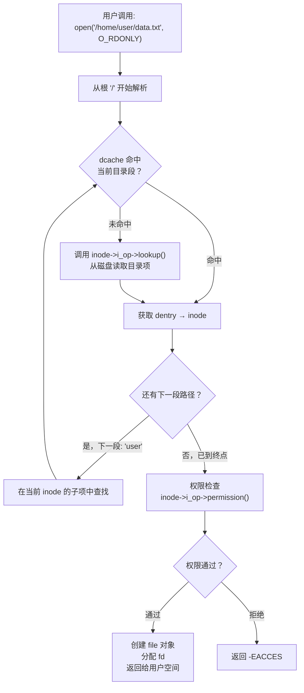
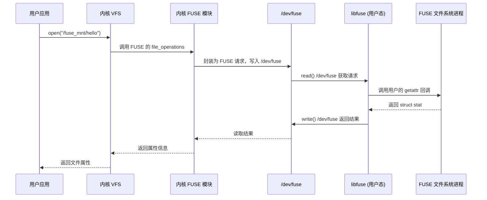
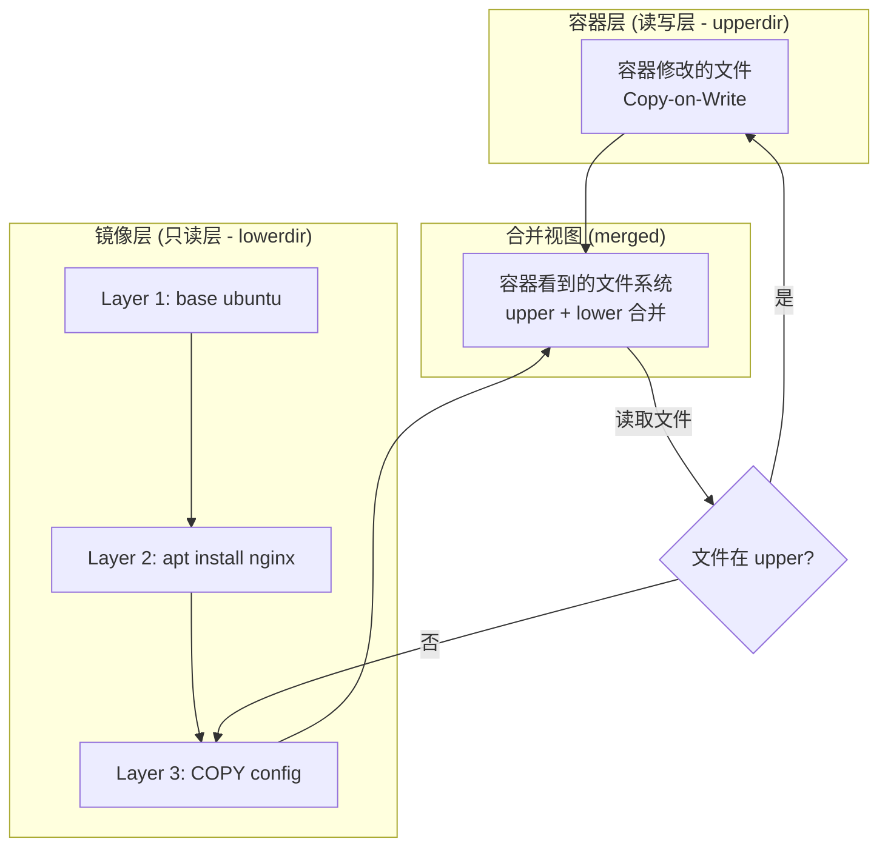

# 技巧1：VFS 虚拟文件系统层——理解与实践

> **本节定位**：理论基础部分已详细剖析 VFS 四大核心对象的数据结构与读写路径。本节从**实践视角**出发，聚焦"如何观察、调试、利用 VFS 层"，将内核原理转化为可操作的工程技能。

## 1. VFS 在存储栈中的位置

在 Linux 存储栈中，VFS 处于系统调用层与具体文件系统之间的关键位置。它不是简单的"中间转发层"，而是承担着路径解析、权限校验、资源管理、操作分发等核心职责。理解它的位置和职责，才能理解为什么 VFS 层的调试和优化如此重要。

### 1.1 存储栈全景

```mermaid
graph TB
    subgraph "用户空间 (User Space)"
        A["应用程序<br/>ls / cat / vim / nginx"]
    end

    subgraph "系统调用接口 (Syscall Interface)"
        B["open() / read() / write()<br/>stat() / chmod() / unlink()"]
    end

    subgraph "VFS 层 (本节核心)"
        C["路径解析 (path resolution)"]
        D["文件描述符管理 (fdtable)"]
        E["权限检查 (inode permission)"]
        F["操作分发 (f_op → 具体FS)"]
        G["页缓存管理 (address_space)"]
    end

    subgraph "具体文件系统 (Concrete FS)"
        H["ext4"]
        I["XFS"]
        J["Btrfs"]
        K["NFS"]
        L["procfs / sysfs"]
        M["FUSE (用户态FS)"]
    end

    subgraph "块设备层 (Block Layer)"
        N["IO 调度器<br/>mq-deadline / kyber / bfq"]
        O["块设备驱动"]
    end

    subgraph "硬件 (Hardware)"
        P["HDD / SSD / NVMe"]
    end

    A --> B --> C
    C --> D --> E --> F --> G
    G --> H &amp; I &amp; J &amp; K &amp; L &amp; M
    H &amp; I &amp; J &amp; K &amp; L &amp; M --> N --> O --> P
```

### 1.2 VFS 的三大核心职责

| 职责 | 说明 | 实际影响 |
|------|------|----------|
| **统一抽象** | 无论底层是 ext4、NFS 还是 procfs，上层看到的都是同一套接口 | `ls` 命令可以同时列出本地磁盘和远程 NFS 挂载的内容 |
| **操作分发** | 根据挂载点和文件系统类型，将系统调用路由到正确的 `file_operations` 实现 | `open()` 在 ext4 上触发磁盘 IO，在 procfs 上触发内核函数调用 |
| **资源管理** | 管理文件描述符表、引用计数、页缓存、inode 缓存、dentry 缓存 | 多进程共享同一文件时各自独立维护读写位置，同时共享底层 inode |

### 1.3 一次文件操作的完整路径

以 `open("/home/user/data.txt", O_RDONLY)` 为例，完整调用路径如下：

用户空间: open() libc 封装
    │  syscall 指令 (x86: int 0x80 或 sysenter)
    ▼
内核入口: do_sys_openat2()
    │  1. getname() — 从用户空间拷贝路径字符串
    │  2. get_unused_fd_flags() — 分配 fd 号
    ▼
VFS 层: do_filp_open()
    │  3. path_openat() → link_path_walk() → 路径解析
    │     对路径中每一段: d_lookup() 查 dcache → 未命中则 inode->i_op->lookup()
    │  4. lookup_open() → 创建 file 对象
    │  5. inode_permission() → 权限检查 (DAC + 可能的 SELinux/LSM)
    ▼
具体文件系统: ext4_file_open()
    │  6. ext4 的打开逻辑 (检查日志状态、分配必要资源等)
    ▼
返回: fd 号 (如 3), 用户空间通过 fd 访问 file 对象

**关键数据流**：路径字符串 → dentry 链 → inode → file 对象 → fd。理解这条链路，是排查所有文件系统问题的基础。

## 2. 四大对象的实践观察

理论基础中已经给出了四大对象的 C 结构体定义。本节聚焦**如何在运行时观察这些对象的状态**，这是排查文件系统问题的核心技能。

### 2.1 super_block 的观察

super_block 是每个挂载实例的全局信息载体。在调试挂载问题时，首先需要确认 super_block 的状态。

```bash
# 查看所有已挂载文件系统的 super_block 信息
cat /proc/mounts
# 或更详细的格式（包含挂载 ID、传播属性等）
findmnt

# 查看特定挂载点的详细信息（包含 super_block 中的关键字段）
findmnt -t ext4 /
# 输出示例：
# TARGET SOURCE  FSTYPE OPTIONS
# /      /dev/sda1 ext4  rw,relatime,errors=remount-ro,stripe=8192
```

```bash
# 查看文件系统全局统计（对应 super_operations 中的 statfs 实现）
stat -f /
# 输出包含：
#   Filesystem:     1927591340 (文件系统类型标识)
#   Block size:     4096        (s_blocksize)
#   Blocks:
#     Total: 6553600   (s_blocks_count)
#     Free:  12345678  (s_freeblocks_counter)
#     Available: 11234567
#   Inodes:
#     Total: 6553600   (s_inodes_count)
#     Free:  5432100   (s_freeinodes_counter)

# ext4 特有的超级块信息（可直接看到磁盘上的 super_block 副本）
dumpe2fs /dev/sda1 | head -50
```

**关键字段对应关系**：

| dumpe2fs 输出 | super_block 字段 | 含义 | 实用价值 |
|---------------|-----------------|------|----------|
| Block count | `s_blocks_count` | 文件系统总块数 | 计算总容量 |
| Inode count | `s_inodes_count` | 文件系统总 inode 数 | 判断 inode 是否充足 |
| Block size | `s_blocksize` | 块大小（通常 4KB） | 影响 IO 最小粒度 |
| Filesystem features | `s_feature_*` 系列 | 文件系统特性标志 | 判断是否支持 extent、dir_index 等 |
| Free blocks | `s_freeblocks_counter` | 空闲块数 | 监控磁盘使用 |
| Reserved blocks | `s_r_blocks_count` | 保留块数（默认 5%） | 紧急恢复用空间 |
| Mount count | `s_mnt_count` | 挂载次数 | 触发 fsck 的依据之一 |

```bash
# 查看保留块配置（为什么 df 显示有空间但 root 也无法写入）
tune2fs -l /dev/sda1 | grep "Reserved"
# 输出：Reserved block count: 327680 (约占总空间的 5%)
# 保留块只为 root 用户服务，防止磁盘满时系统无法运行
# 紧急情况下可释放：tune2fs -m 0 /dev/sda1（不推荐生产环境）
```

### 2.2 inode 的观察

inode 是文件元数据的核心，但**文件名不在 inode 中**（文件名作为 dentry 条目存储在父目录的数据块中）。这个区分是理解 VFS 的关键。

```bash
# 查看文件的 inode 号
ls -i /etc/passwd
# 输出: 131073 /etc/passwd

# 查看 inode 的完整元数据
stat /etc/passwd
# 输出包含：
#   File: /etc/passwd
#   Size: 2456       Blocks: 8          IO Block: 4096   regular file
#   Device: 10302h/66306d   Inode: 131073    Links: 1
#   Access: (0644/-rw-r--r--)  Uid: (    0/    root)   Gid: (    0/    root)
#   Access: 2025-12-15 10:23:45.123456789 +0800   ← atime（最后访问时间）
#   Modify: 2025-06-20 14:30:22.987654321 +0800   ← mtime（最后修改时间）
#   Change: 2025-06-20 14:30:22.987654321 +0800   ← ctime（最后状态变更时间）
#   Birth: 2025-01-01 08:00:00.000000000 +0800   ← 创建时间（ext4+支持）
```

**三种时间戳的区分**（面试和实战中极易混淆）：

| 时间戳 | 字段 | 更新时机 | 受 noatime 影响 | 受 chmod 影响 |
|--------|------|----------|----------------|--------------|
| atime | 最后访问时间 | 读取文件内容时 | ✅ 不再更新 | ❌ |
| mtime | 最后修改时间 | 修改文件内容时 | ❌ | ❌ |
| ctime | 最后变更时间 | 修改元数据时（权限/所有者/内容） | ❌ | ✅ 更新 |

```bash
# 查看 inode 中的扩展属性
getfattr -d -m '.*' /etc/passwd

# 查看文件系统中 inode 的使用情况
df -i
# 输出示例：
# Filesystem      Inodes  IUsed   IFree IUse% Mounted on
# /dev/sda1      6553600 1121500 5432100   18% /
```

```bash
# 查看目录 inode 中存储的文件名条目（dentry 的磁盘形式）
debugfs -R 'ls -l /etc' /dev/sda1 2>/dev/null | head -20
# 输出包含每个文件的 inode 号和文件名
# 这直接展示了"文件名存储在父目录的数据块中"这一事实
```

**inode 观察的典型场景——inode 耗尽**：

```bash
# 场景：df -h 显示磁盘还有空间，但无法创建文件
# 原因：inode 已耗尽
df -i /var/log
# 如果 IUse% = 100%，说明 inode 耗尽

# 排查：找出占用最多 inode（即文件数最多）的目录
find /var/log -xdev -printf '%h\n' | sort | uniq -c | sort -rn | head -10
# 输出示例：
# 158234 /var/log/journal
#  98234 /var/log/syslog
#  12345 /var/log/nginx
```

```bash
# 为什么 inode 会耗尽？
# 根本原因：inode 数量在格式化时就固定了（mkfs.ext4 -i 4096）
# 默认比例约 1 个 inode / 4KB 空间
# 如果有大量小文件（如邮件队列、缓存文件、日志碎片），inode 会先于磁盘空间耗尽

# 解决方案（按优先级排列）：
# 1. 清理不需要的小文件（首选）
find /var/spool -name "*.tmp" -mtime +7 -delete

# 2. 重新格式化（无法动态增加 inode）
# 备份数据 → mkfs.ext4 -i 2048（每 2KB 一个 inode）→ 恢复数据

# 3. XFS 等文件系统支持更灵活的 inode 分配
# XFS 不需要预设 inode 数量，按需分配
```

### 2.3 dentry 的观察

dentry 是 VFS 中最常被缓存的对象。dcache（dentry 缓存）的效率直接影响路径解析速度——一次 dcache 命中的路径查找只需纳秒级，而未命中则可能触发毫秒级的磁盘 IO。

```bash
# 查看 dcache 使用情况
cat /proc/sys/fs/dentry-state
# 输出: total_dentries  unused_dentries  age_limit  want_pages  negative_dentries  unused_nodenames
# 各字段含义：
#   total_dentries:     系统中 dentry 总数（含正在使用的和可回收的）
#   unused_dentries:    未使用的 dentry 数（在 LRU 列表中，内存紧张时可回收）
#   age_limit:          dentry 缓存的最大年龄（秒），超过此时间未使用的会被回收
#   want_pages:         内核期望的缓存页数（反映 dcache 内存压力）
#   negative_dentries:  负向 dentry 数（记录"不存在的文件名"缓存）
#   unused_nodenames:   未使用的节点名缓存
```

**负向 dentry 的工作原理**：

当你执行 `ls /nonexistent/file` 时，VFS 不仅会在 dcache 中缓存"不存在"的结果（负向 dentry），还会在后续查询中直接返回 `-ENOENT`，避免重复的磁盘查找。这是一个重要的优化——对于频繁访问不存在路径的场景（如 Web 服务器的 404 请求），负向 dentry 可以将查找延迟从毫秒级降到纳秒级。

```bash
# 实验：观察负向 dentry 的效果
# 第一次查找不存在的文件（触发磁盘 IO，较慢）
time ls /nonexistent/file 2>&amp;1

# 第二次查找同一个不存在的文件（dcache 命中负向 dentry，极快）
time ls /nonexistent/file 2>&amp;1
# 第二次的速度通常快 10-100 倍

# 用 strace 精确追踪
strace -T -e trace=openat ls /nonexistent/file 2>&amp;1 | grep -v "ENOENT"
# 第一次: openat(AT_FDCWD, "/nonexistent/file", ...) = -1 ENOENT <0.000234>
# 第二次: openat(AT_FDCWD, "/nonexistent/file", ...) = -1 ENOENT <0.000008>
```

```bash
# dcache 的内存回收机制
# 当系统内存紧张时，内核通过 shrink_dcache() 回收未使用的 dentry
# 查看 dcache 占用的内存
cat /proc/meminfo | grep -i dentry
# Slab: 行中包含 dentry 缓存

# 手动触发 dcache 回收（不推荐在生产环境）
echo 2 > /proc/sys/vm/drop_caches  # 释放 dentry + inode 缓存
```

### 2.4 file 对象的观察

file 对象代表**已打开的文件实例**。每次 `open()` 调用都会创建一个新的 file 对象，即使打开的是同一个文件。file 对象中包含读写位置（`f_pos`）、打开模式（`f_mode`）、指向 inode 的引用（`f_inode`）等关键信息。

```bash
# 查看特定进程打开的所有文件（file 对象的 fd 视图）
ls -la /proc/$(pidof sshd)/fd | head -20
# 输出示例：
# lrwx------ 1 root root 64 Jun 15 10:00 0 -> /dev/null
# lrwx------ 1 root root 64 Jun 15 10:00 1 -> socket:[12345]
# lrwx------ 1 root root 64 Jun 15 10:00 2 -> /var/log/auth.log
# 每一行对应一个 file 对象，fd 号是进程本地的索引

# 查看 file 对象的详细信息（包含 f_pos、f_mode 等）
cat /proc/$(pidof sshd)/fdinfo/0 2>/dev/null
# 输出包含：
#   pos:    0          ← 当前读写位置（f_pos）
#   flags:  0200000    ← 打开标志（O_WRONLY 等）
#   mnt_id: 15         ← 所在挂载点 ID
#   ino:    3          ← 对应的 inode 号
```

```bash
# 查看系统级 file 对象统计
cat /proc/sys/fs/file-nr
# 输出: allocated  max  used
#   allocated: 当前已分配的 file 结构体数量
#   max:       系统允许的最大 file 数量（64位系统：9223372036854775807）
#   used:      当前实际使用的数量

# 两者的差值说明：allocated - used = 未使用但在 free list 中的 file 对象
# 当 free list 耗尽时，新的 open() 会触发分配新的 file 结构体
```

```bash
# 实时监控文件打开/关闭事件
# 方法1：使用 bpftrace（推荐，精确追踪）
sudo bpftrace -e '
tracepoint:syscalls:sys_exit_openat {
    if (retval >= 0) {
        printf("OPEN  pid=%d comm=%s fd=%d\n", pid, comm, retval);
    }
}
tracepoint:syscalls:sys_enter_close {
    printf("CLOSE pid=%d comm=%s fd=%d\n", pid, comm, args->fd);
}'

# 方法2：使用 perf（系统级统计）
sudo perf record -e 'syscalls:sys_enter_openat,syscalls:sys_enter_close' -a sleep 5
sudo perf script | head -20
```

### 2.5 四大对象的关系图

理解四大对象之间的引用关系，是理解 VFS 生命周期管理的关键：

```mermaid
graph LR
    subgraph "进程 A"
        FD1["fd 0 → file@1"]
        FD2["fd 3 → file@1"]
    end

    subgraph "进程 B"
        FD3["fd 0 → file@2"]
    end

    subgraph "file 对象"
        F1["file@1<br/>f_pos=1024<br/>f_mode=O_RDONLY"]
        F2["file@2<br/>f_pos=0<br/>f_mode=O_RDWR"]
    end

    subgraph "dentry 缓存"
        D1["dentry: /home/user/data.txt"]
    end

    subgraph "inode"
        I1["inode@100<br/>mode=0644<br/>size=4096<br/>nlink=1<br/>i_count=2"]
    end

    subgraph "数据块"
        B1["block 1024, 1025, 1026"]
    end

    FD1 &amp; FD2 --> F1
    FD3 --> F2
    F1 &amp; F2 --> D1
    D1 --> I1
    I1 --> B1
```

**要点**：两个进程通过不同的 fd 和 file 对象共享同一个 inode。每个 file 对象维护独立的 `f_pos`（读写位置），所以 `tail -f` 在两个终端中互不影响。

## 3. VFS 路径解析：从字符串到 inode

路径解析是 VFS 最核心的操作之一。理解它的机制，能帮助你理解为什么某些路径操作特别慢，以及如何优化。

### 3.1 路径解析流程



**逐层解析示例**：

路径: /home/user/data.txt

1. 解析 "/":
   root dentry → root inode（从挂载点的 super_block 获取）

2. 解析 "home":
   dcache 查找 "/" 下的 "home" 子项
   ├── 命中 → 获取 "home" 的 dentry → inode
   └── 未命中 → inode->i_op->lookup(root_inode, "home") → 磁盘 IO → 返回 dentry

3. 解析 "user":
   在 "home" 的 inode 中查找 "user"（重复步骤 2）

4. 解析 "data.txt":
   在 "user" 的 inode 中查找 "data.txt"（重复步骤 2）

5. 最终 inode:
   权限检查 → 创建 file 对象 → 分配 fd → 返回

### 3.2 路径解析的性能关键点

```bash
# 观测路径解析的延迟
# 方法1: 使用 strace 追踪 open 系统调用
strace -T -e trace=openat ls /etc/passwd
# 输出示例：
# openat(AT_FDCWD, "/etc/passwd", O_RDONLY) = 3 <0.000012>
# <0.000012> 表示该系统调用耗时 12 微秒

# 方法2: 使用 perf 追踪路径解析的内核热点函数
sudo perf record -g -e 'd_lookup,d_lookup_done' -a sleep 1
sudo perf report
# 关注 d_lookup → d_hash_and_lookup → __d_lookup 调用链

# 方法3: 使用 bpftrace 精确测量路径解析延迟
sudo bpftrace -e '
kprobe:vfs_open {
    @start[tid] = nsecs;
}
kretprobe:vfs_open /@start[tid]/ {
    $us = (nsecs - @start[tid]) / 1000;
    @open_latency = hist($us);
    delete(@start[tid]);
}'
# 运行一段时间后查看直方图：@open_latency
```

**路径解析性能的影响因素**：

| 因素 | 影响 | 量化数据 | 优化方法 |
|------|------|----------|----------|
| 路径深度 | 每多一级目录增加一次 dcache 查找 | 每级 ~100ns (dcache hit) | 减少不必要的嵌套层级 |
| dcache 命中率 | 未命中触发磁盘 IO，延迟增加 1000x+ | hit: ~100ns vs miss: ~5ms (HDD) | 保持工作集在 dcache 中 |
| 目录大小 | 目录 inode 中的条目数影响查找效率 | 超过 ~10K 条目后线性退化 | 大目录使用 dir_index（ext4 htree） |
| 负向 dentry | 不存在的路径也缓存，但有上限 | 与正向 dentry 共享内存配额 | 避免大量不存在路径的频繁查询 |
| 符号链接 | 每个符号链接增加额外的路径解析 | 每层 symlink ~200ns | 减少长链式符号链接 |
| NFS/网络文件系统 | 网络往返延迟 | ~1-10ms per lookup | 使用缓存或本地副本 |

### 3.3 符号链接与挂载点的特殊处理

```bash
# 符号链接解析
ls -la /usr/bin/python3
# lrwxrwxrwx 1 root root 9 Mar 15 10:00 /usr/bin/python3 -> python3.11

# VFS 解析流程（逐层展开）：
# 1. 查找 /usr/bin/ 中 "python3" 的 dentry
# 2. 发现 dentry 的 inode 类型为 S_IFLNK（符号链接）
# 3. 读取链接目标 "python3.11"
# 4. 以 /usr/bin/ 为起点重新解析 "python3.11"
# 5. 获取最终的 inode

# 注意：Linux 有符号链接跟随次数限制（MAXSYMLINKS = 40）
# 这防止了循环符号链接导致内核栈溢出
```

```bash
# 交叉挂载点处理
mount /dev/sdb1 /mnt/data
ls /mnt/data/
# VFS 在解析路径时，遇到挂载点会切换到新文件系统的 root dentry
# 这是通过 dentry 的 d_mounted 标志实现的

# 观察挂载点层次结构
cat /proc/self/mountinfo | head -10
# 输出格式：
# 36 35 98:0 /mnt1 /mnt2 rw,noatime master:1 - ext3 /dev/root rw,errors=continue
# 各字段含义：
#   mount_id:   挂载 ID（每个挂载点唯一）
#   parent_id:  父挂载 ID（形成挂载点树）
#   major:minor: 设备号
#   root:       挂载源在文件系统中的根路径
#   mountpoint: 挂载点路径
#   options:    挂载选项
#   fs_type:    文件系统类型
#   mount_source: 挂载源设备
```

```bash
# mountinfo 中隐藏的重要信息：传播属性
# propagation 决定了挂载事件如何在挂载点之间传播
cat /proc/self/mountinfo | grep shared
# shared:N  — 共享挂载（容器场景常用）
# slave:N   — 从属挂载（跟随传播但不反向传播）
# private   — 私有挂载（完全隔离，Docker 默认）
# unbindable — 不可绑定挂载

# 这在容器隔离中至关重要：
# mount --make-private /  → 容器内的挂载不影响宿主机
# mount --make-shared /   → 容器间共享挂载（Kubernetes 使用）
```

## 4. VFS 关键机制的实践

### 4.1 文件描述符管理

文件描述符是进程与 file 对象之间的映射。理解 fd 的管理机制对排查 "Too many open files" 错误至关重要。

```bash
# 系统级 fd 限制
cat /proc/sys/fs/file-nr
# 输出: 16384  0  9223372036854775807
#   16384: 已分配的 fd 数量
#   0:     未使用（free list 为空）
#   9223372036854775807: 系统最大 fd 数量（64位系统，理论上无限）

# 进程级 fd 限制
ulimit -n
# 默认值通常为 1024

# 查看进程的最大 fd 限制
cat /proc/$(pidof sshd)/limits | grep "Max open files"
# Max open files    65536    65536    files

# 内核最大值（单进程可设置的上限）
cat /proc/sys/fs/nr_open
# 1048576 (1M)
```

**fd 分配机制详解**：

进程调用 open() → 内核查找 fd 表中的最小空闲位
    ├── 扫描进程的 fd 位图（bitmap）
    ├── 找到第一个为 0 的位 → 分配该 fd 号
    └── fd 号映射到 file 对象指针

这也是为什么文件描述符总是从 0、1、2... 递增分配：
    fd 0 → stdin  (标准输入)
    fd 1 → stdout (标准输出)
    fd 2 → stderr (标准错误)
    fd 3 → 第一个打开的文件
    ...

```bash
# 实战：排查 "Too many open files" 错误
# 第一步：确认是哪个进程的 fd 耗尽
for pid in $(ls /proc | grep -E '^[0-9]+$'); do
    count=$(ls /proc/$pid/fd 2>/dev/null | wc -l)
    limit=$(cat /proc/$pid/limits 2>/dev/null | grep "Max open files" | awk '{print $4}')
    if [ "$count" -gt "$((limit * 80 / 100))" ] 2>/dev/null; then
        echo "PID=$pid FD=$count LIMIT=$limit PROCESS=$(cat /proc/$pid/cmdline 2>/dev/null | tr '\0' ' ')"
    fi
done

# 第二步：查看该进程打开了哪些类型的文件
ls -la /proc/<PID>/fd | awk '{print $NF}' | sed 's|.*\[/||;s|\]||' | sort | uniq -c | sort -rn | head -20
# 常见的 fd 泄漏模式：
#   大量 socket:[inode] → 网络连接未关闭
#   大量 pipe:[inode]   → 子进程管道未关闭
#   大量 /path/to/file  → 文件句柄未关闭
```

```bash
# 第三步：找到具体泄漏位置
# 使用 lsof 查看 fd 的详细信息
lsof -p <PID> | awk '$4 == "txt" {print $0}'  # 只看文件类 fd
lsof -p <PID> -i -a                           # 只看网络连接

# 检查文件锁（POSIX 锁和 BSD 锁）
cat /proc/locks
# 输出示例：
# 1: FLOCK  ADVISORY  WRITE 12345 08:01:131073 0 EOF
# 各字段：锁ID  类型(FLOCK/POSIX)  模式(READ/WRITE)  PID  设备:inode  起始  结束

# 第四步：设置合理的限制
# /etc/security/limits.conf
# <domain>  <type>  <item>  <value>
# *          soft    nofile  65536
# *          hard    nofile  65536

# systemd 服务的限制（更现代的方式）
# [Service]
# LimitNOFILE=65536
```

### 4.2 页缓存与 VFS 的交互

页缓存（Page Cache）是 VFS 性能优化的核心机制。所有文件读取都先经过页缓存——命中则直接返回内存数据（纳秒级），未命中才触发磁盘 IO（毫秒级）。

```bash
# 查看系统页缓存使用情况
free -h
# 输出中的 "buff/cache" 列 = 页缓存 (page cache) + 块设备缓冲 (buffer cache)
# buffer cache 用于块设备元数据（superblock、inode block 等）

# 查看特定文件的页缓存状态
vmtouch -v /etc/passwd
# 输出示例：
#           Files: 1
#     Directories: 0
#   Resident Pages: 1/1  4.0K/4.0K  100%    ← 100% 在页缓存中
#          Elapsed: 0.0034 seconds

# 查看 inode 的 address_space（页缓存映射信息）
cat /proc/sys/fs/inode-nr
# 输出: nr_inodes  nr_unused
#   nr_inodes: 系统中已分配的 inode 总数
#   nr_unused: 未使用的 inode 数
```

```bash
# 页缓存调优参数（sysctl 命名空间 vm.dirty_*）
cat /proc/sys/vm/dirty_ratio
# 默认值：20（脏页占可用内存的 20% 时，写入进程被阻塞等待写回）

cat /proc/sys/vm/dirty_background_ratio
# 默认值：10（脏页占可用内存的 10% 时，后台 writeback 线程开始写回）

cat /proc/sys/vm/dirty_expire_centisecs
# 默认值：3000（30秒，超过此时间的脏页必须写回磁盘）

cat /proc/sys/vm/dirty_writeback_centisecs
# 默认值：500（5秒，writeback 线程的唤醒间隔）
```

**脏页参数的工作原理**：

写入操作 → 数据先进入页缓存（标记为 dirty）
    │
    ├── dirty_background_ratio 达到 → 后台线程开始异步写回
    │                                  （应用不受阻塞）
    │
    ├── dirty_ratio 达到 → 应用写入被强制同步
    │                      （延迟飙升，必须等脏页写回）
    │
    └── dirty_expire_centisecs 超过 → 脏页被强制写回
                                     （防止数据丢失）

```bash
# 生产环境优化建议

# 场景1：数据库服务器（低延迟写入，如 MySQL、PostgreSQL）
# 目标：脏页快速写回，避免 dirty_ratio 阻塞
sysctl -w vm.dirty_ratio=5
sysctl -w vm.dirty_background_ratio=1
sysctl -w vm.dirty_expire_centisecs=300
sysctl -w vm.dirty_writeback_centisecs=100
# 效果：写入延迟更稳定，但 IO 次数增加（适合 SSD）

# 场景2：日志服务器（高吞吐写入，如 ELK、Splunk）
# 目标：允许更多脏页积攒，合并写入减少 IO 次数
sysctl -w vm.dirty_ratio=40
sysctl -w vm.dirty_background_ratio=10
sysctl -w vm.dirty_expire_centisecs=5000
sysctl -w vm.dirty_writeback_centisecs=1000
# 效果：吞吐量更高，但延迟可能波动（适合 HDD 和高写入负载）

# 持久化配置
cat > /etc/sysctl.d/99-vm-dirty.conf << 'EOF'
vm.dirty_ratio = 5
vm.dirty_background_ratio = 1
vm.dirty_expire_centisecs = 300
vm.dirty_writeback_centisecs = 100
EOF
sysctl --system
```

### 4.3 VFS 操作的追踪

VFS 层提供了丰富的内核追踪点（tracepoints），是调试文件系统问题的利器。掌握这些工具，可以在不修改代码的情况下洞察 VFS 层的内部行为。

```bash
# === 方法1：strace（最简单，适合快速排查） ===
# 追踪 open 系统调用及其延迟
strace -T -e trace=openat,read,write ls /etc/passwd
# -T 选项显示每个系统调用的耗时

# 追踪特定进程的所有文件操作
strace -f -e trace=file -p $(pidof nginx)
# -f 选项跟踪子进程

# === 方法2：ftrace（内核内置，功能强大） ===
# 使用 trace-cmd（ftrace 的封装工具）
sudo trace-cmd record -e 'syscalls:sys_enter_openat' \
    -e 'syscalls:sys_exit_openat' sleep 5
sudo trace-cmd report | head -30

# 追踪 VFS 核心函数的调用延迟
sudo trace-cmd record -p function_graph \
    -g vfs_read -g vfs_write -g vfs_open sleep 3
sudo trace-cmd report
# 输出显示每个函数的调用时间和子函数调用链
```

```bash
# === 方法3：bpftrace（最灵活，适合深度分析） ===
# 追踪特定文件的 IO
sudo bpftrace -e '
kprobe:vfs_read {
    $path = str(((struct file *)arg0)->f_path.dentry->d_name.name);
    if ($path == "important_file") {
        printf("READ: %s pid=%d bytes=%d\n", $path, pid, arg2);
    }
}
kprobe:vfs_write {
    $path = str(((struct file *)arg0)->f_path.dentry->d_name.name);
    if ($path == "important_file") {
        printf("WRITE: %s pid=%d bytes=%d\n", $path, pid, arg2);
    }
}'

# 统计 VFS 层函数调用频率
sudo bpftrace -e '
kprobe:vfs_read { @reads = count(); }
kprobe:vfs_write { @writes = count(); }
kprobe:vfs_open { @opens = count(); }
interval:s:5 { print(@reads); print(@writes); print(@opens); clear(@reads); clear(@writes); clear(@opens); }'
```

```bash
# === 方法4：perf（系统级性能分析） ===
# 追踪文件系统事件（ext4 为例）
sudo perf record -e 'ext4:*' -a sleep 5
sudo perf report

# 查看 VFS 层的函数热点
sudo perf top -e cycles -g
# 按 Ctrl+F 搜索 vfs_read / vfs_write 查看热点函数

# === 方法5：auditd（安全审计场景） ===
# 配置审计规则
sudo auditctl -w /etc/passwd -p rwxa -k passwd_changes
# -w: 监控路径
# -p: 权限（r=读, w=写, x=执行, a=属性变更）
# -k: 标签（用于过滤）

# 查看审计日志
sudo ausearch -k passwd_changes
# 输出包含：时间、进程、系统调用、结果、调用者信息
```

## 5. FUSE：用户态文件系统

FUSE（Filesystem in Userspace）是 VFS 架构的重要延伸——它允许在用户空间实现文件系统，通过 `/dev/fuse` 字符设备与内核 VFS 层通信。

### 5.1 FUSE 的架构



### 5.2 常见的 FUSE 文件系统

| 文件系统 | 用途 | 性能特点 | 安装命令 |
|---------|------|----------|----------|
| sshfs | 通过 SSH 挂载远程目录 | open ~1-5ms, read ~网络延迟 | `apt install sshfs` |
| ntfs-3g | 读写 NTFS 分区 | 接近原生性能 | `apt install ntfs-3g` |
| encfs | 加密目录 | 有加密开销，已不推荐 | `apt install encfs` |
| mergerfs | 合并多个磁盘为一个挂载点 | 接近原生性能 | `apt install mergerfs` |
| gcsfuse | 挂载 Google Cloud Storage | 受网络带宽限制 | `apt install gcsfuse` |
| s3fs | 挂载 S3 存储 | 受网络带宽和 S3 API 限制 | `apt install s3fs` |
| squashfuse | 挂载 squashfs 镜像 | 只读，接近原生性能 | `apt install squashfuse` |

```bash
# 实战：使用 sshfs 挂载远程目录
sshfs user@remote:/path/to/dir /mnt/remote

# VFS 层的完整处理流程：
# 1. 用户调用 open("/mnt/remote/file.txt")
# 2. VFS 路径解析到 /mnt/remote 挂载点
# 3. VFS 通过 f_op 调用 FUSE 的 open 实现
# 4. FUSE 内核模块将请求序列化写入 /dev/fuse
# 5. sshfs 进程从 /dev/fuse 读取请求
# 6. sshfs 通过 SSH 协议在远程执行 open
# 7. 返回结果给 VFS，VFS 再返回给用户空间

# 性能对比（典型值）：
# 本地 ext4:    open() ~0.01ms, read() ~0.005ms/KB
# sshfs (LAN):  open() ~1-5ms,  read() ~0.02ms/KB
# sshfs (WAN):  open() ~50-200ms, read() ~0.1-1ms/KB
# s3fs:         open() ~10-100ms, read() 受分块大小影响
```

### 5.3 编写简单的 FUSE 文件系统

```c
// hello_fuse.c - 最简单的 FUSE 文件系统
// 演示 FUSE 如何通过回调函数与 VFS 层交互
#define FUSE_USE_VERSION 31
#include <fuse3/fuse.h>
#include <stdio.h>
#include <string.h>
#include <errno.h>
#include <fcntl.h>

// 内存中存储的 "文件" 内容
static const char *hello_str = "Hello, VFS!\n";
static const char *hello_path = "/hello";

// getattr 回调：VFS 在路径解析时调用，获取文件属性
// 对应 VFS 层的 inode->i_op->getattr()
static int hello_getattr(const char *path, struct stat *stbuf,
                         struct fuse_file_info *fi) {
    int res = 0;
    memset(stbuf, 0, sizeof(struct stat));

    if (strcmp(path, "/") == 0) {
        // 根目录：目录属性
        stbuf->st_mode = S_IFDIR | 0755;
        stbuf->st_nlink = 2;  // 目录的 nlink = 2（自身 + . 引用）
    } else if (strcmp(path, hello_path) == 0) {
        // hello 文件：普通文件属性
        stbuf->st_mode = S_IFREG | 0444;  // 只读
        stbuf->st_nlink = 1;
        stbuf->st_size = strlen(hello_str);
    } else {
        res = -ENOENT;  // 文件不存在
    }
    return res;
}

// readdir 回调：VFS 在 ls 时调用，列出目录内容
// 对应 VFS 层的 inode->i_op->readdir()
static int hello_readdir(const char *path, void *buf,
                         fuse_fill_dir_t filler, off_t offset,
                         struct fuse_file_info *fi,
                         enum fuse_readdir_flags flags) {
    if (strcmp(path, "/") != 0)
        return -ENOENT;

    // filler 用于向 VFS 填充目录条目
    // 每个 filler 调用相当于向 dcache 中添加一个 dentry
    filler(buf, ".", NULL, 0, 0);
    filler(buf, "..", NULL, 0, 0);
    filler(buf, "hello", NULL, 0, 0);
    return 0;
}

// read 回调：VFS 在 read() 时调用，读取文件内容
// 对应 VFS 层的 file->f_op->read()
// VFS 的页缓存管理对 FUSE 也是透明的
static int hello_read(const char *path, char *buf, size_t size,
                      off_t offset, struct fuse_file_info *fi) {
    if (strcmp(path, hello_path) != 0)
        return -ENOENT;

    size_t len = strlen(hello_str);
    if (offset >= len)
        return 0;  // EOF

    if (offset + size > len)
        size = len - offset;  // 不超过文件末尾

    memcpy(buf, hello_str + offset, size);
    return size;
}

// 操作表：将回调函数注册到 VFS
// VFS 通过 file_operations 结构体分发调用
static const struct fuse_operations hello_ops = {
    .getattr  = hello_getattr,   // → VFS: inode->i_op->getattr
    .readdir  = hello_readdir,   // → VFS: inode->i_op->iterate_shared
    .read     = hello_read,      // → VFS: file->f_op->read_iter
};

int main(int argc, char *argv[]) {
    return fuse_main(argc, argv, &amp;hello_ops, NULL);
}
```

```bash
# 编译和测试
gcc -o hello_fuse hello_fuse.c -lfuse3 -D_FILE_OFFSET_BITS=64
mkdir /mnt/hello
./hello_fuse /mnt/hello

# 测试
ls /mnt/hello/       # 输出: hello
cat /mnt/hello/hello  # 输出: Hello, VFS!

# 验证 FUSE 在 VFS 中的注册
mount | grep hello
# hello_fuse on /mnt/hello type fuse.sshfs (rw,nosuid,nodev,relatime,user_id=1000,group_id=1000)

# 卸载
fusermount3 -u /mnt/hello
```

## 6. VFS 性能调优实战

### 6.1 挂载选项调优

挂载选项是 VFS 层面最直接的调优手段。不同的选项影响页缓存行为、日志模式和 IO 特性。

```bash
# 查看当前挂载选项
mount | grep " / "
# 输出示例：
# /dev/sda1 on / type ext4 (rw,relatime,errors=remount-ro)

# ext4 常用挂载选项
mount -o noatime,nodiratime,data=writeback,barrier=0 /dev/sda1 /mnt/data

# XFS 常用挂载选项
mount -o noatime,logbufs=8,logbsize=256k,allocsize=64m /dev/sdb1 /mnt/data

# Btrfs 常用挂载选项
mount -o noatime,compress=zstd:3,ssd,discard=async /dev/nvme0n1p1 /mnt/data
```

**挂载选项对性能的影响**：

| 选项 | 性能影响 | 安全影响 | 推荐场景 |
|------|---------|---------|----------|
| `noatime` | 减少 5-15% 元数据写入 | 不记录访问时间 | 通用服务器（几乎所有场景推荐） |
| `nodiratime` | 减少目录访问的元数据写入 | 不记录目录访问时间 | 配合 noatime 使用 |
| `data=writeback` | 减少数据写入量 | 崩溃后可能读到旧数据 | 日志服务器、只读存储 |
| `data=ordered` | 默认模式，安全和性能平衡 | 数据在元数据之前写入 | 通用场景（默认推荐） |
| `barrier=0` | 减少写屏障等待 | 断电可能丢数据 | 仅在有硬件 RAID 缓存保护时使用 |
| `discard` | SSD 持续释放空闲块 | 无安全影响 | SSD（但可能导致性能抖动） |
| `commit=60` | 延长日志提交间隔 | 崩溃后数据丢失窗口增大 | 数据库（配合 fsync 保证一致性） |
| `allocsize=64m` | 预分配减少碎片 | 无安全影响 | XFS 大文件顺序写入 |

```bash
# 挂载选项的持久化（/etc/fstab）
# 格式：设备  挂载点  文件系统  选项  dump  fsck顺序
cat >> /etc/fstab << 'EOF'
# 高性能数据分区
/dev/nvme0n1p1  /data  ext4  defaults,noatime,nodiratime,data=ordered  0 2
# 日志分区（可以牺牲安全性换性能）
/dev/sdb1  /var/log  ext4  defaults,noatime,data=writeback,commit=60  0 2
EOF
```

### 6.2 IO 调度器选择

IO 调度器位于 VFS 下方的块层，但它的选择直接影响 VFS 层的 IO 性能。

```bash
# 查看当前 IO 调度器
cat /sys/block/sda/queue/scheduler
# 输出示例：[mq-deadline] kyber bfq none
# 方括号表示当前选中的调度器

# 切换调度器（立即生效，重启失效）
echo kyber > /sys/block/sda/queue/scheduler

# 持久化（通过 udev 规则）
cat > /etc/udev/rules.d/60-io-scheduler.rules << 'EOF'
# NVMe SSD: 使用 none（设备内部已有调度）
ACTION=="add|change", KERNEL=="nvme[0-9]*", ATTR{queue/scheduler}="none"
# SATA SSD: 使用 mq-deadline
ACTION=="add|change", KERNEL=="sd[a-z]", ATTR{queue/rotational}=="0", ATTR{queue/scheduler}="mq-deadline"
# HDD: 使用 mq-deadline
ACTION=="add|change", KERNEL=="sd[a-z]", ATTR{queue/rotational}=="1", ATTR{queue/scheduler}="mq-deadline"
EOF
```

**IO 调度器选择指南**：

| 设备类型 | 推荐调度器 | 原因 | 适用场景 |
|---------|-----------|------|----------|
| NVMe SSD | none | NVMe 内部有强大的并行调度，额外调度层只增加开销 | 数据库、高吞吐应用 |
| SATA SSD | mq-deadline | 平衡延迟和吞吐，deadline 保证公平性 | 通用服务器 |
| HDD | mq-deadline | 减少磁头寻道时间，保证读写公平 | 日志归档、备份 |
| HDD (桌面) | bfq | 预算公平队列，保证交互响应 | 桌面环境、开发机 |
| 虚拟化磁盘 | none / mq-deadline | 虚拟化层（如 KVM virtio）已有调度 | 云服务器 |

### 6.3 VFS 层性能综合调优

```bash
# 综合性能检查脚本
cat << 'SCRIPT' > /tmp/vfs-perf-check.sh
#!/bin/bash
echo "=== VFS 层性能综合检查 ==="
echo ""

echo "--- 1. 页缓存状态 ---"
free -h | grep -E "Mem|buff"
echo ""

echo "--- 2. 脏页参数 ---"
sysctl vm.dirty_ratio vm.dirty_background_ratio \
    vm.dirty_expire_centisecs vm.dirty_writeback_centisecs
echo ""

echo "--- 3. dcache 状态 ---"
cat /proc/sys/fs/dentry-state
echo ""

echo "--- 4. inode 状态 ---"
cat /proc/sys/fs/inode-nr
echo ""

echo "--- 5. fd 使用情况 ---"
cat /proc/sys/fs/file-nr
echo ""

echo "--- 6. IO 调度器 ---"
for dev in /sys/block/*/queue/scheduler; do
    echo "$dev: $(cat $dev)"
done
echo ""

echo "--- 7. 文件系统挂载选项 ---"
mount | grep -v "proc\|sys\|cgroup\|tmpfs" | head -10
echo ""
SCRIPT
chmod +x /tmp/vfs-perf-check.sh
bash /tmp/vfs-perf-check.sh
```

## 7. VFS 层常见问题排查

### 7.1 "Too many open files" 完整排查流程

```bash
# ===== 第一步：确认问题范围 =====
# 系统级 fd 统计
cat /proc/sys/fs/file-nr
# allocated    used
# 如果 allocated 接近 max，系统级 fd 耗尽

# 进程级 fd 统计（找出哪个进程有问题）
for pid in $(ls /proc | grep -E '^[0-9]+$'); do
    count=$(ls /proc/$pid/fd 2>/dev/null | wc -l)
    limit=$(cat /proc/$pid/limits 2>/dev/null | grep "Max open files" | awk '{print $4}')
    if [ "$count" -gt "$((limit * 80 / 100))" ] 2>/dev/null; then
        echo "PID=$pid FD=$count/$limit CMD=$(cat /proc/$pid/cmdline 2>/dev/null | tr '\0' ' ' | head -c 80)"
    fi
done | sort -t= -k3 -rn | head -10
```

```bash
# ===== 第二步：分析 fd 泄漏模式 =====
# 查看进程的 fd 类型分布
ls -la /proc/<PID>/fd 2>/dev/null | awk '{print $NF}' | \
    sed 's|.*\[||;s|\]||' | sort | uniq -c | sort -rn | head -20

# 典型泄漏模式识别：
# 模式 A: 大量 socket:[inode] → 网络连接未关闭
#   检查: lsof -p <PID> -i | wc -l
#   原因: 连接池未释放、HTTP keepalive 失败等

# 模式 B: 大量 /path/to/log → 日志文件未关闭
#   检查: lsof -p <PID> | grep "\.log" | wc -l
#   原因: logrotate 配置错误、日志句柄泄漏

# 模式 C: 大量 pipe:[inode] → 子进程管道未关闭
#   检查: ps --ppid <PID> | wc -l
#   原因: fork() 后父进程未 wait() 回收子进程

# 模式 D: 大量 /dev/null → 子进程标准流未关闭
#   检查: 检查是否大量 fork 子进程的守护进程
```

```bash
# ===== 第三步：实时追踪 fd 泄漏 =====
# 使用 inotifywait 追踪文件打开
sudo inotifywait -m -r /proc/<PID>/fd 2>/dev/null &amp;

# 使用 bpftrace 追踪 fd 创建/销毁
sudo bpftrace -e '
tracepoint:syscalls:sys_exit_openat / comm == "target_process" / {
    printf("FD_OPEN pid=%d fd=%d\n", pid, retval);
}
tracepoint:syscalls:sys_enter_close / comm == "target_process" / {
    printf("FD_CLOSE pid=%d fd=%d\n", pid, args->fd);
}'

# ===== 第四步：修复 =====
# 临时方案：调整限制
ulimit -n 65536  # shell 级
# /etc/security/limits.conf 持久化

# 根本方案：修复应用代码中的 fd 泄漏
# 使用 valgrind 的 fd 检测：valgrind --track-fds=yes ./myapp
```

### 7.2 inode 耗尽排查

```bash
# 确认 inode 耗尽
df -i /
# 输出：如果 IUse% = 100%，inode 已耗尽

# 找出 inode 消耗最多的目录
# 方法1：逐层扫描（准确但慢）
find / -xdev -printf '%h\n' 2>/dev/null | sort | uniq -c | sort -rn | head -20

# 方法2：使用 ncdu（更直观，支持交互浏览）
ncdu -x / 2>/dev/null

# 方法3：使用 find + du 组合（推荐用于生产环境）
for dir in /var /tmp /home /opt; do
    echo "=== $dir ==="
    find "$dir" -maxdepth 2 -xdev -printf '%h\n' 2>/dev/null | \
        sort | uniq -c | sort -rn | head -5
done
```

```bash
# 常见 inode 耗尽原因及解决方案：
#
# 1. /var/log/ 中大量小日志文件
#    原因：日志轮转配置不当
#    解决：配置 logrotate，定期清理
find /var/log -name "*.log.*" -mtime +30 -delete

# 2. /tmp/ 中未清理的临时文件
#    原因：程序异常退出未清理
#    解决：systemd-tmpfiles 定期清理
find /tmp -type f -mtime +7 -delete

# 3. 邮件系统中的大量小邮件
#    原因：邮件队列堆积
#    解决：清理 Postfix/Sendmail 队列
postsuper -d ALL  # 清理所有待发邮件

# 4. Docker overlay2 层
#    原因：大量容器/镜像产生大量小文件
#    解决：docker system prune -a --filter "until=72h"

# 5. Node.js 的 node_modules
#    原因：npm/yarn 依赖中大量小文件
#    解决：定期清理不用的 node_modules
```

### 7.3 VFS 层性能瓶颈定位

```bash
# ===== 系统化定位方法 =====

# 第1步：确认是 VFS 层瓶颈还是块层瓶颈
iostat -x 1 5
# 如果 %util < 50% 但延迟高 → VFS 层问题
# 如果 %util > 80%          → 块层/磁盘瓶颈

# 第2步：VFS 层函数级分析
sudo perf record -g -e cycles -p <PID> sleep 10
sudo perf report
# 关注：vfs_read / vfs_write / __d_lookup / inode_permission 等函数
```

```bash
# 第3步：使用 bpftrace 精确测量 VFS 延迟分布
sudo bpftrace -e '
kprobe:vfs_read {
    @start[tid] = nsecs;
}
kretprobe:vfs_read /@start[tid]/ {
    @read_us = hist((nsecs - @start[tid]) / 1000);
    delete(@start[tid]);
}
kprobe:vfs_write {
    @start_w[tid] = nsecs;
}
kretprobe:vfs_write /@start_w[tid]/ {
    @write_us = hist((nsecs - @start_w[tid]) / 1000);
    delete(@start_w[tid]);
}'
# 运行一段时间后查看：
# @read_us:  读操作延迟分布直方图
# @write_us: 写操作延迟分布直方图
# P99 > 1000us 说明存在严重的 VFS 延迟
```

```bash
# 第4步：检查 dcache 压力
# dcache 命中率低会导致路径解析延迟
sudo bpftrace -e '
kprobe:d_lookup {
    @dcache_miss[tid] = 1;
}
kprobe:d_lookup_done /@dcache_miss[tid]/ {
    @miss = count();
    delete(@dcache_miss[tid]);
}
kprobe:d_lookup /!@dcache_miss[tid]/ {
    @hit = count();
}'

# 第5步：检查页缓存命中率
# 使用 cachestat 工具（bcc 包含）
sudo cachestat 1
# 输出：
#   HITS   MISSES  DIRTIES  READ_HIT%  WRITE_HIT%
#   如果 READ_HIT% < 90%，说明读缓存命中率低
```

## 8. VFS 与命名空间（容器场景）

VFS 命名空间是理解容器隔离的关键——它决定了每个容器能看到哪些挂载点。

### 8.1 Mount Namespace

```bash
# 每个容器有独立的挂载命名空间
# 容器内的 mount 操作不会影响宿主机

# 查看进程的挂载命名空间
ls -la /proc/<PID>/ns/mnt
# lrwxrwxrwx 1 root root 0 Jun 15 10:00 mnt -> 'mnt:[4026532345]'

# 不同 PID 的挂载命名空间可能不同：
ls -la /proc/1/ns/mnt          # 宿主机 PID 1
ls -la /proc/$(docker inspect --format '{{.State.Pid}}' container)/mnt  # 容器
```

### 8.2 OverlayFS 与容器存储



```bash
# OverlayFS 的 VFS 层原理
mount -t overlay overlay \
    -o lowerdir=/lower,upperdir=/upper,workingdir=/working \
    /merged

# VFS 层的处理：
# 1. 读取 /merged/file.txt：
#    a. 先查 upperdir（可写层）
#    b. 未命中 → 查 lowerdir（只读层）
#    c. 合并返回结果
#
# 2. 写入 /merged/file.txt（Copy-on-Write）：
#    a. 如果文件在 lowerdir → 复制到 upperdir
#    b. 在 upperdir 中修改
#    c. 后续读取从 upperdir 获取
#
# 3. 删除文件（whiteout 机制）：
#    a. 在 upperdir 创建 char 0,0 的 whiteout 文件
#    b. VFS 层看到 whiteout 后隐藏 lowerdir 中的文件
#    c. 这是 POSIX 规范要求的"删除"语义

# 查看容器的 OverlayFS 挂载
mount | grep overlay
# 输出示例：
# overlay on /var/lib/docker/overlay2/abc123/merged type overlay
#     (rw,lowerdir=...,upperdir=...,workingdir=...)

# 查看 Docker overlay2 的层结构
ls /var/lib/docker/overlay2/
```

## 9. 常见误区与纠正

### 误区 1：认为 VFS 只是"中间层"，不值得关注

**真相**：VFS 层的性能影响远超预期。一次 `read()` 系统调用在 VFS 层的耗时通常在 1-10 微秒，但如果 dcache 未命中或需要路径解析，可能增加到 100 微秒甚至毫秒级别。对于高 QPS 的应用（如 Web 服务器），VFS 层的优化可以带来 10-30% 的性能提升。

**正确做法**：
```bash
# 监控 VFS 层关键指标
# 1. dcache 状态
cat /proc/sys/fs/dentry-state | awk '{print "total:", $1, "unused:", $2, "negative:", $5}'

# 2. inode 缓存状态
cat /proc/sys/fs/inode-nr | awk '{print "allocated:", $1, "unused:", $2}'

# 3. 页缓存命中率
free -h | grep Mem
# buff/cache 接近 Mem 总量说明页缓存利用率高
```

### 误区 2：混淆 fd 和 inode

**真相**：文件描述符（fd）是进程级别的，inode 是文件系统级别的。同一个文件可以有多个 fd（多个进程打开），也可以有多个 file 对象（同一进程多次 open），但只有一个 inode。

```bash
# 实验验证
# 终端 1：进程 A 读取文件
tail -f /var/log/syslog &amp;
PID1=$!
# 终端 2：进程 B 读取同一文件
tail -f /var/log/syslog &amp;
PID2=$!

# 查看：两个不同的 fd，指向同一个 inode
stat /proc/$PID1/fd/3 | grep Inode
stat /proc/$PID2/fd/3 | grep Inode
# 输出的 Inode 号完全相同
```

### 误区 3：认为 rm 命令立即删除文件

**真相**：`rm` 实际上是 `unlink()` 系统调用——它只移除目录项（dentry），减少 inode 的链接计数。只有当链接计数为零**且**没有进程持有该文件的 fd 时，inode 和数据块才真正释放。

```bash
# 演示：文件已删除但磁盘空间未释放
# 步骤 1：创建一个大文件并用进程打开
dd if=/dev/zero of=/tmp/bigfile bs=1M count=100
tail -f /tmp/bigfile &amp;
TAIL_PID=$!

# 步骤 2：删除文件
rm /tmp/bigfile

# 步骤 3：检查磁盘空间（文件已删除但空间未释放）
df -h /tmp
# 空间仍然被占用！

# 步骤 4：验证文件仍可读取
ls -la /proc/$TAIL_PID/fd/
# 仍然有一个指向 "deleted" 文件的 fd
cat /proc/$TAIL_PID/fd/3 | head -c 10
# 可以正常读取！

# 正确的释放方式：
# 方法 1：终止持有 fd 的进程
kill $TAIL_PID

# 方法 2：在进程内部关闭文件描述符（如果进程支持）
# 方法 3：截断文件（某些场景）
: > /proc/$TAIL_PID/fd/3  # 通过 /proc 截断（不推荐）
```

### 误区 4：认为 noatime 会丢失重要信息

**真相**：`noatime` 不影响 `mtime`（修改时间）和 `ctime`（变更时间），只影响 `atime`（访问时间）。对于服务器环境，`atime` 几乎没有实用价值，而每次访问都更新 `atime` 会产生大量元数据写入。

```bash
# 对比三种 atime 模式
mount -o atime /dev/sda1 /mnt/test    # 每次访问更新 atime（最慢）
mount -o relatime /dev/sda1 /mnt/test # 智能更新（Linux 2.6.30+ 默认）
mount -o noatime /dev/sda1 /mnt/test  # 从不更新（推荐服务器使用）

# relatime 的智能之处：
# 如果 atime < mtime → 更新 atime（确保 ls -l 显示合理的访问时间）
# 如果 atime >= mtime → 不更新（避免频繁写入）
# 这是 Linux 2.6.30+ 的默认行为，比 atime 快但比 noatime 慢

# 性能影响量化（10000 次读取操作）：
# atime:    ~10000 次元数据写入（每读一次写一次 atime）
# relatime: ~100-500 次元数据写入（只在首次读取时更新）
# noatime:  0 次元数据写入
```

### 误区 5：认为 O_DIRECT 总是比普通 IO 快

**真相**：O_DIRECT 绕过页缓存直接 IO，看起来应该更快，但实际上：

```bash
# O_DIRECT vs 普通 IO 的对比
# 普通 IO: 用户空间 → 页缓存 → 块层 → 磁盘
# O_DIRECT: 用户空间 → 块层 → 磁盘（跳过页缓存）

# 为什么 O_DIRECT 不一定更快？
# 1. 页缓存命中时，普通 IO 只需内存拷贝（纳秒级）
# 2. O_DIRECT 需要对齐到 512B 边界（内存分配限制）
# 3. O_DIRECT 每次 IO 都是同步的，无法利用预读优化

# O_DIRECT 真正有用的场景：
# - 数据库（如 MySQL InnoDB、PostgreSQL）使用自己的缓存
# - 大数据处理（如 Spark、Hadoop）只读一次的数据
# - 实时系统（需要确定性的 IO 延迟）

# 但是：对齐要求严格
# - 缓冲区地址必须对齐到 512 字节（或 4096 字节，取决于文件系统）
# - IO 大小必须是 512 字节的倍数
# - 文件偏移必须是 512 字节的倍数
# 不满足条件会返回 EINVAL
```

## 10. 最佳实践清单

| 实践 | 说明 | 优先级 | 适用场景 |
|------|------|--------|----------|
| 使用 noatime/relatime | 减少元数据写入，提升 5-15% 性能 | **高** | 所有服务器 |
| 合理设置 vm.dirty_ratio | 根据工作负载调整脏页策略 | **高** | 所有服务器 |
| 选择合适的 IO 调度器 | NVMe 用 none，HDD 用 mq-deadline | **高** | 所有服务器 |
| 监控 fd 和 inode 使用 | 防止资源耗尽导致服务中断 | **高** | 所有生产环境 |
| 使用 ftrace/perf 追踪 VFS | 定位性能瓶颈的利器 | 中 | 性能调优场景 |
| 理解 rm 的真实行为 | 避免"文件已删但空间未释放"的困惑 | 中 | 运维排障 |
| 配置 logrotate | 防止日志文件 inode 耗尽 | **高** | 日志量大的服务器 |
| 使用 /etc/fstab 管理挂载 | 确保重启后挂载选项生效 | **高** | 所有服务器 |
| 评估 FUSE 性能开销 | 用户态文件系统延迟不可忽视 | 中 | 使用 FUSE 的场景 |
| 评估 io_uring 适用性 | 高并发 IO 场景显著提升 | 低 | 高性能 IO 应用 |
| 使用 mountinfo 排查挂载 | 比 /proc/mounts 信息更丰富 | 中 | 容器/挂载问题排查 |
| 保留块调整（谨慎） | 紧急情况下可释放 5% 保留空间 | 低 | 磁盘空间紧张的紧急场景 |

## 11. 本节小结

VFS 是 Linux 文件系统的统一抽象层，掌握它的实践技能是排查文件系统问题的基础。本节从实践角度覆盖了以下核心内容：

**工具与观察**：
- **四大对象的运行时观察**：通过 /proc、debugfs、strace、bpftrace 等工具观察 super_block、inode、dentry、file 的实时状态
- **路径解析机制**：理解从字符串路径到 inode 的完整过程，以及影响解析性能的六大因素

**关键机制实践**：
- **文件描述符管理**：fd 分配机制、泄漏排查四步法、限制调整方法
- **页缓存交互**：脏页参数的工作原理、不同场景的调优策略
- **VFS 操作追踪**：strace → ftrace → bpftrace → perf → auditd 五级追踪方法论
- **命名空间与容器**：Mount Namespace 的隔离机制、OverlayFS 的 CoW 原理

**调优与排障**：
- **挂载选项调优**：noatime、data=writeback 等选项的性能与安全性权衡
- **IO 调度器选择**：根据设备类型选择合适的调度器
- **常见问题排查**：fd 泄漏、inode 耗尽、VFS 性能瓶颈的系统化定位方法
- **常见误区纠正**：rm 的真实行为、atime 的三种模式、O_DIRECT 的适用场景

**FUSE 用户态文件系统**：理解其架构原理、性能特点，以及编写简单 FUSE 文件系统的完整示例。

下一节将深入 inode 与数据块管理的实践技巧，理解文件数据在磁盘上的组织方式。
